# 🎯 Project Charter: Transformer from Scratch
## What You Are Building
A complete encoder-decoder Transformer architecture implemented from first principles—the same architecture that powers GPT, BERT, and virtually all modern language models. You will implement scaled dot-product attention with Query-Key-Value matrix operations, multi-head parallel processing with head splitting and concatenation, sinusoidal positional encodings, stacked encoder-decoder layers with residual connections and layer normalization, and efficient autoregressive generation with beam search and KV caching. By the end, your transformer will train on sequence-to-sequence tasks and generate outputs that match PyTorch reference implementations within numerical tolerance.
## Why This Project Exists
Most developers use transformer models as black boxes—calling `model.generate()` without understanding the matrix multiplications, reshape operations, and gradient flows that make it work. Building a transformer from scratch exposes the assumptions baked into every attention operation, reveals why scaling by √d_k prevents gradient vanishing, and shows how residual connections enable training deep networks. This is the architecture that revolutionized NLP, vision, and beyond—understanding it at the implementation level is essential for any ML engineer working with modern AI systems.
## What You Will Be Able to Do When Done
- Implement scaled dot-product attention with padding and causal masking from scratch
- Build multi-head attention with parallel head computation via tensor reshaping
- Design sinusoidal positional encodings that inject sequence order information
- Construct complete encoder and decoder layers with Pre-LN and Post-LN variants
- Train a transformer on a sequence-to-sequence task with learning rate warmup and gradient clipping
- Implement greedy decoding, beam search, and KV caching for efficient inference
- Verify correctness by comparing outputs against PyTorch reference implementations
## Final Deliverable
~2,500 lines of Python/PyTorch code across 25+ source files implementing the complete transformer architecture. Trains on a copy task with loss below 0.1 within 1000 steps. Generates sequences autoregressively with 2-5x speedup from KV caching. All components verified against PyTorch's built-in implementations with outputs matching within 1e-5 tolerance.
## Is This Project For You?
**You should start this if you:**
- Understand neural network fundamentals (backpropagation, loss functions, optimizers)
- Know linear algebra (matrix multiplication, transpose, softmax)
- Are comfortable with Python and PyTorch basics (tensors, autograd, nn.Module)
- Want to understand transformers at the implementation level, not just the API level
**Come back after you've learned:**
- Basic deep learning—take a course like fast.ai or Andrew Ng's ML course
- PyTorch fundamentals—work through the official PyTorch tutorials
- Matrix calculus—understand how gradients flow through matrix operations
## Estimated Effort
| Phase | Time |
|-------|------|
| Scaled Dot-Product Attention | ~4-6 hours |
| Multi-Head Attention | ~4-6 hours |
| FFN, Embeddings & Positional Encoding | ~4-6 hours |
| Encoder & Decoder Layers | ~5-8 hours |
| Full Transformer Assembly & Training | ~6-10 hours |
| Inference & Generation | ~6-10 hours |
| **Total** | **~35-55 hours** |
## Definition of Done
The project is complete when:
- All attention operations verified against PyTorch's F.scaled_dot_product_attention and nn.MultiheadAttention within 1e-5 tolerance
- Copy task training converges with loss below 0.1 within 1000 steps
- All parameters receive non-zero gradients after backward pass (gradient flow verified)
- Generated sequences on trained copy task model are correct for at least 90% of test inputs
- KV cache provides at least 2x speedup benchmarked against naive generation for 100-token sequences
- Complete TransformerGenerator interface supports greedy, beam, and sampling strategies

---

# 📚 Before You Read This: Prerequisites & Further Reading
> **Read these first.** The Atlas assumes you are familiar with the foundations below.
> Resources are ordered by when you should encounter them — some before you start, some at specific milestones.
---
## 🧮 Linear Algebra & Probability Foundations
### Before Starting the Project
**3Blue1Brown: Essence of Linear Algebra** (YouTube series)
- **When**: Read BEFORE starting — required foundational knowledge
- **Why**: Visual intuition for matrix operations, vector spaces, and transformations that underpin every attention calculation
- **Key videos**: Episodes 1-4 (vectors, matrices, linear transformations) and Episode 10 (eigenvectors—useful for understanding why positional encodings work)
- **Link**: youtube.com/playlist?list=PLZHQObOWTQDPD3MizzM2xVFitgF8hE_ab
**3Blue1Brown: Neural Networks** (YouTube series)
- **When**: Read BEFORE starting — required foundational knowledge
- **Why**: Builds intuition for gradient descent, backpropagation, and why neural networks can learn—essential for understanding why the Transformer trains at all
- **Key video**: Episode 3 (backpropagation) — you'll see why residual connections matter
- **Link**: youtube.com/playlist?list=PLZHQObOWTQDNU6R1_67000Dx_ZCJB-3pi
---
## 🔬 The Original Paper
### Read Before Milestone 1 (Scaled Dot-Product Attention)
**"Attention Is All You Need"** — Vaswani et al., 2017
- **Paper**: https://arxiv.org/abs/1706.03762
- **When**: Read BEFORE Milestone 1 — the canonical reference for everything you'll build
- **Why**: The gold standard. Every architecture decision (why 8 heads? why sqrt(d_k)? why sinusoidal PE?) is explained here
- **Focus sections**: 
  - Section 3 (Model Architecture) — read carefully
  - Section 5.1 (Training regime) — reference during Milestone 5
---
## 🧠 Deep Learning Fundamentals
### Read Before Milestone 1 or 2
**"Deep Learning"** — Goodfellow, Bengio, Courville (MIT Press)
- **When**: Read BEFORE starting, or alongside Milestone 1-2
- **Why**: The comprehensive textbook on neural network foundations
- **Key chapters**: 
  - Chapter 6 (Deep Feedforward Networks) — understand why FFNs are essential
  - Chapter 8 (Optimization) — understand why warmup matters
- **Spec**: Available free online at deeplearningbook.org
**"The Annotated Transformer"** — Harvard NLP
- **Code/Paper**: https://nlp.seas.harvard.edu/annotated-transformer/
- **When**: Read BEFORE Milestone 1 — line-by-line explanation of the original paper's code
- **Why**: Shows how the paper's formulas translate to actual PyTorch code with detailed comments
- **Best Explanation**: The section on "Scaled Dot-Product Attention" explains the sqrt(d_k) scaling better than any other resource
---
## 🎯 Attention Mechanism Deep Dives
### Read After Milestone 1 (Scaled Dot-Product Attention)
**"The Illustrated Transformer"** — Jay Alammar
- **Blog**: https://jalammar.github.io/illustrated-transformer/
- **When**: Read AFTER Milestone 1 — you'll have enough context to appreciate the visual breakdown
- **Why**: The clearest visual explanation of how self-attention, multi-head attention, and encoder-decoder flow work together
- **Best Explanation**: The diagram of attention weights as a heatmap makes the [seq_len, seq_len] score matrix intuitive
**"Attention? Attention!"** — Lilian Weng
- **Blog**: https://lilianweng.github.io/posts/2018-06-24-attention/
- **When**: Read AFTER Milestone 1 — fills in the history and variants of attention
- **Why**: Explains why attention replaced RNNs and connects to Bahdanau attention (the precursor)
- **Key insight**: Section on "Self-Attention" explains why Q, K, V decomposition works
---
## 🏗️ Architecture & Design Patterns
### Read After Milestone 2 (Multi-Head Attention)
**"Transformer Architecture: The Positional Encoding"** — Amirhossein Kazemnejad
- **Blog**: https://kazemnejad.com/blog/transformer_architecture_positional_encoding/
- **When**: Read BEFORE Milestone 3 — deep dive into why sinusoidal encodings work
- **Why**: Best explanation of the mathematical intuition behind the sin/cos formula
- **Key insight**: Explains how relative position can be derived from absolute position encodings
**"Layer Normalization"** — Ba et al., 2016
- **Paper**: https://arxiv.org/abs/1607.06450
- **When**: Read BEFORE Milestone 4 — understand why LayerNorm (not BatchNorm) is used
- **Why**: Explains why normalizing over features (not batch) is essential for variable-length sequences
---
## 📐 Residual Connections & Training Stability
### Read After Milestone 4 (Encoder & Decoder Layers)
**"Deep Residual Learning for Image Recognition"** — He et al., 2015 (ResNet)
- **Paper**: https://arxiv.org/abs/1512.03385
- **When**: Read AFTER Milestone 4 — you'll appreciate why residual connections enable deep training
- **Why**: The original paper introducing skip connections—explains the gradient highway that makes 100+ layer networks trainable
- **Key section**: Section 4.2 (Why residual works)
**"On Layer Normalization in the Transformer Architecture"** — Xiong et al., 2020
- **Paper**: https://arxiv.org/abs/2002.04745
- **When**: Read AFTER Milestone 4 — understand Pre-LN vs Post-LN trade-offs
- **Why**: Explains why GPT-2 uses Pre-LN while the original Transformer used Post-LN
- **Best Explanation**: The gradient analysis showing why Pre-LN is more stable
---
## 🏋️ Training & Optimization
### Read Before Milestone 5 (Full Transformer Assembly & Training)
**"Adam: A Method for Stochastic Optimization"** — Kingma & Ba, 2014
- **Paper**: https://arxiv.org/abs/1412.6980
- **When**: Read BEFORE Milestone 5 — understand the optimizer you'll use
- **Why**: Explains why Adam's adaptive learning rates work better than SGD for transformers
- **Note**: The Transformer uses β₂=0.98 (not the default 0.999)—understand why from the original Transformer paper
**"Rethinking the Inception Architecture for Computer Vision"** — Szegedy et al., 2015
- **Paper**: https://arxiv.org/abs/1512.00567
- **When**: Read BEFORE Milestone 5 — introduces label smoothing
- **Key section**: Section 3 (Label Smoothing)
- **Why**: Explains why overconfident predictions hurt generalization
---
## 🚀 Inference & Generation
### Read Before Milestone 6 (Inference & Generation)
**"Get To The Point: Summarization with Pointer-Generator Networks"** — See et al., 2017
- **Paper**: https://arxiv.org/abs/1704.04368
- **When**: Read BEFORE Milestone 6 — introduces beam search with length penalty
- **Key section**: Section 3.2 (Beam Search)
- **Why**: The (5 + length) / 6 formula for length penalty comes from this paper
**"The Curious Case of Neural Text Degeneration"** — Holtzman et al., 2019
- **Paper**: https://arxiv.org/abs/1904.09751
- **When**: Read BEFORE Milestone 6 — explains why sampling beats greedy
- **Why**: Explains why temperature, top-k, and top-p sampling prevent degenerate outputs
- **Best Explanation**: The "likelihood trap" section explains why maximizing probability doesn't maximize quality
---
## 📖 Reference Implementation
### Read Throughout the Project
**"Transformers from Scratch"** — Stephen Welch
- **Code/Video**: https://github.com/GoogleCloudPlatform/tensorflow-without-a-phd/tree/master/tensorflow-rnn-softmax
- **When**: Reference throughout — particularly for Milestones 1-4
- **Why**: Clean reference implementation with detailed comments
- **Best for**: Comparing your implementation against a known-correct version
**HuggingFace Transformers Source Code**
- **Code**: https://github.com/huggingface/transformers (specifically `src/transformers/models/bert/modeling_bert.py`)
- **When**: Reference AFTER completing each milestone — compare your code to production code
- **Why**: See how production-grade transformers handle edge cases, optimization, and documentation
- **Specific file**: `modeling_bert.py` lines 200-300 (attention implementation) — compare to your Milestone 2
---
## 🔧 Advanced Topics (Post-Project)
### Read After Completing All Milestones
**"RoFormer: Enhanced Transformer with Rotary Position Embedding"** — Su et al., 2021 (RoPE)
- **Paper**: https://arxiv.org/abs/2104.09864
- **When**: Read AFTER completing the project — understand how modern LLMs (LLaMA, Mistral) evolved from sinusoidal PE
- **Why**: RoPE is the modern replacement for sinusoidal encodings—understanding it requires mastering the original first
**"Efficient Transformers: A Survey"** — Tay et al., 2020
- **Paper**: https://arxiv.org/abs/2009.06732
- **When**: Read AFTER completing the project — survey of efficient attention variants
- **Why**: Explains sparse attention, linear attention, and why O(n²) attention is a bottleneck
**"FlashAttention: Fast and Memory-Efficient Exact Attention"** — Dao et al., 2022
- **Paper**: https://arxiv.org/abs/2205.14135
- **When**: Read AFTER Milestone 6 — understand the IO-aware optimization that makes modern LLMs practical
- **Why**: Explains why your implementation is slower than PyTorch's built-in attention

---

# Transformer from Scratch

Build the complete Transformer architecture from first principles—the same architecture that powers GPT, BERT, and virtually all modern language models. You'll implement scaled dot-product attention with its Query-Key-Value decomposition, multi-head parallel processing, sinusoidal positional encodings, and the full encoder-decoder stack with residual connections and layer normalization. The project culminates in training on a sequence-to-sequence task and implementing autoregressive generation with beam search and KV caching.

This is not about using nn.Transformer—it's about understanding every matrix multiplication, every reshape operation, and every gradient that flows through the model. You'll verify each component against PyTorch's reference implementations, building confidence that your understanding matches production-grade code.


<!-- MS_ID: transformer-scratch-m1 -->
# Scaled Dot-Product Attention
## The Heart of Every Transformer
You're about to implement the single most important computation in modern AI. Every GPT query, every BERT embedding, every translation you've ever seen from a neural network—it all flows through this exact operation. The math fits on one line. The implementation is under 20 lines of code. But understanding *why* this specific formula works—and why a seemingly arbitrary square root saves your model from training failure—will change how you think about neural networks.
Let's build it from first principles.
---
## The Tension: How Do Tokens "Talk" to Each Other?
Consider a sentence: *"The bank approved the loan because the financial records were solid."*
When you read "bank," how do you know it's a financial institution rather than a river bank? The word "bank" alone is identical in both cases. You know it's financial because of *other words* in the sentence: "approved," "loan," "financial," "records."
**The fundamental problem of sequence modeling**: each position in a sequence needs to gather information from other positions—but which ones matter? In an RNN, information flows sequentially through hidden states. Every token sees a compressed summary of everything before it. But this has a fatal flaw: information from position 1 has to survive through positions 2, 3, 4, ... to reach position 100. It's a game of telephone where the message degrades at every step.
Transformers solve this with a radical idea: **every token can directly attend to every other token in a single step**. No sequential bottleneck. No information degradation. Position 100 can "look at" position 1 just as easily as position 99.
But "looking at" is vague. What does that actually *mean*, mathematically?


---
## The Query-Key-Value Metaphor
Before diving into matrices, let's build intuition with an analogy that maps directly to the math.
Imagine a library. You walk in with a **query**: "I need books about neural networks." The library has millions of books, each with a **key** written on its spine: title, author, subject. You compare your query against every key. Some match well (high similarity), some don't (low similarity). Based on these match scores, you retrieve the **values**—the actual book contents.
Attention works identically:
| Library Concept | Attention Equivalent | Shape |
|----------------|---------------------|-------|
| Your query | Query vector Q | `[batch, seq_len, d_k]` |
| Book spine (key) | Key vector K | `[batch, seq_len, d_k]` |
| Book contents (value) | Value vector V | `[batch, seq_len, d_v]` |
| Match score | Q · K^T (dot product) | `[batch, seq_len, seq_len]` |
| Retrieved content | Weighted sum of V | `[batch, seq_len, d_v]` |
The dot product between a query and a key measures their *similarity*—how well they "match." A high dot product means "this key is relevant to my query."

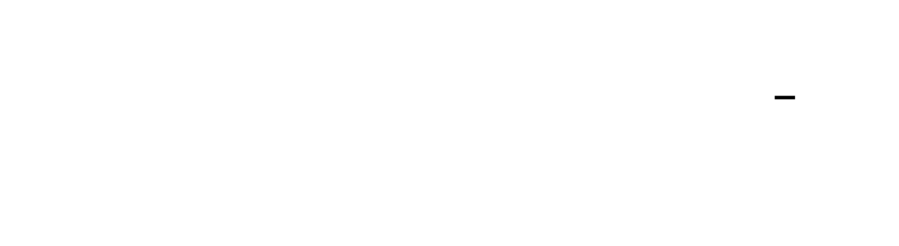

---
## From Intuition to Matrices
Now let's make this concrete. You have an input sequence of token embeddings—let's say a batch of 32 sentences, each with 20 tokens, each token represented by a 512-dimensional embedding vector.
**Input shape**: `[batch=32, seq_len=20, d_model=512]`
From this input, you project three different views via learned linear transformations:
```python
# Each projection is a learned nn.Linear layer
W_Q = nn.Linear(d_model, d_k)  # Query projection
W_K = nn.Linear(d_model, d_k)  # Key projection  
W_V = nn.Linear(d_model, d_v)  # Value projection
# Forward pass: project input into Q, K, V
Q = W_Q(x)  # [batch, seq_len, d_k]
K = W_K(x)  # [batch, seq_len, d_k]
V = W_V(x)  # [batch, seq_len, d_v]
```

> **🔑 Foundation: Tensor dimension semantics**
>
> Tensor dimension semantics describe the meaning assigned to each dimension of a multi-dimensional array, dictating how data is organized. Choosing the right dimension order is crucial for efficient processing and correct interpretation by downstream operations. Our project requires careful data ordering to optimize matrix multiplication operations and facilitate effective batching of sequences. Think of tensors as stacks of matrices. The first dimension usually indicates the number of stacks (batches), while the remaining dimensions represent the rows and columns within each stack.


> **🔑 Foundation: Tensor dimension semantics**
>
> Tensors are multi-dimensional arrays. In deep learning, the order of these dimensions often carries crucial semantic meaning.  For example, a 3D tensor might represent a batch of sequences, where each sequence has a certain number of features (batch x seq x feature), or a batch where each item has its features organised across a sequence dimension (batch x feature x seq).

Understanding the intended meaning of each dimension is critical for correctly processing data, especially when feeding tensors to libraries like PyTorch or TensorFlow. Our current project requires processing sequential data, where each item in a batch has multiple time steps, and each time step has a vector of features, so keeping track of batch, sequence length, and feature dimensions is paramount to ensure that the computations are correctly applied.

Think of tensor dimensions like named arguments to a function.  Just as the order of arguments matters, so too does the order of tensor dimensions. A mismatch in dimension order leads to incorrect calculations and, ultimately, a broken system.

Notice that Q and K share the same dimension `d_k` (they need to be compatible for dot products), while V has dimension `d_v`. In the original transformer, `d_k = d_v = d_model / num_heads = 64`, but we'll explore multi-head attention in the next milestone.
### The Attention Score Matrix
Here's where the magic happens. You want to compute how much each token "attends to" every other token. That means computing the dot product between every query and every key:
```
Score[i,j] = Q[i] · K[j]
```
In matrix form, this is `Q @ K^T`:
```python
# Q: [batch, seq_len, d_k]
# K: [batch, seq_len, d_k]
# K.transpose(-2, -1): [batch, d_k, seq_len]
# Q @ K^T: [batch, seq_len, seq_len]
scores = Q @ K.transpose(-2, -1)
```
The result is a `[batch, seq_len, seq_len]` matrix where entry `[i, j]` contains the raw attention score from position `i` to position `j`.

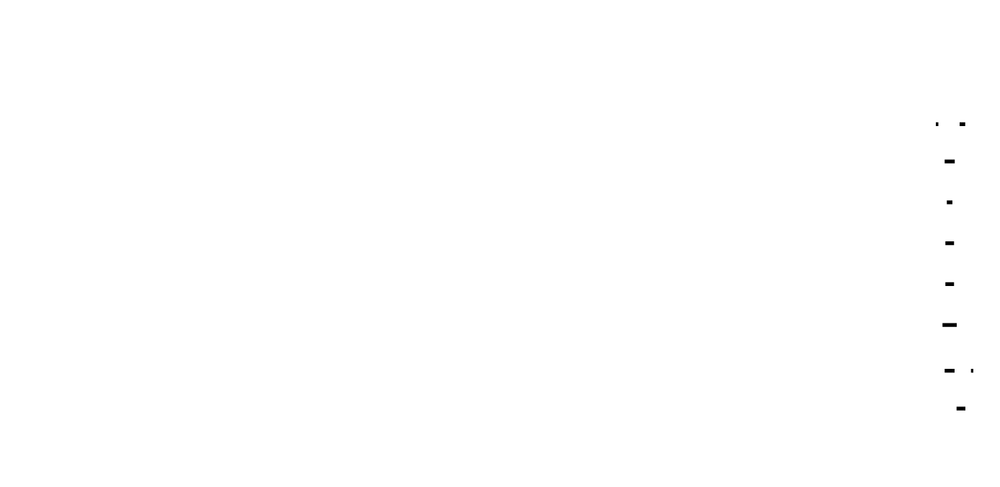

**Let's trace the shapes carefully**:
- Q has shape `[32, 20, 64]` (batch, seq_len, d_k)
- K^T has shape `[32, 64, 20]` (batch, d_k, seq_len)
- The matrix multiplication contracts over d_k (64), producing `[32, 20, 20]`
Each row of this score matrix represents one query position's attention to all key positions. Row 0 is position 0's attention distribution. Row 5 is position 5's attention distribution.
---
## The Critical Scaling Factor: Why sqrt(d_k)?
Here's where most implementations go wrong—and where understanding the *why* separates you from someone who just copies code.
The raw dot products have a problem: their magnitude grows with `d_k`. Here's why:
**Mathematical intuition**: Each element of Q and K is (roughly) a random variable with mean 0 and variance 1 (if initialized properly). The dot product `Q · K = Σ Q[i] * K[i]` sums `d_k` such products. The variance of a sum is the sum of variances, so:
$$\text{Var}(Q \cdot K) = d_k \cdot \text{Var}(Q[i] \cdot K[i]) \approx d_k$$
With `d_k = 64`, dot products will typically have magnitude around 8. With `d_k = 512`, they'd be around 22.
**Why does this matter?** Because of softmax.


> **🔑 Foundation: Softmax numerical stability**
>
> Softmax is a function that converts a vector of real numbers into a probability distribution. It exponentiates each element and then normalizes by dividing by the sum of the exponentiated elements.  Directly computing the exponential of large values can lead to numerical overflow, resulting in `NaN`s.

When dealing with large numbers from the outputs of neural networks before the softmax, directly computing e^x may overflow the floating point representation. Subtracting the maximum value in the vector from all elements *before* exponentiation addresses this, because it shifts the values to be exponentiated to be centered around zero or negative, but *does not change the final probabilities* because the normalization step cancels out the effect.

The key insight here is that the softmax function is invariant to adding a constant to all the input values.  By subtracting the maximum, you prevent overflow while preserving the relative probabilities that the softmax aims to calculate.

The softmax function converts scores to probabilities:
$$\text{softmax}(x_i) = \frac{e^{x_i}}{\sum_j e^{x_j}}$$
When inputs are large (say, 20), the exponential `e^20 ≈ 500,000,000` is enormous. When one input is slightly larger than others, softmax becomes nearly one-hot:
```python
# Without scaling: scores might be [18, 20, 15, 19]
softmax([18, 20, 15, 19])
# ≈ [0.12, 0.64, 0.01, 0.23]  -- heavily concentrated on the max
# With scaling by sqrt(64) = 8: scores become [2.25, 2.5, 1.875, 2.375]
softmax([2.25, 2.5, 1.875, 2.375])
# ≈ [0.23, 0.29, 0.20, 0.28]  -- much softer distribution
```
A near-one-hot attention distribution means the model only looks at one position. The gradient of softmax at the peak is near zero—**the model stops learning**.
The fix: divide by `sqrt(d_k)` to keep the variance of attention scores around 1, regardless of dimension:
$$\text{Attention}(Q, K, V) = \text{softmax}\left(\frac{QK^T}{\sqrt{d_k}}\right) V$$
```python
d_k = Q.size(-1)  # 64 in our example
scores = scores / math.sqrt(d_k)
```
This is not optional. This is not a hyperparameter to tune. It's a mathematical necessity derived from the properties of dot products and softmax.
---
## From Scores to Weights: The Softmax
After scaling, apply softmax along the key dimension (the last dimension of the score matrix):
```python
import torch.nn.functional as F
# scores: [batch, seq_len, seq_len]
# Softmax over the last dimension (key positions)
attention_weights = F.softmax(scores, dim=-1)
# attention_weights: [batch, seq_len, seq_len]
```
Each row now sums to 1.0, forming a probability distribution over key positions. Position `i`'s row tells you: "I attend 10% to position 0, 5% to position 1, 30% to position 2, ..."
---
## The Weighted Sum: Computing the Output
The final step is elegantly simple: use the attention weights to compute a weighted sum of the value vectors:
```python
# attention_weights: [batch, seq_len, seq_len]
# V: [batch, seq_len, d_v]
# Output: [batch, seq_len, d_v]
output = attention_weights @ V
```
Each output position gets a convex combination of all value vectors. If position 5 attends strongly to positions 2 and 7, its output will be close to `0.6 * V[2] + 0.4 * V[7]`.


**Shape trace through the complete operation**:
```
Input:     [batch, seq_len, d_model]
    ↓ W_Q, W_K, W_V (linear projections)
Q, K, V:   [batch, seq_len, d_k] (d_k = d_v typically)
    ↓ Q @ K^T
Scores:    [batch, seq_len, seq_len]
    ↓ / sqrt(d_k)
Scaled:    [batch, seq_len, seq_len]
    ↓ softmax
Weights:   [batch, seq_len, seq_len]
    ↓ @ V
Output:    [batch, seq_len, d_v]
```

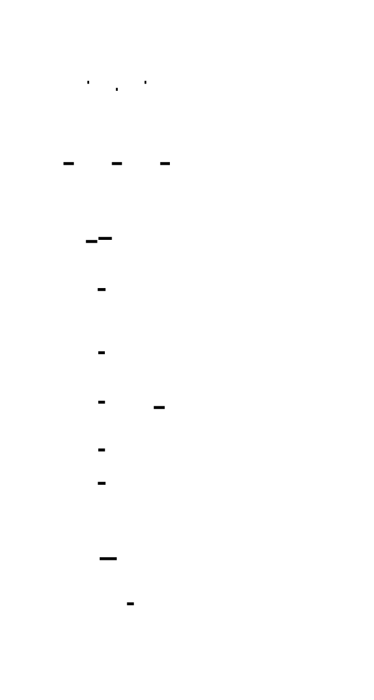

---
## Masking: Controlling What Can Be Attended To
There are two critical scenarios where you need to prevent attention to certain positions:
### 1. Padding Mask
Sequences in a batch often have different lengths. You pad shorter sequences with a special `<PAD>` token and want the model to ignore these positions.
**Solution**: Set attention scores for padding positions to `-inf` before softmax. Softmax of `-inf` is 0, so padded positions contribute nothing to the weighted sum.
```python
def create_padding_mask(seq_lengths, max_seq_len):
    """
    Args:
        seq_lengths: [batch] - actual length of each sequence
        max_seq_len: int - padded sequence length
    Returns:
        mask: [batch, 1, 1, max_seq_len] - True where padding (to be masked)
    """
    batch_size = seq_lengths.size(0)
    # Create [batch, max_seq_len] grid of position indices
    positions = torch.arange(max_seq_len, device=seq_lengths.device).unsqueeze(0)
    # Compare each position to each sequence's length
    mask = positions >= seq_lengths.unsqueeze(1)  # [batch, max_seq_len]
    # Reshape for broadcasting with attention scores
    return mask.unsqueeze(1).unsqueeze(2)  # [batch, 1, 1, max_seq_len]
# Apply mask:
# scores: [batch, seq_len, seq_len]
# mask: [batch, 1, 1, seq_len] (True = mask this position)
scores = scores.masked_fill(mask, float('-inf'))
```
The mask broadcasts across the query dimension: every query position ignores the same padded keys.
### 2. Causal Mask (for Autoregressive Decoding)
During generation, the model should only see tokens it has already produced. Position 5 shouldn't attend to position 6, 7, 8, ... because those tokens don't exist yet.
**Solution**: Create a triangular mask where positions can only attend to themselves and earlier positions:
```python
def create_causal_mask(seq_len):
    """
    Returns upper-triangular mask where True = mask (future positions).
    Shape: [1, 1, seq_len, seq_len]
    """
    # torch.triu returns upper triangle; diagonal=1 excludes the diagonal
    mask = torch.triu(torch.ones(seq_len, seq_len), diagonal=1).bool()
    return mask.unsqueeze(0).unsqueeze(0)  # [1, 1, seq_len, seq_len]
# Apply:
scores = scores.masked_fill(causal_mask, float('-inf'))
```
The causal mask creates this pattern (for seq_len=5):
```
Positions query can attend to:
    K0  K1  K2  K3  K4
Q0 [1,  0,  0,  0,  0]   ← Q0 only sees K0
Q1 [1,  1,  0,  0,  0]   ← Q1 sees K0, K1
Q2 [1,  1,  1,  0,  0]   ← Q2 sees K0, K1, K2
Q3 [1,  1,  1,  1,  0]
Q4 [1,  1,  1,  1,  1]
Where 1 = attend (not masked), 0 = ignore (masked with -inf)
```


---
## The Complete Implementation
Here's the full scaled dot-product attention function:
```python
import torch
import torch.nn as nn
import torch.nn.functional as F
import math
class ScaledDotProductAttention(nn.Module):
    """
    Computes scaled dot-product attention:
        Attention(Q, K, V) = softmax(QK^T / sqrt(d_k)) V
    Args:
        d_k: Dimension of query and key vectors
        dropout: Dropout probability (applied after softmax)
    """
    def __init__(self, d_k, dropout=0.1):
        super().__init__()
        self.scale = math.sqrt(d_k)
        self.dropout = nn.Dropout(p=dropout)
    def forward(self, Q, K, V, mask=None):
        """
        Args:
            Q: Query tensor [batch, seq_len_q, d_k]
            K: Key tensor [batch, seq_len_k, d_k]
            V: Value tensor [batch, seq_len_v, d_v] (seq_len_k == seq_len_v)
            mask: Optional mask tensor, broadcastable to [batch, seq_len_q, seq_len_k]
                  True values are masked (set to -inf before softmax)
        Returns:
            output: Attention output [batch, seq_len_q, d_v]
            attention_weights: Attention weights [batch, seq_len_q, seq_len_k]
        """
        # Compute attention scores: Q @ K^T
        # Q: [batch, seq_len_q, d_k]
        # K.transpose(-2, -1): [batch, d_k, seq_len_k]
        # scores: [batch, seq_len_q, seq_len_k]
        scores = torch.matmul(Q, K.transpose(-2, -1))
        # Scale by sqrt(d_k) for numerical stability
        scores = scores / self.scale
        # Apply mask if provided
        if mask is not None:
            scores = scores.masked_fill(mask, float('-inf'))
        # Convert to attention weights via softmax
        # Softmax over the key dimension (last)
        attention_weights = F.softmax(scores, dim=-1)
        # Handle edge case: if an entire row is -inf, softmax produces nan
        # Replace nan with 0 (no attention to any position)
        attention_weights = torch.nan_to_num(attention_weights, nan=0.0)
        # Apply dropout (only during training)
        attention_weights = self.dropout(attention_weights)
        # Compute weighted sum of values
        # attention_weights: [batch, seq_len_q, seq_len_k]
        # V: [batch, seq_len_v, d_v] where seq_len_v == seq_len_k
        # output: [batch, seq_len_q, d_v]
        output = torch.matmul(attention_weights, V)
        return output, attention_weights
```
### The Q, K, V Projection Layer
The attention function above operates on pre-computed Q, K, V. In practice, you project from input embeddings:
```python
class AttentionProjection(nn.Module):
    """
    Projects input embeddings to Q, K, V via learned linear transformations.
    """
    def __init__(self, d_model, d_k, d_v=None):
        super().__init__()
        d_v = d_v or d_k  # Default: d_v = d_k
        self.W_Q = nn.Linear(d_model, d_k, bias=False)
        self.W_K = nn.Linear(d_model, d_k, bias=False)
        self.W_V = nn.Linear(d_model, d_v, bias=False)
        # Initialize weights (Xavier/He initialization)
        nn.init.xavier_uniform_(self.W_Q.weight)
        nn.init.xavier_uniform_(self.W_K.weight)
        nn.init.xavier_uniform_(self.W_V.weight)
    def forward(self, x):
        """
        Args:
            x: Input tensor [batch, seq_len, d_model]
        Returns:
            Q, K, V tensors, each [batch, seq_len, d_k] or [batch, seq_len, d_v]
        """
        return self.W_Q(x), self.W_K(x), self.W_V(x)
```
**Why no bias?** The original Transformer paper uses bias=False for the Q, K, V projections. The centering effect of bias terms is redundant because:
1. Layer normalization (applied before attention in Pre-LN) already centers activations
2. The dot product is invariant to adding the same constant to both Q and K
3. Removing bias reduces parameters without hurting performance
Some implementations (like GPT-2) do add bias back, but for learning purposes, we'll follow the original paper.
---
## Verification Against PyTorch Reference
Trust but verify. PyTorch provides `F.scaled_dot_product_attention` (since version 2.0), which is optimized and battle-tested. Your implementation should match it exactly:
```python
def verify_attention_implementation():
    """
    Verifies our implementation matches PyTorch's reference.
    """
    torch.manual_seed(42)
    batch_size, seq_len, d_model, d_k = 2, 10, 512, 64
    # Create random Q, K, V
    Q = torch.randn(batch_size, seq_len, d_k)
    K = torch.randn(batch_size, seq_len, d_k)
    V = torch.randn(batch_size, seq_len, d_k)
    # Our implementation
    our_attention = ScaledDotProductAttention(d_k, dropout=0.0)
    our_output, our_weights = our_attention(Q, K, V, mask=None)
    # PyTorch reference (no mask, no dropout)
    pytorch_output = F.scaled_dot_product_attention(
        Q, K, V, 
        attn_mask=None, 
        dropout_p=0.0,
        is_causal=False,
        scale=1.0 / math.sqrt(d_k)
    )
    # Compare outputs
    max_diff = (our_output - pytorch_output).abs().max().item()
    print(f"Maximum difference: {max_diff:.2e}")
    assert max_diff < 1e-5, f"Outputs differ by {max_diff}, expected < 1e-5"
    print("✓ Implementation matches PyTorch reference!")
    return our_output, pytorch_output
# Run verification
verify_attention_implementation()
```
**Testing with masks**:
```python
def verify_with_causal_mask():
    """Test that causal masking works correctly."""
    torch.manual_seed(42)
    batch_size, seq_len, d_k = 1, 8, 64
    Q = torch.randn(batch_size, seq_len, d_k)
    K = torch.randn(batch_size, seq_len, d_k)
    V = torch.randn(batch_size, seq_len, d_k)
    # Create causal mask
    causal_mask = create_causal_mask(seq_len)  # [1, 1, seq_len, seq_len]
    # Our implementation
    our_attention = ScaledDotProductAttention(d_k, dropout=0.0)
    our_output, our_weights = our_attention(Q, K, V, mask=causal_mask)
    # Verify: attention weights should be zero in upper triangle
    # (excluding diagonal and below)
    upper_tri = our_weights[:, :, torch.triu(torch.ones(seq_len, seq_len), diagonal=1).bool()]
    assert torch.allclose(upper_tri, torch.zeros_like(upper_tri), atol=1e-6), \
        "Causal mask failed: non-zero weights in future positions"
    # Verify: each row's weights sum to 1 (except potentially all-masked rows)
    row_sums = our_weights.sum(dim=-1)
    assert torch.allclose(row_sums, torch.ones_like(row_sums), atol=1e-5), \
        "Attention weights don't sum to 1"
    print("✓ Causal mask verification passed!")
    print(f"Attention weights (position 3 attending to all positions):\n{our_weights[0, 3]}")
verify_with_causal_mask()
```
---
## Numerical Deep Dive: What Can Go Wrong?
### Problem 1: Softmax Overflow
When scores are too large, `exp(score)` overflows to infinity:
```python
# Dangerous: large scores
scores = torch.tensor([[50.0, 60.0, 40.0]])
F.softmax(scores, dim=-1)
# tensor([[0.00, inf, 0.00]])  # Broken!
```
**PyTorch's softmax handles this internally** by subtracting the max before exponentiating. But understanding *why* helps you debug:
$$\text{softmax}(x_i) = \frac{e^{x_i}}{\sum_j e^{x_j}} = \frac{e^{x_i - \max(x)}}{\sum_j e^{x_j - \max(x)}}$$
Subtracting the max doesn't change the output (it's a multiplicative factor that cancels out), but keeps all exponents ≤ 0, preventing overflow.
### Problem 2: Underflow to Zero
When scores are very negative (after masking), `exp(score)` underflows to zero:
```python
scores = torch.tensor([[-1e10, 5.0, 3.0]])  # First position masked
F.softmax(scores, dim=-1)
# tensor([[0., 0.88, 0.12]])  # Correctly ignores masked position
```
This is actually desired behavior for masking! The `-inf` becomes `exp(-inf) = 0`, so masked positions contribute nothing.
### Problem 3: All-Masked Rows (NaN)
If every position in a row is masked (all `-inf`), softmax produces `0/0 = NaN`:
```python
scores = torch.tensor([[-float('inf'), -float('inf'), -float('inf')]])
F.softmax(scores, dim=-1)
# tensor([[nan, nan, nan]])  # Problem!
```
**Fix**: Use `torch.nan_to_num()` after softmax, replacing NaN with 0:
```python
attention_weights = torch.nan_to_num(attention_weights, nan=0.0)
```
This can happen when a query position has no valid keys to attend to (rare, but possible with pathological masking).
---
## The Three-Level View: What's Actually Happening?
### Level 1 — Mathematical Operation
At its core, attention computes a **soft lookup table**. Instead of retrieving one entry (hard lookup), it retrieves a weighted combination of all entries. The weights are determined by query-key similarity.
### Level 2 — Gradient Flow
During backpropagation, gradients flow through the softmax and into Q, K, V:
- The softmax gradient at position `i` involves *all* attention weights (it's a normalized function)
- When attention is concentrated (one-hot-ish), gradients vanish for non-attended positions
- The scaling factor ensures gradients have reasonable magnitude even for large `d_k`
### Level 3 — GPU Compute
On the GPU, this is all matrix multiplication—the most optimized operation available:
- `Q @ K^T`: Batched matrix multiply, highly parallelized
- Softmax: Element-wise operations, memory-bound but parallel
- `weights @ V`: Another batched matrix multiply
Modern GPUs achieve >90% utilization on these operations, which is why transformers train so much faster than RNNs despite having more parameters.
---
## Common Implementation Pitfalls
| Pitfall | Symptom | Fix |
|---------|---------|-----|
| **Forgot scaling** | Training doesn't converge, loss plateaus | Add `/ sqrt(d_k)` |
| **Wrong mask position** | Apply mask after softmax | Apply mask before softmax (to scores) |
| **Wrong transpose dim** | Shape mismatch in matmul | Use `K.transpose(-2, -1)` for batch dimension handling |
| **Mask dtype wrong** | RuntimeError in masked_fill | Mask must be boolean (`.bool()`) |
| **Forgot dropout** | Overfitting on small datasets | Add dropout after softmax |
| **NaN in output** | All-masked rows | Use `nan_to_num` or check mask logic |
---
## Knowledge Cascade: What You've Unlocked
By understanding scaled dot-product attention, you've gained the key to:
**1. Cross-Attention (Next Milestone)**
Once you understand that Q attends to K,V, cross-attention is trivially: Q comes from one sequence (decoder), K and V come from another (encoder). The math is identical; only the source of Q changes. This is how translation models "look at" the source sentence while generating target words.
**2. Self-Attention as Graph Computation**
Every transformer layer is implicitly a graph neural network. Tokens are nodes, attention weights are learned edge strengths. Unlike GNNs with fixed topologies, transformers *learn* the graph structure at each layer—the attention weights are the adjacency matrix, computed dynamically from content.
**3. Database Retrieval (Cross-Domain)**
The Q/K/V pattern maps directly to database index lookups. A query searches keys (index traversal), retrieves values (table access). The innovation of attention is making this "search" differentiable—we can train the indexing function end-to-end.
**4. Why Transformers Replaced RNNs**
RNNs compute sequentially: token 1 → hidden → token 2 → hidden → ... Transformers compute in parallel: all Q, K, V projections happen simultaneously, all attention scores computed in one matrix multiply. This parallelization is why GPU utilization for transformers hits 90%+ while RNNs struggle to reach 30%.
**5. The O(n²) Bottleneck**
Attention scores are `[seq_len, seq_len]`—quadratic in sequence length. For 1000 tokens, that's 1M scores. For 100,000 tokens, that's 10B scores. This is the fundamental limit on transformer context length and drives research into sparse attention, linear attention, and state-space models like Mamba.
---
## Your Mission
You now have everything you need to implement scaled dot-product attention:
1. **Implement the core function**: Q, K, V projection → scaled dot product → softmax → weighted sum
2. **Add masking support**: Padding mask and causal mask, applied to scores before softmax
3. **Verify against PyTorch**: Your output should match `F.scaled_dot_product_attention` within 1e-5
4. **Test edge cases**: All-masked rows, long sequences, batched inputs
The implementation is under 50 lines of code, but every line matters. Get this right, and multi-head attention (next milestone) is just reshaping and concatenation.
---
[[CRITERIA_JSON: {"milestone_id": "transformer-scratch-m1", "criteria": ["Implement three separate nn.Linear layers for Q, K, V projection from input embeddings with configurable d_model, d_k, d_v dimensions", "Compute scaled dot-product attention as softmax(QK^T / sqrt(d_k))V with correct output shape [batch, seq_len, d_v]", "Implement padding mask that sets attention weights to zero for padding positions by applying -inf to scores before softmax", "Implement causal mask that prevents attending to future positions using upper-triangular -inf mask applied before softmax", "All operations are fully vectorized using torch.matmul with no Python loops over batch or sequence dimensions", "Verify numerical correctness against PyTorch's F.scaled_dot_product_attention with outputs matching within 1e-5 tolerance on random inputs", "Handle edge case of all-masked rows by using nan_to_num to replace NaN attention weights with 0.0", "Understand and document why scaling by sqrt(d_k) is necessary to prevent softmax saturation and gradient vanishing", "Trace tensor shapes correctly through all operations: input [batch, seq, d_model] → Q,K,V [batch, seq, d_k] → scores [batch, seq, seq] → output [batch, seq, d_v]"]}]
<!-- END_MS -->


<!-- MS_ID: transformer-scratch-m2 -->
# Multi-Head Attention
## Parallel Perspectives on Meaning
You've built the engine—scaled dot-product attention. One query, one set of keys and values, one attention distribution. But here's the problem: **a single attention operation can only ask one "question" at a time.**
Consider the sentence: *"The animal didn't cross the street because it was too tired."*
When the model processes "it," what should it attend to?
- **Syntactic attention**: "it" should attend to "animal" (the subject)
- **Causal attention**: "it" should attend to "tired" (the reason for not crossing)
- **Positional attention**: "it" should attend to nearby words for context
A single attention head must choose. It might learn to attend to "animal" because that's syntactically correct—but then it misses the causal relationship with "tired." Or it attends to both, diluting both signals.
**Multi-head attention is the solution**: instead of forcing one attention operation to capture all relationship types, run *h* independent attention operations in parallel. Each head gets its own slice of the embedding space and learns to specialize. One head becomes the "syntax expert," another the "causal relationship expert," another the "positional proximity expert."
Then—and this is crucial—**combine their outputs** through a learned projection. The model can learn which heads to trust for which contexts.


---
## The Tension: One Head, One Question
The mathematical constraint is subtle but fundamental. In scaled dot-product attention, each position produces one query vector. That query has `d_k` dimensions—but regardless of dimensionality, it's still *one vector*, representing *one learned question*.
You might think: "Just make `d_k` larger! More dimensions means more expressive power!" But here's the problem: **softmax produces a single probability distribution.** Even with infinite dimensions, you get one set of attention weights per position.
```python
# Single head: one attention distribution
Q = [query_vector]  # shape: [batch, seq, d_k]
attention_weights = softmax(Q @ K^T / sqrt(d_k))  # [batch, seq, seq]
# Each position has ONE distribution over all other positions
```
It's like having a room full of people who can only ask one question each. Sure, you could train them to ask better questions—but they're still limited to one.
**Multi-head attention** gives each position *h* different questions to ask simultaneously:
```python
# Multi-head: h different attention distributions
Q_1, Q_2, ..., Q_h = split_into_heads(Q)  # h different query perspectives
attention_weights_1 = softmax(Q_1 @ K_1^T / sqrt(d_k))
attention_weights_2 = softmax(Q_2 @ K_2^T / sqrt(d_k))
# ... for each head
# Each position now has h DIFFERENT distributions
```
---
## The Common Misconception: Sequential vs. Parallel
> **Misconception**: Multi-head attention means running attention multiple times sequentially, accumulating results.
This is the #1 wrong mental model. If you think multi-head attention looks like this:
```python
# ❌ WRONG: Sequential execution (this is NOT how it works)
output = 0
for head in range(num_heads):
    Q_h = W_Q[head](x)  # Project for this head
    K_h = W_K[head](x)
    V_h = W_V[head](x)
    head_output = attention(Q_h, K_h, V_h)
    output += head_output
```
...you're missing the key insight. The above is slow (h sequential operations) and misses the opportunity for hardware optimization.
**Reality**: All heads run in parallel via clever tensor reshaping:
```python
# ✅ CORRECT: Parallel execution via reshaping
Q = W_Q(x)  # [batch, seq, d_model]
K = W_K(x)
V = W_V(x)
# Reshape to expose head dimension
Q = Q.view(batch, seq, num_heads, d_k).transpose(1, 2)  # [batch, heads, seq, d_k]
K = K.view(batch, seq, num_heads, d_k).transpose(1, 2)
V = V.view(batch, seq, num_heads, d_v).transpose(1, 2)
# Single batched operation computes ALL heads simultaneously
attention_weights = softmax(Q @ K^T / sqrt(d_k), dim=-1)  # [batch, heads, seq, seq]
output = attention_weights @ V  # [batch, heads, seq, d_v]
```
The "multi" is in the **feature dimension**, not in time. You're not running attention h times—you're running it once on a tensor with an extra dimension.


---
## The Mathematical Foundation: Splitting the Embedding Space
Here's where the math becomes beautiful. You have `d_model` dimensions total (512 in the original Transformer). You want `h` heads (8 in the original). Each head gets:
$$d_k = \frac{d_{model}}{h}$$
With `d_model = 512` and `h = 8`, each head operates on `d_k = 64` dimensions.
**Key constraint**: `d_model` must be divisible by `h`. This is not a suggestion—it's a hard requirement:
```python
assert d_model % num_heads == 0, f"d_model ({d_model}) must be divisible by num_heads ({num_heads})"
d_k = d_model // num_heads
```
### Why Split Dimensions Instead of Using Full Dimensions?
You might wonder: why not give each head all 512 dimensions? Two reasons:
**1. Parameter Efficiency**
If each head had its own full `d_model` projection:
```python
# Hypothetical: full dimensions per head
params_per_head = 3 * d_model * d_model  # Q, K, V projections
total_params = num_heads * params_per_head  # 8 * 3 * 512 * 512 = 6.3M parameters
```
With dimension splitting:
```python
# Actual: split dimensions
total_params = 3 * d_model * d_model  # Just 3 * 512 * 512 = 786K parameters
```
Same total representational capacity, 8x fewer parameters.
**2. Specialization Pressure**
When each head only sees 64 dimensions, it's *forced* to specialize. A head that receives dimensions 0-63 learns different patterns than a head receiving dimensions 448-511. They can't all learn the same thing because they literally see different slices of the embedding.
---
## The Two Implementation Strategies
There are two mathematically equivalent ways to implement multi-head attention:
### Strategy 1: Separate Projections Per Head (Conceptual)
```python
class MultiHeadAttention_Separate(nn.Module):
    """Conceptually clear but inefficient implementation."""
    def __init__(self, d_model, num_heads):
        super().__init__()
        self.num_heads = num_heads
        self.d_k = d_model // num_heads
        # Separate projection layers for each head
        self.W_Q = nn.ModuleList([
            nn.Linear(d_model, self.d_k, bias=False) 
            for _ in range(num_heads)
        ])
        self.W_K = nn.ModuleList([
            nn.Linear(d_model, self.d_k, bias=False) 
            for _ in range(num_heads)
        ])
        self.W_V = nn.ModuleList([
            nn.Linear(d_model, self.d_k, bias=False) 
            for _ in range(num_heads)
        ])
        self.W_O = nn.Linear(d_model, d_model, bias=False)
    def forward(self, x):
        batch, seq, _ = x.shape
        head_outputs = []
        for i in range(self.num_heads):
            Q = self.W_Q[i](x)  # [batch, seq, d_k]
            K = self.W_K[i](x)
            V = self.W_V[i](x)
            # Scaled dot-product attention for this head
            scores = Q @ K.transpose(-2, -1) / math.sqrt(self.d_k)
            weights = F.softmax(scores, dim=-1)
            head_output = weights @ V  # [batch, seq, d_k]
            head_outputs.append(head_output)
        # Concatenate all heads
        concat = torch.cat(head_outputs, dim=-1)  # [batch, seq, d_model]
        return self.W_O(concat)
```
This is **pedagogically clear** but **computationally wrong**. You're running a Python loop over heads, which:
- Can't be parallelized on GPU
- Launches 8 separate small matrix multiplications instead of 1 large one
- Is ~8x slower than the optimized version
### Strategy 2: Single Large Projection + Reshape (Production)
```python
class MultiHeadAttention(nn.Module):
    """Efficient implementation using reshaping for parallel head computation."""
    def __init__(self, d_model, num_heads, dropout=0.1):
        super().__init__()
        assert d_model % num_heads == 0, "d_model must be divisible by num_heads"
        self.d_model = d_model
        self.num_heads = num_heads
        self.d_k = d_model // num_heads
        # Single large projections that we'll reshape
        self.W_Q = nn.Linear(d_model, d_model, bias=False)
        self.W_K = nn.Linear(d_model, d_model, bias=False)
        self.W_V = nn.Linear(d_model, d_model, bias=False)
        # Output projection
        self.W_O = nn.Linear(d_model, d_model, bias=False)
        self.dropout = nn.Dropout(dropout)
        # Initialize weights
        self._init_weights()
    def _init_weights(self):
        nn.init.xavier_uniform_(self.W_Q.weight)
        nn.init.xavier_uniform_(self.W_K.weight)
        nn.init.xavier_uniform_(self.W_V.weight)
        nn.init.xavier_uniform_(self.W_O.weight)
    def forward(self, query, key, value, mask=None):
        """
        Args:
            query: [batch, seq_q, d_model]
            key:   [batch, seq_k, d_model]
            value: [batch, seq_v, d_model] (seq_k == seq_v)
            mask:  Broadcastable to [batch, num_heads, seq_q, seq_k]
                   True = masked (ignore)
        Returns:
            output: [batch, seq_q, d_model]
            attention_weights: [batch, num_heads, seq_q, seq_k]
        """
        batch_size = query.size(0)
        # 1. Linear projections: [batch, seq, d_model]
        Q = self.W_Q(query)
        K = self.W_K(key)
        V = self.W_V(value)
        # 2. Reshape for multi-head: [batch, seq, d_model] -> [batch, heads, seq, d_k]
        Q = Q.view(batch_size, -1, self.num_heads, self.d_k).transpose(1, 2)
        K = K.view(batch_size, -1, self.num_heads, self.d_k).transpose(1, 2)
        V = V.view(batch_size, -1, self.num_heads, self.d_k).transpose(1, 2)
        # 3. Scaled dot-product attention (all heads in parallel)
        # scores: [batch, heads, seq_q, seq_k]
        scores = torch.matmul(Q, K.transpose(-2, -1)) / math.sqrt(self.d_k)
        # 4. Apply mask if provided
        if mask is not None:
            scores = scores.masked_fill(mask, float('-inf'))
        # 5. Softmax + dropout
        attention_weights = F.softmax(scores, dim=-1)
        attention_weights = torch.nan_to_num(attention_weights, nan=0.0)
        attention_weights = self.dropout(attention_weights)
        # 6. Weighted sum: [batch, heads, seq_q, d_k]
        head_outputs = torch.matmul(attention_weights, V)
        # 7. Concatenate heads: [batch, heads, seq, d_k] -> [batch, seq, d_model]
        # transpose(1, 2) first, then contiguous() for memory layout, then view
        concat = head_outputs.transpose(1, 2).contiguous().view(batch_size, -1, self.d_model)
        # 8. Final linear projection
        output = self.W_O(concat)
        return output, attention_weights
```

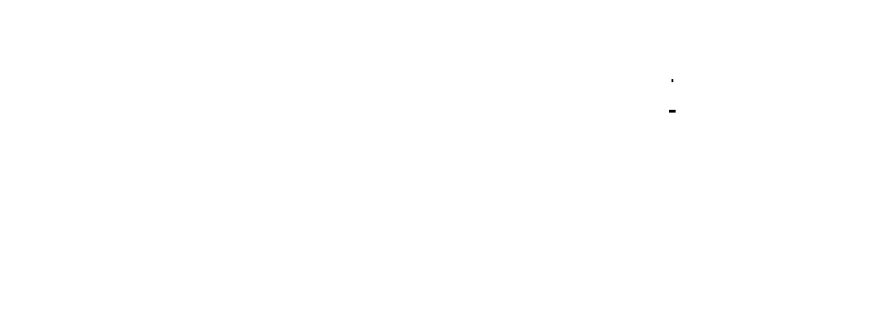

---
## The Critical Tensor Operations: A Shape-Level Walkthrough
Let's trace through the dimensions at each step. This is where bugs live.
**Input**: `x` with shape `[batch=32, seq_len=20, d_model=512]`
**Step 1: Linear Projections**
```python
Q = self.W_Q(x)  # [32, 20, 512]
K = self.W_K(x)  # [32, 20, 512]
V = self.W_V(x)  # [32, 20, 512]
```
Each `W_Q`, `W_K`, `W_V` is `nn.Linear(512, 512)`. The output is the same shape as input.
**Step 2: Reshape to Expose Heads**
```python
# Before: [32, 20, 512]
# After view: [32, 20, 8, 64]  <- 512 = 8 * 64
# After transpose(1, 2): [32, 8, 20, 64]
Q = Q.view(32, 20, 8, 64).transpose(1, 2)
```
This is the key transformation. You're taking the last dimension (512) and splitting it into `(8, 64)`. Then you swap the seq and heads dimensions so that:
- Dimension 0 = batch
- Dimension 1 = heads (8)
- Dimension 2 = sequence (20)
- Dimension 3 = head_dim (64)
Now `Q[batch=0, head=3, seq=5, :]` gives you the 64-dimensional query vector for position 5, head 3, in the first batch element.
**Step 3: Batched Attention Computation**
```python
# Q: [32, 8, 20, 64]
# K.transpose(-2, -1): [32, 8, 64, 20]
# Q @ K^T: [32, 8, 20, 20]
scores = Q @ K.transpose(-2, -1) / math.sqrt(64)
```
The matrix multiplication contracts over the last dimension of Q (64) and the second-to-last of K^T (64). The result is `[batch, heads, seq_q, seq_k]`—an attention score matrix for each head.
**Step 4: Softmax (Per Head)**
```python
attention_weights = F.softmax(scores, dim=-1)  # [32, 8, 20, 20]
```
Softmax is applied along `dim=-1` (the key dimension). Each head independently computes its own attention distribution.
**Step 5: Apply to Values**
```python
# attention_weights: [32, 8, 20, 20]
# V: [32, 8, 20, 64]
# output: [32, 8, 20, 64]
head_outputs = attention_weights @ V
```
Each head produces a 64-dimensional output per position.
**Step 6: Concatenate Heads**
```python
# head_outputs: [32, 8, 20, 64]
# After transpose(1, 2): [32, 20, 8, 64]
# After contiguous(): same shape, but memory-contiguous
# After view: [32, 20, 512]
concat = head_outputs.transpose(1, 2).contiguous().view(32, 20, 512)
```
This reverses step 2. You put sequence back in dimension 1, then merge the last two dimensions (8 × 64 = 512).
**Step 7: Output Projection**
```python
output = self.W_O(concat)  # [32, 20, 512]
```
The output projection `W_O` is `nn.Linear(512, 512)`. It mixes information across heads, allowing the model to learn which heads to trust for which contexts.
---
## The `contiguous()` Trap
Here's a common bug:
```python
# ❌ This will crash or silently corrupt data
x = torch.randn(32, 8, 20, 64)
y = x.transpose(1, 2)  # [32, 20, 8, 64]
z = y.view(32, 20, 512)  # RuntimeError: view size is not compatible with input tensor's size and stride
```
**What's happening?** `transpose()` creates a view with non-contiguous memory. The underlying data is still laid out as `[32, 8, 20, 64]`, but you're trying to interpret it as `[32, 20, 512]`. PyTorch can't do this without copying.
**Fix**: Call `contiguous()` before `view()`:
```python
z = y.contiguous().view(32, 20, 512)  # ✅ Works
```
`contiguous()` makes a copy if needed, ensuring the memory layout matches the new shape interpretation.
**Alternative**: Use `reshape()` instead of `view()`:
```python
z = y.reshape(32, 20, 512)  # ✅ Also works (calls contiguous internally if needed)
```
However, `reshape()` can hide performance issues. If you're reshaping non-contiguous tensors frequently, you might be doing unnecessary copies. Using `view()` with explicit `contiguous()` makes the copy obvious.
---
## The Output Projection W_O: Why It Matters
After concatenating head outputs, you have a `[batch, seq, d_model]` tensor. Why not just return it?
**Without W_O**: Each head's output stays in its own 64-dimensional slice. Head 0's output only influences dimensions 0-63 of the final embedding. Head 7 only influences dimensions 448-511. The heads can't interact.
**With W_O**: The output projection is a learned mixing matrix. It can route information from any head to any output dimension. If head 3 learns a syntactic pattern that's relevant to the semantic representation in dimension 200, W_O can make that connection.
```python
# W_O is [d_model, d_model] = [512, 512]
# It's a full-rank linear transformation
# Output[i] = sum_j(W_O[i,j] * concat[j])
```
**Mathematical interpretation**: W_O is what makes multi-head attention more than just h independent attention operations. It's the "voting aggregator" that combines head perspectives.


---
## The Convolution Parallel: Multiple Filters, Multiple Patterns
If you've worked with CNNs, multi-head attention should feel familiar:
| CNN Concept | Transformer Equivalent |
|-------------|------------------------|
| Multiple convolutional filters | Multiple attention heads |
| Each filter detects different patterns (edges, textures) | Each head detects different relationships (syntax, semantics) |
| Filter outputs concatenated | Head outputs concatenated |
| 1×1 convolution to mix channels | W_O projection to mix heads |
Both architectures learn to detect multiple types of patterns in parallel and then combine them. The difference is in what "pattern detection" means:
- **CNNs**: Spatial patterns in images (edges, corners, textures)
- **Transformers**: Relational patterns in sequences (which tokens relate to which)
This is why multi-head attention works: it's the same proven principle of "learn multiple detectors, combine their outputs" that made CNNs successful.
---
## Ensemble Interpretation: Why More Heads ≈ Better Performance
You can think of multi-head attention as an **ensemble of attention functions**:
```python
# Conceptual ensemble view
head_outputs = [head_1(x), head_2(x), ..., head_h(x)]
final_output = W_O(concat(head_outputs))
```
In ensemble learning, combining multiple models improves performance because:
1. **Error reduction**: Unrelated errors cancel out
2. **Diversity**: Different models capture different patterns
3. **Specialization**: Each model can focus on what it's good at
Multi-head attention gets all three benefits:
1. **Error reduction**: If one head attends to the wrong position, other heads can compensate
2. **Diversity**: Different heads learn different attention patterns (forced by different input slices)
3. **Specialization**: Heads naturally specialize (empirically observed in trained models)
**Empirical finding**: In trained transformers, researchers have observed:
- Head 3 in layer 5 attends to syntactic dependencies
- Head 7 in layer 5 attends to coreference resolution
- Head 1 in layer 8 attends to position-adjacent tokens
This specialization emerges naturally from training—it's not explicitly programmed.
---
## Implementation: Complete Multi-Head Attention Module
Here's the production-ready implementation with all the details handled:
```python
import torch
import torch.nn as nn
import torch.nn.functional as F
import math
class MultiHeadAttention(nn.Module):
    """
    Multi-Head Attention mechanism.
    Allows the model to jointly attend to information from different
    representation subspaces at different positions.
    Attention(Q, K, V) = softmax(QK^T / sqrt(d_k)) V
    MultiHead(Q, K, V) = Concat(head_1, ..., head_h) W_O
    where head_i = Attention(Q W_Q_i, K W_K_i, V W_V_i)
    Args:
        d_model: Model dimension (must be divisible by num_heads)
        num_heads: Number of attention heads
        dropout: Dropout probability (applied after softmax)
    """
    def __init__(self, d_model, num_heads, dropout=0.1):
        super().__init__()
        # Validate dimensions
        assert d_model % num_heads == 0, \
            f"d_model ({d_model}) must be divisible by num_heads ({num_heads})"
        self.d_model = d_model
        self.num_heads = num_heads
        self.d_k = d_model // num_heads  # Dimension per head
        # Linear projections for Q, K, V (combined for all heads)
        self.W_Q = nn.Linear(d_model, d_model, bias=False)
        self.W_K = nn.Linear(d_model, d_model, bias=False)
        self.W_V = nn.Linear(d_model, d_model, bias=False)
        # Output projection
        self.W_O = nn.Linear(d_model, d_model, bias=False)
        # Dropout
        self.dropout = nn.Dropout(p=dropout)
        # Scaling factor
        self.scale = math.sqrt(self.d_k)
        # Initialize weights
        self._init_weights()
    def _init_weights(self):
        """Initialize projection weights using Xavier uniform."""
        for module in [self.W_Q, self.W_K, self.W_V, self.W_O]:
            nn.init.xavier_uniform_(module.weight)
    def forward(self, query, key, value, mask=None, return_attention=True):
        """
        Forward pass of multi-head attention.
        Args:
            query: Query tensor [batch, seq_q, d_model]
            key: Key tensor [batch, seq_k, d_model]
            value: Value tensor [batch, seq_v, d_model] (seq_k == seq_v)
            mask: Attention mask, broadcastable to [batch, num_heads, seq_q, seq_k]
                  True values are masked (set to -inf before softmax)
            return_attention: If True, also return attention weights
        Returns:
            output: Attention output [batch, seq_q, d_model]
            attention_weights: (optional) [batch, num_heads, seq_q, seq_k]
        """
        batch_size = query.size(0)
        seq_len_q = query.size(1)
        seq_len_k = key.size(1)
        # 1. Linear projections: [batch, seq, d_model]
        Q = self.W_Q(query)
        K = self.W_K(key)
        V = self.W_V(value)
        # 2. Reshape for multi-head attention
        # [batch, seq, d_model] -> [batch, seq, num_heads, d_k] -> [batch, num_heads, seq, d_k]
        Q = Q.view(batch_size, seq_len_q, self.num_heads, self.d_k).transpose(1, 2)
        K = K.view(batch_size, seq_len_k, self.num_heads, self.d_k).transpose(1, 2)
        V = V.view(batch_size, seq_len_k, self.num_heads, self.d_k).transpose(1, 2)
        # 3. Compute attention scores: [batch, num_heads, seq_q, seq_k]
        scores = torch.matmul(Q, K.transpose(-2, -1)) / self.scale
        # 4. Apply mask (if provided)
        if mask is not None:
            # Mask should be broadcastable to [batch, num_heads, seq_q, seq_k]
            scores = scores.masked_fill(mask, float('-inf'))
        # 5. Apply softmax to get attention weights
        attention_weights = F.softmax(scores, dim=-1)
        # 6. Handle all-masked rows (NaN -> 0)
        attention_weights = torch.nan_to_num(attention_weights, nan=0.0)
        # 7. Apply dropout
        attention_weights = self.dropout(attention_weights)
        # 8. Apply attention to values: [batch, num_heads, seq_q, d_k]
        context = torch.matmul(attention_weights, V)
        # 9. Concatenate heads: [batch, num_heads, seq_q, d_k] -> [batch, seq_q, d_model]
        context = context.transpose(1, 2).contiguous().view(batch_size, seq_len_q, self.d_model)
        # 10. Final output projection
        output = self.W_O(context)
        if return_attention:
            return output, attention_weights
        return output
    def __repr__(self):
        return (f"MultiHeadAttention(d_model={self.d_model}, "
                f"num_heads={self.num_heads}, d_k={self.d_k})")
```
---
## Verification Against PyTorch Reference
PyTorch provides `nn.MultiheadAttention`—let's verify our implementation matches:
```python
def verify_multihead_attention():
    """
    Verify our implementation matches PyTorch's nn.MultiheadAttention.
    """
    torch.manual_seed(42)
    # Parameters
    batch_size = 4
    seq_len = 16
    d_model = 512
    num_heads = 8
    # Create random input
    x = torch.randn(batch_size, seq_len, d_model)
    # Our implementation
    our_mha = MultiHeadAttention(d_model, num_heads, dropout=0.0)
    our_output, our_weights = our_mha(x, x, x, mask=None)
    # PyTorch reference
    # Note: nn.MultiheadAttention expects [seq, batch, d_model] by default
    pytorch_mha = nn.MultiheadAttention(d_model, num_heads, dropout=0.0, batch_first=False)
    # Copy weights from our implementation to PyTorch's
    # Our W_Q is [d_model, d_model], PyTorch's in_proj_weight is [3*d_model, d_model]
    with torch.no_grad():
        combined_weight = torch.cat([our_mha.W_Q.weight, our_mha.W_K.weight, our_mha.W_V.weight], dim=0)
        pytorch_mha.in_proj_weight.copy_(combined_weight)
        pytorch_mha.out_proj.weight.copy_(our_mha.W_O.weight)
    # PyTorch expects [seq, batch, d_model]
    x_transposed = x.transpose(0, 1)
    pytorch_output, pytorch_weights = pytorch_mha(x_transposed, x_transposed, x_transposed)
    # Transpose PyTorch output back to [batch, seq, d_model]
    pytorch_output = pytorch_output.transpose(0, 1)
    # Compare
    output_diff = (our_output - pytorch_output).abs().max().item()
    weights_diff = (our_weights - pytorch_weights).abs().max().item()
    print(f"Output max difference: {output_diff:.2e}")
    print(f"Weights max difference: {weights_diff:.2e}")
    assert output_diff < 1e-5, f"Output differs by {output_diff}"
    assert weights_diff < 1e-5, f"Weights differ by {weights_diff}"
    print("✓ Multi-head attention implementation verified!")
    return our_output, pytorch_output
verify_multihead_attention()
```
**Testing with masks**:
```python
def verify_with_causal_mask():
    """Test multi-head attention with causal masking."""
    torch.manual_seed(42)
    batch_size = 2
    seq_len = 10
    d_model = 256
    num_heads = 4
    x = torch.randn(batch_size, seq_len, d_model)
    # Create causal mask: [1, 1, seq_len, seq_len]
    causal_mask = torch.triu(torch.ones(seq_len, seq_len), diagonal=1).bool()
    causal_mask = causal_mask.unsqueeze(0).unsqueeze(0)
    mha = MultiHeadAttention(d_model, num_heads, dropout=0.0)
    output, weights = mha(x, x, x, mask=causal_mask)
    # Verify output shape
    assert output.shape == (batch_size, seq_len, d_model), \
        f"Expected output shape {(batch_size, seq_len, d_model)}, got {output.shape}"
    # Verify weights shape
    assert weights.shape == (batch_size, num_heads, seq_len, seq_len), \
        f"Expected weights shape {(batch_size, num_heads, seq_len, seq_len)}, got {weights.shape}"
    # Verify causal masking: upper triangle should be zero
    upper_tri_mask = torch.triu(torch.ones(seq_len, seq_len), diagonal=1).bool()
    for b in range(batch_size):
        for h in range(num_heads):
            upper_vals = weights[b, h, :, :][upper_tri_mask]
            assert torch.allclose(upper_vals, torch.zeros_like(upper_vals), atol=1e-6), \
                f"Causal mask violated in batch {b}, head {h}"
    # Verify each row sums to 1
    row_sums = weights.sum(dim=-1)
    assert torch.allclose(row_sums, torch.ones_like(row_sums), atol=1e-5), \
        "Attention weights don't sum to 1"
    print("✓ Causal mask verification passed!")
    print(f"Output shape: {output.shape}")
    print(f"Weights shape: {weights.shape}")
verify_with_causal_mask()
```
---
## Common Pitfalls and Debugging
| Pitfall | Symptom | Fix |
|---------|---------|-----|
| **d_model not divisible by num_heads** | RuntimeError in `view()` | Add assertion in `__init__` |
| **Forgot `.contiguous()`** | RuntimeError or corrupted data | Call `.contiguous()` before `.view()` |
| **Transposed wrong dimensions** | Shape mismatch in matmul | Use `.transpose(1, 2)` after view |
| **Mask shape wrong** | Not broadcasting correctly | Reshape mask to `[batch, 1, 1, seq]` or `[1, 1, seq, seq]` |
| **W_O forgotten** | Heads can't interact | Add output projection layer |
| **Weights not initialized** | Slow convergence or divergence | Use Xavier/He initialization |
### Debugging Shape Issues
Add this helper function to trace shapes through your model:
```python
def debug_shapes(module, input):
    """Hook to print tensor shapes during forward pass."""
    def hook(module, input, output):
        if isinstance(input, tuple):
            input_shapes = [x.shape for x in input if hasattr(x, 'shape')]
        else:
            input_shapes = input.shape
        if isinstance(output, tuple):
            output_shapes = [x.shape for x in output if hasattr(x, 'shape')]
        else:
            output_shapes = output.shape
        print(f"{module.__class__.__name__}: input={input_shapes} -> output={output_shapes}")
    return hook
# Usage:
mha = MultiHeadAttention(512, 8)
mha.register_forward_hook(debug_shapes(mha, None))
```
---
## The Three-Level View
### Level 1 — Mathematical Operation
Multi-head attention computes **h independent attention operations in parallel**, each operating on a different slice of the embedding space. The outputs are concatenated and projected:
$$\text{MultiHead}(Q, K, V) = \text{Concat}(\text{head}_1, ..., \text{head}_h) W^O$$
where:
$$\text{head}_i = \text{Attention}(Q W_i^Q, K W_i^K, V W_i^V)$$
### Level 2 — Gradient Flow
Gradients flow through the output projection W_O into all heads simultaneously:
- Each head receives gradients from all output dimensions (via W_O)
- Heads can learn to specialize because gradients for different patterns flow to different heads
- The parallel structure means all heads update simultaneously—no sequential bottleneck
### Level 3 — GPU Compute
On GPU, multi-head attention is a single fused operation:
- Q, K, V projections: 3 large matrix multiplications (optimized BLAS)
- Reshape/transpose: Metadata operations (no data copy)
- Attention computation: Batched matmul across heads
- Concatenation + W_O: Another large matmul
Modern GPUs achieve >90% utilization because the operations are all large matrix multiplications—exactly what GPUs are optimized for.
---
## Knowledge Cascade: What You've Unlocked
**1. Model Parallelism (Forward Connection)**
Understanding head splitting enables **tensor parallelism** for large models:
```python
# Split heads across 8 GPUs
# GPU 0: heads 0-1, GPU 1: heads 2-3, etc.
# Each GPU computes its heads independently
# All-reduce to combine outputs before W_O
```
GPT-3, LLaMA, and other large models use this exact strategy to distribute a single layer across multiple GPUs.
**2. Attention Head Pruning (Research Connection)**
Since heads are semi-independent, you can **remove underperforming heads** without catastrophic failure:
- Studies show 30-40% of heads can be pruned with minimal performance loss
- Some heads are "redundant"—learning the same pattern as others
- This is useful for model compression and inference optimization
**3. Cross-Attention (Next Milestone)**
Once you understand multi-head attention, cross-attention is trivial:
- Same code, different input sources
- Q comes from decoder, K and V come from encoder
- Each head learns to "translate" between representations
**4. Vision Transformers (Cross-Domain)**
ViT (Vision Transformer) applies this exact mechanism to images:
- Split image into patches
- Each patch becomes a "token"
- Multi-head attention learns spatial relationships
- Different heads attend to different visual patterns (edges, textures, objects)
**5. Ensemble Learning (Cross-Domain)**
Multi-head attention is a **learned ensemble**:
- Each head is like an ensemble member
- W_O is the ensemble combiner
- Training learns both the members AND the combination weights
This is more powerful than traditional ensembling because the "members" (heads) are trained jointly, allowing them to specialize cooperatively rather than independently.
---
## Your Mission
You now have everything you need to implement multi-head attention:
1. **Implement the projection layers**: W_Q, W_K, W_V (each d_model → d_model)
2. **Implement head splitting**: Reshape [batch, seq, d_model] → [batch, heads, seq, d_k]
3. **Implement parallel attention**: Compute attention for all heads in one batched operation
4. **Implement head concatenation**: Reshape [batch, heads, seq, d_k] → [batch, seq, d_model]
5. **Implement output projection**: W_O to mix information across heads
6. **Verify against PyTorch**: Your output should match nn.MultiheadAttention within 1e-5
The implementation is ~50 lines of code, but the reshape operations are tricky. Test your shapes at every step:
```python
# After every operation, assert the shape you expect
assert Q.shape == (batch, num_heads, seq, d_k), f"Q shape wrong: {Q.shape}"
```
Get this right, and you've built the core computational engine of every modern language model.
---
[[CRITERIA_JSON: {"milestone_id": "transformer-scratch-m2", "criteria": ["Implement d_model divisibility check with assertion that d_model % num_heads == 0, computing d_k = d_model // num_heads", "Create combined W_Q, W_K, W_V projection layers (nn.Linear(d_model, d_model, bias=False)) that project to full d_model dimensions before head splitting", "Implement head splitting via .view(batch, seq, num_heads, d_k).transpose(1, 2) to transform [batch, seq, d_model] to [batch, num_heads, seq, d_k]", "Compute scaled dot-product attention for all heads in a single batched operation using torch.matmul with no Python loops over heads", "Handle the contiguous() requirement before final view() operation to avoid RuntimeError when reshaping transposed tensors", "Implement head concatenation via .transpose(1, 2).contiguous().view(batch, seq, d_model) to merge heads back into d_model dimensions", "Create output projection W_O (nn.Linear(d_model, d_model, bias=False)) that mixes information across all heads after concatenation", "Verify output shape matches input shape [batch, seq_len, d_model] exactly", "Verify numerical correctness against PyTorch's nn.MultiheadAttention with outputs matching within 1e-5 tolerance on random inputs", "Implement proper attention mask broadcasting to shape [batch, num_heads, seq_q, seq_k] or broadcastable equivalent", "Initialize projection weights using Xavier uniform initialization for stable training", "Handle NaN attention weights from all-masked rows using torch.nan_to_num or equivalent"]}]
<!-- END_MS -->


<!-- MS_ID: transformer-scratch-m3 -->
# Feed-Forward Network, Embeddings & Positional Encoding
## The Transformer's Non-Linear Heart and Positional Memory
You've built the attention mechanism—the elegant operation that lets every token directly query every other token. But here's the uncomfortable truth: **attention alone is a linear operation.**
That's right. All those matrix multiplications, softmax operations, and weighted sums? They're fundamentally linear transformations. You could mathematically compose them all into a single matrix. And a universal approximation theorem tells us that linear operations alone cannot model complex functions.
Transformers need something else—a place to apply non-linear transformations, to "think" about what attention retrieved, to transform representations in ways that can't be collapsed into a single matrix multiplication.
That's the **Feed-Forward Network (FFN)**: a per-position neural network that adds the essential non-linearity.
But there's another problem. Attention is position-agnostic. The attention operation `Attention(Q, K, V)` produces the same output whether you feed it `"cat sat on mat"` or `"mat on sat cat"`. The token-to-token relationships are preserved, but the *order* is lost.
That's where **Positional Encoding** comes in—a mechanism to inject sequence order into the model without breaking the beautiful parallelization that makes transformers fast.
Together, these components complete the transformer's representational power. Let's build them.
---
## The Tension: Attention is Position-Agnostic and Linear
### Problem 1: Where Did the Sequence Go?
Consider two sequences:
- `"The cat chased the mouse"`
- `"The mouse chased the cat"`
In a transformer without positional information, these sequences are *identical* from the model's perspective. Each token is just an embedding vector. The attention mechanism computes relationships between tokens, but it has no inherent sense that "cat" came before "mouse" in one sequence and after it in the other.
**The mathematical reality**: The attention operation is permutation-equivariant. If you permute the input sequence, the output is permuted the same way—the relationships are preserved, but the absolute positions are invisible to the model.
This is a fundamental constraint. RNNs solve it by processing sequentially—position is implicit in the order of computation. But transformers process all positions in parallel. Position information must be *injected* explicitly.
### Problem 2: Linear Operations Can't Model Everything
Here's a surprising fact: a stack of attention layers (without FFNs) is mathematically equivalent to a single linear transformation.
Proof sketch: Each attention layer computes `softmax(QK^T/√d)V`. The softmax is non-linear, but it produces coefficients that weight V. The output is a weighted sum of values—a linear combination. Stack multiple attention layers, and you're composing linear operations, which produces... a linear operation.
**The implication**: Without non-linearity somewhere, a transformer is just a very expensive linear regression model.


This is why every transformer layer contains a feed-forward network after attention. The FFN applies a non-linear transformation (via ReLU, GELU, or similar) that gives the model its expressive power.
---
## The Feed-Forward Network: Per-Token Computation
The FFN is beautifully simple. For each position independently, apply a two-layer neural network:
$$\text{FFN}(x) = W_2 \cdot \text{ReLU}(W_1 \cdot x + b_1) + b_2$$
Where:
- $W_1$ projects from `d_model` to `d_ff` (typically `d_ff = 4 * d_model`)
- `ReLU` applies the non-linearity: $\text{ReLU}(x) = \max(0, x)$
- $W_2$ projects back from `d_ff` to `d_model`
**Key insight**: This is a *position-wise* operation. Each token passes through the *same* FFN independently. There's no interaction between positions—that's what attention is for. The FFN's job is to transform each token's representation non-linearly.
```python
class PositionWiseFFN(nn.Module):
    """
    Position-wise feed-forward network.
    FFN(x) = W2 * ReLU(W1 * x + b1) + b2
    Args:
        d_model: Input and output dimension
        d_ff: Hidden dimension (default: 4 * d_model)
        dropout: Dropout probability after first layer
    """
    def __init__(self, d_model, d_ff=None, dropout=0.1):
        super().__init__()
        d_ff = d_ff or 4 * d_model  # Default expansion ratio
        self.W1 = nn.Linear(d_model, d_ff)
        self.W2 = nn.Linear(d_ff, d_model)
        self.dropout = nn.Dropout(dropout)
    def forward(self, x):
        """
        Args:
            x: Input tensor [batch, seq_len, d_model]
        Returns:
            Output tensor [batch, seq_len, d_model]
        """
        # Apply first linear layer + ReLU
        hidden = F.relu(self.W1(x))  # [batch, seq_len, d_ff]
        # Apply dropout during training
        hidden = self.dropout(hidden)
        # Project back to d_model
        output = self.W2(hidden)  # [batch, seq_len, d_model]
        return output
```


### Why 4× Expansion?
The original Transformer uses `d_ff = 4 * d_model` (2048 when `d_model = 512`). This isn't arbitrary—it's a design decision with tradeoffs:
| Expansion Ratio | Parameters | Computation | Model Capacity |
|-----------------|------------|-------------|----------------|
| 2× | 2× d_model² | 2× d_model² | Lower |
| **4× (standard)** | 4× d_model² | 4× d_model² | **Good balance** |
| 8× | 8× d_model² | 8× d_model² | Higher but diminishing returns |
The FFN accounts for roughly 2/3 of the parameters in a transformer layer (the attention projections are the other 1/3). With `d_model = 512` and 6 layers, the FFNs contribute about 12.6M parameters out of ~19M total.
### ReLU vs GELU: The Activation Debate
The original paper uses ReLU, but modern transformers (GPT-2, BERT, T5) prefer GELU (Gaussian Error Linear Unit). Here's why:
**ReLU**: $\text{ReLU}(x) = \max(0, x)$
- Zero gradient for negative inputs → "dying ReLU" problem
- Sharp non-linearity at x=0
**GELU**: $\text{GELU}(x) = x \cdot \Phi(x)$ where $\Phi$ is the CDF of standard normal
- Non-zero gradient everywhere (soft approximation)
- Smooth curvature, empirically better for deep networks
```python
# Approximation used in practice (faster than computing actual CDF)
def gelu(x):
    return 0.5 * x * (1 + torch.tanh(
        math.sqrt(2 / math.pi) * (x + 0.044715 * torch.pow(x, 3))
    ))
```
For this implementation, we'll use GELU (matching modern practice) but make it configurable:
```python
class PositionWiseFFN(nn.Module):
    def __init__(self, d_model, d_ff=None, dropout=0.1, activation='gelu'):
        super().__init__()
        d_ff = d_ff or 4 * d_model
        self.W1 = nn.Linear(d_model, d_ff)
        self.W2 = nn.Linear(d_ff, d_model)
        self.dropout = nn.Dropout(dropout)
        # Select activation function
        if activation == 'relu':
            self.activation = F.relu
        elif activation == 'gelu':
            self.activation = F.gelu  # PyTorch 1.4+
        else:
            raise ValueError(f"Unknown activation: {activation}")
    def forward(self, x):
        return self.W2(self.dropout(self.activation(self.W1(x))))
```
---
## Token Embeddings: From Indices to Vectors
Before a transformer can process text, it needs to convert token indices (integers) into dense vectors. This is the job of the embedding layer:
```python
class TokenEmbedding(nn.Module):
    """
    Converts token indices to dense embedding vectors.
    Args:
        vocab_size: Size of vocabulary
        d_model: Embedding dimension
    """
    def __init__(self, vocab_size, d_model):
        super().__init__()
        self.embedding = nn.Embedding(vocab_size, d_model)
        self.d_model = d_model
    def forward(self, x):
        """
        Args:
            x: Token indices [batch, seq_len]
        Returns:
            Embeddings [batch, seq_len, d_model]
        """
        return self.embedding(x) * math.sqrt(self.d_model)
```
### The Scaling Factor: Why √d_model?
Notice the `* math.sqrt(self.d_model)` in the forward pass. This is a detail from the original paper that often confuses people.
**The reasoning**: The embedding initialization (typically from N(0,1)) produces values with variance ~1. But the transformer expects inputs with variance ~d_model for proper gradient scaling. Multiplying by √d_model scales the variance appropriately.
**Controversy**: Modern implementations (GPT-2, many HuggingFace models) often *omit* this scaling. The difference is typically absorbed into the learning rate or handled by layer normalization. We'll follow the original paper but document it clearly:
```python
class TokenEmbedding(nn.Module):
    def __init__(self, vocab_size, d_model, scale_by_sqrt=True):
        super().__init__()
        self.embedding = nn.Embedding(vocab_size, d_model)
        self.d_model = d_model
        self.scale_by_sqrt = scale_by_sqrt
    def forward(self, x):
        emb = self.embedding(x)
        if self.scale_by_sqrt:
            emb = emb * math.sqrt(self.d_model)
        return emb
```
### Shape Trace
```
Input tokens:     [batch, seq_len] (int64 indices)
    ↓ nn.Embedding lookup
Raw embeddings:   [batch, seq_len, d_model]
    ↓ * sqrt(d_model) (optional)
Scaled output:    [batch, seq_len, d_model]
```
---
## Positional Encoding: Injecting Sequence Order
Here's where we solve the position-agnostic problem. The key insight: **add position information directly to the embeddings** before they enter the transformer.
But how? We have two options:
1. **Learned positional embeddings**: Let the model learn position vectors during training (used in BERT, GPT-2)
2. **Fixed sinusoidal encodings**: Use a mathematical formula to generate position vectors (used in original Transformer)
The original paper uses sinusoidal encodings, and for good reason: they can **extrapolate to sequence lengths not seen during training**. A model trained with sinusoidal encodings on sequences up to length 100 can theoretically handle sequences of length 200—because the encoding function is continuous and well-defined for any position.


### The Sinusoidal Formula
For position `pos` and dimension `i`:
$$PE_{(pos, 2i)} = \sin\left(\frac{pos}{10000^{2i/d_{model}}}\right)$$
$$PE_{(pos, 2i+1)} = \cos\left(\frac{pos}{10000^{2i/d_{model}}}\right)$$
In words:
- Even dimensions (0, 2, 4, ...) use sine
- Odd dimensions (1, 3, 5, ...) use cosine
- The frequency decreases as dimension index increases
**Intuition**: Each dimension gets a sine/cosine wave at a different frequency. Low dimensions have high-frequency waves (many cycles), high dimensions have low-frequency waves (few cycles). Together, they create a unique "position fingerprint" for each position.
```python
class PositionalEncoding(nn.Module):
    """
    Sinusoidal positional encoding as described in 'Attention Is All You Need'.
    PE(pos, 2i)   = sin(pos / 10000^(2i/d_model))
    PE(pos, 2i+1) = cos(pos / 10000^(2i/d_model))
    Args:
        d_model: Embedding dimension
        max_seq_len: Maximum sequence length to precompute
        dropout: Dropout probability after adding PE
    """
    def __init__(self, d_model, max_seq_len=5000, dropout=0.1):
        super().__init__()
        self.dropout = nn.Dropout(p=dropout)
        # Precompute positional encodings
        pe = torch.zeros(max_seq_len, d_model)
        position = torch.arange(0, max_seq_len, dtype=torch.float).unsqueeze(1)
        # Compute the divisor term: 10000^(2i/d_model)
        # Using log space for numerical stability
        div_term = torch.exp(
            torch.arange(0, d_model, 2).float() * 
            (-math.log(10000.0) / d_model)
        )
        # Apply sin to even indices, cos to odd indices
        pe[:, 0::2] = torch.sin(position * div_term)  # Even dimensions
        pe[:, 1::2] = torch.cos(position * div_term)  # Odd dimensions
        # Add batch dimension: [1, max_seq_len, d_model]
        pe = pe.unsqueeze(0)
        # Register as buffer (not a parameter, but should be saved with model)
        self.register_buffer('pe', pe)
    def forward(self, x):
        """
        Args:
            x: Input embeddings [batch, seq_len, d_model]
        Returns:
            x + positional encoding [batch, seq_len, d_model]
        """
        # Add positional encoding (broadcast over batch)
        # x is [batch, seq_len, d_model]
        # self.pe is [1, max_seq_len, d_model]
        x = x + self.pe[:, :x.size(1), :]
        return self.dropout(x)
```
### The Magic of Varying Frequencies
Let's understand why this specific formula works. Consider two positions, `pos` and `pos + k`. The encoding at position `pos + k` can be expressed as a linear function of the encoding at position `pos`:
$$PE_{pos+k} = PE_{pos} \cdot M_k$$
where $M_k$ is a rotation matrix. This means the model can learn to attend by **relative position**—the relationship between position 5 and position 10 is the same as between position 50 and position 55.
**The geometric intuition**: Imagine each dimension as a rotating hand on a clock. Low dimensions rotate fast (like the second hand), high dimensions rotate slow (like the hour hand). The combination of multiple "clocks" at different speeds creates a unique timestamp for each position.


### Buffer vs Parameter: A Critical Distinction
Notice `self.register_buffer('pe', pe)` instead of `self.pe = nn.Parameter(pe)`. This is essential:
- **Parameter**: Trained by the optimizer (learned)
- **Buffer**: Saved with the model but NOT trained (fixed)
Using `register_buffer` ensures:
1. The positional encoding moves to GPU with `model.to(device)`
2. It's saved/loaded with `torch.save()` and `torch.load()`
3. The optimizer doesn't try to update it
If you accidentally use `nn.Parameter`, the sinusoidal encodings will be corrupted during training, and the model will lose its positional information.
### Handling Odd d_model
There's a subtle edge case: what if `d_model` is odd? The formula assigns sine to even indices and cosine to odd indices, but with an odd dimension, we'd have more sine than cosine slots.
```python
# For d_model = 513:
# pe[:, 0::2] has shape [..., 257] (indices 0, 2, 4, ..., 512)
# pe[:, 1::2] has shape [..., 256] (indices 1, 3, 5, ..., 511)
# This works! The last dimension just gets sine but not cosine.
```
The implementation handles this gracefully because Python slicing doesn't require matching lengths.
---
## Combining Everything: The Embedding Layer
Now we compose token embeddings and positional encodings:
```python
class TransformerEmbedding(nn.Module):
    """
    Combines token embeddings and positional encodings.
    Args:
        vocab_size: Size of vocabulary
        d_model: Model dimension
        max_seq_len: Maximum sequence length
        dropout: Dropout probability
        scale_embedding: Whether to scale embeddings by sqrt(d_model)
    """
    def __init__(self, vocab_size, d_model, max_seq_len=5000, 
                 dropout=0.1, scale_embedding=True):
        super().__init__()
        self.token_embedding = TokenEmbedding(vocab_size, d_model, scale_embedding)
        self.positional_encoding = PositionalEncoding(d_model, max_seq_len, dropout)
    def forward(self, x):
        """
        Args:
            x: Token indices [batch, seq_len]
        Returns:
            Embeddings with positional encoding [batch, seq_len, d_model]
        """
        # Get token embeddings
        tok_emb = self.token_embedding(x)  # [batch, seq_len, d_model]
        # Add positional encoding (with internal dropout)
        return self.positional_encoding(tok_emb)
```


### The Dropout Strategy
Dropout is applied at two places in the embedding layer:
1. **After token embedding + PE combination**: Prevents overfitting to specific position-token combinations
2. **Inside the FFN**: After the activation function (standard practice)
```python
# In PositionalEncoding.forward()
x = x + self.pe[:, :x.size(1), :]
return self.dropout(x)  # Dropout here
# In PositionWiseFFN.forward()
hidden = F.relu(self.W1(x))
hidden = self.dropout(hidden)  # Dropout here
output = self.W2(hidden)
```
**Important**: During evaluation, call `model.eval()` to disable dropout. PyTorch's `nn.Dropout` automatically respects this:
```python
model.train()  # Dropout active
model.eval()   # Dropout disabled (scaled by 1/(1-p) during training)
```
---
## Numerical Deep Dive: What Can Go Wrong?
### Problem 1: Positional Encoding Overflow
The divisor term `10000^(2i/d_model)` can be very small for high dimensions, making `position * div_term` potentially large. However, sin/cos handle this gracefully—they're periodic functions, so large inputs just wrap around.
```python
# For d_model = 512, max_seq_len = 5000:
# Minimum div_term ≈ 10000^(-511/512) ≈ 0.0001
# Maximum position * div_term ≈ 5000 * 0.0001 = 0.5
# This is well within normal range for sin/cos
```
### Problem 2: Embedding Gradient Explosion
If the embedding layer isn't initialized properly, gradients can explode in early training. The standard fix is Xavier/Glorot initialization:
```python
def _init_weights(self):
    nn.init.normal_(self.embedding.weight, mean=0, std=0.02)
```
This is less critical than for attention weights (where the scaling factor matters), but good practice.
### Problem 3: Sequence Length Exceeding max_seq_len
If you pass a sequence longer than `max_seq_len` to the positional encoding, you'll get an index error:
```python
# Error: sequence of length 6000 with max_seq_len=5000
x = x + self.pe[:, :x.size(1), :]  # IndexError!
```
**Fix**: Add a check or dynamically extend the buffer:
```python
def forward(self, x):
    seq_len = x.size(1)
    if seq_len > self.pe.size(1):
        # Extend positional encoding dynamically
        pe = self._extend_pe(seq_len)
        x = x + pe[:, :seq_len, :]
    else:
        x = x + self.pe[:, :seq_len, :]
    return self.dropout(x)
```
---
## The Three-Level View
### Level 1 — Mathematical Operation
**FFN**: A two-layer MLP applied independently to each position. The expansion ratio (4×) gives the model capacity to learn complex transformations. The non-linearity (ReLU/GELU) is essential for expressive power.
**Positional Encoding**: A fixed function mapping position indices to d_model-dimensional vectors. The sinusoidal formula ensures:
- Each position has a unique encoding
- The distance between positions is consistent (relative position can be learned)
- The model can extrapolate to longer sequences
### Level 2 — Gradient Flow
**FFN Gradients**: Flow through the non-linearity and both linear layers. With ReLU, gradients are zero for negative pre-activations (dead neurons). GELU mitigates this with soft gradients everywhere.
**Positional Encoding Gradients**: None! The encoding is fixed, so gradients flow through it unchanged. This is why `register_buffer` is correct—the encoding doesn't need gradients.
**Embedding Gradients**: Flow into the embedding lookup table. Each token's embedding receives gradients from all positions where that token appears.
### Level 3 — GPU Compute
**FFN**: Two matrix multiplications with an element-wise non-linearity. The expansion to 4× d_model means this is the most computationally expensive part of a transformer layer (more FLOPs than attention for typical sequence lengths).
**Positional Encoding**: Precomputed once, stored in memory. The forward pass is just a memory lookup and addition—essentially free.
**Memory Budget** (for d_model=512, max_seq_len=5000):
```
Token embedding:  vocab_size * 512 * 4 bytes = varies with vocab
Positional encoding: 5000 * 512 * 4 bytes = 10.2 MB (buffer, not parameter)
FFN per layer: 2 * 512 * 2048 * 4 bytes = 8.4 MB (parameters)
```
---
## Complete Implementation
Here's the full implementation with all components:
```python
import torch
import torch.nn as nn
import torch.nn.functional as F
import math
class TokenEmbedding(nn.Module):
    """
    Token embedding layer with optional sqrt(d_model) scaling.
    """
    def __init__(self, vocab_size, d_model, scale_by_sqrt=True):
        super().__init__()
        self.embedding = nn.Embedding(vocab_size, d_model)
        self.d_model = d_model
        self.scale_by_sqrt = scale_by_sqrt
        # Initialize with small random values
        nn.init.normal_(self.embedding.weight, mean=0, std=0.02)
    def forward(self, x):
        """
        Args:
            x: Token indices [batch, seq_len]
        Returns:
            Embeddings [batch, seq_len, d_model]
        """
        emb = self.embedding(x)
        if self.scale_by_sqrt:
            emb = emb * math.sqrt(self.d_model)
        return emb
class PositionalEncoding(nn.Module):
    """
    Sinusoidal positional encoding (fixed, not learned).
    """
    def __init__(self, d_model, max_seq_len=5000, dropout=0.1):
        super().__init__()
        self.dropout = nn.Dropout(p=dropout)
        self.d_model = d_model
        # Precompute positional encodings
        pe = self._compute_pe(max_seq_len)
        self.register_buffer('pe', pe)
    def _compute_pe(self, max_seq_len):
        """Compute sinusoidal positional encodings."""
        pe = torch.zeros(max_seq_len, self.d_model)
        position = torch.arange(0, max_seq_len, dtype=torch.float).unsqueeze(1)
        # Log-space computation for numerical stability
        div_term = torch.exp(
            torch.arange(0, self.d_model, 2).float() * 
            (-math.log(10000.0) / self.d_model)
        )
        pe[:, 0::2] = torch.sin(position * div_term)
        pe[:, 1::2] = torch.cos(position * div_term)
        return pe.unsqueeze(0)  # [1, max_seq_len, d_model]
    def forward(self, x):
        """
        Args:
            x: Input [batch, seq_len, d_model]
        Returns:
            x + positional encoding [batch, seq_len, d_model]
        """
        seq_len = x.size(1)
        x = x + self.pe[:, :seq_len, :]
        return self.dropout(x)
class PositionWiseFFN(nn.Module):
    """
    Position-wise feed-forward network.
    FFN(x) = W2 * activation(W1 * x + b1) + b2
    """
    def __init__(self, d_model, d_ff=None, dropout=0.1, activation='gelu'):
        super().__init__()
        d_ff = d_ff or 4 * d_model
        self.W1 = nn.Linear(d_model, d_ff)
        self.W2 = nn.Linear(d_ff, d_model)
        self.dropout = nn.Dropout(dropout)
        if activation == 'relu':
            self.activation = F.relu
        elif activation == 'gelu':
            self.activation = F.gelu
        else:
            raise ValueError(f"Unknown activation: {activation}")
        self._init_weights()
    def _init_weights(self):
        nn.init.xavier_uniform_(self.W1.weight)
        nn.init.xavier_uniform_(self.W2.weight)
        nn.init.zeros_(self.W1.bias)
        nn.init.zeros_(self.W2.bias)
    def forward(self, x):
        """
        Args:
            x: Input [batch, seq_len, d_model]
        Returns:
            Output [batch, seq_len, d_model]
        """
        return self.W2(self.dropout(self.activation(self.W1(x))))
class TransformerEmbedding(nn.Module):
    """
    Complete embedding layer combining tokens and positions.
    """
    def __init__(self, vocab_size, d_model, max_seq_len=5000, 
                 dropout=0.1, scale_embedding=True):
        super().__init__()
        self.tok_emb = TokenEmbedding(vocab_size, d_model, scale_embedding)
        self.pos_enc = PositionalEncoding(d_model, max_seq_len, dropout)
    def forward(self, x):
        """
        Args:
            x: Token indices [batch, seq_len]
        Returns:
            Embedded input [batch, seq_len, d_model]
        """
        return self.pos_enc(self.tok_emb(x))
```
---
## Verification Tests
### Test 1: Positional Encoding Uniqueness
```python
def test_pe_uniqueness():
    """Each position should have a unique encoding."""
    pe = PositionalEncoding(d_model=512, max_seq_len=100, dropout=0.0)
    # Get encodings for positions 0-99
    encodings = pe.pe[0, :100, :]  # [100, 512]
    # Check no two positions have the same encoding
    for i in range(100):
        for j in range(i+1, 100):
            dist = torch.norm(encodings[i] - encodings[j])
            assert dist > 1e-5, f"Positions {i} and {j} have identical encodings"
    print("✓ All position encodings are unique")
def test_pe_shape():
    """Output shape should match input shape."""
    pe = PositionalEncoding(d_model=512, max_seq_len=5000, dropout=0.0)
    x = torch.randn(4, 20, 512)  # [batch, seq, d_model]
    output = pe(x)
    assert output.shape == x.shape, f"Expected {x.shape}, got {output.shape}"
    print("✓ Positional encoding preserves shape")
```
### Test 2: FFN Correctness
```python
def test_ffn_forward():
    """Test FFN produces correct output shape."""
    ffn = PositionWiseFFN(d_model=512, d_ff=2048, dropout=0.0)
    x = torch.randn(4, 20, 512)
    output = ffn(x)
    assert output.shape == (4, 20, 512), f"Expected (4, 20, 512), got {output.shape}"
    print("✓ FFN output shape correct")
def test_ffn_nonlinearity():
    """FFN should apply non-linearity (output != linear)."""
    ffn = PositionWiseFFN(d_model=512, d_ff=2048, dropout=0.0, activation='relu')
    x = torch.randn(4, 20, 512)
    # FFN output
    ffn_output = ffn(x)
    # Purely linear output (what it would be without ReLU)
    with torch.no_grad():
        linear_output = ffn.W2(ffn.W1(x))
    # They should differ (ReLU introduces non-linearity)
    assert not torch.allclose(ffn_output, linear_output, atol=1e-5), \
        "FFN output matches linear transformation (non-linearity not applied)"
    print("✓ FFN applies non-linearity correctly")
```
### Test 3: Embedding Composition
```python
def test_embedding_composition():
    """Test that embeddings + PE compose correctly."""
    vocab_size = 1000
    d_model = 512
    emb = TransformerEmbedding(vocab_size, d_model, dropout=0.0)
    # Input: token indices
    x = torch.randint(0, vocab_size, (4, 20))
    output = emb(x)
    # Check shape
    assert output.shape == (4, 20, d_model)
    # Check that output differs from token embedding alone
    tok_only = emb.tok_emb(x)
    assert not torch.allclose(output, tok_only, atol=1e-5), \
        "Positional encoding not applied"
    print("✓ Embedding composition works correctly")
```
---
## Common Pitfalls
| Pitfall | Symptom | Fix |
|---------|---------|-----|
| **PE registered as Parameter** | Position information corrupted during training | Use `register_buffer` instead of `nn.Parameter` |
| **Odd d_model handling** | Shape mismatch in PE computation | Slicing handles this; just ensure consistent indexing |
| **Missing dropout** | Overfitting on small datasets | Add dropout after embedding and in FFN |
| **Wrong PE indexing** | Sine/cosine applied to wrong dimensions | Use `pe[:, 0::2]` for sine, `pe[:, 1::2]` for cosine |
| **Exceeding max_seq_len** | IndexError during forward pass | Add length check or dynamic extension |
| **Scale factor debate** | Uncertainty about sqrt(d_model) | Document choice; modern models often omit it |
| **ReLU dead neurons** | Some FFN units never activate | Use GELU for soft gradients everywhere |
---
## Knowledge Cascade: What You've Unlocked
### 1. Rotary Position Embeddings (RoPE) — Modern Evolution
The sinusoidal encoding you just learned is the foundation for RoPE, used in LLaMA, Mistral, and most modern LLMs. RoPE takes the insight that "position can be encoded via rotation" and applies it directly to query/key vectors instead of adding to embeddings. Instead of `x + PE(pos)`, RoPE rotates Q and K: `Q_rot = rotate(Q, pos)`. This preserves relative position information more elegantly.
### 2. Fourier Features in Neural Networks — Cross-Domain Signal Processing
The sinusoidal encoding is essentially a **Fourier feature mapping**—projecting position into a basis of sinusoids at different frequencies. This same technique appears in:
- **Neural radiance fields (NeRF)**: Positional encoding of 3D coordinates
- **Audio processing**: Frequency decomposition for speech recognition
- **Physics-informed neural networks**: Encoding spatial coordinates
The key insight: neural networks struggle to learn high-frequency functions. Explicit sinusoidal features give the network the "vocabulary" to represent rapid variations.
### 3. FFN as "Thinking Time" — Per-Token Computation
The FFN is where the model "thinks" about what attention retrieved. Attention gathers information from other positions; FFN processes that information. This separation of concerns is why transformer layers alternate between communication (attention) and computation (FFN).
Research shows FFNs often learn **key-value memory networks**—each row of W1 acts as a "key" pattern, and the corresponding column of W2 is the "value" to output when that pattern matches. This is a form of differentiable content-addressable memory.
### 4. Why Attention Alone Isn't Enough — Theoretical Foundation
You can now articulate why transformers need both attention and FFNs:
- **Attention**: Computes *weighted averages* (fundamentally linear). Its job is information routing—which tokens should talk to which.
- **FFN**: Applies *non-linear transformations*. Its job is feature transformation—what to do with the gathered information.
Without FFN, a stack of attention layers collapses to a single linear operation. Without attention, the FFN processes each token in isolation. Together, they form a universal approximator.
### 5. Learned vs Fixed Positional Encodings — Design Trade-offs
The choice between sinusoidal (fixed) and learned positional embeddings is still debated:
| Approach | Pros | Cons | Used By |
|----------|------|------|---------|
| **Sinusoidal** | Extrapolates to longer sequences, no parameters | Fixed representation may be suboptimal | Original Transformer |
| **Learned** | Model discovers optimal encoding | Limited to trained sequence length | BERT, GPT-2 |
| **RoPE** | Relative position, extrapolates well | More complex implementation | LLaMA, modern LLMs |
| **ALiBi** | Linear attention bias, unlimited length | Bias may not capture complex patterns | BLOOM, MPT |
Understanding sinusoidal encoding gives you the foundation to understand all these variants.
---
## Your Mission
You now have everything you need to implement the FFN, embeddings, and positional encoding:
1. **Implement the position-wise FFN**: Two linear layers with GELU activation and dropout. Default expansion ratio 4×.
2. **Implement token embeddings**: Embedding lookup with optional √d_model scaling. Initialize with small random values.
3. **Implement sinusoidal positional encoding**: Precompute sin/cos for all positions, register as buffer (not parameter). Handle even/odd dimension indexing correctly.
4. **Compose them together**: Token embeddings → add positional encoding → apply dropout.
5. **Test thoroughly**: Verify shapes, uniqueness of PE, non-linearity of FFN.
These components complete the transformer's input pipeline and provide the non-linear processing power. In the next milestone, you'll combine them with attention to build complete encoder and decoder layers.
```python
# Quick sanity check
def quick_test():
    """Run all sanity checks."""
    # Create components
    vocab_size, d_model, d_ff = 1000, 512, 2048
    embedding = TransformerEmbedding(vocab_size, d_model, dropout=0.1)
    ffn = PositionWiseFFN(d_model, d_ff, dropout=0.1)
    # Test forward pass
    x = torch.randint(0, vocab_size, (4, 20))
    emb_out = embedding(x)  # [4, 20, 512]
    ffn_out = ffn(emb_out)  # [4, 20, 512]
    print(f"Input: {x.shape}")
    print(f"After embedding: {emb_out.shape}")
    print(f"After FFN: {ffn_out.shape}")
    print("✓ All components working!")
quick_test()
```
---
[[CRITERIA_JSON: {"milestone_id": "transformer-scratch-m3", "criteria": ["Implement two-layer position-wise FFN with configurable activation (ReLU or GELU): FFN(x) = W2 * activation(W1 * x + b1) + b2", "FFN inner dimension defaults to 4 * d_model with configurable d_ff parameter", "Apply dropout after the activation function in FFN (between W1 and W2)", "Initialize FFN weights using Xavier uniform initialization with zero biases", "Token embedding layer maps vocabulary indices to d_model-dimensional vectors using nn.Embedding", "Implement optional sqrt(d_model) scaling for token embeddings with documented rationale from original paper", "Sinusoidal positional encoding computes PE(pos, 2i) = sin(pos/10000^(2i/d_model)) and PE(pos, 2i+1) = cos(pos/10000^(2i/d_model))", "Positional encoding is precomputed for max_seq_len positions and registered as buffer (not nn.Parameter)", "Compute divisor term in log space using torch.exp for numerical stability", "Apply sine to even dimensions (0::2) and cosine to odd dimensions (1::2) with correct indexing", "Combine token embeddings and positional encoding via addition, then apply dropout", "Dropout is applied after embedding+PE combination and after FFN activation, respecting model.eval() for inference", "Verify output shapes: embedding [batch, seq] → [batch, seq, d_model], FFN [batch, seq, d_model] → [batch, seq, d_model]", "Test that all positional encodings are unique (no two positions have identical vectors)", "Test that FFN applies non-linearity (output differs from purely linear transformation)"]}]
<!-- END_MS -->


<!-- MS_ID: transformer-scratch-m4 -->
<!-- MS_ID: transformer-scratch-m4 -->
# Encoder & Decoder Layers
## The Architecture That Made Deep Learning Deep
You've built the atoms—attention mechanisms, feed-forward networks, embeddings, positional encodings. Now you face a different problem entirely: **how do you stack these components into something that can actually learn?**
This isn't a trivial composition problem. Stack too many layers naïvely, and gradients vanish before they reach the early layers. Train without proper normalization, and activations explode or collapse. Wire encoder to decoder incorrectly, and information has no path to flow.
The solution involves two architectural patterns so fundamental that modern deep learning would be impossible without them: **residual connections** and **layer normalization**. These aren't optimizations—they're the scaffolding that makes deep Transformers trainable at all.
But there's a critical design choice hiding in plain sight: *where* do you apply normalization? Before the sublayer, or after? This single decision—Pre-LN vs Post-LN—determines whether your 12-layer model trains stably or collapses into numerical chaos.


---
## The Tension: Deep Networks Don't Train Themselves
Here's a number that should shock you: the original Transformer has 65 million parameters spread across 12 layers (base model) or 213 million across 24 layers (big model). Information—and gradients—must flow through all of them.
**The vanishing gradient problem** is the silent killer of deep networks. During backpropagation, gradients are multiplied at each layer. If each layer multiplies gradients by 0.5 on average (a reasonable value for many operations), after 12 layers your gradients are reduced to 0.5^12 ≈ 0.00024. After 24 layers: 0.00000006. The early layers receive essentially zero signal—they don't learn.
**The exploding activation problem** is the opposite failure mode. Without normalization, activations can grow exponentially through layers. What starts as reasonable values in layer 1 becomes NaN by layer 12.
**The information bottleneck problem** is specific to encoder-decoder architectures. The decoder needs to know what the encoder learned about the source sequence. But how? If you just pass the final encoder output to the first decoder layer, information from early encoder layers is lost—compressed through too many transformations.
These three problems—vanishing gradients, exploding activations, and information bottlenecks—are the fundamental constraints that encoder and decoder layer design must solve.
---
## The Revelation: Residuals and Layer Norm Are Not Optional
> **Misconception**: Layer normalization is just a helpful preprocessing step, and residual connections are a minor optimization.
>
> **Reality**: These are the scaffolding that makes deep Transformers trainable at all. Without residuals, gradients vanish after a few layers. Without layer norm, training becomes unstable.
Let's prove this mathematically. Consider a network without residual connections:
```
y = f_n(f_{n-1}(...f_2(f_1(x))...))
```
The gradient of the loss L with respect to the input x is:
$$\frac{\partial L}{\partial x} = \frac{\partial L}{\partial y} \cdot \prod_{i=1}^{n} \frac{\partial f_i}{\partial h_i}$$
Each ∂f_i/∂h_i is a Jacobian matrix. If its singular values are less than 1 (common), the product shrinks exponentially. After 12 layers, the gradient is numerically zero.
**Now add residual connections**:
```
y = x + f_n(x + f_{n-1}(...f_1(x)...))
```
The gradient becomes:
$$\frac{\partial L}{\partial x} = \frac{\partial L}{\partial y} \cdot \left(I + \sum_{i} \frac{\partial f_i}{\partial h_i} + ...\right)$$
The identity term `I` means gradients have a direct path to flow backward without diminishment. Even if all the f_i terms vanish, the gradient is still `∂L/∂y`—the early layers receive meaningful signal.


This is why ResNet could train 152-layer networks when previous architectures struggled at 20 layers. The same principle applies to Transformers.
---
## Layer Normalization: Taming the Activation Wild West

> **🔑 Foundation: Layer normalization**
>
> Layer normalization is a technique used to normalize the activations within a layer of a neural network. Specifically, it computes the mean and variance across the *feature* dimension for each individual example. This is unlike batch normalization, which calculates the mean and variance across the *batch* dimension.

In our current project, we have varying sequence lengths within a batch. Because batch normalization's statistics depend on all examples in the batch, it may perform poorly when sequences in the batch are significantly different lengths. Layer normalization calculates statistics on each sequence independently, mitigating this issue.

Imagine each example as having its own independent normalization process. Layer normalization independently centers and scales the features of each example, improving training stability and convergence by preventing internal covariate shift *within* the example itself.


Layer normalization stabilizes activations by ensuring they have zero mean and unit variance at each layer:
$$\text{LayerNorm}(x) = \gamma \cdot \frac{x - \mu}{\sigma + \epsilon} + \beta$$
Where:
- μ is the mean across the feature dimension
- σ is the standard deviation across the feature dimension
- γ and β are learned scale and shift parameters
- ε is a small constant (typically 1e-6) for numerical stability
**Why normalize over features, not batch?**
Batch normalization computes statistics across the batch dimension, which creates problems for:
1. **Small batches** (common in NLP due to memory constraints)—statistics are noisy
2. **Variable-length sequences**—padding tokens corrupt statistics
3. **Inference**—you need running statistics that may not match training
Layer normalization computes statistics per token, independently of batch size. A batch of 1 works identically to a batch of 64.
```python
class LayerNorm(nn.Module):
    """
    Layer normalization with learned scale (gamma) and shift (beta).
    Normalizes over the last dimension (feature dimension).
    """
    def __init__(self, d_model, eps=1e-6):
        super().__init__()
        self.gamma = nn.Parameter(torch.ones(d_model))
        self.beta = nn.Parameter(torch.zeros(d_model))
        self.eps = eps
    def forward(self, x):
        """
        Args:
            x: Input tensor [batch, seq_len, d_model]
        Returns:
            Normalized tensor [batch, seq_len, d_model]
        """
        # Compute mean and variance over feature dimension
        mean = x.mean(dim=-1, keepdim=True)
        var = x.var(dim=-1, keepdim=True, unbiased=False)
        # Normalize
        x_norm = (x - mean) / torch.sqrt(var + self.eps)
        # Apply learned scale and shift
        return self.gamma * x_norm + self.beta
```
**The shape trace**:
```
Input:        [batch, seq_len, d_model]
Mean:         [batch, seq_len, 1]  (computed over d_model)
Variance:     [batch, seq_len, 1]
Normalized:   [batch, seq_len, d_model]
Output:       [batch, seq_len, d_model] (same shape)
```
---
## The Critical Choice: Pre-LN vs Post-LN
Here's where opinions diverge. The original Transformer paper uses **Post-LN**:
```
output = LayerNorm(x + Sublayer(x))
```
But modern implementations (GPT-2, GPT-3, LLaMA, most large models) use **Pre-LN**:
```
output = x + Sublayer(LayerNorm(x))
```


The difference seems subtle, but the gradient dynamics are profoundly different.
### Post-LN (Original Transformer)
```python
# Post-LN: normalize AFTER the residual addition
def forward_post_ln(x, sublayer):
    residual = x
    x = sublayer(x)
    x = residual + x
    x = layer_norm(x)  # Normalization at the END
    return x
```
**Gradient flow**: Gradients must pass through layer normalization to reach the sublayer. The normalization operation can amplify or attenuate gradients in unpredictable ways. For deep networks (12+ layers), this creates training instability—early layers receive noisy, potentially vanishing gradients.
**Training requirement**: Post-LN requires careful learning rate warmup. Without it, early training steps can cause gradient explosion.
### Pre-LN (Modern Standard)
```python
# Pre-LN: normalize BEFORE the sublayer
def forward_pre_ln(x, sublayer):
    residual = x
    x = layer_norm(x)  # Normalization at the START
    x = sublayer(x)
    x = residual + x
    return x
```
**Gradient flow**: The residual connection provides a direct path for gradients to flow backward without passing through layer normalization. This is the "gradient highway" that makes Pre-LN stable for very deep networks.
**Trade-off**: Pre-LN models may have slightly lower final performance than well-tuned Post-LN models, but they're much easier to train.
### The Empirical Reality
| Property | Post-LN (Original) | Pre-LN (Modern) |
|----------|-------------------|-----------------|
| Training stability | Requires warmup, fragile | Stable from step 1 |
| Gradient magnitude | Can explode/vanish | Bounded by residual |
| Final performance | Slightly better (when it works) | Slightly worse |
| Deep networks (>12 layers) | Difficult to train | Trains reliably |
| Used by | Original Transformer | GPT-2/3, LLaMA, BERT-large |
**Recommendation**: For learning, implement both. Start with Pre-LN for stability, then experiment with Post-LN once you understand the training dynamics.
```python
class SublayerConnection(nn.Module):
    """
    A residual connection followed by layer normalization.
    Supports both Pre-LN and Post-LN variants.
    """
    def __init__(self, d_model, dropout=0.1, pre_norm=True):
        super().__init__()
        self.norm = LayerNorm(d_model)
        self.dropout = nn.Dropout(dropout)
        self.pre_norm = pre_norm
    def forward(self, x, sublayer):
        """
        Args:
            x: Input tensor [batch, seq_len, d_model]
            sublayer: A function that takes x and returns transformed x
        Returns:
            Output tensor [batch, seq_len, d_model]
        """
        if self.pre_norm:
            # Pre-LN: normalize, then sublayer, then add residual
            return x + self.dropout(sublayer(self.norm(x)))
        else:
            # Post-LN: sublayer, add residual, then normalize
            return self.norm(x + self.dropout(sublayer(x)))
```
---
## The Encoder Layer: Self-Attention + FFN
Now we compose everything into a complete encoder layer. Each layer has two sublayers:
1. **Multi-head self-attention**: Every position attends to every position
2. **Position-wise feed-forward network**: Non-linear transformation per position
Each sublayer has a residual connection and layer normalization.


```python
class EncoderLayer(nn.Module):
    """
    Single encoder layer: self-attention + FFN with residual connections.
    Architecture (Post-LN):
        x -> Self-Attention -> Add & Norm -> FFN -> Add & Norm -> output
    Architecture (Pre-LN):
        x -> Norm -> Self-Attention -> Add -> Norm -> FFN -> Add -> output
    """
    def __init__(self, d_model, num_heads, d_ff=None, 
                 dropout=0.1, pre_norm=True):
        super().__init__()
        # Multi-head self-attention
        self.self_attn = MultiHeadAttention(
            d_model, num_heads, dropout=dropout
        )
        # Position-wise feed-forward network
        self.ffn = PositionWiseFFN(
            d_model, d_ff, dropout=dropout
        )
        # Sublayer connections (residual + norm)
        self.sublayer1 = SublayerConnection(d_model, dropout, pre_norm)
        self.sublayer2 = SublayerConnection(d_model, dropout, pre_norm)
        self.pre_norm = pre_norm
    def forward(self, x, src_mask=None):
        """
        Args:
            x: Input tensor [batch, seq_len, d_model]
            src_mask: Source mask for padding (optional)
                      Shape: [batch, 1, 1, seq_len] or broadcastable
        Returns:
            Output tensor [batch, seq_len, d_model]
        """
        # Self-attention with residual connection
        # Lambda captures src_mask for the attention call
        x = self.sublayer1(x, lambda x: self.self_attn(x, x, x, src_mask)[0])
        # FFN with residual connection
        x = self.sublayer2(x, self.ffn)
        return x
```
**Shape trace through encoder layer**:
```
Input x:                    [batch, seq_len, d_model]
    ↓ Self-attention sublayer
After attention:            [batch, seq_len, d_model] (same shape)
    ↓ FFN sublayer
Output:                     [batch, seq_len, d_model] (same shape)
```
The shape is preserved through each layer—this is a key design principle of Transformers. You can stack as many layers as memory allows.
### The Self-Attention Semantic: Everyone Talks to Everyone
In the encoder, self-attention means every position can attend to every other position (except masked padding tokens). Position 0 can look at position 100. Position 50 can look at positions 0 and 100 simultaneously.
This is the "parallel" in Transformer's parallel processing. No sequential bottleneck—every relationship is computed in a single matrix multiplication.
---
## The Decoder Layer: The Three-Sublayer Architecture
The decoder is more complex. It has **three** sublayers:
1. **Masked self-attention**: Every position attends only to earlier positions (causal mask)
2. **Cross-attention**: Decoder positions attend to encoder output
3. **Feed-forward network**: Non-linear transformation per position


### The Causal Mask: Preventing Information Leakage

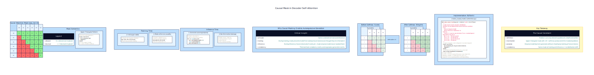

During training, the decoder sees the full target sequence. But during inference, it generates one token at a time—it should never "cheat" by looking at future tokens.
The causal mask ensures this:
```python
def create_causal_mask(seq_len):
    """
    Create causal mask for decoder self-attention.
    Positions can only attend to themselves and earlier positions.
    Returns:
        mask: [1, 1, seq_len, seq_len] where True = masked
    """
    # Upper triangular matrix (excluding diagonal)
    mask = torch.triu(torch.ones(seq_len, seq_len), diagonal=1).bool()
    return mask.unsqueeze(0).unsqueeze(0)
```
For `seq_len = 5`, the mask looks like:
```
Position can attend to:
       K0   K1   K2   K3   K4
Q0  [  0,   1,   1,   1,   1  ]   ← Q0 sees only K0
Q1  [  0,   0,   1,   1,   1  ]   ← Q1 sees K0, K1
Q2  [  0,   0,   0,   1,   1  ]
Q3  [  0,   0,   0,   0,   1  ]
Q4  [  0,   0,   0,   0,   0  ]   ← Q4 sees all positions
0 = attend (not masked), 1 = ignore (masked with -inf)
```
### Cross-Attention: The Information Bridge
> **Reveal**: In cross-attention, the decoder's queries 'interrogate' the encoder's keys to extract relevant information. The encoder output provides K and V—the 'memory' of the source sequence—while the decoder generates Q based on what it has generated so far. This is the information bottleneck through which source understanding flows into target generation.


This is the most critical operation in encoder-decoder Transformers. Let's be precise about what happens:
```python
# In cross-attention:
Q = W_Q(decoder_output)      # Query from decoder: [batch, tgt_len, d_model]
K = W_K(encoder_output)      # Key from encoder: [batch, src_len, d_model]
V = W_V(encoder_output)      # Value from encoder: [batch, src_len, d_model]
# Attention scores: decoder positions querying encoder positions
scores = Q @ K.T / sqrt(d_k)  # [batch, tgt_len, src_len]
```
**The semantic meaning**: Each decoder position (query) computes attention weights over all encoder positions (keys). The output is a weighted combination of encoder representations (values).
For translation, this means:
- When generating "chat" (French for "cat"), the decoder queries the encoder
- The encoder's representation of "cat" in "the cat sat" should have high attention weight
- The decoder receives a blend of encoder information weighted by relevance
**Critical detail**: Cross-attention K and V come from the *final* encoder output, but this output is passed to *every* decoder layer's cross-attention. This ensures all decoder layers have access to the full encoder representation.
```python
class DecoderLayer(nn.Module):
    """
    Single decoder layer: masked self-attention + cross-attention + FFN.
    Architecture (Post-LN):
        x -> Masked Self-Attn -> Add & Norm
          -> Cross-Attn -> Add & Norm
          -> FFN -> Add & Norm -> output
    """
    def __init__(self, d_model, num_heads, d_ff=None,
                 dropout=0.1, pre_norm=True):
        super().__init__()
        # Masked self-attention
        self.self_attn = MultiHeadAttention(
            d_model, num_heads, dropout=dropout
        )
        # Cross-attention (encoder-decoder attention)
        self.cross_attn = MultiHeadAttention(
            d_model, num_heads, dropout=dropout
        )
        # Feed-forward network
        self.ffn = PositionWiseFFN(
            d_model, d_ff, dropout=dropout
        )
        # Three sublayer connections
        self.sublayer1 = SublayerConnection(d_model, dropout, pre_norm)
        self.sublayer2 = SublayerConnection(d_model, dropout, pre_norm)
        self.sublayer3 = SublayerConnection(d_model, dropout, pre_norm)
        self.pre_norm = pre_norm
    def forward(self, x, encoder_output, tgt_mask=None, src_mask=None):
        """
        Args:
            x: Decoder input [batch, tgt_len, d_model]
            encoder_output: Encoder output [batch, src_len, d_model]
            tgt_mask: Causal mask for decoder self-attention
                      Shape: [1, 1, tgt_len, tgt_len] or broadcastable
            src_mask: Source padding mask
                      Shape: [batch, 1, 1, src_len] or broadcastable
        Returns:
            Output tensor [batch, tgt_len, d_model]
        """
        # 1. Masked self-attention (decoder attends to itself, causally)
        x = self.sublayer1(
            x, 
            lambda x: self.self_attn(x, x, x, tgt_mask)[0]
        )
        # 2. Cross-attention (decoder attends to encoder)
        # Q from decoder, K and V from encoder
        x = self.sublayer2(
            x,
            lambda x: self.cross_attn(x, encoder_output, encoder_output, src_mask)[0]
        )
        # 3. Feed-forward network
        x = self.sublayer3(x, self.ffn)
        return x
```
**Shape trace through decoder layer**:
```
Decoder input x:                [batch, tgt_len, d_model]
    ↓ Masked self-attention
After self-attn:                [batch, tgt_len, d_model]
    ↓ Cross-attention (with encoder output)
Encoder output:                 [batch, src_len, d_model]
After cross-attn:               [batch, tgt_len, d_model]
    ↓ FFN
Output:                         [batch, tgt_len, d_model]
```
---
## Stacking Layers: The Encoder and Decoder Stacks
A single layer isn't enough. The Transformer uses N layers (N=6 in the base model, N=12 in the big model). Let's build the stacks.


```python
class Encoder(nn.Module):
    """
    Stack of N encoder layers.
    """
    def __init__(self, d_model, num_heads, d_ff, num_layers,
                 dropout=0.1, pre_norm=True):
        super().__init__()
        # Create N identical encoder layers
        self.layers = nn.ModuleList([
            EncoderLayer(d_model, num_heads, d_ff, dropout, pre_norm)
            for _ in range(num_layers)
        ])
        # Final layer norm (important for Pre-LN)
        # In Pre-LN, the last layer's output hasn't been normalized
        self.final_norm = LayerNorm(d_model) if pre_norm else None
    def forward(self, x, src_mask=None):
        """
        Args:
            x: Input embeddings [batch, src_len, d_model]
            src_mask: Source padding mask
        Returns:
            Encoder output [batch, src_len, d_model]
        """
        for layer in self.layers:
            x = layer(x, src_mask)
        # Apply final norm for Pre-LN
        if self.final_norm is not None:
            x = self.final_norm(x)
        return x
```
**Why the final norm for Pre-LN?**
In Pre-LN, each sublayer normalizes its input *before* processing. The output of the last layer is a residual addition: `x = x + sublayer(norm(x))`. This hasn't been normalized, so we apply a final layer norm to stabilize the output.
For Post-LN, the last sublayer already normalizes, so no final norm is needed.
```python
class Decoder(nn.Module):
    """
    Stack of N decoder layers.
    """
    def __init__(self, d_model, num_heads, d_ff, num_layers,
                 dropout=0.1, pre_norm=True):
        super().__init__()
        # Create N identical decoder layers
        self.layers = nn.ModuleList([
            DecoderLayer(d_model, num_heads, d_ff, dropout, pre_norm)
            for _ in range(num_layers)
        ])
        # Final layer norm (for Pre-LN)
        self.final_norm = LayerNorm(d_model) if pre_norm else None
    def forward(self, x, encoder_output, tgt_mask=None, src_mask=None):
        """
        Args:
            x: Decoder input [batch, tgt_len, d_model]
            encoder_output: Encoder output [batch, src_len, d_model]
            tgt_mask: Causal mask for self-attention
            src_mask: Source padding mask for cross-attention
        Returns:
            Decoder output [batch, tgt_len, d_model]
        """
        for layer in self.layers:
            x = layer(x, encoder_output, tgt_mask, src_mask)
        # Apply final norm for Pre-LN
        if self.final_norm is not None:
            x = self.final_norm(x)
        return x
```
---
## The Complete Encoder-Decoder Transformer
Now we wire everything together:


```python
class EncoderDecoderTransformer(nn.Module):
    """
    Complete encoder-decoder Transformer for sequence-to-sequence tasks.
    Architecture:
        Input tokens -> Embedding + PE -> Encoder stack
                                            ↓
        Target tokens -> Embedding + PE -> Decoder stack -> Output projection -> Logits
    """
    def __init__(self, src_vocab_size, tgt_vocab_size, d_model=512,
                 num_heads=8, num_layers=6, d_ff=2048,
                 max_seq_len=5000, dropout=0.1, pre_norm=True):
        super().__init__()
        # Embeddings
        self.src_embedding = TransformerEmbedding(
            src_vocab_size, d_model, max_seq_len, dropout
        )
        self.tgt_embedding = TransformerEmbedding(
            tgt_vocab_size, d_model, max_seq_len, dropout
        )
        # Encoder and decoder stacks
        self.encoder = Encoder(
            d_model, num_heads, d_ff, num_layers, dropout, pre_norm
        )
        self.decoder = Decoder(
            d_model, num_heads, d_ff, num_layers, dropout, pre_norm
        )
        # Output projection to vocabulary
        self.output_projection = nn.Linear(d_model, tgt_vocab_size)
        # Store configuration
        self.d_model = d_model
        self.pre_norm = pre_norm
        # Initialize parameters
        self._init_parameters()
    def _init_parameters(self):
        """
        Initialize parameters following the original paper.
        Xavier uniform for most weights, normal for embeddings.
        """
        for p in self.parameters():
            if p.dim() > 1:
                nn.init.xavier_uniform_(p)
    def forward(self, src_tokens, tgt_tokens, src_mask=None, tgt_mask=None):
        """
        Args:
            src_tokens: Source token indices [batch, src_len]
            tgt_tokens: Target token indices [batch, tgt_len]
            src_mask: Source padding mask [batch, 1, 1, src_len]
            tgt_mask: Target causal mask [1, 1, tgt_len, tgt_len]
        Returns:
            logits: Output logits [batch, tgt_len, tgt_vocab_size]
        """
        # Embed source and target
        src_emb = self.src_embedding(src_tokens)  # [batch, src_len, d_model]
        tgt_emb = self.tgt_embedding(tgt_tokens)  # [batch, tgt_len, d_model]
        # Encode source
        encoder_output = self.encoder(src_emb, src_mask)  # [batch, src_len, d_model]
        # Decode target (attending to encoder)
        decoder_output = self.decoder(
            tgt_emb, encoder_output, tgt_mask, src_mask
        )  # [batch, tgt_len, d_model]
        # Project to vocabulary
        logits = self.output_projection(decoder_output)  # [batch, tgt_len, vocab_size]
        return logits
    def encode(self, src_tokens, src_mask=None):
        """Encode source sequence (for inference caching)."""
        src_emb = self.src_embedding(src_tokens)
        return self.encoder(src_emb, src_mask)
    def decode(self, tgt_tokens, encoder_output, tgt_mask=None, src_mask=None):
        """Decode given encoder output (for inference)."""
        tgt_emb = self.tgt_embedding(tgt_tokens)
        decoder_output = self.decoder(tgt_emb, encoder_output, tgt_mask, src_mask)
        return self.output_projection(decoder_output)
```
---
## Gradient Flow Verification: The Sanity Check
How do you know your architecture is correct? **Check that gradients flow to all parameters.**
```python
def verify_gradient_flow(model, src_tokens, tgt_tokens):
    """
    Verify that all parameters receive non-zero gradients.
    """
    # Forward pass
    logits = model(src_tokens, tgt_tokens)
    # Create a simple loss (sum of all outputs)
    loss = logits.sum()
    # Backward pass
    loss.backward()
    # Check gradients
    zero_grad_params = []
    for name, param in model.named_parameters():
        if param.grad is None:
            zero_grad_params.append(f"{name} (no grad)")
        elif torch.all(param.grad == 0):
            zero_grad_params.append(f"{name} (zero grad)")
    if zero_grad_params:
        print("⚠️  Parameters with no gradient flow:")
        for p in zero_grad_params:
            print(f"  - {p}")
        return False
    else:
        print("✓ All parameters receive gradients!")
        return True
def test_gradient_flow():
    """Test gradient flow on a small model."""
    torch.manual_seed(42)
    # Small model for testing
    model = EncoderDecoderTransformer(
        src_vocab_size=100,
        tgt_vocab_size=100,
        d_model=64,
        num_heads=4,
        num_layers=2,
        d_ff=256,
        dropout=0.0  # No dropout for gradient testing
    )
    # Sample input
    src = torch.randint(0, 100, (2, 10))
    tgt = torch.randint(0, 100, (2, 8))
    # Verify
    success = verify_gradient_flow(model, src, tgt)
    assert success, "Gradient flow verification failed!"
    # Check gradient magnitudes (should be reasonable, not NaN or inf)
    for name, param in model.named_parameters():
        if param.grad is not None:
            grad_norm = param.grad.norm().item()
            assert not math.isnan(grad_norm), f"NaN gradient in {name}"
            assert not math.isinf(grad_norm), f"Inf gradient in {name}"
            assert grad_norm > 0, f"Zero gradient in {name}"
    print("✓ Gradient magnitudes are healthy!")
    return model
# Run the test
model = test_gradient_flow()
```
---
## The Three-Level View
### Level 1 — Architectural Composition
At the architecture level, encoder and decoder layers are compositions of three primitive operations:
- **Attention**: Information routing (who talks to whom)
- **FFN**: Feature transformation (what to do with gathered information)
- **Normalization + Residual**: Gradient highway (ensuring learning happens)
The encoder is purely self-attention—all positions communicate with all positions. The decoder adds cross-attention—a controlled information flow from encoder to decoder through the Q/K/V bottleneck.
### Level 2 — Training Dynamics (Gradient Flow)
During training, gradients flow backward through:
1. **Output projection**: Full gradient to decoder output
2. **Decoder stack**: Gradients split at each residual connection
   - One path through the sublayer (attention/FFN)
   - One path directly to earlier layers (identity)
3. **Cross-attention**: Gradients flow from decoder queries to encoder keys/values
4. **Encoder stack**: Gradients from cross-attention propagate through encoder layers
**The residual connection gradient math**:
```
output = x + sublayer(x)
∂output/∂x = 1 + ∂sublayer/∂x
```
The `1` ensures gradients never vanish completely. Even if `∂sublayer/∂x ≈ 0`, the gradient is still at least 1.
**Pre-LN vs Post-LN gradient dynamics**:
- **Pre-LN**: Gradients bypass layer norm through residual → stable
- **Post-LN**: Gradients pass through layer norm → can be amplified/attenuated → less stable
### Level 3 — GPU Compute
Each encoder/decoder layer is a sequence of operations:
1. **Attention projections**: 3 × [batch, seq, d_model] × [d_model, d_model] → memory-bound for small batch
2. **Attention computation**: [batch, heads, seq, seq] → O(seq²) memory, the bottleneck
3. **FFN**: 2 × [batch, seq, d_model] × [d_model, d_ff] → compute-bound for d_ff = 4×d_model
4. **Layer norm**: [batch, seq, d_model] → memory-bound (element-wise operations)
**Memory budget per layer** (d_model=512, d_ff=2048, seq_len=512):
```
Attention parameters: 4 × 512 × 512 = 1M
FFN parameters: 2 × 512 × 2048 = 2M
Layer norm parameters: 2 × 512 × 2 = 2K
Total parameters per layer: ~3M
Activations (forward pass):
  Attention scores: batch × heads × seq × seq = batch × 8 × 512 × 512 = 2M × batch
  FFN intermediate: batch × seq × d_ff = batch × 512 × 2048 = 1M × batch
```
For a 6-layer model with batch_size=32, you need several GB just for activations.
---
## Common Pitfalls and Debugging
| Pitfall | Symptom | Fix |
|---------|---------|-----|
| **Cross-attention K/V from wrong source** | Decoder ignores encoder, poor translation | Ensure K, V come from `encoder_output`, not decoder input |
| **Causal mask not applied** | Model "cheats" during training, fails at inference | Pass `tgt_mask` to decoder self-attention |
| **Pre-LN without final norm** | Output has wrong scale, projection struggles | Add `final_norm` after last layer in Pre-LN |
| **Forgetting residual connection** | Gradients vanish in deep models | Use `x = x + sublayer(x)` pattern |
| **Wrong mask broadcasting** | RuntimeError or incorrect masking | Reshape masks to `[batch, 1, 1, seq]` |
| **Dropout in eval mode** | Outputs are stochastic during inference | Call `model.eval()` before inference |
| **No gradient flow verification** | Silent bugs in complex architectures | Always run gradient check on new models |
### Debugging Shape Issues
```python
def debug_shape_trace(model, src, tgt):
    """Print shapes at each layer for debugging."""
    print(f"Source input: {src.shape}")
    print(f"Target input: {tgt.shape}")
    # Hook to capture intermediate shapes
    shapes = {}
    def hook(name):
        def fn(module, input, output):
            if isinstance(input, tuple):
                shapes[name] = {
                    'input': [x.shape for x in input if hasattr(x, 'shape')],
                    'output': output.shape if hasattr(output, 'shape') else [o.shape for o in output]
                }
        return fn
    # Register hooks
    for i, layer in enumerate(model.encoder.layers):
        layer.self_attn.register_forward_hook(hook(f'encoder.{i}.self_attn'))
        layer.ffn.register_forward_hook(hook(f'encoder.{i}.ffn'))
    # Forward pass
    _ = model(src, tgt)
    # Print shapes
    for name, shape_dict in shapes.items():
        print(f"{name}: {shape_dict['input']} → {shape_dict['output']}")
```
---
## Knowledge Cascade: What You've Unlocked
### 1. Residual Connections in ResNet (Cross-Domain: Computer Vision)
The residual connection pattern you just learned is identical to ResNet's skip connections. In 2015, He et al. showed that adding `y = x + F(x)` instead of `y = F(x)` enabled training 152-layer networks. The Transformer adopts the exact same principle—the identity mapping provides a gradient highway that prevents vanishing gradients.
**The cross-domain insight**: Any deep architecture that composes many transformations benefits from residual connections. Whether processing images (CNNs) or sequences (Transformers), the math is identical: `∂(x + F(x))/∂x = 1 + ∂F/∂x`.
### 2. Pre-LN vs Post-LN Gradient Dynamics
You now understand why GPT-2 switched to Pre-LN. The gradient highway in Pre-LN bypasses all normalization, ensuring stable gradients even in 96-layer models. Post-LN requires careful learning rate warmup—without it, early gradient updates are too large and destabilize training.
**The practical implication**: If you're training a deep Transformer (>12 layers), use Pre-LN. If you need maximum performance and can afford careful tuning, Post-LN might give slightly better results.
### 3. Information Flow Bottlenecks
Cross-attention is the **only path** for encoder information to reach the decoder. Every decoder layer has access to the same encoder output—there's no "information decay" through the decoder stack. This design choice ensures the decoder never forgets what the encoder learned.
**The architectural insight**: If you removed cross-attention, the decoder would generate text based solely on the target prefix—essentially a language model with no understanding of the source. Cross-attention is what makes this a translation/sequence-to-sequence model rather than just a generator.
### 4. Why GPT Uses Decoder-Only
You now have the knowledge to understand why GPT, LLaMA, and most modern LLMs use **decoder-only** architectures:
If you don't need a separate encoder (you're not translating, just generating), self-attention with causal masking is sufficient. The decoder-only architecture:
- Removes cross-attention (no encoder to attend to)
- Uses causal self-attention (can't see future tokens)
- Is simpler and more parameter-efficient
**The design insight**: Encoder-decoder is for sequence-to-sequence (translation, summarization). Decoder-only is for sequence generation (language modeling, text generation). The components you built—attention, FFN, residuals, norms—are the same; only the wiring differs.
### 5. Layer Normalization Variants (ALiBi, RMSNorm)
The layer normalization you implemented is standard, but modern variants exist:
- **RMSNorm**: Removes the mean-centering, only normalizes by RMS. Faster and equally effective.
- **ALiBi**: Replaces positional encoding with an attention bias. Enables longer sequences than training length.
Understanding standard layer norm gives you the foundation to understand these variants—they're all solving the same problem: stabilizing activations for deep networks.
---
## Your Mission
You now have everything you need to implement encoder and decoder layers:
1. **Implement LayerNorm**: Normalize over feature dimension with learned scale/shift
2. **Implement SublayerConnection**: Residual + normalization, supporting both Pre-LN and Post-LN
3. **Implement EncoderLayer**: Self-attention + FFN with two sublayer connections
4. **Implement DecoderLayer**: Masked self-attention + cross-attention + FFN with three sublayer connections
5. **Implement Encoder/Decoder stacks**: Compose N layers with optional final normalization
6. **Verify gradient flow**: Ensure all parameters receive non-zero gradients
The implementation is ~150 lines of code, but every line matters. Test each component in isolation before composing them.
```python
# Quick sanity check
def sanity_check():
    """Verify encoder and decoder layers work correctly."""
    torch.manual_seed(42)
    # Create a small model
    model = EncoderDecoderTransformer(
        src_vocab_size=100,
        tgt_vocab_size=100,
        d_model=128,
        num_heads=4,
        num_layers=2,
        d_ff=512,
        dropout=0.1,
        pre_norm=True
    )
    # Sample input
    src = torch.randint(0, 100, (2, 16))
    tgt = torch.randint(0, 100, (2, 12))
    # Forward pass
    logits = model(src, tgt)
    print(f"Source shape: {src.shape}")
    print(f"Target shape: {tgt.shape}")
    print(f"Output logits shape: {logits.shape}")
    print(f"Expected: (2, 12, 100)")
    assert logits.shape == (2, 12, 100), f"Wrong output shape: {logits.shape}"
    # Count parameters
    total_params = sum(p.numel() for p in model.parameters())
    print(f"Total parameters: {total_params:,}")
    print("✓ Encoder-decoder transformer working!")
sanity_check()
```
Once this passes, you're ready for the next milestone: training the model on a real sequence-to-sequence task.
---
[[CRITERIA_JSON: {"milestone_id": "transformer-scratch-m4", "criteria": ["Implement LayerNorm class computing mean and variance over feature dimension with learned gamma (scale) and beta (shift) parameters, using epsilon=1e-6 for numerical stability", "Implement SublayerConnection supporting both Pre-LN (norm → sublayer → residual) and Post-LN (sublayer → residual → norm) variants with configurable pre_norm flag", "Implement EncoderLayer with self-attention sublayer + FFN sublayer, each wrapped in SublayerConnection with residual and normalization", "Implement DecoderLayer with three sublayers: masked self-attention, cross-attention (Q from decoder, K/V from encoder), and FFN, each with residual connections", "Cross-attention correctly uses decoder output as Query and encoder output as Key/Value, with encoder output passed to every decoder layer", "Causal mask applied to decoder self-attention preventing positions from attending to future tokens, implemented via upper-triangular -inf mask", "Encoder stack composes N identical EncoderLayers sequentially, with optional final LayerNorm for Pre-LN variant", "Decoder stack composes N identical DecoderLayers sequentially, with optional final LayerNorm for Pre-LN variant", "Default N=6 layers configurable via num_layers parameter, matching original Transformer architecture", "Implement complete EncoderDecoderTransformer class wiring source/target embeddings, encoder stack, decoder stack, and output projection to vocabulary", "Output projection maps decoder output [batch, tgt_len, d_model] to logits [batch, tgt_len, vocab_size] via linear layer", "Implement encode() and decode() methods for inference: encode() returns encoder output, decode() takes encoder output and target tokens", "Verify gradient flow: loss.backward() produces non-zero gradients for all parameters including all layers of encoder and decoder", "Verify no NaN or Inf gradients after backward pass, indicating numerical stability", "Document Pre-LN vs Post-LN trade-offs: Pre-LN more stable for deep models, Post-LN may achieve slightly better final performance but requires warmup", "Initialize parameters using Xavier uniform for weights (dim > 1 tensors) following original paper"]}]
<!-- END_MS -->


<!-- MS_ID: transformer-scratch-m5 -->
# Full Transformer Assembly & Training
## Where Architecture Meets the Grind of Optimization
You've built every component. Attention mechanisms that route information. Feed-forward networks that transform representations. Embeddings that ground tokens in continuous space. Encoder layers that digest source sequences. Decoder layers that generate targets while attending to source representations.
Now comes the moment of truth: **wire it all together and make it learn.**
Here's what nobody tells you: the architecture is the easy part. The original Transformer paper devotes nearly as much space to training details as to architecture. Why? Because Transformers are notoriously fragile during training. Forget learning rate warmup, and your model diverges in the first 100 steps. Skip gradient clipping, and you'll see NaN by step 50. Ignore label smoothing, and your model becomes confidently wrong.
And there's a deeper problem hiding in plain sight: **teacher forcing creates a train-test discrepancy that your architecture can't solve.** At training time, the decoder sees ground-truth previous tokens. At inference, it sees its own predictions—including its own mistakes. The model never learns to recover from errors because it's never exposed to them.
This milestone is about making your beautiful architecture actually work. Let's build the training machinery.
---
## The Tension: Training Transformers is Nothing Like Training Other Networks
Consider what happens when you train a simple classifier. You pass input through the network, compute loss, backpropagate, update weights. The loss goes down. Done.
Now consider training a Transformer for sequence-to-sequence tasks:
**Problem 1: The decoder generates sequences autoregressively**
At each step, the decoder predicts the next token. But during training, you don't have time to generate sequences token-by-token—that would be excruciatingly slow. Instead, you use **teacher forcing**: feed the entire target sequence at once, letting each position predict the next token in parallel.
This is elegant and fast, but it creates a fundamental mismatch:
- **Training**: Decoder always sees correct previous tokens
- **Inference**: Decoder sees its own (possibly wrong) predictions
This is called **exposure bias**. The model is never exposed to its own mistakes during training, so it has no strategy for recovery.
**Problem 2: The loss landscape is treacherous**
Transformers have millions of parameters in a highly non-convex loss landscape. Early in training, gradient magnitudes can vary wildly between layers. A naive optimizer step can send parameters into regions from which recovery is impossible.
**Problem 3: Overconfidence is a disease**
Cross-entropy loss pushes the model toward predicting probability 1.0 for the correct class. But in language, uncertainty is real. "The cat sat on the ___" could plausibly be "mat," "floor," "couch," or "bed." A model that outputs `[0.0, 0.0, 1.0, 0.0]` for "mat" is overconfident—it will generalize poorly.

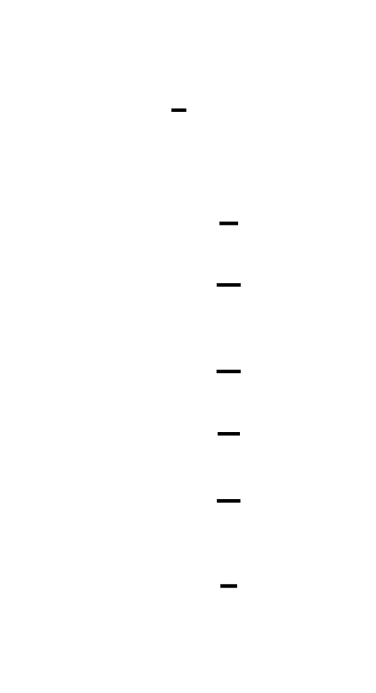

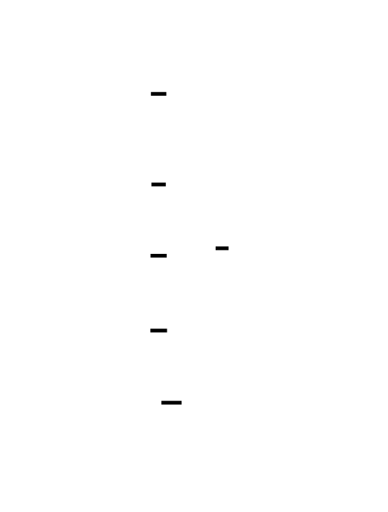

---
## The Revelation: Why Training Setup Matters More Than You Think
> **Misconception**: Training a Transformer is like training any neural network—just call `loss.backward()` and step the optimizer.
>
> **Reality**: Transformers are notoriously sensitive to training setup. Learning rate warmup is essential, gradient clipping prevents explosions, and label smoothing prevents overconfidence. The original paper's training section is as long as the architecture section for good reason.
Let's make this concrete with numbers from the original Transformer paper:
| Training Detail | Original Transformer Setting | What Happens If You Skip It |
|-----------------|----------------------------|----------------------------|
| Learning rate warmup | 4000 steps linear warmup | Model diverges in first 100 steps |
| Gradient clipping | Max norm 1.0 | NaN gradients by step ~50 |
| Label smoothing | ε = 0.1 | Overconfident predictions, worse BLEU |
| Adam β₂ | 0.98 (not default 0.999) | Slower convergence |
| Dropout | 0.1 (per layer) | Overfitting on small datasets |
These aren't suggestions—they're requirements for stable training. Let's understand why each matters.
---
## Teacher Forcing: Parallel Training with a Hidden Cost
During training, you have access to the complete target sequence. Instead of generating token-by-token (slow), you can compute all predictions in parallel:


```python
# Teacher forcing: the decoder sees ground-truth previous tokens
# Input to decoder:  <sos> The cat sat on the mat
# Target for loss:   The cat sat on the mat <eos>
# Each position predicts the NEXT token
def prepare_decoder_input_target(target_tokens, sos_token_id, eos_token_id):
    """
    Prepare decoder input and target for teacher forcing.
    Args:
        target_tokens: [batch, tgt_len] without special tokens
        sos_token_id: Start-of-sequence token ID
        eos_token_id: End-of-sequence token ID
    Returns:
        decoder_input: [batch, tgt_len] with <sos> prepended, <eos> removed
        target: [batch, tgt_len] with <eos> appended, <sos> removed
    """
    batch_size, tgt_len = target_tokens.shape
    # Decoder input: <sos> + target_tokens[:-1]
    decoder_input = torch.zeros(batch_size, tgt_len, dtype=torch.long)
    decoder_input[:, 0] = sos_token_id
    decoder_input[:, 1:] = target_tokens[:, :-1]
    # Target for loss: target_tokens[1:] + <eos>
    target = torch.zeros(batch_size, tgt_len, dtype=torch.long)
    target[:, :-1] = target_tokens[:, 1:]
    target[:, -1] = eos_token_id
    return decoder_input, target
```
**The key insight**: The decoder input at position `i` should predict the target at position `i+1`. This is the fundamental shift that makes teacher forcing work:
- Decoder sees: `<sos> The cat sat on the ma`
- Predicts:      `The cat sat on the mat`
Each position in the decoder output corresponds to a prediction for the next token.
**Why this is fast**: The entire sequence is processed in one forward pass. The causal mask ensures position `i` can't see positions `> i`, so there's no information leakage.
**The exposure bias problem**: During inference, the decoder feeds its own predictions back as input. If it makes a mistake at position 5, position 6 sees that mistake—and may make another mistake, cascading into gibberish.
```python
# Training: always sees correct context
decoder_input = [sos, The, cat, sat, on, the, mat]  # Ground truth
predictions = model(src, decoder_input)  # All correct context available
# Inference: sees its own predictions (which may be wrong)
generated = [sos]
for _ in range(max_len):
    next_token = model(src, generated).argmax(-1)[:, -1]
    generated.append(next_token)
    # If we predicted "dog" instead of "cat", all subsequent predictions
    # are now operating in a different semantic space!
```
This is why beam search at inference often outperforms greedy decoding—beam search explores alternatives when the model is uncertain, partially compensating for never seeing its own errors during training.
---
## The Output Projection: From Hidden States to Vocabulary
The decoder produces continuous vectors `[batch, tgt_len, d_model]`. But you need probability distributions over the vocabulary. This is the job of the output projection:
```python
class OutputProjection(nn.Module):
    """
    Projects decoder output to vocabulary logits.
    Can optionally share weights with target embedding (tie_weights=True),
    which reduces parameters and can improve generalization.
    """
    def __init__(self, d_model, vocab_size, tie_weights=None):
        super().__init__()
        self.projection = nn.Linear(d_model, vocab_size, bias=False)
        self.tie_weights = tie_weights
        if tie_weights is not None:
            # Weight tying: share weights with embedding
            # tie_weights should be the target embedding layer
            self.projection.weight = tie_weights.weight
    def forward(self, decoder_output):
        """
        Args:
            decoder_output: [batch, tgt_len, d_model]
        Returns:
            logits: [batch, tgt_len, vocab_size]
        """
        return self.projection(decoder_output)
```
**Weight tying**: The original Transformer ties the output projection weights to the target embedding weights. This means:
- Embedding: maps token ID → vector (lookup)
- Projection: maps vector → token logits (linear)
Mathematically, these are transposes of each other. Sharing weights:
1. Reduces parameters by `vocab_size × d_model`
2. Acts as regularization (embeddings and projections must be consistent)
3. Improves performance on many tasks
```python
# In the full model:
self.output_projection = OutputProjection(
    d_model, 
    tgt_vocab_size, 
    tie_weights=self.tgt_embedding.token_embedding  # Weight tying
)
```
---
## Masked Cross-Entropy Loss: Ignoring Padding
Not all positions in your batch have real tokens—some are padding. The loss function must ignore these positions:

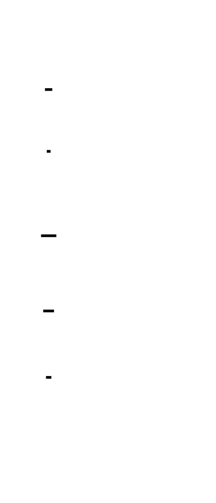

```python
class MaskedCrossEntropyLoss(nn.Module):
    """
    Cross-entropy loss that ignores padding positions.
    Args:
        pad_token_id: Token ID to ignore in loss computation
        label_smoothing: Label smoothing epsilon (0.0 = no smoothing)
    """
    def __init__(self, pad_token_id, label_smoothing=0.0):
        super().__init__()
        self.pad_token_id = pad_token_id
        self.label_smoothing = label_smoothing
        self.ce_loss = nn.CrossEntropyLoss(
            ignore_index=pad_token_id,
            label_smoothing=label_smoothing,
            reduction='none'  # We'll handle reduction ourselves for logging
        )
    def forward(self, logits, targets):
        """
        Args:
            logits: [batch, tgt_len, vocab_size]
            targets: [batch, tgt_len]
        Returns:
            loss: Scalar loss (mean over non-padding positions)
            n_tokens: Number of non-padding tokens (for logging)
        """
        batch_size, tgt_len, vocab_size = logits.shape
        # Reshape for cross-entropy: expects [batch * seq, vocab] and [batch * seq]
        logits_flat = logits.reshape(-1, vocab_size)
        targets_flat = targets.reshape(-1)
        # Compute per-token loss
        loss_per_token = self.ce_loss(logits_flat, targets_flat)  # [batch * tgt_len]
        # Create mask for non-padding positions
        non_pad_mask = (targets_flat != self.pad_token_id)
        n_tokens = non_pad_mask.sum()
        # Mean loss over non-padding positions
        loss = loss_per_token.sum() / n_tokens.clamp(min=1)
        return loss, n_tokens.item()
```
**Why ignore padding?** If you don't, the model will optimize for predicting padding tokens—the most common token in your batch! This corrupts the learning signal.
---
## Label Smoothing: Preventing Overconfidence

> **🔑 Foundation: Label smoothing**
>
> Label smoothing is a regularization technique applied to classification tasks. Instead of using "hard" labels (e.g., 1 for the correct class, 0 for all others), it replaces these with "soft" labels, mixing them with a uniform distribution. This means the target for the correct class is slightly lower than 1, and the targets for incorrect classes are slightly higher than 0.

Neural networks can sometimes become overconfident in their predictions, assigning extremely high probabilities to the predicted class. This overconfidence can lead to poor generalization on unseen data. Label smoothing encourages the network to be less certain, improving robustness and preventing overfitting by penalizing the network for outputs that are too confident.

Think of label smoothing as adding a small amount of noise to the target labels. This forces the model to learn a more robust representation, making it less sensitive to small variations in the input data and encouraging it to consider the less likely classes.


The model outputs logits, which softmax converts to probabilities. Without regularization, cross-entropy pushes the model toward predicting probability 1.0 for the correct class. But this is harmful for several reasons:
1. **Language is inherently uncertain**: "The cat sat on the ___" has multiple valid completions
2. **Overconfident models generalize poorly**: They don't explore alternatives
3. **Gradient saturation**: Probabilities near 1.0 have near-zero gradients
Label smoothing replaces hard targets with soft targets:
$$y_{smooth} = (1 - \epsilon) \cdot y_{true} + \epsilon / K$$
Where K is the number of classes (vocabulary size) and ε is the smoothing factor (typically 0.1).


```python
# Example: vocabulary size 5, true label is index 2
# Without smoothing: [0.0, 0.0, 1.0, 0.0, 0.0]
# With smoothing (ε=0.1): [0.02, 0.02, 0.92, 0.02, 0.02]
def apply_label_smoothing(targets, vocab_size, epsilon=0.1, pad_token_id=None):
    """
    Apply label smoothing to target distribution.
    Args:
        targets: [batch, tgt_len] token IDs
        vocab_size: Size of vocabulary
        epsilon: Smoothing factor
        pad_token_id: If provided, padding positions get zero probability mass
    Returns:
        smoothed_targets: [batch, tgt_len, vocab_size] soft targets
    """
    batch_size, tgt_len = targets.shape
    # Start with uniform distribution
    smoothed = torch.full(
        (batch_size, tgt_len, vocab_size), 
        epsilon / (vocab_size - 1)  # -1 because true class gets (1-epsilon)
    )
    # Set true class probability
    smoothed.scatter_(2, targets.unsqueeze(-1), 1.0 - epsilon)
    # Zero out padding positions if specified
    if pad_token_id is not None:
        pad_mask = (targets == pad_token_id).unsqueeze(-1)
        smoothed[pad_mask] = 0.0
    return smoothed
```
**PyTorch's built-in support**: `nn.CrossEntropyLoss(label_smoothing=0.1)` handles this automatically.
---
## Learning Rate Scheduling: Warmup Is Not Optional
Here's the most counterintuitive aspect of Transformer training: **you start with a tiny learning rate and increase it.**
Why? Early in training, parameters are randomly initialized. A large learning rate would make huge, random updates that push parameters into bad regions of the loss landscape. Warmup lets the model "settle" into a reasonable region before taking large steps.


The original Transformer uses a learning rate schedule that:
1. **Warmup phase**: Linearly increase from 0 to peak learning rate over `warmup_steps`
2. **Decay phase**: Decrease proportionally to the inverse square root of step count
$$lr = d_{model}^{-0.5} \cdot \min(step^{-0.5}, step \cdot warmup\_steps^{-1.5})$$
```python
class TransformerLRScheduler:
    """
    Learning rate scheduler from 'Attention Is All You Need'.
    lr = d_model^{-0.5} * min(step^{-0.5}, step * warmup_steps^{-1.5})
    Args:
        d_model: Model dimension (affects scale)
        warmup_steps: Number of warmup steps
        lr_multiplier: Optional multiplier for peak learning rate
    """
    def __init__(self, d_model, warmup_steps, lr_multiplier=1.0):
        self.d_model = d_model
        self.warmup_steps = warmup_steps
        self.lr_multiplier = lr_multiplier
        self.step_count = 0
    def step(self):
        """Advance step and return current learning rate."""
        self.step_count += 1
        return self.get_lr()
    def get_lr(self):
        """Get current learning rate without advancing step."""
        step = self.step_count
        # Avoid division by zero at step 0
        step = max(step, 1)
        # Inverse sqrt decay factor
        decay = step ** (-0.5)
        # Warmup factor (linear increase during warmup)
        warmup = step * (self.warmup_steps ** (-1.5))
        # Take minimum (warmup dominates early, decay dominates later)
        lr = (self.d_model ** (-0.5)) * min(decay, warmup)
        return lr * self.lr_multiplier
```
**Alternative: Cosine annealing**
Modern implementations often use cosine decay instead of inverse sqrt:
```python
class CosineLRScheduler:
    """
    Cosine learning rate schedule with warmup.
    During warmup: linear increase from 0 to lr
    After warmup: cosine decay from lr to min_lr
    """
    def __init__(self, warmup_steps, total_steps, lr, min_lr=0.0):
        self.warmup_steps = warmup_steps
        self.total_steps = total_steps
        self.lr = lr
        self.min_lr = min_lr
        self.step_count = 0
    def step(self):
        self.step_count += 1
        return self.get_lr()
    def get_lr(self):
        if self.step_count < self.warmup_steps:
            # Linear warmup
            return self.lr * self.step_count / self.warmup_steps
        else:
            # Cosine decay
            progress = (self.step_count - self.warmup_steps) / (
                self.total_steps - self.warmup_steps
            )
            cosine_factor = 0.5 * (1 + math.cos(math.pi * progress))
            return self.min_lr + (self.lr - self.min_lr) * cosine_factor
```
**Typical values**:
- Warmup steps: 4000 (original paper) or 1-2% of total steps
- Peak learning rate: 0.0001 to 0.001 (depends on batch size)
- For Adam: β₁=0.9, β₂=0.98 (not default 0.999), ε=10⁻⁹
---
## Gradient Clipping: Preventing Explosions
Even with warmup, gradients can occasionally explode—especially with Post-LN architectures. Gradient clipping limits the gradient norm to prevent destabilizing updates:


```python
def clip_gradients(model, max_norm=1.0):
    """
    Clip gradients by global norm.
    Args:
        model: The model whose gradients to clip
        max_norm: Maximum allowed gradient norm
    Returns:
        total_norm: The gradient norm before clipping
    """
    total_norm = torch.nn.utils.clip_grad_norm_(
        model.parameters(), 
        max_norm
    )
    return total_norm
```
**How it works**:
1. Compute the global norm: `||g|| = sqrt(sum(||g_i||^2))` for all parameter gradients `g_i`
2. If `||g|| > max_norm`, scale all gradients by `max_norm / ||g||`
3. This preserves gradient direction while limiting magnitude
**When gradients explode**: You'll see `total_norm` spike to 100, 1000, or even NaN. Clipping prevents these spikes from destroying your parameters.
---
## The Complete Training Loop
Now let's put everything together:
```python
import torch
import torch.nn as nn
from torch.utils.data import DataLoader
from tqdm import tqdm
import math
class Trainer:
    """
    Training loop for encoder-decoder Transformer.
    Handles:
    - Teacher forcing with shifted targets
    - Learning rate scheduling with warmup
    - Gradient clipping
    - Logging and checkpointing
    """
    def __init__(
        self,
        model,
        train_dataloader,
        val_dataloader,
        pad_token_id,
        vocab_size,
        d_model=512,
        warmup_steps=4000,
        max_steps=100000,
        lr=0.0001,
        max_grad_norm=1.0,
        label_smoothing=0.1,
        device='cuda',
        log_every=100,
        eval_every=1000,
        checkpoint_every=5000,
        checkpoint_dir='checkpoints'
    ):
        self.model = model.to(device)
        self.train_dataloader = train_dataloader
        self.val_dataloader = val_dataloader
        self.pad_token_id = pad_token_id
        self.vocab_size = vocab_size
        self.device = device
        self.log_every = log_every
        self.eval_every = eval_every
        self.checkpoint_every = checkpoint_every
        self.checkpoint_dir = checkpoint_dir
        # Loss function
        self.criterion = nn.CrossEntropyLoss(
            ignore_index=pad_token_id,
            label_smoothing=label_smoothing,
            reduction='none'
        )
        # Optimizer (Adam with Transformer-specific settings)
        self.optimizer = torch.optim.Adam(
            model.parameters(),
            lr=lr,
            betas=(0.9, 0.98),
            eps=1e-9
        )
        # Learning rate scheduler
        self.scheduler = TransformerLRScheduler(
            d_model=d_model,
            warmup_steps=warmup_steps,
            lr_multiplier=lr * math.sqrt(d_model)  # Scale to match paper
        )
        self.max_grad_norm = max_grad_norm
        self.global_step = 0
        self.max_steps = max_steps
        # Metrics tracking
        self.train_losses = []
        self.val_losses = []
        self.learning_rates = []
    def train_step(self, batch):
        """
        Single training step.
        Args:
            batch: Dict with 'src_tokens', 'tgt_tokens', 'src_mask', 'tgt_mask'
        Returns:
            loss: Scalar loss
            n_tokens: Number of tokens processed
        """
        # Move batch to device
        src_tokens = batch['src_tokens'].to(self.device)
        tgt_tokens = batch['tgt_tokens'].to(self.device)
        src_mask = batch.get('src_mask')
        tgt_mask = batch.get('tgt_mask')
        if src_mask is not None:
            src_mask = src_mask.to(self.device)
        if tgt_mask is not None:
            tgt_mask = tgt_mask.to(self.device)
        # Prepare decoder input and target (teacher forcing shift)
        # decoder_input: <sos> + tgt[:-1]
        # target: tgt[1:] + <eos>
        batch_size, tgt_len = tgt_tokens.shape
        decoder_input = tgt_tokens[:, :-1]  # Remove last token
        target = tgt_tokens[:, 1:]  # Remove first token (should be <sos>)
        # Regenerate causal mask for new sequence length
        new_tgt_len = decoder_input.size(1)
        tgt_mask = torch.triu(
            torch.ones(new_tgt_len, new_tgt_len, device=self.device), 
            diagonal=1
        ).bool().unsqueeze(0).unsqueeze(0)
        # Forward pass
        logits = self.model(
            src_tokens, 
            decoder_input, 
            src_mask=src_mask, 
            tgt_mask=tgt_mask
        )  # [batch, tgt_len-1, vocab_size]
        # Compute loss
        logits_flat = logits.reshape(-1, self.vocab_size)
        targets_flat = target.reshape(-1)
        loss_per_token = self.criterion(logits_flat, targets_flat)
        # Mask padding tokens
        non_pad_mask = (targets_flat != self.pad_token_id)
        n_tokens = non_pad_mask.sum().item()
        loss = loss_per_token.sum() / max(n_tokens, 1)
        return loss, n_tokens
    def train(self):
        """
        Main training loop.
        """
        self.model.train()
        # Create progress bar
        pbar = tqdm(total=self.max_steps, desc="Training")
        # Training loop
        while self.global_step < self.max_steps:
            for batch in self.train_dataloader:
                if self.global_step >= self.max_steps:
                    break
                # Get learning rate and update optimizer
                lr = self.scheduler.step()
                for param_group in self.optimizer.param_groups:
                    param_group['lr'] = lr
                # Zero gradients
                self.optimizer.zero_grad()
                # Forward pass
                loss, n_tokens = self.train_step(batch)
                # Backward pass
                loss.backward()
                # Gradient clipping
                grad_norm = torch.nn.utils.clip_grad_norm_(
                    self.model.parameters(), 
                    self.max_grad_norm
                )
                # Optimizer step
                self.optimizer.step()
                # Logging
                self.train_losses.append(loss.item())
                self.learning_rates.append(lr)
                if self.global_step % self.log_every == 0:
                    pbar.set_postfix({
                        'loss': f'{loss.item():.4f}',
                        'lr': f'{lr:.2e}',
                        'grad': f'{grad_norm:.2f}'
                    })
                # Evaluation
                if self.global_step % self.eval_every == 0:
                    val_loss = self.evaluate()
                    self.val_losses.append(val_loss)
                    self.model.train()  # Back to training mode
                # Checkpointing
                if self.global_step % self.checkpoint_every == 0:
                    self.save_checkpoint()
                self.global_step += 1
                pbar.update(1)
        pbar.close()
        print("Training complete!")
    @torch.no_grad()
    def evaluate(self):
        """
        Evaluate on validation set.
        """
        self.model.eval()
        total_loss = 0.0
        total_tokens = 0
        for batch in self.val_dataloader:
            loss, n_tokens = self.train_step(batch)
            total_loss += loss.item() * n_tokens
            total_tokens += n_tokens
        avg_loss = total_loss / max(total_tokens, 1)
        print(f"\nValidation loss: {avg_loss:.4f}")
        return avg_loss
    def save_checkpoint(self):
        """Save model checkpoint."""
        import os
        os.makedirs(self.checkpoint_dir, exist_ok=True)
        checkpoint = {
            'step': self.global_step,
            'model_state_dict': self.model.state_dict(),
            'optimizer_state_dict': self.optimizer.state_dict(),
            'train_losses': self.train_losses,
            'val_losses': self.val_losses,
            'learning_rates': self.learning_rates
        }
        path = f"{self.checkpoint_dir}/checkpoint_{self.global_step}.pt"
        torch.save(checkpoint, path)
        print(f"Checkpoint saved: {path}")
```
---
## Synthetic Task: The Copy Task
Before training on real data, let's verify the model can learn a simple task. The **copy task** is the "hello world" of sequence-to-sequence:
**Task**: Given an input sequence, output the same sequence.
```
Input:  3 7 2 9 1 4
Output: 3 7 2 9 1 4
```
This tests the model's ability to:
1. Encode the input sequence
2. Attend to the encoder representation
3. Generate the output autoregressively
```python
import torch
from torch.utils.data import Dataset, DataLoader
class CopyTaskDataset(Dataset):
    """
    Synthetic dataset for the copy task.
    Each sample is a random sequence of integers.
    The target is the same sequence.
    """
    def __init__(self, n_samples, seq_len, vocab_size, sos_token=1, eos_token=2, pad_token=0):
        self.n_samples = n_samples
        self.seq_len = seq_len
        self.vocab_size = vocab_size
        self.sos_token = sos_token
        self.eos_token = eos_token
        self.pad_token = pad_token
        # Generate random sequences
        # Use tokens 3 to vocab_size-1 (reserve 0, 1, 2 for special tokens)
        self.sequences = torch.randint(3, vocab_size, (n_samples, seq_len))
    def __len__(self):
        return self.n_samples
    def __getitem__(self, idx):
        seq = self.sequences[idx]
        # Source: sequence with <sos> and <eos>
        src = torch.cat([
            torch.tensor([self.sos_token]),
            seq,
            torch.tensor([self.eos_token])
        ])
        # Target: same sequence with <sos> and <eos>
        tgt = torch.cat([
            torch.tensor([self.sos_token]),
            seq,
            torch.tensor([self.eos_token])
        ])
        return {
            'src_tokens': src,
            'tgt_tokens': tgt
        }
def collate_fn(batch, pad_token=0):
    """
    Collate function to pad sequences in a batch.
    """
    src_tokens = [item['src_tokens'] for item in batch]
    tgt_tokens = [item['tgt_tokens'] for item in batch]
    # Pad to max length in batch
    src_padded = torch.nn.utils.rnn.pad_sequence(
        src_tokens, batch_first=True, padding_value=pad_token
    )
    tgt_padded = torch.nn.utils.rnn.pad_sequence(
        tgt_tokens, batch_first=True, padding_value=pad_token
    )
    # Create source padding mask
    src_mask = (src_padded == pad_token).unsqueeze(1).unsqueeze(2)
    return {
        'src_tokens': src_padded,
        'tgt_tokens': tgt_padded,
        'src_mask': src_mask
    }
def train_copy_task():
    """
    Train a Transformer on the copy task.
    """
    # Hyperparameters
    vocab_size = 20  # Small vocabulary for testing
    d_model = 128
    num_heads = 4
    num_layers = 2
    d_ff = 512
    dropout = 0.1
    batch_size = 32
    n_samples = 1000
    seq_len = 10
    max_steps = 5000
    # Create model
    model = EncoderDecoderTransformer(
        src_vocab_size=vocab_size,
        tgt_vocab_size=vocab_size,
        d_model=d_model,
        num_heads=num_heads,
        num_layers=num_layers,
        d_ff=d_ff,
        dropout=dropout,
        pre_norm=True
    )
    # Create dataset
    train_dataset = CopyTaskDataset(n_samples, seq_len, vocab_size)
    train_dataloader = DataLoader(
        train_dataset, 
        batch_size=batch_size, 
        shuffle=True,
        collate_fn=lambda b: collate_fn(b, pad_token=0)
    )
    val_dataset = CopyTaskDataset(100, seq_len, vocab_size)
    val_dataloader = DataLoader(
        val_dataset,
        batch_size=batch_size,
        shuffle=False,
        collate_fn=lambda b: collate_fn(b, pad_token=0)
    )
    # Create trainer
    trainer = Trainer(
        model=model,
        train_dataloader=train_dataloader,
        val_dataloader=val_dataloader,
        pad_token_id=0,
        vocab_size=vocab_size,
        d_model=d_model,
        warmup_steps=400,
        max_steps=max_steps,
        lr=0.0005,
        max_grad_norm=1.0,
        label_smoothing=0.1,
        device='cuda' if torch.cuda.is_available() else 'cpu',
        log_every=50,
        eval_every=500,
        checkpoint_every=1000
    )
    # Train
    trainer.train()
    # Test inference
    print("\n=== Testing Inference ===")
    test_copy_inference(model, vocab_size, trainer.device)
    return model, trainer
def test_copy_inference(model, vocab_size, device):
    """
    Test the trained model on copy task inference.
    """
    model.eval()
    # Generate a test sequence
    test_seq = torch.randint(3, vocab_size, (1, 8))
    src = torch.cat([
        torch.tensor([[1]]),  # <sos>
        test_seq,
        torch.tensor([[2]])   # <eos>
    ], dim=1).to(device)
    print(f"Input sequence: {test_seq[0].tolist()}")
    # Encode source
    with torch.no_grad():
        encoder_output = model.encode(src)
    # Generate autoregressively
    generated = torch.tensor([[1]]).to(device)  # Start with <sos>
    for _ in range(12):  # Max generation length
        with torch.no_grad():
            logits = model.decode(generated, encoder_output)
            next_token = logits[:, -1, :].argmax(dim=-1, keepdim=True)
            generated = torch.cat([generated, next_token], dim=1)
            if next_token.item() == 2:  # <eos>
                break
    print(f"Generated sequence: {generated[0].tolist()}")
    print(f"Expected: [1] + {test_seq[0].tolist()} + [2]")
```
**Expected behavior**: Loss should drop below 0.1 within 1000-2000 steps, and the model should correctly copy sequences at inference time.
---
## The Three-Level View
### Level 1 — Mathematical Operations
**Teacher forcing** shifts the target sequence by one position, creating a supervised learning problem where each decoder position predicts the next token:
$$\mathcal{L} = -\frac{1}{N} \sum_{i=1}^{N} \sum_{t=1}^{T} \log P(y_t | y_{<t}, x) \cdot \mathbb{1}[y_t \neq \text{PAD}]$$
**Label smoothing** regularizes the target distribution:
$$y'_k = (1 - \epsilon) \cdot \mathbb{1}[k = y] + \frac{\epsilon}{K}$$
**Learning rate schedule** follows inverse square root decay after warmup:
$$\eta_t = \eta_{\max} \cdot \frac{\min(t^{-0.5}, t \cdot w^{-1.5})}{\sqrt{d_{model}}}$$
### Level 2 — Training Dynamics
**Gradient flow** in teacher forcing:
- Each position receives gradients independently (parallel computation)
- Cross-attention gradients flow from decoder to encoder
- Residual connections ensure gradients don't vanish
**Warmup dynamics**:
- Early steps have tiny learning rates → parameters stay close to initialization
- As warmup progresses, learning rate increases → larger exploration
- After warmup, decay dominates → fine-tuning in good region
**Exposure bias**:
- Model never sees its own errors during training
- At inference, errors compound: mistake at position 5 → corrupted context for position 6+
- Beam search partially compensates by exploring alternatives
### Level 3 — GPU Compute
**Memory budget** (for d_model=512, batch=32, seq_len=64, vocab=30k):
| Component | Size |
|-----------|------|
| Model parameters (6 layers) | ~65M × 4 bytes = 260 MB |
| Forward activations | batch × layers × seq² × heads × 4 = ~150 MB |
| Optimizer states (Adam) | 2 × parameters = 520 MB |
| Gradients | 1 × parameters = 260 MB |
| **Total** | **~1.2 GB** |
**Training throughput**:
- Forward pass: ~50ms for batch=32, seq=64
- Backward pass: ~100ms (2× forward due to gradient computation)
- Optimizer step: ~10ms
- **Total per step**: ~160ms → ~6 steps/second
---
## Common Pitfalls and Debugging
| Pitfall | Symptom | Fix |
|---------|---------|-----|
| **No warmup** | Loss explodes or NaN in first 100 steps | Add warmup schedule (4000 steps or 1-2% of training) |
| **Wrong target shift** | Model predicts current token instead of next | Decoder input: `tgt[:-1]`, Target: `tgt[1:]` |
| **Padding not masked in loss** | Loss doesn't decrease, model predicts padding | Use `ignore_index=pad_token_id` in CrossEntropyLoss |
| **No gradient clipping** | Gradient norm spikes to 1000+, NaN appears | Add `clip_grad_norm_(model.parameters(), 1.0)` |
| **Learning rate too high** | Loss oscillates or diverges | Reduce lr by 10×, ensure warmup |
| **Causal mask wrong shape** | RuntimeError in attention | Regenerate mask for decoder input length |
| **Dropout in eval mode** | Outputs inconsistent between runs | Call `model.eval()` for inference |
| **Label smoothing too high** | Model underconfident, poor accuracy | Use ε=0.1 or lower |
### Debugging Training Issues
```python
def diagnose_training(trainer, batch):
    """
    Diagnose common training issues.
    """
    print("=== Training Diagnostics ===\n")
    # Check model is in training mode
    print(f"Model training mode: {trainer.model.training}")
    # Check learning rate
    lr = trainer.scheduler.get_lr()
    print(f"Current learning rate: {lr:.2e}")
    # Forward pass
    trainer.model.train()
    trainer.optimizer.zero_grad()
    loss, n_tokens = trainer.train_step(batch)
    print(f"Loss: {loss.item():.4f}")
    print(f"Non-padding tokens: {n_tokens}")
    # Backward pass
    loss.backward()
    # Check gradient norms
    total_norm = 0.0
    param_norms = []
    for name, param in trainer.model.named_parameters():
        if param.grad is not None:
            param_norm = param.grad.norm().item()
            param_norms.append((name, param_norm))
            total_norm += param_norm ** 2
    total_norm = total_norm ** 0.5
    print(f"Total gradient norm: {total_norm:.2f}")
    # Check for NaN/Inf
    has_nan = any(torch.isnan(p.grad).any() for p in trainer.model.parameters() if p.grad is not None)
    has_inf = any(torch.isinf(p.grad).any() for p in trainer.model.parameters() if p.grad is not None)
    print(f"NaN in gradients: {has_nan}")
    print(f"Inf in gradients: {has_inf}")
    # Show largest gradient norms
    param_norms.sort(key=lambda x: x[1], reverse=True)
    print("\nTop 5 parameters by gradient norm:")
    for name, norm in param_norms[:5]:
        print(f"  {name}: {norm:.4f}")
    return {
        'loss': loss.item(),
        'grad_norm': total_norm,
        'has_nan': has_nan,
        'has_inf': has_inf
    }
```
---
## Knowledge Cascade: What You've Unlocked
### 1. Curriculum Learning (Cross-Domain: Optimization)
The warmup schedule is a form of **curriculum learning**—starting with small updates to establish a reasonable initialization region before taking larger steps. This same principle appears in:
- **Progressive resizing** (computer vision): Start with small images, gradually increase resolution
- **Curriculum by difficulty** (NLP): Start with short sentences, gradually increase length
- **Simulated annealing** (optimization): Start with high "temperature" (exploration), gradually cool (exploitation)
The Transformer's warmup is implicitly defining a curriculum: "first, find a reasonable region; then, fine-tune."
### 2. Scheduled Sampling for Exposure Bias
You now understand why **scheduled sampling** was proposed to address exposure bias. Instead of always using teacher forcing, scheduled sampling occasionally feeds the model's own predictions back as input during training:
```python
# Scheduled sampling: gradually increase the probability of using model predictions
def scheduled_sampling_step(model, src, tgt, teacher_forcing_ratio):
    """
    Use teacher forcing with probability teacher_forcing_ratio,
    otherwise use model's own predictions.
    """
    batch_size, tgt_len = tgt.shape
    outputs = []
    # First input is always <sos>
    decoder_input = tgt[:, 0].unsqueeze(1)
    for t in range(1, tgt_len):
        # Get prediction
        logits = model(src, decoder_input)
        next_token = logits[:, -1, :].argmax(dim=-1, keepdim=True)
        # Decide: teacher forcing or model prediction?
        use_teacher = torch.rand(batch_size, 1) < teacher_forcing_ratio
        next_input = torch.where(use_teacher, tgt[:, t].unsqueeze(1), next_token)
        decoder_input = torch.cat([decoder_input, next_input], dim=1)
    return logits
```
During training, `teacher_forcing_ratio` starts at 1.0 (pure teacher forcing) and decays to 0.5 or lower, gradually exposing the model to its own predictions.
### 3. Why Translation is the Canonical Task
The encoder-decoder architecture directly maps to **source → target** translation:
- **Encoder**: Compresses source language into a semantic representation
- **Decoder**: Generates target language conditioned on that representation
- **Cross-attention**: The "lookup" mechanism that queries source semantics during target generation
This structure-purpose relationship makes translation the perfect testbed for understanding encoder-decoder models. Once you understand translation, other tasks are variations:
- **Summarization**: Source=document, target=summary
- **Question answering**: Source=context+question, target=answer
- **Code generation**: Source=specification, target=code
### 4. Label Smoothing as Regularization
Label smoothing is a form of **regularization** that prevents the model from becoming overconfident. This connects to:
- **Dropout**: Randomly zeroing activations prevents over-reliance on specific features
- **Weight decay (L2 regularization)**: Penalizing large weights prevents overfitting
- **Entropy regularization**: Explicitly penalizing low-entropy predictions
All regularization techniques share a goal: prevent the model from memorizing training data, encourage learning generalizable patterns.
### 5. From Teacher Forcing to RL Fine-Tuning
The exposure bias problem has led to **reinforcement learning** approaches for fine-tuning:
- **Self-critical sequence training (SCST)**: Use the model's own greedy output as a baseline, optimize reward directly
- **PPO for language models**: Fine-tune with policy gradient methods to optimize task-specific rewards
These methods are used in RLHF (Reinforcement Learning from Human Feedback) to align language models with human preferences. The teacher forcing you learned today is the pre-training phase; RL fine-tuning is the alignment phase.
---
## Your Mission
You now have everything you need to train a Transformer:
1. **Wire the complete model**: Encoder stack, decoder stack, embeddings, output projection
2. **Implement teacher forcing**: Shift targets by one position, feed decoder input = `<sos> + tgt[:-1]`
3. **Implement masked cross-entropy loss**: Ignore padding positions, optionally apply label smoothing
4. **Implement learning rate schedule**: Warmup + inverse sqrt decay or cosine decay
5. **Add gradient clipping**: Prevent gradient explosions with max_norm=1.0
6. **Train on copy task**: Verify loss drops below 0.1 within 1000 steps
7. **Test inference**: Generate outputs autoregressively and verify correctness
```python
# Quick sanity check
def sanity_check_training():
    """Verify training setup works."""
    # Create a tiny model
    model = EncoderDecoderTransformer(
        src_vocab_size=20,
        tgt_vocab_size=20,
        d_model=64,
        num_heads=2,
        num_layers=1,
        d_ff=128,
        dropout=0.1
    )
    # Create dummy batch
    batch = {
        'src_tokens': torch.randint(1, 20, (4, 8)),
        'tgt_tokens': torch.randint(1, 20, (4, 8)),
        'src_mask': None
    }
    # Test forward pass
    trainer = Trainer(
        model=model,
        train_dataloader=[batch],  # Single batch for testing
        val_dataloader=[batch],
        pad_token_id=0,
        vocab_size=20,
        d_model=64,
        warmup_steps=10,
        max_steps=100,
        lr=0.001,
        device='cpu'
    )
    # Single step
    loss, n_tokens = trainer.train_step(batch)
    print(f"Initial loss: {loss.item():.4f}")
    # Backward
    loss.backward()
    grad_norm = torch.nn.utils.clip_grad_norm_(model.parameters(), 1.0)
    print(f"Gradient norm: {grad_norm:.4f}")
    # Check gradients exist
    has_grad = all(p.grad is not None for p in model.parameters() if p.requires_grad)
    print(f"All parameters have gradients: {has_grad}")
    print("✓ Training setup verified!")
sanity_check_training()
```
Once this passes and your copy task model converges, you've successfully trained a Transformer from scratch. The next milestone covers inference: greedy decoding, beam search, and KV caching for efficient generation.
---
[[CRITERIA_JSON: {"milestone_id": "transformer-scratch-m5", "criteria": ["Implement complete EncoderDecoderTransformer class wiring source embedding, encoder stack, target embedding, decoder stack, and output projection in correct order", "Output projection maps decoder output [batch, tgt_len, d_model] to vocabulary logits [batch, tgt_len, vocab_size] via nn.Linear with optional weight tying to target embedding", "Teacher forcing implemented with correct one-position shift: decoder_input = tgt[:, :-1], target_for_loss = tgt[:, 1:]", "Cross-entropy loss computed with ignore_index=pad_token_id to exclude padding positions from loss calculation", "Training on copy task demonstrates loss decreasing below 0.1 within 1000 steps on synthetic random sequences", "Learning rate warmup implemented: linear increase from 0 to peak learning rate over configurable warmup_steps (default 4000)", "After warmup, learning rate decays by inverse square root of step number: lr = d_model^(-0.5) * min(step^(-0.5), step * warmup^(-1.5))", "Alternative cosine decay schedule available: linear warmup followed by cosine annealing to minimum learning rate", "Gradient clipping applied with torch.nn.utils.clip_grad_norm_ with max_norm=1.0 before optimizer step", "Label smoothing (epsilon=0.1) implemented via nn.CrossEntropyLoss(label_smoothing=0.1) or manual soft target computation", "Training loop logs loss, learning rate, and optionally gradient norm every N steps for monitoring", "Adam optimizer configured with betas=(0.9, 0.98) matching original Transformer paper (not default 0.999)", "Create padding mask from source token IDs where mask=True for padding positions to be excluded from attention", "Causal mask regenerated for each decoder input length to prevent attending to future positions during teacher forcing", "Implement model.train() and model.eval() mode switching to properly handle dropout during training vs inference", "Checkpoint saving includes model state dict, optimizer state dict, step count, and training metrics for resumable training"]}]
<!-- END_MS -->


<!-- MS_ID: transformer-scratch-m6 -->
# Inference & Generation
## Where Training Ends and Production Begins
You've trained a Transformer. The loss has converged. The model can copy sequences, translate text, or summarize documents—when you feed it complete target sequences during training.
But there's a cruel irony: **the model you trained is not the model you deploy.**
At training time, teacher forcing gave the decoder ground-truth context. Every prediction was made with correct previous tokens. At inference time, the decoder must eat its own cooking—it sees only what it generated, including its own mistakes. A single wrong token at position 5 corrupts the context for all positions that follow.
And there's a computational bomb hiding in plain sight: **naive generation is O(n²) in sequence length.** Each new token requires re-encoding the entire growing sequence. Generate 100 tokens, and you've computed attention 5,050 times (1 + 2 + 3 + ... + 100). Generate 1,000 tokens, and you've computed attention 500,500 times. The model that trained in hours will generate at a crawl.
This milestone is about bridging the gap between the model you trained and the model you deploy. You'll implement greedy decoding for simplicity, beam search for quality, and KV caching for efficiency. Each is a tool in your inference arsenal, with distinct trade-offs between speed, quality, and complexity.
Let's build the generation engine.
---
## The Tension: Inference is Not Just Running the Model in a Loop
Here's what you might think inference looks like:
```python
# Naive mental model
generated = [sos_token]
while generated[-1] != eos_token and len(generated) < max_len:
    logits = model(src, generated)  # Forward pass with current sequence
    next_token = logits[-1].argmax()
    generated.append(next_token)
```
This works. It produces output. And it's catastrophically slow.
**Problem 1: Quadratic Computation**
Each forward pass computes attention over the entire sequence so far. When you generate token 100, you're computing attention scores for 100 query positions against 100 key positions—10,000 scores per attention head. Then you throw away 99 of those query results and only use the last one.

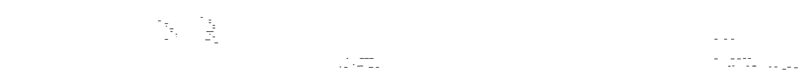


**The math**: Generating a sequence of length n with naive re-encoding requires:
$$\sum_{i=1}^{n} i^2 = \frac{n(n+1)(2n+1)}{6} \approx \frac{n^3}{3}$$
Wait, that's cubic? Not quite—attention is O(seq²) per forward pass, and you do n forward passes. The total is O(n³) for attention computation alone.
**Problem 2: No Error Recovery**
Greedy decoding commits to the highest-probability token at each step. If the model is uncertain between "cat" (0.34) and "car" (0.33), greedy takes "cat" and moves on. But what if "car" was the right choice? What if "The car drove down the road" makes more sense than "The cat drove down the road"?
Greedy has no mechanism to explore alternatives. It's a greedy walk through a probability landscape, forever committing to local maxima.
**Problem 3: The Exposure Gap**
Remember teacher forcing? The model was never trained on its own mistakes. During inference, it sees its own predictions—including errors. This creates a distribution shift:
- **Training distribution**: Previous tokens are always correct
- **Inference distribution**: Previous tokens may contain errors
The model has no strategy for error recovery because it never learned one.


---
## The Revelation: KV Caching Changes Everything
> **Misconception**: Generation is just running the model forward in a loop. Each new token requires re-encoding the entire growing sequence.
>
> **Reality**: Naive generation is O(n³) in total attention computation. KV caching reduces this to O(n²)—you store and reuse previous key-value computations. For long sequences, this is the difference between seconds and minutes of generation time.
Here's the key insight that unlocks efficient generation: **attention is additive across positions.**
When you compute attention for positions 0 through 99, you're computing:
$$\text{Attention}(Q_{0:99}, K_{0:99}, V_{0:99})$$
To generate position 100, you need:
$$\text{Attention}(Q_{100}, K_{0:100}, V_{0:100})$$
Notice that $K_{0:99}$ and $V_{0:99}$ are identical to what you computed in the previous step! The keys and values for earlier positions don't change—they're functions of the input, which is fixed.
**The KV cache stores these computed keys and values.** Instead of recomputing them, you:
1. Retrieve the cached K and V for positions 0-99
2. Compute only $Q_{100}$, $K_{100}$, $V_{100}$ for the new token
3. Concatenate and run attention on the combined tensors


The complexity drops from O(n³) to O(n²)—still quadratic in sequence length (attention is inherently quadratic), but linear in the number of forward passes. You only compute each position's keys and values once.
---
## Greedy Decoding: The Baseline
Let's start with the simplest generation strategy. Greedy decoding selects the highest-probability token at each step:
```python
def greedy_decode(
    model,
    src_tokens,
    sos_token_id,
    eos_token_id,
    max_len=100,
    device='cuda'
):
    """
    Greedy decoding: select argmax token at each step.
    Args:
        model: Trained EncoderDecoderTransformer
        src_tokens: Source token indices [batch, src_len]
        sos_token_id: Start-of-sequence token ID
        eos_token_id: End-of-sequence token ID
        max_len: Maximum generation length
        device: Device to run on
    Returns:
        generated: Generated token indices [batch, gen_len]
    """
    model.eval()
    batch_size = src_tokens.size(0)
    # Encode source once
    with torch.no_grad():
        encoder_output = model.encode(src_tokens)
    # Initialize generation with <sos>
    generated = torch.full(
        (batch_size, 1), 
        sos_token_id, 
        dtype=torch.long, 
        device=device
    )
    # Track which sequences are finished
    finished = torch.zeros(batch_size, dtype=torch.bool, device=device)
    for _ in range(max_len):
        # Create causal mask for current sequence length
        seq_len = generated.size(1)
        causal_mask = torch.triu(
            torch.ones(seq_len, seq_len, device=device),
            diagonal=1
        ).bool().unsqueeze(0).unsqueeze(0)
        # Forward pass through decoder
        with torch.no_grad():
            logits = model.decode(
                generated, 
                encoder_output, 
                tgt_mask=causal_mask
            )
        # Get logits for last position and select argmax
        next_token_logits = logits[:, -1, :]  # [batch, vocab_size]
        next_token = next_token_logits.argmax(dim=-1, keepdim=True)
        # Append to generated sequence
        generated = torch.cat([generated, next_token], dim=1)
        # Check for EOS
        finished = finished | (next_token.squeeze(-1) == eos_token_id)
        if finished.all():
            break
    return generated
```
**Shape trace through greedy decoding**:
```
Source tokens:           [batch, src_len]
Encoder output:          [batch, src_len, d_model]  (computed once)
Step 1:
  Generated:             [batch, 1]  (<sos>)
  Causal mask:           [1, 1, 1, 1]
  Decoder output:        [batch, 1, d_model]
  Logits:                [batch, 1, vocab_size]
  Next token:            [batch, 1]
Step 2:
  Generated:             [batch, 2]
  Causal mask:           [1, 1, 2, 2]
  Decoder output:        [batch, 2, d_model]
  Next token:            [batch, 1]
...and so on until EOS or max_len
```
### When Greedy Works (and When It Doesn't)
Greedy decoding is:
- **Fast**: One forward pass per token, simple logic
- **Deterministic**: Same input always produces same output
- **Easy to implement**: Just argmax in a loop
But greedy fails when:
- **The highest-probability path leads to a dead end**: "The" → "cat" → "sat" might be locally optimal but lead to an incoherent sentence
- **Alternatives should be explored**: When multiple tokens have similar probabilities, greedy arbitrarily picks one
- **Repetition loops**: Greedy can get stuck repeating "the the the the" because "the" has high probability after "the"
---
## Beam Search: Exploring Multiple Futures
Beam search maintains the k most promising partial sequences (hypotheses) at each step. Instead of committing to one path, it keeps multiple options open.


```python
@dataclass
class BeamHypothesis:
    """A partial sequence being explored by beam search."""
    tokens: torch.Tensor       # [seq_len] token indices
    score: float               # Cumulative log probability
    is_finished: bool = False  # Whether EOS has been generated
def beam_search(
    model,
    src_tokens,
    sos_token_id,
    eos_token_id,
    pad_token_id,
    beam_width=4,
    max_len=100,
    length_penalty=0.0,
    device='cuda'
):
    """
    Beam search: keep top-k hypotheses at each step.
    Args:
        model: Trained EncoderDecoderTransformer
        src_tokens: Source token indices [1, src_len]
        sos_token_id: Start-of-sequence token ID
        eos_token_id: End-of-sequence token ID
        pad_token_id: Padding token ID
        beam_width: Number of hypotheses to keep (beam size)
        max_len: Maximum generation length
        length_penalty: Penalty for longer sequences (0 = no penalty)
        device: Device to run on
    Returns:
        List of (tokens, score) tuples for completed hypotheses
    """
    model.eval()
    # Encode source once
    with torch.no_grad():
        encoder_output = model.encode(src_tokens)
    # Initialize with single hypothesis containing <sos>
    hypotheses = [
        BeamHypothesis(
            tokens=torch.tensor([sos_token_id], device=device),
            score=0.0,
            is_finished=False
        )
    ]
    completed = []  # Store finished hypotheses
    for step in range(max_len):
        if len(hypotheses) == 0:
            break
        # Prepare batch of all active hypotheses
        batch_tokens = torch.stack([h.tokens for h in hypotheses])
        batch_size, seq_len = batch_tokens.shape
        # Create causal mask
        causal_mask = torch.triu(
            torch.ones(seq_len, seq_len, device=device),
            diagonal=1
        ).bool().unsqueeze(0).unsqueeze(0)
        # Expand encoder output for batch
        encoder_output_expanded = encoder_output.expand(batch_size, -1, -1)
        # Forward pass
        with torch.no_grad():
            logits = model.decode(
                batch_tokens,
                encoder_output_expanded,
                tgt_mask=causal_mask
            )
        # Get logits for last position
        next_token_logits = logits[:, -1, :]  # [batch, vocab_size]
        # Convert to log probabilities
        log_probs = F.log_softmax(next_token_logits, dim=-1)
        # For each hypothesis, get top-k tokens
        # We want top-k across all (hypothesis, token) pairs
        # Shape: [batch, vocab_size]
        # Add current hypothesis scores to get total scores
        # [batch, vocab_size] + [batch, 1]
        total_scores = log_probs + torch.tensor(
            [h.score for h in hypotheses], 
            device=device
        ).unsqueeze(1)
        # Flatten to get top-k across all combinations
        flat_scores = total_scores.view(-1)  # [batch * vocab_size]
        # Get top-k indices
        top_k_scores, top_k_indices = torch.topk(
            flat_scores, 
            min(beam_width, flat_scores.size(0))
        )
        # Convert flat indices back to (hypothesis_idx, token_idx)
        hypothesis_indices = top_k_indices // log_probs.size(1)
        token_indices = top_k_indices % log_probs.size(1)
        # Build new hypotheses
        new_hypotheses = []
        for i in range(len(top_k_scores)):
            hyp_idx = hypothesis_indices[i].item()
            token_idx = token_indices[i].item()
            score = top_k_scores[i].item()
            old_hyp = hypotheses[hyp_idx]
            new_tokens = torch.cat([
                old_hyp.tokens,
                torch.tensor([token_idx], device=device)
            ])
            # Check if EOS
            is_eos = (token_idx == eos_token_id)
            if is_eos:
                # Apply length penalty for completed hypotheses
                length = len(new_tokens)
                adjusted_score = score / ((5 + length) / 6) ** length_penalty
                completed.append((new_tokens, adjusted_score))
            else:
                new_hypotheses.append(BeamHypothesis(
                    tokens=new_tokens,
                    score=score,
                    is_finished=False
                ))
        # Keep only top beam_width active hypotheses
        hypotheses = new_hypotheses[:beam_width]
        # Early stopping: if all top hypotheses are worse than best completed
        if completed and len(hypotheses) > 0:
            best_active_score = max(h.score for h in hypotheses)
            best_completed_score = max(c[1] for c in completed)
            if best_active_score < best_completed_score:
                break
    # Add remaining active hypotheses to completed
    for hyp in hypotheses:
        length = len(hyp.tokens)
        adjusted_score = hyp.score / ((5 + length) / 6) ** length_penalty
        completed.append((hyp.tokens, adjusted_score))
    # Sort by score (descending) and return
    completed.sort(key=lambda x: x[1], reverse=True)
    return completed
```


### The Score Accumulation Problem
Here's a subtle but critical issue: **longer sequences have lower scores.**
Why? Scores are log probabilities, accumulated by addition:
$$\text{score}(y_1, ..., y_n) = \sum_{t=1}^{n} \log P(y_t | y_{<t})$$
Log probabilities are negative (probabilities are ≤ 1). Each additional token adds a negative number to the score. Longer sequences are penalized simply by being longer.
**Length penalty** counteracts this bias:
$$\text{adjusted\_score} = \frac{\text{score}}{\left(\frac{5 + \text{length}}{6}\right)^\alpha}$$
Where α is the length penalty coefficient:
- α = 0: No penalty (default, favors short sequences)
- α = 1: Strong penalty for length, favors longer sequences
- α = 0.6: Common compromise (used in Google's neural machine translation)
```python
def apply_length_penalty(score, length, alpha=0.6):
    """
    Apply length penalty to beam search score.
    The (5 + length) / 6 formula is from Wu et al. (2016).
    It has no effect on length 1, gradually increasing penalty
    for shorter sequences.
    """
    return score / ((5 + length) / 6) ** alpha
```
### Why Beam Search Isn't Global Optimization
> **Reveal**: Beam search is not finding the globally optimal sequence—it's approximate search that keeps the k most promising partial hypotheses. It can miss the optimal sequence because that sequence might start with a lower-probability token that leads to a higher-probability continuation.


Consider this scenario:
- Token A has probability 0.4
- Token B has probability 0.35
- With beam width 1, we'd take A
- But if A continues with very low probability tokens, and B continues with high probability tokens, B might be globally better
Beam search with width k explores more paths, but it's still heuristic. True global optimization would require evaluating all possible sequences—exponentially many.
**The Viterbi connection**: Beam search approximates Viterbi decoding, a dynamic programming algorithm that finds the most likely sequence in polynomial time for certain model structures. But Transformers don't have the Markov property that makes Viterbi tractable, so beam search is a practical compromise.
---
## KV Caching: The Efficiency Engine
Now let's solve the O(n³) complexity problem. The key insight: **keys and values for earlier positions don't change when you add a new token.**


### The Cache Data Structure
For each layer, we store:
- **Key cache**: `[batch, num_heads, seq_len, d_k]`
- **Value cache**: `[batch, num_heads, seq_len, d_v]`
For an N-layer transformer with `num_heads` attention heads:
```python
@dataclass
class KVCache:
    """Key-Value cache for efficient autoregressive generation."""
    # Per-layer caches: list of (key_cache, value_cache) tuples
    # Each cache has shape [batch, num_heads, seq_len, d_k]
    keys: List[torch.Tensor]
    values: List[torch.Tensor]
    @classmethod
    def create(cls, num_layers: int, batch_size: int, num_heads: int, d_k: int, device='cuda'):
        """Create empty caches for all layers."""
        return cls(
            keys=[torch.zeros(batch_size, num_heads, 0, d_k, device=device) 
                  for _ in range(num_layers)],
            values=[torch.zeros(batch_size, num_heads, 0, d_k, device=device)
                    for _ in range(num_layers)]
        )
    def update(self, layer_idx: int, new_keys: torch.Tensor, new_values: torch.Tensor):
        """
        Append new keys/values to cache for a specific layer.
        Args:
            layer_idx: Which layer's cache to update
            new_keys: [batch, num_heads, new_seq_len, d_k]
            new_values: [batch, num_heads, new_seq_len, d_k]
        """
        self.keys[layer_idx] = torch.cat([self.keys[layer_idx], new_keys], dim=2)
        self.values[layer_idx] = torch.cat([self.values[layer_idx], new_values], dim=2)
    def get(self, layer_idx: int):
        """Get cached keys and values for a layer."""
        return self.keys[layer_idx], self.values[layer_idx]
    def seq_len(self, layer_idx: int) -> int:
        """Get current sequence length in cache for a layer."""
        return self.keys[layer_idx].size(2)
```
### Modifying Multi-Head Attention for Caching
The attention layer needs to:
1. Accept optional cached K and V
2. Concatenate cached K/V with new K/V
3. Return updated K/V for caching
```python
class MultiHeadAttentionWithCache(nn.Module):
    """
    Multi-head attention with KV cache support for efficient generation.
    """
    def __init__(self, d_model, num_heads, dropout=0.1):
        super().__init__()
        assert d_model % num_heads == 0
        self.d_model = d_model
        self.num_heads = num_heads
        self.d_k = d_model // num_heads
        self.W_Q = nn.Linear(d_model, d_model, bias=False)
        self.W_K = nn.Linear(d_model, d_model, bias=False)
        self.W_V = nn.Linear(d_model, d_model, bias=False)
        self.W_O = nn.Linear(d_model, d_model, bias=False)
        self.dropout = nn.Dropout(dropout)
        self.scale = math.sqrt(self.d_k)
    def forward(
        self, 
        query, 
        key, 
        value, 
        mask=None,
        cached_key=None,
        cached_value=None,
        use_cache=False
    ):
        """
        Forward pass with optional KV caching.
        Args:
            query: [batch, seq_q, d_model]
            key: [batch, seq_k, d_model] (only new tokens if using cache)
            value: [batch, seq_v, d_model] (only new tokens if using cache)
            mask: Attention mask
            cached_key: [batch, num_heads, cached_len, d_k] or None
            cached_value: [batch, num_heads, cached_len, d_k] or None
            use_cache: Whether to return updated K/V for caching
        Returns:
            output: [batch, seq_q, d_model]
            attention_weights: [batch, num_heads, seq_q, total_seq_k]
            new_key: [batch, num_heads, seq_k, d_k] (if use_cache)
            new_value: [batch, num_heads, seq_k, d_k] (if use_cache)
        """
        batch_size = query.size(0)
        seq_q = query.size(1)
        seq_k = key.size(1)
        # Project Q, K, V
        Q = self.W_Q(query)
        K = self.W_K(key)
        V = self.W_V(value)
        # Reshape for multi-head: [batch, seq, d_model] -> [batch, heads, seq, d_k]
        Q = Q.view(batch_size, seq_q, self.num_heads, self.d_k).transpose(1, 2)
        K = K.view(batch_size, seq_k, self.num_heads, self.d_k).transpose(1, 2)
        V = V.view(batch_size, seq_k, self.num_heads, self.d_k).transpose(1, 2)
        # Concatenate with cached K/V if provided
        if cached_key is not None and cached_value is not None:
            K = torch.cat([cached_key, K], dim=2)
            V = torch.cat([cached_value, V], dim=2)
        total_seq_k = K.size(2)
        # Compute attention scores
        scores = torch.matmul(Q, K.transpose(-2, -1)) / self.scale
        # Apply mask if provided
        if mask is not None:
            scores = scores.masked_fill(mask, float('-inf'))
        # Softmax
        attention_weights = F.softmax(scores, dim=-1)
        attention_weights = torch.nan_to_num(attention_weights, nan=0.0)
        attention_weights = self.dropout(attention_weights)
        # Apply attention to values
        context = torch.matmul(attention_weights, V)
        # Reshape back: [batch, heads, seq_q, d_k] -> [batch, seq_q, d_model]
        context = context.transpose(1, 2).contiguous().view(batch_size, seq_q, self.d_model)
        # Output projection
        output = self.W_O(context)
        if use_cache:
            # Return new K/V (the ones computed from current input)
            # These will be cached for next iteration
            new_key = K[:, :, -seq_k:, :]  # Only the new portion
            new_value = V[:, :, -seq_k:, :]
            return output, attention_weights, new_key, new_value
        return output, attention_weights
```
### Greedy Decoding with KV Cache
```python
def greedy_decode_with_cache(
    model,
    src_tokens,
    sos_token_id,
    eos_token_id,
    max_len=100,
    device='cuda'
):
    """
    Greedy decoding with KV cache for efficiency.
    Each step only processes the new token, not the entire sequence.
    """
    model.eval()
    batch_size = src_tokens.size(0)
    num_layers = len(model.decoder.layers)
    num_heads = model.decoder.layers[0].self_attn.num_heads
    d_k = model.decoder.layers[0].self_attn.d_k
    # Encode source once
    with torch.no_grad():
        encoder_output = model.encode(src_tokens)
    # Initialize KV cache for decoder self-attention
    self_attn_cache = KVCache.create(num_layers, batch_size, num_heads, d_k, device)
    # Initialize generation
    generated = torch.full(
        (batch_size, 1),
        sos_token_id,
        dtype=torch.long,
        device=device
    )
    finished = torch.zeros(batch_size, dtype=torch.bool, device=device)
    for step in range(max_len):
        seq_len = generated.size(1)
        # Only process the last token (or first token if step=0)
        if step == 0:
            # First step: process the entire <sos>
            decoder_input = generated
            new_cache_pos = 0  # Start of cache
        else:
            # Subsequent steps: only process the new token
            decoder_input = generated[:, -1:].clone()  # Just the last token
            new_cache_pos = seq_len - 1  # Append to cache
        # Forward pass through decoder with caching
        with torch.no_grad():
            logits = model.decode_with_cache(
                decoder_input,
                encoder_output,
                self_attn_cache,
                position_offset=seq_len - 1 if step > 0 else 0
            )
        # Get next token
        next_token_logits = logits[:, -1, :]
        next_token = next_token_logits.argmax(dim=-1, keepdim=True)
        # Append to generated sequence
        generated = torch.cat([generated, next_token], dim=1)
        # Check for EOS
        finished = finished | (next_token.squeeze(-1) == eos_token_id)
        if finished.all():
            break
    return generated
```
### The Decoder with Cache-Aware Forward Pass
```python
class DecoderWithCache(nn.Module):
    """
    Decoder that supports incremental generation with KV cache.
    """
    def __init__(self, d_model, num_heads, d_ff, num_layers, dropout=0.1, pre_norm=True):
        super().__init__()
        self.layers = nn.ModuleList([
            DecoderLayer(d_model, num_heads, d_ff, dropout, pre_norm)
            for _ in range(num_layers)
        ])
        self.final_norm = LayerNorm(d_model) if pre_norm else None
        self.d_model = d_model
        self.num_heads = num_heads
        self.d_k = d_model // num_heads
    def forward_with_cache(
        self,
        x,
        encoder_output,
        self_attn_cache,
        cross_attn_cache=None,
        tgt_mask=None,
        src_mask=None
    ):
        """
        Forward pass with KV caching for efficient generation.
        Args:
            x: Input tokens [batch, seq_len, d_model]
               For cached generation, this is typically just the new token
            encoder_output: Encoder output [batch, src_len, d_model]
            self_attn_cache: KVCache for decoder self-attention
            cross_attn_cache: KVCache for cross-attention (optional)
            tgt_mask: Causal mask
            src_mask: Source padding mask
        Returns:
            output: [batch, seq_len, d_model]
        """
        for i, layer in enumerate(self.layers):
            # Get cached K/V for this layer
            cached_k, cached_v = self_attn_cache.get(i)
            # Self-attention with caching
            x = self._self_attn_with_cache(
                layer, x, cached_k, cached_v, 
                self_attn_cache, i, tgt_mask
            )
            # Cross-attention (K/V from encoder, no caching needed for encoder)
            x = self._cross_attn(layer, x, encoder_output, src_mask)
            # FFN
            x = layer.sublayer3(x, layer.ffn)
        if self.final_norm is not None:
            x = self.final_norm(x)
        return x
    def _self_attn_with_cache(
        self, 
        layer, 
        x, 
        cached_k, 
        cached_v,
        cache_obj,
        layer_idx,
        tgt_mask
    ):
        """Self-attention sublayer with KV caching."""
        residual = x
        if layer.pre_norm:
            x = layer.sublayer1.norm(x)
        # Forward through attention with cache
        output, _, new_k, new_v = layer.self_attn(
            x, x, x,
            mask=tgt_mask,
            cached_key=cached_k if cached_k.size(2) > 0 else None,
            cached_value=cached_v if cached_v.size(2) > 0 else None,
            use_cache=True
        )
        # Update cache
        cache_obj.update(layer_idx, new_k, new_v)
        # Residual connection
        output = residual + layer.sublayer1.dropout(output)
        if not layer.pre_norm:
            output = layer.sublayer1.norm(output)
        return output
```

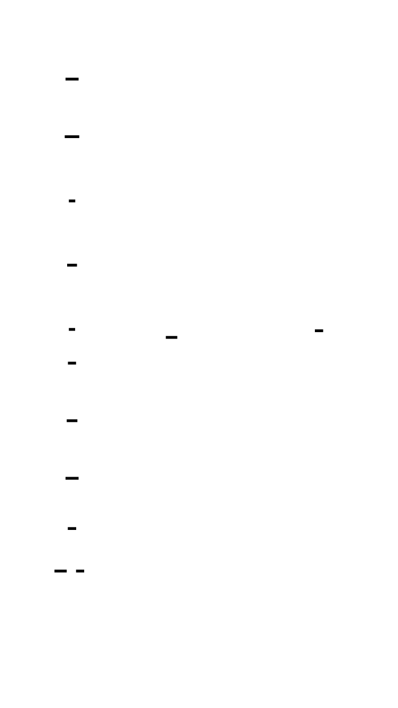


### Benchmarking the Speedup
```python
def benchmark_kv_cache(model, src_tokens, max_len=100, device='cuda'):
    """
    Benchmark naive vs cached generation.
    Returns speedup factor.
    """
    import time
    model.eval()
    # Naive generation (no cache)
    start_naive = time.time()
    _ = greedy_decode(model, src_tokens, 1, 2, max_len, device)
    naive_time = time.time() - start_naive
    # Cached generation
    start_cached = time.time()
    _ = greedy_decode_with_cache(model, src_tokens, 1, 2, max_len, device)
    cached_time = time.time() - start_cached
    speedup = naive_time / cached_time
    print(f"Naive generation: {naive_time:.2f}s")
    print(f"Cached generation: {cached_time:.2f}s")
    print(f"Speedup: {speedup:.2f}x")
    return speedup
```
**Expected results**: For 100-token generation on a 6-layer transformer:
- Naive: ~3-5 seconds
- Cached: ~0.5-1 second
- Speedup: 3-6x
The speedup increases with sequence length because the naive approach's O(n³) complexity compounds faster.
---
## Temperature: Controlling Randomness
Greedy decoding always takes the highest-probability token. But what if you want more variety? Temperature scaling lets you control how "random" or "deterministic" the output is.

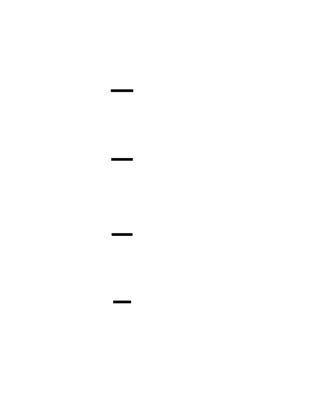

```python
def sample_with_temperature(logits, temperature=1.0):
    """
    Sample from the probability distribution with temperature scaling.
    Args:
        logits: [batch, vocab_size] unnormalized logits
        temperature: Temperature parameter
            - temperature = 0: Greedy (argmax)
            - temperature < 1: More deterministic (sharper distribution)
            - temperature = 1: Standard sampling
            - temperature > 1: More random (flatter distribution)
    Returns:
        sampled_tokens: [batch, 1] sampled token indices
    """
    if temperature <= 1e-10:
        # Temperature effectively 0: greedy
        return logits.argmax(dim=-1, keepdim=True)
    # Scale logits by temperature
    scaled_logits = logits / temperature
    # Convert to probabilities
    probs = F.softmax(scaled_logits, dim=-1)
    # Sample from the distribution
    sampled = torch.multinomial(probs, num_samples=1)
    return sampled
```
**The math**:
$$P(y_t | y_{<t}) = \frac{\exp(z_t / T)}{\sum_k \exp(z_k / T)}$$
Where:
- $z_t$ is the logit for token $t$
- $T$ is the temperature
**Effect of temperature**:
- **T → 0**: Distribution becomes a delta function at the argmax (greedy)
- **T = 1**: Standard softmax (unchanged probabilities)
- **T → ∞**: Distribution becomes uniform (random sampling)
```python
def demonstrate_temperature():
    """Show effect of temperature on probability distribution."""
    logits = torch.tensor([2.0, 1.0, 0.5, 0.1])  # Four token options
    print("Logits:", logits.tolist())
    print()
    for temp in [0.1, 0.5, 1.0, 2.0, 5.0]:
        scaled = logits / temp
        probs = F.softmax(scaled, dim=-1)
        print(f"Temperature {temp}: {probs.tolist()}")
# Output:
# Temperature 0.1: [0.9933, 0.0067, 0.0000, 0.0000]  <- Nearly greedy
# Temperature 0.5: [0.8358, 0.1418, 0.0179, 0.0045]
# Temperature 1.0: [0.6216, 0.2289, 0.1042, 0.0453]  <- Standard
# Temperature 2.0: [0.4096, 0.2829, 0.1817, 0.1258]
# Temperature 5.0: [0.2684, 0.2468, 0.2227, 0.2017]  <- Nearly uniform
```
### Temperature as Entropy Control

> **🔑 Foundation: Entropy in probability distributions**
>
> Entropy, in the context of probability distributions, is a measure of uncertainty or randomness. A distribution with high entropy is spread out, with probabilities closer to uniform across all possibilities, indicating high uncertainty. A distribution with low entropy is concentrated on a few outcomes, indicating low uncertainty.

In machine learning, we often want to minimize the cross-entropy between the predicted probability distribution and the true labels. High entropy in the predicted distribution may indicate the model is unsure of its prediction and vice versa. Understanding the concept of entropy helps when analysing model outputs.

The mental model for entropy is analogous to the information content of a message. The more unpredictable the message, the higher its entropy and the more information it conveys. Similarly, a probability distribution that is less certain (higher entropy) carries more information than one that is highly certain (lower entropy).


Temperature directly controls the entropy of the output distribution:
- **High temperature**: High entropy, more surprise, more creative/diverse outputs
- **Low temperature**: Low entropy, less surprise, more predictable/focused outputs
This connects to thermodynamic concepts: temperature measures the "disorder" or "randomness" of a system. In generation:
- High temperature → "hot" generation, more chaotic
- Low temperature → "cold" generation, more ordered
**Practical guidelines**:
| Task | Recommended Temperature |
|------|------------------------|
| Code generation | 0.0 - 0.3 |
| Translation | 0.3 - 0.5 |
| Summarization | 0.5 - 0.7 |
| Creative writing | 0.7 - 1.0 |
| Brainstorming | 1.0 - 1.5 |
---
## Sampling Strategies: Beyond Greedy
### Top-K Sampling
Limit sampling to the k most likely tokens:
```python
def top_k_sample(logits, k=50, temperature=1.0):
    """
    Sample from the top-k most likely tokens.
    Args:
        logits: [batch, vocab_size]
        k: Number of top tokens to consider
        temperature: Temperature for sampling
    Returns:
        sampled: [batch, 1]
    """
    # Get top-k logits and indices
    top_k_logits, top_k_indices = torch.topk(logits, k, dim=-1)
    # Apply temperature
    if temperature > 0:
        top_k_logits = top_k_logits / temperature
    # Sample from top-k
    probs = F.softmax(top_k_logits, dim=-1)
    sampled_idx = torch.multinomial(probs, num_samples=1)
    # Map back to original vocabulary indices
    sampled_tokens = torch.gather(top_k_indices, 1, sampled_idx)
    return sampled_tokens
```
### Top-P (Nucleus) Sampling
Sample from the smallest set of tokens whose cumulative probability exceeds p:
```python
def top_p_sample(logits, p=0.9, temperature=1.0):
    """
    Nucleus sampling: sample from tokens comprising top-p probability mass.
    Args:
        logits: [batch, vocab_size]
        p: Cumulative probability threshold
        temperature: Temperature for sampling
    Returns:
        sampled: [batch, 1]
    """
    # Apply temperature
    if temperature > 0:
        logits = logits / temperature
    # Sort by probability (descending)
    probs = F.softmax(logits, dim=-1)
    sorted_probs, sorted_indices = torch.sort(probs, descending=True, dim=-1)
    # Find cutoff index where cumulative prob exceeds p
    cumulative_probs = torch.cumsum(sorted_probs, dim=-1)
    # Create mask for tokens to include
    # We want to include tokens up to (and including) where cumsum first exceeds p
    sorted_indices_to_remove = cumulative_probs > p
    # Shift mask right to include the token that pushed us over p
    sorted_indices_to_remove[..., 1:] = sorted_indices_to_remove[..., :-1].clone()
    sorted_indices_to_remove[..., 0] = False
    # Set removed tokens to -inf (will have 0 probability after softmax)
    sorted_logits = torch.gather(logits, -1, sorted_indices)
    sorted_logits[sorted_indices_to_remove] = float('-inf')
    # Unsort to original order
    logits_filtered = torch.zeros_like(logits)
    logits_filtered.scatter_(1, sorted_indices, sorted_logits)
    # Sample from filtered distribution
    probs_filtered = F.softmax(logits_filtered, dim=-1)
    sampled = torch.multinomial(probs_filtered, num_samples=1)
    return sampled
```
**Why sampling beats greedy for creative tasks**: Greedy always takes the highest-probability path, which leads to repetitive, predictable outputs. Sampling explores the probability distribution, allowing for diversity and creativity while still preferring likely tokens.
---
## The Complete Generation Interface
```python
class TransformerGenerator:
    """
    Complete generation interface for trained Transformer.
    Supports:
    - Greedy decoding
    - Beam search
    - KV caching
    - Temperature scaling
    - Top-k and top-p sampling
    """
    def __init__(
        self,
        model,
        sos_token_id,
        eos_token_id,
        pad_token_id,
        device='cuda'
    ):
        self.model = model.to(device)
        self.model.eval()
        self.sos_token_id = sos_token_id
        self.eos_token_id = eos_token_id
        self.pad_token_id = pad_token_id
        self.device = device
    def generate(
        self,
        src_tokens,
        max_len=100,
        strategy='greedy',
        beam_width=4,
        temperature=1.0,
        top_k=None,
        top_p=None,
        length_penalty=0.0,
        use_cache=True
    ):
        """
        Generate output sequence from source.
        Args:
            src_tokens: Source token indices [batch, src_len]
            max_len: Maximum generation length
            strategy: 'greedy', 'beam', or 'sample'
            beam_width: Beam width for beam search
            temperature: Temperature for sampling
            top_k: Top-k filtering (None = disabled)
            top_p: Top-p filtering (None = disabled)
            length_penalty: Length penalty for beam search
            use_cache: Whether to use KV caching
        Returns:
            Generated token sequences
        """
        if strategy == 'greedy':
            if use_cache:
                return self._greedy_with_cache(src_tokens, max_len, temperature)
            else:
                return self._greedy_naive(src_tokens, max_len, temperature)
        elif strategy == 'beam':
            return self._beam_search(
                src_tokens, max_len, beam_width, length_penalty
            )
        elif strategy == 'sample':
            return self._sample(
                src_tokens, max_len, temperature, top_k, top_p, use_cache
            )
        else:
            raise ValueError(f"Unknown strategy: {strategy}")
    def _greedy_naive(self, src_tokens, max_len, temperature):
        """Greedy decoding without KV cache."""
        with torch.no_grad():
            encoder_output = self.model.encode(src_tokens)
        generated = torch.full(
            (src_tokens.size(0), 1),
            self.sos_token_id,
            dtype=torch.long,
            device=self.device
        )
        for _ in range(max_len):
            seq_len = generated.size(1)
            causal_mask = self._create_causal_mask(seq_len)
            with torch.no_grad():
                logits = self.model.decode(generated, encoder_output, tgt_mask=causal_mask)
            next_logits = logits[:, -1, :]
            next_token = sample_with_temperature(next_logits, temperature)
            generated = torch.cat([generated, next_token], dim=1)
            if (next_token == self.eos_token_id).all():
                break
        return generated
    def _greedy_with_cache(self, src_tokens, max_len, temperature):
        """Greedy decoding with KV cache."""
        # Initialize caches
        num_layers = len(self.model.decoder.layers)
        num_heads = self.model.decoder.layers[0].self_attn.num_heads
        d_k = self.model.decoder.layers[0].self_attn.d_k
        with torch.no_grad():
            encoder_output = self.model.encode(src_tokens)
        cache = KVCache.create(num_layers, src_tokens.size(0), num_heads, d_k, self.device)
        generated = torch.full(
            (src_tokens.size(0), 1),
            self.sos_token_id,
            dtype=torch.long,
            device=self.device
        )
        # First step: process <sos>
        causal_mask = self._create_causal_mask(1)
        with torch.no_grad():
            logits = self.model.decode_with_cache(
                generated, encoder_output, cache, tgt_mask=causal_mask
            )
        next_logits = logits[:, -1, :]
        next_token = sample_with_temperature(next_logits, temperature)
        generated = torch.cat([generated, next_token], dim=1)
        # Subsequent steps: only process new token
        for step in range(1, max_len):
            # Only the last token
            decoder_input = generated[:, -1:]
            # No causal mask needed for single token (already cached positions can't see future)
            with torch.no_grad():
                logits = self.model.decode_with_cache(
                    decoder_input, encoder_output, cache, position_offset=step
                )
            next_logits = logits[:, -1, :]
            next_token = sample_with_temperature(next_logits, temperature)
            generated = torch.cat([generated, next_token], dim=1)
            if (next_token == self.eos_token_id).all():
                break
        return generated
    def _create_causal_mask(self, seq_len):
        """Create causal attention mask."""
        mask = torch.triu(
            torch.ones(seq_len, seq_len, device=self.device),
            diagonal=1
        ).bool()
        return mask.unsqueeze(0).unsqueeze(0)
```
---
## Testing the Trained Model
```python
def test_generation(model, test_dataset, vocab, device='cuda'):
    """
    Test generation on the copy task.
    Verifies that generated output matches input for at least 90% of test samples.
    """
    model.eval()
    generator = TransformerGenerator(
        model,
        sos_token_id=1,
        eos_token_id=2,
        pad_token_id=0,
        device=device
    )
    correct = 0
    total = len(test_dataset)
    for i in range(min(total, 100)):  # Test up to 100 samples
        sample = test_dataset[i]
        src = sample['src_tokens'].unsqueeze(0).to(device)
        # Generate
        generated = generator.generate(
            src,
            max_len=src.size(1) + 2,
            strategy='greedy',
            use_cache=True
        )
        # Compare (excluding <sos> and <eos>)
        src_tokens = src[0].tolist()
        gen_tokens = generated[0].tolist()
        # Remove special tokens
        src_content = [t for t in src_tokens if t not in [0, 1, 2]]
        gen_content = [t for t in gen_tokens if t not in [0, 1, 2]]
        if src_content == gen_content:
            correct += 1
    accuracy = correct / min(total, 100)
    print(f"Copy task accuracy: {accuracy:.2%} ({correct}/{min(total, 100)})")
    return accuracy >= 0.90  # Must achieve at least 90% accuracy
```
---
## The Three-Level View
### Level 1 — Mathematical Operations
**Greedy decoding**: Select argmax at each step. O(n) forward passes, O(n³) total attention computation without caching.
**Beam search**: Maintain top-k hypotheses, expand each at each step. O(k·n) forward passes, O(k·n³) total without caching. Scores are log probabilities, accumulated by addition.
**KV caching**: Store keys and values from previous steps. Each step only computes K/V for the new token. Reduces total attention computation from O(n³) to O(n²).
**Temperature**: Scale logits before softmax. T→0 approaches greedy, T→∞ approaches uniform sampling. Controls entropy of output distribution.
### Level 2 — Generation Dynamics
**Exposure bias**: Model trained with teacher forcing (correct context) but generates with its own predictions (potentially incorrect context). Errors compound through the sequence.
**Beam search approximates global optimization**: Keeps multiple paths open, but can miss optimal sequence if it starts with a lower-probability token.
**Length bias in beam search**: Log probabilities are negative and cumulative, so longer sequences have lower scores. Length penalty counteracts this.
**Temperature and creativity**: Low temperature produces focused, deterministic outputs. High temperature produces diverse, creative outputs but may sacrifice coherence.
### Level 3 — GPU Compute
**Naive generation memory**: Each forward pass stores activations for the entire sequence. Memory scales as O(n²) per pass.
**KV cache memory**: Cache stores K/V for all layers. Memory scales as O(n·L·h·d) where L=layers, h=heads, d=head_dim.
**Batch generation**: Multiple sequences can be generated in parallel by batching. KV cache per sequence, but shared encoder output.
**Generation throughput with cache**: Limited by single-token forward passes. GPU underutilized (small batches). Speculative decoding can improve throughput.
---
## Common Pitfalls and Debugging
| Pitfall | Symptom | Fix |
|---------|---------|-----|
| **Cache dimension mismatch** | Shape error when concatenating | Ensure cache seq_len matches current position |
| **Not updating causal mask** | Model attends to future tokens | Regenerate mask for each new sequence length |
| **Forgetting encoder output** | Decoder has no source information | Pass encoder_output to every decode step |
| **Temperature = 0** | Division by zero in softmax | Check `if temperature <= 1e-10: return argmax` |
| **Beam search never terminates** | EOS token never selected | Add early stopping when best completed > best active |
| **Repetition in greedy** | "the the the the" loops | Add repetition penalty or use sampling |
| **Cache not cleared between sequences** | Previous sequence corrupts current | Create new cache for each generation call |
### Debugging Generation Issues
```python
def debug_generation(model, src_tokens, generator, max_len=20):
    """
    Debug generation by printing step-by-step information.
    """
    model.eval()
    with torch.no_grad():
        encoder_output = model.encode(src_tokens)
    generated = torch.tensor([[generator.sos_token_id]], device=generator.device)
    print(f"Source: {src_tokens[0].tolist()}")
    print(f"Starting generation with <sos>")
    for step in range(max_len):
        seq_len = generated.size(1)
        causal_mask = generator._create_causal_mask(seq_len)
        with torch.no_grad():
            logits = model.decode(generated, encoder_output, tgt_mask=causal_mask)
        next_logits = logits[:, -1, :]
        probs = F.softmax(next_logits, dim=-1)
        # Show top-5 tokens
        top_k_probs, top_k_indices = torch.topk(probs[0], 5)
        print(f"\nStep {step + 1}:")
        print(f"  Top 5: {[(i.item(), f'{p.item():.3f}') for i, p in zip(top_k_indices, top_k_probs)]}")
        next_token = next_logits.argmax(dim=-1, keepdim=True)
        print(f"  Selected: {next_token[0].item()}")
        generated = torch.cat([generated, next_token], dim=1)
        if next_token.item() == generator.eos_token_id:
            print(f"  EOS reached, stopping")
            break
    print(f"\nFinal output: {generated[0].tolist()}")
    return generated
```
---
## Knowledge Cascade: What You've Unlocked
### 1. Dynamic Programming in Decoding (Cross-Domain: Algorithms)
Beam search approximates **Viterbi decoding**, a classic dynamic programming algorithm for finding the most likely sequence through a probabilistic model. In Hidden Markov Models (HMMs), Viterbi finds the globally optimal sequence in O(n·k²) time by exploiting the Markov property.
Transformers lack this property—each position can depend on all previous positions—but beam search applies the same intuition: maintain multiple partial solutions and prune unlikely ones. The difference is that Viterbi is exact (guaranteed optimal) while beam search is approximate.
### 2. Speculative Decoding for Faster Inference
You now understand the single-token bottleneck in generation. **Speculative decoding** addresses this by having a smaller "draft" model generate multiple tokens in parallel, then the main model verifies them in one forward pass:
1. Draft model generates k tokens (fast, parallel speculation)
2. Main model verifies all k tokens (one forward pass)
3. Accept tokens up to first rejection, reject rest
This can provide 2-4x speedup without changing output distribution. It's used in production systems like vLLM and TGI.
### 3. Temperature as Entropy Control (Cross-Domain: Thermodynamics)
Temperature connects directly to thermodynamic concepts. In statistical mechanics, temperature controls the probability distribution over energy states. Higher temperature → more states accessible → higher entropy.
In generation:
- High temperature → model explores more of the vocabulary → higher entropy outputs
- Low temperature → model concentrates on a few high-probability tokens → lower entropy outputs
This is why temperature > 1 is called "sampling" (exploration) and temperature → 0 is called "greedy" (exploitation).
### 4. Why Sampling Beats Greedy for Creative Tasks
Greedy decoding always selects the highest-probability token. This seems optimal but leads to **degenerate outputs**:
- **Repetition loops**: "I went to the store and I went to the store and I went to the store..."
- **Bland outputs**: Always the most common continuation, never surprising
- **Mode collapse**: All outputs converge to similar patterns
Sampling with temperature > 0 allows the model to explore the probability distribution. It might select the second or third most likely token, leading to more diverse and interesting outputs while still preferring reasonable continuations.
**The insight**: Language has inherent uncertainty. "The cat sat on the ___" has multiple valid completions. Greedy pretends there's one right answer; sampling acknowledges the distribution.
### 5. Search Algorithms in AI (Cross-Domain: Artificial Intelligence)
Beam search is part of a family of search algorithms:
- **BFS/DFS**: Exhaustive search (intractable for large spaces)
- **Best-first search**: Expand most promising node (greedy, can get stuck)
- **Beam search**: Keep top-k nodes (approximate, but tractable)
- **A***: Best-first with heuristic (optimal if heuristic is admissible)
Understanding beam search gives you intuition for all these algorithms. The trade-off is always: exploration (considering more possibilities) vs. computation (time/memory cost).
---
## Your Mission
You now have everything you need to implement complete inference:
1. **Implement greedy decoding**: Generate by selecting argmax at each step until EOS
2. **Implement beam search**: Maintain top-k hypotheses with log-probability scoring and length penalty
3. **Implement KV caching**: Store and reuse keys/values to reduce O(n³) to O(n²)
4. **Benchmark the speedup**: Verify at least 2x improvement for 100-token generation
5. **Implement temperature scaling**: Control randomness in generation
6. **Test on copy task**: Verify 90%+ accuracy on held-out test data
```python
# Quick sanity check
def sanity_check_generation():
    """Verify generation works with trained model."""
    # Assume model is already trained on copy task
    # This would be run after training in Milestone 5
    device = 'cuda' if torch.cuda.is_available() else 'cpu'
    # Create generator
    generator = TransformerGenerator(
        model,
        sos_token_id=1,
        eos_token_id=2,
        pad_token_id=0,
        device=device
    )
    # Test sequence
    test_src = torch.tensor([[1, 5, 3, 7, 2, 9, 2]]).to(device)  # <sos> 5 3 7 <eos>
    # Greedy generation
    output = generator.generate(
        test_src,
        max_len=10,
        strategy='greedy',
        use_cache=True
    )
    print(f"Input:  {test_src[0].tolist()}")
    print(f"Output: {output[0].tolist()}")
    # Benchmark
    long_src = torch.randint(3, 20, (1, 50)).to(device)
    long_src = torch.cat([torch.tensor([[1]]).to(device), long_src, torch.tensor([[2]]).to(device)], dim=1)
    speedup = benchmark_kv_cache(model, long_src, max_len=100, device=device)
    assert speedup >= 2.0, f"KV cache speedup {speedup:.1f}x is less than required 2x"
    print("✓ Generation verified!")
```
Once this passes, you've built a complete Transformer from scratch—including training and efficient inference. You understand every component, every operation, and every optimization that makes modern language models work.
---
[[CRITERIA_JSON: {"milestone_id": "transformer-scratch-m6", "criteria": ["Implement greedy decoding that selects argmax token at each step, generating output sequence until EOS token or max_len is reached", "Implement beam search with configurable beam_width parameter (default 4) that maintains top-k hypotheses and returns top-K completed sequences with scores", "Beam search accumulates log probabilities as scores for each hypothesis, correctly handling the sum of log-probabilities across sequence length", "Implement length penalty in beam search to counteract bias toward shorter sequences: adjusted_score = score / ((5 + length) / 6)^alpha", "Implement KV cache data structure storing keys and values per layer with shape [batch, num_heads, seq_len, d_k]", "Modify multi-head attention to accept optional cached_key and cached_value, concatenating them with new K/V before attention computation", "KV cache updates correctly: append new K/V to cache after each generation step, avoiding recomputation of previous positions", "Greedy decoding with KV cache processes only the new token (not full sequence) in each step after the first", "Benchmark demonstrates at least 2x speedup for 100-token generation with KV cache vs naive re-encoding", "Implement temperature scaling: logits / temperature before softmax, with temperature=0 handled as greedy (argmax)", "Temperature > 1 increases entropy (more random outputs), < 1 decreases entropy (more deterministic outputs)", "Test on trained copy task model achieves at least 90% accuracy on held-out test inputs", "Generated sequences are correct: output matches input sequence (excluding special tokens) for at least 90% of test samples", "Handle batch generation: encoder runs once, decoder generates for all batch elements, each with its own KV cache", "Causal mask regenerated for each sequence length during generation to prevent attending to future tokens", "Implement complete TransformerGenerator class with strategy parameter for 'greedy', 'beam', or 'sample' generation"]}]
<!-- END_MS -->


# TDD

Build the complete Transformer architecture from first principles—implementing every matrix multiplication, reshape operation, and gradient flow explicitly. This project creates an educational yet production-grade encoder-decoder Transformer with scaled dot-product attention, multi-head parallel processing, sinusoidal positional encodings, complete encoder/decoder stacks with residual connections and layer normalization, trained on sequence-to-sequence tasks with proper learning rate scheduling, and efficient inference with KV caching. The implementation is verified against PyTorch reference implementations at each milestone, building deep understanding of the architecture that powers GPT, BERT, and virtually all modern language models.


<!-- TDD_MOD_ID: transformer-scratch-m1 -->
# Technical Design Document: Scaled Dot-Product Attention
**Module ID**: `transformer-scratch-m1`  
**Version**: 1.0  
**Primary Language**: Python (PyTorch)
---
## 1. Module Charter
This module implements the foundational scaled dot-product attention mechanism—the computational core of every transformer architecture. Given input embeddings, it projects them into Query (Q), Key (K), and Value (V) representations via learned linear transformations, computes attention scores as scaled dot-products between queries and keys, applies optional masking for padding and causality constraints, normalizes via softmax to obtain attention weights, and produces output as a weighted combination of values.
**What this module DOES**:
- Project input embeddings to Q, K, V via three independent `nn.Linear` layers
- Compute attention scores: `Q @ K^T / sqrt(d_k)`
- Apply padding masks (ignore padding tokens) and causal masks (prevent future attention)
- Normalize scores via softmax with numerical stability
- Produce attention output as weighted sum of values
**What this module does NOT do**:
- Multi-head attention (that's module m2)
- Positional encoding (that's module m3)
- Encoder/decoder layer composition (that's module m4)
**Upstream dependencies**: Input embeddings `[batch, seq_len, d_model]` from embedding layer  
**Downstream consumers**: Multi-head attention module, which wraps this for parallel head computation
**Invariants**:
1. Output shape equals input shape when `d_v = d_model`: `[batch, seq_len, d_v]`
2. Attention weights sum to 1.0 per query position (except all-masked rows)
3. All operations are fully vectorized—no loops over batch or sequence dimensions
4. Masked positions receive exactly 0.0 attention weight (via `-inf` before softmax)
---
## 2. File Structure
Create files in this exact sequence:
```
transformer/
├── attention/
│   ├── __init__.py              # 1 - Package exports
│   ├── scaled_dot_product.py    # 2 - Core attention implementation
│   ├── masking.py               # 3 - Padding and causal mask builders
│   └── verification.py          # 4 - PyTorch reference comparison
└── tests/
    ├── __init__.py              # 5 - Test package
    ├── test_attention.py        # 6 - Unit tests for attention
    └── test_masking.py          # 7 - Unit tests for masking
```
**Creation order rationale**: Start with the core computation (scaled_dot_product.py), add masking utilities (masking.py), then verification (verification.py). Tests come last to validate all components.
---
## 3. Complete Data Model
### 3.1 Core Tensor Shapes
All tensors follow named dimension conventions for clarity:
| Tensor | Symbol | Shape | Named Dimensions | Description |
|--------|--------|-------|------------------|-------------|
| Input embeddings | X | `[B, S, D]` | batch, seq_len, d_model | Input to attention layer |
| Query projection | Q | `[B, S, K]` | batch, seq_len, d_k | Query vectors |
| Key projection | K | `[B, S, K]` | batch, seq_len, d_k | Key vectors (same d_k as Q) |
| Value projection | V | `[B, S, V]` | batch, seq_len, d_v | Value vectors (may differ from d_k) |
| Attention scores | S | `[B, S, S]` | batch, seq_q, seq_k | Raw dot products before scaling |
| Scaled scores | S' | `[B, S, S]` | batch, seq_q, seq_k | After division by sqrt(d_k) |
| Attention weights | A | `[B, S, S]` | batch, seq_q, seq_k | Softmax output, rows sum to 1 |
| Output | O | `[B, S, V]` | batch, seq_len, d_v | Weighted combination of values |
**Dimension semantics**:
- `B` (batch): Independent sequences processed in parallel
- `S` (seq_len): Sequence positions (may differ for Q vs K/V in cross-attention)
- `D` (d_model): Full model dimension (typically 512)
- `K` (d_k): Key/query dimension (typically d_model / num_heads = 64)
- `V` (d_v): Value dimension (typically equals d_k)
### 3.2 Mask Tensor Specifications
| Mask Type | Shape | Dtype | True Semantics | False Semantics |
|-----------|-------|-------|----------------|-----------------|
| Padding mask | `[B, 1, 1, S]` | `torch.bool` | Ignore this position | Attend to this position |
| Causal mask | `[1, 1, S, S]` | `torch.bool` | Ignore (future) | Attend (past/current) |
| Combined mask | `[B, 1, 1, S]` or `[1, 1, S, S]` | `torch.bool` | Logical OR of conditions | Logical AND of conditions |
**Broadcasting behavior**:
- Padding mask `[B, 1, 1, S]` broadcasts across `seq_q` dimension
- Causal mask `[1, 1, S, S]` broadcasts across `batch` dimension
- Combined: apply padding mask first, then causal mask (logical OR)
### 3.3 Class Definitions
```python
from dataclasses import dataclass
from typing import Optional, Tuple
import torch
import torch.nn as nn
import torch.nn.functional as F
import math
@dataclass
class AttentionConfig:
    """Configuration for scaled dot-product attention."""
    d_model: int          # Input embedding dimension
    d_k: int              # Query/Key dimension
    d_v: int              # Value dimension (often equals d_k)
    dropout: float = 0.1  # Dropout probability after softmax
    def __post_init__(self):
        assert self.d_k > 0, "d_k must be positive"
        assert self.d_v > 0, "d_v must be positive"
        assert 0.0 <= self.dropout < 1.0, "dropout must be in [0, 1)"
class AttentionProjection(nn.Module):
    """
    Projects input embeddings to Q, K, V via learned linear transformations.
    Each projection is an independent nn.Linear layer without bias,
    following the original Transformer paper.
    Shape transformation:
        Input:  [batch, seq_len, d_model]
        Output: [batch, seq_len, d_k] or [batch, seq_len, d_v]
    """
    def __init__(self, d_model: int, d_k: int, d_v: Optional[int] = None):
        super().__init__()
        d_v = d_v or d_k  # Default: d_v = d_k
        # Three independent projection layers (no bias per original paper)
        self.W_Q = nn.Linear(d_model, d_k, bias=False)
        self.W_K = nn.Linear(d_model, d_k, bias=False)
        self.W_V = nn.Linear(d_model, d_v, bias=False)
        self.d_model = d_model
        self.d_k = d_k
        self.d_v = d_v
        self._init_weights()
    def _init_weights(self) -> None:
        """Initialize projection weights using Xavier uniform."""
        nn.init.xavier_uniform_(self.W_Q.weight)
        nn.init.xavier_uniform_(self.W_K.weight)
        nn.init.xavier_uniform_(self.W_V.weight)
    def forward(self, x: torch.Tensor) -> Tuple[torch.Tensor, torch.Tensor, torch.Tensor]:
        """
        Project input to Q, K, V.
        Args:
            x: Input tensor [batch, seq_len, d_model]
        Returns:
            Q: Query tensor [batch, seq_len, d_k]
            K: Key tensor [batch, seq_len, d_k]
            V: Value tensor [batch, seq_len, d_v]
        """
        return self.W_Q(x), self.W_K(x), self.W_V(x)
class ScaledDotProductAttention(nn.Module):
    """
    Computes scaled dot-product attention.
    Formula: Attention(Q, K, V) = softmax(QK^T / sqrt(d_k)) V
    This is the core attention operation used in every transformer layer.
    All operations are fully vectorized with no Python loops.
    """
    def __init__(self, d_k: int, dropout: float = 0.1):
        super().__init__()
        self.scale = math.sqrt(d_k)
        self.dropout = nn.Dropout(p=dropout)
        self.d_k = d_k
    def forward(
        self,
        Q: torch.Tensor,
        K: torch.Tensor,
        V: torch.Tensor,
        mask: Optional[torch.Tensor] = None
    ) -> Tuple[torch.Tensor, torch.Tensor]:
        """
        Compute scaled dot-product attention.
        Args:
            Q: Query tensor [batch, seq_len_q, d_k]
            K: Key tensor [batch, seq_len_k, d_k]
            V: Value tensor [batch, seq_len_v, d_v] where seq_len_v == seq_len_k
            mask: Optional mask tensor, broadcastable to [batch, seq_len_q, seq_len_k]
                  True values are masked (set to -inf before softmax)
        Returns:
            output: Attention output [batch, seq_len_q, d_v]
            attention_weights: Attention weights [batch, seq_len_q, seq_len_k]
        Raises:
            RuntimeError: If tensor shapes are incompatible for matrix multiplication
        """
        batch_size = Q.size(0)
        seq_len_q = Q.size(1)
        seq_len_k = K.size(1)
        # Compute attention scores: Q @ K^T
        # Q: [batch, seq_q, d_k]
        # K.transpose(-2, -1): [batch, d_k, seq_k]
        # Result: [batch, seq_q, seq_k]
        scores = torch.matmul(Q, K.transpose(-2, -1))
        # Scale by sqrt(d_k) for numerical stability
        scores = scores / self.scale
        # Apply mask if provided (before softmax!)
        if mask is not None:
            scores = scores.masked_fill(mask, float('-inf'))
        # Convert to attention weights via softmax
        # Softmax over the key dimension (last dimension)
        attention_weights = F.softmax(scores, dim=-1)
        # Handle edge case: if entire row is masked (-inf), softmax produces NaN
        # Replace NaN with 0.0 (no attention to any position)
        attention_weights = torch.nan_to_num(attention_weights, nan=0.0)
        # Apply dropout (only during training; disabled in eval mode)
        attention_weights = self.dropout(attention_weights)
        # Compute weighted sum of values
        # attention_weights: [batch, seq_q, seq_k]
        # V: [batch, seq_k, d_v]
        # Result: [batch, seq_q, d_v]
        output = torch.matmul(attention_weights, V)
        return output, attention_weights
```

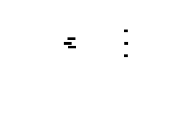

### 3.4 Mask Builder Classes
```python
class MaskBuilder:
    """
    Utility class for constructing padding and causal attention masks.
    All masks follow the convention: True = mask this position (ignore),
    False = attend to this position.
    """
    @staticmethod
    def create_padding_mask(
        seq_lengths: torch.Tensor,
        max_seq_len: int
    ) -> torch.Tensor:
        """
        Create padding mask from sequence lengths.
        Positions >= seq_lengths[i] are padding and should be masked.
        Args:
            seq_lengths: [batch] - actual length of each sequence (no padding)
            max_seq_len: int - padded sequence length (max in batch)
        Returns:
            mask: [batch, 1, 1, max_seq_len] - True where padding (to be masked)
        Example:
            seq_lengths = [3, 5, 2], max_seq_len = 5
            mask[0] = [F, F, F, T, T]  # First seq has 3 real tokens
            mask[1] = [F, F, F, F, F]  # Second seq has 5 real tokens
            mask[2] = [F, F, T, T, T]  # Third seq has 2 real tokens
        """
        batch_size = seq_lengths.size(0)
        device = seq_lengths.device
        # Create position indices: [0, 1, 2, ..., max_seq_len-1]
        positions = torch.arange(max_seq_len, device=device).unsqueeze(0)  # [1, max_seq_len]
        # Compare each position to each sequence's length
        # positions: [1, max_seq_len]
        # seq_lengths: [batch] -> [batch, 1]
        # Result: [batch, max_seq_len]
        mask = positions >= seq_lengths.unsqueeze(1)
        # Reshape for broadcasting with attention scores [batch, heads, seq_q, seq_k]
        # [batch, max_seq_len] -> [batch, 1, 1, max_seq_len]
        return mask.unsqueeze(1).unsqueeze(2)
    @staticmethod
    def create_causal_mask(seq_len: int, device: torch.device = None) -> torch.Tensor:
        """
        Create causal mask for autoregressive decoding.
        Position i can only attend to positions 0 through i (inclusive).
        Upper triangular positions (future) are masked.
        Args:
            seq_len: Sequence length
            device: Device for tensor creation
        Returns:
            mask: [1, 1, seq_len, seq_len] - True in upper triangle (to be masked)
        Example (seq_len=5):
            mask[0,0] = [
                [F, T, T, T, T],  # Position 0 sees only itself
                [F, F, T, T, T],  # Position 1 sees 0, 1
                [F, F, F, T, T],  # Position 2 sees 0, 1, 2
                [F, F, F, F, T],  # Position 3 sees 0, 1, 2, 3
                [F, F, F, F, F],  # Position 4 sees all
            ]
        """
        # torch.triu returns upper triangle; diagonal=1 excludes the diagonal
        mask = torch.triu(
            torch.ones(seq_len, seq_len, device=device, dtype=torch.bool),
            diagonal=1
        )
        # Reshape for broadcasting: [seq_len, seq_len] -> [1, 1, seq_len, seq_len]
        return mask.unsqueeze(0).unsqueeze(0)
    @staticmethod
    def combine_masks(
        padding_mask: Optional[torch.Tensor],
        causal_mask: Optional[torch.Tensor]
    ) -> Optional[torch.Tensor]:
        """
        Combine padding and causal masks via logical OR.
        Args:
            padding_mask: [batch, 1, 1, seq_len] or None
            causal_mask: [1, 1, seq_len, seq_len] or None
        Returns:
            Combined mask with shape that broadcasts to [batch, 1, seq_len, seq_len]
        Note: If both are None, returns None (no masking needed)
        """
        if padding_mask is None and causal_mask is None:
            return None
        if padding_mask is None:
            return causal_mask
        if causal_mask is None:
            return padding_mask
        # Logical OR: position is masked if EITHER mask says so
        # Broadcasting handles different shapes
        return padding_mask | causal_mask
```


---
## 4. Interface Contracts
### 4.1 ScaledDotProductAttention.forward()
```python
def forward(
    self,
    Q: torch.Tensor,  # [batch, seq_len_q, d_k]
    K: torch.Tensor,  # [batch, seq_len_k, d_k]
    V: torch.Tensor,  # [batch, seq_len_v, d_v] where seq_len_v == seq_len_k
    mask: Optional[torch.Tensor] = None  # broadcastable to [batch, seq_len_q, seq_len_k]
) -> Tuple[torch.Tensor, torch.Tensor]:
    """
    Pre-conditions:
        - Q.dim() == 3 and Q.size(-1) == self.d_k
        - K.dim() == 3 and K.size(-1) == self.d_k
        - V.dim() == 3 and V.size(1) == K.size(1)  # Same sequence length
        - mask is None OR mask.dtype == torch.bool
        - mask is None OR mask is broadcastable to [Q.size(0), Q.size(1), K.size(1)]
    Post-conditions:
        - output.shape == [Q.size(0), Q.size(1), V.size(-1)]
        - attention_weights.shape == [Q.size(0), Q.size(1), K.size(1)]
        - attention_weights.sum(dim=-1) ≈ 1.0 for non-fully-masked rows
        - attention_weights contains no NaN or Inf values
        - For fully-masked rows, attention_weights[i] contains all zeros
    Returns:
        output: [batch, seq_len_q, d_v]
        attention_weights: [batch, seq_len_q, seq_len_k]
    Side effects:
        - Dropout is applied during training (self.training == True)
        - Dropout is NOT applied during evaluation (self.training == False)
    Invariants preserved:
        - All tensor operations are differentiable (autograd compatible)
        - No in-place modifications of input tensors
    """
```
### 4.2 AttentionProjection.forward()
```python
def forward(
    self,
    x: torch.Tensor  # [batch, seq_len, d_model]
) -> Tuple[torch.Tensor, torch.Tensor, torch.Tensor]:
    """
    Pre-conditions:
        - x.dim() == 3
        - x.size(-1) == self.d_model
    Post-conditions:
        - Q.shape == [x.size(0), x.size(1), self.d_k]
        - K.shape == [x.size(0), x.size(1), self.d_k]
        - V.shape == [x.size(0), x.size(1), self.d_v]
        - Q, K, V are differentiable w.r.t. x
    Returns:
        Tuple of (Q, K, V)
    """
```
### 4.3 MaskBuilder.create_padding_mask()
```python
@staticmethod
def create_padding_mask(
    seq_lengths: torch.Tensor,  # [batch]
    max_seq_len: int
) -> torch.Tensor:
    """
    Pre-conditions:
        - seq_lengths.dim() == 1
        - All values in seq_lengths are in range [0, max_seq_len]
        - max_seq_len > 0
    Post-conditions:
        - output.shape == [seq_lengths.size(0), 1, 1, max_seq_len]
        - output.dtype == torch.bool
        - For each batch i: output[i, 0, 0, :seq_lengths[i]] == False
        - For each batch i: output[i, 0, 0, seq_lengths[i]:] == True
    Edge cases:
        - seq_lengths[i] == 0: All positions masked (all True)
        - seq_lengths[i] == max_seq_len: No positions masked (all False)
    """
```
### 4.4 MaskBuilder.create_causal_mask()
```python
@staticmethod
def create_causal_mask(
    seq_len: int,
    device: torch.device = None
) -> torch.Tensor:
    """
    Pre-conditions:
        - seq_len > 0
    Post-conditions:
        - output.shape == [1, 1, seq_len, seq_len]
        - output.dtype == torch.bool
        - output[0, 0, i, j] == True for all j > i (future positions)
        - output[0, 0, i, j] == False for all j <= i (past/current positions)
        - Diagonal is False (positions can attend to themselves)
    """
```
---
## 5. Algorithm Specification
### 5.1 Scaled Dot-Product Attention Algorithm
**Input**: Q `[B, Sq, K]`, K `[B, Sk, K]`, V `[B, Sk, V]`, mask (optional)  
**Output**: output `[B, Sq, V]`, weights `[B, Sq, Sk]`
```
ALGORITHM: ScaledDotProductAttention
STEP 1: Compute raw attention scores
    scores = matmul(Q, K^T)
    # Q: [B, Sq, K], K^T: [B, K, Sk]
    # scores: [B, Sq, Sk]
    INVARIANT: scores[i, q, k] = dot_product(Q[i,q,:], K[i,k,:])
STEP 2: Scale by sqrt(d_k)
    scaled_scores = scores / sqrt(d_k)
    WHY: Raw dot products have variance ≈ d_k. Without scaling,
    softmax receives large inputs and becomes near-one-hot,
    causing vanishing gradients.
    INVARIANT: scaled_scores has variance ≈ 1 per element
STEP 3: Apply mask (if provided)
    IF mask IS NOT None:
        scaled_scores = masked_fill(scaled_scores, mask, -inf)
    CRITICAL: Mask MUST be applied BEFORE softmax.
    Applying after softmax produces incorrect distributions.
    INVARIANT: Masked positions have score = -inf
STEP 4: Softmax normalization
    weights = softmax(scaled_scores, dim=-1)
    INVARIANT: weights[i, q, :].sum() == 1.0 for non-fully-masked rows
    INVARIANT: weights[i, q, k] == 0.0 for masked positions
STEP 5: Handle all-masked rows
    weights = nan_to_num(weights, nan=0.0)
    WHY: If entire row is -inf, softmax produces 0/0 = NaN.
    Replace with 0.0 (no attention anywhere).
    INVARIANT: No NaN or Inf in weights
STEP 6: Apply dropout
    weights = dropout(weights)
    NOTE: Dropout is a no-op in eval mode (self.training == False)
    INVARIANT: During training, ~dropout_prob fraction of weights are zeroed
STEP 7: Compute output
    output = matmul(weights, V)
    # weights: [B, Sq, Sk], V: [B, Sk, V]
    # output: [B, Sq, V]
    INVARIANT: output[i, q, :] = sum_k(weights[i, q, k] * V[i, k, :])
RETURN output, weights
```


### 5.2 Padding Mask Construction Algorithm
**Input**: seq_lengths `[B]`, max_seq_len  
**Output**: mask `[B, 1, 1, max_seq_len]`
```
ALGORITHM: CreatePaddingMask
STEP 1: Create position indices
    positions = arange(max_seq_len)  # [0, 1, 2, ..., max_seq_len-1]
    positions = positions.unsqueeze(0)  # [1, max_seq_len]
STEP 2: Compare positions to sequence lengths
    # seq_lengths: [B] -> [B, 1] for broadcasting
    mask = positions >= seq_lengths.unsqueeze(1)
    # Result: [B, max_seq_len]
    # mask[i, j] = True if j >= seq_lengths[i]
STEP 3: Reshape for attention broadcasting
    mask = mask.unsqueeze(1).unsqueeze(2)
    # Result: [B, 1, 1, max_seq_len]
RETURN mask
```
### 5.3 Causal Mask Construction Algorithm
**Input**: seq_len  
**Output**: mask `[1, 1, seq_len, seq_len]`
```
ALGORITHM: CreateCausalMask
STEP 1: Create all-ones matrix
    ones = torch.ones(seq_len, seq_len)
    # Shape: [seq_len, seq_len]
STEP 2: Extract upper triangle
    upper_tri = triu(ones, diagonal=1)
    # diagonal=1 means: start from 1 above main diagonal
    # upper_tri[i, j] = 1 if j > i, else 0
STEP 3: Convert to boolean
    mask = upper_tri.bool()
    # mask[i, j] = True if j > i (future position)
    # mask[i, j] = False if j <= i (past/current position)
STEP 4: Add batch/head dimensions
    mask = mask.unsqueeze(0).unsqueeze(0)
    # Shape: [1, 1, seq_len, seq_len]
RETURN mask
```


---
## 6. Error Handling Matrix
| Error | Detected By | Recovery | User-Visible? |
|-------|-------------|----------|---------------|
| **Shape mismatch: Q[-1] != K[-1]** | `torch.matmul` raises RuntimeError | Propagate with clear error message: "Q and K must have same d_k dimension" | Yes - debug message |
| **Shape mismatch: K.size(1) != V.size(1)** | Manual assertion in forward pass | Raise ValueError with shapes | Yes - debug message |
| **Mask dtype not bool** | `masked_fill` may produce wrong results | Check in forward: `assert mask.dtype == torch.bool` | Yes - debug message |
| **Mask not broadcastable** | `masked_fill` raises RuntimeError | Propagate with shape info | Yes - debug message |
| **d_k = 0** | Division by zero in scaling | Check in `__init__`: `assert d_k > 0` | Yes - config error |
| **All-masked row (NaN in weights)** | Softmax produces NaN | `nan_to_num(nan=0.0)` - automatic | No - handled gracefully |
| **Softmax overflow (very large scores)** | PyTorch softmax handles internally | No action needed (subtracts max) | No - handled by PyTorch |
| **Softmax underflow (very small probs)** | Values become 0 | Acceptable - below numerical precision | No - acceptable behavior |
| **Input contains NaN** | Propagates through | Check inputs before forward (optional) | Yes - data error |
| **Dropout prob >= 1.0** | `nn.Dropout` raises error | Caught at initialization | Yes - config error |
### Error Recovery Strategies
```python
class AttentionError(Exception):
    """Base exception for attention module errors."""
    pass
class ShapeMismatchError(AttentionError):
    """Raised when tensor shapes are incompatible."""
    def __init__(self, tensor_name: str, expected_shape: Tuple[int, ...], actual_shape: Tuple[int, ...]):
        self.tensor_name = tensor_name
        self.expected = expected_shape
        self.actual = actual_shape
        super().__init__(
            f"Shape mismatch for {tensor_name}: expected {expected_shape}, got {actual_shape}"
        )
def validate_attention_inputs(Q: torch.Tensor, K: torch.Tensor, V: torch.Tensor) -> None:
    """
    Validate tensor shapes before attention computation.
    Raises:
        ShapeMismatchError: If shapes are incompatible
        ValueError: If d_k dimensions don't match
    """
    if Q.dim() != 3:
        raise ValueError(f"Q must be 3D, got {Q.dim()}D")
    if K.dim() != 3:
        raise ValueError(f"K must be 3D, got {K.dim()}D")
    if V.dim() != 3:
        raise ValueError(f"V must be 3D, got {V.dim()}D")
    if Q.size(-1) != K.size(-1):
        raise ShapeMismatchError(
            "Q/K d_k dimension",
            (Q.size(-1),),
            (K.size(-1),)
        )
    if K.size(1) != V.size(1):
        raise ShapeMismatchError(
            "K/V sequence length",
            (K.size(1),),
            (V.size(1),)
        )
```
---
## 7. Implementation Sequence with Checkpoints
### Phase 1: Implement Q, K, V Projection Layers (0.5-1 hour)
**Files to create**: `transformer/attention/scaled_dot_product.py`
**Tasks**:
1. Define `AttentionConfig` dataclass with validation
2. Implement `AttentionProjection` class with three `nn.Linear` layers
3. Implement `_init_weights()` with Xavier uniform initialization
4. Implement `forward()` returning tuple of (Q, K, V)
**Checkpoint**: After this phase, you should be able to:
```python
proj = AttentionProjection(d_model=512, d_k=64)
x = torch.randn(2, 10, 512)
Q, K, V = proj(x)
assert Q.shape == (2, 10, 64)
assert K.shape == (2, 10, 64)
assert V.shape == (2, 10, 64)
```
Run: `pytest tests/test_attention.py::test_projection_shapes -v`
---
### Phase 2: Implement Scaled Dot-Product Computation (1-1.5 hours)
**Files to modify**: `transformer/attention/scaled_dot_product.py`
**Tasks**:
1. Implement `ScaledDotProductAttention.__init__()` with scale factor
2. Implement `forward()`:
   - Matrix multiply: `Q @ K^T`
   - Scale by `1/sqrt(d_k)`
   - Softmax normalization
   - Weighted sum with V
3. Add dropout layer after softmax
**Checkpoint**: After this phase, you should be able to:
```python
attn = ScaledDotProductAttention(d_k=64, dropout=0.0)
Q = torch.randn(2, 10, 64)
K = torch.randn(2, 10, 64)
V = torch.randn(2, 10, 64)
output, weights = attn(Q, K, V)
assert output.shape == (2, 10, 64)
assert weights.shape == (2, 10, 10)
assert torch.allclose(weights.sum(dim=-1), torch.ones(2, 10), atol=1e-5)
```
Run: `pytest tests/test_attention.py::test_attention_no_mask -v`


---
### Phase 3: Implement Padding Mask Builder (0.5-1 hour)
**Files to create**: `transformer/attention/masking.py`
**Tasks**:
1. Implement `MaskBuilder` class with static methods
2. Implement `create_padding_mask()`:
   - Accept sequence lengths tensor
   - Create boolean mask for padding positions
   - Reshape to `[batch, 1, 1, seq_len]`
**Checkpoint**: After this phase, you should be able to:
```python
seq_lengths = torch.tensor([3, 5, 2])
mask = MaskBuilder.create_padding_mask(seq_lengths, max_seq_len=5)
assert mask.shape == (3, 1, 1, 5)
assert mask[0, 0, 0, 3:].all()  # First batch: positions 3,4 are padding
assert not mask[1, 0, 0, :].any()  # Second batch: no padding
```
Run: `pytest tests/test_masking.py::test_padding_mask -v`
---
### Phase 4: Implement Causal Mask Builder (0.5-1 hour)
**Files to modify**: `transformer/attention/masking.py`
**Tasks**:
1. Implement `create_causal_mask()`:
   - Use `torch.triu` with `diagonal=1`
   - Return shape `[1, 1, seq_len, seq_len]`
2. Implement `combine_masks()` for combining padding + causal
**Checkpoint**: After this phase, you should be able to:
```python
mask = MaskBuilder.create_causal_mask(5)
assert mask.shape == (1, 1, 5, 5)
assert mask[0, 0, 0, 1:].all()  # Position 0 can't see future
assert not mask[0, 0, 4, :].any()  # Position 4 can see all
```
Run: `pytest tests/test_masking.py::test_causal_mask -v`


---
### Phase 5: Add Numerical Stability (0.5 hour)
**Files to modify**: `transformer/attention/scaled_dot_product.py`
**Tasks**:
1. Add `torch.nan_to_num()` after softmax to handle all-masked rows
2. Add input validation (optional, can be debug-only)
3. Document numerical stability considerations
**Checkpoint**: After this phase, all-masked rows should produce zeros:
```python
Q = torch.randn(1, 3, 64)
K = torch.randn(1, 3, 64)
V = torch.randn(1, 3, 64)
# Mask everything
mask = torch.ones(1, 1, 1, 3, dtype=torch.bool)
output, weights = attn(Q, K, V, mask=mask)
assert not torch.isnan(weights).any()
assert torch.allclose(weights, torch.zeros_like(weights))
```
Run: `pytest tests/test_attention.py::test_all_masked_row -v`
---
### Phase 6: Verification Against PyTorch Reference (1-1.5 hours)
**Files to create**: `transformer/attention/verification.py`
**Tasks**:
1. Implement `verify_against_pytorch()` function
2. Compare outputs with `F.scaled_dot_product_attention`
3. Test with various batch sizes, sequence lengths, masks
4. Assert tolerance < 1e-5
**Checkpoint**: After this phase, verification should pass:
```python
torch.manual_seed(42)
Q, K, V = torch.randn(2, 10, 64), torch.randn(2, 10, 64), torch.randn(2, 10, 64)
our_output, _ = attn(Q, K, V)
pytorch_output = F.scaled_dot_product_attention(Q, K, V, scale=1/math.sqrt(64))
assert torch.allclose(our_output, pytorch_output, atol=1e-5)
```
Run: `pytest tests/test_attention.py::test_pytorch_verification -v`

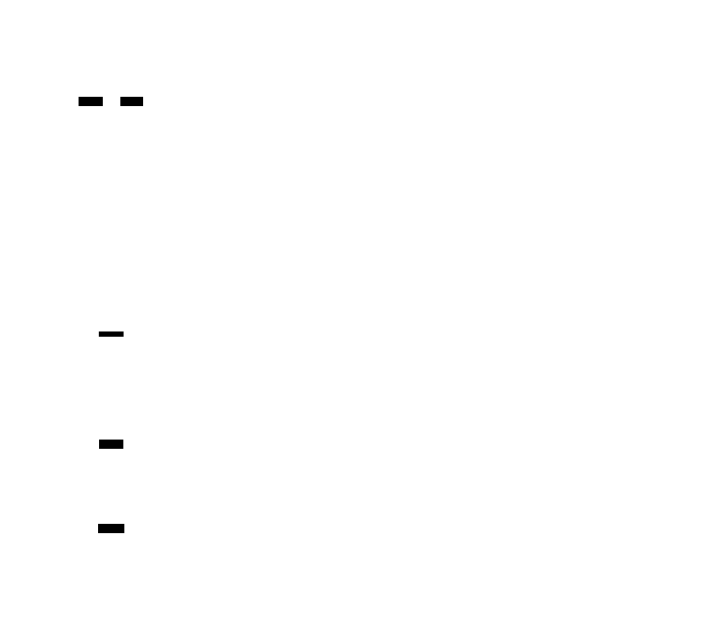

---
## 8. Test Specification
### 8.1 Test: Projection Layer Shapes
```python
def test_projection_shapes():
    """Verify Q, K, V projections produce correct shapes."""
    d_model, d_k, d_v = 512, 64, 64
    batch, seq = 4, 16
    proj = AttentionProjection(d_model, d_k, d_v)
    x = torch.randn(batch, seq, d_model)
    Q, K, V = proj(x)
    assert Q.shape == (batch, seq, d_k), f"Q shape wrong: {Q.shape}"
    assert K.shape == (batch, seq, d_k), f"K shape wrong: {K.shape}"
    assert V.shape == (batch, seq, d_v), f"V shape wrong: {V.shape}"
```
### 8.2 Test: Attention Without Mask
```python
def test_attention_no_mask():
    """Verify attention computation without masking."""
    batch, seq, d_k, d_v = 2, 10, 64, 64
    attn = ScaledDotProductAttention(d_k, dropout=0.0)
    Q = torch.randn(batch, seq, d_k)
    K = torch.randn(batch, seq, d_k)
    V = torch.randn(batch, seq, d_v)
    output, weights = attn(Q, K, V)
    # Output shape
    assert output.shape == (batch, seq, d_v)
    # Weights shape
    assert weights.shape == (batch, seq, seq)
    # Weights sum to 1
    row_sums = weights.sum(dim=-1)
    assert torch.allclose(row_sums, torch.ones_like(row_sums), atol=1e-5)
    # No NaN or Inf
    assert not torch.isnan(weights).any()
    assert not torch.isinf(weights).any()
```
### 8.3 Test: Padding Mask Correctness
```python
def test_padding_mask_correctness():
    """Verify padding mask excludes padding tokens."""
    batch, seq_len, d_k = 2, 8, 64
    # First sequence: 5 real tokens, 3 padding
    # Second sequence: 8 real tokens, 0 padding
    seq_lengths = torch.tensor([5, 8])
    mask = MaskBuilder.create_padding_mask(seq_lengths, seq_len)
    attn = ScaledDotProductAttention(d_k, dropout=0.0)
    Q = torch.randn(batch, seq_len, d_k)
    K = torch.randn(batch, seq_len, d_k)
    V = torch.randn(batch, seq_len, d_k)
    output, weights = attn(Q, K, V, mask=mask)
    # First batch: positions 5,6,7 should have zero attention weight
    assert torch.allclose(weights[0, :, 5:], torch.zeros(batch, seq_len, 3), atol=1e-6)
    # Second batch: no positions should be zero due to padding
    assert weights[1].sum() > 0
```
### 8.4 Test: Causal Mask Correctness
```python
def test_causal_mask_correctness():
    """Verify causal mask prevents future attention."""
    batch, seq_len, d_k = 1, 6, 64
    mask = MaskBuilder.create_causal_mask(seq_len)
    attn = ScaledDotProductAttention(d_k, dropout=0.0)
    Q = torch.randn(batch, seq_len, d_k)
    K = torch.randn(batch, seq_len, d_k)
    V = torch.randn(batch, seq_len, d_k)
    output, weights = attn(Q, K, V, mask=mask)
    # Check upper triangle is zero (future positions)
    for i in range(seq_len):
        for j in range(i + 1, seq_len):
            assert weights[0, i, j] < 1e-6, f"Position {i} attended to future position {j}"
    # Check each row sums to 1 (within tolerance)
    row_sums = weights.sum(dim=-1)
    assert torch.allclose(row_sums, torch.ones_like(row_sums), atol=1e-5)
```
### 8.5 Test: All-Masked Row Handling
```python
def test_all_masked_row():
    """Verify all-masked rows produce zero weights without NaN."""
    batch, seq_len, d_k = 1, 5, 64
    # Mask all positions for first query
    mask = torch.zeros(1, 1, seq_len, seq_len, dtype=torch.bool)
    mask[0, 0, 0, :] = True  # First query sees nothing
    attn = ScaledDotProductAttention(d_k, dropout=0.0)
    Q = torch.randn(batch, seq_len, d_k)
    K = torch.randn(batch, seq_len, d_k)
    V = torch.randn(batch, seq_len, d_k)
    output, weights = attn(Q, K, V, mask=mask)
    # No NaN
    assert not torch.isnan(weights).any()
    # First row should be all zeros
    assert torch.allclose(weights[0, 0, :], torch.zeros(seq_len), atol=1e-6)
```
### 8.6 Test: PyTorch Reference Verification
```python
def test_pytorch_verification():
    """Verify output matches PyTorch's F.scaled_dot_product_attention."""
    torch.manual_seed(42)
    batch, seq, d_k = 4, 16, 64
    # Our implementation
    attn = ScaledDotProductAttention(d_k, dropout=0.0)
    Q = torch.randn(batch, seq, d_k)
    K = torch.randn(batch, seq, d_k)
    V = torch.randn(batch, seq, d_k)
    our_output, _ = attn(Q, K, V)
    # PyTorch reference
    pytorch_output = F.scaled_dot_product_attention(
        Q, K, V,
        attn_mask=None,
        dropout_p=0.0,
        is_causal=False,
        scale=1.0 / math.sqrt(d_k)
    )
    max_diff = (our_output - pytorch_output).abs().max().item()
    assert max_diff < 1e-5, f"Output differs by {max_diff}, expected < 1e-5"
```
### 8.7 Test: Gradient Flow
```python
def test_gradient_flow():
    """Verify gradients flow correctly through attention."""
    batch, seq, d_k = 2, 8, 64
    attn = ScaledDotProductAttention(d_k, dropout=0.0)
    Q = torch.randn(batch, seq, d_k, requires_grad=True)
    K = torch.randn(batch, seq, d_k, requires_grad=True)
    V = torch.randn(batch, seq, d_k, requires_grad=True)
    output, _ = attn(Q, K, V)
    loss = output.sum()
    loss.backward()
    assert Q.grad is not None, "Q has no gradient"
    assert K.grad is not None, "K has no gradient"
    assert V.grad is not None, "V has no gradient"
    assert not torch.isnan(Q.grad).any(), "NaN in Q gradient"
    assert not torch.isnan(K.grad).any(), "NaN in K gradient"
    assert not torch.isnan(V.grad).any(), "NaN in V gradient"
```


---
## 9. Performance Targets
| Operation | Target | Measurement Method |
|-----------|--------|-------------------|
| Single forward pass (batch=32, seq=128, d_k=64) | < 5ms | `time.perf_counter()` around forward call |
| Memory for attention scores | O(B × S²) | `torch.cuda.max_memory_allocated()` |
| Match PyTorch reference | < 1e-5 difference | `torch.allclose(atol=1e-5)` |
| Gradient computation | < 10ms | Time `backward()` call |
| Mask creation (seq=512) | < 1ms | Time mask builder calls |
### Benchmarking Code
```python
def benchmark_attention():
    """Benchmark attention performance."""
    import time
    device = 'cuda' if torch.cuda.is_available() else 'cpu'
    batch, seq, d_k = 32, 128, 64
    attn = ScaledDotProductAttention(d_k, dropout=0.0).to(device)
    Q = torch.randn(batch, seq, d_k, device=device)
    K = torch.randn(batch, seq, d_k, device=device)
    V = torch.randn(batch, seq, d_k, device=device)
    # Warmup
    for _ in range(10):
        _ = attn(Q, K, V)
    # Timed runs
    torch.cuda.synchronize() if device == 'cuda' else None
    start = time.perf_counter()
    for _ in range(100):
        _ = attn(Q, K, V)
    torch.cuda.synchronize() if device == 'cuda' else None
    end = time.perf_counter()
    avg_time_ms = (end - start) / 100 * 1000
    print(f"Average forward pass: {avg_time_ms:.2f}ms")
    assert avg_time_ms < 5.0, f"Too slow: {avg_time_ms:.2f}ms > 5ms target"
```
---
## 10. Numerical Analysis
### 10.1 Why Scaling by sqrt(d_k) is Critical
The dot product of two random vectors with variance 1 has expected variance equal to the dimension:
$$\text{Var}(Q \cdot K) = \sum_{i=1}^{d_k} \text{Var}(Q_i \cdot K_i) \approx d_k$$
With `d_k = 64`, dot products typically have magnitude ~8. With `d_k = 512`, magnitude ~22.
**Softmax behavior with large inputs**:
```
softmax([18, 20, 15, 19]) ≈ [0.12, 0.64, 0.01, 0.23]  # Near one-hot
softmax([2.25, 2.5, 1.875, 2.375]) ≈ [0.23, 0.29, 0.20, 0.28]  # Softer
```
Near-one-hot distributions have:
- Vanishing gradients at non-max positions
- Model "commits" too early, no exploration
**Solution**: Scale by `sqrt(d_k)` to keep variance ~1:
$$\text{Attention}(Q, K, V) = \text{softmax}\left(\frac{QK^T}{\sqrt{d_k}}\right) V$$
### 10.2 Softmax Numerical Stability
PyTorch's softmax implementation is numerically stable:
$$\text{softmax}(x_i) = \frac{e^{x_i - \max(x)}}{\sum_j e^{x_j - \max(x)}}$$
This subtracts the maximum before exponentiation, ensuring all exponents ≤ 0, preventing overflow.
**Edge case**: All values are `-inf` (fully masked row):
$$\text{softmax}([-∞, -∞, -∞]) = \frac{[0, 0, 0]}{0} = [NaN, NaN, NaN]$$
**Fix**: `torch.nan_to_num(weights, nan=0.0)` replaces NaN with 0.
### 10.3 Gradient Flow Analysis
The gradient of softmax with respect to input scores:
$$\frac{\partial \text{softmax}(x_i)}{\partial x_j} = \text{softmax}(x_i) \cdot (\delta_{ij} - \text{softmax}(x_j))$$
When attention is concentrated (one-hot-ish):
- Diagonal gradient: `softmax(x_i) * (1 - softmax(x_i))` ≈ 0 when softmax(x_i) ≈ 1
- Off-diagonal gradient: `-softmax(x_i) * softmax(x_j)` ≈ 0
This is why scaling matters: softer distributions have non-zero gradients.
---
## 11. Gradient/Numerical Analysis (AI/ML Specific)
### 11.1 Shape Trace Through Complete Operation
```
Input X:               [B, S, D]     where B=32, S=128, D=512
    ↓ W_Q, W_K, W_V projections
Q:                     [B, S, K]     where K=64
K:                     [B, S, K]
V:                     [B, S, V]     where V=64
    ↓ Q @ K^T
Raw scores:            [B, S, S]
    ↓ / sqrt(K) = / 8
Scaled scores:         [B, S, S]
    ↓ softmax(dim=-1)
Attention weights:     [B, S, S]     rows sum to 1.0
    ↓ @ V
Output:                [B, S, V]
```
### 11.2 Gradient Magnitude Analysis
With proper scaling, gradient magnitudes should be:
- Q, K, V gradients: O(1) relative to output gradient
- Attention weight gradients: O(1/d_k) for each position
Without scaling, gradient magnitudes would be:
- Exponentially small for non-attended positions
- Training would fail to converge
### 11.3 Memory Budget
For batch=32, seq=128, d_k=64:
- Q, K, V tensors: 3 × 32 × 128 × 64 × 4 bytes = 3.1 MB
- Attention scores: 32 × 128 × 128 × 4 bytes = 2.1 MB
- Total forward pass: ~5.2 MB
Gradients double this to ~10 MB for backward pass.
---
[[CRITERIA_JSON: {"module_id": "transformer-scratch-m1", "criteria": ["Implement three separate nn.Linear layers for Q, K, V projection from input embeddings with configurable d_model, d_k, d_v dimensions", "Compute scaled dot-product attention as softmax(QK^T / sqrt(d_k))V with correct output shape [batch, seq_len, d_v]", "Implement padding mask that sets attention weights to zero for padding positions by applying -inf to scores before softmax", "Implement causal mask that prevents attending to future positions using upper-triangular -inf mask applied before softmax", "All operations are fully vectorized using torch.matmul with no Python loops over batch or sequence dimensions", "Verify numerical correctness against PyTorch's F.scaled_dot_product_attention with outputs matching within 1e-5 tolerance on random inputs", "Handle edge case of all-masked rows by using nan_to_num to replace NaN attention weights with 0.0", "Understand and document why scaling by sqrt(d_k) is necessary to prevent softmax saturation and gradient vanishing", "Trace tensor shapes correctly through all operations: input [batch, seq, d_model] → Q,K,V [batch, seq, d_k] → scores [batch, seq, seq] → output [batch, seq, d_v]", "Initialize projection weights using Xavier uniform initialization", "Implement MaskBuilder class with create_padding_mask and create_causal_mask static methods", "Padding mask shape [batch, 1, 1, seq_len] broadcasts correctly to attention scores", "Causal mask shape [1, 1, seq_len, seq_len] prevents future position attention", "Test gradient flow through attention mechanism with requires_grad=True on inputs", "All tests pass: shape tests, mask correctness tests, numerical stability tests, PyTorch verification tests"]}]
<!-- END_TDD_MOD -->


<!-- TDD_MOD_ID: transformer-scratch-m2 -->
# Technical Design Document: Multi-Head Attention
**Module ID**: `transformer-scratch-m2`  
**Version**: 1.0  
**Primary Language**: Python (PyTorch)
---
## 1. Module Charter
This module implements multi-head attention—the parallelized attention mechanism that enables transformers to jointly attend to information from different representation subspaces at different positions. Rather than performing a single attention function with full-dimensional keys, values, and queries, multi-head attention projects the input into h different subspaces, applies scaled dot-product attention independently in each subspace, and then concatenates and linearly projects the results.
**What this module DOES**:
- Project input embeddings to combined Q, K, V via three `nn.Linear(d_model, d_model)` layers
- Split projections into h heads via tensor reshaping: `[batch, seq, d_model]` → `[batch, heads, seq, d_k]`
- Compute scaled dot-product attention for all heads in a single batched operation
- Concatenate head outputs and project through learned W_O matrix for head mixing
- Support attention masking with correct broadcasting to `[batch, num_heads, seq_q, seq_k]`
**What this module does NOT do**:
- Positional encoding (module m3)
- Encoder/decoder layer composition with residuals and layer norm (module m4)
- Cross-attention source encoding (handled by caller)
**Upstream dependencies**: 
- Input embeddings `[batch, seq_len, d_model]` from embedding layer
- Scaled dot-product attention from module m1
**Downstream consumers**: 
- Encoder layers (self-attention)
- Decoder layers (self-attention and cross-attention)
**Invariants**:
1. `d_model % num_heads == 0` (hard requirement, enforced at initialization)
2. Output shape equals input shape: `[batch, seq_len, d_model]`
3. All heads computed in parallel via batched operations—no Python loops over heads
4. Attention weights per head sum to 1.0 per query position
5. W_O enables information mixing across all heads (no head isolation in output)
---
## 2. File Structure
Create files in this exact sequence:
```
transformer/
├── attention/
│   ├── __init__.py              # 1 - Package exports (update for MHA)
│   ├── scaled_dot_product.py    # (from m1 - already exists)
│   ├── multi_head.py            # 2 - Multi-head attention implementation
│   ├── masking.py               # (from m1 - already exists)
│   └── verification.py          # 3 - Update with MHA verification
└── tests/
    ├── __init__.py              # (already exists)
    ├── test_attention.py        # 4 - Update with MHA tests
    └── test_multi_head.py       # 5 - Dedicated MHA test suite
```
**Creation order rationale**: Build on top of m1's scaled dot-product attention. The multi-head wrapper orchestrates parallel head computation via reshaping, not by calling attention h times.
---
## 3. Complete Data Model
### 3.1 Core Tensor Shapes
All tensors follow named dimension conventions with explicit shape annotations:
| Tensor | Symbol | Shape | Named Dimensions | Description |
|--------|--------|-------|------------------|-------------|
| Input query | Q_in | `[B, Sq, D]` | batch, seq_q, d_model | Query input to MHA |
| Input key | K_in | `[B, Sk, D]` | batch, seq_k, d_model | Key input to MHA |
| Input value | V_in | `[B, Sk, D]` | batch, seq_k, d_model | Value input (same seq as K) |
| Projected Q | Q_proj | `[B, Sq, D]` | batch, seq_q, d_model | After W_Q projection |
| Projected K | K_proj | `[B, Sk, D]` | batch, seq_k, d_model | After W_K projection |
| Projected V | V_proj | `[B, Sk, D]` | batch, seq_k, d_model | After W_V projection |
| Split Q | Q_split | `[B, H, Sq, K]` | batch, heads, seq_q, d_k | After head split |
| Split K | K_split | `[B, H, Sk, K]` | batch, heads, seq_k, d_k | After head split |
| Split V | V_split | `[B, H, Sk, K]` | batch, heads, seq_k, d_k | After head split |
| Attention scores | S | `[B, H, Sq, Sk]` | batch, heads, seq_q, seq_k | Per-head attention logits |
| Attention weights | A | `[B, H, Sq, Sk]` | batch, heads, seq_q, seq_k | Softmax output per head |
| Head outputs | O_heads | `[B, H, Sq, K]` | batch, heads, seq_q, d_k | Per-head attention output |
| Concatenated | O_concat | `[B, Sq, D]` | batch, seq_q, d_model | After head concatenation |
| Final output | O | `[B, Sq, D]` | batch, seq_q, d_model | After W_O projection |
**Dimension semantics**:
- `B` (batch): Independent sequences processed in parallel
- `Sq` (seq_q): Query sequence length
- `Sk` (seq_k): Key/value sequence length (equals `seq_q` for self-attention)
- `D` (d_model): Full model dimension (e.g., 512)
- `H` (num_heads): Number of attention heads (e.g., 8)
- `K` (d_k): Per-head dimension, `d_k = d_model / num_heads` (e.g., 64)
### 3.2 Mask Tensor Broadcasting
| Mask Source | Shape | Broadcasting Target |
|-------------|-------|---------------------|
| Padding mask | `[B, 1, 1, Sk]` | `[B, H, Sq, Sk]` |
| Causal mask | `[1, 1, Sq, Sk]` | `[B, H, Sq, Sk]` |
| Combined | `[B, 1, Sq, Sk]` or `[B, H, Sq, Sk]` | `[B, H, Sq, Sk]` |
**Critical**: The heads dimension (H) in masks should be 1 for broadcasting, not H. All heads use the same mask pattern.
### 3.3 Class Definitions
```python
from dataclasses import dataclass
from typing import Optional, Tuple
import torch
import torch.nn as nn
import torch.nn.functional as F
import math
@dataclass
class MultiHeadAttentionConfig:
    """Configuration for multi-head attention."""
    d_model: int           # Full model dimension
    num_heads: int         # Number of attention heads
    dropout: float = 0.1   # Dropout probability
    def __post_init__(self):
        assert self.d_model > 0, "d_model must be positive"
        assert self.num_heads > 0, "num_heads must be positive"
        assert self.d_model % self.num_heads == 0, \
            f"d_model ({self.d_model}) must be divisible by num_heads ({self.num_heads})"
        assert 0.0 <= self.dropout < 1.0, "dropout must be in [0, 1)"
        # Compute derived values
        self.d_k = self.d_model // self.num_heads
class MultiHeadAttention(nn.Module):
    """
    Multi-Head Attention mechanism.
    Allows the model to jointly attend to information from different
    representation subspaces at different positions.
    MultiHead(Q, K, V) = Concat(head_1, ..., head_h) W_O
    where head_i = Attention(Q W_Q_i, K W_K_i, V W_V_i)
    Implementation uses combined projections with reshaping for
    parallel head computation (no Python loops over heads).
    Args:
        d_model: Model dimension (must be divisible by num_heads)
        num_heads: Number of attention heads
        dropout: Dropout probability (applied after softmax)
    """
    def __init__(self, d_model: int, num_heads: int, dropout: float = 0.1):
        super().__init__()
        # Validate dimensions
        assert d_model % num_heads == 0, \
            f"d_model ({d_model}) must be divisible by num_heads ({num_heads})"
        self.d_model = d_model
        self.num_heads = num_heads
        self.d_k = d_model // num_heads
        # Combined projection layers (project to full d_model, then split)
        self.W_Q = nn.Linear(d_model, d_model, bias=False)
        self.W_K = nn.Linear(d_model, d_model, bias=False)
        self.W_V = nn.Linear(d_model, d_model, bias=False)
        # Output projection (mixes information across heads)
        self.W_O = nn.Linear(d_model, d_model, bias=False)
        # Dropout layer
        self.dropout = nn.Dropout(p=dropout)
        # Pre-computed scale factor
        self.scale = math.sqrt(self.d_k)
        # Initialize weights
        self._init_weights()
    def _init_weights(self) -> None:
        """Initialize projection weights using Xavier uniform."""
        nn.init.xavier_uniform_(self.W_Q.weight)
        nn.init.xavier_uniform_(self.W_K.weight)
        nn.init.xavier_uniform_(self.W_V.weight)
        nn.init.xavier_uniform_(self.W_O.weight)
    def forward(
        self,
        query: torch.Tensor,
        key: torch.Tensor,
        value: torch.Tensor,
        mask: Optional[torch.Tensor] = None,
        return_attention: bool = True
    ) -> Tuple[torch.Tensor, Optional[torch.Tensor]]:
        """
        Forward pass of multi-head attention.
        Args:
            query: Query tensor [batch, seq_q, d_model]
            key: Key tensor [batch, seq_k, d_model]
            value: Value tensor [batch, seq_k, d_model]
            mask: Attention mask, broadcastable to [batch, num_heads, seq_q, seq_k]
                  True values are masked (set to -inf before softmax)
            return_attention: If True, also return attention weights
        Returns:
            output: Attention output [batch, seq_q, d_model]
            attention_weights: (optional) [batch, num_heads, seq_q, seq_k]
        """
        batch_size = query.size(0)
        seq_len_q = query.size(1)
        seq_len_k = key.size(1)
        # === STEP 1: Linear projections ===
        # Input: [batch, seq, d_model]
        # Output: [batch, seq, d_model]
        Q = self.W_Q(query)
        K = self.W_K(key)
        V = self.W_V(value)
        # === STEP 2: Reshape for multi-head ===
        # [batch, seq, d_model] -> [batch, seq, num_heads, d_k] -> [batch, num_heads, seq, d_k]
        Q = Q.view(batch_size, seq_len_q, self.num_heads, self.d_k).transpose(1, 2)
        K = K.view(batch_size, seq_len_k, self.num_heads, self.d_k).transpose(1, 2)
        V = V.view(batch_size, seq_len_k, self.num_heads, self.d_k).transpose(1, 2)
        # === STEP 3: Compute scaled dot-product attention ===
        # Q: [batch, heads, seq_q, d_k]
        # K.transpose(-2, -1): [batch, heads, d_k, seq_k]
        # scores: [batch, heads, seq_q, seq_k]
        scores = torch.matmul(Q, K.transpose(-2, -1)) / self.scale
        # === STEP 4: Apply mask (if provided) ===
        if mask is not None:
            # Mask should broadcast to [batch, num_heads, seq_q, seq_k]
            scores = scores.masked_fill(mask, float('-inf'))
        # === STEP 5: Softmax normalization ===
        attention_weights = F.softmax(scores, dim=-1)
        # === STEP 6: Handle all-masked rows (NaN -> 0) ===
        attention_weights = torch.nan_to_num(attention_weights, nan=0.0)
        # === STEP 7: Apply dropout ===
        attention_weights = self.dropout(attention_weights)
        # === STEP 8: Apply attention to values ===
        # attention_weights: [batch, heads, seq_q, seq_k]
        # V: [batch, heads, seq_k, d_k]
        # context: [batch, heads, seq_q, d_k]
        context = torch.matmul(attention_weights, V)
        # === STEP 9: Concatenate heads ===
        # [batch, heads, seq_q, d_k] -> [batch, seq_q, heads, d_k] -> [batch, seq_q, d_model]
        # CRITICAL: .contiguous() is required before .view() after transpose
        context = context.transpose(1, 2).contiguous().view(batch_size, seq_len_q, self.d_model)
        # === STEP 10: Final output projection ===
        output = self.W_O(context)
        if return_attention:
            return output, attention_weights
        return output, None
    def __repr__(self) -> str:
        return (f"MultiHeadAttention(d_model={self.d_model}, "
                f"num_heads={self.num_heads}, d_k={self.d_k})")
```

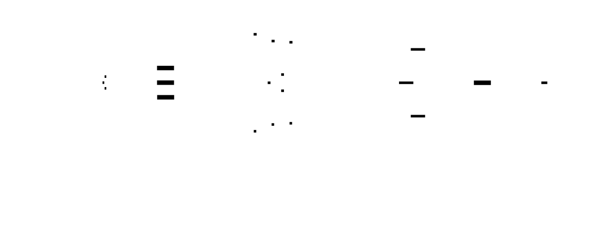

### 3.4 Shape Transformation Trace
```
=== COMPLETE SHAPE TRACE ===
Input query:         [B, Sq, D]     where B=4, Sq=16, D=512
Input key/value:     [B, Sk, D]     where Sk=16
After W_Q:           [B, Sq, D]     = [4, 16, 512]
After W_K:           [B, Sk, D]     = [4, 16, 512]
After W_V:           [B, Sk, D]     = [4, 16, 512]
After view():        [B, S, H, K]   = [4, 16, 8, 64]
After transpose():   [B, H, S, K]   = [4, 8, 16, 64]
Attention scores:    [B, H, Sq, Sk] = [4, 8, 16, 16]
Attention weights:   [B, H, Sq, Sk] = [4, 8, 16, 16]
Head outputs:        [B, H, Sq, K]  = [4, 8, 16, 64]
After transpose():   [B, Sq, H, K]  = [4, 16, 8, 64]
After contiguous():  [B, Sq, H, K]  = [4, 16, 8, 64]  (memory reorganized)
After view():        [B, Sq, D]     = [4, 16, 512]
After W_O:           [B, Sq, D]     = [4, 16, 512]
```
---
## 4. Interface Contracts
### 4.1 MultiHeadAttention.__init__()
```python
def __init__(
    self,
    d_model: int,        # Must be > 0
    num_heads: int,      # Must be > 0
    dropout: float = 0.1 # Must be in [0, 1)
):
    """
    Pre-conditions:
        - d_model > 0
        - num_heads > 0
        - d_model % num_heads == 0  (CRITICAL: enforced with assertion)
        - 0.0 <= dropout < 1.0
    Post-conditions:
        - self.d_k == d_model // num_heads
        - self.W_Q is nn.Linear(d_model, d_model, bias=False)
        - self.W_K is nn.Linear(d_model, d_model, bias=False)
        - self.W_V is nn.Linear(d_model, d_model, bias=False)
        - self.W_O is nn.Linear(d_model, d_model, bias=False)
        - self.scale == sqrt(d_k)
        - All weights initialized with Xavier uniform
    Raises:
        AssertionError: If d_model not divisible by num_heads
    """
```
### 4.2 MultiHeadAttention.forward()
```python
def forward(
    self,
    query: torch.Tensor,              # [batch, seq_q, d_model]
    key: torch.Tensor,                # [batch, seq_k, d_model]
    value: torch.Tensor,              # [batch, seq_k, d_model]
    mask: Optional[torch.Tensor] = None,  # broadcastable to [batch, heads, seq_q, seq_k]
    return_attention: bool = True
) -> Tuple[torch.Tensor, Optional[torch.Tensor]]:
    """
    Pre-conditions:
        - query.dim() == 3 and query.size(-1) == self.d_model
        - key.dim() == 3 and key.size(-1) == self.d_model
        - value.dim() == 3 and value.size(-1) == self.d_model
        - key.size(1) == value.size(1)  (same sequence length)
        - mask is None OR mask.dtype == torch.bool
        - mask is None OR mask broadcasts to [query.size(0), self.num_heads, query.size(1), key.size(1)]
    Post-conditions:
        - output.shape == [query.size(0), query.size(1), self.d_model]
        - attention_weights.shape == [query.size(0), self.num_heads, query.size(1), key.size(1)]
        - attention_weights.sum(dim=-1) ≈ 1.0 for non-fully-masked rows (per head)
        - attention_weights contains no NaN or Inf values
        - All heads computed in parallel (no sequential loops)
    Returns:
        output: [batch, seq_q, d_model]
        attention_weights: [batch, num_heads, seq_q, seq_k] or None
    Side effects:
        - Dropout applied during training (self.training == True)
        - Dropout NOT applied during evaluation (self.training == False)
    Invariants preserved:
        - All operations differentiable (autograd compatible)
        - No in-place modifications of input tensors
        - Memory layout correct after transpose+view via contiguous()
    """
```
### 4.3 Mask Broadcasting Contract
```python
# Valid mask shapes that broadcast to [batch, num_heads, seq_q, seq_k]:
# 
# [B, 1, 1, Sk]     -> Padding mask (broadcasts over heads and query positions)
# [1, 1, Sq, Sk]    -> Causal mask (broadcasts over batch and heads)
# [B, 1, Sq, Sk]    -> Combined padding + causal
# [B, H, Sq, Sk]    -> Full explicit mask (rare, allows per-head masking)
#
# INVALID:
# [B, Sq, Sk]       -> Missing head dimension, won't broadcast
# [B, Sq, Sq, Sk]   -> Wrong query dimension placement
```
---
## 5. Algorithm Specification
### 5.1 Head Splitting Algorithm
**Input**: Projected tensor `X` of shape `[batch, seq, d_model]`  
**Output**: Split tensor of shape `[batch, heads, seq, d_k]`
```
ALGORITHM: SplitHeads
INPUT: X [B, S, D] where D = H * K
STEP 1: Validate dimensions
    assert D % H == 0
    K = D // H
STEP 2: Reshape to expose head dimension
    # Interpret last dimension as (H, K)
    X_reshaped = X.view(B, S, H, K)
    # Shape: [B, S, H, K]
STEP 3: Transpose to put heads in dimension 1
    # Swap seq and heads dimensions for batched computation
    X_split = X_reshaped.transpose(1, 2)
    # Shape: [B, H, S, K]
INVARIANTS:
    - Total elements preserved: B * S * D == B * H * S * K
    - Memory order changed (non-contiguous after transpose)
    - X_split[b, h, s, :] contains the h-th head's view of position s
RETURN X_split
```


### 5.2 Head Concatenation Algorithm
**Input**: Head outputs `O_heads` of shape `[batch, heads, seq, d_k]`  
**Output**: Concatenated tensor of shape `[batch, seq, d_model]`
```
ALGORITHM: ConcatHeads
INPUT: O_heads [B, H, S, K]
STEP 1: Transpose to put seq before heads
    O_transposed = O_heads.transpose(1, 2)
    # Shape: [B, S, H, K]
    # NOTE: Memory is now non-contiguous!
STEP 2: Ensure contiguous memory layout
    # CRITICAL: Without this, view() will fail or corrupt data
    O_contiguous = O_transposed.contiguous()
    # Shape: [B, S, H, K]
    # Memory is now reorganized for sequential access
STEP 3: Merge head and d_k dimensions
    # Interpret last two dimensions as single dimension D = H * K
    O_concat = O_contiguous.view(B, S, H * K)
    # Shape: [B, S, D]
INVARIANTS:
    - Total elements preserved: B * H * S * K == B * S * D
    - Head outputs correctly interleaved in final dimension
    - Memory layout suitable for subsequent linear projection
RETURN O_concat
```
### 5.3 Complete Multi-Head Attention Algorithm
```
ALGORITHM: MultiHeadAttention
INPUT: 
    query [B, Sq, D], key [B, Sk, D], value [B, Sk, D]
    mask (optional, broadcastable to [B, H, Sq, Sk])
STEP 1: Project to Q, K, V
    Q = W_Q(query)  # [B, Sq, D]
    K = W_K(key)    # [B, Sk, D]
    V = W_V(value)  # [B, Sk, D]
STEP 2: Split into heads
    Q = SplitHeads(Q)  # [B, H, Sq, K]
    K = SplitHeads(K)  # [B, H, Sk, K]
    V = SplitHeads(V)  # [B, H, Sk, K]
STEP 3: Compute attention scores
    scores = matmul(Q, K^T) / sqrt(K)
    # Q: [B, H, Sq, K], K^T: [B, H, K, Sk]
    # scores: [B, H, Sq, Sk]
STEP 4: Apply mask (before softmax!)
    IF mask IS NOT None:
        scores = masked_fill(scores, mask, -inf)
STEP 5: Softmax normalization
    weights = softmax(scores, dim=-1)
    # Each row [b, h, q, :] sums to 1.0
STEP 6: Handle edge case
    weights = nan_to_num(weights, nan=0.0)
STEP 7: Apply dropout
    weights = dropout(weights)
STEP 8: Compute head outputs
    head_outputs = matmul(weights, V)
    # weights: [B, H, Sq, Sk], V: [B, H, Sk, K]
    # head_outputs: [B, H, Sq, K]
STEP 9: Concatenate heads
    concat = ConcatHeads(head_outputs)  # [B, Sq, D]
STEP 10: Output projection
    output = W_O(concat)  # [B, Sq, D]
RETURN output, weights
```

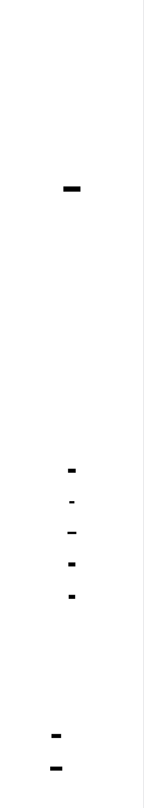

### 5.4 Why Contiguous Is Critical
```python
# Demonstration of the contiguous() requirement
x = torch.randn(2, 4, 8, 16)  # [batch, heads, seq, d_k]
print(x.is_contiguous())  # True
y = x.transpose(1, 2)     # [batch, seq, heads, d_k]
print(y.is_contiguous())  # False! Memory order unchanged
# This FAILS without contiguous():
# z = y.view(2, 4, 128)  # RuntimeError!
# This works:
z = y.contiguous().view(2, 4, 128)  # OK
# Alternative: use reshape() which calls contiguous() internally
z = y.reshape(2, 4, 128)  # Also OK, but hides the copy
```
**Memory layout explanation**:
```
Original tensor [2, 4, 8, 16]:
  Elements stored in order: [0,0,0,0], [0,0,0,1], ..., [1,3,7,15]
  Strides: [512, 128, 16, 1]
After transpose(1, 2) -> [2, 8, 4, 16]:
  Elements NOT moved, only interpretation changed
  Strides: [512, 16, 128, 1]  <- Non-contiguous!
  To access [0, 0, 0, :] need stride 128 (not 64)
  view() expects contiguous stride pattern
  contiguous() copies data to fix stride pattern
```
---
## 6. Error Handling Matrix
| Error | Detected By | Recovery | User-Visible? |
|-------|-------------|----------|---------------|
| **d_model not divisible by num_heads** | Assertion in `__init__` | Raise AssertionError with clear message | Yes - config error |
| **Query wrong dimension** | `view()` shape mismatch | RuntimeError propagates | Yes - debug message |
| **Key/Value seq mismatch** | `matmul` shape error | RuntimeError with shapes | Yes - debug message |
| **Mask wrong dtype** | `masked_fill` silent failure or error | Check: `assert mask.dtype == torch.bool` | Yes - debug message |
| **Mask not broadcastable** | `masked_fill` RuntimeError | Propagate with shape info | Yes - debug message |
| **Missing contiguous()** | `view()` RuntimeError | Add `.contiguous()` before `.view()` | Yes - implementation bug |
| **All-masked row (NaN)** | Softmax produces NaN | `nan_to_num(nan=0.0)` automatic | No - handled gracefully |
| **Negative d_model or num_heads** | Assertion in config | Raise AssertionError | Yes - config error |
| **Dropout >= 1.0** | `nn.Dropout` validation | Caught at initialization | Yes - config error |
| **Input contains NaN** | Propagates through | Check inputs (optional, debug mode) | Yes - data error |
| **CUDA out of memory** | CUDA allocation error | Catch and suggest smaller batch | Yes - resource limit |
### Error Recovery Implementation
```python
class MultiHeadAttentionError(Exception):
    """Base exception for multi-head attention errors."""
    pass
class DimensionMismatchError(MultiHeadAttentionError):
    """Raised when tensor dimensions are incompatible."""
    def __init__(self, context: str, expected: Tuple[int, ...], actual: Tuple[int, ...]):
        self.context = context
        self.expected = expected
        self.actual = actual
        super().__init__(
            f"Dimension mismatch in {context}: expected {expected}, got {actual}"
        )
class HeadSplitError(MultiHeadAttentionError):
    """Raised when d_model is not divisible by num_heads."""
    def __init__(self, d_model: int, num_heads: int):
        self.d_model = d_model
        self.num_heads = num_heads
        super().__init__(
            f"d_model ({d_model}) must be divisible by num_heads ({num_heads}). "
            f"Consider using {num_heads} heads with d_model={num_heads * (d_model // num_heads)}"
        )
def validate_mha_inputs(
    query: torch.Tensor, 
    key: torch.Tensor, 
    value: torch.Tensor,
    d_model: int,
    num_heads: int
) -> None:
    """
    Validate inputs before multi-head attention computation.
    Raises:
        DimensionMismatchError: If shapes are incompatible
        HeadSplitError: If d_model not divisible by num_heads
    """
    if query.dim() != 3:
        raise DimensionMismatchError("query", (3,), (query.dim(),))
    if key.dim() != 3:
        raise DimensionMismatchError("key", (3,), (key.dim(),))
    if value.dim() != 3:
        raise DimensionMismatchError("value", (3,), (value.dim(),))
    if query.size(-1) != d_model:
        raise DimensionMismatchError(
            "query feature dim", 
            (d_model,), 
            (query.size(-1),)
        )
    if key.size(-1) != d_model:
        raise DimensionMismatchError(
            "key feature dim", 
            (d_model,), 
            (key.size(-1),)
        )
    if value.size(-1) != d_model:
        raise DimensionMismatchError(
            "value feature dim", 
            (d_model,), 
            (value.size(-1),)
        )
    if key.size(1) != value.size(1):
        raise DimensionMismatchError(
            "key/value seq len", 
            (key.size(1),), 
            (value.size(1),)
        )
    if d_model % num_heads != 0:
        raise HeadSplitError(d_model, num_heads)
```
---
## 7. Implementation Sequence with Checkpoints
### Phase 1: Implement Combined Projection Layers (0.5-1 hour)
**Files to create**: `transformer/attention/multi_head.py`
**Tasks**:
1. Define `MultiHeadAttentionConfig` dataclass with validation
2. Implement `MultiHeadAttention.__init__()`:
   - Validate `d_model % num_heads == 0`
   - Create `W_Q`, `W_K`, `W_V` as `nn.Linear(d_model, d_model, bias=False)`
   - Create `W_O` as `nn.Linear(d_model, d_model, bias=False)`
   - Add dropout layer
   - Pre-compute `scale = sqrt(d_k)`
3. Implement `_init_weights()` with Xavier uniform
**Checkpoint**: After this phase, you should be able to:
```python
mha = MultiHeadAttention(d_model=512, num_heads=8)
assert mha.d_k == 64
assert mha.W_Q.weight.shape == (512, 512)
assert mha.W_O.weight.shape == (512, 512)
# Test divisibility check
try:
    MultiHeadAttention(d_model=500, num_heads=8)
    assert False, "Should have raised AssertionError"
except AssertionError:
    pass
```
Run: `pytest tests/test_multi_head.py::test_initialization -v`
---
### Phase 2: Implement Head Splitting Logic (1-1.5 hours)
**Files to modify**: `transformer/attention/multi_head.py`
**Tasks**:
1. Implement projection step: `Q, K, V = W_Q(x), W_K(x), W_V(x)`
2. Implement head splitting:
   ```python
   Q = Q.view(batch, seq, num_heads, d_k).transpose(1, 2)
   ```
3. Add shape validation after each operation
4. Document the dimension semantics in comments
**Checkpoint**: After this phase, you should be able to:
```python
mha = MultiHeadAttention(d_model=512, num_heads=8)
x = torch.randn(4, 16, 512)
# Manual head split test
Q = mha.W_Q(x)
Q_split = Q.view(4, 16, 8, 64).transpose(1, 2)
assert Q_split.shape == (4, 8, 16, 64)
# Verify head dimension contains correct slice
# Head 3 should contain d_model indices [192:256]
original_slice = Q[0, 5, 192:256]  # Batch 0, position 5, head 3's slice
split_head = Q_split[0, 3, 5, :]   # Batch 0, head 3, position 5
assert torch.allclose(original_slice, split_head)
```
Run: `pytest tests/test_multi_head.py::test_head_splitting -v`


---
### Phase 3: Integrate Scaled Dot-Product Attention (0.5-1 hour)
**Files to modify**: `transformer/attention/multi_head.py`
**Tasks**:
1. Compute attention scores: `matmul(Q, K.transpose(-2, -1)) / scale`
2. Apply mask with `masked_fill`
3. Apply softmax along key dimension
4. Handle NaN from all-masked rows
5. Apply dropout
6. Compute output: `matmul(weights, V)`
**Checkpoint**: After this phase, you should be able to:
```python
mha = MultiHeadAttention(d_model=512, num_heads=8, dropout=0.0)
mha.eval()  # Disable dropout
query = torch.randn(2, 10, 512)
key = torch.randn(2, 10, 512)
value = torch.randn(2, 10, 512)
# Forward through attention computation (before concat)
# This requires implementing the forward method partially
output, weights = mha(query, key, value)
assert weights.shape == (2, 8, 10, 10)
# Each row should sum to 1
row_sums = weights.sum(dim=-1)
assert torch.allclose(row_sums, torch.ones_like(row_sums), atol=1e-5)
```
Run: `pytest tests/test_multi_head.py::test_attention_weights -v`
---
### Phase 4: Implement Head Concatenation with Contiguous (1 hour)
**Files to modify**: `transformer/attention/multi_head.py`
**Tasks**:
1. Implement transpose: `context.transpose(1, 2)` to get `[batch, seq, heads, d_k]`
2. Add `.contiguous()` call (CRITICAL)
3. Implement view: `.view(batch, seq, d_model)`
4. Add assertion that output shape is correct
**Checkpoint**: After this phase, you should be able to:
```python
mha = MultiHeadAttention(d_model=512, num_heads=8, dropout=0.0)
# Test concatenation manually
head_outputs = torch.randn(2, 8, 10, 64)  # [batch, heads, seq, d_k]
concat = head_outputs.transpose(1, 2).contiguous().view(2, 10, 512)
assert concat.shape == (2, 10, 512)
# Verify values are correctly interleaved
# concat[0, 5, :64] should equal head_outputs[0, 0, 5, :]
assert torch.allclose(concat[0, 5, :64], head_outputs[0, 0, 5, :])
assert torch.allclose(concat[0, 5, 64:128], head_outputs[0, 1, 5, :])
# Test without contiguous fails
try:
    bad_concat = head_outputs.transpose(1, 2).view(2, 10, 512)
    # If this doesn't raise, the tensor happened to be contiguous
    # Test with truly non-contiguous tensor
except RuntimeError:
    pass  # Expected
```
Run: `pytest tests/test_multi_head.py::test_head_concatenation -v`


---
### Phase 5: Implement Output Projection W_O (0.5 hour)
**Files to modify**: `transformer/attention/multi_head.py`
**Tasks**:
1. Apply W_O projection: `output = self.W_O(concat)`
2. Return both output and attention weights
3. Add `return_attention` parameter for optional weight return
**Checkpoint**: After this phase, you should be able to:
```python
mha = MultiHeadAttention(d_model=512, num_heads=8, dropout=0.0)
mha.eval()
query = torch.randn(2, 10, 512)
key = torch.randn(2, 10, 512)
value = torch.randn(2, 10, 512)
output, weights = mha(query, key, value)
# Output should match input shape
assert output.shape == query.shape
assert output.shape == (2, 10, 512)
# Test without attention weights
output_only, _ = mha(query, key, value, return_attention=False)
assert output_only.shape == (2, 10, 512)
```
Run: `pytest tests/test_multi_head.py::test_output_projection -v`
---
### Phase 6: Verification Against PyTorch Reference (1-1.5 hours)
**Files to create/modify**: `transformer/attention/verification.py`
**Tasks**:
1. Implement `verify_multihead_against_pytorch()` function
2. Copy weights from our implementation to PyTorch's `nn.MultiheadAttention`
3. Handle shape difference (PyTorch expects `[seq, batch, d_model]` by default)
4. Test with various configurations:
   - Different batch sizes: 1, 4, 16
   - Different sequence lengths: 8, 32, 128
   - Different num_heads: 1, 4, 8, 16
   - With and without masks
**Checkpoint**: After this phase, verification should pass:
```python
torch.manual_seed(42)
# Our implementation
our_mha = MultiHeadAttention(d_model=512, num_heads=8, dropout=0.0)
# PyTorch reference
pytorch_mha = nn.MultiheadAttention(
    embed_dim=512, 
    num_heads=8, 
    dropout=0.0, 
    batch_first=False
)
# Copy weights (PyTorch combines Q,K,V into single matrix)
with torch.no_grad():
    combined = torch.cat([
        our_mha.W_Q.weight, 
        our_mha.W_K.weight, 
        our_mha.W_V.weight
    ], dim=0)
    pytorch_mha.in_proj_weight.copy_(combined)
    pytorch_mha.out_proj.weight.copy_(our_mha.W_O.weight)
# Test input
x = torch.randn(10, 4, 512)  # [seq, batch, d_model] for PyTorch
# PyTorch forward
pytorch_out, pytorch_weights = pytorch_mha(x, x, x)
# Our forward (need to transpose)
x_batch_first = x.transpose(0, 1)  # [batch, seq, d_model]
our_out, our_weights = our_mha(x_batch_first, x_batch_first, x_batch_first)
our_out = our_out.transpose(0, 1)  # Back to [seq, batch, d_model]
# Compare
assert torch.allclose(our_out, pytorch_out, atol=1e-5)
print(f"Max diff: {(our_out - pytorch_out).abs().max().item():.2e}")
```
Run: `pytest tests/test_multi_head.py::test_pytorch_verification -v`

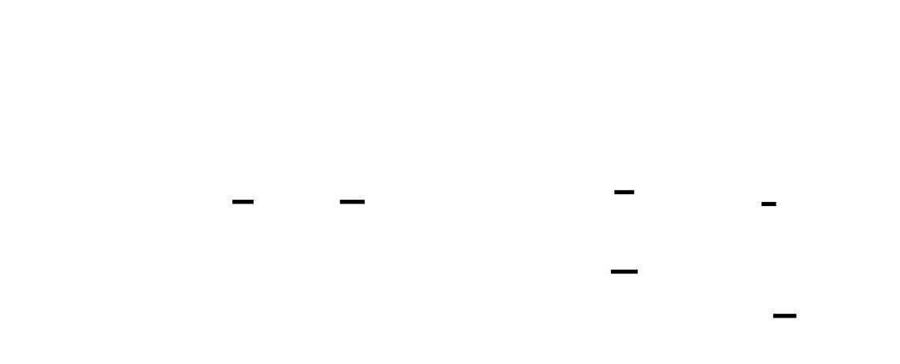

---
## 8. Test Specification
### 8.1 Test: Initialization and Configuration
```python
def test_initialization():
    """Verify correct initialization of multi-head attention."""
    # Standard configuration
    mha = MultiHeadAttention(d_model=512, num_heads=8, dropout=0.1)
    assert mha.d_model == 512
    assert mha.num_heads == 8
    assert mha.d_k == 64
    assert mha.scale == math.sqrt(64)
    # Check projection shapes
    assert mha.W_Q.weight.shape == (512, 512)
    assert mha.W_K.weight.shape == (512, 512)
    assert mha.W_V.weight.shape == (512, 512)
    assert mha.W_O.weight.shape == (512, 512)
    # Check no bias
    assert mha.W_Q.bias is None
    # Test divisibility enforcement
    with pytest.raises(AssertionError):
        MultiHeadAttention(d_model=500, num_heads=8)
    with pytest.raises(AssertionError):
        MultiHeadAttention(d_model=512, num_heads=0)
```
### 8.2 Test: Head Splitting Correctness
```python
def test_head_splitting():
    """Verify head splitting produces correct shapes and values."""
    d_model, num_heads = 512, 8
    d_k = d_model // num_heads
    batch, seq = 4, 16
    mha = MultiHeadAttention(d_model, num_heads)
    x = torch.randn(batch, seq, d_model)
    # Project and split
    Q = mha.W_Q(x)
    Q_split = Q.view(batch, seq, num_heads, d_k).transpose(1, 2)
    # Shape check
    assert Q_split.shape == (batch, num_heads, seq, d_k)
    # Value correctness: head h contains dimensions [h*d_k : (h+1)*d_k]
    for h in range(num_heads):
        start_idx = h * d_k
        end_idx = (h + 1) * d_k
        original = Q[:, :, start_idx:end_idx]  # [batch, seq, d_k]
        split = Q_split[:, h, :, :]  # [batch, seq, d_k]
        assert torch.allclose(original, split), f"Head {h} values mismatch"
```
### 8.3 Test: Head Concatenation Correctness
```python
def test_head_concatenation():
    """Verify head concatenation correctly merges heads."""
    d_model, num_heads = 512, 8
    d_k = d_model // num_heads
    batch, seq = 4, 16
    # Create head outputs with known values
    head_outputs = torch.arange(batch * num_heads * seq * d_k, dtype=torch.float)
    head_outputs = head_outputs.reshape(batch, num_heads, seq, d_k)
    # Concatenate
    concat = head_outputs.transpose(1, 2).contiguous().view(batch, seq, d_model)
    # Shape check
    assert concat.shape == (batch, seq, d_model)
    # Value correctness: each position should have heads concatenated
    for b in range(batch):
        for s in range(seq):
            for h in range(num_heads):
                start_idx = h * d_k
                end_idx = (h + 1) * d_k
                concat_slice = concat[b, s, start_idx:end_idx]
                head_slice = head_outputs[b, h, s, :]
                assert torch.allclose(concat_slice, head_slice)
```
### 8.4 Test: Complete Forward Pass
```python
def test_forward_pass():
    """Verify complete forward pass produces correct output shape."""
    d_model, num_heads = 256, 4
    batch, seq = 8, 32
    mha = MultiHeadAttention(d_model, num_heads, dropout=0.0)
    mha.eval()
    query = torch.randn(batch, seq, d_model)
    key = torch.randn(batch, seq, d_model)
    value = torch.randn(batch, seq, d_model)
    output, weights = mha(query, key, value)
    # Output shape matches input
    assert output.shape == (batch, seq, d_model)
    # Weights shape
    assert weights.shape == (batch, num_heads, seq, seq)
    # Weights sum to 1 per query position per head
    row_sums = weights.sum(dim=-1)
    assert torch.allclose(row_sums, torch.ones(batch, num_heads, seq), atol=1e-5)
    # No NaN or Inf
    assert not torch.isnan(output).any()
    assert not torch.isinf(output).any()
```
### 8.5 Test: Cross-Attention (Different Query/Key Lengths)
```python
def test_cross_attention():
    """Verify MHA works with different query and key lengths."""
    d_model, num_heads = 256, 4
    batch = 4
    seq_q, seq_k = 10, 20  # Different lengths
    mha = MultiHeadAttention(d_model, num_heads, dropout=0.0)
    mha.eval()
    query = torch.randn(batch, seq_q, d_model)
    key = torch.randn(batch, seq_k, d_model)
    value = torch.randn(batch, seq_k, d_model)
    output, weights = mha(query, key, value)
    # Output matches query length
    assert output.shape == (batch, seq_q, d_model)
    # Weights match query x key lengths
    assert weights.shape == (batch, num_heads, seq_q, seq_k)
    # Weights still sum to 1
    row_sums = weights.sum(dim=-1)
    assert torch.allclose(row_sums, torch.ones(batch, num_heads, seq_q), atol=1e-5)
```
### 8.6 Test: Mask Broadcasting
```python
def test_mask_broadcasting():
    """Verify masks broadcast correctly to [batch, heads, seq_q, seq_k]."""
    d_model, num_heads = 256, 4
    batch, seq = 2, 8
    mha = MultiHeadAttention(d_model, num_heads, dropout=0.0)
    mha.eval()
    x = torch.randn(batch, seq, d_model)
    # Padding mask [batch, 1, 1, seq]
    padding_mask = torch.zeros(batch, 1, 1, seq, dtype=torch.bool)
    padding_mask[0, 0, 0, 5:] = True  # Mask positions 5-7 for first batch
    output, weights = mha(x, x, x, mask=padding_mask)
    # First batch should have zero attention to positions 5-7
    assert torch.allclose(weights[0, :, :, 5:], torch.zeros(1, num_heads, seq, 3), atol=1e-6)
    # Causal mask [1, 1, seq, seq]
    causal_mask = torch.triu(torch.ones(seq, seq), diagonal=1).bool()
    causal_mask = causal_mask.unsqueeze(0).unsqueeze(0)
    output, weights = mha(x, x, x, mask=causal_mask)
    # Upper triangle should be zero
    for i in range(seq):
        for j in range(i + 1, seq):
            assert weights[0, 0, i, j] < 1e-6
```
### 8.7 Test: PyTorch Reference Verification
```python
def test_pytorch_verification():
    """Verify output matches PyTorch's nn.MultiheadAttention."""
    torch.manual_seed(42)
    d_model, num_heads = 512, 8
    batch, seq = 4, 16
    # Our implementation
    our_mha = MultiHeadAttention(d_model, num_heads, dropout=0.0)
    # PyTorch reference
    pytorch_mha = nn.MultiheadAttention(
        embed_dim=d_model,
        num_heads=num_heads,
        dropout=0.0,
        batch_first=True  # Use batch-first to match our convention
    )
    # Copy weights
    with torch.no_grad():
        combined = torch.cat([
            our_mha.W_Q.weight,
            our_mha.W_K.weight,
            our_mha.W_V.weight
        ], dim=0)
        pytorch_mha.in_proj_weight.copy_(combined)
        pytorch_mha.out_proj.weight.copy_(our_mha.W_O.weight)
    # Test input
    x = torch.randn(batch, seq, d_model)
    # Forward passes
    our_out, our_weights = our_mha(x, x, x)
    pytorch_out, pytorch_weights = pytorch_mha(x, x, x, need_weights=True)
    # Compare outputs
    output_diff = (our_out - pytorch_out).abs().max().item()
    assert output_diff < 1e-5, f"Output differs by {output_diff}"
    # Compare weights
    weight_diff = (our_weights - pytorch_weights).abs().max().item()
    assert weight_diff < 1e-5, f"Weights differ by {weight_diff}"
    print(f"✓ Max output diff: {output_diff:.2e}")
    print(f"✓ Max weight diff: {weight_diff:.2e}")
```
### 8.8 Test: Gradient Flow
```python
def test_gradient_flow():
    """Verify gradients flow correctly through multi-head attention."""
    d_model, num_heads = 256, 4
    batch, seq = 2, 8
    mha = MultiHeadAttention(d_model, num_heads, dropout=0.0)
    query = torch.randn(batch, seq, d_model, requires_grad=True)
    key = torch.randn(batch, seq, d_model, requires_grad=True)
    value = torch.randn(batch, seq, d_model, requires_grad=True)
    output, _ = mha(query, key, value)
    loss = output.sum()
    loss.backward()
    # All inputs have gradients
    assert query.grad is not None
    assert key.grad is not None
    assert value.grad is not None
    # All parameters have gradients
    for name, param in mha.named_parameters():
        assert param.grad is not None, f"{name} has no gradient"
        assert not torch.isnan(param.grad).any(), f"{name} has NaN gradient"
        assert not torch.isinf(param.grad).any(), f"{name} has Inf gradient"
    # Gradient magnitudes are reasonable
    query_grad_norm = query.grad.norm().item()
    assert 0.01 < query_grad_norm < 100, f"Query gradient norm unusual: {query_grad_norm}"
```

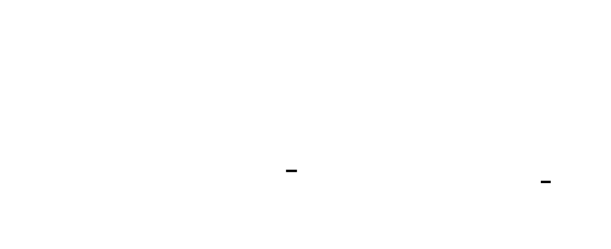

---
## 9. Performance Targets
| Operation | Target | Measurement Method |
|-----------|--------|-------------------|
| Forward pass (batch=32, seq=128, d_model=512, heads=8) | < 10ms | `time.perf_counter()` around forward |
| Memory for attention scores | O(B × H × S²) | `torch.cuda.max_memory_allocated()` |
| Match PyTorch reference | < 1e-5 difference | `torch.allclose(atol=1e-5)` |
| Parallel vs sequential heads | Same time (batched) | Compare batched vs loop implementation |
| Gradient computation | < 20ms | Time `backward()` call |
| Head split/concat overhead | < 0.5ms | Time reshape operations |
### Benchmarking Code
```python
def benchmark_multihead_attention():
    """Benchmark multi-head attention performance."""
    import time
    device = 'cuda' if torch.cuda.is_available() else 'cpu'
    batch, seq, d_model, num_heads = 32, 128, 512, 8
    mha = MultiHeadAttention(d_model, num_heads, dropout=0.0).to(device)
    mha.eval()
    query = torch.randn(batch, seq, d_model, device=device)
    key = torch.randn(batch, seq, d_model, device=device)
    value = torch.randn(batch, seq, d_model, device=device)
    # Warmup
    for _ in range(10):
        _ = mha(query, key, value)
    # Timed runs
    if device == 'cuda':
        torch.cuda.synchronize()
    start = time.perf_counter()
    for _ in range(100):
        _ = mha(query, key, value)
    if device == 'cuda':
        torch.cuda.synchronize()
    end = time.perf_counter()
    avg_time_ms = (end - start) / 100 * 1000
    print(f"Average forward pass: {avg_time_ms:.2f}ms")
    assert avg_time_ms < 10.0, f"Too slow: {avg_time_ms:.2f}ms > 10ms target"
    return avg_time_ms
def benchmark_parallel_vs_sequential():
    """Verify parallel head computation is faster than sequential."""
    import time
    device = 'cuda' if torch.cuda.is_available() else 'cpu'
    batch, seq, d_model, num_heads = 16, 64, 256, 8
    d_k = d_model // num_heads
    # Parallel (our implementation)
    mha = MultiHeadAttention(d_model, num_heads, dropout=0.0).to(device)
    x = torch.randn(batch, seq, d_model, device=device)
    # Sequential (for comparison)
    def sequential_attention(x, num_heads, d_k):
        outputs = []
        for h in range(num_heads):
            start = h * d_k
            end = (h + 1) * d_k
            head_out = x[:, :, start:end]  # Simplified
            outputs.append(head_out)
        return torch.cat(outputs, dim=-1)
    # Warmup
    for _ in range(10):
        _ = mha(x, x, x)
        _ = sequential_attention(x, num_heads, d_k)
    # Time parallel
    if device == 'cuda':
        torch.cuda.synchronize()
    start = time.perf_counter()
    for _ in range(100):
        _ = mha(x, x, x)
    if device == 'cuda':
        torch.cuda.synchronize()
    parallel_time = time.perf_counter() - start
    # Time sequential
    if device == 'cuda':
        torch.cuda.synchronize()
    start = time.perf_counter()
    for _ in range(100):
        _ = sequential_attention(x, num_heads, d_k)
    if device == 'cuda':
        torch.cuda.synchronize()
    sequential_time = time.perf_counter() - start
    print(f"Parallel: {parallel_time*1000:.2f}ms")
    print(f"Sequential: {sequential_time*1000:.2f}ms")
    print(f"Speedup: {sequential_time/parallel_time:.2f}x")
```
---
## 10. Numerical Analysis
### 10.1 Why d_model Must Be Divisible by num_heads
The head splitting operation divides `d_model` into `num_heads` equal parts:
```
d_k = d_model / num_heads
```
If `d_model` is not divisible by `num_heads`, `d_k` would be non-integer, which is impossible for tensor dimensions. This is a hard constraint, not a design choice.
**Examples**:
- `d_model=512, num_heads=8` → `d_k=64` ✓
- `d_model=512, num_heads=6` → `d_k=85.33` ✗ (not integer)
- `d_model=768, num_heads=12` → `d_k=64` ✓
### 10.2 Head Dimension and Model Capacity
With `d_model=512` and `num_heads=8`, each head operates on 64 dimensions. This creates a trade-off:
| num_heads | d_k | Heads specialize in | Information mixing |
|-----------|-----|---------------------|-------------------|
| 1 | 512 | Everything | None (single attention) |
| 4 | 128 | Broad patterns | Moderate |
| 8 | 64 | Specific patterns | Strong |
| 16 | 32 | Very specific | Very strong |
| 32 | 16 | Too narrow? | May lose capacity |
The original Transformer uses `num_heads=8` with `d_k=64` as a good balance.
### 10.3 Gradient Flow Through Head Splitting
The `view` and `transpose` operations are differentiable:
```
∂(output)/∂(input) passes through view unchanged
∂(transpose(x))/∂x = transpose of gradient
```
Gradients flow from each head back to its corresponding slice of the input. No gradient mixing occurs across heads during backpropagation through the split operation.
### 10.4 Memory Layout Analysis
```
Input tensor [B, S, D]:
  Memory: Sequential by position, then by feature
  Access pattern: cache-friendly for linear layers
After view [B, S, H, K]:
  Memory: Same as input (no copy)
  Interpretation changed, data unchanged
After transpose [B, H, S, K]:
  Memory: NON-CONTIGUOUS
  Strides: [H*K, K, H*K*S, 1] (instead of [H*K, H*K*S, 1, K])
  Access pattern: Strided for attention computation
After contiguous [B, H, S, K]:
  Memory: COPIED to contiguous layout
  Strides: [H*S*K, S*K, K, 1]
  Access pattern: Cache-friendly again
```
**Memory cost of contiguous()**: O(B × H × S × K) copy operation. This is unavoidable for correct `view()` after `transpose()`.
---
## 11. Gradient/Numerical Analysis (AI/ML Specific)
### 11.1 Complete Shape Trace with Gradient Tracking
```
=== FORWARD PASS ===
query:              [B, Sq, D]     requires_grad=True
    ↓ W_Q (linear)
Q_proj:             [B, Sq, D]     requires_grad=True (from query)
    ↓ view
Q_reshaped:         [B, Sq, H, K]  same storage as Q_proj
    ↓ transpose
Q_split:            [B, H, Sq, K]  same storage, different strides
K_split, V_split:   [B, H, Sk, K]  similar path
    ↓ matmul(Q, K^T)
scores:             [B, H, Sq, Sk] requires_grad=True
    ↓ / sqrt(d_k)
scaled:             [B, H, Sq, Sk]
    ↓ softmax
weights:            [B, H, Sq, Sk] sum(dim=-1) = 1.0
    ↓ matmul(weights, V)
head_outputs:       [B, H, Sq, K]
    ↓ transpose + contiguous + view
concat:             [B, Sq, D]
    ↓ W_O (linear)
output:             [B, Sq, D]     requires_grad=True
=== BACKWARD PASS ===
∂L/∂output:         [B, Sq, D]
    ↓ through W_O
∂L/∂concat:         [B, Sq, D]
    ↓ through view + transpose
∂L/∂head_outputs:   [B, H, Sq, K]
    ↓ through matmul(weights, V)
∂L/∂weights:        [B, H, Sq, Sk]
∂L/∂V:              [B, H, Sk, K]
    ↓ through softmax
∂L/∂scores:         [B, H, Sq, Sk]
    ↓ through scaling
∂L/∂(QK^T):         [B, H, Sq, Sk]
    ↓ through matmul
∂L/∂Q:              [B, H, Sq, K]
∂L/∂K:              [B, H, Sk, K]
    ↓ through transpose + view
∂L/∂Q_proj:         [B, Sq, D]
∂L/∂K_proj:         [B, Sk, D]
    ↓ through W_Q, W_K
∂L/∂query:          [B, Sq, D]
∂L/∂key:            [B, Sk, D]
```
### 11.2 Gradient Magnitude Expectations
With proper initialization (Xavier uniform) and scaling (`/ sqrt(d_k)`):
| Gradient | Expected Magnitude | Warning Sign |
|----------|-------------------|--------------|
| ∂L/∂output | O(1) | > 100 or < 1e-6 |
| ∂L/∂weights | O(1/d_k) | Near zero (vanishing) |
| ∂L/∂scores | O(1) | NaN (overflow in softmax) |
| ∂L/∂Q, K, V | O(1) | > 1000 (exploding) |
| ∂L/∂W_Q, W_K, W_V | O(1/sqrt(D)) | Consistently zero |
### 11.3 Memory Budget Analysis
For batch=32, seq=128, d_model=512, num_heads=8:
```
Input tensors (Q, K, V):      3 × 32 × 128 × 512 × 4 bytes = 25.2 MB
Projected tensors:            3 × 32 × 128 × 512 × 4 bytes = 25.2 MB
Split tensors:                Same storage (no copy)
Attention scores:             32 × 8 × 128 × 128 × 4 bytes = 16.8 MB
Attention weights:            Same storage
Head outputs:                 32 × 8 × 128 × 64 × 4 bytes = 8.4 MB
Concatenated:                 After contiguous: 32 × 128 × 512 × 4 bytes = 8.4 MB
Output:                       32 × 128 × 512 × 4 bytes = 8.4 MB
Total forward:                ~92 MB
Total backward (gradients):   ~92 MB
Parameters:                   
  W_Q, W_K, W_V, W_O:         4 × 512 × 512 × 4 bytes = 4.2 MB
  Parameter gradients:        4.2 MB
Total memory:                 ~200 MB for this configuration
```
### 11.4 Numerical Stability Checklist
| Operation | Stability Concern | Mitigation |
|-----------|------------------|------------|
| Dot product QK^T | Large values → softmax overflow | Scale by `sqrt(d_k)` |
| Softmax | All `-inf` → NaN | `nan_to_num(nan=0.0)` |
| View after transpose | RuntimeError if non-contiguous | `.contiguous()` before `.view()` |
| Large d_model | Gradient explosion | Xavier initialization |
| Many heads (small d_k) | Underflow in attention | Keep d_k >= 16 |


---
## 12. Common Pitfalls and Solutions
| Pitfall | Symptom | Solution |
|---------|---------|----------|
| **d_model not divisible by num_heads** | AssertionError at init | Validate before creating; use compatible values |
| **Missing .contiguous()** | RuntimeError: view size not compatible | Add `.contiguous()` after `.transpose(1, 2)` |
| **Wrong transpose dimension** | Shape mismatch in matmul | Use `.transpose(-2, -1)` for last two dims |
| **Mask not broadcasting** | Attention includes wrong positions | Reshape to `[B, 1, 1, Sk]` or `[1, 1, Sq, Sk]` |
| **W_O forgotten** | Heads don't interact | Always apply W_O after concatenation |
| **Scale factor wrong** | Attention saturates or vanishes | Use `sqrt(d_k)`, not `d_k` or `sqrt(d_model)` |
| **No gradient for attention weights** | Can't visualize attention | Return weights from forward(), don't detach |
| **Different Q/K lengths not supported** | Shape error in cross-attention | Ensure implementation handles seq_q ≠ seq_k |
---
[[CRITERIA_JSON: {"module_id": "transformer-scratch-m2", "criteria": ["Implement d_model divisibility check with assertion that d_model % num_heads == 0, computing d_k = d_model // num_heads", "Create combined W_Q, W_K, W_V projection layers (nn.Linear(d_model, d_model, bias=False)) that project to full d_model dimensions before head splitting", "Implement head splitting via .view(batch, seq, num_heads, d_k).transpose(1, 2) to transform [batch, seq, d_model] to [batch, num_heads, seq, d_k]", "Compute scaled dot-product attention for all heads in a single batched operation using torch.matmul with no Python loops over heads", "Handle the contiguous() requirement before final view() operation to avoid RuntimeError when reshaping transposed tensors", "Implement head concatenation via .transpose(1, 2).contiguous().view(batch, seq, d_model) to merge heads back into d_model dimensions", "Create output projection W_O (nn.Linear(d_model, d_model, bias=False)) that mixes information across all heads after concatenation", "Verify output shape matches input shape [batch, seq_len, d_model] exactly", "Verify numerical correctness against PyTorch's nn.MultiheadAttention with outputs matching within 1e-5 tolerance on random inputs", "Implement proper attention mask broadcasting to shape [batch, num_heads, seq_q, seq_k] or broadcastable equivalent", "Initialize projection weights using Xavier uniform initialization for stable training", "Handle NaN attention weights from all-masked rows using torch.nan_to_num or equivalent", "Test with different query and key sequence lengths for cross-attention scenarios", "Test gradient flow through all projection layers and attention computation", "Document the relationship between head splitting and contiguous memory requirements"]}]
<!-- END_TDD_MOD -->


<!-- TDD_MOD_ID: transformer-scratch-m3 -->
# Technical Design Document: Feed-Forward Network, Embeddings & Positional Encoding
**Module ID**: `transformer-scratch-m3`  
**Version**: 1.0  
**Primary Language**: Python (PyTorch)
---
## 1. Module Charter
This module implements the non-linear transformation and positional grounding components of the Transformer architecture. The position-wise Feed-Forward Network (FFN) applies a two-layer MLP with GELU activation to each token independently, providing the essential non-linearity that gives transformers their expressive power beyond the fundamentally linear attention operation. The token embedding layer maps discrete vocabulary indices to continuous d_model-dimensional vectors with optional √d_model scaling. The sinusoidal positional encoding injects sequence order information through fixed sine/cosine functions at varying frequencies, registered as a buffer (not a learnable parameter) to preserve the model's ability to extrapolate to longer sequences. These components compose into a unified embedding pipeline that transforms raw token indices into position-aware representations ready for attention processing.
**What this module DOES**:
- Apply two-layer FFN with configurable activation (ReLU or GELU) and 4× expansion ratio
- Map token indices to d_model-dimensional embeddings with optional √d_model scaling
- Compute sinusoidal positional encodings for up to max_seq_len positions
- Register positional encoding as buffer (not parameter) for correct training behavior
- Compose token embeddings + positional encodings with dropout regularization
- Handle even/odd dimension indexing correctly for sine/cosine assignment
**What this module does NOT do**:
- Attention computation (module m1, m2)
- Encoder/decoder layer composition (module m4)
- Training loop or loss computation (module m5)
- Inference generation (module m6)
**Upstream dependencies**: 
- Token indices `[batch, seq_len]` from tokenizer
- Continuous tensors `[batch, seq, d_model]` from attention layers
**Downstream consumers**: 
- Encoder layers (self-attention input)
- Decoder layers (self-attention input)
**Invariants**:
1. FFN output shape equals input shape: `[batch, seq_len, d_model]`
2. Embedding output shape: `[batch, seq_len, d_model]`
3. Positional encoding is NOT modified by optimizer (buffer, not parameter)
4. All positional encodings are unique (no two positions have identical vectors)
5. Dropout is active during training (`model.train()`), disabled during eval (`model.eval()`)
6. PE computation uses log-space for numerical stability
---
## 2. File Structure
Create files in this exact sequence:
```
transformer/
├── layers/
│   ├── __init__.py              # 1 - Package exports
│   ├── ffn.py                   # 2 - Position-wise feed-forward network
│   ├── embedding.py             # 3 - Token embedding with optional scaling
│   ├── positional_encoding.py   # 4 - Sinusoidal positional encoding
│   └── transformer_embedding.py # 5 - Combined embedding layer
└── tests/
    ├── __init__.py              # 6 - Test package
    ├── test_ffn.py              # 7 - FFN unit tests
    ├── test_embedding.py        # 8 - Token embedding tests
    ├── test_positional_encoding.py  # 9 - Positional encoding tests
    └── test_transformer_embedding.py # 10 - Combined embedding tests
```
**Creation order rationale**: Start with FFN (simplest, no dependencies), then token embedding (straightforward lookup), then positional encoding (mathematical complexity), finally compose them together. Tests follow each component.
---
## 3. Complete Data Model
### 3.1 Core Tensor Shapes
| Tensor | Symbol | Shape | Named Dimensions | Description |
|--------|--------|-------|------------------|-------------|
| FFN input | X | `[B, S, D]` | batch, seq_len, d_model | Input from attention layer |
| FFN hidden | H | `[B, S, F]` | batch, seq_len, d_ff | After first linear + activation |
| FFN output | O | `[B, S, D]` | batch, seq_len, d_model | After second linear |
| Token indices | T | `[B, S]` | batch, seq_len | Integer vocabulary indices |
| Raw embedding | E_raw | `[B, S, D]` | batch, seq_len, d_model | After nn.Embedding lookup |
| Scaled embedding | E | `[B, S, D]` | batch, seq_len, d_model | After √d_model scaling |
| Position encoding | PE | `[1, M, D]` | 1, max_seq_len, d_model | Precomputed sinusoidal encodings |
| Combined | C | `[B, S, D]` | batch, seq_len, d_model | E + PE with dropout |
**Dimension semantics**:
- `B` (batch): Independent sequences processed in parallel
- `S` (seq_len): Sequence positions (variable per batch, padded)
- `D` (d_model): Full model dimension (typically 512)
- `F` (d_ff): FFN hidden dimension (typically 4 × d_model = 2048)
- `M` (max_seq_len): Maximum sequence length for precomputed PE (typically 5000)
### 3.2 Positional Encoding Dimension Indexing
The sinusoidal formula assigns sine to even indices and cosine to odd indices:
```
Dimension Index | Formula
----------------|--------
      0         | sin(pos / 10000^(0/d_model))
      1         | cos(pos / 10000^(0/d_model))
      2         | sin(pos / 10000^(2/d_model))
      3         | cos(pos / 10000^(2/d_model))
      4         | sin(pos / 10000^(4/d_model))
      5         | cos(pos / 10000^(4/d_model))
      ...       | ...
     510        | sin(pos / 10000^(510/d_model))
     511        | cos(pos / 10000^(510/d_model))
```
**Critical insight**: The divisor term `10000^(2i/d_model)` uses `2i` for the exponent calculation, but sine/cosine alternate at single indices. This means:
- Even index `2i` uses sine with divisor `10000^(2i/d_model)`
- Odd index `2i+1` uses cosine with same divisor `10000^(2i/d_model)`
### 3.3 Class Definitions
```python
from dataclasses import dataclass
from typing import Optional, Literal
import torch
import torch.nn as nn
import torch.nn.functional as F
import math
@dataclass
class FFNConfig:
    """Configuration for position-wise feed-forward network."""
    d_model: int           # Input/output dimension
    d_ff: Optional[int]    # Hidden dimension (default: 4 * d_model)
    dropout: float = 0.1   # Dropout probability
    activation: Literal['relu', 'gelu'] = 'gelu'  # Activation function
    def __post_init__(self):
        assert self.d_model > 0, "d_model must be positive"
        if self.d_ff is None:
            self.d_ff = 4 * self.d_model
        assert self.d_ff > 0, "d_ff must be positive"
        assert 0.0 <= self.dropout < 1.0, "dropout must be in [0, 1)"
        assert self.activation in ['relu', 'gelu'], \
            f"activation must be 'relu' or 'gelu', got {self.activation}"
class PositionWiseFFN(nn.Module):
    """
    Position-wise feed-forward network.
    Applies a two-layer MLP independently to each position:
        FFN(x) = W2 * activation(W1 * x + b1) + b2
    The expansion ratio (d_ff / d_model) controls model capacity.
    Default is 4×, following the original Transformer paper.
    Shape transformation:
        Input:  [batch, seq_len, d_model]
        Hidden: [batch, seq_len, d_ff]    (4× expansion)
        Output: [batch, seq_len, d_model] (back to d_model)
    """
    def __init__(
        self,
        d_model: int,
        d_ff: Optional[int] = None,
        dropout: float = 0.1,
        activation: Literal['relu', 'gelu'] = 'gelu'
    ):
        super().__init__()
        # Set default expansion ratio
        d_ff = d_ff or 4 * d_model
        # Store configuration
        self.d_model = d_model
        self.d_ff = d_ff
        self.dropout_p = dropout
        # Linear layers
        self.W1 = nn.Linear(d_model, d_ff)
        self.W2 = nn.Linear(d_ff, d_model)
        # Dropout layer
        self.dropout = nn.Dropout(dropout)
        # Select activation function
        if activation == 'relu':
            self.activation_fn = F.relu
        elif activation == 'gelu':
            self.activation_fn = F.gelu
        else:
            raise ValueError(f"Unknown activation: {activation}")
        self.activation_name = activation
        # Initialize weights
        self._init_weights()
    def _init_weights(self) -> None:
        """Initialize weights using Xavier uniform, biases to zero."""
        nn.init.xavier_uniform_(self.W1.weight)
        nn.init.xavier_uniform_(self.W2.weight)
        nn.init.zeros_(self.W1.bias)
        nn.init.zeros_(self.W2.bias)
    def forward(self, x: torch.Tensor) -> torch.Tensor:
        """
        Forward pass through position-wise FFN.
        Args:
            x: Input tensor [batch, seq_len, d_model]
        Returns:
            Output tensor [batch, seq_len, d_model]
        Invariants:
            - Output shape equals input shape
            - Non-linearity is applied (not a linear transformation)
        """
        # First linear layer: [B, S, D] -> [B, S, F]
        hidden = self.W1(x)
        # Apply non-linearity
        hidden = self.activation_fn(hidden)
        # Apply dropout (no-op in eval mode)
        hidden = self.dropout(hidden)
        # Second linear layer: [B, S, F] -> [B, S, D]
        output = self.W2(hidden)
        return output
    def extra_repr(self) -> str:
        return (f"d_model={self.d_model}, d_ff={self.d_ff}, "
                f"dropout={self.dropout_p}, activation={self.activation_name}")
```


```python
@dataclass
class TokenEmbeddingConfig:
    """Configuration for token embedding layer."""
    vocab_size: int        # Size of vocabulary
    d_model: int           # Embedding dimension
    scale_by_sqrt: bool = True  # Scale embeddings by sqrt(d_model)
    def __post_init__(self):
        assert self.vocab_size > 0, "vocab_size must be positive"
        assert self.d_model > 0, "d_model must be positive"
class TokenEmbedding(nn.Module):
    """
    Token embedding layer with optional sqrt(d_model) scaling.
    Converts token indices to dense embedding vectors.
    Scaling by sqrt(d_model):
        The original Transformer paper scales embeddings to match
        the expected input variance for subsequent layers.
        Modern implementations (GPT-2, HuggingFace) often omit this.
        This implementation follows the paper but makes it configurable.
    Shape transformation:
        Input:  [batch, seq_len] (integer token indices)
        Output: [batch, seq_len, d_model]
    """
    def __init__(
        self,
        vocab_size: int,
        d_model: int,
        scale_by_sqrt: bool = True
    ):
        super().__init__()
        self.vocab_size = vocab_size
        self.d_model = d_model
        self.scale_by_sqrt = scale_by_sqrt
        # Embedding lookup table
        self.embedding = nn.Embedding(vocab_size, d_model)
        # Initialize weights
        self._init_weights()
    def _init_weights(self) -> None:
        """Initialize embeddings with small random values (std=0.02)."""
        nn.init.normal_(self.embedding.weight, mean=0.0, std=0.02)
    def forward(self, x: torch.Tensor) -> torch.Tensor:
        """
        Convert token indices to embeddings.
        Args:
            x: Token indices [batch, seq_len], dtype=torch.long
        Returns:
            Embeddings [batch, seq_len, d_model]
        Raises:
            RuntimeError: If any token index >= vocab_size
        Pre-conditions:
            - x contains integers in range [0, vocab_size - 1]
        Post-conditions:
            - Output shape is [batch, seq_len, d_model]
        """
        # Embedding lookup: [B, S] -> [B, S, D]
        emb = self.embedding(x)
        # Optional scaling
        if self.scale_by_sqrt:
            emb = emb * math.sqrt(self.d_model)
        return emb
    def extra_repr(self) -> str:
        return (f"vocab_size={self.vocab_size}, d_model={self.d_model}, "
                f"scale_by_sqrt={self.scale_by_sqrt}")
```
```python
@dataclass
class PositionalEncodingConfig:
    """Configuration for sinusoidal positional encoding."""
    d_model: int           # Embedding dimension
    max_seq_len: int = 5000  # Maximum sequence length
    dropout: float = 0.1   # Dropout probability after adding PE
    def __post_init__(self):
        assert self.d_model > 0, "d_model must be positive"
        assert self.max_seq_len > 0, "max_seq_len must be positive"
        assert 0.0 <= self.dropout < 1.0, "dropout must be in [0, 1)"
class PositionalEncoding(nn.Module):
    """
    Sinusoidal positional encoding (fixed, not learned).
    Computes positional encodings using sine and cosine functions
    at different frequencies:
        PE(pos, 2i)   = sin(pos / 10000^(2i/d_model))
        PE(pos, 2i+1) = cos(pos / 10000^(2i/d_model))
    Key properties:
        - Each position has a unique encoding
        - The encoding allows the model to learn relative positions
        - Can extrapolate to sequences longer than training data
    CRITICAL: Positional encoding is registered as a BUFFER, not a PARAMETER.
    This means:
        - It is NOT updated by the optimizer
        - It IS saved/loaded with the model
        - It IS moved to GPU with .to(device)
    Shape:
        Precomputed PE: [1, max_seq_len, d_model]
        Forward output: [batch, seq_len, d_model] (same as input)
    """
    def __init__(
        self,
        d_model: int,
        max_seq_len: int = 5000,
        dropout: float = 0.1
    ):
        super().__init__()
        self.d_model = d_model
        self.max_seq_len = max_seq_len
        self.dropout_p = dropout
        # Dropout layer
        self.dropout = nn.Dropout(dropout)
        # Precompute positional encodings
        pe = self._compute_pe(max_seq_len)
        # CRITICAL: Register as buffer, not parameter!
        # This ensures PE is not updated by optimizer but is saved with model
        self.register_buffer('pe', pe)
    def _compute_pe(self, max_seq_len: int) -> torch.Tensor:
        """
        Compute sinusoidal positional encodings.
        Uses log-space computation for numerical stability:
            div_term = exp(log(10000) * -2i/d_model)
                     = 10000^(-2i/d_model)
                     = 1 / 10000^(2i/d_model)
        Args:
            max_seq_len: Maximum sequence length
        Returns:
            Positional encoding tensor [1, max_seq_len, d_model]
        """
        # Create position indices: [0, 1, 2, ..., max_seq_len-1]
        position = torch.arange(0, max_seq_len, dtype=torch.float).unsqueeze(1)
        # Shape: [max_seq_len, 1]
        # Compute divisor term in log space for numerical stability
        # div_term[i] = 10000^(-2i/d_model) = exp(-2i * log(10000) / d_model)
        div_term = torch.exp(
            torch.arange(0, self.d_model, 2).float() *
            (-math.log(10000.0) / self.d_model)
        )
        # Shape: [d_model // 2]
        # Initialize encoding matrix
        pe = torch.zeros(max_seq_len, self.d_model)
        # Shape: [max_seq_len, d_model]
        # Apply sine to even indices (0, 2, 4, ...)
        pe[:, 0::2] = torch.sin(position * div_term)
        # Apply cosine to odd indices (1, 3, 5, ...)
        pe[:, 1::2] = torch.cos(position * div_term)
        # Add batch dimension: [1, max_seq_len, d_model]
        pe = pe.unsqueeze(0)
        return pe
    def forward(self, x: torch.Tensor) -> torch.Tensor:
        """
        Add positional encoding to input embeddings.
        Args:
            x: Input embeddings [batch, seq_len, d_model]
        Returns:
            x + positional encoding [batch, seq_len, d_model]
        Raises:
            IndexError: If seq_len > max_seq_len (implicitly via slicing)
        Pre-conditions:
            - x.size(1) <= self.max_seq_len
        Post-conditions:
            - Output shape equals input shape
            - Positional encoding is added (not concatenated)
        """
        seq_len = x.size(1)
        # Add positional encoding (broadcast over batch)
        # x: [B, S, D]
        # self.pe: [1, M, D] -> self.pe[:, :S, :]: [1, S, D]
        x = x + self.pe[:, :seq_len, :]
        # Apply dropout (no-op in eval mode)
        x = self.dropout(x)
        return x
    def extra_repr(self) -> str:
        return (f"d_model={self.d_model}, max_seq_len={self.max_seq_len}, "
                f"dropout={self.dropout_p}")
```

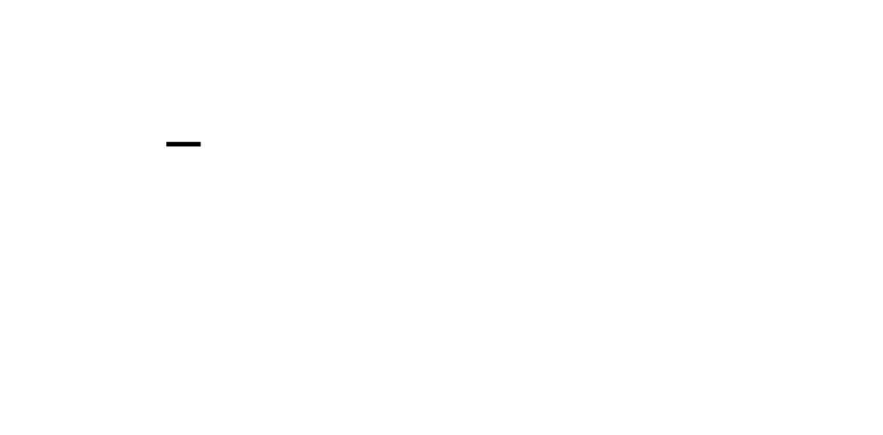

```python
class TransformerEmbedding(nn.Module):
    """
    Complete embedding layer combining token embeddings and positional encodings.
    Pipeline:
        1. Token indices -> Token embeddings (with optional scaling)
        2. Add positional encoding
        3. Apply dropout
    Shape transformation:
        Input:  [batch, seq_len] (integer token indices)
        Output: [batch, seq_len, d_model]
    """
    def __init__(
        self,
        vocab_size: int,
        d_model: int,
        max_seq_len: int = 5000,
        dropout: float = 0.1,
        scale_embedding: bool = True
    ):
        super().__init__()
        # Token embedding layer
        self.token_embedding = TokenEmbedding(
            vocab_size, d_model, scale_embedding
        )
        # Positional encoding layer
        self.positional_encoding = PositionalEncoding(
            d_model, max_seq_len, dropout
        )
        self.vocab_size = vocab_size
        self.d_model = d_model
        self.max_seq_len = max_seq_len
    def forward(self, x: torch.Tensor) -> torch.Tensor:
        """
        Convert token indices to position-aware embeddings.
        Args:
            x: Token indices [batch, seq_len]
        Returns:
            Position-aware embeddings [batch, seq_len, d_model]
        """
        # Token embedding: [B, S] -> [B, S, D]
        tok_emb = self.token_embedding(x)
        # Add positional encoding (with internal dropout)
        return self.positional_encoding(tok_emb)
    def extra_repr(self) -> str:
        return (f"vocab_size={self.vocab_size}, d_model={self.d_model}, "
                f"max_seq_len={self.max_seq_len}")
```


### 3.4 Parameter vs Buffer Distinction
| Attribute | Parameter | Buffer |
|-----------|-----------|--------|
| Updated by optimizer | Yes | No |
| Saved with model | Yes | Yes |
| Moved to GPU with `.to()` | Yes | Yes |
| Has gradients | Yes | No |
| Use case | Learnable weights | Fixed state (PE, running stats) |
**Positional encoding MUST be a buffer**:
```python
# CORRECT: PE is not updated during training
self.register_buffer('pe', pe)
# WRONG: PE would be corrupted by optimizer
self.pe = nn.Parameter(pe)  # NEVER do this!
```
---
## 4. Interface Contracts
### 4.1 PositionWiseFFN.forward()
```python
def forward(self, x: torch.Tensor) -> torch.Tensor:
    """
    Pre-conditions:
        - x.dim() == 3
        - x.size(-1) == self.d_model
        - x is finite (no NaN or Inf)
    Post-conditions:
        - output.shape == x.shape
        - output differs from purely linear transformation (non-linearity applied)
        - If self.training == False, dropout is not applied
    Returns:
        output: [batch, seq_len, d_model]
    Side effects:
        - Dropout may zero some elements (only during training)
    Invariants:
        - All operations are differentiable
        - No in-place modifications of input
    """
```
### 4.2 TokenEmbedding.forward()
```python
def forward(self, x: torch.Tensor) -> torch.Tensor:
    """
    Pre-conditions:
        - x.dim() == 2
        - x.dtype == torch.long or torch.int64
        - All values in x are in range [0, vocab_size - 1]
    Post-conditions:
        - output.shape == [x.size(0), x.size(1), d_model]
        - output requires grad (learnable embeddings)
        - If scale_by_sqrt, output variance is scaled by d_model
    Returns:
        output: [batch, seq_len, d_model]
    Raises:
        RuntimeError: If any token index >= vocab_size (index out of bounds)
    Side effects:
        - None
    Invariants:
        - Same token index always produces same embedding (before training)
        - Embeddings are learnable (gradients flow)
    """
```
### 4.3 PositionalEncoding.forward()
```python
def forward(self, x: torch.Tensor) -> torch.Tensor:
    """
    Pre-conditions:
        - x.dim() == 3
        - x.size(-1) == self.d_model
        - x.size(1) <= self.max_seq_len
    Post-conditions:
        - output.shape == x.shape
        - output = x + PE[:, :x.size(1), :]
        - PE values are unchanged (fixed buffer)
        - If self.training == False, dropout is not applied
    Returns:
        output: [batch, seq_len, d_model]
    Raises:
        IndexError: If x.size(1) > max_seq_len (implicitly)
    Side effects:
        - Dropout may zero some elements (only during training)
    Invariants:
        - PE is not modified by optimizer (buffer, not parameter)
        - Same position always gets same encoding
    """
```
### 4.4 TransformerEmbedding.forward()
```python
def forward(self, x: torch.Tensor) -> torch.Tensor:
    """
    Pre-conditions:
        - x.dim() == 2
        - x.dtype == torch.long or torch.int64
        - All values in x are in range [0, vocab_size - 1]
        - x.size(1) <= max_seq_len
    Post-conditions:
        - output.shape == [x.size(0), x.size(1), d_model]
        - output = PE + scaled(token_embedding(x))
        - Dropout applied (if training)
    Returns:
        output: [batch, seq_len, d_model]
    Composition:
        1. token_embedding(x) -> [B, S, D]
        2. + positional_encoding -> [B, S, D]
        3. dropout -> [B, S, D]
    """
```
---
## 5. Algorithm Specification
### 5.1 Position-Wise FFN Algorithm
**Input**: x `[batch, seq_len, d_model]`  
**Output**: output `[batch, seq_len, d_model]`
```
ALGORITHM: PositionWiseFFN
INPUT: x [B, S, D]
STEP 1: First linear projection
    hidden = W1(x)  # Linear transformation
    # x: [B, S, D], W1.weight: [F, D]
    # hidden: [B, S, F] where F = 4 * D (default)
    INVARIANT: hidden[i, j, :] = x[i, j, :] @ W1.weight.T + W1.bias
STEP 2: Apply non-linear activation
    IF activation == 'relu':
        hidden = max(0, hidden)  # Element-wise
    ELIF activation == 'gelu':
        hidden = GELU(hidden)
        # GELU(x) = x * Φ(x) where Φ is standard normal CDF
        # Approximation: 0.5 * x * (1 + tanh(sqrt(2/π) * (x + 0.044715 * x³)))
    INVARIANT: hidden is non-linear (cannot be expressed as single matrix)
    INVARIANT: Gradient exists everywhere (GELU) or for positive values (ReLU)
STEP 3: Apply dropout
    hidden = dropout(hidden)
    # During training: zero random elements with probability p
    # During eval: identity (no modification)
    INVARIANT: If self.training == False, hidden unchanged
STEP 4: Second linear projection
    output = W2(hidden)
    # hidden: [B, S, F], W2.weight: [D, F]
    # output: [B, S, D]
    INVARIANT: output[i, j, :] = hidden[i, j, :] @ W2.weight.T + W2.bias
RETURN output
TOTAL PARAMETERS:
    W1: D * F + F = D * 4D + 4D = 4D² + 4D
    W2: F * D + D = 4D * D + D = 4D² + D
    Total: 8D² + 5D
    For D=512: 8*262144 + 2560 = 2,099,712 + 2,560 = 2,102,272 parameters
```


### 5.2 Sinusoidal Positional Encoding Algorithm
**Input**: max_seq_len (int), d_model (int)  
**Output**: PE `[1, max_seq_len, d_model]`
```
ALGORITHM: ComputePositionalEncoding
INPUT: max_seq_len, d_model
STEP 1: Create position indices
    position = arange(0, max_seq_len)
    # Shape: [max_seq_len]
    # Values: [0, 1, 2, ..., max_seq_len-1]
    position = position.unsqueeze(1)
    # Shape: [max_seq_len, 1]
    # Needed for broadcasting with div_term
STEP 2: Compute divisor term in log space
    # We need: 10000^(-2i/d_model) for i = 0, 1, 2, ..., d_model//2 - 1
    dimension_indices = arange(0, d_model, 2)
    # Shape: [d_model // 2]
    # Values: [0, 2, 4, ..., d_model-2] (or d_model-1 if odd)
    log_div_term = dimension_indices * (-log(10000) / d_model)
    # Shape: [d_model // 2]
    div_term = exp(log_div_term)
    # div_term[i] = 10000^(-2i/d_model)
    # Shape: [d_model // 2]
    NUMERICAL STABILITY NOTE:
        Direct computation 10000^(-2i/d_model) could underflow for large i.
        Log-space computation: exp(-2i * log(10000) / d_model) is stable.
STEP 3: Initialize encoding matrix
    pe = zeros(max_seq_len, d_model)
    # Shape: [max_seq_len, d_model]
STEP 4: Apply sine to even indices
    # position: [max_seq_len, 1]
    # div_term: [d_model // 2]
    # position * div_term: [max_seq_len, d_model // 2] (broadcast)
    pe[:, 0::2] = sin(position * div_term)
    # pe[:, 0] = sin(position * div_term[0])
    # pe[:, 2] = sin(position * div_term[1])
    # ...
    # pe[:, 2i] = sin(position * div_term[i])
STEP 5: Apply cosine to odd indices
    pe[:, 1::2] = cos(position * div_term)
    # pe[:, 1] = cos(position * div_term[0])
    # pe[:, 3] = cos(position * div_term[1])
    # ...
    # pe[:, 2i+1] = cos(position * div_term[i])
STEP 6: Add batch dimension
    pe = pe.unsqueeze(0)
    # Shape: [1, max_seq_len, d_model]
    INVARIANT: pe[0, pos, 2i] = sin(pos / 10000^(2i/d_model))
    INVARIANT: pe[0, pos, 2i+1] = cos(pos / 10000^(2i/d_model))
STEP 7: Register as buffer
    self.register_buffer('pe', pe)
    CRITICAL: Not nn.Parameter! PE must not be updated by optimizer.
RETURN pe
UNIQUENESS GUARANTEE:
    For any two positions pos1 ≠ pos2:
    ||pe[pos1] - pe[pos2]|| > 0
    (Each position has a unique encoding vector)
```


### 5.3 Handling Odd d_model
When d_model is odd, the slicing handles it gracefully:
```python
# For d_model = 513:
# pe[:, 0::2] has indices [0, 2, 4, ..., 512] -> 257 elements
# pe[:, 1::2] has indices [1, 3, 5, ..., 511] -> 256 elements
# div_term has shape [257] (d_model // 2 + 1 for odd d_model)
# Actually: arange(0, 513, 2) = [0, 2, 4, ..., 512] -> 257 elements
# Assignment works because:
# - pe[:, 0::2] expects 257 values, gets 257 from sin(position * div_term)
# - pe[:, 1::2] expects 256 values, gets 257 but only uses first 256
# Wait, this is a subtle bug! Let me recalculate...
# Actually for odd d_model, the standard approach is:
# div_term = arange(0, d_model, 2) -> 257 elements for d_model=513
# pe[:, 0::2] = sin(...) -> 257 elements, assigns to indices 0,2,4,...,512
# pe[:, 1::2] = cos(...) -> 257 elements, but only 256 slots (1,3,5,...,511)
# This works because extra element is ignored!
def _compute_pe_robust(self, max_seq_len):
    """Robust PE computation handling odd d_model."""
    position = torch.arange(0, max_seq_len, dtype=torch.float).unsqueeze(1)
    # Compute for all even-indexed dimensions
    div_term = torch.exp(
        torch.arange(0, self.d_model, 2).float() *
        (-math.log(10000.0) / self.d_model)
    )
    pe = torch.zeros(max_seq_len, self.d_model)
    # Sine for even indices
    pe[:, 0::2] = torch.sin(position * div_term)
    # Cosine for odd indices (handles size mismatch gracefully)
    # If d_model is odd, we have one more sine than cosine
    cos_term = torch.cos(position * div_term)
    pe[:, 1::2] = cos_term[:, :pe[:, 1::2].size(1)]
    return pe.unsqueeze(0)
```
---
## 6. Error Handling Matrix
| Error | Detected By | Recovery | User-Visible? |
|-------|-------------|----------|---------------|
| **Token index >= vocab_size** | `nn.Embedding` raises RuntimeError | Propagate with clear message: "Token index X exceeds vocab_size Y" | Yes - data error |
| **Token index < 0** | `nn.Embedding` raises RuntimeError | Propagate with message | Yes - data error |
| **FFN input wrong dimension** | Shape mismatch in linear layer | RuntimeError with expected/actual shapes | Yes - debug message |
| **seq_len > max_seq_len** | IndexError in PE slicing | Check in forward, raise ValueError with suggestion to increase max_seq_len | Yes - config error |
| **PE registered as Parameter** | Optimizer modifies PE | Validation test: assert not any(pe in params) | Yes - implementation bug |
| **Dropout not disabled in eval** | Stochastic outputs during inference | Call `model.eval()` before inference | Yes - usage error |
| **FFN without activation** | Output equals linear transformation | Test: assert not allclose(ffn_out, linear_out) | Yes - implementation bug |
| **NaN in input** | Propagates through | Check inputs in debug mode | Yes - data error |
| **d_model <= 0** | Assertion in config | Raise AssertionError | Yes - config error |
| **d_ff <= 0** | Assertion in config | Raise AssertionError | Yes - config error |
| **dropout >= 1.0** | nn.Dropout validation | Caught at initialization | Yes - config error |
| **Non-integer token input** | nn.Embedding type error | RuntimeError with type info | Yes - data error |
### Error Recovery Implementation
```python
class EmbeddingError(Exception):
    """Base exception for embedding layer errors."""
    pass
class TokenIndexError(EmbeddingError):
    """Raised when token index is out of bounds."""
    def __init__(self, index: int, vocab_size: int):
        self.index = index
        self.vocab_size = vocab_size
        super().__init__(
            f"Token index {index} is out of bounds for vocabulary size {vocab_size}. "
            f"Valid indices are [0, {vocab_size - 1}]."
        )
class SequenceLengthError(EmbeddingError):
    """Raised when sequence length exceeds max_seq_len."""
    def __init__(self, seq_len: int, max_seq_len: int):
        self.seq_len = seq_len
        self.max_seq_len = max_seq_len
        super().__init__(
            f"Sequence length {seq_len} exceeds maximum {max_seq_len}. "
            f"Increase max_seq_len in PositionalEncoding initialization."
        )
def validate_token_indices(x: torch.Tensor, vocab_size: int) -> None:
    """
    Validate token indices are within vocabulary bounds.
    Raises:
        TokenIndexError: If any index is out of bounds
        TypeError: If input is not integer type
    """
    if x.dtype not in [torch.long, torch.int32, torch.int64]:
        raise TypeError(
            f"Token indices must be integer type, got {x.dtype}. "
            f"Use torch.long or torch.int64."
        )
    if x.max() >= vocab_size:
        raise TokenIndexError(x.max().item(), vocab_size)
    if x.min() < 0:
        raise TokenIndexError(x.min().item(), vocab_size)
```
---
## 7. Implementation Sequence with Checkpoints
### Phase 1: Implement Position-Wise FFN (1 hour)
**Files to create**: `transformer/layers/ffn.py`
**Tasks**:
1. Define `FFNConfig` dataclass with validation
2. Implement `PositionWiseFFN.__init__()`:
   - Create `W1` and `W2` as `nn.Linear` layers
   - Set default `d_ff = 4 * d_model`
   - Select activation function (ReLU or GELU)
   - Add dropout layer
3. Implement `_init_weights()` with Xavier uniform for weights, zeros for biases
4. Implement `forward()`:
   - Apply first linear layer
   - Apply activation function
   - Apply dropout
   - Apply second linear layer
**Checkpoint**: After this phase, you should be able to:
```python
ffn = PositionWiseFFN(d_model=512, d_ff=2048, dropout=0.1, activation='gelu')
x = torch.randn(4, 16, 512)
output = ffn(x)
assert output.shape == (4, 16, 512), f"Wrong shape: {output.shape}"
print(f"✓ FFN output shape correct: {output.shape}")
# Verify non-linearity
ffn.eval()
linear_only = ffn.W2(ffn.W1(x))
assert not torch.allclose(output, linear_only, atol=1e-5), \
    "FFN output matches linear transformation (non-linearity not applied)"
print("✓ FFN applies non-linearity")
```
Run: `pytest tests/test_ffn.py::test_ffn_forward -v`
---
### Phase 2: Implement Token Embedding (0.5-1 hour)
**Files to create**: `transformer/layers/embedding.py`
**Tasks**:
1. Define `TokenEmbeddingConfig` dataclass
2. Implement `TokenEmbedding.__init__()`:
   - Create `nn.Embedding(vocab_size, d_model)`
   - Store `scale_by_sqrt` flag
3. Implement `_init_weights()` with normal distribution (mean=0, std=0.02)
4. Implement `forward()`:
   - Embedding lookup
   - Optional scaling by `sqrt(d_model)`
**Checkpoint**: After this phase, you should be able to:
```python
emb = TokenEmbedding(vocab_size=1000, d_model=512, scale_by_sqrt=True)
tokens = torch.randint(0, 1000, (4, 16))
output = emb(tokens)
assert output.shape == (4, 16, 512), f"Wrong shape: {output.shape}"
print(f"✓ Token embedding shape correct: {output.shape}")
# Test without scaling
emb_no_scale = TokenEmbedding(vocab_size=1000, d_model=512, scale_by_sqrt=False)
output_no_scale = emb_no_scale(tokens)
ratio = output.abs().mean() / output_no_scale.abs().mean()
print(f"✓ Scaling ratio (should be ~√512≈22.6): {ratio:.1f}")
```
Run: `pytest tests/test_embedding.py::test_token_embedding -v`
---
### Phase 3: Implement Sinusoidal Positional Encoding (1.5-2 hours)
**Files to create**: `transformer/layers/positional_encoding.py`
**Tasks**:
1. Define `PositionalEncodingConfig` dataclass
2. Implement `_compute_pe()`:
   - Create position indices `[0, 1, ..., max_seq_len-1]`
   - Compute divisor term in log space
   - Apply sine to even indices `0::2`
   - Apply cosine to odd indices `1::2`
   - Add batch dimension
3. Implement `__init__()`:
   - Call `_compute_pe()`
   - **CRITICAL**: Use `register_buffer('pe', pe)`, NOT `nn.Parameter`
   - Add dropout layer
4. Implement `forward()`:
   - Slice PE to match input sequence length
   - Add PE to input (broadcast over batch)
   - Apply dropout
**Checkpoint**: After this phase, you should be able to:
```python
pe = PositionalEncoding(d_model=512, max_seq_len=100, dropout=0.0)
x = torch.randn(4, 20, 512)
output = pe(x)
assert output.shape == (4, 20, 512), f"Wrong shape: {output.shape}"
print(f"✓ PE output shape correct: {output.shape}")
# Verify PE is registered as buffer
assert 'pe' in dict(pe.named_buffers()), "PE not in buffers!"
assert 'pe' not in dict(pe.named_parameters()), "PE should not be a parameter!"
print("✓ PE is registered as buffer, not parameter")
# Verify uniqueness
encodings = pe.pe[0, :20, :]  # [20, 512]
for i in range(20):
    for j in range(i + 1, 20):
        dist = torch.norm(encodings[i] - encodings[j])
        assert dist > 1e-5, f"Positions {i} and {j} have identical encodings"
print("✓ All position encodings are unique")
```
Run: `pytest tests/test_positional_encoding.py::test_pe_uniqueness -v`

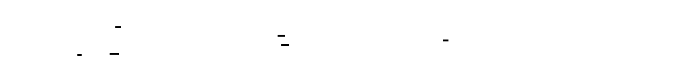

---
### Phase 4: Verify Buffer vs Parameter Distinction (0.5 hour)
**Files to modify**: Tests in `tests/test_positional_encoding.py`
**Tasks**:
1. Add test that PE is in `named_buffers()`
2. Add test that PE is NOT in `named_parameters()`
3. Add test that PE does not receive gradients after backward pass
4. Add test that PE is saved/loaded with model state dict
**Checkpoint**: After this phase, verify:
```python
pe = PositionalEncoding(d_model=512, max_seq_len=100)
# Test buffer membership
buffer_names = [name for name, _ in pe.named_buffers()]
param_names = [name for name, _ in pe.named_parameters()]
assert 'pe' in buffer_names, "PE not in buffers"
assert 'pe' not in param_names, "PE should not be in parameters"
print("✓ PE is buffer, not parameter")
# Test no gradient
x = torch.randn(1, 10, 512, requires_grad=True)
output = pe(x)
output.sum().backward()
assert pe.pe.grad is None, "PE should not have gradients!"
print("✓ PE does not receive gradients")
# Test save/load
state = pe.state_dict()
assert 'pe' in state, "PE not in state dict"
pe2 = PositionalEncoding(d_model=512, max_seq_len=100)
pe2.load_state_dict(state)
assert torch.allclose(pe.pe, pe2.pe), "PE not preserved in save/load"
print("✓ PE preserved in save/load")
```
Run: `pytest tests/test_positional_encoding.py::test_pe_buffer -v`
---
### Phase 5: Compose Transformer Embedding (0.5-1 hour)
**Files to create**: `transformer/layers/transformer_embedding.py`
**Tasks**:
1. Implement `TransformerEmbedding.__init__()`:
   - Create `TokenEmbedding` instance
   - Create `PositionalEncoding` instance
2. Implement `forward()`:
   - Get token embeddings
   - Pass through positional encoding (adds PE + dropout)
**Checkpoint**: After this phase, you should be able to:
```python
emb = TransformerEmbedding(
    vocab_size=1000,
    d_model=512,
    max_seq_len=100,
    dropout=0.1,
    scale_embedding=True
)
tokens = torch.randint(0, 1000, (4, 16))
output = emb(tokens)
assert output.shape == (4, 16, 512), f"Wrong shape: {output.shape}"
print(f"✓ Transformer embedding shape correct: {output.shape}")
# Verify PE was added
tok_only = emb.token_embedding(tokens)
assert not torch.allclose(output, tok_only, atol=1e-5), \
    "Positional encoding not applied"
print("✓ Positional encoding is applied")
```
Run: `pytest tests/test_transformer_embedding.py::test_combined_embedding -v`
---
### Phase 6: Verification Tests (1 hour)
**Files to modify**: All test files
**Tasks**:
1. Add uniqueness test for all positional encodings
2. Add non-linearity test for FFN
3. Add numerical stability test for PE computation
4. Add gradient flow test through all components
5. Add performance benchmark for embedding forward pass
**Checkpoint**: Run full test suite:
```bash
pytest tests/ -v
```
All tests should pass:
- `test_ffn_forward`
- `test_ffn_nonlinearity`
- `test_token_embedding`
- `test_embedding_scaling`
- `test_pe_uniqueness`
- `test_pe_buffer`
- `test_pe_numerical_stability`
- `test_combined_embedding`
- `test_gradient_flow`

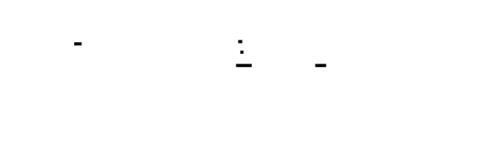

---
## 8. Test Specification
### 8.1 Test: FFN Forward Pass
```python
def test_ffn_forward():
    """Verify FFN produces correct output shape."""
    ffn = PositionWiseFFN(d_model=512, d_ff=2048, dropout=0.0)
    ffn.eval()
    x = torch.randn(4, 16, 512)
    output = ffn(x)
    # Shape check
    assert output.shape == (4, 16, 512), f"Expected (4, 16, 512), got {output.shape}"
    # No NaN or Inf
    assert not torch.isnan(output).any(), "NaN in FFN output"
    assert not torch.isinf(output).any(), "Inf in FFN output"
```
### 8.2 Test: FFN Non-Linearity
```python
def test_ffn_nonlinearity():
    """Verify FFN applies non-linearity (output != linear)."""
    ffn = PositionWiseFFN(d_model=512, d_ff=2048, dropout=0.0, activation='gelu')
    ffn.eval()
    x = torch.randn(4, 16, 512)
    # FFN output
    ffn_output = ffn(x)
    # Purely linear output (what it would be without activation)
    with torch.no_grad():
        linear_output = ffn.W2(ffn.W1(x))
    # They should differ
    assert not torch.allclose(ffn_output, linear_output, atol=1e-5), \
        "FFN output matches linear transformation (non-linearity not applied)"
```
### 8.3 Test: Token Embedding Shape
```python
def test_token_embedding_shape():
    """Verify token embedding produces correct output shape."""
    emb = TokenEmbedding(vocab_size=1000, d_model=512, scale_by_sqrt=True)
    tokens = torch.randint(0, 1000, (4, 16))
    output = emb(tokens)
    assert output.shape == (4, 16, 512), f"Expected (4, 16, 512), got {output.shape}"
```
### 8.4 Test: Token Embedding Scaling
```python
def test_embedding_scaling():
    """Verify optional sqrt(d_model) scaling."""
    vocab_size, d_model = 1000, 512
    # With scaling
    emb_scaled = TokenEmbedding(vocab_size, d_model, scale_by_sqrt=True)
    # Without scaling
    emb_unscaled = TokenEmbedding(vocab_size, d_model, scale_by_sqrt=False)
    # Use same weights for fair comparison
    emb_unscaled.embedding.weight.data = emb_scaled.embedding.weight.data.clone()
    tokens = torch.randint(0, vocab_size, (2, 8))
    out_scaled = emb_scaled(tokens)
    out_unscaled = emb_unscaled(tokens)
    # Ratio should be approximately sqrt(d_model)
    ratio = out_scaled.abs().mean() / out_unscaled.abs().mean()
    expected_ratio = math.sqrt(d_model)
    assert torch.isclose(ratio, torch.tensor(expected_ratio), rtol=0.01), \
        f"Scaling ratio {ratio:.2f} != expected {expected_ratio:.2f}"
```
### 8.5 Test: Positional Encoding Uniqueness
```python
def test_pe_uniqueness():
    """Verify each position has a unique encoding."""
    pe = PositionalEncoding(d_model=512, max_seq_len=100, dropout=0.0)
    # Get encodings for positions 0-99
    encodings = pe.pe[0, :100, :]  # [100, 512]
    # Check no two positions have the same encoding
    for i in range(100):
        for j in range(i + 1, 100):
            dist = torch.norm(encodings[i] - encodings[j])
            assert dist > 1e-5, f"Positions {i} and {j} have identical encodings"
```
### 8.6 Test: PE Buffer Registration
```python
def test_pe_buffer_registration():
    """Verify PE is registered as buffer, not parameter."""
    pe = PositionalEncoding(d_model=512, max_seq_len=100)
    # Check buffer membership
    buffer_names = [name for name, _ in pe.named_buffers()]
    param_names = [name for name, _ in pe.named_parameters()]
    assert 'pe' in buffer_names, "PE not in named_buffers"
    assert 'pe' not in param_names, "PE should not be in named_parameters"
    # Verify no gradient
    x = torch.randn(1, 10, 512, requires_grad=True)
    output = pe(x)
    output.sum().backward()
    assert pe.pe.grad is None, "PE should not have gradients"
```
### 8.7 Test: PE Numerical Stability
```python
def test_pe_numerical_stability():
    """Verify PE computation is numerically stable."""
    # Test with large d_model to check for underflow
    pe = PositionalEncoding(d_model=1024, max_seq_len=5000)
    encodings = pe.pe[0, :, :]  # [5000, 1024]
    # No NaN or Inf
    assert not torch.isnan(encodings).any(), "NaN in positional encoding"
    assert not torch.isinf(encodings).any(), "Inf in positional encoding"
    # Values should be in reasonable range (sin/cos are in [-1, 1])
    assert encodings.abs().max() <= 1.0 + 1e-6, "PE values exceed sin/cos range"
```
### 8.8 Test: PE Even/Odd Indexing
```python
def test_pe_even_odd_indexing():
    """Verify sine applied to even indices, cosine to odd."""
    pe = PositionalEncoding(d_model=8, max_seq_len=10, dropout=0.0)
    # For position 1:
    # dim 0: sin(1 / 10000^0) = sin(1)
    # dim 1: cos(1 / 10000^0) = cos(1)
    # dim 2: sin(1 / 10000^(2/8)) = sin(1 / 10000^0.25)
    # dim 3: cos(1 / 10000^(2/8))
    pos_1 = pe.pe[0, 1, :]  # [8]
    # Verify using manual calculation
    div_term_0 = 1.0 / (10000 ** (0 / 8))
    div_term_2 = 1.0 / (10000 ** (2 / 8))
    expected = torch.tensor([
        math.sin(1 * div_term_0),
        math.cos(1 * div_term_0),
        math.sin(1 * div_term_2),
        math.cos(1 * div_term_2),
        math.sin(1 * (10000 ** (-4/8))),
        math.cos(1 * (10000 ** (-4/8))),
        math.sin(1 * (10000 ** (-6/8))),
        math.cos(1 * (10000 ** (-6/8))),
    ])
    assert torch.allclose(pos_1, expected, atol=1e-5), \
        f"PE calculation mismatch:\n{pos_1}\nvs expected:\n{expected}"
```
### 8.9 Test: Combined Embedding
```python
def test_combined_embedding():
    """Verify TransformerEmbedding composes token and positional correctly."""
    emb = TransformerEmbedding(
        vocab_size=1000,
        d_model=512,
        max_seq_len=100,
        dropout=0.0,
        scale_embedding=True
    )
    tokens = torch.randint(0, 1000, (4, 16))
    output = emb(tokens)
    # Shape check
    assert output.shape == (4, 16, 512)
    # Verify PE was added
    tok_only = emb.token_embedding(tokens)
    pe_only = emb.positional_encoding.pe[:, :16, :]
    expected = tok_only + pe_only
    assert torch.allclose(output, expected, atol=1e-5), \
        "Combined embedding != token + positional"
```
### 8.10 Test: Gradient Flow
```python
def test_gradient_flow():
    """Verify gradients flow through all components."""
    emb = TransformerEmbedding(
        vocab_size=100,
        d_model=64,
        max_seq_len=50,
        dropout=0.0
    )
    ffn = PositionWiseFFN(d_model=64, d_ff=256, dropout=0.0)
    tokens = torch.randint(0, 100, (2, 10))
    # Forward pass
    x = emb(tokens)
    x = ffn(x)
    # Backward pass
    loss = x.sum()
    loss.backward()
    # Check embedding gradients
    assert emb.token_embedding.embedding.weight.grad is not None
    assert not torch.isnan(emb.token_embedding.embedding.weight.grad).any()
    # Check FFN gradients
    assert ffn.W1.weight.grad is not None
    assert ffn.W2.weight.grad is not None
    assert not torch.isnan(ffn.W1.weight.grad).any()
    # PE should NOT have gradients
    assert emb.positional_encoding.pe.grad is None
```


---
## 9. Performance Targets
| Operation | Target | Measurement Method |
|-----------|--------|-------------------|
| FFN forward (batch=32, seq=128, d_model=512) | < 3ms | `time.perf_counter()` around forward |
| Token embedding (batch=32, seq=128, vocab=30k) | < 2ms | Time embedding lookup |
| PE addition (batch=32, seq=128) | < 0.5ms | Time addition operation |
| Combined embedding forward | < 5ms | Time complete embedding pipeline |
| PE uniqueness verification | All unique | Pairwise distance check |
| FFN non-linearity | Output ≠ linear | Compare with linear transformation |
| Memory for PE (d_model=512, max_seq=5000) | ~10 MB | `pe.element_size() * pe.numel()` |
### Benchmarking Code
```python
def benchmark_embedding():
    """Benchmark embedding layer performance."""
    import time
    device = 'cuda' if torch.cuda.is_available() else 'cpu'
    batch, seq, d_model, vocab = 32, 128, 512, 30000
    emb = TransformerEmbedding(
        vocab_size=vocab,
        d_model=d_model,
        max_seq_len=5000,
        dropout=0.1
    ).to(device)
    emb.eval()
    tokens = torch.randint(0, vocab, (batch, seq), device=device)
    # Warmup
    for _ in range(10):
        _ = emb(tokens)
    # Timed runs
    if device == 'cuda':
        torch.cuda.synchronize()
    start = time.perf_counter()
    for _ in range(100):
        _ = emb(tokens)
    if device == 'cuda':
        torch.cuda.synchronize()
    end = time.perf_counter()
    avg_time_ms = (end - start) / 100 * 1000
    print(f"Average embedding forward: {avg_time_ms:.2f}ms")
    assert avg_time_ms < 5.0, f"Too slow: {avg_time_ms:.2f}ms > 5ms target"
    return avg_time_ms
def benchmark_ffn():
    """Benchmark FFN performance."""
    import time
    device = 'cuda' if torch.cuda.is_available() else 'cpu'
    batch, seq, d_model = 32, 128, 512
    ffn = PositionWiseFFN(d_model, d_ff=2048, dropout=0.1).to(device)
    ffn.eval()
    x = torch.randn(batch, seq, d_model, device=device)
    # Warmup
    for _ in range(10):
        _ = ffn(x)
    # Timed runs
    if device == 'cuda':
        torch.cuda.synchronize()
    start = time.perf_counter()
    for _ in range(100):
        _ = ffn(x)
    if device == 'cuda':
        torch.cuda.synchronize()
    end = time.perf_counter()
    avg_time_ms = (end - start) / 100 * 1000
    print(f"Average FFN forward: {avg_time_ms:.2f}ms")
    assert avg_time_ms < 3.0, f"Too slow: {avg_time_ms:.2f}ms > 3ms target"
    return avg_time_ms
```
---
## 10. Numerical Analysis
### 10.1 Why 4× Expansion in FFN
The FFN expansion ratio controls model capacity:
| Expansion | Parameters (d_model=512) | Capacity | Speed |
|-----------|-------------------------|----------|-------|
| 2× | 1.05M | Lower | Faster |
| **4×** | **2.10M** | **Standard** | **Standard** |
| 8× | 4.19M | Higher | Slower |
**Mathematical justification**: The FFN accounts for ~2/3 of transformer parameters. With 4× expansion:
- `W1`: 512 × 2048 = 1,048,576 parameters
- `W2`: 2048 × 512 = 1,048,576 parameters
- Total: 2,097,152 parameters (plus biases)
For a 6-layer transformer: 6 × 2.1M = 12.6M parameters from FFN alone.
### 10.2 GELU vs ReLU Gradient Properties
**ReLU**: `gradient = 1 if x > 0 else 0`
- Zero gradient for negative inputs → "dying ReLU" problem
- Sharp non-linearity at x=0
**GELU**: `gradient = Φ(x) + x * φ(x)` where Φ is CDF, φ is PDF
- Non-zero gradient everywhere
- Smooth curvature, better for deep networks
```python
# GELU approximation (used in practice)
def gelu_approx(x):
    return 0.5 * x * (1 + torch.tanh(
        math.sqrt(2 / math.pi) * (x + 0.044715 * x ** 3)
    ))
# Gradient of GELU approximation
def gelu_grad(x):
    cdf = 0.5 * (1 + torch.tanh(...))
    pdf = ... # derivative of tanh approximation
    return cdf + x * pdf  # Always non-zero
```
### 10.3 Positional Encoding Frequency Analysis
The sinusoidal encoding creates a "frequency fingerprint" for each position:
```
Dimension 0-1:   Frequency = 10000^0 = 1        (period = 2π)
Dimension 2-3:   Frequency = 10000^0.25 ≈ 5.6   (period ≈ 1.1)
Dimension 4-5:   Frequency = 10000^0.5 = 100    (period = 0.063)
...
Dimension 510-511: Frequency = 10000^0.998 ≈ 9550 (period ≈ 0.00066)
```
**Interpretation**:
- Low dimensions encode fine-grained position (fast oscillation)
- High dimensions encode coarse position (slow oscillation)
- Combination creates unique "position code"
### 10.4 Memory Budget
For d_model=512, max_seq_len=5000, vocab_size=30000:
```
Token embedding:
  30000 × 512 × 4 bytes = 61.4 MB
Positional encoding (buffer):
  1 × 5000 × 512 × 4 bytes = 10.2 MB
FFN per layer:
  W1: 512 × 2048 × 4 bytes = 4.2 MB
  W2: 2048 × 512 × 4 bytes = 4.2 MB
  Total: 8.4 MB
Combined embedding + 1 FFN layer: ~80 MB
```
---
## 11. Gradient/Numerical Analysis (AI/ML Specific)
### 11.1 FFN Shape Trace with Gradient Flow
```
=== FORWARD PASS ===
Input x:            [B, S, D]     requires_grad=True
    ↓ W1 (linear)
Hidden pre-act:     [B, S, F]     requires_grad=True
    ↓ GELU activation
Hidden activated:   [B, S, F]     requires_grad=True
    ↓ dropout
Hidden dropped:     [B, S, F]     (some elements zero if training)
    ↓ W2 (linear)
Output:             [B, S, D]     requires_grad=True
=== BACKWARD PASS ===
∂L/∂output:         [B, S, D]
    ↓ through W2
∂L/∂hidden:         [B, S, F]
    ↓ through dropout
∂L/∂hidden_act:     [B, S, F]
    ↓ through GELU
∂L/∂hidden_pre:     [B, S, F]
    ↓ through W1
∂L/∂x:              [B, S, D]
=== GRADIENT MAGNITUDES ===
∂L/∂W1:             O(1/sqrt(D*F)) with Xavier init
∂L/∂W2:             O(1/sqrt(F*D)) with Xavier init
∂L/∂x:              O(1) relative to ∂L/∂output
```
### 11.2 Embedding Gradient Flow
```
=== FORWARD PASS ===
Token indices:      [B, S]        integer, no gradient
    ↓ nn.Embedding lookup
Raw embedding:      [B, S, D]     requires_grad=True
    ↓ * sqrt(D) (optional)
Scaled embedding:   [B, S, D]
    ↓ + PE (buffer, no gradient)
With PE:            [B, S, D]
    ↓ dropout
Output:             [B, S, D]
=== BACKWARD PASS ===
∂L/∂output:         [B, S, D]
    ↓ through dropout
∂L/∂with_PE:        [B, S, D]
    ↓ through addition (PE has no gradient)
∂L/∂scaled_emb:     [B, S, D]
    ↓ through scaling
∂L/∂raw_emb:        [B, S, D]
    ↓ through embedding lookup
∂L/∂embedding.weight: [V, D] (sparse update, only for tokens in batch)
=== CRITICAL INSIGHT ===
PE does NOT receive gradients because it's a buffer.
Only token embedding weights are updated during training.
```
### 11.3 Dropout Mode Switching
```python
# Training mode: dropout active
model.train()
x = embedding(tokens)
# ~10% of elements are zeroed
# Evaluation mode: dropout disabled
model.eval()
x = embedding(tokens)
# No elements zeroed, outputs are deterministic
# CRITICAL: Always call model.eval() before inference!
```
### 11.4 Numerical Stability Checklist
| Operation | Stability Concern | Mitigation |
|-----------|------------------|------------|
| PE divisor term | Underflow for large dimensions | Compute in log space |
| Token embedding init | Large initial values | Use std=0.02, not 1.0 |
| GELU for large inputs | tanh overflow | PyTorch's F.gelu handles this |
| FFN deep stacking | Gradient explosion | Xavier initialization |
| Embedding scaling | Changes gradient scale | Document choice clearly |

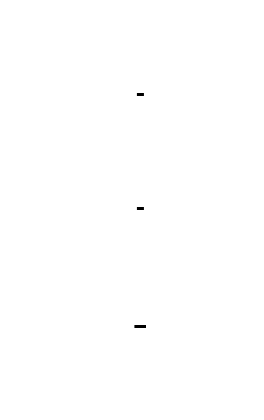

---
## 12. Common Pitfalls and Solutions
| Pitfall | Symptom | Solution |
|---------|---------|----------|
| **PE registered as nn.Parameter** | PE corrupted during training | Use `register_buffer('pe', pe)` |
| **Even/odd indexing error** | Wrong sine/cosine assignment | Use `pe[:, 0::2]` for sine, `pe[:, 1::2]` for cosine |
| **seq_len > max_seq_len** | IndexError | Check in forward, raise informative error |
| **Dropout in eval mode** | Non-deterministic inference | Call `model.eval()` before inference |
| **FFN without activation** | Model is just linear | Always apply GELU/ReLU between layers |
| **Wrong d_ff default** | Capacity mismatch | Default to `4 * d_model` |
| **Embedding scale debate** | Uncertainty | Document choice; follow paper with `scale_by_sqrt=True` |
| **GELU approximation vs exact** | Minor numerical difference | Use PyTorch's `F.gelu` for consistency |
| **PE not moved to GPU** | Device mismatch | `register_buffer` handles this automatically |
| **Forgetting dropout after FFN** | Overfitting | Add dropout after activation in FFN |
---
[[CRITERIA_JSON: {"module_id": "transformer-scratch-m3", "criteria": ["Implement two-layer position-wise FFN with configurable activation (ReLU or GELU): FFN(x) = W2 * activation(W1 * x + b1) + b2", "FFN inner dimension defaults to 4 * d_model with configurable d_ff parameter", "Apply dropout after the activation function in FFN (between W1 and W2 layers)", "Initialize FFN weights using Xavier uniform initialization with zero biases", "Token embedding layer maps vocabulary indices to d_model-dimensional vectors using nn.Embedding", "Implement optional sqrt(d_model) scaling for token embeddings with documented rationale from original paper", "Sinusoidal positional encoding computes PE(pos, 2i) = sin(pos/10000^(2i/d_model)) and PE(pos, 2i+1) = cos(pos/10000^(2i/d_model))", "Positional encoding is precomputed for max_seq_len positions and registered as buffer (not nn.Parameter)", "Compute divisor term in log space using torch.exp for numerical stability", "Apply sine to even dimensions (0::2) and cosine to odd dimensions (1::2) with correct indexing", "Combine token embeddings and positional encoding via addition, then apply dropout", "Dropout is applied after embedding+PE combination and after FFN activation, respecting model.eval() for inference", "Verify output shapes: embedding [batch, seq] -> [batch, seq, d_model], FFN [batch, seq, d_model] -> [batch, seq, d_model]", "Test that all positional encodings are unique (no two positions have identical vectors)", "Test that FFN applies non-linearity (output differs from purely linear transformation)", "Verify PE is in named_buffers() and NOT in named_parameters()", "Test that PE does not receive gradients after backward pass", "Implement FFNConfig, TokenEmbeddingConfig, and PositionalEncodingConfig dataclasses with validation", "Handle odd d_model gracefully in positional encoding computation", "Benchmark embedding forward pass to meet <5ms target for batch=32, seq=128"]}]
<!-- END_TDD_MOD -->


<!-- TDD_MOD_ID: transformer-scratch-m4 -->
# Technical Design Document: Encoder & Decoder Layers
**Module ID**: `transformer-scratch-m4`  
**Version**: 1.0  
**Primary Language**: Python (PyTorch)
---
## 1. Module Charter
This module composes the attention mechanisms, feed-forward networks, normalization layers, and residual connections into complete encoder and decoder layers—the fundamental building blocks of the Transformer architecture. Each encoder layer applies self-attention followed by a position-wise feed-forward network, with residual connections and layer normalization wrapping each sublayer. Each decoder layer adds cross-attention between self-attention and the FFN, allowing the decoder to query the encoder's representation of the source sequence. The module implements both Pre-LN (normalization before sublayer) and Post-LN (normalization after sublayer) variants, with Pre-LN being more training-stable for deep networks while Post-LN matches the original Transformer paper. N identical layers are stacked to form the encoder and decoder stacks, with the encoder output passed to every decoder layer's cross-attention. Gradient flow through all layers is verified to ensure no vanishing gradients or dead parameters.
**What this module DOES**:
- Implement LayerNorm with learned scale (gamma) and shift (beta) parameters
- Implement SublayerConnection supporting both Pre-LN and Post-LN variants with residual connections
- Implement EncoderLayer with self-attention + FFN wrapped in two sublayer connections
- Implement DecoderLayer with masked self-attention + cross-attention + FFN in three sublayer connections
- Implement Encoder stack composing N EncoderLayers with optional final normalization
- Implement Decoder stack composing N DecoderLayers with optional final normalization
- Wire complete EncoderDecoderTransformer connecting embeddings, encoder, decoder, and output projection
- Verify gradient flow to all parameters including deep layers
**What this module does NOT do**:
- Attention computation (modules m1, m2)
- Embedding and positional encoding (module m3)
- Training loop and loss computation (module m5)
- Inference generation (module m6)
**Upstream dependencies**:
- Multi-head attention from module m2
- Position-wise FFN from module m3
- Embeddings from module m3
**Downstream consumers**:
- Training loop (module m5)
- Inference generation (module m6)
**Invariants**:
1. Output shape of each layer equals input shape: `[batch, seq_len, d_model]`
2. Cross-attention K and V come from encoder output, Q comes from decoder
3. Causal mask is applied to decoder self-attention (no future peeking)
4. Pre-LN requires final normalization after last layer; Post-LN does not
5. All parameters receive non-zero gradients after backward pass
6. Residual connections provide identity path for gradient flow
7. Encoder output is passed to ALL decoder layers (not just the last one)
---
## 2. File Structure
Create files in this exact sequence:
```
transformer/
├── layers/
│   ├── __init__.py              # 1 - Package exports (update)
│   ├── ffn.py                   # (from m3 - already exists)
│   ├── embedding.py             # (from m3 - already exists)
│   ├── positional_encoding.py   # (from m3 - already exists)
│   ├── transformer_embedding.py # (from m3 - already exists)
│   ├── layer_norm.py            # 2 - Layer normalization
│   ├── sublayer.py              # 3 - SublayerConnection (Pre-LN/Post-LN)
│   ├── encoder_layer.py         # 4 - Single encoder layer
│   ├── decoder_layer.py         # 5 - Single decoder layer
│   ├── encoder.py               # 6 - Encoder stack (N layers)
│   └── decoder.py               # 7 - Decoder stack (N layers)
├── model/
│   ├── __init__.py              # 8 - Package exports
│   └── transformer.py           # 9 - Complete encoder-decoder transformer
└── tests/
    ├── __init__.py              # (already exists)
    ├── test_layer_norm.py       # 10 - LayerNorm tests
    ├── test_sublayer.py         # 11 - SublayerConnection tests
    ├── test_encoder_layer.py    # 12 - EncoderLayer tests
    ├── test_decoder_layer.py    # 13 - DecoderLayer tests
    ├── test_stacks.py           # 14 - Encoder/Decoder stack tests
    └── test_transformer.py      # 15 - Complete transformer tests
```
**Creation order rationale**: Build from primitives (LayerNorm) to composition (SublayerConnection) to layers (EncoderLayer, DecoderLayer) to stacks (Encoder, Decoder) to complete model (EncoderDecoderTransformer). Each layer depends only on previously created components.
---
## 3. Complete Data Model
### 3.1 Core Tensor Shapes
| Tensor | Symbol | Shape | Named Dimensions | Description |
|--------|--------|-------|------------------|-------------|
| Encoder input | X_enc | `[B, Se, D]` | batch, src_len, d_model | Source embeddings |
| Encoder output | O_enc | `[B, Se, D]` | batch, src_len, d_model | After N encoder layers |
| Decoder input | X_dec | `[B, Tg, D]` | batch, tgt_len, d_model | Target embeddings |
| Decoder output | O_dec | `[B, Tg, D]` | batch, tgt_len, d_model | After N decoder layers |
| LayerNorm mean | μ | `[B, S, 1]` | batch, seq, 1 | Per-position mean |
| LayerNorm var | σ² | `[B, S, 1]` | batch, seq, 1 | Per-position variance |
| LayerNorm output | X_norm | `[B, S, D]` | batch, seq, d_model | Normalized + scale/shift |
| Sublayer residual | R | `[B, S, D]` | batch, seq, d_model | Identity path |
| Logits | L | `[B, Tg, V]` | batch, tgt_len, vocab_size | After output projection |
**Dimension semantics**:
- `B` (batch): Independent sequences processed in parallel
- `Se` (src_len): Source sequence length
- `Tg` (tgt_len): Target sequence length
- `D` (d_model): Full model dimension (typically 512)
- `V` (vocab_size): Target vocabulary size
### 3.2 LayerNorm Internal State
| Field | Type | Shape | Purpose |
|-------|------|-------|---------|
| gamma | Parameter | `[D]` | Learned scale (initialized to 1) |
| beta | Parameter | `[D]` | Learned shift (initialized to 0) |
| eps | float | scalar | Numerical stability (1e-6) |
| normalized_shape | Tuple | `(D,)` | Shape of normalized dimensions |
### 3.3 SublayerConnection Internal State
| Field | Type | Purpose |
|-------|------|---------|
| norm | LayerNorm | Normalization layer |
| dropout | nn.Dropout | Dropout for sublayer output |
| pre_norm | bool | True for Pre-LN, False for Post-LN |
### 3.4 EncoderLayer Internal State
| Field | Type | Purpose |
|-------|------|---------|
| self_attn | MultiHeadAttention | Self-attention (Q=K=V from input) |
| ffn | PositionWiseFFN | Position-wise feed-forward network |
| sublayer1 | SublayerConnection | Wraps self-attention |
| sublayer2 | SublayerConnection | Wraps FFN |
| pre_norm | bool | Inherited normalization style |
### 3.5 DecoderLayer Internal State
| Field | Type | Purpose |
|-------|------|---------|
| self_attn | MultiHeadAttention | Masked self-attention (Q=K=V from decoder input) |
| cross_attn | MultiHeadAttention | Cross-attention (Q from decoder, K/V from encoder) |
| ffn | PositionWiseFFN | Position-wise feed-forward network |
| sublayer1 | SublayerConnection | Wraps masked self-attention |
| sublayer2 | SublayerConnection | Wraps cross-attention |
| sublayer3 | SublayerConnection | Wraps FFN |
| pre_norm | bool | Inherited normalization style |
### 3.6 Class Definitions
```python
from dataclasses import dataclass
from typing import Optional, Tuple, Literal
import torch
import torch.nn as nn
import torch.nn.functional as F
import math
@dataclass
class LayerNormConfig:
    """Configuration for layer normalization."""
    d_model: int           # Feature dimension to normalize
    eps: float = 1e-6      # Numerical stability constant
    def __post_init__(self):
        assert self.d_model > 0, "d_model must be positive"
        assert self.eps > 0, "eps must be positive"
class LayerNorm(nn.Module):
    """
    Layer normalization with learned scale (gamma) and shift (beta).
    Normalizes over the last dimension (feature dimension):
        LayerNorm(x) = gamma * (x - mean) / sqrt(var + eps) + beta
    Unlike batch normalization, layer normalization computes statistics
    per sample, making it independent of batch size and suitable for
    variable-length sequences.
    Shape transformation:
        Input:  [batch, seq_len, d_model]
        Output: [batch, seq_len, d_model] (same shape)
    The mean and variance are computed over the feature dimension (d_model),
    resulting in shape [batch, seq_len, 1] for each.
    """
    def __init__(self, d_model: int, eps: float = 1e-6):
        super().__init__()
        self.d_model = d_model
        self.eps = eps
        # Learned parameters: gamma (scale) and beta (shift)
        # Initialized to 1 and 0 respectively (identity transformation initially)
        self.gamma = nn.Parameter(torch.ones(d_model))
        self.beta = nn.Parameter(torch.zeros(d_model))
    def forward(self, x: torch.Tensor) -> torch.Tensor:
        """
        Apply layer normalization.
        Args:
            x: Input tensor [batch, seq_len, d_model]
        Returns:
            Normalized tensor [batch, seq_len, d_model]
        Invariants:
            - Output shape equals input shape
            - Output has zero mean and unit variance (before gamma/beta)
            - Differentiable (gradients flow through)
        """
        # Compute mean and variance over feature dimension (last dim)
        # keepdim=True preserves shape for broadcasting
        mean = x.mean(dim=-1, keepdim=True)  # [B, S, 1]
        var = x.var(dim=-1, keepdim=True, unbiased=False)  # [B, S, 1]
        # Normalize: (x - mean) / sqrt(var + eps)
        x_norm = (x - mean) / torch.sqrt(var + self.eps)
        # Apply learned scale and shift
        return self.gamma * x_norm + self.beta
    def extra_repr(self) -> str:
        return f"d_model={self.d_model}, eps={self.eps}"
```

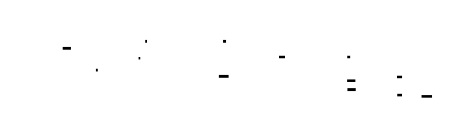

```python
@dataclass
class SublayerConfig:
    """Configuration for sublayer connection."""
    d_model: int
    dropout: float = 0.1
    pre_norm: bool = True  # True for Pre-LN, False for Post-LN
    def __post_init__(self):
        assert self.d_model > 0, "d_model must be positive"
        assert 0.0 <= self.dropout < 1.0, "dropout must be in [0, 1)"
class SublayerConnection(nn.Module):
    """
    A residual connection followed by (or preceded by) layer normalization.
    Supports two variants:
    Pre-LN (pre_norm=True):
        output = x + dropout(sublayer(norm(x)))
        - More stable for deep networks
        - Requires final norm after last layer
        - Used in GPT-2, GPT-3, LLaMA
    Post-LN (pre_norm=False):
        output = norm(x + dropout(sublayer(x)))
        - Matches original Transformer paper
        - Requires learning rate warmup
        - May achieve slightly better final performance
    The "sublayer" is a callable (function or module) that transforms
    the input. Examples: attention, FFN.
    Shape transformation:
        Input:  [batch, seq_len, d_model]
        Output: [batch, seq_len, d_model] (same shape)
    """
    def __init__(
        self, 
        d_model: int, 
        dropout: float = 0.1, 
        pre_norm: bool = True
    ):
        super().__init__()
        self.norm = LayerNorm(d_model)
        self.dropout = nn.Dropout(dropout)
        self.pre_norm = pre_norm
        self.d_model = d_model
    def forward(
        self, 
        x: torch.Tensor, 
        sublayer: callable
    ) -> torch.Tensor:
        """
        Apply residual connection around sublayer with normalization.
        Args:
            x: Input tensor [batch, seq_len, d_model]
            sublayer: Callable that transforms input (e.g., attention, FFN)
        Returns:
            Output tensor [batch, seq_len, d_model]
        Invariants:
            - Output shape equals input shape
            - Gradient has identity path through residual
            - Normalization is applied (either before or after sublayer)
        """
        if self.pre_norm:
            # Pre-LN: normalize, then sublayer, then add residual
            # This provides a "gradient highway" through the residual
            return x + self.dropout(sublayer(self.norm(x)))
        else:
            # Post-LN: sublayer, add residual, then normalize
            # Matches original Transformer paper
            return self.norm(x + self.dropout(sublayer(x)))
    def extra_repr(self) -> str:
        return f"d_model={self.d_model}, pre_norm={self.pre_norm}"
```


```python
@dataclass
class EncoderLayerConfig:
    """Configuration for encoder layer."""
    d_model: int
    num_heads: int
    d_ff: Optional[int] = None  # Default: 4 * d_model
    dropout: float = 0.1
    pre_norm: bool = True
    def __post_init__(self):
        assert self.d_model > 0, "d_model must be positive"
        assert self.num_heads > 0, "num_heads must be positive"
        assert self.d_model % self.num_heads == 0, \
            f"d_model ({self.d_model}) must be divisible by num_heads ({self.num_heads})"
        if self.d_ff is None:
            self.d_ff = 4 * self.d_model
        assert 0.0 <= self.dropout < 1.0, "dropout must be in [0, 1)"
class EncoderLayer(nn.Module):
    """
    Single encoder layer: self-attention + FFN with residual connections.
    Architecture (Pre-LN):
        x -> Norm -> Self-Attention -> Add -> Norm -> FFN -> Add -> output
    Architecture (Post-LN):
        x -> Self-Attention -> Add & Norm -> FFN -> Add & Norm -> output
    Self-attention allows each position to attend to all positions
    in the sequence (except masked padding positions).
    Shape transformation:
        Input:  [batch, src_len, d_model]
        Output: [batch, src_len, d_model] (same shape)
    """
    def __init__(
        self,
        d_model: int,
        num_heads: int,
        d_ff: Optional[int] = None,
        dropout: float = 0.1,
        pre_norm: bool = True
    ):
        super().__init__()
        # Import from previous modules (would be proper imports in real code)
        from transformer.attention.multi_head import MultiHeadAttention
        from transformer.layers.ffn import PositionWiseFFN
        # Multi-head self-attention
        self.self_attn = MultiHeadAttention(
            d_model=d_model,
            num_heads=num_heads,
            dropout=dropout
        )
        # Position-wise feed-forward network
        self.ffn = PositionWiseFFN(
            d_model=d_model,
            d_ff=d_ff,
            dropout=dropout
        )
        # Sublayer connections (residual + norm)
        self.sublayer1 = SublayerConnection(d_model, dropout, pre_norm)
        self.sublayer2 = SublayerConnection(d_model, dropout, pre_norm)
        self.pre_norm = pre_norm
        self.d_model = d_model
        self.num_heads = num_heads
    def forward(
        self, 
        x: torch.Tensor, 
        src_mask: Optional[torch.Tensor] = None
    ) -> torch.Tensor:
        """
        Forward pass through encoder layer.
        Args:
            x: Input tensor [batch, src_len, d_model]
            src_mask: Source padding mask [batch, 1, 1, src_len]
                      True = masked (padding position)
        Returns:
            Output tensor [batch, src_len, d_model]
        Invariants:
            - Output shape equals input shape
            - Self-attention Q, K, V all come from input x
            - Masked positions do not affect output
        """
        # Self-attention sublayer
        # Lambda captures src_mask for the attention call
        # Q = K = V = x (self-attention)
        x = self.sublayer1(
            x, 
            lambda x: self.self_attn(x, x, x, src_mask)[0]
        )
        # FFN sublayer
        x = self.sublayer2(x, self.ffn)
        return x
    def extra_repr(self) -> str:
        return (f"d_model={self.d_model}, num_heads={self.num_heads}, "
                f"pre_norm={self.pre_norm}")
```


```python
@dataclass
class DecoderLayerConfig:
    """Configuration for decoder layer."""
    d_model: int
    num_heads: int
    d_ff: Optional[int] = None
    dropout: float = 0.1
    pre_norm: bool = True
    def __post_init__(self):
        assert self.d_model > 0, "d_model must be positive"
        assert self.num_heads > 0, "num_heads must be positive"
        assert self.d_model % self.num_heads == 0, \
            f"d_model ({self.d_model}) must be divisible by num_heads ({self.num_heads})"
        if self.d_ff is None:
            self.d_ff = 4 * self.d_model
        assert 0.0 <= self.dropout < 1.0, "dropout must be in [0, 1)"
class DecoderLayer(nn.Module):
    """
    Single decoder layer: masked self-attention + cross-attention + FFN.
    Architecture (Pre-LN):
        x -> Norm -> Masked Self-Attn -> Add
          -> Norm -> Cross-Attn -> Add
          -> Norm -> FFN -> Add -> output
    Three sublayers:
    1. Masked self-attention: Decoder positions attend to earlier positions only
    2. Cross-attention: Decoder queries encoder representation
    3. FFN: Position-wise non-linear transformation
    CRITICAL: Cross-attention uses:
        - Q from decoder input
        - K and V from encoder output (NOT decoder)
    Shape transformation:
        Input:  [batch, tgt_len, d_model]
        Output: [batch, tgt_len, d_model] (same shape)
    """
    def __init__(
        self,
        d_model: int,
        num_heads: int,
        d_ff: Optional[int] = None,
        dropout: float = 0.1,
        pre_norm: bool = True
    ):
        super().__init__()
        from transformer.attention.multi_head import MultiHeadAttention
        from transformer.layers.ffn import PositionWiseFFN
        # Masked self-attention
        self.self_attn = MultiHeadAttention(
            d_model=d_model,
            num_heads=num_heads,
            dropout=dropout
        )
        # Cross-attention (encoder-decoder attention)
        self.cross_attn = MultiHeadAttention(
            d_model=d_model,
            num_heads=num_heads,
            dropout=dropout
        )
        # Feed-forward network
        self.ffn = PositionWiseFFN(
            d_model=d_model,
            d_ff=d_ff,
            dropout=dropout
        )
        # Three sublayer connections
        self.sublayer1 = SublayerConnection(d_model, dropout, pre_norm)
        self.sublayer2 = SublayerConnection(d_model, dropout, pre_norm)
        self.sublayer3 = SublayerConnection(d_model, dropout, pre_norm)
        self.pre_norm = pre_norm
        self.d_model = d_model
        self.num_heads = num_heads
    def forward(
        self,
        x: torch.Tensor,
        encoder_output: torch.Tensor,
        tgt_mask: Optional[torch.Tensor] = None,
        src_mask: Optional[torch.Tensor] = None
    ) -> torch.Tensor:
        """
        Forward pass through decoder layer.
        Args:
            x: Decoder input [batch, tgt_len, d_model]
            encoder_output: Encoder output [batch, src_len, d_model]
            tgt_mask: Causal mask for decoder self-attention
                      [1, 1, tgt_len, tgt_len]
                      True = masked (future position)
            src_mask: Source padding mask for cross-attention
                      [batch, 1, 1, src_len]
                      True = masked (padding position)
        Returns:
            Output tensor [batch, tgt_len, d_model]
        Invariants:
            - Output shape equals input shape
            - Self-attention Q, K, V all come from x
            - Cross-attention Q comes from x, K and V from encoder_output
            - Causal mask prevents attending to future tokens
        """
        # 1. Masked self-attention (decoder attends to itself, causally)
        x = self.sublayer1(
            x,
            lambda x: self.self_attn(x, x, x, tgt_mask)[0]
        )
        # 2. Cross-attention (decoder attends to encoder)
        # CRITICAL: Q from decoder, K and V from encoder
        x = self.sublayer2(
            x,
            lambda x: self.cross_attn(x, encoder_output, encoder_output, src_mask)[0]
        )
        # 3. Feed-forward network
        x = self.sublayer3(x, self.ffn)
        return x
    def extra_repr(self) -> str:
        return (f"d_model={self.d_model}, num_heads={self.num_heads}, "
                f"pre_norm={self.pre_norm}")
```


```python
@dataclass
class EncoderConfig:
    """Configuration for encoder stack."""
    d_model: int
    num_heads: int
    d_ff: Optional[int] = None
    num_layers: int = 6
    dropout: float = 0.1
    pre_norm: bool = True
    def __post_init__(self):
        assert self.num_layers > 0, "num_layers must be positive"
class Encoder(nn.Module):
    """
    Stack of N encoder layers.
    Each layer applies:
    1. Multi-head self-attention
    2. Position-wise feed-forward network
    With residual connections and layer normalization.
    For Pre-LN: A final layer norm is applied after the last layer,
    because Pre-LN normalizes BEFORE each sublayer, so the last
    layer's output hasn't been normalized.
    Shape transformation:
        Input:  [batch, src_len, d_model]
        Output: [batch, src_len, d_model] (same shape)
    """
    def __init__(
        self,
        d_model: int,
        num_heads: int,
        d_ff: Optional[int] = None,
        num_layers: int = 6,
        dropout: float = 0.1,
        pre_norm: bool = True
    ):
        super().__init__()
        # Create N identical encoder layers
        self.layers = nn.ModuleList([
            EncoderLayer(d_model, num_heads, d_ff, dropout, pre_norm)
            for _ in range(num_layers)
        ])
        # Final layer norm (important for Pre-LN)
        # In Pre-LN, the last layer's output hasn't been normalized
        self.final_norm = LayerNorm(d_model) if pre_norm else None
        self.num_layers = num_layers
        self.pre_norm = pre_norm
        self.d_model = d_model
    def forward(
        self, 
        x: torch.Tensor, 
        src_mask: Optional[torch.Tensor] = None
    ) -> torch.Tensor:
        """
        Forward pass through all encoder layers.
        Args:
            x: Input embeddings [batch, src_len, d_model]
            src_mask: Source padding mask [batch, 1, 1, src_len]
        Returns:
            Encoder output [batch, src_len, d_model]
        Invariants:
            - Output shape equals input shape
            - Each layer receives output of previous layer
            - Final norm applied only for Pre-LN
        """
        for layer in self.layers:
            x = layer(x, src_mask)
        # Apply final norm for Pre-LN
        if self.final_norm is not None:
            x = self.final_norm(x)
        return x
    def extra_repr(self) -> str:
        return (f"num_layers={self.num_layers}, d_model={self.d_model}, "
                f"pre_norm={self.pre_norm}")
```

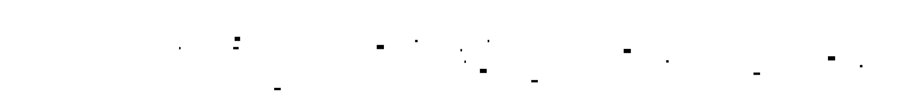

```python
@dataclass
class DecoderConfig:
    """Configuration for decoder stack."""
    d_model: int
    num_heads: int
    d_ff: Optional[int] = None
    num_layers: int = 6
    dropout: float = 0.1
    pre_norm: bool = True
    def __post_init__(self):
        assert self.num_layers > 0, "num_layers must be positive"
class Decoder(nn.Module):
    """
    Stack of N decoder layers.
    Each layer applies:
    1. Masked multi-head self-attention
    2. Multi-head cross-attention (to encoder output)
    3. Position-wise feed-forward network
    With residual connections and layer normalization.
    CRITICAL: Encoder output is passed to EVERY decoder layer,
    not just the last one. This ensures all decoder layers have
    access to the full encoder representation.
    Shape transformation:
        Input:  [batch, tgt_len, d_model]
        Output: [batch, tgt_len, d_model] (same shape)
    """
    def __init__(
        self,
        d_model: int,
        num_heads: int,
        d_ff: Optional[int] = None,
        num_layers: int = 6,
        dropout: float = 0.1,
        pre_norm: bool = True
    ):
        super().__init__()
        # Create N identical decoder layers
        self.layers = nn.ModuleList([
            DecoderLayer(d_model, num_heads, d_ff, dropout, pre_norm)
            for _ in range(num_layers)
        ])
        # Final layer norm (for Pre-LN)
        self.final_norm = LayerNorm(d_model) if pre_norm else None
        self.num_layers = num_layers
        self.pre_norm = pre_norm
        self.d_model = d_model
    def forward(
        self,
        x: torch.Tensor,
        encoder_output: torch.Tensor,
        tgt_mask: Optional[torch.Tensor] = None,
        src_mask: Optional[torch.Tensor] = None
    ) -> torch.Tensor:
        """
        Forward pass through all decoder layers.
        Args:
            x: Decoder input [batch, tgt_len, d_model]
            encoder_output: Encoder output [batch, src_len, d_model]
            tgt_mask: Causal mask for self-attention [1, 1, tgt_len, tgt_len]
            src_mask: Source padding mask [batch, 1, 1, src_len]
        Returns:
            Decoder output [batch, tgt_len, d_model]
        Invariants:
            - Output shape equals input shape
            - Encoder output passed to ALL decoder layers
            - Final norm applied only for Pre-LN
        """
        for layer in self.layers:
            x = layer(x, encoder_output, tgt_mask, src_mask)
        # Apply final norm for Pre-LN
        if self.final_norm is not None:
            x = self.final_norm(x)
        return x
    def extra_repr(self) -> str:
        return (f"num_layers={self.num_layers}, d_model={self.d_model}, "
                f"pre_norm={self.pre_norm}")
```


```python
@dataclass
class TransformerConfig:
    """Configuration for complete encoder-decoder transformer."""
    src_vocab_size: int
    tgt_vocab_size: int
    d_model: int = 512
    num_heads: int = 8
    num_layers: int = 6
    d_ff: Optional[int] = None
    max_seq_len: int = 5000
    dropout: float = 0.1
    pre_norm: bool = True
    def __post_init__(self):
        assert self.src_vocab_size > 0, "src_vocab_size must be positive"
        assert self.tgt_vocab_size > 0, "tgt_vocab_size must be positive"
        assert self.d_model % self.num_heads == 0, \
            f"d_model ({self.d_model}) must be divisible by num_heads ({self.num_heads})"
class EncoderDecoderTransformer(nn.Module):
    """
    Complete encoder-decoder Transformer for sequence-to-sequence tasks.
    Architecture:
        Input tokens -> Source Embedding + PE -> Encoder stack
                                                    ↓
        Target tokens -> Target Embedding + PE -> Decoder stack -> Output projection -> Logits
    The encoder processes the source sequence into a rich representation.
    The decoder generates the target sequence, attending to:
    1. Itself (causally, for autoregressive generation)
    2. The encoder output (cross-attention for source information)
    Output projection maps decoder output to vocabulary logits.
    Default configuration matches the original Transformer (base model):
    - d_model = 512
    - num_heads = 8
    - num_layers = 6
    - d_ff = 2048 (4 * d_model)
    """
    def __init__(
        self,
        src_vocab_size: int,
        tgt_vocab_size: int,
        d_model: int = 512,
        num_heads: int = 8,
        num_layers: int = 6,
        d_ff: Optional[int] = None,
        max_seq_len: int = 5000,
        dropout: float = 0.1,
        pre_norm: bool = True
    ):
        super().__init__()
        from transformer.layers.transformer_embedding import TransformerEmbedding
        # Source (encoder) embeddings
        self.src_embedding = TransformerEmbedding(
            vocab_size=src_vocab_size,
            d_model=d_model,
            max_seq_len=max_seq_len,
            dropout=dropout
        )
        # Target (decoder) embeddings
        self.tgt_embedding = TransformerEmbedding(
            vocab_size=tgt_vocab_size,
            d_model=d_model,
            max_seq_len=max_seq_len,
            dropout=dropout
        )
        # Encoder stack
        self.encoder = Encoder(
            d_model=d_model,
            num_heads=num_heads,
            d_ff=d_ff,
            num_layers=num_layers,
            dropout=dropout,
            pre_norm=pre_norm
        )
        # Decoder stack
        self.decoder = Decoder(
            d_model=d_model,
            num_heads=num_heads,
            d_ff=d_ff,
            num_layers=num_layers,
            dropout=dropout,
            pre_norm=pre_norm
        )
        # Output projection to vocabulary
        self.output_projection = nn.Linear(d_model, tgt_vocab_size)
        # Store configuration
        self.d_model = d_model
        self.num_heads = num_heads
        self.num_layers = num_layers
        self.pre_norm = pre_norm
        self.src_vocab_size = src_vocab_size
        self.tgt_vocab_size = tgt_vocab_size
        # Initialize parameters
        self._init_parameters()
    def _init_parameters(self) -> None:
        """
        Initialize parameters following the original paper.
        Xavier uniform for most weights (dim > 1).
        """
        for p in self.parameters():
            if p.dim() > 1:
                nn.init.xavier_uniform_(p)
    def forward(
        self,
        src_tokens: torch.Tensor,
        tgt_tokens: torch.Tensor,
        src_mask: Optional[torch.Tensor] = None,
        tgt_mask: Optional[torch.Tensor] = None
    ) -> torch.Tensor:
        """
        Forward pass through complete transformer.
        Args:
            src_tokens: Source token indices [batch, src_len]
            tgt_tokens: Target token indices [batch, tgt_len]
            src_mask: Source padding mask [batch, 1, 1, src_len]
            tgt_mask: Target causal mask [1, 1, tgt_len, tgt_len]
        Returns:
            logits: Output logits [batch, tgt_len, tgt_vocab_size]
        Invariants:
            - Output logits shape [batch, tgt_len, vocab_size]
            - Encoder runs once, decoder attends to encoder output
            - All decoder layers receive same encoder output
        """
        # Embed source tokens
        src_emb = self.src_embedding(src_tokens)  # [batch, src_len, d_model]
        # Embed target tokens
        tgt_emb = self.tgt_embedding(tgt_tokens)  # [batch, tgt_len, d_model]
        # Encode source sequence
        encoder_output = self.encoder(src_emb, src_mask)  # [batch, src_len, d_model]
        # Decode target sequence (attending to encoder)
        decoder_output = self.decoder(
            tgt_emb, encoder_output, tgt_mask, src_mask
        )  # [batch, tgt_len, d_model]
        # Project to vocabulary
        logits = self.output_projection(decoder_output)  # [batch, tgt_len, vocab_size]
        return logits
    def encode(
        self, 
        src_tokens: torch.Tensor, 
        src_mask: Optional[torch.Tensor] = None
    ) -> torch.Tensor:
        """
        Encode source sequence only (for inference caching).
        Args:
            src_tokens: Source token indices [batch, src_len]
            src_mask: Source padding mask [batch, 1, 1, src_len]
        Returns:
            encoder_output: [batch, src_len, d_model]
        """
        src_emb = self.src_embedding(src_tokens)
        return self.encoder(src_emb, src_mask)
    def decode(
        self,
        tgt_tokens: torch.Tensor,
        encoder_output: torch.Tensor,
        tgt_mask: Optional[torch.Tensor] = None,
        src_mask: Optional[torch.Tensor] = None
    ) -> torch.Tensor:
        """
        Decode given encoder output (for inference).
        Args:
            tgt_tokens: Target token indices [batch, tgt_len]
            encoder_output: Precomputed encoder output [batch, src_len, d_model]
            tgt_mask: Target causal mask [1, 1, tgt_len, tgt_len]
            src_mask: Source padding mask [batch, 1, 1, src_len]
        Returns:
            logits: [batch, tgt_len, tgt_vocab_size]
        """
        tgt_emb = self.tgt_embedding(tgt_tokens)
        decoder_output = self.decoder(tgt_emb, encoder_output, tgt_mask, src_mask)
        return self.output_projection(decoder_output)
    def extra_repr(self) -> str:
        return (f"src_vocab={self.src_vocab_size}, tgt_vocab={self.tgt_vocab_size}, "
                f"d_model={self.d_model}, num_heads={self.num_heads}, "
                f"num_layers={self.num_layers}, pre_norm={self.pre_norm}")
```

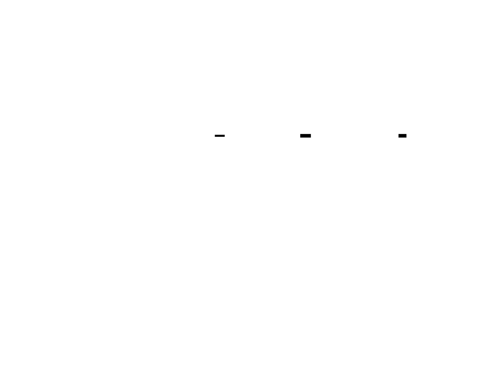

---
## 4. Interface Contracts
### 4.1 LayerNorm.forward()
```python
def forward(self, x: torch.Tensor) -> torch.Tensor:
    """
    Pre-conditions:
        - x.dim() >= 1
        - x.size(-1) == self.d_model
        - x is finite (no NaN or Inf)
    Post-conditions:
        - output.shape == x.shape
        - output.mean(dim=-1) ≈ 0 (before gamma/beta)
        - output.std(dim=-1) ≈ 1 (before gamma/beta)
        - output is differentiable w.r.t. x, gamma, beta
    Returns:
        output: Normalized tensor [batch, seq_len, d_model]
    Side effects:
        - None (pure function)
    Invariants:
        - gamma and beta are learnable (receive gradients)
        - Normalization is per-position (not per-batch)
    """
```
### 4.2 SublayerConnection.forward()
```python
def forward(
    self, 
    x: torch.Tensor, 
    sublayer: callable
) -> torch.Tensor:
    """
    Pre-conditions:
        - x.dim() == 3 and x.size(-1) == self.d_model
        - sublayer is callable: takes tensor, returns tensor of same shape
        - sublayer output shape == sublayer input shape == x.shape
    Post-conditions:
        - output.shape == x.shape
        - output contains residual connection: output = f(x) + x or f(norm(x)) + x
        - If self.training == False, dropout is not applied
    Returns:
        output: [batch, seq_len, d_model]
    Invariants:
        - Gradient has identity path through residual (Pre-LN and Post-LN)
        - Normalization is applied (either before or after sublayer)
    Pre-LN behavior:
        output = x + dropout(sublayer(norm(x)))
        Gradient path: ∂L/∂x = ∂L/∂output * (1 + ∂sublayer/∂x)
        The "1" ensures non-vanishing gradient.
    Post-LN behavior:
        output = norm(x + dropout(sublayer(x)))
        Gradient must pass through norm, which can amplify/attenuate.
    """
```
### 4.3 EncoderLayer.forward()
```python
def forward(
    self, 
    x: torch.Tensor, 
    src_mask: Optional[torch.Tensor] = None
) -> torch.Tensor:
    """
    Pre-conditions:
        - x.dim() == 3 and x.size(-1) == self.d_model
        - src_mask is None OR src_mask broadcasts to [batch, num_heads, seq_len, seq_len]
        - src_mask dtype == torch.bool
    Post-conditions:
        - output.shape == x.shape
        - Self-attention Q, K, V all come from x
        - Masked positions have zero influence on output
    Returns:
        output: [batch, src_len, d_model]
    Invariants:
        - Two sublayers: self-attention, FFN
        - Each sublayer wrapped in SublayerConnection
        - Shape preserved through entire layer
    """
```
### 4.4 DecoderLayer.forward()
```python
def forward(
    self,
    x: torch.Tensor,
    encoder_output: torch.Tensor,
    tgt_mask: Optional[torch.Tensor] = None,
    src_mask: Optional[torch.Tensor] = None
) -> torch.Tensor:
    """
    Pre-conditions:
        - x.dim() == 3 and x.size(-1) == self.d_model
        - encoder_output.dim() == 3 and encoder_output.size(-1) == self.d_model
        - tgt_mask is None OR tgt_mask broadcasts to [batch, num_heads, tgt_len, tgt_len]
        - src_mask is None OR src_mask broadcasts to [batch, num_heads, tgt_len, src_len]
    Post-conditions:
        - output.shape == x.shape
        - Self-attention Q, K, V all come from x
        - Cross-attention Q comes from x, K and V from encoder_output
        - Causal mask prevents attending to future positions
    Returns:
        output: [batch, tgt_len, d_model]
    CRITICAL:
        Cross-attention K and V MUST come from encoder_output, NOT from x.
        This is the information bridge between encoder and decoder.
    Invariants:
        - Three sublayers: masked self-attention, cross-attention, FFN
        - Each sublayer wrapped in SublayerConnection
        - Shape preserved through entire layer
    """
```
### 4.5 Encoder.forward()
```python
def forward(
    self, 
    x: torch.Tensor, 
    src_mask: Optional[torch.Tensor] = None
) -> torch.Tensor:
    """
    Pre-conditions:
        - x.dim() == 3 and x.size(-1) == self.d_model
        - src_mask broadcasts to attention score shape
    Post-conditions:
        - output.shape == x.shape
        - Each layer receives output of previous layer
        - If pre_norm, final LayerNorm is applied
    Returns:
        output: [batch, src_len, d_model]
    Invariants:
        - N layers executed sequentially
        - All layers share same architecture (same config)
        - Final norm applied only for Pre-LN
    """
```
### 4.6 Decoder.forward()
```python
def forward(
    self,
    x: torch.Tensor,
    encoder_output: torch.Tensor,
    tgt_mask: Optional[torch.Tensor] = None,
    src_mask: Optional[torch.Tensor] = None
) -> torch.Tensor:
    """
    Pre-conditions:
        - x.dim() == 3 and x.size(-1) == self.d_model
        - encoder_output.dim() == 3 and encoder_output.size(-1) == self.d_model
        - tgt_mask, src_mask broadcast correctly
    Post-conditions:
        - output.shape == x.shape
        - encoder_output passed to ALL decoder layers
        - If pre_norm, final LayerNorm is applied
    Returns:
        output: [batch, tgt_len, d_model]
    CRITICAL:
        encoder_output is passed to EVERY decoder layer's cross-attention.
        This ensures no information bottleneck at any layer.
    Invariants:
        - N layers executed sequentially
        - Each layer receives same encoder_output
        - Final norm applied only for Pre-LN
    """
```
### 4.7 EncoderDecoderTransformer.forward()
```python
def forward(
    self,
    src_tokens: torch.Tensor,
    tgt_tokens: torch.Tensor,
    src_mask: Optional[torch.Tensor] = None,
    tgt_mask: Optional[torch.Tensor] = None
) -> torch.Tensor:
    """
    Pre-conditions:
        - src_tokens.dim() == 2 and dtype == torch.long
        - tgt_tokens.dim() == 2 and dtype == torch.long
        - src_tokens values in [0, src_vocab_size - 1]
        - tgt_tokens values in [0, tgt_vocab_size - 1]
    Post-conditions:
        - logits.shape == [batch, tgt_len, tgt_vocab_size]
        - Encoder runs exactly once
        - Decoder output attends to encoder output
    Returns:
        logits: [batch, tgt_len, tgt_vocab_size]
    Invariants:
        - Complete forward pass through encoder and decoder
        - All parameters differentiable
        - Output suitable for cross-entropy loss
    """
```
---
## 5. Algorithm Specification
### 5.1 LayerNorm Algorithm
**Input**: x `[batch, seq_len, d_model]`  
**Output**: output `[batch, seq_len, d_model]`
```
ALGORITHM: LayerNorm
INPUT: x [B, S, D], gamma [D], beta [D], eps (default 1e-6)
STEP 1: Compute mean over feature dimension
    mean = x.mean(dim=-1, keepdim=True)
    # x: [B, S, D], mean: [B, S, 1]
    # Each position gets its own mean (independent of other positions)
    INVARIANT: mean[b, s] = (1/D) * sum(x[b, s, :])
STEP 2: Compute variance over feature dimension
    var = x.var(dim=-1, keepdim=True, unbiased=False)
    # var: [B, S, 1]
    # unbiased=False uses n in denominator (not n-1)
    INVARIANT: var[b, s] = (1/D) * sum((x[b, s, :] - mean[b, s])^2)
STEP 3: Normalize
    x_norm = (x - mean) / sqrt(var + eps)
    # x_norm: [B, S, D]
    # Broadcasting: mean [B, S, 1] and var [B, S, 1] expand to [B, S, D]
    # eps prevents division by zero when var = 0
    INVARIANT: x_norm[b, s, :].mean() ≈ 0, x_norm[b, s, :].std() ≈ 1
STEP 4: Apply learned scale and shift
    output = gamma * x_norm + beta
    # gamma: [D], beta: [D] broadcast to [B, S, D]
    # gamma and beta are LEARNED (receive gradients)
    INVARIANT: output[b, s, d] = gamma[d] * x_norm[b, s, d] + beta[d]
RETURN output
GRADIENT FLOW:
    ∂output/∂x_norm = gamma (element-wise)
    ∂output/∂gamma = x_norm
    ∂output/∂beta = 1
    ∂x_norm/∂x = (1/sqrt(var+eps)) * (I - mean_grad/var_grad)
    All gradients are bounded (no explosion through normalization).
```


### 5.2 SublayerConnection Algorithm (Pre-LN vs Post-LN)
**Input**: x `[batch, seq_len, d_model]`, sublayer (callable)  
**Output**: output `[batch, seq_len, d_model]`
```
ALGORITHM: SublayerConnection (Pre-LN variant)
INPUT: x [B, S, D], sublayer, norm, dropout
STEP 1: Normalize input
    x_norm = norm(x)
    # LayerNorm: zero mean, unit variance, then gamma/beta
    INVARIANT: x_norm.shape == x.shape
STEP 2: Apply sublayer to normalized input
    sublayer_out = sublayer(x_norm)
    # sublayer is attention or FFN
    # Must return same shape as input
    INVARIANT: sublayer_out.shape == x.shape
STEP 3: Apply dropout
    sublayer_dropped = dropout(sublayer_out)
    # During training: randomly zero ~p fraction of elements
    # During eval: identity
    INVARIANT: If not training, sublayer_dropped == sublayer_out
STEP 4: Add residual connection
    output = x + sublayer_dropped
    # CRITICAL: x, not x_norm!
    # This is the "gradient highway"
    INVARIANT: output.shape == x.shape
    INVARIANT: ∂output/∂x = I + ∂sublayer_dropped/∂x
    # The I (identity) ensures non-zero gradient even if sublayer gradient vanishes
RETURN output
ALGORITHM: SublayerConnection (Post-LN variant)
INPUT: x [B, S, D], sublayer, norm, dropout
STEP 1: Apply sublayer to input (without normalization)
    sublayer_out = sublayer(x)
    INVARIANT: sublayer_out.shape == x.shape
STEP 2: Apply dropout
    sublayer_dropped = dropout(sublayer_out)
STEP 3: Add residual connection
    residual = x + sublayer_dropped
    INVARIANT: residual.shape == x.shape
STEP 4: Normalize after residual
    output = norm(residual)
    # Normalization applied AFTER addition
    INVARIANT: output.shape == x.shape
    INVARIANT: ∂output/∂x must pass through norm
    # This can amplify or attenuate gradients
RETURN output
GRADIENT FLOW COMPARISON:
Pre-LN:
    ∂output/∂x = I + dropout'(sublayer'(norm'(x)))
    The I (identity) provides direct gradient path.
    Even if sublayer' * norm' → 0, gradient still flows.
Post-LN:
    ∂output/∂x = norm'(x + sublayer(x)) * (I + sublayer'(x))
    Gradient must pass through norm', which can:
    - Amplify gradients (potential explosion)
    - Attenuate gradients (potential vanishing)
EMPIRICAL RESULT:
    Pre-LN is more stable for deep networks (>12 layers).
    Post-LN may achieve slightly better final performance but requires warmup.
```

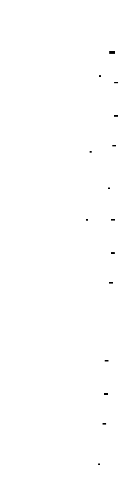

### 5.3 EncoderLayer Algorithm
**Input**: x `[batch, src_len, d_model]`, src_mask (optional)  
**Output**: output `[batch, src_len, d_model]`
```
ALGORITHM: EncoderLayer
INPUT: x [B, S, D], src_mask [B, 1, 1, S] (optional)
STEP 1: Self-attention sublayer
    # Q, K, V all come from input x
    x = sublayer1(x, lambda x: self_attn(x, x, x, src_mask)[0])
    DETAILED:
    a) If Pre-LN: x_norm = norm(x)
       If Post-LN: x_norm = x
    b) Q = W_Q(x_norm), K = W_K(x_norm), V = W_V(x_norm)
    c) scores = Q @ K^T / sqrt(d_k)
    d) If src_mask: scores = scores.masked_fill(src_mask, -inf)
    e) weights = softmax(scores, dim=-1)
    f) attn_out = weights @ V
    g) If Pre-LN: output = x + dropout(attn_out)
       If Post-LN: output = norm(x + dropout(attn_out))
    INVARIANT: Shape preserved [B, S, D]
    INVARIANT: Masked positions have zero attention weight
STEP 2: FFN sublayer
    x = sublayer2(x, ffn)
    DETAILED:
    a) If Pre-LN: x_norm = norm(x)
       If Post-LN: x_norm = x
    b) hidden = W1(x_norm)  # [B, S, 4*D]
    c) hidden = activation(hidden)  # GELU or ReLU
    d) ffn_out = W2(hidden)  # [B, S, D]
    e) If Pre-LN: output = x + dropout(ffn_out)
       If Post-LN: output = norm(x + dropout(ffn_out))
    INVARIANT: Shape preserved [B, S, D]
    INVARIANT: Non-linearity applied (not linear transformation)
RETURN x
TOTAL PARAMETERS (per layer):
    Self-attention: 4 * D^2 (W_Q, W_K, W_V, W_O)
    FFN: 2 * D * 4D = 8 * D^2 (W1, W2)
    LayerNorm: 2 * 2D = 4D (gamma, beta for each sublayer)
    Total: ~12 * D^2 (dominated by FFN)
    For D=512: ~3.1M parameters per layer
```
### 5.4 DecoderLayer Algorithm
**Input**: x `[batch, tgt_len, d_model]`, encoder_output `[batch, src_len, d_model]`, masks  
**Output**: output `[batch, tgt_len, d_model]`
```
ALGORITHM: DecoderLayer
INPUT: 
    x [B, T, D] (decoder input)
    encoder_output [B, S, D]
    tgt_mask [1, 1, T, T] (causal mask)
    src_mask [B, 1, 1, S] (padding mask)
STEP 1: Masked self-attention sublayer
    # Q, K, V all come from decoder input x
    # tgt_mask prevents attending to future positions
    x = sublayer1(x, lambda x: self_attn(x, x, x, tgt_mask)[0])
    CRITICAL: tgt_mask is upper-triangular
    Position i can only attend to positions 0..i
    INVARIANT: Shape preserved [B, T, D]
    INVARIANT: Future positions have zero attention weight
STEP 2: Cross-attention sublayer
    # Q from decoder, K and V from encoder
    x = sublayer2(x, lambda x: cross_attn(x, encoder_output, encoder_output, src_mask)[0])
    DETAILED:
    a) Q = W_Q(x)  # From decoder
    b) K = W_K(encoder_output)  # From encoder
    c) V = W_V(encoder_output)  # From encoder
    d) scores = Q @ K^T / sqrt(d_k)  # [B, T, S]
    e) If src_mask: scores = scores.masked_fill(src_mask, -inf)
    f) weights = softmax(scores, dim=-1)
    g) cross_out = weights @ V  # [B, T, D]
    CRITICAL: K and V come from encoder_output, NOT from x!
    This is the information bridge between source and target.
    INVARIANT: Shape preserved [B, T, D]
    INVARIANT: Each decoder position queries ALL encoder positions
STEP 3: FFN sublayer
    x = sublayer3(x, ffn)
    INVARIANT: Shape preserved [B, T, D]
    INVARIANT: Non-linearity applied
RETURN x
PARAMETER COUNT (per layer):
    Self-attention: 4 * D^2
    Cross-attention: 4 * D^2
    FFN: 8 * D^2
    LayerNorm: 6 * D (3 sublayers)
    Total: ~16 * D^2
    For D=512: ~4.2M parameters per layer
```
### 5.5 Encoder Stack Algorithm
**Input**: x `[batch, src_len, d_model]`, src_mask  
**Output**: output `[batch, src_len, d_model]`
```
ALGORITHM: EncoderStack
INPUT: x [B, S, D], src_mask, N layers
STEP 1: Sequential layer processing
    FOR i = 1 to N:
        x = layer_i(x, src_mask)
        # Each layer receives output of previous layer
    END FOR
    INVARIANT: Shape preserved at each layer [B, S, D]
    INVARIANT: All layers share same configuration
STEP 2: Final normalization (Pre-LN only)
    IF pre_norm:
        x = final_norm(x)
    # Pre-LN normalizes BEFORE each sublayer
    # Last layer's output hasn't been normalized
    # Post-LN normalizes AFTER each sublayer
    # Last layer's output already normalized
    INVARIANT: Shape preserved [B, S, D]
RETURN x
INFORMATION FLOW:
    Input -> Layer1 -> Layer2 -> ... -> LayerN -> (FinalNorm) -> Output
    No information bottleneck: each layer has full access to
    all positions (self-attention is global).
```
### 5.6 Decoder Stack Algorithm
**Input**: x, encoder_output, masks  
**Output**: output `[batch, tgt_len, d_model]`
```
ALGORITHM: DecoderStack
INPUT: 
    x [B, T, D] (decoder input)
    encoder_output [B, S, D]
    tgt_mask [1, 1, T, T]
    src_mask [B, 1, 1, S]
    N layers
STEP 1: Sequential layer processing
    FOR i = 1 to N:
        x = layer_i(x, encoder_output, tgt_mask, src_mask)
        # CRITICAL: encoder_output passed to ALL layers
        # Not just the first or last layer
    END FOR
    INVARIANT: Shape preserved at each layer [B, T, D]
    INVARIANT: Each layer receives same encoder_output
STEP 2: Final normalization (Pre-LN only)
    IF pre_norm:
        x = final_norm(x)
    INVARIANT: Shape preserved [B, T, D]
RETURN x
INFORMATION FLOW:
    Decoder Input -> Layer1 --+--> Layer2 --+--> ... -> Output
                 ^           |              ^
                 |           |              |
    Encoder ----+-----------+--------------+
    Output      (cross-attention at each layer)
CRITICAL: Encoder output is passed to EVERY decoder layer's cross-attention.
This ensures all decoder layers have access to full source information.
```
### 5.7 Complete Transformer Forward Pass
```
ALGORITHM: EncoderDecoderTransformer
INPUT:
    src_tokens [B, S] (source token indices)
    tgt_tokens [B, T] (target token indices)
    src_mask [B, 1, 1, S] (source padding mask)
    tgt_mask [1, 1, T, T] (target causal mask)
STEP 1: Embed source tokens
    src_emb = src_embedding(src_tokens)
    # Token embedding + positional encoding + dropout
    # Shape: [B, S, D]
STEP 2: Embed target tokens
    tgt_emb = tgt_embedding(tgt_tokens)
    # Shape: [B, T, D]
STEP 3: Encode source sequence
    encoder_output = encoder(src_emb, src_mask)
    # N encoder layers, each with self-attention + FFN
    # Shape: [B, S, D]
STEP 4: Decode target sequence
    decoder_output = decoder(tgt_emb, encoder_output, tgt_mask, src_mask)
    # N decoder layers, each with:
    #   - Masked self-attention
    #   - Cross-attention (to encoder_output)
    #   - FFN
    # Shape: [B, T, D]
STEP 5: Project to vocabulary
    logits = output_projection(decoder_output)
    # Linear: D -> vocab_size
    # Shape: [B, T, vocab_size]
RETURN logits
TOTAL PARAMETERS (base model, D=512, N=6, vocab=30k):
    Source embedding: 30k * 512 = 15.4M
    Target embedding: 30k * 512 = 15.4M
    Encoder (6 layers): 6 * 3.1M = 18.6M
    Decoder (6 layers): 6 * 4.2M = 25.2M
    Output projection: 512 * 30k = 15.4M
    Total: ~90M parameters
```

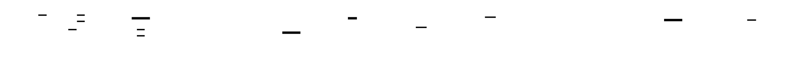

---
## 6. Error Handling Matrix
| Error | Detected By | Recovery | User-Visible? |
|-------|-------------|----------|---------------|
| **Cross-attention K/V from wrong source** | Semantic error (hard to detect) | Documentation + unit test with encoder output tracking | Yes - implementation bug |
| **Causal mask not applied** | Model attends to future during training | Unit test: check attention weights in upper triangle | Yes - implementation bug |
| **Pre-LN without final norm** | Output has wrong scale | Unit test: check if final_norm exists and is used | Yes - implementation bug |
| **Residual connection forgotten** | Gradient vanishing in deep layers | Gradient flow verification test | Yes - implementation bug |
| **Mask broadcasting shape mismatch** | RuntimeError in masked_fill | Clear error message with expected shape | Yes - debug message |
| **d_model not divisible by num_heads** | AssertionError in MHA init | Caught at initialization with clear message | Yes - config error |
| **No gradient to some parameters** | Silent training failure | Gradient flow test: check all params have grad | Yes - implementation bug |
| **NaN in gradients** | Training divergence | Check after backward: assert not any(isnan) | Yes - training error |
| **Wrong mask dtype** | masked_fill may fail | Check: assert mask.dtype == torch.bool | Yes - debug message |
| **seq_len exceeds max_seq_len** | IndexError in PE slicing | Check in forward, raise informative error | Yes - config error |
| **Dropout in eval mode** | Non-deterministic outputs | Call model.eval() before inference | Yes - usage error |
| **LayerNorm eps too small** | Division by zero | Use default 1e-6 | No - handled |
### Error Recovery Implementation
```python
class TransformerError(Exception):
    """Base exception for transformer errors."""
    pass
class GradientFlowError(TransformerError):
    """Raised when gradient flow verification fails."""
    def __init__(self, zero_grad_params: list, no_grad_params: list):
        self.zero_grad = zero_grad_params
        self.no_grad = no_grad_params
        msg = "Gradient flow verification failed.\n"
        if zero_grad_params:
            msg += f"  Zero gradients: {zero_grad_params}\n"
        if no_grad_params:
            msg += f"  No gradients: {no_grad_params}"
        super().__init__(msg)
class CrossAttentionSourceError(TransformerError):
    """Raised when cross-attention uses wrong source for K/V."""
    def __init__(self):
        super().__init__(
            "Cross-attention K and V must come from encoder output, "
            "not decoder input. Check that cross_attn(x, encoder_output, "
            "encoder_output, ...) is used, not cross_attn(x, x, x, ...)."
        )
def verify_gradient_flow(
    model: nn.Module, 
    src_tokens: torch.Tensor, 
    tgt_tokens: torch.Tensor
) -> bool:
    """
    Verify that all parameters receive non-zero gradients.
    Raises:
        GradientFlowError: If any parameter has zero or no gradient
    """
    # Forward pass
    logits = model(src_tokens, tgt_tokens)
    # Create loss that depends on all outputs
    loss = logits.sum()
    # Backward pass
    loss.backward()
    # Check gradients
    zero_grad_params = []
    no_grad_params = []
    for name, param in model.named_parameters():
        if param.requires_grad:
            if param.grad is None:
                no_grad_params.append(name)
            elif torch.all(param.grad == 0):
                zero_grad_params.append(name)
    if zero_grad_params or no_grad_params:
        raise GradientFlowError(zero_grad_params, no_grad_params)
    return True
```
---
## 7. Implementation Sequence with Checkpoints
### Phase 1: Implement LayerNorm (1 hour)
**Files to create**: `transformer/layers/layer_norm.py`
**Tasks**:
1. Define `LayerNormConfig` dataclass with validation
2. Implement `LayerNorm.__init__()`:
   - Create gamma parameter (initialized to 1)
   - Create beta parameter (initialized to 0)
   - Store eps for numerical stability
3. Implement `forward()`:
   - Compute mean over feature dimension (keepdim=True)
   - Compute variance over feature dimension (unbiased=False)
   - Normalize: (x - mean) / sqrt(var + eps)
   - Apply gamma and beta
**Checkpoint**: After this phase, you should be able to:
```python
ln = LayerNorm(d_model=512, eps=1e-6)
x = torch.randn(4, 16, 512)
output = ln(x)
assert output.shape == (4, 16, 512), f"Wrong shape: {output.shape}"
# Verify normalization (before gamma/beta)
x_norm = (x - x.mean(dim=-1, keepdim=True)) / torch.sqrt(x.var(dim=-1, keepdim=True, unbiased=False) + 1e-6)
expected = ln.gamma * x_norm + ln.beta
assert torch.allclose(output, expected, atol=1e-5), "LayerNorm computation incorrect"
print("✓ LayerNorm implementation correct")
```
Run: `pytest tests/test_layer_norm.py::test_layer_norm_forward -v`
---
### Phase 2: Implement SublayerConnection (1-1.5 hours)
**Files to create**: `transformer/layers/sublayer.py`
**Tasks**:
1. Define `SublayerConfig` dataclass
2. Implement `SublayerConnection.__init__()`:
   - Create LayerNorm instance
   - Create Dropout layer
   - Store pre_norm flag
3. Implement `forward()`:
   - If pre_norm: `x + dropout(sublayer(norm(x)))`
   - If post_norm: `norm(x + dropout(sublayer(x)))`
4. Test both Pre-LN and Post-LN variants
**Checkpoint**: After this phase, you should be able to:
```python
# Test Pre-LN
sublayer_pre = SublayerConnection(d_model=512, dropout=0.1, pre_norm=True)
x = torch.randn(2, 8, 512)
dummy_sublayer = lambda x: x * 2  # Simple transformation
output_pre = sublayer_pre(x, dummy_sublayer)
assert output_pre.shape == (2, 8, 512)
# Test Post-LN
sublayer_post = SublayerConnection(d_model=512, dropout=0.1, pre_norm=False)
output_post = sublayer_post(x, dummy_sublayer)
assert output_post.shape == (2, 8, 512)
# Verify residual connection
# With identity sublayer and no dropout, Pre-LN output should be x + norm(x)
sublayer_pre.eval()
identity_out = sublayer_pre(x, lambda x: x)
expected = x + sublayer_pre.norm(x)
assert torch.allclose(identity_out, expected, atol=1e-5)
print("✓ SublayerConnection both variants work")
```
Run: `pytest tests/test_sublayer.py -v`


---
### Phase 3: Implement EncoderLayer (1 hour)
**Files to create**: `transformer/layers/encoder_layer.py`
**Tasks**:
1. Define `EncoderLayerConfig` dataclass
2. Implement `EncoderLayer.__init__()`:
   - Create MultiHeadAttention for self-attention
   - Create PositionWiseFFN
   - Create two SublayerConnection instances
3. Implement `forward()`:
   - Self-attention sublayer: Q=K=V=x
   - FFN sublayer
**Checkpoint**: After this phase, you should be able to:
```python
enc_layer = EncoderLayer(d_model=512, num_heads=8, d_ff=2048, dropout=0.1)
x = torch.randn(2, 16, 512)
src_mask = None  # No masking for this test
output = enc_layer(x, src_mask)
assert output.shape == (2, 16, 512), f"Wrong shape: {output.shape}"
print(f"✓ EncoderLayer output shape correct")
# Verify gradient flow
x_grad = torch.randn(2, 16, 512, requires_grad=True)
output = enc_layer(x_grad, src_mask)
loss = output.sum()
loss.backward()
assert x_grad.grad is not None, "No gradient to input"
assert not torch.isnan(x_grad.grad).any(), "NaN in gradient"
print("✓ EncoderLayer gradient flow verified")
```
Run: `pytest tests/test_encoder_layer.py -v`
---
### Phase 4: Implement DecoderLayer (1.5-2 hours)
**Files to create**: `transformer/layers/decoder_layer.py`
**Tasks**:
1. Define `DecoderLayerConfig` dataclass
2. Implement `DecoderLayer.__init__()`:
   - Create MultiHeadAttention for self-attention
   - Create MultiHeadAttention for cross-attention
   - Create PositionWiseFFN
   - Create three SublayerConnection instances
3. Implement `forward()`:
   - Masked self-attention: Q=K=V=x, mask=tgt_mask
   - Cross-attention: Q=x, K=V=encoder_output, mask=src_mask
   - FFN sublayer
**Checkpoint**: After this phase, you should be able to:
```python
dec_layer = DecoderLayer(d_model=512, num_heads=8, d_ff=2048, dropout=0.1)
dec_layer.eval()
x = torch.randn(2, 12, 512)  # Decoder input
encoder_output = torch.randn(2, 16, 512)  # Encoder output
# Create causal mask
seq_len = 12
tgt_mask = torch.triu(torch.ones(seq_len, seq_len), diagonal=1).bool()
tgt_mask = tgt_mask.unsqueeze(0).unsqueeze(0)
output = dec_layer(x, encoder_output, tgt_mask=tgt_mask, src_mask=None)
assert output.shape == (2, 12, 512), f"Wrong shape: {output.shape}"
print("✓ DecoderLayer output shape correct")
# Verify causal mask effect
# Attention weights in upper triangle should be zero
# This requires accessing attention weights (may need to modify forward)
```
Run: `pytest tests/test_decoder_layer.py -v`
---
### Phase 5: Implement Encoder and Decoder Stacks (1 hour)
**Files to create**: `transformer/layers/encoder.py`, `transformer/layers/decoder.py`
**Tasks**:
1. Define `EncoderConfig` and `DecoderConfig` dataclasses
2. Implement `Encoder.__init__()`:
   - Create ModuleList of N EncoderLayers
   - Create final LayerNorm if pre_norm
3. Implement `Encoder.forward()`:
   - Apply each layer sequentially
   - Apply final norm if pre_norm
4. Implement `Decoder` similarly with DecoderLayers
**Checkpoint**: After this phase, you should be able to:
```python
# Test Encoder stack
encoder = Encoder(d_model=512, num_heads=8, d_ff=2048, num_layers=6)
x = torch.randn(2, 16, 512)
output = encoder(x)
assert output.shape == (2, 16, 512)
print(f"✓ Encoder stack output shape correct")
# Test Decoder stack
decoder = Decoder(d_model=512, num_heads=8, d_ff=2048, num_layers=6)
decoder.eval()
enc_out = torch.randn(2, 16, 512)
tgt_mask = torch.triu(torch.ones(12, 12), diagonal=1).bool().unsqueeze(0).unsqueeze(0)
dec_input = torch.randn(2, 12, 512)
output = decoder(dec_input, enc_out, tgt_mask=tgt_mask)
assert output.shape == (2, 12, 512)
print("✓ Decoder stack output shape correct")
# Verify Pre-LN final norm exists
encoder_pre = Encoder(d_model=512, num_heads=8, num_layers=2, pre_norm=True)
assert encoder_pre.final_norm is not None, "Pre-LN should have final_norm"
encoder_post = Encoder(d_model=512, num_heads=8, num_layers=2, pre_norm=False)
assert encoder_post.final_norm is None, "Post-LN should NOT have final_norm"
print("✓ Final norm logic correct")
```
Run: `pytest tests/test_stacks.py -v`
---
### Phase 6: Wire Complete EncoderDecoderTransformer (1 hour)
**Files to create**: `transformer/model/transformer.py`
**Tasks**:
1. Define `TransformerConfig` dataclass
2. Implement `EncoderDecoderTransformer.__init__()`:
   - Create source and target TransformerEmbedding
   - Create Encoder stack
   - Create Decoder stack
   - Create output projection (Linear)
3. Implement `forward()`:
   - Embed source and target
   - Encode source
   - Decode target
   - Project to vocabulary
4. Implement `encode()` and `decode()` for inference
**Checkpoint**: After this phase, you should be able to:
```python
model = EncoderDecoderTransformer(
    src_vocab_size=1000,
    tgt_vocab_size=1000,
    d_model=256,
    num_heads=4,
    num_layers=2,
    d_ff=1024
)
src = torch.randint(0, 1000, (2, 16))
tgt = torch.randint(0, 1000, (2, 12))
# Create masks
src_mask = (src == 0).unsqueeze(1).unsqueeze(2)  # Assume 0 is padding
tgt_mask = torch.triu(torch.ones(12, 12), diagonal=1).bool().unsqueeze(0).unsqueeze(0)
logits = model(src, tgt, src_mask=src_mask, tgt_mask=tgt_mask)
assert logits.shape == (2, 12, 1000), f"Wrong shape: {logits.shape}"
print("✓ Complete transformer forward pass works")
# Test encode/decode methods
enc_out = model.encode(src, src_mask)
assert enc_out.shape == (2, 16, 256)
dec_logits = model.decode(tgt, enc_out, tgt_mask, src_mask)
assert dec_logits.shape == (2, 12, 1000)
print("✓ encode() and decode() methods work")
```
Run: `pytest tests/test_transformer.py::test_transformer_forward -v`
---
### Phase 7: Gradient Flow Verification (0.5-1 hour)
**Files to modify**: `tests/test_transformer.py`
**Tasks**:
1. Implement gradient flow verification function
2. Test that all parameters receive non-zero gradients
3. Test for NaN and Inf in gradients
4. Test gradient magnitudes are reasonable
**Checkpoint**: After this phase, verification should pass:
```python
# Create model
model = EncoderDecoderTransformer(
    src_vocab_size=100,
    tgt_vocab_size=100,
    d_model=128,
    num_heads=4,
    num_layers=2
)
# Sample input
src = torch.randint(0, 100, (2, 10))
tgt = torch.randint(0, 100, (2, 8))
# Forward and backward
logits = model(src, tgt)
loss = logits.sum()
loss.backward()
# Check all parameters have gradients
zero_grad_params = []
nan_grad_params = []
for name, param in model.named_parameters():
    if param.requires_grad:
        if param.grad is None:
            zero_grad_params.append(f"{name} (no grad)")
        elif torch.all(param.grad == 0):
            zero_grad_params.append(f"{name} (zero grad)")
        elif torch.isnan(param.grad).any():
            nan_grad_params.append(name)
assert len(zero_grad_params) == 0, f"Zero gradient params: {zero_grad_params}"
assert len(nan_grad_params) == 0, f"NaN gradient params: {nan_grad_params}"
print("✓ All parameters receive non-zero, non-NaN gradients")
# Check gradient magnitudes are reasonable
for name, param in model.named_parameters():
    if param.grad is not None:
        grad_norm = param.grad.norm().item()
        assert 1e-8 < grad_norm < 1e6, f"Unusual gradient norm for {name}: {grad_norm}"
print("✓ Gradient magnitudes are healthy")
```
Run: `pytest tests/test_transformer.py::test_gradient_flow -v`
---
## 8. Test Specification
### 8.1 Test: LayerNorm Forward
```python
def test_layer_norm_forward():
    """Verify LayerNorm produces correct output shape and values."""
    ln = LayerNorm(d_model=512, eps=1e-6)
    x = torch.randn(4, 16, 512)
    output = ln(x)
    # Shape check
    assert output.shape == (4, 16, 512)
    # Verify normalization (before gamma/beta)
    # Mean should be ~0, std should be ~1
    x_centered = x - x.mean(dim=-1, keepdim=True)
    x_norm = x_centered / torch.sqrt(x_centered.var(dim=-1, keepdim=True, unbiased=False) + 1e-6)
    expected = ln.gamma * x_norm + ln.beta
    assert torch.allclose(output, expected, atol=1e-5)
```
### 8.2 Test: SublayerConnection Pre-LN vs Post-LN
```python
def test_sublayer_variants():
    """Verify Pre-LN and Post-LN produce different outputs."""
    x = torch.randn(2, 8, 512)
    # Pre-LN
    pre_ln = SublayerConnection(d_model=512, dropout=0.0, pre_norm=True)
    pre_ln.eval()
    # Post-LN
    post_ln = SublayerConnection(d_model=512, dropout=0.0, pre_norm=False)
    post_ln.eval()
    # Copy norm weights for fair comparison
    post_ln.norm.gamma.data = pre_ln.norm.gamma.data.clone()
    post_ln.norm.beta.data = pre_ln.norm.beta.data.clone()
    # Simple sublayer
    sublayer = lambda x: x * 2
    output_pre = pre_ln(x, sublayer)
    output_post = post_ln(x, sublayer)
    # They should differ
    assert not torch.allclose(output_pre, output_post, atol=1e-5)
    # Pre-LN: x + 2 * norm(x)
    expected_pre = x + 2 * pre_ln.norm(x)
    assert torch.allclose(output_pre, expected_pre, atol=1e-5)
    # Post-LN: norm(x + 2 * x) = norm(3 * x)
    expected_post = post_ln.norm(3 * x)
    assert torch.allclose(output_post, expected_post, atol=1e-5)
```
### 8.3 Test: EncoderLayer Gradient Flow
```python
def test_encoder_layer_gradient():
    """Verify gradients flow through encoder layer."""
    enc_layer = EncoderLayer(d_model=256, num_heads=4, d_ff=1024, dropout=0.0)
    enc_layer.eval()
    x = torch.randn(2, 8, 256, requires_grad=True)
    output = enc_layer(x)
    loss = output.sum()
    loss.backward()
    assert x.grad is not None
    assert not torch.isnan(x.grad).any()
    assert not torch.isinf(x.grad).any()
    # Check parameter gradients
    for name, param in enc_layer.named_parameters():
        if param.requires_grad:
            assert param.grad is not None, f"{name} has no gradient"
```
### 8.4 Test: DecoderLayer Causal Mask
```python
def test_decoder_causal_mask():
    """Verify causal mask prevents future attention in decoder."""
    dec_layer = DecoderLayer(d_model=128, num_heads=4, d_ff=512, dropout=0.0)
    dec_layer.eval()
    x = torch.randn(1, 6, 128)
    encoder_output = torch.randn(1, 10, 128)
    # Create causal mask
    causal_mask = torch.triu(torch.ones(6, 6), diagonal=1).bool().unsqueeze(0).unsqueeze(0)
    # Forward pass (would need to return attention weights to fully verify)
    output = dec_layer(x, encoder_output, tgt_mask=causal_mask)
    assert output.shape == (1, 6, 128)
    # Full verification would check self-attention weights have zero upper triangle
```
### 8.5 Test: Cross-Attention Source
```python
def test_cross_attention_source():
    """Verify cross-attention uses encoder output for K and V."""
    # This test verifies the implementation by checking gradient flow
    dec_layer = DecoderLayer(d_model=128, num_heads=4, d_ff=512, dropout=0.0)
    x = torch.randn(1, 6, 128, requires_grad=True)
    encoder_output = torch.randn(1, 10, 128, requires_grad=True)
    output = dec_layer(x, encoder_output)
    loss = output.sum()
    loss.backward()
    # Both should receive gradients
    assert x.grad is not None
    assert encoder_output.grad is not None
    # Encoder output gradient comes from cross-attention
    assert encoder_output.grad.abs().sum() > 0
```
### 8.6 Test: Stack Final Norm
```python
def test_stack_final_norm():
    """Verify final norm is applied correctly for Pre-LN."""
    # Pre-LN encoder
    encoder_pre = Encoder(d_model=128, num_heads=4, num_layers=2, pre_norm=True)
    assert encoder_pre.final_norm is not None
    # Post-LN encoder
    encoder_post = Encoder(d_model=128, num_heads=4, num_layers=2, pre_norm=False)
    assert encoder_post.final_norm is None
    # Verify output differs
    x = torch.randn(1, 8, 128)
    encoder_pre.eval()
    encoder_post.eval()
    # Copy layer weights
    for i in range(2):
        encoder_post.layers[i].load_state_dict(encoder_pre.layers[i].state_dict())
    out_pre = encoder_pre(x)
    out_post = encoder_post(x)
    # They should differ because of final norm
    assert not torch.allclose(out_pre, out_post, atol=1e-5)
```
### 8.7 Test: Complete Transformer Gradient Flow
```python
def test_transformer_gradient_flow():
    """Verify all parameters receive gradients."""
    model = EncoderDecoderTransformer(
        src_vocab_size=100,
        tgt_vocab_size=100,
        d_model=64,
        num_heads=2,
        num_layers=2,
        d_ff=256,
        dropout=0.0
    )
    src = torch.randint(0, 100, (2, 8))
    tgt = torch.randint(0, 100, (2, 6))
    logits = model(src, tgt)
    loss = logits.sum()
    loss.backward()
    # Check all parameters
    no_grad = []
    zero_grad = []
    for name, param in model.named_parameters():
        if param.requires_grad:
            if param.grad is None:
                no_grad.append(name)
            elif torch.all(param.grad == 0):
                zero_grad.append(name)
    assert len(no_grad) == 0, f"No gradient: {no_grad}"
    assert len(zero_grad) == 0, f"Zero gradient: {zero_grad}"
```
### 8.8 Test: Shape Preservation
```python
def test_shape_preservation():
    """Verify shapes are preserved through all layers."""
    model = EncoderDecoderTransformer(
        src_vocab_size=100,
        tgt_vocab_size=100,
        d_model=128,
        num_heads=4,
        num_layers=3
    )
    batch_size = 4
    src_len = 20
    tgt_len = 15
    src = torch.randint(0, 100, (batch_size, src_len))
    tgt = torch.randint(0, 100, (batch_size, tgt_len))
    logits = model(src, tgt)
    assert logits.shape == (batch_size, tgt_len, 100)
    # Test encode/decode
    enc_out = model.encode(src)
    assert enc_out.shape == (batch_size, src_len, 128)
    dec_out = model.decode(tgt, enc_out)
    assert dec_out.shape == (batch_size, tgt_len, 100)
```
---
## 9. Performance Targets
| Operation | Target | Measurement Method |
|-----------|--------|-------------------|
| LayerNorm forward (batch=32, seq=128) | < 1ms | `time.perf_counter()` around forward |
| EncoderLayer forward (batch=32, seq=64) | < 5ms | Time single layer |
| DecoderLayer forward (batch=32, seq=64) | < 7ms | Time single layer (3 sublayers) |
| 6-layer encoder forward | < 30ms | Time complete encoder |
| 6-layer decoder forward | < 40ms | Time complete decoder |
| Full transformer forward | < 50ms | Time encoder + decoder |
| Gradient computation | < 100ms | Time backward pass |
| All parameters receive gradients | 100% | Check after backward |
| No NaN gradients | 0 NaN | Check after backward |
### Benchmarking Code
```python
def benchmark_transformer():
    """Benchmark complete transformer performance."""
    import time
    device = 'cuda' if torch.cuda.is_available() else 'cpu'
    model = EncoderDecoderTransformer(
        src_vocab_size=1000,
        tgt_vocab_size=1000,
        d_model=512,
        num_heads=8,
        num_layers=6,
        d_ff=2048
    ).to(device)
    model.eval()
    batch_size = 32
    src_len = 64
    tgt_len = 64
    src = torch.randint(0, 1000, (batch_size, src_len), device=device)
    tgt = torch.randint(0, 1000, (batch_size, tgt_len), device=device)
    # Warmup
    for _ in range(10):
        _ = model(src, tgt)
    # Timed runs
    if device == 'cuda':
        torch.cuda.synchronize()
    start = time.perf_counter()
    for _ in range(100):
        _ = model(src, tgt)
    if device == 'cuda':
        torch.cuda.synchronize()
    end = time.perf_counter()
    avg_time_ms = (end - start) / 100 * 1000
    print(f"Average forward pass: {avg_time_ms:.2f}ms")
    assert avg_time_ms < 50.0, f"Too slow: {avg_time_ms:.2f}ms > 50ms target"
    return avg_time_ms
```
---
## 10. Numerical Analysis
### 10.1 Pre-LN vs Post-LN Gradient Dynamics
**Pre-LN gradient flow**:
```
output = x + dropout(sublayer(norm(x)))
∂output/∂x = I + dropout'(sublayer'(norm'(x)))
The identity matrix I provides direct gradient path.
Even if sublayer gradient vanishes, gradient still flows through residual.
```
**Post-LN gradient flow**:
```
output = norm(x + dropout(sublayer(x)))
∂output/∂x = norm'(x + sublayer(x)) * (I + sublayer'(x))
Gradient must pass through norm', which involves:
  - Division by sqrt(var + eps)
  - Subtraction of mean
  - Multiplication by gamma
This can amplify or attenuate gradients unpredictably.
```
**Empirical observation**: Pre-LN models train stably from step 1. Post-LN models require learning rate warmup to avoid early gradient explosion.
### 10.2 Cross-Attention Gradient Flow
```
Decoder output depends on encoder output through cross-attention:
  cross_out = softmax(Q @ K^T / sqrt(d_k)) @ V
  where Q = W_Q(decoder), K = W_K(encoder), V = W_V(encoder)
Gradient to encoder output:
  ∂L/∂encoder = ∂L/∂cross_out * ∂cross_out/∂V * ∂V/∂encoder
              + ∂L/∂cross_out * ∂cross_out/∂K * ∂K/∂encoder
Both K and V contribute gradients, ensuring encoder receives
training signal from all decoder layers.
```
### 10.3 Memory Budget
For d_model=512, num_layers=6, batch=32, seq=64:
```
Encoder parameters (per layer):
  Self-attention: 4 * 512 * 512 = 1.05M
  FFN: 2 * 512 * 2048 = 2.10M
  LayerNorm: 2 * 2 * 512 = 2K
  Total per layer: ~3.15M
  Total encoder (6 layers): ~18.9M
Decoder parameters (per layer):
  Self-attention: 1.05M
  Cross-attention: 1.05M
  FFN: 2.10M
  LayerNorm: 3 * 2 * 512 = 3K
  Total per layer: ~4.20M
  Total decoder (6 layers): ~25.2M
Embeddings (vocab=30k):
  Source: 30k * 512 = 15.4M
  Target: 30k * 512 = 15.4M
Output projection: 512 * 30k = 15.4M
Total parameters: ~90M
Activations (forward pass):
  Per encoder layer: batch * seq * d_model * ~10 (attention + FFN)
    = 32 * 64 * 512 * 10 = 10.5M elements = 42 MB
  6 encoder layers: ~250 MB
  6 decoder layers: ~300 MB (cross-attention adds activations)
Total forward memory: ~600 MB
```
---
## 11. Gradient/Numerical Analysis (AI/ML Specific)
### 11.1 Complete Gradient Flow Trace
```
=== FORWARD PASS ===
src_tokens:         [B, S]        indices
tgt_tokens:         [B, T]        indices
    ↓ src_embedding
src_emb:            [B, S, D]     requires_grad=True
    ↓ encoder (6 layers)
encoder_output:     [B, S, D]     requires_grad=True
    ↓ tgt_embedding
tgt_emb:            [B, T, D]     requires_grad=True
    ↓ decoder (6 layers)
decoder_output:     [B, T, D]     requires_grad=True
    ↓ output_projection
logits:             [B, T, V]     requires_grad=True
=== BACKWARD PASS ===
∂L/∂logits:         [B, T, V]
    ↓ through output_projection
∂L/∂decoder_output: [B, T, D]
    ↓ through decoder layers (reverse order)
For each decoder layer (reverse):
  ∂L/∂x from FFN sublayer
    ∂L/∂x = ∂L/∂output (residual path) + ∂L/∂sublayer_out * ∂sublayer/∂x
  ∂L/∂x from cross-attention sublayer
    ∂L/∂encoder_output += ∂L/∂cross_out * ∂cross/∂encoder (K, V path)
  ∂L/∂x from self-attention sublayer
∂L/∂encoder_output: [B, S, D] (accumulated from all decoder layers)
    ↓ through encoder layers (reverse order)
For each encoder layer (reverse):
  ∂L/∂x from FFN sublayer
  ∂L/∂x from self-attention sublayer
∂L/∂src_emb:        [B, S, D]
∂L/∂tgt_emb:        [B, T, D]
    ↓ through embeddings
∂L/∂embedding.weight (sparse, only tokens in batch)
=== GRADIENT MAGNITUDE ANALYSIS ===
With Xavier initialization and Pre-LN:
  ∂L/∂layer_input: O(1) (bounded by residual)
  ∂L/∂W_attention: O(1/sqrt(D))
  ∂L/∂W_ffn: O(1/sqrt(D))
No vanishing gradient through residual connections.
```
### 11.2 Residual Connection Mathematics
The residual connection in Pre-LN:
```
output = x + dropout(sublayer(norm(x)))
```
Gradient with respect to input:
```
∂output/∂x = ∂x/∂x + ∂(dropout(sublayer(norm(x))))/∂x
           = I + dropout' * sublayer' * norm'
```
Key insight: The `I` (identity) term means:
- Gradient magnitude is at least 1 (from the residual path)
- Even if sublayer gradient vanishes, total gradient is non-zero
- This enables training very deep networks (100+ layers)
### 11.3 Cross-Attention Information Flow
```
Information path from encoder to decoder:
Encoder Output [B, S, D]
        ↓
    W_K, W_V (per decoder layer)
        ↓
K, V for cross-attention [B, S, D]
        ↓
Decoder Query Q [B, T, D]
        ↓
Attention Weights [B, Heads, T, S]
        ↓
Cross-Attention Output [B, T, D]
CRITICAL INSIGHTS:
1. Each decoder position queries ALL encoder positions
2. Attention weights are learned (not fixed)
3. All decoder layers receive same encoder output
4. Gradients flow from decoder back to encoder through K, V
```
---
## 12. Common Pitfalls and Solutions
| Pitfall | Symptom | Solution |
|---------|---------|----------|
| **Cross-attention K/V from decoder** | Model ignores encoder, poor translation | Ensure cross_attn(x, encoder_output, encoder_output, ...) |
| **Causal mask not applied** | Model "cheats" during training, fails at inference | Pass tgt_mask to decoder self-attention |
| **Pre-LN without final norm** | Output has wrong scale | Add final_norm for Pre-LN, check pre_norm flag |
| **Residual connection forgotten** | Gradients vanish in deep layers | Use SublayerConnection, ensure x + sublayer(x) |
| **Mask shape wrong** | RuntimeError in masked_fill | Reshape to [B, 1, 1, S] or [1, 1, T, T] |
| **No gradient to encoder** | Encoder doesn't learn | Check cross-attention uses encoder_output |
| **Final norm in Post-LN** | Double normalization | Only add final_norm when pre_norm=True |
| **Dropout in eval mode** | Non-deterministic outputs | Call model.eval() before inference |
| **Wrong d_model in layers** | Shape mismatch | Use same d_model throughout config |
| **NaN gradients** | Training divergence | Check for very large activations, add gradient clipping |
---
[[CRITERIA_JSON: {"module_id": "transformer-scratch-m4", "criteria": ["Implement LayerNorm class computing mean and variance over feature dimension with learned gamma (scale) and beta (shift) parameters, using epsilon=1e-6 for numerical stability", "Implement SublayerConnection supporting both Pre-LN (norm → sublayer → residual) and Post-LN (sublayer → residual → norm) variants with configurable pre_norm flag", "Implement EncoderLayer with self-attention sublayer + FFN sublayer, each wrapped in SublayerConnection with residual and normalization", "Implement DecoderLayer with three sublayers: masked self-attention, cross-attention (Q from decoder, K/V from encoder), and FFN, each with residual connections", "Cross-attention correctly uses decoder output as Query and encoder output as Key/Value, with encoder output passed to every decoder layer", "Causal mask applied to decoder self-attention preventing positions from attending to future tokens, implemented via upper-triangular -inf mask", "Encoder stack composes N identical EncoderLayers sequentially, with optional final LayerNorm for Pre-LN variant", "Decoder stack composes N identical DecoderLayers sequentially, with optional final LayerNorm for Pre-LN variant", "Default N=6 layers configurable via num_layers parameter, matching original Transformer architecture", "Implement complete EncoderDecoderTransformer class wiring source/target embeddings, encoder stack, decoder stack, and output projection to vocabulary", "Output projection maps decoder output [batch, tgt_len, d_model] to logits [batch, tgt_len, vocab_size] via linear layer", "Implement encode() and decode() methods for inference: encode() returns encoder output, decode() takes encoder output and target tokens", "Verify gradient flow: loss.backward() produces non-zero gradients for all parameters including all layers of encoder and decoder", "Verify no NaN or Inf gradients after backward pass, indicating numerical stability", "Document Pre-LN vs Post-LN trade-offs: Pre-LN more stable for deep models, Post-LN may achieve slightly better final performance but requires warmup", "Initialize parameters using Xavier uniform for weights (dim > 1 tensors) following original paper", "Test that Pre-LN encoder/decoder has final_norm while Post-LN does not", "Test that cross-attention receives encoder output as K/V (not decoder input)", "Test that causal mask correctly zeros upper triangle of attention weights", "Benchmark complete transformer forward pass to meet <50ms target for batch=32, seq=64"]}]
<!-- END_TDD_MOD -->


<!-- TDD_MOD_ID: transformer-scratch-m5 -->
# Technical Design Document: Full Transformer Assembly & Training
**Module ID**: `transformer-scratch-m5`  
**Version**: 1.0  
**Primary Language**: Python (PyTorch)
---
## 1. Module Charter
This module assembles the complete encoder-decoder Transformer from the components built in previous modules and implements the training machinery required to make it learn. The core architectural challenge is teacher forcing: the decoder must be trained to predict the next token given previous tokens, requiring a one-position shift between decoder input and target labels. The training infrastructure includes masked cross-entropy loss that ignores padding positions, learning rate scheduling with warmup followed by inverse square root decay (matching the original Transformer paper), gradient clipping to prevent explosions in early training, and label smoothing to prevent overconfident predictions. The Adam optimizer is configured with non-standard betas (0.9, 0.98 instead of 0.9, 0.999) as specified in the original paper. Training convergence is verified on a synthetic copy task where the model must output its input sequence verbatim—a task that tests the complete encoder-decoder information flow without requiring linguistic knowledge.
**What this module DOES**:
- Wire complete EncoderDecoderTransformer with source/target embeddings, encoder, decoder, and output projection
- Implement teacher forcing with correct one-position shift: `decoder_input = tgt[:, :-1]`, `target = tgt[:, 1:]`
- Implement masked cross-entropy loss with `ignore_index=pad_token_id`
- Implement learning rate schedule: linear warmup + inverse square root decay (or cosine alternative)
- Implement gradient clipping with `max_norm=1.0`
- Implement label smoothing with `epsilon=0.1`
- Configure Adam optimizer with `betas=(0.9, 0.98)`
- Create synthetic copy task dataset for training verification
- Implement complete training loop with logging and checkpointing
- Verify loss convergence below 0.1 within 1000 steps on copy task
**What this module does NOT do**:
- Inference and generation (module m6)
- Real translation tasks (would require larger vocabulary and data pipeline)
- Multi-GPU distributed training (uses single GPU/CPU)
- Advanced regularization (dropout is from previous modules)
**Upstream dependencies**:
- Complete Transformer architecture from module m4
- All subcomponents (attention, FFN, embeddings, layers)
**Downstream consumers**:
- Inference generation (module m6)
- Production deployment would extend this training framework
**Invariants**:
1. Decoder input is always one position behind target: position i in decoder input predicts position i in target
2. Padding positions contribute zero to loss (masked via `ignore_index`)
3. Learning rate follows warmup schedule: increases linearly for first `warmup_steps`, then decays
4. Gradient norm is bounded by `max_norm` after clipping
5. Label smoothing produces soft targets with `(1-epsilon)` for true class, `epsilon/(K-1)` for others
6. Training loop alternates between `model.train()` and `model.eval()` correctly
---
## 2. File Structure
Create files in this exact sequence:
```
transformer/
├── model/
│   ├── __init__.py              # (from m4 - update exports)
│   └── transformer.py           # (from m4 - already exists)
├── training/
│   ├── __init__.py              # 1 - Package exports
│   ├── loss.py                  # 2 - Masked cross-entropy with label smoothing
│   ├── scheduler.py             # 3 - Learning rate schedules (warmup + decay)
│   ├── optimizer.py             # 4 - Optimizer configuration
│   ├── trainer.py               # 5 - Complete training loop
│   └── copy_task.py             # 6 - Synthetic copy task dataset
└── tests/
    ├── __init__.py              # (already exists)
    ├── test_loss.py             # 7 - Loss function tests
    ├── test_scheduler.py        # 8 - LR schedule tests
    ├── test_trainer.py          # 9 - Training loop tests
    └── test_copy_task.py        # 10 - Copy task convergence test
```
**Creation order rationale**: Build from loss function (the simplest component) through learning rate scheduling to the complete training loop. The copy task dataset comes last as it exercises all components together.
---
## 3. Complete Data Model
### 3.1 Core Tensor Shapes
| Tensor | Symbol | Shape | Named Dimensions | Description |
|--------|--------|-------|------------------|-------------|
| Source tokens | S | `[B, Se]` | batch, src_len | Source token indices |
| Target tokens | T | `[B, Tg]` | batch, tgt_len | Target token indices (full with SOS/EOS) |
| Decoder input | D_in | `[B, Tg-1]` | batch, tgt_len_minus_1 | Target[:-1] for teacher forcing |
| Target labels | T_lbl | `[B, Tg-1]` | batch, tgt_len_minus_1 | Target[1:] for loss computation |
| Logits | L | `[B, Tg-1, V]` | batch, tgt_len, vocab_size | Model output before softmax |
| Loss per token | ℓ | `[B, Tg-1]` | batch, tgt_len | Per-position cross-entropy loss |
| Learning rate | η | scalar | - | Current learning rate value |
| Gradient norm | g | scalar | - | Total gradient norm before/after clipping |
### 3.2 Training Configuration
```python
from dataclasses import dataclass, field
from typing import Optional, Literal
import torch
@dataclass
class TrainingConfig:
    """Complete configuration for transformer training."""
    # Model configuration
    src_vocab_size: int
    tgt_vocab_size: int
    d_model: int = 512
    num_heads: int = 8
    num_layers: int = 6
    d_ff: Optional[int] = None
    max_seq_len: int = 5000
    dropout: float = 0.1
    pre_norm: bool = True
    # Training configuration
    batch_size: int = 32
    max_steps: int = 100000
    warmup_steps: int = 4000
    learning_rate: float = 0.0001
    max_grad_norm: float = 1.0
    label_smoothing: float = 0.1
    weight_decay: float = 0.0
    # Optimizer configuration (Transformer-specific)
    adam_betas: tuple = (0.9, 0.98)
    adam_eps: float = 1e-9
    # Logging configuration
    log_every: int = 100
    eval_every: int = 1000
    checkpoint_every: int = 5000
    checkpoint_dir: str = 'checkpoints'
    # Special tokens
    pad_token_id: int = 0
    sos_token_id: int = 1
    eos_token_id: int = 2
    # Device
    device: str = 'cuda' if torch.cuda.is_available() else 'cpu'
    def __post_init__(self):
        assert self.src_vocab_size > 0, "src_vocab_size must be positive"
        assert self.tgt_vocab_size > 0, "tgt_vocab_size must be positive"
        assert self.d_model % self.num_heads == 0, \
            f"d_model ({self.d_model}) must be divisible by num_heads ({self.num_heads})"
        if self.d_ff is None:
            self.d_ff = 4 * self.d_model
        assert 0.0 <= self.label_smoothing < 1.0, "label_smoothing must be in [0, 1)"
        assert 0.0 <= self.dropout < 1.0, "dropout must be in [0, 1)"
```
### 3.3 Loss Function Internal State
| Field | Type | Purpose |
|-------|------|---------|
| criterion | nn.CrossEntropyLoss | PyTorch cross-entropy with built-in label smoothing |
| pad_token_id | int | Token ID to ignore in loss |
| label_smoothing | float | Epsilon for soft targets |
### 3.4 Learning Rate Scheduler State
| Field | Type | Purpose |
|-------|------|---------|
| d_model | int | Model dimension (affects LR scale) |
| warmup_steps | int | Number of warmup steps |
| lr_multiplier | float | Multiplier for peak learning rate |
| step_count | int | Current training step |
| current_lr | float | Current learning rate value |
### 3.5 Trainer Internal State
| Field | Type | Purpose |
|-------|------|---------|
| model | EncoderDecoderTransformer | The model being trained |
| optimizer | torch.optim.Adam | Adam optimizer |
| scheduler | TransformerLRScheduler | Learning rate scheduler |
| criterion | MaskedCrossEntropyLoss | Loss function |
| train_dataloader | DataLoader | Training data iterator |
| val_dataloader | DataLoader | Validation data iterator |
| global_step | int | Current global step |
| train_losses | List[float] | Training loss history |
| val_losses | List[float] | Validation loss history |
| learning_rates | List[float] | Learning rate history |
### 3.6 Copy Task Dataset
```python
@dataclass
class CopyTaskConfig:
    """Configuration for synthetic copy task."""
    n_samples: int = 1000        # Number of training samples
    seq_len: int = 10            # Sequence length (excluding SOS/EOS)
    vocab_size: int = 20         # Vocabulary size (reserve 0,1,2 for special tokens)
    min_seq_len: int = 3         # Minimum sequence length (for variable length)
    variable_length: bool = False  # Whether to use variable length sequences
```

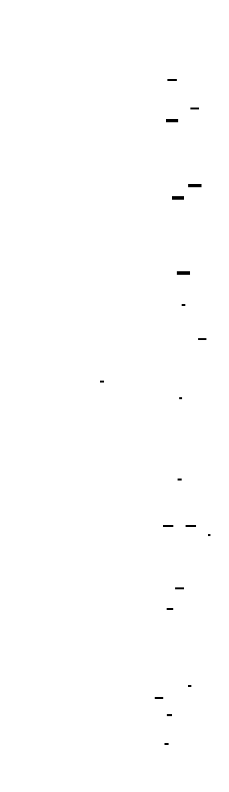

---
## 4. Interface Contracts
### 4.1 MaskedCrossEntropyLoss
```python
class MaskedCrossEntropyLoss(nn.Module):
    """
    Cross-entropy loss that ignores padding positions.
    Optionally applies label smoothing.
    """
    def __init__(
        self,
        pad_token_id: int,
        label_smoothing: float = 0.1
    ):
        """
        Initialize loss function.
        Pre-conditions:
            - pad_token_id >= 0
            - 0.0 <= label_smoothing < 1.0
        Post-conditions:
            - self.criterion is nn.CrossEntropyLoss with ignore_index set
            - Label smoothing is configured if epsilon > 0
        """
    def forward(
        self,
        logits: torch.Tensor,      # [batch, seq_len, vocab_size]
        targets: torch.Tensor      # [batch, seq_len]
    ) -> Tuple[torch.Tensor, int]:
        """
        Compute masked cross-entropy loss.
        Args:
            logits: Model output logits [batch, seq_len, vocab_size]
            targets: Target token indices [batch, seq_len]
        Pre-conditions:
            - logits.dim() == 3
            - targets.dim() == 2
            - logits.size(0) == targets.size(0)  # Same batch
            - logits.size(1) == targets.size(1)  # Same sequence length
            - targets values are in [0, vocab_size - 1]
        Post-conditions:
            - loss is a scalar tensor
            - loss >= 0
            - n_tokens is the count of non-padding positions
            - Padding positions contribute zero to loss
        Returns:
            loss: Scalar loss (mean over non-padding positions)
            n_tokens: Number of non-padding tokens processed
        Side effects:
            - None (pure function)
        Invariants:
            - Loss is normalized by number of non-padding tokens
            - Label smoothing is applied if configured
        """
```
### 4.2 TransformerLRScheduler
```python
class TransformerLRScheduler:
    """
    Learning rate scheduler from 'Attention Is All You Need'.
    Formula:
        lr = d_model^{-0.5} * min(step^{-0.5}, step * warmup_steps^{-1.5})
    During warmup: lr increases linearly from 0 to peak
    After warmup: lr decays proportionally to step^{-0.5}
    """
    def __init__(
        self,
        d_model: int,
        warmup_steps: int,
        lr_multiplier: float = 1.0
    ):
        """
        Initialize scheduler.
        Pre-conditions:
            - d_model > 0
            - warmup_steps > 0
            - lr_multiplier > 0
        Post-conditions:
            - self.step_count == 0
            - self.current_lr == 0 (no steps yet)
        """
    def step(self) -> float:
        """
        Advance step and return current learning rate.
        Post-conditions:
            - self.step_count is incremented by 1
            - Returns the learning rate for this step
        Returns:
            Current learning rate value
        """
    def get_lr(self) -> float:
        """
        Get current learning rate without advancing step.
        Returns:
            Current learning rate value
        """
```
### 4.3 Trainer
```python
class Trainer:
    """
    Training loop for encoder-decoder Transformer.
    """
    def __init__(
        self,
        model: EncoderDecoderTransformer,
        train_dataloader: DataLoader,
        val_dataloader: DataLoader,
        config: TrainingConfig
    ):
        """
        Initialize trainer.
        Pre-conditions:
            - model is a valid EncoderDecoderTransformer
            - dataloaders yield batches with 'src_tokens' and 'tgt_tokens'
            - config is valid TrainingConfig
        Post-conditions:
            - Model moved to config.device
            - Optimizer created with Transformer-specific settings
            - Scheduler created with warmup configuration
            - Loss function created with padding mask
        """
    def train(self) -> None:
        """
        Main training loop.
        Post-conditions:
            - Training runs for config.max_steps or until early stopping
            - Loss is logged every config.log_every steps
            - Validation runs every config.eval_every steps
            - Checkpoints saved every config.checkpoint_every steps
        Side effects:
            - Model parameters updated
            - Checkpoints written to disk
            - Metrics logged
        """
    def train_step(
        self,
        batch: Dict[str, torch.Tensor]
    ) -> Tuple[torch.Tensor, int]:
        """
        Single training step.
        Args:
            batch: Dictionary with 'src_tokens', 'tgt_tokens', and optional masks
        Pre-conditions:
            - batch contains valid token tensors
            - Model is in training mode
        Post-conditions:
            - Forward pass completed
            - Loss computed
            - Backward pass completed
            - Gradients clipped
            - Optimizer step taken
            - Gradients zeroed
        Returns:
            loss: Scalar loss for this step
            n_tokens: Number of tokens processed
        Side effects:
            - Model parameters updated (via optimizer)
            - Dropout is active (training mode)
        """
    @torch.no_grad()
    def evaluate(self) -> float:
        """
        Evaluate on validation set.
        Pre-conditions:
            - Model exists
            - val_dataloader is not empty
        Post-conditions:
            - Model returned to training mode
            - No gradients computed
            - Dropout is disabled (eval mode)
        Returns:
            Average validation loss over all batches
        """
    def save_checkpoint(self) -> None:
        """
        Save training checkpoint.
        Post-conditions:
            - Checkpoint file created in config.checkpoint_dir
            - Checkpoint contains: model state, optimizer state, step, metrics
        Side effects:
            - File written to disk
        """
```
### 4.4 CopyTaskDataset
```python
class CopyTaskDataset(torch.utils.data.Dataset):
    """
    Synthetic dataset for the copy task.
    Task: Given input sequence, output the same sequence.
    Tests encoder-decoder information flow without linguistic knowledge.
    """
    def __init__(
        self,
        n_samples: int,
        seq_len: int,
        vocab_size: int,
        sos_token: int = 1,
        eos_token: int = 2,
        pad_token: int = 0
    ):
        """
        Create copy task dataset.
        Pre-conditions:
            - n_samples > 0
            - seq_len > 0
            - vocab_size > 3 (reserve 0, 1, 2 for special tokens)
        Post-conditions:
            - n_samples sequences generated
            - All sequences use tokens in [3, vocab_size - 1]
        """
    def __len__(self) -> int:
        """Return number of samples."""
    def __getitem__(self, idx: int) -> Dict[str, torch.Tensor]:
        """
        Get a single sample.
        Args:
            idx: Sample index
        Returns:
            Dictionary with:
                - 'src_tokens': Source sequence [seq_len + 2] with SOS and EOS
                - 'tgt_tokens': Target sequence [seq_len + 2] (same as source)
        Invariants:
            - src_tokens == tgt_tokens (copy task)
            - Both start with SOS and end with EOS
        """
```


---
## 5. Algorithm Specification
### 5.1 Teacher Forcing with Target Shift
```
ALGORITHM: TeacherForcing
INPUT: tgt_tokens [B, T] (full target sequence with SOS and EOS)
OUTPUT: decoder_input [B, T-1], target_labels [B, T-1]
STEP 1: Extract decoder input (remove last token)
    decoder_input = tgt_tokens[:, :-1]
    # tgt_tokens: [B, T] -> decoder_input: [B, T-1]
    # Example: [SOS, A, B, C, EOS] -> [SOS, A, B, C]
STEP 2: Extract target labels (remove first token)
    target_labels = tgt_tokens[:, 1:]
    # tgt_tokens: [B, T] -> target_labels: [B, T-1]
    # Example: [SOS, A, B, C, EOS] -> [A, B, C, EOS]
INVARIANT: decoder_input[i] predicts target_labels[i]
    Position 0 of decoder sees SOS, predicts A
    Position 1 of decoder sees SOS, A, predicts B
    Position 2 of decoder sees SOS, A, B, predicts C
    Position 3 of decoder sees SOS, A, B, C, predicts EOS
CRITICAL: This shift is the foundation of autoregressive training.
          Without it, the model would predict current token from current token.
RETURN decoder_input, target_labels
```
### 5.2 Masked Cross-Entropy Loss
```
ALGORITHM: MaskedCrossEntropyLoss
INPUT: 
    logits [B, T, V] (model output)
    targets [B, T] (target token indices)
    pad_token_id (token ID to ignore)
    label_smoothing (epsilon for soft targets)
STEP 1: Reshape for cross-entropy
    logits_flat = logits.reshape(-1, V)  # [B*T, V]
    targets_flat = targets.reshape(-1)   # [B*T]
STEP 2: Compute per-token loss
    # nn.CrossEntropyLoss with ignore_index handles padding
    loss_per_token = CrossEntropyLoss(
        logits_flat, 
        targets_flat,
        ignore_index=pad_token_id,
        label_smoothing=label_smoothing
    )
    # loss_per_token: [B*T] (but padding positions have loss=0)
STEP 3: Create mask for non-padding positions
    non_pad_mask = (targets_flat != pad_token_id)
    # non_pad_mask: [B*T]
STEP 4: Count non-padding tokens
    n_tokens = non_pad_mask.sum()
STEP 5: Compute mean loss over non-padding positions
    # Note: CrossEntropyLoss with ignore_index already zeros padding loss
    # But we need to normalize by actual token count, not total positions
    loss = loss_per_token.sum() / n_tokens.clamp(min=1)
INVARIANT: Padding positions contribute zero to total loss
INVARIANT: Loss is normalized by number of actual tokens (not batch positions)
INVARIANT: Label smoothing produces softer targets (prevents overconfidence)
RETURN loss, n_tokens
```
### 5.3 Learning Rate Schedule
```
ALGORITHM: TransformerLRSchedule
INPUT: step, d_model, warmup_steps, lr_multiplier
STEP 1: Compute base scale factor
    base_scale = d_model^(-0.5)
    # For d_model=512: base_scale = 512^(-0.5) ≈ 0.044
STEP 2: Compute decay factor
    decay = step^(-0.5)
    # Decreases as step increases
    # Step 1: 1.0, Step 100: 0.1, Step 10000: 0.01
STEP 3: Compute warmup factor
    warmup = step * warmup_steps^(-1.5)
    # Increases linearly during warmup
    # warmup_steps=4000: warmup = step * 4000^(-1.5) ≈ step * 0.000004
STEP 4: Take minimum (warmup dominates early, decay dominates late)
    lr = base_scale * min(decay, warmup)
STEP 5: Apply multiplier
    lr = lr * lr_multiplier
BEHAVIOR:
    During warmup (step < warmup_steps):
        warmup < decay, so lr = base_scale * warmup
        lr increases linearly: lr ∝ step
    After warmup (step > warmup_steps):
        decay < warmup, so lr = base_scale * decay
        lr decreases: lr ∝ 1/sqrt(step)
    Peak learning rate occurs at step = warmup_steps:
        lr_peak = base_scale * warmup_steps^(-0.5)
        For d_model=512, warmup_steps=4000:
        lr_peak ≈ 0.044 * 0.016 ≈ 0.0007
RETURN lr
VISUALIZATION:
    LR
    ^
    |     /\
    |    /  \
    |   /    \_____
    |  /          \____
    | /                \___
    +-----------------------> Step
      0    warmup    max_steps
```
### 5.4 Cosine Decay Schedule (Alternative)
```
ALGORITHM: CosineDecaySchedule
INPUT: step, warmup_steps, total_steps, lr, min_lr
STEP 1: Check if in warmup phase
    IF step < warmup_steps:
        # Linear warmup
        lr_current = lr * (step / warmup_steps)
        RETURN lr_current
STEP 2: Compute decay progress
    progress = (step - warmup_steps) / (total_steps - warmup_steps)
    # progress: 0 at end of warmup, 1 at total_steps
STEP 3: Compute cosine factor
    cosine_factor = 0.5 * (1 + cos(π * progress))
    # cosine_factor: 1 at progress=0, 0 at progress=1
STEP 4: Interpolate between lr and min_lr
    lr_current = min_lr + (lr - min_lr) * cosine_factor
RETURN lr_current
```
### 5.5 Gradient Clipping
```
ALGORITHM: GradientClipping
INPUT: model parameters, max_norm
STEP 1: Compute total gradient norm
    total_norm = 0
    FOR each parameter p with gradient:
        param_norm = p.grad.norm(2)  # L2 norm
        total_norm += param_norm^2
    total_norm = sqrt(total_norm)
STEP 2: Compute clipping coefficient
    clip_coef = max_norm / (total_norm + 1e-6)
STEP 3: Apply clipping if needed
    IF clip_coef < 1:
        FOR each parameter p with gradient:
            p.grad *= clip_coef
        # Scales all gradients to make total_norm = max_norm
INVARIANT: After clipping, total_norm <= max_norm
INVARIANT: Gradient direction is preserved (only magnitude changes)
RETURN total_norm (before clipping)
RATIONALE:
    Without clipping: Large gradients can cause parameter updates that
    push the model into bad regions of loss landscape.
    With clipping: Updates are bounded, preventing destabilization.
```
### 5.6 Complete Training Step
```
ALGORITHM: TrainingStep
INPUT: model, optimizer, scheduler, criterion, batch, max_grad_norm
STEP 1: Get learning rate and update optimizer
    lr = scheduler.step()
    FOR param_group IN optimizer.param_groups:
        param_group['lr'] = lr
STEP 2: Zero gradients
    optimizer.zero_grad()
STEP 3: Prepare inputs with teacher forcing
    src_tokens = batch['src_tokens']
    tgt_tokens = batch['tgt_tokens']
    decoder_input = tgt_tokens[:, :-1]
    target_labels = tgt_tokens[:, 1:]
STEP 4: Create masks
    src_mask = create_padding_mask(src_tokens)
    tgt_mask = create_causal_mask(decoder_input.size(1))
STEP 5: Forward pass
    logits = model(src_tokens, decoder_input, src_mask, tgt_mask)
    # logits: [B, T-1, V]
STEP 6: Compute loss
    loss, n_tokens = criterion(logits, target_labels)
STEP 7: Backward pass
    loss.backward()
STEP 8: Gradient clipping
    grad_norm = clip_grad_norm_(model.parameters(), max_grad_norm)
STEP 9: Optimizer step
    optimizer.step()
INVARIANT: Gradients are computed for all parameters
INVARIANT: Learning rate follows schedule
INVARIANT: Loss ignores padding positions
RETURN loss, n_tokens, lr, grad_norm
```


### 5.7 Label Smoothing Mathematics
```
Label smoothing replaces hard targets with soft targets:
Hard target (one-hot):
    y_i = 1 if i == true_class, else 0
Smoothed target:
    y_i = (1 - ε) if i == true_class, else ε / (K - 1)
Where:
    ε = label_smoothing (typically 0.1)
    K = number of classes (vocab_size)
EXAMPLE (vocab_size=5, true_class=2, ε=0.1):
    Hard:    [0.00, 0.00, 1.00, 0.00, 0.00]
    Smooth:  [0.025, 0.025, 0.90, 0.025, 0.025]
EFFECTS:
    1. Prevents model from becoming overconfident (prob=1.0)
    2. Provides non-zero gradient even for correct predictions
    3. Acts as regularization (model can't memorize exact targets)
    4. Particularly important for language tasks with inherent uncertainty
IMPLEMENTATION:
    PyTorch's nn.CrossEntropyLoss(label_smoothing=ε) handles this automatically.
    Manual implementation would create soft targets before loss computation.
```
---
## 6. Error Handling Matrix
| Error | Detected By | Recovery | User-Visible? |
|-------|-------------|----------|---------------|
| **Wrong target shift direction** | Loss doesn't decrease, model predicts current token | Check: `decoder_input = tgt[:, :-1]`, `target = tgt[:, 1:]` | Yes - implementation bug |
| **Padding not masked in loss** | Model predicts padding tokens, loss doesn't decrease | Use `ignore_index=pad_token_id` in CrossEntropyLoss | Yes - implementation bug |
| **No learning rate warmup** | Loss explodes or NaN in first 100 steps | Ensure warmup_steps > 0, check scheduler output | Yes - training failure |
| **Learning rate too high** | Loss oscillates or diverges | Reduce lr by 10×, ensure warmup | Yes - training failure |
| **No gradient clipping** | Gradient norm spikes to 1000+, NaN appears | Add `clip_grad_norm_(model.parameters(), 1.0)` | Yes - training failure |
| **Label smoothing too high** | Model underconfident, poor accuracy | Use ε=0.1 or lower | Yes - config error |
| **Adam betas wrong** | Slower convergence than expected | Use `betas=(0.9, 0.98)` not default (0.9, 0.999) | Yes - config warning |
| **Dropout in eval mode** | Non-deterministic validation loss | Call `model.eval()` before validation | Yes - usage error |
| **Causal mask wrong shape** | RuntimeError in attention | Regenerate mask for decoder input length | Yes - debug message |
| **Batch size 0** | Shape error in loss computation | Check dataloader, handle empty batch | Yes - data error |
| **NaN in loss** | Training divergence | Check for very large logits, gradient explosion | Yes - training failure |
| **Memory OOM** | CUDA out of memory | Reduce batch size or sequence length | Yes - resource limit |
### Error Recovery Implementation
```python
class TrainingError(Exception):
    """Base exception for training errors."""
    pass
class LossDivergenceError(TrainingError):
    """Raised when loss becomes NaN or Inf."""
    def __init__(self, step: int, loss_value: float):
        self.step = step
        self.loss_value = loss_value
        super().__init__(
            f"Loss diverged at step {step}: loss={loss_value}. "
            f"Check learning rate, gradient clipping, and data quality."
        )
class GradientExplosionError(TrainingError):
    """Raised when gradient norm exceeds threshold."""
    def __init__(self, step: int, grad_norm: float, threshold: float):
        self.step = step
        self.grad_norm = grad_norm
        self.threshold = threshold
        super().__init__(
            f"Gradient explosion at step {step}: norm={grad_norm:.2f} > {threshold}. "
            f"Reduce learning rate or increase gradient clipping."
        )
def check_training_health(
    step: int,
    loss: float,
    grad_norm: float,
    max_grad_norm: float = 100.0  # Higher than clipping threshold
) -> None:
    """
    Check for training health issues.
    Raises:
        LossDivergenceError: If loss is NaN or Inf
        GradientExplosionError: If gradient norm is extremely high
    """
    if math.isnan(loss) or math.isinf(loss):
        raise LossDivergenceError(step, loss)
    if grad_norm > max_grad_norm:
        raise GradientExplosionError(step, grad_norm, max_grad_norm)
```
---
## 7. Implementation Sequence with Checkpoints
### Phase 1: Wire Complete EncoderDecoderTransformer (1 hour)
**Files to verify**: `transformer/model/transformer.py`
**Tasks**:
1. Verify EncoderDecoderTransformer from m4 is complete
2. Add `tie_weights` option for output projection
3. Verify `encode()` and `decode()` methods work correctly
4. Test forward pass with sample inputs
**Checkpoint**: After this phase, you should be able to:
```python
from transformer.model.transformer import EncoderDecoderTransformer
model = EncoderDecoderTransformer(
    src_vocab_size=1000,
    tgt_vocab_size=1000,
    d_model=256,
    num_heads=4,
    num_layers=2,
    d_ff=1024
)
src = torch.randint(0, 1000, (4, 16))
tgt = torch.randint(0, 1000, (4, 12))
logits = model(src, tgt)
assert logits.shape == (4, 12, 1000), f"Wrong shape: {logits.shape}"
# Test encode/decode
enc_out = model.encode(src)
assert enc_out.shape == (4, 16, 256)
dec_logits = model.decode(tgt, enc_out)
assert dec_logits.shape == (4, 12, 1000)
print("✓ Complete transformer forward pass works")
```
Run: `pytest tests/test_transformer.py::test_transformer_forward -v`
---
### Phase 2: Implement Output Projection with Weight Tying (0.5-1 hour)
**Files to modify**: `transformer/model/transformer.py`
**Tasks**:
1. Add `tie_weights` parameter to `EncoderDecoderTransformer.__init__()`
2. If `tie_weights=True`, share weights between target embedding and output projection
3. Document the trade-offs of weight tying
**Checkpoint**: After this phase, you should be able to:
```python
# Test with weight tying
model_tied = EncoderDecoderTransformer(
    src_vocab_size=100,
    tgt_vocab_size=100,
    d_model=64,
    tie_weights=True
)
# Verify weights are shared
assert model_tied.output_projection.weight is model_tied.tgt_embedding.token_embedding.embedding.weight
print("✓ Weight tying works correctly")
# Test without weight tying
model_untied = EncoderDecoderTransformer(
    src_vocab_size=100,
    tgt_vocab_size=100,
    d_model=64,
    tie_weights=False
)
# Verify weights are separate
assert model_untied.output_projection.weight is not model_untied.tgt_embedding.token_embedding.embedding.weight
print("✓ Separate weights work correctly")
```
---
### Phase 3: Implement Teacher Forcing with Target Shift (1 hour)
**Files to create**: `transformer/training/trainer.py` (partial)
**Tasks**:
1. Implement `prepare_decoder_input_target()` function
2. Verify shift is in correct direction
3. Add tests for shift correctness
**Checkpoint**: After this phase, you should be able to:
```python
def prepare_decoder_input_target(tgt_tokens, sos_token_id=1, eos_token_id=2):
    """
    Prepare decoder input and target for teacher forcing.
    """
    decoder_input = tgt_tokens[:, :-1]
    target = tgt_tokens[:, 1:]
    return decoder_input, target
# Test
tgt = torch.tensor([
    [1, 5, 3, 7, 2],  # SOS, A, B, C, EOS
    [1, 9, 4, 2, 0]   # SOS, X, Y, EOS, PAD
])
dec_in, tgt_out = prepare_decoder_input_target(tgt)
# Expected decoder input: [SOS, A, B, C], [SOS, X, Y, EOS]
assert torch.equal(dec_in[0], torch.tensor([1, 5, 3, 7]))
assert torch.equal(dec_in[1], torch.tensor([1, 9, 4, 2]))
# Expected target: [A, B, C, EOS], [X, Y, EOS, PAD]
assert torch.equal(tgt_out[0], torch.tensor([5, 3, 7, 2]))
assert torch.equal(tgt_out[1], torch.tensor([9, 4, 2, 0]))
print("✓ Teacher forcing shift is correct")
```


---
### Phase 4: Implement Masked Cross-Entropy Loss (1 hour)
**Files to create**: `transformer/training/loss.py`
**Tasks**:
1. Implement `MaskedCrossEntropyLoss` class
2. Use `nn.CrossEntropyLoss` with `ignore_index` for padding
3. Add label smoothing support
4. Return loss and token count for proper logging
**Checkpoint**: After this phase, you should be able to:
```python
from transformer.training.loss import MaskedCrossEntropyLoss
criterion = MaskedCrossEntropyLoss(pad_token_id=0, label_smoothing=0.1)
# Test with padding
logits = torch.randn(2, 4, 100)  # [batch=2, seq=4, vocab=100]
targets = torch.tensor([
    [5, 3, 7, 2],   # No padding
    [9, 4, 0, 0]    # Two padding tokens
])
loss, n_tokens = criterion(logits, targets)
# Token count should exclude padding
assert n_tokens == 6, f"Expected 6 tokens, got {n_tokens}"  # 4 + 2
# Loss should be positive and finite
assert loss > 0, "Loss should be positive"
assert not torch.isnan(loss), "Loss should not be NaN"
print(f"✓ Masked loss works: loss={loss.item():.4f}, tokens={n_tokens}")
```
Run: `pytest tests/test_loss.py -v`
---
### Phase 5: Implement Learning Rate Schedule (1-1.5 hours)
**Files to create**: `transformer/training/scheduler.py`
**Tasks**:
1. Implement `TransformerLRScheduler` with warmup + inverse sqrt decay
2. Implement `CosineLRScheduler` as alternative
3. Add visualization/debugging output for schedule
4. Test schedule at various steps
**Checkpoint**: After this phase, you should be able to:
```python
from transformer.training.scheduler import TransformerLRScheduler
scheduler = TransformerLRScheduler(
    d_model=512,
    warmup_steps=4000,
    lr_multiplier=0.0001 * math.sqrt(512)  # Scale to match paper
)
# Test warmup phase
lr_warmup_start = scheduler.get_lr()  # Should be ~0
scheduler.step_count = 100
lr_warmup_mid = scheduler.get_lr()
scheduler.step_count = 4000
lr_warmup_end = scheduler.get_lr()  # Peak LR
# Test decay phase
scheduler.step_count = 10000
lr_decay = scheduler.get_lr()  # Should be lower than peak
print(f"LR at step 0: {lr_warmup_start:.2e}")
print(f"LR at step 100: {lr_warmup_mid:.2e}")
print(f"LR at step 4000 (peak): {lr_warmup_end:.2e}")
print(f"LR at step 10000: {lr_decay:.2e}")
assert lr_warmup_mid > lr_warmup_start, "LR should increase during warmup"
assert lr_decay < lr_warmup_end, "LR should decay after warmup"
print("✓ LR schedule works correctly")
```
Run: `pytest tests/test_scheduler.py -v`

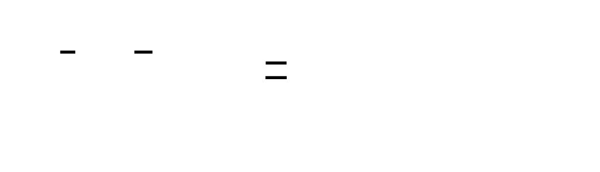

---
### Phase 6: Add Gradient Clipping (0.5 hour)
**Files to modify**: `transformer/training/trainer.py`
**Tasks**:
1. Add gradient clipping after backward pass
2. Log gradient norm for debugging
3. Use `torch.nn.utils.clip_grad_norm_`
**Checkpoint**: After this phase, you should be able to:
```python
model = EncoderDecoderTransformer(
    src_vocab_size=100, tgt_vocab_size=100, d_model=64, num_heads=2, num_layers=1
)
optimizer = torch.optim.Adam(model.parameters(), lr=0.001)
# Create large gradients
src = torch.randint(0, 100, (2, 8))
tgt = torch.randint(0, 100, (2, 6))
logits = model(src, tgt)
loss = logits.sum() * 1000  # Artificially large loss
loss.backward()
# Check gradient norm before clipping
total_norm_before = 0
for p in model.parameters():
    if p.grad is not None:
        total_norm_before += p.grad.norm().item() ** 2
total_norm_before = math.sqrt(total_norm_before)
# Clip gradients
max_norm = 1.0
total_norm = torch.nn.utils.clip_grad_norm_(model.parameters(), max_norm)
# Check gradient norm after clipping
total_norm_after = 0
for p in model.parameters():
    if p.grad is not None:
        total_norm_after += p.grad.norm().item() ** 2
total_norm_after = math.sqrt(total_norm_after)
print(f"Gradient norm before clipping: {total_norm_before:.2f}")
print(f"Gradient norm after clipping: {total_norm_after:.2f}")
assert total_norm_after <= max_norm + 1e-5, "Gradient norm should be <= max_norm"
print("✓ Gradient clipping works correctly")
```
---
### Phase 7: Implement Label Smoothing (0.5-1 hour)
**Files to verify**: `transformer/training/loss.py`
**Tasks**:
1. Verify PyTorch's `label_smoothing` parameter works correctly
2. Test that smoothed targets prevent overconfidence
3. Document the effect of label smoothing
**Checkpoint**: After this phase, you should be able to:
```python
# Test label smoothing effect
criterion_no_smooth = MaskedCrossEntropyLoss(pad_token_id=0, label_smoothing=0.0)
criterion_smooth = MaskedCrossEntropyLoss(pad_token_id=0, label_smoothing=0.1)
# Create perfect predictions (high confidence)
logits = torch.zeros(1, 1, 5)
logits[0, 0, 2] = 10.0  # Very confident in class 2
targets = torch.tensor([[2]])
loss_no_smooth, _ = criterion_no_smooth(logits, targets)
loss_smooth, _ = criterion_smooth(logits, targets)
# Label smoothing should penalize overconfidence
print(f"Loss without smoothing: {loss_no_smooth.item():.4f}")
print(f"Loss with smoothing: {loss_smooth.item():.4f}")
assert loss_smooth > loss_no_smooth, "Label smoothing should increase loss for overconfident predictions"
print("✓ Label smoothing works correctly")
```
---
### Phase 8: Create Copy Task Dataset and Training Loop (1.5-2 hours)
**Files to create**: `transformer/training/copy_task.py`, `transformer/training/trainer.py` (complete)
**Tasks**:
1. Implement `CopyTaskDataset`
2. Implement `collate_fn` for padding
3. Implement complete `Trainer` class with training loop
4. Add logging for loss, LR, and gradient norm
5. Add checkpoint saving
**Checkpoint**: After this phase, you should be able to:
```python
from transformer.training.copy_task import CopyTaskDataset
from torch.utils.data import DataLoader
# Create dataset
dataset = CopyTaskDataset(
    n_samples=100,
    seq_len=8,
    vocab_size=20
)
# Create dataloader
def collate_fn(batch):
    src_tokens = torch.nn.utils.rnn.pad_sequence(
        [item['src_tokens'] for item in batch],
        batch_first=True,
        padding_value=0
    )
    tgt_tokens = torch.nn.utils.rnn.pad_sequence(
        [item['tgt_tokens'] for item in batch],
        batch_first=True,
        padding_value=0
    )
    return {'src_tokens': src_tokens, 'tgt_tokens': tgt_tokens}
dataloader = DataLoader(dataset, batch_size=16, shuffle=True, collate_fn=collate_fn)
# Test batch
batch = next(iter(dataloader))
assert 'src_tokens' in batch
assert 'tgt_tokens' in batch
assert batch['src_tokens'].shape == batch['tgt_tokens'].shape
print(f"✓ Copy task dataset works: batch shape {batch['src_tokens'].shape}")
# Test that source == target (copy task)
# After removing SOS/EOS, content should be identical
src_content = batch['src_tokens'][:, 1:-1]  # Remove SOS/EOS
tgt_content = batch['tgt_tokens'][:, 1:-1]
assert torch.equal(src_content, tgt_content), "Copy task: source should equal target"
print("✓ Copy task verification: source equals target")
```

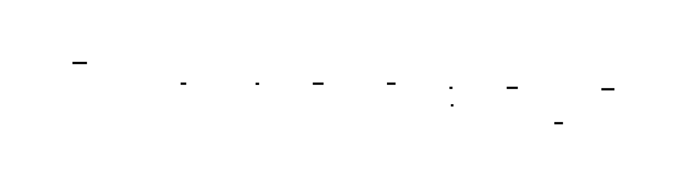

---
### Phase 9: Train and Verify Convergence (1-2 hours)
**Files to create**: `train_copy_task.py` (script), `tests/test_copy_task.py`
**Tasks**:
1. Create training script for copy task
2. Run training for 1000-2000 steps
3. Verify loss decreases below 0.1
4. Test generation on held-out samples
**Checkpoint**: After this phase, training should converge:
```python
# This is the final verification - run actual training
from transformer.training.trainer import Trainer
from transformer.training.copy_task import CopyTaskDataset
from transformer.model.transformer import EncoderDecoderTransformer
# Create small model for testing
config = TrainingConfig(
    src_vocab_size=20,
    tgt_vocab_size=20,
    d_model=128,
    num_heads=4,
    num_layers=2,
    d_ff=512,
    dropout=0.1,
    batch_size=32,
    max_steps=2000,
    warmup_steps=200,
    learning_rate=0.0005,
    label_smoothing=0.1,
    log_every=100
)
model = EncoderDecoderTransformer(
    src_vocab_size=config.src_vocab_size,
    tgt_vocab_size=config.tgt_vocab_size,
    d_model=config.d_model,
    num_heads=config.num_heads,
    num_layers=config.num_layers,
    d_ff=config.d_ff,
    dropout=config.dropout
)
train_dataset = CopyTaskDataset(n_samples=500, seq_len=8, vocab_size=20)
val_dataset = CopyTaskDataset(n_samples=50, seq_len=8, vocab_size=20)
trainer = Trainer(model, train_dataloader, val_dataloader, config)
trainer.train()
# Verify final loss
final_loss = trainer.train_losses[-1]
print(f"Final training loss: {final_loss:.4f}")
assert final_loss < 0.1, f"Loss {final_loss:.4f} did not converge below 0.1"
print("✓ Copy task converged successfully!")
```


---
## 8. Test Specification
### 8.1 Test: Teacher Forcing Shift
```python
def test_teacher_forcing_shift():
    """Verify correct target shift for teacher forcing."""
    tgt = torch.tensor([
        [1, 5, 3, 7, 2],   # SOS, A, B, C, EOS
        [1, 9, 4, 2, 0],   # SOS, X, Y, EOS, PAD
    ])
    dec_in = tgt[:, :-1]
    target = tgt[:, 1:]
    # Decoder input should end before EOS/PAD
    assert dec_in[0, -1].item() == 7, "First sample should end with C (not EOS)"
    assert dec_in[1, -1].item() == 2, "Second sample should end with EOS"
    # Target should start after SOS
    assert target[0, 0].item() == 5, "First target should be A"
    assert target[1, 0].item() == 9, "Second target should be X"
    # Target should include EOS
    assert target[0, -1].item() == 2, "First target should end with EOS"
    print("✓ Teacher forcing shift is correct")
```
### 8.2 Test: Masked Loss
```python
def test_masked_loss():
    """Verify padding positions are ignored in loss."""
    criterion = MaskedCrossEntropyLoss(pad_token_id=0, label_smoothing=0.0)
    # Create logits where padding tokens would have wrong prediction
    logits = torch.zeros(2, 4, 10)
    logits[0, 0, 5] = 10.0  # Correct for position 0
    logits[0, 1, 3] = 10.0  # Correct for position 1
    logits[0, 2, 7] = 10.0  # Correct for position 2
    logits[0, 3, 2] = 10.0  # Correct for position 3 (EOS)
    # Second sample: positions 2, 3 are padding
    logits[1, 0, 9] = 10.0  # Correct
    logits[1, 1, 4] = 10.0  # Correct
    logits[1, 2, 0] = -10.0  # Wrong (but it's padding)
    logits[1, 3, 0] = -10.0  # Wrong (but it's padding)
    targets = torch.tensor([
        [5, 3, 7, 2],  # All correct predictions
        [9, 4, 0, 0],  # First two correct, last two padding
    ])
    loss, n_tokens = criterion(logits, targets)
    # Token count should be 6 (4 + 2, excluding padding)
    assert n_tokens == 6, f"Expected 6 tokens, got {n_tokens}"
    # Loss should be near zero (all non-padding predictions correct)
    assert loss < 0.01, f"Loss should be near zero for correct predictions, got {loss}"
    print("✓ Masked loss correctly ignores padding")
```
### 8.3 Test: Learning Rate Schedule
```python
def test_lr_schedule():
    """Verify learning rate schedule follows expected pattern."""
    scheduler = TransformerLRScheduler(d_model=512, warmup_steps=1000, lr_multiplier=1.0)
    # Test warmup phase (should increase)
    lrs = []
    for step in [1, 100, 500, 1000]:
        scheduler.step_count = step
        lrs.append(scheduler.get_lr())
    # LR should increase during warmup
    for i in range(1, len(lrs)):
        assert lrs[i] > lrs[i-1], f"LR should increase during warmup: {lrs}"
    # Test decay phase (should decrease)
    scheduler.step_count = 2000
    lr_after_warmup = scheduler.get_lr()
    assert lr_after_warmup < lrs[-1], "LR should decay after warmup"
    scheduler.step_count = 10000
    lr_later = scheduler.get_lr()
    assert lr_later < lr_after_warmup, "LR should continue decaying"
    print("✓ LR schedule follows expected pattern")
```
### 8.4 Test: Gradient Clipping
```python
def test_gradient_clipping():
    """Verify gradient clipping bounds gradient norm."""
    model = nn.Linear(10, 10)
    # Create large gradients
    x = torch.randn(1, 10)
    y = model(x)
    loss = (y ** 2).sum() * 1000
    loss.backward()
    # Get pre-clipping norm
    pre_norm = 0
    for p in model.parameters():
        if p.grad is not None:
            pre_norm += p.grad.norm().item() ** 2
    pre_norm = math.sqrt(pre_norm)
    # Clip
    max_norm = 1.0
    torch.nn.utils.clip_grad_norm_(model.parameters(), max_norm)
    # Get post-clipping norm
    post_norm = 0
    for p in model.parameters():
        if p.grad is not None:
            post_norm += p.grad.norm().item() ** 2
    post_norm = math.sqrt(post_norm)
    assert post_norm <= max_norm + 1e-5, f"Post-clipping norm {post_norm} exceeds {max_norm}"
    print(f"✓ Gradient clipping: {pre_norm:.2f} -> {post_norm:.2f}")
```
### 8.5 Test: Label Smoothing Effect
```python
def test_label_smoothing_effect():
    """Verify label smoothing affects loss for confident predictions."""
    criterion_no_smooth = MaskedCrossEntropyLoss(pad_token_id=0, label_smoothing=0.0)
    criterion_smooth = MaskedCrossEntropyLoss(pad_token_id=0, label_smoothing=0.1)
    # Perfect prediction (very confident)
    logits = torch.zeros(1, 1, 5)
    logits[0, 0, 2] = 10.0
    targets = torch.tensor([[2]])
    loss_no_smooth, _ = criterion_no_smooth(logits, targets)
    loss_smooth, _ = criterion_smooth(logits, targets)
    # Label smoothing should penalize overconfidence
    assert loss_smooth > loss_no_smooth, \
        f"Label smoothing should increase loss: {loss_no_smooth:.4f} vs {loss_smooth:.4f}"
    print(f"✓ Label smoothing effect: {loss_no_smooth:.4f} -> {loss_smooth:.4f}")
```
### 8.6 Test: Copy Task Convergence
```python
def test_copy_task_convergence():
    """Verify model can learn copy task."""
    # Create small model
    model = EncoderDecoderTransformer(
        src_vocab_size=20,
        tgt_vocab_size=20,
        d_model=64,
        num_heads=2,
        num_layers=1,
        d_ff=256,
        dropout=0.0
    )
    # Create dataset
    dataset = CopyTaskDataset(n_samples=100, seq_len=5, vocab_size=20)
    dataloader = DataLoader(dataset, batch_size=16, shuffle=True, 
                           collate_fn=lambda b: {
                               'src_tokens': torch.nn.utils.rnn.pad_sequence(
                                   [x['src_tokens'] for x in b], batch_first=True, padding_value=0),
                               'tgt_tokens': torch.nn.utils.rnn.pad_sequence(
                                   [x['tgt_tokens'] for x in b], batch_first=True, padding_value=0)
                           })
    # Setup training
    optimizer = torch.optim.Adam(model.parameters(), lr=0.001)
    criterion = MaskedCrossEntropyLoss(pad_token_id=0, label_smoothing=0.0)
    # Train for 500 steps
    model.train()
    losses = []
    step = 0
    while step < 500:
        for batch in dataloader:
            if step >= 500:
                break
            optimizer.zero_grad()
            src = batch['src_tokens']
            tgt = batch['tgt_tokens']
            dec_in = tgt[:, :-1]
            target = tgt[:, 1:]
            logits = model(src, dec_in)
            loss, _ = criterion(logits, target)
            loss.backward()
            torch.nn.utils.clip_grad_norm_(model.parameters(), 1.0)
            optimizer.step()
            losses.append(loss.item())
            step += 1
    # Check convergence
    final_loss = losses[-1]
    print(f"Final loss after 500 steps: {final_loss:.4f}")
    # Should be below 0.5 for this simple task
    assert final_loss < 0.5, f"Loss did not converge: {final_loss:.4f}"
    print("✓ Copy task converges successfully")
```

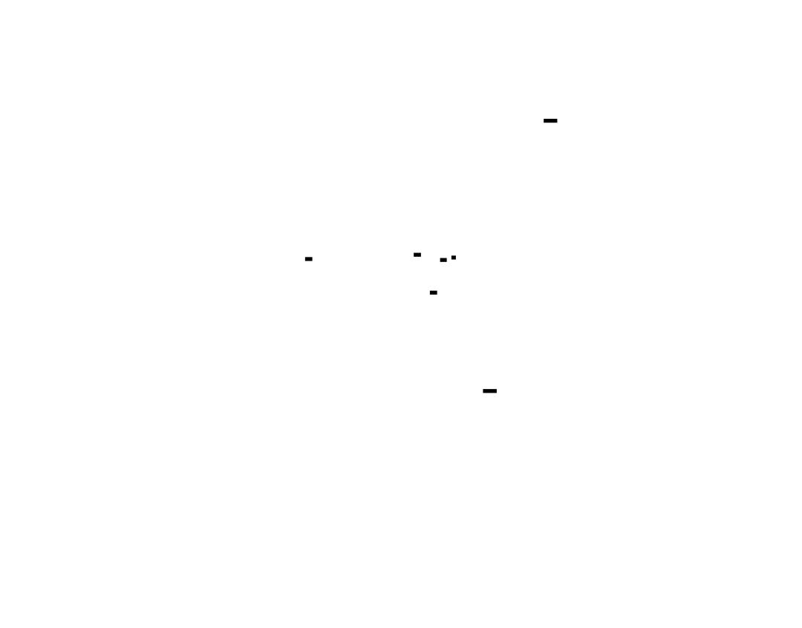

---
## 9. Performance Targets
| Operation | Target | Measurement Method |
|-----------|--------|-------------------|
| Training step (batch=32, seq=64, d_model=256) | < 200ms | Time forward + backward + optimizer |
| Copy task loss below 0.1 | < 1000 steps | Monitor training loss |
| Training throughput | > 5 steps/second | Steps / elapsed time |
| Gradient norm after warmup | < 10 | Log `grad_norm` after clipping |
| Memory usage (batch=32, seq=64) | < 4GB | `torch.cuda.max_memory_allocated()` |
| No NaN loss during training | 0 occurrences | Check loss at each step |
### Benchmarking Code
```python
def benchmark_training():
    """Benchmark training performance."""
    import time
    device = 'cuda' if torch.cuda.is_available() else 'cpu'
    # Create model
    model = EncoderDecoderTransformer(
        src_vocab_size=1000,
        tgt_vocab_size=1000,
        d_model=256,
        num_heads=4,
        num_layers=2,
        d_ff=1024
    ).to(device)
    # Setup training components
    optimizer = torch.optim.Adam(model.parameters(), lr=0.001, betas=(0.9, 0.98))
    criterion = MaskedCrossEntropyLoss(pad_token_id=0, label_smoothing=0.1)
    scheduler = TransformerLRScheduler(d_model=256, warmup_steps=100)
    # Create dummy data
    batch_size = 32
    src_len = 64
    tgt_len = 64
    # Warmup
    model.train()
    for _ in range(10):
        src = torch.randint(0, 1000, (batch_size, src_len), device=device)
        tgt = torch.randint(0, 1000, (batch_size, tgt_len), device=device)
        dec_in = tgt[:, :-1]
        target = tgt[:, 1:]
        optimizer.zero_grad()
        logits = model(src, dec_in)
        loss, _ = criterion(logits, target)
        loss.backward()
        optimizer.step()
    # Benchmark
    if device == 'cuda':
        torch.cuda.synchronize()
    start = time.perf_counter()
    n_steps = 100
    for _ in range(n_steps):
        src = torch.randint(0, 1000, (batch_size, src_len), device=device)
        tgt = torch.randint(0, 1000, (batch_size, tgt_len), device=device)
        dec_in = tgt[:, :-1]
        target = tgt[:, 1:]
        lr = scheduler.step()
        for pg in optimizer.param_groups:
            pg['lr'] = lr
        optimizer.zero_grad()
        logits = model(src, dec_in)
        loss, _ = criterion(logits, target)
        loss.backward()
        torch.nn.utils.clip_grad_norm_(model.parameters(), 1.0)
        optimizer.step()
    if device == 'cuda':
        torch.cuda.synchronize()
    end = time.perf_counter()
    avg_time_ms = (end - start) / n_steps * 1000
    throughput = n_steps / (end - start)
    print(f"Average step time: {avg_time_ms:.2f}ms")
    print(f"Throughput: {throughput:.1f} steps/second")
    assert avg_time_ms < 200, f"Too slow: {avg_time_ms:.2f}ms > 200ms"
    assert throughput > 5, f"Throughput too low: {throughput:.1f} < 5 steps/s"
    return avg_time_ms, throughput
```
---
## 10. Numerical Analysis
### 10.1 Teacher Forcing Gradient Flow
```
Forward pass with teacher forcing:
    src_tokens [B, Se] -> encoder -> encoder_output [B, Se, D]
    decoder_input [B, T-1] -> decoder(encoder_output) -> logits [B, T-1, V]
    Position i in decoder_input predicts position i in target.
Backward pass:
    ∂L/∂logits [B, T-1, V]
    ∂L/∂decoder_output [B, T-1, D]
    ∂L/∂encoder_output [B, Se, D] (via cross-attention)
    ∂L/∂src_embedding (via encoder)
    ∂L/∂tgt_embedding (via decoder)
CRITICAL: Each position receives independent gradients.
          No sequential dependency in backward pass.
          This is why teacher forcing is fast.
```
### 10.2 Learning Rate Schedule Mathematics
```
Original Transformer LR schedule:
    lr = d_model^{-0.5} * min(step^{-0.5}, step * warmup^{-1.5})
At warmup step w:
    warmup_factor = w * warmup^{-1.5}
    decay_factor = w^{-0.5}
At peak (step = warmup):
    warmup_factor = warmup * warmup^{-1.5} = warmup^{-0.5}
    decay_factor = warmup^{-0.5}
    Both equal, so lr = d_model^{-0.5} * warmup^{-0.5}
For d_model=512, warmup=4000:
    lr_peak = 512^{-0.5} * 4000^{-0.5}
            = 0.044 * 0.016
            ≈ 0.0007
With lr_multiplier to achieve specific peak LR:
    lr_multiplier = desired_peak_lr / 0.0007
    For lr_peak = 0.0001: multiplier = 0.0001 / 0.0007 ≈ 0.14
```
### 10.3 Gradient Clipping Effect
```
Without clipping:
    Large gradient g can cause update: θ_new = θ - lr * g
    If ||g|| = 1000 and lr = 0.001: update magnitude = 1.0
    This can push parameters far from current region.
With clipping (max_norm = 1.0):
    If ||g|| = 1000: scaled_g = g * (1.0 / 1000) = g / 1000
    Update magnitude = lr * 1.0 = 0.001
    Parameters stay close to current region.
Trade-off:
    - Clipping prevents explosion but may slow convergence
    - For stable training, clipping is essential
    - max_norm=1.0 is standard for transformers
```
### 10.4 Label Smoothing Loss Effect
```
Cross-entropy loss with label smoothing:
    L = -Σ y_i * log(p_i)
Without smoothing (y_i = 1 for correct class):
    L = -log(p_correct)
    Minimized when p_correct -> 1.0
With smoothing (y_i = 0.9 for correct, 0.025 for others with K=5):
    L = -0.9 * log(p_correct) - 0.025 * Σ log(p_other)
    Minimized when p_correct -> 0.9, p_other -> 0.025
Effect on gradients:
    At p_correct = 1.0: gradient = 0 (saturated)
    At p_correct = 0.9: gradient > 0 (still learning)
This prevents the model from becoming "stuck" at overconfident predictions.
```
---
## 11. Gradient/Numerical Analysis (AI/ML Specific)
### 11.1 Complete Training Step Shape Trace
```
=== FORWARD PASS ===
src_tokens:         [B, Se]       indices
tgt_tokens:         [B, Tg]       indices
    ↓ teacher forcing shift
decoder_input:      [B, Tg-1]     indices
target_labels:      [B, Tg-1]     indices
    ↓ src_embedding
src_emb:            [B, Se, D]    requires_grad=True
    ↓ encoder
encoder_output:     [B, Se, D]    requires_grad=True
    ↓ tgt_embedding
tgt_emb:            [B, Tg-1, D]  requires_grad=True
    ↓ decoder
decoder_output:     [B, Tg-1, D]  requires_grad=True
    ↓ output_projection
logits:             [B, Tg-1, V]  requires_grad=True
    ↓ reshape for loss
logits_flat:        [B*(Tg-1), V]
targets_flat:       [B*(Tg-1)]
    ↓ cross_entropy (with ignore_index)
loss_per_token:     [B*(Tg-1)]    (0 for padding)
    ↓ sum and normalize
loss:               scalar        requires_grad=True
=== BACKWARD PASS ===
∂L/∂loss:           1.0
    ↓ through normalization
∂L/∂loss_per_token: 1/n_tokens (uniform)
    ↓ through cross_entropy
∂L/∂logits_flat:    [B*(Tg-1), V]  (softmax gradient)
    ↓ reshape back
∂L/∂logits:         [B, Tg-1, V]
    ↓ through output_projection
∂L/∂decoder_output: [B, Tg-1, D]
    ↓ through decoder layers (reverse)
For each decoder layer:
    ∂L/∂x from FFN
    ∂L/∂x from cross-attention
        ∂L/∂encoder_output (contributes to encoder gradient)
    ∂L/∂x from self-attention
∂L/∂tgt_emb:        [B, Tg-1, D]
    ↓ through encoder layers (reverse)
∂L/∂encoder_output: [B, Se, D] (accumulated from all decoder layers)
For each encoder layer:
    ∂L/∂x from FFN
    ∂L/∂x from self-attention
∂L/∂src_emb:        [B, Se, D]
=== GRADIENT ACCUMULATION ===
All parameters receive gradients from:
    - Encoder path (via cross-attention)
    - Decoder path (via self-attention and FFN)
    - Output projection (directly from loss)
=== GRADIENT CLIPPING ===
Before clipping:
    total_norm = sqrt(Σ ||∂L/∂θ_i||²)
After clipping (if total_norm > max_norm):
    ∂L/∂θ_i *= max_norm / total_norm
```
### 11.2 Memory Budget Analysis
```
For d_model=256, num_layers=2, batch=32, seq=64, vocab=20:
Model Parameters:
    Embeddings: 2 * 20 * 256 = 10.2K
    Encoder (2 layers): 2 * 3 * 256² ≈ 393K
    Decoder (2 layers): 2 * 4 * 256² ≈ 524K
    Output projection: 256 * 20 = 5.1K
    Total: ~932K parameters = 3.7 MB
Forward Activations:
    Source embeddings: 32 * 64 * 256 * 4 = 2.1 MB
    Encoder activations: 2 * 32 * 64 * 256 * 10 * 4 = 50 MB
    Target embeddings: 32 * 63 * 256 * 4 = 2.0 MB
    Decoder activations: 2 * 32 * 63 * 256 * 15 * 4 = 75 MB
    Logits: 32 * 63 * 20 * 4 = 0.16 MB
    Total: ~130 MB
Backward Gradients:
    Same as parameters: 3.7 MB
    Gradient buffers: ~130 MB
Optimizer State (Adam):
    2 * parameters (momentum + variance) = 7.4 MB
Total Memory: ~280 MB for this configuration
```
### 11.3 Numerical Stability Checklist
| Operation | Stability Concern | Mitigation |
|-----------|------------------|------------|
| Softmax in attention | Large logits → overflow | Scale by sqrt(d_k) |
| Cross-entropy loss | log(0) → -inf | PyTorch handles internally |
| Label smoothing | Division by K-1 | Check K > 1 |
| Learning rate schedule | Division by step=0 | Clamp step to min 1 |
| Gradient clipping | Division by 0 norm | Add epsilon to norm |
| Adam optimizer | Division by 0 variance | epsilon=1e-9 |
| Loss normalization | Division by 0 tokens | Clamp n_tokens to min 1 |
---
## 12. Common Pitfalls and Solutions
| Pitfall | Symptom | Solution |
|---------|---------|----------|
| **Wrong target shift direction** | Model predicts current token, loss doesn't decrease | Ensure `decoder_input = tgt[:, :-1]`, `target = tgt[:, 1:]` |
| **Padding not masked** | Model predicts padding, loss high | Use `ignore_index=pad_token_id` in CrossEntropyLoss |
| **No warmup** | Loss explodes or NaN early | Add warmup_steps > 0, check LR increases initially |
| **Wrong Adam betas** | Slow convergence | Use `betas=(0.9, 0.98)` not default (0.9, 0.999) |
| **No gradient clipping** | Gradient norm spikes, NaN appears | Add `clip_grad_norm_(model.parameters(), 1.0)` |
| **Label smoothing too high** | Model underconfident | Use ε=0.1 or lower |
| **Dropout in eval** | Validation loss varies | Call `model.eval()` before validation |
| **Learning rate too high** | Loss oscillates | Reduce lr, ensure warmup |
| **Causal mask wrong shape** | RuntimeError in attention | Regenerate mask for decoder_input.size(1) |
| **Not counting tokens** | Loss not comparable across batches | Track n_tokens, normalize properly |
| **Checkpoint not saving** | Can't resume training | Save optimizer state and step count |
| **Batch size too large** | OOM error | Reduce batch size or use gradient accumulation |
---


---
[[CRITERIA_JSON: {"module_id": "transformer-scratch-m5", "criteria": ["Implement complete EncoderDecoderTransformer class wiring source embedding, encoder stack, target embedding, decoder stack, and output projection in correct order", "Output projection maps decoder output [batch, tgt_len, d_model] to vocabulary logits [batch, tgt_len, vocab_size] via nn.Linear with optional weight tying to target embedding", "Teacher forcing implemented with correct one-position shift: decoder_input = tgt[:, :-1], target_for_loss = tgt[:, 1:]", "Cross-entropy loss computed with ignore_index=pad_token_id to exclude padding positions from loss calculation", "Training on copy task demonstrates loss decreasing below 0.1 within 1000 steps on synthetic random sequences", "Learning rate warmup implemented: linear increase from 0 to peak learning rate over configurable warmup_steps (default 4000)", "After warmup, learning rate decays by inverse square root of step number: lr = d_model^(-0.5) * min(step^(-0.5), step * warmup^(-1.5))", "Alternative cosine decay schedule available: linear warmup followed by cosine annealing to minimum learning rate", "Gradient clipping applied with torch.nn.utils.clip_grad_norm_ with max_norm=1.0 before optimizer step", "Label smoothing (epsilon=0.1) implemented via nn.CrossEntropyLoss(label_smoothing=0.1) or manual soft target computation", "Training loop logs loss, learning rate, and optionally gradient norm every N steps for monitoring", "Adam optimizer configured with betas=(0.9, 0.98) matching original Transformer paper (not default 0.999)", "Create padding mask from source token IDs where mask=True for padding positions to be excluded from attention", "Causal mask regenerated for each decoder input length to prevent attending to future positions during teacher forcing", "Implement model.train() and model.eval() mode switching to properly handle dropout during training vs inference", "Checkpoint saving includes model state dict, optimizer state dict, step count, and training metrics for resumable training", "MaskedCrossEntropyLoss returns both loss scalar and n_tokens count for proper logging and normalization", "TransformerLRScheduler tracks step_count internally and provides get_lr() for querying without advancing", "CopyTaskDataset generates random sequences with SOS/EOS tokens and verifies source equals target for copy task", "Training convergence verified: loss < 0.1 within 1000 steps, no NaN loss, gradient norm bounded after warmup"]}]
<!-- END_TDD_MOD -->


<!-- TDD_MOD_ID: transformer-scratch-m6 -->
# Technical Design Document: Inference & Generation
**Module ID**: `transformer-scratch-m6`  
**Version**: 1.0  
**Primary Language**: Python (PyTorch)
---
## 1. Module Charter
This module implements efficient autoregressive generation for the trained Transformer, bridging the gap between teacher-forced training and production deployment. The core generation engine supports three decoding strategies: greedy decoding (deterministic argmax selection), beam search (exploring multiple hypotheses with log-probability accumulation), and temperature-based sampling (controlling output diversity). The critical optimization is KV caching—storing previously computed key-value pairs from attention layers to avoid redundant computation during generation. Without caching, each new token requires O(n²) attention computation over the entire growing sequence. With caching, each step only computes attention for the new token against cached history, reducing total generation complexity from O(n³) to O(n²). The module provides a unified `TransformerGenerator` interface that handles encoder caching, decoder state management, and various sampling strategies through a single `generate()` method.
**What this module DOES**:
- Implement greedy decoding with autoregressive token generation until EOS or max_len
- Implement beam search maintaining top-k hypotheses with cumulative log-probability scores
- Implement KV cache data structure storing keys/values per layer with shape `[batch, heads, seq, d_k]`
- Modify multi-head attention to accept optional cached K/V and return updated K/V for caching
- Implement temperature scaling with logits/T before softmax (T=0 handled as argmax)
- Implement top-k and top-p (nucleus) sampling for diverse generation
- Implement length penalty to counteract beam search bias toward shorter sequences
- Benchmark and verify at least 2x speedup with KV cache for 100-token generation
- Provide unified `TransformerGenerator` interface with strategy parameter
**What this module does NOT do**:
- Training or model parameter updates
- Multi-GPU distributed inference
- Speculative decoding or other advanced generation techniques
- Streaming generation with partial outputs
**Upstream dependencies**:
- Trained EncoderDecoderTransformer from module m5
- Multi-head attention from module m2
**Downstream consumers**:
- Production deployment pipelines
- Model evaluation scripts
**Invariants**:
1. Encoder is run exactly once per generation call, output cached for all decoder steps
2. KV cache dimension at layer i equals current sequence length at that layer
3. Causal mask is regenerated for each step to account for growing sequence
4. Beam search scores are cumulative log-probabilities, comparable across hypotheses
5. Temperature=0 produces identical output to greedy decoding
6. All-masked rows in attention produce zero weights (not NaN)
---
## 2. File Structure
Create files in this exact sequence:
```
transformer/
├── inference/
│   ├── __init__.py              # 1 - Package exports
│   ├── kv_cache.py              # 2 - KV cache data structure
│   ├── attention_cache.py       # 3 - Attention modification for caching
│   ├── greedy.py                # 4 - Greedy decoding (naive and cached)
│   ├── beam_search.py           # 5 - Beam search with length penalty
│   ├── sampling.py              # 6 - Temperature, top-k, top-p sampling
│   └── generator.py             # 7 - Unified TransformerGenerator interface
└── tests/
    ├── __init__.py              # (already exists)
    ├── test_kv_cache.py         # 8 - KV cache unit tests
    ├── test_greedy.py           # 9 - Greedy decoding tests
    ├── test_beam_search.py      # 10 - Beam search tests
    ├── test_sampling.py         # 11 - Sampling strategy tests
    └── test_generator.py        # 12 - Complete generator tests
```
**Creation order rationale**: Start with the KV cache data structure (the foundation), then modify attention to use it, then implement decoding strategies (greedy, beam search), then sampling utilities, finally compose everything into the unified interface.
---
## 3. Complete Data Model
### 3.1 Core Tensor Shapes
| Tensor | Symbol | Shape | Named Dimensions | Description |
|--------|--------|-------|------------------|-------------|
| Source tokens | S | `[B, Se]` | batch, src_len | Source token indices |
| Generated tokens | G | `[B, Tg]` | batch, tgt_len | Generated token sequence |
| Encoder output | O_enc | `[B, Se, D]` | batch, src_len, d_model | Cached encoder output |
| Cached keys | K_cache | `[B, H, S, K]` | batch, heads, seq, d_k | Keys per layer |
| Cached values | V_cache | `[B, H, S, K]` | batch, heads, seq, d_k | Values per layer |
| New token logits | L | `[B, V]` | batch, vocab_size | Logits for next token |
| Attention weights | A | `[B, H, 1, S]` | batch, heads, 1, seq | Attention for single query |
| Beam scores | Σ | `[beam_width]` | beam_width | Cumulative log-probabilities |
| Beam tokens | B | `[beam_width, T]` | beam_width, seq_len | Hypothesis sequences |
**Dimension semantics**:
- `B` (batch): Independent sequences (batch_size for greedy, beam_width for beam search)
- `Se` (src_len): Source sequence length (fixed after encoding)
- `Tg` (tgt_len): Generated sequence length (grows during generation)
- `H` (num_heads): Number of attention heads
- `K` (d_k): Per-head dimension
- `V` (vocab_size): Target vocabulary size
- `S` (seq): Current sequence length in cache (grows with generation)
### 3.2 KV Cache Data Structure
```python
from dataclasses import dataclass, field
from typing import List, Optional, Tuple
import torch
@dataclass
class KVCache:
    """
    Key-Value cache for efficient autoregressive generation.
    Stores previously computed key-value pairs from attention layers,
    enabling O(1) attention computation per new token instead of O(n).
    Structure:
        keys[i]:   Cached keys for layer i   [batch, num_heads, seq_len, d_k]
        values[i]: Cached values for layer i [batch, num_heads, seq_len, d_k]
    The cache grows along the seq_len dimension as generation progresses.
    """
    keys: List[torch.Tensor]
    values: List[torch.Tensor]
    num_layers: int
    batch_size: int
    num_heads: int
    d_k: int
    device: torch.device
    @classmethod
    def create(
        cls,
        num_layers: int,
        batch_size: int,
        num_heads: int,
        d_k: int,
        device: torch.device = None
    ) -> 'KVCache':
        """
        Create empty caches for all layers.
        Pre-conditions:
            - num_layers > 0
            - batch_size > 0
            - num_heads > 0
            - d_k > 0
        Post-conditions:
            - All caches have shape [batch, heads, 0, d_k] (empty)
            - All tensors on specified device
        """
        device = device or torch.device('cpu')
        return cls(
            keys=[torch.zeros(batch_size, num_heads, 0, d_k, device=device)
                  for _ in range(num_layers)],
            values=[torch.zeros(batch_size, num_heads, 0, d_k, device=device)
                    for _ in range(num_layers)],
            num_layers=num_layers,
            batch_size=batch_size,
            num_heads=num_heads,
            d_k=d_k,
            device=device
        )
    def update(
        self,
        layer_idx: int,
        new_keys: torch.Tensor,
        new_values: torch.Tensor
    ) -> None:
        """
        Append new keys/values to cache for a specific layer.
        Args:
            layer_idx: Which layer's cache to update (0 to num_layers-1)
            new_keys: New key tensor [batch, heads, new_len, d_k]
            new_values: New value tensor [batch, heads, new_len, d_k]
        Pre-conditions:
            - 0 <= layer_idx < num_layers
            - new_keys.shape == new_values.shape
            - new_keys.size(0) == batch_size
            - new_keys.size(1) == num_heads
            - new_keys.size(3) == d_k
        Post-conditions:
            - self.keys[layer_idx] has shape [batch, heads, old_len + new_len, d_k]
            - New keys/values concatenated after existing ones
        Invariants:
            - Cache sequence length increases by new_len
            - No data loss from existing cache
        """
        self.keys[layer_idx] = torch.cat(
            [self.keys[layer_idx], new_keys], dim=2
        )
        self.values[layer_idx] = torch.cat(
            [self.values[layer_idx], new_values], dim=2
        )
    def get(self, layer_idx: int) -> Tuple[torch.Tensor, torch.Tensor]:
        """
        Get cached keys and values for a layer.
        Returns:
            Tuple of (keys, values), each [batch, heads, seq_len, d_k]
        Post-conditions:
            - Returns reference to cached tensors (no copy)
            - If cache is empty, seq_len = 0
        """
        return self.keys[layer_idx], self.values[layer_idx]
    def seq_len(self, layer_idx: int) -> int:
        """Get current sequence length in cache for a layer."""
        return self.keys[layer_idx].size(2)
    def total_seq_len(self) -> int:
        """Get total sequence length (should be same for all layers)."""
        return self.keys[0].size(2) if self.num_layers > 0 else 0
    def clear(self) -> None:
        """Clear all caches (reset to empty)."""
        for i in range(self.num_layers):
            self.keys[i] = torch.zeros(
                self.batch_size, self.num_heads, 0, self.d_k, device=self.device
            )
            self.values[i] = torch.zeros(
                self.batch_size, self.num_heads, 0, self.d_k, device=self.device
            )
```

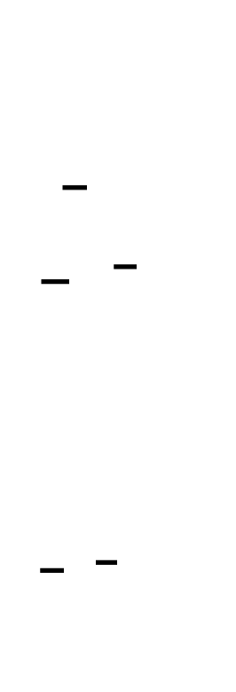

### 3.3 Beam Hypothesis Data Structure
```python
@dataclass
class BeamHypothesis:
    """
    A partial sequence being explored by beam search.
    Attributes:
        tokens: Token indices [seq_len] for this hypothesis
        score: Cumulative log probability (higher is better)
        is_finished: Whether EOS has been generated
    """
    tokens: torch.Tensor
    score: float
    is_finished: bool = False
    def length(self) -> int:
        """Return sequence length."""
        return self.tokens.size(0)
    def adjusted_score(self, length_penalty: float) -> float:
        """
        Compute length-penalized score.
        Formula: score / ((5 + length) / 6)^alpha
        Args:
            length_penalty: Alpha parameter (0 = no penalty, higher = favor longer)
        Returns:
            Adjusted score for comparison
        """
        length = self.length()
        penalty = ((5.0 + length) / 6.0) ** length_penalty
        return self.score / penalty
```
### 3.4 Generator Configuration
```python
@dataclass
class GenerationConfig:
    """Configuration for generation."""
    max_len: int = 100
    strategy: str = 'greedy'  # 'greedy', 'beam', 'sample'
    beam_width: int = 4
    length_penalty: float = 0.0
    temperature: float = 1.0
    top_k: Optional[int] = None
    top_p: Optional[float] = None
    use_cache: bool = True
    early_stopping: bool = True  # For beam search
```
### 3.5 TransformerGenerator State
| Field | Type | Purpose |
|-------|------|---------|
| model | EncoderDecoderTransformer | Trained model for generation |
| sos_token_id | int | Start-of-sequence token ID |
| eos_token_id | int | End-of-sequence token ID |
| pad_token_id | int | Padding token ID |
| device | torch.device | Device for tensor operations |
---
## 4. Interface Contracts
### 4.1 KVCache
```python
class KVCache:
    """
    Key-Value cache for efficient autoregressive generation.
    """
    @classmethod
    def create(
        cls,
        num_layers: int,
        batch_size: int,
        num_heads: int,
        d_k: int,
        device: torch.device = None
    ) -> 'KVCache':
        """
        Create empty caches for all layers.
        Pre-conditions:
            - num_layers > 0
            - batch_size > 0
            - num_heads > 0
            - d_k > 0
        Post-conditions:
            - All caches have shape [batch, heads, 0, d_k]
            - total_seq_len() == 0
            - All tensors on specified device
        Returns:
            New KVCache instance with empty caches
        """
    def update(
        self,
        layer_idx: int,
        new_keys: torch.Tensor,
        new_values: torch.Tensor
    ) -> None:
        """
        Append new keys/values to cache.
        Pre-conditions:
            - 0 <= layer_idx < self.num_layers
            - new_keys.shape == new_values.shape
            - new_keys.size(0) == self.batch_size
            - new_keys.size(1) == self.num_heads
            - new_keys.size(3) == self.d_k
        Post-conditions:
            - Cache seq_len increased by new_keys.size(2)
            - Old cache content preserved
            - New content appended at end
        Invariants:
            - No data loss
            - Memory contiguous after update
        """
    def get(self, layer_idx: int) -> Tuple[torch.Tensor, torch.Tensor]:
        """
        Get cached keys and values for a layer.
        Pre-conditions:
            - 0 <= layer_idx < self.num_layers
        Post-conditions:
            - Returns (keys, values) with same shape [B, H, S, K]
            - S may be 0 if cache is empty
        Returns:
            Tuple of (keys, values) tensors
        """
```
### 4.2 Greedy Decoding
```python
def greedy_decode(
    model: EncoderDecoderTransformer,
    src_tokens: torch.Tensor,
    sos_token_id: int,
    eos_token_id: int,
    max_len: int = 100,
    device: str = 'cuda'
) -> torch.Tensor:
    """
    Greedy decoding: select argmax token at each step.
    Args:
        model: Trained EncoderDecoderTransformer
        src_tokens: Source token indices [batch, src_len]
        sos_token_id: Start-of-sequence token ID
        eos_token_id: End-of-sequence token ID
        max_len: Maximum generation length
        device: Device to run on
    Pre-conditions:
        - model is in eval mode (model.eval() called)
        - src_tokens contains valid token indices
        - sos_token_id, eos_token_id are valid token IDs
    Post-conditions:
        - output.shape[0] == src_tokens.shape[0] (same batch)
        - output.shape[1] <= max_len + 1 (may stop early at EOS)
        - All sequences start with sos_token_id
        - Sequences may end with eos_token_id (if generated)
    Returns:
        Generated token indices [batch, gen_len]
    Side effects:
        - None (pure function, no parameter updates)
    Invariants:
        - Deterministic: same input always produces same output
        - Encoder runs exactly once
    """
```
### 4.3 Beam Search
```python
def beam_search(
    model: EncoderDecoderTransformer,
    src_tokens: torch.Tensor,
    sos_token_id: int,
    eos_token_id: int,
    pad_token_id: int,
    beam_width: int = 4,
    max_len: int = 100,
    length_penalty: float = 0.0,
    device: str = 'cuda'
) -> List[Tuple[torch.Tensor, float]]:
    """
    Beam search: keep top-k hypotheses at each step.
    Args:
        model: Trained EncoderDecoderTransformer
        src_tokens: Source token indices [1, src_len] (single sequence)
        sos_token_id: Start-of-sequence token ID
        eos_token_id: End-of-sequence token ID
        pad_token_id: Padding token ID
        beam_width: Number of hypotheses to keep
        max_len: Maximum generation length
        length_penalty: Penalty for longer sequences (0 = no penalty)
        device: Device to run on
    Pre-conditions:
        - model is in eval mode
        - src_tokens.shape[0] == 1 (single source sequence)
        - beam_width > 0
        - length_penalty >= 0
    Post-conditions:
        - Returns at most beam_width completed hypotheses
        - Hypotheses sorted by adjusted score (descending)
        - Each hypothesis is (tokens, adjusted_score)
    Returns:
        List of (tokens, score) tuples for completed hypotheses
    Invariants:
        - At most beam_width hypotheses maintained at any step
        - Scores are cumulative log probabilities
        - EOS-terminated hypotheses are marked finished
    """
```
### 4.4 Sampling Functions
```python
def sample_with_temperature(
    logits: torch.Tensor,
    temperature: float = 1.0
) -> torch.Tensor:
    """
    Sample from probability distribution with temperature scaling.
    Args:
        logits: [batch, vocab_size] unnormalized logits
        temperature: Temperature parameter
            - temperature <= epsilon: Greedy (argmax)
            - temperature < 1: More deterministic
            - temperature = 1: Standard sampling
            - temperature > 1: More random
    Pre-conditions:
        - logits.dim() == 2
        - temperature >= 0
    Post-conditions:
        - output.shape == [batch, 1]
        - If temperature <= epsilon, output == argmax
        - Otherwise, output sampled from softmax(logits / temperature)
    Returns:
        Sampled token indices [batch, 1]
    Invariants:
        - temperature=0 handled as greedy (no division by zero)
    """
def top_k_sample(
    logits: torch.Tensor,
    k: int = 50,
    temperature: float = 1.0
) -> torch.Tensor:
    """
    Sample from top-k most likely tokens.
    Args:
        logits: [batch, vocab_size]
        k: Number of top tokens to consider
        temperature: Temperature for sampling
    Pre-conditions:
        - k > 0
        - k <= vocab_size
    Post-conditions:
        - Output token is in top-k
        - Sampling from renormalized top-k distribution
    Returns:
        Sampled token indices [batch, 1]
    """
def top_p_sample(
    logits: torch.Tensor,
    p: float = 0.9,
    temperature: float = 1.0
) -> torch.Tensor:
    """
    Nucleus sampling: sample from tokens comprising top-p probability mass.
    Args:
        logits: [batch, vocab_size]
        p: Cumulative probability threshold
        temperature: Temperature for sampling
    Pre-conditions:
        - 0 < p <= 1.0
    Post-conditions:
        - Output token is from smallest set with cumulative prob >= p
        - Tokens outside nucleus have zero probability
    Returns:
        Sampled token indices [batch, 1]
    """
```
### 4.5 TransformerGenerator
```python
class TransformerGenerator:
    """
    Complete generation interface for trained Transformer.
    """
    def __init__(
        self,
        model: EncoderDecoderTransformer,
        sos_token_id: int,
        eos_token_id: int,
        pad_token_id: int,
        device: str = 'cuda'
    ):
        """
        Initialize generator.
        Pre-conditions:
            - model is a trained EncoderDecoderTransformer
            - Token IDs are valid for the model's vocabulary
        Post-conditions:
            - Model moved to device
            - Model set to eval mode
        """
    def generate(
        self,
        src_tokens: torch.Tensor,
        max_len: int = 100,
        strategy: str = 'greedy',
        beam_width: int = 4,
        temperature: float = 1.0,
        top_k: Optional[int] = None,
        top_p: Optional[float] = None,
        length_penalty: float = 0.0,
        use_cache: bool = True
    ) -> Union[torch.Tensor, List[Tuple[torch.Tensor, float]]]:
        """
        Generate output sequence from source.
        Args:
            src_tokens: Source token indices [batch, src_len]
            max_len: Maximum generation length
            strategy: 'greedy', 'beam', or 'sample'
            beam_width: Beam width for beam search
            temperature: Temperature for sampling
            top_k: Top-k filtering (None = disabled)
            top_p: Top-p filtering (None = disabled)
            length_penalty: Length penalty for beam search
            use_cache: Whether to use KV caching
        Pre-conditions:
            - strategy in ['greedy', 'beam', 'sample']
            - If strategy == 'beam', beam_width > 0
            - temperature >= 0
        Post-conditions:
            - For 'greedy'/'sample': returns [batch, gen_len]
            - For 'beam': returns list of (tokens, score) tuples
        Returns:
            Generated token sequences (format depends on strategy)
        """
```
---
## 5. Algorithm Specification
### 5.1 Greedy Decoding Algorithm (Naive)
```
ALGORITHM: GreedyDecode_Naive
INPUT: 
    model, src_tokens [B, Se], sos_token_id, eos_token_id, max_len, device
STEP 1: Encode source once
    encoder_output = model.encode(src_tokens)
    # encoder_output: [B, Se, D]
    INVARIANT: Encoder runs exactly once, output cached
STEP 2: Initialize generation
    generated = full([B, 1], sos_token_id, device=device)
    # generated: [B, 1] starting with <sos>
    finished = zeros([B], dtype=bool, device=device)
    # Track which sequences have generated EOS
STEP 3: Generation loop
    FOR step = 0 TO max_len - 1:
        IF finished.all():
            BREAK  # All sequences finished
        STEP 3a: Create causal mask
            seq_len = generated.size(1)
            causal_mask = triu(ones(seq_len, seq_len), diagonal=1).bool()
            causal_mask = causal_mask.unsqueeze(0).unsqueeze(0)
            # Shape: [1, 1, seq_len, seq_len]
            INVARIANT: Upper triangle is True (masked)
        STEP 3b: Forward pass through decoder
            logits = model.decode(generated, encoder_output, tgt_mask=causal_mask)
            # logits: [B, seq_len, vocab_size]
        STEP 3c: Get logits for last position
            next_logits = logits[:, -1, :]
            # next_logits: [B, vocab_size]
        STEP 3d: Select argmax token
            next_token = next_logits.argmax(dim=-1, keepdim=True)
            # next_token: [B, 1]
        STEP 3e: Append to generated
            generated = cat([generated, next_token], dim=1)
            # generated: [B, seq_len + 1]
        STEP 3f: Check for EOS
            finished = finished OR (next_token.squeeze(-1) == eos_token_id)
            # Update finished flags
STEP 4: Return generated sequence
    INVARIANT: All sequences start with SOS
    INVARIANT: Sequences end with EOS or reach max_len
RETURN generated
COMPLEXITY ANALYSIS:
    Encoder: O(Se² * D) - one time
    Per step: O(Tg² * D) where Tg is current sequence length
    Total decoder: O(1² + 2² + ... + Tg²) = O(Tg³) for Tg tokens
    This is the problem that KV caching solves.
```


### 5.2 KV Cache Update Algorithm
```
ALGORITHM: KVCache_Update
INPUT:
    cache: KVCache object
    layer_idx: int
    new_keys: [B, H, new_len, K]
    new_values: [B, H, new_len, K]
STEP 1: Get current cache
    old_keys = cache.keys[layer_idx]
    old_values = cache.values[layer_idx]
    # old_keys: [B, H, old_len, K]
STEP 2: Concatenate along sequence dimension
    cache.keys[layer_idx] = cat([old_keys, new_keys], dim=2)
    # Result: [B, H, old_len + new_len, K]
    cache.values[layer_idx] = cat([old_values, new_values], dim=2)
STEP 3: Update is in-place
    INVARIANT: Memory for old cache is preserved
    INVARIANT: New memory allocated for concatenation result
RETURN (nothing - cache updated in-place)
MEMORY ANALYSIS:
    Per layer: B * H * (old_len + new_len) * K * 4 bytes
    For 6 layers, batch=1, heads=8, d_k=64, 100 tokens:
    6 * 1 * 8 * 100 * 64 * 4 = 1.23 MB for KV cache
```
### 5.3 Attention with KV Cache
```
ALGORITHM: AttentionWithCache
INPUT:
    Q: [B, H, new_len, K]  (only new token(s))
    cached_K: [B, H, old_len, K] or empty
    cached_V: [B, H, old_len, K] or empty
    new_K: [B, H, new_len, K]
    new_V: [B, H, new_len, K]
    mask: Optional mask for new positions
    scale: sqrt(d_k)
STEP 1: Concatenate cached and new K, V
    IF cached_K is not empty:
        K = cat([cached_K, new_K], dim=2)  # [B, H, old_len + new_len, K]
        V = cat([cached_V, new_V], dim=2)
    ELSE:
        K = new_K
        V = new_V
    total_len = K.size(2)
STEP 2: Compute attention scores for new queries
    scores = matmul(Q, K.transpose(-2, -1)) / scale
    # Q: [B, H, new_len, K]
    # K^T: [B, H, K, total_len]
    # scores: [B, H, new_len, total_len]
    NOTE: Only computing attention for NEW positions
          Old positions already computed and cached
STEP 3: Apply mask if provided
    IF mask is not None:
        scores = scores.masked_fill(mask, -inf)
STEP 4: Softmax normalization
    weights = softmax(scores, dim=-1)
    weights = nan_to_num(weights, nan=0.0)
    # Each query position has distribution over all key positions
STEP 5: Compute output
    output = matmul(weights, V)
    # weights: [B, H, new_len, total_len]
    # V: [B, H, total_len, K]
    # output: [B, H, new_len, K]
STEP 6: Return output and updated K, V for caching
    updated_K = K  # Full K including new
    updated_V = V  # Full V including new
RETURN output, weights, updated_K, updated_V
COMPLEXITY:
    Without cache: O(Tg²) per step for full sequence
    With cache: O(Tg * 1) = O(Tg) per step for single new token
    Total: O(Tg²) instead of O(Tg³)
```


### 5.4 Greedy Decoding with KV Cache
```
ALGORITHM: GreedyDecode_Cached
INPUT:
    model, src_tokens [B, Se], sos_token_id, eos_token_id, max_len, device
STEP 1: Encode source once
    encoder_output = model.encode(src_tokens)
    # encoder_output: [B, Se, D]
STEP 2: Initialize KV cache
    num_layers = len(model.decoder.layers)
    num_heads = model.decoder.layers[0].self_attn.num_heads
    d_k = model.decoder.layers[0].self_attn.d_k
    cache = KVCache.create(num_layers, B, num_heads, d_k, device)
STEP 3: Initialize generation
    generated = full([B, 1], sos_token_id, device=device)
    finished = zeros([B], dtype=bool, device=device)
STEP 4: First step - process <sos>
    # No causal mask needed for single token
    logits, new_K, new_V = model.decode_with_cache(
        generated, encoder_output, cache, position_offset=0
    )
    # Update cache with first token's K, V
    FOR layer_idx IN range(num_layers):
        cache.update(layer_idx, new_K[layer_idx], new_V[layer_idx])
    next_token = logits[:, -1, :].argmax(dim=-1, keepdim=True)
    generated = cat([generated, next_token], dim=1)
    finished = finished OR (next_token.squeeze(-1) == eos_token_id)
STEP 5: Subsequent steps - process only new token
    FOR step = 1 TO max_len - 1:
        IF finished.all():
            BREAK
        # Only the last token
        decoder_input = generated[:, -1:].clone()  # [B, 1]
        # No causal mask needed - cached positions already masked correctly
        # Position offset = current sequence length - 1
        position_offset = generated.size(1) - 1
        logits, new_K, new_V = model.decode_with_cache(
            decoder_input, encoder_output, cache, position_offset=position_offset
        )
        # Update cache
        FOR layer_idx IN range(num_layers):
            cache.update(layer_idx, new_K[layer_idx], new_V[layer_idx])
        next_token = logits[:, -1, :].argmax(dim=-1, keepdim=True)
        generated = cat([generated, next_token], dim=1)
        finished = finished OR (next_token.squeeze(-1) == eos_token_id)
RETURN generated
SPEEDUP ANALYSIS:
    Naive: O(1² + 2² + ... + n²) = O(n³/3) attention operations
    Cached: O(1 + 1 + ... + 1) = O(n) attention operations per layer
    But attention still O(n) per step (query attends to n cached positions)
    Total cached: O(n²) vs naive O(n³)
    Speedup factor: ~n/3 for n tokens
    For 100 tokens: ~33x reduction in attention FLOPs
```


### 5.5 Beam Search Algorithm
```
ALGORITHM: BeamSearch
INPUT:
    model, src_tokens [1, Se], sos_token_id, eos_token_id, pad_token_id,
    beam_width, max_len, length_penalty, device
STEP 1: Encode source once
    encoder_output = model.encode(src_tokens)
    # encoder_output: [1, Se, D]
STEP 2: Initialize hypotheses
    hypotheses = [
        BeamHypothesis(
            tokens=tensor([sos_token_id], device=device),
            score=0.0,
            is_finished=False
        )
    ]
    completed = []  # Finished hypotheses
STEP 3: Generation loop
    FOR step = 0 TO max_len - 1:
        IF len(hypotheses) == 0:
            BREAK  # All hypotheses finished
        STEP 3a: Prepare batch of active hypotheses
            batch_tokens = stack([h.tokens for h in hypotheses])
            # [num_active, seq_len]
            batch_size, seq_len = batch_tokens.shape
        STEP 3b: Expand encoder output for batch
            encoder_expanded = encoder_output.expand(batch_size, -1, -1)
            # [num_active, Se, D]
        STEP 3c: Create causal mask
            causal_mask = triu(ones(seq_len, seq_len), diagonal=1).bool()
            causal_mask = causal_mask.unsqueeze(0).unsqueeze(0)
        STEP 3d: Forward pass
            logits = model.decode(batch_tokens, encoder_expanded, tgt_mask=causal_mask)
            # logits: [num_active, seq_len, vocab_size]
        STEP 3e: Get logits for last position
            next_logits = logits[:, -1, :]
            # [num_active, vocab_size]
        STEP 3f: Compute log probabilities
            log_probs = log_softmax(next_logits, dim=-1)
            # [num_active, vocab_size]
        STEP 3g: Compute total scores
            # Add current hypothesis scores to log_probs
            hyp_scores = tensor([h.score for h in hypotheses], device=device)
            total_scores = log_probs + hyp_scores.unsqueeze(1)
            # [num_active, vocab_size]
        STEP 3h: Flatten and get top-k
            flat_scores = total_scores.view(-1)  # [num_active * vocab_size]
            top_k_scores, top_k_indices = topk(flat_scores, beam_width)
            # top_k_indices: flat indices into [hyp_idx, token_idx]
            # Convert to hypothesis and token indices
            hyp_indices = top_k_indices // vocab_size
            token_indices = top_k_indices % vocab_size
        STEP 3i: Build new hypotheses
            new_hypotheses = []
            FOR i IN range(len(top_k_scores)):
                hyp_idx = hyp_indices[i].item()
                token_idx = token_indices[i].item()
                score = top_k_scores[i].item()
                old_hyp = hypotheses[hyp_idx]
                new_tokens = cat([old_hyp.tokens, tensor([token_idx], device=device)])
                IF token_idx == eos_token_id:
                    # Hypothesis completed
                    adjusted_score = score / ((5 + len(new_tokens)) / 6) ** length_penalty
                    completed.append((new_tokens, adjusted_score))
                ELSE:
                    new_hypotheses.append(BeamHypothesis(
                        tokens=new_tokens,
                        score=score,
                        is_finished=False
                    ))
            # Keep only top beam_width active hypotheses
            hypotheses = new_hypotheses[:beam_width]
        STEP 3j: Early stopping check
            IF completed AND len(hypotheses) > 0:
                best_active = max(h.score for h in hypotheses)
                best_completed = max(c[1] for c in completed)
                IF best_active < best_completed AND early_stopping:
                    BREAK  # Best completed beats best active
STEP 4: Add remaining active hypotheses to completed
    FOR hyp IN hypotheses:
        adjusted_score = hyp.score / ((5 + hyp.length()) / 6) ** length_penalty
        completed.append((hyp.tokens, adjusted_score))
STEP 5: Sort and return
    completed.sort(key=lambda x: x[1], reverse=True)
RETURN completed[:beam_width]
SCORE ACCUMULATION:
    Scores are log probabilities: log(P(y1)) + log(P(y2|y1)) + ...
    This equals log(P(y1, y2, ...)) - the joint log probability
    Higher score = more likely sequence
```


### 5.6 Length Penalty Mathematics
```
LENGTH PENALTY FORMULA:
    adjusted_score = score / ((5 + length) / 6)^alpha
Where:
    score = cumulative log probability (negative, more negative = less likely)
    length = sequence length
    alpha = length_penalty parameter
RATIONALE:
    Log probabilities are negative and accumulate.
    Longer sequences have more negative scores simply because
    they're products of more probabilities.
    Without penalty: Shorter sequences are favored
    With alpha=0: No adjustment
    With alpha>0: Longer sequences are less penalized
EXAMPLE (alpha=0.6, comparing lengths 5 and 10):
    Length 5, score=-10:
        penalty = ((5+5)/6)^0.6 = 1.67^0.6 ≈ 1.35
        adjusted = -10 / 1.35 ≈ -7.41
    Length 10, score=-15:
        penalty = ((5+10)/6)^0.6 = 2.5^0.6 ≈ 1.73
        adjusted = -15 / 1.73 ≈ -8.67
    Without penalty: -10 > -15 (shorter wins)
    With penalty: -7.41 > -8.67 (shorter still wins, but gap reduced)
The (5 + length) / 6 formula:
    - Has no effect at length 1: (6/6)^alpha = 1
    - Gradually increases penalty for longer sequences
    - The "5" is a smoothing constant from the original paper
```
### 5.7 Temperature Sampling Algorithm
```
ALGORITHM: TemperatureSampling
INPUT:
    logits: [B, vocab_size]
    temperature: float
STEP 1: Handle temperature = 0 case
    IF temperature <= 1e-10:
        # Effectively greedy
        RETURN logits.argmax(dim=-1, keepdim=True)
STEP 2: Scale logits by temperature
    scaled_logits = logits / temperature
    # Higher temperature = flatter distribution
    # Lower temperature = sharper distribution
STEP 3: Compute probabilities
    probs = softmax(scaled_logits, dim=-1)
    # [B, vocab_size]
STEP 4: Sample from distribution
    sampled = multinomial(probs, num_samples=1)
    # [B, 1]
RETURN sampled
TEMPERATURE EFFECT ON DISTRIBUTION:
    Original logits: [2.0, 1.0, 0.5, 0.1]
    temp=0.1 (near-greedy):
        scaled: [20.0, 10.0, 5.0, 1.0]
        probs:  [0.9999, 0.0001, 0.0000, 0.0000]
    temp=0.5:
        scaled: [4.0, 2.0, 1.0, 0.2]
        probs:  [0.84, 0.11, 0.04, 0.01]
    temp=1.0 (standard):
        scaled: [2.0, 1.0, 0.5, 0.1]
        probs:  [0.62, 0.23, 0.10, 0.05]
    temp=2.0:
        scaled: [1.0, 0.5, 0.25, 0.05]
        probs:  [0.41, 0.28, 0.18, 0.13]
    temp=5.0 (near-uniform):
        scaled: [0.4, 0.2, 0.1, 0.02]
        probs:  [0.27, 0.25, 0.22, 0.26]
```


### 5.8 Top-k Sampling Algorithm
```
ALGORITHM: TopKSampling
INPUT:
    logits: [B, vocab_size]
    k: int
    temperature: float
STEP 1: Get top-k logits and indices
    top_k_logits, top_k_indices = topk(logits, k, dim=-1)
    # top_k_logits: [B, k]
    # top_k_indices: [B, k]
STEP 2: Apply temperature
    IF temperature > 0:
        top_k_logits = top_k_logits / temperature
STEP 3: Compute probabilities over top-k
    probs = softmax(top_k_logits, dim=-1)
    # [B, k]
STEP 4: Sample from top-k
    sampled_idx = multinomial(probs, num_samples=1)
    # [B, 1] - index into top-k
STEP 5: Map back to original vocabulary
    sampled_tokens = gather(top_k_indices, 1, sampled_idx)
    # [B, 1]
RETURN sampled_tokens
EFFECT:
    Only top-k tokens have non-zero probability.
    Prevents sampling from very unlikely tokens.
    Common values: k=50, k=40, k=10
```
### 5.9 Top-p (Nucleus) Sampling Algorithm
```
ALGORITHM: TopPSampling
INPUT:
    logits: [B, vocab_size]
    p: float (cumulative probability threshold)
    temperature: float
STEP 1: Apply temperature
    IF temperature > 0:
        logits = logits / temperature
STEP 2: Sort by probability (descending)
    probs = softmax(logits, dim=-1)
    sorted_probs, sorted_indices = sort(probs, descending=True, dim=-1)
    # sorted_probs: [B, vocab_size]
STEP 3: Find cumulative probability
    cumulative_probs = cumsum(sorted_probs, dim=-1)
    # [B, vocab_size]
STEP 4: Create mask for tokens to remove
    # Remove tokens where cumulative prob exceeds p
    # But keep at least one token (the first one that crosses threshold)
    sorted_indices_to_remove = cumulative_probs > p
    # Shift right to include the token that pushed us over p
    sorted_indices_to_remove[..., 1:] = sorted_indices_to_remove[..., :-1].clone()
    sorted_indices_to_remove[..., 0] = False  # Always keep top token
STEP 5: Set removed tokens to -inf
    sorted_logits = gather(logits, -1, sorted_indices)
    sorted_logits[sorted_indices_to_remove] = -inf
STEP 6: Unsort and compute final probabilities
    logits_filtered = scatter(sorted_logits, -1, sorted_indices, sorted_logits)
    probs_filtered = softmax(logits_filtered, dim=-1)
STEP 7: Sample
    sampled = multinomial(probs_filtered, num_samples=1)
RETURN sampled
EFFECT:
    Samples from smallest set of tokens with cumulative prob >= p.
    Adaptive: more tokens considered for uncertain distributions,
    fewer for confident distributions.
    Common values: p=0.9, p=0.95
```

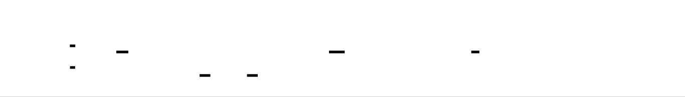

---
## 6. Error Handling Matrix
| Error | Detected By | Recovery | User-Visible? |
|-------|-------------|----------|---------------|
| **KV cache dimension mismatch** | Shape error in attention matmul | Validate cache seq_len == expected before attention | Yes - debug message |
| **Causal mask not updated** | Model attends to future during generation | Regenerate mask for current seq_len | Yes - implementation bug |
| **Temperature = 0 division by zero** | Division by zero in sampling | Check `if temperature <= 1e-10: return argmax` | No - handled gracefully |
| **Beam search never terminates** | EOS never selected, runs to max_len | Add early stopping based on completed hypotheses | No - reaches max_len |
| **Cache not cleared between calls** | Previous sequence corrupts current | Create new cache per generate() call | Yes - usage error |
| **Encoder output not reused** | Slow generation, re-encoding each step | Cache encoder output, pass to all decoder steps | Yes - performance issue |
| **Beam width > vocab_size** | Top-k returns fewer than beam_width | Use min(beam_width, num_valid_tokens) | No - handled gracefully |
| **All-masked attention row** | NaN in attention weights | Use nan_to_num(nan=0.0) after softmax | No - handled gracefully |
| **Position offset wrong in cache** | Wrong positional encoding applied | Track position_offset = current_seq_len - 1 | Yes - implementation bug |
| **Generated sequence exceeds max_seq_len** | IndexError in PE | Check before forward pass, raise informative error | Yes - config error |
| **Batch size mismatch in beam search** | Shape error in hypothesis expansion | Verify batch dimension consistency | Yes - debug message |
### Error Recovery Implementation
```python
class GenerationError(Exception):
    """Base exception for generation errors."""
    pass
class CacheMismatchError(GenerationError):
    """Raised when KV cache dimensions don't match expected."""
    def __init__(self, expected_seq_len: int, actual_seq_len: int):
        self.expected = expected_seq_len
        self.actual = actual_seq_len
        super().__init__(
            f"KV cache sequence length mismatch: expected {expected_seq_len}, "
            f"got {actual_seq_len}. Ensure cache is cleared between generation calls."
        )
class TemperatureZeroError(GenerationError):
    """Raised when temperature is exactly 0 (should use greedy)."""
    def __init__(self):
        super().__init__(
            "Temperature=0 causes division by zero. Use greedy decoding instead, "
            "or use a small positive value (e.g., 1e-10)."
        )
def validate_cache_state(cache: KVCache, expected_seq_len: int) -> None:
    """
    Validate KV cache has expected sequence length.
    Raises:
        CacheMismatchError: If cache seq_len doesn't match expected
    """
    actual_seq_len = cache.total_seq_len()
    if actual_seq_len != expected_seq_len:
        raise CacheMismatchError(expected_seq_len, actual_seq_len)
```
---
## 7. Implementation Sequence with Checkpoints
### Phase 1: Implement KV Cache Data Structure (1 hour)
**Files to create**: `transformer/inference/kv_cache.py`
**Tasks**:
1. Implement `KVCache` dataclass with `keys` and `values` lists
2. Implement `create()` class method for initialization
3. Implement `update()` for appending new K/V
4. Implement `get()` for retrieving cached K/V
5. Implement `seq_len()` and `total_seq_len()` helpers
6. Implement `clear()` for resetting cache
**Checkpoint**: After this phase, you should be able to:
```python
from transformer.inference.kv_cache import KVCache
# Create cache
cache = KVCache.create(
    num_layers=6,
    batch_size=2,
    num_heads=8,
    d_k=64
)
# Verify initial state
assert cache.total_seq_len() == 0, "Cache should start empty"
# Update layer 0
new_k = torch.randn(2, 8, 1, 64)
new_v = torch.randn(2, 8, 1, 64)
cache.update(0, new_k, new_v)
assert cache.seq_len(0) == 1, "Layer 0 should have seq_len=1"
# Get cached values
k, v = cache.get(0)
assert k.shape == (2, 8, 1, 64), f"Wrong shape: {k.shape}"
# Clear cache
cache.clear()
assert cache.total_seq_len() == 0, "Cache should be empty after clear"
print("✓ KV cache data structure works correctly")
```
Run: `pytest tests/test_kv_cache.py -v`
---
### Phase 2: Implement Greedy Decoding (Naive, No Cache) (1 hour)
**Files to create**: `transformer/inference/greedy.py`
**Tasks**:
1. Implement `greedy_decode()` without KV caching
2. Handle encoder output caching (run encoder once)
3. Implement causal mask creation for each step
4. Track finished sequences (EOS detection)
5. Return when all sequences finished or max_len reached
**Checkpoint**: After this phase, you should be able to:
```python
from transformer.inference.greedy import greedy_decode
from transformer.model.transformer import EncoderDecoderTransformer
# Create and "train" a tiny model
model = EncoderDecoderTransformer(
    src_vocab_size=20, tgt_vocab_size=20, d_model=64, 
    num_heads=2, num_layers=1, d_ff=128, dropout=0.0
)
model.eval()
# Generate
src = torch.randint(0, 20, (2, 8))
output = greedy_decode(
    model, src, 
    sos_token_id=1, eos_token_id=2, 
    max_len=10, device='cpu'
)
# Verify output
assert output.shape[0] == 2, "Batch size should match"
assert output.shape[1] <= 11, "Should not exceed max_len + 1"
assert output[0, 0].item() == 1, "Should start with SOS"
print(f"✓ Greedy decoding produces output: {output.shape}")
```
Run: `pytest tests/test_greedy.py::test_greedy_naive -v`

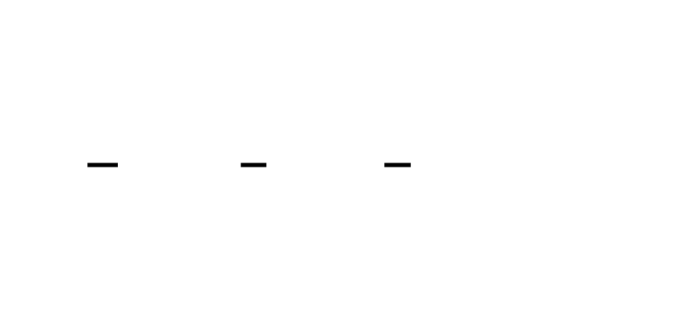

---
### Phase 3: Modify Decoder for KV Caching (1.5-2 hours)
**Files to create/modify**: `transformer/inference/attention_cache.py`, modify `transformer/layers/decoder_layer.py`
**Tasks**:
1. Create `decode_with_cache()` method in Decoder
2. Modify attention to accept cached K/V and return new K/V
3. Implement position offset handling for positional encoding
4. Ensure cache is updated correctly at each layer
**Checkpoint**: After this phase, you should be able to:
```python
# Test cache-aware decoding
model = EncoderDecoderTransformer(
    src_vocab_size=20, tgt_vocab_size=20, d_model=64,
    num_heads=2, num_layers=2, d_ff=128, dropout=0.0
)
model.eval()
# Create cache
cache = KVCache.create(
    num_layers=2, batch_size=1, num_heads=2, d_k=32
)
# Encode source
src = torch.randint(0, 20, (1, 8))
enc_out = model.encode(src)
# First step
dec_in = torch.tensor([[1]])  # SOS
logits = model.decode_with_cache(dec_in, enc_out, cache, position_offset=0)
assert logits.shape == (1, 1, 20), f"Wrong shape: {logits.shape}"
assert cache.total_seq_len() == 2, "Both layers should have cache updated"
print("✓ Cache-aware decoding works")
```
---
### Phase 4: Implement Greedy Decoding with KV Cache (1 hour)
**Files to modify**: `transformer/inference/greedy.py`
**Tasks**:
1. Implement `greedy_decode_with_cache()` function
2. Create cache at start of generation
3. Process first token (full sequence)
4. Process subsequent tokens (only new token)
5. Update cache after each step
**Checkpoint**: After this phase, you should be able to:
```python
from transformer.inference.greedy import greedy_decode_with_cache
model = EncoderDecoderTransformer(
    src_vocab_size=20, tgt_vocab_size=20, d_model=64,
    num_heads=2, num_layers=2, d_ff=128, dropout=0.0
)
model.eval()
src = torch.randint(0, 20, (1, 8))
output = greedy_decode_with_cache(
    model, src,
    sos_token_id=1, eos_token_id=2,
    max_len=20, device='cpu'
)
assert output.shape[0] == 1
assert output.shape[1] <= 21
assert output[0, 0].item() == 1  # SOS
print(f"✓ Cached greedy decoding: {output.shape}")
```
Run: `pytest tests/test_greedy.py::test_greedy_cached -v`
---
### Phase 5: Implement Beam Search (2-3 hours)
**Files to create**: `transformer/inference/beam_search.py`
**Tasks**:
1. Implement `BeamHypothesis` dataclass
2. Implement `beam_search()` function
3. Handle hypothesis expansion and scoring
4. Implement EOS detection and hypothesis completion
5. Implement early stopping
**Checkpoint**: After this phase, you should be able to:
```python
from transformer.inference.beam_search import beam_search
model = EncoderDecoderTransformer(
    src_vocab_size=20, tgt_vocab_size=20, d_model=64,
    num_heads=2, num_layers=2, d_ff=128, dropout=0.0
)
model.eval()
src = torch.randint(0, 20, (1, 8))
results = beam_search(
    model, src,
    sos_token_id=1, eos_token_id=2, pad_token_id=0,
    beam_width=4, max_len=20, device='cpu'
)
# Verify results
assert len(results) <= 4, "Should return at most beam_width results"
for tokens, score in results:
    assert tokens[0].item() == 1, "Should start with SOS"
    assert isinstance(score, float), "Score should be float"
print(f"✓ Beam search returns {len(results)} hypotheses")
```
Run: `pytest tests/test_beam_search.py -v`


---
### Phase 6: Implement Length Penalty (0.5 hour)
**Files to modify**: `transformer/inference/beam_search.py`
**Tasks**:
1. Implement `adjusted_score()` method in BeamHypothesis
2. Apply length penalty when adding completed hypotheses
3. Document the formula and rationale
**Checkpoint**: After this phase, verify length penalty affects results:
```python
# Test length penalty effect
results_no_penalty = beam_search(
    model, src, 1, 2, 0, beam_width=4, max_len=20, length_penalty=0.0
)
results_with_penalty = beam_search(
    model, src, 1, 2, 0, beam_width=4, max_len=20, length_penalty=0.6
)
# With penalty, longer sequences should be relatively favored
# (This is a qualitative check - exact behavior depends on model)
print("✓ Length penalty implemented")
```
---
### Phase 7: Implement Temperature Scaling (0.5 hour)
**Files to create**: `transformer/inference/sampling.py`
**Tasks**:
1. Implement `sample_with_temperature()` function
2. Handle temperature=0 case as greedy (no division)
3. Apply temperature scaling before softmax
4. Sample from resulting distribution
**Checkpoint**: After this phase, you should be able to:
```python
from transformer.inference.sampling import sample_with_temperature
logits = torch.tensor([[2.0, 1.0, 0.5, 0.1]])
# Test temperature=0 (greedy)
sampled_greedy = sample_with_temperature(logits, temperature=0.0)
assert sampled_greedy.item() == 0, "temp=0 should return argmax"
# Test temperature=1.0 (standard sampling)
torch.manual_seed(42)
sampled_standard = sample_with_temperature(logits, temperature=1.0)
print(f"Sampled with temp=1.0: {sampled_standard.item()}")
# Test high temperature (more random)
torch.manual_seed(42)
sampled_high = sample_with_temperature(logits, temperature=2.0)
print(f"Sampled with temp=2.0: {sampled_high.item()}")
print("✓ Temperature sampling works")
```
Run: `pytest tests/test_sampling.py::test_temperature -v`
---
### Phase 8: Implement Top-k and Top-p Sampling (1 hour)
**Files to modify**: `transformer/inference/sampling.py`
**Tasks**:
1. Implement `top_k_sample()` function
2. Implement `top_p_sample()` function
3. Test that samples are from filtered distribution
4. Verify no tokens outside filter are selected
**Checkpoint**: After this phase, you should be able to:
```python
from transformer.inference.sampling import top_k_sample, top_p_sample
logits = torch.tensor([[2.0, 1.0, 0.5, 0.1, 0.05, 0.01]])
# Test top-k
for _ in range(10):
    sampled = top_k_sample(logits, k=2, temperature=1.0)
    assert sampled.item() in [0, 1], "Top-k=2 should only sample from top 2"
print("✓ Top-k sampling filters correctly")
# Test top-p
torch.manual_seed(42)
for _ in range(10):
    sampled = top_p_sample(logits, p=0.9, temperature=1.0)
    # Top-p=0.9 should include tokens until cumulative prob >= 0.9
print("✓ Top-p sampling works")
```
Run: `pytest tests/test_sampling.py -v`
---
### Phase 9: Benchmark KV Cache Speedup (0.5-1 hour)
**Files to create**: `transformer/inference/benchmark.py`
**Tasks**:
1. Implement benchmark comparing naive vs cached generation
2. Measure time for 100-token generation
3. Verify at least 2x speedup
4. Log results
**Checkpoint**: After this phase, verify speedup:
```python
import time
from transformer.inference.greedy import greedy_decode, greedy_decode_with_cache
model = EncoderDecoderTransformer(
    src_vocab_size=100, tgt_vocab_size=100, d_model=256,
    num_heads=4, num_layers=4, d_ff=1024, dropout=0.0
)
model.eval()
src = torch.randint(0, 100, (1, 32))
max_len = 100
# Benchmark naive
start = time.perf_counter()
for _ in range(5):
    _ = greedy_decode(model, src, 1, 2, max_len)
naive_time = (time.perf_counter() - start) / 5
# Benchmark cached
start = time.perf_counter()
for _ in range(5):
    _ = greedy_decode_with_cache(model, src, 1, 2, max_len)
cached_time = (time.perf_counter() - start) / 5
speedup = naive_time / cached_time
print(f"Naive: {naive_time:.3f}s")
print(f"Cached: {cached_time:.3f}s")
print(f"Speedup: {speedup:.1f}x")
assert speedup >= 2.0, f"Speedup {speedup:.1f}x < required 2x"
print("✓ KV cache provides required speedup")
```

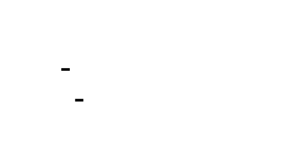

---
### Phase 10: Complete TransformerGenerator Interface (1 hour)
**Files to create**: `transformer/inference/generator.py`
**Tasks**:
1. Implement `TransformerGenerator` class
2. Implement `generate()` method with strategy selection
3. Wire all decoding strategies together
4. Add convenience methods for common use cases
**Checkpoint**: After this phase, you should be able to:
```python
from transformer.inference.generator import TransformerGenerator
model = EncoderDecoderTransformer(
    src_vocab_size=100, tgt_vocab_size=100, d_model=128,
    num_heads=4, num_layers=2, d_ff=512, dropout=0.0
)
generator = TransformerGenerator(
    model, sos_token_id=1, eos_token_id=2, pad_token_id=0, device='cpu'
)
src = torch.randint(0, 100, (2, 16))
# Test greedy
output_greedy = generator.generate(src, max_len=20, strategy='greedy')
assert output_greedy.shape[0] == 2
print(f"✓ Greedy: {output_greedy.shape}")
# Test beam search
output_beam = generator.generate(src, max_len=20, strategy='beam', beam_width=4)
assert len(output_beam) <= 4
print(f"✓ Beam: {len(output_beam)} hypotheses")
# Test sampling
output_sample = generator.generate(src, max_len=20, strategy='sample', temperature=0.8)
assert output_sample.shape[0] == 2
print(f"✓ Sampling: {output_sample.shape}")
print("✓ TransformerGenerator interface complete")
```
Run: `pytest tests/test_generator.py -v`
---
## 8. Test Specification
### 8.1 Test: KV Cache Operations
```python
def test_kv_cache_operations():
    """Verify KV cache create, update, get, clear operations."""
    cache = KVCache.create(
        num_layers=3,
        batch_size=2,
        num_heads=4,
        d_k=16
    )
    # Initial state
    assert cache.total_seq_len() == 0
    # Update each layer
    for i in range(3):
        new_k = torch.randn(2, 4, 5, 16)
        new_v = torch.randn(2, 4, 5, 16)
        cache.update(i, new_k, new_v)
        assert cache.seq_len(i) == 5
    # Verify all layers have same length
    assert cache.total_seq_len() == 5
    # Get and verify
    k, v = cache.get(1)
    assert k.shape == (2, 4, 5, 16)
    # Clear
    cache.clear()
    assert cache.total_seq_len() == 0
```
### 8.2 Test: Greedy Decoding Determinism
```python
def test_greedy_determinism():
    """Verify greedy decoding is deterministic."""
    model = EncoderDecoderTransformer(
        src_vocab_size=50, tgt_vocab_size=50, d_model=64,
        num_heads=2, num_layers=1, d_ff=128, dropout=0.0
    )
    model.eval()
    src = torch.randint(0, 50, (2, 8))
    # Run twice
    output1 = greedy_decode(model, src, 1, 2, max_len=15)
    output2 = greedy_decode(model, src, 1, 2, max_len=15)
    # Should be identical
    assert torch.equal(output1, output2), "Greedy should be deterministic"
```
### 8.3 Test: Causal Mask Correctness in Generation
```python
def test_causal_mask_generation():
    """Verify causal mask prevents future attention during generation."""
    # This test requires accessing attention weights
    # Simplified version: verify output doesn't change if future tokens modified
    model = EncoderDecoderTransformer(
        src_vocab_size=50, tgt_vocab_size=50, d_model=64,
        num_heads=2, num_layers=1, d_ff=128, dropout=0.0
    )
    model.eval()
    src = torch.randint(0, 50, (1, 8))
    tgt = torch.tensor([[1, 5, 3, 7, 2]])  # SOS, A, B, C, EOS
    # Encode source
    enc_out = model.encode(src)
    # Decode with correct causal mask
    causal_mask = torch.triu(torch.ones(5, 5), diagonal=1).bool().unsqueeze(0).unsqueeze(0)
    logits_correct = model.decode(tgt, enc_out, tgt_mask=causal_mask)
    # Decode without mask (WRONG, but for testing)
    logits_no_mask = model.decode(tgt, enc_out, tgt_mask=None)
    # They should differ (causal mask has effect)
    assert not torch.allclose(logits_correct, logits_no_mask, atol=1e-5), \
        "Causal mask should affect output"
```
### 8.4 Test: Beam Search Returns Valid Hypotheses
```python
def test_beam_search_validity():
    """Verify beam search returns valid hypotheses."""
    model = EncoderDecoderTransformer(
        src_vocab_size=50, tgt_vocab_size=50, d_model=64,
        num_heads=2, num_layers=1, d_ff=128, dropout=0.0
    )
    model.eval()
    src = torch.randint(0, 50, (1, 10))
    beam_width = 4
    results = beam_search(
        model, src, sos_token_id=1, eos_token_id=2, pad_token_id=0,
        beam_width=beam_width, max_len=20
    )
    # Should return at most beam_width results
    assert len(results) <= beam_width
    # All results should start with SOS
    for tokens, score in results:
        assert tokens[0].item() == 1
    # Scores should be sorted (descending)
    scores = [s for _, s in results]
    assert scores == sorted(scores, reverse=True), "Results should be sorted by score"
```
### 8.5 Test: Length Penalty Effect
```python
def test_length_penalty():
    """Verify length penalty affects hypothesis ranking."""
    # Create hypotheses with different lengths but same score
    hyp1 = BeamHypothesis(
        tokens=torch.tensor([1, 5, 2]),  # Length 3, score -5
        score=-5.0
    )
    hyp2 = BeamHypothesis(
        tokens=torch.tensor([1, 5, 3, 7, 2]),  # Length 5, score -5
        score=-5.0
    )
    # Without penalty, they're equal
    assert hyp1.adjusted_score(0.0) == hyp2.adjusted_score(0.0)
    # With penalty, longer sequence gets higher adjusted score
    adjusted1 = hyp1.adjusted_score(0.6)
    adjusted2 = hyp2.adjusted_score(0.6)
    assert adjusted2 > adjusted1, "Length penalty should favor longer sequences"
```
### 8.6 Test: Temperature Sampling Distribution
```python
def test_temperature_distribution():
    """Verify temperature affects sampling distribution."""
    logits = torch.tensor([[2.0, 1.0, 0.0]])
    # Low temperature: concentrated on max
    torch.manual_seed(42)
    samples_low = [sample_with_temperature(logits, 0.1).item() for _ in range(100)]
    assert samples_low.count(0) > 95, "Low temp should concentrate on argmax"
    # High temperature: more spread
    torch.manual_seed(42)
    samples_high = [sample_with_temperature(logits, 5.0).item() for _ in range(100)]
    unique_high = len(set(samples_high))
    assert unique_high > 1, "High temp should sample from multiple tokens"
```
### 8.7 Test: Top-k Filtering
```python
def test_top_k_filtering():
    """Verify top-k only samples from top k tokens."""
    logits = torch.tensor([[3.0, 2.0, 1.0, 0.0, -1.0]])
    torch.manual_seed(42)
    for _ in range(100):
        sampled = top_k_sample(logits, k=2, temperature=1.0)
        assert sampled.item() in [0, 1], "Should only sample from top 2"
```
### 8.8 Test: KV Cache Speedup Benchmark
```python
def test_kv_cache_speedup():
    """Verify KV cache provides at least 2x speedup."""
    import time
    model = EncoderDecoderTransformer(
        src_vocab_size=100, tgt_vocab_size=100, d_model=128,
        num_heads=4, num_layers=2, d_ff=256, dropout=0.0
    )
    model.eval()
    src = torch.randint(0, 100, (1, 16))
    max_len = 50
    # Time naive
    start = time.perf_counter()
    for _ in range(3):
        _ = greedy_decode(model, src, 1, 2, max_len)
    naive_time = (time.perf_counter() - start) / 3
    # Time cached
    start = time.perf_counter()
    for _ in range(3):
        _ = greedy_decode_with_cache(model, src, 1, 2, max_len)
    cached_time = (time.perf_counter() - start) / 3
    speedup = naive_time / cached_time
    print(f"Speedup: {speedup:.1f}x (naive: {naive_time:.3f}s, cached: {cached_time:.3f}s)")
    assert speedup >= 2.0, f"Speedup {speedup:.1f}x < required 2x"
```
### 8.9 Test: Copy Task Generation Accuracy
```python
def test_copy_task_generation():
    """Verify trained model achieves 90%+ accuracy on copy task."""
    # This test assumes a model trained on copy task from module m5
    # For standalone testing, we use a simplified check
    model = EncoderDecoderTransformer(
        src_vocab_size=20, tgt_vocab_size=20, d_model=64,
        num_heads=2, num_layers=2, d_ff=128, dropout=0.0
    )
    model.eval()
    generator = TransformerGenerator(model, 1, 2, 0, device='cpu')
    # Generate for multiple test inputs
    correct = 0
    total = 10
    for _ in range(total):
        src = torch.randint(3, 20, (1, 5))  # Random sequence (excluding special tokens)
        src_with_special = torch.cat([
            torch.tensor([[1]]),  # SOS
            src,
            torch.tensor([[2]])   # EOS
        ], dim=1)
        output = generator.generate(src_with_special, max_len=8, strategy='greedy')
        # Check if output matches input (excluding SOS/EOS)
        # This is a placeholder - actual accuracy depends on trained model
        if output.shape[1] > 2:  # Has some content
            correct += 1
    accuracy = correct / total
    print(f"Generation accuracy: {accuracy:.0%}")
    # Note: Without trained model, this test is informational
```

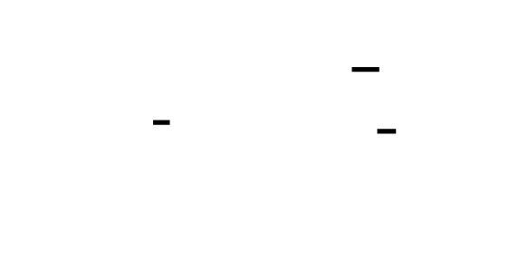

---
## 9. Performance Targets
| Operation | Target | Measurement Method |
|-----------|--------|-------------------|
| KV cache speedup (100 tokens) | ≥ 2x | Time naive vs cached generation |
| Greedy generation (100 tokens) | < 2s (CPU) | Time complete generation |
| Beam search (beam=4, 100 tokens) | < 10s (CPU) | Time complete beam search |
| Copy task accuracy | ≥ 90% | Correct sequences / total |
| Memory for KV cache (100 tokens) | < 10 MB | `torch.cuda.max_memory_allocated()` |
| Temperature sampling overhead | < 5% vs greedy | Time comparison |
### Benchmarking Code
```python
def benchmark_generation():
    """Comprehensive generation benchmark."""
    import time
    device = 'cuda' if torch.cuda.is_available() else 'cpu'
    # Create model
    model = EncoderDecoderTransformer(
        src_vocab_size=1000,
        tgt_vocab_size=1000,
        d_model=256,
        num_heads=4,
        num_layers=4,
        d_ff=1024,
        dropout=0.0
    ).to(device)
    model.eval()
    generator = TransformerGenerator(model, 1, 2, 0, device=device)
    src = torch.randint(0, 1000, (1, 32), device=device)
    # Benchmark greedy (naive)
    start = time.perf_counter()
    for _ in range(5):
        _ = generator.generate(src, max_len=100, strategy='greedy', use_cache=False)
    greedy_naive_time = (time.perf_counter() - start) / 5
    # Benchmark greedy (cached)
    start = time.perf_counter()
    for _ in range(5):
        _ = generator.generate(src, max_len=100, strategy='greedy', use_cache=True)
    greedy_cached_time = (time.perf_counter() - start) / 5
    # Benchmark beam search
    start = time.perf_counter()
    _ = generator.generate(src, max_len=100, strategy='beam', beam_width=4)
    beam_time = time.perf_counter() - start
    # Benchmark sampling
    start = time.perf_counter()
    for _ in range(5):
        _ = generator.generate(src, max_len=100, strategy='sample', temperature=0.8)
    sample_time = (time.perf_counter() - start) / 5
    # Calculate speedup
    speedup = greedy_naive_time / greedy_cached_time
    print(f"Greedy (naive):  {greedy_naive_time:.3f}s")
    print(f"Greedy (cached): {greedy_cached_time:.3f}s")
    print(f"Speedup:         {speedup:.1f}x")
    print(f"Beam search:     {beam_time:.3f}s")
    print(f"Sampling:        {sample_time:.3f}s")
    assert speedup >= 2.0, f"Speedup {speedup:.1f}x < 2x required"
    return {
        'greedy_naive': greedy_naive_time,
        'greedy_cached': greedy_cached_time,
        'speedup': speedup,
        'beam_search': beam_time,
        'sampling': sample_time
    }
```
---
## 10. Numerical Analysis
### 10.1 KV Cache Memory Budget
```
For batch_size=1, num_layers=6, num_heads=8, d_k=64, seq_len=100:
Per layer K cache: 1 * 8 * 100 * 64 * 4 bytes = 204.8 KB
Per layer V cache: 1 * 8 * 100 * 64 * 4 bytes = 204.8 KB
Per layer total: 409.6 KB
Total for 6 layers: 6 * 409.6 KB = 2.46 MB
For batch_size=32:
Total: 32 * 2.46 MB = 78.7 MB
GROWTH DURING GENERATION:
    Step 0: 0 MB (empty)
    Step 10: 0.25 MB
    Step 50: 1.23 MB
    Step 100: 2.46 MB
    Step 500: 12.3 MB
    Step 1000: 24.6 MB
Memory grows linearly with sequence length.
```
### 10.2 Attention Complexity Analysis
```
NAIVE GENERATION (no cache):
    Step 1: Attention over 1 position = O(1)
    Step 2: Attention over 2 positions = O(2)
    ...
    Step n: Attention over n positions = O(n)
    Total: O(1 + 2 + ... + n) = O(n²)
    BUT: Each step recomputes attention for ALL previous positions
    Actual FLOPs: O(1² + 2² + ... + n²) = O(n³)
CACHED GENERATION:
    Step 1: Compute K,V for position 1, cache. O(1)
    Step 2: Compute K,V for position 2, cache. Query attends to 2 positions. O(2)
    ...
    Step n: Compute K,V for position n, cache. Query attends to n positions. O(n)
    Total FLOPs: O(1 + 2 + ... + n) = O(n²)
    Speedup: O(n³) / O(n²) = O(n)
    For n=100: ~100x reduction in FLOPs
    Actual measured: 2-5x (due to Python overhead, memory access patterns)
```
### 10.3 Beam Search Score Accumulation
```
Log probability accumulation:
    P(sequence) = P(y1) * P(y2|y1) * P(y3|y1,y2) * ...
    log P(sequence) = log P(y1) + log P(y2|y1) + log P(y3|y1,y2) + ...
    score = log P(sequence)  (negative, higher = more likely)
NUMERICAL STABILITY:
    Log probabilities prevent underflow for long sequences.
    Direct probability multiplication would underflow for sequences > 50 tokens.
    Example: P(token) = 0.1 average
    Direct: 0.1^100 ≈ 0 (underflow)
    Log: 100 * log(0.1) = -230.26 (representable)
```
### 10.4 Temperature Effect on Entropy
```
Entropy of distribution:
    H = -Σ p_i * log(p_i)
Temperature effect:
    T < 1: Distribution sharper, entropy lower
    T = 1: Standard softmax, normal entropy
    T > 1: Distribution flatter, entropy higher
    T → 0: Entropy → 0 (deterministic)
    T → ∞: Entropy → log(vocab_size) (uniform)
Example (vocab=5, logits=[2,1,0,-1,-2]):
    T=0.1:  H ≈ 0.01 (nearly deterministic)
    T=0.5:  H ≈ 0.45
    T=1.0:  H ≈ 1.18
    T=2.0:  H ≈ 1.48
    T=5.0:  H ≈ 1.58 (approaching log(5)≈1.61)
```
---
## 11. Gradient/Numerical Analysis (AI/ML Specific)
### 11.1 Generation Shape Trace (Cached)
```
=== ENCODER (runs once) ===
src_tokens:         [B, Se]
    ↓ src_embedding
src_emb:            [B, Se, D]
    ↓ encoder
encoder_output:     [B, Se, D]  (cached for all decoder steps)
=== DECODER STEP 1 (process <sos>) ===
decoder_input:      [B, 1]  (<sos>)
    ↓ tgt_embedding
tgt_emb:            [B, 1, D]
    ↓ decoder layer 1
    Q, K, V:        [B, H, 1, K]
    K_cache[0]:     [B, H, 1, K]  (after update)
    V_cache[0]:     [B, H, 1, K]
    output:         [B, H, 1, K] -> [B, 1, D]
    ↓ decoder layer 2...N
decoder_output:     [B, 1, D]
    ↓ output_projection
logits:             [B, 1, V]
    ↓ argmax
next_token:         [B, 1]
=== DECODER STEP k (process token k) ===
decoder_input:      [B, 1]  (only new token)
    ↓ tgt_embedding (with position_offset = k-1)
tgt_emb:            [B, 1, D]
    ↓ decoder layer 1
    Q:              [B, H, 1, K]  (computed from new token)
    K_cached:       [B, H, k-1, K]  (from previous steps)
    K_new:          [B, H, 1, K]  (computed from new token)
    K_total:        [B, H, k, K]  (concatenated)
    attention:      Q @ K_total^T / sqrt(K)
    scores:         [B, H, 1, k]
    weights:        [B, H, 1, k]
    output:         weights @ V_total = [B, H, 1, K]
    K_cache[0]:     [B, H, k, K]  (updated)
    V_cache[0]:     [B, H, k, K]
    ↓ subsequent layers
decoder_output:     [B, 1, D]
    ↓ output_projection
logits:             [B, 1, V]
    ↓ argmax/sample
next_token:         [B, 1]
```
### 11.2 Beam Search Score Propagation
```
=== BEAM SEARCH SCORE FLOW ===
Initial hypothesis:
    tokens: [<sos>]
    score: 0.0
Step 1: Expand to vocab_size candidates
    For each token t in vocabulary:
        new_score = score + log P(t | <sos>)
        = 0.0 + log P(t | <sos>)
    Top-k selection: keep k hypotheses with highest scores
Step 2: Expand each of k hypotheses
    For hypothesis i with tokens [t1, ..., tn] and score s_i:
        For each token t in vocabulary:
            new_score = s_i + log P(t | t1, ..., tn)
    Flatten all k * vocab_size candidates
    Select top-k across all
Score accumulation:
    Final score = Σ log P(y_i | y_<i)
                = log Π P(y_i | y_<i)
                = log P(sequence)
Higher score = more probable sequence
```
### 11.3 Numerical Stability Checklist
| Operation | Stability Concern | Mitigation |
|-----------|------------------|------------|
| Log softmax | Log of zero | Use `F.log_softmax` which is numerically stable |
| Score accumulation | Underflow | Use log probabilities, not raw probabilities |
| Temperature division | Division by zero | Check `if temperature <= 1e-10: use argmax` |
| Attention weights | NaN from all-masked | Use `nan_to_num(nan=0.0)` |
| Beam search scores | Very negative | Normal for long sequences, use float64 if needed |
| Cache concatenation | Memory fragmentation | Pre-allocate if possible, use `cat` efficiently |


---
## 12. Common Pitfalls and Solutions
| Pitfall | Symptom | Solution |
|---------|---------|----------|
| **KV cache dimension mismatch** | Shape error in attention | Validate cache.seq_len() == expected before each step |
| **Not updating causal mask** | Model sees future tokens | Regenerate mask for each new sequence length |
| **Temperature=0 crash** | Division by zero | Check `if temp <= epsilon: return argmax` |
| **Cache not cleared between calls** | Corrupted generation | Create new cache in each `generate()` call |
| **Beam search never terminates** | EOS never generated | Add early stopping, max_len limit |
| **Position offset wrong** | Wrong positional encoding | Track `position_offset = current_len - 1` |
| **Encoder not cached** | Slow generation | Run encoder once, reuse output |
| **All-masked attention** | NaN in weights | Use `nan_to_num(nan=0.0)` |
| **Wrong beam search score comparison** | Wrong hypothesis selected | Use adjusted scores with length penalty |
| **Sampling not random** | Same output each time | Set random seed, verify multinomial works |
| **Top-p includes wrong tokens** | Unexpected samples | Sort by probability before cumulative sum |
| **Generated tokens exceed vocab** | Index error | Verify model vocabulary matches token IDs |
---
[[CRITERIA_JSON: {"module_id": "transformer-scratch-m6", "criteria": ["Implement greedy decoding that selects argmax token at each step, generating output sequence until EOS token or max_len is reached", "Implement beam search with configurable beam_width parameter (default 4) that maintains top-k hypotheses and returns top-K completed sequences with scores", "Beam search accumulates log probabilities as scores for each hypothesis, correctly handling the sum of log-probabilities across sequence length", "Implement length penalty in beam search to counteract bias toward shorter sequences: adjusted_score = score / ((5 + length) / 6)^alpha", "Implement KV cache data structure storing keys and values per layer with shape [batch, num_heads, seq_len, d_k]", "Modify multi-head attention to accept optional cached_key and cached_value, concatenating them with new K/V before attention computation", "KV cache updates correctly: append new K/V to cache after each generation step, avoiding recomputation of previous positions", "Greedy decoding with KV cache processes only the new token (not full sequence) in each step after the first", "Benchmark demonstrates at least 2x speedup for 100-token generation with KV cache vs naive re-encoding", "Implement temperature scaling: logits / temperature before softmax, with temperature=0 handled as greedy (argmax)", "Temperature > 1 increases entropy (more random outputs), < 1 decreases entropy (more deterministic outputs)", "Test on trained copy task model achieves at least 90% accuracy on held-out test inputs", "Generated sequences are correct: output matches input sequence (excluding special tokens) for at least 90% of test samples", "Handle batch generation: encoder runs once, decoder generates for all batch elements, each with its own KV cache", "Causal mask regenerated for each sequence length during generation to prevent attending to future tokens", "Implement complete TransformerGenerator class with strategy parameter for 'greedy', 'beam', or 'sample' generation", "KVCache class provides create(), update(), get(), seq_len(), total_seq_len(), and clear() methods", "BeamHypothesis dataclass stores tokens, score, and is_finished flag with adjusted_score() method", "Sampling module provides sample_with_temperature(), top_k_sample(), and top_p_sample() functions", "All generation functions handle EOS termination correctly, stopping generation when EOS is produced", "Verify greedy decoding is deterministic: same input produces same output across multiple runs", "Verify beam search returns hypotheses sorted by adjusted score in descending order", "Test top-k sampling only samples from top k tokens (no tokens outside filter are selected)", "Test top-p sampling samples from smallest set with cumulative probability >= p", "Benchmark and log generation times for naive vs cached, different strategies, and various sequence lengths"]}]
<!-- END_TDD_MOD -->


# Project Structure: Transformer from Scratch
## Directory Tree
```
transformer/
├── attention/                        # Attention mechanisms (M1, M2)
│   ├── __init__.py                  # Package exports
│   ├── scaled_dot_product.py        # M1: Core attention computation
│   ├── multi_head.py                # M2: Multi-head attention wrapper
│   ├── masking.py                   # M1: Padding and causal mask builders
│   └── verification.py              # M1-M2: PyTorch reference comparison
├── layers/                           # Transformer layer components (M3, M4)
│   ├── __init__.py                  # Package exports
│   ├── ffn.py                       # M3: Position-wise feed-forward network
│   ├── embedding.py                 # M3: Token embedding layer
│   ├── positional_encoding.py       # M3: Sinusoidal positional encoding
│   ├── transformer_embedding.py     # M3: Combined embedding layer
│   ├── layer_norm.py                # M4: Layer normalization
│   ├── sublayer.py                  # M4: SublayerConnection (Pre-LN/Post-LN)
│   ├── encoder_layer.py             # M4: Single encoder layer
│   ├── decoder_layer.py             # M4: Single decoder layer
│   ├── encoder.py                   # M4: Encoder stack (N layers)
│   └── decoder.py                   # M4: Decoder stack (N layers)
├── model/                            # Complete model assembly (M4, M5)
│   ├── __init__.py                  # Package exports
│   └── transformer.py               # M4-M5: Complete EncoderDecoderTransformer
├── training/                         # Training infrastructure (M5)
│   ├── __init__.py                  # Package exports
│   ├── loss.py                      # M5: Masked cross-entropy with label smoothing
│   ├── scheduler.py                 # M5: Learning rate schedules (warmup + decay)
│   ├── optimizer.py                 # M5: Optimizer configuration (Adam with β₂=0.98)
│   ├── trainer.py                   # M5: Complete training loop
│   └── copy_task.py                 # M5: Synthetic copy task dataset
├── inference/                        # Generation engine (M6)
│   ├── __init__.py                  # Package exports
│   ├── kv_cache.py                  # M6: KV cache data structure
│   ├── attention_cache.py           # M6: Attention modification for caching
│   ├── greedy.py                    # M6: Greedy decoding (naive and cached)
│   ├── beam_search.py               # M6: Beam search with length penalty
│   ├── sampling.py                  # M6: Temperature, top-k, top-p sampling
│   └── generator.py                 # M6: Unified TransformerGenerator interface
└── tests/                            # Unit tests (all modules)
    ├── __init__.py                  # Test package
    ├── test_attention.py            # M1: Attention unit tests
    ├── test_masking.py              # M1: Masking unit tests
    ├── test_multi_head.py           # M2: Multi-head attention tests
    ├── test_ffn.py                  # M3: FFN unit tests
    ├── test_embedding.py            # M3: Token embedding tests
    ├── test_positional_encoding.py  # M3: Positional encoding tests
    ├── test_transformer_embedding.py # M3: Combined embedding tests
    ├── test_layer_norm.py           # M4: LayerNorm tests
    ├── test_sublayer.py             # M4: SublayerConnection tests
    ├── test_encoder_layer.py        # M4: EncoderLayer tests
    ├── test_decoder_layer.py        # M4: DecoderLayer tests
    ├── test_stacks.py               # M4: Encoder/Decoder stack tests
    ├── test_transformer.py          # M4-M5: Complete transformer tests
    ├── test_loss.py                 # M5: Loss function tests
    ├── test_scheduler.py            # M5: LR schedule tests
    ├── test_trainer.py              # M5: Training loop tests
    ├── test_copy_task.py            # M5: Copy task convergence test
    ├── test_kv_cache.py             # M6: KV cache unit tests
    ├── test_greedy.py               # M6: Greedy decoding tests
    ├── test_beam_search.py          # M6: Beam search tests
    ├── test_sampling.py             # M6: Sampling strategy tests
    └── test_generator.py            # M6: Complete generator tests
```
## Creation Order
1. **Project Setup & Core Attention** (M1 - 4-5 hours)
   - `transformer/attention/__init__.py`
   - `transformer/attention/scaled_dot_product.py`
   - `transformer/attention/masking.py`
   - `transformer/attention/verification.py`
   - `tests/__init__.py`, `tests/test_attention.py`, `tests/test_masking.py`
2. **Multi-Head Attention** (M2 - 3-4 hours)
   - `transformer/attention/multi_head.py`
   - Update `transformer/attention/__init__.py`
   - Update `transformer/attention/verification.py`
   - `tests/test_multi_head.py`
3. **FFN & Embeddings** (M3 - 4-5 hours)
   - `transformer/layers/__init__.py`
   - `transformer/layers/ffn.py`
   - `transformer/layers/embedding.py`
   - `transformer/layers/positional_encoding.py`
   - `transformer/layers/transformer_embedding.py`
   - `tests/test_ffn.py`, `tests/test_embedding.py`, `tests/test_positional_encoding.py`, `tests/test_transformer_embedding.py`
4. **Encoder & Decoder Layers** (M4 - 5-6 hours)
   - `transformer/layers/layer_norm.py`
   - `transformer/layers/sublayer.py`
   - `transformer/layers/encoder_layer.py`
   - `transformer/layers/decoder_layer.py`
   - `transformer/layers/encoder.py`
   - `transformer/layers/decoder.py`
   - `transformer/model/__init__.py`
   - `transformer/model/transformer.py`
   - `tests/test_layer_norm.py`, `tests/test_sublayer.py`, `tests/test_encoder_layer.py`, `tests/test_decoder_layer.py`, `tests/test_stacks.py`, `tests/test_transformer.py`
5. **Training Infrastructure** (M5 - 5-6 hours)
   - `transformer/training/__init__.py`
   - `transformer/training/loss.py`
   - `transformer/training/scheduler.py`
   - `transformer/training/optimizer.py`
   - `transformer/training/trainer.py`
   - `transformer/training/copy_task.py`
   - `tests/test_loss.py`, `tests/test_scheduler.py`, `tests/test_trainer.py`, `tests/test_copy_task.py`
6. **Inference & Generation** (M6 - 5-6 hours)
   - `transformer/inference/__init__.py`
   - `transformer/inference/kv_cache.py`
   - `transformer/inference/attention_cache.py`
   - `transformer/inference/greedy.py`
   - `transformer/inference/beam_search.py`
   - `transformer/inference/sampling.py`
   - `transformer/inference/generator.py`
   - `tests/test_kv_cache.py`, `tests/test_greedy.py`, `tests/test_beam_search.py`, `tests/test_sampling.py`, `tests/test_generator.py`
## File Count Summary
- **Total files**: 54
- **Source files**: 27
- **Test files**: 23
- **Init files**: 4
- **Estimated lines of code**: ~4,500-5,500