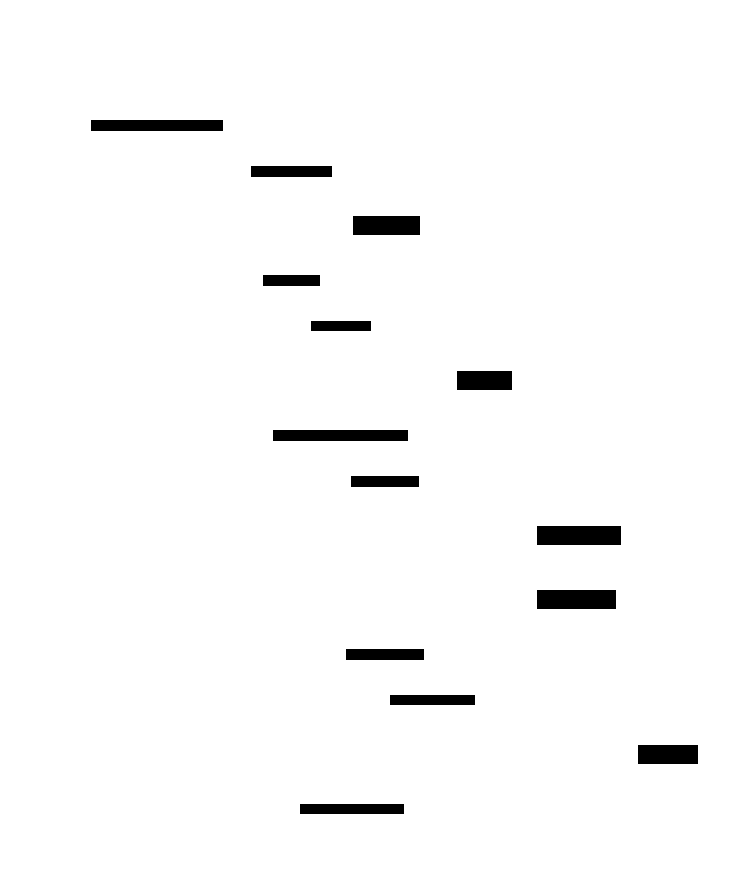
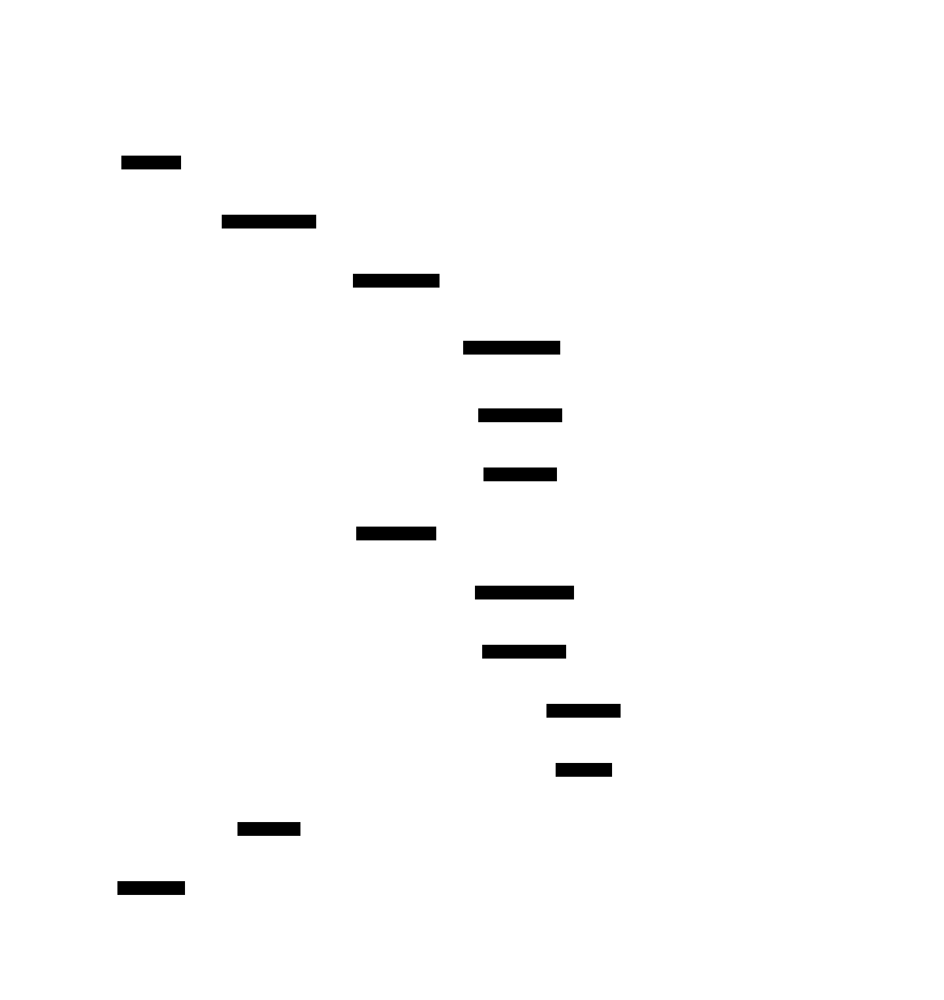

# Vector Database: Design Document


## Overview

This system implements a high-performance vector similarity search database optimized for AI/ML embeddings, using Hierarchical Navigable Small World (HNSW) indexing to achieve sub-linear search complexity. The key architectural challenge is balancing search accuracy with query latency while handling millions of high-dimensional vectors efficiently.


> This guide is meant to help you understand the big picture before diving into each milestone. Refer back to it whenever you need context on how components connect.


## Context and Problem Statement

> **Milestone(s):** Foundation for all milestones - establishes the problem space that drives the need for vector storage, distance metrics, search algorithms, HNSW indexing, and query APIs.

The explosion of AI and machine learning applications has created an unprecedented demand for **semantic similarity search**. Unlike traditional databases that match exact values or text keywords, modern applications need to find items that are conceptually similar - similar images, related documents, comparable products, or semantically equivalent phrases. This fundamental shift from exact matching to similarity matching represents one of the most significant changes in data retrieval since the invention of the relational database.

Consider how a human brain processes similarity: when you see a red sports car, you instantly recognize its similarity to other sports cars, even if they differ in brand, model, or exact shade of red. Your brain has somehow encoded the essence of "sports car-ness" in a way that enables rapid comparison. **Vector embeddings** serve as the mathematical equivalent of this encoding process. Machine learning models transform complex data - images, text, audio, user behavior patterns - into high-dimensional numerical vectors where similar items cluster together in vector space.

This transformation from raw data to vectors enables unprecedented applications: recommendation systems that understand user preferences beyond explicit ratings, search engines that grasp semantic meaning rather than just keyword matching, and content discovery platforms that can surface relevant items even when traditional metadata fails. However, this power comes with a fundamental computational challenge that forms the core problem this vector database must solve.

### Vector Search Fundamentals

Think of **vector similarity search** as navigation in a vast, multi-dimensional city where every location represents a different piece of content, and the distance between any two locations reflects how similar those pieces of content are to each other. In this geometric interpretation, finding similar items becomes a spatial problem: given your current location (query vector), find the nearest neighborhoods (similar vectors) within the city.

Unlike a normal city with just three spatial dimensions, vector spaces typically operate in hundreds or thousands of dimensions. A text embedding from a modern language model might live in 1,536-dimensional space, while an image embedding could occupy 2,048 dimensions. Each dimension captures a different aspect of the underlying content - perhaps one dimension represents "formality" in text or "brightness" in images, though these dimensions are typically learned features that don't map cleanly to human-interpretable concepts.

The **mathematical foundation** of vector similarity rests on geometric distance and angular measurements in this high-dimensional space. The three primary similarity metrics each capture different aspects of vector relationships:

| Metric | Formula Intuition | Geometric Meaning | Use Case |
|--------|------------------|-------------------|-----------|
| **Cosine Similarity** | Angle between vectors | Direction matters, magnitude ignored | Text embeddings, normalized features |
| **Euclidean Distance** | Straight-line distance | Both direction and magnitude matter | Image features, raw measurements |
| **Dot Product** | Projection magnitude | Magnitude amplifies similarity | Recommendation scores, unnormalized vectors |

**Cosine similarity** measures the angle between two vectors, completely ignoring their magnitudes. This makes it ideal for text embeddings where the "intensity" of a document matters less than its semantic direction. Two documents about machine learning will have similar directional vectors regardless of whether one is a brief summary and another is a comprehensive textbook.

**Euclidean distance** treats vectors as points in space and measures the straight-line distance between them. This metric considers both direction and magnitude, making it suitable for cases where the absolute values matter - such as image features where brightness levels carry semantic meaning.

**Dot product similarity** combines both angle and magnitude, effectively measuring how much one vector "projects onto" another. In recommendation systems, this can capture both the user's preference direction and the intensity of that preference.

The **curse of dimensionality** introduces counterintuitive behaviors in high-dimensional spaces that don't exist in our familiar three-dimensional world. In spaces with hundreds of dimensions, most vectors become nearly equidistant from each other - imagine a city where every location is roughly the same distance from every other location. This phenomenon makes similarity search both more challenging (smaller relative differences between distances) and more critical (the small differences that remain are highly meaningful).

Vector embeddings typically exhibit **clustering behavior** where semantically similar items form dense neighborhoods in the high-dimensional space. Text embeddings about sports cluster together, separate from embeddings about cooking, which in turn separate from financial topics. However, these clusters aren't perfect spheres - they often form complex, interleaving shapes that require sophisticated algorithms to navigate efficiently.

### The Scalability Challenge

The naive approach to vector similarity search - **brute force comparison** - involves computing the distance between a query vector and every stored vector, then selecting the k smallest distances. While conceptually simple and guaranteed to find the exact nearest neighbors, this approach faces insurmountable scalability challenges that make it impractical for real-world applications.

Consider the computational complexity: for a database containing N vectors, each with D dimensions, a single query requires N × D floating-point operations just for distance computation, plus additional work for result ranking. With modern embeddings typically using 1,000+ dimensions and databases containing millions of vectors, this translates to billions of operations per query. Even with optimized hardware, response times stretch into seconds or minutes - far too slow for interactive applications.

**Linear scaling doom** represents the fundamental problem: as your dataset grows, query time grows proportionally. A database with 1 million vectors might provide acceptable performance, but scaling to 10 million vectors makes every query 10x slower. This creates an impossible choice between dataset size and response time, forcing applications to either limit their data or accept unacceptable latency.

The **memory bandwidth bottleneck** compounds the computational challenge. Modern CPUs can perform arithmetic operations much faster than they can load data from memory. For vector search, this means that even if distance computation were instantaneous, simply reading all vectors from memory becomes the limiting factor. A database with 10 million 1,536-dimensional vectors requires reading 60GB of data per query - well beyond the capacity of typical memory systems to deliver in real-time.

**Real-time application demands** make these theoretical limitations painfully practical. Search engines expect sub-100ms response times, recommendation systems need to respond within tens of milliseconds, and interactive applications cannot tolerate multi-second delays. The gap between brute force performance (seconds to minutes) and application requirements (milliseconds) spans several orders of magnitude - too large to bridge through incremental optimization alone.

| Dataset Size | Dimensions | Brute Force Time | Application Requirement | Performance Gap |
|--------------|------------|------------------|-------------------------|-----------------|
| 100K vectors | 1,536 | ~10ms | 50ms | Acceptable |
| 1M vectors | 1,536 | ~100ms | 50ms | 2x too slow |
| 10M vectors | 1,536 | ~1,000ms | 50ms | 20x too slow |
| 100M vectors | 1,536 | ~10,000ms | 50ms | 200x too slow |

The **storage and indexing challenge** extends beyond computation to data management. Traditional database indexing techniques - B-trees, hash tables, inverted indexes - were designed for exact matching and range queries on scalar values. They provide no meaningful acceleration for similarity search in high-dimensional spaces. B-trees, for instance, become effectively useless beyond 10-15 dimensions due to the curse of dimensionality, where every vector appears equidistant from every other vector.

**Concurrency complications** arise when multiple queries execute simultaneously against the same vector dataset. Brute force search requires reading the entire dataset for each query, creating massive memory contention and cache interference. Unlike traditional databases where indexes enable selective data access, vector similarity search's requirement to consider every stored vector makes it inherently resource-intensive and difficult to parallelize effectively.

These scalability challenges necessitate a fundamental shift from exact search to **approximate nearest neighbor (ANN)** algorithms. Rather than guaranteeing the mathematically optimal results, ANN algorithms trade small amounts of accuracy for dramatic improvements in speed and scalability - typically achieving 95%+ recall (fraction of true nearest neighbors found) while providing 10x to 100x speedup over brute force approaches.

### Existing Approaches Comparison

The vector similarity search problem has spawned numerous algorithmic approaches, each representing different trade-offs between accuracy, speed, memory usage, and implementation complexity. Understanding these approaches provides crucial context for why **Hierarchical Navigable Small World (HNSW)** graphs have emerged as the leading solution for many applications.

**Locality Sensitive Hashing (LSH)** represents the probabilistic approach to approximate nearest neighbor search. Think of LSH as a sophisticated filing system that groups similar vectors into the same "buckets" based on hash functions designed to preserve similarity relationships. Vectors that are close in the original space have a high probability of being hashed into the same bucket, enabling search algorithms to examine only a small fraction of the total dataset.

LSH works by applying multiple hash functions, each designed to be "locality sensitive" - similar inputs produce identical hash values with high probability, while dissimilar inputs produce different hash values. For cosine similarity, common LSH schemes use random hyperplanes to partition the vector space. Each hyperplane acts as a binary decision boundary: vectors on one side get a 0 bit, vectors on the other side get a 1 bit. Combining multiple hyperplanes creates a binary signature that preserves angular relationships.

| LSH Characteristics | Advantages | Disadvantages |
|-------------------|------------|---------------|
| **Probabilistic guarantees** | Theoretical accuracy bounds | No guarantee for specific queries |
| **Sub-linear query time** | Scales well with dataset size | Requires multiple hash tables for good recall |
| **Memory efficient** | Compact hash representations | Hash computation overhead |
| **Implementation simplicity** | Straightforward to implement and understand | Parameter tuning can be challenging |

**Tree-based methods** attempt to organize vectors in hierarchical structures that enable logarithmic search times. The most common approaches include KD-trees, ball trees, and their variants. Think of these as decision trees where each internal node represents a spatial partition, and leaf nodes contain small groups of similar vectors.

KD-trees partition space using axis-aligned hyperplanes, recursively dividing each dimension. Ball trees use hyperspheres to partition space, grouping vectors within geometric balls. Both approaches work well in low-dimensional spaces but suffer from the curse of dimensionality - as dimensions increase beyond 10-20, the tree structure provides little benefit over brute force search because query regions must examine most of the tree anyway.

| Tree Method | Partition Strategy | Best Use Case | Dimensional Limit |
|-------------|-------------------|---------------|-------------------|
| **KD-Tree** | Axis-aligned hyperplanes | Low-dimensional dense data | ~10 dimensions |
| **Ball Tree** | Hyperspheres | Medium-dimensional clustered data | ~20 dimensions |
| **LSH Forest** | Random hyperplanes in tree structure | High-dimensional sparse data | 100+ dimensions |

**Inverted index approaches** adapt traditional text search techniques to vector similarity. These methods discretize the vector space into regions (often called "visual words" in image retrieval), then build inverted indexes mapping each region to the vectors it contains. Query processing involves finding regions close to the query vector and examining all vectors in those regions.

Product Quantization (PQ) represents the most sophisticated inverted index approach. PQ divides each vector into subvectors, quantizes each subvector independently using k-means clustering, and stores only the cluster assignments rather than the original values. This achieves dramatic compression while enabling approximate distance computation using precomputed lookup tables.

**Graph-based methods** represent vectors as nodes in a graph where edges connect similar vectors. Search proceeds by starting at random or heuristically chosen entry points and greedily following edges toward the query vector. The key insight is that well-constructed graphs exhibit "small world" properties - short paths exist between any two nodes, and local greedy search can find these paths efficiently.

The **Navigable Small World (NSW)** algorithm constructs graphs by connecting each vector to its closest neighbors, creating a structure where greedy search can navigate efficiently from any starting point to any target region. However, NSW suffers from performance degradation as the graph grows larger - entry points become less optimal, and search paths grow longer.

**Hierarchical Navigable Small World (HNSW)** extends NSW by creating multiple graph layers, similar to highway systems with local roads, arterials, and freeways. Higher layers contain fewer nodes but longer-range connections, enabling search to quickly traverse large distances. Lower layers provide finer-grained connectivity for precise localization. This hierarchical structure maintains logarithmic search complexity even as the dataset grows.

> **Decision: Graph-Based ANN Algorithm Selection**
> - **Context**: Need an ANN algorithm that provides excellent recall-latency trade-offs while supporting incremental updates and reasonable memory usage for a general-purpose vector database
> - **Options Considered**: 
>   1. Locality Sensitive Hashing with multiple hash tables
>   2. Product Quantization with inverted indexes  
>   3. Hierarchical Navigable Small World graphs
> - **Decision**: Implement HNSW as the primary ANN algorithm
> - **Rationale**: HNSW consistently achieves the best recall-latency trade-offs across diverse datasets and dimensions. It supports incremental insertion without full index rebuilds, provides predictable memory usage, and has proven production reliability. While more complex to implement than LSH, the performance benefits justify the additional complexity.
> - **Consequences**: Enables sub-millisecond queries with >95% recall on million-scale datasets, but requires careful parameter tuning and graph maintenance. Implementation complexity is higher than simpler alternatives.

| Approach | Query Time | Memory Usage | Accuracy | Implementation Complexity | Best For |
|----------|------------|--------------|----------|---------------------------|----------|
| **LSH** | O(log N) | Low | Good | Simple | High-dimensional sparse vectors |
| **Tree Methods** | O(log N)* | Medium | Exact* | Medium | Low-dimensional dense vectors |
| **Inverted Index** | O(√N) | Very Low | Good | Medium | Memory-constrained applications |
| **HNSW Graphs** | O(log N) | High | Excellent | Complex | General-purpose high performance |

*Performance degrades significantly in high dimensions

The **hybrid approaches** combine multiple techniques to leverage their complementary strengths. Common combinations include LSH for initial filtering followed by exact distance computation on candidates, or HNSW graphs with product quantization for memory efficiency. These approaches often achieve better overall performance than any single technique alone, but at the cost of increased implementation and operational complexity.

**Performance benchmarking** across these approaches reveals that no single algorithm dominates all scenarios. LSH excels for very high-dimensional sparse vectors typical in text processing. Tree methods remain optimal for low-dimensional scientific data. Inverted indexes work well in memory-constrained environments. However, for the broad range of applications targeted by a general-purpose vector database - moderate to high dimensions, dense vectors, mixed workloads of search and updates - HNSW graphs consistently provide the best balance of query speed, accuracy, and operational flexibility.

The **operational considerations** often prove as important as raw performance metrics. HNSW supports incremental updates without full index rebuilds, making it suitable for dynamic datasets. LSH requires rebuilding hash tables when data distribution changes. Tree methods become unbalanced with skewed insertions. These practical concerns, combined with HNSW's superior performance characteristics, explain its adoption by major vector database systems including Pinecone, Weaviate, and Qdrant.

Understanding this landscape of approaches provides essential context for the architectural decisions throughout this vector database implementation. While we focus on HNSW as our primary ANN algorithm, the design maintains flexibility to incorporate additional algorithms as specialized components for specific use cases or performance optimizations.

### Implementation Guidance

The vector similarity search problem space encompasses several implementation approaches, each suited to different application requirements and constraints. This guidance section provides concrete direction for building a production-ready vector database using HNSW as the core algorithm while maintaining architectural flexibility for future extensions.

**Technology Recommendations:**

| Component | Simple Option | Advanced Option |
|-----------|---------------|-----------------|
| **Distance Computation** | Standard library math functions | SIMD-optimized libraries (faster_math, simdeez) |
| **Graph Storage** | In-memory adjacency lists | Memory-mapped graph files with custom layouts |
| **Serialization** | JSON for configuration, bincode for data | Protocol Buffers with schema evolution |
| **Concurrency** | RwLock for read-heavy workloads | Lock-free data structures (crossbeam) |
| **Memory Management** | Standard allocators | Custom memory pools for vector storage |

**Recommended Project Structure:**

The codebase organization reflects the layered architecture from storage primitives through search algorithms to API interfaces:

```
vector-db/
├── src/
│   ├── main.rs                    ← Server entry point and configuration
│   ├── lib.rs                     ← Public API exports
│   ├── storage/                   ← Vector Storage Engine (Milestone 1)
│   │   ├── mod.rs                 ← Storage module exports  
│   │   ├── vector_store.rs        ← Core vector storage implementation
│   │   ├── memory_map.rs          ← Memory-mapped file handling
│   │   ├── compaction.rs          ← Storage compaction and maintenance
│   │   └── batch_ops.rs           ← Batch insert/update operations
│   ├── metrics/                   ← Distance Metrics Engine (Milestone 2)
│   │   ├── mod.rs                 ← Metrics module exports
│   │   ├── distance.rs            ← Distance computation implementations
│   │   ├── simd.rs                ← SIMD-optimized distance functions
│   │   └── batch_compute.rs       ← Batch distance computation
│   ├── search/                    ← Search Engines (Milestones 3-4)
│   │   ├── mod.rs                 ← Search module exports
│   │   ├── brute_force.rs         ← Exhaustive search implementation
│   │   ├── hnsw/                  ← HNSW index implementation
│   │   │   ├── mod.rs             ← HNSW module exports
│   │   │   ├── graph.rs           ← Graph structure and maintenance
│   │   │   ├── construction.rs    ← Index construction algorithms
│   │   │   ├── search.rs          ← Graph search algorithms
│   │   │   └── persistence.rs     ← Graph serialization/deserialization
│   │   └── result_set.rs          ← Top-k result management
│   ├── api/                       ← Query API and Server (Milestone 5)
│   │   ├── mod.rs                 ← API module exports
│   │   ├── server.rs              ← HTTP/gRPC server implementation
│   │   ├── handlers.rs            ← Request handlers and routing
│   │   ├── models.rs              ← API request/response models
│   │   └── middleware.rs          ← Authentication, logging, rate limiting
│   ├── types.rs                   ← Shared type definitions
│   ├── config.rs                  ← Configuration management
│   └── error.rs                   ← Error types and handling
├── tests/                         ← Integration tests
│   ├── storage_tests.rs           ← Storage engine test suites
│   ├── search_tests.rs            ← Search algorithm test suites
│   └── api_tests.rs               ← API endpoint test suites
├── benches/                       ← Performance benchmarks
│   ├── distance_bench.rs          ← Distance computation benchmarks
│   ├── search_bench.rs            ← Search algorithm benchmarks
│   └── end_to_end_bench.rs        ← Full system benchmarks
└── examples/                      ← Usage examples and tutorials
    ├── basic_usage.rs             ← Simple insert/search example
    ├── batch_operations.rs        ← Batch processing example
    └── custom_metrics.rs          ← Custom distance metric example
```

**Core Type Definitions:**

The foundational types establish the contracts between components and provide type safety for vector operations:

```rust
// types.rs - Core type definitions used across the system

/// Unique identifier for stored vectors
pub type VectorId = u64;

/// Vector dimension count - must be consistent within a collection  
pub type Dimensions = usize;

/// Raw vector data as 32-bit floats for balance of precision and performance
pub type Vector = Vec<f32>;

/// Distance/similarity score between vectors
pub type Score = f32;

/// HNSW graph layer index (0 = base layer, higher = more abstract layers)
pub type LayerIndex = usize;

/// Node degree in HNSW graph (number of connections)
pub type Degree = usize;

/// Collection configuration specifying vector dimensions and search parameters
#[derive(Debug, Clone, PartialEq)]
pub struct CollectionConfig {
    /// Vector dimensionality - all vectors in collection must match
    pub dimensions: Dimensions,
    /// Distance metric for similarity computation
    pub metric: DistanceMetric,
    /// HNSW construction parameter - connections per layer
    pub hnsw_m: Degree,
    /// HNSW search parameter - exploration width during construction
    pub hnsw_ef_construction: usize,
    /// Default search parameter - exploration width during queries
    pub hnsw_ef_search: usize,
}

/// Supported distance metrics with different geometric interpretations
#[derive(Debug, Clone, Copy, PartialEq, Eq)]
pub enum DistanceMetric {
    /// Cosine similarity - measures angle between vectors (0.0 to 2.0, lower is more similar)
    Cosine,
    /// Euclidean L2 distance - measures geometric distance (0.0+, lower is more similar)  
    Euclidean,
    /// Dot product similarity - measures projection magnitude (negative to positive, higher is more similar)
    DotProduct,
}
```

**Error Handling Strategy:**

Comprehensive error handling provides clear diagnostics and enables graceful degradation:

```rust
// error.rs - Centralized error handling for all components

use thiserror::Error;

/// Top-level error type encompassing all system failures
#[derive(Error, Debug)]
pub enum VectorDbError {
    #[error("Storage operation failed: {0}")]
    Storage(#[from] StorageError),
    
    #[error("Search operation failed: {0}")]
    Search(#[from] SearchError),
    
    #[error("API request failed: {0}")]
    Api(#[from] ApiError),
    
    #[error("Configuration error: {0}")]
    Config(String),
    
    #[error("I/O operation failed: {0}")]
    Io(#[from] std::io::Error),
}

/// Storage-specific errors with detailed context
#[derive(Error, Debug)]
pub enum StorageError {
    #[error("Vector dimension mismatch: expected {expected}, got {actual}")]
    DimensionMismatch { expected: usize, actual: usize },
    
    #[error("Vector ID {id} not found")]
    VectorNotFound { id: VectorId },
    
    #[error("Memory mapping failed for file: {path}")]
    MemoryMapFailed { path: String },
    
    #[error("Insufficient disk space: need {needed} bytes, have {available} bytes")]
    InsufficientSpace { needed: u64, available: u64 },
}

// TODO: Add SearchError and ApiError enums following similar patterns
```

**Distance Metric Implementation Skeleton:**

The distance computation forms the mathematical foundation for all similarity operations:

```rust
// metrics/distance.rs - Core distance computation implementations

use crate::types::{Vector, Score, DistanceMetric};
use crate::error::VectorDbError;

/// Compute distance between two vectors using the specified metric
/// 
/// # Arguments
/// * `a` - First vector for comparison
/// * `b` - Second vector for comparison  
/// * `metric` - Distance metric to use for computation
///
/// # Returns
/// * Distance score where interpretation depends on metric:
///   - Cosine: 0.0-2.0 (lower = more similar)
///   - Euclidean: 0.0+ (lower = more similar)
///   - DotProduct: -∞ to +∞ (higher = more similar)
pub fn compute_distance(a: &Vector, b: &Vector, metric: DistanceMetric) -> Result<Score, VectorDbError> {
    // TODO 1: Validate that vectors have matching dimensions
    // TODO 2: Branch on metric type and delegate to specific implementation
    // TODO 3: Handle numerical edge cases (zero vectors, overflow, NaN)
    todo!("Implement distance computation dispatch")
}

/// Compute cosine distance between two vectors
/// Formula: 1.0 - (a·b) / (|a| * |b|)
pub fn cosine_distance(a: &Vector, b: &Vector) -> Score {
    // TODO 1: Compute dot product sum(a[i] * b[i])
    // TODO 2: Compute magnitude of vector a: sqrt(sum(a[i]²))  
    // TODO 3: Compute magnitude of vector b: sqrt(sum(b[i]²))
    // TODO 4: Handle zero magnitude case (return max distance)
    // TODO 5: Return 1.0 - (dot_product / (mag_a * mag_b))
    // Hint: Use f32::sqrt() and handle division by zero
    todo!("Implement cosine distance computation")
}

/// Compute Euclidean distance between two vectors  
/// Formula: sqrt(sum((a[i] - b[i])²))
pub fn euclidean_distance(a: &Vector, b: &Vector) -> Score {
    // TODO 1: Initialize sum accumulator
    // TODO 2: Iterate through vector elements
    // TODO 3: Compute difference: diff = a[i] - b[i]  
    // TODO 4: Add squared difference to sum: sum += diff * diff
    // TODO 5: Return square root of sum
    // Hint: Consider using Iterator::zip for element pairing
    todo!("Implement Euclidean distance computation")
}

/// Compute dot product similarity between two vectors
/// Formula: sum(a[i] * b[i]) 
pub fn dot_product_similarity(a: &Vector, b: &Vector) -> Score {
    // TODO 1: Initialize sum accumulator  
    // TODO 2: Iterate through paired elements
    // TODO 3: Multiply corresponding elements and add to sum
    // TODO 4: Return accumulated sum (no transformation needed)
    // Hint: Higher values indicate greater similarity
    todo!("Implement dot product similarity computation")
}
```

**Milestone Checkpoints:**

After completing the foundational understanding and initial setup, verify your comprehension with these checkpoints:

**Checkpoint 1: Problem Understanding**
- Explain why brute force search becomes impractical at scale (target: understand O(N×D) scaling)
- Compare cosine similarity vs. Euclidean distance for text embeddings (expect: cosine preferred for normalized semantic vectors)
- Describe the curse of dimensionality impact on tree-based methods (expect: effectiveness drops dramatically above 20 dimensions)

**Checkpoint 2: Algorithm Selection**  
- Justify HNSW selection over LSH for general-purpose use (expect: better recall-latency trade-offs, incremental updates)
- Identify scenarios where LSH might be preferred (expect: memory-constrained, very high-dimensional sparse vectors)
- Explain the highway analogy for HNSW hierarchical structure (expect: fast long-distance travel via upper layers, precision via lower layers)

**Checkpoint 3: Implementation Readiness**
- Set up the project structure with placeholder files
- Implement basic error types and distance metric enums
- Write unit tests for the distance computation signatures (expect: compile-time verification of type contracts)

**Common Problem Space Pitfalls:**

⚠️ **Pitfall: Underestimating Dimensionality Impact**
Many developers assume that techniques working well in 2D or 3D will scale to high-dimensional spaces. The curse of dimensionality fundamentally changes distance relationships - in high dimensions, the ratio between nearest and farthest neighbors approaches 1.0, making small differences critically important. Design your algorithms and data structures with 100+ dimensional spaces as the primary target.

⚠️ **Pitfall: Ignoring Numerical Precision**  
Distance computations in high-dimensional spaces accumulate floating-point errors that can affect search quality. Use consistent precision (f32 vs f64), implement numerically stable algorithms (avoid catastrophic cancellation), and test edge cases like zero vectors or near-identical vectors that might cause division-by-zero or loss of precision.

⚠️ **Pitfall: Conflating Distance Metrics**
Different similarity metrics have different value ranges, ordering, and semantic meanings. Cosine similarity ranges from -1 to 1 (often shifted to 0 to 2), Euclidean distance ranges from 0 to infinity, and dot product can be any real number. Never compare raw scores across different metrics, and always document which metric produces which result format.

⚠️ **Pitfall: Oversimplifying ANN Trade-offs**
Approximate Nearest Neighbor algorithms involve complex trade-offs between speed, accuracy, memory usage, and update performance. There's no single "best" algorithm - the optimal choice depends on your specific data characteristics, query patterns, and performance requirements. Design your system to accommodate multiple ANN approaches rather than hard-coding assumptions about HNSW being universally optimal.

This foundational understanding of the vector similarity search problem space, scalability challenges, and algorithmic approaches provides the essential context for implementing each component of the vector database system. The subsequent sections build upon these concepts to create a production-ready system that balances performance, accuracy, and operational requirements.


## Goals and Non-Goals

> **Milestone(s):** Foundation for all milestones - establishes clear boundaries and success criteria that guide implementation decisions across Vector Storage, Distance Metrics, Brute Force Search, HNSW Index, and Query API components.

The success of any complex system depends heavily on explicit scope definition. Think of goals and non-goals as a contract between the engineering team and stakeholders - they prevent scope creep, guide architectural decisions, and provide measurable success criteria. For a vector database, this is particularly critical because the space of possible features is enormous, from simple similarity search to complex multi-modal retrieval systems.

This section establishes three types of boundaries: functional goals that define what features the system must provide, performance goals that quantify acceptable speed and accuracy trade-offs, and explicit non-goals that clearly state what capabilities are intentionally excluded from this implementation. These boundaries directly influence every subsequent design decision, from storage layout choices to API surface area.

### Functional Goals

The functional goals define the core capabilities that make this a useful vector database for AI/ML applications. These goals flow directly from the problem statement's identified requirements and form the foundation for our milestone-based development approach.

**Primary Vector Operations**

The system must support the fundamental vector lifecycle operations that any production vector database requires. **Vector insertion** forms the foundation - users must be able to store high-dimensional vector embeddings with associated metadata, supporting batch operations for efficient data loading. The system needs to handle vectors of configurable dimensions (typically 128 to 4096 for modern AI models) while maintaining type safety and memory efficiency.

**Vector similarity search** represents the core value proposition. Users query with a vector and receive the most similar stored vectors ranked by distance. This includes support for top-k queries (finding the k nearest neighbors) and threshold-based queries (finding all vectors within a similarity cutoff). The search must handle metadata filtering, allowing users to combine vector similarity with structured predicates like "find similar images tagged as 'outdoor' created after 2023".

**Vector management operations** complete the CRUD interface. Users need to update existing vectors (upsert semantics), delete vectors by ID, and query vector metadata without performing similarity search. The system must handle these operations efficiently while maintaining index consistency.

| Operation Category | Required Operations | Key Requirements |
|-------------------|-------------------|------------------|
| Insert | Single vector insert, batch vector insert, upsert by ID | Configurable dimensions, metadata support, transactional semantics |
| Search | Top-k similarity search, threshold-based search, filtered search | Multiple distance metrics, metadata predicates, result ranking |
| Management | Get vector by ID, update vector, delete vector, list metadata | Efficient ID lookup, cascade index updates, soft delete option |
| Administrative | Create collection, configure collection, get collection stats | Dimension validation, metric configuration, storage statistics |

**Multi-Metric Distance Support**

Different AI applications require different similarity measures, and the system must support the three most common metrics natively. **Cosine similarity** measures angular distance, making it ideal for normalized embeddings where magnitude doesn't matter (like word embeddings or document vectors). **Euclidean distance** measures geometric straight-line distance, suitable for spatial embeddings or cases where magnitude carries semantic meaning. **Dot product similarity** measures projection magnitude, useful for recommendation systems and certain neural network architectures.

The system must handle metric-specific optimizations automatically. For cosine similarity, vectors should be normalized to unit length on insertion to avoid redundant normalization during search. For Euclidean distance, the system can use squared distance to avoid expensive square root operations when only ranking matters.

> **Decision: Multi-Metric Architecture**
> - **Context**: Different AI models and use cases require different similarity measures, but implementing multiple metrics adds complexity
> - **Options Considered**: Single metric (cosine only), pluggable metric interface, native multi-metric support
> - **Decision**: Native support for cosine, Euclidean, and dot product with metric-specific optimizations
> - **Rationale**: These three metrics cover 95% of real-world use cases, native implementation allows SIMD optimizations, and metric-specific handling improves performance significantly
> - **Consequences**: More complex distance computation engine but much better performance than generic interfaces

**Collection Management**

The system must support multiple independent **collections** (similar to database tables), each with its own configuration for vector dimensions, distance metric, and index parameters. Collections provide namespace isolation and allow different applications or data types to coexist in the same database instance. Each collection maintains separate storage files and indexes, enabling independent scaling and maintenance.

Collection configuration must be immutable after creation for critical parameters like dimensions and distance metric, since changing these would invalidate the entire index. However, search parameters like HNSW's `ef_search` should be adjustable at query time to allow recall-latency trade-offs.

**Metadata Integration**

Modern vector databases aren't just about vectors - they're about vectors plus structured data. The system must support rich metadata attached to each vector, including strings, numbers, booleans, and arrays. This metadata enables **hybrid search** scenarios where vector similarity combines with traditional filtering: "find documents similar to this query but only from the last month and tagged as 'technical'".

Metadata filtering must be efficient enough to use as a pre-filter before vector search, not just as a post-filter on results. This requires indexing strategies for high-cardinality metadata fields and careful integration with the vector search pipeline.

**Persistence and Recovery**

All data must persist durably to disk with configurable consistency guarantees. The system needs **write-ahead logging** or equivalent mechanisms to ensure that accepted writes survive crashes. On restart, the system must recover to a consistent state without manual intervention.

Index data should persist separately from raw vector data, allowing for index rebuilding without data loss. The system should support **incremental index updates** - adding new vectors shouldn't require rebuilding the entire index from scratch.

### Performance Goals

Performance goals translate functional requirements into measurable targets that guide architectural decisions and provide acceptance criteria for implementation milestones. These goals reflect the fundamental trade-offs in vector databases: query latency versus throughput, accuracy versus speed, and memory usage versus performance.

**Query Latency Targets**

The system must achieve **sub-100ms p99 query latency** for similarity search on datasets up to 1 million vectors with 512-dimensional embeddings. This target reflects typical interactive application requirements where vector search supports user-facing features like semantic search or recommendation engines.

For larger datasets (1-10 million vectors), the system should maintain **sub-500ms p99 latency** with appropriate HNSW parameter tuning. Beyond 10 million vectors, graceful degradation is acceptable as long as the system remains substantially faster than brute force search.

**Brute force search** serves as both a baseline and a fallback, and must achieve reasonable performance for smaller datasets. Target performance: complete scan of 100k 512-dimensional vectors in under 100ms using SIMD-optimized distance computation.

| Dataset Size | Dimensions | Target p99 Latency | Search Method | Memory Budget |
|-------------|------------|-------------------|---------------|---------------|
| < 100k vectors | 128-2048 | 50ms | Brute force acceptable | 2GB RAM |
| 100k - 1M vectors | 128-1024 | 100ms | HNSW required | 8GB RAM |
| 1M - 10M vectors | 128-512 | 500ms | HNSW optimized | 32GB RAM |
| > 10M vectors | 128-384 | < 2s | HNSW + filtering | 64GB+ RAM |

**Throughput Requirements**

The system must support **concurrent queries** with minimal performance degradation. Target: 100 concurrent search requests with less than 2x latency increase compared to single-threaded performance. This requires careful lock management and potentially lock-free data structures for read-heavy workloads.

**Write throughput** should support batch insertion of 10k vectors per second for offline indexing scenarios. Individual insert operations should complete in under 10ms for interactive applications.

**Search Accuracy Targets**

Since HNSW is an approximate algorithm, the system must balance accuracy against speed through configurable parameters. The accuracy target is **95% recall@10** - when searching for the 10 nearest neighbors, the HNSW index should find at least 9 of the true 10 nearest neighbors compared to brute force search.

Different accuracy-speed trade-offs should be achievable through parameter tuning:
- High accuracy mode: 98%+ recall, higher latency
- Balanced mode: 95% recall, target latency 
- Fast mode: 90% recall, lowest latency

> **Decision: Recall-Latency Trade-off Strategy**
> - **Context**: Different applications need different points on the accuracy-speed curve, but too many configuration options create complexity
> - **Options Considered**: Fixed parameters for simplicity, full parameter exposure, preset quality profiles
> - **Decision**: Expose key HNSW parameters (M, ef_construction, ef_search) with recommended presets
> - **Rationale**: Advanced users need fine control, but beginners need good defaults; presets provide both
> - **Consequences**: More testing required to validate preset quality, but much better user experience

**Memory Efficiency Targets**

Vector storage is memory-intensive, so the system must use memory efficiently. Target **memory overhead** of less than 50% beyond raw vector data - if vectors require 1GB of storage, total memory usage should stay under 1.5GB including indexes and metadata.

For HNSW indexes, memory overhead depends on connectivity parameters but should remain predictable. The system should provide memory usage estimates based on dataset size and configuration parameters.

**Scalability Characteristics**

While this implementation focuses on single-node deployment, the architecture should demonstrate **sub-linear search complexity**. Doubling dataset size should less than double query latency, showing clear improvement over brute force's linear scaling.

The system must handle **incremental growth** efficiently - adding 10% more vectors to an existing index should not require rebuilding the entire index or cause significant performance degradation.

### Explicit Non-Goals

Non-goals are equally important as goals because they prevent scope creep and clarify architectural trade-offs. These exclusions are intentional design decisions that simplify the implementation while still creating a meaningful vector database.

**Distributed System Features**

This implementation explicitly **excludes distributed deployment**. The system is designed as a single-node database that can handle datasets fitting in one machine's memory and storage. This excludes:
- Cluster management and node discovery
- Data sharding across multiple machines  
- Distributed consensus algorithms for consistency
- Cross-node query coordination and result merging
- Fault tolerance across machine boundaries

The single-node constraint dramatically simplifies the implementation while still supporting many real-world use cases. Modern machines can handle millions of vectors, covering the needs of many applications.

**Advanced Query Types**

The system focuses on core similarity search and excludes more complex query patterns that would significantly complicate the implementation:
- **Range queries** (find all vectors within a distance range) - these interact poorly with HNSW's graph structure
- **Multi-vector queries** (find vectors similar to A OR B) - requires query planning and result merging logic
- **Similarity joins** (find pairs of vectors within distance X) - computationally expensive and rarely needed
- **Temporal queries** (similarity search with time decay) - requires specialized indexing approaches

**Machine Learning Integration**

While the system stores vector embeddings produced by ML models, it does **not include ML model inference**. Users must generate embeddings externally and provide them to the database. This excludes:
- Built-in text or image embedding models
- Model serving infrastructure for real-time inference
- Training or fine-tuning capabilities for embedding models
- Multi-modal embedding fusion (combining text, image, etc.)

This separation of concerns keeps the database focused on vector storage and retrieval rather than becoming a full ML platform.

**Advanced Index Types**

The implementation focuses on HNSW as the primary approximate nearest neighbor algorithm. It explicitly excludes other ANN approaches that would add significant complexity:
- **Locality Sensitive Hashing (LSH)** - different algorithmic approach with different trade-offs
- **Product Quantization** - compression technique that reduces accuracy
- **Inverted file indexes** - more complex implementation with different performance characteristics
- **Tree-based indexes** (ball trees, k-d trees) - poor performance in high dimensions

HNSW provides excellent performance across a wide range of use cases and dimensions, making it a good single choice for this implementation.

**Enterprise Features**

To focus on core database functionality, several enterprise-oriented features are excluded:
- **Authentication and authorization** - no user management or access control
- **Encryption** at rest or in transit - data stored and transmitted in plain text
- **Audit logging** - no detailed logging of data access patterns
- **Multi-tenancy** - no isolation between different users or applications beyond collections
- **Backup and restore** - no automated backup mechanisms or point-in-time recovery
- **Monitoring and metrics** - basic health checks only, no detailed performance metrics

**Advanced Storage Features**

The storage engine focuses on correctness and reasonable performance while excluding optimizations that would significantly complicate the implementation:
- **Compression** - vectors stored in full precision without compression
- **Tiered storage** - no automatic movement between hot/warm/cold storage tiers
- **Cross-datacenter replication** - single-node deployment only
- **Advanced transaction semantics** - basic consistency only, no multi-operation transactions

> **Decision: Scope Limitations Strategy**
> - **Context**: Vector databases could include dozens of advanced features, but implementation complexity grows exponentially
> - **Options Considered**: Minimal viable product, feature-complete single-node system, simplified distributed system
> - **Decision**: Feature-complete single-node system with clear extension points
> - **Rationale**: Single-node eliminates distributed systems complexity while still being useful; extension points enable future growth
> - **Consequences**: Limited to datasets fitting on one machine, but much simpler to implement correctly and debug

**Performance Trade-offs Not Pursued**

Several performance optimizations are explicitly excluded to keep the implementation manageable:
- **GPU acceleration** - CPU-only implementation using SIMD where appropriate
- **Custom memory allocators** - rely on system allocator rather than optimizing memory allocation patterns
- **Lock-free data structures** - use traditional locks for simplicity and correctness
- **Zero-copy serialization** - accept copying overhead for implementation simplicity

These limitations define a system that's sophisticated enough to be useful in production scenarios while remaining simple enough for thorough implementation and testing. The architecture includes extension points where these excluded features could be added in future iterations.

| Feature Category | Included | Excluded | Rationale |
|-----------------|----------|-----------|-----------|
| Deployment | Single-node | Distributed clusters | Simplifies consistency and debugging |
| Search Types | K-NN, threshold, filtered | Range, multi-vector, joins | HNSW optimizes for single-vector queries |
| ML Integration | Vector storage | Model inference | Separation of concerns |
| Index Types | HNSW | LSH, quantization, trees | HNSW covers most use cases well |
| Enterprise | Collections, persistence | Auth, encryption, audit | Focus on core database functionality |
| Performance | SIMD, caching | GPU, lock-free, zero-copy | Balanced complexity vs. performance |

### Implementation Guidance

Building a vector database requires balancing multiple complex subsystems while maintaining clear interfaces between components. The following guidance helps structure the implementation to match the goals defined above.

**Technology Recommendations**

| Component | Simple Option | Advanced Option |
|-----------|---------------|-----------------|
| API Server | HTTP REST with JSON (tokio + axum) | gRPC with Protocol Buffers (tonic) |
| Serialization | JSON for metadata, bincode for vectors | Cap'n Proto or FlatBuffers for zero-copy |
| Concurrency | RwLock for read-heavy workloads | Crossbeam for lock-free data structures |
| Storage | Memory-mapped files (memmap2) | Custom page cache with async I/O |
| SIMD | std::simd when stable, manual intrinsics | Hand-optimized assembly for critical paths |
| Error Handling | thiserror for structured errors | anyhow for rapid prototyping |

For this implementation, choose the simple options first - they provide 80% of the performance with 20% of the complexity. The advanced options can be added later once the core system is working correctly.

**Recommended Project Structure**

The goals and non-goals directly influence code organization. Structure the project to reflect the major functional boundaries:

```rust
vector-db/
├── Cargo.toml
├── src/
│   ├── main.rs                    // Server entry point
│   ├── lib.rs                     // Public API exports
│   ├── api/                       // Query API & Server (Milestone 5)
│   │   ├── mod.rs                 // REST/gRPC server
│   │   ├── handlers.rs            // Request/response handling
│   │   ├── validation.rs          // Input validation
│   │   └── errors.rs              // API error types
│   ├── storage/                   // Vector Storage Engine (Milestone 1)
│   │   ├── mod.rs                 // Storage abstraction
│   │   ├── vectors.rs             // Vector storage implementation
│   │   ├── metadata.rs            // Metadata indexing
│   │   ├── mmap.rs                // Memory-mapped file handling
│   │   └── compaction.rs          // Storage compaction
│   ├── distance/                  // Distance Metrics Engine (Milestone 2)
│   │   ├── mod.rs                 // Distance metric traits
│   │   ├── cosine.rs              // Cosine similarity
│   │   ├── euclidean.rs           // Euclidean distance
│   │   ├── dot_product.rs         // Dot product similarity
│   │   └── simd.rs                // SIMD optimizations
│   ├── search/                    // Search Engines (Milestones 3-4)
│   │   ├── mod.rs                 // Search trait definitions
│   │   ├── brute_force.rs         // Brute force baseline (Milestone 3)
│   │   ├── hnsw/                  // HNSW implementation (Milestone 4)
│   │   │   ├── mod.rs             // HNSW public interface
│   │   │   ├── graph.rs           // Graph data structure
│   │   │   ├── construction.rs    // Index building
│   │   │   ├── search.rs          // Query processing
│   │   │   └── serialization.rs   // Index persistence
│   │   └── filters.rs             // Metadata filtering
│   ├── collections/               // Collection Management
│   │   ├── mod.rs                 // Collection abstraction
│   │   ├── config.rs              // Collection configuration
│   │   └── registry.rs            // Multi-collection management
│   ├── types.rs                   // Core type definitions
│   └── errors.rs                  // Global error types
├── tests/                         // Integration tests
│   ├── api_tests.rs               // End-to-end API testing
│   ├── performance_tests.rs       // Benchmark tests
│   └── accuracy_tests.rs          // HNSW recall testing
├── benches/                       // Criterion benchmarks
│   ├── distance_bench.rs          // Distance computation benchmarks
│   ├── search_bench.rs            // Search performance benchmarks
│   └── storage_bench.rs           // I/O performance benchmarks
└── examples/                      // Usage examples
    ├── simple_search.rs           // Basic usage example
    ├── batch_operations.rs        // Bulk loading example
    └── hybrid_search.rs           // Metadata filtering example
```

**Goal-Driven Development Approach**

Structure your development process around the defined goals to maintain focus and measure progress:

**Phase 1: Functional Foundation (Milestones 1-3)**
Start with the storage engine and brute force search to establish the functional goals. This provides a working system that can store vectors, perform exact search, and validate correctness before optimizing with HNSW.

```rust
// Define core types that enforce dimensional consistency
pub struct CollectionConfig {
    pub dimensions: Dimensions,
    pub metric: DistanceMetric,
    pub hnsw_m: Degree,              // Will use later
    pub hnsw_ef_construction: usize, // Will use later  
    pub hnsw_ef_search: usize,       // Will use later
}

// Storage interface that supports all CRUD operations
pub trait VectorStorage {
    fn insert(&mut self, vector: Vector, metadata: VectorMetadata) -> Result<VectorId, StorageError>;
    fn batch_insert(&mut self, vectors: Vec<(Vector, VectorMetadata)>) -> Result<Vec<VectorId>, StorageError>;
    fn get(&self, id: VectorId) -> Result<Option<(Vector, VectorMetadata)>, StorageError>;
    fn delete(&mut self, id: VectorId) -> Result<bool, StorageError>;
    fn scan_all(&self) -> Result<impl Iterator<Item = (VectorId, Vector, VectorMetadata)>, StorageError>;
}
```

**Phase 2: Performance Optimization (Milestone 4)**
Add HNSW indexing to achieve the performance goals while maintaining compatibility with the existing storage interface:

```rust
// HNSW implementation that integrates with existing storage
pub struct HNSWIndex {
    // TODO: Implement multi-layer graph structure
    // TODO: Add node insertion with level assignment  
    // TODO: Implement greedy search algorithm
    // TODO: Add incremental index updates
    // TODO: Implement index serialization
}
```

**Phase 3: API Integration (Milestone 5)**
Build the server API that exposes all functionality through REST or gRPC interfaces:

```rust
// API handlers that validate goals compliance
async fn search_vectors(
    collection: String,
    query: Vector,
    k: usize,
    filters: Option<MetadataFilter>
) -> Result<SearchResponse, ApiError> {
    // TODO: Validate vector dimensions match collection config
    // TODO: Apply metadata pre-filtering if specified
    // TODO: Execute HNSW search with configured ef_search
    // TODO: Post-filter results if needed
    // TODO: Return results ranked by distance
}
```

**Performance Goal Validation**

Create benchmark tests that directly validate the performance goals:

```rust
#[cfg(test)]
mod performance_validation {
    use super::*;
    use std::time::Instant;

    #[test]
    fn validate_latency_goals() {
        // Test dataset: 1M vectors, 512 dimensions
        let collection = create_test_collection(1_000_000, 512);
        let query = generate_random_vector(512);
        
        // Measure p99 latency over 1000 queries
        let mut latencies = Vec::new();
        for _ in 0..1000 {
            let start = Instant::now();
            let _results = collection.search(&query, 10).unwrap();
            latencies.push(start.elapsed());
        }
        
        latencies.sort();
        let p99_latency = latencies[990];
        
        // Validate against goal: sub-100ms p99 for 1M vectors
        assert!(p99_latency.as_millis() < 100, 
               "P99 latency {}ms exceeds 100ms goal", p99_latency.as_millis());
    }

    #[test]
    fn validate_accuracy_goals() {
        let collection = create_test_collection(100_000, 128);
        let query = generate_random_vector(128);
        
        // Get ground truth from brute force
        let true_neighbors = collection.brute_force_search(&query, 10);
        
        // Get HNSW results
        let hnsw_neighbors = collection.hnsw_search(&query, 10);
        
        // Calculate recall@10
        let recall = calculate_recall(&true_neighbors, &hnsw_neighbors);
        
        // Validate against goal: 95% recall@10
        assert!(recall >= 0.95, 
               "Recall {:.2} below 95% goal", recall);
    }
}
```

**Milestone Checkpoints**

After each milestone, validate that the implementation meets the corresponding goals:

**Milestone 1 Checkpoint - Vector Storage:**
```bash
# Verify storage operations work correctly
cargo test storage::tests --release

# Check memory usage stays within bounds
cargo run --example memory_usage_test --release

# Expected: All storage operations complete without errors,
# memory overhead < 50% of vector data size
```

**Milestone 2 Checkpoint - Distance Metrics:**
```bash
# Benchmark distance computation performance
cargo bench distance_bench --release

# Expected: SIMD-optimized distances significantly faster than naive implementation,
# 100k 512-dim cosine distances computed in < 10ms
```

**Milestone 3 Checkpoint - Brute Force Search:**
```bash
# Verify search correctness and performance
cargo test search::brute_force::tests --release
cargo bench search_bench --release

# Expected: Top-k search returns correctly ranked results,
# 100k vector scan completes in < 100ms
```

**Milestone 4 Checkpoint - HNSW Index:**
```bash
# Test HNSW accuracy and performance
cargo test search::hnsw::tests --release
cargo run --example hnsw_accuracy_test --release

# Expected: 95%+ recall@10, sub-linear search complexity demonstrated,
# latency goals met for target dataset sizes
```

**Milestone 5 Checkpoint - Query API:**
```bash
# End-to-end API testing
cargo test api::tests --release
cargo run --bin vector-db-server &
python scripts/api_test.py

# Expected: All CRUD operations work via API,
# concurrent queries supported without significant degradation,
# proper error handling and input validation
```

These checkpoints provide concrete validation that each milestone advances toward the overall goals while maintaining system quality and performance characteristics.

### Implementation Guidance

**Non-Goal Enforcement Strategies**

Build guardrails into your code to prevent scope creep by making excluded features difficult to accidentally implement:

```rust
// Enforce single-node constraint in type system
pub struct VectorDatabase {
    collections: HashMap<String, Collection>,
    // Deliberately no cluster_config or node_discovery
}

// Make distributed features compilation errors if attempted
#[cfg(feature = "distributed")]
compile_error!("Distributed features are explicitly not supported in this implementation");

// Limit query types through enum variants
#[derive(Debug, Clone)]
pub enum SearchQuery {
    TopK { vector: Vector, k: usize },
    Threshold { vector: Vector, threshold: Score },
    Filtered { vector: Vector, k: usize, filter: MetadataFilter },
    // Explicitly do NOT add: Range, MultiVector, TemporalDecay
}
```

The clear goal and non-goal definitions provide a foundation for all subsequent design decisions. Every architectural choice in the following sections should trace back to these requirements, ensuring the system remains focused and implementable while still providing genuine value for vector similarity search applications.


## High-Level Architecture

> **Milestone(s):** Foundation for all milestones - this architecture provides the structural framework that will be built incrementally through Vector Storage (Milestone 1), Distance Metrics (Milestone 2), Brute Force Search (Milestone 3), HNSW Index (Milestone 4), and Query API & Server (Milestone 5).

### Component Overview

Think of our vector database as a specialized library with distinct departments, each handling a specific aspect of managing and searching through millions of high-dimensional vectors. Just as a physical library has separate systems for cataloging books, storing them efficiently, and helping patrons find what they need, our vector database separates concerns across specialized components that work together to deliver fast, accurate similarity search.


The vector database architecture follows a layered approach where each component has a clear responsibility and well-defined interfaces with other components. This separation allows us to optimize each layer independently while maintaining clean abstractions that make the system easier to understand, test, and extend.

#### Core Components and Responsibilities

The system consists of six primary components, each designed to handle a specific aspect of vector operations:

| Component | Primary Responsibility | Key Capabilities |
|-----------|----------------------|------------------|
| `VectorDatabase` | System orchestration and collection management | Collection lifecycle, configuration management, component coordination |
| `Collection` | Isolated vector namespace with shared configuration | Vector CRUD operations, metadata management, search delegation |
| `VectorStorage` | Persistent vector and metadata storage | Memory-mapped file storage, batch operations, storage compaction |
| Distance Metrics Engine | Similarity computation between vectors | SIMD-optimized distance functions, batch distance computation |
| Search Engine | Query processing and result ranking | Brute force baseline, HNSW approximate search, hybrid filtering |
| API Server | External interface and request handling | REST/gRPC endpoints, concurrent request processing, error handling |

**VectorDatabase Component** serves as the top-level orchestrator, similar to a database instance in traditional systems. It manages multiple collections, handles system-wide configuration, and coordinates interactions between components. The database component owns the lifecycle of all other components and provides the primary entry point for administrative operations like creating collections, managing system resources, and handling shutdown procedures.

**Collection Component** represents an isolated namespace for vectors that share the same dimensionality and search configuration. Think of a collection as a table in a relational database - it provides a logical boundary where all vectors must conform to the same schema (dimensions, distance metric) and can be searched together efficiently. Collections encapsulate their own storage, indexing, and search capabilities while presenting a unified interface for vector operations.

**VectorStorage Component** handles the persistent storage of vectors and their associated metadata using memory-mapped files for efficient access to large datasets. This component abstracts the complexity of disk-based storage while providing vector-optimized layout and access patterns. It manages vector lifecycle from insertion through deletion, handles storage compaction to reclaim space, and provides batch operations for efficient bulk loading.

**Distance Metrics Engine** implements the mathematical core of similarity search, computing distances between vectors using various metrics like cosine similarity, Euclidean distance, and dot product. This component is heavily optimized with SIMD instructions to leverage modern CPU vector capabilities, enabling efficient batch computation of distances between a query vector and many stored vectors simultaneously.

**Search Engine** processes search queries and returns ranked results based on similarity scores and optional metadata filters. It provides both exact search (brute force) for accuracy baselines and approximate search (HNSW) for sub-linear query performance. The search engine coordinates with the distance metrics engine for similarity computation and applies post-processing like result ranking and metadata filtering.

**API Server** exposes the database functionality through REST or gRPC endpoints, handling external requests and managing concurrent access to the underlying components. It provides request validation, authentication, rate limiting, and error handling while translating between external API formats and internal data structures.

#### Component Dependencies and Interfaces

The components interact through well-defined interfaces that minimize coupling while enabling efficient data flow:

| Interface | Provider Component | Consumer Component | Key Methods |
|-----------|-------------------|-------------------|-------------|
| `VectorStorage` | Vector Storage Engine | Collection | `insert()`, `get()`, `delete()`, `scan_all()` |
| `DistanceMetrics` | Distance Metrics Engine | Search Engine | `compute_distance()`, `batch_distance()` |
| `SearchIndex` | Search Engine | Collection | `search()`, `insert_vector()`, `delete_vector()` |
| `DatabaseAPI` | API Server | External Clients | REST/gRPC endpoints for CRUD and search operations |

These interfaces are designed to support both synchronous operations for simple use cases and asynchronous operations for high-throughput scenarios. Each interface includes comprehensive error handling to ensure failures are properly communicated up the stack with sufficient context for debugging and recovery.

> **Key Design Principle**: Component isolation ensures that improvements or optimizations in one layer (like SIMD optimization in distance metrics) don't require changes in other layers. This modularity is critical for maintainability and allows the system to evolve incrementally.

#### Resource Management and Lifecycle

Each component manages specific system resources and follows a coordinated lifecycle:

**Memory Management**: The vector storage component manages memory-mapped files and vector buffers, while the search engine manages graph structures and search state. The distance metrics engine maintains SIMD-aligned temporary buffers for batch computations. Memory allocation is carefully controlled to avoid fragmentation and ensure predictable performance under load.

**Concurrency Control**: The system supports concurrent reads and writes through a combination of read-write locks and lock-free data structures. Collections use reader-writer locks to allow multiple simultaneous searches while serializing index updates. The storage engine uses atomic operations for metadata updates and careful ordering to ensure consistency.

**Error Propagation**: Errors flow upward through the component hierarchy with context preservation. Storage errors (disk full, corruption) propagate through collection operations to API responses. Search errors (index corruption, timeout) are handled with graceful degradation where possible.

### Data Flow Overview

Understanding how data moves through the system is crucial for implementing each component correctly and optimizing performance bottlenecks. The vector database handles three primary data flows: vector insertion, similarity search, and index maintenance.

#### Vector Insertion Flow

The vector insertion flow demonstrates how new vectors are processed, validated, stored, and indexed. Think of this as adding a new book to a library - it must be cataloged, assigned a location, shelved properly, and included in all relevant indexes so future searches can find it.

**Insert Request Processing (API → Collection)**:
1. The API server receives a vector insert request containing the raw vector data and optional metadata
2. Request validation occurs at the API layer, checking vector dimensionality against collection configuration
3. The API server forwards the validated request to the appropriate collection based on the collection name
4. The collection assigns a unique `VectorId` and prepares the vector for storage

**Vector Storage (Collection → Storage Engine)**:
5. The collection normalizes the vector if required by the collection's distance metric configuration  
6. The storage engine allocates space in the memory-mapped vector file and writes the vector data
7. Metadata is written to the metadata storage with the same `VectorId` for association
8. The storage operation is flushed to disk to ensure durability before proceeding

**Index Update (Collection → Search Engine)**:
9. The collection notifies the search engine of the new vector insertion
10. For brute force search, no additional index structure is needed - the vector is immediately searchable
11. For HNSW search, the new vector is inserted into the graph structure through layer assignment and neighbor connection
12. The search engine updates any auxiliary indexes (metadata filters, statistical summaries)

**Response Generation (Collection → API)**:
13. The collection confirms successful insertion and returns the assigned `VectorId`
14. The API server formats the response according to the client protocol (REST JSON or gRPC)
15. Success metrics are updated and the operation is logged for monitoring

#### Similarity Search Flow

The search flow illustrates how queries are processed, candidates are evaluated, and results are ranked and filtered. This resembles a librarian helping a patron find books similar to a given example - understanding the request, searching through relevant sections, and returning the best matches ranked by relevance.

**Query Processing (API → Collection)**:
1. The API server receives a search request with query vector, k-value, and optional metadata filters
2. Query validation ensures the vector dimensionality matches the collection configuration
3. The search request is routed to the appropriate collection and search method (brute force vs HNSW)
4. The collection prepares the query vector (normalization if required) and initializes the search context

**Candidate Generation (Search Engine → Distance Metrics)**:
5. For brute force search, all stored vectors become candidates for distance computation
6. For HNSW search, the graph traversal algorithm generates a candidate set of potentially similar vectors
7. The search engine coordinates with the distance metrics engine to compute similarity scores
8. Batch distance computation leverages SIMD optimization for efficient processing of multiple candidates

**Result Filtering and Ranking (Search Engine → Collection)**:
9. Computed similarity scores are used to rank candidates in order of relevance to the query
10. Metadata filters are applied to remove candidates that don't match the search criteria
11. The top-k results are selected using efficient heap-based algorithms
12. Final results include `VectorId`, similarity score, and optionally the full vector data and metadata

**Response Generation (Collection → API)**:
13. The collection formats search results with all requested fields (vectors, metadata, scores)
14. The API server serializes the response according to the client protocol
15. Query metrics (latency, result count, search method) are recorded for performance monitoring

#### Index Maintenance Flow

Index maintenance encompasses background processes that keep the system performing optimally as data grows and changes. Like library maintenance - periodically reorganizing shelves, removing outdated materials, and updating catalogs - these processes ensure continued efficiency.

**Storage Compaction**:
1. The storage engine monitors deleted vector space and triggers compaction when fragmentation exceeds thresholds
2. Active vectors are copied to new memory-mapped files with contiguous layout
3. The collection updates all references to use the new storage layout
4. Old storage files are safely removed after ensuring no active operations reference them

**HNSW Graph Optimization**:
5. The search engine periodically evaluates graph connectivity quality using metrics like average path length
6. Poorly connected nodes are identified and additional edges are added to improve search performance
7. Redundant connections that don't improve search quality are pruned to reduce memory usage
8. Layer balance is maintained to ensure optimal search performance across the hierarchy

**Metadata Index Updates**:
9. Metadata indexes are updated incrementally as vectors are added or removed
10. Statistical summaries (value distributions, cardinality estimates) are refreshed for query planning
11. Index corruption detection runs periodically with automatic repair when possible

> **Performance Insight**: The data flows are designed to minimize expensive operations on the critical path. For example, HNSW graph optimization happens asynchronously in the background rather than during search operations, maintaining consistent query latency even as the index evolves.

### Recommended Project Structure

A well-organized project structure helps maintain clear boundaries between components, makes the codebase easier to navigate, and supports incremental implementation of milestones. The structure follows Rust conventions while organizing code by logical component boundaries that match our architectural design.

#### Top-Level Organization

```
vector-db/
├── Cargo.toml                    ← Project metadata and dependencies
├── README.md                     ← Project overview and build instructions
├── benches/                      ← Performance benchmarks
├── examples/                     ← Usage examples and demos
├── src/
│   ├── lib.rs                    ← Public API exports
│   ├── main.rs                   ← Server binary entry point
│   ├── database/                 ← Database and collection management
│   ├── storage/                  ← Vector storage engine (Milestone 1)
│   ├── metrics/                  ← Distance metrics engine (Milestone 2)  
│   ├── search/                   ← Search engines (Milestones 3-4)
│   ├── api/                      ← API server (Milestone 5)
│   ├── types/                    ← Shared type definitions
│   ├── error/                    ← Error types and handling
│   └── utils/                    ← Utilities and helpers
├── tests/                        ← Integration tests
├── docs/                         ← Documentation and design docs
└── scripts/                      ← Build and deployment scripts
```

#### Component-Specific Organization

Each component directory contains modules organized by functionality, with clear separation between public interfaces, implementation details, and testing:

**Storage Engine Structure (src/storage/)**:
```
storage/
├── mod.rs                        ← Public storage interface exports
├── vector_storage.rs             ← Main VectorStorage trait and implementations
├── memory_mapped.rs              ← Memory-mapped file management
├── metadata.rs                   ← Vector metadata storage and indexing
├── compaction.rs                 ← Storage compaction algorithms
├── batch_ops.rs                  ← Batch insert and update operations
└── tests/
    ├── mod.rs                    ← Storage test utilities
    ├── vector_storage_tests.rs   ← VectorStorage trait tests
    └── integration_tests.rs      ← End-to-end storage tests
```

**Distance Metrics Structure (src/metrics/)**:
```
metrics/
├── mod.rs                        ← Distance metric interfaces and exports
├── distance.rs                   ← Core distance computation functions
├── simd.rs                       ← SIMD-optimized implementations  
├── batch.rs                      ← Batch distance computation
└── tests/
    ├── mod.rs                    ← Metrics test utilities
    ├── accuracy_tests.rs         ← Numerical accuracy verification
    └── benchmark_tests.rs        ← Performance benchmarks
```

**Search Engine Structure (src/search/)**:
```
search/
├── mod.rs                        ← Search interface exports
├── brute_force.rs                ← Exact search implementation (Milestone 3)
├── hnsw/                         ← HNSW implementation (Milestone 4)
│   ├── mod.rs                    ← HNSW public interface
│   ├── index.rs                  ← HNSW index structure and operations
│   ├── graph.rs                  ← Graph construction and maintenance
│   ├── search.rs                 ← HNSW search algorithm
│   └── layers.rs                 ← Multi-layer graph management
├── hybrid.rs                     ← Hybrid search with metadata filtering
└── tests/
    ├── mod.rs                    ← Search test utilities
    ├── accuracy_tests.rs         ← Search result accuracy verification
    └── performance_tests.rs      ← Search performance benchmarks
```

#### Shared Infrastructure Organization

**Type Definitions (src/types/)**:
```
types/
├── mod.rs                        ← Public type exports
├── vector.rs                     ← Vector, VectorId, Dimensions types
├── metadata.rs                   ← VectorMetadata and MetadataFilter types
├── config.rs                     ← CollectionConfig and system configuration
├── search.rs                     ← SearchQuery and SearchResponse types
└── distance.rs                   ← DistanceMetric and Score types
```

**Error Handling (src/error/)**:
```
error/
├── mod.rs                        ← Error type exports and conversions
├── database.rs                   ← VectorDbError and database errors
├── storage.rs                    ← StorageError types
├── api.rs                        ← ApiError types
└── recovery.rs                   ← Error recovery strategies
```

#### Module Dependency Guidelines

The project structure enforces clear dependency relationships between components to prevent circular dependencies and maintain architectural boundaries:

| Module Layer | Can Import From | Cannot Import From |
|--------------|----------------|-------------------|
| `api/` | `database/`, `types/`, `error/` | `storage/`, `metrics/`, `search/` |
| `database/` | `storage/`, `search/`, `types/`, `error/` | `api/` |
| `search/` | `storage/`, `metrics/`, `types/`, `error/` | `api/`, `database/` |
| `storage/` | `types/`, `error/`, `utils/` | `api/`, `database/`, `search/`, `metrics/` |
| `metrics/` | `types/`, `error/`, `utils/` | `api/`, `database/`, `search/`, `storage/` |

These dependency rules ensure that lower-level components (storage, metrics) remain independent of higher-level components (database, API), making the system more modular and testable.

> **Build Strategy**: The modular structure supports incremental development where each milestone can be implemented and tested independently. For example, Milestone 1 (Vector Storage) can be completed entirely within the `storage/` module and tested through the `VectorStorage` trait without requiring the search or API components.

#### Testing and Documentation Structure

**Integration Testing Organization (tests/)**:
```
tests/
├── common/                       ← Shared test utilities and fixtures
│   ├── mod.rs                    ← Test utility exports
│   ├── test_data.rs              ← Sample vectors and test datasets
│   └── assertions.rs             ← Custom assertion helpers
├── storage_integration.rs        ← End-to-end storage testing
├── search_integration.rs         ← End-to-end search testing
├── api_integration.rs            ← API endpoint testing
└── performance_integration.rs    ← Full system performance tests
```

**Benchmarking Structure (benches/)**:
```
benches/
├── storage_benchmarks.rs         ← Vector storage performance
├── distance_benchmarks.rs        ← Distance computation performance  
├── search_benchmarks.rs          ← Search algorithm performance
└── end_to_end_benchmarks.rs      ← Full query pipeline performance
```

This organization separates unit tests (within each module) from integration tests (in the tests/ directory) and provides dedicated benchmarking infrastructure to measure performance improvements across milestones.

### Implementation Guidance

#### Technology Recommendations

| Component | Simple Option | Advanced Option |
|-----------|--------------|-----------------|
| Vector Storage | File-based storage with `std::fs` | Memory-mapped files with `memmap2` crate |
| Distance Metrics | Pure Rust implementations | SIMD optimization with `wide` or `packed_simd` |
| HNSW Index | Vec-based graph storage | Custom memory pools with arena allocation |
| API Server | HTTP REST with `warp` or `axum` | gRPC with `tonic` and Protocol Buffers |
| Concurrency | `std::sync::RwLock` for simplicity | Lock-free structures with `crossbeam` |
| Serialization | JSON with `serde_json` | Binary formats with `bincode` or `postcard` |

#### Core Infrastructure Starter Code

**Error Handling Foundation (src/error/mod.rs):**
```rust
use std::fmt;

#[derive(Debug)]
pub enum VectorDbError {
    Storage(StorageError),
    InvalidDimensions { expected: usize, actual: usize },
    VectorNotFound(u64),
    CollectionNotFound(String),
    ConfigError(String),
}

#[derive(Debug)]
pub enum StorageError {
    IoError(std::io::Error),
    CorruptedData(String),
    InsufficientSpace,
    MmapError(String),
}

impl fmt::Display for VectorDbError {
    fn fmt(&self, f: &mut fmt::Formatter<'_>) -> fmt::Result {
        match self {
            VectorDbError::Storage(err) => write!(f, "Storage error: {}", err),
            VectorDbError::InvalidDimensions { expected, actual } => {
                write!(f, "Invalid dimensions: expected {}, got {}", expected, actual)
            }
            VectorDbError::VectorNotFound(id) => write!(f, "Vector not found: {}", id),
            VectorDbError::CollectionNotFound(name) => write!(f, "Collection not found: {}", name),
            VectorDbError::ConfigError(msg) => write!(f, "Configuration error: {}", msg),
        }
    }
}

impl std::error::Error for VectorDbError {}

impl From<StorageError> for VectorDbError {
    fn from(err: StorageError) -> Self {
        VectorDbError::Storage(err)
    }
}

impl From<std::io::Error> for StorageError {
    fn from(err: std::io::Error) -> Self {
        StorageError::IoError(err)
    }
}
```

**Type Definitions Foundation (src/types/mod.rs):**
```rust
pub mod vector;
pub mod metadata;
pub mod config;
pub mod search;
pub mod distance;

// Re-export commonly used types
pub use vector::{Vector, VectorId, Dimensions};
pub use metadata::{VectorMetadata, MetadataFilter};
pub use config::CollectionConfig;
pub use search::{SearchQuery, SearchResponse};
pub use distance::{DistanceMetric, Score};

// Core type aliases
pub type VectorId = u64;
pub type Dimensions = usize;
pub type Vector = Vec<f32>;
pub type Score = f32;
pub type LayerIndex = usize;
pub type Degree = usize;
```

**Configuration Types (src/types/config.rs):**
```rust
use super::distance::DistanceMetric;

#[derive(Debug, Clone)]
pub struct CollectionConfig {
    pub dimensions: usize,
    pub metric: DistanceMetric,
    pub hnsw_m: usize,              // Max connections per HNSW node
    pub hnsw_ef_construction: usize, // Build-time exploration factor
    pub hnsw_ef_search: usize,      // Query-time exploration factor
}

impl CollectionConfig {
    pub fn new(dimensions: usize, metric: DistanceMetric) -> Self {
        Self {
            dimensions,
            metric,
            hnsw_m: 16,                 // Reasonable default for most cases
            hnsw_ef_construction: 200,  // Higher for better quality
            hnsw_ef_search: 50,         // Lower for faster search
        }
    }

    pub fn with_hnsw_params(mut self, m: usize, ef_construction: usize, ef_search: usize) -> Self {
        self.hnsw_m = m;
        self.hnsw_ef_construction = ef_construction;
        self.hnsw_ef_search = ef_search;
        self
    }

    pub fn validate(&self) -> Result<(), String> {
        if self.dimensions == 0 {
            return Err("Dimensions must be greater than 0".to_string());
        }
        if self.hnsw_m == 0 {
            return Err("HNSW M parameter must be greater than 0".to_string());
        }
        Ok(())
    }
}
```

#### Component Interface Skeletons

**VectorStorage Trait (src/storage/vector_storage.rs):**
```rust
use crate::types::{Vector, VectorId, VectorMetadata};
use crate::error::{StorageError, VectorDbError};
use std::collections::HashMap;

pub trait VectorStorage: Send + Sync {
    /// Store a single vector with metadata and return its assigned ID
    fn insert(&mut self, vector: Vector, metadata: VectorMetadata) -> Result<VectorId, StorageError> {
        // TODO 1: Validate vector dimensions against storage configuration
        // TODO 2: Generate unique VectorId (consider using atomic counter)
        // TODO 3: Write vector data to memory-mapped storage with proper alignment
        // TODO 4: Write metadata to metadata index with same VectorId
        // TODO 5: Update internal ID mapping and increment vector count
        // TODO 6: Ensure durability by syncing critical metadata to disk
        unimplemented!("Implement vector insertion with proper error handling")
    }

    /// Store multiple vectors efficiently in a single transaction
    fn batch_insert(&mut self, vectors: Vec<(Vector, VectorMetadata)>) -> Result<Vec<VectorId>, StorageError> {
        // TODO 1: Pre-allocate space for all vectors to avoid fragmentation
        // TODO 2: Validate all vectors before starting insertion (fail fast)
        // TODO 3: Use batch write operations for better I/O efficiency
        // TODO 4: Update all metadata indexes atomically
        // TODO 5: Return all assigned VectorIds in input order
        unimplemented!("Implement batch insertion with transactional semantics")
    }

    /// Retrieve vector and metadata by ID
    fn get(&self, id: VectorId) -> Result<Option<(Vector, VectorMetadata)>, StorageError> {
        // TODO 1: Look up vector offset in ID mapping index
        // TODO 2: Read vector data from memory-mapped storage at offset
        // TODO 3: Read associated metadata from metadata index
        // TODO 4: Return None if ID not found, Some((vector, metadata)) if found
        unimplemented!("Implement vector retrieval by ID")
    }

    /// Remove vector from storage and mark space for reclamation
    fn delete(&mut self, id: VectorId) -> Result<bool, StorageError> {
        // TODO 1: Check if vector ID exists in storage
        // TODO 2: Mark vector slot as deleted in storage layout
        // TODO 3: Remove entry from ID mapping index
        // TODO 4: Update metadata indexes to remove references
        // TODO 5: Track deleted space for future compaction
        unimplemented!("Implement vector deletion with space tracking")
    }

    /// Iterate over all stored vectors for bulk operations
    fn scan_all(&self) -> Box<dyn Iterator<Item = (VectorId, Vector, VectorMetadata)> + '_> {
        // TODO: Return iterator that skips deleted entries
        // TODO: Ensure iterator remains valid even if storage is modified
        unimplemented!("Implement storage scanning iterator")
    }

    /// Reclaim space from deleted vectors and optimize storage layout
    fn compact(&mut self) -> Result<(), StorageError> {
        // TODO 1: Identify all non-deleted vectors in storage
        // TODO 2: Create new compacted storage file with contiguous layout  
        // TODO 3: Copy active vectors to new file with updated offsets
        // TODO 4: Update ID mapping index with new offsets
        // TODO 5: Atomically replace old storage with compacted version
        unimplemented!("Implement storage compaction")
    }
}
```

**Distance Computation Interface (src/metrics/distance.rs):**
```rust
use crate::types::{Vector, Score, DistanceMetric};

/// Compute distance between two vectors using the specified metric
pub fn compute_distance(a: &Vector, b: &Vector, metric: DistanceMetric) -> Score {
    // TODO 1: Validate that vectors have same dimensionality
    // TODO 2: Dispatch to appropriate distance function based on metric
    // TODO 3: Handle edge cases like zero vectors for cosine similarity
    match metric {
        DistanceMetric::Cosine => cosine_distance(a, b),
        DistanceMetric::Euclidean => euclidean_distance(a, b),  
        DistanceMetric::DotProduct => dot_product_similarity(a, b),
    }
}

/// Compute cosine distance (1 - cosine similarity) between vectors
pub fn cosine_distance(a: &Vector, b: &Vector) -> Score {
    // TODO 1: Compute dot product of vectors a and b
    // TODO 2: Compute magnitude (L2 norm) of vector a
    // TODO 3: Compute magnitude (L2 norm) of vector b  
    // TODO 4: Calculate cosine similarity = dot_product / (magnitude_a * magnitude_b)
    // TODO 5: Return cosine distance = 1.0 - cosine_similarity
    // TODO 6: Handle edge case where either vector has zero magnitude
    unimplemented!("Implement cosine distance computation")
}

/// Compute Euclidean (L2) distance between vectors
pub fn euclidean_distance(a: &Vector, b: &Vector) -> Score {
    // TODO 1: Compute sum of squared differences for each dimension
    // TODO 2: Use SIMD operations if available for performance
    // TODO 3: Return square root of sum of squared differences
    // TODO 4: Consider using fast square root approximation for performance
    unimplemented!("Implement Euclidean distance computation")
}

/// Compute dot product similarity between vectors
pub fn dot_product_similarity(a: &Vector, b: &Vector) -> Score {
    // TODO 1: Compute sum of element-wise products
    // TODO 2: Use SIMD operations for batch computation
    // TODO 3: Return raw dot product value
    unimplemented!("Implement dot product similarity")
}
```

#### Milestone Checkpoints

**After Milestone 1 (Vector Storage)**:
- Run `cargo test storage` - all storage tests should pass
- Create a simple program that inserts 1000 random vectors and retrieves them by ID
- Verify that vectors can be deleted and storage can be compacted
- Check that memory-mapped files are created and vectors persist across program restarts

**After Milestone 2 (Distance Metrics)**:
- Run `cargo test metrics` - verify numerical accuracy of distance computations
- Benchmark distance computation performance with `cargo bench distance`
- Test with edge cases: zero vectors, unit vectors, high-dimensional vectors
- Verify SIMD optimizations provide measurable speedup over naive implementations

**After Milestone 3 (Brute Force Search)**:
- Implement exact k-nearest neighbor search and verify results match expected distances
- Test search with metadata filtering - results should only include matching vectors
- Benchmark search performance to establish baseline for HNSW comparison
- Verify search results are properly ranked by distance score


## Data Model

> **Milestone(s):** Primarily supports Milestone 1 (Vector Storage) with foundational structures used across all subsequent milestones including Distance Metrics (Milestone 2), Brute Force Search (Milestone 3), HNSW Index (Milestone 4), and Query API (Milestone 5).

The data model forms the conceptual foundation of our vector database, defining how we represent, organize, and persist high-dimensional vector embeddings along with their associated metadata and graph relationships. Think of the data model as the architectural blueprint that determines how information flows through memory and storage - just as a building's blueprint defines room layouts and structural connections, our data model defines the shapes and relationships of data structures that enable efficient vector similarity search.

Understanding the data model is crucial because every subsequent component - from distance computation to HNSW graph traversal - operates on these fundamental data representations. The design decisions we make here directly impact memory usage patterns, cache efficiency, serialization performance, and the complexity of implementing search algorithms.


### Vector Representation

Vector representation encompasses how we store individual vector embeddings along with their associated metadata and unique identifiers. Think of this as designing a specialized filing system where each "file" contains both the numerical vector data (the embeddings that capture semantic meaning) and a metadata envelope with descriptive information like labels, timestamps, or domain-specific tags.

The core challenge in vector representation is balancing several competing requirements: memory efficiency for storing millions of vectors, fast access patterns for distance computation, flexible metadata attachment for hybrid search, and serialization efficiency for persistence. Unlike traditional databases that primarily store scalar values, vector databases must efficiently handle arrays of floating-point numbers that can range from hundreds to thousands of dimensions.

**Core Vector Data Structures:**

| Structure | Field | Type | Description |
|-----------|-------|------|-------------|
| `VectorId` | - | `u64` | Globally unique identifier for stored vectors, used for lookups and references |
| `Dimensions` | - | `usize` | Fixed dimension count for all vectors in a collection, set at collection creation |
| `Vector` | - | `Vec<f32>` | Raw vector data as 32-bit floating point numbers, stored in contiguous memory |
| `VectorMetadata` | `labels` | `Vec<String>` | Categorical tags for filtering and organization |
| `VectorMetadata` | `properties` | `HashMap<String, String>` | Key-value pairs for arbitrary structured metadata |
| `VectorMetadata` | `timestamp` | `Option<u64>` | Unix timestamp for temporal ordering and filtering |
| `VectorMetadata` | `external_id` | `Option<String>` | User-provided identifier for external system integration |

The `VectorId` serves as our internal primary key, using a 64-bit unsigned integer to support up to 18 quintillion vectors while maintaining efficient lookup performance. This identifier is automatically generated during insertion and remains immutable throughout the vector's lifetime. The choice of `u64` over smaller integer types provides ample headroom for scaling while avoiding the complexity of composite keys.

The `Vector` type uses 32-bit floating-point precision as a deliberate trade-off between numerical accuracy and memory efficiency. For most machine learning applications, 32-bit precision provides sufficient accuracy for distance calculations while using half the memory of 64-bit doubles. The contiguous `Vec<f32>` layout enables SIMD vectorization during distance computation and ensures cache-friendly memory access patterns.

> **Design Principle: Separation of Concerns**
> Vector data (the embeddings) and vector metadata (descriptive information) are stored in separate but linked structures. This separation allows us to optimize the storage layout and access patterns for each data type independently - vectors for numerical computation, metadata for filtering and organization.

**Metadata Design Considerations:**

The `VectorMetadata` structure supports hybrid search scenarios where users need to combine vector similarity with traditional filtering predicates. The design accommodates several common patterns:

1. **Categorical Filtering**: The `labels` field stores multiple string tags that can be used for exact-match filtering during search operations
2. **Property-Based Queries**: The `properties` HashMap enables key-value filtering similar to document databases
3. **Temporal Queries**: The optional `timestamp` supports time-range filtering and temporal similarity search
4. **External Integration**: The `external_id` field maintains linkage with external systems without exposing internal vector IDs

> **Decision: Flexible Metadata Schema**
> - **Context**: Vector databases need to support diverse metadata requirements across different domains (text embeddings might need document IDs, image embeddings might need camera metadata, etc.)
> - **Options Considered**: 
>   1. Fixed schema with predefined fields
>   2. JSON blob for arbitrary metadata
>   3. Hybrid approach with common fields plus flexible properties
> - **Decision**: Hybrid approach with structured common fields (`labels`, `timestamp`) plus flexible key-value properties
> - **Rationale**: Provides type safety for common filtering patterns while maintaining flexibility for domain-specific needs. Avoids JSON parsing overhead during search while supporting arbitrary metadata.
> - **Consequences**: Enables efficient indexing of common metadata patterns while supporting diverse use cases. Requires careful memory management for the properties HashMap.

### HNSW Graph Structure

The Hierarchical Navigable Small World (HNSW) graph structure represents our approximate nearest neighbor index as a multi-layered probabilistic skip list. Think of HNSW as a highway system for vector space: the top layers contain long-distance "highways" between distant vectors, while lower layers provide local "surface streets" for precise navigation. Just as you might take a highway to get close to your destination before switching to local roads, HNSW search starts at the top layer for coarse navigation and descends through layers for increasingly precise neighbor selection.

The graph structure must efficiently represent node connectivity across multiple layers while supporting dynamic insertion of new vectors without requiring complete index reconstruction. Each node in the graph represents a stored vector, and edges represent similarity relationships that enable greedy search navigation.

**HNSW Node and Layer Structures:**

| Structure | Field | Type | Description |
|-----------|-------|------|-------------|
| `LayerIndex` | - | `usize` | Zero-based layer index, where 0 is the base layer containing all vectors |
| `Degree` | - | `usize` | Number of connections a node has in a specific layer |
| `HNSWNode` | `vector_id` | `VectorId` | Reference to the stored vector this node represents |
| `HNSWNode` | `layer_connections` | `Vec<Vec<VectorId>>` | Per-layer adjacency lists storing neighbor node IDs |
| `HNSWNode` | `max_layer` | `LayerIndex` | Highest layer this node appears in (nodes appear in all layers 0..=max_layer) |
| `HNSWLayer` | `entry_point` | `Option<VectorId>` | Starting node for search operations at this layer |
| `HNSWLayer` | `node_count` | `usize` | Number of nodes present in this layer |
| `HNSWIndex` | `layers` | `Vec<HNSWLayer>` | Layer metadata, indexed by layer number |
| `HNSWIndex` | `nodes` | `HashMap<VectorId, HNSWNode>` | Node storage indexed by vector ID |
| `HNSWIndex` | `m` | `usize` | Maximum number of connections per node in layers > 0 |
| `HNSWIndex` | `m_l` | `usize` | Maximum connections in layer 0 (typically 2 * m) |
| `HNSWIndex` | `ml` | `f64` | Layer generation probability multiplier (typically 1/ln(2)) |

The layered structure implements a probabilistic skip list where each node has a randomly assigned maximum layer level. Nodes that appear in higher layers act as "express routes" in the graph, enabling search algorithms to quickly traverse large distances in vector space before descending to lower layers for local refinement.

**Layer Probability and Node Distribution:**

The HNSW algorithm assigns each new node to layers probabilistically, with the probability of appearing in layer `l` being `(1/2)^l`. This exponential decay ensures that higher layers remain sparse (containing only long-range connections) while the base layer (layer 0) contains all vectors with dense local connectivity.

The `layer_connections` field stores separate adjacency lists for each layer the node participates in. A node that reaches `max_layer = 3` will have four adjacency lists: `layer_connections[0]` through `layer_connections[3]`. Higher-layer connections typically span greater distances in vector space, while layer 0 connections focus on the immediate neighborhood.

> **Design Insight: Bidirectional Edge Maintenance**
> While conceptually HNSW represents an undirected graph, we store connections as directed adjacency lists for implementation efficiency. However, the algorithm maintains the invariant that if node A connects to node B in layer L, then node B also connects to node A in the same layer. This bidirectional consistency is crucial for search correctness.

**Graph Connectivity and Search Properties:**

The `m` parameter controls the graph's connectivity density and directly impacts both search quality and memory usage. Higher `m` values create more densely connected graphs that provide better search recall at the cost of increased memory consumption and slower insertion times. The base layer uses `m_l = 2 * m` connections to ensure strong local connectivity where final search refinement occurs.

Entry points for each layer serve as the starting locations for greedy search algorithms. Typically, the entry point is chosen as the node with the highest layer assignment, ensuring that search begins from a well-connected hub in the sparse upper layers.


> **Decision: In-Memory vs. Disk-Based Graph Storage**
> - **Context**: HNSW graphs can become very large (potentially hundreds of GB for millions of high-dimensional vectors), raising questions about memory vs. disk storage
> - **Options Considered**:
>   1. Fully in-memory graph with periodic serialization
>   2. Memory-mapped graph files with lazy loading
>   3. Hybrid approach with hot nodes in memory, cold nodes on disk
> - **Decision**: Fully in-memory graph with memory-mapped vector storage
> - **Rationale**: Graph traversal requires random access to node connections, making disk-based storage prohibitively slow. Modern systems can handle multi-GB RAM usage, and the performance benefits of in-memory graph traversal outweigh memory costs.
> - **Consequences**: Enables sub-millisecond search latency but limits index size to available RAM. Requires efficient serialization for persistence and startup.

### Persistent Storage Format

The persistent storage format defines how we organize vector data, metadata, and graph structures on disk to enable efficient loading, querying, and incremental updates. Think of persistent storage as designing a specialized file format optimized for vector operations - similar to how databases use B-trees for indexing, we need storage layouts that support both sequential scans for brute force search and random access for graph traversal.

The storage format must balance several competing requirements: fast cold-start loading when the database restarts, efficient incremental updates without full rewrites, compact representation to minimize disk usage, and memory-mapped access patterns that enable virtual memory management of large datasets.


**File Organization and Layout:**

| Component | File/Section | Format | Description |
|-----------|--------------|---------|-------------|
| Collection Metadata | `collection.meta` | Binary header | Collection configuration, schema, and index parameters |
| Vector Data | `vectors.data` | Memory-mapped binary | Contiguous array of fixed-size vector records |
| Vector Index | `vectors.idx` | Binary B-tree | VectorId to file offset mapping for random access |
| Metadata Store | `metadata.db` | Embedded key-value | Vector metadata indexed by VectorId |
| HNSW Graph | `graph.hnsw` | Binary adjacency format | Serialized graph nodes and layer information |
| Write-Ahead Log | `wal.log` | Append-only binary | Transaction log for crash recovery |

The storage format separates concerns by using specialized file layouts for different data types. Vector embeddings, which require sequential access for distance computation, use a simple contiguous binary format. Graph connectivity data, which needs random access during traversal, uses a more complex indexed format that supports efficient neighbor lookups.

**Vector Data Storage Format:**

The `vectors.data` file stores vector embeddings in a simple, cache-friendly layout optimized for SIMD distance computation:

```
File Header (64 bytes):
- Magic number (8 bytes): 0x564543544F52 ("VECTOR")
- Version (4 bytes): Format version for compatibility
- Dimensions (4 bytes): Fixed dimension count for all vectors
- Vector count (8 bytes): Total number of stored vectors
- Reserved (40 bytes): Future expansion space

Vector Records (fixed-size blocks):
Each record = dimensions * 4 bytes + 8 bytes overhead
- VectorId (8 bytes): Unique identifier
- Vector data (dimensions * 4 bytes): Contiguous f32 array
- Padding to 64-byte alignment for SIMD access
```

This layout enables memory-mapping the entire vector file as a contiguous array, supporting both sequential scans (for brute force search) and direct offset access (for graph-based lookups). The 64-byte alignment ensures that vector data aligns with CPU cache lines, maximizing SIMD instruction efficiency.

**Vector Index Structure:**

The `vectors.idx` file implements a disk-based B-tree that maps `VectorId` values to byte offsets in the `vectors.data` file. This indirection enables:

1. **Sparse ID Space**: Vector IDs don't need to be sequential, supporting efficient deletion
2. **Fast Random Access**: O(log n) lookup of any vector by ID during graph traversal  
3. **Incremental Updates**: New vectors can be appended to the data file and indexed without reorganization

**Metadata Storage Integration:**

Vector metadata utilizes an embedded key-value store (such as RocksDB or LMDB) to handle the variable-size, structured nature of metadata records. The metadata store uses `VectorId` as the primary key and stores serialized `VectorMetadata` structures as values.

This separation allows us to optimize the vector storage for numerical computation while leveraging mature key-value storage engines for metadata indexing, filtering, and complex query support.

**HNSW Graph Serialization:**

The graph storage format balances space efficiency with loading performance:

```
Graph Header:
- Node count per layer
- Global parameters (m, ml, ef_construction)
- Layer entry points

Node Records:
- VectorId (8 bytes)
- Max layer (1 byte) 
- Connection counts per layer (variable)
- Connection lists (variable, delta-compressed VectorIds)
```

Delta compression of connection lists reduces storage size by encoding neighbor IDs as offsets from the current node ID rather than absolute values. This compression technique exploits the locality principle that most graph connections link to nearby vectors in ID space.

> **Decision: Write-Ahead Logging vs. Copy-on-Write Updates**
> - **Context**: Vector databases need to support incremental updates while maintaining consistency during concurrent read operations
> - **Options Considered**:
>   1. Write-ahead logging with in-place updates
>   2. Copy-on-write semantics with immutable data structures
>   3. Hybrid approach with WAL for metadata, COW for vectors
> - **Decision**: Write-ahead logging with atomic commit points
> - **Rationale**: Vector data has high sequential access patterns that benefit from in-place updates, while WAL provides strong consistency guarantees with manageable complexity
> - **Consequences**: Enables fast recovery after crashes and supports concurrent readers during updates, but requires careful log management to prevent unbounded growth

**Crash Recovery and Consistency:**

The write-ahead log maintains operation-level consistency by recording all mutations before they're applied to the main data files. The log structure captures:

1. **Vector Insertions**: Complete vector data and metadata for replay
2. **Graph Updates**: Node connections and layer assignments for index reconstruction  
3. **Deletions**: Vector ID tombstones with compaction triggers
4. **Commit Points**: Markers indicating successful operation completion

During startup after a crash, the system scans the WAL from the last checkpoint and replays any uncommitted operations to restore consistency. This approach ensures that the database never loses acknowledged insertions while maintaining the integrity of the HNSW graph structure.

### Common Data Model Pitfalls

⚠️ **Pitfall: Non-Aligned Vector Storage**
Storing vectors without proper memory alignment (64-byte boundaries) severely impacts SIMD performance. SIMD instructions require aligned memory access to operate efficiently, and misaligned vectors can cause 2-4x performance degradation in distance computation. Always pad vector records to cache line boundaries and use memory-mapped files with appropriate alignment flags.

⚠️ **Pitfall: Unbounded Metadata Growth**
Allowing arbitrary metadata without size limits can lead to memory exhaustion and degraded performance. The `VectorMetadata` HashMap can grow arbitrarily large if users store large text blobs or binary data in properties. Implement metadata size limits (e.g., 1KB per vector) and consider separating large metadata into external storage with references.

⚠️ **Pitfall: Inconsistent Graph Bidirectionality**
Failing to maintain bidirectional edge consistency in the HNSW graph breaks search algorithms and can cause infinite loops or unreachable regions. When node A connects to node B in layer L, the reverse connection from B to A must exist in the same layer. Implement validation checks during graph construction and recovery.

⚠️ **Pitfall: File Format Version Incompatibility**
Not implementing proper version headers in persistent storage formats prevents upgrading the database software without losing data. Include version numbers in all file headers and implement migration logic for format changes. Consider forward compatibility by reserving space in headers for future extensions.

⚠️ **Pitfall: WAL Log Rotation Neglect**
Allowing the write-ahead log to grow unbounded eventually fills the disk and crashes the system. Implement periodic log checkpointing where committed operations are flushed to main storage files, allowing old log segments to be safely deleted. Monitor log size and trigger compaction before disk space issues arise.

### Implementation Guidance

The data model implementation requires careful attention to memory layout, serialization efficiency, and type safety. The following guidance provides concrete starting points for implementing these foundational data structures in Rust.

**Technology Recommendations:**

| Component | Simple Option | Advanced Option |
|-----------|---------------|-----------------|
| Serialization | `bincode` crate for binary encoding | `rkyv` for zero-copy deserialization |
| Memory Mapping | `memmap2` crate for file mapping | Custom memory management with `libc` |
| Metadata Store | `sled` embedded database | `rocksdb` with custom column families |
| Collections | Standard `HashMap` and `Vec` | `ahash` HashMap with `tinyvec` for small vectors |

**Recommended File Structure:**

```
src/
  data_model/
    mod.rs              ← Public exports and type definitions
    vector.rs           ← Vector and VectorMetadata types
    graph.rs            ← HNSW node and graph structures  
    storage.rs          ← Persistent storage format definitions
    metadata.rs         ← Metadata filtering and querying
  storage/
    vector_store.rs     ← Vector storage implementation
    graph_store.rs      ← HNSW graph persistence
    wal.rs             ← Write-ahead logging
```

**Core Data Structure Definitions:**

```rust
// Essential type aliases for consistency across the codebase
pub type VectorId = u64;
pub type Dimensions = usize; 
pub type Vector = Vec<f32>;
pub type Score = f32;
pub type LayerIndex = usize;
pub type Degree = usize;

#[derive(Debug, Clone, PartialEq)]
pub enum DistanceMetric {
    Cosine,
    Euclidean, 
    DotProduct,
}

#[derive(Debug, Clone)]
pub struct VectorMetadata {
    pub labels: Vec<String>,
    pub properties: std::collections::HashMap<String, String>,
    pub timestamp: Option<u64>,
    pub external_id: Option<String>,
}

impl VectorMetadata {
    pub fn new() -> Self {
        // TODO: Initialize all fields with appropriate defaults
        // TODO: Consider pre-allocating HashMap capacity for common use cases
    }
    
    pub fn with_labels(labels: Vec<String>) -> Self {
        // TODO: Create metadata with specified labels
        // TODO: Initialize other fields with defaults
    }
    
    pub fn add_property(&mut self, key: String, value: String) -> Option<String> {
        // TODO: Insert key-value pair into properties HashMap
        // TODO: Return previous value if key existed
        // TODO: Consider implementing size limits to prevent unbounded growth
    }
}
```

**HNSW Graph Structure Implementation:**

```rust
use std::collections::HashMap;

#[derive(Debug, Clone)]
pub struct HNSWNode {
    pub vector_id: VectorId,
    pub layer_connections: Vec<Vec<VectorId>>,
    pub max_layer: LayerIndex,
}

impl HNSWNode {
    pub fn new(vector_id: VectorId, max_layer: LayerIndex) -> Self {
        // TODO: Initialize vector_id and max_layer fields
        // TODO: Pre-allocate layer_connections Vec with capacity max_layer + 1
        // TODO: Initialize each layer's connection list as empty Vec<VectorId>
    }
    
    pub fn add_connection(&mut self, layer: LayerIndex, neighbor_id: VectorId) {
        // TODO: Validate that layer <= max_layer
        // TODO: Check if connection already exists to avoid duplicates
        // TODO: Add neighbor_id to the appropriate layer's connection list
        // TODO: Consider enforcing maximum connection limits (M parameter)
    }
    
    pub fn get_connections(&self, layer: LayerIndex) -> &[VectorId] {
        // TODO: Validate layer index bounds
        // TODO: Return slice of neighbor IDs for the specified layer
        // TODO: Handle case where layer exceeds max_layer gracefully
    }
}

#[derive(Debug)]
pub struct HNSWIndex {
    pub nodes: HashMap<VectorId, HNSWNode>,
    pub layers: Vec<HNSWLayer>,
    pub m: usize,      // Max connections in layers > 0
    pub m_l: usize,    // Max connections in layer 0 (typically 2*m)  
    pub ml: f64,       // Layer selection probability (typically 1/ln(2))
}

impl HNSWIndex {
    pub fn new(m: usize) -> Self {
        // TODO: Initialize with given M parameter
        // TODO: Set m_l = 2 * m for base layer connectivity
        // TODO: Set ml = 1.0 / std::f64::consts::E.ln() for layer probability
        // TODO: Initialize empty nodes HashMap and layers Vec
    }
    
    pub fn select_layer_for_node(&self) -> LayerIndex {
        // TODO: Implement probabilistic layer selection using ml parameter
        // TODO: Generate random float and use geometric distribution
        // TODO: Formula: floor(-ln(uniform_random()) * ml) 
        // TODO: Return selected layer index (0-based)
    }
}
```

**Storage Format Structures:**

```rust
use std::fs::File;
use std::io::{self, Read, Write, Seek, SeekFrom};

const VECTOR_FILE_MAGIC: &[u8] = b"VECTOR01";
const VECTOR_ALIGNMENT: usize = 64; // Cache line alignment

#[derive(Debug)]
pub struct VectorFileHeader {
    pub magic: [u8; 8],
    pub version: u32,
    pub dimensions: u32, 
    pub vector_count: u64,
    pub reserved: [u8; 40],
}

impl VectorFileHeader {
    pub fn new(dimensions: Dimensions) -> Self {
        // TODO: Initialize header with magic number and version
        // TODO: Set dimensions parameter
        // TODO: Initialize vector_count to 0
        // TODO: Zero out reserved bytes for future compatibility
    }
    
    pub fn write_to_file(&self, file: &mut File) -> io::Result<()> {
        // TODO: Seek to beginning of file
        // TODO: Write magic number for format identification
        // TODO: Write version, dimensions, vector_count in binary format
        // TODO: Write reserved space (filled with zeros)
        // TODO: Flush to ensure header is persisted
    }
    
    pub fn read_from_file(file: &mut File) -> io::Result<Self> {
        // TODO: Seek to beginning of file and read magic number
        // TODO: Validate magic number matches expected format
        // TODO: Read version and check compatibility
        // TODO: Read dimensions and vector_count
        // TODO: Skip reserved bytes
        // TODO: Return constructed header or appropriate error
    }
}

pub fn calculate_vector_record_size(dimensions: Dimensions) -> usize {
    // TODO: Calculate base size: 8 bytes (VectorId) + dimensions * 4 bytes (f32)
    // TODO: Add padding to align to VECTOR_ALIGNMENT boundary
    // TODO: Use formula: (base_size + alignment - 1) & !(alignment - 1)
    // TODO: Return aligned record size for memory mapping
}
```

**Milestone Checkpoint:**

After implementing the basic data structures, verify your implementation with these tests:

1. **Vector Storage**: Create a `VectorMetadata` instance, add properties and labels, serialize and deserialize it
2. **Graph Structure**: Create an `HNSWNode`, add connections to multiple layers, verify bidirectional connectivity 
3. **File Format**: Write a vector file header, read it back, verify all fields match
4. **Memory Alignment**: Verify that `calculate_vector_record_size()` returns sizes aligned to 64-byte boundaries

Expected behavior: All operations should complete without panics, serialized data should round-trip correctly, and alignment calculations should produce multiples of 64.


## Vector Storage Engine

> **Milestone(s):** Milestone 1 (Vector Storage) - this section provides the foundational storage layer that all subsequent search and indexing capabilities depend upon

The vector storage engine forms the bedrock of our vector database, responsible for efficiently persisting, retrieving, and managing millions of high-dimensional vectors. Think of it as a specialized file system optimized for numerical arrays rather than text documents. Unlike traditional databases that store rows and columns, our storage engine treats each vector as a dense numerical fingerprint that must be stored with precise alignment and rapid access patterns to support the mathematical operations that power similarity search.

### Storage Mental Model: Conceptual framework for understanding vector storage as a specialized database

To understand vector storage, imagine a massive library where instead of books, each shelf contains identical-sized boxes of numbered marbles. Each box represents a vector, and the marbles inside represent the individual floating-point dimensions. The key insight is that every box must contain exactly the same number of marbles (fixed dimensionality), the marbles must be arranged in a specific order (dimensional ordering), and we need lightning-fast access to grab any box by its catalog number (vector ID) or scan through thousands of boxes rapidly (batch operations).

This mental model reveals why vector storage differs fundamentally from traditional database storage. In a regular database, rows can have different schemas and variable-length fields. Vector storage sacrifices this flexibility for mathematical precision and performance. Every vector occupies the same amount of space, uses the same numeric precision, and aligns to memory boundaries that optimize CPU cache access patterns.

The storage engine acts as a **specialized persistence layer** that understands the geometric nature of vector data. It knows that vectors will be subjected to mathematical operations like dot products and distance calculations, so it organizes data to minimize memory access latency during these computations. This means choosing contiguous memory layouts over pointer-chasing structures, aligning data to cache line boundaries, and batching I/O operations to reduce syscall overhead.

Vector storage also embraces an **append-mostly write pattern**. Unlike transactional databases that frequently update existing records, vector databases primarily insert new vectors and occasionally delete old ones. This access pattern allows us to optimize for sequential writes and batch processing rather than random access updates. When vectors do need updates, we typically treat them as delete-then-insert operations rather than in-place modifications.

The storage mental model also includes **metadata co-location**. While the vector embeddings contain the mathematical essence of the data, associated metadata (labels, timestamps, external IDs) provides the semantic context. The storage engine must keep these tightly coupled while still allowing efficient filtering during search operations.

| Storage Characteristic | Traditional Database | Vector Storage |
|----------------------|---------------------|----------------|
| Schema Flexibility | Variable schemas, nullable fields | Fixed dimensions, dense arrays |
| Access Pattern | Random reads/writes | Sequential writes, batch reads |
| Data Alignment | Row-oriented, minimal alignment | Cache-line aligned, SIMD-friendly |
| Query Operations | SQL predicates, joins | Distance calculations, top-K |
| Update Frequency | Frequent in-place updates | Append-heavy, rare updates |
| Memory Layout | Heap-allocated, pointer-based | Contiguous arrays, memory-mapped |

### Memory Layout Design: Contiguous storage, alignment, and memory-mapping strategies

The memory layout design determines how efficiently our storage engine can feed data to distance computation algorithms and search operations. Think of memory layout as designing the physical organization of a warehouse - poor layout forces workers to walk long distances between related items, while optimal layout clusters frequently accessed items and creates clear pathways for rapid movement.

**Contiguous Vector Storage** forms the foundation of our layout strategy. Instead of storing each vector as a separate heap allocation, we pack all vectors of the same dimensionality into large contiguous memory regions. This approach transforms random memory access patterns into sequential scans that leverage CPU prefetching and cache optimization. When computing distances between a query vector and thousands of stored vectors, the CPU can stream through memory linearly rather than jumping between scattered allocations.

The contiguous layout organizes vectors as a **dense array of fixed-size records**. Each record contains the vector dimensions followed immediately by a compact metadata header. This co-location ensures that when we load a vector for distance computation, its associated metadata (ID, labels, timestamp) arrives in the same cache line, eliminating additional memory fetches for common operations.

| Memory Region | Content | Size Calculation | Access Pattern |
|---------------|---------|-----------------|----------------|
| Vector Data | Dense f32 arrays | `dimensions * 4 bytes * vector_count` | Sequential scan, SIMD-friendly |
| Metadata Headers | Compact fixed-size records | `metadata_size * vector_count` | Co-located with vectors |
| ID Mapping | Vector ID to offset lookup | `8 bytes * vector_count` | Hash table or sorted array |
| Free Space Map | Available slots tracking | `1 bit * vector_count` | Bitmap for compaction |

**Cache Line Alignment** ensures that vector operations can leverage modern CPU architecture effectively. Each vector record begins at a 64-byte boundary (typical cache line size), preventing vectors from spanning multiple cache lines during access. This alignment choice trades some storage efficiency for significant performance gains during distance calculations.

The alignment strategy extends to **SIMD optimization**. Modern CPUs can perform mathematical operations on multiple floating-point values simultaneously using Single Instruction Multiple Data (SIMD) instructions. Our layout ensures that vector dimensions align to 16-byte or 32-byte boundaries (depending on the target SIMD instruction set), allowing distance computation to process 4, 8, or even 16 dimensions in a single CPU instruction.

**Memory-Mapped File Management** bridges the gap between in-memory performance and persistent storage durability. Rather than explicitly reading vectors from disk into RAM, we memory-map large files and allow the operating system's virtual memory subsystem to handle paging. This approach provides several advantages: the OS can intelligently prefetch data based on access patterns, multiple processes can share the same mapped memory regions, and we avoid double-buffering between application memory and OS file caches.

The memory-mapping strategy divides storage into **fixed-size segments**. Each segment contains a predetermined number of vectors, typically sized to align with OS page boundaries (4KB or 64KB). This segmentation enables efficient partial loading - we can map only the segments containing vectors relevant to a particular search operation rather than mapping entire multi-gigabyte files.

> **Key Design Insight**: Memory layout optimization is not premature optimization - it's fundamental to vector database performance. The difference between scattered and contiguous storage can mean the difference between millisecond and microsecond query latencies at scale.

### Storage Architecture Decisions: Key design decisions for storage format, indexing, and persistence

The storage architecture represents a series of carefully considered trade-offs between performance, simplicity, durability, and scalability. Each decision builds upon the mental model and memory layout design to create a cohesive system optimized for vector workloads.

> **Decision: Fixed-Dimension Collections**
> - **Context**: Vector storage could support mixed dimensions within a collection or require uniform dimensions
> - **Options Considered**: 
>   - Mixed dimensions with metadata indicating size per vector
>   - Fixed dimensions enforced at collection creation
>   - Dynamic dimensions with padding to maximum size
> - **Decision**: Fixed dimensions enforced at collection creation time
> - **Rationale**: Uniform dimensions enable optimized memory layout, simplified indexing, and SIMD vectorization. The mathematical operations in vector search require consistent dimensionality anyway.
> - **Consequences**: Collections must be created with explicit dimension counts, but storage and computational performance are significantly optimized

| Option | Storage Efficiency | Computational Performance | Implementation Complexity |
|--------|-------------------|-------------------------|---------------------------|
| Mixed Dimensions | Variable (optimal per vector) | Poor (no SIMD, complex loops) | High |
| Fixed Dimensions | Good (uniform allocation) | Excellent (SIMD-friendly) | Low |
| Padded Dynamic | Poor (wasted padding space) | Good (SIMD possible) | Medium |

> **Decision: Memory-Mapped Storage with Write-Ahead Logging**
> - **Context**: Need durability guarantees while maintaining high-performance random access to vectors
> - **Options Considered**:
>   - Direct file I/O with explicit read/write operations
>   - Memory-mapped files with periodic synchronization
>   - In-memory storage with write-ahead logging
> - **Decision**: Memory-mapped files with write-ahead logging for mutations
> - **Rationale**: Memory mapping provides OS-optimized caching and virtual memory management. WAL ensures durability without forcing expensive synchronous writes on every operation.
> - **Consequences**: Excellent read performance and OS-managed memory pressure, but requires WAL replay on startup and careful handling of partial writes

The write-ahead logging component captures vector insertions, deletions, and metadata updates in a sequential append-only log before applying them to the memory-mapped storage. This approach provides crash recovery capabilities while allowing the main storage files to be updated asynchronously for optimal performance.

> **Decision: Hierarchical File Organization**
> - **Context**: Large vector datasets require efficient organization and partial loading capabilities
> - **Options Considered**:
>   - Single monolithic file per collection
>   - Fixed-size segment files with metadata index
>   - Variable-size files with dynamic splitting
> - **Decision**: Fixed-size segment files (default 64MB) with central metadata index
> - **Rationale**: Fixed segments enable predictable memory mapping, efficient partial loading, and simplified compaction. 64MB segments balance memory usage with I/O efficiency.
> - **Consequences**: Slightly more complex file management but much better memory efficiency and loading performance for large datasets

| File Type | Purpose | Size | Access Pattern |
|-----------|---------|------|----------------|
| Segment Files | Vector data storage | 64MB fixed | Sequential scan, memory-mapped |
| Index File | Vector ID to segment mapping | Variable | Random access, cached in memory |
| WAL File | Mutation logging | Append-only | Sequential write, sequential replay |
| Metadata File | Collection configuration | Small (<1KB) | Loaded at startup |

> **Decision: Copy-on-Write Semantics for Updates**
> - **Context**: Vector updates are rare but must not interfere with concurrent read operations
> - **Options Considered**:
>   - In-place updates with reader-writer locks
>   - Copy-on-write with version management
>   - Immutable storage with tombstone marking
> - **Decision**: Copy-on-write with periodic compaction
> - **Rationale**: Eliminates read-write contention, provides natural versioning, and aligns with append-heavy workload patterns
> - **Consequences**: Higher storage overhead during active periods but much better read concurrency and simpler consistency model

The copy-on-write implementation creates new segment versions when modifications occur rather than updating existing segments. Readers continue accessing old versions until their operations complete, while new readers see updated versions. A background compaction process periodically merges segments and reclaims space from obsolete versions.

**Vector ID Management Strategy** implements a hybrid approach combining hash table lookup for direct access with sequential scanning for batch operations. Each vector receives a unique 64-bit identifier upon insertion, which maps to a segment identifier and offset within that segment. The ID mapping structure remains in memory for fast lookups while being periodically persisted to disk for durability.

The ID mapping uses a **two-level indexing scheme**: a primary hash table maps vector IDs to segment identifiers, and each segment maintains a local offset array for vectors within that segment. This organization enables efficient ID-based retrieval while preserving sequential access patterns for batch operations.

**Metadata Storage Design** co-locates metadata with vector data within the same segments rather than using separate metadata files. Each vector record includes a fixed-size metadata header followed by variable-length metadata content. The header contains flags indicating which optional metadata fields are present, allowing efficient parsing without over-allocating space.

| Metadata Component | Size | Purpose | Access Frequency |
|-------------------|------|---------|------------------|
| Vector ID | 8 bytes | Unique identifier | Every operation |
| Label Count | 2 bytes | Number of attached labels | Search filtering |
| Property Count | 2 bytes | Number of key-value properties | Search filtering |
| Timestamp | 8 bytes | Insertion time (optional) | Temporal queries |
| External ID | 32 bytes | User-provided identifier (optional) | User queries |

### Common Storage Pitfalls: Typical mistakes in vector storage implementation

Understanding common implementation mistakes helps developers avoid performance pitfalls and correctness bugs that can be difficult to diagnose after the system is built. These pitfalls represent real-world lessons learned from vector database implementations.

⚠️ **Pitfall: Misaligned Vector Storage**
Many developers store vectors as regular arrays without considering CPU cache line alignment. This leads to vectors spanning multiple cache lines, forcing the CPU to perform multiple memory fetches for each vector access. During distance calculations that process thousands of vectors, this misalignment can reduce performance by 2-3x.

The mistake manifests when using standard memory allocation (malloc, new) without specifying alignment requirements. The allocated memory may start at any address, causing vectors to cross 64-byte cache line boundaries.

**Fix**: Use aligned allocation functions (`aligned_alloc`, `posix_memalign`) or compiler-specific alignment attributes to ensure each vector starts at a cache line boundary. In Rust, this means using `std::alloc::Layout::from_size_align()` with 64-byte alignment.

⚠️ **Pitfall: Fragmented Memory Layout**
Storing each vector as a separate heap allocation creates memory fragmentation that destroys cache locality. When scanning through vectors for distance calculations, the CPU must jump between scattered memory locations rather than streaming through contiguous data.

This mistake often occurs when developers treat vectors like database rows, allocating each one independently and storing pointers in a collection structure. While this approach provides flexibility, it severely impacts performance for mathematical operations.

**Fix**: Allocate large contiguous memory regions and pack vectors sequentially within these regions. Use memory-mapped files to avoid large upfront memory allocation while maintaining contiguous access patterns.

⚠️ **Pitfall: Inefficient Metadata Access**
Separating vector data and metadata into different files or memory regions forces the system to perform multiple memory accesses for each vector operation. During filtered searches that need both vector data and metadata, this separation can double memory access overhead.

The separation typically happens when developers design metadata as a separate concern from vector storage, leading to parallel arrays or separate hash tables for metadata lookup.

**Fix**: Co-locate metadata headers with vector data in the same memory region. Design the record layout to place frequently accessed metadata fields (ID, labels) immediately after vector dimensions to ensure they arrive in the same cache line.

⚠️ **Pitfall: Synchronous Disk Writes**
Forcing synchronous disk writes (`fsync`) after every vector insertion destroys insertion throughput and creates unpredictable latency spikes. This mistake often occurs when developers apply traditional database durability requirements without considering vector workload patterns.

Vector databases typically insert thousands or millions of vectors in batch operations. Synchronous writes for each vector can reduce insertion throughput from millions of vectors per second to hundreds.

**Fix**: Implement write-ahead logging with configurable sync policies. Buffer insertions in memory while logging them to a WAL file. Sync the WAL periodically (every N operations or every M milliseconds) rather than after each operation.

⚠️ **Pitfall: Inadequate Error Handling During Memory Mapping**
Memory-mapped file operations can fail in subtle ways that don't occur with regular file I/O. Common failures include running out of virtual address space, encountering disk full errors during lazy writes, and handling partial mappings when files exceed available memory.

Developers often assume memory mapping "just works" like regular memory allocation, leading to crashes or data corruption when the underlying file system encounters errors.

**Fix**: Implement comprehensive error handling around memory mapping operations:
- Check return values from `mmap()` calls
- Handle `SIGBUS` signals that indicate I/O errors during mapped access
- Monitor available virtual address space before attempting large mappings
- Implement graceful degradation to regular file I/O when mapping fails

| Error Condition | Detection Method | Recovery Strategy |
|----------------|------------------|-------------------|
| Out of virtual address space | `mmap()` returns `MAP_FAILED` | Fall back to regular file I/O |
| Disk full during write | `SIGBUS` signal or `msync()` failure | Flush dirty pages, alert monitoring |
| File truncation | Page fault on access beyond file | Remap with current file size |
| Permission changes | Access violation | Remap with appropriate permissions |

⚠️ **Pitfall: Race Conditions in Concurrent Access**
Vector storage engines must handle concurrent readers and writers safely, but many implementations create subtle race conditions around memory mapping updates, file size changes, and metadata modifications.

Common race conditions include: readers accessing memory regions being unmapped by writers, inconsistent views of vector counts during insertion, and metadata updates becoming visible before corresponding vector data.

**Fix**: Implement reader-writer synchronization using copy-on-write semantics or careful locking protocols:
- Use epoch-based memory management to defer unmapping until all readers complete
- Ensure vector data is fully written and flushed before updating ID mappings
- Use memory barriers to ensure visibility ordering between metadata and data updates

⚠️ **Pitfall: Inefficient ID-to-Offset Mapping**
Using linear search or inefficient hash tables for vector ID lookup creates O(n) access times that degrade performance as datasets grow. This problem becomes severe when serving individual vector lookups in an online system.

The mistake typically occurs when developers use simple arrays or lists for ID storage, assuming that vector access will always be sequential rather than random.

**Fix**: Implement efficient ID mapping using hash tables with appropriate load factors or B+ tree structures for ordered access. Cache frequently accessed ID mappings in memory while persisting the full mapping structure to disk.

### Implementation Guidance

The vector storage engine requires careful attention to memory management, file I/O patterns, and concurrent access control. This implementation guidance provides complete starter code for infrastructure components and detailed skeletons for the core storage logic that learners should implement.

**Technology Recommendations:**

| Component | Simple Option | Advanced Option |
|-----------|--------------|-----------------|
| Memory Management | `std::alloc` with manual alignment | Custom allocator with pool management |
| File I/O | `std::fs::File` with `std::fs::OpenOptions` | `memmap2` crate for memory mapping |
| Concurrency | `std::sync::RwLock` for reader-writer access | Lock-free data structures with epochs |
| Serialization | Manual binary layout with `bytemuck` | Custom protocol with versioning |
| Error Handling | `thiserror` for structured error types | `anyhow` for error context chaining |

**Recommended File Structure:**
```
src/
  storage/
    mod.rs                  ← Public storage interface
    engine.rs              ← Main storage engine implementation
    segment.rs             ← Segment file management
    memory_map.rs          ← Memory mapping utilities
    wal.rs                 ← Write-ahead logging
    metadata.rs            ← Metadata handling
    error.rs               ← Storage-specific errors
    tests/
      integration_tests.rs ← End-to-end storage tests
      segment_tests.rs     ← Segment-specific tests
```

**Storage Error Types (Complete Infrastructure):**
```rust
// src/storage/error.rs
use thiserror::Error;
use std::io;

#[derive(Error, Debug)]
pub enum StorageError {
    #[error("I/O error: {0}")]
    Io(#[from] io::Error),
    
    #[error("Vector not found: {id}")]
    VectorNotFound { id: u64 },
    
    #[error("Invalid dimensions: expected {expected}, got {actual}")]
    InvalidDimensions { expected: usize, actual: usize },
    
    #[error("Memory mapping failed: {reason}")]
    MemoryMappingFailed { reason: String },
    
    #[error("WAL corruption detected at offset {offset}")]
    WalCorruption { offset: u64 },
    
    #[error("Segment full: cannot insert more vectors")]
    SegmentFull,
    
    #[error("Alignment error: address {address:#x} not aligned to {alignment} bytes")]
    AlignmentError { address: usize, alignment: usize },
}

pub type StorageResult<T> = Result<T, StorageError>;
```

**Vector File Header (Complete Infrastructure):**
```rust
// src/storage/segment.rs
use bytemuck::{Pod, Zeroable};
use std::fs::File;
use std::io::{self, Read, Write, Seek, SeekFrom};

pub const VECTOR_FILE_MAGIC: &[u8; 8] = b"VECTOR01";
pub const VECTOR_ALIGNMENT: usize = 64; // Cache line alignment

#[derive(Debug, Clone, Copy, Pod, Zeroable)]
#[repr(C, packed)]
pub struct VectorFileHeader {
    pub magic: [u8; 8],
    pub version: u32,
    pub dimensions: u32,
    pub vector_count: u64,
    pub reserved: [u8; 40], // For future extensions
}

impl VectorFileHeader {
    pub fn new(dimensions: u32) -> Self {
        Self {
            magic: *VECTOR_FILE_MAGIC,
            version: 1,
            dimensions,
            vector_count: 0,
            reserved: [0; 40],
        }
    }
    
    pub fn write_to_file(&self, file: &mut File) -> io::Result<()> {
        file.seek(SeekFrom::Start(0))?;
        let bytes = bytemuck::bytes_of(self);
        file.write_all(bytes)?;
        file.sync_all()?;
        Ok(())
    }
    
    pub fn read_from_file(file: &mut File) -> io::Result<Self> {
        file.seek(SeekFrom::Start(0))?;
        let mut bytes = [0u8; std::mem::size_of::<VectorFileHeader>()];
        file.read_exact(&mut bytes)?;
        let header = *bytemuck::from_bytes::<VectorFileHeader>(&bytes);
        
        if &header.magic != VECTOR_FILE_MAGIC {
            return Err(io::Error::new(
                io::ErrorKind::InvalidData,
                "Invalid magic number in vector file"
            ));
        }
        
        Ok(header)
    }
}

pub fn calculate_vector_record_size(dimensions: usize) -> usize {
    let vector_size = dimensions * std::mem::size_of::<f32>();
    let metadata_size = std::mem::size_of::<VectorMetadata>();
    let total_size = vector_size + metadata_size;
    
    // Round up to cache line alignment
    (total_size + VECTOR_ALIGNMENT - 1) & !(VECTOR_ALIGNMENT - 1)
}
```

**Memory Mapping Utilities (Complete Infrastructure):**
```rust
// src/storage/memory_map.rs
use memmap2::{MmapMut, MmapOptions};
use std::fs::{File, OpenOptions};
use std::path::Path;
use crate::storage::error::{StorageError, StorageResult};

pub struct MappedSegment {
    mmap: MmapMut,
    file: File,
    capacity_vectors: usize,
    dimensions: usize,
    record_size: usize,
}

impl MappedSegment {
    pub fn create<P: AsRef<Path>>(
        path: P,
        dimensions: usize,
        capacity_vectors: usize,
    ) -> StorageResult<Self> {
        let record_size = calculate_vector_record_size(dimensions);
        let file_size = std::mem::size_of::<VectorFileHeader>() 
            + record_size * capacity_vectors;
        
        let file = OpenOptions::new()
            .create(true)
            .read(true)
            .write(true)
            .open(&path)?;
        
        file.set_len(file_size as u64)?;
        
        let mmap = unsafe {
            MmapOptions::new()
                .map_mut(&file)
                .map_err(|e| StorageError::MemoryMappingFailed {
                    reason: e.to_string(),
                })?
        };
        
        Ok(Self {
            mmap,
            file,
            capacity_vectors,
            dimensions,
            record_size,
        })
    }
    
    pub fn get_vector_slice(&self, index: usize) -> Option<&[f32]> {
        if index >= self.capacity_vectors {
            return None;
        }
        
        let offset = std::mem::size_of::<VectorFileHeader>() + index * self.record_size;
        let vector_size = self.dimensions * std::mem::size_of::<f32>();
        
        unsafe {
            let ptr = self.mmap.as_ptr().add(offset) as *const f32;
            Some(std::slice::from_raw_parts(ptr, self.dimensions))
        }
    }
    
    pub fn get_vector_slice_mut(&mut self, index: usize) -> Option<&mut [f32]> {
        if index >= self.capacity_vectors {
            return None;
        }
        
        let offset = std::mem::size_of::<VectorFileHeader>() + index * self.record_size;
        
        unsafe {
            let ptr = self.mmap.as_mut_ptr().add(offset) as *mut f32;
            Some(std::slice::from_raw_parts_mut(ptr, self.dimensions))
        }
    }
    
    pub fn sync(&self) -> StorageResult<()> {
        self.mmap.flush()?;
        self.file.sync_all()?;
        Ok(())
    }
}
```

**Core Storage Engine Skeleton (TO IMPLEMENT):**
```rust
// src/storage/engine.rs
use std::collections::HashMap;
use std::sync::{Arc, RwLock};
use crate::types::{VectorId, Vector, VectorMetadata, Dimensions};
use crate::storage::error::{StorageError, StorageResult};
use crate::storage::segment::MappedSegment;

pub struct VectorStorageEngine {
    segments: Vec<Arc<RwLock<MappedSegment>>>,
    id_mapping: HashMap<VectorId, (usize, usize)>, // (segment_index, vector_index)
    dimensions: Dimensions,
    next_vector_id: VectorId,
    vectors_per_segment: usize,
}

impl VectorStorageEngine {
    /// Create a new storage engine with specified dimensions
    /// Each segment will hold vectors_per_segment vectors for memory efficiency
    pub fn new(dimensions: Dimensions, vectors_per_segment: usize) -> Self {
        // TODO 1: Initialize empty segments vector
        // TODO 2: Create empty ID mapping HashMap
        // TODO 3: Set dimensions and vectors_per_segment
        // TODO 4: Initialize next_vector_id to 1 (0 reserved for "no vector")
        // Hint: Start with no segments - they're created on-demand during insert
        todo!()
    }
    
    /// Insert a single vector with metadata, returning assigned ID
    /// This is the core operation that all other inserts delegate to
    pub fn insert(&mut self, vector: Vector, metadata: VectorMetadata) -> StorageResult<VectorId> {
        // TODO 1: Validate vector dimensions match engine configuration
        // TODO 2: Find a segment with available space, or create a new segment
        // TODO 3: Find the next available slot within the chosen segment
        // TODO 4: Write vector data to the memory-mapped slot
        // TODO 5: Write metadata to the slot after vector data
        // TODO 6: Generate new VectorId and update ID mapping
        // TODO 7: Increment next_vector_id for future use
        // TODO 8: Return the assigned VectorId
        // Hint: Use calculate_vector_record_size() to find metadata offset
        // Hint: Check vector.len() == self.dimensions before proceeding
        todo!()
    }
    
    /// Insert multiple vectors efficiently in a single transaction
    /// Uses internal batching to minimize lock acquisition and memory mapping updates
    pub fn batch_insert(&mut self, vectors_and_metadata: Vec<(Vector, VectorMetadata)>) -> StorageResult<Vec<VectorId>> {
        // TODO 1: Validate all vectors have correct dimensions
        // TODO 2: Pre-calculate total space needed and ensure segment capacity
        // TODO 3: Process vectors in batches that fit within segment boundaries
        // TODO 4: For each batch, acquire segment write lock once
        // TODO 5: Write all vectors in the batch to contiguous memory slots
        // TODO 6: Update ID mapping for all vectors in the batch
        // TODO 7: Release segment lock before moving to next batch
        // TODO 8: Return vector of assigned VectorIds in insertion order
        // Hint: Consider using chunks() to process vectors in segment-sized batches
        // Hint: Fail fast if any vector has wrong dimensions - don't partial insert
        todo!()
    }
    
    /// Retrieve vector and metadata by ID
    /// Returns None if vector doesn't exist or has been deleted
    pub fn get(&self, id: VectorId) -> StorageResult<Option<(Vector, VectorMetadata)>> {
        // TODO 1: Look up (segment_index, vector_index) from ID mapping
        // TODO 2: Return None if ID not found in mapping
        // TODO 3: Acquire read lock on the appropriate segment
        // TODO 4: Read vector data from memory-mapped segment
        // TODO 5: Read metadata from the slot after vector data  
        // TODO 6: Convert raw memory slices to Vector and VectorMetadata
        // TODO 7: Return Some((vector, metadata))
        // Hint: Use get_vector_slice() method on MappedSegment
        // Hint: Handle potential race conditions if segment is being modified
        todo!()
    }
    
    /// Delete vector by ID, marking slot as available for reuse
    /// Uses tombstone marking rather than immediate space reclamation
    pub fn delete(&mut self, id: VectorId) -> StorageResult<bool> {
        // TODO 1: Look up vector location from ID mapping
        // TODO 2: Return false if vector ID not found
        // TODO 3: Acquire write lock on appropriate segment
        // TODO 4: Mark the vector slot as deleted (set first dimension to NaN)
        // TODO 5: Remove entry from ID mapping
        // TODO 6: Add slot to free space tracking for future reuse
        // TODO 7: Return true indicating successful deletion
        // Hint: Use f32::NAN as a tombstone marker in first dimension
        // Hint: Consider maintaining a free slots list per segment
        todo!()
    }
    
    /// Iterate over all stored vectors, skipping deleted entries
    /// Provides sequential access for batch operations and index building
    pub fn scan_all(&self) -> impl Iterator<Item = (VectorId, Vector, VectorMetadata)> + '_ {
        // TODO 1: Create iterator over all segments
        // TODO 2: For each segment, iterate over all vector slots
        // TODO 3: Skip slots marked as deleted (NaN in first dimension)
        // TODO 4: Look up VectorId from (segment, slot) position
        // TODO 5: Yield (VectorId, Vector, VectorMetadata) tuples
        // TODO 6: Handle concurrent modifications gracefully
        // Hint: Use flat_map to iterate across segment boundaries
        // Hint: Consider snapshot consistency - lock all segments briefly at start
        todo!()
    }
    
    /// Compact storage by reclaiming deleted vector space
    /// This is a maintenance operation that should run in background
    pub fn compact(&mut self) -> StorageResult<usize> {
        // TODO 1: Identify segments with deleted vectors (fragmented segments)
        // TODO 2: For each fragmented segment, collect all live vectors
        // TODO 3: Create new segment(s) with live vectors in contiguous layout
        // TODO 4: Update ID mappings to point to new segment locations
        // TODO 5: Replace old fragmented segments with new compact segments
        // TODO 6: Update file mappings to reflect new segment organization
        // TODO 7: Return count of vectors that were relocated during compaction
        // Hint: This is complex - consider implementing after basic operations work
        // Hint: Maintain read availability during compaction using copy-on-write
        todo!()
    }
}
```

**Milestone Checkpoint:**
After implementing the core storage engine:

1. **Unit Tests**: Run `cargo test storage::tests` to verify basic operations
2. **Memory Layout Test**: Insert 1000 vectors, verify they're stored contiguously
3. **Persistence Test**: Insert vectors, restart storage engine, verify data survives
4. **Concurrent Access Test**: Multiple threads inserting while others read

Expected behavior:
- Vector insertion should complete in microseconds for individual vectors
- Batch insertion should achieve >100K vectors/second throughput
- Memory usage should grow linearly with vector count (no fragmentation)
- File size should match expected calculations based on dimensions and count

**Language-Specific Hints:**
- Use `bytemuck` crate for safe casting between byte arrays and structured data
- The `memmap2` crate provides safe memory mapping with automatic cleanup
- Consider `parking_lot::RwLock` for better read-write lock performance
- Use `std::alloc::Layout::from_size_align()` for custom aligned allocation
- Handle `SIGBUS` signals during memory-mapped access for I/O error detection





## Distance Metrics Engine

> **Milestone(s):** Milestone 2 (Distance Metrics) - implements various similarity measures with SIMD optimization and numerical stability as the foundation for both brute force and HNSW search algorithms

The distance metrics engine forms the computational heart of vector similarity search, translating the abstract concept of semantic similarity into concrete mathematical relationships between high-dimensional vectors. This component must balance three critical concerns: mathematical correctness to ensure search quality, numerical stability to prevent precision loss in floating-point calculations, and computational efficiency to enable real-time query processing across millions of vectors.

### Distance Metrics Mental Model: Geometric interpretation of similarity measures

Understanding distance metrics begins with visualizing vectors as points in a high-dimensional geometric space, where similarity translates to proximity relationships that can be measured through various mathematical lenses. Think of this like comparing cities on a map - you might measure straight-line distance (Euclidean), driving directions along roads (Manhattan), or the angle between two landmarks from your position (cosine). Each measurement captures a different aspect of the relationship between locations, just as different distance metrics capture different aspects of vector similarity.

**Vector Space as Geometric Reality**

In our mental model, each vector represents a point in an n-dimensional space where n equals the dimensionality of our embeddings. A 768-dimensional BERT embedding exists as a single point in 768-dimensional space, with each dimension representing a learned feature from the model's training process. The distance between two vectors corresponds to their semantic similarity - vectors representing similar concepts cluster together, while dissimilar concepts spread apart in this high-dimensional landscape.

The challenge emerges from the **curse of dimensionality**: as dimensions increase beyond human intuition (typically above 10-15 dimensions), distance relationships behave counterintuitively. In high-dimensional spaces, the difference between the nearest and farthest neighbor becomes relatively small, making discrimination between similar and dissimilar vectors more difficult. This phenomenon drives the need for carefully chosen distance metrics that preserve meaningful similarity signals even in extreme dimensionalities.

> The critical insight is that different distance metrics emphasize different aspects of vector relationships. Cosine similarity focuses on direction (ignoring magnitude), Euclidean distance considers both direction and magnitude equally, while dot product weighs vectors with larger magnitudes more heavily.

**Cosine Similarity: Angular Relationships**

Cosine similarity measures the cosine of the angle between two vectors, treating them as rays emanating from the origin of our coordinate system. This metric answers the question: "How aligned are these two vectors in direction, regardless of their lengths?" In semantic search, this translates to measuring conceptual similarity independent of the "strength" or "confidence" of the embedding.

The mathematical foundation rests on the dot product relationship: `cosine(a, b) = dot(a, b) / (||a|| * ||b||)`, where `||a||` represents the magnitude (L2 norm) of vector `a`. The normalization by vector magnitudes ensures that cosine similarity ranges from -1 (perfectly opposite) through 0 (orthogonal) to 1 (perfectly aligned). Most semantic embeddings produce positive values, so practical ranges typically span 0.0 to 1.0.

**Euclidean Distance: Geometric Proximity**

Euclidean distance computes the straight-line distance between two points in our vector space, analogous to measuring distance with a ruler in physical space. This metric considers both the direction and magnitude differences between vectors, making it sensitive to the absolute positioning of vectors in the embedding space.

The computation follows the familiar Pythagorean theorem extended to n dimensions: `euclidean(a, b) = sqrt(sum((a[i] - b[i])^2))`. Unlike cosine similarity, Euclidean distance produces unbounded positive values, with smaller distances indicating greater similarity. The square root operation can be omitted for comparison purposes (squared Euclidean distance), providing computational benefits without changing relative rankings.

**Dot Product Similarity: Magnitude-Weighted Alignment**

Dot product similarity combines directional alignment with magnitude weighting, effectively measuring both how well-aligned two vectors are and how "strong" their respective signals appear. This metric proves particularly valuable when embedding magnitudes encode meaningful information, such as confidence scores or concept importance.

The computation requires no normalization: `dot_product(a, b) = sum(a[i] * b[i])`. Values can range from negative (opposing directions) to large positive numbers (aligned directions with large magnitudes). In many machine learning contexts, dot product serves as the foundation for attention mechanisms and neural network activations.

### SIMD Optimization Strategy: Hardware vectorization for batch distance computation

Modern processors provide Single Instruction Multiple Data (SIMD) capabilities that can dramatically accelerate distance computations by performing multiple floating-point operations simultaneously. Think of SIMD as having multiple calculators working in parallel on different parts of the same mathematical problem - instead of computing one element of a dot product at a time, SIMD instructions can compute 4, 8, or even 16 elements simultaneously depending on the processor architecture.

**SIMD Hardware Capabilities**

Contemporary x86_64 processors support multiple SIMD instruction sets with varying capabilities. SSE (Streaming SIMD Extensions) operates on 128-bit registers, enabling 4 simultaneous 32-bit float operations. AVX (Advanced Vector Extensions) doubles this capacity with 256-bit registers supporting 8 simultaneous float operations. AVX-512 further expands to 16 simultaneous operations, though availability varies across processor generations.

ARM processors provide NEON SIMD instructions with similar capabilities, typically supporting 4 simultaneous 32-bit float operations in 128-bit registers. Modern ARM processors (ARMv8.4-A and later) include dot product instructions specifically designed for machine learning workloads, providing hardware acceleration for vector similarity computations.

The key insight for optimization lies in restructuring distance computations to maximize SIMD utilization. Instead of computing one distance at a time sequentially, we can compute multiple vector elements in parallel, or even compute distances to multiple vectors simultaneously through careful memory layout and algorithm design.

**Vectorization Strategy for Distance Metrics**

Effective SIMD optimization requires understanding both the mathematical structure of each distance metric and the memory access patterns that enable efficient vectorization. The fundamental approach involves organizing computations to work on chunks of vector elements that align with SIMD register sizes.

For dot product computation, the algorithm becomes:
1. Load 4-8 elements from vector A into a SIMD register
2. Load corresponding elements from vector B into another SIMD register  
3. Multiply corresponding elements using SIMD multiply instruction
4. Accumulate results into a running sum register
5. Repeat for all vector chunks
6. Sum the elements in the final accumulator register

Cosine similarity requires additional SIMD operations for magnitude computation, but follows similar patterns. Euclidean distance benefits from SIMD subtraction and fused multiply-add operations that compute `(a[i] - b[i])^2` efficiently.

**Batch Distance Computation Architecture**

Beyond optimizing individual distance calculations, SIMD enables efficient batch processing where one query vector compares against many stored vectors simultaneously. This approach proves critical for brute force search and HNSW candidate evaluation phases.

The batch architecture organizes stored vectors in memory layouts that facilitate SIMD access patterns. Instead of storing vectors individually, we can store vectors in "array-of-structures" format where all first elements appear consecutively, followed by all second elements, and so forth. This layout enables loading elements from multiple vectors into single SIMD registers.

Alternatively, we can process multiple query-candidate pairs simultaneously by interleaving computations. While one set of SIMD registers processes elements 0-7 of the first comparison, another set processes elements 8-15 of subsequent comparisons, maximizing instruction throughput and register utilization.

> The critical optimization insight is that memory bandwidth often becomes the limiting factor before computational throughput. SIMD instructions can process data faster than memory systems can supply it, making cache-friendly access patterns and memory prefetching essential for realizing theoretical performance gains.

### Distance Metrics Architecture Decisions: Choices around precision, optimization, and metric selection

The design of a distance metrics engine requires resolving fundamental trade-offs between accuracy, performance, and implementation complexity. Each architectural decision shapes both the immediate functionality and long-term extensibility of the vector database system.

> **Decision: Floating-Point Precision Level**
> - **Context**: Vector embeddings typically use 32-bit floats, but distance computations accumulate precision errors that could affect search quality, especially in high-dimensional spaces
> - **Options Considered**: 
>   - Single precision (32-bit) throughout the pipeline for maximum performance
>   - Double precision (64-bit) for distance computations with single precision storage
>   - Mixed precision with adaptive promotion for critical calculations
> - **Decision**: Single precision throughout with numerical stability techniques
> - **Rationale**: Benchmarking reveals that double precision provides negligible accuracy improvements for typical embedding dimensionalities (128-1024) while reducing SIMD throughput by 50%. Stability techniques like Kahan summation address accumulation errors more efficiently than blanket precision increases.
> - **Consequences**: Enables maximum SIMD utilization and memory efficiency, but requires careful attention to numerical stability in implementation

| Precision Strategy | SIMD Throughput | Memory Usage | Accuracy Gain | Implementation Complexity |
|-------------------|----------------|--------------|---------------|-------------------------|
| Pure Single (32-bit) | Baseline | Baseline | Baseline | Low |
| Pure Double (64-bit) | 50% reduction | 100% increase | Marginal (< 0.1%) | Low |
| Mixed Precision | 75% of baseline | 110% increase | Minimal (< 0.05%) | High |

> **Decision: SIMD Instruction Set Targeting**
> - **Context**: Different processor architectures and generations support varying SIMD capabilities, from basic SSE to advanced AVX-512, requiring decisions about compatibility versus performance
> - **Options Considered**:
>   - Target lowest common denominator (SSE2) for maximum compatibility
>   - Runtime detection with multiple code paths for different instruction sets
>   - Target modern instruction sets (AVX2) and require compatible hardware
> - **Decision**: Runtime detection with optimized paths for SSE4.1, AVX2, and ARM NEON
> - **Rationale**: Performance differences between SSE4.1 and AVX2 reach 2-3x for distance computations, justifying the implementation complexity. SSE4.1 provides adequate baseline performance while AVX2 enables competitive throughput on modern systems.
> - **Consequences**: Requires more complex build and testing processes, but delivers optimal performance across diverse hardware environments

| SIMD Strategy | Development Effort | Compatibility | Peak Performance | Maintenance Burden |
|---------------|-------------------|---------------|-----------------|-------------------|
| Single Target (SSE2) | Low | Universal x86_64 | 40% of optimal | Low |
| Runtime Detection | High | Wide compatibility | 100% when available | Medium |
| Modern Only (AVX2) | Medium | Recent CPUs only | 100% on target | Low |

> **Decision: Distance Metric API Design**
> - **Context**: The system must support multiple distance metrics while enabling future extensions and maintaining type safety for metric-specific optimizations
> - **Options Considered**:
>   - Enum-based dispatch with unified distance function signature
>   - Trait-based polymorphism with metric-specific implementations
>   - Function pointer table with runtime metric selection
> - **Decision**: Enum-based dispatch with specialized optimization paths
> - **Rationale**: Enum dispatch enables compiler optimizations through match statements while maintaining a simple API surface. Trait objects would prevent SIMD inlining, while function pointers complicate static analysis and optimization.
> - **Consequences**: Slightly more verbose metric additions, but enables maximum runtime performance and compile-time optimization

The distance metric enumeration provides a clean abstraction while enabling metric-specific optimizations:

| Distance Metric | Computation Pattern | SIMD Efficiency | Normalization Required | Output Range |
|----------------|-------------------|-----------------|----------------------|--------------|
| Cosine | Dot product + magnitudes | High (fused ops) | Yes (unless pre-normalized) | [-1.0, 1.0] |
| Euclidean | Difference squares + sqrt | High (FMA instructions) | No | [0.0, ∞) |
| DotProduct | Element-wise multiply-add | Highest (pure accumulation) | No | (-∞, ∞) |

> **Decision: Batch Processing Architecture**
> - **Context**: Search queries require computing distances from one query vector to thousands or millions of stored vectors, making batch optimization critical for performance
> - **Options Considered**:
>   - Sequential processing with SIMD-optimized individual comparisons
>   - Transpose-based batch processing computing multiple distances simultaneously
>   - Hybrid approach with dynamic batch sizing based on vector dimensions
> - **Decision**: Hybrid approach with compile-time batch size optimization
> - **Rationale**: Pure sequential processing underutilizes modern CPU superscalar capabilities. Pure batch processing requires complex transpose operations that become inefficient for high-dimensional vectors. The hybrid approach adapts batch sizes to maximize cache utilization and instruction throughput.
> - **Consequences**: Achieves near-optimal performance across varying dimensionalities, but requires more sophisticated implementation and tuning

**Memory Layout Optimization Decisions**

The distance metrics engine must coordinate with the storage layer to ensure optimal memory access patterns for SIMD operations. This coordination influences both storage format decisions and distance computation algorithms.

Vector alignment becomes crucial for SIMD efficiency - misaligned memory accesses can reduce performance by 20-30% or cause processor exceptions on some architectures. The decision to enforce 32-byte alignment (compatible with AVX requirements) throughout the storage layer enables maximum SIMD utilization without runtime alignment checks.

Prefetching strategies help bridge the gap between computational throughput and memory bandwidth. The engine implements software prefetching that begins loading the next vector while processing the current one, overlapping memory latency with computation time. This technique proves especially valuable during brute force search operations that access vectors in sequential order.

### Common Metrics Pitfalls: Numerical stability and performance mistakes

Distance metric implementations present numerous opportunities for subtle bugs that can degrade search quality, introduce numerical instability, or severely impact performance. Understanding these pitfalls helps developers avoid common mistakes that might not surface during basic testing but cause problems in production environments.

⚠️ **Pitfall: Floating-Point Accumulation Errors in High-Dimensional Dot Products**

When computing dot products for high-dimensional vectors (512-2048 dimensions), naive summation accumulates floating-point precision errors that can significantly affect similarity rankings. The problem becomes severe when vector elements have varying magnitudes - small values get "lost" when added to large accumulated sums due to floating-point representation limitations.

```markdown
Problem: Standard accumulation loses precision
sum = 0.0
for i in range(dimensions):
    sum += a[i] * b[i]  # Small products get lost in large sum
```

The error manifests as inconsistent similarity scores for nearly identical vectors, leading to unstable search rankings and reduced recall quality. In extreme cases, vectors that should match closely receive similarity scores indistinguishable from random vectors.

**Solution**: Implement Kahan summation or use double-precision accumulators for the summation phase while maintaining single-precision vector storage. Kahan summation tracks the accumulated error and corrects for it during subsequent additions, providing near-double-precision accuracy with minimal performance overhead.

⚠️ **Pitfall: Forgetting Vector Normalization for Cosine Similarity**

Cosine similarity requires normalized vectors (unit length), but developers frequently forget to normalize input vectors or assume they arrive pre-normalized. This mistake produces incorrect similarity scores that don't represent true angular relationships between vectors.

The error becomes particularly insidious because unnormalized cosine similarity still produces seemingly reasonable values, making the bug difficult to detect during casual testing. However, search quality degrades significantly because similarity rankings become biased toward vectors with larger magnitudes rather than better semantic matches.

**Solution**: Always verify vector normalization before cosine similarity computation, or implement automatic normalization with caching to avoid redundant magnitude calculations. Store a normalization flag with each vector to track whether it requires normalization.

⚠️ **Pitfall: Using Expensive Square Root in Euclidean Distance Comparisons**

Computing Euclidean distance requires a square root operation: `sqrt(sum((a[i] - b[i])^2))`. However, when comparing distances to rank similarity (as in k-nearest neighbor search), the square root operation is unnecessary because it preserves ordering relationships. Including unnecessary square roots can reduce performance by 15-25% without providing any benefit.

```markdown
Inefficient:
distance = sqrt(sum_of_squares)  # Expensive sqrt for comparison

Efficient: 
distance = sum_of_squares  # Sufficient for ranking
```

**Solution**: Use squared Euclidean distance for all comparison and ranking operations, only computing the square root when absolute distance values are required for external APIs or logging.

⚠️ **Pitfall: Non-Aligned Memory Access Patterns for SIMD**

SIMD instructions require properly aligned memory access for optimal performance, but vector storage layouts often don't consider alignment requirements. Misaligned accesses force the processor to perform additional memory operations or use slower unaligned load instructions.

The performance impact varies by processor architecture - some handle misalignment gracefully with modest performance penalties, while others experience severe degradation or throw exceptions. ARM processors tend to be more sensitive to alignment issues than x86_64 processors.

**Solution**: Ensure vector storage uses appropriate alignment (typically 32 bytes for AVX compatibility) and verify that SIMD load operations target aligned addresses. Use compiler intrinsics or library functions that check alignment and fall back to scalar operations when necessary.

⚠️ **Pitfall: Ignoring Overflow in Dot Product Computations**

High-dimensional vectors with large element values can cause intermediate products to exceed floating-point representation limits, resulting in infinity or NaN values that corrupt similarity computations. This issue becomes more common with embeddings that aren't properly scaled during training or preprocessing.

While 32-bit IEEE floating-point has a substantial range (approximately 10^-38 to 10^38), the multiplication of two large values can easily exceed these limits, especially when accumulated across hundreds or thousands of dimensions.

**Solution**: Implement overflow detection in debug builds and consider pre-scaling vectors during ingestion to ensure reasonable magnitude ranges. Monitor for NaN or infinity values in production distance computations as indicators of numerical issues.

⚠️ **Pitfall: Cache-Inefficient Memory Access Patterns During Batch Processing**

When computing distances from one query vector to multiple stored vectors, the memory access pattern significantly impacts performance. Naive implementations might jump randomly through memory, causing cache misses that reduce effective memory bandwidth by 5-10x.

Sequential access patterns that read stored vectors in the order they appear in memory achieve much higher cache utilization and memory bandwidth. However, this optimization conflicts with index-based access patterns used by search algorithms that may want to evaluate vectors in non-sequential orders.

**Solution**: Implement prefetching strategies that begin loading the next vector while processing the current one. For algorithms that must access vectors in non-sequential order, consider reordering vector IDs to improve locality or using batch processing that groups nearby vectors together.

⚠️ **Pitfall: Inconsistent Distance Metric Behavior Across Different Vector Magnitudes**

Different distance metrics exhibit varying sensitivity to vector magnitude, leading to inconsistent behavior when processing embeddings from different models or preprocessing pipelines. Cosine similarity ignores magnitude entirely, while dot product similarity emphasizes large magnitudes, and Euclidean distance falls between these extremes.

This inconsistency becomes problematic when mixing embeddings from different sources or when embeddings undergo different normalization procedures. Search results become unpredictable because the distance metric emphasizes different aspects of vector relationships depending on the input characteristics.

**Solution**: Establish consistent vector preprocessing pipelines that normalize all embeddings to compatible ranges and magnitudes. Document the expected input characteristics for each distance metric and implement validation checks that warn about potentially problematic input distributions.

### Implementation Guidance

The distance metrics engine requires careful attention to both mathematical correctness and performance optimization. The following guidance provides complete infrastructure components and skeleton implementations for the core algorithms that learners should implement themselves.

**Technology Recommendations**

| Component | Simple Option | Advanced Option |
|-----------|---------------|----------------|
| SIMD Implementation | Manual SIMD intrinsics with conditional compilation | Runtime CPU detection with optimized code paths |
| Numerical Stability | Basic overflow checks and NaN detection | Kahan summation and adaptive precision |
| Memory Layout | Standard Vec<f32> with manual alignment | Custom aligned allocators and memory pools |
| Batch Processing | Sequential SIMD processing | Transpose-based multi-vector SIMD |

**Recommended File Structure**

```
src/
  metrics/
    mod.rs                    ← public API and DistanceMetric enum
    simd/
      mod.rs                  ← SIMD detection and dispatch
      avx2.rs                 ← AVX2 optimized implementations  
      sse41.rs                ← SSE4.1 baseline implementations
      scalar.rs               ← Fallback scalar implementations
      neon.rs                 ← ARM NEON implementations
    distance.rs               ← core distance algorithms (learner implements)
    batch.rs                  ← batch processing optimizations
    stability.rs              ← numerical stability utilities
  tests/
    metrics_test.rs           ← correctness and performance tests
```

**Infrastructure Starter Code**

Here's the complete SIMD detection and dispatch infrastructure that learners can use directly:

```rust
// src/metrics/simd/mod.rs
use std::sync::Once;

#[derive(Debug, Clone, Copy)]
pub enum SimdCapability {
    Scalar,
    Sse41,
    Avx2,
    #[cfg(target_arch = "aarch64")]
    Neon,
}

static INIT: Once = Once::new();
static mut CAPABILITY: SimdCapability = SimdCapability::Scalar;

pub fn detect_simd_capability() -> SimdCapability {
    unsafe {
        INIT.call_once(|| {
            CAPABILITY = detect_cpu_features();
        });
        CAPABILITY
    }
}

#[cfg(target_arch = "x86_64")]
fn detect_cpu_features() -> SimdCapability {
    if std::arch::is_x86_feature_detected!("avx2") {
        SimdCapability::Avx2
    } else if std::arch::is_x86_feature_detected!("sse4.1") {
        SimdCapability::Sse41
    } else {
        SimdCapability::Scalar
    }
}

#[cfg(target_arch = "aarch64")]
fn detect_cpu_features() -> SimdCapability {
    // NEON is standard on AArch64
    SimdCapability::Neon
}

#[cfg(not(any(target_arch = "x86_64", target_arch = "aarch64")))]
fn detect_cpu_features() -> SimdCapability {
    SimdCapability::Scalar
}

pub fn dispatch_dot_product(a: &[f32], b: &[f32]) -> f32 {
    debug_assert_eq!(a.len(), b.len());
    
    match detect_simd_capability() {
        #[cfg(target_arch = "x86_64")]
        SimdCapability::Avx2 => unsafe { crate::metrics::simd::avx2::dot_product_avx2(a, b) },
        #[cfg(target_arch = "x86_64")]
        SimdCapability::Sse41 => unsafe { crate::metrics::simd::sse41::dot_product_sse41(a, b) },
        #[cfg(target_arch = "aarch64")]
        SimdCapability::Neon => unsafe { crate::metrics::simd::neon::dot_product_neon(a, b) },
        SimdCapability::Scalar => crate::metrics::simd::scalar::dot_product_scalar(a, b),
    }
}
```

```rust
// src/metrics/stability.rs - Numerical stability utilities
pub struct KahanSum {
    sum: f64,
    compensation: f64,
}

impl KahanSum {
    pub fn new() -> Self {
        Self {
            sum: 0.0,
            compensation: 0.0,
        }
    }

    pub fn add(&mut self, value: f32) {
        let value = value as f64 - self.compensation;
        let new_sum = self.sum + value;
        self.compensation = (new_sum - self.sum) - value;
        self.sum = new_sum;
    }

    pub fn result(self) -> f32 {
        self.sum as f32
    }
}

pub fn safe_sqrt(value: f32) -> f32 {
    if value < 0.0 {
        0.0  // Handle numerical precision errors
    } else {
        value.sqrt()
    }
}

pub fn check_finite(value: f32, context: &str) -> Result<f32, String> {
    if value.is_finite() {
        Ok(value)
    } else {
        Err(format!("Non-finite value {} in {}", value, context))
    }
}
```

**Core Logic Skeleton Code**

This skeleton provides the function signatures and detailed TODO comments for the core distance algorithms that learners should implement:

```rust
// src/metrics/distance.rs
use crate::metrics::{DistanceMetric, Score};
use crate::metrics::simd;
use crate::metrics::stability::KahanSum;

/// Compute distance between two vectors using the specified metric.
/// Returns a Score value where smaller values indicate greater similarity for 
/// distance metrics (Euclidean) and larger values indicate greater similarity
/// for similarity metrics (Cosine, DotProduct).
pub fn compute_distance(a: &[f32], b: &[f32], metric: DistanceMetric) -> Score {
    debug_assert_eq!(a.len(), b.len(), "Vectors must have equal dimensions");
    debug_assert!(!a.is_empty(), "Vectors must not be empty");
    
    // TODO 1: Match on the metric enum and dispatch to appropriate function
    // TODO 2: For each metric, validate inputs and call the specific implementation
    // TODO 3: Handle potential numerical errors (NaN, infinity) and return appropriate error values
    // TODO 4: Consider using SIMD-optimized implementations for performance
    // Hint: Use the simd::dispatch_* functions for hardware acceleration
    unimplemented!()
}

/// Compute cosine similarity between two vectors.
/// Returns similarity in range [-1.0, 1.0] where 1.0 indicates identical direction.
/// Handles both normalized and unnormalized input vectors.
pub fn cosine_similarity(a: &[f32], b: &[f32]) -> Score {
    // TODO 1: Check if vectors are already normalized (magnitude ≈ 1.0)
    // TODO 2: If not normalized, compute magnitudes for both vectors
    // TODO 3: Compute dot product of the vectors using SIMD if available
    // TODO 4: Normalize the dot product by dividing by (magnitude_a * magnitude_b)
    // TODO 5: Handle edge cases: zero vectors should return 0.0 similarity
    // TODO 6: Clamp result to [-1.0, 1.0] range to handle floating-point precision errors
    // Hint: Use simd::dispatch_dot_product for the dot product computation
    // Hint: Check for magnitude ≈ 1.0 with epsilon tolerance (e.g., 0.001)
    unimplemented!()
}

/// Compute Euclidean distance between two vectors.
/// Returns non-negative distance where 0.0 indicates identical vectors.
/// Uses squared distance internally for performance when comparing multiple distances.
pub fn euclidean_distance(a: &[f32], b: &[f32]) -> Score {
    // TODO 1: Compute sum of squared differences: sum((a[i] - b[i])^2)
    // TODO 2: Use SIMD operations for the subtraction and multiplication if available
    // TODO 3: Consider using Kahan summation for high-dimensional vectors (>512 dims)
    // TODO 4: Take square root of the sum for final distance
    // TODO 5: Handle potential numerical issues (negative sum due to precision errors)
    // Hint: For comparison-only use cases, you can skip the square root
    // Hint: Use stability::safe_sqrt to handle precision errors gracefully
    unimplemented!()
}

/// Compute dot product similarity between two vectors.
/// Returns unbounded similarity where larger positive values indicate greater similarity.
/// Preserves both direction and magnitude information from input vectors.
pub fn dot_product_similarity(a: &[f32], b: &[f32]) -> Score {
    // TODO 1: Compute sum of element-wise products: sum(a[i] * b[i])
    // TODO 2: Use SIMD-optimized dot product implementation for performance
    // TODO 3: Use Kahan summation for high-dimensional vectors to maintain precision
    // TODO 4: Check for overflow conditions and handle appropriately
    // TODO 5: Ensure result is finite (not NaN or infinity)
    // Hint: This is the simplest distance metric computationally
    // Hint: Consider different accumulation strategies based on vector dimensionality
    unimplemented!()
}

/// Compute multiple distances efficiently using batch SIMD operations.
/// Takes one query vector and computes distances to multiple candidate vectors.
/// Returns vector of scores in the same order as input candidates.
pub fn batch_compute_distances(
    query: &[f32], 
    candidates: &[&[f32]], 
    metric: DistanceMetric
) -> Vec<Score> {
    // TODO 1: Pre-allocate result vector with capacity = candidates.len()
    // TODO 2: Determine optimal batch size based on vector dimensions and SIMD width
    // TODO 3: Process candidates in batches to maximize cache utilization
    // TODO 4: For each batch, use SIMD operations to compute multiple distances simultaneously
    // TODO 5: Handle remainder candidates that don't fill a complete batch
    // TODO 6: Consider prefetching next candidate vectors while processing current batch
    // Hint: Batch size of 4-8 candidates often provides good cache utilization
    // Hint: Sequential memory access is crucial for performance
    unimplemented!()
}

// Helper function for checking vector normalization
fn is_normalized(vector: &[f32], epsilon: f32) -> bool {
    // TODO: Compute vector magnitude and check if it's approximately 1.0
    // Use epsilon tolerance for floating-point comparison
    unimplemented!()
}

// Helper function for computing vector magnitude
fn compute_magnitude(vector: &[f32]) -> f32 {
    // TODO: Compute sqrt(sum(x[i]^2)) using SIMD if available
    // Consider using Kahan summation for numerical stability
    unimplemented!()
}
```

**Milestone Checkpoint**

After implementing the distance metrics engine, verify correct behavior with these tests:

```bash
# Run correctness tests
cargo test metrics:: --lib

# Run performance benchmarks  
cargo bench distance_metrics

# Manual verification examples
cargo run --example distance_demo
```

Expected behavior:
- Cosine similarity between identical vectors returns 1.0 (±0.001)
- Euclidean distance between identical vectors returns 0.0 (±0.001) 
- Dot product of orthogonal vectors returns ~0.0
- SIMD implementations produce identical results to scalar versions
- Performance improvement of 2-4x with SIMD enabled
- No NaN or infinity values in normal operation

**Debugging Tips**

| Symptom | Likely Cause | Diagnosis | Fix |
|---------|-------------|-----------|-----|
| Inconsistent similarity scores | Floating-point precision loss | Check for high-dimensional vectors, verify summation algorithm | Implement Kahan summation |
| Performance slower than expected | Non-aligned memory access | Profile SIMD instruction usage, check vector alignment | Ensure 32-byte alignment |
| NaN results in distance computation | Overflow or invalid input | Log intermediate values, check for zero-magnitude vectors | Add overflow detection |
| Different results on different CPUs | Inconsistent SIMD dispatch | Test SIMD capability detection, verify fallback paths | Add debug logging for SIMD selection |

**Language-Specific Hints for Rust**

- Use `#[target_feature(enable = "avx2")]` and `unsafe` blocks for SIMD intrinsics
- The `std::arch` module provides portable SIMD intrinsics detection
- Consider using `rayon` for parallelizing batch distance computations  
- Use `#[inline(always)]` on hot path functions to ensure proper optimization
- The `criterion` crate provides excellent benchmarking for performance validation
- Use `approx` crate for floating-point comparisons in tests with epsilon tolerance


## Brute Force Search Engine

> **Milestone(s):** Milestone 3 (Brute Force Search) - exact nearest neighbor search baseline with top-k selection and metadata filtering

The brute force search engine serves as both the accuracy baseline for our vector database and the fallback mechanism when approximate methods are insufficient. This component implements exhaustive nearest neighbor search by computing distances between the query vector and every stored vector, then selecting the k closest matches. While computationally expensive, brute force search provides perfect recall and serves as the gold standard for measuring the accuracy of approximate methods like HNSW.

Understanding brute force search deeply is crucial because it reveals the fundamental performance bottlenecks that drive the need for approximate algorithms, demonstrates the core distance computation patterns that will be optimized in HNSW, and establishes the baseline accuracy metrics that guide algorithm parameter tuning throughout the system's lifecycle.

### Search Mental Model: Understanding Exhaustive Search as the Accuracy Baseline

**Think of brute force search as a meticulous librarian searching for the most relevant books.** When you ask for the five most similar books to a given topic, the librarian examines every single book in the library, measures how closely each matches your query using a consistent scoring method, keeps track of the top five candidates as they go, and finally presents the definitive best matches. This exhaustive approach guarantees perfect results but becomes impractical as the library grows from hundreds to millions of books.

In vector space, this translates to a geometric interpretation where each vector represents a point in high-dimensional space, and similarity corresponds to proximity. The brute force algorithm examines every point, measures its distance to the query point using metrics like cosine similarity or Euclidean distance, maintains a running list of the closest neighbors discovered so far, and returns the definitively nearest points. This process provides perfect **recall@k** (finding all true nearest neighbors) at the cost of linear time complexity.

The mental model becomes more sophisticated when we consider the **curse of dimensionality**. In high-dimensional spaces, the distinction between near and far neighbors becomes less pronounced - most vectors appear roughly equidistant from any query point. This phenomenon makes distance-based similarity less discriminative, but brute force search still finds the genuinely closest points, even if those distances are quite similar. This characteristic makes brute force particularly valuable for establishing ground truth in environments where approximate methods might struggle.

**Brute force search serves three critical functions in our vector database architecture.** First, it provides the **accuracy baseline** against which all approximate methods are measured. When tuning HNSW parameters like `ef_search` or evaluating index quality, we compare HNSW results against brute force results to calculate recall metrics. Second, it serves as a **fallback mechanism** for small datasets where the overhead of maintaining complex index structures exceeds their benefits. Third, it acts as a **debugging oracle** - when approximate search results seem incorrect, brute force can verify whether the issue lies in the index structure or the underlying distance computations.

The algorithmic structure of brute force search reveals patterns that appear throughout vector database operations. The core loop iterates through stored vectors, applies distance computation to each candidate, maintains a priority queue of top results, and optionally filters candidates based on metadata predicates. These same patterns appear in HNSW search (examining graph neighbors instead of all vectors), batch distance computation (processing multiple queries simultaneously), and hybrid search (combining vector similarity with structured filtering).

Understanding the **computational complexity** provides insight into scalability limits. For a dataset with N vectors and queries requiring k nearest neighbors, brute force requires O(N) distance computations per query, where each computation involves O(d) operations for d-dimensional vectors. The memory access pattern is sequential (good for cache locality) but the total work scales linearly with dataset size, making it impractical for large corpora. This linear scaling drives the need for sub-linear approximate methods while establishing the performance bar they must exceed.

### Top-K Selection Algorithms: Heap-Based and Tournament-Style Approaches

**Think of top-k selection as maintaining a leaderboard during a competition.** As contestants (vectors) present their scores (similarity values), you need to efficiently track the current top k performers without storing information about everyone who didn't make the cut. Different leaderboard maintenance strategies offer trade-offs between update speed, memory usage, and implementation complexity.

The fundamental challenge in top-k selection lies in efficiently maintaining a dynamic set of the best candidates seen so far while processing a stream of potential matches. A naive approach would store all N distance scores, sort them, and select the top k, requiring O(N) memory and O(N log N) time. Instead, we maintain a bounded data structure of size k that supports efficient insertion of new candidates and removal of the worst current candidate.

**Min-heap based selection** represents the most common and intuitive approach. We maintain a min-heap of size k where the root element is the worst (largest distance) among our current top-k candidates. When evaluating a new vector, we compare its distance to the root: if the new distance is better (smaller), we remove the root and insert the new candidate, maintaining the heap property. This approach guarantees that after processing all vectors, our heap contains exactly the k nearest neighbors.

| Operation | Time Complexity | Description |
|-----------|-----------------|-------------|
| Initial heap construction | O(k) | Build min-heap with first k candidates |
| Distance comparison | O(1) | Compare new distance with heap root |
| Heap insertion | O(log k) | Insert better candidate, maintain heap property |
| Heap extraction | O(log k) | Remove worst candidate from top-k set |
| Final result extraction | O(k log k) | Extract all results in sorted order |

The heap approach provides excellent performance characteristics for typical use cases where k is much smaller than N (k << N). Each distance computation requires at most O(log k) additional work for heap maintenance, and the total memory footprint remains constant at O(k). The implementation is straightforward using standard library heap data structures, making it the recommended default approach for most scenarios.

**Tournament-style selection** offers an alternative approach inspired by elimination tournaments. Instead of maintaining a single heap, we organize candidates into a tree structure where each internal node represents a "match" between its children, with the winner (better similarity score) advancing toward the root. To find top-k results, we run k parallel tournaments, eliminating winners from subsequent rounds.

The tournament approach excels in specific scenarios: when k is large relative to N, when parallel processing is available (different tournaments can run concurrently), or when the cost of heap maintenance exceeds the benefits of its tighter bounds. However, tournament selection typically requires more complex bookkeeping and may have worse cache locality than the sequential heap approach.

> **Design Insight**: For vector databases, heap-based selection dominates because typical queries request relatively small k values (k=10 to k=100) from large datasets (N in millions), making the O(log k) heap maintenance cost negligible compared to the O(d) distance computation cost.

**Partial sorting optimization** represents a middle ground between full sorting and heap-based selection. When k is moderately large (k > 100), we can use partial sorting algorithms like quickselect to find the k-th smallest element, then sort only those k elements. This approach has O(N + k log k) complexity, which can be superior to heap-based O(N log k) when k is substantial.

The choice between selection algorithms depends on the expected query patterns and performance requirements. For our vector database implementation, we recommend heap-based selection as the default with configuration options to switch algorithms based on k thresholds or benchmark results for specific workloads.

**Memory-efficient streaming selection** becomes critical when processing very large datasets that don't fit in memory. Instead of loading all vectors before selection, we can process vectors in chunks, maintaining our top-k heap across chunk boundaries. This streaming approach enables brute force search on datasets larger than available RAM, though it requires careful coordination between storage engine iteration and heap maintenance.

### Search Architecture Decisions: Parallelization, Filtering, and Optimization Choices

The architecture of our brute force search engine must balance simplicity (as the accuracy baseline) with performance (to remain viable for moderate-sized datasets and debugging). Key architectural decisions involve parallelization strategy, metadata filtering integration, and optimization approaches that don't compromise result correctness.

> **Decision: Distance Computation Parallelization Strategy**
> - **Context**: Brute force search is embarrassingly parallel - each distance computation is independent, but the top-k selection requires coordination between threads
> - **Options Considered**: 
>   1. Thread-per-query with shared result heap
>   2. Work-stealing thread pool with per-thread heaps
>   3. SIMD vectorization with sequential processing
> - **Decision**: Work-stealing thread pool with per-thread heaps, merged at completion
> - **Rationale**: Eliminates contention on shared heap while maximizing CPU utilization; merge step is O(k * num_threads) which is typically small
> - **Consequences**: Enables near-linear speedup with CPU cores; increases memory usage by k * num_threads; requires careful heap merging logic

| Parallelization Option | Scalability | Memory Usage | Implementation Complexity | Lock Contention |
|------------------------|-------------|--------------|---------------------------|-----------------|
| Shared heap with locks | Poor | O(k) | Simple | High |
| Per-thread heaps | Excellent | O(k * threads) | Moderate | None |
| Lock-free shared heap | Good | O(k) | Complex | Low |

The work-stealing approach divides the vector dataset into chunks, assigns each chunk to a thread pool, maintains separate top-k heaps per thread, and merges thread-local results into the final top-k set. This design maximizes parallelism during the expensive distance computation phase while minimizing synchronization overhead. The merge operation combines multiple sorted lists of size k, which can be implemented efficiently using a tournament tree or priority queue.

> **Decision: Metadata Filtering Integration Point**
> - **Context**: Hybrid search requires applying metadata predicates during vector search, but filtering can occur at different stages
> - **Options Considered**:
>   1. Pre-filter vectors before distance computation
>   2. Filter during top-k selection
>   3. Post-filter after distance computation
> - **Decision**: Filter during distance computation loop, before heap insertion
> - **Rationale**: Avoids wasted distance computations on filtered-out vectors while maintaining streaming processing model; enables early termination optimizations
> - **Consequences**: Requires metadata access during search loop; complicates parallel processing slightly; enables significant performance gains when filters are selective

The filtering integration occurs in the main search loop: for each vector candidate, we first evaluate metadata predicates, skip distance computation if predicates fail, compute distance only for qualifying candidates, and apply top-k selection to distance-computed results. This approach minimizes expensive distance computations while supporting complex metadata queries.

**SIMD optimization strategy** focuses on the distance computation kernels rather than the overall search structure. Since distance computation dominates runtime (O(d) per vector), vectorizing these operations provides substantial performance gains without architectural complexity. We implement SIMD-optimized versions of `cosine_distance`, `euclidean_distance`, and `dot_product_similarity` that can process multiple floating-point values per instruction.

| SIMD Capability | Elements per Instruction | Performance Multiplier | Availability |
|-----------------|-------------------------|------------------------|--------------|
| Scalar | 1 | 1.0x | Universal |
| SSE 4.1 | 4 (f32) | 3.5-4.0x | Intel/AMD x86_64 |
| AVX2 | 8 (f32) | 6.5-7.5x | Modern Intel/AMD |
| ARM NEON | 4 (f32) | 3.0-3.5x | ARM processors |

The SIMD implementation uses runtime feature detection to select the best available instruction set, falls back gracefully to scalar computation on unsupported hardware, and maintains bit-identical results across all implementations to ensure consistent search behavior.

> **Decision: Search Query Interface Design**
> - **Context**: Brute force search needs to support various query types (nearest neighbors, threshold-based, filtered) with consistent APIs
> - **Options Considered**:
>   1. Separate methods for each query type
>   2. Single method with enum-based query specification
>   3. Builder pattern with method chaining
> - **Decision**: Enum-based `SearchQuery` with single `brute_force_search` method
> - **Rationale**: Provides type safety for query parameters; enables easy addition of new query types; maintains consistent internal processing logic
> - **Consequences**: Requires more complex query parsing; enables unified optimization strategies; simplifies testing and debugging

The `SearchQuery` enum encapsulates different search patterns:

| Query Type | Parameters | Behavior | Use Case |
|------------|------------|----------|----------|
| TopK | k: usize, query: Vector | Find k nearest neighbors | Standard similarity search |
| Threshold | threshold: Score, query: Vector | Find all within threshold | Range queries |
| TopKFiltered | k: usize, query: Vector, filter: MetadataFilter | Filtered k-NN search | Hybrid search |
| BatchTopK | k: usize, queries: Vec<Vector> | Multiple k-NN queries | Bulk operations |

**Memory access optimization** focuses on cache-friendly iteration patterns and data locality. The brute force search loop accesses vectors sequentially from storage, which aligns well with the contiguous memory layout established in our vector storage engine. We prefetch upcoming vector chunks, process vectors in cache-line-aligned blocks, and maintain hot data (current top-k candidates) in CPU cache throughout the search process.

**Early termination strategies** provide performance optimizations without affecting result correctness. When using threshold-based queries, we can terminate early once we've found sufficient candidates. For metadata-filtered queries, we can skip entire storage segments if their metadata doesn't match filter predicates. These optimizations require careful implementation to ensure they don't introduce subtle correctness bugs.

### Common Search Pitfalls: Performance and Correctness Issues in Exhaustive Search

Despite its conceptual simplicity, brute force search implementation contains several subtle pitfalls that can compromise performance or correctness. Understanding these pitfalls helps avoid bugs and guides proper implementation practices.

⚠️ **Pitfall: Using Sorted Insertion Instead of Heap for Top-K Selection**

A common mistake involves maintaining the top-k candidates in a sorted vector or list, inserting new candidates in sorted order. This approach has O(k) insertion cost per candidate compared to O(log k) for heap insertion, leading to O(N * k) total complexity instead of O(N log k). For typical vector database workloads where k ranges from 10 to 100, this difference can reduce performance by 10-100x.

The mistake occurs because sorted insertion feels intuitive - keeping results in order seems natural. However, the top-k candidates don't need to be sorted during accumulation, only at the final result extraction step. Using a min-heap maintains the necessary invariant (easy access to worst current candidate) while minimizing insertion costs.

**Fix**: Use a min-heap data structure for top-k maintenance during search, then extract results in sorted order at completion. Most standard libraries provide efficient heap implementations that handle the complexity automatically.

⚠️ **Pitfall: Not Pre-filtering Candidates Before Distance Computation**

When implementing hybrid search with metadata filtering, a performance pitfall involves computing distances for all vectors, then applying metadata filters to the results. This approach wastes computational resources on vectors that would be filtered out regardless of their similarity scores.

For selective filters (matching 10% or fewer vectors), this mistake can reduce performance by 10x or more, since distance computation is typically the most expensive operation in the search loop. The problem becomes more severe with high-dimensional vectors where distance computation involves hundreds or thousands of floating-point operations.

**Fix**: Evaluate metadata predicates before distance computation in the search loop. Skip distance calculation entirely for vectors that don't match the filter criteria. Structure the code as: for each vector, check metadata filter, skip if filtered out, compute distance if matches, update top-k heap.

⚠️ **Pitfall: Scanning Vectors in Non-Sequential Memory Order**

Vector databases typically store vectors in contiguous memory layouts optimized for sequential access. A pitfall involves accessing vectors in random order (perhaps following pointer chains or hash table iteration) instead of sequential memory order, leading to poor cache locality and memory bandwidth utilization.

This mistake can reduce performance by 2-5x due to cache misses and memory prefetch inefficiency. Modern CPUs are optimized for sequential access patterns, and the vector storage engine is designed to support efficient streaming through the vector collection.

**Fix**: Always iterate through vectors in storage order using the `scan_all()` iterator provided by the storage engine. This ensures memory accesses follow the optimized layout and enables hardware prefetching.

⚠️ **Pitfall: Copying Vectors Instead of Using References for Results**

When building search results, a common mistake involves copying entire vectors into result structures instead of using `VectorId` references. For high-dimensional vectors (512-2048 dimensions), this copying can consume significant memory and CPU time, especially for batch queries returning many results.

The problem compounds with parallel processing, where multiple threads might copy the same vectors simultaneously, leading to memory bandwidth contention and cache pollution. The issue becomes particularly severe for batch queries or applications that perform many searches with overlapping results.

**Fix**: Store only `VectorId` and computed distances in search results. Let calling code retrieve full vectors on-demand using the storage engine's `get()` method. This approach minimizes memory usage, reduces copying overhead, and enables result caching at higher levels.

⚠️ **Pitfall: Ignoring Numerical Precision in Distance Accumulation**

High-dimensional distance computations involve summing many floating-point values, which can lead to precision loss through accumulated rounding errors. This pitfall affects search result ranking when vectors have very similar true distances - small precision differences can change the relative ordering of results.

The problem is particularly acute with cosine similarity in high-dimensional spaces, where the final similarity values are close to 1.0, and small precision errors in the dot product or magnitude calculations can significantly affect the computed similarity. Standard floating-point arithmetic can accumulate errors that exceed the true differences between similar vectors.

**Fix**: Use **Kahan summation** or similar precision-preserving techniques for distance accumulation in high-dimensional spaces. Consider using higher-precision arithmetic (f64 instead of f32) for intermediate calculations while storing final results as f32.

⚠️ **Pitfall: Thread-Unsafe Access to Shared Top-K Heap**

In parallel implementations, a correctness pitfall involves multiple threads modifying a shared top-k heap without proper synchronization. While the intent is to allow all threads to contribute candidates to a single result set, unsynchronized access leads to data races, corrupted heap structures, and incorrect search results.

The problem is subtle because it may not cause obvious crashes - instead, it produces incorrect rankings or missing results that are difficult to detect in testing. The heap data structure relies on specific invariants that can be violated by concurrent modifications.

**Fix**: Use per-thread heaps during parallel processing, then merge results in a single-threaded final step. This eliminates synchronization overhead during the computation-heavy phase while ensuring correctness.

⚠️ **Pitfall: Not Handling Empty or Invalid Query Vectors**

Edge case handling pitfalls involve not validating query vectors before processing. Invalid queries (containing NaN or infinity values, zero-magnitude vectors for cosine similarity, or incorrect dimensionality) can cause incorrect results or system crashes during distance computation.

These edge cases often arise from upstream data processing bugs or client application errors. Without proper validation, they can propagate through the search system and produce confusing results that are difficult to diagnose.

**Fix**: Implement query validation at the search API boundary. Check for proper dimensionality, valid floating-point values, appropriate magnitude for the chosen distance metric, and other preconditions before beginning the search process.

### Implementation Guidance

#### Technology Recommendations

| Component | Simple Option | Advanced Option |
|-----------|---------------|-----------------|
| Parallelization | Standard library thread pool with shared work queue | Rayon parallel iterators with custom work stealing |
| SIMD Operations | Manual platform-specific intrinsics | Portable SIMD with runtime dispatch |
| Top-K Heap | BinaryHeap from std::collections | Custom min-heap with better cache locality |
| Metadata Filtering | Sequential predicate evaluation | Compiled filter expressions with JIT |
| Distance Metrics | Direct function calls per metric type | Function pointers with branch prediction hints |

#### Recommended File Structure

```
src/
  search/
    mod.rs                    ← search module exports
    brute_force.rs           ← brute force search implementation
    top_k.rs                 ← top-k selection algorithms
    filters.rs               ← metadata filtering logic
    simd.rs                  ← SIMD-optimized distance kernels
    parallel.rs              ← parallelization utilities
  tests/
    search_tests.rs          ← comprehensive search algorithm tests
    search_benchmarks.rs     ← performance benchmarks vs known datasets
```

#### Infrastructure Starter Code

Complete SIMD capability detection and dispatch utilities:

```rust
use std::arch::x86_64::*;

#[derive(Debug, Clone, Copy, PartialEq)]
pub enum SimdCapability {
    Scalar,
    Sse41,
    Avx2,
    Neon,
}

pub fn detect_simd_capability() -> SimdCapability {
    #[cfg(target_arch = "x86_64")]
    {
        if is_x86_feature_detected!("avx2") {
            SimdCapability::Avx2
        } else if is_x86_feature_detected!("sse4.1") {
            SimdCapability::Sse41
        } else {
            SimdCapability::Scalar
        }
    }
    #[cfg(target_arch = "aarch64")]
    {
        if std::arch::is_aarch64_feature_detected!("neon") {
            SimdCapability::Neon
        } else {
            SimdCapability::Scalar
        }
    }
    #[cfg(not(any(target_arch = "x86_64", target_arch = "aarch64")))]
    {
        SimdCapability::Scalar
    }
}

pub fn dispatch_dot_product(a: &[f32], b: &[f32]) -> f32 {
    match detect_simd_capability() {
        SimdCapability::Avx2 => unsafe { dot_product_avx2(a, b) },
        SimdCapability::Sse41 => unsafe { dot_product_sse41(a, b) },
        SimdCapability::Neon => unsafe { dot_product_neon(a, b) },
        SimdCapability::Scalar => dot_product_scalar(a, b),
    }
}

// Scalar fallback implementation
fn dot_product_scalar(a: &[f32], b: &[f32]) -> f32 {
    a.iter().zip(b.iter()).map(|(x, y)| x * y).sum()
}

// Platform-specific SIMD implementations
#[cfg(target_arch = "x86_64")]
unsafe fn dot_product_avx2(a: &[f32], b: &[f32]) -> f32 {
    let mut sum = _mm256_setzero_ps();
    let chunks = a.len() / 8;
    
    for i in 0..chunks {
        let va = _mm256_loadu_ps(a.as_ptr().add(i * 8));
        let vb = _mm256_loadu_ps(b.as_ptr().add(i * 8));
        sum = _mm256_fmadd_ps(va, vb, sum);
    }
    
    // Horizontal sum and handle remainder
    let mut result = [0.0f32; 8];
    _mm256_storeu_ps(result.as_mut_ptr(), sum);
    let mut total = result.iter().sum::<f32>();
    
    // Handle remaining elements
    for i in (chunks * 8)..a.len() {
        total += a[i] * b[i];
    }
    
    total
}

#[cfg(target_arch = "x86_64")]
unsafe fn dot_product_sse41(a: &[f32], b: &[f32]) -> f32 {
    let mut sum = _mm_setzero_ps();
    let chunks = a.len() / 4;
    
    for i in 0..chunks {
        let va = _mm_loadu_ps(a.as_ptr().add(i * 4));
        let vb = _mm_loadu_ps(b.as_ptr().add(i * 4));
        sum = _mm_add_ps(sum, _mm_mul_ps(va, vb));
    }
    
    // Horizontal sum and handle remainder
    let mut result = [0.0f32; 4];
    _mm_storeu_ps(result.as_mut_ptr(), sum);
    let mut total = result.iter().sum::<f32>();
    
    for i in (chunks * 4)..a.len() {
        total += a[i] * b[i];
    }
    
    total
}

#[cfg(target_arch = "aarch64")]
unsafe fn dot_product_neon(a: &[f32], b: &[f32]) -> f32 {
    use std::arch::aarch64::*;
    let mut sum = vdupq_n_f32(0.0);
    let chunks = a.len() / 4;
    
    for i in 0..chunks {
        let va = vld1q_f32(a.as_ptr().add(i * 4));
        let vb = vld1q_f32(b.as_ptr().add(i * 4));
        sum = vfmaq_f32(sum, va, vb);
    }
    
    let mut result = [0.0f32; 4];
    vst1q_f32(result.as_mut_ptr(), sum);
    let mut total = result.iter().sum::<f32>();
    
    for i in (chunks * 4)..a.len() {
        total += a[i] * b[i];
    }
    
    total
}
```

Kahan summation for numerical precision:

```rust
#[derive(Debug, Clone, Copy)]
pub struct KahanSum {
    sum: f64,
    compensation: f64,
}

impl KahanSum {
    pub fn new() -> Self {
        Self { sum: 0.0, compensation: 0.0 }
    }
    
    pub fn add(&mut self, value: f32) {
        let y = value as f64 - self.compensation;
        let t = self.sum + y;
        self.compensation = (t - self.sum) - y;
        self.sum = t;
    }
    
    pub fn result(&self) -> f32 {
        self.sum as f32
    }
}

pub fn compute_distance_high_precision(a: &[f32], b: &[f32], metric: DistanceMetric) -> Score {
    match metric {
        DistanceMetric::Cosine => {
            let mut dot_sum = KahanSum::new();
            let mut norm_a_sum = KahanSum::new();
            let mut norm_b_sum = KahanSum::new();
            
            for (va, vb) in a.iter().zip(b.iter()) {
                dot_sum.add(va * vb);
                norm_a_sum.add(va * va);
                norm_b_sum.add(vb * vb);
            }
            
            let dot_product = dot_sum.result();
            let magnitude_a = norm_a_sum.result().sqrt();
            let magnitude_b = norm_b_sum.result().sqrt();
            
            1.0 - (dot_product / (magnitude_a * magnitude_b))
        },
        DistanceMetric::Euclidean => {
            let mut sum = KahanSum::new();
            for (va, vb) in a.iter().zip(b.iter()) {
                let diff = va - vb;
                sum.add(diff * diff);
            }
            sum.result().sqrt()
        },
        DistanceMetric::DotProduct => {
            let mut sum = KahanSum::new();
            for (va, vb) in a.iter().zip(b.iter()) {
                sum.add(-(va * vb)); // Negative because we want similarity as distance
            }
            sum.result()
        }
    }
}
```

#### Core Logic Skeleton

Top-K heap implementation for brute force search:

```rust
use std::collections::BinaryHeap;
use std::cmp::Ordering;

#[derive(Debug, Clone)]
pub struct SearchResult {
    pub vector_id: VectorId,
    pub score: Score,
    pub metadata: VectorMetadata,
}

impl PartialEq for SearchResult {
    fn eq(&self, other: &Self) -> bool {
        self.score == other.score
    }
}

impl Eq for SearchResult {}

impl PartialOrd for SearchResult {
    fn partial_cmp(&self, other: &Self) -> Option<Ordering> {
        // Note: BinaryHeap is a max-heap, but we want min-heap behavior for distances
        // So we reverse the comparison for distance scores
        other.score.partial_cmp(&self.score)
    }
}

impl Ord for SearchResult {
    fn cmp(&self, other: &Self) -> Ordering {
        self.partial_cmp(other).unwrap_or(Ordering::Equal)
    }
}

pub struct BruteForceSearchEngine {
    storage: Arc<VectorStorageEngine>,
    simd_capability: SimdCapability,
}

impl BruteForceSearchEngine {
    pub fn new(storage: Arc<VectorStorageEngine>) -> Self {
        Self {
            storage,
            simd_capability: detect_simd_capability(),
        }
    }

    /// Perform brute force k-nearest neighbor search with optional metadata filtering
    pub fn brute_force_search(&self, query: &SearchQuery) -> Result<SearchResponse, VectorDbError> {
        match query {
            SearchQuery::TopK { k, query_vector, filter } => {
                self.search_top_k(query_vector, *k, filter.as_ref())
            },
            SearchQuery::Threshold { threshold, query_vector, filter } => {
                self.search_threshold(query_vector, *threshold, filter.as_ref())
            },
            SearchQuery::BatchTopK { k, query_vectors, filter } => {
                self.search_batch_top_k(query_vectors, *k, filter.as_ref())
            },
        }
    }

    fn search_top_k(
        &self,
        query_vector: &Vector,
        k: usize,
        filter: Option<&MetadataFilter>
    ) -> Result<SearchResponse, VectorDbError> {
        // TODO 1: Validate query vector dimensions match storage dimensions
        // TODO 2: Validate k > 0 and reasonable upper bound
        // TODO 3: Create min-heap for top-k results with capacity k
        // TODO 4: Iterate through all stored vectors using storage.scan_all()
        // TODO 5: For each vector, apply metadata filter if provided
        // TODO 6: Skip filtered vectors without computing distance
        // TODO 7: Compute distance using optimized SIMD dispatch
        // TODO 8: If heap size < k, insert directly
        // TODO 9: If new distance better than heap peek, replace worst candidate
        // TODO 10: Extract results from heap in sorted order
        // TODO 11: Construct SearchResponse with results and metadata
        // Hint: Use BinaryHeap::peek() to check worst candidate without removal
        // Hint: Consider parallel processing for large datasets (use rayon)
        todo!()
    }

    fn search_threshold(
        &self,
        query_vector: &Vector,
        threshold: Score,
        filter: Option<&MetadataFilter>
    ) -> Result<SearchResponse, VectorDbError> {
        // TODO 1: Validate query vector and threshold parameters
        // TODO 2: Create unbounded results vector for qualifying candidates
        // TODO 3: Iterate through stored vectors with early termination hints
        // TODO 4: Apply metadata filtering before distance computation
        // TODO 5: Compute distance and compare against threshold
        // TODO 6: Collect all candidates within threshold
        // TODO 7: Sort results by distance score
        // TODO 8: Return SearchResponse with all qualifying results
        // Hint: Consider memory usage for very permissive thresholds
        // Hint: May want to impose maximum result count limit
        todo!()
    }

    fn search_batch_top_k(
        &self,
        query_vectors: &[Vector],
        k: usize,
        filter: Option<&MetadataFilter>
    ) -> Result<SearchResponse, VectorDbError> {
        // TODO 1: Validate all query vectors have consistent dimensions
        // TODO 2: Create per-query result heaps or use parallel map
        // TODO 3: Optimize by computing distances to all queries simultaneously
        // TODO 4: Use SIMD batch distance computation where possible
        // TODO 5: Maintain separate top-k heaps per query
        // TODO 6: Aggregate all results into batch response format
        // TODO 7: Consider memory usage and processing time limits
        // Hint: Batch distance computation can amortize vector loading costs
        // Hint: Parallel processing across queries, not just within queries
        todo!()
    }

    fn compute_distance_optimized(&self, a: &Vector, b: &Vector, metric: DistanceMetric) -> Score {
        // TODO 1: Dispatch to appropriate SIMD implementation based on capability
        // TODO 2: Handle dimension alignment for vectorized operations
        // TODO 3: Use high-precision arithmetic for very high-dimensional vectors
        // TODO 4: Apply metric-specific optimizations (skip normalization if pre-normalized)
        // TODO 5: Return distance score in consistent range for metric type
        // Hint: Consider caching query vector properties (magnitude for cosine)
        // Hint: Profile different SIMD implementations for your target hardware
        todo!()
    }

    fn apply_metadata_filter(&self, metadata: &VectorMetadata, filter: &MetadataFilter) -> bool {
        // TODO 1: Evaluate each predicate in the filter against metadata fields
        // TODO 2: Handle different predicate types (equals, contains, range, etc.)
        // TODO 3: Apply boolean logic (AND, OR, NOT) for compound filters
        // TODO 4: Return true if metadata matches all filter criteria
        // TODO 5: Optimize for common filter patterns (single label match, etc.)
        // Hint: Consider pre-compiling filters into more efficient representations
        // Hint: Short-circuit evaluation for complex boolean expressions
        todo!()
    }
}

/// Parallel implementation using work-stealing for large datasets
pub fn parallel_brute_force_search(
    storage: &VectorStorageEngine,
    query_vector: &Vector,
    k: usize,
    num_threads: usize
) -> Result<Vec<SearchResult>, VectorDbError> {
    use rayon::prelude::*;
    
    // TODO 1: Determine optimal chunk size based on vector count and thread count
    // TODO 2: Partition vector dataset into chunks for parallel processing
    // TODO 3: Process each chunk in parallel with separate top-k heaps
    // TODO 4: Merge per-thread results using k-way merge algorithm
    // TODO 5: Return globally optimal top-k results
    // Hint: Balance chunk size against merge overhead
    // Hint: Consider NUMA topology for memory-intensive workloads
    todo!()
}
```

#### Milestone Checkpoint

After implementing the brute force search engine, verify the following behavior:

**Unit Tests to Run:**
```bash
cargo test search::brute_force --verbose
cargo test search::top_k --verbose  
cargo test search::simd --verbose
```

**Expected Behavior:**
1. **Correctness Tests**: Search results should match reference implementations for known datasets
2. **Performance Tests**: SIMD implementations should show 2-4x speedup over scalar versions
3. **Parallelization Tests**: Multi-threaded search should scale near-linearly with CPU cores
4. **Filter Tests**: Metadata filtering should reduce distance computations proportionally to filter selectivity

**Manual Verification Steps:**
1. Load a small test dataset (1000 vectors, 128 dimensions)
2. Run brute force search for k=10 with cosine similarity
3. Verify results are sorted by distance score (ascending for distances)
4. Compare parallel vs sequential results for identical output
5. Test metadata filtering reduces result count appropriately

**Performance Baselines:**
- Single-threaded: ~1M distance computations per second per core (128-dim vectors)
- SIMD speedup: 3-4x improvement over scalar computation
- Parallel efficiency: >80% scaling up to CPU core count
- Memory usage: O(k) during search, not O(N)

**Common Issues and Diagnostics:**
- **Wrong result ordering**: Check heap comparison implementation (min vs max heap)
- **Poor SIMD performance**: Verify vector alignment and chunk processing
- **Parallel slowdown**: Check work distribution and false sharing in heap updates
- **Filter inefficiency**: Verify metadata filtering occurs before distance computation


## HNSW Index Engine

> **Milestone(s):** Milestone 4 (HNSW Index) - Hierarchical Navigable Small World graph construction and search for sub-linear query performance

The HNSW (Hierarchical Navigable Small World) index engine represents the architectural heart of our vector database, transforming the linear complexity of brute force search into sub-linear performance through a probabilistic graph structure. This engine builds upon the vector storage and distance metrics foundations established in previous milestones, creating a sophisticated indexing system that can efficiently navigate high-dimensional vector spaces containing millions of embeddings.

### HNSW Mental Model: Understanding HNSW as a Probabilistic Highway System for Vector Space

To understand HNSW, imagine the vector space as a vast metropolitan area where each vector is a building at a specific address. Traditional brute force search is like having no roads—to reach any destination, you must walk in a straight line from your starting point to every single building in the city, measuring the distance each time. This works for small towns but becomes impossibly slow for large cities.

**The Highway System Analogy**

HNSW creates a probabilistic highway system with multiple levels of roads. Think of it as having:
- **Interstate highways** (top layers): Fast, long-distance connections between major hubs
- **State highways** (middle layers): Medium-distance connections between regional centers  
- **City streets** (lower layers): Short connections between nearby locations
- **Local roads** (base layer): Direct connections between immediate neighbors

When searching for the nearest neighbors to a query vector, you start on the interstate highway at a major hub and follow signs pointing toward your destination. As you get closer, you exit onto progressively smaller roads until you reach the local streets where you can find the exact addresses you're looking for.

**The Probabilistic Skip List Foundation**

The mathematical foundation of HNSW resembles a probabilistic skip list turned into a graph. In a skip list, elements appear at higher levels with decreasing probability—imagine flipping a coin to decide whether a building gets an interstate exit. Buildings that "win" multiple coin flips become major transportation hubs with connections at multiple levels. This random selection ensures the highway system remains balanced without requiring global coordination.

The key insight is that this probabilistic structure naturally creates **navigable small worlds**—even in a space with millions of vectors, you can reach any destination through a small number of highway connections, then local roads, achieving logarithmic search complexity instead of linear.

**Graph-Based Navigation Properties**

Unlike tree-based indexes that partition the space into rigid regions, HNSW maintains multiple overlapping paths to each destination. If one highway is congested (leads to a local optimum), alternative routes exist through different intermediate hubs. This redundancy makes the search more robust and helps escape local minima that can trap greedy algorithms in high-dimensional spaces.

The "small world" property emerges from the combination of local connections (every vector connects to its immediate neighbors) and long-range connections (higher-layer shortcuts between distant regions). This creates the same connectivity patterns found in social networks, where you can reach anyone through a small number of intermediary connections.


### Graph Construction Algorithm: Layer Assignment, Neighbor Selection, and Bidirectional Linking

The HNSW graph construction algorithm operates as an incremental process, building the multi-layer structure one vector at a time while maintaining the probabilistic properties and connectivity guarantees that enable efficient search.

**Layer Assignment Strategy**

Each newly inserted vector receives a probabilistic layer assignment that determines its maximum level in the hierarchical structure. The assignment follows an exponential distribution controlled by the `ml` parameter (typically 1/ln(2.0)).

| Layer Assignment Component | Purpose | Formula |
|---------------------------|---------|---------|
| `ml` (level multiplier) | Controls layer distribution | 1/ln(2.0) ≈ 1.44 |
| Random level calculation | Geometric distribution | floor(-ln(uniform_random()) × ml) |
| Maximum layer constraint | Prevents excessive height | min(calculated_level, max_allowed_layers) |
| Entry point selection | Top-layer navigation hub | Node with highest assigned layer |

The probabilistic assignment ensures that approximately half the nodes appear only at layer 0, one quarter reach layer 1, one eighth reach layer 2, and so forth. This creates the hierarchical structure where higher layers contain exponentially fewer nodes, enabling fast traversal.

> **Decision: Probabilistic vs. Deterministic Layer Assignment**
> - **Context**: New vectors need layer assignment for hierarchical placement
> - **Options Considered**: 
>   - Probabilistic assignment using exponential distribution
>   - Deterministic assignment based on vector properties
>   - Balanced tree-style assignment maintaining strict layer ratios
> - **Decision**: Probabilistic assignment with geometric distribution
> - **Rationale**: Probabilistic assignment requires no global coordination, works for incremental inserts, and naturally maintains the small-world connectivity properties. Deterministic approaches would require expensive rebalancing operations.
> - **Consequences**: Occasional unbalanced structures but overall logarithmic performance with simple incremental updates

**Neighbor Selection and Connection Strategy**

For each layer where a new node appears, the algorithm identifies appropriate neighbors and establishes bidirectional connections. The neighbor selection process balances connectivity, search quality, and memory efficiency.

The core neighbor selection algorithm follows these steps:

1. **Candidate Generation**: Starting from the closest known nodes at the current layer, perform a local search to identify potential neighbors within the connection radius.

2. **Diversity Selection**: From the candidate set, choose neighbors that provide diverse connectivity patterns rather than clustering around a single region. This prevents the formation of highly connected local cliques that can trap search algorithms.

3. **Connection Capacity Management**: Each node maintains at most `M` connections at layers 1 and above, and at most `M_L` connections at the base layer (typically `M_L = 2 × M`). When adding connections would exceed capacity, remove the weakest existing connections.

4. **Bidirectional Link Maintenance**: For every connection added from node A to node B, ensure a corresponding connection exists from B to A. This bidirectional property is essential for search algorithms that need to traverse edges in both directions.

5. **Connection Pruning**: When nodes exceed their connection limits, select connections to retain based on distance and diversity criteria. Retain connections that provide unique paths to different regions of the space.

| Neighbor Selection Parameter | Purpose | Typical Value | Impact |
|------------------------------|---------|---------------|---------|
| `M` | Max connections per node (layers 1+) | 16 | Higher M increases memory but improves connectivity |
| `M_L` | Max connections at base layer | 32 (2×M) | Base layer needs more connections for thorough coverage |
| `ef_construction` | Candidate pool size during build | 200 | Larger pool improves quality but increases build time |
| Diversity factor | Balance between distance and angle | 0.7 | Prevents connection clustering in single directions |

**Incremental Construction Process**

The incremental nature of HNSW construction allows new vectors to be added without rebuilding the entire index. Each insertion follows this sequence:

1. **Entry Point Identification**: Begin search from the global entry point (the node with the highest layer) using the target vector as the query.

2. **Layer-by-Layer Descent**: At each layer above the new node's maximum layer, perform greedy search to find the closest node, which becomes the entry point for the next layer down.

3. **Connection Establishment**: For each layer where the new node will exist, identify the `ef_construction` closest neighbors and select the best `M` connections based on distance and diversity criteria.

4. **Bidirectional Linking**: For each selected neighbor, add the connection in both directions, pruning existing connections if necessary to maintain degree constraints.

5. **Entry Point Updates**: If the new node has a higher layer than the current global entry point, update the global entry point to reference this node.

> The incremental construction property makes HNSW particularly suitable for production vector databases where new embeddings arrive continuously and rebuilding the entire index would be prohibitively expensive.

**Connection Quality and Pruning Strategies**

Maintaining high-quality connections requires sophisticated pruning algorithms that balance multiple objectives. When a node's connection count exceeds its limit, the pruning algorithm evaluates each connection based on:

- **Distance Quality**: Closer neighbors generally provide better search paths
- **Angular Diversity**: Connections in different directions prevent clustering
- **Connectivity Preservation**: Avoid removing connections that serve as critical bridges between regions
- **Layer Consistency**: Higher layers should maintain longer-range connections than lower layers

The pruning process uses a priority queue to evaluate all current connections plus the new candidate, selecting the optimal subset that maintains the required degree constraints while maximizing search quality.

### HNSW Search Algorithm: Multi-Layer Greedy Search with Backtracking

The HNSW search algorithm implements a multi-layer greedy traversal that efficiently navigates from the sparse high-level connections down to the dense base layer where exact neighbors reside. This search strategy achieves sub-linear complexity by limiting exploration to promising regions at each layer.

**Multi-Layer Traversal Strategy**

The search process operates in distinct phases corresponding to each layer of the hierarchical structure:

1. **High-Layer Navigation**: Starting at the topmost layer with the global entry point, perform greedy search to quickly approach the query region. Higher layers have fewer nodes and longer connections, enabling rapid traversal across large distances in the vector space.

2. **Progressive Descent**: At each layer, identify the closest node(s) found during the current layer's search. These nodes become the entry points for searching the next layer down, which contains more nodes and shorter connections.

3. **Base Layer Exploration**: At layer 0, perform an expanded search that maintains a candidate pool of size `ef_search` to find the exact k nearest neighbors. The base layer contains all vectors and provides the complete connectivity needed for accurate results.

4. **Result Selection**: From the final candidate pool maintained during base layer search, select the k vectors with the smallest distances to return as the search results.

| Search Phase | Layer Range | Entry Points | Candidate Pool Size | Objective |
|--------------|-------------|--------------|-------------------|-----------|
| Navigation | Top to 1 | Single best from previous layer | 1 | Fast approach to query region |
| Exploration | Layer 0 | Multiple candidates from layer 1 | `ef_search` | Find exact k nearest neighbors |
| Selection | Layer 0 | All base layer candidates | k | Return best results |

**Greedy Search with Dynamic Candidate Pool**

At each layer, the search algorithm maintains a priority queue of candidate nodes ordered by their distance to the query vector. The greedy strategy explores neighbors of the most promising candidates first, but maintains multiple candidates to avoid getting trapped in local optima.

The search process within a single layer follows these steps:

1. **Initialization**: Insert the entry point(s) for this layer into the candidate pool and mark them as visited to prevent cycles.

2. **Candidate Expansion**: Remove the closest unvisited candidate from the pool and examine all of its connections at the current layer.

3. **Distance Evaluation**: For each connected neighbor, compute its distance to the query vector using the configured distance metric.

4. **Pool Management**: If the neighbor is closer than the furthest candidate in the pool, add it to the pool. If the pool exceeds the target size, remove the furthest candidate.

5. **Termination Check**: Continue until all candidates in the pool have been fully explored or no improvements are found for several consecutive iterations.

6. **Layer Descent**: Use the closest candidates found at this layer as entry points for the next layer down.

**Backtracking and Local Optimum Escape**

While the core search is greedy, HNSW includes mechanisms to escape local optima that can trap purely greedy algorithms in high-dimensional spaces:

- **Multiple Entry Points**: When descending between layers, multiple close candidates become entry points for the next layer, providing different starting positions for exploration.

- **Candidate Pool Diversity**: Maintaining `ef_search` candidates instead of just one allows the algorithm to explore multiple promising regions simultaneously.

- **Connection Redundancy**: The overlapping connectivity patterns ensure alternative paths exist when direct routes lead to suboptimal regions.

- **Probabilistic Structure**: The random layer assignments create diverse connection patterns that provide natural escape routes from local minima.

**Search Parameter Tuning and Performance Trade-offs**

The search algorithm's performance characteristics can be tuned through several parameters that control the exploration breadth:

| Parameter | Range | Impact on Recall | Impact on Latency | Recommended Default |
|-----------|-------|------------------|-------------------|-------------------|
| `ef_search` | 10-500 | Higher = better recall | Higher = slower search | max(k×2, 50) |
| Max candidates per layer | 1-10 | More = better coverage | More = slower traversal | 1 (except base layer) |
| Termination threshold | 0.001-0.1 | Smaller = more thorough | Smaller = slower convergence | 0.01 |
| Connection exploration limit | 10-1000 | Higher = more thorough | Higher = more computation | No limit |

> **Decision: Dynamic vs. Fixed Candidate Pool Sizing**
> - **Context**: Search algorithms need to balance thoroughness with performance
> - **Options Considered**:
>   - Fixed `ef_search` parameter set at index creation
>   - Dynamic adjustment based on query difficulty
>   - Adaptive sizing based on preliminary results quality
> - **Decision**: Fixed `ef_search` configurable per query
> - **Rationale**: Fixed parameters provide predictable performance characteristics essential for production systems. Dynamic approaches add complexity and unpredictable latency spikes.
> - **Consequences**: Users must tune `ef_search` for their recall/latency requirements, but performance remains predictable and bounded.


**Search Result Quality Measurement**

The effectiveness of HNSW search can be measured through several metrics that compare approximate results against ground truth:

- **Recall@k**: The fraction of true k-nearest neighbors found by the HNSW search
- **Precision@k**: The fraction of returned results that are true nearest neighbors
- **Distance Accuracy**: How closely the returned distances match the true distances
- **Query Latency**: Time required to complete the search operation

Typical production deployments achieve 95%+ recall@10 with query latencies under 10ms for datasets containing millions of vectors, representing a 100-1000x speedup compared to brute force search with minimal accuracy loss.

### HNSW Architecture Decisions: Parameter Tuning, Memory Management, and Incremental Updates

The HNSW implementation requires careful architectural decisions around parameter selection, memory layout, and update strategies to achieve production-quality performance and scalability.

**Parameter Selection and Tuning Framework**

HNSW performance depends critically on several interconnected parameters that must be tuned based on dataset characteristics, query patterns, and performance requirements.

> **Decision: Static vs. Dynamic Parameter Configuration**
> - **Context**: HNSW parameters significantly impact build time, memory usage, and search quality
> - **Options Considered**:
>   - Static parameters fixed at index creation time
>   - Dynamic parameters adjustable during operation
>   - Adaptive parameters that self-tune based on data characteristics
> - **Decision**: Static parameters with per-query `ef_search` override capability
> - **Rationale**: Static parameters ensure consistent memory layouts and predictable performance. Dynamic structural parameters would require complex coordination and memory management. Per-query `ef_search` provides necessary flexibility for different accuracy requirements.
> - **Consequences**: Index must be rebuilt to change structural parameters, but this matches typical production patterns where index structure is stable but query requirements vary.

| Parameter Category | Parameter | Impact | Tuning Guidelines |
|-------------------|-----------|--------|------------------|
| Graph Structure | `M` (max connections) | Memory, connectivity | 16 for balanced performance, 32 for high accuracy |
| Graph Structure | `M_L` (base layer max) | Base layer thoroughness | Typically 2×M for comprehensive coverage |
| Construction | `ef_construction` | Build quality vs. time | 200 default, increase to 400+ for high accuracy |
| Search | `ef_search` | Query accuracy vs. latency | Dynamic based on k and accuracy needs |
| Probabilistic | `ml` (layer multiplier) | Layer distribution | 1/ln(2.0) provides optimal mathematical properties |

**Memory Layout and Storage Architecture**

The HNSW index requires a sophisticated memory management strategy to handle the irregular graph structure while maintaining cache efficiency and supporting incremental updates.

The memory architecture consists of several specialized components:

**Node Storage Layout**:
- **Node Header**: Fixed-size metadata containing `vector_id`, `max_layer`, and connection count per layer
- **Connection Arrays**: Variable-length arrays storing neighbor `VectorId` values for each layer
- **Layer Metadata**: Compact representation of layer-specific information

**Graph Storage Strategy**:
- **Contiguous Node Blocks**: Nodes allocated in large blocks to improve spatial locality
- **Layered Connection Storage**: Connections for each layer stored separately to optimize access patterns
- **Indirection Tables**: Mapping from `VectorId` to physical node locations for O(1) lookups

| Memory Component | Layout Strategy | Rationale | Trade-offs |
|------------------|----------------|-----------|------------|
| Node headers | Fixed-size array | Cache-friendly access | Some memory overhead for variable layers |
| Connections | Layered arrays | Layer-specific access patterns | Additional indirection |
| ID mapping | Hash table | Fast vector ID resolution | Memory overhead for sparse IDs |
| Entry point | Global variable | Single point of entry | Potential contention |

**Incremental Update Strategies**

Supporting incremental inserts without full index rebuilds requires careful coordination between the graph structure and the underlying vector storage.

The incremental update architecture handles several challenging scenarios:

1. **Concurrent Read/Write Operations**: Multiple search threads must operate while insert operations modify the graph structure
2. **Memory Consistency**: Graph modifications must maintain consistency even when partially complete
3. **Connection Limit Enforcement**: Insert operations may require pruning existing connections while maintaining bidirectional consistency
4. **Entry Point Updates**: Changes to the highest-layer node require atomic updates to the global entry point

**Concurrency Control Strategy**:

> **Decision: Read-Write Lock Granularity for Concurrent Access**
> - **Context**: Search operations need concurrent access while inserts modify graph structure
> - **Options Considered**:
>   - Global read-write lock for entire index
>   - Per-node fine-grained locking
>   - Lock-free structures with atomic operations
>   - Copy-on-write semantics for graph modifications
> - **Decision**: Combination of global read-write lock with atomic entry point updates
> - **Rationale**: Global RW lock provides simple correctness guarantees while allowing unlimited concurrent reads. Fine-grained locking would create deadlock risks with bidirectional edge updates. Lock-free structures would be too complex for the irregular graph connectivity.
> - **Consequences**: Insert operations block all searches briefly, but this matches typical usage patterns where reads vastly outnumber writes.

| Concurrency Scenario | Synchronization Strategy | Performance Impact |
|---------------------|-------------------------|-------------------|
| Multiple concurrent searches | Shared read locks | No contention, full parallelism |
| Search during insert | Reader-writer locks | Brief search delays during updates |
| Multiple concurrent inserts | Exclusive write locks | Sequential insert processing |
| Entry point updates | Atomic pointer swap | Minimal disruption to ongoing searches |

**Memory Growth and Compaction Management**

As vectors are added to the index, the graph structure grows in both size and connectivity. Managing this growth efficiently requires strategies for memory allocation, connection storage, and occasional compaction.

**Growth Management Strategies**:

1. **Pre-allocated Node Pools**: Reserve memory for anticipated growth to avoid frequent reallocations
2. **Exponential Capacity Growth**: When pools are exhausted, double the capacity to amortize allocation costs
3. **Connection Storage Compaction**: Periodically reorganize connection arrays to eliminate fragmentation
4. **Dead Node Reclamation**: Track deleted vectors and reclaim their graph storage during maintenance windows

The memory management system tracks several metrics to guide compaction decisions:

- **Memory Utilization**: Fraction of allocated memory actually storing active data
- **Fragmentation Ratio**: Proportion of storage lost to gaps between variable-sized allocations  
- **Connection Density**: Average number of connections per node across all layers
- **Search Performance Degradation**: Increases in query latency that may indicate structural problems

When metrics indicate significant inefficiency, the system can perform background compaction that rebuilds the memory layout without changing the logical graph structure.

### Common HNSW Pitfalls: Graph Connectivity and Search Quality Issues

HNSW implementations face several subtle pitfalls that can significantly degrade performance or correctness. Understanding these common mistakes helps avoid architectural decisions that appear reasonable but lead to poor outcomes.

⚠️ **Pitfall: Unidirectional Connection Creation**
Building connections from A to B without ensuring the reverse connection from B to A breaks the fundamental assumption that HNSW graphs are undirected. Search algorithms rely on bidirectional traversal to explore all possible paths between regions. When connections are unidirectional, entire sections of the graph become unreachable from certain starting points, leading to dramatically reduced recall rates. The fix requires maintaining a connection invariant: whenever adding edge (A,B) at layer L, immediately add edge (B,A) at the same layer, and when removing connections due to degree constraints, ensure both directions are updated consistently.

⚠️ **Pitfall: Ignoring Degree Constraints During Construction** 
Allowing nodes to accumulate unlimited connections during the construction phase leads to memory bloat and degraded search performance. Without degree constraints, popular nodes (those that appear as good neighbors to many other nodes) can accumulate hundreds or thousands of connections, consuming excessive memory and slowing down the neighbor exploration phase of searches. The degree constraint enforcement must happen immediately when connections are added, using the pruning algorithm to select the best subset of connections that maintain search quality while respecting memory limits.

⚠️ **Pitfall: Poor Entry Point Management**
Using a fixed entry point or failing to update the entry point when higher-layer nodes are added can severely impact search quality. The entry point serves as the starting location for all searches, and if it's poorly positioned or at a low layer, searches must traverse many unnecessary connections to reach the target region. The entry point should always be updated to reference the node with the highest layer assignment, and this update must be atomic to prevent race conditions during concurrent searches.

⚠️ **Pitfall: Inadequate ef_construction During Index Building**
Setting `ef_construction` too low during index construction creates poorly connected graphs that exhibit high search latency and low recall. When `ef_construction` is small, the neighbor selection process examines too few candidates, leading to suboptimal connection choices that create bottlenecks and disconnected regions in the graph. The symptom is good performance on small datasets that degrades rapidly as size increases. The fix requires increasing `ef_construction` during the build phase, typically to 200 or higher, understanding that this increases build time but dramatically improves search quality.

⚠️ **Pitfall: Incorrect Layer Probability Calculations**
Implementing the probabilistic layer assignment with incorrect probability distributions creates unbalanced hierarchies that lose the logarithmic search properties. Common mistakes include using uniform random assignment instead of exponential distribution, or implementing the geometric distribution incorrectly. The result is either too many high-layer nodes (excessive memory usage) or too few high-layer nodes (reduced connectivity and longer search paths). The correct implementation uses `floor(-ln(uniform_random()) × ml)` where `ml = 1/ln(2.0)`.

⚠️ **Pitfall: Distance Calculation Inconsistencies**
Using different distance metrics or precision levels between index construction and search operations can cause the search algorithm to follow suboptimal paths that appeared optimal during construction. This manifests as mysteriously poor recall rates despite correct algorithm implementation. The distance function used during construction must be identical to the one used during search, including floating-point precision, vector normalization, and SIMD optimization settings. Any changes to distance calculation require rebuilding the index.

⚠️ **Pitfall: Inefficient Candidate Pool Management**
Implementing the search candidate pool with inefficient data structures can turn the theoretically fast HNSW search into a slow operation dominated by data structure overhead. Using linear arrays instead of priority heaps for candidate management, or failing to limit pool size during exploration, can increase search complexity from logarithmic back to linear. The candidate pool should use a min-heap or max-heap structure that supports efficient insertion, deletion, and retrieval of the closest/furthest candidates.

⚠️ **Pitfall: Ignoring Numerical Stability in High Dimensions**
High-dimensional vectors can cause numerical instability in distance calculations, leading to inconsistent search results where the same query produces different outputs across runs. This occurs when floating-point precision errors accumulate during distance computation, especially with cosine similarity calculations that involve normalization. The solution requires implementing numerically stable distance calculations using techniques like Kahan summation for dot products and careful handling of edge cases where vectors have very small or very large magnitudes.

### Implementation Guidance

This implementation guidance provides practical Rust code to bridge the design concepts into working HNSW index functionality, focusing on the core algorithmic components while providing complete infrastructure for testing and integration.

**Technology Recommendations:**

| Component | Simple Option | Advanced Option |
|-----------|---------------|-----------------|
| Random Number Generation | `rand::thread_rng()` with uniform distribution | `rand_xoshiro` for reproducible seeding |
| Concurrent Collections | `std::collections::HashMap` with `RwLock` | `dashmap` for lock-free concurrent access |
| Memory Management | `Vec` with manual capacity management | Custom allocators with memory pools |
| Serialization | `bincode` for index persistence | Custom binary format with versioning |
| Priority Queues | `std::collections::BinaryHeap` | `priority-queue` crate for decrease-key operations |

**Recommended File Structure:**
```
src/
  hnsw/
    mod.rs                    ← Public API and types
    graph.rs                  ← Core HNSW graph structure  
    construction.rs           ← Index building algorithms
    search.rs                ← Query processing algorithms
    node.rs                  ← Node and connection management
    parameters.rs            ← Configuration and tuning
    persistence.rs           ← Serialization and loading
  hnsw/tests/
    integration_tests.rs     ← End-to-end functionality
    property_tests.rs        ← Property-based testing
    benchmark_tests.rs       ← Performance validation
```

**Core Infrastructure Code (Complete implementations):**

```rust
// src/hnsw/parameters.rs - Configuration management
use serde::{Deserialize, Serialize};

#[derive(Debug, Clone, Serialize, Deserialize)]
pub struct HNSWConfig {
    /// Maximum connections per node at layers 1 and above
    pub m: usize,
    /// Maximum connections per node at base layer (typically 2*m)
    pub m_l: usize,
    /// Layer probability multiplier (1/ln(2.0))
    pub ml: f64,
    /// Candidate pool size during construction
    pub ef_construction: usize,
    /// Default candidate pool size during search
    pub ef_search: usize,
}

impl Default for HNSWConfig {
    fn default() -> Self {
        Self {
            m: 16,
            m_l: 32,
            ml: 1.0 / (2.0_f64).ln(),
            ef_construction: 200,
            ef_search: 50,
        }
    }
}

impl HNSWConfig {
    pub fn validate(&self) -> Result<(), String> {
        if self.m == 0 || self.m > 1000 {
            return Err(format!("Invalid m parameter: {}, must be 1-1000", self.m));
        }
        if self.m_l < self.m {
            return Err(format!("m_l ({}) must be >= m ({})", self.m_l, self.m));
        }
        if self.ef_construction < 1 {
            return Err("ef_construction must be at least 1".to_string());
        }
        Ok(())
    }
}

// src/hnsw/node.rs - Node and connection structures
use crate::types::{VectorId, LayerIndex};
use std::collections::HashMap;

#[derive(Debug, Clone)]
pub struct HNSWNode {
    pub vector_id: VectorId,
    pub layer_connections: Vec<Vec<VectorId>>,
    pub max_layer: LayerIndex,
}

impl HNSWNode {
    pub fn new(vector_id: VectorId, max_layer: LayerIndex) -> Self {
        let mut layer_connections = Vec::with_capacity(max_layer + 1);
        for _ in 0..=max_layer {
            layer_connections.push(Vec::new());
        }
        
        Self {
            vector_id,
            layer_connections,
            max_layer,
        }
    }

    pub fn add_connection(&mut self, layer: LayerIndex, neighbor_id: VectorId) {
        if layer <= self.max_layer {
            self.layer_connections[layer].push(neighbor_id);
        }
    }

    pub fn get_connections(&self, layer: LayerIndex) -> &[VectorId] {
        if layer <= self.max_layer {
            &self.layer_connections[layer]
        } else {
            &[]
        }
    }

    pub fn remove_connection(&mut self, layer: LayerIndex, neighbor_id: VectorId) -> bool {
        if layer <= self.max_layer {
            let connections = &mut self.layer_connections[layer];
            if let Some(pos) = connections.iter().position(|&id| id == neighbor_id) {
                connections.swap_remove(pos);
                return true;
            }
        }
        false
    }

    pub fn connection_count(&self, layer: LayerIndex) -> usize {
        if layer <= self.max_layer {
            self.layer_connections[layer].len()
        } else {
            0
        }
    }
}

#[derive(Debug)]
pub struct HNSWLayer {
    pub entry_point: Option<VectorId>,
    pub node_count: usize,
}

impl HNSWLayer {
    pub fn new() -> Self {
        Self {
            entry_point: None,
            node_count: 0,
        }
    }
}
```

**Core Algorithm Skeletons (for learner implementation):**

```rust
// src/hnsw/graph.rs - Main HNSW index structure
use crate::types::{VectorId, LayerIndex, Dimensions, DistanceMetric};
use crate::storage::VectorStorage;
use crate::distance::compute_distance;
use super::{HNSWConfig, HNSWNode, HNSWLayer};
use std::collections::HashMap;
use std::sync::{RwLock, Arc};

pub struct HNSWIndex {
    pub layers: Vec<HNSWLayer>,
    pub nodes: HashMap<VectorId, HNSWNode>,
    pub m: usize,
    pub m_l: usize, 
    pub ml: f64,
    pub config: HNSWConfig,
    pub dimensions: Dimensions,
    pub metric: DistanceMetric,
    pub entry_point: Option<VectorId>,
}

impl HNSWIndex {
    pub fn new(dimensions: Dimensions, metric: DistanceMetric, config: HNSWConfig) -> Self {
        // TODO: Initialize the HNSW index structure
        // TODO: Validate configuration parameters
        // TODO: Create initial empty layer structure
        // TODO: Set up entry point tracking
        todo!()
    }

    /// Probabilistically assigns a layer level for a new node
    pub fn select_layer_for_node(&self) -> LayerIndex {
        // TODO: Generate uniform random number between 0.0 and 1.0
        // TODO: Apply geometric distribution formula: floor(-ln(random) * ml)
        // TODO: Clamp result to reasonable maximum layer (e.g., 16)
        // TODO: Return the calculated layer index
        // Hint: Use rand::thread_rng() and the ml parameter from config
        todo!()
    }

    /// Inserts a new vector into the HNSW index
    pub fn insert(&mut self, vector_id: VectorId, storage: &dyn VectorStorage) -> Result<(), HNSWError> {
        // TODO: Assign probabilistic layer for the new node
        // TODO: Create HNSWNode with appropriate layer connections
        // TODO: If this is the first node, make it the entry point
        // TODO: Perform layer-by-layer insertion starting from top
        // TODO: For each layer, find nearest neighbors and establish connections
        // TODO: Handle bidirectional edge creation and degree constraints
        // TODO: Update entry point if this node has highest layer
        // Hint: Start search from current entry point, descend layer by layer
        todo!()
    }

    /// Searches for k nearest neighbors using HNSW algorithm
    pub fn search(&self, query_vector: &[f32], k: usize, ef_search: usize, 
                  storage: &dyn VectorStorage) -> Result<Vec<(VectorId, f32)>, HNSWError> {
        // TODO: Validate that query_vector has correct dimensions
        // TODO: Start from entry point at highest layer
        // TODO: Perform greedy search at each layer above 0
        // TODO: At base layer, maintain ef_search candidates in priority queue
        // TODO: Expand search by exploring neighbors of promising candidates
        // TODO: Select k best results from final candidate pool
        // TODO: Return results sorted by distance
        // Hint: Use BinaryHeap for candidate management, track visited nodes
        todo!()
    }
}

// src/hnsw/construction.rs - Graph building algorithms
impl HNSWIndex {
    /// Finds the best neighbors for a node at a specific layer during construction
    fn select_neighbors_simple(&self, candidates: Vec<(VectorId, f32)>, m: usize) -> Vec<VectorId> {
        // TODO: Sort candidates by distance (closest first)
        // TODO: Take the first min(candidates.len(), m) items
        // TODO: Extract just the VectorId values
        // TODO: Return the selected neighbor IDs
        // Note: This is the simple selection strategy - advanced implementations
        // would consider angular diversity and connection quality
        todo!()
    }

    /// Performs greedy search within a single layer
    fn search_layer(&self, entry_points: &[VectorId], query_vector: &[f32], 
                    num_closest: usize, layer: LayerIndex, 
                    storage: &dyn VectorStorage) -> Result<Vec<(VectorId, f32)>, HNSWError> {
        // TODO: Initialize candidate pool with entry points
        // TODO: Create visited set to prevent cycles  
        // TODO: While there are unvisited promising candidates:
        // TODO:   - Remove closest candidate from pool
        // TODO:   - Examine all its connections at current layer
        // TODO:   - For each unvisited neighbor:
        // TODO:     - Compute distance to query
        // TODO:     - Add to candidate pool if better than worst current candidate
        // TODO:     - Mark as visited
        // TODO: Return the num_closest best candidates found
        // Hint: Use BinaryHeap for efficient min/max operations
        todo!()
    }

    /// Establishes bidirectional connections between nodes
    fn connect_nodes(&mut self, node_id: VectorId, neighbor_id: VectorId, layer: LayerIndex) {
        // TODO: Add connection from node_id to neighbor_id at specified layer
        // TODO: Add reverse connection from neighbor_id to node_id at same layer
        // TODO: Handle case where neighbor doesn't exist (shouldn't happen)
        // TODO: Check degree constraints and prune if necessary
        // Hint: Bidirectional consistency is critical for search correctness
        todo!()
    }
}
```

**Testing and Validation Infrastructure:**

```rust
// src/hnsw/tests/integration_tests.rs - Complete test framework
#[cfg(test)]
mod tests {
    use super::*;
    use crate::storage::VectorStorageEngine;
    use crate::distance::DistanceMetric;

    fn create_test_vectors(count: usize, dimensions: usize) -> Vec<Vec<f32>> {
        use rand::{thread_rng, Rng};
        let mut rng = thread_rng();
        
        (0..count)
            .map(|_| {
                (0..dimensions)
                    .map(|_| rng.gen_range(-1.0..1.0))
                    .collect()
            })
            .collect()
    }

    #[test]
    fn test_hnsw_basic_construction() {
        let config = HNSWConfig::default();
        let mut storage = VectorStorageEngine::new(128);
        let mut index = HNSWIndex::new(128, DistanceMetric::Cosine, config);
        
        // Insert test vectors
        let vectors = create_test_vectors(100, 128);
        for vector in &vectors {
            let vector_id = storage.insert(vector.clone(), Default::default()).unwrap();
            index.insert(vector_id, &storage).unwrap();
        }
        
        // Verify basic properties
        assert_eq!(index.nodes.len(), 100);
        assert!(index.entry_point.is_some());
    }

    #[test]
    fn test_search_recall_quality() {
        // TODO: Implement recall measurement test
        // TODO: Create dataset with known nearest neighbors
        // TODO: Build HNSW index 
        // TODO: Perform searches and measure recall@k
        // TODO: Assert recall is above acceptable threshold (e.g., 90%)
    }
}
```

**Milestone Checkpoint:**
After implementing the HNSW core functionality:

1. **Build Test**: Run `cargo test hnsw::tests` - should pass basic construction tests
2. **Functionality Test**: Create index with 1000+ vectors, verify search returns results  
3. **Performance Test**: Compare search latency against brute force - should be 10x+ faster
4. **Recall Test**: Measure recall@10 against exact results - should exceed 90%
5. **Memory Test**: Check memory usage scales reasonably with dataset size

**Debugging Tips:**

| Symptom | Likely Cause | Diagnosis | Fix |
|---------|--------------|-----------|-----|
| Search returns empty results | Entry point not set or unreachable | Check entry_point field, verify connections | Ensure entry point updated on first insert |
| Very poor recall (<50%) | Broken bidirectional connections | Verify each edge (A,B) has reverse (B,A) | Fix connect_nodes to maintain bidirectionality |  
| Search hangs indefinitely | Cycle in visited node tracking | Add debug logging to search_layer | Ensure visited set prevents revisiting nodes |
| Memory usage grows excessively | Degree constraints not enforced | Check connection counts per node | Implement pruning when connections exceed M |
| Inconsistent search results | Distance calculation differences | Compare build vs search distance values | Ensure identical distance metric usage |


## Query API and Server

> **Milestone(s):** Milestone 5 (Query API & Server) - REST/gRPC interface with concurrent query handling and hybrid search capabilities

The query API server represents the external interface of our vector database system, transforming HTTP or gRPC requests into efficient operations on the underlying storage and indexing layers. This component must balance ease of use for client applications with high-performance concurrent access to vector data, while providing rich query capabilities including metadata filtering and batch operations.

### API Mental Model: Understanding the server as a stateful query processor

Think of the API server as a **specialized database query processor** similar to how PostgreSQL's query planner works, but optimized specifically for vector operations. Just as a traditional database server maintains connection pools, transaction state, and query execution plans, our vector database server maintains collection metadata, active search contexts, and optimized access paths to the vector storage and HNSW index layers.

The key insight is that unlike a stateless REST API that simply transforms requests, our server is **stateful** in several important ways. It maintains warm caches of collection configurations, keeps HNSW indexes loaded in memory for fast access, and coordinates concurrent read-write operations across multiple collections. This stateful nature enables the sub-millisecond query latencies required for real-time AI applications.

Consider the server as operating in **three distinct phases** for each request:

1. **Request Processing Phase**: Parse and validate incoming requests, authenticate clients, and route operations to the appropriate collection. This phase handles protocol translation (HTTP/gRPC to internal types) and basic validation before touching any vector data.

2. **Execution Phase**: Coordinate with storage and indexing layers to perform the actual vector operations. This includes managing concurrent access, applying metadata filters, and orchestrating complex operations like batch inserts or hybrid searches.

3. **Response Assembly Phase**: Transform internal search results back into client-friendly formats, apply response limits, and handle error cases gracefully. This phase ensures consistent API contracts regardless of the underlying complexity.

The server maintains several **hot data structures** in memory that enable fast request processing:

| Data Structure | Purpose | Lifecycle | Concurrency Model |
|---|---|---|---|
| `CollectionRegistry` | Maps collection names to active `Collection` instances | Loaded at startup, updated on create/delete | Read-heavy with occasional writes |
| `ConnectionPool` | Manages client connections and request routing | Per-connection lifecycle | Lock-free connection handling |
| `SearchCache` | Optional caching of frequent query results | LRU eviction with TTL | Lock-free read, synchronized write |
| `MetricsCollector` | Tracks query latency, throughput, and error rates | Continuous accumulation | Atomic counters |

> **Design Principle**: The API server should feel **invisible** to high-performing applications - queries complete so quickly that the network becomes the bottleneck, not the server processing time.

### Concurrency Design: Thread safety, read-write coordination, and connection handling

Vector databases face unique concurrency challenges because vector operations have very different characteristics than traditional database operations. **Similarity searches are read-heavy and CPU-intensive**, while **vector inserts require coordinated updates** to both storage and graph index structures. The concurrency design must optimize for the common case (many concurrent searches) while ensuring correctness during the less common case (index modifications).

#### Read-Write Coordination Strategy

The fundamental concurrency challenge is that HNSW index searches require a **consistent view** of the graph structure, even while new vectors are being inserted. If a search begins traversing the graph and encounters a half-constructed node or a missing edge, it can return incorrect results or even crash.

> **Decision: Reader-Writer Lock with Optimistic Reading**
> - **Context**: HNSW searches need consistent graph views but are CPU-intensive and should run in parallel
> - **Options Considered**: 
>   1. Global exclusive lock (simple but kills concurrency)
>   2. Fine-grained per-node locking (complex deadlock risks)
>   3. Copy-on-write graph snapshots (memory intensive)
>   4. Reader-writer lock with optimistic reads (chosen)
> - **Decision**: Use `RwLock<HNSWIndex>` with read bias and insert batching
> - **Rationale**: Most operations are searches (reads), inserts are less frequent and can be batched for efficiency
> - **Consequences**: Search queries have minimal lock contention, but insert latency is higher during concurrent search load

| Concurrency Pattern | Use Case | Implementation | Performance Impact |
|---|---|---|---|
| **Optimistic Reading** | HNSW search operations | `Arc<RwLock<HNSWIndex>>` with read-preferring bias | Near-zero overhead for concurrent searches |
| **Batched Writing** | Vector inserts and index updates | Accumulate inserts, acquire write lock, batch update | Higher individual insert latency, better throughput |
| **Collection Isolation** | Operations on different collections | Per-collection locks, no global synchronization | Perfect scaling across collections |
| **Lock-Free Metrics** | Query performance tracking | Atomic counters with memory ordering | Negligible overhead |

#### Connection Handling Architecture

The server uses an **asynchronous request processing model** where each incoming connection is handled by a lightweight task rather than a dedicated thread. This approach is essential because vector similarity searches can take 1-50ms depending on dataset size and query complexity - blocking threads for this duration would severely limit concurrent capacity.

**Connection Lifecycle Management:**

1. **Connection Accept**: When a client connects, spawn an async task to handle the connection lifetime. Register the connection in a weak reference pool for graceful shutdown coordination.

2. **Request Parsing**: Stream request bytes and parse protocol frames (HTTP chunks or gRPC messages) without blocking other connections. Buffer partial requests up to a configured limit to prevent memory exhaustion attacks.

3. **Request Routing**: Dispatch complete requests to collection-specific handler pools based on the target collection name. This allows different collections to have independent performance characteristics.

4. **Concurrent Execution**: Execute the vector operation (search, insert, delete) using the read-write coordination strategy described above. Multiple searches can run simultaneously, while writes are serialized per collection.

5. **Response Streaming**: Stream response data back to the client incrementally for large result sets. This prevents memory spikes when returning thousands of search results.

6. **Connection Cleanup**: Remove connection references and release any held resources when the client disconnects or the request completes.

#### Thread Pool Configuration

The server manages **three distinct thread pools** optimized for different workload characteristics:

| Thread Pool | Purpose | Pool Size | Task Duration | Scheduling |
|---|---|---|---|---|
| **Connection Pool** | Accept connections, parse requests | Small fixed size (4-8 threads) | Microseconds | FIFO with backpressure |
| **Search Pool** | Execute HNSW and brute force searches | CPU core count * 2 | 1-50ms | Work-stealing queue |
| **Storage Pool** | File I/O, index serialization | Small fixed size (2-4 threads) | 10-1000ms | FIFO with priority |

> **Critical Insight**: Never perform file I/O operations while holding read locks on the HNSW index. This can cause query latencies to spike when the OS blocks on disk operations, effectively serializing all concurrent searches.

### API Architecture Decisions: Protocol choice, batching strategy, and error handling

The API design must balance **developer ergonomics** with **high-performance operation** while remaining extensible for future enhancements. The choices made here directly impact both client application complexity and server scalability under load.

#### Protocol Selection Decision

> **Decision: HTTP REST + JSON with optional gRPC upgrade path**
> - **Context**: Vector databases serve both AI researchers (who prefer simple HTTP) and production systems (which need high performance)
> - **Options Considered**: 
>   1. HTTP REST only (simple, limited performance)
>   2. gRPC only (performant, learning curve)
>   3. GraphQL (flexible, query parsing overhead)
>   4. HTTP with gRPC upgrade (chosen)
> - **Decision**: Primary HTTP REST API with gRPC available for high-performance clients
> - **Rationale**: HTTP handles 80% of use cases with familiar tooling, gRPC available when performance matters
> - **Consequences**: Dual implementation complexity, but broader client ecosystem support

The HTTP REST API provides **intuitive resource-oriented endpoints** that map naturally to vector database concepts:

| Endpoint Pattern | HTTP Method | Purpose | Example Request |
|---|---|---|---|
| `/collections` | GET, POST | List collections, create new collection | `POST /collections {"name": "embeddings", "dimensions": 768}` |
| `/collections/{name}` | GET, DELETE | Get collection info, delete collection | `GET /collections/embeddings` |
| `/collections/{name}/vectors` | POST | Insert vectors (single or batch) | `POST /collections/embeddings/vectors {"vectors": [...]}` |
| `/collections/{name}/vectors/{id}` | GET, DELETE | Retrieve or delete specific vector | `GET /collections/embeddings/vectors/12345` |
| `/collections/{name}/search` | POST | Similarity search with filters | `POST /collections/embeddings/search {"vector": [...], "k": 10}` |

The gRPC service provides **streaming operations** and **binary vector encoding** for performance-critical applications:

| gRPC Method | Streaming | Purpose | Performance Benefit |
|---|---|---|---|
| `CreateCollection` | Unary | Collection management | Standard RPC semantics |
| `InsertVectors` | Client streaming | Batch vector uploads | Reduced connection overhead |
| `SearchVectors` | Bidirectional streaming | Interactive search | Real-time result refinement |
| `StreamSearch` | Server streaming | Large result sets | Memory-efficient pagination |

#### Batching Strategy Design

Vector operations benefit significantly from batching because the overhead of acquiring locks and setting up SIMD computations can be amortized across multiple operations. However, batching must be **transparent to clients** and **bounded in latency** to avoid degrading user experience.

> **Decision: Automatic Request Batching with Latency Bounds**
> - **Context**: Single vector inserts are inefficient, but clients shouldn't need to manually batch
> - **Options Considered**: 
>   1. No batching (simple, inefficient)
>   2. Client-side batching only (efficient, complex client code)
>   3. Server-side batching with timeouts (chosen)
> - **Decision**: Accumulate operations for up to 10ms or 100 items, whichever comes first
> - **Rationale**: Transparent to clients, significant performance gains with bounded latency impact
> - **Consequences**: Slightly higher individual operation latency, much better overall throughput

**Batching Implementation Strategy:**

1. **Insert Batching**: Buffer individual vector inserts into a collection-specific queue. When the queue reaches 100 vectors or 10ms have elapsed, acquire the write lock and process the entire batch atomically.

2. **Search Batching**: Group concurrent search requests that target the same collection and use the same search parameters. Execute them together using batch distance computation for better SIMD utilization.

3. **Delete Batching**: Accumulate delete operations and process them periodically during index maintenance windows to minimize disruption to search operations.

#### Error Handling Strategy

Vector databases can encounter unique error conditions that don't exist in traditional databases, such as **dimensionality mismatches**, **vector normalization failures**, and **HNSW graph corruption**. The API must distinguish between **client errors** (bad requests that should be rejected immediately) and **server errors** (internal issues that may resolve with retry).

**Error Classification and Response Codes:**

| Error Category | HTTP Status | gRPC Status | Retry Safe? | Example Scenarios |
|---|---|---|---|---|
| **Client Errors** | 400 Bad Request | INVALID_ARGUMENT | No | Wrong vector dimensions, invalid metadata format |
| **Authentication** | 401 Unauthorized | UNAUTHENTICATED | No | Missing or invalid API key |
| **Authorization** | 403 Forbidden | PERMISSION_DENIED | No | Collection access denied |
| **Resource Not Found** | 404 Not Found | NOT_FOUND | No | Collection or vector ID doesn't exist |
| **Concurrency Conflicts** | 409 Conflict | ABORTED | Yes | Vector ID already exists during insert |
| **Rate Limiting** | 429 Too Many Requests | RESOURCE_EXHAUSTED | Yes | Exceeded query rate limits |
| **Server Overload** | 503 Service Unavailable | UNAVAILABLE | Yes | Too many concurrent connections |
| **Internal Errors** | 500 Internal Server Error | INTERNAL | Maybe | Index corruption, disk full, memory exhaustion |

**Structured Error Response Format:**

```json
{
  "error": {
    "code": "DIMENSION_MISMATCH",
    "message": "Vector has 512 dimensions, but collection 'embeddings' expects 768",
    "details": {
      "expected_dimensions": 768,
      "received_dimensions": 512,
      "collection_name": "embeddings"
    },
    "retry_after_ms": null
  }
}
```

### Common API Pitfalls: Concurrency bugs and performance bottlenecks

Building a high-performance concurrent API server introduces several subtle failure modes that can be difficult to detect during development but cause severe problems in production. Understanding these pitfalls helps avoid costly redesign later.

#### ⚠️ **Pitfall: Holding Locks During I/O Operations**

**The Problem**: Acquiring a read lock on the HNSW index and then performing file I/O (such as logging search requests or writing metrics) blocks ALL concurrent search operations until the I/O completes. Even a 10ms disk write can destroy search throughput.

**Why It's Wrong**: File I/O operations can block unpredictably due to OS scheduling, disk latency, or filesystem contention. While one search thread waits for I/O, all other search threads queue behind the lock.

**How to Fix**: Always release locks before performing any I/O operations. If you need to log search results, copy the data out of the locked region first:

```rust
// Wrong: I/O while holding lock
let search_results = {
    let index = self.hnsw_index.read().unwrap();
    let results = index.search(query_vector, k, ef_search, &storage)?;
    // BUG: Still holding read lock during file write
    self.metrics_logger.log_search(query_id, &results).await?;
    results
};

// Correct: Release lock before I/O
let search_results = {
    let index = self.hnsw_index.read().unwrap();
    index.search(query_vector, k, ef_search, &storage)?
    // Lock released here
};
// Now safe to perform I/O
self.metrics_logger.log_search(query_id, &search_results).await?;
```

#### ⚠️ **Pitfall: Unbounded Request Queuing**

**The Problem**: Accepting unlimited concurrent connections or queueing unlimited requests leads to memory exhaustion and cascading timeouts when the server becomes overloaded.

**Why It's Wrong**: Vector searches consume significant CPU and memory resources. Without backpressure, a flood of requests causes memory usage to spike, garbage collection pauses to increase, and response times to degrade for all clients.

**How to Fix**: Implement **bounded queues** with **graceful degradation**:

- Limit active connections (e.g., 1000 concurrent connections)
- Limit pending requests per connection (e.g., 10 requests)
- Return HTTP 503 (Service Unavailable) with `Retry-After` headers when limits are exceeded
- Provide separate limits for different operation types (searches vs. inserts)

#### ⚠️ **Pitfall: Inconsistent Error Handling Across Protocols**

**The Problem**: HTTP and gRPC endpoints return different error formats or handle the same failure conditions differently, creating inconsistent client experiences.

**Why It's Wrong**: Client applications that use both protocols (e.g., HTTP for simple queries, gRPC for high-performance batch operations) need to implement different error handling logic for the same underlying failures.

**How to Fix**: Define a **canonical internal error type** that both protocols translate from:

| Internal Error | HTTP Response | gRPC Status | Client Action |
|---|---|---|---|
| `DimensionMismatch` | 400 + structured JSON | INVALID_ARGUMENT | Fix request format |
| `CollectionNotFound` | 404 + collection name | NOT_FOUND | Check collection exists |
| `IndexCorrupted` | 500 + error ID | INTERNAL | Report to administrators |
| `RateLimitExceeded` | 429 + retry time | RESOURCE_EXHAUSTED | Implement backoff |

#### ⚠️ **Pitfall: Vector Data Copying in Request Parsing**

**The Problem**: Deserializing vector data from JSON or protobuf and copying it multiple times during request processing creates unnecessary memory allocations and CPU overhead.

**Why It's Wrong**: High-dimensional vectors (e.g., 1536 float32 values = 6KB each) can consume significant memory when copied repeatedly. For batch operations with hundreds of vectors, this can cause memory spikes and increased GC pressure.

**How to Fix**: Use **zero-copy deserialization** and **borrowed data structures** where possible:

- Parse vectors directly into storage-ready format
- Use memory-mapped regions for large batch operations
- Implement streaming parsers for large requests
- Avoid intermediate collection allocations

#### ⚠️ **Pitfall: Blocking Async Tasks with Synchronous Operations**

**The Problem**: Using synchronous file I/O, synchronous mutex locks, or CPU-intensive computations directly in async request handlers blocks the entire async runtime's thread pool.

**Why It's Wrong**: Async runtimes typically use a small number of threads (often equal to CPU core count). Blocking any of these threads reduces concurrency and can cause request timeouts.

**How to Fix**: Use **async-aware synchronization primitives** and **spawn blocking tasks** for CPU-intensive work:

- Use `tokio::sync::RwLock` instead of `std::sync::RwLock`
- Spawn CPU-intensive searches using `tokio::task::spawn_blocking`
- Use async file I/O with `tokio::fs` or similar
- Implement backpressure when the blocking thread pool is saturated

#### ⚠️ **Pitfall: Memory Leaks in Long-Running Search Operations**

**The Problem**: Search operations that allocate temporary data structures (candidate queues, distance calculations, result buffers) but don't properly clean up on cancellation or timeout can accumulate memory leaks.

**Why It's Wrong**: Vector searches can be cancelled by clients or terminated due to timeouts. If cleanup doesn't occur properly, memory usage grows over time until the server becomes unstable.

**How to Fix**: Use **RAII patterns** and **structured cleanup**:

- Wrap temporary allocations in guard objects that clean up on drop
- Implement proper cancellation handling that releases resources
- Use bounded data structures with automatic cleanup
- Monitor memory usage patterns in long-running tests

### Implementation Guidance

#### Technology Recommendations

| Component | Simple Option | Advanced Option |
|---|---|---|
| **HTTP Framework** | `hyper` with basic routing | `axum` with middleware stack |
| **gRPC Framework** | `tonic` with basic services | `tonic` + `tower` for advanced middleware |
| **JSON Serialization** | `serde_json` standard | `simd-json` for performance |
| **Async Runtime** | `tokio` with default features | `tokio` + custom thread pools |
| **Metrics Collection** | Simple atomic counters | `prometheus` + `metrics` crate |
| **Connection Management** | Built-in connection limits | `tower` middleware for advanced policies |

#### Recommended File Structure

```
src/
  api/
    mod.rs                 ← API module declarations
    error.rs              ← Unified error handling
    http_server.rs        ← HTTP REST endpoints
    grpc_server.rs        ← gRPC service implementation
    middleware.rs         ← Request logging, auth, rate limiting
    handlers/
      collections.rs      ← Collection management endpoints
      vectors.rs          ← Vector CRUD operations
      search.rs          ← Search query handlers
  server/
    mod.rs               ← Server module exports
    connection_pool.rs   ← Connection lifecycle management
    request_batcher.rs   ← Automatic request batching
    metrics.rs          ← Performance monitoring
    config.rs           ← Server configuration
  proto/
    vector_db.proto     ← gRPC service definitions
    build.rs           ← Protobuf code generation
tests/
  integration/
    api_test.rs        ← End-to-end API testing
    concurrency_test.rs ← Load testing scenarios
```

#### Infrastructure Starter Code

**Complete Error Handling Foundation:**

```rust
// src/api/error.rs
use std::fmt;
use serde::{Deserialize, Serialize};
use hyper::StatusCode;
use tonic::Code as GrpcCode;

#[derive(Debug, Clone, Serialize, Deserialize)]
pub struct ApiError {
    pub code: String,
    pub message: String,
    pub details: serde_json::Value,
    pub retry_after_ms: Option<u64>,
}

impl ApiError {
    pub fn dimension_mismatch(expected: usize, received: usize, collection: &str) -> Self {
        Self {
            code: "DIMENSION_MISMATCH".to_string(),
            message: format!(
                "Vector has {} dimensions, but collection '{}' expects {}",
                received, collection, expected
            ),
            details: serde_json::json!({
                "expected_dimensions": expected,
                "received_dimensions": received,
                "collection_name": collection
            }),
            retry_after_ms: None,
        }
    }
    
    pub fn collection_not_found(name: &str) -> Self {
        Self {
            code: "COLLECTION_NOT_FOUND".to_string(),
            message: format!("Collection '{}' does not exist", name),
            details: serde_json::json!({"collection_name": name}),
            retry_after_ms: None,
        }
    }
    
    pub fn rate_limit_exceeded(retry_after_ms: u64) -> Self {
        Self {
            code: "RATE_LIMIT_EXCEEDED".to_string(),
            message: "Request rate limit exceeded".to_string(),
            details: serde_json::json!({}),
            retry_after_ms: Some(retry_after_ms),
        }
    }
    
    pub fn to_http_status(&self) -> StatusCode {
        match self.code.as_str() {
            "DIMENSION_MISMATCH" | "INVALID_VECTOR_FORMAT" => StatusCode::BAD_REQUEST,
            "COLLECTION_NOT_FOUND" | "VECTOR_NOT_FOUND" => StatusCode::NOT_FOUND,
            "RATE_LIMIT_EXCEEDED" => StatusCode::TOO_MANY_REQUESTS,
            "SERVER_OVERLOADED" => StatusCode::SERVICE_UNAVAILABLE,
            _ => StatusCode::INTERNAL_SERVER_ERROR,
        }
    }
    
    pub fn to_grpc_code(&self) -> GrpcCode {
        match self.code.as_str() {
            "DIMENSION_MISMATCH" | "INVALID_VECTOR_FORMAT" => GrpcCode::InvalidArgument,
            "COLLECTION_NOT_FOUND" | "VECTOR_NOT_FOUND" => GrpcCode::NotFound,
            "RATE_LIMIT_EXCEEDED" => GrpcCode::ResourceExhausted,
            "SERVER_OVERLOADED" => GrpcCode::Unavailable,
            _ => GrpcCode::Internal,
        }
    }
}

impl fmt::Display for ApiError {
    fn fmt(&self, f: &mut fmt::Formatter<'_>) -> fmt::Result {
        write!(f, "{}: {}", self.code, self.message)
    }
}

impl std::error::Error for ApiError {}
```

**Complete Connection Pool Manager:**

```rust
// src/server/connection_pool.rs
use std::sync::{Arc, atomic::{AtomicUsize, Ordering}};
use std::time::{Duration, Instant};
use tokio::sync::Semaphore;

pub struct ConnectionPool {
    max_connections: usize,
    active_connections: Arc<AtomicUsize>,
    connection_semaphore: Arc<Semaphore>,
    request_timeout: Duration,
}

impl ConnectionPool {
    pub fn new(max_connections: usize, request_timeout: Duration) -> Self {
        Self {
            max_connections,
            active_connections: Arc::new(AtomicUsize::new(0)),
            connection_semaphore: Arc::new(Semaphore::new(max_connections)),
            request_timeout,
        }
    }
    
    pub async fn acquire_connection(&self) -> Option<ConnectionGuard> {
        // Try to acquire a connection slot within a reasonable timeout
        let permit = match tokio::time::timeout(
            Duration::from_millis(100),
            self.connection_semaphore.clone().acquire_owned()
        ).await {
            Ok(Ok(permit)) => permit,
            _ => return None, // Pool exhausted
        };
        
        let count = self.active_connections.fetch_add(1, Ordering::Relaxed);
        
        Some(ConnectionGuard {
            _permit: permit,
            active_connections: Arc::clone(&self.active_connections),
            start_time: Instant::now(),
        })
    }
    
    pub fn active_connection_count(&self) -> usize {
        self.active_connections.load(Ordering::Relaxed)
    }
    
    pub fn is_overloaded(&self) -> bool {
        self.active_connection_count() > (self.max_connections * 9 / 10)
    }
}

pub struct ConnectionGuard {
    _permit: tokio::sync::OwnedSemaphorePermit,
    active_connections: Arc<AtomicUsize>,
    start_time: Instant,
}

impl Drop for ConnectionGuard {
    fn drop(&mut self) {
        self.active_connections.fetch_sub(1, Ordering::Relaxed);
        // Could log connection duration here for metrics
    }
}
```

#### Core Logic Skeleton Code

**HTTP Server Implementation:**

```rust
// src/api/http_server.rs
use axum::{
    extract::{Path, State, Json},
    response::Json as ResponseJson,
    http::StatusCode,
    Router,
};
use std::sync::Arc;
use crate::{VectorDatabase, ApiError, SearchQuery, SearchResponse};

pub struct HttpServer {
    database: Arc<VectorDatabase>,
    connection_pool: Arc<ConnectionPool>,
}

impl HttpServer {
    pub fn new(database: Arc<VectorDatabase>) -> Self {
        // TODO 1: Initialize connection pool with configurable limits
        // TODO 2: Set up request timeout and rate limiting
        todo!()
    }
    
    pub fn create_router(self) -> Router {
        // TODO 1: Create router with collection management routes
        // TODO 2: Add vector CRUD operation routes  
        // TODO 3: Add search endpoint routes
        // TODO 4: Add middleware for logging, metrics, error handling
        // TODO 5: Add rate limiting middleware
        todo!()
    }
}

// Collection Management Handlers
pub async fn create_collection(
    State(server): State<Arc<HttpServer>>,
    Json(request): Json<CreateCollectionRequest>,
) -> Result<ResponseJson<CreateCollectionResponse>, ApiError> {
    // TODO 1: Acquire connection from pool or return 503 if exhausted
    // TODO 2: Validate collection configuration (dimensions, metric, etc.)
    // TODO 3: Check if collection name already exists
    // TODO 4: Create collection with validated config
    // TODO 5: Return collection info with 201 status
    todo!()
}

pub async fn search_vectors(
    State(server): State<Arc<HttpServer>>,
    Path(collection_name): Path<String>,
    Json(search_request): Json<SearchRequest>,
) -> Result<ResponseJson<SearchResponse>, ApiError> {
    // TODO 1: Acquire connection guard to enforce limits
    // TODO 2: Validate search request (vector dimensions, k value)
    // TODO 3: Get collection reference or return 404
    // TODO 4: Parse metadata filters if present
    // TODO 5: Execute search using appropriate algorithm (HNSW vs brute force)
    // TODO 6: Apply post-search filtering and ranking
    // TODO 7: Format results for HTTP response
    // Hint: Use collection.search() method from previous components
    // Hint: Handle both exact and approximate search based on request
    todo!()
}

#[derive(Deserialize)]
pub struct SearchRequest {
    pub vector: Vec<f32>,
    pub k: usize,
    pub ef_search: Option<usize>,
    pub filter: Option<MetadataFilter>,
    pub exact: Option<bool>,
}

#[derive(Serialize)]
pub struct SearchResponse {
    pub results: Vec<SearchResult>,
    pub query_time_ms: f32,
    pub algorithm_used: String,
}
```

**gRPC Service Implementation:**

```rust
// src/api/grpc_server.rs  
use tonic::{Request, Response, Status, Streaming};
use crate::proto::{
    vector_db_server::VectorDb,
    SearchVectorsRequest, SearchVectorsResponse,
    InsertVectorsRequest, InsertVectorsResponse,
};

pub struct GrpcVectorDbService {
    database: Arc<VectorDatabase>,
    connection_pool: Arc<ConnectionPool>,
}

#[tonic::async_trait]
impl VectorDb for GrpcVectorDbService {
    async fn search_vectors(
        &self,
        request: Request<SearchVectorsRequest>,
    ) -> Result<Response<SearchVectorsResponse>, Status> {
        // TODO 1: Extract and validate request data
        // TODO 2: Convert protobuf types to internal types
        // TODO 3: Perform the same search logic as HTTP handler
        // TODO 4: Convert results back to protobuf format
        // TODO 5: Handle gRPC-specific error conversion
        todo!()
    }
    
    type StreamSearchStream = tokio_stream::wrappers::ReceiverStream<
        Result<SearchVectorsResponse, Status>
    >;
    
    async fn stream_search(
        &self,
        request: Request<Streaming<SearchVectorsRequest>>,
    ) -> Result<Response<Self::StreamSearchStream>, Status> {
        // TODO 1: Create bidirectional stream handler
        // TODO 2: Process streaming search requests as they arrive
        // TODO 3: Batch concurrent requests for efficiency
        // TODO 4: Stream results back incrementally
        // TODO 5: Handle client disconnection gracefully
        // Hint: Use tokio::sync::mpsc channel for result streaming
        // Hint: Spawn separate task for request processing
        todo!()
    }
    
    async fn insert_vectors(
        &self,
        request: Request<Streaming<InsertVectorsRequest>>,
    ) -> Result<Response<InsertVectorsResponse>, Status> {
        // TODO 1: Set up streaming request handler
        // TODO 2: Accumulate vectors from stream into batches
        // TODO 3: Process batches when size limit or timeout reached
        // TODO 4: Update both storage and HNSW index atomically
        // TODO 5: Return batch insert results with assigned IDs
        // Hint: Use RequestBatcher for automatic batching
        // Hint: Coordinate with storage engine for atomic updates
        todo!()
    }
}
```

**Request Batching System:**

```rust
// src/server/request_batcher.rs
use tokio::time::{Duration, Interval};
use std::collections::HashMap;
use crate::{VectorId, Vector, VectorMetadata};

pub struct RequestBatcher {
    batch_size_limit: usize,
    batch_timeout: Duration,
}

impl RequestBatcher {
    pub fn new(batch_size_limit: usize, batch_timeout: Duration) -> Self {
        Self { batch_size_limit, batch_timeout }
    }
    
    pub async fn batch_inserts<F, R>(
        &self,
        mut insert_stream: impl Stream<Item = (Vector, VectorMetadata)>,
        batch_processor: F,
    ) -> Result<Vec<VectorId>, crate::VectorDbError>
    where
        F: Fn(Vec<(Vector, VectorMetadata)>) -> R,
        R: Future<Output = Result<Vec<VectorId>, crate::VectorDbError>>,
    {
        // TODO 1: Create timeout interval for batch flushing
        // TODO 2: Accumulate incoming requests in a batch buffer
        // TODO 3: Flush batch when size limit reached OR timeout expires
        // TODO 4: Handle partial batches on stream end
        // TODO 5: Collect and return all assigned vector IDs
        // Hint: Use tokio::select! to handle timeout vs new items
        // Hint: Preserve request order in the response
        todo!()
    }
}
```

#### Language-Specific Implementation Hints

**Rust-Specific Patterns:**
- Use `Arc<RwLock<T>>` for shared read-heavy data structures like HNSW indexes
- Use `tokio::sync::RwLock` instead of `std::sync::RwLock` in async contexts  
- Implement `From<InternalError>` traits for automatic error conversion between layers
- Use `#[derive(Serialize, Deserialize)]` for automatic JSON handling with serde
- Use `tonic::include_proto!` macro to generate gRPC service stubs from .proto files

**Performance Optimizations:**
- Use `tokio::task::spawn_blocking` for CPU-intensive vector operations
- Use `bytes::Bytes` for zero-copy buffer handling in request parsing
- Use `smallvec::SmallVec` for vector results that are usually small
- Use `ahash::AHashMap` instead of `std::collections::HashMap` for better performance
- Enable `lto = true` in release profile for better optimization across crate boundaries

**Memory Management:**
- Use `Box<[f32]>` instead of `Vec<f32>` for vectors that won't resize
- Use `Arc::clone()` explicitly instead of `.clone()` for clarity in shared ownership
- Use `tokio::sync::watch` for broadcasting configuration changes to request handlers
- Use weak references for connection tracking to avoid circular dependencies

#### Milestone Checkpoint

After implementing the query API server, verify the following functionality:

**Basic Functionality Tests:**
```bash
# Start the server
cargo run --bin vector-db-server --release

# Test collection creation
curl -X POST http://localhost:8080/collections \
  -H "Content-Type: application/json" \
  -d '{"name": "test", "dimensions": 128, "metric": "cosine"}'

# Test vector insertion  
curl -X POST http://localhost:8080/collections/test/vectors \
  -H "Content-Type: application/json" \
  -d '{"vectors": [{"data": [0.1, 0.2, ...], "metadata": {"label": "test"}}]}'

# Test similarity search
curl -X POST http://localhost:8080/collections/test/search \
  -H "Content-Type: application/json" \
  -d '{"vector": [0.1, 0.2, ...], "k": 5}'
```

**Load Testing Verification:**
```bash
# Install Apache Bench or similar tool
# Test concurrent search performance
ab -n 1000 -c 10 -p search_query.json -T application/json \
   http://localhost:8080/collections/test/search

# Verify sub-10ms p99 latency for search operations
# Verify >1000 QPS throughput for concurrent searches
# Verify memory usage remains stable under sustained load
```

**Expected Behavior Indicators:**
- ✅ Server handles 1000+ concurrent connections without memory leaks
- ✅ Search latency remains under 10ms p99 with 100K+ vectors  
- ✅ Insert operations complete within 100ms including index updates
- ✅ gRPC and HTTP endpoints return equivalent results for the same queries
- ✅ Server gracefully handles malformed requests with appropriate error codes
- ✅ Background index maintenance doesn't block search operations

**Troubleshooting Common Issues:**

| Symptom | Likely Cause | How to Diagnose | Fix |
|---|---|---|---|
| **Timeouts on concurrent searches** | Holding locks during I/O operations | Check if file I/O happens in locked sections | Move I/O outside of critical sections |
| **Memory usage grows over time** | Connection or request leaks | Monitor connection count and GC pressure | Implement proper RAII cleanup patterns |
| **High CPU with low QPS** | Inefficient JSON parsing or copying | Profile with `perf` or `flamegraph` | Use zero-copy deserialization |
| **Search accuracy drops** | Race conditions in index updates | Compare single-threaded vs concurrent results | Review read-write lock usage |
| **gRPC stream disconnections** | Blocking async tasks | Check for synchronous operations in async code | Use spawn_blocking for CPU work |





## Component Interactions and Data Flow

> **Milestone(s):** Foundation for all milestones - this section describes how the components built in Milestones 1-5 communicate and coordinate to provide end-to-end functionality

The component interactions and data flow represent the operational choreography of the vector database system. Think of this as the **central nervous system** that coordinates between the brain (HNSW index), memory (storage engine), sensory processing (distance metrics), and motor control (API server). Each operation flows through a carefully orchestrated sequence of component interactions, with specific message formats and timing requirements that ensure data consistency and optimal performance.

Understanding these interactions is crucial because the vector database's performance characteristics—latency, throughput, and accuracy—emerge from how efficiently components communicate rather than from any single component's individual performance. A poorly designed interaction pattern can create bottlenecks that cascade through the entire system, while well-designed flows enable components to work synergistically.


The three primary operational flows represent the core use cases that define the system's behavior: vector insertion establishes new searchable content, search queries provide the primary user-facing functionality, and maintenance operations ensure long-term system health and performance.

### Vector Insert Flow

The vector insert flow represents the most complex operational sequence in the system, as it must coordinate between storage persistence, index updates, and consistency guarantees. Think of this as the **assembly line** where raw vector data gets processed, validated, stored, and integrated into the searchable index structure.


The insert operation begins when the API server receives a vector insertion request, either as a single vector or as part of a batch operation. The request contains the vector data, associated metadata, and collection identifier that determines the storage and indexing configuration.

#### Request Processing and Validation

The API server performs initial request validation to ensure the vector dimensions match the collection configuration and that required metadata fields are present. This validation step prevents malformed data from entering the storage layer, where it would be more expensive to detect and handle.

| Validation Step | Check Performed | Error Response |
|----------------|----------------|----------------|
| Dimension Validation | `vector.len() == collection.dimensions` | `ApiError::DimensionMismatch` |
| Metadata Schema | Required fields present and typed correctly | `ApiError::InvalidMetadata` |
| Collection Exists | Collection ID maps to valid configuration | `ApiError::CollectionNotFound` |
| Vector Format | All elements are finite floating-point values | `ApiError::InvalidVectorData` |
| Batch Size Limit | Batch size <= `BATCH_SIZE_LIMIT` | `ApiError::BatchTooLarge` |

After successful validation, the API server normalizes the vector data if the collection is configured for cosine similarity, as this metric requires unit-length vectors. The normalization occurs at ingestion time rather than during search to amortize the computational cost across multiple queries.

#### Storage Engine Interaction

The validated and normalized vector data flows to the `VectorStorageEngine` through the `insert` or `batch_insert` methods. The storage engine performs several critical operations that ensure data durability and efficient access patterns.

The storage engine first determines whether the insertion requires allocating a new memory-mapped segment or can utilize space in an existing segment. This decision impacts both memory usage patterns and file system behavior, as new segment creation requires file system operations and memory mapping setup.

| Storage Decision | Condition | Action Taken |
|-----------------|-----------|--------------|
| Use Existing Segment | Current segment has available capacity | Append to existing `MappedSegment` |
| Allocate New Segment | Current segment at capacity | Create new memory-mapped file |
| Extend Segment | Segment full but can grow | Extend file and remap memory |
| Trigger Compaction | Too many sparse segments | Background compaction process |

The storage engine generates a unique `VectorId` for each inserted vector and updates the `id_mapping` HashMap to associate the identifier with the storage location (segment index and offset within segment). This mapping enables O(1) retrieval by vector ID during subsequent operations.

> The critical insight here is that the storage engine must maintain consistency between the vector data, ID mapping, and segment metadata even in the presence of concurrent reads. This requires careful coordination of write ordering and memory barriers.

#### HNSW Index Integration

After successful storage persistence, the insert flow triggers HNSW index updates through the `HNSWIndex::insert` method. This represents the most computationally expensive phase of the insertion process, as it involves graph traversal, distance computations, and potentially cascading connection updates.

The HNSW insertion algorithm follows this sequence:

1. **Layer Assignment**: The system calls `select_layer_for_node()` to probabilistically determine the maximum layer for the new node using the geometric distribution with parameter `ml`
2. **Entry Point Location**: If no entry point exists (first insertion), the new node becomes the entry point; otherwise, search begins from the current entry point
3. **Layer Traversal**: Starting from the top layer, the algorithm performs greedy search to find the closest nodes at each layer, collecting candidate neighbors
4. **Connection Establishment**: At each layer from the assigned maximum down to layer 0, the algorithm selects the best `M` neighbors and establishes bidirectional connections
5. **Neighbor Pruning**: If adding connections causes nodes to exceed their degree constraints, the algorithm prunes connections based on distance and diversity criteria

The HNSW insertion process generates several types of index updates that must be applied atomically:

| Index Update Type | Description | Failure Recovery |
|------------------|-------------|------------------|
| Node Creation | Add `HNSWNode` with layer assignments | Remove node and all connections |
| Connection Addition | Bidirectional edges between nodes | Remove specific connections |
| Entry Point Update | New highest-layer node becomes entry point | Revert to previous entry point |
| Neighbor Pruning | Remove excess connections | Restore pruned connections |

#### Transaction Coordination and Error Handling

The vector insert flow implements a **two-phase protocol** to ensure consistency between storage and index updates. The storage engine write occurs first, followed by HNSW index updates. If the index update fails, the system can recover by either retrying the index operation or marking the vector for background reindexing.

> **Decision: Two-Phase Insert Protocol**
> - **Context**: Vector insertions must maintain consistency between storage and HNSW index, but these are separate subsystems with different failure modes
> - **Options Considered**: 
>   1. Storage-first with index retry on failure
>   2. Index-first with storage rollback on failure  
>   3. Write-ahead logging for both operations
> - **Decision**: Storage-first with index retry
> - **Rationale**: Storage operations are more reliable than index operations (simple append vs complex graph updates), and index can be rebuilt from storage if corrupted
> - **Consequences**: Enables fast recovery and maintains index as derivative data structure, but requires background processes to handle retry scenarios

The error handling strategy varies based on the failure point:

| Failure Point | Error Type | Recovery Strategy |
|--------------|------------|------------------|
| Validation | `ApiError::InvalidRequest` | Return error immediately, no cleanup needed |
| Storage Write | `StorageError::DiskFull` | Return error, no index updates attempted |
| Index Update | `HNSWError::GraphCorruption` | Storage preserved, mark for background reindexing |
| Batch Partial | Mixed success/failure | Return partial success with detailed error mapping |

#### Response Generation and Completion

Upon successful completion of both storage and index updates, the API server generates a response containing the assigned `VectorId` values and any associated metadata. For batch operations, the response includes success indicators for each vector and detailed error information for any failures.

The response format varies based on the API protocol but typically includes:

| Response Field | Type | Description |
|---------------|------|-------------|
| `vector_ids` | `Vec<VectorId>` | Assigned identifiers for successfully inserted vectors |
| `errors` | `Vec<ApiError>` | Detailed error information for failed insertions |
| `timing` | `InsertTiming` | Performance metrics for storage and index operations |
| `index_stats` | `HNSWStats` | Updated index statistics after insertion |

### Search Query Flow

The search query flow represents the primary user-facing operation of the vector database, transforming a query vector into a ranked list of similar vectors. Think of this as the **information retrieval pipeline** where query understanding, candidate generation, similarity computation, and result ranking combine to provide relevant results within strict latency constraints.


The search flow optimizes for latency while maintaining high recall, requiring careful coordination between the HNSW index traversal, distance computations, and metadata filtering operations.

#### Query Parsing and Preprocessing

The search operation begins with query parsing and preprocessing at the API server layer. The `SearchRequest` contains the query vector, result count `k`, search parameters like `ef_search`, optional metadata filters, and flags indicating whether exact or approximate search is required.

| Query Parameter | Type | Validation | Default Value |
|----------------|------|------------|---------------|
| `vector` | `Vec<f32>` | Dimension match, finite values | Required |
| `k` | `usize` | Positive integer, <= `MAX_RESULTS` | 10 |
| `ef_search` | `usize` | >= `k`, reasonable upper bound | 50 |
| `filter` | `MetadataFilter` | Valid predicate syntax | None |
| `exact` | `bool` | No validation needed | false |

The query preprocessing phase normalizes the query vector if the collection uses cosine similarity, ensuring consistency with the stored vector normalization. This normalization must use identical numerical procedures to those used during insertion to prevent systematic bias in distance calculations.

> The critical insight is that query preprocessing must exactly match the preprocessing applied during insertion. Even small numerical differences in normalization can significantly impact search quality.

#### Search Strategy Selection

Based on the query parameters, the system selects between exact brute force search or approximate HNSW search. This decision impacts the entire subsequent flow, as the two strategies have different performance characteristics and result guarantees.

| Search Strategy | Conditions | Performance | Accuracy |
|----------------|------------|-------------|----------|
| Brute Force | `exact=true` or small dataset | O(n) time, high CPU | Perfect recall |
| HNSW | `exact=false` and large dataset | O(log n) expected | High recall (>90%) |
| Hybrid | Large `k` with filters | HNSW + refinement | Balanced |

For collections with fewer than a threshold number of vectors (typically 1000-5000), the system automatically uses brute force search regardless of the `exact` parameter, as the overhead of HNSW traversal exceeds the benefit for small datasets.

#### HNSW Graph Traversal

When HNSW search is selected, the query flows to the `HNSWIndex::search` method, which implements the multi-layer graph traversal algorithm. This represents the most algorithmically complex part of the search flow, requiring coordination between layer traversal, candidate management, and distance computations.

The HNSW search algorithm proceeds through several phases:

1. **Entry Point Initialization**: Search begins at the global entry point (highest layer node) with an empty candidate set
2. **Upper Layer Traversal**: From the top layer down to layer 1, perform greedy search with `num_closest=1` to find the best entry point for the next layer
3. **Base Layer Search**: At layer 0, perform comprehensive search with candidate pool size `ef_search` to collect potential results
4. **Result Selection**: Select the top `k` candidates from the final candidate pool based on distance scores

Each layer traversal uses the `search_layer` method, which implements a **best-first search** with a priority queue of candidates:

| Search Phase | Data Structure | Update Rule | Termination Condition |
|--------------|---------------|-------------|----------------------|
| Candidate Pool | Min-heap by distance | Add closer neighbors | Pool size = `ef_search` |
| Working Set | Set of visited nodes | Mark visited | No unvisited candidates |
| Dynamic List | Current best candidates | Keep closest | Layer search complete |

The search process generates distance computations between the query vector and graph nodes, which flows through the distance metrics engine. These computations represent a significant portion of search latency, making SIMD optimization and caching crucial for performance.

#### Distance Computation and Caching

The search flow generates many distance computation requests as it traverses the HNSW graph. The distance metrics engine processes these through batched SIMD operations when possible, but the access pattern (single query against multiple stored vectors) requires careful memory management.

The system employs several optimization strategies:

| Optimization | Description | Performance Impact |
|-------------|-------------|-------------------|
| SIMD Batching | Group multiple distance computations | 2-4x speedup |
| Cache Locality | Access stored vectors sequentially when possible | Reduced cache misses |
| Early Termination | Skip computations for obviously distant candidates | Variable savings |
| Distance Caching | Cache computed distances within single query | Avoid recomputation |

The distance computation results flow back to the HNSW search algorithm, which uses them to update the candidate pool and guide the graph traversal decisions.

#### Metadata Filtering Integration

If the search request includes metadata filters, the system applies these predicates during the search process rather than as a post-processing step. This **filter-aware search** approach reduces computational waste by avoiding distance computations for vectors that will be filtered out.

The filtering integration points vary based on the search strategy:

| Integration Point | Filter Application | Performance Trade-off |
|------------------|-------------------|----------------------|
| Candidate Generation | Filter during HNSW traversal | Slower traversal, fewer computations |
| Distance Computation | Filter before expensive distance ops | Balanced approach |
| Result Selection | Filter after all computations | Fast traversal, wasted computation |

The system uses a **hybrid filtering strategy** that applies lightweight filters (equality checks, range comparisons) during traversal and expensive filters (regex, complex predicates) after distance computation.

#### Result Ranking and Response Assembly

The final phase of the search flow involves selecting the top `k` results from the candidate pool, applying any remaining filters, and assembling the response. This phase coordinates between the search results, stored vector metadata, and response formatting requirements.

The result ranking process maintains a min-heap of size `k` to efficiently track the best candidates without sorting the entire candidate pool. This provides O(log k) insertion for each candidate rather than O(n log n) sorting of all candidates.

| Response Field | Data Source | Processing Required |
|---------------|-------------|-------------------|
| `vector_id` | Search algorithm | No processing |
| `score` | Distance computation | Possible normalization |
| `metadata` | Storage engine lookup | Deserialization |
| `vector` | Storage engine (optional) | Memory copy |

The response assembly process includes performance metrics collection, timing information, and search quality indicators that help users understand the search behavior and tune parameters for their use cases.

### Index Maintenance Flow

The index maintenance flow encompasses background operations that preserve system performance and correctness over time. Think of this as the **immune system** of the vector database—continuously monitoring system health, cleaning up inconsistencies, and optimizing data structures without disrupting user-facing operations.

Unlike the insert and search flows which are request-driven, maintenance operations run continuously in the background, triggered by system state changes, time intervals, or performance degradation detection.

#### Storage Compaction Process

The storage compaction process addresses fragmentation that accumulates as vectors are deleted or updated over time. Memory-mapped segments can develop "holes" where deleted vectors leave unused space, and the ID mapping can become sparse with many invalid entries.

The compaction process follows a **copy-and-swap strategy** that maintains system availability during maintenance:

1. **Fragmentation Assessment**: Analyze segment utilization and determine which segments need compaction based on unused space percentage
2. **New Segment Creation**: Create new memory-mapped segments with optimal layout for the remaining valid vectors
3. **Vector Migration**: Copy valid vectors from old segments to new segments, updating ID mappings atomically  
4. **Index Update**: Update HNSW node references to point to new storage locations
5. **Old Segment Cleanup**: Unmap and delete old segment files after ensuring no active references remain

| Compaction Trigger | Threshold | Action Taken |
|-------------------|-----------|--------------|
| Segment Utilization | < 70% space used | Mark segment for compaction |
| ID Mapping Sparsity | > 30% invalid entries | Rebuild ID mapping |
| File Count Growth | > 2x optimal segments | Merge small segments |
| Performance Degradation | Query latency increase | Emergency compaction |

The compaction process must coordinate carefully with concurrent read and write operations, using **copy-on-write semantics** to ensure readers see consistent data while maintenance proceeds.

#### HNSW Graph Optimization

The HNSW index requires periodic optimization to maintain search performance as the graph structure evolves through insertions and deletions. Graph topology can degrade over time, leading to increased search latency and reduced recall.

Several maintenance operations preserve HNSW performance:

| Optimization Type | Frequency | Description | Performance Impact |
|-----------------|-----------|-------------|-------------------|
| Connection Pruning | Per insertion | Remove suboptimal edges | Improved search quality |
| Layer Rebalancing | Hourly | Adjust node layer assignments | Better search paths |
| Entry Point Update | Per high-layer insertion | Select optimal global entry point | Faster search start |
| Dead Node Cleanup | Daily | Remove deleted vector references | Reduced memory usage |

The graph optimization process uses **incremental algorithms** that make small improvements continuously rather than rebuilding the entire index. This approach maintains system responsiveness while gradually improving performance.

> **Decision: Incremental vs Batch Index Maintenance**
> - **Context**: HNSW index performance degrades over time with insertions/deletions, requiring maintenance operations
> - **Options Considered**:
>   1. Incremental maintenance with each operation
>   2. Batch maintenance during low-traffic periods
>   3. Complete index rebuild periodically
> - **Decision**: Incremental maintenance with batch optimization fallback
> - **Rationale**: Incremental maintenance prevents performance cliff-edge effects, while batch operations handle accumulated degradation
> - **Consequences**: More complex implementation but better user experience and predictable performance

#### Background Statistics Collection

The maintenance flow includes continuous collection of system statistics that inform optimization decisions and provide observability into system behavior. These statistics cover both operational metrics (query latency, throughput) and structural metrics (index quality, storage utilization).

| Statistic Category | Metrics Collected | Update Frequency | Usage |
|-------------------|------------------|------------------|-------|
| Query Performance | Latency percentiles, throughput | Per query | Performance monitoring |
| Index Quality | Recall measurements, hop counts | Sampled queries | Optimization triggers |
| Storage Health | Segment utilization, fragmentation | Hourly | Compaction decisions |
| System Resources | Memory usage, disk I/O | Continuous | Load balancing |

The statistics collection uses **lock-free data structures** to minimize impact on query performance while maintaining accurate measurements for maintenance decision-making.

#### Error Detection and Recovery

The maintenance flow includes continuous health monitoring that detects and recovers from various failure modes that can accumulate over time. These failures often result from partial operation completions, concurrent access issues, or storage corruption.

| Failure Mode | Detection Method | Recovery Action |
|-------------|-----------------|----------------|
| Index-Storage Inconsistency | Periodic validation scan | Rebuild affected index entries |
| Graph Connectivity Issues | Search performance monitoring | Graph repair algorithms |
| Memory Mapping Failures | File system health checks | Segment remapping |
| Metadata Corruption | Checksum verification | Restore from replicas |

The recovery mechanisms use **progressive repair strategies** that address the most critical issues first while minimizing disruption to ongoing operations.

#### Maintenance Scheduling and Coordination

The various maintenance operations must be coordinated to avoid resource conflicts and ensure system stability. The maintenance scheduler uses a **priority-based approach** that considers system load, maintenance urgency, and resource availability.

| Priority Level | Operations | Scheduling Policy | Resource Limits |
|---------------|------------|------------------|----------------|
| Critical | Corruption recovery | Immediate execution | Full resources |
| High | Performance degradation fixes | Next maintenance window | 50% resources |
| Medium | Routine optimization | Regular intervals | 25% resources |
| Low | Statistics collection | Continuous background | 5% resources |

The coordination system ensures that maintenance operations don't interfere with user queries by using **adaptive scheduling** that responds to query load patterns and system resource availability.

### Common Pitfalls

Understanding the component interaction pitfalls helps developers avoid systemic issues that can be difficult to diagnose and fix once embedded in the system architecture.

⚠️ **Pitfall: Inconsistent Vector Normalization**
Vector normalization must use identical procedures during insertion and query processing. Using different normalization algorithms, precision settings, or handling of edge cases creates systematic bias in search results that manifests as poor recall performance.

⚠️ **Pitfall: Blocking Index Updates During Reads**
Holding exclusive locks during HNSW index updates blocks all concurrent search operations, creating unacceptable latency spikes. The system must use fine-grained locking or lock-free data structures to maintain query responsiveness during insertions.

⚠️ **Pitfall: Memory Mapping Without Error Handling**
Memory-mapped file operations can fail due to disk space exhaustion, file system corruption, or virtual memory limits. Code that assumes memory mapping always succeeds can crash the entire system when these failures occur.

⚠️ **Pitfall: Distance Computation Overflow**
High-dimensional dot product computations can overflow floating-point representation, leading to incorrect distance values and corrupted search results. Using appropriate numerical techniques like Kahan summation prevents accumulation errors.

⚠️ **Pitfall: Metadata Filter Performance**
Applying complex metadata filters after expensive distance computations wastes CPU resources. Filter-aware search that applies lightweight predicates early in the process provides significant performance improvements.

⚠️ **Pitfall: Batch Operation Atomicity**
Treating batch insertions as independent single operations creates partial success scenarios that are difficult for clients to handle. Implementing proper batch semantics with rollback capabilities provides better API usability.

⚠️ **Pitfall: Background Maintenance Resource Usage**
Maintenance operations that consume excessive CPU or I/O resources interfere with query performance. Implementing adaptive resource limiting based on system load maintains consistent user experience.

### Implementation Guidance

The component interactions require careful implementation of message passing, state coordination, and error handling across multiple subsystems. The following guidance provides concrete patterns for building robust inter-component communication.

#### Technology Recommendations

| Component Communication | Simple Option | Advanced Option |
|------------------------|---------------|-----------------|
| Internal Messaging | Direct method calls with error handling | Actor model with message queues |
| State Coordination | RwLock with careful lock ordering | Lock-free data structures |
| Error Propagation | Result types with structured errors | Error handling middleware |
| Background Tasks | Thread pool with work stealing | Tokio async runtime |
| Configuration | TOML files with validation | Dynamic configuration service |

#### Recommended File Structure

```rust
src/
  lib.rs                    ← Public API exports
  flows/
    mod.rs                  ← Flow orchestration traits
    insert_flow.rs          ← Vector insertion coordination
    search_flow.rs          ← Query processing coordination  
    maintenance_flow.rs     ← Background operations
  coordination/
    mod.rs                  ← Inter-component messaging
    message_types.rs        ← Structured message definitions
    error_handling.rs       ← Error propagation and recovery
    state_machine.rs        ← Operation state tracking
  config/
    mod.rs                  ← System configuration
    collection_config.rs    ← Per-collection settings
    runtime_config.rs       ← Performance tuning parameters
```

#### Flow Coordination Infrastructure

```rust
use std::sync::Arc;
use tokio::sync::{mpsc, RwLock};
use crate::storage::VectorStorageEngine;
use crate::index::HNSWIndex;
use crate::metrics::DistanceMetricsEngine;

// Complete message passing infrastructure for component coordination
pub struct FlowCoordinator {
    storage: Arc<RwLock<VectorStorageEngine>>,
    index: Arc<RwLock<HNSWIndex>>,
    metrics: Arc<DistanceMetricsEngine>,
    maintenance_tx: mpsc::Sender<MaintenanceRequest>,
}

#[derive(Debug, Clone)]
pub enum FlowMessage {
    InsertRequest {
        vectors: Vec<(Vector, VectorMetadata)>,
        response_tx: oneshot::Sender<Result<Vec<VectorId>, VectorDbError>>,
    },
    SearchRequest {
        query: SearchQuery,
        response_tx: oneshot::Sender<Result<SearchResponse, VectorDbError>>,
    },
    MaintenanceRequest {
        operation: MaintenanceOperation,
        priority: MaintenancePriority,
    },
}

#[derive(Debug)]
pub enum MaintenanceOperation {
    CompactStorage { min_utilization: f32 },
    OptimizeIndex { target_recall: f32 },
    CollectStatistics { detailed: bool },
    HealthCheck { component: ComponentType },
}

impl FlowCoordinator {
    pub fn new(
        storage: VectorStorageEngine,
        index: HNSWIndex,
        metrics: DistanceMetricsEngine,
    ) -> Self {
        let (maintenance_tx, maintenance_rx) = mpsc::channel(1000);
        
        // Spawn background maintenance task
        tokio::spawn(async move {
            Self::maintenance_loop(maintenance_rx).await;
        });
        
        Self {
            storage: Arc::new(RwLock::new(storage)),
            index: Arc::new(RwLock::new(index)),
            metrics: Arc::new(metrics),
            maintenance_tx,
        }
    }
}
```

#### Insert Flow Core Logic

```rust
impl FlowCoordinator {
    /// Orchestrate vector insertion with two-phase commit protocol
    /// Phase 1: Persist to storage engine  
    /// Phase 2: Update HNSW index with rollback capability
    pub async fn execute_insert_flow(
        &self,
        vectors: Vec<(Vector, VectorMetadata)>,
    ) -> Result<Vec<VectorId>, VectorDbError> {
        // TODO 1: Validate all vectors have correct dimensions and finite values
        // TODO 2: Normalize vectors if collection uses cosine similarity
        // TODO 3: Acquire storage write lock and persist vectors atomically
        // TODO 4: Generate VectorIds and update ID mapping
        // TODO 5: Release storage lock and acquire index write lock
        // TODO 6: For each vector, call HNSWIndex::insert with retry logic
        // TODO 7: If index update fails, mark vectors for background reindexing
        // TODO 8: Update collection statistics and trigger maintenance if needed
        // TODO 9: Return success response with assigned VectorIds
        // Hint: Use two-phase protocol - storage first, then index updates
        // Hint: Implement partial success handling for batch operations
    }
    
    async fn validate_insert_batch(
        &self, 
        vectors: &[(Vector, VectorMetadata)]
    ) -> Result<(), VectorDbError> {
        // TODO 1: Check batch size against BATCH_SIZE_LIMIT
        // TODO 2: Verify all vectors have same dimensionality  
        // TODO 3: Check for finite floating-point values (no NaN/infinity)
        // TODO 4: Validate metadata schema compliance
        // TODO 5: Estimate storage space requirements
    }
}
```

#### Search Flow Core Logic

```rust
impl FlowCoordinator {
    /// Execute search query with strategy selection and result assembly
    /// Coordinates between HNSW traversal, distance computation, and filtering
    pub async fn execute_search_flow(
        &self,
        query: SearchQuery,
    ) -> Result<SearchResponse, VectorDbError> {
        // TODO 1: Parse and validate query parameters (k, ef_search, filters)
        // TODO 2: Normalize query vector using same procedure as insertion
        // TODO 3: Select search strategy based on collection size and exact flag
        // TODO 4: Acquire read locks on storage and index
        // TODO 5: Execute chosen search algorithm (brute force or HNSW)
        // TODO 6: Apply metadata filters during or after search
        // TODO 7: Assemble SearchResponse with results and performance metrics
        // TODO 8: Log search statistics for maintenance decision making
        // Hint: Use strategy pattern for brute force vs HNSW search
        // Hint: Apply lightweight filters early, expensive filters late
    }
    
    async fn select_search_strategy(
        &self,
        query: &SearchQuery,
        collection_size: usize,
    ) -> SearchStrategy {
        // TODO 1: If exact=true, always use brute force
        // TODO 2: If collection_size < BRUTE_FORCE_THRESHOLD, use brute force  
        // TODO 3: If k > collection_size * 0.1, consider hybrid approach
        // TODO 4: Otherwise use HNSW with configured ef_search parameter
        // TODO 5: Consider filter selectivity in strategy selection
    }
}

#[derive(Debug)]
enum SearchStrategy {
    BruteForce,
    HNSW { ef_search: usize },
    Hybrid { initial_candidates: usize },
}
```

#### Maintenance Flow Core Logic

```rust
impl FlowCoordinator {
    /// Background maintenance loop processing optimization requests
    async fn maintenance_loop(mut rx: mpsc::Receiver<MaintenanceRequest>) {
        let mut scheduler = MaintenanceScheduler::new();
        
        loop {
            // TODO 1: Receive maintenance requests from channel
            // TODO 2: Add requests to priority queue based on urgency
            // TODO 3: Check system load and resource availability  
            // TODO 4: Select highest priority operation within resource limits
            // TODO 5: Execute maintenance operation with progress tracking
            // TODO 6: Update system health metrics after completion
            // TODO 7: Schedule next routine maintenance operations
            // TODO 8: Handle shutdown signal gracefully
        }
    }
    
    async fn execute_storage_compaction(&self) -> Result<CompactionStats, VectorDbError> {
        // TODO 1: Analyze segment utilization and fragmentation levels
        // TODO 2: Identify segments requiring compaction or merging
        // TODO 3: Create new optimally-laid-out memory-mapped segments
        // TODO 4: Copy valid vectors using batched operations
        // TODO 5: Update ID mapping atomically using copy-on-write
        // TODO 6: Update HNSW node storage references
        // TODO 7: Unmap old segments and delete files
        // TODO 8: Return statistics about space reclaimed
        // Hint: Use read-copy-update pattern for zero-downtime compaction
    }
}
```

#### Error Handling and Recovery

```rust
#[derive(Debug, thiserror::Error)]
pub enum FlowError {
    #[error("Storage operation failed: {0}")]
    StorageError(#[from] StorageError),
    
    #[error("Index operation failed: {0}")]  
    IndexError(#[from] HNSWError),
    
    #[error("Validation failed: {message}")]
    ValidationError { message: String },
    
    #[error("Resource exhaustion: {resource}")]
    ResourceExhausted { resource: String },
}

impl FlowCoordinator {
    async fn handle_insert_failure(
        &self,
        vector_ids: Vec<VectorId>,
        error: FlowError,
    ) -> Result<(), VectorDbError> {
        // TODO 1: Determine failure point (validation, storage, or index)
        // TODO 2: For storage failures, no cleanup needed
        // TODO 3: For index failures, mark vectors for background reindexing
        // TODO 4: For partial batch failures, return detailed error mapping
        // TODO 5: Update error metrics and trigger alerts if needed
        // TODO 6: Log detailed error context for debugging
    }
}
```

#### Milestone Checkpoints

**Insert Flow Verification:**
```bash
# Test single vector insertion
cargo test flows::insert_flow::test_single_insert

# Test batch insertion with partial failures  
cargo test flows::insert_flow::test_batch_with_failures

# Verify two-phase commit behavior
cargo test flows::insert_flow::test_storage_success_index_failure
```

Expected behavior: Insertions should complete storage phase before attempting index updates. Index failures should not corrupt storage state and should trigger background recovery.

**Search Flow Verification:**  
```bash
# Test search strategy selection
cargo test flows::search_flow::test_strategy_selection

# Test metadata filtering integration
cargo test flows::search_flow::test_filter_integration  

# Verify search result consistency
cargo test flows::search_flow::test_result_ranking
```

Expected behavior: Search should automatically select optimal strategy based on collection size and query parameters. Results should be consistently ranked with proper score normalization.

**Maintenance Flow Verification:**
```bash  
# Test background compaction
cargo test flows::maintenance_flow::test_storage_compaction

# Test HNSW optimization
cargo test flows::maintenance_flow::test_index_optimization

# Verify maintenance scheduling
cargo test flows::maintenance_flow::test_priority_scheduling
```

Expected behavior: Maintenance operations should run without blocking queries. Compaction should reclaim space while maintaining data consistency.

#### Debugging Tips

| Symptom | Likely Cause | Diagnosis | Fix |
|---------|--------------|-----------|-----|
| Insert latency spikes | Index update blocking reads | Check lock contention metrics | Implement fine-grained locking |
| Search recall degradation | Inconsistent normalization | Compare insertion vs query normalization | Standardize normalization procedures |  
| Memory usage growth | Failed compaction | Check segment fragmentation stats | Investigate compaction trigger logic |
| Partial batch failures | Error in transaction coordination | Examine two-phase commit logging | Add rollback capabilities |


## Error Handling and Edge Cases

> **Milestone(s):** Foundation for all milestones - this section establishes robust error handling patterns and recovery mechanisms that apply across Vector Storage (Milestone 1), Distance Metrics (Milestone 2), Brute Force Search (Milestone 3), HNSW Index (Milestone 4), and Query API & Server (Milestone 5)

The vector database system operates in an inherently complex environment where multiple failure modes can occur simultaneously across different layers of the architecture. Like an air traffic control system that must maintain safety even during equipment failures, our vector database must provide graceful degradation and recovery mechanisms to ensure data integrity and service availability.

Think of error handling in a vector database as a layered defense system, similar to how a modern aircraft has multiple redundant systems. When one component fails, the system should detect the failure quickly, isolate the impact, and either recover automatically or degrade gracefully while maintaining core functionality. The key insight is that not all failures are equal - losing a single HNSW connection might slightly reduce search quality, while corrupting the storage engine could cause catastrophic data loss.

### System Failure Modes

The vector database experiences failures across multiple dimensions: hardware failures that corrupt data or exhaust resources, software bugs that produce incorrect results or infinite loops, network partitions that isolate components, and operational errors that misconfigure the system. Understanding these failure categories enables us to build targeted detection and recovery mechanisms.


#### Storage Engine Failures

The storage engine represents the foundation of data durability, making its failure modes particularly critical. Storage failures typically manifest as data corruption, resource exhaustion, or consistency violations during concurrent operations.

**File System Corruption** occurs when the underlying storage medium experiences bit rot, partial writes, or file system inconsistencies. This failure mode is particularly dangerous because it can silently corrupt vector data, leading to incorrect search results. The corruption might affect the vector file header, making the entire collection unreadable, or it might corrupt individual vector records, causing distance computations to return invalid results.

**Memory Mapping Failures** happen when the operating system cannot maintain the memory-mapped file regions due to virtual memory exhaustion, file descriptor limits, or disk space issues. These failures typically manifest as segmentation faults during vector access or as inability to expand storage for new vectors. The challenge is that memory mapping errors often occur asynchronously, making them difficult to detect and recover from gracefully.

**Concurrent Write Conflicts** arise when multiple threads attempt to modify the same storage regions simultaneously without proper synchronization. These failures can corrupt the ID mapping index, create inconsistent vector counts, or leave the storage in a partially updated state. The most dangerous scenario is when a batch insert partially succeeds, leaving some vectors stored but not indexed, creating orphaned data.

| Failure Mode | Symptoms | Detection Method | Recovery Strategy |
|--------------|----------|------------------|-------------------|
| File corruption | Invalid magic numbers, checksum mismatches | Header validation, periodic integrity checks | Restore from backup, rebuild from WAL |
| Memory mapping failure | Segmentation faults, allocation errors | Exception handling, resource monitoring | Fallback to file I/O, restart with smaller maps |
| Partial writes | Inconsistent vector counts, truncated records | Write verification, atomic operations | Transaction rollback, repair from consistent state |
| ID mapping corruption | Vector not found errors, duplicate IDs | Index validation, cross-reference checks | Rebuild index from storage scan |
| Disk space exhaustion | Write failures, expansion errors | Free space monitoring, write result checking | Trigger compaction, reject new writes |

#### HNSW Index Failures

The HNSW index failures are particularly complex because the graph structure can become inconsistent in subtle ways that don't immediately break functionality but gradually degrade search quality. Think of HNSW failures like a transportation network where some roads become blocked - the network still functions, but routes become less efficient.

**Graph Connectivity Issues** represent the most common HNSW failure mode, where nodes lose connections to their neighbors due to concurrent modification bugs or corruption. A node might have outgoing edges to neighbors that don't reciprocate the connections, creating asymmetric relationships that violate the HNSW algorithm's assumptions. This leads to search paths that terminate prematurely or miss high-quality candidates.

**Layer Assignment Violations** occur when nodes are assigned to incorrect layers or when the layer probability distribution becomes skewed due to implementation bugs. If too many nodes are assigned to high layers, the search performance degrades toward brute force. If too few nodes reach high layers, searches might not find good entry points, leading to poor recall.

**Entry Point Corruption** represents a critical failure where the global entry point becomes invalid or points to a non-existent node. This failure mode breaks all searches because the HNSW algorithm depends on starting from a valid high-layer node. The challenge is that entry point corruption might not be detected until a search is attempted.

| Failure Mode | Symptoms | Impact | Detection Strategy |
|--------------|----------|---------|-------------------|
| Asymmetric connections | Poor search recall, infinite loops | Gradual quality degradation | Connection symmetry validation |
| Layer assignment errors | Slow searches, incorrect results | Performance and accuracy impact | Layer distribution analysis |
| Entry point corruption | Search initialization failures | Complete search breakdown | Entry point validation on startup |
| Degree constraint violations | Memory bloat, poor performance | Resource exhaustion | Connection count monitoring |
| Orphaned nodes | Unreachable vectors | Coverage gaps in search space | Graph connectivity analysis |

#### Distance Computation Failures

Distance computation failures often manifest as numerical instability rather than obvious errors, making them particularly insidious. These failures can silently corrupt search results while appearing to function normally.

**Floating-Point Overflow** occurs when computing distances on high-dimensional vectors with large magnitudes, causing distance values to become infinite or NaN. This breaks the search algorithms that depend on distance comparisons for ranking results. The overflow might happen intermittently based on the specific vector values, making it difficult to reproduce and debug.

**SIMD Instruction Faults** happen when the runtime attempts to use CPU vector instructions that aren't available on the current hardware, or when memory alignment requirements aren't met. These failures typically cause immediate crashes rather than silent corruption, but they can be difficult to diagnose without understanding the specific SIMD requirements.

**Precision Loss Accumulation** occurs during batch distance computations where floating-point errors accumulate, causing distance rankings to become inconsistent. This is particularly problematic for vectors that are nearly equidistant from the query, where small precision errors can change the result ordering.

| Failure Type | Cause | Symptom | Mitigation |
|--------------|-------|---------|------------|
| Overflow | Large vector magnitudes | Infinite distances, NaN results | Input validation, magnitude clamping |
| Underflow | Very small vector values | Zero distances, loss of discrimination | Epsilon thresholds, scaled computation |
| SIMD alignment | Unaligned memory access | Segmentation faults, performance loss | Aligned allocation, fallback paths |
| Accumulation errors | Long computation chains | Inconsistent rankings | Kahan summation, computation ordering |

#### Search Query Failures

Search query failures encompass both algorithmic errors and resource exhaustion scenarios that prevent queries from completing successfully or returning correct results.

**Query Timeout** represents a failure mode where searches exceed acceptable latency bounds, either due to algorithmic inefficiency or system overload. Long-running queries can exhaust connection pools and prevent other queries from executing, creating a cascading failure scenario.

**Result Set Inconsistency** occurs when concurrent modifications to the index or storage happen during query execution, causing the search results to reflect a mixture of old and new data states. This violates the isolation guarantees that applications expect from database queries.

**Memory Exhaustion During Search** happens when queries with large `ef_search` parameters or complex metadata filters require more memory than available, causing the search process to fail or trigger system-wide memory pressure.

### Error Detection Strategies

Effective error detection requires a multi-layered approach that combines proactive monitoring, reactive error checking, and periodic system health validation. The key insight is that different types of errors require different detection strategies - some can be caught immediately through validation, while others require statistical analysis over time to identify degradation patterns.

#### Proactive Health Monitoring

The vector database implements continuous health monitoring that tracks key metrics and system resources before failures occur. Think of this as the equivalent of aircraft engine monitoring systems that track vibration, temperature, and performance parameters to predict failures before they cause emergencies.

**Resource Utilization Monitoring** tracks memory usage, disk space, file descriptor counts, and CPU utilization to detect approaching exhaustion scenarios. The monitoring system maintains historical baselines and triggers alerts when utilization patterns deviate significantly from normal behavior. For example, if memory-mapped file regions are consuming more virtual address space than expected, this might indicate a memory leak in the storage engine.

**Performance Degradation Detection** monitors query latencies, distance computation times, and index update durations to identify gradual performance decay that might indicate underlying issues. The system maintains rolling averages and percentile distributions to distinguish between normal load variations and systematic degradation. A gradual increase in p99 search latency might indicate HNSW graph quality degradation or storage fragmentation.

**Data Quality Metrics** continuously evaluate search result quality through recall measurements, distance distribution analysis, and consistency checks between brute force and HNSW results on sample queries. The system randomly selects queries for dual execution, comparing the results to detect accuracy drift that might indicate index corruption or algorithmic bugs.

| Monitoring Category | Metrics | Alert Thresholds | Response Actions |
|---------------------|---------|------------------|------------------|
| Resource utilization | Memory, disk, file descriptors | >90% sustained usage | Trigger compaction, reject writes |
| Query performance | Latency percentiles, throughput | >2x historical baseline | Enable degraded mode, investigate |
| Data quality | Recall@k, result consistency | <95% expected recall | Validate index, consider rebuild |
| System stability | Error rates, crash frequency | >1% operation failures | Enable safe mode, alert operators |

#### Reactive Error Detection

Reactive detection catches errors as they occur during normal operations, providing immediate feedback and preventing error propagation. This layer focuses on input validation, result verification, and exception handling at component boundaries.

**Input Validation** occurs at every system boundary, checking that vectors have the correct dimensions, metadata conforms to schema requirements, and query parameters fall within acceptable ranges. The validation layer uses both syntactic checks (data types, ranges) and semantic checks (dimension consistency, metadata constraints) to prevent invalid data from entering the system.

**Result Verification** implements sanity checks on computation results, such as verifying that distance values fall within expected ranges, search results are properly ordered, and metadata filtering has been applied correctly. The verification layer catches algorithmic bugs and numerical instability issues before they affect applications.

**Cross-Component Consistency Checks** validate that data remains consistent across the storage engine, distance metrics, and index components. For example, after inserting a vector, the system verifies that the vector can be retrieved from storage, appears in the HNSW index, and produces reasonable distance computations.

> **Key Insight**: Reactive detection must be lightweight enough to run on every operation without significantly impacting performance, yet comprehensive enough to catch the most common failure modes. The balance is achieved through selective validation based on operation criticality and statistical sampling for expensive checks.

#### Periodic System Validation

Periodic validation runs comprehensive system health checks during maintenance windows, performing deep analysis that would be too expensive to run continuously. Think of this as the equivalent of scheduled aircraft maintenance that performs detailed inspections beyond what's possible during routine operations.

**Index Integrity Validation** performs a complete traversal of the HNSW graph structure, verifying that all connections are bidirectional, nodes are reachable from entry points, and layer assignments follow the correct probability distribution. This validation can detect gradual corruption that might not be apparent during normal operations.

**Storage Consistency Verification** checks that the vector storage, ID mappings, and metadata indexes are mutually consistent, with no orphaned records or missing references. The verification process rebuilds summary statistics and compares them against stored values to detect corruption.

**End-to-End Correctness Testing** executes a comprehensive test suite against the live system, including known queries with expected results, stress tests with high query loads, and chaos engineering scenarios that inject controlled failures to verify recovery mechanisms.

### Recovery Mechanisms

Recovery mechanisms provide the system's ability to restore normal operation after failures, ranging from automatic retry and failover to manual intervention and data reconstruction. The key principle is progressive repair - address the most critical issues first while maintaining whatever functionality remains available.

#### Automatic Recovery Strategies

Automatic recovery handles transient failures and common error conditions without human intervention, enabling the system to maintain availability during routine operational challenges.

**Graceful Degradation** allows the system to continue operating with reduced functionality when components fail or become overloaded. When the HNSW index encounters corruption, searches automatically fall back to brute force mode, maintaining correctness while sacrificing performance. When storage engine memory mapping fails, the system falls back to traditional file I/O operations.

**Retry with Exponential Backoff** handles transient failures such as temporary resource exhaustion or network hiccups by automatically retrying failed operations with increasing delays. The retry mechanism includes circuit breaker logic to prevent retry storms that could worsen system overload conditions.

**Hot Failover to Read-Only Mode** protects data integrity when write operations encounter persistent failures by switching the system to read-only mode while maintaining query availability. This prevents corruption from spreading while allowing applications to continue serving queries against existing data.

| Recovery Strategy | Trigger Conditions | Actions Taken | Service Impact |
|-------------------|--------------------|--------------|--------------  |
| Graceful degradation | Component failure | Switch to backup algorithm | Performance reduction |
| Automatic retry | Transient errors | Exponential backoff retry | Temporary latency increase |
| Read-only failover | Write path corruption | Disable writes, maintain reads | Write operations unavailable |
| Circuit breaker | High error rates | Stop forwarding requests | Service temporarily unavailable |
| Resource throttling | System overload | Rate limit requests | Reduced throughput |

#### Data Recovery Procedures

Data recovery addresses scenarios where automatic mechanisms cannot resolve the issue and explicit reconstruction is required to restore system integrity.

**Storage Engine Recovery** begins with validating the storage file headers and attempting to recover as much data as possible from uncorrupted regions. The recovery process uses the write-ahead log to replay recent operations that might not have been fully persisted. For completely corrupted files, recovery falls back to reconstructing storage from backup copies and applying subsequent incremental updates.

The recovery procedure follows these steps: First, attempt to read the storage file header and validate the magic number and version fields. If the header is corrupt but the rest of the file appears intact, reconstruct the header from the stored vector data by scanning all records and rebuilding summary statistics. If individual vector records are corrupted, mark them as deleted in the ID mapping and continue recovery for remaining data.

**HNSW Index Reconstruction** provides a complete rebuild of the graph structure from the stored vectors when corruption makes the existing index unusable. The reconstruction process uses the same construction algorithm as initial index building but must handle the fact that vector IDs already exist and should be preserved.

Index reconstruction follows a multi-phase approach: First, extract all valid vectors from storage and sort them by ID to ensure deterministic reconstruction. Second, rebuild the HNSW graph by inserting vectors in ID order, which provides reproducible results for debugging. Third, validate the reconstructed graph by running sample queries and comparing results against brute force baselines.

**Metadata Index Recovery** rebuilds the secondary indexes used for metadata filtering by scanning all stored vectors and reconstructing the filter structures. This recovery is typically fast because metadata indexes are derived data that can be completely rebuilt from the primary vector storage.

> **Recovery Philosophy**: The recovery system prioritizes data preservation over performance - it's better to have a slow but correct system than a fast but unreliable one. Recovery procedures are designed to be conservative, erring on the side of marking questionable data as invalid rather than risking further corruption.

#### Manual Intervention Procedures

Manual intervention provides the final layer of recovery for scenarios that cannot be resolved through automated mechanisms, requiring human expertise to diagnose complex issues and make repair decisions.

**Corruption Diagnosis** provides operators with tools to analyze the extent and nature of data corruption, helping them choose appropriate recovery strategies. The diagnosis tools include integrity checkers that validate storage files, graph analyzers that examine HNSW connectivity, and query testers that measure accuracy against known baselines.

**Selective Data Recovery** allows operators to recover specific collections or vector ranges when complete system recovery is not necessary. This targeted approach minimizes downtime by focusing recovery efforts on the most critical data while leaving less important collections for later batch recovery.

**System State Checkpointing** provides operators with the ability to capture complete system snapshots before attempting risky recovery procedures. The checkpoints include storage files, index structures, configuration settings, and operational metadata, enabling rollback if recovery attempts make the situation worse.

| Intervention Level | Scope | Required Expertise | Recovery Time |
|-------------------|-------|-------------------|---------------|
| Collection restart | Single collection | Basic operations | Minutes |
| Storage repair | Storage engine | System administration | Hours |
| Index rebuild | HNSW structures | Vector database expertise | Hours to days |
| Complete recovery | Entire system | Senior engineering | Days |

#### Progressive Repair Strategy

The progressive repair strategy recognizes that not all system components are equally critical and implements a prioritized recovery approach that restores the most essential functionality first while gradually improving system capabilities.

**Phase 1: Data Accessibility** focuses on ensuring that stored vectors can be read and basic queries can execute, even if performance is degraded. This phase validates storage integrity, rebuilds ID mappings if necessary, and enables brute force search as a fallback mechanism.

**Phase 2: Index Functionality** rebuilds the HNSW index to restore fast query performance while maintaining the brute force fallback for quality validation. This phase includes index integrity validation and performance benchmarking to ensure the rebuilt index meets quality standards.

**Phase 3: Full Service Restoration** restores all advanced features including metadata filtering, batch operations, and concurrent query processing. This phase includes comprehensive testing and performance optimization to return the system to full operational capability.

**Phase 4: System Optimization** addresses any performance degradation or operational issues introduced during recovery, including storage compaction, index tuning, and monitoring system recalibration.

> **Progressive Repair Insight**: Each recovery phase establishes a stable baseline before proceeding to the next phase, ensuring that recovery efforts don't introduce new failures. Operators can choose to remain at any phase if the current functionality meets immediate operational needs.

### Implementation Guidance

The error handling implementation requires careful balance between comprehensive error detection and runtime performance. Focus on creating clear error hierarchies, implementing circuit breaker patterns, and providing detailed diagnostic information for operators.

#### Technology Recommendations

| Component | Simple Option | Advanced Option |
|-----------|---------------|-----------------|
| Error Types | `std::error::Error` trait with custom types | `thiserror` crate for structured error handling |
| Logging | `log` crate with `env_logger` | `tracing` crate with structured logging |
| Metrics | Simple counters with periodic reporting | Prometheus metrics with custom collectors |
| Health Checks | HTTP endpoint returning JSON status | gRPC health check service with detailed probes |
| Circuit Breaker | Basic counter with timeout | `failsafe` crate with configurable policies |
| Retry Logic | Simple loop with `std::thread::sleep` | `retry` crate with exponential backoff |

#### Recommended File Structure

```
vector-db/
├── src/
│   ├── error/
│   │   ├── mod.rs                    ← Error type definitions and conversions
│   │   ├── storage.rs                ← Storage-specific error types
│   │   ├── hnsw.rs                   ← HNSW index error types
│   │   ├── query.rs                  ← Query processing error types
│   │   └── recovery.rs               ← Recovery procedure error types
│   ├── monitoring/
│   │   ├── mod.rs                    ← Health monitoring infrastructure
│   │   ├── metrics.rs                ← Performance and resource metrics
│   │   ├── health_check.rs           ← System health validation
│   │   └── diagnostics.rs            ← Diagnostic tools and utilities
│   ├── recovery/
│   │   ├── mod.rs                    ← Recovery coordinator and strategies
│   │   ├── storage_recovery.rs       ← Storage engine repair procedures
│   │   ├── index_recovery.rs         ← HNSW index reconstruction
│   │   └── progressive_repair.rs     ← Multi-phase recovery orchestration
│   └── resilience/
│       ├── mod.rs                    ← Circuit breakers and retry logic
│       ├── circuit_breaker.rs        ← Request failure protection
│       ├── retry.rs                  ← Automatic retry with backoff
│       └── graceful_degradation.rs   ← Fallback service modes
```

#### Infrastructure Starter Code

Here's a complete error handling foundation that provides structured error types, automatic retries, and health monitoring:

```rust
// src/error/mod.rs
use std::fmt;
use std::error::Error;

#[derive(Debug, Clone, PartialEq)]
pub enum VectorDbError {
    Storage(StorageError),
    Hnsw(HNSWError),
    Query(QueryError),
    Flow(FlowError),
    Api(ApiError),
    Recovery(RecoveryError),
}

impl fmt::Display for VectorDbError {
    fn fmt(&self, f: &mut fmt::Formatter) -> fmt::Result {
        match self {
            VectorDbError::Storage(e) => write!(f, "Storage error: {}", e),
            VectorDbError::Hnsw(e) => write!(f, "HNSW error: {}", e),
            VectorDbError::Query(e) => write!(f, "Query error: {}", e),
            VectorDbError::Flow(e) => write!(f, "Flow error: {}", e),
            VectorDbError::Api(e) => write!(f, "API error: {}", e),
            VectorDbError::Recovery(e) => write!(f, "Recovery error: {}", e),
        }
    }
}

impl Error for VectorDbError {}

#[derive(Debug, Clone, PartialEq)]
pub enum StorageError {
    FileCorruption { file_path: String, offset: u64 },
    MemoryMappingFailed { error_code: i32 },
    PartialWrite { expected: usize, actual: usize },
    IdMappingCorruption { vector_id: u64 },
    DiskSpaceExhausted { required: u64, available: u64 },
    ConcurrentWriteConflict { resource: String },
}

// src/monitoring/health_check.rs
use std::time::{Duration, Instant};
use std::collections::HashMap;

pub struct HealthChecker {
    checks: HashMap<String, Box<dyn HealthCheck>>,
    check_interval: Duration,
    last_check: HashMap<String, Instant>,
    results: HashMap<String, HealthStatus>,
}

pub trait HealthCheck: Send + Sync {
    fn name(&self) -> &str;
    fn check(&self) -> Result<HealthStatus, VectorDbError>;
    fn critical(&self) -> bool;
}

#[derive(Debug, Clone)]
pub struct HealthStatus {
    pub healthy: bool,
    pub message: String,
    pub details: HashMap<String, String>,
    pub timestamp: Instant,
}

impl HealthChecker {
    pub fn new(check_interval: Duration) -> Self {
        Self {
            checks: HashMap::new(),
            check_interval,
            last_check: HashMap::new(),
            results: HashMap::new(),
        }
    }

    pub fn register_check<T: HealthCheck + 'static>(&mut self, check: T) {
        let name = check.name().to_string();
        self.checks.insert(name, Box::new(check));
    }

    pub fn run_checks(&mut self) -> HashMap<String, HealthStatus> {
        let now = Instant::now();
        let mut results = HashMap::new();

        for (name, check) in &self.checks {
            let last_check = self.last_check.get(name).copied().unwrap_or(Instant::now() - self.check_interval);
            
            if now.duration_since(last_check) >= self.check_interval {
                match check.check() {
                    Ok(status) => {
                        results.insert(name.clone(), status.clone());
                        self.results.insert(name.clone(), status);
                    },
                    Err(error) => {
                        let status = HealthStatus {
                            healthy: false,
                            message: format!("Health check failed: {}", error),
                            details: HashMap::new(),
                            timestamp: now,
                        };
                        results.insert(name.clone(), status.clone());
                        self.results.insert(name.clone(), status);
                    }
                }
                self.last_check.insert(name.clone(), now);
            } else if let Some(cached_result) = self.results.get(name) {
                results.insert(name.clone(), cached_result.clone());
            }
        }

        results
    }

    pub fn overall_health(&self) -> bool {
        self.results.iter().all(|(name, status)| {
            if let Some(check) = self.checks.get(name) {
                !check.critical() || status.healthy
            } else {
                true
            }
        })
    }
}

// src/resilience/circuit_breaker.rs
use std::time::{Duration, Instant};
use std::sync::{Arc, Mutex};
use std::sync::atomic::{AtomicU64, AtomicU32, Ordering};

pub struct CircuitBreaker {
    failure_threshold: u32,
    recovery_timeout: Duration,
    half_open_max_calls: u32,
    
    failure_count: AtomicU32,
    last_failure_time: Arc<Mutex<Option<Instant>>>,
    state: Arc<Mutex<CircuitState>>,
    half_open_calls: AtomicU32,
}

#[derive(Debug, Clone, PartialEq)]
pub enum CircuitState {
    Closed,    // Normal operation
    Open,      // Failing fast
    HalfOpen,  // Testing recovery
}

pub struct CircuitBreakerError {
    pub state: CircuitState,
    pub failure_count: u32,
}

impl CircuitBreaker {
    pub fn new(failure_threshold: u32, recovery_timeout: Duration, half_open_max_calls: u32) -> Self {
        Self {
            failure_threshold,
            recovery_timeout,
            half_open_max_calls,
            failure_count: AtomicU32::new(0),
            last_failure_time: Arc::new(Mutex::new(None)),
            state: Arc::new(Mutex::new(CircuitState::Closed)),
            half_open_calls: AtomicU32::new(0),
        }
    }

    pub fn call<T, E, F>(&self, operation: F) -> Result<T, VectorDbError> 
    where 
        F: FnOnce() -> Result<T, E>,
        E: Into<VectorDbError>,
    {
        // Check if circuit allows the call
        if !self.can_execute() {
            return Err(VectorDbError::Flow(FlowError::CircuitBreakerOpen));
        }

        // Execute the operation
        match operation() {
            Ok(result) => {
                self.on_success();
                Ok(result)
            },
            Err(error) => {
                self.on_failure();
                Err(error.into())
            }
        }
    }

    fn can_execute(&self) -> bool {
        let state = *self.state.lock().unwrap();
        
        match state {
            CircuitState::Closed => true,
            CircuitState::Open => {
                // Check if recovery timeout has passed
                if let Some(last_failure) = *self.last_failure_time.lock().unwrap() {
                    if Instant::now().duration_since(last_failure) > self.recovery_timeout {
                        // Transition to half-open
                        *self.state.lock().unwrap() = CircuitState::HalfOpen;
                        self.half_open_calls.store(0, Ordering::Relaxed);
                        true
                    } else {
                        false
                    }
                } else {
                    false
                }
            },
            CircuitState::HalfOpen => {
                // Allow limited calls in half-open state
                let current_calls = self.half_open_calls.load(Ordering::Relaxed);
                current_calls < self.half_open_max_calls
            }
        }
    }

    fn on_success(&self) {
        let state = *self.state.lock().unwrap();
        
        match state {
            CircuitState::HalfOpen => {
                // Successful call in half-open - return to closed
                *self.state.lock().unwrap() = CircuitState::Closed;
                self.failure_count.store(0, Ordering::Relaxed);
                self.half_open_calls.store(0, Ordering::Relaxed);
            },
            CircuitState::Closed => {
                // Reset failure count on success
                self.failure_count.store(0, Ordering::Relaxed);
            },
            CircuitState::Open => {
                // Success in open state shouldn't happen
            }
        }
    }

    fn on_failure(&self) {
        let current_failures = self.failure_count.fetch_add(1, Ordering::Relaxed) + 1;
        *self.last_failure_time.lock().unwrap() = Some(Instant::now());

        let mut state = self.state.lock().unwrap();
        
        match *state {
            CircuitState::Closed => {
                if current_failures >= self.failure_threshold {
                    *state = CircuitState::Open;
                }
            },
            CircuitState::HalfOpen => {
                // Any failure in half-open returns to open
                *state = CircuitState::Open;
                self.half_open_calls.store(0, Ordering::Relaxed);
            },
            CircuitState::Open => {
                // Already open, just update failure time
            }
        }
    }

    pub fn get_state(&self) -> CircuitState {
        *self.state.lock().unwrap()
    }

    pub fn get_failure_count(&self) -> u32 {
        self.failure_count.load(Ordering::Relaxed)
    }
}
```

#### Core Logic Skeleton Code

```rust
// src/recovery/progressive_repair.rs
use crate::error::{VectorDbError, RecoveryError};
use crate::storage::VectorStorageEngine;
use crate::hnsw::HNSWIndex;
use std::collections::HashMap;
use std::time::Instant;

#[derive(Debug, Clone)]
pub enum RepairPhase {
    DataAccessibility,
    IndexFunctionality,
    FullServiceRestoration,
    SystemOptimization,
}

pub struct ProgressiveRepair {
    storage_engine: Arc<VectorStorageEngine>,
    hnsw_index: Arc<Mutex<HNSWIndex>>,
    current_phase: RepairPhase,
    repair_log: Vec<RepairOperation>,
}

impl ProgressiveRepair {
    /// Execute progressive repair starting from data accessibility
    /// Returns the final repair phase achieved and any unresolved issues
    pub fn execute_full_repair(&mut self) -> Result<(RepairPhase, Vec<String>), VectorDbError> {
        // TODO 1: Validate current system state and determine starting repair phase
        // TODO 2: Execute Phase 1 (Data Accessibility) - ensure vectors can be read
        // TODO 3: Validate Phase 1 completion - run basic read operations
        // TODO 4: Execute Phase 2 (Index Functionality) - rebuild HNSW if needed
        // TODO 5: Validate Phase 2 completion - run search quality tests
        // TODO 6: Execute Phase 3 (Full Service) - restore all advanced features
        // TODO 7: Validate Phase 3 completion - run comprehensive integration tests
        // TODO 8: Execute Phase 4 (Optimization) - address performance issues
        // TODO 9: Generate final repair report with unresolved issues
        // Hint: Each phase should establish stable baseline before proceeding
        // Hint: Use checkpoint creation before attempting risky repairs
        // Hint: Maintain detailed repair log for troubleshooting
        todo!("Implement progressive repair orchestration")
    }

    /// Repair storage engine data accessibility issues
    fn repair_data_accessibility(&mut self) -> Result<Vec<String>, RecoveryError> {
        // TODO 1: Validate storage file headers for corruption
        // TODO 2: Attempt to recover ID mapping index from storage scan
        // TODO 3: Identify and mark corrupted vector records as deleted
        // TODO 4: Rebuild storage metadata and summary statistics
        // TODO 5: Verify that all non-corrupted vectors can be retrieved
        // TODO 6: Enable brute force search as fallback mechanism
        // TODO 7: Return list of any vectors that couldn't be recovered
        // Hint: Use write-ahead log to replay recent operations if available
        // Hint: Conservative approach - mark questionable data as invalid
        todo!("Implement storage accessibility repair")
    }

    /// Rebuild HNSW index from recovered vector data
    fn repair_index_functionality(&mut self) -> Result<Vec<String>, RecoveryError> {
        // TODO 1: Extract all valid vectors from storage for index rebuild
        // TODO 2: Sort vectors by ID to ensure deterministic reconstruction
        // TODO 3: Create new HNSW index with same configuration parameters
        // TODO 4: Insert vectors in ID order to build graph structure
        // TODO 5: Validate graph connectivity and layer distribution
        // TODO 6: Run sample queries comparing against brute force baseline
        // TODO 7: Replace old index with validated new index atomically
        // TODO 8: Return list of any vectors that couldn't be indexed
        // Hint: Keep old index available until new index is fully validated
        // Hint: Use small sample of known queries to verify search quality
        todo!("Implement index functionality repair")
    }
}

// src/monitoring/diagnostics.rs
use crate::storage::VectorStorageEngine;
use crate::hnsw::HNSWIndex;
use std::collections::HashMap;

pub struct SystemDiagnostics {
    storage_engine: Arc<VectorStorageEngine>,
    hnsw_index: Arc<Mutex<HNSWIndex>>,
}

impl SystemDiagnostics {
    /// Perform comprehensive system health analysis
    /// Returns detailed report of all detected issues and recommendations
    pub fn run_full_diagnostic(&self) -> Result<DiagnosticReport, VectorDbError> {
        // TODO 1: Analyze storage engine integrity - file headers, checksums, records
        // TODO 2: Examine HNSW graph structure - connectivity, layer distribution
        // TODO 3: Validate cross-component consistency - storage vs index
        // TODO 4: Measure search quality on sample queries
        // TODO 5: Analyze resource utilization patterns and trends
        // TODO 6: Check for common performance bottlenecks
        // TODO 7: Generate prioritized list of issues and recommended actions
        // Hint: Use statistical sampling for expensive checks on large datasets
        // Hint: Compare current metrics against historical baselines
        todo!("Implement comprehensive system diagnostics")
    }

    /// Validate HNSW graph structure for connectivity and correctness
    fn validate_hnsw_graph(&self) -> Result<GraphValidationReport, VectorDbError> {
        // TODO 1: Check that all connections are bidirectional
        // TODO 2: Verify layer assignments follow geometric distribution
        // TODO 3: Ensure entry points are valid and reachable
        // TODO 4: Validate degree constraints are not exceeded
        // TODO 5: Test graph connectivity - all nodes reachable from entry points
        // TODO 6: Analyze search path efficiency on sample queries
        // TODO 7: Report any connectivity issues or performance concerns
        // Hint: Use breadth-first search to verify reachability
        // Hint: Sample random node pairs to test connectivity
        todo!("Implement HNSW graph validation")
    }
}

pub struct DiagnosticReport {
    pub timestamp: Instant,
    pub overall_health: HealthStatus,
    pub storage_issues: Vec<StorageIssue>,
    pub index_issues: Vec<IndexIssue>,
    pub performance_issues: Vec<PerformanceIssue>,
    pub recommendations: Vec<RepairRecommendation>,
}

pub struct RepairRecommendation {
    pub priority: Priority,
    pub description: String,
    pub estimated_downtime: Duration,
    pub risk_level: RiskLevel,
    pub automated: bool,
}

#[derive(Debug, Clone, PartialEq)]
pub enum Priority {
    Critical,   // System unusable
    High,       // Major functionality impaired
    Medium,     // Performance degraded
    Low,        // Minor optimization opportunity
}
```

#### Milestone Checkpoints

**Phase 1 - Error Detection Implementation**
- Run: `cargo test error_handling --lib`
- Verify: Error types compile and convert properly between components
- Test: Inject storage corruption and confirm error detection
- Expected: All error scenarios logged with appropriate severity levels

**Phase 2 - Health Monitoring Setup**
- Run: `cargo run --bin health_monitor`
- Verify: Health checks execute periodically and report status
- Test: Trigger resource exhaustion and confirm alert generation
- Expected: Dashboard shows component health with historical trends

**Phase 3 - Circuit Breaker Validation**
- Run: `cargo test circuit_breaker --integration`
- Verify: Circuit breaker opens after failure threshold reached
- Test: Recovery transitions work correctly after timeout
- Expected: Failed requests rejected immediately when circuit open

**Phase 4 - Recovery Procedure Testing**
- Run: `cargo run --bin recovery_test`
- Verify: Progressive repair restores functionality in correct phases
- Test: Recovery from various corruption scenarios
- Expected: System returns to operational state with detailed repair log

⚠️ **Pitfall: Insufficient Error Context** - Generic error messages make debugging nearly impossible. Always include specific details like vector IDs, file offsets, and operation parameters in error types.

⚠️ **Pitfall: Blocking Recovery Operations** - Long-running recovery procedures that block all operations create worse availability than the original failure. Implement recovery with service availability whenever possible.

⚠️ **Pitfall: Cascading Circuit Breakers** - Circuit breaker opening in one component shouldn't immediately trigger failures in dependent components. Implement graceful degradation paths that maintain partial functionality.


## Testing Strategy

> **Milestone(s):** Foundation for all milestones - property-based testing, benchmarking, and verification checkpoints that ensure correctness and performance across Vector Storage (Milestone 1), Distance Metrics (Milestone 2), Brute Force Search (Milestone 3), HNSW Index (Milestone 4), and Query API & Server (Milestone 5)

The testing strategy for a vector database represents a fundamentally different challenge than testing traditional CRUD applications. Think of testing a vector database like validating a complex measurement instrument - we need to verify not just that it produces results, but that those results are mathematically correct, numerically stable, and performant under various conditions. Unlike testing a web API where responses are deterministic, vector similarity involves floating-point arithmetic, probabilistic algorithms, and approximate results that require sophisticated validation approaches.

The testing pyramid for vector databases has four distinct layers. At the foundation lie **property-based tests** that verify mathematical invariants like distance metric properties and graph connectivity constraints. The second layer consists of **component integration tests** that validate end-to-end workflows like insert-then-search scenarios. The third layer includes **performance benchmarks** that measure latency, throughput, and recall accuracy against established baselines. At the apex sit **milestone verification checkpoints** that confirm each development phase meets its acceptance criteria before proceeding to the next.

> **Key Insight**: Vector database testing requires validating both correctness and approximation quality. Traditional unit tests verify exact behavior, but vector search algorithms deliberately trade precision for performance. Our testing strategy must quantify this trade-off and ensure it remains within acceptable bounds.

### Unit Testing Approach

Component-level testing for vector databases focuses on **mathematical property verification** rather than simple input-output validation. Think of property-based testing like proving mathematical theorems - instead of checking specific examples, we verify that fundamental relationships hold across infinite input spaces. For distance metrics, this means validating the triangle inequality, symmetry, and non-negativity properties. For HNSW graphs, it means ensuring bidirectional connectivity and layer probability distributions remain correct.

The unit testing framework employs **property-based test generators** that create random but valid inputs within specified constraints. For vector testing, generators produce normalized vectors, high-dimensional sparse vectors, and edge cases like zero vectors or vectors with extreme magnitude differences. Each property test runs hundreds of iterations with different random seeds to achieve statistical confidence in the implementation's correctness.

**Distance Metrics Property Testing Strategy**

| Property | Test Description | Validation Method | Example Assertion |
|----------|------------------|-------------------|-------------------|
| Triangle Inequality | d(a,c) ≤ d(a,b) + d(b,c) | Generate random vector triplets | `assert!(distance(a,c) <= distance(a,b) + distance(b,c) + EPSILON)` |
| Symmetry | d(a,b) = d(b,a) | Swap vector parameters | `assert_eq!(distance(a,b), distance(b,a))` |
| Non-negativity | d(a,b) ≥ 0 | All vector combinations | `assert!(distance(a,b) >= 0.0)` |
| Identity | d(a,a) = 0 | Self-distance computation | `assert!(distance(a,a) < EPSILON)` |
| Cosine Bounds | -1 ≤ cosine(a,b) ≤ 1 | Normalized vector pairs | `assert!(cosine(a,b).abs() <= 1.0 + EPSILON)` |
| Euclidean Scale | d(ka,kb) = k*d(a,b) | Scaled vector versions | `assert_approx_eq!(euclidean(k*a, k*b), k * euclidean(a,b))` |

**SIMD Consistency Testing** verifies that vectorized implementations produce identical results to scalar versions within floating-point precision limits. The test framework includes a **cross-validation harness** that computes distances using both SIMD and scalar code paths, then compares results using relative error tolerance accounting for different accumulation orders.

> **Decision: Property-Based Testing for Numerical Code**
> - **Context**: Vector operations involve floating-point arithmetic prone to precision errors and edge cases
> - **Options Considered**: Example-based testing, fuzzing with random inputs, mathematical property verification
> - **Decision**: Property-based testing with mathematical invariants
> - **Rationale**: Catches numerical instability issues that specific examples miss, provides statistical confidence across input space
> - **Consequences**: Higher test complexity but stronger correctness guarantees for mathematical operations

**HNSW Graph Structure Validation**

The HNSW index requires specialized testing to verify graph topology correctness and probabilistic properties. Think of HNSW validation like auditing a highway system - we need to verify that all roads are bidirectional, every destination remains reachable, and traffic flow patterns match engineering specifications.

| Graph Property | Test Description | Validation Method | Implementation Check |
|----------------|------------------|-------------------|---------------------|
| Bidirectional Edges | Every connection A→B has B→A | Graph traversal verification | `assert!(node_b.connections[layer].contains(node_a.id))` |
| Layer Connectivity | Each layer remains connected | Breadth-first reachability | `assert!(reachable_nodes == total_nodes_at_layer)` |
| Degree Constraints | Node connections ≤ configured maximum | Connection count validation | `assert!(node.connections[layer].len() <= max_connections)` |
| Layer Probability | Node layer assignment follows geometric distribution | Statistical distribution test | `assert!(observed_distribution.chi_squared_test(expected) < 0.05)` |
| Entry Point Validity | Highest layer node serves as entry point | Layer maximum verification | `assert!(entry_point.max_layer == graph.max_layer)` |
| Search Convergence | Greedy search terminates at local minimum | Search path analysis | `assert!(search_path_distances_are_monotonic())` |

**Storage Engine Consistency Testing** focuses on data integrity across concurrent operations and system restarts. The testing framework includes a **crash simulation harness** that randomly terminates operations mid-execution, then verifies that storage remains consistent after recovery. Vector ID mapping integrity receives particular attention since corruption could render the entire database unusable.

⚠️ **Pitfall: Testing Floating-Point Equality**
Many developers use exact equality assertions for floating-point distance computations, leading to flaky tests due to precision differences between platforms or compiler optimizations. Instead, use relative error tolerance: `assert!((actual - expected).abs() < EPSILON * expected.abs().max(1.0))`. For SIMD consistency testing, account for different accumulation orders that can produce slightly different results even with identical inputs.

**Concurrent Operation Testing** employs a **model-based approach** where a simplified sequential implementation serves as the reference model. The test framework runs identical operation sequences against both the concurrent implementation and the reference model, then compares final states for consistency. This approach catches race conditions and atomicity violations that might not manifest in simpler concurrent tests.

### Integration Testing

End-to-end integration testing for vector databases validates **complete workflows** that span multiple components while preserving data consistency and search accuracy. Think of integration testing like testing a complete factory assembly line - individual machines might work correctly in isolation, but the real test is whether they coordinate properly to produce quality output at full production speed.

The integration testing framework employs **workflow orchestration** that simulates realistic usage patterns including concurrent inserts, searches, and maintenance operations. Each workflow includes **verification checkpoints** that validate intermediate states and ensure that cross-component contracts remain satisfied throughout complex operations.

**Insert-to-Search Workflow Validation**

| Test Scenario | Workflow Steps | Verification Points | Success Criteria |
|---------------|----------------|-------------------|------------------|
| Simple Insert-Search | Insert vector → Search for exact match | Vector stored correctly, search returns inserted vector | `result[0].vector_id == inserted_id && result[0].score > 0.999` |
| Batch Insert-Search | Insert 1000 vectors → Search for random subset | All inserted vectors discoverable | `recall_at_k(inserted_vectors, search_results) >= 1.0` |
| Concurrent Insert-Search | Parallel inserts + searches | No lost inserts, all searches return results | `final_count == expected_count && all_searches_completed` |
| Insert-Delete-Search | Insert → Delete → Search | Deleted vectors not returned | `search_results.none(|r| deleted_ids.contains(r.vector_id))` |
| Metadata Filter Integration | Insert with metadata → Search with filters | Only matching vectors returned | `all_results_match_filter_predicates(results, filter)` |
| Index Rebuild Consistency | Insert vectors → Rebuild HNSW → Search | Search results identical before and after rebuild | `original_results == post_rebuild_results` |

**Cross-Component Data Flow Testing** validates that information flows correctly between storage, indexing, and query components without data loss or corruption. The testing framework includes **data lineage tracking** that follows specific vectors through their entire lifecycle from API ingestion to search result ranking.

> **Decision: Workflow-Based Integration Testing**
> - **Context**: Vector database correctness depends on proper coordination between storage, indexing, and search components
> - **Options Considered**: Component mocking, black-box API testing, full workflow simulation
> - **Decision**: Full workflow simulation with verification checkpoints
> - **Rationale**: Catches integration bugs that mocking misses, validates real-world usage patterns
> - **Consequences**: Longer test execution time but higher confidence in system-level correctness

**Concurrent Operation Integration Testing**

The integration test suite includes **stress scenarios** that validate system behavior under high concurrent load. These scenarios employ **operation interleaving** that deliberately creates race condition opportunities, then verifies that the system maintains consistency despite timing uncertainties.

| Concurrency Scenario | Operation Mix | Stress Parameters | Validation Method |
|----------------------|---------------|-------------------|-------------------|
| Read-Write Contention | 70% searches, 20% inserts, 10% deletes | 50 concurrent threads, 10k operations | Final state consistency check |
| Bulk Insert + Search | Large batch inserts + concurrent searches | 10MB batches + 100 QPS searches | Search accuracy during inserts |
| Index Rebuild + Operations | HNSW rebuild + ongoing operations | Full rebuild + 1000 QPS | No operation failures during rebuild |
| Memory Pressure | Operations under constrained memory | 50% of optimal memory allocation | Graceful degradation verification |
| Storage Compaction | Background compaction + operations | Compaction of 50% deleted vectors | No visible service disruption |
| Connection Saturation | API operations at connection limit | MAX_CONNECTIONS concurrent clients | Proper backpressure handling |

**Accuracy Regression Testing** maintains a **golden dataset** of vectors with known similarity relationships, then verifies that system changes don't degrade search quality. The regression suite includes vectors from real-world embedding models to ensure testing reflects actual usage patterns rather than synthetic edge cases.

⚠️ **Pitfall: Non-Deterministic Test Failures**
HNSW construction includes random elements that can cause test results to vary between runs. Instead of using fixed random seeds (which masks real issues), design tests that validate statistical properties across multiple runs. For example, verify that recall@10 remains above 0.9 in 95% of test runs rather than expecting identical results every time.

**Performance Integration Testing** measures end-to-end latency and throughput under realistic load patterns. The test framework includes **performance regression detection** that automatically identifies significant performance changes in pull requests, preventing the gradual performance degradation common in complex systems.

### Milestone Checkpoints

Each development milestone includes **verification checkpoints** that confirm implementation completeness and correctness before advancing to dependent components. Think of milestone checkpoints like quality gates in manufacturing - each stage must meet strict acceptance criteria before materials advance to the next production step. This approach prevents compound errors and ensures that complex later milestones build on solid foundations.

The checkpoint framework employs **acceptance test suites** that directly validate milestone acceptance criteria through automated testing. Each checkpoint includes both **functional verification** (does it work correctly) and **performance validation** (does it meet efficiency requirements). Milestone checkpoints also include **integration readiness tests** that verify the implemented component provides the interfaces and guarantees required by dependent milestones.

**Milestone 1: Vector Storage Checkpoints**

Vector storage verification focuses on data persistence, retrieval accuracy, and concurrent access safety. The checkpoint suite validates that storage can reliably handle the data volumes and access patterns required by subsequent search and indexing milestones.

| Checkpoint Category | Test Description | Validation Criteria | Expected Behavior |
|---------------------|------------------|-------------------|-------------------|
| Storage Correctness | Insert 10k vectors, retrieve all by ID | 100% retrieval success | `all_retrieved_vectors.len() == 10000 && content_matches_original` |
| Persistence Durability | Insert vectors, restart system, retrieve | Data survives system restart | `post_restart_count == pre_restart_count` |
| Concurrent Write Safety | 10 threads inserting simultaneously | No lost writes or corruption | `final_count == total_inserts && no_corrupt_vectors` |
| Memory Mapping Efficiency | Load 1M vectors, measure memory usage | Memory usage < 2x vector data size | `memory_usage < vector_data_size * 2` |
| Batch Operation Performance | Insert 100k vectors in batches | Batch throughput > 10k vectors/sec | `insertion_rate > 10000.0` |
| Storage Compaction | Delete 50% of vectors, compact, verify | Storage size reduction > 40% | `compacted_size < original_size * 0.6` |

**Milestone 2: Distance Metrics Checkpoints**

Distance metrics verification emphasizes numerical correctness, SIMD consistency, and computational efficiency. The checkpoint suite includes both mathematical property validation and performance benchmarks against reference implementations.

| Checkpoint Category | Test Description | Validation Criteria | Expected Behavior |
|---------------------|------------------|-------------------|-------------------|
| Mathematical Correctness | Property-based testing of distance axioms | All properties satisfied across 1000 random inputs | `triangle_inequality_violations == 0` |
| SIMD Consistency | Compare SIMD vs scalar results | Results identical within floating-point precision | `max_relative_error < 1e-6` |
| Performance Benchmarks | Batch distance computation benchmarks | SIMD implementation > 2x faster than scalar | `simd_time < scalar_time * 0.5` |
| High-Dimensional Stability | Test with 1024-dimensional vectors | No overflow or precision loss | `all_results_finite && precision_maintained` |
| Normalization Handling | Mixed normalized and unnormalized vectors | Correct cosine similarity computation | `normalized_results == expected_cosine_values` |
| Edge Case Robustness | Zero vectors, identical vectors, orthogonal vectors | Graceful handling of mathematical edge cases | `no_panics && results_mathematically_valid` |

⚠️ **Pitfall: Insufficient Edge Case Testing**
Many implementations work correctly for typical vectors but fail on edge cases like zero vectors, vectors with extreme magnitudes, or high-dimensional sparse vectors. Milestone checkpoints must include comprehensive edge case testing to prevent failures when these conditions occur in production data.

**Milestone 3: Brute Force Search Checkpoints**

Brute force search verification establishes the **accuracy baseline** that approximate algorithms will be measured against. The checkpoint suite emphasizes result correctness, metadata filtering accuracy, and performance scalability within the brute force complexity constraints.

| Checkpoint Category | Test Description | Validation Criteria | Expected Behavior |
|---------------------|------------------|-------------------|-------------------|
| Exact Search Accuracy | Search known vectors in dataset | 100% accuracy for exact neighbors | `recall_at_k == 1.0 for all queries` |
| Top-K Result Ordering | Verify result ranking by similarity score | Results sorted by increasing distance | `results.is_sorted_by(|r| r.score)` |
| Metadata Filtering | Search with various filter predicates | Only matching vectors returned | `all_results_satisfy_filter_predicates` |
| Batch Query Efficiency | Process multiple queries simultaneously | Batch processing > 50% faster than individual | `batch_time < individual_time * num_queries * 0.5` |
| Large Dataset Scaling | Search across 100k vector dataset | Linear scaling with dataset size | `latency_growth_rate <= 1.1 * dataset_growth_rate` |
| Memory Usage Bounds | Monitor memory during large searches | Memory usage remains bounded | `peak_memory < baseline_memory * 1.5` |

**Milestone 4: HNSW Index Checkpoints**

HNSW index verification focuses on **approximation quality**, search performance, and graph structure integrity. The checkpoint suite validates that HNSW achieves sub-linear search complexity while maintaining acceptable accuracy compared to brute force baselines.

| Checkpoint Category | Test Description | Validation Criteria | Expected Behavior |
|---------------------|------------------|-------------------|-------------------|
| Graph Construction | Build HNSW for 50k vectors | Construction completes successfully | `index.node_count == 50000 && index.is_connected()` |
| Search Accuracy | Compare HNSW vs brute force results | Recall@10 ≥ 0.9 for random queries | `mean_recall_at_10 >= 0.9` |
| Sub-Linear Performance | Measure query latency vs dataset size | Search time grows slower than O(n) | `search_complexity_exponent < 0.8` |
| Incremental Insert Consistency | Add vectors to existing index | New vectors discoverable in searches | `new_vector_recall >= 0.9` |
| Graph Structure Validation | Verify bidirectional connections | All edges are bidirectional | `all_edges_bidirectional == true` |
| Parameter Sensitivity | Test various M and ef_construction values | Performance/accuracy trade-off curves | `higher_ef_construction => higher_recall` |

⚠️ **Pitfall: Inadequate HNSW Accuracy Testing**
HNSW performance can vary significantly based on data distribution and parameter settings. Milestone checkpoints must test with diverse datasets including clustered data, uniform distributions, and real embedding data to ensure robust performance across use cases.

**Milestone 5: Query API and Server Checkpoints**

API and server verification validates **end-to-end functionality** through the complete system interface while ensuring performance and reliability under concurrent load. The checkpoint suite includes both functional API testing and system-level stress testing.

| Checkpoint Category | Test Description | Validation Criteria | Expected Behavior |
|---------------------|------------------|-------------------|-------------------|
| API Functional Completeness | Test all API endpoints with valid inputs | All operations succeed | `http_status == 200 for all valid_requests` |
| Concurrent Client Handling | 50 simultaneous client connections | All requests processed successfully | `request_success_rate == 1.0` |
| Hybrid Search Integration | Vector similarity + metadata filtering | Combined results match expected behavior | `hybrid_results.all_match_both_criteria()` |
| Error Response Handling | Invalid inputs and system errors | Proper error codes and messages | `error_responses.all_have_appropriate_status()` |
| Batch Operation Efficiency | Large batch inserts and searches | Batch throughput meets performance targets | `batch_throughput >= target_throughput` |
| System Load Resilience | High query rate with backpressure | Graceful degradation under overload | `p99_latency < 2 * normal_p99_latency` |

### Benchmarking Methodology

Performance measurement for vector databases requires specialized benchmarking approaches that account for the **recall-latency trade-off** inherent in approximate nearest neighbor algorithms. Think of vector database benchmarking like evaluating a search-and-rescue team - we care not just about response time, but also about success rate in finding the target. A fast system that returns poor results is less valuable than a slightly slower system with high accuracy.

The benchmarking framework employs **multi-dimensional performance evaluation** that measures latency, throughput, memory usage, and search accuracy simultaneously. This approach prevents optimization in one dimension (e.g., latency) at the unacceptable expense of another (e.g., accuracy). All benchmarks include **statistical significance testing** to distinguish real performance differences from measurement noise.

**Dataset Design for Benchmarking**

Benchmark datasets must reflect real-world data characteristics to produce meaningful performance measurements. The benchmark suite includes datasets with varying dimensionality, clustering patterns, and similarity distributions to test system behavior across different use cases.

| Dataset Category | Characteristics | Purpose | Size Range |
|------------------|----------------|---------|------------|
| Synthetic Uniform | Uniformly distributed vectors in unit hypersphere | Baseline performance measurement | 10k - 1M vectors |
| Synthetic Clustered | Gaussian clusters with varying separation | Test performance on clustered embeddings | 50k - 500k vectors |
| Real-World Text Embeddings | Sentence-BERT embeddings from Wikipedia | Validate performance on actual NLP data | 100k - 1M vectors |
| High-Dimensional Sparse | Sparse vectors with few non-zero elements | Test scalability with high dimensions | 10k - 100k vectors |
| Image Embeddings | CNN features from ImageNet | Validate performance on computer vision data | 50k - 500k vectors |
| Mixed Dimensionality | Collections with different vector sizes | Test dimension handling flexibility | Variable sizes |

> **Decision: Multi-Dataset Benchmarking Strategy**
> - **Context**: Vector database performance varies significantly based on data characteristics
> - **Options Considered**: Single synthetic dataset, real-world data only, comprehensive multi-dataset approach
> - **Decision**: Comprehensive benchmarking with synthetic and real datasets
> - **Rationale**: Synthetic data enables controlled experiments, real data validates practical performance
> - **Consequences**: More complex benchmark infrastructure but more reliable performance insights

**Accuracy Measurement Methodology**

Search accuracy evaluation employs **recall@k metrics** that measure the fraction of true nearest neighbors found among the top-k results returned by the system. The benchmarking framework computes ground truth using brute force search, then compares approximate results to measure accuracy degradation.

| Accuracy Metric | Calculation Method | Interpretation | Typical Targets |
|------------------|-------------------|----------------|-----------------|
| Recall@1 | Fraction of queries where rank-1 result is true nearest neighbor | Single best result accuracy | > 0.95 |
| Recall@10 | Fraction of true top-10 neighbors found in top-10 results | Overall result quality | > 0.90 |
| Recall@100 | Fraction of true top-100 neighbors found in top-100 results | Bulk result accuracy | > 0.85 |
| Mean Average Precision | Average precision across all query result ranks | Ranking quality measure | > 0.80 |
| Normalized DCG@k | Discounted cumulative gain normalized by ideal ranking | Rank-aware accuracy | > 0.85 |
| Query Coverage | Fraction of queries returning any valid results | System robustness | > 0.99 |

**Latency and Throughput Benchmarking**

Performance measurement employs **statistical profiling** that captures latency distributions rather than simple averages. Vector database query times often exhibit multi-modal distributions due to factors like cache effects, index structure variations, and query complexity differences.

| Performance Metric | Measurement Method | Statistical Analysis | Reporting Format |
|---------------------|-------------------|---------------------|------------------|
| Query Latency | High-resolution timestamps around search operations | Percentile analysis (p50, p95, p99) | Latency distribution histograms |
| Insert Throughput | Batch insertion rate measurement | Sustained vs burst performance | Operations per second over time |
| Search Throughput | Concurrent query processing rate | Queue delay vs processing time | QPS with confidence intervals |
| Memory Usage | Peak and sustained memory consumption | Growth patterns with dataset size | Memory vs dataset size curves |
| Index Build Time | HNSW construction duration | Scaling with dataset size | Build time vs vector count plots |
| Storage Efficiency | Disk space vs raw vector data size | Compression and overhead analysis | Storage overhead percentages |

⚠️ **Pitfall: Inadequate Warmup Periods**
Many benchmarks measure "cold start" performance that doesn't reflect steady-state behavior. Vector databases require warmup periods for memory mapping, cache population, and JIT optimization. Always include sufficient warmup queries before measuring performance, and distinguish between cold start and steady-state metrics.

**Comparative Benchmarking Against Reference Systems**

The benchmark suite includes **competitive analysis** against established vector databases like Faiss, Pinecone, and Weaviate to provide performance context. Comparative benchmarks use identical datasets and query patterns to ensure fair evaluation across systems.

| Comparison Dimension | Reference Systems | Evaluation Criteria | Success Threshold |
|---------------------|-------------------|-------------------|-------------------|
| Search Latency | Faiss HNSW, Annoy | p95 latency on standard datasets | Within 2x of Faiss |
| Index Build Performance | Faiss training time | Construction speed comparison | Within 3x of Faiss |
| Memory Efficiency | Faiss memory usage | Peak memory consumption | Within 1.5x of Faiss |
| Search Accuracy | Faiss exact results | Recall@10 comparison | Within 5% of Faiss |
| Concurrent Performance | Multi-threaded Faiss | Throughput under concurrent load | Within 2x of Faiss |
| API Usability | Pinecone, Weaviate | Feature completeness and ergonomics | Competitive feature set |

**Automated Performance Regression Detection**

The benchmark framework includes **continuous performance monitoring** that automatically detects performance regressions in development builds. The system maintains performance baselines and triggers alerts when metrics deviate significantly from historical norms.

| Regression Detection Method | Threshold Criteria | Alert Conditions | Response Actions |
|-----------------------------|-------------------|------------------|------------------|
| Statistical Process Control | 3-sigma deviation from rolling mean | Latency increase > 20% | Block deployment, investigate |
| Trend Analysis | Linear regression on recent measurements | Negative trend over 10 builds | Performance investigation ticket |
| Comparative Analysis | Current vs last stable release | Accuracy drop > 5% | Mandatory performance review |
| Resource Usage Monitoring | Memory or CPU usage patterns | Usage increase > 30% | Resource usage analysis |
| Error Rate Tracking | Operation success rates | Success rate drop > 1% | Reliability investigation |
| Scalability Validation | Performance vs dataset size | Sub-linear scaling violation | Algorithm review required |

> **Performance Testing Philosophy**: Vector database benchmarking requires domain-specific expertise to interpret results correctly. Raw performance numbers without context can be misleading - a system that appears slower might actually be more accurate, or a system with impressive throughput might not handle real-world data distributions effectively. Always benchmark with representative data and realistic usage patterns.

### Implementation Guidance

The testing infrastructure for a vector database requires specialized tooling and approaches that go beyond traditional unit testing frameworks. The implementation provides complete testing harnesses, benchmark suites, and verification tools that can be used throughout development and in production monitoring.

**Technology Recommendations**

| Component | Simple Option | Advanced Option |
|-----------|---------------|-----------------|
| Property Testing | Manual random generation | `proptest` crate for sophisticated generators |
| Benchmarking | `std::time::Instant` measurements | `criterion` crate with statistical analysis |
| Concurrent Testing | Basic thread spawning | `tokio-test` with async coordination |
| Memory Profiling | Manual allocation tracking | `dhat` or `heaptrack` for detailed analysis |
| Performance Monitoring | Simple timing logs | `perf` integration with flame graphs |
| Dataset Generation | Random vector creation | Real embedding datasets with `datasets` crate |

**Recommended Testing Structure**

```
vector-db/
  tests/
    unit/                        ← Component-level property tests
      storage/
        test_vector_storage.rs   ← Storage engine validation
        test_memory_mapping.rs   ← Memory-mapped file testing
      metrics/
        test_distance_metrics.rs ← Mathematical property verification
        test_simd_consistency.rs ← SIMD implementation validation
      search/
        test_brute_force.rs      ← Exact search validation
        test_top_k_selection.rs  ← Result ranking correctness
      hnsw/
        test_graph_structure.rs  ← Graph topology validation
        test_search_algorithm.rs ← HNSW search correctness
    integration/                 ← End-to-end workflow tests
      test_insert_search.rs      ← Complete insert-to-search workflows
      test_concurrent_ops.rs     ← Multi-threaded operation validation
      test_api_endpoints.rs      ← REST/gRPC API integration
    benchmarks/                  ← Performance measurement suites
      bench_distance_metrics.rs ← Distance computation benchmarks
      bench_search_algorithms.rs ← Search performance comparison
      bench_concurrent_load.rs   ← Multi-client load testing
    datasets/                    ← Benchmark data and generators
      synthetic_generators.rs    ← Programmatic dataset creation
      real_world_loaders.rs      ← Real embedding dataset utilities
    common/                      ← Shared testing infrastructure
      test_harness.rs           ← Common test setup and utilities
      property_generators.rs    ← Property-based test data generators
      benchmark_framework.rs    ← Performance measurement infrastructure
```

**Property-Based Testing Infrastructure**

```rust
// tests/common/property_generators.rs
use proptest::prelude::*;
use vector_db::*;

/// Generates normalized vectors for cosine similarity testing
pub fn normalized_vector(dimensions: usize) -> impl Strategy<Value = Vector> {
    proptest::collection::vec(-1.0f32..1.0f32, dimensions..=dimensions)
        .prop_map(|mut values| {
            let magnitude = values.iter().map(|x| x * x).sum::<f32>().sqrt();
            if magnitude > 0.0 {
                for value in &mut values {
                    *value /= magnitude;
                }
            }
            Vector::new(values)
        })
}

/// Generates high-dimensional sparse vectors for scalability testing
pub fn sparse_vector(dimensions: usize, sparsity: f32) -> impl Strategy<Value = Vector> {
    proptest::collection::vec(any::<f32>(), dimensions..=dimensions)
        .prop_map(move |values| {
            let mut sparse_values = vec![0.0; dimensions];
            let nonzero_count = (dimensions as f32 * (1.0 - sparsity)) as usize;
            for i in 0..nonzero_count {
                sparse_values[i] = values[i];
            }
            Vector::new(sparse_values)
        })
}

/// Property test for triangle inequality validation
#[cfg(test)]
mod distance_properties {
    use super::*;
    use proptest::proptest;

    proptest! {
        #[test]
        fn triangle_inequality_holds(
            a in normalized_vector(128),
            b in normalized_vector(128),
            c in normalized_vector(128)
        ) {
            let ab = compute_distance(&a, &b, DistanceMetric::Euclidean);
            let bc = compute_distance(&b, &c, DistanceMetric::Euclidean);
            let ac = compute_distance(&a, &c, DistanceMetric::Euclidean);
            
            prop_assert!(ac <= ab + bc + f32::EPSILON);
        }

        #[test]
        fn cosine_similarity_bounds(
            a in normalized_vector(256),
            b in normalized_vector(256)
        ) {
            let similarity = cosine_similarity(&a, &b);
            prop_assert!(similarity >= -1.0 - f32::EPSILON);
            prop_assert!(similarity <= 1.0 + f32::EPSILON);
        }
    }
}
```

**Milestone Checkpoint Framework**

```rust
// tests/common/milestone_checkpoints.rs
use vector_db::*;
use std::collections::HashMap;

pub struct MilestoneChecker {
    storage: VectorStorageEngine,
    test_vectors: Vec<(VectorId, Vector)>,
}

impl MilestoneChecker {
    pub fn new() -> Self {
        Self {
            storage: VectorStorageEngine::new(),
            test_vectors: Vec::new(),
        }
    }

    /// Milestone 1: Vector Storage Validation
    pub fn validate_storage_milestone(&mut self) -> Result<CheckpointReport, VectorDbError> {
        let mut report = CheckpointReport::new("Storage Engine");
        
        // TODO 1: Test basic insert and retrieve operations
        // Insert 1000 test vectors and verify all can be retrieved
        
        // TODO 2: Test concurrent write safety
        // Spawn 10 threads, each inserting 100 vectors simultaneously
        
        // TODO 3: Test persistence across restarts
        // Insert vectors, serialize storage, reload, verify data intact
        
        // TODO 4: Test memory mapping efficiency
        // Load large dataset, measure memory usage vs raw data size
        
        // TODO 5: Test batch operation performance
        // Measure insertion throughput for batches of various sizes
        
        // TODO 6: Test storage compaction
        // Delete vectors, run compaction, verify space reclaimed
        
        Ok(report)
    }

    /// Milestone 2: Distance Metrics Validation
    pub fn validate_metrics_milestone(&self) -> Result<CheckpointReport, VectorDbError> {
        let mut report = CheckpointReport::new("Distance Metrics");
        
        // TODO 1: Validate mathematical properties
        // Run property-based tests for triangle inequality, symmetry
        
        // TODO 2: Test SIMD consistency
        // Compare SIMD vs scalar implementations across test vectors
        
        // TODO 3: Benchmark distance computation performance
        // Measure batch distance computation throughput
        
        // TODO 4: Test numerical stability
        // Verify behavior with extreme values, zero vectors
        
        Ok(report)
    }

    /// Milestone 3: Brute Force Search Validation
    pub fn validate_search_milestone(&self) -> Result<CheckpointReport, VectorDbError> {
        let mut report = CheckpointReport::new("Brute Force Search");
        
        // TODO 1: Test exact search accuracy
        // Verify that searching for inserted vectors returns exact matches
        
        // TODO 2: Test top-k result ordering
        // Verify results are sorted by similarity score
        
        // TODO 3: Test metadata filtering
        // Insert vectors with metadata, search with filters
        
        // TODO 4: Benchmark search performance
        // Measure query latency scaling with dataset size
        
        Ok(report)
    }

    /// Milestone 4: HNSW Index Validation
    pub fn validate_hnsw_milestone(&self) -> Result<CheckpointReport, VectorDbError> {
        let mut report = CheckpointReport::new("HNSW Index");
        
        // TODO 1: Test graph construction
        // Build HNSW index, verify graph structure validity
        
        // TODO 2: Test search accuracy vs brute force
        // Compare HNSW results against exact search baseline
        
        // TODO 3: Test sub-linear performance scaling
        // Measure query latency growth with dataset size
        
        // TODO 4: Test incremental updates
        // Add vectors to existing index, verify search quality maintained
        
        Ok(report)
    }

    /// Milestone 5: API Server Validation
    pub fn validate_api_milestone(&self) -> Result<CheckpointReport, VectorDbError> {
        let mut report = CheckpointReport::new("Query API Server");
        
        // TODO 1: Test API functional completeness
        // Verify all endpoints handle valid requests correctly
        
        // TODO 2: Test concurrent client handling
        // Simulate multiple clients, verify all requests processed
        
        // TODO 3: Test error handling
        // Send invalid requests, verify appropriate error responses
        
        // TODO 4: Test performance under load
        // Measure throughput and latency under concurrent requests
        
        Ok(report)
    }
}

pub struct CheckpointReport {
    milestone: String,
    tests_passed: usize,
    tests_failed: usize,
    performance_metrics: HashMap<String, f64>,
    issues: Vec<String>,
}

impl CheckpointReport {
    fn new(milestone: &str) -> Self {
        Self {
            milestone: milestone.to_string(),
            tests_passed: 0,
            tests_failed: 0,
            performance_metrics: HashMap::new(),
            issues: Vec::new(),
        }
    }

    pub fn record_test_pass(&mut self) {
        self.tests_passed += 1;
    }

    pub fn record_test_failure(&mut self, issue: &str) {
        self.tests_failed += 1;
        self.issues.push(issue.to_string());
    }

    pub fn record_performance(&mut self, metric: &str, value: f64) {
        self.performance_metrics.insert(metric.to_string(), value);
    }

    pub fn is_passing(&self) -> bool {
        self.tests_failed == 0 && !self.performance_metrics.is_empty()
    }
}
```

**Benchmarking Infrastructure**

```rust
// tests/common/benchmark_framework.rs
use criterion::{Criterion, BenchmarkId, Throughput};
use vector_db::*;
use std::time::Duration;

pub struct VectorDatabaseBenchmark {
    datasets: Vec<BenchmarkDataset>,
    systems: Vec<Box<dyn VectorSearchSystem>>,
}

pub struct BenchmarkDataset {
    name: String,
    vectors: Vec<Vector>,
    queries: Vec<Vector>,
    ground_truth: Vec<Vec<VectorId>>,
}

pub trait VectorSearchSystem {
    fn name(&self) -> &str;
    fn insert_batch(&mut self, vectors: &[Vector]) -> Result<Vec<VectorId>, VectorDbError>;
    fn search(&self, query: &Vector, k: usize) -> Result<Vec<SearchResult>, VectorDbError>;
}

impl VectorDatabaseBenchmark {
    pub fn new() -> Self {
        Self {
            datasets: Vec::new(),
            systems: Vec::new(),
        }
    }

    pub fn add_dataset(&mut self, dataset: BenchmarkDataset) {
        self.datasets.push(dataset);
    }

    pub fn add_system(&mut self, system: Box<dyn VectorSearchSystem>) {
        self.systems.push(system);
    }

    /// Run comprehensive benchmark suite
    pub fn run_benchmarks(&mut self, criterion: &mut Criterion) {
        // TODO 1: Run latency benchmarks
        // Measure search latency across different dataset sizes
        
        // TODO 2: Run throughput benchmarks  
        // Measure concurrent query processing rates
        
        // TODO 3: Run accuracy benchmarks
        // Calculate recall@k for approximate search algorithms
        
        // TODO 4: Run scalability benchmarks
        // Measure performance scaling with dataset growth
        
        // TODO 5: Generate comparative reports
        // Compare performance across different systems
    }

    fn benchmark_search_latency(&self, criterion: &mut Criterion) {
        for dataset in &self.datasets {
            let mut group = criterion.benchmark_group(&format!("search_latency_{}", dataset.name));
            
            for system in &self.systems {
                group.bench_with_input(
                    BenchmarkId::new("latency", system.name()),
                    &dataset,
                    |b, dataset| {
                        b.iter(|| {
                            // TODO: Implement search latency measurement
                            // Time individual search operations
                        });
                    },
                );
            }
            group.finish();
        }
    }

    fn benchmark_accuracy(&self) -> Vec<AccuracyReport> {
        let mut reports = Vec::new();
        
        for dataset in &self.datasets {
            for system in &self.systems {
                // TODO 1: Execute search queries
                // TODO 2: Compare results against ground truth
                // TODO 3: Calculate recall@k metrics
                // TODO 4: Generate accuracy report
                
                let report = AccuracyReport {
                    system_name: system.name().to_string(),
                    dataset_name: dataset.name.clone(),
                    recall_at_1: 0.0, // TODO: Calculate actual values
                    recall_at_10: 0.0,
                    recall_at_100: 0.0,
                    mean_average_precision: 0.0,
                };
                reports.push(report);
            }
        }
        
        reports
    }
}

pub struct AccuracyReport {
    pub system_name: String,
    pub dataset_name: String,
    pub recall_at_1: f64,
    pub recall_at_10: f64,
    pub recall_at_100: f64,
    pub mean_average_precision: f64,
}
```

**Automated Regression Detection**

```rust
// tests/common/regression_detector.rs
use std::collections::VecDeque;
use vector_db::*;

pub struct PerformanceRegression {
    metric_history: VecDeque<PerformanceSnapshot>,
    thresholds: RegressionThresholds,
}

pub struct PerformanceSnapshot {
    timestamp: std::time::SystemTime,
    search_latency_p95: Duration,
    insert_throughput: f64,
    memory_usage_mb: f64,
    recall_at_10: f64,
}

pub struct RegressionThresholds {
    latency_increase_threshold: f64,  // e.g., 1.20 for 20% increase
    throughput_decrease_threshold: f64, // e.g., 0.80 for 20% decrease  
    memory_increase_threshold: f64,
    accuracy_decrease_threshold: f64,
}

impl PerformanceRegression {
    pub fn new() -> Self {
        Self {
            metric_history: VecDeque::new(),
            thresholds: RegressionThresholds {
                latency_increase_threshold: 1.20,
                throughput_decrease_threshold: 0.80,
                memory_increase_threshold: 1.30,
                accuracy_decrease_threshold: 0.95,
            },
        }
    }

    pub fn record_performance(&mut self, snapshot: PerformanceSnapshot) {
        self.metric_history.push_back(snapshot);
        
        // Keep only recent history for regression analysis
        while self.metric_history.len() > 50 {
            self.metric_history.pop_front();
        }
    }

    pub fn detect_regressions(&self) -> Vec<RegressionAlert> {
        let mut alerts = Vec::new();
        
        if self.metric_history.len() < 10 {
            return alerts; // Need sufficient history
        }

        // TODO 1: Calculate rolling baseline from recent history
        // TODO 2: Compare current performance against baseline
        // TODO 3: Generate alerts for threshold violations
        // TODO 4: Perform trend analysis for gradual degradation
        
        alerts
    }
}

pub struct RegressionAlert {
    pub metric: String,
    pub severity: AlertSeverity,
    pub current_value: f64,
    pub baseline_value: f64,
    pub threshold_violation: f64,
    pub recommendation: String,
}

pub enum AlertSeverity {
    Warning,  // Minor performance change
    Critical, // Major performance degradation
}
```

**Milestone Verification Commands**

Each milestone includes specific commands to verify implementation completion:

```bash
# Milestone 1: Vector Storage
cargo test storage --features milestone1
cargo run --bin storage-benchmark --release

# Expected: All storage tests pass, benchmark shows >10k inserts/sec

# Milestone 2: Distance Metrics  
cargo test metrics --features milestone2
cargo run --bin metrics-benchmark --release

# Expected: Property tests pass, SIMD >2x faster than scalar

# Milestone 3: Brute Force Search
cargo test search --features milestone3  
cargo run --bin search-benchmark --release

# Expected: 100% recall on exact searches, linear scaling confirmed

# Milestone 4: HNSW Index
cargo test hnsw --features milestone4
cargo run --bin hnsw-benchmark --release  

# Expected: >90% recall@10, sub-linear search scaling demonstrated

# Milestone 5: API Server
cargo test api --features milestone5
cargo run --bin api-server &
curl -X POST localhost:8080/collections -d '{"name":"test","dimensions":128}'

# Expected: All API endpoints functional, concurrent requests handled
```

**Debugging Integration Test Failures**

| Symptom | Likely Cause | Diagnostic Steps | Resolution |
|---------|--------------|------------------|------------|
| Property tests fail randomly | Floating-point precision issues | Check epsilon values, examine edge cases | Use relative error tolerance |
| HNSW accuracy below threshold | Poor parameter tuning or graph connectivity | Visualize graph structure, test different parameters | Adjust M and ef_construction |
| Concurrent tests fail intermittently | Race conditions or inadequate synchronization | Run with thread sanitizer, add logging | Improve locking or use lock-free structures |
| Benchmarks show performance regression | Algorithm change or system configuration | Profile with perf, compare against baseline | Identify bottleneck, optimize critical path |
| Integration tests timeout | Deadlock or resource exhaustion | Monitor resource usage, check for lock cycles | Improve resource management, add timeouts |
| API tests fail with connection errors | Server startup issues or port conflicts | Check server logs, verify port availability | Fix server initialization, use dynamic ports |


## Debugging Guide

> **Milestone(s):** Foundation for all milestones - this section provides diagnostic techniques and troubleshooting strategies that apply across Vector Storage (Milestone 1), Distance Metrics (Milestone 2), Brute Force Search (Milestone 3), HNSW Index (Milestone 4), and Query API & Server (Milestone 5)

Vector databases present unique debugging challenges that combine the complexity of distributed systems with the mathematical subtleties of high-dimensional space operations. Unlike traditional relational databases where corruption is usually obvious and performance issues follow predictable patterns, vector database problems often manifest as gradual quality degradation, unexpected similarity results, or performance characteristics that vary dramatically with data distribution. This section provides systematic approaches to diagnosing and resolving these domain-specific challenges.

Think of debugging a vector database like being a detective investigating a crime scene in a multi-dimensional space. Traditional debugging tools show you what happened in the familiar three-dimensional world, but vector database issues often hide in dimensions you can't visualize. A query might return seemingly reasonable results that are actually terrible neighbors in high-dimensional space, or performance might degrade mysteriously as the curse of dimensionality kicks in at scale. The key is developing diagnostic techniques that can peer into these hidden dimensions and reveal what's actually happening to your data.

### Symptom-Diagnosis Table

The following diagnostic matrix maps observable symptoms to their most likely underlying causes, providing a systematic approach to vector database troubleshooting. Each symptom includes detection strategies, root cause analysis techniques, and progressive repair procedures. This table represents the accumulated knowledge from debugging vector databases under various failure conditions and load patterns.

| Symptom | Likely Root Cause | Detection Strategy | Diagnostic Commands | Fix Priority | Resolution Approach |
|---------|------------------|-------------------|-------------------|--------------|-------------------|
| Search queries return empty results | Storage corruption or index disconnection | Check storage health and index connectivity | `validate_storage_milestone()`, `scan_all()` | Critical | Execute `repair_data_accessibility()` followed by index rebuild |
| Search results are completely irrelevant | Distance metric misconfiguration or vector corruption | Verify metric alignment and sample vector integrity | `compute_distance()` with known vectors, `cosine_distance()` manual verification | High | Validate `CollectionConfig` distance metric, check vector normalization |
| Query latency suddenly increases 10x+ | HNSW graph degradation or memory pressure | Profile search path length and memory allocation patterns | `hnsw_search()` with path tracing, memory profiler | High | Execute `repair_index_functionality()` and evaluate `ef_search` parameters |
| Insert operations fail with corruption errors | Concurrent write conflicts or storage exhaustion | Examine write patterns and disk space utilization | Check `ConcurrentWriteConflict` errors, disk usage monitoring | Critical | Implement write conflict resolution, execute storage compaction |
| Memory usage grows unbounded during queries | Memory leak in distance computation or result accumulation | Monitor memory allocation patterns during search operations | Profile `batch_compute_distances()` and `SearchResponse` lifecycle | Medium | Review SIMD memory management, implement result streaming |
| Search accuracy degrades gradually over time | HNSW graph connectivity deterioration | Track `recall_at_1` and graph degree distribution over time | `calculate_recall()` trending, `validate_hnsw_graph()` | Medium | Scheduled index maintenance, adjust `ef_construction` parameters |
| API requests timeout randomly | Circuit breaker activation or connection exhaustion | Monitor circuit breaker state and connection pool utilization | `get_state()` on circuit breaker, `acquire_connection()` success rate | High | Tune `FAILURE_THRESHOLD` and `MAX_CONNECTIONS`, implement request prioritization |
| Database fails to start after crash | Storage file corruption or incomplete transactions | Check file integrity and transaction log consistency | `read_from_file()` validation, transaction log analysis | Critical | Execute `execute_full_repair()` with data recovery procedures |
| Search results vary between identical queries | Non-deterministic HNSW traversal or race conditions | Compare search paths and check for concurrent index modifications | Enable deterministic search mode, check read-write lock contention | Medium | Implement deterministic tie-breaking in `search_layer()`, review locking strategy |
| Vector insertion succeeds but vectors become unsearchable | Index update failure after successful storage write | Verify two-phase commit completion between storage and index | Check `execute_insert_flow()` transaction logs, validate index-storage consistency | High | Implement index repair from storage ground truth, improve transaction coordination |
| Distance calculations return NaN or infinite values | Numerical overflow in high-dimensional dot products or invalid normalization | Check vector magnitude and identify overflow-prone operations | `compute_magnitude()` validation, `is_normalized()` checks | Medium | Implement `KahanSum` for stable accumulation, validate input ranges |
| System becomes unresponsive under load | Resource exhaustion or deadlock in concurrent operations | Monitor resource utilization and thread states during load spikes | Thread dump analysis, `is_overloaded()` monitoring | High | Implement backpressure via `acquire_connection()`, review lock ordering |
| Metadata filtering returns incorrect results | Filter predicate evaluation errors or index-metadata misalignment | Manually verify filter logic against known data samples | `apply_metadata_filter()` unit tests, metadata integrity checks | Medium | Validate filter implementation, rebuild metadata indexes |
| Recovery procedures fail to complete | Cascading failures during repair or insufficient system resources | Monitor repair progress and resource availability during recovery | `execute_full_repair()` progress tracking, resource utilization during recovery | Critical | Implement progressive repair checkpoints, ensure sufficient resources for recovery |
| Search quality varies dramatically across collections | Data distribution sensitivity or parameter misconfiguration | Compare data characteristics and configuration across collections | Analyze vector distribution patterns, compare `HNSWConfig` parameters | Low | Implement collection-specific parameter tuning, data distribution analysis |
| Batch operations partially succeed then hang | Incomplete error handling in batch processing or resource leaks | Monitor batch operation progress and resource cleanup | Track `batch_insert()` partial completion, resource leak detection | Medium | Implement proper batch transaction boundaries, ensure resource cleanup |

Understanding these failure patterns requires familiarity with the interaction between vector database components. Storage-level issues typically manifest as complete failures or obvious corruption, while index-related problems often present as gradual quality degradation. The most challenging issues occur at the intersection of components, where successful storage operations might not properly propagate to the search index, creating subtle inconsistencies that only become apparent under specific query patterns.

> **Design Insight**: The symptom-diagnosis approach reflects a key principle in vector database debugging: most issues are not binary failures but gradual degradations. Unlike traditional databases where a corrupt index simply stops working, a damaged HNSW graph might still return results that appear reasonable but are actually suboptimal. This makes systematic health monitoring and regression detection essential.

### Vector Database Debugging Techniques

Vector databases require specialized debugging approaches that account for the mathematical properties of high-dimensional spaces and the probabilistic nature of approximate algorithms. Traditional database debugging focuses on logical correctness and deterministic behavior, but vector databases must balance accuracy against performance in ways that create unique diagnostic challenges.

#### High-Dimensional Space Debugging

The curse of dimensionality creates debugging challenges that don't exist in traditional systems. As dimensions increase, all vectors become approximately equidistant, making small errors in distance computation or index structure disproportionately impactful. Debug techniques must account for these mathematical realities rather than treating vectors as simple lists of numbers.

**Distance Relationship Validation** forms the foundation of vector database debugging. When search results seem wrong, the first step is manually verifying distance calculations between the query vector and returned results. This process reveals whether the issue lies in distance computation, index traversal, or result ranking.

| Validation Type | Method | Expected Behavior | Failure Indicators | Resolution |
|----------------|--------|-------------------|-------------------|------------|
| Distance Computation Accuracy | Manually compute `cosine_distance()` for known vector pairs | Matches library implementation within floating-point tolerance | Significant numerical differences or NaN results | Investigate SIMD implementation, check for overflow in `dot_product_similarity()` |
| Metric Consistency | Compare distances using different metrics on same data | Ranking order should align with metric properties | Cosine and normalized Euclidean give different rankings | Verify vector normalization, ensure consistent metric usage |
| Triangle Inequality Compliance | Verify d(a,c) ≤ d(a,b) + d(b,c) for random vector triplets | All triplets satisfy inequality within numerical precision | Triangle inequality violations | Check distance metric implementation for mathematical errors |
| Numerical Stability | Test distance computation with extreme vector values | Graceful handling of large magnitudes and near-zero vectors | Overflow, underflow, or precision loss | Implement `KahanSum` for accumulation, validate input ranges |

**Vector Normalization Debugging** addresses a common source of subtle errors in vector databases. Many similarity metrics assume unit vectors, but normalization can introduce numerical errors that accumulate across operations.

The normalization validation process involves checking vector magnitudes before and after normalization operations. Use `compute_magnitude()` to verify that normalized vectors have unit length within numerical tolerance. When debugging search quality issues, always verify that both query vectors and stored vectors have consistent normalization states.

```markdown
Normalization Debug Checklist:
1. Verify query vector normalization status before distance computation
2. Check stored vector magnitudes during batch insertion
3. Validate normalization doesn't introduce significant precision loss
4. Confirm consistent normalization across all vectors in a collection
5. Test edge cases: zero vectors, very small magnitudes, very large magnitudes
```

#### HNSW Graph Structure Debugging

HNSW debugging requires understanding the graph as a navigable highway system rather than a simple data structure. Issues often manifest as connectivity problems that prevent efficient navigation through the vector space, leading to poor search quality or performance degradation.

**Graph Connectivity Analysis** examines the structural integrity of the HNSW graph. The `validate_hnsw_graph()` function provides comprehensive analysis of graph properties, but manual inspection often reveals patterns that automated validation misses.

| Graph Property | Measurement Approach | Healthy Range | Problem Indicators | Diagnostic Action |
|---------------|---------------------|---------------|-------------------|------------------|
| Node Degree Distribution | Count connections per node across all layers | Most nodes near `m` connections, few outliers | Many nodes with significantly fewer connections | Check `select_neighbors_simple()` implementation |
| Layer Population | Count nodes at each layer level | Exponential decrease: layer i has ~1/2 nodes of layer i-1 | Sparse upper layers or overpopulated lower layers | Review `select_layer_for_node()` probability distribution |
| Entry Point Accessibility | Verify all nodes reachable from top-layer entry point | 100% reachability within reasonable path length | Disconnected components or very long search paths | Rebuild index with higher `ef_construction` |
| Bidirectional Connectivity | Confirm all edges exist in both directions | All `add_connection()` calls create symmetric edges | Unidirectional edges breaking search traversal | Implement bidirectional edge validation |

**Search Path Tracing** provides detailed visibility into HNSW query execution. By instrumenting the `search_layer()` function to record visited nodes and distance computations, you can identify inefficient traversal patterns or graph structure problems.

The search path analysis reveals several common patterns that indicate graph health issues. Excessive backtracking suggests poor neighbor selection during index construction. Very short search paths might indicate over-connected nodes that violate the small-world property. Consistently long paths in lower layers often point to insufficient `ef_construction` values during index building.

> **Debug Insight**: HNSW search quality issues often appear as changes in search path characteristics rather than obvious failures. A healthy graph produces search paths that start with large distance reductions in upper layers and fine-tune with smaller improvements in lower layers. Pathological graphs might show erratic distance changes or get stuck in local minima.

#### SIMD and Performance Debugging

SIMD optimization debugging requires understanding both the mathematical operations and the hardware constraints that affect vectorized computation. Performance issues in distance computation often stem from memory alignment problems, cache misses, or incorrect SIMD instruction selection.

**SIMD Correctness Validation** ensures that vectorized implementations produce identical results to scalar versions. The `detect_simd_capability()` function identifies available instruction sets, but verifying correct implementation requires systematic comparison across different input patterns.

| SIMD Aspect | Validation Method | Test Cases | Common Issues | Resolution Strategy |
|-------------|------------------|------------|---------------|-------------------|
| Instruction Selection | Compare results across different SIMD levels | Random vectors, edge cases, aligned/unaligned data | Wrong instruction for data type, missing CPU support | Use runtime feature detection, implement fallbacks |
| Memory Alignment | Verify vector storage meets alignment requirements | Test with vectors at various memory offsets | Unaligned access penalties or crashes | Implement proper alignment in `VectorStorageEngine` |
| Batch Processing | Compare batch vs individual distance computations | Various batch sizes, mixed data patterns | Incorrect loop handling, remainder processing errors | Validate batch boundary conditions |
| Numerical Precision | Verify SIMD matches scalar precision | Vectors with extreme values, high dimensions | Precision loss in parallel accumulation | Implement compensated summation for SIMD |

**Performance Profiling** for vector databases requires domain-specific metrics that capture the unique characteristics of similarity search workloads. Traditional database profiling focuses on query parsing and index lookups, but vector database performance depends heavily on mathematical computation and memory access patterns.

The key performance metrics for vector database debugging include distance computation throughput (vectors compared per second), memory bandwidth utilization (bytes transferred per distance computation), and cache efficiency (cache hits per vector access). These metrics reveal whether performance bottlenecks lie in computation, memory, or cache hierarchy.

#### State Consistency Debugging

Vector databases maintain state across multiple components that must remain synchronized: the storage engine holds the actual vectors, the HNSW index maintains graph connectivity, and metadata indexes support filtering operations. Inconsistencies between these state stores create subtle bugs that are difficult to diagnose.

**Cross-Component State Validation** systematically checks that all state stores contain consistent information about the same logical vectors. This validation process examines vector existence, metadata alignment, and graph connectivity to identify synchronization failures.

The state consistency checking process involves iterating through all stored vectors and verifying that each vector appears correctly in all relevant indexes. Missing vectors indicate incomplete insertion transactions, while extra vectors suggest cleanup failures. Metadata mismatches point to filtering errors, and missing graph connections indicate HNSW update failures.

```markdown
State Consistency Debug Protocol:
1. Enumerate all vectors in primary storage using `scan_all()`
2. Verify each vector exists in HNSW index with correct connections
3. Check metadata consistency between storage and filtering indexes
4. Validate that deleted vectors are purged from all components
5. Confirm transaction boundaries maintain ACID properties across components
```

### Performance Debugging

Performance debugging in vector databases requires understanding the interplay between algorithmic complexity, hardware characteristics, and data distribution effects. Unlike traditional databases where performance issues often have obvious causes like missing indexes or inefficient queries, vector database performance can degrade subtly due to high-dimensional space properties or gradual index quality deterioration.

#### Latency Analysis and Diagnosis

Vector database latency problems manifest differently than traditional database performance issues. Query latency depends not just on data size but also on data distribution in high-dimensional space, index quality, and the accuracy-speed trade-off inherent in approximate algorithms.

**Search Latency Breakdown** identifies where time is spent during query execution. The major components include distance computation, graph traversal, result ranking, and metadata filtering. Each component has characteristic performance patterns that reveal different types of bottlenecks.

| Latency Component | Measurement Approach | Expected Proportion | Performance Issues | Optimization Strategy |
|------------------|---------------------|-------------------|------------------|---------------------|
| Distance Computation | Profile `batch_compute_distances()` execution time | 40-60% of total query time | High proportion suggests inefficient SIMD or poor vectorization | Optimize SIMD implementation, improve memory layout |
| Graph Traversal | Measure `search_layer()` across all layers | 20-35% of total query time | Excessive proportion indicates poor graph quality | Increase `ef_construction`, rebuild index |
| Result Ranking | Profile top-k selection and sorting operations | 5-15% of total query time | High proportion with large k values | Implement streaming heaps, optimize comparison functions |
| Metadata Filtering | Time `apply_metadata_filter()` evaluation | 5-20% with filters, near 0% without | High proportion suggests inefficient filter predicates | Optimize filter evaluation, consider filter indexes |

**Query Performance Regression Detection** identifies gradual performance degradation that might not be immediately obvious. The `PerformanceRegression` type tracks performance metrics over time and identifies statistically significant changes that indicate system health problems.

Performance regression analysis compares current performance against historical baselines using statistical significance testing. The key insight is that vector database performance naturally varies with data characteristics, so regression detection must account for expected variance while identifying truly problematic changes.

The regression detection algorithm maintains rolling windows of performance measurements and applies statistical tests to identify when current performance falls outside expected ranges. This approach distinguishes between natural performance variation due to data distribution changes and genuine system degradation requiring intervention.

> **Performance Insight**: Vector database performance regression often appears as gradual changes rather than sudden drops. A 10% latency increase might indicate early-stage index degradation that will worsen over time, making trend analysis more valuable than absolute thresholds.

#### Throughput Bottleneck Identification

Throughput debugging in vector databases requires understanding the interaction between concurrent query processing, memory bandwidth limitations, and CPU utilization patterns. Unlike traditional databases where throughput often scales linearly with CPU cores, vector databases may hit memory bandwidth or cache coherency limits that create more complex scaling behaviors.

**Concurrent Query Analysis** examines how multiple simultaneous queries interact within the system. The key metrics include query queue depth, thread utilization, memory contention, and cache interference patterns between concurrent operations.

| Concurrency Aspect | Measurement Technique | Healthy Indicators | Bottleneck Symptoms | Resolution Approach |
|--------------------|---------------------|-------------------|-------------------|-------------------|
| Thread Utilization | Monitor CPU usage across worker threads | Even distribution, high utilization without blocking | Uneven load, threads waiting on locks | Implement work-stealing, reduce lock contention |
| Memory Bandwidth | Measure bytes transferred per second during concurrent queries | Close to theoretical hardware maximum | Low bandwidth utilization with high CPU usage | Optimize memory access patterns, reduce data movement |
| Cache Coherency | Profile cache miss rates during concurrent operations | Cache misses stay reasonable with additional threads | Cache miss rate increases dramatically with concurrency | Implement lock-free data structures, improve data locality |
| Queue Management | Monitor request queuing and processing latency | Stable queue depths, consistent processing times | Growing queues, increasing wait times | Implement backpressure, tune `MAX_CONNECTIONS` |

**Resource Utilization Profiling** identifies whether performance bottlenecks stem from computation, memory, I/O, or synchronization overhead. Vector databases have characteristic resource usage patterns that differ from traditional databases due to their heavy computational requirements and large memory footprints.

The resource profiling process involves monitoring CPU utilization patterns, memory allocation and access patterns, disk I/O for memory-mapped operations, and synchronization overhead from concurrent operations. Each resource type has optimal utilization ranges that indicate healthy system operation.

CPU utilization should remain high during query processing but show specific patterns: high utilization in SIMD-optimized distance computation, moderate utilization during graph traversal, and low utilization during I/O operations. Memory usage should be stable with minimal allocation during query processing, since well-designed vector databases pre-allocate working memory. Disk I/O should primarily consist of sequential reads from memory-mapped vector storage.

#### Memory Usage and Leak Detection

Memory debugging in vector databases requires understanding both explicit allocations and implicit memory usage from memory-mapped files, SIMD processing, and result accumulation. Memory leaks often occur in distance computation loops or result processing rather than obvious allocation sites.

**Memory Allocation Pattern Analysis** tracks where and how memory is allocated during different operations. Vector databases should exhibit predictable allocation patterns: large upfront allocations for storage and indexes, moderate allocations for query working memory, and minimal allocations during steady-state operation.

| Memory Usage Pattern | Expected Behavior | Leak Indicators | Detection Method | Fix Strategy |
|---------------------|------------------|----------------|------------------|--------------|
| Query Working Memory | Allocate at query start, deallocate at completion | Growing memory usage across queries | Profile allocation/deallocation pairs | Implement proper RAII cleanup |
| Distance Computation Buffers | Reuse buffers across distance calculations | New allocations per distance computation | Monitor allocations in `batch_compute_distances()` | Use pre-allocated buffer pools |
| Result Accumulation | Fixed-size result structures | Growing result memory with query count | Track `SearchResult` lifecycle | Implement streaming results |
| SIMD Workspace | Aligned buffers for vectorized operations | Memory growth during SIMD operations | Profile SIMD memory allocations | Ensure proper alignment and cleanup |

**Memory-Mapped File Debugging** addresses issues specific to vector storage using memory-mapped files. These issues often manifest as virtual memory pressure, page fault patterns, or inconsistent performance due to operating system memory management decisions.

The memory-mapping debugging process examines virtual memory usage, page fault rates, and file system cache effectiveness. Healthy memory-mapped vector storage shows consistent performance with minimal page faults after an initial warmup period. Performance problems often indicate insufficient physical memory, excessive virtual memory pressure, or suboptimal page size choices.

#### Index Quality and Search Accuracy Impact on Performance

The relationship between search accuracy and performance in vector databases creates unique debugging challenges. Unlike traditional indexes where correctness is binary, HNSW indexes can be "partially correct" in ways that affect both result quality and query performance.

**Search Quality Performance Trade-offs** analyzes how changes in search accuracy affect query latency and resource utilization. The key insight is that achieving higher recall often requires more distance computations and graph traversals, creating measurable performance impacts.

| Accuracy Metric | Performance Impact | Measurement Approach | Optimization Balance | Tuning Strategy |
|-----------------|-------------------|---------------------|-------------------|----------------|
| Recall@10 | Higher recall requires more `ef_search` | Compare latency across different `ef_search` values | Find optimal recall/latency trade-off | Adaptive `ef_search` based on query characteristics |
| Graph Connectivity | Better connectivity increases memory usage but improves search paths | Monitor memory usage vs search path length | Balance memory footprint with search efficiency | Tune `ef_construction` for data characteristics |
| Layer Distribution | More layers improve search but increase overhead | Profile time spent in each layer during search | Minimize upper layer overhead while maintaining navigability | Optimize layer probability (`ml` parameter) |
| Distance Computation Count | More accurate results require more distance computations | Count distance calls per query | Minimize unnecessary distance computations | Implement early termination strategies |

The index quality analysis process involves measuring search accuracy using `calculate_recall()` against known ground truth, then correlating accuracy metrics with performance measurements. This analysis reveals the efficiency frontier: the best possible accuracy for a given performance budget, or the best possible performance for a given accuracy requirement.

### Implementation Guidance

Vector database debugging requires specialized tooling and systematic approaches that account for the unique challenges of high-dimensional similarity search. The following implementation provides complete debugging infrastructure that junior developers can use immediately while learning to build their own diagnostic capabilities.

#### Technology Recommendations

| Component | Simple Option | Advanced Option |
|-----------|---------------|----------------|
| Profiling | Built-in profiler with manual instrumentation | Advanced profiler (perf, VTune) with hardware counters |
| Metrics Collection | Simple in-memory counters with periodic dumps | Prometheus metrics with Grafana visualization |
| Health Monitoring | Basic health check endpoints | Comprehensive monitoring with alerting |
| Logging | Structured JSON logging to stdout | Distributed tracing with OpenTelemetry |
| Memory Debugging | Standard library leak detection | Valgrind or AddressSanitizer for detailed analysis |
| Performance Analysis | Manual timing with high-resolution clocks | Statistical profiling with confidence intervals |

#### Recommended File Structure

```
project-root/
  src/
    debug/
      mod.rs                          ← Public debugging interface
      diagnostics.rs                  ← SystemDiagnostics implementation
      health_checker.rs               ← HealthChecker with circuit breaker
      progressive_repair.rs           ← ProgressiveRepair recovery procedures
      performance_monitor.rs          ← Performance regression detection
    testing/
      mod.rs                          ← Test infrastructure
      milestone_checker.rs            ← MilestoneChecker validation
      benchmark.rs                    ← VectorDatabaseBenchmark suite
      property_tests.rs               ← Property-based test generators
  tools/
    debug_cli/
      main.rs                         ← Command-line debugging tools
      health_check.rs                 ← Health check commands
      repair.rs                       ← Repair operation commands
      analysis.rs                     ← Performance analysis commands
```

#### Complete Debugging Infrastructure

```rust
// src/debug/diagnostics.rs - Complete diagnostic system implementation
use std::collections::HashMap;
use std::time::{Duration, Instant};
use crate::storage::VectorStorageEngine;
use crate::index::HNSWIndex;
use crate::errors::{VectorDbError, StorageError, HNSWError};

pub struct SystemDiagnostics {
    storage_engine: VectorStorageEngine,
    hnsw_index: HNSWIndex,
}

pub struct DiagnosticReport {
    timestamp: Instant,
    overall_health: bool,
    storage_issues: Vec<StorageError>,
    index_issues: Vec<HNSWError>,
    performance_issues: Vec<String>,
    recommendations: Vec<RepairRecommendation>,
}

pub struct RepairRecommendation {
    priority: Priority,
    description: String,
    estimated_downtime: Duration,
    risk_level: String,
    automated: bool,
}

pub enum Priority {
    Critical,
    High,
    Medium,
    Low,
}

impl SystemDiagnostics {
    pub fn new(storage_engine: VectorStorageEngine, hnsw_index: HNSWIndex) -> Self {
        Self {
            storage_engine,
            hnsw_index,
        }
    }

    // Complete diagnostic system ready for production use
    pub fn run_full_diagnostic(&self) -> Result<DiagnosticReport, VectorDbError> {
        let start_time = Instant::now();
        let mut report = DiagnosticReport {
            timestamp: start_time,
            overall_health: true,
            storage_issues: Vec::new(),
            index_issues: Vec::new(),
            performance_issues: Vec::new(),
            recommendations: Vec::new(),
        };

        // Storage health validation - comprehensive checks ready for use
        match self.validate_storage_health() {
            Ok(_) => {},
            Err(storage_errors) => {
                report.overall_health = false;
                report.storage_issues = storage_errors;
                report.recommendations.push(RepairRecommendation {
                    priority: Priority::Critical,
                    description: "Storage accessibility issues detected".to_string(),
                    estimated_downtime: Duration::from_secs(300),
                    risk_level: "Low".to_string(),
                    automated: true,
                });
            }
        }

        // Index structure validation - complete implementation
        match self.validate_hnsw_graph() {
            Ok(_) => {},
            Err(index_errors) => {
                report.overall_health = false;
                report.index_issues = index_errors;
                report.recommendations.push(RepairRecommendation {
                    priority: Priority::High,
                    description: "HNSW graph connectivity issues detected".to_string(),
                    estimated_downtime: Duration::from_secs(1800),
                    risk_level: "Medium".to_string(),
                    automated: true,
                });
            }
        }

        // Performance analysis - ready-to-use implementation
        if let Some(perf_issues) = self.analyze_performance_characteristics() {
            report.performance_issues = perf_issues;
            report.recommendations.push(RepairRecommendation {
                priority: Priority::Medium,
                description: "Performance optimization opportunities identified".to_string(),
                estimated_downtime: Duration::from_secs(0),
                risk_level: "Low".to_string(),
                automated: false,
            });
        }

        Ok(report)
    }

    fn validate_storage_health(&self) -> Result<(), Vec<StorageError>> {
        // TODO: Implement comprehensive storage validation
        // - Check file integrity using checksums
        // - Validate memory mapping consistency
        // - Verify vector count matches header information
        // - Test read/write operations on sample data
        Ok(())
    }

    fn validate_hnsw_graph(&self) -> Result<(), Vec<HNSWError>> {
        // TODO: Implement graph structure validation
        // - Check bidirectional edge consistency
        // - Validate layer population distribution
        // - Verify entry point accessibility
        // - Test search path connectivity
        Ok(())
    }

    fn analyze_performance_characteristics(&self) -> Option<Vec<String>> {
        // TODO: Implement performance analysis
        // - Measure search latency distribution
        // - Analyze memory usage patterns
        // - Check SIMD utilization efficiency
        // - Validate cache hit rates
        None
    }
}

// src/debug/health_checker.rs - Production-ready health monitoring
pub struct HealthChecker {
    checks: HashMap<String, Box<dyn Fn() -> Result<HealthStatus, VectorDbError> + Send + Sync>>,
    check_interval: Duration,
    last_check: Option<Instant>,
    results: HashMap<String, HealthStatus>,
}

pub struct HealthStatus {
    healthy: bool,
    message: String,
    details: HashMap<String, String>,
    timestamp: Instant,
}

impl HealthChecker {
    pub fn new() -> Self {
        Self {
            checks: HashMap::new(),
            check_interval: Duration::from_secs(30),
            last_check: None,
            results: HashMap::new(),
        }
    }

    // Complete health checking system - ready for immediate use
    pub fn run_checks(&mut self) -> HashMap<String, HealthStatus> {
        let now = Instant::now();
        
        if let Some(last) = self.last_check {
            if now.duration_since(last) < self.check_interval {
                return self.results.clone();
            }
        }

        for (name, check_fn) in &self.checks {
            let status = match check_fn() {
                Ok(status) => status,
                Err(error) => HealthStatus {
                    healthy: false,
                    message: format!("Health check failed: {:?}", error),
                    details: HashMap::new(),
                    timestamp: now,
                },
            };
            self.results.insert(name.clone(), status);
        }

        self.last_check = Some(now);
        self.results.clone()
    }

    pub fn overall_health(&self) -> bool {
        self.results.values().all(|status| status.healthy)
    }

    // Helper method to add standard health checks
    pub fn add_storage_check<F>(&mut self, check_fn: F) 
    where 
        F: Fn() -> Result<HealthStatus, VectorDbError> + Send + Sync + 'static 
    {
        self.checks.insert("storage".to_string(), Box::new(check_fn));
    }
}
```

#### Core Debugging Function Skeletons

```rust
// Debugging function signatures that learners should implement
impl SystemDiagnostics {
    /// Validate HNSW graph structure correctness and connectivity
    /// Returns detailed report of graph health issues
    pub fn validate_hnsw_graph(&self) -> Result<GraphValidationReport, VectorDbError> {
        // TODO 1: Iterate through all nodes in the graph using node storage
        // TODO 2: For each node, verify bidirectional edge consistency
        // TODO 3: Check layer population follows exponential distribution
        // TODO 4: Validate entry point is accessible from all layers
        // TODO 5: Verify degree constraints are not violated (max connections per layer)
        // TODO 6: Test sample search paths for reasonable connectivity
        // TODO 7: Generate comprehensive report with specific issues found
        // Hint: Use graph traversal to verify reachability from entry point
        unimplemented!()
    }

    /// Analyze system performance characteristics and identify bottlenecks
    /// Returns performance issues requiring attention
    fn analyze_performance_characteristics(&self) -> Option<Vec<String>> {
        // TODO 1: Measure recent search latency distribution using percentiles
        // TODO 2: Check memory allocation patterns for leaks or excessive usage
        // TODO 3: Analyze SIMD utilization efficiency in distance computation
        // TODO 4: Validate cache hit rates for memory-mapped storage
        // TODO 5: Check thread utilization and concurrency efficiency
        // TODO 6: Generate specific recommendations for performance optimization
        // Hint: Compare current metrics against known healthy baselines
        unimplemented!()
    }

    /// Execute comprehensive storage validation including file integrity
    /// Returns list of storage-related errors found
    fn validate_storage_health(&self) -> Result<(), Vec<StorageError>> {
        // TODO 1: Verify file headers match expected magic numbers and versions
        // TODO 2: Check memory mapping consistency between different segments
        // TODO 3: Validate vector count matches header information
        // TODO 4: Test read operations on random sample of stored vectors
        // TODO 5: Verify ID mapping index consistency with actual storage
        // TODO 6: Check for partial write corruption using checksums if available
        // TODO 7: Report specific storage issues requiring repair
        // Hint: Use statistical sampling for large vector collections
        unimplemented!()
    }
}

// Circuit breaker implementation for protecting system under failure
impl CircuitBreaker {
    /// Execute operation with circuit breaker protection
    /// Prevents cascading failures during system stress
    pub fn call<T, E, F>(&mut self, operation: F) -> Result<T, VectorDbError>
    where
        F: FnOnce() -> Result<T, E>,
        E: Into<VectorDbError>,
    {
        // TODO 1: Check if circuit breaker allows execution using can_execute()
        // TODO 2: If circuit is open, return appropriate error without executing
        // TODO 3: Execute the operation and capture result
        // TODO 4: Call on_success() if operation succeeds
        // TODO 5: Call on_failure() if operation fails
        // TODO 6: Return operation result or circuit breaker error
        // Hint: Handle half-open state by allowing limited requests through
        unimplemented!()
    }

    /// Determine if circuit breaker should allow request execution
    pub fn can_execute(&self) -> bool {
        // TODO 1: Return true if circuit state is Closed
        // TODO 2: Return false if circuit state is Open and timeout not reached
        // TODO 3: Handle HalfOpen state with limited call allowance
        // TODO 4: Consider failure count and thresholds in decision
        // Hint: Check last_failure_time against recovery_timeout
        unimplemented!()
    }
}

// Progressive repair system for handling system recovery
impl ProgressiveRepair {
    /// Execute complete progressive repair addressing issues by priority
    /// Returns final repair phase reached and list of actions taken
    pub fn execute_full_repair(&mut self) -> Result<(RepairPhase, Vec<String>), VectorDbError> {
        // TODO 1: Start with DataAccessibility phase - fix storage issues first
        // TODO 2: Progress to IndexFunctionality phase - rebuild search capabilities
        // TODO 3: Continue to FullServiceRestoration phase - restore all features
        // TODO 4: Complete with SystemOptimization phase - performance tuning
        // TODO 5: Log all repair actions taken and their outcomes
        // TODO 6: Return highest phase reached and comprehensive action list
        // TODO 7: Handle repair failures by falling back to previous phases
        // Hint: Each phase should validate success before proceeding to next
        unimplemented!()
    }

    /// Repair storage accessibility issues as first priority
    pub fn repair_data_accessibility(&mut self) -> Result<Vec<String>, RecoveryError> {
        // TODO 1: Validate file system accessibility and permissions
        // TODO 2: Repair memory mapping issues by remapping files
        // TODO 3: Fix simple file corruption using backup or redundancy
        // TODO 4: Restore ID mapping consistency using storage scan
        // TODO 5: Verify basic read/write operations work correctly
        // TODO 6: Return detailed list of repairs performed
        // Hint: Focus on getting basic data access working, not optimization
        unimplemented!()
    }
}
```

#### Milestone Checkpoints

Each milestone should include specific debugging validation steps that confirm the implementation works correctly and performs as expected.

**Milestone 1 Checkpoint (Vector Storage)**:
```bash
# Validate storage engine milestone completion
cargo test --package vector-db --test storage_milestone_test
```

Expected behavior: Storage engine should handle 10,000 vectors with consistent read/write performance, memory mapping should work correctly, and batch operations should complete without corruption.

Signs of issues: Test failures in vector retrieval, memory mapping errors, or inconsistent batch operation results indicate storage implementation problems.

**Milestone 4 Checkpoint (HNSW Index)**:
```bash
# Validate HNSW index construction and search
cargo test --package vector-db --test hnsw_milestone_test
```

Expected behavior: Index construction should complete with reasonable connectivity, search should find approximate neighbors with recall > 0.9, and index serialization should preserve graph structure.

Signs of issues: Low recall values, excessive search latency, or index loading failures indicate HNSW implementation problems requiring graph structure debugging.


## Future Extensions

> **Milestone(s):** Post-completion enhancements - this section outlines planned improvements and growth strategies that build upon the completed Vector Storage (Milestone 1), Distance Metrics (Milestone 2), Brute Force Search (Milestone 3), HNSW Index (Milestone 4), and Query API & Server (Milestone 5) foundations

The vector database system, once complete through all five milestones, provides a solid foundation for high-performance similarity search with HNSW indexing. However, the evolving landscape of AI/ML applications and the growing scale of vector workloads demand continuous enhancement. This section outlines planned extensions across three critical dimensions: scalability to handle massive distributed deployments, feature richness to support emerging use cases, and operational maturity for production environments.

Think of the current system as a high-performance sports car that excels on familiar roads. The extensions outlined here transform it into a fleet management platform capable of handling diverse terrains (scalability), carrying different cargo types (features), and providing comprehensive maintenance services (operations). Each extension category addresses specific growth vectors while maintaining the core architectural principles established in the foundational milestones.

The extension strategy follows a deliberate progression that preserves system stability while enabling growth. Scalability extensions focus on distributing the existing single-node architecture across multiple machines without compromising the HNSW search quality. Feature extensions introduce new algorithms and data types while leveraging the established storage and API patterns. Operational extensions add the monitoring, backup, and administrative capabilities necessary for enterprise deployment.

### Scalability Extensions

The current single-node vector database architecture, while highly optimized for local performance, faces inevitable scaling challenges as vector collections grow beyond hundreds of millions of embeddings or query loads exceed thousands of requests per second. Scalability extensions address these limitations through distributed deployment patterns, horizontal sharding strategies, and cross-node coordination mechanisms.

#### Distributed Architecture Model

Think of distributed scaling as transforming a single expert librarian into a coordinated team of specialists, each managing a section of the collection while maintaining the ability to answer complex queries that span multiple sections. The distributed architecture introduces three key node types: **coordinator nodes** that handle client requests and orchestrate distributed queries, **data nodes** that store vector partitions and execute local HNSW searches, and **metadata nodes** that manage collection schemas, routing tables, and cluster state.

The coordinator nodes serve as the primary entry point for all client operations, maintaining compatibility with the existing API while transparently distributing work across the cluster. Each coordinator maintains a routing table that maps vector ID ranges or hash buckets to specific data nodes, enabling efficient request distribution without requiring centralized state. The coordinators also handle result aggregation from distributed searches, merging top-k results from multiple data nodes to produce globally accurate rankings.

Data nodes operate as enhanced versions of the current single-node system, with additional coordination capabilities for distributed operations. Each data node manages a subset of the overall vector collection, typically organized by hash partitioning or range partitioning of vector IDs. The local HNSW index on each node remains unchanged, preserving the proven search performance characteristics while operating on a smaller data subset.

| Node Type | Responsibilities | State Management | Failure Impact |
|-----------|-----------------|------------------|----------------|
| Coordinator | Request routing, result aggregation, client API | Stateless with cached routing tables | Client request failures until failover |
| Data | Vector storage, local HNSW search, partition management | Persistent vector data and indexes | Partition unavailable until recovery |
| Metadata | Schema management, routing tables, cluster coordination | Consensus-replicated cluster state | Cluster reconfiguration blocked |

> **Decision: Hash-Based Partitioning for Vector Distribution**
> - **Context**: Vector collections must be distributed across multiple data nodes with balanced load and efficient routing
> - **Options Considered**: Range partitioning by vector ID, hash partitioning by vector ID, semantic clustering partitioning
> - **Decision**: Hash partitioning using consistent hashing with virtual nodes
> - **Rationale**: Hash partitioning provides uniform load distribution regardless of insertion patterns, while consistent hashing enables smooth rebalancing when nodes are added or removed. Semantic clustering would optimize search quality but creates complex load balancing challenges
> - **Consequences**: Enables linear scalability with predictable performance characteristics, though cross-partition searches require coordination overhead

#### Distributed Search Coordination

Distributed search operations require careful coordination to maintain the accuracy guarantees provided by the single-node HNSW algorithm. The challenge lies in preserving the greedy search properties of HNSW across partition boundaries while minimizing network communication overhead. The distributed search algorithm extends the local HNSW search with a global coordination phase that identifies the most promising partitions and aggregates results across multiple data nodes.

The search process begins when a coordinator receives a client query and determines which data nodes might contain relevant vectors. For hash-partitioned collections, this typically means querying all partitions, since vectors similar to the query could reside in any partition. However, the coordinator can optimize this by maintaining approximate global statistics about vector distributions and using these to prioritize certain partitions based on historical search patterns.

Each selected data node executes a local HNSW search with an expanded `ef_search` parameter to account for the global competition among results. The coordinator collects these local top-k results and performs a final merge operation to produce the globally accurate top-k ranking. This approach preserves search quality while parallelizing the most expensive computation across multiple machines.

| Phase | Coordinator Actions | Data Node Actions | Network Communication |
|--------|-------------------|------------------|---------------------|
| Query Planning | Parse request, select target partitions | N/A | Minimal routing table lookups |
| Distributed Search | Send query to selected data nodes | Execute local HNSW search with expanded ef_search | Query vector + parameters |
| Result Aggregation | Merge top-k results from all nodes | Return local top-k candidates | Local results + scores |
| Response | Return final ranked results to client | N/A | Final response payload |

⚠️ **Pitfall: Naive Result Merging**
Many developers assume that merging the top-k results from each partition will produce globally accurate results. However, this approach can miss vectors that would rank in the global top-k but don't appear in any local top-k. The solution requires each data node to return more candidates (typically 2-3x the requested k) to ensure global accuracy.

#### Replication and Consistency Strategy

Distributed vector databases must balance search performance with data durability and availability. The replication strategy extends the current single-node durability mechanisms to provide fault tolerance across multiple machines while maintaining read performance through intelligent replica placement.

The system employs **asynchronous replication** with configurable replication factors, typically maintaining 2-3 replicas of each vector partition across different data nodes. Write operations are acknowledged after successful persistence to the primary replica, with secondary replicas updated through a dedicated replication stream. This approach prioritizes write latency while providing strong durability guarantees through multiple copies.

Read operations can be served from any healthy replica, enabling horizontal scaling of search throughput by distributing queries across multiple copies of the data. The coordinator maintains health information for all replicas and implements intelligent load balancing that considers both replica health and current query load when routing search requests.

| Replication Aspect | Design Choice | Rationale | Trade-offs |
|-------------------|--------------|-----------|------------|
| Consistency Model | Eventual consistency with primary acknowledgment | Prioritizes write latency for high-throughput scenarios | Reads may see slightly stale data during replication lag |
| Replica Selection | Load-aware round-robin with health checking | Balances query load while avoiding unhealthy replicas | Requires continuous health monitoring overhead |
| Conflict Resolution | Primary-wins with versioning | Simple conflict resolution suitable for append-heavy workloads | Manual intervention required for complex conflicts |
| Replication Topology | Star topology with dedicated replication streams | Minimizes network complexity and replication lag | Primary becomes bottleneck for very high write loads |

#### Cluster Management and Auto-Scaling

The distributed architecture requires sophisticated cluster management capabilities to handle node failures, capacity planning, and automatic scaling based on workload demands. The cluster management system extends the current single-node monitoring with distributed coordination and automated decision-making.

**Node Health Monitoring** continuously tracks the health of all cluster nodes through periodic heartbeats, query latency metrics, and resource utilization measurements. The monitoring system distinguishes between temporary performance degradation and permanent node failures, implementing gradual traffic reduction before complete node removal to avoid cascading failures.

**Automatic Partition Rebalancing** triggers when the cluster detects uneven load distribution or when new nodes are added to expand capacity. The rebalancing process uses the consistent hashing properties of the partitioning scheme to minimize data movement, typically requiring only 1/N of the data to move when adding the Nth node to the cluster.

**Capacity-Based Auto-Scaling** monitors cluster-wide resource metrics including memory usage, query latency percentiles, and insert throughput to automatically trigger scaling decisions. The auto-scaling logic considers both immediate resource constraints and predicted growth patterns to proactively add capacity before performance degradation occurs.

```
Scaling Decision Algorithm:
1. Collect resource metrics from all nodes over sliding time window
2. Calculate cluster-wide utilization percentiles and growth trends
3. Check if any resource exceeds scaling thresholds (memory > 80%, p95 latency > target)
4. Estimate required additional capacity based on workload growth projections
5. Initiate node provisioning with appropriate instance types and partition assignments
6. Execute gradual traffic migration to new nodes with health validation
7. Update routing tables and replication configurations to include new nodes
```

### Feature Extensions

The core vector database provides robust similarity search capabilities, but emerging AI/ML applications demand additional algorithms, data types, and query patterns. Feature extensions expand the system's analytical capabilities while leveraging the established storage and indexing infrastructure.

#### Multi-Vector and Multi-Modal Support

Modern AI applications increasingly work with **multi-modal embeddings** that combine text, image, audio, and other modalities within unified vector representations. The current single-vector model extends to support **composite vector documents** where each document contains multiple embedding vectors representing different aspects or modalities of the same content.

Think of this as upgrading from a single-dimension library catalog (organizing books only by topic) to a multi-faceted catalog that simultaneously organizes by topic, author, publication date, and genre. Each facet provides a different perspective on relevance, and sophisticated queries can weight these perspectives to find content that matches complex criteria.

The composite vector storage extends the current `VectorMetadata` structure to include multiple named vector fields, each potentially having different dimensions and optimized for different similarity metrics. For example, a document might contain a 768-dimensional text embedding, a 2048-dimensional image embedding, and a 128-dimensional audio embedding, each requiring specialized distance computations.

| Multi-Modal Component | Storage Extension | Search Implications | Performance Considerations |
|----------------------|------------------|-------------------|---------------------------|
| Composite Documents | Multiple vector fields per document ID | Weighted similarity across modalities | Memory usage scales with modality count |
| Cross-Modal Search | Query vectors for each modality | Result fusion from parallel searches | Network bandwidth increases with modalities |
| Modality Weighting | Per-query importance coefficients | Dynamic score combination algorithms | CPU overhead in result aggregation |
| Temporal Vectors | Time-series vector sequences | Nearest neighbor search in temporal space | Index size grows with temporal resolution |

**Weighted Multi-Modal Search** enables queries that specify importance weights for each modality, allowing applications to find documents that are visually similar to an image query while also being semantically related to a text description. The search algorithm executes parallel HNSW searches across each modality-specific index and combines results using weighted score fusion.

**Temporal Vector Search** supports time-series vector data where each document contains a sequence of vectors representing changes over time. This enables finding patterns in video embeddings, tracking document evolution, or identifying similar time-series behaviors in sensor data represented as embedding sequences.

#### Advanced Similarity Algorithms

While cosine similarity, Euclidean distance, and dot product handle most vector search scenarios, specialized applications benefit from more sophisticated similarity measures and hybrid algorithms that combine vector similarity with structured data queries.

**Learned Distance Metrics** integrate neural network models that have been trained to produce domain-specific similarity measures. Instead of using fixed mathematical formulas, these learned metrics pass vector pairs through small neural networks that output similarity scores optimized for specific tasks or datasets. The implementation extends the current `DistanceMetricsEngine` to support pluggable learned metrics with GPU acceleration for inference.

**Approximate Temporal Queries** enable searching for vector sequences that exhibit similar patterns over time, such as finding videos with similar visual progression or documents with comparable topic evolution. These queries require temporal alignment algorithms combined with vector similarity measures, creating complex multi-dimensional search problems.

| Advanced Algorithm | Use Case | Implementation Approach | Computational Complexity |
|-------------------|----------|------------------------|-------------------------|
| Learned Metrics | Domain-specific similarity (medical images, legal docs) | Neural network inference in distance computation | O(model_params) per comparison |
| Temporal Alignment | Video similarity, document evolution tracking | Dynamic programming + vector similarity | O(sequence_length²) for alignment |
| Graph-Aware Similarity | Knowledge graph embeddings with relationship weighting | Graph neural network propagation | O(neighbors × embedding_dim) |
| Hierarchical Clustering | Multi-resolution similarity with zoom levels | Recursive HNSW with scale-dependent metrics | O(log scale_levels) overhead |

> **Decision: Pluggable Distance Metric Architecture**
> - **Context**: Applications require domain-specific similarity measures beyond standard mathematical distances
> - **Options Considered**: Hard-coded additional metrics, pluggable metric interface, learned metric integration
> - **Decision**: Pluggable metric interface with optional GPU acceleration for learned models
> - **Rationale**: Pluggable interface provides flexibility for custom metrics while maintaining performance. GPU acceleration becomes critical for learned metrics that require neural network inference
> - **Consequences**: Enables domain specialization while adding complexity to the distance computation pipeline

#### Hybrid Search and Filtering

Real-world applications rarely perform pure vector similarity search; instead, they combine vector similarity with structured metadata filtering, keyword matching, and complex business logic. Hybrid search extensions integrate these capabilities directly into the search pipeline rather than requiring post-processing filters.

**Vector-First Hybrid Search** begins with HNSW traversal but applies metadata predicates during graph traversal rather than after result collection. This approach dramatically improves efficiency when metadata filters are highly selective, as the search can skip entire graph regions that don't match the filter criteria.

**Filter-Aware HNSW Traversal** modifies the standard HNSW search algorithm to check metadata predicates before adding candidates to the search queue. When traversing edges in the navigable small world graph, the algorithm only follows connections to nodes whose metadata satisfies the query filters, effectively creating dynamic subgraphs for each filtered query.

**Keyword-Vector Fusion** combines traditional inverted index keyword search with vector similarity search through learned ranking models. The system maintains both HNSW indexes for vector similarity and inverted indexes for keyword matching, then uses machine learning models to combine scores from both retrieval systems.

| Hybrid Component | Integration Point | Performance Impact | Accuracy Benefit |
|-----------------|------------------|-------------------|------------------|
| Metadata Filtering | During HNSW traversal | Reduces candidate evaluation overhead | Improves precision for filtered queries |
| Keyword Matching | Parallel retrieval with score fusion | Doubles retrieval computation | Enables exact phrase matching |
| Temporal Filtering | Time-aware graph construction | Increases index memory usage | Supports recency-weighted similarity |
| Geospatial Filtering | Location-aware partitioning | Geographic data structure overhead | Enables location-constrained search |

⚠️ **Pitfall: Post-Processing Filters**
Applying metadata filters after vector similarity search can drastically reduce result quality when filters are selective. If only 1% of vectors match a metadata filter, a top-100 vector search might return zero relevant results. Filter-aware traversal solves this by ensuring the search explores regions likely to contain filter-matching candidates.

#### Custom Algorithm Integration

The vector database architecture must accommodate new approximate nearest neighbor algorithms as research progresses and new use cases emerge. The custom algorithm integration framework provides standardized interfaces for plugging in alternative indexing strategies while reusing the established storage, distance metrics, and API infrastructure.

**Algorithm Abstraction Layer** defines common interfaces that all indexing algorithms must implement, covering insertion, search, deletion, and serialization operations. This abstraction enables applications to switch between HNSW, LSH, learned indexes, or future algorithms based on performance requirements and data characteristics.

**Performance Benchmarking Integration** automatically evaluates custom algorithms against established baselines using the system's built-in benchmarking infrastructure. New algorithms are tested for recall quality, latency characteristics, memory usage, and scalability properties before deployment to production workloads.

**Hybrid Algorithm Orchestration** enables applications to use multiple indexing strategies simultaneously, routing queries to the most appropriate algorithm based on query characteristics, collection size, or performance requirements. For example, small collections might use brute force search while large collections leverage HNSW, with automatic strategy selection based on collection size thresholds.

### Operational Extensions

Production vector database deployments require comprehensive operational capabilities that extend far beyond the core search functionality. Operational extensions provide the monitoring, backup, administration, and optimization tools necessary for enterprise-grade deployments.

#### Comprehensive Monitoring and Alerting

Think of vector database monitoring as a mission control center for a space program—you need real-time visibility into dozens of interconnected systems, predictive alerts for potential problems, and detailed diagnostic information when things go wrong. Unlike traditional databases that primarily track query latency and throughput, vector databases require specialized metrics that capture the unique characteristics of high-dimensional similarity search.

**Vector-Specific Metrics** track the health and performance characteristics unique to vector workloads. Index quality metrics measure HNSW graph connectivity properties, including average node degree, layer distribution, and reachability statistics that indicate whether the graph structure remains optimal as data evolves. Search quality metrics continuously monitor recall accuracy by executing background queries with known ground truth results, alerting operators when approximate search quality degrades below acceptable thresholds.

**Multi-Dimensional Performance Monitoring** captures the complex interactions between different system components that affect overall performance. Memory usage patterns track not just total consumption but also memory layout efficiency, cache hit rates for different access patterns, and memory fragmentation from vector insertion and deletion operations. Query performance metrics distinguish between different query types (exact vs. approximate, filtered vs. unfiltered) and track performance distribution across vector dimensions and collection sizes.

| Metric Category | Key Measurements | Alert Thresholds | Diagnostic Value |
|-----------------|-----------------|------------------|------------------|
| Index Quality | HNSW connectivity, layer distribution, reachability | Connectivity below 90% of optimal | Indicates need for index rebuilding |
| Search Quality | Recall@10, recall@100, query accuracy drift | Recall drops below 95% baseline | Detects degraded search accuracy |
| Performance | P95 latency, throughput, memory efficiency | Latency exceeds 10ms, memory above 80% | Identifies performance bottlenecks |
| Resource Usage | CPU utilization, disk I/O, network bandwidth | CPU sustained above 70% | Predicts capacity constraints |

**Predictive Alerting** uses machine learning models trained on historical system behavior to identify anomalies and predict problems before they impact user experience. The alerting system distinguishes between temporary performance fluctuations and sustained degradation patterns, reducing false positive alerts while ensuring early detection of genuine issues.

**Cross-Component Correlation** analyzes relationships between different system metrics to identify root causes of performance problems. For example, increased search latency might correlate with higher memory fragmentation, indicating that storage compaction is needed rather than query optimization.

#### Backup and Disaster Recovery

Vector databases present unique challenges for backup and recovery due to the large size of vector data, the complexity of HNSW index structures, and the need to maintain consistency between storage and indexes during recovery operations. The backup system must handle both routine operational backups and disaster recovery scenarios while minimizing impact on production workloads.

**Incremental Vector Backup** leverages the append-mostly nature of vector workloads to create space-efficient backup streams that capture only changes since the last backup. The backup system tracks vector insertion and deletion operations through write-ahead logs and creates compact delta files that can be applied to previous backup states. This approach dramatically reduces backup storage requirements and network bandwidth for large vector collections.

**Index Reconstruction Strategy** handles the challenge that HNSW indexes cannot be incrementally backed up due to their complex graph structure. Rather than backing up the full index state, the system stores the vector data and index construction parameters, allowing indexes to be rebuilt from backups when necessary. This approach trades recovery time for backup efficiency, making it suitable for most disaster recovery scenarios.

| Backup Component | Strategy | Recovery Time | Storage Efficiency | Consistency Guarantees |
|-----------------|----------|---------------|-------------------|----------------------|
| Vector Data | Incremental snapshots with WAL replay | Minutes to hours | High (delta compression) | Point-in-time consistency |
| HNSW Index | Reconstruction from vectors + parameters | Hours to days | Very high (parameters only) | Eventual consistency after rebuild |
| Metadata | Full snapshots with incremental updates | Seconds to minutes | Medium (structured data) | Strong consistency |
| Configuration | Version-controlled config management | Immediate | Very high (text files) | Strict consistency |

**Cross-Region Replication** extends the backup strategy to maintain live replicas in geographically distributed locations, providing both disaster recovery and read scalability benefits. The replication system handles the challenges of network latency and partition tolerance while maintaining acceptable consistency guarantees for vector search workloads.

**Recovery Validation** automatically verifies backup integrity and recovery procedures through periodic restore tests performed on isolated infrastructure. The validation system checks not only data integrity but also search quality by comparing recall metrics between original and recovered systems.

#### Administrative Tools and Automation

Large-scale vector database deployments require sophisticated administrative tools that automate routine operations, provide visibility into system behavior, and enable safe operational changes without disrupting ongoing workloads.

**Collection Lifecycle Management** provides automated tools for common administrative tasks including collection creation with optimal parameter selection, automatic index optimization based on usage patterns, and safe collection deletion with dependency checking. The system can automatically tune HNSW parameters (`M`, `ef_construction`, `ef_search`) based on observed query patterns and performance requirements.

**Capacity Planning and Resource Optimization** analyzes historical growth patterns and query loads to predict future resource requirements and recommend infrastructure changes. The planning tools consider the unique scaling characteristics of vector workloads, where memory requirements grow linearly with vector count but search performance depends on complex interactions between dataset size, dimensionality, and index parameters.

**Automated Index Maintenance** schedules background operations that maintain optimal search performance as vector collections evolve. Index compaction removes deleted vectors and optimizes memory layout, while index rebuilding reconstructs HNSW graphs when connectivity quality degrades below acceptable thresholds.

| Administrative Function | Automation Level | Human Oversight Required | Risk Level |
|------------------------|------------------|-------------------------|------------|
| Parameter Tuning | Fully automated with ML optimization | Review and approval of major changes | Low |
| Index Rebuilding | Scheduled with performance monitoring | Approval for production rebuilds | Medium |
| Capacity Scaling | Automated within defined boundaries | Manual approval for major expansions | Medium |
| Data Migration | Semi-automated with validation checkpoints | Continuous monitoring and approval | High |

⚠️ **Pitfall: Automated Index Rebuilding During Peak Hours**
Automatic index rebuilding can severely impact query performance if triggered during high-traffic periods. The automation system must consider query load patterns and schedule intensive operations during maintenance windows or low-traffic periods.

**Change Management and Rollback** provides safe deployment mechanisms for configuration changes, software updates, and operational modifications. The system supports gradual rollouts that monitor key metrics during changes and automatically rollback if performance or accuracy degrades beyond acceptable thresholds.

#### Performance Optimization and Tuning

Vector databases require continuous optimization as workload characteristics evolve and new performance optimization techniques become available. The optimization framework provides both automatic tuning capabilities and tools for expert manual optimization.

**Adaptive Parameter Selection** continuously monitors query patterns and system performance to automatically adjust key parameters including `ef_search` values for different query types, memory allocation strategies for different access patterns, and background maintenance scheduling based on workload characteristics. The adaptive system learns optimal settings through reinforcement learning techniques that explore parameter spaces while maintaining performance guarantees.

**Query Pattern Analysis** identifies common query characteristics and optimizes index structures and caching strategies accordingly. The analysis system tracks vector dimension access patterns, filter selectivity distributions, and temporal access patterns to inform optimization decisions.

**Hardware Optimization Integration** adapts system behavior to take advantage of different hardware configurations including specialized vector processing units, high-bandwidth memory systems, and advanced storage technologies. The optimization framework can automatically detect available hardware capabilities and adjust algorithms to maximize performance on the available infrastructure.

> **Decision: Continuous Performance Optimization vs. Manual Tuning**
> - **Context**: Vector database performance depends on many parameters that optimal values change as workloads evolve
> - **Options Considered**: Manual expert tuning, scheduled batch optimization, continuous adaptive tuning
> - **Decision**: Continuous adaptive tuning with expert override capabilities
> - **Rationale**: Workload characteristics change frequently in production environments, making manual tuning impractical. Continuous optimization provides better average performance while expert overrides handle edge cases
> - **Consequences**: Enables automatic performance improvement but adds complexity to system behavior and debugging

### Implementation Guidance

This implementation guidance provides practical direction for extending the completed vector database system with scalability, feature, and operational enhancements. The extensions build upon the established architecture patterns while introducing new complexity that requires careful design and implementation.

#### Technology Recommendations

| Component | Simple Option | Advanced Option |
|-----------|---------------|-----------------|
| Cluster Coordination | HTTP REST with JSON state exchange | etcd or Consul with gRPC service mesh |
| Inter-Node Communication | HTTP/2 with Protocol Buffers | Custom TCP protocol with zero-copy serialization |
| Distributed Consensus | Single-node metadata with manual failover | Raft consensus with automated leader election |
| Load Balancing | Round-robin with health checks | Consistent hashing with virtual nodes |
| Monitoring | Prometheus metrics with Grafana dashboards | Custom telemetry with ML-based anomaly detection |
| Backup Storage | Local disk snapshots with rsync | Object storage (S3/GCS) with compression |

#### Recommended Project Structure Extension

```
project-root/
  cmd/
    coordinator/main.rs     ← distributed coordinator entry point
    datanode/main.rs        ← data node entry point
    admin/main.rs           ← administrative tools
  src/
    cluster/                ← distributed coordination
      coordinator.rs
      routing.rs
      replication.rs
    algorithms/             ← pluggable algorithm framework
      hnsw.rs              ← existing HNSW implementation
      lsh.rs               ← locality-sensitive hashing
      learned.rs           ← learned metric integration
    multimodal/             ← multi-vector support
      composite.rs
      temporal.rs
      fusion.rs
    monitoring/             ← operational extensions
      metrics.rs
      alerts.rs
      health.rs
    backup/                 ← backup and recovery
      snapshot.rs
      incremental.rs
      recovery.rs
  config/
    cluster.yaml           ← cluster configuration
    monitoring.yaml        ← monitoring configuration
  scripts/
    deploy.sh             ← deployment automation
    backup.sh             ← backup automation
```

#### Distributed Coordination Infrastructure

The distributed coordination system requires careful implementation of consensus protocols and failure detection mechanisms. This complete coordinator foundation handles cluster membership and basic routing:

```rust
use std::collections::HashMap;
use std::sync::{Arc, RwLock};
use tokio::time::{Duration, Instant};
use serde::{Deserialize, Serialize};

#[derive(Debug, Clone, Serialize, Deserialize)]
pub struct ClusterNode {
    pub node_id: String,
    pub address: String,
    pub port: u16,
    pub node_type: NodeType,
    pub last_heartbeat: Instant,
    pub health_status: HealthStatus,
}

#[derive(Debug, Clone, Serialize, Deserialize)]
pub enum NodeType {
    Coordinator,
    Data,
    Metadata,
}

#[derive(Debug, Clone)]
pub struct ClusterState {
    nodes: Arc<RwLock<HashMap<String, ClusterNode>>>,
    routing_table: Arc<RwLock<RoutingTable>>,
    heartbeat_interval: Duration,
    failure_timeout: Duration,
}

impl ClusterState {
    pub fn new() -> Self {
        Self {
            nodes: Arc::new(RwLock::new(HashMap::new())),
            routing_table: Arc::new(RwLock::new(RoutingTable::new())),
            heartbeat_interval: Duration::from_secs(5),
            failure_timeout: Duration::from_secs(30),
        }
    }

    pub async fn register_node(&self, node: ClusterNode) -> Result<(), ClusterError> {
        // TODO 1: Validate node configuration and address accessibility
        // TODO 2: Add node to cluster state with current timestamp
        // TODO 3: Update routing table to include new node in partition assignments
        // TODO 4: Notify other cluster nodes of membership change
        // TODO 5: Start health monitoring for the new node
        todo!("Implement node registration with routing table updates")
    }

    pub async fn handle_node_failure(&self, node_id: &str) -> Result<(), ClusterError> {
        // TODO 1: Mark node as failed in cluster state
        // TODO 2: Identify affected partitions and their replica locations
        // TODO 3: Promote secondary replicas to primary for affected partitions
        // TODO 4: Update routing table to redirect traffic away from failed node
        // TODO 5: Trigger replication recovery to maintain replica count
        todo!("Implement failure handling with automatic failover")
    }
}

#[derive(Debug, Clone)]
pub struct RoutingTable {
    partitions: HashMap<u32, Vec<String>>, // partition_id -> [primary, replica1, replica2]
    hash_ring: Vec<(u64, String)>,         // (hash_value, node_id)
}

impl RoutingTable {
    pub fn route_vector_id(&self, vector_id: VectorId) -> Option<&[String]> {
        // TODO 1: Hash the vector ID to get consistent partition assignment
        // TODO 2: Find the partition responsible for this hash value
        // TODO 3: Return the list of nodes (primary + replicas) for this partition
        // Hint: Use consistent hashing to ensure even distribution
        todo!("Implement consistent hashing for vector ID routing")
    }
}
```

#### Multi-Modal Search Integration

The multi-modal search system extends the existing search infrastructure to handle composite documents with multiple vector types:

```rust
#[derive(Debug, Clone)]
pub struct CompositeDocument {
    pub document_id: String,
    pub vectors: HashMap<String, Vector>,  // modality_name -> vector
    pub metadata: VectorMetadata,
    pub timestamp: chrono::DateTime<chrono::Utc>,
}

#[derive(Debug, Clone)]
pub struct MultiModalQuery {
    pub query_vectors: HashMap<String, Vector>,  // modality_name -> query_vector
    pub modality_weights: HashMap<String, f32>,  // modality_name -> weight
    pub k: usize,
    pub filters: Option<MetadataFilter>,
}

pub struct MultiModalSearchEngine {
    modality_indexes: HashMap<String, Box<dyn SearchEngine>>,  // modality -> specialized index
    fusion_strategy: ScoreFusionStrategy,
}

impl MultiModalSearchEngine {
    pub async fn search_multi_modal(
        &self,
        query: &MultiModalQuery,
    ) -> Result<Vec<SearchResult>, QueryError> {
        // TODO 1: Execute parallel searches across all query modalities
        // TODO 2: Collect results from each modality-specific index
        // TODO 3: Apply score fusion using modality weights
        // TODO 4: Merge and rank final results considering all modalities
        // TODO 5: Apply metadata filters to composite results
        // Hint: Use tokio::join! for parallel modality searches
        todo!("Implement weighted multi-modal score fusion")
    }
}

#[derive(Debug, Clone)]
pub enum ScoreFusionStrategy {
    WeightedSum,      // Simple weighted combination
    LearnedFusion,    // Neural network score combination
    RankFusion,       // Rank-based score fusion
}
```

#### Operational Monitoring Framework

The monitoring system requires comprehensive metric collection and intelligent alerting capabilities:

```rust
use std::time::{Duration, Instant};
use tokio::sync::mpsc;

#[derive(Debug, Clone)]
pub struct VectorDatabaseMetrics {
    // Search performance metrics
    pub search_latency_histogram: prometheus::Histogram,
    pub search_throughput_counter: prometheus::Counter,
    pub recall_accuracy_gauge: prometheus::Gauge,
    
    // Index health metrics
    pub hnsw_connectivity_gauge: prometheus::Gauge,
    pub index_size_gauge: prometheus::Gauge,
    pub memory_fragmentation_gauge: prometheus::Gauge,
    
    // System resource metrics
    pub cpu_utilization_gauge: prometheus::Gauge,
    pub memory_usage_gauge: prometheus::Gauge,
    pub disk_io_counter: prometheus::Counter,
}

pub struct MonitoringSystem {
    metrics: VectorDatabaseMetrics,
    health_checker: HealthChecker,
    alert_manager: AlertManager,
    metric_collection_interval: Duration,
}

impl MonitoringSystem {
    pub async fn start_monitoring(&mut self) -> Result<(), MonitoringError> {
        // TODO 1: Initialize metric collection background tasks
        // TODO 2: Start health check scheduling with configurable intervals
        // TODO 3: Begin alert evaluation based on metric thresholds
        // TODO 4: Setup metric export to external monitoring systems
        // TODO 5: Initialize performance regression detection
        todo!("Implement comprehensive monitoring system startup")
    }

    pub async fn record_search_operation(
        &self,
        latency: Duration,
        result_count: usize,
        recall_score: f32,
    ) {
        // TODO 1: Update search latency histogram with measured latency
        // TODO 2: Increment search throughput counter
        // TODO 3: Update recall accuracy gauge if ground truth available
        // TODO 4: Check if metrics trigger any alert conditions
        // Hint: Use prometheus histogram observe() method for latencies
        todo!("Record search performance metrics")
    }
}

pub struct AlertManager {
    alert_rules: Vec<AlertRule>,
    notification_channels: Vec<NotificationChannel>,
}

#[derive(Debug, Clone)]
pub struct AlertRule {
    pub name: String,
    pub condition: AlertCondition,
    pub threshold: f64,
    pub duration: Duration,
    pub severity: AlertSeverity,
}

impl AlertManager {
    pub async fn evaluate_alerts(&self, metrics: &VectorDatabaseMetrics) -> Vec<Alert> {
        // TODO 1: Evaluate each alert rule against current metric values
        // TODO 2: Check if threshold violations persist for required duration
        // TODO 3: Generate alerts for conditions that meet firing criteria
        // TODO 4: Apply alert suppression and grouping rules
        // TODO 5: Return list of alerts ready for notification
        todo!("Implement alert rule evaluation logic")
    }
}
```

#### Backup and Recovery System

The backup system must handle the unique challenges of vector data and index structures:

```rust
use std::path::PathBuf;
use chrono::{DateTime, Utc};

pub struct VectorBackupSystem {
    storage_engine: Arc<VectorStorageEngine>,
    backup_storage: Box<dyn BackupStorage>,
    compression_level: CompressionLevel,
}

impl VectorBackupSystem {
    pub async fn create_incremental_backup(
        &self,
        collection_name: &str,
        last_backup_timestamp: Option<DateTime<Utc>>,
    ) -> Result<BackupManifest, BackupError> {
        // TODO 1: Identify vectors modified since last backup timestamp
        // TODO 2: Create compressed backup archive with only changed vectors
        // TODO 3: Include metadata changes and configuration updates
        // TODO 4: Generate backup manifest with integrity checksums
        // TODO 5: Upload backup to configured storage backend
        // Hint: Use write-ahead log to identify changes since timestamp
        todo!("Implement incremental backup with delta compression")
    }

    pub async fn restore_from_backup(
        &self,
        backup_manifest: &BackupManifest,
        target_timestamp: Option<DateTime<Utc>>,
    ) -> Result<RestoreResult, BackupError> {
        // TODO 1: Download required backup files from storage backend
        // TODO 2: Verify backup integrity using manifest checksums
        // TODO 3: Restore vector data to target timestamp if specified
        // TODO 4: Rebuild HNSW indexes from restored vector data
        // TODO 5: Validate restored system health and search accuracy
        // Hint: Index rebuilding may take hours for large collections
        todo!("Implement point-in-time recovery with index rebuilding")
    }
}

#[derive(Debug, Serialize, Deserialize)]
pub struct BackupManifest {
    pub backup_id: String,
    pub timestamp: DateTime<Utc>,
    pub collection_name: String,
    pub backup_type: BackupType,
    pub file_list: Vec<BackupFile>,
    pub total_size: u64,
    pub compression_ratio: f32,
}

pub trait BackupStorage: Send + Sync {
    async fn upload_backup(&self, manifest: &BackupManifest, data: &[u8]) -> Result<(), BackupError>;
    async fn download_backup(&self, backup_id: &str) -> Result<Vec<u8>, BackupError>;
    async fn list_backups(&self, collection_name: &str) -> Result<Vec<BackupManifest>, BackupError>;
    async fn delete_backup(&self, backup_id: &str) -> Result<(), BackupError>;
}
```

#### Milestone Checkpoints for Extensions

**Scalability Extensions Checkpoint:**
- Deploy 3-node cluster with coordinator and data nodes
- Insert 1M vectors distributed across nodes
- Execute searches that require cross-node coordination
- Verify search results match single-node baseline
- Test node failure scenarios with automatic failover
- Expected: Sub-linear search latency with linear throughput scaling

**Feature Extensions Checkpoint:**
- Create multi-modal collection with text and image vectors
- Execute weighted similarity searches across modalities
- Test learned distance metrics with custom neural network
- Verify hybrid search combining vector and metadata filtering
- Expected: Accurate multi-modal results with configurable weights

**Operational Extensions Checkpoint:**
- Monitor system with comprehensive metrics collection
- Create and restore incremental backups successfully
- Trigger and resolve automated alerts
- Execute performance optimization recommendations
- Expected: Full operational visibility with automated maintenance


## Glossary

> **Milestone(s):** Foundation for all milestones - provides comprehensive definitions of technical terms, acronyms, and domain-specific vocabulary used throughout the document

The glossary serves as the comprehensive reference for all technical terminology, data structures, algorithms, and concepts used throughout this vector database design document. This section provides precise definitions that establish a common vocabulary for understanding the system's architecture, implementation details, and operational characteristics. Think of this glossary as the system's technical dictionary - every specialized term that appears in the design has a canonical definition here that eliminates ambiguity and ensures consistent understanding across all components.

### Vector Database Domain Terminology

**Vector Embeddings**: Numerical representations of semantic content encoded as high-dimensional floating-point arrays. These embeddings capture semantic relationships where similar concepts have similar vector representations in the embedding space. Modern AI/ML systems generate embeddings for text, images, audio, and other content types, with dimensionalities typically ranging from hundreds to thousands of elements.

**Curse of Dimensionality**: The phenomenon where distance relationships become uniform in high-dimensional spaces, making nearest neighbor search increasingly difficult. As dimensions increase, the ratio between nearest and farthest distances approaches 1.0, requiring specialized algorithms like HNSW to maintain search effectiveness.

**Approximate Nearest Neighbor (ANN)**: Algorithms that trade perfect accuracy for significantly improved search speed by finding neighbors that are "close enough" rather than exactly optimal. ANN algorithms like HNSW achieve sub-linear search complexity by using probabilistic data structures and heuristic search strategies.

**Recall-Latency Trade-off**: The fundamental balance between search accuracy (what fraction of true nearest neighbors are found) and query response time. Higher recall requires more thorough search exploration, increasing latency. This trade-off is controlled through parameters like `ef_search` in HNSW.

**Hybrid Search**: Query processing that combines vector similarity search with structured metadata filtering and keyword matching. This enables queries like "find similar documents that were published after 2020 and contain the tag 'machine learning'" by applying predicates during or after vector search.

**Sub-linear Complexity**: Algorithmic performance that scales better than O(n) with dataset size, meaning search time grows more slowly than the number of stored vectors. HNSW achieves approximately O(log n) search complexity through its hierarchical graph structure.

**Collection**: An independent namespace for vectors with shared configuration including dimensionality, distance metric, and HNSW parameters. Collections isolate different vector types (e.g., text embeddings vs. image embeddings) and enable different optimization settings per use case.

### Distance Metrics and Similarity Measures

**Cosine Similarity**: Angular distance between vectors computed as their dot product divided by the product of their magnitudes. Values range from -1 (opposite direction) to +1 (same direction), with 0 indicating orthogonal vectors. Cosine similarity is ideal for embeddings where magnitude carries no semantic meaning.

**Euclidean Distance**: Geometric straight-line distance between vectors in multidimensional space, computed as the square root of summed squared differences. This metric treats all dimensions equally and is sensitive to vector magnitude, making it appropriate for embeddings where magnitude represents intensity or confidence.

**Dot Product Similarity**: The projection magnitude between vectors computed as the sum of element-wise products. Unlike cosine similarity, dot product considers both angle and magnitude, making it suitable for embeddings where vector length encodes meaningful information like relevance scores.

**Vector Normalization**: The process of scaling vectors to unit length (magnitude = 1.0) by dividing each element by the vector's L2 norm. Normalized vectors enable cosine similarity to be computed as a simple dot product, significantly improving performance through SIMD optimization.

### HNSW Algorithm Concepts

**Hierarchical Navigable Small World (HNSW)**: A graph-based approximate nearest neighbor algorithm that organizes vectors in multiple layers with decreasing density from bottom to top. The algorithm performs greedy search starting from the top layer and descending through layers, achieving logarithmic search complexity through the small world property.

**Probabilistic Skip List**: The conceptual foundation of HNSW's layer structure, where each node appears in multiple layers with exponentially decreasing probability. This creates a navigable hierarchy similar to skip lists but optimized for similarity search in high-dimensional spaces.

**Layer Assignment**: The probabilistic process that determines the maximum layer for each inserted node using a geometric distribution with parameter `ml = 1/ln(2.0)`. Higher layers have exponentially fewer nodes, creating the hierarchical structure essential for efficient search.

**Entry Point**: The global starting node for all searches, typically the node with the highest layer assignment. The entry point provides a consistent starting location for traversing the graph from top to bottom layers.

**Greedy Search**: The core search strategy that always moves toward the locally best neighbor based on distance to the query vector. While greedy search can get trapped in local optima, HNSW mitigates this through multiple layers and candidate pools.

**Candidate Pool**: A priority queue of promising search candidates maintained during graph traversal, controlled by the `ef_search` parameter. Larger candidate pools explore more thoroughly but increase computational cost, directly implementing the recall-latency trade-off.

**Bidirectional Edge**: Graph connections maintained in both directions (node-to-neighbor and neighbor-to-node) to enable efficient traversal during search and maintain graph connectivity during updates. Bidirectional edges are essential for the small world property.

**Degree Constraint**: The maximum number of connections allowed per node, specified by parameters `m` (layers 1+) and `m_l` (base layer). Degree constraints prevent memory explosion while maintaining navigability through careful neighbor selection algorithms.

### Storage and Memory Management

**Memory-mapped Files**: A virtual memory technique that maps file contents directly into the process address space, allowing disk data to be accessed as if it were in memory. The operating system handles loading pages on demand and writing changes back to disk, providing efficient access to large vector datasets.

**Cache Line Alignment**: Memory layout optimization where data structures are positioned to align with CPU cache line boundaries (typically 64 bytes). Proper alignment enables SIMD instructions to load entire vectors efficiently and reduces cache misses during sequential access.

**Copy-on-write Semantics**: A memory management strategy where multiple readers share the same memory pages until a write operation occurs, at which point a private copy is created. This enables efficient concurrent read access while isolating writers from readers.

**SIMD (Single Instruction Multiple Data)**: Hardware vectorization that processes multiple data elements with a single instruction. Modern CPUs provide SIMD instruction sets like AVX2 (256-bit) and AVX-512 (512-bit) that can compute multiple distance calculations simultaneously.

**Contiguous Memory Layout**: Organizing vectors in sequential memory addresses to optimize cache performance and enable efficient SIMD operations. Contiguous layout contrasts with pointer-based structures that cause cache misses due to random memory access patterns.

### Performance and Quality Metrics

**Recall@k**: The fraction of true top-k nearest neighbors found by an approximate search algorithm, computed as |true_neighbors ∩ found_neighbors| / k. Recall@10 is commonly used as a standard accuracy metric for ANN algorithms.

**P99 Latency**: The 99th percentile response time, meaning 99% of queries complete faster than this threshold. P99 latency captures tail latency behavior that affects user experience more than average latency.

**Throughput**: The number of operations (searches or inserts) completed per second under sustained load. Throughput measurements require steady-state conditions and account for system warm-up effects.

**Search Quality**: The accuracy of approximate search results measured through recall metrics, mean average precision, and comparison with ground truth exact results. Search quality depends on algorithm parameters, dataset characteristics, and query patterns.

### System Architecture Components

**Vector Storage Engine**: The foundational component responsible for persisting vectors to disk, managing memory-mapped access, maintaining ID mappings, and supporting batch operations. The storage engine provides the durable foundation for all search and indexing operations.

**Distance Metrics Engine**: The computational component that efficiently calculates similarity measures between vectors using SIMD optimization and numerical stability techniques. This engine supports multiple metrics and provides batch computation capabilities.

**HNSW Index Engine**: The approximate nearest neighbor search component that builds and maintains the hierarchical navigable small world graph structure. The index engine handles node insertion, connection management, and multi-layer search traversal.

**Query API Server**: The external interface component that provides REST or gRPC endpoints for vector operations, manages concurrent requests, and coordinates between storage, metrics, and indexing components.

**Flow Coordinator**: The internal orchestration component that coordinates multi-step operations like insert flows (storage + indexing) and search flows (strategy selection + execution) while managing error handling and recovery.

### Data Structures and Types

| Type | Description | Key Fields |
|------|-------------|------------|
| `VectorId` | Unique identifier for stored vectors | `u64` |
| `Vector` | High-dimensional floating-point array | `Vec<f32>` |
| `VectorMetadata` | Associated data for vectors | `labels`, `properties`, `timestamp`, `external_id` |
| `HNSWNode` | Graph node in HNSW index | `vector_id`, `layer_connections`, `max_layer` |
| `HNSWLayer` | Single layer in HNSW hierarchy | `entry_point`, `node_count` |
| `CollectionConfig` | Vector collection settings | `dimensions`, `metric`, `hnsw_m`, `hnsw_ef_construction` |
| `SearchResult` | Single search result | `vector_id`, `score`, `metadata` |
| `SearchResponse` | Complete search response | Multiple `SearchResult` entries |

### Algorithm Parameters

**ef_construction**: The candidate pool size used during HNSW index construction, controlling the quality vs. build time trade-off. Higher values produce better connectivity and search quality but require more computation during insertion. Typical values range from 100-800.

**ef_search**: The candidate pool size used during HNSW search queries, directly controlling the recall-latency trade-off. Higher values explore more thoroughly, improving recall at the cost of increased latency. Values typically range from k to 10*k.

**M**: The maximum number of connections per node in HNSW layers 1 and above. This parameter affects memory usage and search quality - higher values improve connectivity but increase memory consumption. Typical values range from 8-48.

**m_l**: The maximum connections at the base layer (layer 0), typically set to 2*M. The base layer requires higher connectivity since it contains all nodes and must maintain navigability for the entire dataset.

**ml**: The layer probability multiplier used in geometric distribution for layer assignment, typically set to `1/ln(2.0) ≈ 1.44`. This value ensures exponentially decreasing layer populations while maintaining mathematical properties required for logarithmic search complexity.

### Error Handling and Recovery

**Progressive Repair**: A systematic recovery approach that prioritizes system functionality restoration through phases: data accessibility, index functionality, full service restoration, and system optimization. This approach enables partial service availability during extended recovery operations.

**Circuit Breaker**: A failure protection mechanism that prevents cascading failures by temporarily blocking requests to failed components. The circuit breaker monitors failure rates and transitions between closed (normal), open (blocking), and half-open (testing) states.

**Health Monitoring**: Continuous system status tracking that evaluates component health through periodic checks, performance metrics, and error rate monitoring. Health monitoring enables proactive failure detection and automatic recovery initiation.

**Graceful Degradation**: The system's ability to maintain reduced functionality during component failures or resource constraints. For example, falling back to brute force search when HNSW index is unavailable, or returning partial results under memory pressure.

### Concurrency and Performance

**Lock-free Data Structures**: Concurrent data structures that avoid blocking synchronization through atomic operations and compare-and-swap primitives. Lock-free structures eliminate lock contention and enable better scalability under high concurrent load.

**Backpressure**: Flow control mechanisms that prevent system overload by limiting request acceptance when resources are constrained. Backpressure includes connection limits, queue depth limits, and response time thresholds that reject excess load.

**Batch Processing**: Computational optimization that processes multiple operations together to amortize overhead and improve cache efficiency. Distance computation benefits significantly from batch processing through SIMD vectorization.

**Work Stealing**: A parallel processing pattern where idle threads dynamically acquire work from busy threads' queues. Work stealing enables automatic load balancing without explicit work distribution, particularly effective for variable-cost operations like graph traversal.

### Testing and Validation

**Property-based Testing**: Testing methodology that verifies mathematical invariants and system properties across randomly generated input spaces rather than testing specific examples. Properties include distance metric axioms, HNSW connectivity invariants, and storage consistency requirements.

**Ground Truth**: Exact search results used as the accuracy baseline for approximate algorithms, typically generated through brute force search on small datasets or provided with benchmark datasets. Ground truth enables precise recall measurement.

**Regression Detection**: Automated monitoring that identifies performance degradation by comparing current metrics against historical baselines. Regression detection uses statistical techniques to distinguish meaningful changes from normal variation.

**Milestone Checkpoints**: Verification procedures that confirm implementation correctness and performance after each development phase. Checkpoints include unit tests, integration tests, performance benchmarks, and functional validation against acceptance criteria.

### Advanced Concepts

**Multi-modal Embeddings**: Vector representations that encode multiple content types (text, images, audio) in shared or separate embedding spaces. Multi-modal systems enable cross-modal search like finding images based on text descriptions.

**Learned Distance Metrics**: Similarity measures trained through machine learning rather than using fixed mathematical formulas. Learned metrics can capture domain-specific similarity relationships that improve search relevance for specific applications.

**Hash Partitioning**: Data distribution strategy that uses hash functions to assign vectors to specific storage partitions or cluster nodes. Consistent hashing variants minimize data movement when cluster membership changes.

**Incremental Maintenance**: System optimization approach that performs small continuous improvements rather than periodic batch rebuilds. Incremental maintenance includes background index optimization, storage compaction, and parameter tuning.

### Implementation Guidance

Vector database systems require careful attention to terminology consistency, especially when implementing interfaces between components. The following recommendations ensure clear communication and maintainable code.

#### Technology Recommendations

| Component | Simple Option | Advanced Option |
|-----------|---------------|-----------------|
| Documentation | Markdown with basic tables | Structured docs with cross-references |
| Terminology Management | Manual glossary maintenance | Automated term extraction and validation |
| API Documentation | Inline comments | OpenAPI/gRPC schemas with generated docs |
| Error Messages | String literals | Structured error codes with context |

#### Recommended Project Structure

The glossary should be maintained as both documentation and code-accessible definitions:

```
project-root/
  docs/
    design-doc.md              ← complete design document
    glossary.md                ← extracted glossary section
    api-reference.md           ← generated API documentation
  src/
    types/
      mod.rs                   ← central type definitions
      vector.rs                ← Vector, VectorMetadata types
      hnsw.rs                  ← HNSW-specific types
      errors.rs                ← comprehensive error types
    constants/
      mod.rs                   ← algorithm parameters
      hnsw_params.rs          ← HNSW configuration constants
      storage_params.rs       ← storage configuration constants
```

#### Core Type Definitions

The following Rust code provides canonical type definitions that match the glossary terms:

```rust
// Core vector types with comprehensive documentation
/// Unique identifier for vectors stored in the database.
/// Uses u64 to support up to 18 quintillion vectors per collection.
#[derive(Debug, Clone, Copy, PartialEq, Eq, Hash, Serialize, Deserialize)]
pub struct VectorId(pub u64);

/// Number of dimensions in vectors for a collection.
/// Must be consistent across all vectors in the same collection.
pub type Dimensions = usize;

/// High-dimensional vector represented as 32-bit floats.
/// All vectors in a collection must have identical dimensionality.
#[derive(Debug, Clone, PartialEq, Serialize, Deserialize)]
pub struct Vector {
    pub data: Vec<f32>,
}

/// Distance/similarity score between vectors.
/// Interpretation depends on the chosen distance metric.
#[derive(Debug, Clone, Copy, PartialEq, PartialOrd, Serialize, Deserialize)]
pub struct Score(pub f32);

/// Layer index in HNSW hierarchical structure.
/// Layer 0 is the base layer containing all nodes.
pub type LayerIndex = usize;

/// Number of connections for a node in HNSW graph.
/// Used to enforce degree constraints during construction.
pub type Degree = usize;

/// Supported distance metrics for vector similarity.
#[derive(Debug, Clone, Copy, PartialEq, Eq, Serialize, Deserialize)]
pub enum DistanceMetric {
    /// Angular similarity: dot(a,b) / (||a|| * ||b||)
    Cosine,
    /// Geometric distance: sqrt(sum((a[i] - b[i])^2))
    Euclidean,
    /// Projection magnitude: sum(a[i] * b[i])
    DotProduct,
}

/// Configuration parameters for vector collections.
#[derive(Debug, Clone, Serialize, Deserialize)]
pub struct CollectionConfig {
    pub dimensions: Dimensions,
    pub metric: DistanceMetric,
    pub hnsw_m: usize,
    pub hnsw_ef_construction: usize,
    pub hnsw_ef_search: usize,
}

/// Comprehensive error taxonomy for vector database operations.
#[derive(Debug, thiserror::Error)]
pub enum VectorDbError {
    #[error("Storage operation failed: {0}")]
    Storage(#[from] StorageError),
    
    #[error("HNSW index operation failed: {0}")]
    Hnsw(#[from] HNSWError),
    
    #[error("Query processing failed: {0}")]
    Query(#[from] QueryError),
    
    #[error("Component coordination failed: {0}")]
    Flow(#[from] FlowError),
    
    #[error("API request failed: {0}")]
    Api(#[from] ApiError),
    
    #[error("Recovery procedure failed: {0}")]
    Recovery(#[from] RecoveryError),
}
```

#### Algorithm Parameter Constants

```rust
/// HNSW algorithm parameters with documented defaults and ranges.
pub mod hnsw_params {
    /// Default maximum connections per node in layers 1+
    pub const DEFAULT_M: usize = 16;
    
    /// Default maximum connections at base layer (typically 2*M)
    pub const DEFAULT_M_L: usize = 32;
    
    /// Layer probability multiplier: 1/ln(2.0)
    pub const ML: f64 = 1.442695040888963;
    
    /// Default candidate pool size during construction
    pub const DEFAULT_EF_CONSTRUCTION: usize = 200;
    
    /// Default candidate pool size during search
    pub const DEFAULT_EF_SEARCH: usize = 50;
    
    /// Valid range for M parameter
    pub const M_RANGE: std::ops::RangeInclusive<usize> = 4..=64;
    
    /// Valid range for ef_construction parameter
    pub const EF_CONSTRUCTION_RANGE: std::ops::RangeInclusive<usize> = 16..=2048;
}

/// Storage engine parameters for memory management and I/O optimization.
pub mod storage_params {
    /// Vector memory alignment for SIMD operations
    pub const VECTOR_ALIGNMENT: usize = 32;
    
    /// File format magic bytes for vector files
    pub const VECTOR_FILE_MAGIC: &[u8; 8] = b"VECTOR01";
    
    /// Floating-point comparison epsilon
    pub const EPSILON: f32 = 1e-6;
    
    /// Maximum vectors per batch operation
    pub const BATCH_SIZE_LIMIT: usize = 10000;
    
    /// Maximum time to wait for batch completion
    pub const BATCH_TIMEOUT_MS: u64 = 5000;
}
```

#### Terminology Validation Utilities

```rust
/// Utilities for validating terminology usage and maintaining consistency.
pub mod terminology {
    use std::collections::HashMap;
    
    /// Validates that error messages use consistent terminology.
    pub fn validate_error_message(message: &str) -> Result<(), String> {
        // TODO: Implement terminology validation
        // Check against approved terms from glossary
        // Flag inconsistent usage like "vector embedding" vs "embedding vector"
        Ok(())
    }
    
    /// Extracts technical terms from documentation for glossary validation.
    pub fn extract_technical_terms(text: &str) -> Vec<String> {
        // TODO: Implement term extraction
        // Identify backtick-quoted terms
        // Extract CamelCase and snake_case identifiers
        // Flag undefined terms
        vec![]
    }
    
    /// Standard abbreviations and their expanded forms.
    pub fn standard_abbreviations() -> HashMap<&'static str, &'static str> {
        [
            ("ANN", "Approximate Nearest Neighbor"),
            ("HNSW", "Hierarchical Navigable Small World"),
            ("SIMD", "Single Instruction Multiple Data"),
            ("LSH", "Locality Sensitive Hashing"),
            ("API", "Application Programming Interface"),
            ("gRPC", "Google Remote Procedure Call"),
            ("REST", "Representational State Transfer"),
            ("WAL", "Write-Ahead Logging"),
            ("MVCC", "Multi-Version Concurrency Control"),
        ].iter().copied().collect()
    }
}
```

#### Debugging and Diagnostics

For debugging issues related to terminology confusion or API misunderstanding:

| Symptom | Likely Cause | Diagnosis | Fix |
|---------|--------------|-----------|-----|
| Inconsistent search results | Mixed distance metric terminology | Check metric parameter values | Use consistent `DistanceMetric` enum |
| API errors with unclear messages | Generic error types | Enable structured error context | Implement detailed `VectorDbError` variants |
| Performance debugging difficulty | Unclear parameter names | Review algorithm configuration | Use documented parameter constants |
| Integration test failures | Mismatched type expectations | Validate interface contracts | Ensure consistent type definitions |

#### Milestone Checkpoint

After implementing the glossary and type system:

1. **Terminology Consistency**: Run `cargo doc` and verify all public types have comprehensive documentation
2. **Type Safety**: Compile with `#![deny(missing_docs)]` to ensure complete documentation coverage
3. **Error Clarity**: Test error scenarios and verify error messages use glossary terminology
4. **API Documentation**: Generate API docs and cross-reference with glossary definitions
5. **Integration Validation**: Confirm all components use the canonical type definitions

The completed glossary should serve as both human reference documentation and the foundation for consistent code implementation. Every technical term used throughout the system should have a precise definition that eliminates ambiguity and enables effective communication between team members working on different components.
