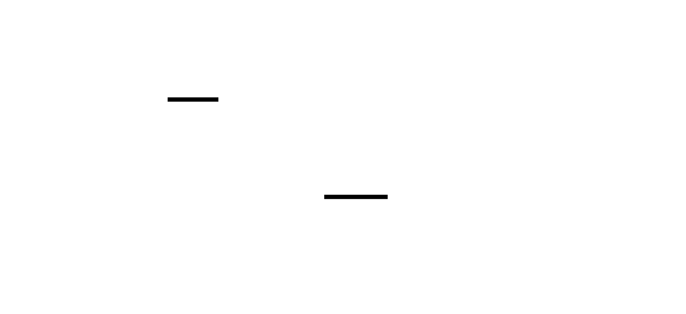
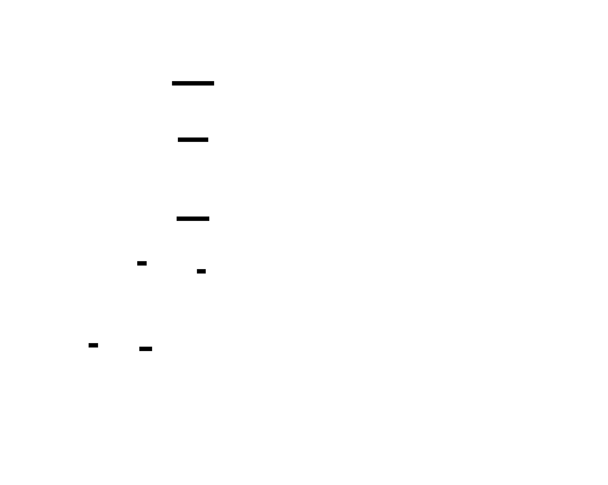
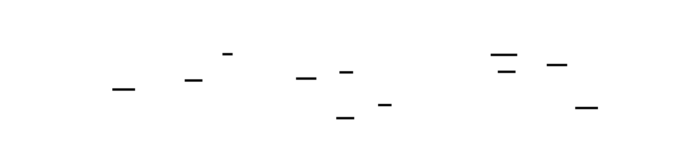
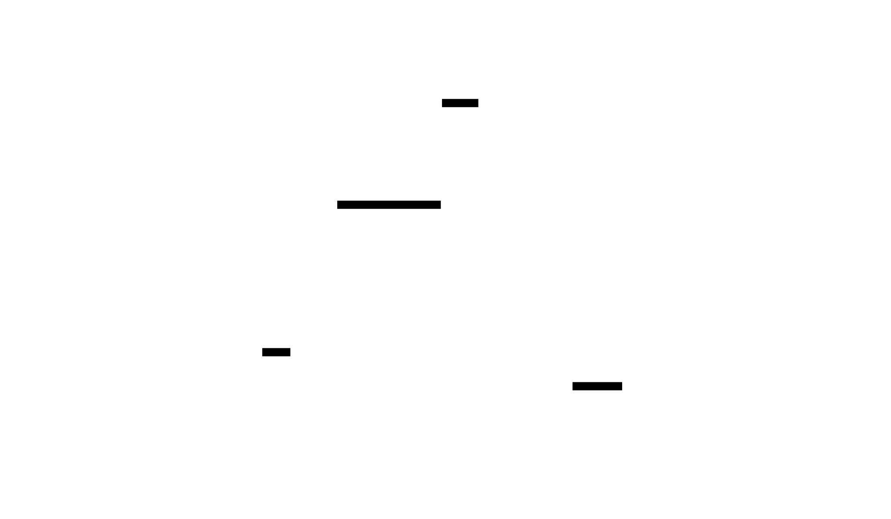
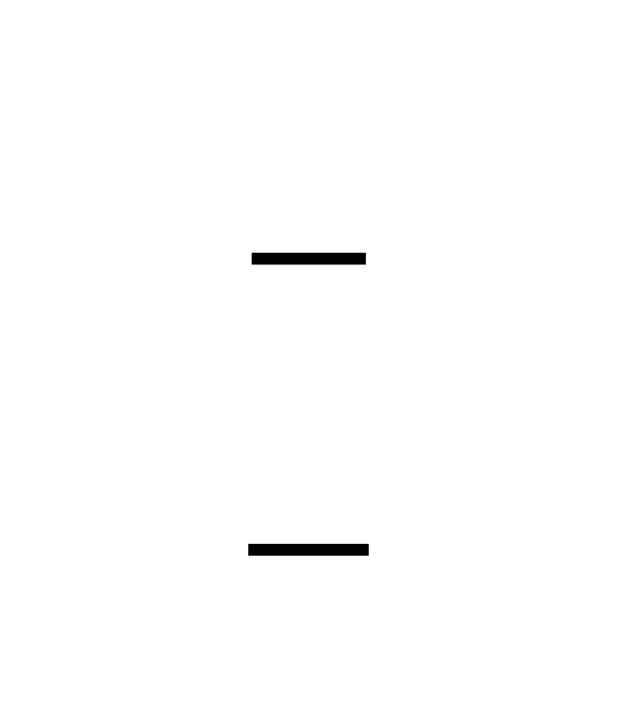
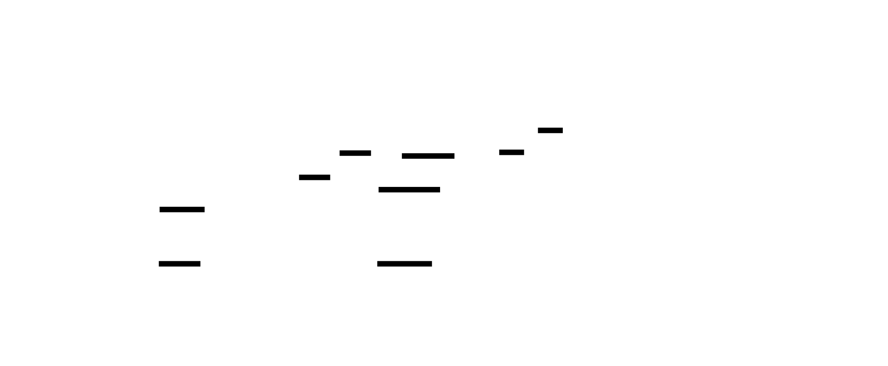
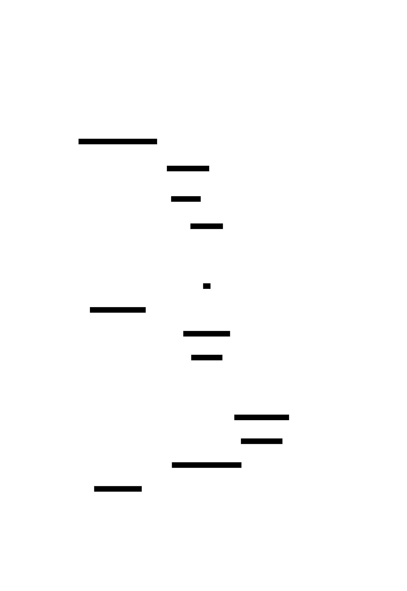

# 🎯 Project Charter: Virtual Memory Simulator

## What You Are Building
A software-based Memory Management Unit (MMU) simulator that emulates the hardware-software contract of modern memory management. You are building a system that decomposes 32-bit virtual addresses, performs hierarchical page table walks starting from a simulated CR3 register, caches translations in an ASID-tagged TLB, and manages a finite physical frame pool by evicting pages to a simulated swap store. By the end, you will have a tool that processes memory access traces and generates detailed performance profiles for different page replacement heuristics.

## Why This Project Exists
Virtual memory is the "magic" that allows a 10GB process to run on 8GB of RAM while remaining isolated from other programs. Most developers treat this as a black box provided by the OS, but building a simulator from scratch exposes the exact bit-level mechanics—such as why the "dirty bit" is critical for disk I/O efficiency and why hierarchical tables are the only way to manage sparse address spaces without wasting gigabytes of metadata.

## What You Will Be Able to Do When Done
- **Decompose Addresses:** Use bitwise shifts and masks to extract VPNs, Page Directory Indices, and offsets for 10-10-12 bit splits.
- **Implement Caching:** Build a fully-associative TLB with LRU/Random eviction and Address Space ID (ASID) support for fast context switching.
- **Walk Hierarchical Tables:** Implement a radix-trie-based page table walk that allocates second-level tables on demand.
- **Manage Scarcity:** Build an eviction engine that handles the full coherence lifecycle: Dirty Write-back -> TLB Invalidation -> PTE Clear -> Frame Reclamation.
- **Perform Comparative Analysis:** Mathematically prove Bélády’s Anomaly using FIFO and compare it against LRU and Optimal (future-knowledge) algorithms.

## Final Deliverable
A command-line simulator (implemented in C, Rust, or Python) consisting of ~1,500–2,500 lines of code. It accepts a memory access trace file (e.g., `R 0x4B00`) and a configuration (frame count, TLB size). It outputs a physical address for every access and a final report including TLB hit rates, page fault counts, dirty page write-back counts, and peak working set size.

## Is This Project For You?
**You should start this if you:**
- Are comfortable with bitwise operations (AND, OR, XOR, SHL, SHR).
- Understand pointers and multi-level indirection (pointers-to-pointers).
- Can implement basic data structures like linked lists or circular buffers.
- Want to understand how OS kernels and CPU hardware interact at the boundary.

**Come back after you've learned:**
- [Binary and Hexadecimal Arithmetic](https://www.khanacademy.org/math/algebra-home/alg-intro-to-algebra/algebra-alternate-number-bases/v/number-bases)
- [Basic C Memory Management/Structs](https://en.cppreference.com/w/c/language/struct)

## Estimated Effort
| Phase | Time |
|-------|------|
| Single-Level Page Table & Translation | ~5 hours |
| TLB with ASID & LRU Eviction | ~7 hours |
| Multi-Level Page Tables & CR3 Simulation | ~8 hours |
| Page Replacement (FIFO, LRU, Clock, Optimal) & Swap | ~12 hours |
| **Total** | **~32 hours** |

## Definition of Done
The project is complete when:
- The simulator correctly translates 32-bit addresses using a two-level hierarchy without memory leaks.
- TLB hits are verified to skip the page table walk and correctly differentiate between ASIDs.
- Reaching the physical frame limit (e.g., 64 frames) triggers a replacement algorithm instead of an OOM error.
- Dirty pages are successfully written to simulated swap and reloaded with data integrity on subsequent faults.
- The simulator can run the same trace through all four replacement policies and output a comparative performance table.

---

# Virtual Memory Simulator

This project builds a complete virtual memory simulator from the ground up: starting with flat page tables and address translation, layering on TLB caching with ASID support, evolving to multi-level hierarchical page tables with a simulated CR3 register, and culminating in page replacement algorithms (FIFO, LRU, Clock, Optimal) backed by simulated swap space. The simulator processes memory access trace files, enabling reproducible experiments and comparative analysis of different policies.

By building each layer yourself, you internalize the hardware–software contract that every modern OS relies on: how a 64-bit virtual address becomes a physical frame lookup through multiple levels of indirection, why TLBs are the single most performance-critical cache in any CPU, and why page replacement policy choice can mean the difference between smooth execution and catastrophic thrashing. Every struct you define mirrors real hardware registers and table entries — the PTE flags, the CR3 register, the TLB tags — giving you a mental model that transfers directly to reading Linux kernel source or debugging production memory pressure issues.

The simulator is driven by trace files (e.g., 'R 0x1A3F', 'W 0x4B00'), making it easy to construct adversarial access patterns that expose Bélády's anomaly, demonstrate working set dynamics, and measure the true cost of dirty page write-backs. Statistics collection at every layer (TLB hits, page faults, protection faults, swap I/O) turns abstract OS textbook concepts into measurable, comparable numbers.


<!-- MS_ID: virtual-memory-sim-m1 -->
# Milestone 1: Single-Level Page Table and Address Translation
## The Problem You're Actually Solving
Before you write a single line of code, you need to feel the problem physically.
Your CPU executes instructions that reference memory addresses. A program running on your machine will freely use address `0x00401000`, another program will also use `0x00401000`, and both programs are running *simultaneously*. Yet they cannot be reading from or writing to the same physical memory — that would be catastrophic. How does the hardware and OS ensure that these two programs' identical addresses refer to completely different physical locations?
The answer is **virtual memory**: every process lives in its own private address space, and a mapping layer translates those private (virtual) addresses into actual (physical) memory locations before any real hardware access occurs.

> **🔑 Foundation: Virtual vs Physical addresses**
> 
> **1. What it IS**
A **physical address** is the actual hardware location in your RAM sticks (e.g., "Row 402, Column 12"). A **virtual address** is an alias or "fake" address used by a program. When a program asks to read memory at address `0x1234`, it is using a virtual address. The hardware's Memory Management Unit (MMU) uses a lookup table to translate that virtual `0x1234` into a real physical address like `0x88AF`.

**2. Why you need it right now**
Without this distinction, every program would have to manage its own physical RAM. If two programs tried to use physical address `0x500`, they would crash into each other. Virtual addressing allows the OS to give every process the illusion that it has its own private, continuous block of memory starting from zero, regardless of where that data actually sits in the physical hardware.

**3. Key Insight**
**The "Coordinate System" Model:** Think of a virtual address like a "Seat Number" on a concert ticket (e.g., Row A, Seat 1). The physical address is the GPS coordinate of that actual chair. The ticket stays the same for the guest, but the venue staff (the OS) can move the actual chairs around between shows without the guest ever knowing.

That translation layer is the **page table**. In this milestone, you'll build the simplest possible version — a flat, single-level array — and in doing so you'll internalize the insight that makes all virtual memory systems work: **you don't translate bytes, you translate pages**.


---
## The Revelation: You Don't Look Up Addresses — You Decompose Them
Here's the misconception most programmers carry when they first encounter page tables: they picture a lookup table like a dictionary. Virtual address goes in. Physical address comes out. The table has one entry per byte (or word) of memory.
That model is wrong, and the wrongness matters for everything you're about to build.
Consider a 32-bit address space: 2³² = 4,294,967,296 possible byte addresses. If you stored one entry per byte, even a single process would need 4 billion table entries. With 8 bytes per entry, that's 32 GB of page table — *just for the mapping structure* — before you've stored a single byte of actual program data. This is obviously impossible.
The actual insight is this: **memory is organized into fixed-size chunks called pages** (typically 4KB = 4096 bytes), and translation only applies at page granularity. The bottom 12 bits of any address — the *offset within the page* — are the same in both the virtual and physical worlds. They pass through the translation unchanged.
[[EXPLAIN:page-size-and-address-decomposition-(vpn-+-offset-via-bit-shifting)|Page size and address decomposition — how VPN and offset are extracted via bit shifting, and why the math works]]
Let's make this concrete. Suppose your virtual address is `0x001A3F7C`:
```
Binary:  0000 0000 0001 1010 0011 1111 0111 1100
                   ─────────────────── ────────────
                        VPN = 0x1A3F    offset = 0x07C (20 bits VPN, 12 bits offset)
```
Wait — those bit widths depend on your configuration. With 4KB pages:
- Page size = 4096 = 2¹²
- Offset field = 12 bits (bottom 12 bits)
- VPN field = remaining upper bits
For a 32-bit address: VPN = bits [31:12], offset = bits [11:0].
The page table stores exactly one entry *per page*, not per byte. A 32-bit address space with 4KB pages has 2³²/2¹² = 2²⁰ = 1,048,576 possible pages. Your page table needs at most ~1 million entries. At, say, 4 bytes per entry, that's 4 MB — manageable for a single process.
Translation is now an *array index*, not a search:
```
physical_address = page_table[VPN].frame_number << 12 | offset
```
This is why hardware can perform translation in a single clock cycle (given the right caching, which you'll build in Milestone 2). It's not scanning anything — it's computing an array index from the address bits, and reading from that array slot.


---
## The Page Table Entry: Every Bit Earns Its Place
A Page Table Entry (PTE) is the fundamental data structure of virtual memory. It's not just a "physical frame number." It carries metadata that the OS and hardware use to enforce protection, track usage, manage eviction, and detect faults. Every bit has a specific job.

> **🔑 Foundation: What a Page Table Entry contains and why each flag exists**
> 
> **1. What it IS**
A Page Table Entry (PTE) is a single record in the OS's "translation dictionary." It doesn't just store the mapping from virtual to physical; it stores metadata flags that tell the CPU what is allowed:
*   **Valid/Present Bit:** Is this page actually in RAM right now? If 0, accessing it triggers a page fault.
*   **Permission Bits (R/W/X):** Can the program Read, Write, or Execute code on this page? This prevents a program from accidentally overwriting its own code.
*   **Dirty Bit:** Has the program written to this page since it was loaded? If "dirty," the OS must save it to disk before reusing the RAM for something else.
*   **Referenced/Accessed Bit:** Has this page been touched recently? The OS uses this to decide which pages are "old" and safe to swap out when RAM gets full.

**2. Why you need it right now**
When you are implementing memory management or debugging "Segmentation Faults," you are interacting with these flags. A "Segfault" is often just the MMU seeing a PTE where the "Valid" bit is 1, but the "Write" bit is 0, while the program is trying to perform a write.

**3. Key Insight**
**The "Passport Control" Model:** A PTE isn't just a map; it’s a security checkpoint. The CPU doesn't just ask "Where is this data?"; it asks "Am I allowed to be here, and should I tell the OS I moved the furniture (Dirty bit)?"

Here's the PTE structure you'll implement:
```c
/*
 * Page Table Entry (PTE) — 32-bit layout
 *
 * Byte offsets:
 *   [31:12] — Physical Frame Number (PFN): 20 bits (for 4KB pages, 32-bit phys addr)
 *   [11:8]  — Reserved / future use: 4 bits
 *   [7]     — Referenced bit (R): set on any access (read or write)
 *   [6]     — Dirty bit (D): set only on write access
 *   [5]     — Read permission (R_PERM): page may be read
 *   [4]     — Write permission (W_PERM): page may be written
 *   [3:1]   — Reserved: 3 bits
 *   [0]     — Valid bit (V): 1 = page is in physical memory
 *
 * Total size: 4 bytes per PTE
 * Cache line holds: 64 / 4 = 16 PTEs
 */
typedef struct {
    uint32_t pfn        : 20;  /* Physical Frame Number */
    uint32_t _reserved2 :  4;
    uint32_t referenced :  1;  /* Set on any access */
    uint32_t dirty      :  1;  /* Set on write access only */
    uint32_t perm_read  :  1;  /* Read permission */
    uint32_t perm_write :  1;  /* Write permission */
    uint32_t _reserved1 :  3;
    uint32_t valid      :  1;  /* Is this page in physical memory? */
} pte_t;
```
> **Hardware Soul — Cache Line Analysis:**
> A `pte_t` is 4 bytes. A CPU cache line is 64 bytes. Walking through 16 consecutive PTEs (16 × 4 = 64 bytes) fits in a single cache line fetch. This is deliberate: when you access page N and then page N+1, both their PTEs likely live in the same cache line, making sequential access patterns warm in L1 cache. When you scatter accesses randomly across the address space — different VPNs far apart — you thrash the cache with cold PTE fetches. **Page locality in the virtual address space directly translates to cache locality in the page table array.** This is a fundamental law you'll observe in your simulator's statistics.



### Alternative: Using a Plain `uint32_t` with Masks
C bitfields are convenient but have implementation-defined behavior (bit ordering across compilers). For clarity and portability, many OS implementations prefer explicit masks:
```c
/* Alternative: plain uint32_t with explicit bit masks */
typedef uint32_t pte_t;
#define PTE_VALID       (1u << 0)
#define PTE_PERM_WRITE  (1u << 4)
#define PTE_PERM_READ   (1u << 5)
#define PTE_DIRTY       (1u << 6)
#define PTE_REFERENCED  (1u << 7)
#define PTE_PFN_SHIFT   12
#define PTE_PFN_MASK    (0xFFFFF000u)  /* bits [31:12] */
/* Extract PFN from a PTE */
static inline uint32_t pte_get_pfn(pte_t pte) {
    return (pte & PTE_PFN_MASK) >> PTE_PFN_SHIFT;
}
/* Build a PTE from a PFN and permission flags */
static inline pte_t pte_make(uint32_t pfn, int readable, int writable) {
    pte_t p = (pfn << PTE_PFN_SHIFT);
    if (readable)  p |= PTE_PERM_READ;
    if (writable)  p |= PTE_PERM_WRITE;
    p |= PTE_VALID;
    return p;
}
```
**Design choice for your simulator:** The bitfield struct is more readable for learning purposes. Use it unless you run into compiler issues, in which case switch to the mask approach. Real kernels like Linux use macro-based masks (`_PAGE_PRESENT`, `_PAGE_DIRTY`, `_PAGE_ACCESSED`, etc.) defined in `arch/x86/include/asm/pgtable.h`.
---
## The Full Simulator Data Model
Before implementing any behavior, define the complete in-memory state of your simulator. This is architectural decision-making — get the structure right and everything else follows.
```c
#include <stdint.h>
#include <stdbool.h>
#include <stdio.h>
#include <stdlib.h>
#include <string.h>
/*────────────────────────────────────────────────────────────────────────────
 * Configuration — adjustable at compile time
 *───────────────────────────────────────────────────────────────────────────*/
#define PAGE_SIZE           4096u       /* bytes — must be power of 2        */
#define PAGE_OFFSET_BITS    12u         /* log2(PAGE_SIZE) = 12              */
#define PAGE_OFFSET_MASK    (PAGE_SIZE - 1)  /* 0x00000FFF                  */
#define NUM_FRAMES          64u         /* physical frames in simulated RAM  */
#define ADDR_BITS           32u         /* simulated virtual address width   */
#define VPN_BITS            (ADDR_BITS - PAGE_OFFSET_BITS)  /* 20 bits       */
#define PAGE_TABLE_SIZE     (1u << VPN_BITS)  /* 2^20 = 1,048,576 entries   */
/*────────────────────────────────────────────────────────────────────────────
 * Physical memory simulation
 *───────────────────────────────────────────────────────────────────────────*/
typedef struct {
    uint8_t  data[PAGE_SIZE];   /* simulated page content (all zeros on alloc) */
    bool     in_use;            /* is this frame currently allocated?          */
} physical_frame_t;
/*────────────────────────────────────────────────────────────────────────────
 * Page table — flat array of NUM_FRAMES PTEs
 * Memory cost: 1,048,576 × 4 bytes = 4 MB per process
 *───────────────────────────────────────────────────────────────────────────*/
typedef struct {
    pte_t   entries[PAGE_TABLE_SIZE];   /* indexed directly by VPN           */
} page_table_t;
/*────────────────────────────────────────────────────────────────────────────
 * Simulator state
 *───────────────────────────────────────────────────────────────────────────*/
typedef struct {
    page_table_t    page_table;
    physical_frame_t frames[NUM_FRAMES];
    /* Statistics */
    uint64_t    total_accesses;
    uint64_t    page_faults;
    uint64_t    protection_faults;
    /* Configuration */
    uint32_t    page_size;
    uint32_t    offset_bits;
    uint32_t    num_frames;
} simulator_t;
```
**Memory layout analysis:**
- `page_table.entries`: 1,048,576 × 4 bytes = **4,194,304 bytes = 4 MB**
- `frames[64]`: 64 × 4096 bytes = **262,144 bytes = 256 KB**
- Total simulator state: ~4.25 MB
This 4 MB flat page table is the key motivator for Milestone 3. For a *sparse* address space — a real process that uses only a few hundred MB out of the possible 4 GB — most of those 1M entries are unused, yet you've paid for all of them upfront. Multi-level page tables fix this by only allocating the sub-tables you actually use.
---
## Address Decomposition: The Two Extractors
Implement two inline functions that you'll call everywhere:
```c
/*
 * Extract the Virtual Page Number from a 32-bit virtual address.
 * VPN = upper (32 - 12) = 20 bits.
 *
 * Example: addr = 0x001A3F7C
 *   0x001A3F7C >> 12 = 0x001A3   = 6723 (decimal)
 */
static inline uint32_t vpn_from_addr(uint32_t vaddr) {
    return vaddr >> PAGE_OFFSET_BITS;
}
/*
 * Extract the page offset from a 32-bit virtual address.
 * Offset = lower 12 bits = unchanged in physical address.
 *
 * Example: addr = 0x001A3F7C
 *   0x001A3F7C & 0x00000FFF = 0x7C = 124 (decimal)
 */
static inline uint32_t offset_from_addr(uint32_t vaddr) {
    return vaddr & PAGE_OFFSET_MASK;
}
/*
 * Reconstruct a physical address from a PFN and offset.
 * Physical address = PFN * PAGE_SIZE + offset
 *                  = (PFN << 12) | offset
 */
static inline uint32_t make_physical_addr(uint32_t pfn, uint32_t offset) {
    return (pfn << PAGE_OFFSET_BITS) | offset;
}
```
Let's verify these functions are correct by tracing through manually:
```
Virtual address:  0x001A3F7C
Binary:           0000 0000 0001 1010 0011 1111 0111 1100
                  ↑─────────────────────────────────↑ ↑──────────────↑
                              bits [31:12]                bits [11:0]
VPN  = 0x001A3F7C >> 12  = 0x001A3   = 6723
Offset = 0x001A3F7C & 0xFFF = 0x7C   = 124
If page table says VPN 6723 → PFN 42:
Physical address = (42 << 12) | 0x7C
                 = 0x0002A000 | 0x7C
                 = 0x0002A07C
```
**Pitfall: Off-by-one in shift amount.** PAGE_SIZE = 4096 = 2¹². To extract the VPN, you shift right by 12. A common mistake is shifting by 11 (thinking "4096 has 12 digits in binary, so shift by 11"). Check: `1 << 12 = 4096`. Shift by 12, not 11.


---
## The Trace File: Your Simulator's Input
The simulator is driven by a **memory access trace** — a text file describing a sequence of memory operations. This indirection is the entire reason the simulator is useful: you can craft specific access patterns, replay real program traces, and run the same sequence through multiple algorithms (in later milestones) for direct comparison.
### Trace Format
```
# Lines starting with '#' are comments — ignore them
# Format: <operation> <hex-address>
# Operation: R = read, W = write
R 0x001A3F7C
W 0x004B0020
R 0x001A4000
W 0x001A3F7C
R 0x00FF1234
```
Rules:
- One access per line
- `R` = read access, `W` = write access
- Address is a 32-bit hex value with `0x` prefix
- Empty lines and comment lines (starting with `#`) are skipped


### Trace Parser
```c
/*
 * Memory access record — parsed from one trace file line
 */
typedef enum { ACCESS_READ = 0, ACCESS_WRITE = 1 } access_type_t;
typedef struct {
    access_type_t   type;
    uint32_t        vaddr;
} mem_access_t;
/*
 * Parse a single line from the trace file.
 * Returns true if parsing succeeded, false if line should be skipped
 * (comment, empty, or malformed).
 *
 * Line format: "R 0x001A3F7C\n" or "W 0x004B0020\n"
 */
bool parse_trace_line(const char *line, mem_access_t *out) {
    /* Skip whitespace-only and comment lines */
    const char *p = line;
    while (*p == ' ' || *p == '\t') p++;
    if (*p == '\0' || *p == '\n' || *p == '#') return false;
    char op;
    unsigned long addr;
    if (sscanf(p, " %c %lx", &op, &addr) != 2) return false;
    if      (op == 'R' || op == 'r') out->type = ACCESS_READ;
    else if (op == 'W' || op == 'w') out->type = ACCESS_WRITE;
    else return false;
    out->vaddr = (uint32_t)addr;
    return true;
}
/*
 * Open trace file and count entries — used to pre-allocate
 * the access array for Optimal (Bélády's) algorithm in Milestone 4.
 */
int load_trace(const char *path, mem_access_t **out_accesses, size_t *out_count) {
    FILE *fp = fopen(path, "r");
    if (!fp) { perror("fopen"); return -1; }
    size_t capacity = 1024;
    size_t count    = 0;
    mem_access_t *accesses = malloc(capacity * sizeof(mem_access_t));
    if (!accesses) { fclose(fp); return -1; }
    char line[256];
    while (fgets(line, sizeof(line), fp)) {
        mem_access_t access;
        if (!parse_trace_line(line, &access)) continue;
        if (count >= capacity) {
            capacity *= 2;
            mem_access_t *tmp = realloc(accesses, capacity * sizeof(mem_access_t));
            if (!tmp) { free(accesses); fclose(fp); return -1; }
            accesses = tmp;
        }
        accesses[count++] = access;
    }
    fclose(fp);
    *out_accesses = accesses;
    *out_count    = count;
    return 0;
}
```
---
## The Two Failure Modes: Page Fault vs Protection Fault
When address translation is attempted, one of three things happens:
1. **Success**: The PTE is valid and permissions match → return physical address
2. **Page fault**: The PTE's `valid` bit is 0 → page is not in memory
3. **Protection fault**: The PTE's `valid` bit is 1, but the access violates permission bits
These are **completely different conditions** with different causes and different responses. Confusing them is the most common mistake in this milestone.



| Condition | `valid` bit | Permissions | Response |
|-----------|-------------|-------------|----------|
| Page fault | `0` | (doesn't matter) | Load page from storage, allocate frame, retry |
| Protection fault | `1` | Wrong | Kill or signal process (or log error in simulator) |
| Success | `1` | Correct | Return physical address |
**Why valid=0 doesn't mean "this page doesn't exist."** A page with `valid=0` might be in swap space (evicted earlier), or simply never accessed yet (demand paging). The OS knows the difference through additional structures (the VMA — Virtual Memory Area — which describes what *should* be mapped, even if it isn't yet). In your simulator, you'll simplify this: any page not yet allocated gets demand-paged into a free frame on first access, and a write-to-unallocated page is also treated as a page fault (then the new page is also marked writable).
---
## Demand Paging: Pages on Demand

> **🔑 Foundation: Demand paging**
> 
> **1. What it IS**
Demand paging is a "lazy" loading strategy. Instead of loading an entire 2GB application into RAM when you double-click it, the OS loads nothing. It marks all the application's pages as "Not Present" in the page table. When the CPU tries to run the first instruction, it fails—this is a **Page Fault**. The **Page Fault Handler** (a special OS function) catches the failure, finds the data on the disk, puts it into a physical RAM slot, updates the PTE to "Valid," and tells the CPU to try again.

**2. Why you need it right now**
This is the magic that allows you to run a 10GB game on a computer with only 8GB of RAM. It ensures that memory is only consumed for the specific parts of a program you are actually using at this moment.

**3. Key Insight**
**"Just-In-Time Inventory":** Demand paging is the Amazon Prime of memory. The OS doesn't keep every item in the front showroom (RAM); it keeps them in a massive warehouse (Disk) and only rushes them to the showroom the second a customer (the CPU) asks for them.

The OS doesn't load your entire program into RAM when it starts. It loads a minimal amount, maps the rest as `valid=0`, and lets the hardware trigger faults as needed. This is **demand paging**: allocate physical memory only when it's actually demanded by a memory access.
In your simulator, demand paging is implemented by the page fault handler:
```c
/*
 * Allocate a free physical frame from the frame pool.
 * Returns frame number on success, or UINT32_MAX if no frames are free.
 * Complexity: O(NUM_FRAMES) — acceptable for small NUM_FRAMES.
 * In a real OS: maintained as a free list, O(1) allocation.
 */
static uint32_t alloc_free_frame(simulator_t *sim) {
    for (uint32_t i = 0; i < sim->num_frames; i++) {
        if (!sim->frames[i].in_use) {
            sim->frames[i].in_use = true;
            /* Zero-initialize the frame (mimics OS security practice) */
            memset(sim->frames[i].data, 0, PAGE_SIZE);
            return i;
        }
    }
    return UINT32_MAX;  /* Out of physical memory — will need replacement in M4 */
}
/*
 * Page fault handler.
 * Called when PTE.valid == 0 for the given VPN.
 *
 * Behavior:
 *   1. Find a free frame (demand paging — allocate lazily)
 *   2. "Load" the page (in real OS: read from disk/swap; here: zero-fill)
 *   3. Update the PTE: set valid=1, set PFN, set permissions
 *   4. Return the allocated PFN, or UINT32_MAX on OOM
 */
static uint32_t handle_page_fault(simulator_t *sim, uint32_t vpn,
                                  access_type_t access_type) {
    sim->page_faults++;
    fprintf(stderr, "[PAGE FAULT] VPN=0x%05X  access=%s\n",
            vpn, (access_type == ACCESS_WRITE) ? "WRITE" : "READ");
    uint32_t frame = alloc_free_frame(sim);
    if (frame == UINT32_MAX) {
        fprintf(stderr, "[OOM] No free frames — page replacement needed (Milestone 4)\n");
        return UINT32_MAX;
    }
    /* Set up the PTE for this newly allocated page.
     * Default permissions: readable; writable only if access is a write.
     * Real OS would consult the VMA to determine correct permissions. */
    pte_t *pte = &sim->page_table.entries[vpn];
    *pte = pte_make(frame, /*readable=*/1, /*writable=*/(access_type == ACCESS_WRITE));
    /* pte_make already sets valid=1 */
    return frame;
}
```


**Security note:** The `memset(frame.data, 0, PAGE_SIZE)` call is not just housekeeping — it's a security requirement. If the OS reuses frames without zeroing them, a new process could read data left behind by a previous process. Linux zeroes pages before handing them to userspace.
---
## The Core Translation Function
Now assemble the address translation logic. This function is the heart of your simulator — every access flows through it.
```c
/*
 * Result of an address translation attempt.
 */
typedef enum {
    XLATE_SUCCESS    = 0,
    XLATE_PAGE_FAULT = 1,
    XLATE_PROT_FAULT = 2,
    XLATE_OOM        = 3,   /* page fault but no free frames */
} xlate_result_t;
typedef struct {
    xlate_result_t  result;
    uint32_t        paddr;  /* valid only when result == XLATE_SUCCESS */
    uint32_t        pfn;    /* PFN assigned (after fault resolution) */
} xlate_t;
/*
 * Translate a virtual address, handling faults as needed.
 *
 * Algorithm:
 *   1. Decompose vaddr into VPN and offset
 *   2. Look up PTE = page_table[VPN]
 *   3. If !PTE.valid         → page fault  → handle_page_fault() → retry
 *   4. If write && !writable → prot fault  → log and return error
 *   5. Set PTE.referenced = 1
 *   6. If write: set PTE.dirty = 1
 *   7. Build and return physical address
 */
xlate_t translate(simulator_t *sim, uint32_t vaddr, access_type_t access_type) {
    sim->total_accesses++;
    uint32_t vpn    = vpn_from_addr(vaddr);
    uint32_t offset = offset_from_addr(vaddr);
    /* Bounds check: VPN must be within page table range */
    if (vpn >= PAGE_TABLE_SIZE) {
        fprintf(stderr, "[SEGFAULT] VPN 0x%X exceeds page table size\n", vpn);
        return (xlate_t){ .result = XLATE_PROT_FAULT, .paddr = 0 };
    }
    pte_t *pte = &sim->page_table.entries[vpn];
    /*──────────────────────────────────────────────────────────────────────
     * Step 1: Is the page in memory?
     *─────────────────────────────────────────────────────────────────────*/
    if (!(*pte & PTE_VALID)) {
        /* Page fault: page is not in physical memory */
        uint32_t frame = handle_page_fault(sim, vpn, access_type);
        if (frame == UINT32_MAX) {
            return (xlate_t){ .result = XLATE_OOM };
        }
        /* Reload pte — handle_page_fault() updated it */
        /* (pte is a pointer into the table, so it's already updated) */
    }
    /*──────────────────────────────────────────────────────────────────────
     * Step 2: Permission check
     * Only check after valid=1 is confirmed — checking invalid PTEs'
     * permission bits is undefined (they may be garbage).
     *─────────────────────────────────────────────────────────────────────*/
    if (access_type == ACCESS_WRITE && !(*pte & PTE_PERM_WRITE)) {
        sim->protection_faults++;
        fprintf(stderr, "[PROT FAULT] VPN=0x%05X write to read-only page\n", vpn);
        return (xlate_t){ .result = XLATE_PROT_FAULT };
    }
    /*──────────────────────────────────────────────────────────────────────
     * Step 3: Set access bits
     *─────────────────────────────────────────────────────────────────────*/
    *pte |= PTE_REFERENCED;                          /* any access */
    if (access_type == ACCESS_WRITE) *pte |= PTE_DIRTY;  /* writes only */
    /*──────────────────────────────────────────────────────────────────────
     * Step 4: Build physical address
     *─────────────────────────────────────────────────────────────────────*/
    uint32_t pfn   = pte_get_pfn(*pte);
    uint32_t paddr = make_physical_addr(pfn, offset);
    return (xlate_t){
        .result = XLATE_SUCCESS,
        .paddr  = paddr,
        .pfn    = pfn,
    };
}
```
**Critical ordering note:** Check `valid` before checking permissions. If you check permissions on an invalid PTE, you're reading garbage bits — the PTE's content is meaningless when `valid=0`. The valid check must come first.
**Dirty bit discipline:** Only write accesses set the dirty bit. Read accesses never do. This matters enormously in Milestone 4: a dirty page must be written to swap before its frame can be reused. If you incorrectly set dirty on reads, you'll cause unnecessary swap writes, inflating your swap write-back statistics.
---
## The Main Simulation Loop
Connect the trace parser to the translator:
```c
/*
 * Run the simulator over a loaded trace.
 */
void simulate(simulator_t *sim, const mem_access_t *accesses, size_t count) {
    for (size_t i = 0; i < count; i++) {
        const mem_access_t *acc = &accesses[i];
        printf("[%6zu] %s 0x%08X → ",
               i,
               acc->type == ACCESS_WRITE ? "W" : "R",
               acc->vaddr);
        xlate_t result = translate(sim, acc->vaddr, acc->type);
        switch (result.result) {
            case XLATE_SUCCESS:
                printf("phys=0x%08X (PFN=%u)\n", result.paddr, result.pfn);
                break;
            case XLATE_PAGE_FAULT:
                /* Page fault was handled inside translate(); this shouldn't occur */
                printf("PAGE FAULT (unresolved)\n");
                break;
            case XLATE_PROT_FAULT:
                printf("PROTECTION FAULT\n");
                break;
            case XLATE_OOM:
                printf("OUT OF MEMORY (no free frames)\n");
                break;
        }
    }
}
/*
 * Print final statistics.
 */
void print_stats(const simulator_t *sim) {
    printf("\n=== Simulation Statistics ===\n");
    printf("Total accesses:     %lu\n", sim->total_accesses);
    printf("Page faults:        %lu  (%.2f%%)\n",
           sim->page_faults,
           sim->total_accesses > 0
               ? 100.0 * sim->page_faults / sim->total_accesses
               : 0.0);
    printf("Protection faults:  %lu  (%.2f%%)\n",
           sim->protection_faults,
           sim->total_accesses > 0
               ? 100.0 * sim->protection_faults / sim->total_accesses
               : 0.0);
    /* Count allocated frames */
    uint32_t frames_used = 0;
    for (uint32_t i = 0; i < sim->num_frames; i++) {
        if (sim->frames[i].in_use) frames_used++;
    }
    printf("Frames in use:      %u / %u\n", frames_used, sim->num_frames);
}
```
---
## Initializing the Simulator
```c
/*
 * Initialize the simulator to clean state.
 *
 * All PTEs are set to 0 (valid=0, all permissions cleared).
 * All frames are marked free.
 */
void simulator_init(simulator_t *sim) {
    memset(sim, 0, sizeof(*sim));
    sim->page_size   = PAGE_SIZE;
    sim->offset_bits = PAGE_OFFSET_BITS;
    sim->num_frames  = NUM_FRAMES;
    /* page_table.entries is zeroed by memset — all PTEs start invalid */
    /* frames[i].in_use = false for all i — all frames start free */
}
/*
 * Wire it all together: main entry point.
 */
int main(int argc, char *argv[]) {
    if (argc < 2) {
        fprintf(stderr, "Usage: %s <trace-file>\n", argv[0]);
        return 1;
    }
    simulator_t sim;
    simulator_init(&sim);
    mem_access_t *accesses = NULL;
    size_t count = 0;
    if (load_trace(argv[1], &accesses, &count) != 0) {
        fprintf(stderr, "Failed to load trace file: %s\n", argv[1]);
        return 1;
    }
    printf("Loaded %zu accesses from %s\n\n", count, argv[1]);
    simulate(&sim, accesses, count);
    print_stats(&sim);
    free(accesses);
    return 0;
}
```
---
## Building and Testing
### Compile
```bash
gcc -Wall -Wextra -O2 -std=c11 -o vmsim vmsim.c
```
### Minimal test trace
Create `test_basic.trace`:
```
# Test: basic read/write sequence
R 0x00001000
W 0x00001004
R 0x00002000
W 0x00001000
```
Expected output pattern:
```
[     0] R 0x00001000 → PAGE FAULT logged, phys=0x00001000 (PFN=0)
[     1] W 0x00001004 → phys=0x00001004 (PFN=0)   [same page, dirty set]
[     2] R 0x00002000 → PAGE FAULT logged, phys=0x00011000 (PFN=1)
[     3] W 0x00001000 → phys=0x00001000 (PFN=0)   [dirty already set]
```
### Protection fault test trace
To test protection faults, you need a way to mark pages as read-only. Extend your trace format with a setup directive:
```
# Extended trace: test protection fault
# MMAP <vpn> <R|W|RW>  — pre-map a page with given permissions
MMAP 0x00001 R
R 0x00001000   # should succeed
W 0x00001004   # should trigger PROTECTION FAULT
```
Alternatively, expose a `simulator_mmap()` function and call it from a C test:
```c
/*
 * Pre-map a virtual page with specified permissions (no demand paging —
 * allocate a frame immediately and set the PTE directly).
 * Used for testing protection fault behavior.
 */
int simulator_mmap(simulator_t *sim, uint32_t vpn, int readable, int writable) {
    if (vpn >= PAGE_TABLE_SIZE) return -1;
    uint32_t frame = alloc_free_frame(sim);
    if (frame == UINT32_MAX) return -1;  /* OOM */
    sim->page_table.entries[vpn] = pte_make(frame, readable, writable);
    return 0;
}
```
---
## Common Pitfalls and How to Avoid Them
| Pitfall | Symptom | Fix |
|---------|---------|-----|
| `vaddr >> 11` instead of `>> 12` | VPN off by factor of 2 | Remember: PAGE_SIZE = 2¹², shift by **12** |
| Checking permissions before valid | Garbage perm bits on invalid PTEs | Always check `valid` first |
| Setting dirty on read | Over-counting dirty pages | Only `|= PTE_DIRTY` on `ACCESS_WRITE` |
| Not zeroing new frames | Data leakage between "processes" | `memset(frame.data, 0, PAGE_SIZE)` on alloc |
| Treating page fault as fatal | Simulator aborts on first fault | Page faults are expected — resolve them |
| `offset_mask = PAGE_SIZE` instead of `PAGE_SIZE - 1` | Wrong offset extraction | Mask is `0xFFF` for 4KB pages, not `0x1000` |
The offset mask is a particularly nasty bug. `PAGE_SIZE = 4096 = 0x1000`. The mask needs to cover bits `[11:0]` = `0xFFF = 4095 = PAGE_SIZE - 1`. Using `PAGE_SIZE` as the mask would give you `0x1000`, which in binary is `0001 0000 0000 0000` — completely wrong.
---
## Hardware Soul: What Real Hardware Does
Your simulator runs `translate()` in software. Real hardware does the equivalent in silicon, in the CPU's **Memory Management Unit (MMU)**. Understanding the parallel deepens everything you're building:
**Real x86-64 hardware:**
- CR3 register holds the physical address of the top-level page table
- On every memory instruction, the MMU decomposes the virtual address
- It walks the page table hierarchy (4 levels on x86-64)
- If the TLB has a cached translation, the walk is skipped entirely (Milestone 2)
- If a PTE has `Present=0` (equivalent to your `valid=0`), the CPU raises a **#PF (Page Fault) exception** — hardware interrupt, not a function call
- The OS's page fault handler is invoked at interrupt priority, resolves the fault, and resumes the faulting instruction
**Cache line behavior in your simulator:**
- `page_table.entries` is a contiguous array
- Accessing entries for VPNs 0–15 touches bytes 0–63: exactly one cache line
- Accessing entries for VPNs 0 and 1000 touches two cache lines 4KB apart: likely two separate L1 cache misses
- Your simulator with only 64 frames will mostly access a small range of VPNs → page table accesses are mostly cache-warm
**TLB hardware (preview for Milestone 2):**
- Real CPUs have 64–2048 TLB entries that cache VPN→PFN mappings
- A TLB hit costs ~1 cycle; a TLB miss that requires a hardware page table walk costs 4 memory accesses on x86-64 (one per level)
- Your software `translate()` currently does the "TLB miss" path every time — Milestone 2 caches the result
---
## Knowledge Cascade: What This Unlocks
You've built a page table and implemented demand paging. Here's what you now understand that you didn't before:
**1. Why `malloc` for large allocations returns page-aligned memory**
`malloc` calls `mmap()` for large requests (typically > 128KB). `mmap()` returns a page-aligned virtual address because the OS can only map, protect, and fault at page granularity. A virtual address in the middle of a page can't be given its own PTE — the entire page is the minimum unit. This is why `posix_memalign(ptr, 4096, size)` exists, and why database buffer pools (SQLite, PostgreSQL) align their I/O buffers to 4KB: they need exact page-boundary alignment for `O_DIRECT` (bypassing the kernel page cache) and for `mmap`-based storage access.
**2. How `mmap` can "map" a 10GB file with only 256MB of RAM**

> **🔑 Foundation: How mmap and demand paging together enable mapping files larger than physical memory**
> 
> **1. What it IS**
`mmap` is a system call that "maps" a file directly into a process's virtual memory space. Instead of using `read()` to copy a file into a buffer, you tell the OS: "Make this 1GB file appear as if it's an array at virtual address `0x5000`." 

The connection to demand paging is crucial: `mmap` doesn't actually load the file into RAM. It simply creates the PTEs and marks them as "Not Present," pointing them to the file on disk. The file is only loaded into RAM piece-by-piece via the Page Fault Handler as your code actually touches different parts of that "array."

**2. Why you need it right now**
If you need to process a dataset that is larger than your available RAM, `mmap` is the solution. It lets the OS handle all the complex logic of loading, caching, and eviction. You treat the file like a giant pointer, and the demand paging system ensures only the active "window" of that file occupies your physical memory.

**3. Key Insight**
**The "Portal" Model:** `mmap` creates a virtual window (the portal) into a file. Demand paging is the mechanism that actually pulls the data through that portal only when you reach out and try to touch it.

`mmap()` doesn't read the file — it creates PTEs with `valid=0` that point to file offsets instead of swap. When you touch a mapped page, the page fault handler reads exactly that 4KB chunk from disk and maps it into a free frame. You've just implemented the core of this mechanism. The OS never needs more RAM than the number of pages simultaneously accessed (the working set).
**3. Process isolation is a page table, not a byte-level guard**
Every process has its own page table. Process A's VPN 0x12345 → PFN 17; Process B's VPN 0x12345 → PFN 83. The same virtual address translates to completely different physical frames. There's no per-byte checking, no encryption, no copying — just two separate PTEs that happen to be indexed by the same number but live in different page tables. Memory isolation is 100% a page table artifact. When you see "memory corruption via buffer overflow that overwrites another process's memory," the reason it *doesn't* happen normally is that there are no PTEs mapping virtual addresses outside your process's allocated regions.
**4. SQLite, PostgreSQL, and InnoDB all think in pages**
Every relational database uses page-sized I/O buffers because the OS's unit of transfer between disk and RAM is exactly one page (4KB). PostgreSQL's page size is 8KB (2× OS page); MySQL InnoDB uses 16KB (4× OS page). Their buffer pools are essentially a software version of what you just built — a mapping from "logical page number on disk" to "frame in the buffer pool" — with the same concepts of valid bits (is this page currently in the pool?), dirty bits (has it been modified since last flush?), and replacement algorithms (LFU, clock, ARC). The OS virtual memory system and the database buffer manager are isomorphic designs solving the same caching problem at different layers.
**5. Cross-domain: Web caches and CDNs**
The page table is a cache: it maps virtual addresses to physical locations, handling misses (page faults) by fetching from backing storage (disk/swap). CDNs do the same: they cache URLs → physical server responses, handling misses by fetching from origin. The eviction algorithms you'll implement in Milestone 4 (LRU, Clock, Optimal) are exactly the same algorithms used in Nginx's proxy cache, Varnish, and CDN edge nodes. Page replacement theory is cache theory. The domains are the same mathematics.
---
## What You've Built and What's Missing
**You have:**
- A complete, working virtual memory simulator for a single process
- Flat page table with O(1) address translation
- Demand paging (pages allocated on first access)
- Protection fault detection
- Statistics collection
**What's painfully missing:** Every access calls `translate()` which does a full page table lookup — an array read from `page_table.entries[vpn]`. In a real CPU, this requires a memory access to wherever the page table is stored. For 1M entries at 4 bytes each, the page table is 4MB — it doesn't fit in L1 cache (typically 32–64 KB). Most page table accesses are L2 or L3 misses (~4ns and ~40ns respectively), compared to a register access (~0.25ns).
Real programs access the same pages repeatedly. The working set of a typical process is 10–1000 pages, not millions. If only we could *cache* the most recent VPN→PFN translations...
That's the TLB. Milestone 2 adds it.
**Also missing:** The flat page table costs 4MB per process regardless of how sparse the address space is. A process using 10 pages still needs a 1M-entry table. Milestone 3 fixes this with multi-level page tables, which only allocate table memory for regions that are actually mapped.
**And:** When all 64 frames are full and a new page needs to be loaded, your current simulator simply fails. Milestone 4 adds page replacement — deciding which existing page to evict to make room.
Each milestone is a direct fix for a concrete limitation you've now felt in your implementation. That's not a coincidence — it's the pedagogical design of this project.
---
<!-- END_MS -->


<!-- MS_ID: virtual-memory-sim-m2 -->
<!-- MS_ID: virtual-memory-sim-m2 -->
# Milestone 2: TLB (Translation Lookaside Buffer)
## The Problem: Every Load Is Two Loads
You built a page table in Milestone 1. It works. Now run it against this trace and think carefully about what the hardware is actually doing:
```
R 0x00401020
R 0x00401024
R 0x00401028
R 0x0040102C
```
Four reads in a tight loop — the kind of thing a program does thousands of times per second when iterating over an array. What does your `translate()` function do for each one?
1. Compute `VPN = vaddr >> 12`
2. Access `page_table.entries[VPN]` — **a memory read**
3. Extract the PFN from the PTE
4. Compute `physical_address = (PFN << 12) | offset`
5. Now — finally — access the data at that physical address — **another memory read**
Two memory reads for every single memory access. That's not a theoretical inefficiency — it's a concrete halving of memory bandwidth. Every array element read is secretly two reads. Every function call's stack frame access is two reads. Every pointer dereference is two reads.
At 3 GHz with a 100ns DRAM latency, your CPU can issue ~300 instructions in the time it takes to complete *one* memory access. Without caching, a page table lookup before every data access means your program grinds at half-speed at best — and for multi-level page tables (Milestone 3), it's *three* loads for every one data load. The whole system becomes a memory-latency machine.
Here's the thing: this problem is deterministic. The same four virtual addresses in the loop above all map to the same VPN. You're performing the same page table lookup — fetching the same PTE — four consecutive times. You're paying 100ns for a lookup whose answer you already knew from the previous iteration.
**The fix is obvious once you see it: cache the last few VPN→PFN translations.** If you've recently looked up VPN 0x401, don't re-read the page table — just return the answer you computed last time. This is the **Translation Lookaside Buffer** (TLB), and it is not a nice-to-have optimization. It is the entire reason virtual memory is feasible in a modern CPU.



---
## The Revelation: The TLB Is the Most Important Cache in Your CPU
Here's the misconception worth destroying before you write a single line of code:
*"The TLB is just a cache for page table entries — a useful optimization but fundamentally the page table is the real mechanism."*
This is wrong, and the wrongness matters for how you design your system.
Consider what "99% TLB hit rate" means in practice. If your TLB has 64 entries and achieves a 99% hit rate:
- 99% of memory accesses: TLB hit → PFN in ~1 CPU cycle → data access
- 1% of memory accesses: TLB miss → page table walk → 1 memory access for single-level, 2–4 for multi-level → *then* data access
Now consider what 100% TLB miss rate means (no TLB at all):
- Every single memory access first triggers a page table walk
- For a two-level page table: **3 memory accesses per data byte read** (level-1 table, level-2 table, data)
- Effective memory bandwidth: 1/3 of hardware capability
- At 50 GB/s DRAM bandwidth: your program sees 16 GB/s
- Those 300 instructions you could execute in a DRAM latency window? Now you're burning 300 cycles *per byte read*
The TLB is the only reason virtual memory doesn't obliterate performance. Real TLBs — 64 to 2048 entries — achieve 99%+ hit rates through the same principle that makes CPU caches work: **temporal and spatial locality**. Programs tend to access the same pages repeatedly (temporal locality: the loop above reuses VPN 0x401 four times), and nearby addresses (spatial locality: sequential array traversal hits the same page for 4096/8 = 512 consecutive 8-byte reads).
**The TLB transforms an O(levels) memory-access translation overhead into an O(1) register lookup.** This is why hardware architects gave the TLB its own special designation separate from L1/L2/L3 caches: it's a different kind of structure, fully associative, searched in parallel, and integrated so tightly with the MMU that its hit latency is often effectively zero (absorbed into the pipeline).
Your software simulator will, of course, implement TLB lookup as regular C code — sequential, not parallel. But the data structures you'll build mirror the real hardware exactly, and the hit rate behavior you observe will follow the same locality principles.
---
## What a TLB Entry Contains
[[EXPLAIN:cache-concepts:-tag-matching,-hit/miss,-eviction-policies|Cache concepts: tag matching, hit/miss, eviction policies — how a cache determines if it holds a value and what to discard when full]]
A TLB entry is not just `{vpn, pfn}`. It needs additional metadata to handle context switches, dirty-bit propagation, and permission checking without consulting the page table:
```c
/*
 * TLB Entry — one slot in the Translation Lookaside Buffer
 *
 * Memory layout (bytes):
 *   [0..3]  — vpn:  Virtual Page Number being cached (tag for lookup)
 *   [4..7]  — pfn:  Physical Frame Number (cached translation result)
 *   [8..9]  — asid: Address Space ID (which process owns this entry)
 *   [10]    — flags byte:
 *               bit 0: valid      — is this entry occupied?
 *               bit 1: dirty      — has this page been written to?
 *               bit 2: referenced — has this page been accessed?
 *               bit 3: writable   — is this mapping writable?
 *   [11]    — lru_counter (or timestamp): for LRU eviction
 *
 * Total size: 12 bytes per entry
 * Cache line (64 bytes) holds: 5 entries (with 4 bytes wasted)
 * For 64-entry TLB: 64 × 12 = 768 bytes — fits entirely in L1 cache (32KB)
 */
typedef struct {
    uint32_t vpn;           /* Tag: which virtual page is cached?    */
    uint32_t pfn;           /* Data: which physical frame maps to it? */
    uint16_t asid;          /* Address Space ID (process identifier)  */
    uint8_t  flags;         /* valid | dirty | referenced | writable  */
    uint8_t  lru_counter;   /* Used by LRU eviction; higher = more recently used */
} tlb_entry_t;
/* Flag bit masks for tlb_entry_t.flags */
#define TLB_VALID      (1u << 0)
#define TLB_DIRTY      (1u << 1)
#define TLB_REFERENCED (1u << 2)
#define TLB_WRITABLE   (1u << 3)
```



**Why replicate dirty/referenced bits in the TLB?** Because on a TLB hit you don't consult the page table at all — that's the whole point. But if a write access occurs and sets the dirty bit, where does it get recorded? The TLB holds the live, up-to-date version of these bits during the entry's residence. The page table's PTE may be stale. When a TLB entry is evicted, its dirty and referenced bits must be written back to the PTE before the entry is discarded. This is the **TLB write-back** step, and forgetting it is the single most common correctness bug in TLB implementations.
**Why store `writable` in the TLB?** So that permission checking can happen entirely within the TLB on a hit, without fetching the PTE. If a write access hits the TLB but `TLB_WRITABLE` is clear, it's a protection fault — detected and reported without touching the page table array.

> **🔑 Foundation: Fully associative vs set-associative TLB lookup**
> 
> ### What it is
In the context of a Translation Lookaside Buffer (TLB), these are two different strategies for finding a physical address from a virtual one:

*   **Fully Associative:** The hardware compares the target virtual address against every single entry in the TLB simultaneously. There is no specific "slot" where a page must live; a translation can be stored anywhere.
*   **Set-Associative:** The TLB is partitioned into "sets." A few bits of the virtual address (the **index**) determine exactly which set a translation belongs to. Once the set is identified, the hardware only searches the entries within that specific set (the **ways**). For example, in a "4-way set-associative" TLB, you only ever have to check 4 specific slots.

### Why you need it right now
As you implement or optimize memory management, you must balance **latency, power, and conflict misses**. 

If you use a **Fully Associative** lookup, you maximize your "Hit Rate" because you can put any translation in any available slot. However, this requires massive amounts of circuitry (comparators) to check every entry at once, which consumes significant power and doesn't scale to large TLB sizes.

If you use **Set-Associative** lookup, you save power and can build much larger TLBs because the hardware only activates the small portion of memory belonging to one set. However, you risk "conflict misses"—where two frequently used addresses happen to map to the same set, kicking each other out even if the rest of the TLB is empty.

### The Key Insight: The "Valet vs. Assigned Parking" Model
*   **Fully Associative is Valet Parking:** You give the attendant your keys (the virtual address). They can park your car in **any** spot in the entire garage. When you return, they must potentially look at every spot to find it, but the garage is never "full" unless every single spot is taken.
*   **Set-Associative is Assigned Level Parking:** Your ticket says you **must** park on Level 4. You only have to search the spots on Level 4 to find your car (faster/cheaper), but if Level 4 is full, you can't park there—even if Levels 1, 2, and 3 are completely empty.

---
## The ASID: Context Switches Without Tears
Before implementing the TLB structure, you need to understand why the **ASID (Address Space ID)** exists, because it changes everything about how you handle context switches.
The naive approach to context switching with a TLB: when the OS switches from Process A to Process B, flush every TLB entry. Process A's translations are now invalid — Process B uses different virtual→physical mappings. Clean slate for Process B.
The problem: a context switch happens thousands of times per second on a busy system. Each flush evicts all cached translations. Process B starts with a cold TLB — every memory access for the first few hundred microseconds triggers a TLB miss and page table walk. Then the OS switches back to Process A, flushes again, and Process A's hot TLB entries are gone too.
**TLB flushes are catastrophically expensive.** This isn't a microoptimization concern — on a system running 1000 context switches per second with a 64-entry TLB, each switch costs roughly 64 "warm-up" accesses to re-populate the TLB. That's 64,000 extra page table walks per second on behalf of context switching alone.
The ASID solution: tag every TLB entry with the process identifier. During lookup, only consider entries whose ASID matches the *currently running process's* ASID. Entries from Process A remain in the TLB during Process B's time slice — they're simply invisible (treated as misses). When the OS switches back to Process A, its entries are still there, warm and valid.
```
TLB state during Process A's time slice:
┌──────────┬─────┬─────┬──────────┐
│  VPN     │ PFN │ASID │  flags   │
├──────────┼─────┼─────┼──────────┤
│ 0x00401  │  7  │  1  │ valid,W  │  ← Process A (ASID=1), active
│ 0x00400  │  3  │  1  │ valid    │  ← Process A (ASID=1), active
│ 0x00800  │ 22  │  2  │ valid    │  ← Process B (ASID=2), INVISIBLE
│ 0x00801  │ 23  │  2  │ valid    │  ← Process B (ASID=2), INVISIBLE
└──────────┴─────┴─────┴──────────┘
Active ASID = 1  →  only rows 1-2 are eligible matches
Context switch: OS sets active ASID = 2
┌──────────┬─────┬─────┬──────────┐
│ 0x00401  │  7  │  1  │ valid,W  │  ← Process A, NOW INVISIBLE
│ 0x00400  │  3  │  1  │ valid    │  ← Process A, NOW INVISIBLE
│ 0x00800  │ 22  │  2  │ valid    │  ← Process B, ACTIVE again
│ 0x00801  │ 23  │  2  │ valid    │  ← Process B, ACTIVE again
└──────────┴─────┴─────┴──────────┘
Active ASID = 2  →  zero-cost switch, no flush needed
```


**ASID width limits:** In your simulator, ASID is a `uint16_t` (16 bits = 65,536 possible ASIDs). In real x86-64 hardware with PCID (Process-Context Identifiers), ASID is 12 bits = 4096 values. When all ASIDs are exhausted (more than 65,535 live processes in your simulator), the OS must recycle old ASIDs. Recycling means that a process might be assigned an ASID that previously belonged to a different process — and that previous process's stale entries might still be in the TLB. The solution: when recycling an ASID, perform a full TLB flush first to evict all entries with that ASID.
> 🔭 **Deep Dive**: The Meltdown/Spectre CPU vulnerabilities (Kocher et al., 2018; Lipp et al., 2018) required operating systems to keep kernel and user page tables completely separate (KPTI — Kernel Page Table Isolation). Without PCID/ASID support, every syscall required a TLB flush when switching between user and kernel page tables, causing 5–30% performance regression on I/O-heavy workloads. PCID support (equivalent to our ASID simulation) restored most of this performance. See the original Meltdown paper (Lipp et al., 2018) and the Linux KPTI patchset documentation for the full technical story.
---
## The TLB Structure
Now implement it. The TLB is a fixed-size, fully-associative array of `tlb_entry_t` records. "Fully associative" means a VPN can be cached in *any* slot — unlike a CPU's L1 cache which is set-associative (a cache line can only go into specific sets). This makes the TLB simple to implement: lookup is a linear scan through all entries.
```c
#define TLB_SIZE    64      /* configurable: 16, 32, 64, 128           */
#define ASID_NONE   0xFFFF  /* sentinel: entry is completely empty      */
#define ASID_MAX    255     /* for 8-bit ASIDs; use 65535 for 16-bit    */
typedef struct {
    tlb_entry_t entries[TLB_SIZE];
    uint16_t    active_asid;        /* ASID of currently running process */
    uint32_t    clock_hand;         /* for CLOCK-based eviction (not LRU variant) */
    /* Deterministic PRNG state for random eviction */
    uint32_t    rand_state;
    /* Statistics */
    uint64_t    hits;
    uint64_t    misses;
    uint64_t    flushes;
    uint64_t    evictions;
} tlb_t;
/*
 * Initialize TLB to empty state.
 * All entries are invalid; active ASID starts at 0 (first process).
 * rand_state seeds the PRNG for reproducible random eviction.
 */
void tlb_init(tlb_t *tlb, uint16_t initial_asid, uint32_t rand_seed) {
    memset(tlb, 0, sizeof(*tlb));
    tlb->active_asid = initial_asid;
    tlb->rand_state  = rand_seed ? rand_seed : 0xDEADBEEF;
    /* Mark all entries as invalid with sentinel ASID */
    for (int i = 0; i < TLB_SIZE; i++) {
        tlb->entries[i].flags = 0;          /* TLB_VALID cleared */
        tlb->entries[i].asid  = ASID_NONE;
    }
}
```
**Hardware soul — cache line analysis:**
A `tlb_entry_t` is 12 bytes. A `tlb_t` with 64 entries is 64 × 12 = 768 bytes for entries, plus ~32 bytes of overhead = ~800 bytes total. This fits comfortably in an L1 cache (typically 32KB). In hardware, TLB lookup is done in parallel across all entries in a single cycle using content-addressable memory (CAM) — your software implementation uses a sequential loop, but the data structure fits in L1 regardless, minimizing the performance gap.
---
## TLB Lookup: Tag Matching in Action
The lookup is the hot path — called on every single memory access:
```c
/*
 * TLB lookup — the hot path.
 *
 * Searches all TLB entries for one matching:
 *   1. entry.valid == 1
 *   2. entry.asid  == tlb->active_asid
 *   3. entry.vpn   == vpn
 *
 * On HIT:
 *   - Updates referenced bit in TLB entry
 *   - Updates dirty bit if access_type == ACCESS_WRITE
 *   - Checks write permission; returns XLATE_PROT_FAULT if violated
 *   - Updates LRU counter
 *   - Returns hit_pfn and XLATE_SUCCESS
 *
 * On MISS:
 *   - Returns XLATE_TLB_MISS (caller must do page table walk)
 *
 * Time complexity: O(TLB_SIZE) — sequential scan
 * In hardware: O(1) — parallel CAM lookup
 */
typedef enum {
    XLATE_TLB_HIT   = 0,
    XLATE_TLB_MISS  = 1,
    XLATE_PROT_FAULT_TLB = 2,
} tlb_result_t;
typedef struct {
    tlb_result_t result;
    uint32_t     pfn;       /* valid on HIT */
    int          entry_idx; /* index of hit entry, for caller to update */
} tlb_lookup_t;
tlb_lookup_t tlb_lookup(tlb_t *tlb, uint32_t vpn, access_type_t access_type) {
    /*
     * Update LRU counters: increment all entries' lru_counter each access.
     * An entry's lru_counter represents "how long since last access."
     * On hit, we reset that entry's counter to 0 (most recently used).
     * On eviction, we pick the entry with the HIGHEST lru_counter (oldest).
     *
     * Alternative: store a global tick counter and record "last access tick"
     * per entry. Equivalent semantics, different implementation overhead.
     */
    for (int i = 0; i < TLB_SIZE; i++) {
        if (tlb->entries[i].flags & TLB_VALID) {
            if (tlb->entries[i].lru_counter < 255) /* prevent overflow */
                tlb->entries[i].lru_counter++;
        }
    }
    /* Search for matching entry */
    for (int i = 0; i < TLB_SIZE; i++) {
        tlb_entry_t *e = &tlb->entries[i];
        /* Three-way tag match: valid + ASID + VPN */
        if (!(e->flags & TLB_VALID))       continue;  /* empty slot   */
        if (e->asid != tlb->active_asid)   continue;  /* wrong process */
        if (e->vpn  != vpn)                continue;  /* wrong page    */
        /* ── CACHE HIT ── */
        tlb->hits++;
        /* Permission check on hit — no need to touch page table */
        if (access_type == ACCESS_WRITE && !(e->flags & TLB_WRITABLE)) {
            return (tlb_lookup_t){ .result = XLATE_PROT_FAULT_TLB };
        }
        /* Update access metadata in TLB entry */
        e->flags |= TLB_REFERENCED;
        if (access_type == ACCESS_WRITE) e->flags |= TLB_DIRTY;
        /* Reset LRU: this entry is now most recently used */
        e->lru_counter = 0;
        return (tlb_lookup_t){
            .result    = XLATE_TLB_HIT,
            .pfn       = e->pfn,
            .entry_idx = i,
        };
    }
    /* ── CACHE MISS ── */
    tlb->misses++;
    return (tlb_lookup_t){ .result = XLATE_TLB_MISS };
}
```
**Why increment all counters on every access?** This implements *relative* LRU tracking without a global timer. Each access ages every entry by 1. The hit entry is reset to 0 (youngest). After 10 accesses where entry A is not touched, its counter is 10. After 10 accesses where entry B is touched on each one, its counter stays near 0. The entry with the highest counter is the oldest — the LRU victim. This is O(TLB_SIZE) per access, acceptable for small TLBs (64 entries = 64 comparisons ≈ negligible), but would be replaced with a doubly-linked list in a high-performance implementation.


---
## TLB Insertion and Eviction
When a TLB miss occurs, the caller walks the page table, gets the PFN, then calls `tlb_insert()` to cache the result for future accesses. If the TLB is full, an existing entry must be evicted first — and its metadata (dirty bit, referenced bit) written back to the page table before it's discarded.
```c
/*
 * Write-back TLB entry metadata to the corresponding page table entry.
 * Called before evicting an entry from the TLB.
 *
 * This preserves the live dirty/referenced state that was updated
 * on TLB hits (without touching the page table on hits).
 *
 * If the TLB entry is dirty, the PTE's dirty bit is set.
 * If the TLB entry has referenced, the PTE's referenced bit is set.
 * Valid bit in PTE is NOT cleared here — the page is still in memory,
 * just no longer in the TLB.
 */
static void tlb_writeback_entry(tlb_entry_t *e, page_table_t *pt) {
    if (!(e->flags & TLB_VALID)) return;  /* Nothing to write back */
    if (e->asid == ASID_NONE)   return;
    pte_t *pte = &pt->entries[e->vpn];
    if (e->flags & TLB_DIRTY)      *pte |= PTE_DIRTY;
    if (e->flags & TLB_REFERENCED) *pte |= PTE_REFERENCED;
    /* Note: we do NOT clear PTE_VALID — the page is still in RAM */
}
/*
 * Find the LRU victim slot among valid entries.
 * Returns index of the entry with the highest lru_counter.
 * If any invalid slot exists, returns it immediately (free slot = best choice).
 */
static int tlb_find_victim_lru(tlb_t *tlb) {
    /* First pass: look for an invalid (empty) slot — free, no eviction needed */
    for (int i = 0; i < TLB_SIZE; i++) {
        if (!(tlb->entries[i].flags & TLB_VALID)) return i;
    }
    /* Second pass: find oldest (highest lru_counter) among valid entries */
    int    victim = 0;
    uint8_t max_age = 0;
    for (int i = 0; i < TLB_SIZE; i++) {
        if (tlb->entries[i].lru_counter > max_age) {
            max_age = tlb->entries[i].lru_counter;
            victim  = i;
        }
    }
    return victim;
}
/*
 * Simple LCG PRNG for reproducible random eviction.
 * Seed with tlb->rand_state; caller saves updated state.
 * Not cryptographic — just needs to be deterministic for test reproducibility.
 */
static uint32_t tlb_rand_next(tlb_t *tlb) {
    tlb->rand_state = tlb->rand_state * 1664525u + 1013904223u; /* Numerical Recipes LCG */
    return tlb->rand_state;
}
/*
 * Insert a VPN→PFN translation into the TLB.
 *
 * If the TLB is full, evict using policy (LRU or random).
 * Write back the evicted entry's metadata to the page table before eviction.
 *
 * Parameters:
 *   tlb          — the TLB to insert into
 *   pt           — the page table (for write-back on eviction)
 *   vpn          — virtual page number being inserted
 *   pfn          — physical frame number (result of page table walk)
 *   writable     — copy of PTE's write permission
 *   use_random   — if true, use random eviction; else LRU
 */
void tlb_insert(tlb_t *tlb, page_table_t *pt,
                uint32_t vpn, uint32_t pfn,
                int writable, int use_random) {
    int slot;
    if (use_random) {
        /* Random eviction: pick a random slot, write back if valid */
        slot = (int)(tlb_rand_next(tlb) % TLB_SIZE);
        tlb_writeback_entry(&tlb->entries[slot], pt);
    } else {
        /* LRU eviction: find victim (or free slot) */
        slot = tlb_find_victim_lru(tlb);
        tlb_writeback_entry(&tlb->entries[slot], pt);
    }
    if (tlb->entries[slot].flags & TLB_VALID) {
        tlb->evictions++;
    }
    /* Populate the new entry */
    tlb_entry_t *e = &tlb->entries[slot];
    e->vpn         = vpn;
    e->pfn         = pfn;
    e->asid        = tlb->active_asid;
    e->flags       = TLB_VALID | TLB_REFERENCED;    /* fresh entry = referenced */
    if (writable) e->flags |= TLB_WRITABLE;
    e->lru_counter = 0;   /* most recently used */
}
```


**Design choice: random vs LRU eviction**
| Policy | Pros | Cons | Used By |
|--------|------|------|---------|
| **LRU ✓** (default) | Near-optimal hit rate, deterministic given access pattern | O(n) counter updates per access | AMD CPUs (approximate), your simulator |
| **Random** | O(1), no metadata needed, easy to reason about asymptotically | Non-deterministic without seeded PRNG | MIPS R2000 TLB, ARM Cortex-A series |
| **FIFO** | O(1), no staleness concern | Susceptible to Bélády anomaly (see Milestone 4) | Rarely used for TLBs |
For your simulator, implement LRU as the default but support random via a flag. When testing TLB miss rates against known access patterns, use LRU (deterministic). When stress-testing correctness (the algorithm should work regardless of which entry is evicted), use random with a fixed seed.
---
## TLB Flush Operations
Two flush operations are needed:
```c
/*
 * tlb_flush_all — invalidate every entry in the TLB.
 *
 * Used when:
 *   1. ASID space is exhausted and an ASID is being recycled
 *   2. The OS explicitly requests a full shootdown (e.g., after unmapping a range
 *      shared across all processes)
 *   3. Page table entries are modified in ways that require TLB coherence
 *      (e.g., a page is evicted from physical memory in Milestone 4)
 *
 * Write back all dirty entries before invalidating!
 * Failing to write back = silent data loss of dirty/referenced metadata.
 */
void tlb_flush_all(tlb_t *tlb, page_table_t *pt) {
    for (int i = 0; i < TLB_SIZE; i++) {
        tlb_writeback_entry(&tlb->entries[i], pt);
        tlb->entries[i].flags = 0;
        tlb->entries[i].asid  = ASID_NONE;
    }
    tlb->flushes++;
}
/*
 * tlb_flush_asid — invalidate only entries belonging to a specific ASID.
 *
 * Used when a process exits: its ASID is being freed, so its TLB entries
 * must be cleaned up. Other processes' entries are preserved.
 *
 * This is equivalent to the x86 INVPCID instruction with type=1
 * (flush all translations for a specific PCID).
 */
void tlb_flush_asid(tlb_t *tlb, page_table_t *pt, uint16_t asid) {
    for (int i = 0; i < TLB_SIZE; i++) {
        if ((tlb->entries[i].flags & TLB_VALID) && tlb->entries[i].asid == asid) {
            tlb_writeback_entry(&tlb->entries[i], pt);
            tlb->entries[i].flags = 0;
            tlb->entries[i].asid  = ASID_NONE;
        }
    }
    /* Note: this doesn't increment tlb->flushes — it's a targeted eviction,
     * not a full flush. Count it separately if your stats require it. */
}
/*
 * tlb_flush_page — invalidate a single VPN across all ASIDs.
 *
 * Used when a specific page's mapping is modified (e.g., permissions changed,
 * page evicted from RAM in Milestone 4). Every process that might have
 * cached that VPN must have its entry invalidated.
 *
 * Equivalent to x86 INVLPG instruction (invalidate TLB entry for address).
 * This is the correct operation to call in Milestone 4 when evicting a page
 * from physical memory.
 */
void tlb_flush_page(tlb_t *tlb, page_table_t *pt, uint32_t vpn) {
    for (int i = 0; i < TLB_SIZE; i++) {
        if ((tlb->entries[i].flags & TLB_VALID) && tlb->entries[i].vpn == vpn) {
            tlb_writeback_entry(&tlb->entries[i], pt);
            tlb->entries[i].flags = 0;
            tlb->entries[i].asid  = ASID_NONE;
        }
    }
}
```
**Why `tlb_flush_page` matters for Milestone 4:** When you evict a page from physical memory to make room for a new one, you must call `tlb_flush_page()` on that page's VPN *before* clearing its PTE. Otherwise, the TLB may still hold a valid-looking entry pointing to a PFN that now belongs to a different page. That's a **TLB coherence violation** — the hardware equivalent of reading from a dangling pointer. The TLB would return a PFN that now maps to different data, causing silent memory corruption with no visible fault.
---
## Integrating the TLB into Address Translation
Now rewrite the `translate()` function from Milestone 1 to check the TLB first:
```c
/*
 * Extended translate() with TLB.
 *
 * Three-level view of what happens:
 *
 * Application level:
 *   translate(vaddr, ACCESS_READ) → paddr
 *
 * Simulator level (this function):
 *   1. Extract VPN, offset
 *   2. TLB lookup → HIT or MISS
 *   3. On MISS: page table walk, page fault if needed, TLB insert
 *   4. Build physical address
 *
 * Hardware equivalent:
 *   MMU receives vaddr → checks TLB in parallel with L1 cache index
 *   computation → on TLB miss, CPU microcode walks page tables via
 *   dedicated page-walk unit → updates TLB → signals OS on page fault (#PF)
 */
xlate_t translate_with_tlb(simulator_t *sim, tlb_t *tlb,
                            uint32_t vaddr, access_type_t access_type) {
    sim->total_accesses++;
    uint32_t vpn    = vpn_from_addr(vaddr);
    uint32_t offset = offset_from_addr(vaddr);
    if (vpn >= PAGE_TABLE_SIZE) {
        sim->protection_faults++;
        return (xlate_t){ .result = XLATE_PROT_FAULT };
    }
    /*──────────────────────────────────────────────────────────────────
     * Step 1: TLB Lookup
     *─────────────────────────────────────────────────────────────────*/
    tlb_lookup_t tlb_result = tlb_lookup(tlb, vpn, access_type);
    if (tlb_result.result == XLATE_PROT_FAULT_TLB) {
        sim->protection_faults++;
        fprintf(stderr, "[PROT FAULT] TLB hit but write to read-only page "
                "VPN=0x%05X\n", vpn);
        return (xlate_t){ .result = XLATE_PROT_FAULT };
    }
    uint32_t pfn;
    if (tlb_result.result == XLATE_TLB_HIT) {
        /*──────────────────────────────────────────────────────────────
         * TLB HIT: use cached PFN directly, skip page table entirely
         *─────────────────────────────────────────────────────────────*/
        pfn = tlb_result.pfn;
        /* Note: dirty/referenced bits already updated inside tlb_lookup() */
    } else {
        /*──────────────────────────────────────────────────────────────
         * TLB MISS: walk the page table
         *─────────────────────────────────────────────────────────────*/
        pte_t *pte = &sim->page_table.entries[vpn];
        /* Is the page in memory? */
        if (!(*pte & PTE_VALID)) {
            /* Page fault: demand-load the page */
            uint32_t frame = handle_page_fault(sim, vpn, access_type);
            if (frame == UINT32_MAX) {
                return (xlate_t){ .result = XLATE_OOM };
            }
            /* pte is now updated by handle_page_fault() */
        }
        /* Permission check after confirming valid=1 */
        if (access_type == ACCESS_WRITE && !(*pte & PTE_PERM_WRITE)) {
            sim->protection_faults++;
            fprintf(stderr, "[PROT FAULT] Page table: write to read-only "
                    "VPN=0x%05X\n", vpn);
            return (xlate_t){ .result = XLATE_PROT_FAULT };
        }
        /* Update PTE metadata on this page table walk */
        *pte |= PTE_REFERENCED;
        if (access_type == ACCESS_WRITE) *pte |= PTE_DIRTY;
        pfn = pte_get_pfn(*pte);
        /* Insert translation into TLB for future accesses */
        int writable = (*pte & PTE_PERM_WRITE) ? 1 : 0;
        tlb_insert(tlb, &sim->page_table, vpn, pfn, writable,
                   /*use_random=*/0);  /* 0 = LRU */
    }
    /*──────────────────────────────────────────────────────────────────
     * Build physical address (same for hit and miss paths)
     *─────────────────────────────────────────────────────────────────*/
    uint32_t paddr = make_physical_addr(pfn, offset);
    return (xlate_t){
        .result = XLATE_SUCCESS,
        .paddr  = paddr,
        .pfn    = pfn,
    };
}
```


**The coherence invariant:** After every call to `translate_with_tlb()`, the following must hold:
1. If the TLB has an entry for `(vpn, active_asid)`, then `tlb_entry.pfn == page_table.entries[vpn].pfn`
2. If the TLB entry has `TLB_DIRTY` set, then `page_table.entries[vpn]` *may or may not* have `PTE_DIRTY` set — the TLB is authoritative for the live dirty state
3. When a TLB entry is evicted, `page_table.entries[vpn]` must be updated with the TLB entry's dirty/referenced bits before the entry is discarded
---
## Context Switch Simulation
Extend the simulator's state to track the current ASID:
```c
/*
 * Simulate a context switch: the OS is switching execution to a new process
 * identified by new_asid.
 *
 * With ASID support: just update the active ASID. The new process's previous
 * TLB entries (if any) are immediately active. The old process's entries
 * become invisible.
 *
 * Without ASID support (or when ASIDs are exhausted): flush all TLB entries.
 *
 * Parameters:
 *   tlb           — TLB state
 *   pt            — current process's page table (for write-back before any flush)
 *   new_asid      — ASID of the process being switched to
 *   force_flush   — if true, flush regardless of ASID support
 */
void context_switch(tlb_t *tlb, page_table_t *pt,
                    uint16_t new_asid, int force_flush) {
    printf("[CONTEXT SWITCH] ASID %u → %u%s\n",
           tlb->active_asid, new_asid,
           force_flush ? " (forced flush)" : " (ASID preserved)");
    if (force_flush) {
        tlb_flush_all(tlb, pt);  /* writes back all dirty bits first */
    }
    /* else: just switch the active ASID — old entries become invisible,
     * new process's entries (if any) become visible immediately */
    tlb->active_asid = new_asid;
}
```
**Tracing context switch behavior:**
```
Access sequence:
  [Process 1, ASID=1]
  R 0x00401000  → TLB MISS, PF, insert(VPN=0x401, PFN=0, ASID=1)
  R 0x00402000  → TLB MISS, PF, insert(VPN=0x402, PFN=1, ASID=1)
  R 0x00401000  → TLB HIT  (VPN=0x401, ASID=1) ✓
  [CONTEXT SWITCH → Process 2, ASID=2]
  R 0x00401000  → TLB MISS (ASID=2, no entry for ASID=2, VPN=0x401)
                  Page table walk → PF → insert(VPN=0x401, PFN=7, ASID=2)
  [CONTEXT SWITCH → Process 1, ASID=1]
  R 0x00401000  → TLB HIT  (ASID=1 entry still in TLB!) PFN=0 returned
                  Process 1's translation survived Process 2's time slice.
```
The last access is the key insight: Process 1's TLB entry survived the context switch because ASID tagging made it invisible (not evicted) during Process 2's execution. When Process 1 resumes, its entries are immediately warm. This is the entire performance value proposition of ASID support.
---
## Statistics and Reporting
```c
/*
 * TLB statistics reporter.
 * Call at end of simulation or after each benchmark phase.
 */
void tlb_print_stats(const tlb_t *tlb) {
    uint64_t total = tlb->hits + tlb->misses;
    double hit_rate = (total > 0)
        ? 100.0 * (double)tlb->hits / (double)total
        : 0.0;
    printf("\n=== TLB Statistics ===\n");
    printf("TLB entries:    %d\n",  TLB_SIZE);
    printf("Total lookups:  %lu\n", total);
    printf("Hits:           %lu\n", tlb->hits);
    printf("Misses:         %lu\n", tlb->misses);
    printf("Hit rate:       %.2f%%\n", hit_rate);
    printf("Evictions:      %lu\n", tlb->evictions);
    printf("Full flushes:   %lu\n", tlb->flushes);
}
/*
 * Updated simulation loop: emit TLB hit/miss classification per access.
 */
void simulate_with_tlb(simulator_t *sim, tlb_t *tlb,
                       const mem_access_t *accesses, size_t count) {
    for (size_t i = 0; i < count; i++) {
        const mem_access_t *acc = &accesses[i];
        /* Peek at TLB state before the access to classify in output */
        uint64_t hits_before = tlb->hits;
        xlate_t result = translate_with_tlb(sim, tlb, acc->vaddr, acc->type);
        const char *tlb_status = (tlb->hits > hits_before) ? "HIT " : "MISS";
        const char *op         = (acc->type == ACCESS_WRITE) ? "W" : "R";
        printf("[%6zu] %s 0x%08X  TLB:%s", i, op, acc->vaddr, tlb_status);
        switch (result.result) {
            case XLATE_SUCCESS:
                printf("  →  phys=0x%08X\n", result.paddr);
                break;
            case XLATE_PROT_FAULT:
                printf("  →  PROTECTION FAULT\n");
                break;
            case XLATE_OOM:
                printf("  →  OUT OF MEMORY\n");
                break;
            default:
                printf("  →  FAULT\n");
        }
    }
}
```
---
## Building and Testing
### Compile
```bash
gcc -Wall -Wextra -O2 -std=c11 -o vmsim vmsim.c
```
### Test 1: Verify TLB Hit Rate with Repeated Access
Create `test_tlb_hits.trace`:
```
# Access same 4 pages repeatedly — should achieve high TLB hit rate
R 0x00001000
R 0x00002000
R 0x00003000
R 0x00004000
R 0x00001004
R 0x00002004
R 0x00003004
R 0x00004004
R 0x00001008
R 0x00002008
R 0x00003008
R 0x00004008
```
Expected statistics after 12 accesses:
- First 4 accesses: TLB MISS (cold start), page faults
- Accesses 5–12: TLB HIT (same VPNs 0x1, 0x2, 0x3, 0x4 → in TLB from first 4)
- Hit rate: 8/12 = **66.7%**
- Page faults: 4
- TLB evictions: 0 (4 entries used, TLB_SIZE=64)
### Test 2: LRU Eviction Correctness
Create `test_tlb_eviction.trace` with `TLB_SIZE=4`:
```
# Access 5 distinct pages with a TLB of size 4
# After 4 accesses, TLB is full. 5th access evicts the LRU entry.
R 0x00001000   # TLB MISS → insert VPN=1 (LRU order: 1)
R 0x00002000   # TLB MISS → insert VPN=2 (LRU order: 2,1)
R 0x00003000   # TLB MISS → insert VPN=3 (LRU order: 3,2,1)
R 0x00004000   # TLB MISS → insert VPN=4 (LRU order: 4,3,2,1)
R 0x00001000   # TLB HIT  VPN=1 → LRU order: 1,4,3,2
R 0x00005000   # TLB MISS → TLB full → evict VPN=2 (oldest) → insert VPN=5
R 0x00002000   # TLB MISS → VPN=2 was evicted → page table walk needed
```
To make this trace work, temporarily define `TLB_SIZE 4` at the top of your file for this test.
### Test 3: ASID Context Switch Correctness
Write a C test (not a trace file) to verify ASID behavior programmatically:
```c
void test_asid_context_switch(void) {
    simulator_t sim;
    simulator_init(&sim);
    tlb_t tlb;
    tlb_init(&tlb, /*initial_asid=*/1, /*rand_seed=*/42);
    /* Process 1 (ASID=1): access VPN 0x401 */
    translate_with_tlb(&sim, &tlb, 0x00401000, ACCESS_READ);
    assert(tlb.hits   == 0);
    assert(tlb.misses == 1);
    /* Access again — should be a TLB hit */
    translate_with_tlb(&sim, &tlb, 0x00401008, ACCESS_READ);
    assert(tlb.hits   == 1);   /* same VPN=0x401, offset differs — HIT */
    assert(tlb.misses == 1);
    /* Context switch to Process 2 (ASID=2) — no flush */
    context_switch(&tlb, &sim.page_table, /*new_asid=*/2, /*force_flush=*/0);
    /* VPN 0x401 miss: Process 2's ASID=2 has no entry for VPN=0x401 */
    translate_with_tlb(&sim, &tlb, 0x00401000, ACCESS_READ);
    assert(tlb.misses == 2);   /* MISS despite VPN=0x401 being in TLB with ASID=1 */
    /* Context switch back to Process 1 (ASID=1) — no flush */
    context_switch(&tlb, &sim.page_table, /*new_asid=*/1, /*force_flush=*/0);
    /* VPN 0x401 hit: Process 1's entry survived in the TLB! */
    translate_with_tlb(&sim, &tlb, 0x00401000, ACCESS_READ);
    assert(tlb.hits == 2);     /* HIT — ASID=1 entry is still there */
    printf("ASID context switch test: PASSED\n");
}
```
### Test 4: Dirty Bit Write-Back
```c
void test_dirty_writeback(void) {
    simulator_t sim;
    simulator_init(&sim);
    tlb_t tlb;
    tlb_init(&tlb, 1, 42);
    /* Write access to VPN 0x100 — page fault, then TLB insert with DIRTY */
    translate_with_tlb(&sim, &tlb, 0x00100000, ACCESS_WRITE);
    /* Find the TLB entry and confirm dirty bit is set */
    int found = 0;
    for (int i = 0; i < TLB_SIZE; i++) {
        if ((tlb.entries[i].flags & TLB_VALID) && tlb.entries[i].vpn == 0x100) {
            assert(tlb.entries[i].flags & TLB_DIRTY);
            found = 1;
            break;
        }
    }
    assert(found);
    /* Flush the TLB — this should write back the dirty bit to the PTE */
    tlb_flush_all(&tlb, &sim.page_table);
    /* Verify: PTE's dirty bit was written back */
    pte_t pte = sim.page_table.entries[0x100];
    assert(pte & PTE_DIRTY);
    printf("Dirty bit write-back test: PASSED\n");
}
```
---
## Common Pitfalls and How to Avoid Them
| Pitfall | Symptom | Fix |
|---------|---------|-----|
| Checking permissions before `valid` in TLB lookup | Prot fault on empty entries | Check `TLB_VALID` first, always |
| Not writing back dirty/referenced bits on eviction | PTE dirty state stale; page replacement in M4 will fail to write dirty pages | Call `tlb_writeback_entry()` before every eviction |
| Not invalidating TLB entry when PTE is modified | Stale TLB serves old translation after page eviction (M4) | Call `tlb_flush_page(vpn)` whenever PTE.valid is cleared |
| Using `TLB_SIZE` not power-of-2 for random eviction | Modulo bias skews eviction distribution | Use LCG PRNG + mod, or mask with `(TLB_SIZE - 1)` if power-of-2 |
| Forgetting ASID check in lookup (only checking VPN) | Process B sees Process A's translations — memory isolation broken | Three-way check: valid AND asid AND vpn |
| Setting dirty in TLB on miss instead of tracking in PTE | Double-setting or missing dirty state during page table walk | The miss path updates the PTE directly; insert copies writable flag, not dirty |
| LRU counter overflow | After 256 accesses, `uint8_t` wraps to 0, making all entries look "new" | Cap at 255 (`if counter < 255: counter++`) or use `uint64_t` global tick |
| Non-deterministic test failures with random eviction | Tests pass sometimes, fail others | Always use a fixed `rand_seed` in tests |
---
## Hardware Soul: What Your Simulator Abstracts Away
Your software TLB does sequential linear scan: O(TLB_SIZE) comparisons per lookup. Real hardware does something qualitatively different:
**Content-Addressable Memory (CAM):** A hardware TLB is implemented as a CAM — a memory array where you broadcast the search key (VPN + ASID) and all entries compare against it *simultaneously* using parallel combinational logic. A 64-entry TLB completes its lookup in a single clock cycle (~0.3ns at 3GHz), regardless of entry count. Your 64-iteration loop costs more than a TLB miss would in hardware — the abstraction leaks here. This is fine for the simulator's goals (correctness and statistical measurement), but remember that real TLB performance is O(1) not O(n).
**VIPT L1 Cache:** Modern CPUs use Virtually-Indexed, Physically-Tagged (VIPT) L1 caches. When a memory instruction executes:
1. The CPU begins the TLB lookup (VPN → PFN) in parallel
2. The CPU simultaneously uses the virtual address's lower bits (which are identical to the physical address's lower bits — the page offset) to index into the L1 cache's set
3. By the time the cache fetch returns the candidate cache line, the TLB has also completed the PFN lookup
4. The CPU compares the returned cache line's *physical* tag against the PFN from the TLB
This "race" completes in ~4 cycles. If the TLB lookup had to complete *before* the cache lookup could begin, L1 access would take ~5–6 cycles instead of ~4. The VIPT design exploits the fact that the page offset bits are unchanged by translation to parallelize the two lookups. This is why L1 cache size is bounded by `page_size × associativity`: to keep the cache-set index entirely within the offset bits. A 4-way associative L1 with 4KB pages can be at most 16KB (4 × 4KB). Larger L1 caches require more associativity or larger page sizes.
**Branch prediction and TLB:** The CPU's branch predictor attempts to speculatively fetch instructions from the predicted next address. That speculative fetch must also go through the TLB. If the TLB entry for the speculatively accessed page isn't present, the CPU must either stall the speculation or handle the TLB miss speculatively. This is one of the reasons TLB misses have such high latency variance — they can disrupt the pipeline in ways that a cache miss to L3 does not.
---
## Knowledge Cascade: What the TLB Unlocks
**1. Huge Pages — Covering More Ground Per TLB Entry**
A 64-entry TLB with 4KB pages covers 64 × 4096 = **262 KB** of virtual address space without a miss. Add one access to the 263rd KB and you spill out of TLB coverage, causing a miss. Now consider 2MB huge pages: each TLB entry covers 2MB instead of 4KB. A 64-entry TLB covers 64 × 2MB = **128 MB** of address space. With 1GB huge pages (available on x86-64): 64GB covered.
This is exactly why PostgreSQL, Linux's huge page support, JVM G1GC, and DPDK all support huge page allocation (`MAP_HUGETLB` on Linux, `SHM_HUGETLB`). A database buffer pool accessing 8GB of data with 4KB pages and a 64-entry TLB would thrash the TLB on every scan — every 256th access (64 × 4KB = 256KB) escapes TLB coverage. With 2MB pages, the TLB covers 128MB before spilling; with 1GB pages, the entire buffer pool fits in 8 TLB entries. The TLB miss rate drops from near-100% to near-0% for sequential scans.
**2. Spectre and Meltdown — TLBs as Security Boundaries**
Meltdown (CVE-2017-5754) exploited the fact that the CPU speculatively executes instructions using kernel memory even before the permission check in the TLB/PTE completes. The kernel memory's data leaks into the CPU cache before the permission fault is raised. The OS patch (KPTI) separated kernel and user page tables entirely — but this meant every syscall (entering kernel mode) required switching page tables, which required either a full TLB flush or an ASID/PCID change. On CPUs without PCID support: full flush on every syscall. On I/O-heavy workloads (databases, web servers making many syscalls): 5–30% throughput regression.
CPUs with PCID support use it like your ASID simulation: kernel gets one PCID, user gets another. Switching between them doesn't flush the TLB — both sets of entries coexist. Performance impact: reduced to ~1–2% on most workloads. Understanding your ASID implementation directly maps to understanding why PCID support was the hardware fix for a security crisis.
**3. The True Cost of a Context Switch**
Computer science courses teach that a context switch costs "saving and restoring registers." In reality, the dominant cost on modern hardware is **TLB pollution**. When the scheduler runs a new process:
- Its TLB entries (from its last time slice) may have been partially evicted
- The first 10–100 microseconds of execution are spent rebuilding TLB entries
- Each TLB miss costs ~10–100 cycles (hardware page walk, possibly L3 cache miss for the PTE)
- For a process with a 10MB working set at 4KB pages: ~2500 distinct pages, far more than a 64-entry TLB
Operating systems exploit this by: (a) using ASID/PCID to preserve entries across switches, (b) scheduling processes in time slices long enough to amortize the warm-up cost, (c) using NUMA-aware scheduling to keep processes on CPUs whose L3 cache still holds their working set. The kernel scheduler's decisions are intimately connected to TLB behavior — something invisible from a pure scheduling-theory perspective.
**4. JIT Compilers and TLB Pressure**
V8 (Chrome's JavaScript engine), HotSpot (JVM), and LuaJIT allocate JIT-compiled code in executable memory regions. Naively, each JIT compilation might call `mmap()` and get a new anonymous region scattered across virtual memory. If these regions span many pages, they consume TLB entries for instruction fetches in addition to TLB entries for data. A program that JITs many small functions and stores them in scattered pages creates TLB pressure from both sides — code and data compete for the same TLB.
This is why production JIT runtimes use a **code arena**: a single large `mmap()` region divided internally for JIT output. All compiled code lives in a contiguous virtual address range, maximally sharing TLB entries. V8's `CodeSpace` and HotSpot's `CodeCache` are exactly this pattern. Your simulator could be extended to model two separate TLBs (iTLB for instruction fetches, dTLB for data) — which is how real x86-64 CPUs work. Each has ~64–2048 entries and can be measured independently.
**5. Database Buffer Pools — Same Mathematics, Different Layer**
PostgreSQL's shared buffer pool and InnoDB's buffer pool implement the *same algorithm* as your TLB — but at the disk-to-RAM boundary instead of the RAM-to-CPU boundary. A buffer pool entry: `{page_id → frame_in_RAM, dirty_bit, pin_count}`. Buffer pool eviction: clock algorithm or LRU. Buffer pool flush: write dirty pages to disk before evicting. Page fault equivalent: buffer pool miss → read from disk.
The translation table you built and the buffer manager these databases use are isomorphic structures solving the same problem at different points in the memory hierarchy. The TLB covers RAM→CPU; the buffer pool covers disk→RAM. Understanding one deeply means you understand the other — the same LRU, clock, and optimal algorithms appear in both, just with different latency numbers (1ns vs 10ms) and different eviction costs (1 cycle vs 10ms disk write).
---
## What You've Built and What's Missing
**You have:**
- A fully-associative TLB with configurable size (16, 32, 64 entries)
- LRU and random (seeded) eviction policies
- ASID-tagged entries for context switch support without full flushes
- Write-back of dirty/referenced bits to the page table on eviction
- Full, ASID-targeted, and page-targeted flush operations
- Integrated translation path: TLB first, page table on miss
- Statistics: hits, misses, hit rate, evictions, flushes
**What's still painful:** The flat page table from Milestone 1 consumes 4MB regardless of how sparse the address space is. Two processes each with a flat page table cost 8MB of simulator RAM in page tables alone — just for the mapping structures. A real server running thousands of processes would drown in page table overhead.
Milestone 3 fixes this with multi-level page tables: instead of one giant array, you'll build a tree structure where inner nodes are only allocated when the corresponding virtual address regions are actually mapped. A process using 10 pages uses only the specific page table nodes needed to describe those 10 pages — not a 1M-entry flat array.
The TLB you built here will sit in front of the multi-level page table walk in Milestone 3. A TLB miss that triggers a two-level walk costs 2 memory accesses. A TLB miss with a three-level walk costs 3. This is why TLB hit rate is *even more critical* for multi-level tables than for the flat table you started with — each level multiplies the miss penalty.
---
<!-- END_MS -->


<!-- MS_ID: virtual-memory-sim-m3 -->
<!-- MS_ID: virtual-memory-sim-m3 -->
# Milestone 3: Multi-Level Page Tables
## The Problem You're Actually Solving (It's Not What You Think)
Here's the misconception worth destroying before you write a single line of code:
*"Multi-level page tables exist to handle bigger address spaces. A single-level table can't address enough memory, so we need more levels — like adding digits to a phone number."*
This is wrong, and the wrongness is deep enough to corrupt every design decision you'd make afterward.
Run the numbers on a single-level page table. You built one in Milestone 1. It has `2^20 = 1,048,576` entries for a 32-bit address space with 4KB pages. Each PTE is 4 bytes. Total cost: **4,194,304 bytes = 4 MB per process**. That 4MB exists in memory even if your process uses exactly three pages — a stack page, a code page, and one data page. You've paid 4MB to describe 12KB of actual usage. The ratio is 341:1 overhead.
Now multiply by the number of processes on your system. A server running 100 concurrent processes: **400MB of page tables** just for the mapping structures, before storing a single byte of actual program data. Run 1000 processes and you've consumed 4GB — exceeding the total available physical memory on many systems — just for the empty arrays mapping virtual pages no one will ever use.
This is not a theoretical concern. It was the real, production crisis that drove the evolution from flat page tables to hierarchical ones. The problem isn't address space *size* — it's address space *sparsity*. Real processes use tiny islands of virtual addresses separated by vast unmapped voids. A typical process maps a few pages for code, a few for stack, a few for heap, and then nothing else for the next 4 billion bytes of addressable space. Paying for all 4 billion bytes' worth of PTE slots is pure waste.
**The fix is on-demand allocation of the mapping structure itself.** Instead of one flat array pre-allocated for all possible virtual pages, build a tree. Allocate tree nodes only for branches that are actually used. A process using 3 scattered pages needs only the path through the tree to reach those 3 pages — not the entire tree. The unmapped regions simply have `NULL` pointers at some intermediate level, pruning away entire subtrees at zero cost.
This is the revelation: **multi-level page tables are a sparse data structure optimization**. They are conceptually identical to a [trie](https://en.wikipedia.org/wiki/Trie) — a tree where the path from root to leaf spells out the key (here: the virtual address bits), and missing branches are `NULL` pointers that save memory. The number of levels is not about addressing capacity — it's about how finely you want to granularize the sparsity.


---
## Why Hierarchical Indexing Saves Memory for Sparse Structures
[[EXPLAIN:why-hierarchical/multi-level-indexing-saves-memory-for-sparse-structures|Why hierarchical/multi-level indexing saves memory for sparse structures — the trie principle applied to page tables, and why missing branches are free]]
Let's make the savings concrete before writing any code.
**Flat table (Milestone 1):**
- Size: `2^20` entries × 4 bytes = **4,194,304 bytes = 4MB**, always, regardless of usage
- A process using 3 pages: 4MB for 3 valid PTEs. 1,048,573 wasted PTEs.
**Two-level table:**
- Level 1: Page directory — `2^10 = 1024` entries × 4 bytes = **4KB**, always allocated (one per process)
- Level 2: Page tables — `2^10 = 1024` entries × 4 bytes = **4KB each**, allocated *only when needed*
For a process using 3 pages that happen to fall in 3 different page directory regions:
- 1 page directory: 4KB
- 3 second-level page tables: 3 × 4KB = 12KB
- **Total: 16KB** instead of 4MB
- **Savings: 99.6%** for this workload
For a process using 3 pages that fall within the *same* 4MB region (same page directory entry):
- 1 page directory: 4KB
- 1 second-level page table: 4KB (covers the whole 4MB region)
- **Total: 8KB** instead of 4MB
- **Savings: 99.8%**
For a process using all of physical memory at maximum density (64 frames, contiguous):
- 1 page directory: 4KB
- 1 second-level page table: 4KB (64 pages fit within one 4MB region)
- **Total: 8KB** — far less than 4MB flat table
The worst case for a two-level table is a process that uses exactly one page from every possible 4MB region — 1024 page directory entries each pointing to a separate second-level table, each containing only one valid PTE. That costs: 4KB + 1024 × 4KB = **4100KB ≈ 4MB** — matching the flat table in the absolute worst case. But this access pattern is pathological and never occurs in real programs.
---
## The Virtual Address Decomposition: Three Fields Now
In Milestone 1, you split a 32-bit virtual address into two parts: a 20-bit VPN and a 12-bit offset. Now you split it into *three* parts: a page directory index, a page table index, and the same 12-bit offset.
```
32-bit virtual address (4,294,967,296 byte address space):
 31                22 21                12 11                 0
 ┌──────────────────┬──────────────────┬──────────────────────┐
 │  DIR INDEX (10b) │ TABLE INDEX (10b)│    OFFSET (12b)      │
 │  bits [31:22]    │  bits [21:12]    │   bits [11:0]        │
 └──────────────────┴──────────────────┴──────────────────────┘
        ↓                   ↓                   ↓
 Index into the        Index into the       Byte within
 page directory        page table           the physical frame
 (1024 entries)        (1024 entries)       (unchanged in
                                            physical addr)
```
Each 10-bit index can address 2^10 = 1024 entries. At the page directory level, each entry covers a region of 1024 × 4096 = **4,194,304 bytes = 4MB** of virtual address space. At the page table level, each entry covers exactly one 4KB page.



The extraction functions:
```c
/*
 * Address decomposition for two-level page table.
 *
 * Bit layout (32-bit virtual address, 4KB pages):
 *   bits [31:22] — page directory index (PDI): 10 bits, 0–1023
 *   bits [21:12] — page table index    (PTI): 10 bits, 0–1023
 *   bits [11:0]  — page offset              : 12 bits, 0–4095
 *
 * Each level has 1024 entries × 4 bytes = 4KB per table — exactly one page.
 * This is deliberate: each table fits in a single physical frame.
 */
#define PD_INDEX_BITS    10u
#define PT_INDEX_BITS    10u
#define PAGE_OFFSET_BITS 12u   /* unchanged from Milestone 1 */
#define PD_INDEX_SHIFT   (PT_INDEX_BITS + PAGE_OFFSET_BITS)  /* 22 */
#define PT_INDEX_SHIFT   (PAGE_OFFSET_BITS)                   /* 12 */
#define PD_SIZE          (1u << PD_INDEX_BITS)   /* 1024 entries */
#define PT_SIZE          (1u << PT_INDEX_BITS)   /* 1024 entries */
#define PD_INDEX_MASK    ((1u << PD_INDEX_BITS) - 1)   /* 0x3FF */
#define PT_INDEX_MASK    ((1u << PT_INDEX_BITS) - 1)   /* 0x3FF */
#define PAGE_OFFSET_MASK ((1u << PAGE_OFFSET_BITS) - 1) /* 0xFFF */
static inline uint32_t pd_index(uint32_t vaddr) {
    return (vaddr >> PD_INDEX_SHIFT) & PD_INDEX_MASK;
}
static inline uint32_t pt_index(uint32_t vaddr) {
    return (vaddr >> PT_INDEX_SHIFT) & PT_INDEX_MASK;
}
static inline uint32_t page_offset(uint32_t vaddr) {
    return vaddr & PAGE_OFFSET_MASK;
}
```
**Verify with a concrete example.** Take virtual address `0x004056A8`:
```
0x004056A8 in binary:
  0000 0000 0100 0000 0101 0110 1010 1000
bits [31:22] = 00 0000 0001 = 0x001 = 1     → PDI = 1
bits [21:12] = 00 0000 0101 = 0x005 = 5     → PTI = 5
bits [11:0]  = 0110 1010 1000 = 0x6A8 = 1704 → offset = 1704
```
The walk: `page_directory[1]` → find the second-level page table → `page_table[5]` → PFN → physical address = `(PFN << 12) | 0x6A8`.
**Pitfall — most significant bits select the directory.** This is the most common mistake. You might instinctively grab the *low* bits of the VPN for the directory index and the *high* bits for the table index. The correct ordering is: the *most significant* bits of the virtual address select the top-level directory. Think of it like a postal code: the largest geographical unit (country) comes first, then region, then city. The high bits of a virtual address identify the coarse region; the lower bits identify the fine-grained page within that region.
---
## The CR3 Register: The Root of Everything

> **🔑 Foundation: CR3 is a CPU register holding the physical address of the active process's top-level page directory**
> 
> **What it IS**
The CR3 register (Control Register 3) is a specialized x86 CPU register that acts as the "root" of the virtual memory system. It stores the physical address of the top-level page directory (in 64-bit mode, this is the PML4 table). Every time the CPU needs to translate a virtual address into a physical one, it starts its journey by looking at the address held in CR3.

**WHY you need it right now**
In systems programming, particularly when writing a kernel or a hypervisor, you are responsible for defining how memory is mapped. Loading a value into CR3 is the definitive act of "turning on" or "switching" a virtual address space. When an operating system switches from Process A to Process B, it isn't moving data in RAM; it is simply loading Process B's page table address into CR3. This instantly changes the CPU's entire view of the world.

**Key Insight / Mental Model**
Think of CR3 as the **"You Are Here" pointer on a master map**. The page tables are the map of the entire city, but the CPU can’t see the map until you hand it the coordinate for the very first page. Changing CR3 is like swapping the entire map of New York for a map of London in a single instruction.

On real x86 hardware, the `CR3` register (Control Register 3) holds the physical base address of the currently active page directory. Every address translation begins with CR3. The hardware page walker reads CR3, uses it to fetch the page directory, walks down the tree, and arrives at a PTE.
In your simulator, you'll model CR3 as a field in your simulator state — a physical address pointing to the root page directory of the active process.
```c
/*
 * Page Directory Entry (PDE) — entry in the top-level page directory.
 *
 * A PDE is NOT a PTE. It does NOT point to a physical frame for data.
 * It points to the PHYSICAL BASE ADDRESS of a second-level page table.
 *
 * Bit layout:
 *   [31:12] — physical base address of second-level page table (20 bits)
 *             This is 4KB-aligned (low 12 bits are zero), so only 20 bits needed.
 *   [11:1]  — reserved / available for OS use
 *   [0]     — present bit: 1 = second-level table exists, 0 = not allocated
 *
 * When present=0: the entire 4MB region this entry covers is unmapped.
 * No second-level table is allocated. NULL pointer semantics.
 *
 * Size: 4 bytes per PDE
 * A full page directory: 1024 × 4 = 4096 bytes = exactly 1 physical page.
 */
typedef uint32_t pde_t;
#define PDE_PRESENT      (1u << 0)
#define PDE_PT_ADDR_MASK (0xFFFFF000u)  /* bits [31:12] */
#define PDE_PT_ADDR_SHIFT 12u
static inline int pde_is_present(pde_t pde) {
    return (pde & PDE_PRESENT) != 0;
}
static inline uint32_t pde_get_pt_phys(pde_t pde) {
    return pde & PDE_PT_ADDR_MASK;
}
static inline pde_t pde_make(uint32_t pt_phys_base) {
    /* pt_phys_base must be 4KB-aligned */
    return (pt_phys_base & PDE_PT_ADDR_MASK) | PDE_PRESENT;
}
```


**The critical distinction: PDE vs PTE.** A PDE points to a page table structure — a metadata object that itself contains more entries. A PTE points to an actual physical frame where user data lives. Confusing these is the #1 structural error in Milestone 3. When you follow a PDE, you arrive at another table. When you follow a PTE, you arrive at data.
```c
/*
 * Page Table Entry (PTE) — unchanged from Milestone 1.
 * Reproduced here for clarity; use the same pte_t typedef.
 *
 * A PTE points to a PHYSICAL FRAME (data).
 * A PDE points to a PHYSICAL FRAME (containing a page table).
 *
 * Both are 4 bytes. The difference is in what the pointed-to frame contains.
 */
typedef uint32_t pte_t;   /* same as Milestone 1 */
```
---
## The Full Data Model: Two-Level Simulator State
Now define the complete data structures for the multi-level simulator. Notice the fundamental change: the page table is no longer a flat `pte_t[1048576]` array. It's a tree rooted at a page directory.
```c
#include <stdint.h>
#include <stdbool.h>
#include <stdio.h>
#include <stdlib.h>
#include <string.h>
/*────────────────────────────────────────────────────────────────────────────
 * Physical memory — unchanged from Milestone 1 concept, reused here
 *───────────────────────────────────────────────────────────────────────────*/
#define PAGE_SIZE       4096u
#define NUM_FRAMES      64u
typedef struct {
    uint8_t data[PAGE_SIZE];
    bool    in_use;
} physical_frame_t;
physical_frame_t phys_mem[NUM_FRAMES];
/*────────────────────────────────────────────────────────────────────────────
 * Page directory — one per process, always allocated at process creation.
 * Contains 1024 PDEs. Total size: 1024 × 4 = 4096 bytes = 1 physical page.
 *───────────────────────────────────────────────────────────────────────────*/
typedef struct {
    pde_t entries[PD_SIZE];   /* 1024 page directory entries */
} page_directory_t;
/*────────────────────────────────────────────────────────────────────────────
 * Second-level page table — allocated on demand, one per 4MB region.
 * Contains 1024 PTEs. Total size: 1024 × 4 = 4096 bytes = 1 physical page.
 *───────────────────────────────────────────────────────────────────────────*/
typedef struct {
    pte_t entries[PT_SIZE];   /* 1024 page table entries */
} page_table_t;
/*────────────────────────────────────────────────────────────────────────────
 * Process address space — owns one page directory and up to 1024
 * second-level page tables, allocated on demand.
 *
 * In a real OS, these structures live IN physical memory (as page-sized
 * objects assigned specific physical frames). In the simulator, we use
 * heap allocation and track overhead separately.
 *
 * Memory cost (worst case):
 *   1 page_directory_t:              4,096 bytes
 *   up to 1024 page_table_t:  1024 × 4,096 = 4,194,304 bytes
 *   Total worst case:         ~4 MB — same as flat table
 *   Typical sparse process:   4KB + few × 4KB ≪ 4MB
 *───────────────────────────────────────────────────────────────────────────*/
typedef struct {
    page_directory_t *pgdir;       /* root page directory (always allocated) */
    page_table_t     *pgtables[PD_SIZE]; /* second-level tables, NULL if not present */
    uint16_t          asid;        /* address space ID for TLB (Milestone 2) */
    /* Overhead tracking */
    size_t            pt_bytes_allocated; /* bytes used by page table structures */
} process_t;
/*────────────────────────────────────────────────────────────────────────────
 * Simulator state — adds CR3 and multi-process support
 *───────────────────────────────────────────────────────────────────────────*/
typedef struct {
    process_t  *active_process;    /* currently executing process             */
    uint32_t    cr3;               /* physical address of active page dir     */
    /*
     * In the simulator, cr3 is symbolic — it identifies which process_t
     * is active rather than a literal physical address, because we use
     * heap-allocated page directory structs. In a real system, cr3 would
     * be the actual physical address of the pgdir frame.
     */
    /* Statistics */
    uint64_t    total_accesses;
    uint64_t    page_faults;
    uint64_t    protection_faults;
    uint64_t    pt_walks;          /* number of page table walks performed    */
    uint64_t    tlb_hits;          /* tracked here for combined reporting     */
} ml_simulator_t;
```
---
## Allocating Structures: The Simulated Memory Manager
In a real OS, page directories and page tables are themselves stored in physical frames — they're just pages of memory with a specific interpretation. The OS maintains a free-frame list and assigns frames to page table structures as needed.
In your simulator, you'll use `malloc()` for simplicity, but you'll track every allocation byte-for-byte so your overhead comparison is accurate.
```c
/*
 * Allocate a new second-level page table.
 *
 * All PTEs initialized to 0 (valid=0, all permissions cleared).
 * In a real OS: claim one physical frame, zero it, record it as a page table.
 * Here: heap alloc + memset.
 *
 * Returns NULL on allocation failure.
 */
static page_table_t *alloc_page_table(process_t *proc) {
    page_table_t *pt = malloc(sizeof(page_table_t));
    if (!pt) return NULL;
    memset(pt, 0, sizeof(page_table_t));
    proc->pt_bytes_allocated += sizeof(page_table_t);
    return pt;
}
/*
 * Initialize a new process with an empty two-level page table.
 *
 * Allocates the page directory immediately (always needed).
 * Second-level tables start as NULL (allocated on demand).
 */
process_t *process_create(uint16_t asid) {
    process_t *proc = malloc(sizeof(process_t));
    if (!proc) return NULL;
    proc->pgdir = malloc(sizeof(page_directory_t));
    if (!proc->pgdir) { free(proc); return NULL; }
    memset(proc->pgdir, 0, sizeof(page_directory_t));   /* all PDEs: present=0 */
    for (int i = 0; i < PD_SIZE; i++) {
        proc->pgtables[i] = NULL;   /* no second-level tables yet */
    }
    proc->asid               = asid;
    proc->pt_bytes_allocated = sizeof(page_directory_t);  /* 4KB for pgdir */
    return proc;
}
/*
 * Free all page table memory for a process on exit.
 * Walks the directory and frees every allocated second-level table.
 */
void process_destroy(process_t *proc) {
    for (int i = 0; i < PD_SIZE; i++) {
        if (proc->pgtables[i]) {
            free(proc->pgtables[i]);
        }
    }
    free(proc->pgdir);
    free(proc);
}
/*
 * Memory overhead report for one process.
 * Compares actual allocation vs flat-table cost.
 */
void process_print_overhead(const process_t *proc) {
    size_t flat_cost     = (size_t)PD_SIZE * PT_SIZE * sizeof(pte_t); /* 4MB */
    size_t actual_cost   = proc->pt_bytes_allocated;
    int    tables_alloc  = 0;
    for (int i = 0; i < PD_SIZE; i++) {
        if (proc->pgtables[i]) tables_alloc++;
    }
    printf("=== Page Table Memory Overhead (ASID=%u) ===\n", proc->asid);
    printf("Flat table cost:        %zu bytes (%zu KB)\n",
           flat_cost, flat_cost / 1024);
    printf("Two-level actual cost:  %zu bytes (%zu KB)\n",
           actual_cost, actual_cost / 1024);
    printf("Page directory:         4096 bytes (always)\n");
    printf("Second-level tables:    %d allocated × 4096 = %d bytes\n",
           tables_alloc, tables_alloc * 4096);
    printf("Savings:                %.1f%%\n",
           100.0 * (1.0 - (double)actual_cost / (double)flat_cost));
}
```
---
## The Page Table Walk: Following the Chain
The two-level page table walk is the core algorithm of this milestone. You follow a chain of pointers — CR3 → page directory → page table → PTE → physical frame — with the option to short-circuit at any level if a `NULL`/not-present entry indicates the region is unmapped.


```c
/*
 * Two-level page table walk.
 *
 * Given a virtual address and access type, traverses:
 *   CR3 → page_directory[PDI] → page_table[PTI] → PFN
 *
 * On-demand allocation: if the page directory entry for PDI has present=0,
 * we have two choices:
 *   - For a data access: page fault (the region is unmapped)
 *   - For a demand-paging fault: allocate a second-level table + new frame
 *
 * Return values:
 *   XLATE_SUCCESS    — paddr is valid
 *   XLATE_PAGE_FAULT — page not present (resolved via demand paging if OOM ok)
 *   XLATE_PROT_FAULT — permission violation
 *   XLATE_OOM        — no free frames for demand paging
 */
xlate_t ml_translate(ml_simulator_t *sim, uint32_t vaddr, access_type_t atype) {
    sim->total_accesses++;
    uint32_t pdi    = pd_index(vaddr);
    uint32_t pti    = pt_index(vaddr);
    uint32_t offset = page_offset(vaddr);
    process_t *proc = sim->active_process;
    /*──────────────────────────────────────────────────────────────────────
     * Level 1: Consult the page directory.
     *
     * If the PDE is not present, the entire 4MB region is unmapped.
     * Demand-allocate a second-level page table for this region.
     *─────────────────────────────────────────────────────────────────────*/
    if (!pde_is_present(proc->pgdir->entries[pdi])) {
        /*
         * DEMAND ALLOCATION of second-level page table.
         * This is analogous to demand paging but for the page TABLE ITSELF:
         * we only create the 1024-entry page table structure when the first
         * access to that 4MB region occurs.
         */
        page_table_t *new_pt = alloc_page_table(proc);
        if (!new_pt) {
            fprintf(stderr, "[OOM] Cannot allocate second-level page table "
                    "for PDI=%u\n", pdi);
            return (xlate_t){ .result = XLATE_OOM };
        }
        proc->pgtables[pdi] = new_pt;
        /*
         * Update the PDE to point to the new page table.
         * In a real OS, new_pt's physical address would be a frame number
         * × 4096. In the simulator, we store the pointer cast to uint32_t
         * for lookup, but the PDE conceptually holds a physical address.
         *
         * To keep physical addressing clean, we track the pgtables[] array
         * directly and use PDI as the index. The PDE present bit signals
         * that the entry is valid.
         */
        proc->pgdir->entries[pdi] = pde_make(
            (uint32_t)(uintptr_t)new_pt   /* symbolic physical address */
        );
        /* Log the on-demand allocation */
        fprintf(stderr, "[PT ALLOC] PDI=%u: allocated new page table "
                "(total PT memory: %zu KB)\n",
                pdi, proc->pt_bytes_allocated / 1024);
    }
    /*──────────────────────────────────────────────────────────────────────
     * Level 2: Consult the second-level page table.
     *─────────────────────────────────────────────────────────────────────*/
    sim->pt_walks++;
    page_table_t *pt  = proc->pgtables[pdi];
    pte_t        *pte = &pt->entries[pti];
    /*──────────────────────────────────────────────────────────────────────
     * Is this specific page in physical memory?
     *─────────────────────────────────────────────────────────────────────*/
    if (!(*pte & PTE_VALID)) {
        /* Page fault: demand-page this specific page */
        sim->page_faults++;
        fprintf(stderr, "[PAGE FAULT] vaddr=0x%08X  PDI=%u  PTI=%u\n",
                vaddr, pdi, pti);
        uint32_t frame = alloc_free_frame();
        if (frame == UINT32_MAX) {
            fprintf(stderr, "[OOM] No free frames — need page replacement "
                    "(Milestone 4)\n");
            return (xlate_t){ .result = XLATE_OOM };
        }
        /* Install PTE pointing to newly allocated frame */
        *pte = pte_make(frame, /*readable=*/1,
                        /*writable=*/(atype == ACCESS_WRITE));
    }
    /*──────────────────────────────────────────────────────────────────────
     * Permission check — only after confirming valid=1
     *─────────────────────────────────────────────────────────────────────*/
    if (atype == ACCESS_WRITE && !(*pte & PTE_PERM_WRITE)) {
        sim->protection_faults++;
        fprintf(stderr, "[PROT FAULT] Write to read-only page "
                "vaddr=0x%08X\n", vaddr);
        return (xlate_t){ .result = XLATE_PROT_FAULT };
    }
    /* Update access metadata */
    *pte |= PTE_REFERENCED;
    if (atype == ACCESS_WRITE) *pte |= PTE_DIRTY;
    uint32_t pfn   = pte_get_pfn(*pte);
    uint32_t paddr = make_physical_addr(pfn, offset);
    return (xlate_t){
        .result = XLATE_SUCCESS,
        .paddr  = paddr,
        .pfn    = pfn,
    };
}
```


**The critical ordering invariant:** You must check the PDE *before* dereferencing the second-level page table pointer. Dereferencing a NULL `pgtables[pdi]` is undefined behavior in C — it won't raise a controlled page fault, it will crash your simulator with a segfault. The `pde_is_present()` check is your guard.
---
## On-Demand Second-Level Table Allocation: The Full Picture
The on-demand allocation pattern deserves explicit visualization. The first access to any virtual address in a previously unmapped 4MB region triggers *two* allocations before data access is possible:
1. **Page table allocation**: A new 4KB `page_table_t` is allocated to represent that 4MB region
2. **Frame allocation**: A physical frame is allocated for the actual page being accessed
These are separate costs. The page table allocation overhead is amortized across all pages in that 4MB region — the second access within the same region incurs only the frame allocation.
```
First access to 0x00401000 (PDI=1, PTI=1, offset=0x000):
Before:
  proc->pgdir->entries[1] = 0x00000000 (present=0)
  proc->pgtables[1]       = NULL
Step 1 — Allocate page table for PDI=1:
  new_pt = malloc(sizeof(page_table_t))  // 4096 bytes, zeroed
  proc->pgtables[1]       = new_pt
  proc->pgdir->entries[1] = pde_make(new_pt)  // present=1
Step 2 — Page fault for PDI=1, PTI=1:
  frame = alloc_free_frame()  // e.g., frame 0
  pt->entries[1] = pte_make(0, readable=1, writable=1)
Step 3 — Return physical address:
  paddr = (0 << 12) | 0x000 = 0x00000000
Second access to 0x004050A8 (PDI=1, PTI=5, offset=0x0A8):
Before:
  proc->pgdir->entries[1] = pde_make(new_pt)  (present=1, pt already exists)
  proc->pgtables[1]       = new_pt
  new_pt->entries[5]      = 0x00000000 (valid=0 — this PTI not yet mapped)
Step 1 — PDE present: SKIP page table allocation (already done)
Step 2 — Page fault for PDI=1, PTI=5:
  frame = alloc_free_frame()  // e.g., frame 1
  pt->entries[5] = pte_make(1, readable=1, writable=1)
Step 3 — Return physical address:
  paddr = (1 << 12) | 0x0A8 = 0x000010A8
```
The page table allocation only fires once per directory region, no matter how many pages within that region are subsequently accessed. This is the memory efficiency of the hierarchical approach made concrete.
---
## Context Switching with CR3
Context switching between processes now has a clean, hardware-mirroring implementation. The OS loads the incoming process's page directory address into CR3, and from that point all translations use the new process's address space.


```c
/*
 * Simulate a context switch between processes.
 *
 * In real hardware:
 *   MOV CR3, new_pgdir_physical_address
 * This single instruction switches the entire virtual address space.
 * The hardware page walker immediately uses the new CR3 for all subsequent
 * translations.
 *
 * TLB handling on context switch:
 *   Option A (no ASID support): flush TLB entirely on every switch
 *   Option B (with ASID): update active_asid, preserve all TLB entries
 *
 * For Milestone 3, we integrate with the TLB from Milestone 2.
 * The force_flush flag lets you test both modes.
 */
void ml_context_switch(ml_simulator_t *sim, tlb_t *tlb,
                        process_t *new_proc, int force_flush) {
    process_t *old_proc = sim->active_process;
    printf("[CTX SWITCH] ASID %u → ASID %u  (CR3: %p → %p)\n",
           old_proc ? old_proc->asid : 0,
           new_proc->asid,
           old_proc ? (void *)old_proc->pgdir : NULL,
           (void *)new_proc->pgdir);
    if (force_flush) {
        /*
         * Naive mode: flush entire TLB on every context switch.
         * Cost: all cached translations are evicted. New process starts cold.
         * Used by older CPUs without ASID/PCID support, and by Linux's KPTI
         * path on CPUs without PCID (post-Meltdown mitigation).
         */
        if (tlb) tlb_flush_all(tlb, old_proc ? /*dummy pt*/NULL : NULL);
    } else {
        /*
         * ASID mode: just switch the active ASID.
         * Old process's TLB entries become invisible (wrong ASID).
         * New process's TLB entries (if any from a previous time slice)
         * become immediately visible.
         * Cost: zero cache pollution — both processes' entries coexist.
         */
        if (tlb) tlb->active_asid = new_proc->asid;
    }
    /* Update simulator CR3 */
    sim->active_process = new_proc;
    sim->cr3 = (uint32_t)(uintptr_t)new_proc->pgdir;  /* symbolic */
}
```
**The CR3 register is the physical manifestation of process isolation.** When you execute `ml_context_switch()`, the entire virtual address space changes. Process A's `0x00401000` and Process B's `0x00401000` are completely independent — they refer to different PTEs in different page directories, which map to different physical frames. The address `0x00401000` means nothing without the CR3 that establishes the context for its interpretation.
---
## Integrating with the TLB: The Full Three-Level View
Now that you have both a TLB (Milestone 2) and a two-level page table (this milestone), wire them together to complete the address translation pipeline.
```c
/*
 * Full address translation: TLB → two-level page table walk.
 *
 * Three-Level View:
 *
 * Application Level:
 *   Code reads array[i] at virtual address 0x00401050.
 *
 * Simulator Level (this function):
 *   1. Check TLB for (VPN=0x401, ASID=active)
 *   2a. TLB HIT:  return (PFN from TLB << 12) | offset
 *   2b. TLB MISS: walk two-level page table
 *       CR3 → pgdir[PDI=1] → pgtable[PTI=1] → PTE → PFN
 *       Insert (VPN, PFN) into TLB
 *   3. Physical address = (PFN << 12) | offset
 *
 * Hardware Level:
 *   CPU MMU checks TLB in parallel with L1 cache index computation.
 *   On TLB miss: hardware page walker reads pgdir and pgtable from RAM
 *   (2 memory accesses for two-level; 4 for x86-64's four-level tables).
 *   On PTE.present=0: #PF exception → OS page fault handler.
 */
xlate_t full_translate(ml_simulator_t *sim, tlb_t *tlb,
                        uint32_t vaddr, access_type_t atype) {
    sim->total_accesses++;
    uint32_t vpn    = vaddr >> PAGE_OFFSET_BITS;   /* 20-bit combined VPN */
    uint32_t offset = vaddr & PAGE_OFFSET_MASK;
    /*──────────────────────────────────────────────────────────────────────
     * TLB lookup (if TLB present — tlb may be NULL for testing walk only)
     *─────────────────────────────────────────────────────────────────────*/
    if (tlb) {
        tlb_lookup_t tr = tlb_lookup(tlb, vpn, atype);
        if (tr.result == XLATE_TLB_HIT) {
            sim->tlb_hits++;
            uint32_t paddr = make_physical_addr(tr.pfn, offset);
            return (xlate_t){ .result = XLATE_SUCCESS, .paddr = paddr,
                              .pfn = tr.pfn };
        }
        if (tr.result == XLATE_PROT_FAULT_TLB) {
            sim->protection_faults++;
            return (xlate_t){ .result = XLATE_PROT_FAULT };
        }
        /* TLB miss: fall through to page table walk */
    }
    /*──────────────────────────────────────────────────────────────────────
     * Two-level page table walk (TLB miss path)
     *─────────────────────────────────────────────────────────────────────*/
    uint32_t pdi = pd_index(vaddr);
    uint32_t pti = pt_index(vaddr);
    process_t *proc = sim->active_process;
    /* Level 1: page directory */
    if (!pde_is_present(proc->pgdir->entries[pdi])) {
        page_table_t *new_pt = alloc_page_table(proc);
        if (!new_pt) return (xlate_t){ .result = XLATE_OOM };
        proc->pgtables[pdi] = new_pt;
        proc->pgdir->entries[pdi] = pde_make((uint32_t)(uintptr_t)new_pt);
    }
    /* Level 2: page table */
    sim->pt_walks++;
    page_table_t *pt  = proc->pgtables[pdi];
    pte_t        *pte = &pt->entries[pti];
    if (!(*pte & PTE_VALID)) {
        sim->page_faults++;
        uint32_t frame = alloc_free_frame();
        if (frame == UINT32_MAX) return (xlate_t){ .result = XLATE_OOM };
        *pte = pte_make(frame, 1, (atype == ACCESS_WRITE));
    }
    if (atype == ACCESS_WRITE && !(*pte & PTE_PERM_WRITE)) {
        sim->protection_faults++;
        return (xlate_t){ .result = XLATE_PROT_FAULT };
    }
    *pte |= PTE_REFERENCED;
    if (atype == ACCESS_WRITE) *pte |= PTE_DIRTY;
    uint32_t pfn   = pte_get_pfn(*pte);
    uint32_t paddr = make_physical_addr(pfn, offset);
    /* Insert into TLB for future accesses */
    if (tlb) {
        int writable = (*pte & PTE_PERM_WRITE) ? 1 : 0;
        tlb_insert(tlb, /*pt=*/NULL, vpn, pfn, writable, /*use_random=*/0);
    }
    return (xlate_t){ .result = XLATE_SUCCESS, .paddr = paddr, .pfn = pfn };
}
```
**Why TLB miss costs more with multi-level tables.** In Milestone 1 with a flat table, a TLB miss cost one memory access (reading `page_table.entries[vpn]`). With a two-level table, a TLB miss costs two memory accesses: one to read the PDE from the page directory, and one to read the PTE from the second-level table. This is why the TLB matters even more with hierarchical tables — each additional level multiplies the miss penalty. On real x86-64 with four-level tables, a TLB miss costs four memory accesses (one per level). This is why x86-64 CPUs have a dedicated hardware page walker that handles these four accesses using a separate non-pipelined path, and why hardware prefetchers try to predict page table accesses.
---
## Memory Overhead Comparison: The Numbers That Matter
Let's implement a concrete measurement framework to quantify the savings:
```c
/*
 * Overhead comparison: simulate the same access pattern under flat and
 * two-level tables, then report the page table memory consumed by each.
 *
 * This makes the memory efficiency benefit measurable, not just theoretical.
 */
typedef struct {
    size_t   pt_bytes;      /* bytes consumed by page table structures */
    uint32_t pages_mapped;  /* number of distinct pages that were accessed */
    uint32_t pt2_count;     /* number of second-level tables allocated */
} overhead_report_t;
overhead_report_t measure_flat_overhead(uint32_t pages_mapped) {
    /*
     * Flat table overhead is constant regardless of pages_mapped.
     * The entire 1M-entry array is allocated at process creation.
     */
    return (overhead_report_t){
        .pt_bytes    = (size_t)PD_SIZE * PT_SIZE * sizeof(pte_t),  /* 4MB */
        .pages_mapped = pages_mapped,
        .pt2_count   = 0   /* no second-level concept */
    };
}
overhead_report_t measure_twolevel_overhead(const process_t *proc) {
    uint32_t pt2_count = 0;
    uint32_t pages_mapped = 0;
    for (int pdi = 0; pdi < PD_SIZE; pdi++) {
        if (!proc->pgtables[pdi]) continue;
        pt2_count++;
        for (int pti = 0; pti < PT_SIZE; pti++) {
            if (proc->pgtables[pdi]->entries[pti] & PTE_VALID) {
                pages_mapped++;
            }
        }
    }
    return (overhead_report_t){
        .pt_bytes    = proc->pt_bytes_allocated,
        .pages_mapped = pages_mapped,
        .pt2_count   = pt2_count
    };
}
void print_overhead_comparison(const overhead_report_t *flat,
                                const overhead_report_t *two_level) {
    printf("\n╔══════════════════════════════════════════════╗\n");
    printf("║       Page Table Memory Overhead Report       ║\n");
    printf("╠════════════════════════╦═════════╦═══════════╣\n");
    printf("║ Metric                 ║  Flat   ║ Two-Level ║\n");
    printf("╠════════════════════════╬═════════╬═══════════╣\n");
    printf("║ Pages mapped           ║ %7u ║ %9u ║\n",
           flat->pages_mapped, two_level->pages_mapped);
    printf("║ PT structures (bytes)  ║ %7zu ║ %9zu ║\n",
           flat->pt_bytes, two_level->pt_bytes);
    printf("║ PT structures (KB)     ║ %7zu ║ %9zu ║\n",
           flat->pt_bytes / 1024, two_level->pt_bytes / 1024);
    printf("║ L2 tables allocated    ║       — ║ %9u ║\n",
           two_level->pt2_count);
    printf("║ Bytes per mapped page  ║ %7zu ║ %9zu ║\n",
           flat->pt_bytes / (flat->pages_mapped ? flat->pages_mapped : 1),
           two_level->pt_bytes / (two_level->pages_mapped ?
                                  two_level->pages_mapped : 1));
    printf("╠════════════════════════╬═════════╬═══════════╣\n");
    double savings = 100.0 * (1.0 - (double)two_level->pt_bytes /
                               (double)flat->pt_bytes);
    printf("║ Memory savings         ║       — ║   %6.1f%% ║\n", savings);
    printf("╚════════════════════════╩═════════╩═══════════╝\n");
}
```
**Expected output for a sparse process using 5 pages spread across 5 different 4MB regions:**
```
╔══════════════════════════════════════════════╗
║       Page Table Memory Overhead Report       ║
╠════════════════════════╦═════════╦═══════════╣
║ Metric                 ║  Flat   ║ Two-Level ║
╠════════════════════════╬═════════╬═══════════╣
║ Pages mapped           ║       5 ║         5 ║
║ PT structures (bytes)  ║ 4194304 ║     24576 ║
║ PT structures (KB)     ║    4096 ║        24 ║
║ L2 tables allocated    ║       — ║         5 ║
║ Bytes per mapped page  ║  838860 ║      4915 ║
╠════════════════════════╬═════════╬═══════════╣
║ Memory savings         ║       — ║    99.4%  ║
╚════════════════════════╩═════════╩═══════════╝
```
99.4% savings for a sparse process using 5 pages. This is not a toy improvement — it's the difference between a system supporting 100 processes and one supporting 10,000.
---
## Stretch Goal: Three-Level Page Tables
The two-level design works perfectly for 32-bit address spaces. But 64-bit address spaces pose a new problem: a full 64-bit address space has 2^52 possible pages (with 4KB pages). Even two levels can't cover this efficiently. Real 64-bit systems use three, four, or five levels.
For 32-bit addresses, a three-level split of `2 + 9 + 9 + 12` is a useful exercise:
```
 31           30 29                21 20               12 11              0
 ┌────────────┬──────────────────┬──────────────────┬──────────────────────┐
 │  L1 (2b)  │     L2 (9b)      │     L3 (9b)      │    OFFSET (12b)      │
 │  bits[31:30]│   bits[29:21]   │   bits[20:12]   │    bits[11:0]        │
 └────────────┴──────────────────┴──────────────────┴──────────────────────┘
       ↓               ↓                  ↓                    ↓
  4 entries       512 entries        512 entries           4096 bytes
  (top dir)     (mid tables)        (leaf tables)
```


```c
/*
 * Three-level page table configuration (stretch goal).
 *
 * Address split: 2 + 9 + 9 + 12 for 32-bit, 4KB pages.
 *
 * Level 1 (root): 2^2 = 4 entries × 4 bytes = 16 bytes (tiny root)
 * Level 2 (mid):  2^9 = 512 entries × 4 bytes = 2048 bytes
 * Level 3 (leaf): 2^9 = 512 entries × 4 bytes = 2048 bytes
 *
 * This is less natural for 32-bit (4 root entries is extremely small)
 * but mirrors the structure of 64-bit systems like x86-64, where
 * the top levels also have few entries covering enormous address ranges.
 *
 * x86-64 actual split (4-level, 48-bit addresses):
 *   PGD(9) + PUD(9) + PMD(9) + PTE(9) + offset(12) = 48 bits
 *
 * x86-64 LA57 split (5-level, 57-bit addresses):
 *   P4D(9) + PGD(9) + PUD(9) + PMD(9) + PTE(9) + offset(12) = 57 bits
 */
#define L1_BITS   2u
#define L2_BITS   9u
#define L3_BITS   9u
/* offset = 12, total = 32 ✓ */
#define L1_SHIFT  (L2_BITS + L3_BITS + PAGE_OFFSET_BITS)  /* 30 */
#define L2_SHIFT  (L3_BITS + PAGE_OFFSET_BITS)             /* 21 */
#define L3_SHIFT  (PAGE_OFFSET_BITS)                        /* 12 */
#define L1_SIZE   (1u << L1_BITS)   /* 4   */
#define L2_SIZE   (1u << L2_BITS)   /* 512 */
#define L3_SIZE   (1u << L3_BITS)   /* 512 */
#define L1_MASK   ((1u << L1_BITS) - 1)
#define L2_MASK   ((1u << L2_BITS) - 1)
#define L3_MASK   ((1u << L3_BITS) - 1)
static inline uint32_t l1_index(uint32_t vaddr) { return (vaddr >> L1_SHIFT) & L1_MASK; }
static inline uint32_t l2_index(uint32_t vaddr) { return (vaddr >> L2_SHIFT) & L2_MASK; }
static inline uint32_t l3_index(uint32_t vaddr) { return (vaddr >> L3_SHIFT) & L3_MASK; }
/*
 * Three-level page table structures.
 *
 * A leaf table (L3) contains PTEs pointing to physical frames.
 * Mid tables (L2) contain PDEs pointing to leaf tables.
 * Root (L1) contains PDEs pointing to mid tables.
 *
 * Walk: L1[l1] → L2[l2] → L3[l3] → PFN → paddr
 *
 * Memory cost for a single 3-page sparse process:
 *   L1 root:    4 entries × 4 bytes  = 16 bytes (always)
 *   L2 tables:  up to 3 × 2KB = 6144 bytes (one per distinct L1 region)
 *   L3 tables:  up to 3 × 2KB = 6144 bytes (one per distinct L2 region)
 *   Total:      ~12KB vs 4MB flat = 99.7% savings
 */
typedef struct { pde_t entries[L2_SIZE]; } l2_table_t;
typedef struct { pte_t entries[L3_SIZE]; } l3_table_t;
typedef struct {
    pde_t      root[L1_SIZE];            /* L1: 4 entries             */
    l2_table_t *l2tables[L1_SIZE];       /* L2: allocated on demand   */
    l3_table_t *l3tables[L1_SIZE][L2_SIZE]; /* L3: allocated on demand */
} three_level_pt_t;
/*
 * Three-level page table walk.
 * Returns PFN, or UINT32_MAX if not mapped (triggers demand allocation).
 *
 * The structure is identical to the two-level walk, but with one
 * additional level of indirection inserted between root and leaf.
 */
uint32_t three_level_walk(three_level_pt_t *pt3, uint32_t vaddr,
                           access_type_t atype) {
    uint32_t i1 = l1_index(vaddr);
    uint32_t i2 = l2_index(vaddr);
    uint32_t i3 = l3_index(vaddr);
    /* Level 1 → Level 2 */
    if (!(pt3->root[i1] & PDE_PRESENT)) {
        pt3->l2tables[i1] = calloc(1, sizeof(l2_table_t));
        if (!pt3->l2tables[i1]) return UINT32_MAX;
        pt3->root[i1] = pde_make((uint32_t)(uintptr_t)pt3->l2tables[i1]);
    }
    /* Level 2 → Level 3 */
    l2_table_t *l2 = pt3->l2tables[i1];
    if (!(l2->entries[i2] & PDE_PRESENT)) {
        pt3->l3tables[i1][i2] = calloc(1, sizeof(l3_table_t));
        if (!pt3->l3tables[i1][i2]) return UINT32_MAX;
        l2->entries[i2] = pde_make(
            (uint32_t)(uintptr_t)pt3->l3tables[i1][i2]);
    }
    /* Level 3 → PTE */
    l3_table_t *l3  = pt3->l3tables[i1][i2];
    pte_t      *pte = &l3->entries[i3];
    if (!(*pte & PTE_VALID)) {
        uint32_t frame = alloc_free_frame();
        if (frame == UINT32_MAX) return UINT32_MAX;
        *pte = pte_make(frame, 1, (atype == ACCESS_WRITE));
    }
    *pte |= PTE_REFERENCED;
    if (atype == ACCESS_WRITE) *pte |= PTE_DIRTY;
    return pte_get_pfn(*pte);
}
```
---
## Building and Testing
### Compile
```bash
gcc -Wall -Wextra -O2 -std=c11 -o vmsim_m3 vmsim_m3.c
```
### Test 1: Address Decomposition Correctness
```c
void test_address_decomposition(void) {
    /*
     * Test vector: 0x004056A8
     * Expected: PDI=1, PTI=5, offset=0x6A8
     */
    uint32_t vaddr = 0x004056A8u;
    assert(pd_index(vaddr)  == 1);
    assert(pt_index(vaddr)  == 5);
    assert(page_offset(vaddr) == 0x6A8);
    /* Test vector: 0x00C00000 (exactly at PDI=3, PTI=0, offset=0) */
    uint32_t v2 = 0x00C00000u;
    assert(pd_index(v2)  == 3);
    assert(pt_index(v2)  == 0);
    assert(page_offset(v2) == 0);
    /* Test vector: 0xFFFFFFFF (max 32-bit address) */
    uint32_t v3 = 0xFFFFFFFFu;
    assert(pd_index(v3)  == 1023);   /* bits[31:22] = 0x3FF */
    assert(pt_index(v3)  == 1023);   /* bits[21:12] = 0x3FF */
    assert(page_offset(v3) == 0xFFF);
    printf("Address decomposition test: PASSED\n");
}
```
### Test 2: On-Demand Table Allocation
```c
void test_ondemand_allocation(void) {
    process_t *proc = process_create(1);
    assert(proc);
    /* Before any access: no second-level tables */
    for (int i = 0; i < PD_SIZE; i++) {
        assert(proc->pgtables[i] == NULL);
        assert(!pde_is_present(proc->pgdir->entries[i]));
    }
    assert(proc->pt_bytes_allocated == sizeof(page_directory_t));   /* 4KB */
    ml_simulator_t sim = { .active_process = proc };
    init_phys_mem();
    /* First access to PDI=0 region — should allocate L2 table */
    xlate_t r1 = ml_translate(&sim, 0x00001000, ACCESS_READ);
    assert(r1.result == XLATE_SUCCESS);
    assert(proc->pgtables[0] != NULL);   /* L2 table for PDI=0 created */
    assert(pde_is_present(proc->pgdir->entries[0]));
    assert(proc->pgtables[1] == NULL);   /* other regions untouched */
    size_t after_first = proc->pt_bytes_allocated;
    assert(after_first == sizeof(page_directory_t) + sizeof(page_table_t));
    /* Second access to different page in SAME PDI=0 region */
    xlate_t r2 = ml_translate(&sim, 0x00002000, ACCESS_READ);
    assert(r2.result == XLATE_SUCCESS);
    /* No new L2 table should be allocated — same PDI=0 */
    assert(proc->pt_bytes_allocated == after_first);
    /* Access to PDI=1 region — should allocate a second L2 table */
    xlate_t r3 = ml_translate(&sim, 0x00401000, ACCESS_READ);
    assert(r3.result == XLATE_SUCCESS);
    assert(proc->pgtables[1] != NULL);
    assert(proc->pt_bytes_allocated ==
           after_first + sizeof(page_table_t));
    printf("On-demand allocation test: PASSED\n");
    process_destroy(proc);
}
```
### Test 3: Memory Overhead Comparison
```c
void test_overhead_comparison(void) {
    /*
     * Access 5 pages spread across 5 different 4MB regions.
     * PDI values: 0, 1, 2, 3, 4 (one page per region)
     */
    process_t *proc = process_create(1);
    ml_simulator_t sim = { .active_process = proc };
    init_phys_mem();
    uint32_t test_addrs[] = {
        0x00001000,   /* PDI=0, PTI=1 */
        0x00401000,   /* PDI=1, PTI=1 */
        0x00801000,   /* PDI=2, PTI=1 */
        0x00C01000,   /* PDI=3, PTI=1 */
        0x01001000,   /* PDI=4, PTI=1 */
    };
    for (int i = 0; i < 5; i++) {
        xlate_t r = ml_translate(&sim, test_addrs[i], ACCESS_READ);
        assert(r.result == XLATE_SUCCESS);
    }
    overhead_report_t flat = measure_flat_overhead(5);
    overhead_report_t two  = measure_twolevel_overhead(proc);
    assert(flat.pt_bytes   == 4194304);   /* exactly 4MB */
    assert(two.pt_bytes    == 6 * 4096);  /* 1 pgdir + 5 pgtables = 24KB */
    assert(two.pt2_count   == 5);
    assert(two.pages_mapped == 5);
    print_overhead_comparison(&flat, &two);
    printf("Overhead comparison test: PASSED\n");
    process_destroy(proc);
}
```
### Test 4: CR3 Context Switch Isolation
```c
void test_cr3_isolation(void) {
    init_phys_mem();
    tlb_t tlb;
    tlb_init(&tlb, 1, 42);
    process_t *p1 = process_create(1);
    process_t *p2 = process_create(2);
    ml_simulator_t sim = { .active_process = p1, .cr3 = (uint32_t)(uintptr_t)p1->pgdir };
    /* Process 1: write to 0x00001000 */
    xlate_t r1 = full_translate(&sim, &tlb, 0x00001000, ACCESS_WRITE);
    assert(r1.result == XLATE_SUCCESS);
    uint32_t p1_paddr = r1.paddr;
    /* Context switch to Process 2 */
    ml_context_switch(&sim, &tlb, p2, /*force_flush=*/0);
    assert(sim.active_process == p2);
    assert(tlb.active_asid == 2);
    /* Process 2: read same virtual address — must get a DIFFERENT physical address */
    xlate_t r2 = full_translate(&sim, &tlb, 0x00001000, ACCESS_READ);
    assert(r2.result == XLATE_SUCCESS);
    assert(r2.paddr != p1_paddr);   /* isolated: different PFN */
    printf("CR3 isolation test: PASSED\n");
    process_destroy(p1);
    process_destroy(p2);
}
```
### Test 5: PDE vs PTE Structural Distinction
```c
void test_pde_vs_pte_distinction(void) {
    /*
     * Verify that PDE entries point to page TABLES (not data frames)
     * and PTE entries point to data frames.
     */
    process_t *proc = process_create(1);
    ml_simulator_t sim = { .active_process = proc };
    init_phys_mem();
    xlate_t r = ml_translate(&sim, 0x00401000, ACCESS_READ);
    assert(r.result == XLATE_SUCCESS);
    /* The PDE for PDI=1 must be present */
    pde_t pde = proc->pgdir->entries[1];
    assert(pde_is_present(pde));
    /* The address in the PDE must point to the allocated page table */
    /* (In simulator: pgtables[1] is non-NULL) */
    assert(proc->pgtables[1] != NULL);
    /* The PTE for PTI=1 in that page table must be valid */
    pte_t pte = proc->pgtables[1]->entries[1];
    assert(pte & PTE_VALID);
    /* The PFN in the PTE must be a valid frame number */
    uint32_t pfn = pte_get_pfn(pte);
    assert(pfn < NUM_FRAMES);
    assert(phys_mem[pfn].in_use);
    printf("PDE vs PTE distinction test: PASSED\n");
    process_destroy(proc);
}
```
---
## Common Pitfalls and How to Avoid Them
| Pitfall | Symptom | Fix |
|---------|---------|-----|
| Index extraction in wrong order | PDI gets low bits, PTI gets high bits — wrong regions mapped | High bits → directory (coarse), low bits → table (fine) |
| Checking PTE permission before PDE present | NULL pointer dereference when `pgtables[pdi] == NULL` | Always check PDE present before accessing `pgtables[pdi]` |
| Confusing PDE and PTE structures | A PDE stored in `entries[pti]` of a leaf table — type confusion | PDE points to tables; PTE points to frames. Types differ. |
| Not accounting for page table memory in overhead | Overhead report shows only data frames, not PT structure cost | Track `pt_bytes_allocated` separately from data frames |
| Forgetting that page table structures occupy frames in real OS | Simulator works fine; mental model for real OS is wrong | In production: pgdir and pgtables steal frames from user data |
| Clearing PDE when a page is evicted | PDE cleared causes loss of entire 4MB mapping region | Only clear the PTE for the evicted page; leave PDE and PT intact |
| Forgetting TLB flush on page table modification | Stale TLB entry returns old PFN after PTE update | Call `tlb_flush_page(vpn)` whenever a PTE's PFN changes |
| `pde_make()` losing low bits (non-aligned pointers) | PT address stored in PDE is corrupted | Assert `sizeof(page_table_t) == 4096` and use aligned allocations |
**The non-aligned pointer pitfall deserves elaboration.** Your `pde_make()` function encodes the page table address in bits `[31:12]`, preserving only 20 bits of the address. This works only if the page table is 4KB-aligned (low 12 bits are zero). `malloc()` does *not* guarantee 4KB alignment — it typically gives 8 or 16-byte alignment. In a real OS, page tables are stored in physical frames (inherently 4KB-aligned). In your simulator, use `aligned_alloc(PAGE_SIZE, sizeof(page_table_t))` or `posix_memalign()` to ensure alignment, or use a symbolic pointer approach (store pointer directly in a separate array, not in the PDE bits).
For the simulator, the cleanest approach is to store the actual C pointer in `proc->pgtables[]` and use the PDE purely as a present/absent flag, consulting the pointer array for the actual address. This avoids alignment issues while preserving the conceptual model.
---
## Hardware Soul: What Real Silicon Does
Your simulator builds page directory and page table structures in heap memory. Real hardware does something subtly but importantly different — and understanding the difference deepens your mental model of what these structures are.
**Page table structures live in physical frames.** In Linux, when a new process is created via `fork()` or `exec()`, the kernel allocates physical frames for the page directory and initial page tables from its own free frame pool — the same pool used for user data. The frames containing page tables are not special in hardware; they're ordinary RAM frames that the OS and MMU interpret as containing page table data. The CR3 register holds the *physical* address of the frame containing the top-level page directory. The hardware page walker follows the CR3 value as a literal memory address, reads the PDE, follows that as another literal memory address, and so on. There's no OS call, no indirection — just hardware reading from physical RAM addresses.
**Multi-level page table walk costs: 2 memory accesses for two-level.** Each level requires one DRAM access to fetch the directory or table entry. For your two-level table, a TLB miss costs 2 × 100ns = 200ns in DRAM accesses before even accessing the data. For x86-64's four-level table, it's 4 × 100ns = 400ns — 1200 CPU cycles at 3GHz lost to page walking on every TLB miss. This is why:
1. **TLB hit rate dominates performance more than page table level count.** A 98% hit rate with four-level tables beats a 90% hit rate with two-level tables in most workloads.
2. **Hardware page walkers are dedicated units.** Modern x86-64 CPUs have a separate hardware state machine that walks page tables without stalling the CPU pipeline — it runs concurrently with other pipeline stages where possible.
3. **Page table entries are cached in L1/L2.** The hardware page walker generates regular memory reads. These are cached by the CPU's standard L1/L2/L3 cache hierarchy. If the page directory entry is in L1 cache (64 bytes, covering 16 PDEs), the walk costs ~4ns instead of 100ns. Processes with access patterns that keep their active PDE/PTE hot in cache amortize walk costs dramatically.
**Cache line analysis for your structures:**
- `page_directory_t`: 1024 × 4 bytes = 4096 bytes = 64 cache lines. Accessing PDI=0 and PDI=1 (consecutive entries) hits the same cache line. Accessing PDI=0 and PDI=32 hits different cache lines (offset 0 vs offset 128).
- `page_table_t`: same analysis. Sequential PTI accesses are cache-friendly. Random PTI accesses across more than 16 slots (64 bytes / 4 bytes per PTE) cause cache misses within the page table itself.
- A process whose virtual address usage is clustered within a few 4MB regions keeps both the PDE and the relevant PTEs warm in cache, making page walks nearly free even on TLB misses.
---
## Knowledge Cascade: What Multi-Level Page Tables Unlock
### 1. The Multi-Level Page Table IS a Radix Trie
This is not a metaphor — it's an exact equivalence. A radix trie (compact prefix trie) is a tree where each edge represents a fixed number of bits of the key, and missing branches are represented as NULL pointers. A two-level page table with 10+10+12 bit split is a radix trie keyed on the 20-bit VPN (the top two fields), with 4096-byte leaves (the pages). The PDI selects the first 10-bit chunk; the PTI selects the next 10-bit chunk.
This equivalence is not academic. **IP routing tables** use exactly the same structure — Patricia tries (radix trees) over IP prefix bits — for longest-prefix match. A router's forwarding table with 700,000 entries (as in the global BGP table) uses a multi-level trie where NULL pointers at upper levels skip enormous prefix ranges, exactly as NULL PDEs skip 4MB virtual address ranges. Understanding your page table gives you the core data structure intuition for network routing, dictionary compression (compressed tries), and all sparse key-value lookup problems.
### 2. Linux's 5-Level Page Table: The Same Concept, Extended
Linux on x86-64 supports up to 5-level page tables (kernel 4.14+, hardware since Ice Lake 2019) for 57-bit virtual address spaces:
```
PGD(9) → P4D(9) → PUD(9) → PMD(9) → PTE(9) + offset(12) = 57 bits
```
Each level is structurally identical to what you built: a 512-entry table where each entry is either a NULL (not present) pointer or a pointer to the next level. NULL at any level skips 2^(remaining bits) bytes of address space. A NULL PGD entry skips 2^(9+9+9+9+12) = 2^48 = 256 TB of virtual address space. Five levels of this structure can address 2^57 = 128 petabytes — more than any current application needs, with sparse coverage making the overhead manageable.
The Linux kernel's `mm_struct` (the structure describing a process's memory) contains a `pgd_t *pgd` field — the equivalent of your `proc->pgdir`. Context switching in Linux's `__switch_to_asm()` includes a `mov %0, %%cr3` instruction that loads the new process's page directory base. You just simulated that in `ml_context_switch()`.
### 3. Sparse File Systems: Inode Indirect Blocks
The ext4 filesystem's inode structure for large files uses a multi-level block pointer design that is structurally identical to a three-level page table:
```
inode.direct_blocks[12]     → points directly to data blocks (small files)
inode.indirect              → points to a block of 1024 block pointers
inode.double_indirect       → points to a block of 1024 indirect pointers
inode.triple_indirect       → points to a block of 1024 double-indirect ptrs
```
This is exactly your PGD → PMD → PTE structure, but over disk blocks instead of physical frames. A small file (≤ 48KB) uses only direct blocks — no overhead. A large file allocates indirect blocks on demand. A 1TB file that uses only a few regions allocates only the indirect/double-indirect blocks needed to reach those regions.
[[EXPLAIN:why-hierarchical/multi-level-indexing-saves-memory-for-sparse-structures|Why hierarchical/multi-level indexing saves memory for sparse structures — the connection between page tables, filesystem inode trees, and B-trees]]
NTFS uses a similar structure via its B-tree master file table. SQLite's B-tree pages are another instantiation: the tree pages (internal nodes) are allocated on demand as the database grows, exactly as your second-level page tables are allocated on demand as the address space is populated.
### 4. Copy-on-Write fork() — Sharing Page Table Subtrees
The Unix `fork()` system call creates a child process that is initially an exact copy of the parent. Naively, this would require copying all of the parent's mapped pages. With copy-on-write (CoW) and hierarchical page tables, `fork()` instead:
1. Copies only the *page directory* (4KB), not the second-level tables
2. Makes the parent and child share all existing second-level page tables and physical frames
3. Marks all shared PTEs as read-only in both parent and child
4. When either process writes to a shared page, the hardware raises a protection fault; the OS then copies that specific page, maps it privately in the writing process's page table, and resumes
The key insight is that this is efficient precisely because the page table is hierarchical. Sharing a single PDE allows the child to inherit an entire 4MB address region (with 1024 PTEs) by copying just 4 bytes. If the child never writes to that region, the second-level table and all 1024 frames are shared forever at zero copy cost. The savings compound across the entire 4GB address space — `fork()` for a large process is O(number of mapped PDE entries), not O(number of mapped pages).
This is why Redis (which uses `fork()` for background saves) performs so well: the BGSAVE child process shares nearly all of Redis's memory with the parent via CoW. Only the pages that are actually modified during the save (by incoming write commands) need to be copied. For read-heavy workloads, CoW fork saves 99%+ of the copy cost.
### 5. Memory-Mapped Device I/O — Single PDE for a Region
Hardware devices (GPU framebuffer, network card registers, PCIe BAR regions) are mapped into the virtual address space at specific physical addresses. With a two-level page table, an entire 4MB device region can be described by setting a single PDE to point to a page table where each of the 1024 PTEs maps to successive physical frames of the device's memory region. One 4-byte PDE describes 4MB of device address space. This is how `mmap("/dev/mem", ...)` works on Linux, and how GPU drivers map video RAM into process virtual address space.
### 6. Huge Pages — Collapsing Levels for Performance

> **🔑 Foundation: Huge pages**
> 
> **What it IS**
Standard memory paging uses 4KB "frames." Huge pages allow the hardware to map much larger contiguous blocks—typically 2MB or 1GB—using a single entry in the page table hierarchy. Instead of the translation process going through four levels to find a tiny 4KB slice, the CPU stops "early" at a higher level (like the Page Directory) and treats that entire branch as one massive, continuous page.

**WHY you need it right now**
Memory translation is expensive. To speed it up, the CPU uses a small, lightning-fast cache called the Translation Lookaside Buffer (TLB) to store recent virtual-to-physical mappings. However, the TLB has very few slots (often only a few hundred).
*   If you map 1GB of RAM using **4KB pages**, you need **262,144** TLB entries to cover it. You will constantly "miss" the cache and stall the CPU.
*   If you map 1GB of RAM using **one 1GB huge page**, you need **exactly 1** TLB entry.
This drastically reduces "TLB pressure," allowing the CPU to spend more time executing code and less time walking page tables in RAM.

**Key Insight / Mental Model**
The **"Warehouse vs. Envelopes"** model. Mapping memory with 4KB pages is like trying to track a shipment of 1,000,000 items by putting each one in its own envelope with its own tracking number. Using huge pages is like putting all 1,000,000 items into a single shipping container with one single tracking number. One label (TLB entry) covers the entire load.

With standard 4KB pages, a 2MB allocation requires 512 PTEs across potentially many cache lines in the page table. With a 2MB huge page, the PMD entry (in a 4-level table) directly maps 2MB using a single table entry — the leaf level (PTE) is skipped entirely. The entry in the middle-level table (PMD) sets a special "huge page" bit and the physical address points directly to a 2MB-aligned physical region.
In your simulator, you could implement huge pages by adding a `huge` flag to PDE entries: if set, the PDE's physical address points directly to a 4MB data region (aligned to 4MB), skipping the second-level table entirely. The address decomposition changes: for an access to a "huge" PDE, the physical address is `pde_pfn_base + (vaddr & 0x3FFFFF)` (the bottom 22 bits become the offset within the 4MB region).
This is exactly why PostgreSQL and Redis benefit from huge page configuration (`vm.nr_hugepages` on Linux): a 256MB database buffer pool with 4KB pages requires 65,536 PTEs; with 2MB huge pages, it requires 128 PMD entries. The TLB pressure drops by 512×.
---
## What You've Built and What's Missing
**You have:**
- A two-level hierarchical page table with on-demand second-level table allocation
- A simulated CR3 register driving process-specific address translation
- Correct 10+10+12 address decomposition with extraction functions
- PDE and PTE type distinction with proper handling at each level
- Context switching that changes CR3 and coordinates with the ASID-tagged TLB from Milestone 2
- Quantitative memory overhead measurement and comparison against the flat table
- An optional three-level table implementation following the same structural pattern
- Complete test coverage: decomposition, on-demand allocation, overhead, isolation, type distinction
**What's still painful:** All frames are allocated from a fixed pool of 64. Once those 64 frames are claimed by demand paging, the next access triggers `XLATE_OOM` — your simulator just logs an error and gives up. But real virtual memory systems never give up. When physical memory is exhausted, the OS picks a victim page, writes it to disk (if dirty), frees its frame, and uses that frame for the new demand. This is **page replacement** — the subject of Milestone 4.
With your multi-level page table correctly built, Milestone 4 becomes tractable. Page replacement requires finding a victim PTE (to clear its valid bit and free its frame), writing dirty pages to swap, and reloading them on the next fault. The multi-level structure makes the victim search slightly more complex — you need to walk all allocated second-level tables to find candidate pages — but structurally the same mechanisms you've just built handle the entire flow. The TLB flush on eviction (`tlb_flush_page()`) that you implemented in Milestone 2 connects directly here: when a frame is reclaimed, you must call `tlb_flush_page(vpn)` for the evicted page before clearing its PTE.
---
<!-- END_MS -->


<!-- MS_ID: virtual-memory-sim-m4 -->
# Milestone 4: Page Replacement and Swap Simulation
## The Problem: Physical Memory Is Finite, Virtual Greed Is Not
You have 64 frames in your simulator. After 64 distinct page faults, every frame is occupied. The 65th fault hits your `alloc_free_frame()` function, which scans through all frames, finds none available, and returns `UINT32_MAX`. Your simulator logs `[OOM] No free frames` and gives up.
Real operating systems never give up. The Linux kernel, running a machine with 16 GB of RAM, routinely handles workloads that would require 40 GB if fully materialized in memory. It does this by maintaining the illusion that every process has all the memory it needs, while physically storing only the active portion — the *working set* — in RAM. Everything else lives on disk, in a region called **swap space**, waiting to be recalled when needed.
[[EXPLAIN:swap-space:-extending-ram-to-disk,-what-'page-out'-and-'page-in'-mean|Swap space: extending RAM to disk, what 'page out' and 'page in' mean — how the OS extends the apparent size of physical memory using disk storage]]
This milestone is about making the hard choice the OS always has to make: when physical memory is full and a new page must be loaded, which *existing* page do you sacrifice? Sacrifice the wrong one — a page the program needs again in three instructions — and you've created a chain of faults that grinds execution to a halt. Choose well — a page that won't be needed for ten million accesses — and the program never notices the eviction happened.
That choice is **page replacement**, and it turns out to be one of the most consequential decisions an OS makes for application performance. The difference between a well-tuned and poorly-tuned replacement policy on a real database server can mean 10× throughput difference for the same hardware.
---
## The Revelation: LRU Is Not the Answer You Think It Is
Before writing a single line of code for this milestone, destroy the comfortable myth that computer science textbooks inadvertently instill:
*"LRU is the gold standard page replacement algorithm. Real operating systems use LRU. If you implement LRU, you're done."*
Every part of this statement is wrong in practice, and understanding why is the deepest lesson of this milestone.
**The fundamental problem with pure LRU:** maintaining true LRU order requires updating data structures on *every single memory access*. Your program running at 3 GHz might perform 3 billion memory accesses per second. True LRU demands that after every one of those accesses, you update a doubly-linked list — moving the accessed node to the front, updating two `next` and two `prev` pointers per access. That's 12 billion pointer writes per second *just to maintain the replacement metadata*, competing with the actual work your program is doing. The overhead of the bookkeeping would eliminate the benefit of the policy.
**What hardware actually provides:** The MMU sets a single bit — the *referenced bit* (called the *accessed bit* in x86 terminology, part of the PTE you built in Milestone 1) — when any access to that page occurs. The OS can *clear* this bit periodically. That's the entire hardware support for recency information. One bit per page. Not a timestamp, not a list position, not an age counter. One bit that says "has this page been touched since I last cleared this bit?"
**What real kernels do:**
- Linux uses a **two-list approximation**: an "active" list for recently used pages and an "inactive" list for cold candidates. Pages move between lists based on the referenced bit, not on every access.
- FreeBSD uses a **Clock** variant (their "page daemon" with reference-bit clearing).
- macOS/iOS uses a **FIFO with second-chance** structure, tuned for mobile memory pressure.
- None of them use pure LRU.
**The second revelation — Bélády's anomaly:** FIFO page replacement can produce *more* page faults with *more* physical frames. More RAM makes things worse. This sounds impossible — how can more memory hurt? — but it's a provable property of FIFO. And it's not just a toy curiosity: it exposes a fundamental property about what makes replacement algorithms trustworthy for capacity planning.
You'll build all four algorithms — FIFO, LRU, Clock, and Optimal — and the comparative statistics at the end will show you exactly why the theoretical ranking (Optimal > LRU > Clock > FIFO) doesn't always hold in practice, and why Clock is the real production workhorse.


---
## Swap Space: The Illusion of Infinite Memory
When the OS evicts a page from a physical frame, where does the data go? If the page is **clean** — its contents match what's on disk (either from the original file it was mapped from, or from a previous write to swap) — the frame can simply be reclaimed. The data is already safe elsewhere; discarding the in-RAM copy loses nothing.
If the page is **dirty** — the program has written to it since it was loaded, and the modified data exists nowhere else — discarding it silently would destroy data. The OS must first write the page's contents to swap space, then free the frame.


This clean/dirty distinction is tracked by the `PTE_DIRTY` bit you set in Milestone 1. Every write access to a page flips this bit. The eviction path checks it:
```
Is page dirty?
  YES → write page data to swap (expensive: disk I/O in a real system)
        mark page as clean in swap
        free the frame
  NO  → frame is free immediately (data unchanged from disk/swap)
        free the frame
```
In your simulator, "swap space" is a simple array indexed by Virtual Page Number (VPN). In a real OS, swap is a dedicated disk partition or file (`/proc/swaps` on Linux shows active swap areas), and "writing to swap" is a block device I/O operation costing 10–100 milliseconds — roughly 100,000× slower than a memory access.
```c
/*
 * Simulated swap space.
 *
 * Indexed by VPN. Each slot stores one page (PAGE_SIZE bytes).
 * swap_present[vpn] = true if this VPN has data saved in swap.
 *
 * In a real OS: a swap partition on disk, addressed by swap slot number.
 * The OS maintains a swap map: VPN → swap slot.
 *
 * Memory cost: NUM_VPN_POSSIBLE × PAGE_SIZE bytes.
 * For 20-bit VPN (1M pages) at 4KB: 4 GB — impractical to actually allocate.
 * Simulator compromise: only allocate swap entries for pages that are
 * actually evicted (sparse swap: use a hash map or fixed-size pool).
 *
 * Simple version: fixed array of PAGE_SIZE bytes × MAX_SWAP_PAGES.
 */
#define MAX_SWAP_PAGES   256u    /* maximum number of pages in swap */
typedef struct {
    uint8_t  data[PAGE_SIZE];   /* page content saved here on eviction */
    uint32_t vpn;               /* which VPN owns this swap slot       */
    bool     in_use;            /* is this swap slot occupied?          */
} swap_slot_t;
typedef struct {
    swap_slot_t slots[MAX_SWAP_PAGES];
    uint64_t    write_backs;    /* dirty pages written to swap          */
    uint64_t    page_ins;       /* pages loaded back from swap          */
} swap_space_t;
```
The `write_backs` counter is one of your most important statistics. It counts the extra disk I/O cost incurred by dirty page evictions — a direct measure of how much the replacement algorithm is thrashing modified data in and out of swap.
---
## The Physical Memory Model: Frames and the Free Pool
Before replacement algorithms can work, you need a clear model of physical memory that tracks not just *which* frames are free, but *which pages* currently occupy each frame — because the replacement algorithms need to find victims.
```c
/*
 * Physical frame descriptor.
 *
 * In a real OS: the kernel maintains a struct page array (one per frame),
 * containing reference counts, mapping info, flags, and list linkage.
 * Linux's struct page is approximately 64 bytes (one cache line).
 *
 * In your simulator: a simplified version tracking what we need
 * for replacement decisions.
 *
 * Byte layout:
 *   [0..3]  vpn         — which virtual page occupies this frame (UINT32_MAX if free)
 *   [4..7]  load_time   — when was this page loaded? (for FIFO: evict smallest)
 *   [8..11] last_access — when was this page last accessed? (for LRU: evict smallest)
 *   [12]    ref_bit     — referenced since last clock sweep? (for Clock)
 *   [13]    dirty       — has this frame been written to? (for write-back decision)
 *   [14]    in_use      — is this frame occupied?
 *   [15]    pad         — alignment
 * Total: 16 bytes per frame descriptor
 * Cache line (64 bytes) holds: 4 frame descriptors
 */
typedef struct {
    uint32_t vpn;           /* virtual page currently mapped here     */
    uint64_t load_time;     /* logical time of frame allocation       */
    uint64_t last_access;   /* logical time of last access            */
    bool     ref_bit;       /* Clock algorithm's reference bit        */
    bool     dirty;         /* has this page been modified?           */
    bool     in_use;        /* is the frame occupied?                 */
} frame_desc_t;
/*
 * Physical memory pool.
 *
 * Configurable number of frames. For replacement testing:
 *   - Small (3–8 frames): easy to trace by hand, anomalies visible
 *   - Medium (16–64): realistic for comparison benchmarks
 *   - Large (256): approximates "enough memory" behavior
 */
#define NUM_FRAMES_DEFAULT  16u
typedef struct {
    frame_desc_t desc[NUM_FRAMES_DEFAULT];  /* frame metadata          */
    uint8_t      data[NUM_FRAMES_DEFAULT][PAGE_SIZE]; /* actual content */
    uint32_t     num_frames;                /* configurable size        */
    uint64_t     clock;                     /* logical clock for timestamps */
} phys_mem_t;
void phys_mem_init(phys_mem_t *pm, uint32_t num_frames) {
    memset(pm, 0, sizeof(*pm));
    pm->num_frames = num_frames;
    for (uint32_t i = 0; i < num_frames; i++) {
        pm->desc[i].vpn     = UINT32_MAX;  /* sentinel: no page mapped  */
        pm->desc[i].in_use  = false;
    }
}
/*
 * Find a free frame, if any.
 * Returns frame index, or UINT32_MAX if all frames occupied.
 * Complexity: O(num_frames) — acceptable; real OS maintains a free list O(1).
 */
uint32_t phys_find_free(phys_mem_t *pm) {
    for (uint32_t i = 0; i < pm->num_frames; i++) {
        if (!pm->desc[i].in_use) return i;
    }
    return UINT32_MAX;
}
```
The `clock` field is a logical timestamp — a global counter incremented on every memory access. You assign `load_time` when a frame is claimed, and `last_access` on every subsequent access to a page in that frame. These timestamps drive FIFO and LRU eviction decisions without requiring list manipulation on the common (non-replacement) path.
---
## The Replacement Interface
All four algorithms share the same external interface. The replacement engine receives the physical memory pool, the swap space, the current page table, and the TLB — and returns a newly available frame, having evicted whatever victim it chose.
```c
/*
 * Replacement policy selector.
 * Passed to the unified replace_page() dispatcher.
 */
typedef enum {
    POLICY_FIFO    = 0,
    POLICY_LRU     = 1,
    POLICY_CLOCK   = 2,
    POLICY_OPTIMAL = 3,
} replacement_policy_t;
/*
 * Result of a replacement operation.
 */
typedef struct {
    uint32_t freed_frame;    /* the frame number now available for use   */
    uint32_t evicted_vpn;    /* which VPN was evicted                    */
    bool     was_dirty;      /* did we have to write to swap?            */
} replace_result_t;
/*
 * Unified replacement dispatcher.
 * Selects a victim, handles dirty write-back, clears the victim's PTE,
 * invalidates the TLB entry, and returns the freed frame.
 *
 * After this call:
 *   - freed_frame is available for use (in_use=false)
 *   - evicted_vpn's PTE has valid=0 (may have swap data if was_dirty)
 *   - TLB entry for evicted_vpn is invalidated (tlb_flush_page called)
 *   - If was_dirty: swap_space contains saved data for evicted_vpn
 */
replace_result_t replace_page(phys_mem_t *pm, swap_space_t *swap,
                               page_table_t *pt, tlb_t *tlb,
                               replacement_policy_t policy,
                               /* for Optimal only: */
                               const mem_access_t *future, size_t future_len,
                               size_t current_idx,
                               /* for Clock only: */
                               uint32_t *clock_hand);
```
The key invariant this function must maintain: **before the frame is reused, the TLB must be invalidated for the evicted VPN.** This is the connection back to Milestone 2's `tlb_flush_page()`. Skipping this step causes the TLB to return a stale PFN for the evicted VPN — pointing to a frame now occupied by a different page's data. That's the TLB coherence violation, and it produces silent memory corruption with no fault raised.
---
## Swap In and Swap Out: The Data Walk
Before implementing any algorithm, implement the swap operations that all algorithms share. These are called by `replace_page()` regardless of which policy chose the victim.


```c
/*
 * Find a swap slot for the given VPN.
 * Returns slot index if VPN has data in swap, UINT32_MAX if not.
 * Complexity: O(MAX_SWAP_PAGES) — acceptable for simulation.
 */
static uint32_t swap_find_slot(const swap_space_t *sw, uint32_t vpn) {
    for (uint32_t i = 0; i < MAX_SWAP_PAGES; i++) {
        if (sw->slots[i].in_use && sw->slots[i].vpn == vpn) return i;
    }
    return UINT32_MAX;
}
/*
 * Allocate a new swap slot.
 * Returns slot index, or UINT32_MAX if swap is full (simulated swap exhaustion).
 */
static uint32_t swap_alloc_slot(swap_space_t *sw, uint32_t vpn) {
    /* First check if this VPN already has a slot (reuse it) */
    uint32_t existing = swap_find_slot(sw, vpn);
    if (existing != UINT32_MAX) return existing;
    for (uint32_t i = 0; i < MAX_SWAP_PAGES; i++) {
        if (!sw->slots[i].in_use) {
            sw->slots[i].in_use = true;
            sw->slots[i].vpn    = vpn;
            return i;
        }
    }
    return UINT32_MAX;   /* swap full — swap exhaustion! */
}
/*
 * Page-out: write a dirty frame to swap.
 * Called during eviction when frame_desc.dirty == true.
 *
 * In a real OS: this triggers a disk write. The process that caused the
 * eviction may be blocked (sleeping) until the I/O completes, or the OS
 * may run the I/O asynchronously and reclaim the frame later.
 *
 * In the simulator: memcpy to the swap slot array.
 *
 * Returns false if swap is full (cannot evict dirty page — critical error).
 */
bool swap_page_out(phys_mem_t *pm, swap_space_t *sw,
                    uint32_t frame, uint32_t vpn) {
    uint32_t slot = swap_alloc_slot(sw, vpn);
    if (slot == UINT32_MAX) {
        fprintf(stderr, "[SWAP FULL] Cannot evict dirty VPN=0x%05X\n", vpn);
        return false;
    }
    /* Copy frame data to swap slot */
    memcpy(sw->slots[slot].data, pm->data[frame], PAGE_SIZE);
    sw->write_backs++;
    fprintf(stderr, "[SWAP OUT] VPN=0x%05X → swap slot %u (dirty write-back)\n",
            vpn, slot);
    return true;
}
/*
 * Page-in: load a page back from swap into a freshly freed frame.
 * Called during page-fault handling when the faulting VPN has data in swap.
 *
 * In a real OS: disk read, 10–100ms latency, process sleeps on I/O.
 * In the simulator: memcpy from swap slot to frame.
 *
 * Returns false if the VPN has no data in swap (first-time fault).
 */
bool swap_page_in(phys_mem_t *pm, swap_space_t *sw,
                   uint32_t frame, uint32_t vpn) {
    uint32_t slot = swap_find_slot(sw, vpn);
    if (slot == UINT32_MAX) {
        /* Not in swap: first-time access, zero-fill the frame */
        memset(pm->data[frame], 0, PAGE_SIZE);
        return false;
    }
    /* Restore saved data */
    memcpy(pm->data[frame], sw->slots[slot].data, PAGE_SIZE);
    sw->slots[slot].in_use = false;   /* free the swap slot */
    sw->page_ins++;
    fprintf(stderr, "[SWAP IN]  VPN=0x%05X ← swap slot %u\n", vpn, slot);
    return true;
}
```
**Why freeing the swap slot on page-in matters:** Once the page is back in RAM (dirty bit clear — it was just loaded), the swap slot contains stale data. If the page is later evicted again *without* being written to, it's clean — its on-disk representation is the original file (or zero-fill for anonymous pages). Keeping the swap slot occupied unnecessarily wastes swap capacity and confuses the `swap_find_slot()` logic on the next eviction.
---
## The Eviction Core: Shared Across All Policies
Once a policy selects a victim frame, the mechanics of eviction are identical regardless of which algorithm chose it:
```c
/*
 * Evict a specific frame: handle dirty write-back, clear PTE, invalidate TLB.
 *
 * This is the eviction core — called by all four replacement algorithms
 * after they've chosen their victim frame.
 *
 * INVARIANT: After this call, frame is in_use=false, and victim_vpn's
 * PTE has valid=0. The TLB entry for victim_vpn is invalidated.
 */
replace_result_t evict_frame(phys_mem_t *pm, swap_space_t *sw,
                              page_table_t *pt, tlb_t *tlb,
                              uint32_t victim_frame) {
    frame_desc_t *fd = &pm->desc[victim_frame];
    uint32_t victim_vpn = fd->vpn;
    bool was_dirty = fd->dirty;
    /*
     * Step 1: If dirty, write to swap BEFORE clearing anything.
     * Order matters: if you clear the PTE first and the write-back fails,
     * the page's data is gone with no way to recover it.
     */
    if (was_dirty) {
        bool ok = swap_page_out(pm, sw, victim_frame, victim_vpn);
        if (!ok) {
            /* Swap full — fatal in simulator; real OS would block or OOM-kill */
            fprintf(stderr, "[FATAL] Swap full during eviction of VPN=0x%05X\n",
                    victim_vpn);
            /* Return invalid result — caller must handle */
            return (replace_result_t){ .freed_frame = UINT32_MAX };
        }
    } else {
        fprintf(stderr, "[EVICT]    VPN=0x%05X clean — frame %u freed\n",
                victim_vpn, victim_frame);
    }
    /*
     * Step 2: Invalidate the TLB entry for victim_vpn.
     * This MUST happen before the frame is reused.
     * If a stale TLB entry remains, future accesses to victim_vpn would
     * return a PFN that now belongs to a DIFFERENT page.
     */
    if (tlb) {
        tlb_flush_page(tlb, pt, victim_vpn);
    }
    /*
     * Step 3: Clear the PTE — mark the page as no longer in memory.
     * The dirty and referenced bits are cleared; if the page was dirty,
     * it's now safely in swap. Permissions are preserved (they're part
     * of the virtual-to-physical mapping that survives eviction).
     */
    pte_t *pte = &pt->entries[victim_vpn];
    *pte &= ~(PTE_VALID | PTE_DIRTY | PTE_REFERENCED);
    /* Note: PTE_PERM_READ, PTE_PERM_WRITE stay — they're still valid
     * for when the page is reloaded from swap. */
    /*
     * Step 4: Reset the frame descriptor for reuse.
     */
    fd->vpn         = UINT32_MAX;
    fd->in_use      = false;
    fd->ref_bit     = false;
    fd->dirty       = false;
    fd->load_time   = 0;
    fd->last_access = 0;
    return (replace_result_t){
        .freed_frame  = victim_frame,
        .evicted_vpn  = victim_vpn,
        .was_dirty    = was_dirty,
    };
}
```
**Order is life-critical.** The three operations — write-back, TLB invalidation, PTE clear — must happen in exactly this sequence. Write-back before PTE clear ensures the data survives if the write-back somehow fails. TLB invalidation before the frame is reused ensures no stale translations point to the newly reassigned frame. This ordering is the same discipline enforced in production kernels: Linux's `try_to_unmap()` + `pageout()` sequence follows this exact order.
---
## FIFO: The Naive Baseline
FIFO (First In, First Out) is the simplest conceivable replacement policy: evict the page that has been in memory the longest. No access tracking, no reference bits, no future knowledge. Just: who got here first, leaves first.


```c
/*
 * FIFO replacement: evict the frame with the smallest load_time.
 *
 * Implementation: scan all frames, find minimum load_time among in_use frames.
 * Alternative (more efficient): maintain a FIFO queue of frame indices.
 * Here we scan for simplicity and for consistency with the LRU timestamp approach.
 *
 * Complexity: O(num_frames) — acceptable; real FIFO uses an O(1) queue.
 *
 * Returns the index of the victim frame.
 */
static uint32_t fifo_select_victim(const phys_mem_t *pm) {
    uint32_t victim    = UINT32_MAX;
    uint64_t min_time  = UINT64_MAX;
    for (uint32_t i = 0; i < pm->num_frames; i++) {
        if (!pm->desc[i].in_use) continue;
        if (pm->desc[i].load_time < min_time) {
            min_time = pm->desc[i].load_time;
            victim   = i;
        }
    }
    return victim;
}
replace_result_t replace_fifo(phys_mem_t *pm, swap_space_t *sw,
                               page_table_t *pt, tlb_t *tlb) {
    uint32_t victim = fifo_select_victim(pm);
    if (victim == UINT32_MAX) {
        fprintf(stderr, "[BUG] FIFO: no victim found despite full memory\n");
        return (replace_result_t){ .freed_frame = UINT32_MAX };
    }
    fprintf(stderr, "[FIFO] Evicting VPN=0x%05X (frame %u, loaded at t=%lu)\n",
            pm->desc[victim].vpn, victim, pm->desc[victim].load_time);
    return evict_frame(pm, sw, pt, tlb, victim);
}
```
FIFO's simplicity is appealing. Its correctness is easy to verify: given any reference string, you can trace through it by hand and count faults. This is why it's the standard baseline in OS textbooks and the one that exhibits Bélády's anomaly — which we'll demonstrate shortly.
**FIFO's fundamental flaw:** It treats all pages equally regardless of recency. A page loaded at time T=0 and accessed constantly will be evicted before a page loaded at T=1 and never touched again. FIFO has no concept of "usefulness" — only "age."
---
## LRU: Near-Optimal but Impractical to Implement Honestly
LRU (Least Recently Used) is theoretically near-optimal. Its intuition is powerful: if you've used a page recently, you're likely to use it again soon (temporal locality). The page you haven't touched in the longest time is the best eviction candidate.


In a simulator, you can implement *true* LRU using timestamps:
```c
/*
 * LRU replacement: evict the frame with the smallest last_access time.
 *
 * In the simulator: last_access is updated on every access to a page
 * (in the translation path, after TLB miss resolution).
 *
 * IMPORTANT: update pm->desc[frame].last_access = pm->clock++ on EVERY
 * access (not just on faults). This is what makes LRU accurate.
 * Without this, LRU degenerates to FIFO (only load time matters).
 *
 * Hardware reality: real MMUs set only a referenced BIT, not a timestamp.
 * True LRU requires software intervention on every access — impractical
 * at billions of accesses per second.
 *
 * Returns the index of the victim frame.
 */
static uint32_t lru_select_victim(const phys_mem_t *pm) {
    uint32_t victim    = UINT32_MAX;
    uint64_t min_time  = UINT64_MAX;
    for (uint32_t i = 0; i < pm->num_frames; i++) {
        if (!pm->desc[i].in_use) continue;
        if (pm->desc[i].last_access < min_time) {
            min_time = pm->desc[i].last_access;
            victim   = i;
        }
    }
    return victim;
}
replace_result_t replace_lru(phys_mem_t *pm, swap_space_t *sw,
                               page_table_t *pt, tlb_t *tlb) {
    uint32_t victim = lru_select_victim(pm);
    if (victim == UINT32_MAX) {
        fprintf(stderr, "[BUG] LRU: no victim found\n");
        return (replace_result_t){ .freed_frame = UINT32_MAX };
    }
    fprintf(stderr, "[LRU] Evicting VPN=0x%05X (frame %u, last accessed t=%lu)\n",
            pm->desc[victim].vpn, victim, pm->desc[victim].last_access);
    return evict_frame(pm, sw, pt, tlb, victim);
}
```
**Updating `last_access` on the translation hot path:**
```c
/*
 * Called in the TLB-miss path after a successful page table walk,
 * and on TLB hits (via the frame descriptor update).
 *
 * This is where the O(1) metadata update happens for our simulated LRU.
 * In real hardware: this would require hardware support not available.
 * In the simulator: we pay the cost willingly for accuracy.
 */
void phys_record_access(phys_mem_t *pm, uint32_t frame) {
    pm->clock++;
    pm->desc[frame].last_access = pm->clock;
    pm->desc[frame].ref_bit     = true;   /* also set for Clock algorithm */
}
```


**Why LRU is impractical in hardware:** The `last_access` timestamp requires 64 bits per frame. Updating it on every access means 64 bits × billions of accesses per second = unacceptable memory bandwidth just for bookkeeping. Real hardware gives you one bit. That's the constraint that makes the Clock algorithm the practical answer.
---
## The Clock Algorithm: The Production Workhorse
The Clock algorithm (also called Second-Chance or Not-Recently-Used) is the algorithm that actually ships in operating systems. It achieves near-LRU performance using only the single `referenced` bit that hardware provides — no timestamps, no lists, no per-access bookkeeping.
[[EXPLAIN:clock-algorithm-conceptual-model-circular-buffer-with-reference-bits|The Clock algorithm conceptual model: a circular buffer of frames with a sweeping hand that clears reference bits on one pass and evicts on the second pass]]
**The key insight:** A page that has been accessed at any point since the clock hand last swept past it gets a "second chance" — its reference bit is cleared instead of the page being evicted. Only pages that the hand encounters with `ref_bit=false` (meaning they haven't been accessed since the hand's last pass) are actual eviction candidates.



```c
/*
 * Clock (Second-Chance) replacement.
 *
 * State: clock_hand — index into phys_mem[], advances circularly.
 *        ref_bit per frame — set by hardware on any access, cleared by Clock.
 *
 * Algorithm:
 *   While (victim not found):
 *     frame = frames[clock_hand]
 *     if frame.in_use AND frame.ref_bit == false:
 *       → EVICT this frame (it hasn't been accessed since last sweep)
 *     else if frame.in_use AND frame.ref_bit == true:
 *       → Clear ref_bit ("second chance")
 *       → Advance hand
 *     else (frame not in use):
 *       → Advance hand (skip free frames)
 *
 * Worst case: two full sweeps of all frames before finding a victim.
 * Average case: O(1) amortized (frames become evictable after ~1 sweep).
 *
 * The clock_hand persists across calls — it remembers where it stopped.
 * This is ESSENTIAL: if it restarted from 0 each time, recently-cleared
 * bits would be immediately reconsidered before they accumulate more accesses.
 */
replace_result_t replace_clock(phys_mem_t *pm, swap_space_t *sw,
                                 page_table_t *pt, tlb_t *tlb,
                                 uint32_t *clock_hand) {
    uint32_t sweeps = 0;
    uint32_t max_sweeps = 2 * pm->num_frames;   /* safety: prevent infinite loop */
    while (sweeps < max_sweeps) {
        uint32_t i = *clock_hand;
        frame_desc_t *fd = &pm->desc[i];
        *clock_hand = (i + 1) % pm->num_frames;   /* advance hand */
        sweeps++;
        if (!fd->in_use) continue;   /* skip free frames */
        if (fd->ref_bit) {
            /* Second chance: clear the bit, move on */
            fd->ref_bit = false;
            /* Also clear the referenced bit in the PTE — OS does this too */
            pt->entries[fd->vpn] &= ~PTE_REFERENCED;
            fprintf(stderr, "[CLOCK] VPN=0x%05X ref_bit cleared, second chance\n",
                    fd->vpn);
        } else {
            /* ref_bit is 0: this page hasn't been used since last sweep — evict it */
            fprintf(stderr, "[CLOCK] Evicting VPN=0x%05X (frame %u, ref_bit=0)\n",
                    fd->vpn, i);
            return evict_frame(pm, sw, pt, tlb, i);
        }
    }
    /*
     * If we swept twice without finding a victim, every frame had ref_bit=1.
     * After one full sweep, all bits are cleared; second sweep finds a victim.
     * If we still didn't find one — BUG (should be impossible).
     */
    fprintf(stderr, "[BUG] Clock: failed to find victim after %u sweeps\n", max_sweeps);
    return (replace_result_t){ .freed_frame = UINT32_MAX };
}
```
**Why the clock hand persists across calls:** If the hand reset to frame 0 after every replacement, it would always evaluate the same frames first. Frames near the start of the array would be evicted disproportionately, and frames at the end would accumulate references without scrutiny. The persistent hand gives every frame equal opportunity to be either protected (by accumulating a reference bit) or evicted (by having its bit swept clear).
**Hardware soul — Clock vs LRU:** Every memory access in Clock requires zero bookkeeping work (the MMU sets `ref_bit` automatically, for free). The OS's clock daemon runs periodically — not on every access — sweeping through frames and clearing bits. This is why Clock is O(1) amortized per eviction: the work is spread across all accesses, not concentrated per-access. LRU with timestamps requires O(1) work per *access* (timestamp update), which is 3 billion writes/second on a modern CPU. Clock requires O(frames_swept) per *eviction*, amortized to near zero per access.
---
## The Working Set Model: Why Thrashing Happens
Before implementing Optimal and analyzing the statistics, you need a framework for understanding *why* page fault rates behave the way they do. The working set model gives you that framework.
[[EXPLAIN:working-set-model-and-locality-of-reference|Working set model and locality of reference — the set of pages actively used in a time window, how it determines the minimum frames needed for efficient execution, and why exceeding it causes thrashing]]
The **working set** of a process at time T, with window size Δ, is the set of distinct pages accessed in the interval `[T - Δ, T]`. If physical memory provides fewer frames than the working set size, the process cannot make progress without constantly faulting — this is **thrashing**.
```c
/*
 * Working set tracker.
 *
 * Maintains a sliding window of the last WINDOW_SIZE accesses.
 * Working set size = number of distinct VPNs in that window.
 *
 * This is O(WINDOW_SIZE) per access — acceptable for the simulator.
 * Production systems approximate this with the referenced bit: pages
 * with ref_bit=1 in the current epoch are "in the working set."
 */
#define WORKING_SET_WINDOW  10u   /* configurable */
typedef struct {
    uint32_t  history[WORKING_SET_WINDOW];  /* ring buffer of recent VPNs */
    uint32_t  head;                          /* next write position         */
    uint32_t  filled;                        /* how many entries are valid  */
} working_set_tracker_t;
void ws_init(working_set_tracker_t *ws) {
    memset(ws, 0, sizeof(*ws));
    for (uint32_t i = 0; i < WORKING_SET_WINDOW; i++) {
        ws->history[i] = UINT32_MAX;  /* sentinel: empty slot */
    }
}
/*
 * Record a page access and return the current working set size.
 */
uint32_t ws_record_access(working_set_tracker_t *ws, uint32_t vpn) {
    /* Add to ring buffer */
    ws->history[ws->head] = vpn;
    ws->head = (ws->head + 1) % WORKING_SET_WINDOW;
    if (ws->filled < WORKING_SET_WINDOW) ws->filled++;
    /* Count distinct VPNs in the window — O(WINDOW_SIZE^2) */
    uint32_t distinct = 0;
    for (uint32_t i = 0; i < ws->filled; i++) {
        uint32_t v = ws->history[i];
        if (v == UINT32_MAX) continue;
        bool is_duplicate = false;
        for (uint32_t j = 0; j < i; j++) {
            if (ws->history[j] == v) { is_duplicate = true; break; }
        }
        if (!is_duplicate) distinct++;
    }
    return distinct;
}
```


**Thrashing detection:** track the working set size over time. If `ws_size > pm->num_frames` consistently, you're in a thrashing regime — every access faults because the active pages can't all fit in memory. Real OS kernels detect this via page fault frequency: if a process's fault rate exceeds a threshold, the kernel may suspend the process (via working set model enforcement) rather than let it thrash and drag down every other process.
---
## Optimal (Bélády's Algorithm): The Theoretical Lower Bound
Optimal page replacement evicts the page that will not be needed for the **longest time in the future**. This is provably the fewest possible page faults for any algorithm — it's the theoretical lower bound, the ceiling no algorithm can exceed.
The catch: you need to know the future. In a real running system, you can't. Optimal is not a practical algorithm — it's a **benchmark**. You run it on a recorded trace (which you have in full), compare your FIFO/LRU/Clock fault counts against it, and the gap tells you how much headroom exists for better heuristics.


```c
/*
 * Optimal (Bélády's) replacement.
 *
 * Requires the complete future access trace from current_idx onward.
 * This is only possible in a simulator — not in a real OS.
 *
 * Algorithm:
 *   For each frame currently in memory:
 *     Find the next access to that frame's VPN in future[current_idx..]
 *     If a VPN never appears again: it's the ideal victim (evict immediately)
 *     Otherwise: record the distance to next access
 *   Evict the frame with the LARGEST next-access distance
 *   (the page we won't need for the longest time)
 *
 * Time complexity: O(num_frames × remaining_trace) — expensive but offline.
 * Space: O(1) extra beyond the trace (we scan forward per candidate).
 */
static uint32_t optimal_select_victim(const phys_mem_t *pm,
                                        const mem_access_t *future,
                                        size_t future_len,
                                        size_t current_idx) {
    uint32_t victim      = UINT32_MAX;
    uint64_t max_dist    = 0;
    for (uint32_t i = 0; i < pm->num_frames; i++) {
        if (!pm->desc[i].in_use) continue;
        uint32_t vpn = pm->desc[i].vpn;
        /* Find next use of this VPN in the future */
        uint64_t next_use = UINT64_MAX;  /* "never used again" */
        for (size_t j = current_idx; j < future_len; j++) {
            if (vpn_from_addr(future[j].vaddr) == vpn) {
                next_use = (uint64_t)(j - current_idx);
                break;
            }
        }
        /* A page never used again is the perfect victim */
        if (next_use == UINT64_MAX) {
            fprintf(stderr, "[OPT] VPN=0x%05X never used again — ideal victim\n", vpn);
            return i;
        }
        if (next_use > max_dist) {
            max_dist = next_use;
            victim   = i;
        }
    }
    fprintf(stderr, "[OPT] Evicting VPN=0x%05X (next use in %lu steps)\n",
            pm->desc[victim].vpn, max_dist);
    return victim;
}
replace_result_t replace_optimal(phys_mem_t *pm, swap_space_t *sw,
                                   page_table_t *pt, tlb_t *tlb,
                                   const mem_access_t *future, size_t future_len,
                                   size_t current_idx) {
    uint32_t victim = optimal_select_victim(pm, future, future_len, current_idx);
    if (victim == UINT32_MAX) {
        fprintf(stderr, "[BUG] Optimal: no victim selected\n");
        return (replace_result_t){ .freed_frame = UINT32_MAX };
    }
    return evict_frame(pm, sw, pt, tlb, victim);
}
```
**Optimal's off-by-one discipline:** `current_idx` points to the access *currently being handled* (the faulting access). The look-ahead begins at `current_idx` (not `current_idx + 1`) to correctly identify the very next use of each candidate VPN in the future trace. If you start at `current_idx + 1`, you may incorrectly believe the currently faulting page has no near future use.
---
## The Dispatcher: Wiring All Four Policies Together
```c
/*
 * Unified replacement dispatcher.
 * Selects algorithm based on policy, then calls the shared eviction core.
 */
replace_result_t replace_page(phys_mem_t *pm, swap_space_t *sw,
                               page_table_t *pt, tlb_t *tlb,
                               replacement_policy_t policy,
                               const mem_access_t *future, size_t future_len,
                               size_t current_idx,
                               uint32_t *clock_hand) {
    switch (policy) {
        case POLICY_FIFO:
            return replace_fifo(pm, sw, pt, tlb);
        case POLICY_LRU:
            return replace_lru(pm, sw, pt, tlb);
        case POLICY_CLOCK:
            return replace_clock(pm, sw, pt, tlb, clock_hand);
        case POLICY_OPTIMAL:
            return replace_optimal(pm, sw, pt, tlb, future, future_len, current_idx);
        default:
            fprintf(stderr, "[BUG] Unknown policy %d\n", (int)policy);
            return (replace_result_t){ .freed_frame = UINT32_MAX };
    }
}
```
---
## The Full Simulation Loop with Replacement
Now the page fault handler from Milestone 1 gains a new capability: when `alloc_free_frame()` returns `UINT32_MAX`, instead of failing, it invokes the replacement policy:
```c
/*
 * Statistics collected per algorithm run.
 */
typedef struct {
    replacement_policy_t policy;
    const char          *name;
    uint64_t             total_accesses;
    uint64_t             page_faults;
    uint64_t             dirty_writebacks;
    uint64_t             page_ins;
    uint64_t             protection_faults;
    uint32_t             peak_working_set;
} sim_stats_t;
/*
 * Run the full simulation for one policy over the complete trace.
 *
 * Resets physical memory and swap between runs so each algorithm
 * starts from the same blank-slate state.
 *
 * Returns statistics for this run.
 */
sim_stats_t run_simulation(const mem_access_t *accesses, size_t count,
                            uint32_t num_frames,
                            replacement_policy_t policy,
                            page_table_t *pt,   /* reset by caller */
                            tlb_t *tlb) {       /* reset by caller */
    phys_mem_t  pm;
    swap_space_t sw;
    phys_mem_init(&pm, num_frames);
    memset(&sw, 0, sizeof(sw));
    uint32_t clock_hand = 0;
    working_set_tracker_t ws;
    ws_init(&ws);
    sim_stats_t stats = {
        .policy = policy,
        .name   = policy == POLICY_FIFO    ? "FIFO"    :
                  policy == POLICY_LRU     ? "LRU"     :
                  policy == POLICY_CLOCK   ? "Clock"   : "Optimal",
    };
    for (size_t i = 0; i < count; i++) {
        const mem_access_t *acc = &accesses[i];
        stats.total_accesses++;
        uint32_t vpn    = vpn_from_addr(acc->vaddr);
        uint32_t offset = offset_from_addr(acc->vaddr);
        /*── Update working set ──────────────────────────────────────────*/
        uint32_t ws_size = ws_record_access(&ws, vpn);
        if (ws_size > stats.peak_working_set)
            stats.peak_working_set = ws_size;
        /*── TLB Lookup ──────────────────────────────────────────────────*/
        if (tlb) {
            tlb_lookup_t tr = tlb_lookup(tlb, vpn, acc->type);
            if (tr.result == XLATE_TLB_HIT) {
                phys_record_access(&pm, tr.pfn);  /* update LRU/Clock metadata */
                continue;                          /* no fault needed */
            }
        }
        /*── Page table walk ─────────────────────────────────────────────*/
        pte_t *pte = &pt->entries[vpn];
        if (!(*pte & PTE_VALID)) {
            /*── Page Fault ──────────────────────────────────────────────*/
            stats.page_faults++;
            /* Try to get a free frame */
            uint32_t frame = phys_find_free(&pm);
            if (frame == UINT32_MAX) {
                /* All frames occupied — invoke replacement */
                replace_result_t rr = replace_page(&pm, &sw, pt, tlb,
                                                    policy,
                                                    accesses, count, i,
                                                    &clock_hand);
                if (rr.freed_frame == UINT32_MAX) {
                    fprintf(stderr, "[FATAL] Replacement failed at access %zu\n", i);
                    break;
                }
                frame = rr.freed_frame;
                if (rr.was_dirty) stats.dirty_writebacks++;
            }
            /* Load page into frame (from swap if available, else zero-fill) */
            bool from_swap = swap_page_in(&pm, &sw, frame, vpn);
            if (from_swap) stats.page_ins++;
            /* Set up the frame descriptor */
            pm.clock++;
            pm.desc[frame].vpn         = vpn;
            pm.desc[frame].load_time   = pm.clock;
            pm.desc[frame].last_access = pm.clock;
            pm.desc[frame].ref_bit     = true;
            pm.desc[frame].dirty       = false;   /* freshly loaded = clean */
            pm.desc[frame].in_use      = true;
            /* Install PTE */
            *pte = pte_make(frame, /*readable=*/1,
                            /*writable=*/(acc->type == ACCESS_WRITE));
            /* Insert into TLB */
            if (tlb) {
                int writable = (acc->type == ACCESS_WRITE) ? 1 : 0;
                tlb_insert(tlb, pt, vpn, frame, writable, /*use_random=*/0);
            }
        }
        /*── Permission check ────────────────────────────────────────────*/
        if (acc->type == ACCESS_WRITE && !(*pte & PTE_PERM_WRITE)) {
            stats.protection_faults++;
            continue;
        }
        /*── Update access metadata ──────────────────────────────────────*/
        uint32_t frame = pte_get_pfn(*pte);
        phys_record_access(&pm, frame);   /* updates last_access, ref_bit */
        *pte |= PTE_REFERENCED;
        if (acc->type == ACCESS_WRITE) {
            *pte |= PTE_DIRTY;
            pm.desc[frame].dirty = true;
        }
    }
    stats.dirty_writebacks += sw.write_backs;
    stats.page_ins         += sw.page_ins;
    return stats;
}
```
**Why reset state between algorithm runs?** The comparison is only valid if every algorithm sees the same initial condition — empty memory, no swap data, no TLB entries. Otherwise you're measuring the combined effect of "which algorithm benefited from the previous algorithm's warm-up" rather than the algorithm's intrinsic policy behavior. Each run must start cold.
---
## Bélády's Anomaly: When More Memory Makes Things Worse
This is the result you need to demonstrate. It's not obvious. It challenges your intuition. It has practical consequences for capacity planning.
**The anomaly:** For FIFO replacement, there exist reference strings where increasing the number of frames *increases* the number of page faults.


The classic demonstration uses this reference string:
```
1, 2, 3, 4, 1, 2, 5, 1, 2, 3, 4, 5
```
For this reference string:
- With **3 frames**: 9 page faults
- With **4 frames**: 10 page faults (MORE faults with MORE frames!)
Let's trace through it in code:
```c
/*
 * Bélády's anomaly demonstration trace.
 * Reference string: 1, 2, 3, 4, 1, 2, 5, 1, 2, 3, 4, 5
 * (each VPN maps to an address on that page: VPN=N → address N*4096)
 *
 * Save this as "beladys.trace":
 */
static const char BELADYS_TRACE[] =
    "R 0x00001000\n"   /* VPN 1 */
    "R 0x00002000\n"   /* VPN 2 */
    "R 0x00003000\n"   /* VPN 3 */
    "R 0x00004000\n"   /* VPN 4 */
    "R 0x00001000\n"   /* VPN 1 */
    "R 0x00002000\n"   /* VPN 2 */
    "R 0x00005000\n"   /* VPN 5 */
    "R 0x00001000\n"   /* VPN 1 */
    "R 0x00002000\n"   /* VPN 2 */
    "R 0x00003000\n"   /* VPN 3 */
    "R 0x00004000\n"   /* VPN 4 */
    "R 0x00005000\n";  /* VPN 5 */
/*
 * Why this trace causes the anomaly with FIFO:
 *
 * With 3 frames (FIFO trace):
 * Access:   1    2    3    4    1    2    5    1    2    3    4    5
 * Frames:
 *   After 1: [1  -  -]                                         FAULT
 *   After 2: [1  2  -]                                         FAULT
 *   After 3: [1  2  3]                                         FAULT
 *   After 4: [4  2  3] evict 1 (oldest)                        FAULT
 *   After 1: [4  1  3] evict 2                                 FAULT
 *   After 2: [4  1  2] evict 3                                 FAULT
 *   After 5: [5  1  2] evict 4                                 FAULT
 *   After 1: HIT [5 1 2]
 *   After 2: HIT [5 1 2]
 *   After 3: [5  3  2] evict 1                                 FAULT
 *   After 4: [5  3  4] evict 2                                 FAULT
 *   After 5: HIT [5 3 4]
 * Total faults with 3 frames: 9
 *
 * With 4 frames (FIFO trace):
 * Access:   1    2    3    4    1    2    5    1    2    3    4    5
 * Frames:
 *   After 1: [1  -  -  -]                                      FAULT
 *   After 2: [1  2  -  -]                                      FAULT
 *   After 3: [1  2  3  -]                                      FAULT
 *   After 4: [1  2  3  4]                                      FAULT
 *   After 1: HIT [1 2 3 4]
 *   After 2: HIT [1 2 3 4]
 *   After 5: [5  2  3  4] evict 1 (oldest)                     FAULT
 *   After 1: [5  1  3  4] evict 2                              FAULT
 *   After 2: [5  1  2  4] evict 3                              FAULT
 *   After 3: [5  1  2  3] evict 4                              FAULT
 *   After 4: [4  1  2  3] evict 5                              FAULT
 *   After 5: [4  5  2  3] evict 1                              FAULT
 * Total faults with 4 frames: 10 ← MORE than 3 frames!
 */
void demonstrate_beladys_anomaly(void) {
    /* Parse the reference string into accesses */
    mem_access_t accesses[12];
    uint32_t vpns[] = {1, 2, 3, 4, 1, 2, 5, 1, 2, 3, 4, 5};
    for (int i = 0; i < 12; i++) {
        accesses[i].type  = ACCESS_READ;
        accesses[i].vaddr = vpns[i] * PAGE_SIZE;
    }
    printf("\n=== Bélády's Anomaly Demonstration ===\n");
    printf("Reference string: 1,2,3,4,1,2,5,1,2,3,4,5\n\n");
    for (uint32_t nframes = 3; nframes <= 6; nframes++) {
        page_table_t pt;
        memset(&pt, 0, sizeof(pt));
        sim_stats_t stats = run_simulation(accesses, 12, nframes,
                                            POLICY_FIFO, &pt, /*tlb=*/NULL);
        printf("FIFO with %u frames: %lu page faults\n",
               nframes, stats.page_faults);
    }
    printf("\nExpected: 3 frames → 9 faults, 4 frames → 10 faults\n");
    printf("(FIFO gets WORSE with more frames — Bélády's anomaly)\n");
    printf("\nFor comparison (LRU — immune to anomaly):\n");
    for (uint32_t nframes = 3; nframes <= 6; nframes++) {
        page_table_t pt;
        memset(&pt, 0, sizeof(pt));
        sim_stats_t stats = run_simulation(accesses, 12, nframes,
                                            POLICY_LRU, &pt, /*tlb=*/NULL);
        printf("LRU  with %u frames: %lu page faults\n",
               nframes, stats.page_faults);
    }
}
```
**Why LRU is immune to Bélády's anomaly:** LRU belongs to a class called **stack algorithms**. For stack algorithms, the set of pages in memory with k frames is always a *subset* of the pages in memory with k+1 frames. Adding a frame to a stack algorithm can never evict a page that would have stayed with fewer frames — so more frames can only mean fewer or equal faults, never more.
FIFO is not a stack algorithm. The page evicted with k frames might be a page that would have stayed with k+1 frames. Adding that extra frame displaces the FIFO ordering just enough to evict differently and create more misses.
Optimal and LRU are both stack algorithms. Clock is an approximation of LRU and generally does not exhibit the anomaly in practice, though it lacks the formal proof.
---
## Comparative Statistics: All Four Algorithms Side by Side
```c
/*
 * Run all four algorithms on the same trace with the same frame count.
 * Print a comparative report.
 */
void run_comparison(const mem_access_t *accesses, size_t count,
                     uint32_t num_frames) {
    replacement_policy_t policies[] = {
        POLICY_FIFO, POLICY_LRU, POLICY_CLOCK, POLICY_OPTIMAL
    };
    sim_stats_t results[4];
    printf("\nRunning comparison: %zu accesses, %u frames\n\n", count, num_frames);
    for (int p = 0; p < 4; p++) {
        page_table_t pt;
        memset(&pt, 0, sizeof(pt));
        results[p] = run_simulation(accesses, count, num_frames,
                                     policies[p], &pt, /*tlb=*/NULL);
    }
    print_comparison_table(results, 4, count);
}
void print_comparison_table(const sim_stats_t *stats, int n, size_t total) {
    printf("╔══════════════╦═══════════╦═══════════╦═══════════╦══════════════╗\n");
    printf("║ Algorithm    ║   Faults  ║ Fault%%    ║ WriteBack ║ Peak WS Size ║\n");
    printf("╠══════════════╬═══════════╬═══════════╬═══════════╬══════════════╣\n");
    for (int i = 0; i < n; i++) {
        printf("║ %-12s ║ %9lu ║ %8.2f%% ║ %9lu ║ %12u ║\n",
               stats[i].name,
               stats[i].page_faults,
               total > 0 ? 100.0 * stats[i].page_faults / total : 0.0,
               stats[i].dirty_writebacks,
               stats[i].peak_working_set);
    }
    printf("╚══════════════╩═══════════╩═══════════╩═══════════╩══════════════╝\n");
    /* Print Optimal as the lower bound and efficiency ratios */
    uint64_t opt_faults = 0;
    for (int i = 0; i < n; i++) {
        if (stats[i].policy == POLICY_OPTIMAL) opt_faults = stats[i].page_faults;
    }
    if (opt_faults > 0) {
        printf("\nEfficiency vs Optimal (lower = closer to optimal):\n");
        for (int i = 0; i < n; i++) {
            if (stats[i].policy == POLICY_OPTIMAL) continue;
            double ratio = (double)stats[i].page_faults / (double)opt_faults;
            printf("  %-8s: %.2f× optimal (%+ld faults)\n",
                   stats[i].name, ratio,
                   (long)(stats[i].page_faults - opt_faults));
        }
    }
}
```


**Expected rankings for typical access patterns:**
| Metric | Typical ranking |
|--------|----------------|
| Page faults | Optimal ≤ LRU ≤ Clock ≤ FIFO |
| Dirty write-backs | Varies — depends on access pattern |
| Implementation complexity | FIFO < Clock < LRU < Optimal |
| Real-world usability | Clock (production) > LRU (simulation) > FIFO (baseline) > Optimal (offline) |
The dirty write-back count reveals something the raw fault count misses: an algorithm that makes good page choices may still incur more write-back I/O if its victim selection tends to hit dirty pages. Clock's approach of evicting unreferenced pages (regardless of dirty status) can sometimes cause more write-backs than FIFO — even with fewer total faults — because FIFO may happen to evict clean pages more often on a particular trace.
---
## Building and Testing
### Compile
```bash
gcc -Wall -Wextra -O2 -std=c11 -o vmsim_m4 vmsim_m4.c
```
### Test 1: FIFO Correctness Against Known Output
```c
void test_fifo_known_trace(void) {
    /*
     * Classic reference string: 7,0,1,2,0,3,0,4,2,3,0,3,2
     * With 3 frames, FIFO produces 9 page faults.
     * (Standard result from Silberschatz OS textbook, Section 9.4)
     */
    uint32_t vpns[] = {7,0,1,2,0,3,0,4,2,3,0,3,2};
    int n = sizeof(vpns)/sizeof(vpns[0]);
    mem_access_t accesses[13];
    for (int i = 0; i < n; i++) {
        accesses[i].type  = ACCESS_READ;
        accesses[i].vaddr = vpns[i] * PAGE_SIZE;
    }
    page_table_t pt;
    memset(&pt, 0, sizeof(pt));
    sim_stats_t stats = run_simulation(accesses, n, /*frames=*/3,
                                        POLICY_FIFO, &pt, NULL);
    assert(stats.page_faults == 9);
    printf("FIFO known-trace test: PASSED (%lu faults, expected 9)\n",
           stats.page_faults);
}
```
### Test 2: LRU Correctness
```c
void test_lru_known_trace(void) {
    /*
     * Same reference string: 7,0,1,2,0,3,0,4,2,3,0,3,2
     * With 3 frames, LRU produces 8 page faults.
     */
    uint32_t vpns[] = {7,0,1,2,0,3,0,4,2,3,0,3,2};
    int n = sizeof(vpns)/sizeof(vpns[0]);
    mem_access_t accesses[13];
    for (int i = 0; i < n; i++) {
        accesses[i].type  = ACCESS_READ;
        accesses[i].vaddr = vpns[i] * PAGE_SIZE;
    }
    page_table_t pt;
    memset(&pt, 0, sizeof(pt));
    sim_stats_t stats = run_simulation(accesses, n, /*frames=*/3,
                                        POLICY_LRU, &pt, NULL);
    assert(stats.page_faults == 8);
    printf("LRU known-trace test: PASSED (%lu faults, expected 8)\n",
           stats.page_faults);
}
```
### Test 3: Optimal Lower Bound
```c
void test_optimal_is_lower_bound(void) {
    /*
     * Property: Optimal must produce <= faults of any other algorithm
     * for the same trace and frame count.
     */
    uint32_t vpns[] = {7,0,1,2,0,3,0,4,2,3,0,3,2};
    int n = sizeof(vpns)/sizeof(vpns[0]);
    mem_access_t accesses[13];
    for (int i = 0; i < n; i++) {
        accesses[i].type  = ACCESS_READ;
        accesses[i].vaddr = vpns[i] * PAGE_SIZE;
    }
    uint64_t opt_faults, fifo_faults, lru_faults, clk_faults;
    page_table_t pt;
#define RUN(policy_, count_) ({                                          \
    memset(&pt, 0, sizeof(pt));                                          \
    run_simulation(accesses, n, 3, policy_, &pt, NULL).page_faults; })
    opt_faults  = RUN(POLICY_OPTIMAL, n);
    fifo_faults = RUN(POLICY_FIFO,    n);
    lru_faults  = RUN(POLICY_LRU,     n);
    clk_faults  = RUN(POLICY_CLOCK,   n);
#undef RUN
    assert(opt_faults <= fifo_faults);
    assert(opt_faults <= lru_faults);
    assert(opt_faults <= clk_faults);
    printf("Optimal lower bound test: PASSED "
           "(OPT=%lu ≤ LRU=%lu ≤ CLK=%lu ≤ FIFO=%lu)\n",
           opt_faults, lru_faults, clk_faults, fifo_faults);
}
```
### Test 4: Dirty Write-Back Correctness
```c
void test_dirty_writeback(void) {
    /*
     * Access sequence: write to VPN 1, then force eviction of VPN 1.
     * Verify that a swap write-back occurred.
     */
    mem_access_t accesses[5];
    /* Write to VPN 1 — marks it dirty */
    accesses[0] = (mem_access_t){ .type = ACCESS_WRITE, .vaddr = 0x00001000 };
    /* Fill 2 more frames (2-frame pool) */
    accesses[1] = (mem_access_t){ .type = ACCESS_READ,  .vaddr = 0x00002000 };
    /* Force FIFO eviction: first-loaded (VPN 1) should be evicted — dirty */
    accesses[2] = (mem_access_t){ .type = ACCESS_READ,  .vaddr = 0x00003000 };
    /* Now re-access VPN 1 — should reload from swap */
    accesses[3] = (mem_access_t){ .type = ACCESS_READ,  .vaddr = 0x00001000 };
    page_table_t pt;
    memset(&pt, 0, sizeof(pt));
    sim_stats_t stats = run_simulation(accesses, 4, /*frames=*/2,
                                        POLICY_FIFO, &pt, NULL);
    assert(stats.dirty_writebacks == 1);   /* VPN 1 was dirty when evicted */
    assert(stats.page_faults >= 3);        /* VPN1, VPN2, VPN3 cold faults + VPN1 reload */
    printf("Dirty write-back test: PASSED (%lu write-backs)\n",
           stats.dirty_writebacks);
}
```
### Test 5: Bélády's Anomaly
```c
void test_beladys_anomaly(void) {
    uint32_t vpns[] = {1,2,3,4,1,2,5,1,2,3,4,5};
    int n = 12;
    mem_access_t accesses[12];
    for (int i = 0; i < n; i++) {
        accesses[i].type  = ACCESS_READ;
        accesses[i].vaddr = vpns[i] * PAGE_SIZE;
    }
    page_table_t pt3, pt4;
    memset(&pt3, 0, sizeof(pt3));
    memset(&pt4, 0, sizeof(pt4));
    sim_stats_t s3 = run_simulation(accesses, n, 3, POLICY_FIFO, &pt3, NULL);
    sim_stats_t s4 = run_simulation(accesses, n, 4, POLICY_FIFO, &pt4, NULL);
    printf("Bélády's anomaly: 3 frames=%lu faults, 4 frames=%lu faults\n",
           s3.page_faults, s4.page_faults);
    /* The anomaly: 4 frames produces MORE faults than 3 frames */
    assert(s4.page_faults > s3.page_faults);
    printf("Bélády's anomaly confirmed: MORE frames → MORE faults with FIFO\n");
    /* Verify LRU is immune */
    memset(&pt3, 0, sizeof(pt3));
    memset(&pt4, 0, sizeof(pt4));
    sim_stats_t l3 = run_simulation(accesses, n, 3, POLICY_LRU, &pt3, NULL);
    sim_stats_t l4 = run_simulation(accesses, n, 4, POLICY_LRU, &pt4, NULL);
    assert(l4.page_faults <= l3.page_faults);   /* LRU immune to anomaly */
    printf("LRU immunity confirmed: %lu faults (3 frames) ≥ %lu faults (4 frames)\n",
           l3.page_faults, l4.page_faults);
}
```
### Test 6: Clock Advances Hand Correctly
```c
void test_clock_hand_persistence(void) {
    /*
     * Verify clock hand persists across calls.
     * After N evictions, clock hand should be at a predictable position.
     *
     * Implementation detail: the caller passes a uint32_t* clock_hand
     * and must preserve it between calls. Verify by observing that
     * eviction patterns rotate through frames.
     */
    uint32_t clock_hand = 0;
    uint32_t first_eviction_frame  = UINT32_MAX;
    uint32_t second_eviction_frame = UINT32_MAX;
    /* With all ref_bits initially false, first call should evict frame 0,
     * second call frame 1, etc. (no second-chance needed on fresh state) */
    phys_mem_t pm;
    phys_mem_init(&pm, 4);
    /* Fill all 4 frames with distinct VPNs, ref_bit=false */
    for (uint32_t i = 0; i < 4; i++) {
        pm.desc[i].in_use      = true;
        pm.desc[i].vpn         = i + 1;
        pm.desc[i].ref_bit     = false;
        pm.desc[i].dirty       = false;
    }
    page_table_t pt;
    memset(&pt, 0, sizeof(pt));
    /* Install PTEs for VPNs 1-4 */
    for (uint32_t vpn = 1; vpn <= 4; vpn++) {
        pt.entries[vpn] = pte_make(vpn - 1, 1, 1);
    }
    swap_space_t sw;
    memset(&sw, 0, sizeof(sw));
    replace_result_t r1 = replace_clock(&pm, &sw, &pt, NULL, &clock_hand);
    replace_result_t r2 = replace_clock(&pm, &sw, &pt, NULL, &clock_hand);
    /* With all ref_bits=0 and hand starting at 0: frame 0 then frame 1 */
    assert(r1.freed_frame == 0);
    assert(r2.freed_frame == 1);
    assert(clock_hand == 2);   /* hand advanced past both evicted frames */
    printf("Clock hand persistence test: PASSED\n");
}
```
---
## Hardware Soul: What Real Operating Systems Do
Your simulator implements page replacement in pure software with full visibility into all state. Real OS kernels have much harder constraints — and their solutions reveal decades of hard-won wisdom.
**Linux's Two-List Approximation:**
Linux doesn't use Clock directly. Instead, it maintains two LRU lists per zone (memory region): the **active list** and the **inactive list**. Pages enter the inactive list on first access. If a page on the inactive list is accessed again (referenced bit set), it's promoted to the active list. Pages are evicted only from the inactive list.
This is a two-chance policy: a page must be accessed at least twice before it's immune to immediate eviction. A page accessed exactly once (a "streaming" access that won't recur) stays on the inactive list and is evicted cheaply. A page accessed repeatedly earns active-list status and is protected.
The kernel's `kswapd` daemon runs when free memory falls below a threshold, moving pages from active to inactive (after clearing reference bits) and then from inactive to disk. This avoids synchronously evicting pages during page fault handling — a latency-critical path. Instead, replacement happens asynchronously, keeping a reserve of pre-freed frames available for fault handlers.
**Cache line behavior of your frame descriptors:**
Your `frame_desc_t` is 16 bytes. Four frame descriptors fit in one 64-byte cache line. When the Clock algorithm scans frames sequentially (the common case during replacement), it accesses frame descriptors in cache-line-aligned chunks — efficient sequential access. When the clock hand wraps around, it starts fresh from a cache-cold position. For large frame pools (thousands of frames), the initial sweep is cache-hostile; subsequent sweeps (with cleared reference bits) tend to terminate quickly on recently-cleared frames, keeping the scan length short.
**TLB invalidation across CPUs — TLB shootdown:**
In a multiprocessor system, each CPU has its own TLB. When page `X` is evicted on CPU 0, CPUs 1, 2, and 3 might have cached translations for page X in their own TLBs. Before the frame can be reused, all other CPUs must invalidate their entry for that VPN. This requires an **inter-processor interrupt (IPI)** — CPU 0 sends an interrupt to all other CPUs, which each execute `INVLPG(X)` and acknowledge. Only after all CPUs acknowledge can CPU 0 consider the frame free.
This "TLB shootdown" is the most expensive operation in the page replacement path on SMP systems. On a 64-core machine evicting one page, you're waiting for 63 IPIs to round-trip before proceeding. High-performance workloads (databases, HPC) try hard to minimize page eviction frequency precisely to avoid shootdown overhead. Your simulator calls `tlb_flush_page()` once — simulating single-CPU behavior. A multi-CPU extension would need shootdown simulation.
---
## Knowledge Cascade: Page Replacement Connects Everywhere
### 1. Redis and Sampled-LRU: The Same Compromise, Different Scale
Redis needs to evict keys when it reaches its `maxmemory` limit. True LRU would require tracking access time for every key — billions of keys, billions of updates per second — the same O(n) overhead problem you encountered. Redis's solution: **sampled-LRU**. When eviction is needed, Redis samples 5 random keys (configurable via `maxmemory-samples`), picks the least-recently-used among those 5, and evicts it.
This is a probabilistic approximation of LRU with O(1) overhead. With just 5 samples, Redis achieves remarkably good approximation of true LRU because the oldest key is likely to appear in a random sample when memory has many cold entries. The principle is identical to Clock: instead of tracking full history, make a good approximation using sparse information.
Memcached uses a segmented LRU approach (similar to Linux's active/inactive lists). Varnish (HTTP cache) uses a Clock variant. Every caching system in production has independently rediscovered the same truth: true LRU is too expensive; good approximations are available for much lower cost.
### 2. Stack Algorithms and Capacity Planning
The formal definition of a **stack algorithm** (Mattson et al., 1970): replacement algorithm A is a stack algorithm if, for any reference string, the set of pages in memory with k frames (denoted S(k)) is a subset of pages in memory with k+1 frames. Formally: `S(k) ⊆ S(k+1)` for all k.
Stack algorithms provably cannot exhibit Bélády's anomaly. Any algorithm where adding frames can only add pages to memory (never change which pages are kept) satisfies this property. LRU and Optimal are stack algorithms; FIFO is not.
Why does this matter for capacity planning? If your cache uses a stack algorithm, you can simulate future fault rates with fewer frames by running the simulation with more frames and reading off the k-frame column from the "inclusion property" — you don't need to re-run the simulation for every frame count. This property also means: with LRU/Optimal, adding RAM to a production server is guaranteed to help or be neutral — never harmful. With FIFO-like policies, this guarantee doesn't hold.
[[EXPLAIN:inclusion-property-of-stack-algorithms-and-why-it-matters-for-capacity-planning|Inclusion property of stack algorithms — why LRU's stack property means simulation results at k frames extend to k+1 frames without re-running, enabling efficient capacity planning]]
### 3. Thrashing and Admission Control: The Same Problem in Web Services
When working set size exceeds physical frames, every access faults. The page fault rate explodes. CPU time is consumed entirely by fault handling and swap I/O. Useful work drops to near zero. This is thrashing — and it's a **phase transition**, not a gradual degradation. Below the threshold: normal execution. Above the threshold: complete collapse.
Web services experience the identical phenomenon at a higher level. When incoming request rate exceeds server processing capacity, the request queue grows without bound. Queue depth increases latency for all requests, which triggers timeouts, which causes retries, which increases request rate further — a feedback loop that collapses throughput completely. The symptom is identical: 100% resource utilization with 0% useful work.
The OS solution for thrashing is **working set enforcement**: the scheduler measures each process's page fault frequency. If it exceeds a threshold, the scheduler *suspends* the process rather than let it thrash. Fewer active processes means each active process's working set fits in memory. This is load shedding.
Web service admission control is the same principle: reject incoming requests when the server is overloaded rather than queue them infinitely. A 503 response now is better than a 30-second timeout later. Understanding thrashing in virtual memory systems gives you the intuition for why admission control is correct in web services — the math of saturation collapse is identical.
### 4. Database Buffer Pools: Isomorphic to Page Replacement
PostgreSQL's `shared_buffers` pool, MySQL InnoDB's `innodb_buffer_pool_size`, and SQLite's page cache are all doing exactly what your `phys_mem_t` + replacement policy does — but between disk and RAM instead of RAM and CPU.
PostgreSQL uses a **Clock sweep** algorithm (same as your Clock) to choose victim buffers. Each buffer has a `usage_count` (0–5) instead of a single reference bit. The clock sweep decrements `usage_count`; a buffer is evicted only when `usage_count` reaches 0. This is a more gradual version of Clock — pages accumulate up to 5 "lives" before they can be evicted. The concept is identical, just with more resolution.
InnoDB uses an LRU list divided into "young" (front 37%) and "old" (back 63%) regions. New pages enter the old region. If accessed within `innodb_old_blocks_time` milliseconds of entering, they stay in old — preventing full-table scans from polluting the cache with pages that won't be reused. This is exactly the two-list approach, again independently discovered because the problem constraints are identical.
**Dirty page write-back in databases is write-ahead logging (WAL).** Before a database buffer can be evicted, any changes made to it must be written to the WAL (write-ahead log) on disk. The data file page is only updated lazily (at checkpoint time). This is structurally identical to your `swap_page_out()` call — you must persist the dirty data somewhere before discarding the in-memory copy. In databases, "somewhere" is the WAL instead of swap space, but the ordering invariant is identical: persist before discard.
### 5. Prefetching and Access Pattern Awareness
Your working set tracker measures the *current* working set size. More sophisticated systems also use access patterns to *predict* the next working set. Disk-aware page replacement — implemented in database systems, not typically in OS kernels — examines access patterns to prefetch pages that are likely to be needed soon.
Sequential scan detection: if the simulator noticed that accesses follow a sequential VPN pattern (VPN N, N+1, N+2, ...), it could prefetch VPN N+k before it's needed, hiding the fault latency. Linux's `mmap()` with `MAP_POPULATE` does this at mapping time. PostgreSQL's sequential scan detection switches the buffer replacement policy for sequential scans to prevent them from displacing hot random-access data.
Your Optimal algorithm is the perfect prefetcher: it knows exactly which pages to load before they're needed (because it has the future trace). The gap between Optimal and Clock in your statistics represents the maximum possible gain from perfect prefetching — the "oracle gap." Real prefetchers close some fraction of this gap using heuristic access pattern detection.
---
## What You've Built: The Complete Virtual Memory Simulator
With Milestone 4 complete, your simulator is a full implementation of every layer in a real operating system's virtual memory subsystem:
| Layer | Milestone | What you built |
|-------|-----------|----------------|
| Address translation | M1 | Flat page table, PTE flags, demand paging, protection faults |
| Translation acceleration | M2 | TLB with ASID tags, LRU eviction, dirty write-back, flush operations |
| Memory efficiency | M3 | Two-level page table, CR3 simulation, on-demand table allocation |
| Bounded physical memory | M4 | FIFO, LRU, Clock, Optimal replacement + swap space + statistics |
The system you've built processes real memory access traces, produces measurable statistics, and lets you experimentally validate properties that OS textbooks describe abstractly. You can now:
- Construct adversarial FIFO traces that trigger Bélády's anomaly
- Measure the efficiency gap between Clock (production-practical) and Optimal (theoretically perfect)
- Quantify the dirty write-back cost of different access patterns
- Observe working set dynamics as your simulator processes real traces
- Demonstrate that the same reference string produces different fault counts under different policies — and understand *why* from the algorithm's victim selection logic
The mental model you've built — PTE flags, TLB coherence invariants, the clean/dirty distinction, stack algorithm properties — transfers directly to reading Linux kernel source code (`mm/vmscan.c`, `mm/swap.c`, `arch/x86/mm/tlb.c`), debugging production memory pressure issues (`/proc/vmstat`, `perf stat cache-misses`), and designing application-level caches with the same principles.
---
<!-- END_MS -->


## System Overview


# TDD

A layered, hardware-faithful simulator built in four milestone modules, each fixing a concrete limitation exposed by the previous one. The physical constraint negotiated throughout is the finite 64-frame pool vs. unbounded virtual greed. Every struct mirrors real hardware registers (CR3, PTE, TLB entry). Every algorithm is measurable via trace-driven statistics. The TDD blueprint specifies byte-level layouts, cache-line analysis, exact state machines, and sequence diagrams for all coherence-critical operations — particularly TLB invalidation ordering and dirty-write-back sequencing, both of which are silent-corruption landmines if misordered.


<!-- TDD_MOD_ID: virtual-memory-sim-m1 -->
# Technical Design Specification: Single-Level Page Table and Address Translation (m1)

## 1. Module Charter
This module implements the foundational translation layer for the Virtual Memory Simulator. It establishes the "Physical/Hardware Soul" of the project by defining the bit-level contract for Page Table Entries (PTEs) and the mechanical process of decomposing a virtual address into its constituent components (VPN and Offset). 

**What it does:**
- Defines the `pte_t` bit-packed structure and `page_table_t` flat array.
- Implements bit-shifting logic to extract the Virtual Page Number (VPN) and Offset.
- Provides a `translate()` function that performs O(1) lookup, permission checking, and metadata bit updates (Referenced/Dirty).
- Implements a demand-paging fault handler that allocates frames from a fixed pool on first access.
- Parses memory access trace files into an internal executable sequence.

**What it does NOT do:**
- It does not implement TLB caching (M2).
- It does not implement multi-level hierarchical tables (M3).
- It does not implement page replacement (M4); the simulator will treat physical memory exhaustion as a fatal `XLATE_OOM` error in this milestone.

**Upstream Dependencies:** None.
**Downstream Dependencies:** Milestone 2 (TLB) will wrap the `translate()` function; Milestone 3 will replace the flat `page_table_t` with a tree.

**Invariants:**
- The bottom `log2(PAGE_SIZE)` bits of the virtual address MUST remain identical in the physical address (Offset preservation).
- A write access to a page with `valid=1` but `perm_write=0` MUST trigger a `XLATE_PROT_FAULT` immediately.
- The `dirty` bit MUST only be set on `ACCESS_WRITE`, never on `ACCESS_READ`.

## 2. File Structure
The implementation should follow this creation order:

1.  `vmsim_types.h`: Common type definitions, bit-masks, and configuration constants.
2.  `trace_parser.h / .c`: Logic for reading and tokenizing the `.trace` files.
3.  `mmu.h / .c`: The core translation logic, bit-manipulation, and fault handling.
4.  `main.c`: Simulator entry point, loop, and statistics reporting.

## 3. Complete Data Model

### 3.1. Bit-Level Page Table Entry (pte_t)
The `pte_t` is a 32-bit (4-byte) structure. We use explicit bit-masking to ensure hardware-faithful behavior regardless of compiler bit-field packing order.

| Bit Range | Name | Description |
| :--- | :--- | :--- |
| [31:12] | **PFN** | Physical Frame Number. Maps to a 4KB-aligned frame in `phys_mem`. |
| [11:8] | **RSVD** | Reserved for future use (e.g., protection keys). |
| [7] | **A** | Accessed/Referenced bit. Set by hardware/MMU on any access. |
| [6] | **D** | Dirty bit. Set by hardware/MMU on write access only. |
| [5] | **R** | Read permission bit. 1 = Readable. |
| [4] | **W** | Write permission bit. 1 = Writable. |
| [3:1] | **RSVD** | Reserved. |
| [0] | **V** | Valid/Present bit. 1 = Mapping is in RAM. 0 = Fault. |

```c
// vmsim_types.h

typedef uint32_t pte_t;

#define PTE_V_MASK   (1u << 0)
#define PTE_W_MASK   (1u << 4)
#define PTE_R_MASK   (1u << 5)
#define PTE_D_MASK   (1u << 6)
#define PTE_A_MASK   (1u << 7)
#define PTE_PFN_MASK (0xFFFFF000u)
#define PTE_PFN_SHIFT 12

// Helper macros for PTE manipulation
#define PTE_GET_PFN(pte) (((pte) & PTE_PFN_MASK) >> PTE_PFN_SHIFT)
#define PTE_SET_PFN(pfn) (((pfn) << PTE_PFN_SHIFT) & PTE_PFN_MASK)
#define PTE_IS_VALID(pte) ((pte) & PTE_V_MASK)
#define PTE_IS_WRITABLE(pte) ((pte) & PTE_W_MASK)
```

### 3.2. Physical Frame (physical_frame_t)
Represents one 4096-byte page of simulated RAM.

```c
typedef struct {
    uint8_t  data[4096]; // Simulated page content (zeroed on alloc)
    uint32_t owner_vpn;  // Back-reference for debugging/replacement
    bool     in_use;     // Allocation status
} physical_frame_t;
```

### 3.3. Page Table (page_table_t)
A flat array of entries covering the 32-bit address space with 4KB pages.
Size: $2^{32} / 2^{12} = 2^{20} = 1,048,576$ entries.

```c
typedef struct {
    pte_t *entries;      // Heap-allocated array of 1,048,576 pte_t
    size_t num_entries;
} page_table_t;
```

### 3.4. Simulator Context (simulator_t)
```c
typedef struct {
    page_table_t      pt;
    physical_frame_t *frames;
    uint32_t          num_frames;
    
    // Statistics
    uint64_t stats_accesses;
    uint64_t stats_page_faults;
    uint64_t stats_prot_faults;
} simulator_t;
```


*Diagram 1: Memory Layout of the Simulator. Shows the 4MB Page Table pointing into a fixed 256KB pool of physical frames (assuming 64 frames).*

## 4. Interface Contracts

### 4.1. Address Decomposition
```c
uint32_t vpn_from_addr(uint32_t vaddr);
uint32_t offset_from_addr(uint32_t vaddr);
```
- **VPN:** `vaddr >> 12`.
- **Offset:** `vaddr & 0xFFF`.

### 4.2. Core Translation
```c
typedef enum {
    XLATE_SUCCESS,
    XLATE_PAGE_FAULT,
    XLATE_PROT_FAULT,
    XLATE_OOM
} xlate_result_t;

typedef struct {
    xlate_result_t result;
    uint32_t       paddr;
} xlate_t;

xlate_t translate(simulator_t *sim, uint32_t vaddr, bool is_write);
```
- **Constraints:** `vaddr` is a 32-bit unsigned integer. `is_write` distinguishes read/write logic.
- **Edge Case:** If `vpn >= 1048576`, return `XLATE_PROT_FAULT` (Segmentation Fault).

### 4.3. Trace Parsing
```c
typedef struct {
    char     type;    // 'R' or 'W'
    uint32_t vaddr;
} mem_access_t;

int load_trace(const char *filename, mem_access_t **out_accesses, size_t *out_count);
```
- **Constraint:** Must ignore lines starting with `#` and empty lines.
- **Format:** `%c 0x%x`.

## 5. Algorithm Specification: `translate()`

The `translate` function acts as the simulated MMU.

1.  **Extract Components:** Calculate `vpn` and `offset` using bitwise shifts and masks.
2.  **Boundary Check:** If `vpn >= sim->pt.num_entries`, return `XLATE_PROT_FAULT`.
3.  **Fetch PTE:** `pte_t pte = sim->pt.entries[vpn]`.
4.  **Valid Check (Demand Paging):**
    - If `!PTE_IS_VALID(pte)`:
        - Call `handle_page_fault(sim, vpn, is_write)`.
        - If fault handler returns failure, return `XLATE_OOM`.
        - Re-fetch `pte` from the updated table.
5.  **Protection Check:**
    - If `is_write` AND `!PTE_IS_WRITABLE(pte)`:
        - Increment `stats_prot_faults`.
        - Return `XLATE_PROT_FAULT`.
6.  **Update Metadata:**
    - Set `PTE_A_MASK` (Accessed) in `sim->pt.entries[vpn]`.
    - If `is_write`, set `PTE_D_MASK` (Dirty) in `sim->pt.entries[vpn]`.
7.  **Reconstruct Address:**
    - `uint32_t pfn = PTE_GET_PFN(pte)`.
    - `uint32_t paddr = (pfn << 12) | offset`.
8.  **Return:** `XLATE_SUCCESS` with `paddr`.


*Diagram 2: Flowchart of translate() function logic, highlighting the early-exit on faults vs. the metadata update path.*

## 6. Algorithm Specification: `handle_page_fault()`

1.  **Scan for Free Frame:** Iterate through `sim->frames[0...num_frames-1]`.
2.  **Find Victim (M1 Simplified):**
    - If a frame has `in_use == false`: Use it.
    - If NO frames are free: Return `XLATE_OOM`. (Replacing logic is M4).
3.  **Initialize Frame:**
    - Set `frame.in_use = true`.
    - Set `frame.owner_vpn = vpn`.
    - `memset(frame.data, 0, 4096)` (security: zero-fill).
4.  **Update Page Table:**
    - Create new `pte_t`.
    - Set `PFN` to the index of the found frame.
    - Set `PTE_V_MASK`.
    - Set `PTE_R_MASK` (all pages readable).
    - If fault was triggered by a write, set `PTE_W_MASK`.
    - Store back to `sim->pt.entries[vpn]`.
5.  **Log Statistics:** Increment `stats_page_faults`.

## 7. Error Handling Matrix

| Error | Detected By | Recovery | User-Visible? |
| :--- | :--- | :--- | :--- |
| `XLATE_PAGE_FAULT` | `translate()` via `valid` bit | Invoke `handle_page_fault()`, reload PTE | Yes (log entry) |
| `XLATE_PROT_FAULT` | `translate()` via `perm_write` bit | Stop access, log error, continue to next trace line | Yes (error message) |
| `XLATE_OOM` | `handle_page_fault()` | Terminal for current trace sequence in M1 | Yes (CRITICAL) |
| `FILE_NOT_FOUND` | `load_trace()` | Abort program | Yes |
| `MALFORMED_ADDR` | `sscanf` in parser | Skip line, increment skip_count | No |

## 8. Implementation Sequence with Checkpoints

### Phase 1: Bit Math & Structs (1.5 Hours)
- Define `pte_t` masks and macros.
- Implement `vpn_from_addr` and `offset_from_addr`.
- **Checkpoint:** Write a small main that takes `0x1A3F7C` and prints `VPN: 0x1A3, Offset: 0xF7C`. Verify against manual bit decomposition.

### Phase 2: Trace Parser (1 Hour)
- Implement `load_trace` using `fgets` and `sscanf`.
- Implement internal array storage for `mem_access_t`.
- **Checkpoint:** Load a file with 10 lines, print them back. Ensure `#` comments are skipped.

### Phase 3: The MMU Core (2 Hours)
- Implement `simulator_init` (allocate 4MB for PT).
- Implement `translate()` and `handle_page_fault()`.
- Implement `alloc_free_frame()` with linear scan.
- **Checkpoint:** Run a trace that accesses 5 different pages. Verify `stats_page_faults` is 5 and `frames_used` is 5.

### Phase 4: Protection Logic (1 Hour)
- Implement a `simulator_mmap(sim, vpn, bool writable)` helper to pre-set PTEs.
- Write a test trace that writes to a VPN previously mapped as read-only.
- **Checkpoint:** Run simulator. Verify `PROTECTION FAULT` is logged for the illegal write.

## 9. Test Specification

### 9.1. Unit Test: Address Decomposition
- **Input:** `0xDEADBEEF`.
- **Expected:** VPN = `0xDEADB`, Offset = `0xEEF`.
- **Input:** `0x00000000`.
- **Expected:** VPN = `0`, Offset = `0`.

### 9.2. Integration Test: Demand Paging
- **Trace:**
  ```
  R 0x1000
  W 0x1004
  R 0x2000
  ```
- **Expectation:**
  - Access 1: Page Fault, VPN 1 -> Frame 0. `paddr` = 0x0000.
  - Access 2: Success (Valid=1), VPN 1 -> Frame 0. `paddr` = 0x0004. Dirty bit set.
  - Access 3: Page Fault, VPN 2 -> Frame 1. `paddr` = 0x1000.

### 9.3. Edge Case: OOM Limit
- Set `NUM_FRAMES = 2`.
- **Trace:**
  ```
  R 0x1000
  R 0x2000
  R 0x3000
  ```
- **Expectation:**
  - Access 1 & 2: Success (Fault + Alloc).
  - Access 3: `XLATE_OOM` error.

## 10. Performance Targets

| Operation | Target | Measurement |
| :--- | :--- | :--- |
| `translate()` | < 50ns | Average of 1M calls using `clock_gettime`. |
| `load_trace()` | 1M lines / sec | Wall clock time for large traces. |
| Page Table Memory | 4.0 MiB | `sizeof(pte_t) * (1 << 20)`. |
| Frame Scan | O(F) | Linear scan time where F is frame count. |

## 11. Hardware Soul - Cache Line Impact
In a real system, the `page_table_t` array would be accessed from RAM. 
- A `pte_t` is 4 bytes.
- A CPU cache line is 64 bytes.
- Therefore, one cache line fetch brings in 16 PTEs. 
- Sequential access (e.g., VPN 0, then VPN 1) will hit the same cache line.
- In this simulator, we can measure the "PTE Locality" by tracking how often `current_vpn` is within +/- 16 of `previous_vpn`.


*Diagram 3: Cache-line visualization showing 16 PTEs packed into a single 64B block.*
<!-- END_TDD_MOD -->


<!-- TDD_MOD_ID: virtual-memory-sim-m2 -->
# Technical Design Specification: TLB (Translation Lookaside Buffer) (m2)

## 1. Module Charter

This module implements the **Translation Lookaside Buffer (TLB)**, a high-speed associative cache designed to reduce the frequency of expensive page table walks. In Milestone 1, every memory access required a lookup in the flat page table array. Milestone 2 introduces a software-simulated TLB that caches recent `Virtual Page Number (VPN) -> Physical Frame Number (PFN)` mappings.

**What it does:**
- Implements a fully-associative TLB with a configurable number of entries (default 64).
- Provides $O(TLB\_SIZE)$ lookup with three-way tag matching: `(Valid bit, ASID, VPN)`.
- Implements **Address Space ID (ASID)** support, allowing translations for multiple processes to coexist in the TLB simultaneously, significantly reducing context-switch overhead.
- Manages **TLB Coherence** via dirty/referenced bit write-back to the main page table upon entry eviction or flush.
- Provides multiple eviction policies: **LRU (Least Recently Used)** via age-counters and **Seeded-Random** for reproducible testing.
- Implements targeted flush operations: `flush_all`, `flush_asid`, and `flush_page`.

**What it does NOT do:**
- It does not implement multi-level page tables (M3).
- It does not handle page replacement/swap logic (M4).
- It does not simulate hardware multi-threading or SMP TLB shootdowns (Single-core simulation only).

**Upstream Dependencies:** Milestone 1 (Page Table Entry definitions, VPN decomposition).
**Downstream Dependencies:** Milestone 3 (Multi-level page walks will be triggered by TLB misses).

**Invariants:**
- A TLB hit MUST be authoritative; the main page table is not consulted on a hit.
- Any modification to a TLB entry's `Dirty` or `Referenced` bits MUST eventually be synchronized with the main Page Table (on eviction or flush).
- A context switch without a flush MUST only allow lookups where `entry.asid == current_asid`.

## 2. File Structure

Implementation follows this creation order:

1.  `tlb.h`: Struct definitions for `tlb_entry_t`, `tlb_t`, and function prototypes.
2.  `tlb.c`: Implementation of lookup, insertion, and eviction logic.
3.  `mmu_v2.c`: Integration of TLB into the translation pipeline (wrapping M1 logic).
4.  `tlb_tests.c`: Unit tests for LRU, Random eviction, and ASID isolation.

## 3. Complete Data Model

### 3.1. TLB Entry Layout (tlb_entry_t)

A `tlb_entry_t` is designed to be compact (12 bytes) to maximize cache density. In a real system, these would be searched in parallel via Content-Addressable Memory (CAM).

| Byte Offset | Field | Type | Description |
| :--- | :--- | :--- | :--- |
| 0x00 | `vpn` | `uint32_t` | Virtual Page Number (The Tag). |
| 0x04 | `pfn` | `uint32_t` | Physical Frame Number (The Data). |
| 0x08 | `asid` | `uint16_t` | Address Space Identifier (0-65535). |
| 0x0A | `flags` | `uint8_t` | Bitmask: Valid, Dirty, Ref, Writable. |
| 0x0B | `age` | `uint8_t` | LRU counter (0 = fresh, 255 = oldest). |

**Bitmask for `flags`:**
- `0x01`: `TLB_V` (Valid)
- `0x02`: `TLB_D` (Dirty - set on write)
- `0x04`: `TLB_R` (Referenced - set on any hit)
- `0x08`: `TLB_W` (Writable - copied from PTE)

```c
typedef struct {
    uint32_t vpn;
    uint32_t pfn;
    uint16_t asid;
    uint8_t  flags;
    uint8_t  age;
} tlb_entry_t;
```

### 3.2. TLB Context (tlb_t)

```c
typedef struct {
    tlb_entry_t *entries;      // Array of size TLB_SIZE
    uint32_t     size;         // Configurable (16, 32, 64)
    uint16_t     active_asid;  // Current process ID
    uint32_t     rand_state;   // Seed for random eviction
    
    // Statistics
    uint64_t hits;
    uint64_t misses;
    uint64_t evictions;
    uint64_t flushes;
} tlb_t;
```

### 3.3. Cache Line Analysis (MANDATORY)
- `sizeof(tlb_entry_t)` = 12 bytes.
- Standard x86_64 Cache Line = 64 bytes.
- 64 / 12 = 5.33. This means a single cache line fetch pulls in ~5 TLB entries.
- A 64-entry TLB consumes 768 bytes, fitting comfortably within the 32KB L1 Data Cache. 
- Sequential scans of the TLB in software are highly cache-friendly.


*Diagram 9: Byte-offset layout of tlb_entry_t and its packing within a 64B cache line.*

## 4. Interface Contracts

### 4.1. TLB Operations
```c
// Initialize TLB with size and random seed
void tlb_init(tlb_t *tlb, uint32_t size, uint32_t seed);

// Search for a translation
// Returns: hit_pfn on success, or sentinel 0xFFFFFFFF on miss
uint32_t tlb_lookup(tlb_t *tlb, uint32_t vpn, bool is_write, int *out_status);

// Insert a new translation (triggers eviction if full)
void tlb_insert(tlb_t *tlb, page_table_t *pt, uint32_t vpn, uint32_t pfn, bool writable);
```

### 4.2. Flush & Maintenance
```c
// Invalidate all entries (Global Flush)
void tlb_flush_all(tlb_t *tlb, page_table_t *pt);

// Invalidate entries for a specific process (Context Flush)
void tlb_flush_asid(tlb_t *tlb, page_table_t *pt, uint16_t asid);

// Invalidate specific page (required for coherence when PTE changes)
void tlb_flush_page(tlb_t *tlb, page_table_t *pt, uint32_t vpn);
```

### 4.3. Context Switching
```c
// Switch the active ASID. If asid_support is false, triggers tlb_flush_all.
void context_switch(tlb_t *tlb, page_table_t *pt, uint16_t new_asid, bool flush_on_switch);
```

## 5. Algorithm Specification

### 5.1. `tlb_lookup` (The Hot Path)
1.  **Iterate** through `tlb->entries[0...size-1]`.
2.  **Tag Match Check**:
    - `if ((e.flags & TLB_V) && (e.asid == tlb->active_asid) && (e.vpn == vpn))`
3.  **On Hit**:
    - Increment `tlb->hits`.
    - **Permission Check**: If `is_write` AND `!(e.flags & TLB_W)`, return `XLATE_PROT_FAULT_TLB`.
    - **Update Flags**: `e.flags |= TLB_R`. If `is_write`, `e.flags |= TLB_D`.
    - **LRU Update**: Reset `e.age = 0`. Increment age of all OTHER valid entries (cap at 255).
    - Return `e.pfn`.
4.  **On Miss**:
    - Increment `tlb->misses`.
    - Return `MISS_SENTINEL`.


*Diagram 10: Logic flow of TLB Lookup including ASID matching and LRU aging.*

### 5.2. `tlb_insert` with Coherence Write-back
1.  **Find Victim**:
    - **Step A**: Search for any entry with `!(flags & TLB_V)`. If found, use this slot.
    - **Step B**: If no invalid slots, use policy:
        - **LRU**: Find entry with highest `age`.
        - **Random**: `idx = tlb_rand_next() % size`.
2.  **Coherence Write-back**:
    - If victim entry is valid (`TLB_V`):
        - Increment `tlb->evictions`.
        - Fetch the main Page Table Entry: `pte_t *pte = &pt->entries[victim.vpn]`.
        - **Sync Flags**:
            - If `victim.flags & TLB_D`, then `*pte |= PTE_D_MASK`.
            - If `victim.flags & TLB_R`, then `*pte |= PTE_A_MASK`.
3.  **Populate New Entry**:
    - `e.vpn = vpn`, `e.pfn = pfn`, `e.asid = tlb->active_asid`.
    - `e.flags = TLB_V | TLB_R`. If `writable`, `e.flags |= TLB_W`.
    - `e.age = 0`.


*Diagram 11: Sequence diagram of TLB Eviction showing the critical write-back to the M1 Page Table.*

## 6. Error Handling Matrix

| Error | Detected By | Recovery | User-Visible? |
| :--- | :--- | :--- | :--- |
| `PROT_FAULT_TLB` | `tlb_lookup` | Access aborted, log fault. | Yes |
| `TLB_MISS` | `translate_with_tlb` | Perform Page Table Walk, call `tlb_insert`. | No (Status log) |
| `STALE_ENTRY` | Simulator logic | Manual `tlb_flush_page` call required on PTE change. | If missed: Data corruption. |
| `LRU_OVERFLOW` | `tlb_lookup` age increment | `if (age < 255) age++;` | No |
| `ASID_MISMATCH` | `tlb_lookup` | Treated as a Miss. | No |

## 7. Implementation Sequence with Checkpoints

### Phase 1: Foundation (1 Hour)
- Define `tlb_entry_t` and `tlb_t`.
- Implement `tlb_init` and `tlb_flush_all`.
- **Checkpoint:** Initialize a 16-entry TLB. Verify all `flags` are 0 and `asid` is `active_asid`.

### Phase 2: Lookup & LRU (2 Hours)
- Implement `tlb_lookup` with tag matching.
- Implement the $O(N)$ LRU aging logic (increment all, reset one).
- **Checkpoint:** Manually insert 2 entries. Call `lookup` on Entry A, then Entry B. Verify `age` of A is 1 and `age` of B is 0.

### Phase 3: Insertion & Eviction (2 Hours)
- Implement `tlb_insert`.
- Implement `tlb_find_victim_lru` and `tlb_writeback_entry`.
- **Checkpoint:** Set `TLB_SIZE = 2`. Insert VPN 1, 2, 3. Verify VPN 1 is evicted and its Dirty bit is correctly reflected in the `page_table_t`.

### Phase 4: Integration (1.5 Hours)
- Create `translate_with_tlb`.
- Logic: `tlb_lookup` -> if Miss -> `m1_translate` -> `tlb_insert`.
- **Checkpoint:** Run M1 basic trace. Total hits should be 0 on first pass, but subsequent accesses to the same page should show `TLB: HIT`.

### Phase 5: ASID & Context Switching (1 Hour)
- Implement `context_switch`.
- Update `tlb_lookup` to enforce `asid` matching.
- **Checkpoint:** Process 1 (ASID 1) accesses VPN 0x10. Context switch to Process 2 (ASID 2). Access VPN 0x10. Verify a TLB Miss occurs.

## 8. Test Specification

### 8.1. Unit Test: ASID Isolation
- **Setup:** ASID 1 maps VPN 0x10 -> PFN 0xA. ASID 2 maps VPN 0x10 -> PFN 0xB.
- **Test:** Set `active_asid = 1`, `lookup(0x10)`. Expect PFN 0xA. Set `active_asid = 2`, `lookup(0x10)`. Expect PFN 0xB.
- **Success:** No cross-contamination between address spaces.

### 8.2. Unit Test: LRU Eviction Order
- **Setup:** `TLB_SIZE = 4`. Access VPNs 1, 2, 3, 4. 
- **Action:** Access VPN 1 (makes it youngest). Access VPN 5.
- **Expectation:** VPN 2 should be evicted (it was the oldest after 1 was refreshed).
- **Success:** `tlb_lookup(2)` returns MISS. `tlb_lookup(1)` returns HIT.

### 8.3. Integration Test: Dirty Write-back
- **Setup:** TLB Hit on VPN 0x5 with `is_write = true`.
- **Action:** Call `tlb_flush_page(0x5)`.
- **Expectation:** The PTE in the flat page table for VPN 0x5 must now have `PTE_D_MASK` set.

## 9. Performance Targets

| Operation | Target | Measurement |
| :--- | :--- | :--- |
| `tlb_lookup` (64 entries) | < 100ns | Average over 10M lookups. |
| Hit Rate (Sequential) | > 99% | Trace: `R 0x1000, R 0x1004, ... R 0x1FFC`. |
| Hit Rate (Random) | ~0.02% | Trace: Uniformly random VPNs over 1GB space. |
| Write-back Overhead | < 5% | Total simulation time delta vs. M1. |

## 10. Hardware Soul - CAM vs Linear Scan

In real hardware, the TLB uses **Content Addressable Memory (CAM)**. 
- **CAM Logic:** The VPN is broadcast to every slot simultaneously. Each slot has a comparator that triggers a match signal in parallel ($O(1)$).
- **Simulator Logic:** We use a loop ($O(N)$). 
- **Performance Note:** Even though we are $O(N)$, because the data structure (768 bytes) fits in the L1 Cache, the loop is extremely fast. However, we must not increase `TLB_SIZE` beyond ~256 in software, as the linear scan will eventually exceed the cost of a Page Table walk.

{{DIAGRAM:tdd-diag-12}}
*Diagram 12: Sequence diagram of a Context Switch with and without ASID support.*


*Diagram 13: TLB Flush operations (Page, ASID, All) and their impact on entry validity.*


*Diagram 14: Parallel vs Sequential lookup - Hardware Silicon vs Software Simulator comparison.*


*Diagram 15: The "Hot Path" - detailed view of translate_with_tlb() decision tree.*


<!-- END_TDD_MOD -->
<!-- END_TDD_MOD -->


<!-- TDD_MOD_ID: virtual-memory-sim-m3 -->
# Technical Design Specification: Multi-Level Page Tables (m3)

## 1. Module Charter
This module replaces the rigid, memory-inefficient flat page table from Milestone 1 with a dynamic, hierarchical two-level page table (radix trie). It negotiates the hardware tension between a vast 4GB virtual address space and the physical reality that most processes only use a few megabytes of RAM.

**What it does:**
- Implements a 10-10-12 bit address decomposition for a 32-bit virtual address space.
- Simulates the **CR3 (Page Directory Base Register)**, providing the root for all translation walks.
- Implements **On-Demand Table Allocation**: second-level page tables are only allocated when a memory access falls within a new 4MB virtual region.
- Manages the `process_t` abstraction, ensuring full isolation between address spaces via separate page directory roots.
- Quantifies the "Sparsity Benefit" by comparing the memory footprint of hierarchical tables versus the flat 4MB baseline.
- Integrates the M2 TLB, ensuring that a TLB miss triggers a multi-level hardware-style walk.

**What it does NOT do:**
- It does not implement page replacement (M4). Physical memory exhaustion (OOM) still returns an error.
- It does not simulate 64-bit canonical address checks (strictly 32-bit simulation).

**Upstream Dependencies:** Milestone 1 (PTE definitions, Offset logic), Milestone 2 (TLB lookup/insert).
**Downstream Dependencies:** Milestone 4 (Page replacement will require walking these trees to find eviction victims).

**Invariants:**
- A Page Directory Entry (PDE) with the `Present` bit set to 0 MUST treat the entire 4MB region as unmapped.
- Every allocated Page Directory and Page Table MUST be 4096-byte aligned to mirror physical frame boundaries.
- The CR3 register MUST always point to the physical base of a valid `page_directory_t`.

## 2. File Structure
The implementation follows this creation order:

1.  `vmsim_m3_types.h`: Definitions for `pde_t`, `page_directory_t`, and `process_t`.
2.  `address_utils.h`: Inline functions for 10-10-12 bit decomposition.
3.  `process_manager.c`: Implementation of `process_create`, `process_destroy`, and on-demand allocation.
4.  `mmu_v3.c`: The hierarchical walk logic and integration with M2 TLB.
5.  `overhead_reports.c`: Logic for calculating and printing memory savings statistics.

## 3. Complete Data Model

### 3.1. Page Directory Entry (pde_t)
The `pde_t` is a 4-byte entry in the top-level directory. It points to a second-level page table rather than a data frame.

| Bit Range | Name | Description |
| :--- | :--- | :--- |
| [31:12] | **PT_ADDR** | Physical Base Address of the 2nd-level Page Table. (4KB aligned). |
| [11:1] | **AVAIL** | Available for OS use (ignored by hardware simulation). |
| [0] | **P** | Present Bit. 1 = Sub-table exists; 0 = Region unmapped. |

```c
typedef uint32_t pde_t;

#define PDE_P_MASK         (1u << 0)
#define PDE_PT_ADDR_MASK   (0xFFFFF000u)
#define PDE_PT_ADDR_SHIFT  12

#define PDE_IS_PRESENT(pde) ((pde) & PDE_P_MASK)
#define PDE_GET_PT_ADDR(pde) ((pde) & PDE_PT_ADDR_MASK)
```

### 3.2. Hierarchical Structures
Each structure is exactly 4096 bytes to fit perfectly in one physical frame.

```c
// Top Level: Page Directory
typedef struct {
    pde_t entries[1024]; // 1024 * 4 bytes = 4096 bytes
} page_directory_t;

// Second Level: Page Table (same as M1, but conceptually nested)
typedef struct {
    pte_t entries[1024]; // 1024 * 4 bytes = 4096 bytes
} page_table_t;
```

### 3.3. Process Abstraction (process_t)
```c
typedef struct {
    uint16_t          asid;               // Address Space ID for TLB
    page_directory_t *pgdir;              // Root (simulated physical address)
    page_table_t     *pgtables[1024];     // Pointer array for simulator convenience
    size_t            pt_bytes_allocated; // Tracks 4KB increments
} process_t;
```

### 3.4. Byte-Level Layout & Cache Line Analysis
- **Page Directory (4096B):** Contains 1024 entries. 
- **PDI 0-15:** Occupy the first 64 bytes (one cache line). Accessing addresses in the first 64MB of virtual space (16 entries * 4MB per entry) will result in directory cache hits.
- **PT Locality:** Accessing two virtual addresses $V_1$ and $V_2$ where $|V_1 - V_2| < 4MB$ guarantees they share the same Page Directory Entry.


*Diagram 16: Hierarchical structure of the 10-10-12 Page Table system. Show CR3 pointing to Directory, Directory index selecting PDE, PDE pointing to Table, Table index selecting PTE.*

## 4. Interface Contracts

### 4.1. Address Decomposition
```c
uint32_t get_pdi(uint32_t vaddr); // bits [31:22]
uint32_t get_pti(uint32_t vaddr); // bits [21:12]
uint32_t get_offset(uint32_t vaddr); // bits [11:0]
```

### 4.2. Process Lifecycle
```c
process_t* process_create(uint16_t asid);
void       process_destroy(process_t *proc);
```
- **Constraint:** `process_create` must allocate and zero-initialize the `page_directory_t`.
- **Constraint:** `process_destroy` must iterate `pgtables[]` and free all non-NULL second-level tables.

### 4.3. Hierarchical Translation
```c
typedef struct {
    xlate_result_t result;
    uint32_t       paddr;
    uint32_t       pfn;
} xlate_t;

xlate_t ml_translate(ml_simulator_t *sim, tlb_t *tlb, uint32_t vaddr, bool is_write);
```
- **Error Categories:**
    - `XLATE_OOM`: If an L2 table needs to be allocated but `malloc` fails or frame pool is empty.
    - `XLATE_PROT_FAULT`: Accessing an unmapped region (if your simulator chooses not to auto-grow) or permission mismatch.

## 5. Algorithm Specification

### 5.1. The Hierarchical Walk (`ml_translate`)
1.  **Extract Indices:** `pdi = get_pdi(vaddr)`, `pti = get_pti(vaddr)`, `off = get_offset(vaddr)`.
2.  **Level 1 (Directory) Lookup:**
    - `pde_t pde = sim->active_process->pgdir->entries[pdi]`.
    - If `!PDE_IS_PRESENT(pde)`:
        - **On-Demand Allocation**:
            - `new_pt = aligned_alloc(4096, sizeof(page_table_t))`.
            - If fails, return `XLATE_OOM`.
            - `memset(new_pt, 0, 4096)`.
            - `sim->active_process->pgtables[pdi] = new_pt`.
            - `sim->active_process->pgdir->entries[pdi] = pde_make(new_pt)`.
            - Update `pt_bytes_allocated += 4096`.
3.  **Level 2 (Table) Lookup:**
    - `page_table_t *pt = sim->active_process->pgtables[pdi]`.
    - `pte_t pte = pt->entries[pti]`.
4.  **Valid/Demand Paging (Same as M1):**
    - If `!PTE_IS_VALID(pte)`:
        - Allocate data frame, update `pt->entries[pti]`.
5.  **Finalize:** Reconstruct address using PFN and Offset.


*Diagram 17: Sequence Diagram of an On-Demand L2 Page Table allocation. Show the MMU detecting a missing PDE, triggering the allocator, and then proceeding with the PTE lookup.*

### 5.2. Context Switch with CR3 Update
1.  **Identify Old Process:** Get `sim->active_process`.
2.  **Update CR3:** `sim->cr3 = (uint32_t)new_proc->pgdir`.
3.  **Set Active Process:** `sim->active_process = new_proc`.
4.  **TLB Coordination:**
    - If `force_flush == true`: Call `tlb_flush_all(tlb, old_proc->pgdir)`.
    - Else: Call `tlb->active_asid = new_proc->asid` (M2 ASID support).

## 6. Error Handling Matrix

| Error | Detected By | Recovery | User-Visible? |
| :--- | :--- | :--- | :--- |
| `NULL_PDE_DEREFERENCE` | `ml_translate` | Check `PDE_IS_PRESENT` before `pgtables[pdi]`. | Internal Crash if missed. |
| `XLATE_OOM` | `alloc_page_table` | Stop simulation for that trace. | Yes (Log) |
| `PDE_PT_MISALIGN` | `pde_make` | `assert((addr & 0xFFF) == 0)` | Internal Crash. |
| `TLB_STALENESS` | `ml_translate` | Call `tlb_flush_page` if PTE is manually modified. | No (Data corruption). |

## 7. Implementation Sequence with Checkpoints

### Phase 1: Bitfields & Indices (0.5 Hours)
- Implement `get_pdi`, `get_pti`, `get_offset`.
- **Checkpoint:** Use `0x004056A8`. Verify PDI=1, PTI=5, Offset=0x6A8.

### Phase 2: On-Demand Logic (1.5 Hours)
- Implement `process_create` and the "Directory Present" check in `ml_translate`.
- Integrate `aligned_alloc` for 4KB alignment.
- **Checkpoint:** Run a trace accessing `0x1000` and `0x401000`. Verify `pt_bytes_allocated` is 12288 (1 Dir + 2 Tables).

### Phase 3: TLB Integration (1 Hour)
- Modify `full_translate` to check TLB. On miss, perform the 2-level walk.
- **Checkpoint:** Run trace with repeated access. Verify first access is `MISS + Walk`, second is `HIT`.

### Phase 4: Overhead Reporting (1 Hour)
- Implement `print_overhead_comparison`.
- Logic: `Flat_Cost = 4MB`. `Savings = 1 - (proc->pt_bytes_allocated / 4MB)`.
- **Checkpoint:** Print report for a 1-page process. Savings should be > 99%.

### Phase 5: Stretch - 3-Level Table (2 Hours)
- Implement `l1/l2/l3` split: 2 bits / 9 bits / 9 bits.
- Implement `three_level_walk`.
- **Checkpoint:** Verify 3rd level tables are also allocated on demand.

## 8. Test Specification

### 8.1. Unit Test: PDE/PTE Distinction
- **Scenario:** Address `0x00800000` (PDI=2). 
- **Setup:** Manually set `pgdir->entries[2]` to a valid data frame address (Illegal).
- **Test:** Run `ml_translate`.
- **Expectation:** The walk should fail or the simulator should crash when trying to treat user data as a Page Table. Ensure logic distinguishes between "Pointer to Table" and "Pointer to Frame".

### 8.2. Integration Test: Address Space Isolation
- **Scenario:** 
  1. Process 1 (ASID 1) maps `0x1000` -> Frame 5.
  2. Process 2 (ASID 2) maps `0x1000` -> Frame 10.
- **Action:** Context switch between P1 and P2. Access `0x1000`.
- **Expectation:** P1 gets Frame 5; P2 gets Frame 10. Verify CR3 value changed.

### 8.3. Boundary Test: Max Address
- **Input:** `0xFFFFFFFF`.
- **Expectation:** PDI=1023, PTI=1023, Offset=4095. Correct walk to the very last PTE in the system.

## 9. Performance Targets

| Operation | Target | Measurement |
| :--- | :--- | :--- |
| **Walk Latency** | $2.0 \times$ Flat Table Walk | Measure TLB-Miss cycles. |
| **Mem Creation** | $O(1)$ | Time for `process_create`. |
| **Mem Cleanup** | $O(N)$ where N is L2 tables | Time for `process_destroy`. |
| **Sparsity Savings** | $> 90\%$ for most traces | `pt_bytes_allocated` vs 4MB baseline. |

## 10. Hardware Soul - The Multi-Level Penalty
In real silicon, every level added to the page table is another potentially-catastrophic memory access.
- **Flat Table:** 1 memory load on TLB miss.
- **2-Level Table:** 2 memory loads (Directory, then Table).
- **4-Level (x86-64):** 4 memory loads.
This is why the **TLB Hit Rate** is the absolute king of systems performance. A 2-level walk is twice as "expensive" as a flat walk in the worst case (cache cold). However, because `page_directory_t` and `page_table_t` are 4KB pages, they are frequently cached in the L2/L3 of the CPU, mitigating this cost.


*Diagram 18: Comparison of Flat vs 2-Level walk steps.*


*Diagram 19: Address Decomposition bit-field map for 2-level (10-10-12) and 3-level (2-9-9-12).*


*Diagram 20: Memory Overhead Graph showing the linear growth of Hierarchical tables vs constant Flat table.*




*Diagram 21: Context Switch State Machine: Transitioning from Proc A to Proc B via CR3.*
<!-- END_TDD_MOD -->


<!-- TDD_MOD_ID: virtual-memory-sim-m4 -->
# Technical Design Specification: Page Replacement and Swap Simulation (m4)

## 1. Module Charter
This module implements the "Governor of Scarcity"—the page replacement engine and backing swap store. It resolves the fundamental tension between a process's unbounded virtual memory demand and the simulator's fixed 64-frame physical limit. By implementing four distinct replacement algorithms (FIFO, LRU, Clock, and Optimal), it allows for a quantitative analysis of how different heuristics affect system throughput and disk I/O (swap) overhead.

**What it does:**
- Manages a simulated swap partition (array-backed) to persist evicted dirty pages.
- Implements the **Eviction Core**, ensuring a strict coherence protocol: Dirty Write-back → TLB Invalidation → PTE Invalidation → Frame Reclamation.
- Provides four replacement heuristics: **FIFO** (age-based), **LRU** (recency-based), **Clock** (reference-bit approximation), and **Optimal** (future-knowledge benchmark).
- Tracks the **Working Set** of the process using a sliding window to detect and report thrashing.
- Demonstrates **Bélády’s Anomaly** by comparing FIFO fault rates across different frame counts.
- Generates comparative performance reports (Fault Rate, Swap I/O count, Efficiency vs. Optimal).

**What it does NOT do:**
- It does not implement huge pages (4KB granularity only).
- It does not support compressed swap (ZSwap) or asynchronous page-out threads.
- It does not handle multi-process shared swap slots (private per-process swap only).

**Upstream Dependencies:** Milestone 1 (PTE flags), Milestone 2 (TLB flushing), Milestone 3 (Hierarchical walk to clear PTEs).
**Downstream Dependencies:** This is the terminal milestone of the Virtual Memory Simulator.

**Invariants:**
- A frame MUST be flushed from the TLB via `tlb_flush_page` BEFORE its PTE is cleared and the frame is reassigned.
- A page marked `Dirty` in its PTE or TLB entry MUST be written to swap before its frame is reclaimed.
- The `Optimal` algorithm MUST produce the absolute minimum number of page faults for any given trace (theoretical lower bound).

## 2. File Structure
The implementation follows this creation order:

1.  `swap.h / swap.c`: Definitions for `swap_slot_t` and `swap_space_t`; logic for page-in/page-out.
2.  `replacement_metadata.h`: The `frame_desc_t` and `phys_mem_t` structures with replacement-tracking fields.
3.  `algorithms.c`: Implementation of the four selection heuristics (FIFO, LRU, Clock, Optimal).
4.  `eviction_engine.c`: The unified `replace_page` logic and coherence sequencer.
5.  `working_set.c`: Sliding window tracker for working set size analysis.
6.  `reporting.c`: Comparative statistics generator and Bélády anomaly demonstrator.

## 3. Complete Data Model

### 3.1. Frame Descriptor (frame_desc_t)
This structure tracks the "Life and Times" of a physical frame. It is exactly 32 bytes to ensure dual-entry packing within a 64-byte cache line.

| Byte Offset | Field | Type | Description |
| :--- | :--- | :--- | :--- |
| 0x00 | `vpn` | `uint32_t` | Currently mapped Virtual Page Number. `0xFFFFFFFF` if free. |
| 0x04 | `asid` | `uint16_t` | ASID of the process owning this frame. |
| 0x06 | `flags` | `uint8_t` | Bits: [0] InUse, [1] Dirty, [2] RefBit, [3] Reserved. |
| 0x07 | `padding` | `uint8_t` | Alignment padding. |
| 0x08 | `load_time` | `uint64_t` | Logical timestamp when the page was first loaded (FIFO). |
| 0x10 | `last_access`| `uint64_t` | Logical timestamp of the most recent access (LRU). |
| 0x18 | `reserved` | `uint64_t` | Future expansion (e.g., pinning counts). |

**Total: 32 bytes.**

### 3.2. Physical Memory Pool (phys_mem_t)
```c
typedef struct {
    frame_desc_t desc[64];              // Metadata for 64 frames
    uint8_t      data[64][4096];        // Actual 256KB of simulated RAM
    uint32_t     num_frames;            // Configurable size (e.g., 3, 16, 64)
    uint64_t     logical_clock;         // Incremented on every memory access
} phys_mem_t;
```

### 3.3. Swap Space (swap_space_t)
```c
#define MAX_SWAP_PAGES 1024

typedef struct {
    uint8_t  data[4096];
    uint32_t vpn;
    bool     in_use;
} swap_slot_t;

typedef struct {
    swap_slot_t slots[MAX_SWAP_PAGES];
    uint32_t    count;
    uint64_t    stats_write_backs;      // Count of dirty evictions
    uint64_t    stats_page_ins;         // Count of swap reloads
} swap_space_t;
```

### 3.4. Working Set Tracker
```c
#define WS_WINDOW_SIZE 50

typedef struct {
    uint32_t vpn_history[WS_WINDOW_SIZE];
    uint32_t head;
    uint32_t current_size;
} working_set_tracker_t;
```


*Diagram 24: Memory Relationship Map. Shows PhysMem descriptors pointing to PTEs, and SwapSpace acting as the overflow reservoir.*

## 4. Interface Contracts

### 4.1. The Replacement Dispatcher
```c
typedef enum {
    POLICY_FIFO,
    POLICY_LRU,
    POLICY_CLOCK,
    POLICY_OPTIMAL
} replacement_policy_t;

typedef struct {
    uint32_t freed_frame;
    uint32_t evicted_vpn;
    bool     was_dirty;
} replace_result_t;

replace_result_t replace_page(
    phys_mem_t *pm, 
    swap_space_t *swap, 
    page_table_t *pt, 
    tlb_t *tlb, 
    replacement_policy_t policy,
    const mem_access_t *future_trace, // For Optimal
    size_t trace_len,
    size_t current_step,
    uint32_t *clock_hand             // For Clock persistence
);
```
- **Constraints:** `pm` must be full (no free frames) before calling this.
- **Side Effects:** Modifies Page Table `valid` bits and flushes TLB entries.

### 4.2. Swap I/O
```c
// Move data from Frame to Swap
bool swap_page_out(phys_mem_t *pm, swap_space_t *sw, uint32_t frame_idx, uint32_t vpn);

// Move data from Swap to Frame (if it exists)
bool swap_page_in(phys_mem_t *pm, swap_space_t *sw, uint32_t frame_idx, uint32_t vpn);
```

## 5. Algorithm Specifications

### 5.1. The Eviction Core Sequence (Critical Path)
This logic is shared by all algorithms once a victim frame is identified.
1.  **Identify Victim:** Let `f = victim_frame_index`.
2.  **Metadata Check:** Extract `v = pm->desc[f].vpn`. Check `pm->desc[f].flags & DIRTY`.
3.  **TLB Shootdown:** Call `tlb_flush_page(tlb, pt, v)`. *Note: The TLB may contain updated Dirty/Ref bits that must be synced to the PTE during this flush.*
4.  **Dirty Write-back:** 
    - If `Dirty` bit is set (in PTE or TLB):
        - Call `swap_page_out(pm, swap, f, v)`.
        - Increment `swap->stats_write_backs`.
5.  **PTE Invalidation:** 
    - Perform a hierarchical walk (M3 logic) to find the PTE for `v`.
    - Clear `PTE_V_MASK`, `PTE_D_MASK`, `PTE_A_MASK`.
6.  **Frame Reclamation:** 
    - Set `pm->desc[f].in_use = false`.
    - Set `pm->desc[f].vpn = 0xFFFFFFFF`.
7.  **Return:** `replace_result_t` with indices and dirty status.

### 5.2. Clock (Second-Chance) Logic
1.  **Start** at `*clock_hand`.
2.  **Loop** until a victim is found:
    - `frame_desc_t *d = &pm->desc[*clock_hand]`.
    - If `d->flags & RefBit`:
        - Clear `RefBit` in `d->flags`.
        - Also clear `PTE_A_MASK` in the corresponding Page Table Entry.
        - Increment `*clock_hand = (*clock_hand + 1) % num_frames`.
    - Else (RefBit is 0):
        - This is the victim. 
        - Stop loop and return `*clock_hand`.
3.  **Safety:** Guard against infinite loop with a `sweep_count` (max 2 full rotations).

### 5.3. Optimal (Bélády’s Algorithm)
1.  **Scan** all frames currently `in_use` in `pm`.
2.  **For each frame**, look ahead in `future_trace` starting at `current_step + 1`.
3.  **Calculate Distance:**
    - If `vpn` is found at step `K`, `distance = K - current_step`.
    - If `vpn` is never found again, `distance = INFINITY`.
4.  **Selection:** Choose the frame with the **largest distance**.
5.  **Tie-breaker:** If multiple pages have `INFINITY` distance, choose the one with the lowest frame index.


*Diagram 25: Optimal Selection Logic. Visualizing the look-ahead scan across the trace array.*

## 6. Error Handling Matrix

| Error | Detected By | Recovery | User-Visible? |
| :--- | :--- | :--- | :--- |
| `SWAP_FULL` | `swap_alloc_slot` | Critical failure. `abort()` simulator or return `OOM_FATAL`. | Yes (Crash) |
| `STALE_TLB` | Access Logic | Avoided by `tlb_flush_page` preceding PTE clear. | If missed: Data corruption. |
| `THRASHING` | `ws_record_access` | Monitor `fault_rate`. Log warning if rate > 50%. | Yes (Warning) |
| `CLOCK_STALL` | `replace_clock` | Sweep twice, then force evict current hand position. | No |
| `DIRTY_LOST` | `evict_frame` | Enforce Write-back *before* frame clearing. | If missed: Data corruption. |

## 7. Implementation Sequence with Checkpoints

### Phase 1: Frame Descriptors (1 Hour)
- Implement `phys_mem_init` and `frame_desc_t` packing.
- Implement `phys_record_access` (updates `last_access` and `RefBit` on every translation hit/miss).
- **Checkpoint:** Run a trace of 5 accesses. Verify `logical_clock` is 5 and descriptors have correct `last_access` times.

### Phase 2: Swap Subsystem (2 Hours)
- Implement `swap_page_out` and `swap_page_in`.
- Create a simple fixed-array `swap_space_t`.
- **Checkpoint:** Manually "page out" VPN 10, then "page in" to a different frame. Verify `memcmp` of data is identical.

### Phase 3: Selection Algorithms (3 Hours)
- Implement `replace_fifo`, `replace_lru`, and `replace_clock`.
- Implement `replace_optimal` (requires trace look-ahead).
- **Checkpoint:** Write a unit test using the trace `7,0,1,2,0,3`. With 3 frames, verify FIFO picks VPN 7 for eviction.

### Phase 4: The Eviction Sequencer (2 Hours)
- Implement the `evict_frame` core logic with TLB shootdown.
- Integrate into `full_translate`. If `phys_find_free` fails, call `replace_page`.
- **Checkpoint:** Run a trace that exceeds frame count. Verify no `OOM` occurs and `swap_write_backs` increments for dirty pages.

### Phase 5: Statistics & Anomaly (2 Hours)
- Implement `run_comparison`.
- Implement Bélády anomaly test script (FIFO with 3 vs 4 frames).
- **Checkpoint:** Generate the comparative table. Verify Optimal has the lowest fault count.

## 8. Test Specification

### 8.1. Bélády’s Anomaly Test
- **Trace:** `1, 2, 3, 4, 1, 2, 5, 1, 2, 3, 4, 5` (Mapped to 4KB offsets).
- **Condition:** Run with FIFO policy.
- **Execution 1:** `num_frames = 3`. Expect 9 faults.
- **Execution 2:** `num_frames = 4`. Expect 10 faults.
- **Success:** Fault count increases when memory increases.

### 8.2. Dirty Bit Persistence Test
- **Action:** Write to `0x1000`. Perform enough other accesses to trigger eviction of VPN 1. Then read `0x1000`.
- **Expectation:** `swap_write_backs` should be 1. The reload must show the data written originally (not zero).

### 8.3. Optimal Benchmark Test
- **Trace:** Random distribution of 100 pages.
- **Expectation:** `faults(Optimal) <= faults(LRU) <= faults(FIFO)`.

## 9. Performance Targets

| Operation | Target | Measurement |
| :--- | :--- | :--- |
| **LRU Selection** | $O(F)$ where $F=64$ | Cycles per eviction. |
| **Clock Selection**| $O(F)$ worst-case | Cycles per eviction. |
| **Swap I/O** | $O(PAGE\_SIZE)$ | `memcpy` overhead in `swap_page_out`. |
| **Optimal Scan** | $O(F \cdot T)$ | Wall clock time for 100k-line trace. |

## 10. Hardware Soul - Cache and Pipeline Constraints

### 10.1. Temporal Locality and LRU
True LRU is computationally expensive because it requires a metadata update on **every** access. In our simulator, we use `logical_clock` timestamps. In real hardware, this would be a pipeline bottleneck. This is why **Clock** is the industry standard—it moves the overhead from the "Hot Path" (access) to the "Cold Path" (fault handling).

### 10.2. TLB Coherence (The Shootdown)
When we evict a frame, the simulator calls `tlb_flush_page`. In a multi-core CPU, this triggers a **TLB Shootdown**:
1.  Initiating CPU sends an Interrupt (IPI) to all other cores.
2.  Cores stop execution, invalidate their local TLB entry for that VPN.
3.  Cores acknowledge.
4.  Initiating CPU proceeds only after all ACKs.
Our single-threaded simulation hides this latency, but the `tlb_flush_page` call is the critical hook for where this logic would live.


*Diagram 26: Frame Descriptor Cache-Line Packing. Showing two 32B descriptors sharing a single 64B line.*


*Diagram 27: The Eviction/Replacement State Machine. Transitions from Allocated -> Dirty -> Swapped -> Free.*


*Diagram 28: Working Set Sliding Window. Tracking distinct page IDs in the last N cycles.*
<!-- END_TDD_MOD -->


# Project Structure: Virtual Memory Simulator

## Directory Tree

```text
vmsim-root/
├── include/                 # Header files (Definitions & Interfaces)
│   ├── vmsim_types.h       # Core types, PTE masks (M1)
│   ├── mmu.h               # MMU translation interfaces (M1-M3)
│   ├── tlb.h               # TLB structures and logic (M2)
│   ├── vmsim_m3_types.h    # PDE and Process structs (M3)
│   ├── address_utils.h     # Bit-shifting decomposition helpers (M3)
│   ├── swap.h              # Swap space & slot definitions (M4)
│   ├── replacement_metadata.h # Frame descriptors & phys_mem (M4)
│   └── trace_parser.h      # Trace file tokenization API (M1)
├── src/                     # Implementation files
│   ├── main.c              # Simulator entry & main loop (M1-M4)
│   ├── mmu.c               # Hierarchical walk & translation (M1, M3)
│   ├── tlb.c               # TLB lookup, LRU, & ASID logic (M2)
│   ├── trace_parser.c      # .trace file parsing logic (M1)
│   ├── process_manager.c   # On-demand PT allocation (M3)
│   ├── algorithms.c        # FIFO, LRU, Clock, Optimal logic (M4)
│   ├── eviction_engine.c   # Dirty write-back & coherence (M4)
│   ├── swap.c              # Page-in/Page-out I/O logic (M4)
│   ├── working_set.c       # Sliding window locality tracker (M4)
│   ├── reporting.c         # Stats, overhead & anomaly reports (M3, M4)
│   └── overhead_reports.c  # Sparsity savings calculations (M3)
├── tests/                   # Test suite
│   ├── tlb_tests.c         # Unit tests for TLB/ASID (M2)
│   └── integration_tests.c # End-to-end trace validation (M1-M4)
├── traces/                  # Input trace files
│   ├── basic.trace         # Simple R/W sequence (M1)
│   ├── tlb_stress.trace    # Repeated access for hits (M2)
│   ├── sparse.trace        # Distant addresses for sparsity (M3)
│   └── belady.trace        # Anomaly demonstration string (M4)
├── build/                   # Compiled binaries and objects
├── Makefile                 # Build system (gcc, flags, clean)
├── README.md                # Project setup and usage guide
└── .gitignore               # Ignore build/ and traces/
```

## Creation Order

1.  **Environment & Infrastructure (M1)**
    *   `Makefile`, `vmsim_types.h`, `trace_parser.h/.c`.
    *   Establish ability to read `.trace` files into memory.

2.  **The Translation Core (M1)**
    *   `mmu.h/.c` (Flat Table version), `main.c`.
    *   Implement bit-shifting for VPN/Offset and basic demand paging.

3.  **The Fast Path (M2)**
    *   `tlb.h/.c`.
    *   Integrate TLB into `mmu.c`. Implement LRU aging and ASID matching.

4.  **Hierarchical Expansion (M3)**
    *   `vmsim_m3_types.h`, `address_utils.h`, `process_manager.c`.
    *   Refactor `mmu.c` to perform 2-level walks with on-demand Page Table allocation.

5.  **The Eviction Engine (M4)**
    *   `replacement_metadata.h`, `swap.h/.c`, `eviction_engine.c`.
    *   Implement the core "shootdown" sequence (TLB Flush -> Write-back -> PTE Clear).

6.  **Heuristics & Analytics (M4)**
    *   `algorithms.c`, `working_set.c`, `reporting.c`.
    *   Implement FIFO, Clock, and Optimal. Generate comparative performance tables.

## File Count Summary
- **Total Files:** 22
- **Directories:** 6
- **Estimated Lines of Code:** ~1,800 - 2,200 LOC
- **Primary Language:** C11 (Standard library only)

# 📚 Beyond the Atlas: Further Reading

## 🌐 Foundations of Virtual Memory
### 1. One-Level Storage System
- **Paper**: T. Kilburn, D. B. G. Edwards, M. J. Lanigan, and F. H. Sumner, "One-Level Storage System," *IRE Transactions on Electronic Computers*, 1962.
- **Best Explanation**: *Operating Systems: Three Easy Pieces* (OSTEP) by Arpaci-Dusseau, Chapter 13: "Address Spaces."
- **Why**: This is the seminal paper from the Manchester Atlas project that invented virtual memory; reading it reveals that "demand paging" was born from physical hardware limitations of the 1960s.
- **When to Read**: **Before starting Milestone 1**. It establishes the "why" before you touch the "how."

### 2. Intel 64 and IA-32 Architectures Software Developer’s Manual
- **Spec**: Intel SDM, Volume 3A, Chapter 4: "Paging."
- **Code**: `arch/x86/include/asm/pgtable_64_types.h` (Linux Kernel).
- **Best Explanation**: OSTEP Chapter 18: "Paging: Introduction."
- **Why**: This is the authoritative "ground truth" for how x86 hardware actually traverses the structures you are simulating.
- **When to Read**: **During Milestone 1**. Compare your `pte_t` bitmask to Intel’s actual hardware bit definitions (Figure 4-4).

## ⚡ TLB & Context Switching
### 3. Meltdown: Reading Kernel Memory from User Space
- **Paper**: Moritz Lipp et al., "Meltdown: Reading Kernel Memory from User Space," *USENIX Security Symposium*, 2018.
- **Code**: `arch/x86/mm/tlb.c` — specifically `switch_mm_irqs_off()`.
- **Best Explanation**: "Computer Architecture: A Quantitative Approach" (Hennessy & Patterson), Appendix B.
- **Why**: This paper highlights why the ASID (PCID on x86) you implement in M2 is no longer just a performance optimization, but a critical component of modern security mitigations (KPTI).
- **When to Read**: **After Milestone 2 (TLB)**. You'll understand why flushing the TLB is the "nuclear option" for performance.

### 4. Analysis of TLB Performance
- **Paper**: J. Bradley Chen et al., "The Measured Performance of Personal Computer Operating Systems," *ACM SIGOPS*, 1995.
- **Best Explanation**: OSTEP Chapter 19: "Paging: Faster Translations (TLBs)."
- **Why**: Quantitative proof that TLB miss rates are the primary driver of overhead in modern kernels.
- **When to Read**: **During Milestone 2**. It validates why you are bothering to track hit/miss statistics.

## 🌳 Hierarchical Structures & Sparsity
### 5. Multi-Level Page Tables
- **Best Explanation**: OSTEP Chapter 20: "Paging: Smaller Tables."
- **Why**: The most intuitive explanation of why "Page Directories" act as a sparse index, preventing the 4MB memory waste you see in Milestone 1.
- **When to Read**: **Before Milestone 3 (Multi-Level)**. It provides the "Coordinate System" mental model needed for the 10-10-12 bit split.

### 6. The Design and Implementation of a Log-Structured File System
- **Paper**: Mendel Rosenblum and John K. Ousterhout, "The Design and Implementation of a Log-Structured File System," *ACM TOCS*, 1992.
- **Why**: Demonstrates how the same Radix Tree/Trie principles used in your M3 page tables are applied to disk block mapping.
- **When to Read**: **After Milestone 3**. To see the "Knowledge Cascade" of how multi-level indexing applies to file systems.

## 🔄 Page Replacement & Swap Theory
### 7. A Study of Replacement Algorithms for a Virtual-Storage Computer
- **Paper**: Laszlo Bélády, "A study of replacement algorithms for a virtual-storage computer," *IBM Systems Journal*, 1966.
- **Best Explanation**: OSTEP Chapter 22: "Beyond Physical Memory: Policies."
- **Why**: This is the origin of "Bélády’s Anomaly," where the author proves that FIFO can actually perform worse with more memory—a concept you will replicate in M4.
- **When to Read**: **Before Milestone 4 (Replacement)**. It sets the stage for the comparative analysis.

### 8. Evaluation of Page Replacement Algorithms
- **Paper**: Mattson et al., "Evaluation techniques for storage hierarchies," *IBM Systems Journal*, 1970.
- **Best Explanation**: Wikipedia's "Stack algorithm" entry for the formal definition.
- **Why**: The definitive proof that LRU and Optimal are "Stack Algorithms" and thus immune to the anomaly you found in FIFO.
- **When to Read**: **During Milestone 4**. It explains why the "Inclusion Property" makes capacity planning possible.

### 9. Linux Kernel: The Page Frame Reclaim Algorithm (PFRA)
- **Code**: `mm/vmscan.c` (Linux Kernel).
- **Best Explanation**: *Understanding the Linux Kernel* (Bovet & Cesati), Chapter 17: "Page Frame Reclaim."
- **Why**: Shows how a production kernel implements the "Clock" approximation (using active/inactive lists) that you build in M4.
- **When to Read**: **After completing the project**. It is the "Boss Level" of virtual memory understanding.

## 🛠️ Tooling & Real-World Application
### 10. Valgrind: A Framework for Heavyweight Dynamic Binary Instrumentation
- **Paper**: Nicholas Nethercote and Julian Seward, "Valgrind: A Framework for Heavyweight Dynamic Binary Instrumentation," *PLDI*, 2007.
- **Why**: Valgrind is essentially a massive, highly optimized version of the simulator you just built.
- **When to Read**: **Project Reflection**. To see how your shadow page table concepts power modern debugging tools.