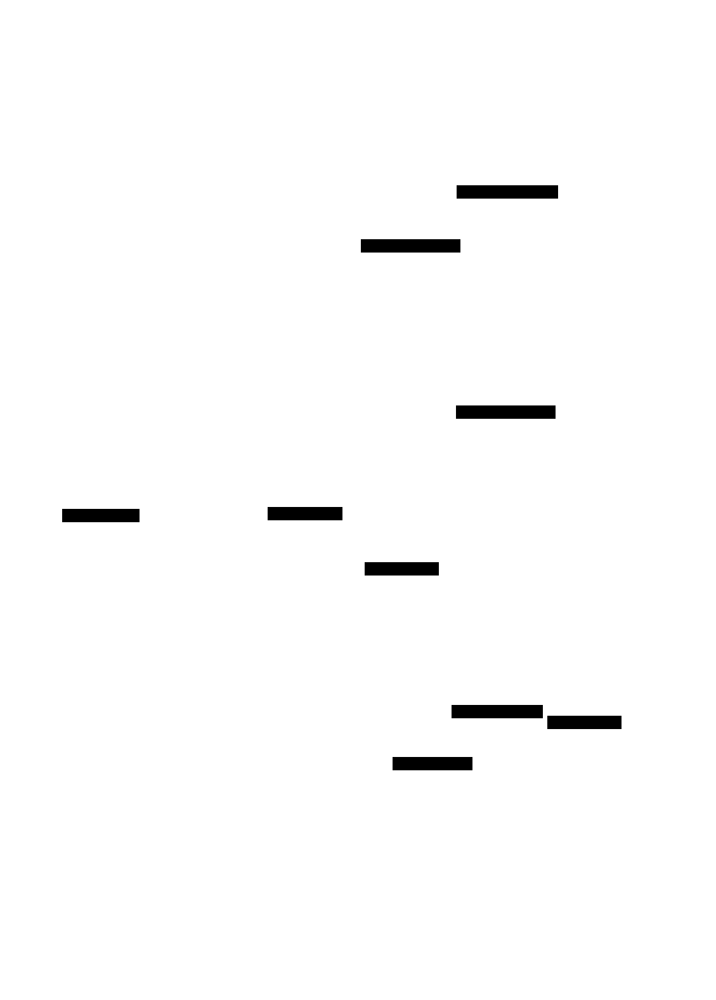

# WebSocket Server: Design Document


## Overview

This system implements a WebSocket server from scratch following RFC 6455, handling the HTTP upgrade handshake, binary frame parsing, and connection lifecycle management. The key architectural challenge is managing the protocol transition from HTTP to WebSocket while maintaining concurrent connections with proper framing and heartbeat mechanisms.


> This guide is meant to help you understand the big picture before diving into each milestone. Refer back to it whenever you need context on how components connect.


## Context and Problem Statement

> **Milestone(s):** All milestones (foundational understanding for the entire project)

### The Need for Real-Time Communication

**Mental Model: The Restaurant Problem**

Imagine you're running a restaurant where customers can only communicate with the kitchen by writing letters. When a customer wants to order food, they write "I would like pasta" on paper, seal it in an envelope, address it to "Kitchen," and hand it to a waiter. The kitchen receives the letter, prepares the food, writes back "Your pasta is ready" on paper, seals it in an envelope addressed to the customer's table, and sends it back via waiter. If the customer wants to modify their order, cancel it, or ask about timing, each interaction requires another complete letter exchange.

This is essentially how traditional **HTTP request-response** communication works. Every interaction is a complete round-trip: the client packages a request, sends it to the server, waits for a complete response, and the connection closes. For many web applications, this works perfectly well—when you click "Buy Now" on an e-commerce site, you don't need real-time updates during the purchase process.

However, modern interactive applications require something fundamentally different. Consider a real-time chat application, online gaming, collaborative document editing, live sports scores, or financial trading platforms. These applications need **bidirectional, low-latency communication** where both the client and server can initiate communication at any time, and responses must arrive within milliseconds, not seconds.

The core limitations of HTTP request-response for real-time communication include:

| Limitation | Impact on Real-Time Applications |
|------------|----------------------------------|
| **Connection Overhead** | Each request requires TCP handshake, HTTP headers, connection teardown |
| **Unidirectional Initiation** | Server cannot spontaneously send data to client without a pending request |
| **Stateless Nature** | No persistent connection context, requiring authentication/session data in every request |
| **Protocol Overhead** | HTTP headers add 500-2000 bytes per request, wasteful for small messages |
| **Request Queuing** | Browsers limit concurrent HTTP connections (typically 6 per domain) |

Consider a real-time chat application handling 1,000 concurrent users. With HTTP polling, each client might send a request every 5 seconds asking "any new messages?" Even with no activity, this generates 12,000 requests per minute, most returning empty responses. Each request carries full HTTP headers, cookies, and authentication tokens. The server must process each request individually, check for new messages, and respond. Meanwhile, when a user actually sends a message, other users won't see it until their next polling request, creating delays of up to 5 seconds.

In contrast, a real-time approach maintains persistent connections. When one user sends a message, the server immediately pushes it to all connected clients within milliseconds. No polling overhead, no wasted requests, and no artificial delays.

### WebSocket vs Alternative Approaches

Before diving into WebSocket implementation, it's crucial to understand why WebSocket exists and how it compares to alternative real-time communication approaches. Each approach represents different trade-offs between complexity, performance, browser compatibility, and use case suitability.

**Mental Model: Communication Channels**

Think of real-time communication approaches as different ways to maintain a conversation:
- **HTTP Polling**: Like calling someone every few minutes to ask "anything new?"
- **Server-Sent Events**: Like having a radio receiver where one person broadcasts to many listeners
- **WebSockets**: Like having a telephone conversation where both parties can speak and listen simultaneously
- **Raw TCP Sockets**: Like having a direct telegraph line with complete control over the message format

Let's examine each approach in detail:

| Approach | Connection Model | Directionality | Browser Support | Protocol Overhead | Latency |
|----------|------------------|----------------|-----------------|-------------------|---------|
| **HTTP Long Polling** | Request-hold-response cycle | Server→Client primarily | Universal | High (HTTP headers) | Medium (100-500ms) |
| **Server-Sent Events** | Persistent HTTP connection | Server→Client only | Good (IE limitation) | Medium (HTTP + SSE format) | Low (10-50ms) |
| **WebSockets** | Persistent bidirectional | Client↔Server equally | Excellent (modern) | Very Low (2-14 bytes) | Very Low (1-10ms) |
| **Raw TCP Sockets** | Direct socket connection | Client↔Server equally | None (server-side only) | Minimal (application-defined) | Minimal (<1ms) |

#### HTTP Long Polling

Long polling attempts to simulate real-time communication by holding HTTP requests open on the server side. When a client sends a request, instead of immediately responding with "no new data," the server holds the request open until either new data arrives or a timeout occurs (typically 30-60 seconds).

**How it works:**
1. Client sends HTTP request to server asking for updates
2. Server receives request but doesn't respond immediately
3. Server holds the connection open, waiting for events
4. When an event occurs (or timeout expires), server responds with data
5. Client processes response and immediately sends another long-poll request
6. Cycle repeats continuously

**Advantages:**
- Works with existing HTTP infrastructure (proxies, load balancers, firewalls)
- No special client-side technology required beyond standard HTTP
- Gracefully degrades to regular polling if long-polling fails
- Server can efficiently handle thousands of waiting connections using event loops

**Disadvantages:**
- Still fundamentally request-response based—client must initiate every interaction
- HTTP header overhead on every request (typically 500-2000 bytes)
- Complex connection management when requests time out and reconnect
- Difficult to handle client-to-server communication (requires separate HTTP requests)
- Browser connection limits can be exhausted by long-poll connections

#### Server-Sent Events (SSE)

Server-Sent Events provide a standardized way for servers to push data to browsers over a single HTTP connection. The browser establishes one persistent connection, and the server can send multiple messages over time using a simple text-based format.

**How it works:**
1. Client opens EventSource connection to server endpoint
2. Server responds with `Content-Type: text/event-stream`
3. Server sends messages in SSE format: `data: message content\n\n`
4. Browser automatically handles reconnection if connection drops
5. JavaScript event handlers receive messages as they arrive

**SSE Message Format:**
| Field | Purpose | Example |
|-------|---------|---------|
| `data:` | Message content | `data: {"type":"chat","message":"Hello"}` |
| `event:` | Message type/name | `event: user-joined` |
| `id:` | Message identifier for replay | `id: 12345` |
| `retry:` | Reconnection delay (ms) | `retry: 3000` |

**Advantages:**
- Built into modern browsers with automatic reconnection handling
- Simple text-based protocol that's easy to debug and implement
- Works through most proxies and firewalls (standard HTTP)
- Automatic event parsing and dispatching in JavaScript
- Much lower overhead than repeated HTTP requests

**Disadvantages:**
- Unidirectional only (server-to-client)—client must use separate HTTP requests for client-to-server communication
- Limited Internet Explorer support (polyfills available)
- Text-based format is less efficient than binary protocols for large data
- No built-in compression for individual messages
- Browser connection limits still apply (though less problematic than polling)

#### WebSockets

WebSockets provide full-duplex communication over a single TCP connection. After an initial HTTP handshake, the connection upgrades to the WebSocket protocol, which uses a lightweight binary frame format for all subsequent communication.

**How it works:**
1. Client sends HTTP request with `Connection: Upgrade` and WebSocket headers
2. Server validates handshake and responds with `101 Switching Protocols`
3. Connection switches to WebSocket protocol (no longer HTTP)
4. Both client and server can send messages at any time
5. Messages use efficient binary framing with 2-14 bytes overhead
6. Connection remains open until explicitly closed by either side

**WebSocket Frame Overhead:**
| Payload Size | Frame Overhead | Total Efficiency |
|--------------|----------------|------------------|
| 10 bytes | 2 bytes | 83% |
| 100 bytes | 2 bytes | 98% |
| 1KB | 4 bytes | 99.6% |
| 1MB | 10 bytes | 99.999% |

**Advantages:**
- True bidirectional communication with equal client and server capabilities
- Extremely low protocol overhead (2-14 bytes per message vs 500-2000 for HTTP)
- Native browser support with simple JavaScript API
- Can send both text and binary data efficiently
- No connection limits (beyond system socket limits)
- Supports protocol extensions (compression, multiplexing, etc.)

**Disadvantages:**
- More complex protocol requiring careful implementation of handshake and framing
- Some corporate firewalls and proxies don't handle WebSocket connections properly
- Connection state must be managed—unlike HTTP, connections can be in various states
- Requires explicit heartbeat/ping-pong mechanism to detect dead connections
- More difficult to load balance than stateless HTTP requests

#### Raw TCP Sockets

Raw TCP sockets provide the lowest-level control over network communication but are only available in server-side and desktop applications, not web browsers.

**Advantages:**
- Complete control over protocol design and message format
- Absolute minimal overhead (only your application data)
- Maximum performance and flexibility
- No browser or proxy compatibility issues to consider

**Disadvantages:**
- Not available in web browsers due to security restrictions
- Must implement your own message framing, connection management, heartbeats
- No standardization—every implementation is custom
- Complex error handling and edge case management

> **Key Insight:** WebSockets occupy the sweet spot between the universality of HTTP and the performance of raw TCP. They provide near-TCP performance while working in browsers and through most network infrastructure.

#### Architecture Decision Record: Communication Protocol Choice

> **Decision: Use WebSockets for Real-Time Communication**
> - **Context**: Building a real-time server that needs bidirectional communication with web browsers, requiring low latency and efficient bandwidth usage
> - **Options Considered**: 
>   1. HTTP Long Polling with fallback to regular polling
>   2. Server-Sent Events for server-to-client with HTTP POST for client-to-server
>   3. WebSockets with HTTP upgrade handshake
> - **Decision**: Implement WebSocket protocol with full RFC 6455 compliance
> - **Rationale**: WebSockets provide the best combination of performance (2-byte minimum overhead vs 500+ bytes for HTTP), true bidirectionality (no need for separate client-to-server channel), and browser support (native API in all modern browsers). While more complex to implement than alternatives, the performance and architectural benefits justify the additional complexity.
> - **Consequences**: Enables sub-10ms latency for small messages, eliminates polling overhead, supports both text and binary data, but requires implementing complex binary protocol with proper connection state management and heartbeat mechanisms.

### Implementation Challenges

Implementing a WebSocket server from scratch involves several layers of complexity that don't exist in traditional HTTP servers. Understanding these challenges upfront helps in designing a robust architecture and avoiding common pitfalls.

**Mental Model: Building a Universal Translator**

Think of implementing a WebSocket server like building a universal translator that must:
1. **Recognize the Secret Handshake**: Identify when someone wants to switch from speaking HTTP to speaking WebSocket
2. **Perform Cryptographic Verification**: Prove you actually understand WebSocket by solving a cryptographic puzzle
3. **Parse Encoded Messages**: Decode incoming messages that are wrapped in a binary envelope with various encoding options
4. **Manage Multiple Conversations**: Keep track of many simultaneous conversations, each in different states
5. **Monitor Health**: Regularly check if conversation partners are still listening and remove dead connections

Each of these responsibilities presents unique technical challenges that compound when combined into a working system.

#### Protocol Complexity Challenges

The WebSocket protocol appears simple on the surface—after an HTTP upgrade, messages flow back and forth. However, the binary frame format introduces several layers of complexity:

| Challenge Area | Complexity Source | Impact |
|----------------|------------------|---------|
| **Binary Frame Parsing** | Variable-length payload sizes, bit-level operations | Must handle 1-byte, 3-byte, and 9-byte length encodings |
| **Message Masking** | XOR masking required for client frames | All client data must be unmasked using 4-byte rotating key |
| **Frame Fragmentation** | Large messages split across multiple frames | Must buffer incomplete messages and reassemble fragments |
| **Control vs Data Frames** | Different handling for ping/pong/close vs text/binary | Mixed frame types can arrive in any order |
| **UTF-8 Validation** | Text frames must contain valid UTF-8 sequences | Invalid UTF-8 must trigger connection closure |

**Frame Length Complexity Example:**

The WebSocket protocol uses three different ways to encode payload length, depending on the size:
- **Small payloads (0-125 bytes)**: Length stored directly in 7 bits of the frame header
- **Medium payloads (126-65,535 bytes)**: Length marker of 126, followed by 16-bit length value
- **Large payloads (65,536+ bytes)**: Length marker of 127, followed by 64-bit length value

This means the frame parser must:
1. Read the initial 2-14 bytes of frame header to determine actual header length
2. Handle three different integer parsing code paths
3. Validate that length encoding uses the minimal representation (security requirement)
4. Guard against integer overflow attacks with malformed length values

**Masking Algorithm Complexity:**

Client frames are masked using a 4-byte key and XOR operation. The unmasking algorithm seems simple:
```
unmasked_data[i] = masked_data[i] XOR masking_key[i % 4]
```

However, implementation challenges include:
- **Performance**: Naive byte-by-byte XOR is slow for large payloads
- **Endianness**: Masking key byte order must be preserved across different architectures
- **Partial Frames**: When TCP delivers partial frames, masking state must be preserved
- **Security**: Server frames must NEVER be masked (protocol violation)

#### Connection Management Challenges

Unlike HTTP's stateless request-response model, WebSocket connections maintain persistent state that must be carefully managed:

| State Management Challenge | Description | Failure Mode |
|---------------------------|-------------|--------------|
| **Concurrent Access** | Multiple threads reading/writing connection state | Data races, corrupted state, crashes |
| **Memory Leaks** | Failed connections not properly cleaned up | Gradual memory exhaustion, connection limit reached |
| **State Synchronization** | Connection state changes during message processing | Messages sent to closed connections, double-close attempts |
| **Resource Limits** | System limits on file descriptors, memory, connections | New connections rejected, existing connections dropped |
| **Graceful Shutdown** | Clean server shutdown with active connections | Data loss, client-side connection errors |

**Connection State Machine Complexity:**

Each WebSocket connection progresses through multiple states with specific transition rules:

| Current State | Allowed Transitions | Trigger Events |
|---------------|-------------------|----------------|
| **CONNECTING** | → OPEN, → CLOSED | Handshake success/failure |
| **OPEN** | → CLOSING, → CLOSED | Close frame sent/received, network error |
| **CLOSING** | → CLOSED | Close handshake completion, timeout |
| **CLOSED** | None | Terminal state |

The challenge lies in handling state transitions that can occur from multiple sources:
- **Network events**: TCP connection drops, malformed frames received
- **Application events**: Server shutdown, resource limits exceeded
- **Protocol events**: Close frames, ping timeouts, protocol violations
- **Timer events**: Heartbeat timeouts, close handshake timeouts

Each state transition must be atomic and thread-safe, while ensuring proper cleanup of resources associated with the connection.

#### Binary Frame Handling Difficulties

WebSocket frames use a compact binary format that prioritizes efficiency over simplicity. This creates several implementation challenges:

**Partial Frame Handling:**

TCP can deliver data in arbitrary chunks that don't align with WebSocket frame boundaries. The frame parser must handle scenarios like:
- Frame header split across multiple TCP reads
- Payload data arriving in multiple chunks
- Multiple complete frames arriving in a single TCP read
- Frame boundaries that don't align with TCP segment boundaries

**Buffer Management Challenges:**

| Scenario | Buffer Strategy | Memory Impact |
|----------|----------------|---------------|
| **Small frequent messages** | Per-connection fixed buffers | Wasted memory for idle connections |
| **Large infrequent messages** | Dynamic buffer allocation | Allocation overhead, fragmentation |
| **Mixed message sizes** | Pooled buffers with size tiers | Complex pool management logic |
| **Malicious large frames** | Size limits with graceful degradation | Must reject without memory exhaustion |

**Fragmentation Assembly Complexity:**

Large messages can be split across multiple frames using the FIN bit to mark the final fragment:
1. **First fragment**: FIN=0, opcode=TEXT/BINARY, partial payload
2. **Middle fragments**: FIN=0, opcode=CONTINUATION, partial payload  
3. **Final fragment**: FIN=1, opcode=CONTINUATION, remaining payload

Implementation challenges include:
- **Buffer management**: Accumulating fragments without memory exhaustion
- **Interleaved control frames**: Ping/pong frames can arrive between fragments
- **Connection state changes**: Connection might close during fragmented message assembly
- **Timeout handling**: Incomplete fragmented messages must be cleaned up

**Error Recovery and Protocol Violations:**

The WebSocket specification defines numerous error conditions that require immediate connection closure:
- Invalid frame opcodes
- Masked server frames or unmasked client frames  
- Invalid UTF-8 sequences in text frames
- Control frames longer than 125 bytes
- Continuation frames without initial fragment

Each error condition must be detected reliably and result in proper connection cleanup, including sending close frames with appropriate error codes when possible.

> **Critical Design Principle:** WebSocket error handling follows a "fail fast" philosophy—when protocol violations are detected, the connection should be closed immediately rather than attempting recovery. This prevents security vulnerabilities and ensures interoperability.

#### Common Implementation Pitfalls

Understanding common mistakes helps avoid hours of debugging and ensures robust implementation:

⚠️ **Pitfall: Forgetting Client Frame Masking**
Most frame parsing bugs stem from forgetting that client-to-server frames are always masked while server-to-client frames are never masked. Symptoms include garbled message content and mysterious UTF-8 validation failures. The fix requires checking the mask bit in the frame header and applying XOR unmasking only for client frames.

⚠️ **Pitfall: Incomplete Handshake Validation**
A common mistake is accepting any HTTP request with `Connection: Upgrade` as a valid WebSocket handshake. Proper validation requires checking multiple headers: `Upgrade: websocket`, `Sec-WebSocket-Version: 13`, and a properly formatted `Sec-WebSocket-Key`. Missing any validation step can allow non-WebSocket clients to hang connections or cause crashes.

⚠️ **Pitfall: Using Wall Clock Time for Timeouts**
Using system wall clock time (`Date.now()` or `time.Now()`) for connection timeouts fails when system time changes due to NTP adjustments or manual changes. The solution is using monotonic time sources (`performance.now()` in browsers, `time.Since()` in Go) that measure elapsed time regardless of system clock adjustments.

⚠️ **Pitfall: Race Conditions in Connection Cleanup**
Connection state often gets modified from multiple sources simultaneously—message processing threads, heartbeat timers, and cleanup routines. Without proper synchronization, connections can be closed multiple times or have messages sent after closure. The solution requires careful locking around state transitions and idempotent cleanup operations.

⚠️ **Pitfall: Integer Overflow in Payload Length**
The WebSocket specification allows payload lengths up to 2^63-1 bytes (8 exabytes), but most implementations can't handle such large messages. Malicious clients can send frames claiming enormous payload lengths, causing memory allocation failures or integer overflow. Robust implementations must validate payload lengths against reasonable limits and available memory.

⚠️ **Pitfall: Blocking Operations in Event Loops**
WebSocket servers often use event-driven architectures where blocking operations (synchronous I/O, long computations) in message handlers can freeze the entire server. This is particularly problematic when broadcasting messages to many connections—a slow connection can block broadcasts to all other connections. The solution requires non-blocking I/O and careful separation of I/O operations from business logic.

### Implementation Guidance

The WebSocket server implementation requires careful attention to networking fundamentals, binary protocol handling, and concurrent programming. This section provides practical guidance for building a production-ready server.

#### Technology Recommendations

| Component | Simple Option | Advanced Option |
|-----------|---------------|-----------------|
| **HTTP Server Foundation** | Node.js built-in `http` module | Express.js with WebSocket upgrade handling |
| **Binary Data Handling** | Node.js `Buffer` with manual bit manipulation | Custom frame parser with typed arrays |
| **Connection Storage** | JavaScript `Map` with connection objects | Redis or in-memory database for clustering |
| **Concurrent Processing** | Single-threaded event loop | Worker threads for CPU-intensive operations |
| **Timing and Timeouts** | `setTimeout` with `performance.now()` | Custom timer wheel for efficient timeout management |
| **Testing Framework** | Node.js built-in test runner | Jest with WebSocket client mocking |

#### Recommended Project Structure

Organize the WebSocket server code to separate protocol handling from business logic and facilitate testing:

```
websocket-server/
├── src/
│   ├── server.js                    ← Main server entry point
│   ├── protocol/
│   │   ├── handshake.js            ← HTTP upgrade handshake handler
│   │   ├── frame-parser.js         ← Binary frame parsing and assembly
│   │   ├── frame-builder.js        ← Frame construction for outgoing messages
│   │   └── constants.js            ← WebSocket opcodes, states, error codes
│   ├── connection/
│   │   ├── connection-manager.js   ← Connection lifecycle and state management
│   │   ├── connection.js           ← Individual connection representation
│   │   └── heartbeat.js            ← Ping/pong heartbeat system
│   ├── utils/
│   │   ├── crypto.js              ← SHA-1 hashing for handshake
│   │   ├── utf8-validator.js      ← UTF-8 validation for text frames
│   │   └── buffer-utils.js        ← Binary data manipulation helpers
│   └── errors/
│       ├── websocket-error.js     ← Custom error types
│       └── error-codes.js         ← WebSocket close codes
├── test/
│   ├── integration/               ← End-to-end WebSocket client tests
│   ├── unit/                      ← Component unit tests
│   └── helpers/                   ← Test utilities and mocks
├── examples/
│   ├── chat-server.js            ← Simple chat room implementation
│   ├── echo-server.js            ← Basic echo server for testing
│   └── broadcast-server.js       ← Broadcasting example
└── docs/
    ├── protocol-guide.md         ← WebSocket protocol implementation notes
    └── debugging-guide.md        ← Common issues and solutions
```

This structure separates the low-level protocol implementation (`protocol/` directory) from connection management (`connection/` directory) and provides clear extension points for building applications on top of the WebSocket server.

#### Infrastructure Starter Code

**WebSocket Constants and Utilities**

Complete utility module that handles WebSocket protocol constants and helper functions:

```javascript
// src/protocol/constants.js

/**
 * WebSocket protocol constants and utility functions.
 * These values are defined in RFC 6455 and must match exactly.
 */

// WebSocket frame opcodes (RFC 6455 Section 5.2)
export const OPCODES = {
    CONTINUATION: 0x0,
    TEXT: 0x1,
    BINARY: 0x2,
    CLOSE: 0x8,
    PING: 0x9,
    PONG: 0xa
};

// WebSocket connection states
export const CONNECTION_STATES = {
    CONNECTING: 'CONNECTING',
    OPEN: 'OPEN',
    CLOSING: 'CLOSING',
    CLOSED: 'CLOSED'
};

// WebSocket close codes (RFC 6455 Section 7.4)
export const CLOSE_CODES = {
    NORMAL_CLOSURE: 1000,
    GOING_AWAY: 1001,
    PROTOCOL_ERROR: 1002,
    UNSUPPORTED_DATA: 1003,
    NO_STATUS_RCVD: 1005,
    ABNORMAL_CLOSURE: 1006,
    INVALID_FRAME_PAYLOAD_DATA: 1007,
    POLICY_VIOLATION: 1008,
    MESSAGE_TOO_BIG: 1009,
    MANDATORY_EXTENSION: 1010,
    INTERNAL_SERVER_ERROR: 1011,
    SERVICE_RESTART: 1012,
    TRY_AGAIN_LATER: 1013,
    TLS_HANDSHAKE: 1015
};

// Magic GUID string from RFC 6455 - used in handshake
export const WEBSOCKET_MAGIC_GUID = '258EAFA5-E914-47DA-95CA-C5AB0DC85B11';

// Maximum payload length for control frames
export const MAX_CONTROL_FRAME_PAYLOAD_LENGTH = 125;

// Default configuration values
export const DEFAULT_CONFIG = {
    maxPayloadLength: 1024 * 1024, // 1MB default message size limit
    pingInterval: 30000,            // Send ping every 30 seconds
    pongTimeout: 5000,              // Wait 5 seconds for pong response
    maxConnections: 1000,           // Maximum concurrent connections
    handshakeTimeout: 5000          // Handshake must complete within 5 seconds
};

/**
 * Validates if an opcode represents a control frame.
 * Control frames have opcodes 0x8-0xF and follow different rules.
 */
export function isControlFrame(opcode) {
    return (opcode & 0x8) !== 0;
}

/**
 * Validates if an opcode is defined in the WebSocket specification.
 */
export function isValidOpcode(opcode) {
    const validOpcodes = [
        OPCODES.CONTINUATION, OPCODES.TEXT, OPCODES.BINARY,
        OPCODES.CLOSE, OPCODES.PING, OPCODES.PONG
    ];
    return validOpcodes.includes(opcode);
}

/**
 * Creates a standard WebSocket error with close code and reason.
 */
export function createProtocolError(closeCode, reason) {
    const error = new Error(reason);
    error.closeCode = closeCode;
    error.isWebSocketError = true;
    return error;
}
```

**Cryptographic Utilities for Handshake**

Complete cryptographic functions needed for WebSocket handshake validation:

```javascript
// src/utils/crypto.js

import crypto from 'crypto';
import { WEBSOCKET_MAGIC_GUID } from '../protocol/constants.js';

/**
 * Generates the Sec-WebSocket-Accept header value from a client's key.
 * This implements the handshake algorithm from RFC 6455 Section 4.2.2.
 */
export function generateAcceptKey(clientKey) {
    if (typeof clientKey !== 'string' || clientKey.length === 0) {
        throw new Error('Client key must be a non-empty string');
    }
    
    // Step 1: Concatenate client key with magic GUID
    const concatenated = clientKey + WEBSOCKET_MAGIC_GUID;
    
    // Step 2: Compute SHA-1 hash of the concatenated string  
    const hash = crypto.createHash('sha1').update(concatenated).digest();
    
    // Step 3: Base64 encode the hash
    return hash.toString('base64');
}

/**
 * Validates that a client key is properly formatted for WebSocket handshake.
 * The key should be a base64-encoded 16-byte value.
 */
export function validateClientKey(clientKey) {
    if (typeof clientKey !== 'string') {
        return false;
    }
    
    try {
        // Decode base64 to check format
        const decoded = Buffer.from(clientKey, 'base64');
        
        // WebSocket keys should be exactly 16 bytes when decoded
        return decoded.length === 16;
    } catch (error) {
        // Invalid base64 encoding
        return false;
    }
}

/**
 * Generates a random WebSocket key for testing purposes.
 * In production, this would be generated by the client.
 */
export function generateClientKey() {
    const randomBytes = crypto.randomBytes(16);
    return randomBytes.toString('base64');
}
```

#### Core Logic Skeleton Code

**WebSocket Server Foundation**

This skeleton provides the main server structure that learners will build upon:

```javascript
// src/server.js

import http from 'http';
import { EventEmitter } from 'events';
import { HandshakeHandler } from './protocol/handshake.js';
import { ConnectionManager } from './connection/connection-manager.js';
import { DEFAULT_CONFIG } from './protocol/constants.js';

/**
 * WebSocket Server implementing RFC 6455 protocol.
 * Handles HTTP upgrade handshake, connection management, and message routing.
 */
export class WebSocketServer extends EventEmitter {
    constructor(options = {}) {
        super();
        this.config = { ...DEFAULT_CONFIG, ...options };
        
        // Initialize components
        this.handshakeHandler = new HandshakeHandler(this.config);
        this.connectionManager = new ConnectionManager(this.config);
        
        // Create HTTP server for handling upgrade requests
        this.httpServer = http.createServer();
        this.setupEventHandlers();
    }
    
    setupEventHandlers() {
        // TODO 1: Set up HTTP server 'upgrade' event handler
        // TODO 2: Set up connection manager event forwarding to server
        // TODO 3: Set up graceful shutdown handling
        // Hint: The 'upgrade' event provides (request, socket, head) parameters
    }
    
    /**
     * Starts the WebSocket server on the specified port.
     */
    async start(port = 8080) {
        // TODO 1: Start HTTP server listening on specified port
        // TODO 2: Start connection manager background tasks (heartbeat, cleanup)
        // TODO 3: Emit 'server-started' event with port information
        // TODO 4: Set up error handling for server startup failures
    }
    
    /**
     * Handles HTTP upgrade requests and performs WebSocket handshake.
     */
    async handleUpgrade(request, socket, head) {
        // TODO 1: Validate that this is a WebSocket upgrade request
        // TODO 2: Perform WebSocket handshake using HandshakeHandler
        // TODO 3: On successful handshake, create new Connection object
        // TODO 4: Register connection with ConnectionManager
        // TODO 5: Start processing WebSocket frames from the socket
        // TODO 6: Handle handshake failures by closing socket with error
        // Hint: Use try-catch around handshake to handle protocol errors
    }
    
    /**
     * Broadcasts a message to all connected clients.
     */
    broadcast(message, options = {}) {
        // TODO 1: Get list of active connections from ConnectionManager
        // TODO 2: Filter connections based on options (e.g., exclude sender)
        // TODO 3: Send message to each connection using Connection.send()
        // TODO 4: Handle individual connection failures without affecting others
        // TODO 5: Return statistics about successful/failed sends
        // Hint: Use Promise.allSettled() to handle concurrent sends
    }
    
    /**
     * Gracefully shuts down the server and all connections.
     */
    async shutdown(timeout = 5000) {
        // TODO 1: Stop accepting new connections
        // TODO 2: Send close frames to all active connections
        // TODO 3: Wait for connections to close gracefully (up to timeout)
        // TODO 4: Force-close any remaining connections after timeout
        // TODO 5: Stop HTTP server and clean up resources
        // TODO 6: Emit 'server-stopped' event
        // Hint: Use Promise.race() with timeout for graceful shutdown
    }
}
```

#### Language-Specific Implementation Hints

**Node.js WebSocket Development Tips:**

- **Buffer Handling**: Use `Buffer.allocUnsafe()` for performance-critical frame parsing, but ensure you overwrite all bytes to avoid information leakage
- **Event Loop Efficiency**: Keep frame parsing synchronous and fast—move heavy processing to `setImmediate()` or worker threads
- **Memory Management**: Use `buffer.slice()` carefully as it creates views, not copies. Use `Buffer.from(buffer)` when you need independent copies
- **TCP Socket Events**: Listen for `'data'`, `'close'`, `'error'`, and `'end'` events. The `'end'` event means no more data will be received, but you can still send
- **Binary Operations**: Use bitwise operations (`&`, `|`, `^`, `<<`, `>>`) for efficient frame header parsing and masking operations
- **UTF-8 Validation**: Node.js `Buffer.toString('utf8')` doesn't validate UTF-8. Use a dedicated validator or the `utf-8-validate` npm package

**Performance Optimizations:**

- **Frame Parsing**: Pre-allocate parsing buffers and reuse them to reduce garbage collection pressure
- **Connection Storage**: Use `Map` instead of plain objects for connection storage—it's optimized for frequent additions/deletions
- **Timer Management**: Group multiple connection timeouts using a single timer when possible to reduce timer overhead
- **Masking Operations**: For large payloads, use 32-bit operations instead of byte-by-byte XOR for 4x performance improvement

#### Milestone Checkpoints

**Milestone 1 Checkpoint - HTTP Upgrade Handshake:**
After implementing the handshake handler, test with:
```bash
# Start your server
node src/server.js

# Test with curl (should return 101 Switching Protocols)
curl -i -N -H "Connection: Upgrade" \
     -H "Upgrade: websocket" \
     -H "Sec-WebSocket-Version: 13" \
     -H "Sec-WebSocket-Key: dGhlIHNhbXBsZSBub25jZQ==" \
     http://localhost:8080/
```

Expected output includes `HTTP/1.1 101 Switching Protocols` and `Sec-WebSocket-Accept: s3pPLMBiTxaQ9kYGzzhZRbK+xOo=`

**Milestone 2 Checkpoint - Frame Parsing:**
Create a simple test client that sends different frame types:
```javascript
// Test fragmented message handling
const ws = new WebSocket('ws://localhost:8080');
ws.onopen = () => {
    // Send a text message
    ws.send('Hello WebSocket!');
    
    // Send binary data
    ws.send(new Uint8Array([1, 2, 3, 4, 5]));
};
```

Your server should correctly parse both text and binary messages and handle them appropriately.

**Milestone 3 Checkpoint - Connection Management:**
Open multiple WebSocket connections and verify:
- Each connection gets a unique identifier
- Broadcasting works correctly (message sent to one appears on all others)
- Closing one connection doesn't affect others
- Server tracks connection count accurately

**Milestone 4 Checkpoint - Heartbeat System:**
Configure a short ping interval (5 seconds) and observe:
- Ping frames sent automatically to all connections
- Pong responses received and processed
- Connections closed when pong timeout exceeded
- Check browser developer tools to see ping/pong frames in the network tab


## Goals and Non-Goals

> **Milestone(s):** All milestones (project scope definition for the entire implementation)

### Functional Goals

**Mental Model: The Essential Toolkit**
Think of our WebSocket server goals like assembling a carpenter's essential toolkit. A master carpenter doesn't need every specialized tool ever invented to build quality furniture, but they do need the fundamental tools that work reliably and handle the most common tasks. Similarly, our WebSocket server focuses on implementing the core RFC 6455 protocol features that enable real-time bidirectional communication, without getting distracted by every possible extension or edge case optimization.

Our WebSocket server implementation must deliver specific functional capabilities that demonstrate mastery of the RFC 6455 protocol. These goals represent the minimum viable feature set required for a production-capable WebSocket server that can handle real-world client connections and message exchange patterns.

The **HTTP upgrade handshake** forms the foundation of our functional goals. The server must correctly detect incoming HTTP requests that contain WebSocket upgrade headers, validate the cryptographic handshake according to RFC 6455 specifications, and complete the protocol transition from HTTP to WebSocket framing. This involves parsing the `Sec-WebSocket-Key` header, computing the SHA-1 hash with the magic GUID `258EAFA5-E914-47DA-95CA-C5AB0DC85B11`, encoding the result in Base64 format, and responding with the appropriate `101 Switching Protocols` response containing the `Sec-WebSocket-Accept` header.

**Binary frame parsing and message assembly** represents the core message processing capability. The server must parse the complete WebSocket frame format, including the FIN bit for message fragmentation, the 4-bit opcode field for frame type identification, the mask bit and 32-bit masking key for client frame unmasking, and variable-length payload size handling for frames ranging from 0 bytes to theoretical 64-bit maximum sizes. The implementation must correctly apply XOR unmasking to all client-originated frames, reassemble fragmented messages that span multiple continuation frames, and distinguish between text frames requiring UTF-8 validation and binary frames that accept arbitrary byte sequences.

| Frame Processing Capability | Requirement Level | Technical Details |
|---------------------------|------------------|-------------------|
| FIN bit handling | Must implement | Support both single-frame messages (FIN=1) and fragmented messages (FIN=0 until final frame) |
| Opcode processing | Must implement | Handle text (0x1), binary (0x2), close (0x8), ping (0x9), pong (0xA), continuation (0x0) |
| Masking/unmasking | Must implement | Apply 4-byte XOR mask to all client frames, reject unmasked client frames per RFC |
| Payload length variants | Must implement | Support 7-bit (0-125), 16-bit extended (126-65535), and 64-bit extended lengths |
| UTF-8 validation | Must implement | Validate text frame payloads contain valid UTF-8 sequences |
| Control frame limits | Must implement | Enforce 125-byte maximum payload for ping, pong, and close frames |

**Connection lifecycle management** ensures proper state tracking and resource handling for concurrent WebSocket sessions. The server must maintain connection state through the standard lifecycle: CONNECTING during handshake processing, OPEN for active message exchange, CLOSING during graceful shutdown handshake, and CLOSED after resource cleanup. Each connection requires unique identification, metadata storage for client information, and proper cleanup of network resources when connections terminate normally or abnormally.

The **close handshake implementation** provides graceful connection termination. When either peer initiates closure, the server must send a close frame containing an appropriate status code from the RFC 6455 specification, wait for the responding close frame from the peer, and then close the underlying TCP socket. The server must handle various close scenarios including normal closure (1000), going away (1001), protocol errors (1002), and abnormal closures where the TCP connection drops without a proper close frame exchange.

| Connection State | Entry Condition | Valid Transitions | Required Actions |
|-----------------|----------------|-------------------|------------------|
| CONNECTING | HTTP upgrade detected | OPEN, CLOSED | Validate handshake, compute accept key |
| OPEN | Handshake completed | CLOSING, CLOSED | Process frames, send heartbeats |
| CLOSING | Close frame sent/received | CLOSED | Wait for close response, cleanup timer |
| CLOSED | TCP connection terminated | None | Release resources, remove from manager |

**Heartbeat mechanism using ping/pong frames** maintains connection health and detects dead connections that have been silently dropped by network infrastructure. The server must periodically send ping control frames to connected clients, track pong responses to determine connection liveness, and terminate connections that fail to respond within configurable timeout intervals. This heartbeat system prevents resource leaks from zombie connections and maintains NAT mapping tables in network appliances.

**Multi-connection broadcasting capabilities** enable real-time communication patterns where messages from one client reach multiple connected clients. The server must maintain a registry of active connections, provide thread-safe broadcast operations that iterate through the connection list, handle partial broadcast failures where some connections succeed while others fail, and support selective broadcasting based on connection metadata or filtering criteria.

> **Design Insight: Protocol Correctness Over Performance**
> Our functional goals prioritize strict RFC 6455 compliance over performance optimizations. A server that correctly implements the WebSocket protocol but handles only 100 concurrent connections is more valuable for learning than a server that handles 10,000 connections but violates masking requirements or close handshake procedures.

### Non-Functional Goals

**Mental Model: The Service Level Agreement**
Think of non-functional goals like a service level agreement between our WebSocket server and its users. Just as a restaurant promises not just to serve food (functional goal) but to serve it within 15 minutes at the right temperature with friendly service (non-functional goals), our server must meet performance, scalability, and reliability expectations that make it suitable for real-world deployment scenarios.

Our non-functional goals establish measurable quality attributes that determine whether the WebSocket server can handle production workloads effectively. These goals provide concrete targets for performance testing and operational readiness assessment.

**Connection capacity targets** define the minimum concurrent connection handling requirements. The server must support at least 100 simultaneous WebSocket connections on standard development hardware (4GB RAM, dual-core CPU), with graceful performance degradation beyond this threshold rather than catastrophic failure. Connection establishment latency should remain below 100 milliseconds for handshake completion under normal load conditions, enabling responsive user experience for real-time applications.

**Message throughput performance** ensures adequate bandwidth for typical WebSocket use cases. The server must process at least 1,000 messages per second across all connections combined, with individual message latency below 10 milliseconds from frame receipt to processing completion. This throughput target accommodates chat applications, collaborative editing, gaming, and financial data streaming without creating user-perceivable delays.

| Performance Metric | Target Value | Measurement Method | Failure Condition |
|-------------------|--------------|-------------------|-------------------|
| Concurrent connections | 100 minimum | Load testing with WebSocket clients | Server crashes or refuses connections |
| Message throughput | 1,000 msg/sec | Sustained load over 60 seconds | Throughput drops below 800 msg/sec |
| Handshake latency | <100ms average | Client connection timing | >500ms for any handshake |
| Message processing latency | <10ms average | Frame receipt to handler dispatch | >50ms average over 1000 messages |
| Memory usage per connection | <1MB average | Process memory monitoring | >5MB per connection |
| CPU utilization | <80% sustained | System monitoring during load | >95% for more than 10 seconds |

**Memory management efficiency** prevents resource exhaustion under normal operating conditions. The server must limit memory usage to less than 1MB per active connection on average, implement proper cleanup of message buffers and connection state, and avoid memory leaks that cause gradual resource consumption over extended runtime periods. Garbage collection impact should remain minimal, with no single GC pause exceeding 50 milliseconds in languages with automatic memory management.

**Reliability and fault tolerance** requirements ensure the server continues operating despite individual connection failures or network issues. The server must isolate connection failures so that problems with one WebSocket session don't affect other active connections. Network timeout handling should recover gracefully from partial frame reads, connection drops during handshake, and TCP socket errors without crashing the entire server process.

**Error handling completeness** mandates proper responses to all protocol violations and edge cases defined in RFC 6455. The server must send appropriate close frames with correct status codes for protocol errors, handle malformed frames without crashing, validate frame structure completely before processing payloads, and provide clear error messages for debugging connection issues. Malicious or corrupted input must never cause undefined behavior or security vulnerabilities.

> **Architectural Constraint: Single-Process Design**
> Our non-functional goals assume a single-process server architecture running on one machine. This constraint simplifies connection management and state synchronization while still delivering meaningful performance targets for educational and small-to-medium production deployments.

**Resource usage predictability** ensures operational teams can capacity plan and monitor the server effectively. Memory usage should scale linearly with connection count and message volume, CPU usage should correlate predictably with message processing load, and network bandwidth consumption should match actual message payloads without excessive protocol overhead. The server must provide basic metrics for monitoring connection count, message rates, and error frequencies.

**Configuration flexibility** allows adaptation to different deployment environments and use case requirements. The server must support configurable heartbeat intervals (default 30 seconds), connection timeout thresholds (default 60 seconds), maximum message sizes (default 1MB), and maximum concurrent connections (default 1000). Configuration changes should take effect without server restart where possible, and invalid configuration values must be rejected with clear error messages.

### Explicit Non-Goals

**Mental Model: The Scope Boundary**
Think of explicit non-goals like the fence around a construction site. Just as construction workers focus on building the foundation and structure within the fence rather than landscaping the entire neighborhood, our WebSocket server focuses on core protocol implementation rather than every possible advanced feature or optimization. These boundaries prevent scope creep and ensure we master the fundamentals before attempting sophisticated extensions.

Our explicit non-goals define features and capabilities that are deliberately excluded from this implementation to maintain focus on core learning objectives and prevent unnecessary complexity that would obscure the fundamental WebSocket concepts.

**WebSocket protocol extensions** including compression (permessage-deflate), multiplexing (RFC 7692), and custom extension negotiation are excluded from our implementation scope. While these extensions provide valuable functionality for production systems, they add significant protocol complexity that distracts from learning the base RFC 6455 specification. Extension support requires additional handshake negotiation, frame processing modifications, and state management that would double the implementation complexity without proportional educational benefit.

**Transport Layer Security (TLS/SSL)** support for secure WebSocket connections (wss://) is not included in our server implementation. TLS termination adds certificate management, encryption/decryption overhead, and security considerations that are orthogonal to WebSocket protocol learning. Production deployments typically handle TLS termination at the load balancer or reverse proxy layer, making application-level TLS support unnecessary for educational purposes.

| Excluded Feature Category | Examples | Reason for Exclusion | Alternative Approach |
|-------------------------|----------|---------------------|---------------------|
| Protocol extensions | permessage-deflate, multiplexing | Adds complexity without educational value | Learn base protocol first |
| Security features | TLS/SSL, authentication, authorization | Orthogonal to WebSocket protocol concepts | Handle at infrastructure layer |
| Advanced networking | HTTP/2 upgrade, proxy support | Beyond scope of protocol fundamentals | Use reverse proxy in production |
| Horizontal scaling | Clustering, load balancing, session sharing | Requires distributed systems concepts | Single-process design sufficient |
| Performance optimization | Connection pooling, zero-copy I/O, SIMD | Premature optimization for learning | Focus on correctness first |
| Production operations | Logging, metrics, health checks, admin API | Important but not protocol-specific | Add as separate layer |

**Authentication and authorization mechanisms** are explicitly excluded from our WebSocket server implementation. While production WebSocket servers require user authentication, session management, and message-level authorization, these features represent application-layer concerns rather than protocol-layer functionality. Our server accepts all valid WebSocket handshakes without credential validation, allowing focus on connection lifecycle management and message framing rather than security policy enforcement.

**Advanced networking features** including HTTP/2 upgrade paths, proxy server support (CONNECT method), and WebSocket-over-HTTP tunneling are not implemented. These features require deep understanding of HTTP infrastructure and proxy protocols that extend far beyond WebSocket-specific knowledge. Production deployments typically handle these concerns at the infrastructure layer using specialized reverse proxy servers like nginx or HAProxy.

**Horizontal scaling and clustering capabilities** remain outside our implementation scope. Features like connection sharing across multiple server processes, distributed message broadcasting, session state replication, and load balancer integration require distributed systems expertise that overshadows WebSocket protocol learning. Our single-process design provides sufficient complexity for understanding connection management and message processing patterns.

> **Decision: Educational Focus Over Production Features**
> - **Context**: WebSocket servers in production require numerous features beyond the core protocol
> - **Options Considered**: 
>   - Full-featured production server with all enterprise capabilities
>   - Core protocol implementation focusing on RFC 6455 compliance
>   - Minimal proof-of-concept with basic connectivity only
> - **Decision**: Core protocol implementation with production-quality reliability
> - **Rationale**: Maximizes learning value while maintaining practical applicability; advanced features can be added later once fundamentals are mastered
> - **Consequences**: Server suitable for learning and small-production use but requires infrastructure support for enterprise deployment

**Performance optimization techniques** including zero-copy I/O operations, SIMD-accelerated frame processing, connection pooling, and custom memory allocators are deliberately avoided. While these optimizations can dramatically improve throughput and latency in high-performance scenarios, they obscure the fundamental algorithms and data structures that comprise WebSocket protocol handling. Our implementation prioritizes code clarity and educational value over maximum performance.

**Comprehensive logging and monitoring infrastructure** beyond basic error reporting is not included in our server implementation. Production systems require structured logging, metrics collection, distributed tracing, health check endpoints, and administrative APIs for operational management. These features represent important production concerns but don't contribute to understanding WebSocket protocol mechanics and message processing patterns.

**Database integration and persistence** capabilities are excluded from our WebSocket server scope. While many WebSocket applications require message persistence, user state storage, and database-backed session management, these features represent application architecture concerns rather than protocol implementation details. Our server operates entirely in memory, focusing on real-time message processing rather than data persistence patterns.

**Client library development** and cross-platform compatibility testing remain outside our project scope. While a complete WebSocket ecosystem includes client libraries for various programming languages and comprehensive compatibility testing across browsers and platforms, our focus remains on server-side protocol implementation. Existing client libraries and browser WebSocket APIs provide adequate testing capabilities for our server implementation.

> **Scope Boundary Principle**
> Every feature excluded from our non-goals represents a potential future enhancement that builds upon the core protocol implementation. By mastering the fundamental WebSocket concepts first, developers gain the knowledge foundation necessary to implement these advanced features effectively when production requirements demand them.

### Implementation Guidance

#### Technology Recommendations

| Component | Simple Option | Advanced Option |
|-----------|--------------|----------------|
| HTTP Server | Node.js built-in `http` module | Express.js with upgrade middleware |
| TCP Socket Handling | Native `net.Socket` with event listeners | Stream-based processing with backpressure |
| Cryptographic Functions | Node.js `crypto` module SHA-1 and Base64 | Web Crypto API for browser compatibility |
| Connection Storage | JavaScript `Map` with connection IDs | Redis for distributed session storage |
| Timer Management | `setTimeout`/`setInterval` for heartbeats | High-resolution timers with drift correction |
| Configuration | JSON config file with `fs.readFileSync` | Environment variables with validation schema |
| Testing Framework | Node.js built-in `assert` module | Jest with WebSocket test utilities |
| Process Management | Single Node.js process | PM2 cluster mode with sticky sessions |

#### Recommended Project Structure

The goal-driven project structure organizes code around functional capabilities rather than technical layers, making it easier to track progress against our defined goals and validate milestone completion:

```javascript
websocket-server/
├── package.json                     // Dependencies and scripts
├── config/
│   ├── default.json                 // Default server configuration
│   └── test.json                    // Test environment overrides
├── src/
│   ├── server.js                    // Main WebSocketServer class - entry point
│   ├── handshake/                   // HTTP Upgrade Handshake Handler
│   │   ├── handler.js              // HandshakeHandler class implementation
│   │   ├── crypto.js               // Key validation and accept generation
│   │   └── validator.js            // Header parsing and validation
│   ├── frame/                       // Frame Parser and Message Assembly  
│   │   ├── parser.js               // Binary frame parsing logic
│   │   ├── assembler.js            // Message fragmentation handling
│   │   └── opcodes.js              // Frame type constants and utilities
│   ├── connection/                  // Connection Manager
│   │   ├── manager.js              // ConnectionManager class
│   │   ├── connection.js           // Individual Connection state
│   │   └── broadcaster.js          // Multi-connection message routing
│   ├── heartbeat/                   // Heartbeat System
│   │   ├── monitor.js              // Ping/pong frame management
│   │   ├── timer.js                // Interval scheduling and timeout detection
│   │   └── detector.js             // Dead connection identification
│   └── utils/                       // Shared utilities
│       ├── constants.js            // WebSocket protocol constants
│       ├── errors.js               // Custom error types
│       └── logger.js               // Basic logging utilities
├── test/
│   ├── integration/                 // End-to-end WebSocket flows
│   ├── unit/                       // Component-specific tests
│   └── fixtures/                   // Test data and mock clients
└── examples/
    ├── echo-server.js              // Basic echo server implementation
    ├── chat-server.js              // Multi-client chat example
    └── load-test.js                // Performance validation script
```

#### Infrastructure Starter Code

Complete HTTP server foundation that handles the transition from HTTP to WebSocket protocols:

```javascript
// src/utils/constants.js - Complete WebSocket protocol constants
const WEBSOCKET_MAGIC_GUID = '258EAFA5-E914-47DA-95CA-C5AB0DC85B11';
const MAX_CONTROL_FRAME_PAYLOAD_LENGTH = 125;

const OPCODES = {
  CONTINUATION: 0x0,
  TEXT: 0x1,
  BINARY: 0x2,
  CLOSE: 0x8,
  PING: 0x9,
  PONG: 0xA
};

const CONNECTION_STATES = {
  CONNECTING: 'CONNECTING',
  OPEN: 'OPEN', 
  CLOSING: 'CLOSING',
  CLOSED: 'CLOSED'
};

const CLOSE_CODES = {
  NORMAL_CLOSURE: 1000,
  GOING_AWAY: 1001,
  PROTOCOL_ERROR: 1002,
  UNSUPPORTED_DATA: 1003,
  NO_STATUS_RECEIVED: 1005,
  ABNORMAL_CLOSURE: 1006,
  INVALID_FRAME_PAYLOAD_DATA: 1007,
  POLICY_VIOLATION: 1008,
  MESSAGE_TOO_BIG: 1009,
  MANDATORY_EXTENSION: 1010,
  INTERNAL_SERVER_ERROR: 1011
};

const DEFAULT_CONFIG = {
  port: 8080,
  heartbeatInterval: 30000,    // 30 seconds
  connectionTimeout: 60000,    // 60 seconds  
  maxConnections: 1000,
  maxMessageSize: 1048576,     // 1MB
  enableHeartbeat: true
};

module.exports = {
  WEBSOCKET_MAGIC_GUID,
  MAX_CONTROL_FRAME_PAYLOAD_LENGTH,
  OPCODES,
  CONNECTION_STATES,
  CLOSE_CODES,
  DEFAULT_CONFIG
};
```

```javascript
// src/utils/errors.js - Complete error handling infrastructure
class WebSocketError extends Error {
  constructor(message, code = null) {
    super(message);
    this.name = 'WebSocketError';
    this.code = code;
  }
}

class HandshakeError extends WebSocketError {
  constructor(message) {
    super(message, 'HANDSHAKE_ERROR');
    this.name = 'HandshakeError';
  }
}

class FrameError extends WebSocketError {
  constructor(message, closeCode = 1002) {
    super(message, 'FRAME_ERROR');
    this.name = 'FrameError';
    this.closeCode = closeCode;
  }
}

class ConnectionError extends WebSocketError {
  constructor(message) {
    super(message, 'CONNECTION_ERROR');  
    this.name = 'ConnectionError';
  }
}

module.exports = {
  WebSocketError,
  HandshakeError, 
  FrameError,
  ConnectionError
};
```

#### Core Logic Skeleton Code

Goal validation framework that tracks implementation progress against functional requirements:

```javascript
// src/server.js - Main WebSocketServer skeleton mapping to functional goals
const EventEmitter = require('events');
const http = require('http');
const { DEFAULT_CONFIG } = require('./utils/constants');

/**
 * WebSocketServer implements RFC 6455 WebSocket protocol with full lifecycle management.
 * Tracks functional goals: handshake, frame parsing, connection management, heartbeat.
 */
class WebSocketServer extends EventEmitter {
  constructor(config = {}) {
    super();
    this.config = { ...DEFAULT_CONFIG, ...config };
    this.httpServer = null;
    
    // TODO: Initialize HandshakeHandler for HTTP upgrade processing
    // Maps to functional goal: HTTP upgrade handshake
    
    // TODO: Initialize ConnectionManager for multi-connection handling  
    // Maps to functional goal: Connection lifecycle management
    
    // TODO: Initialize HeartbeatMonitor for ping/pong processing
    // Maps to functional goal: Heartbeat mechanism using ping/pong frames
  }

  /**
   * Start the WebSocket server and begin accepting connections.
   * Validates all functional goals are properly initialized.
   */
  async listen(port = this.config.port) {
    // TODO 1: Create HTTP server instance with upgrade event handler
    // TODO 2: Register handleUpgrade method for WebSocket connections  
    // TODO 3: Start HTTP server listening on specified port
    // TODO 4: Initialize heartbeat system for connection health monitoring
    // TODO 5: Emit 'listening' event with server address information
    // Functional goal checkpoint: Server accepts HTTP upgrade requests
  }

  /**
   * Handle HTTP upgrade requests to establish WebSocket connections.
   * Core implementation of handshake functional goal.
   */
  handleUpgrade(request, socket, head) {
    // TODO 1: Validate HTTP upgrade request headers (Connection, Upgrade, Sec-WebSocket-Key)
    // TODO 2: Generate Sec-WebSocket-Accept using SHA-1 + Base64 + MAGIC_GUID
    // TODO 3: Send 101 Switching Protocols response with WebSocket headers
    // TODO 4: Create new Connection instance and register with ConnectionManager
    // TODO 5: Transition connection to OPEN state and emit 'connection' event
    // Functional goal validation: HTTP upgrade handshake completed successfully
  }

  /**
   * Broadcast message to all connected clients.
   * Implements multi-connection broadcasting functional goal.
   */
  broadcast(message, options = {}) {
    // TODO 1: Validate message format and size against configured limits
    // TODO 2: Get list of active connections from ConnectionManager
    // TODO 3: Filter connections based on options.filter criteria if provided
    // TODO 4: Send message to each connection, handling individual failures gracefully
    // TODO 5: Return statistics about successful/failed deliveries
    // Functional goal validation: Message delivered to multiple connections
  }

  /**
   * Gracefully shutdown server and close all connections.
   * Implements connection lifecycle management for termination.
   */
  async shutdown(timeout = 30000) {
    // TODO 1: Stop accepting new connections by closing HTTP server
    // TODO 2: Send close frames to all active connections with GOING_AWAY code
    // TODO 3: Wait for close handshake completion or timeout expiration
    // TODO 4: Force-close any remaining connections after timeout
    // TODO 5: Clean up all resources and emit 'closed' event
    // Functional goal validation: All connections properly terminated
  }
}

module.exports = WebSocketServer;
```

#### Language-Specific Implementation Hints

**Node.js WebSocket Implementation Tips:**

- Use `socket.on('data', handler)` for receiving raw TCP data, but buffer incomplete frames until full frame is received
- Call `crypto.createHash('sha1').update(key + WEBSOCKET_MAGIC_GUID).digest('base64')` for handshake accept key generation
- Handle `socket.on('error')` and `socket.on('close')` events to properly clean up connection state
- Use `Buffer.allocUnsafe()` for frame construction to avoid unnecessary zero-filling of binary data
- Implement frame masking with `for (let i = 0; i < payload.length; i++) payload[i] ^= maskingKey[i % 4]`
- Use `setInterval()` for heartbeat timers but store timer IDs for cleanup on connection close
- Check `socket.readyState` before writing data to avoid writing to closed/closing sockets

**Performance Optimization Guidelines:**

- Reuse `Buffer` instances for frame parsing instead of allocating new buffers for each frame
- Batch multiple small messages into single TCP write operations using `socket.cork()` and `socket.uncork()`
- Use `Map` instead of plain objects for connection storage to avoid prototype chain lookups  
- Implement connection pooling for outgoing WebSocket client connections if server acts as proxy
- Consider `stream.Transform` for frame processing pipeline to handle backpressure automatically

#### Milestone Checkpoint Validation

**Functional Goal Validation Commands:**

```bash
# Validate HTTP upgrade handshake goal
node test/validate-handshake.js
# Expected: "✅ Handshake accepts valid WebSocket upgrade requests"
# Expected: "✅ Handshake rejects invalid Sec-WebSocket-Key headers"  
# Expected: "✅ Handshake generates correct Sec-WebSocket-Accept values"

# Validate frame parsing and message assembly goal  
node test/validate-framing.js
# Expected: "✅ Parses single-frame text and binary messages correctly"
# Expected: "✅ Assembles fragmented messages from continuation frames"
# Expected: "✅ Unmasks client frames using 4-byte XOR key"

# Validate connection lifecycle management goal
node test/validate-connections.js  
# Expected: "✅ Tracks connection states through CONNECTING->OPEN->CLOSING->CLOSED"
# Expected: "✅ Handles multiple concurrent connections independently"  
# Expected: "✅ Performs clean close handshake with proper status codes"

# Validate heartbeat mechanism goal
node test/validate-heartbeat.js
# Expected: "✅ Sends ping frames at configured intervals"
# Expected: "✅ Processes pong responses and updates connection liveness"
# Expected: "✅ Detects and closes dead connections after timeout"
```

**Manual Testing Procedures:**

1. **Handshake Validation:** Use browser developer console to create WebSocket connection: `new WebSocket('ws://localhost:8080')`. Verify connection state shows "OPEN" and no handshake errors in server logs.

2. **Message Exchange:** Send test message from browser: `ws.send('Hello Server')`. Verify server receives message and can echo back: `ws.onmessage = (event) => console.log(event.data)`.

3. **Broadcasting:** Open multiple browser tabs, send message from one tab, verify all other tabs receive the broadcasted message.

4. **Connection Cleanup:** Close browser tab or call `ws.close()`. Verify server detects disconnection and removes connection from active list.

5. **Heartbeat Testing:** Wait for heartbeat interval (30 seconds default) and verify ping frames appear in browser network tab or server debug logs.

**Success Indicators:**
- Server starts without errors and accepts WebSocket connections
- Browser WebSocket API successfully connects and maintains connection  
- Messages flow bidirectionally between client and server
- Multiple clients can connect simultaneously without interference
- Connections clean up properly when closed gracefully or abruptly
- Heartbeat mechanism prevents accumulation of dead connections


## High-Level Architecture

> **Milestone(s):** All milestones (architectural foundation for the entire WebSocket server implementation)

### Component Overview

**Mental Model: The Orchestra Conductor** Think of our WebSocket server as a symphony orchestra, where each component plays a specialized role in creating harmonious real-time communication. The `WebSocketServer` acts as the conductor, coordinating four specialized musicians: the `HandshakeHandler` (the greeter who welcomes new players), the `FrameParser` (the translator who decodes musical notation), the `ConnectionManager` (the section leader who keeps track of all players), and the `HeartbeatSystem` (the metronome that ensures everyone stays in sync). Each component has a distinct responsibility, but they must work together seamlessly to deliver beautiful, real-time communication.



Our WebSocket server is built around four core components, each handling a specific aspect of the WebSocket protocol lifecycle. This separation of concerns makes the system maintainable, testable, and allows each component to evolve independently while maintaining clear interfaces.

The `WebSocketServer` serves as the main orchestrator, inheriting from Node.js's `EventEmitter` to provide a clean event-driven API. It manages the HTTP server that initially receives requests, coordinates the transition from HTTP to WebSocket protocol, and provides the public interface for application developers. This component owns the server's lifecycle, configuration, and high-level connection events.

| Component | Primary Responsibility | Key Data Structures | Main Interfaces |
|-----------|----------------------|-------------------|----------------|
| `WebSocketServer` | Server lifecycle, HTTP-to-WebSocket transition, public API | `DEFAULT_CONFIG`, active HTTP server reference | `handleUpgrade()`, `broadcast()`, `shutdown()` |
| `HandshakeHandler` | HTTP upgrade validation, cryptographic handshake | Upgrade request parsing state, validation rules | `validateUpgrade()`, `generateAcceptKey()`, `completeHandshake()` |
| `FrameParser` | Binary frame parsing, message assembly, payload unmasking | Frame parsing buffers, message fragment state | `parseFrame()`, `assembleMessage()`, `unmaskPayload()` |
| `ConnectionManager` | Connection state tracking, broadcasting, lifecycle management | Active connections map, connection metadata | `addConnection()`, `removeConnection()`, `broadcastToAll()` |
| `HeartbeatSystem` | Connection health monitoring, ping/pong mechanism | Timer references, last-seen timestamps | `startHeartbeat()`, `handlePong()`, `checkTimeouts()` |

The **HandshakeHandler** component specializes in the delicate process of transitioning from HTTP to WebSocket protocol. It validates incoming HTTP upgrade requests, ensuring they contain all required WebSocket headers with correct values. The component performs the cryptographic handshake by computing the `Sec-WebSocket-Accept` header using the SHA-1 hash of the client's key concatenated with the WebSocket magic GUID. This component is stateless and purely functional, making it highly testable and reliable.

> **Design Insight**: The handshake is the security checkpoint of WebSocket connections. A malformed or incorrect handshake response will cause compliant WebSocket clients to immediately reject the connection, so this component must implement the RFC 6455 specification precisely.

The **FrameParser** component handles the complex binary protocol that WebSocket uses for message transmission. Unlike HTTP's text-based format, WebSocket frames are compact binary structures with variable-length fields, masking requirements, and fragmentation support. This component maintains parsing state across multiple TCP packets, handles the XOR unmasking algorithm required for client frames, and reassembles fragmented messages that arrive across multiple frames.

| Frame Processing Responsibility | Complexity Level | Error Scenarios |
|--------------------------------|-----------------|----------------|
| Basic frame header parsing | Medium | Incomplete headers, invalid opcodes |
| Payload length extraction | High | 64-bit lengths, endianness issues |
| Masking/unmasking operations | Low | Missing mask bit validation |
| Message fragmentation assembly | High | Out-of-order fragments, memory management |

The **ConnectionManager** component serves as the central registry and coordinator for all active WebSocket connections. It maintains thread-safe data structures to track connection state, metadata, and provides efficient broadcasting capabilities. This component implements the connection lifecycle state machine, ensuring proper transitions between `CONNECTING`, `OPEN`, `CLOSING`, and `CLOSED` states. It also handles graceful shutdown scenarios where existing connections must be cleanly terminated.

The **HeartbeatSystem** component implements the crucial keep-alive mechanism that prevents idle connections from being dropped by intermediate network equipment like NAT gateways and proxies. It schedules periodic ping frames, tracks pong responses, and identifies dead connections that have stopped responding. This component uses monotonic time sources to avoid clock-related bugs and implements configurable timeout thresholds for different network environments.

> **Architecture Decision: Component Independence**
> - **Context**: Need to balance component separation with performance and simplicity
> - **Options Considered**: 
>   1. Monolithic server class handling all logic
>   2. Separate components with event-driven communication
>   3. Microservice architecture with network boundaries
> - **Decision**: Separate components within a single process, communicating via direct method calls and events
> - **Rationale**: Provides clear separation of concerns for maintainability while avoiding network overhead and complexity of distributed systems. Each component can be unit tested in isolation while maintaining high performance through direct function calls.
> - **Consequences**: Enables independent development and testing of each protocol aspect, but requires careful interface design to avoid tight coupling. Memory sharing between components improves performance but requires coordination for thread safety.

### Recommended Project Structure

**Mental Model: The Well-Organized Workshop** Think of our project structure as a craftsperson's workshop where every tool has its designated place. The `src/` directory is like the main workbench where active development happens, with each component in its own drawer. The `lib/` directory contains the utility tools that support the main work, while `test/` provides the quality assurance station where we verify everything works correctly. This organization allows any developer to quickly locate what they need and understand how pieces fit together.

A well-structured WebSocket server project organizes code by component responsibility while maintaining clear dependencies and supporting both development and testing workflows. The structure should separate core WebSocket protocol implementation from application-specific logic, making the server reusable across different use cases.

```
websocket-server/
├── src/
│   ├── server.js                    ← Main WebSocketServer class and public API
│   ├── handshake/
│   │   ├── handshake-handler.js     ← HTTP upgrade and cryptographic handshake
│   │   ├── request-validator.js     ← HTTP header validation logic
│   │   └── crypto-utils.js          ← SHA-1 and Base64 utilities
│   ├── frames/
│   │   ├── frame-parser.js          ← Binary frame parsing and message assembly
│   │   ├── frame-writer.js          ← Frame encoding for outbound messages
│   │   ├── opcodes.js               ← WebSocket opcode constants and utilities
│   │   └── masking.js               ← XOR masking and unmasking algorithms
│   ├── connections/
│   │   ├── connection-manager.js    ← Connection lifecycle and broadcasting
│   │   ├── connection.js            ← Individual connection state representation
│   │   └── connection-pool.js       ← Memory-efficient connection storage
│   ├── heartbeat/
│   │   ├── heartbeat-system.js      ← Ping/pong mechanism and timeout detection
│   │   ├── timer-manager.js         ← Efficient timer scheduling across connections
│   │   └── health-monitor.js        ← Connection health metrics and reporting
│   └── common/
│       ├── constants.js             ← Protocol constants, magic strings, defaults
│       ├── errors.js                ← WebSocket-specific error types
│       └── utils.js                 ← Shared utilities for logging, validation
├── lib/
│   ├── buffer-utils.js              ← Binary buffer manipulation helpers
│   ├── event-emitter.js             ← Enhanced EventEmitter with typed events
│   └── config.js                    ← Configuration management and validation
├── test/
│   ├── unit/                        ← Component-level unit tests
│   │   ├── handshake/
│   │   ├── frames/
│   │   ├── connections/
│   │   └── heartbeat/
│   ├── integration/                 ← Multi-component integration tests
│   │   ├── full-handshake.test.js
│   │   ├── message-flow.test.js
│   │   └── connection-lifecycle.test.js
│   ├── fixtures/                    ← Test data and mock objects
│   │   ├── sample-frames.js
│   │   ├── handshake-requests.js
│   │   └── client-simulators.js
│   └── helpers/                     ← Test utilities and shared setup
│       ├── mock-socket.js
│       ├── frame-builder.js
│       └── test-server.js
├── examples/
│   ├── basic-echo-server.js         ← Simple echo server demonstration
│   ├── chat-room.js                 ← Multi-client broadcasting example
│   └── performance-test.js          ← Load testing and benchmarking
├── docs/
│   ├── api.md                       ← Public API documentation
│   ├── protocol.md                  ← WebSocket protocol implementation notes
│   └── troubleshooting.md          ← Common issues and debugging guide
├── package.json                     ← Dependencies and project metadata
├── index.js                         ← Main export file for npm package
└── README.md                        ← Project overview and getting started
```

This structure separates each major component into its own directory with focused responsibilities. The `handshake/` directory contains all logic related to the HTTP-to-WebSocket transition, while `frames/` handles the binary protocol aspects. The `connections/` directory manages connection state and lifecycles, and `heartbeat/` implements the keep-alive mechanisms.

> **Design Insight**: Keeping frame parsing separate from connection management allows us to unit test binary protocol logic without needing actual network connections, making tests faster and more reliable.

The `lib/` directory contains infrastructure code that supports the main components but isn't specific to WebSocket protocol implementation. This includes buffer manipulation utilities that handle the low-level binary operations, enhanced event emitters that provide typed events for better developer experience, and configuration management that validates server settings.

| Directory | Purpose | Testing Strategy | Dependencies |
|-----------|---------|------------------|--------------|
| `src/handshake/` | HTTP upgrade protocol | Mock HTTP request objects | Node.js crypto module |
| `src/frames/` | Binary frame processing | Synthetic frame buffers | Buffer utilities from lib/ |
| `src/connections/` | Connection state management | In-memory connection mocks | Event emitter from lib/ |
| `src/heartbeat/` | Keep-alive mechanisms | Controlled timer mocks | Timer utilities from lib/ |
| `lib/` | Supporting infrastructure | Direct unit tests | Standard Node.js modules |

The testing structure mirrors the source organization while adding integration tests that verify component interactions. Unit tests focus on individual component behavior with mocked dependencies, while integration tests use real connections and verify end-to-end protocol flows. The `fixtures/` directory provides realistic test data including actual WebSocket frames captured from browser clients, ensuring our implementation works with real-world traffic.

> **Architecture Decision: Directory Organization by Component**
> - **Context**: Need to organize growing codebase as components add features and complexity
> - **Options Considered**:
>   1. Flat structure with all files in src/
>   2. Organization by component (handshake/, frames/, etc.)
>   3. Organization by layer (controllers/, services/, models/)
> - **Decision**: Organization by WebSocket protocol component with supporting lib/ directory
> - **Rationale**: WebSocket protocol has natural component boundaries that align with RFC 6455 specification sections. Each component has distinct responsibilities and can be developed/tested independently. Grouping related functionality together reduces cognitive load when implementing features.
> - **Consequences**: Makes codebase navigable for developers familiar with WebSocket protocol, enables component-specific testing strategies, but may require refactoring if component boundaries change significantly.

### Component Interactions

**Mental Model: The Assembly Line** Think of WebSocket message processing as an automotive assembly line where each station (component) performs specialized operations on the product (connection or message) before passing it to the next station. A new HTTP request enters at the handshake station, gets upgraded to a WebSocket connection, moves to the connection management station for registration, then flows through frame parsing whenever messages arrive. Meanwhile, the heartbeat station runs parallel quality checks, ensuring all connections remain healthy throughout their lifecycle.

The four main components interact through well-defined interfaces and event flows that mirror the WebSocket protocol's natural phases: connection establishment, message processing, broadcasting, and connection termination. Understanding these interactions is crucial for implementing a robust server that handles concurrent connections and graceful error recovery.

The initial interaction begins when an HTTP request arrives at the `WebSocketServer`. The server examines the request headers to identify WebSocket upgrade attempts, then delegates to the `HandshakeHandler` for validation and cryptographic processing. This handoff represents the transition point between HTTP and WebSocket protocols.

| Interaction Phase | Components Involved | Data Exchanged | Error Handling |
|-------------------|-------------------|----------------|----------------|
| Connection Establishment | Server → HandshakeHandler → ConnectionManager | HTTP request, validated headers, Connection object | Reject with HTTP 4xx status codes |
| Message Reception | Server → FrameParser → ConnectionManager → Application | Raw TCP data, parsed frames, assembled messages | Close connection with appropriate close code |
| Message Broadcasting | Application → ConnectionManager → FrameParser → Server | Application message, encoded frames, TCP writes | Skip failed connections, continue broadcast |
| Health Monitoring | HeartbeatSystem → ConnectionManager → Server | Ping frames, timeout notifications, cleanup requests | Remove dead connections, notify application |

**Connection Establishment Flow**

When a client initiates a WebSocket connection, the interaction follows a precise sequence that validates the upgrade request and establishes the bidirectional communication channel. The `WebSocketServer` receives the initial HTTP request on its HTTP server port and immediately checks for the presence of WebSocket upgrade headers.

1. The HTTP server's `handleUpgrade()` method receives the request, socket, and any buffered head data
2. The request is passed to `HandshakeHandler.validateUpgrade()` which examines all required WebSocket headers
3. If validation passes, `HandshakeHandler.generateAcceptKey()` computes the cryptographic response using the client's key
4. The `HandshakeHandler` writes the HTTP 101 response directly to the socket, completing the protocol upgrade
5. A new `Connection` object is created with the upgraded socket and initial metadata
6. The `Connection` is registered with the `ConnectionManager` using `addConnection()`
7. The `HeartbeatSystem` is notified to begin monitoring the new connection via `startHeartbeat()`
8. Finally, the `WebSocketServer` emits a 'connection' event for application code to handle

This sequence ensures that connections are fully validated and registered before any WebSocket frame processing begins, preventing partially initialized connections from causing errors in message handling.

**Message Processing Flow**

Once a connection is established, the frame parsing and message assembly process handles all incoming WebSocket traffic. This flow must handle the complexity of the binary WebSocket protocol while maintaining high performance for concurrent connections.

The `WebSocketServer` receives raw TCP data on each connection's socket through Node.js's data event mechanism. This data may contain partial frames, multiple complete frames, or fragmented messages that span multiple frames. The `FrameParser` maintains parsing state for each connection to handle these scenarios correctly.

1. Raw TCP data arrives on a connection socket's 'data' event
2. The data is appended to that connection's parsing buffer maintained by `FrameParser`
3. `FrameParser.parseFrame()` attempts to extract complete frames from the buffer
4. For each complete frame, the parser identifies the opcode and validates frame structure
5. Client frames are unmasked using `unmaskPayload()` with the frame's 4-byte masking key
6. Control frames (ping, pong, close) are handled immediately by `ConnectionManager`
7. Data frames (text, binary) are passed to `assembleMessage()` for fragmentation handling
8. When a complete message is assembled, it's delivered to application handlers via events
9. Any remaining buffer data is preserved for parsing the next incoming TCP packet

> **Design Insight**: Frame parsing must be stateful and incremental because TCP provides a stream of bytes, not discrete WebSocket frames. The parser maintains partial frame state across multiple `socket.on('data')` events.

**Broadcasting and Response Flow**

The broadcasting mechanism allows efficient message distribution to multiple connected clients while handling individual connection failures gracefully. This is essential for real-time applications like chat rooms or live updates where one message needs to reach many recipients.

When application code calls `broadcast()` on the `WebSocketServer`, the message flows through the connection management and frame encoding systems to reach all active connections. The `ConnectionManager` maintains the list of active connections and handles the iteration logic, while the `FrameParser` (via `FrameWriter`) encodes the application message into proper WebSocket frames.

1. Application code calls `WebSocketServer.broadcast(message, options)` with the content to send
2. The call is forwarded to `ConnectionManager.broadcastToAll()` with any filtering options
3. The `ConnectionManager` iterates through all connections in the `OPEN` state
4. For each connection, the message is encoded into WebSocket frames by `FrameWriter.encodeFrame()`
5. The encoded frame bytes are written to each connection's socket using `socket.write()`
6. If a socket write fails (connection closed), the connection is marked for cleanup
7. Failed connections are removed from the active connection list asynchronously
8. The broadcast operation returns statistics about successful and failed deliveries

This flow ensures that broadcasting remains efficient even with hundreds of connections, and that individual connection failures don't prevent message delivery to healthy connections.

**Heartbeat and Health Monitoring Flow**

The heartbeat system operates continuously in the background, maintaining connection health and cleaning up dead connections. This parallel process is essential for server stability and resource management in long-running applications.

The `HeartbeatSystem` maintains timer-based scheduling to send periodic ping frames to all connections while tracking pong responses to detect dead or unresponsive connections. The system coordinates with the `ConnectionManager` to access connection lists and perform cleanup operations.

1. `HeartbeatSystem.startHeartbeat()` is called when the server starts or new connections are added
2. A timer is scheduled to run at the configured ping interval (typically 30-60 seconds)
3. When the timer fires, `sendPingFrames()` iterates through all active connections
4. A ping frame is sent to each connection using `FrameWriter.encodePingFrame()`
5. Each connection's `lastPingTime` is updated to track when the ping was sent
6. When pong frames arrive, `handlePong()` updates each connection's `lastPongTime`
7. A separate cleanup timer runs less frequently to check for timed-out connections
8. Connections where `lastPongTime` is too far behind `lastPingTime` are marked as dead
9. Dead connections are removed via `ConnectionManager.removeConnection()` and their sockets are closed

| Component Interaction | Frequency | Error Recovery | Performance Impact |
|----------------------|-----------|----------------|-------------------|
| Handshake validation | Per new connection | Reject invalid requests with HTTP errors | Low - only during connection establishment |
| Frame parsing | Per TCP packet | Close connection on protocol violations | Medium - runs on every message |
| Broadcasting | Per application message | Skip failed connections, continue to others | High - scales with connection count |
| Heartbeat monitoring | Timer-based (30-60s intervals) | Remove unresponsive connections | Low - background maintenance only |

> **Architecture Decision: Direct Method Calls vs Event-Driven Communication**
> - **Context**: Components need to communicate frequently for message processing and connection management
> - **Options Considered**:
>   1. Pure event-driven architecture with EventEmitter for all communication
>   2. Direct method calls between components with events only for application notifications
>   3. Message queue system for component communication
> - **Decision**: Direct method calls for internal component communication, events for application-facing notifications
> - **Rationale**: Direct method calls provide better performance for high-frequency operations like frame parsing and broadcasting. Events are reserved for notifications that application code needs to handle, maintaining clear separation between internal protocol handling and application logic.
> - **Consequences**: Improves performance by avoiding event loop overhead for internal operations, but requires careful interface design to prevent tight coupling. Makes debugging easier with direct call stacks but requires explicit error handling at component boundaries.

⚠️ **Pitfall: Circular Dependencies Between Components**
Component interactions must be carefully designed to avoid circular dependencies that make the code difficult to test and maintain. For example, if the `FrameParser` needs to access connection state and the `ConnectionManager` needs to parse frames, this creates a circular dependency. The solution is to use dependency injection where the `ConnectionManager` receives a configured `FrameParser` instance, and the `FrameParser` receives connection state as parameters rather than accessing the `ConnectionManager` directly.

⚠️ **Pitfall: Shared Mutable State Without Synchronization**
When multiple components access connection state concurrently (especially during broadcasting and heartbeat monitoring), race conditions can occur. Always use proper synchronization mechanisms like mutexes or design components to own their data exclusively. For example, only the `ConnectionManager` should directly modify connection state, while other components request changes through its public methods.

⚠️ **Pitfall: Error Propagation Across Component Boundaries**
Errors in one component can cascade to others if not properly handled at interaction points. For instance, a frame parsing error should close that specific connection but not crash the entire server or affect other connections. Each component interaction point should have explicit error handling that contains failures and provides appropriate recovery actions.

### Implementation Guidance

The WebSocket server implementation requires careful coordination between multiple specialized components while maintaining high performance and protocol compliance. This guidance provides the foundational structure and patterns to build a maintainable, extensible server.

**Technology Recommendations:**

| Component | Simple Option | Advanced Option | Recommended for Learning |
|-----------|---------------|-----------------|-------------------------|
| HTTP Server | Node.js built-in `http` module | Express.js or Fastify | `http` module (understand fundamentals) |
| Buffer Operations | Node.js `Buffer` with manual parsing | Dedicated binary parsing library | `Buffer` (WebSocket is binary protocol) |
| Event Handling | Node.js `EventEmitter` | Custom typed event system | `EventEmitter` (standard Node.js pattern) |
| Timer Management | `setTimeout`/`setInterval` | High-resolution timer library | `setTimeout` (sufficient for heartbeats) |
| Testing Framework | Node.js built-in `assert` | Jest or Mocha with assertion library | Jest (comprehensive testing features) |

**Project Structure Implementation:**

Create the foundational project structure with proper module exports and dependency management:

```javascript
// src/server.js - Main WebSocket server orchestrator
const EventEmitter = require('events');
const http = require('http');
const { HandshakeHandler } = require('./handshake/handshake-handler');
const { FrameParser } = require('./frames/frame-parser');
const { ConnectionManager } = require('./connections/connection-manager');
const { HeartbeatSystem } = require('./heartbeat/heartbeat-system');
const { DEFAULT_CONFIG } = require('./common/constants');

/**
 * WebSocket Server implementing RFC 6455 protocol
 * Coordinates HTTP upgrade handshake, frame parsing, connection management, and heartbeat
 */
class WebSocketServer extends EventEmitter {
    constructor(config = {}) {
        super();
        this.config = { ...DEFAULT_CONFIG, ...config };
        
        // Initialize core components with dependency injection
        this.handshakeHandler = new HandshakeHandler(this.config);
        this.frameParser = new FrameParser(this.config);
        this.connectionManager = new ConnectionManager(this.config);
        this.heartbeatSystem = new HeartbeatSystem(this.config);
        
        // HTTP server for initial connection handling
        this.httpServer = null;
        this.isShuttingDown = false;
    }

    // TODO: Implement listen(port, callback) - create HTTP server and bind upgrade handler
    // TODO: Implement handleUpgrade(request, socket, head) - coordinate handshake process
    // TODO: Implement broadcast(message, options) - delegate to connection manager
    // TODO: Implement shutdown(timeout) - graceful shutdown with connection cleanup
}

module.exports = { WebSocketServer };
```

```javascript
// src/common/constants.js - Protocol constants and configuration
const WEBSOCKET_MAGIC_GUID = '258EAFA5-E914-47DA-95CA-C5AB0DC85B11';

const OPCODES = {
    CONTINUATION: 0x0,
    TEXT: 0x1,
    BINARY: 0x2,
    CLOSE: 0x8,
    PING: 0x9,
    PONG: 0xa
};

const CONNECTION_STATES = {
    CONNECTING: 'CONNECTING',
    OPEN: 'OPEN',
    CLOSING: 'CLOSING',
    CLOSED: 'CLOSED'
};

const CLOSE_CODES = {
    NORMAL_CLOSURE: 1000,
    GOING_AWAY: 1001,
    PROTOCOL_ERROR: 1002,
    UNSUPPORTED_DATA: 1003,
    INVALID_FRAME_PAYLOAD_DATA: 1007,
    POLICY_VIOLATION: 1008,
    MESSAGE_TOO_BIG: 1009,
    INTERNAL_ERROR: 1011
};

const DEFAULT_CONFIG = {
    port: 8080,
    pingInterval: 30000,          // 30 seconds
    pongTimeout: 10000,           // 10 seconds
    maxConnections: 1000,
    maxFrameSize: 1024 * 1024,    // 1MB
    maxMessageSize: 10 * 1024 * 1024  // 10MB
};

const MAX_CONTROL_FRAME_PAYLOAD_LENGTH = 125;

module.exports = {
    WEBSOCKET_MAGIC_GUID,
    OPCODES,
    CONNECTION_STATES,
    CLOSE_CODES,
    DEFAULT_CONFIG,
    MAX_CONTROL_FRAME_PAYLOAD_LENGTH
};
```

```javascript
// src/connections/connection.js - Individual connection state representation
const { CONNECTION_STATES } = require('../common/constants');
const EventEmitter = require('events');

/**
 * Represents an individual WebSocket connection with state management
 * Tracks connection metadata, parsing buffers, and lifecycle state
 */
class Connection extends EventEmitter {
    constructor(socket, request, metadata = {}) {
        super();
        
        // Core connection properties
        this.id = this.generateConnectionId();
        this.socket = socket;
        this.request = request;
        this.state = CONNECTION_STATES.CONNECTING;
        
        // Parsing and messaging state
        this.parseBuffer = Buffer.alloc(0);
        this.fragmentedMessage = null;
        this.fragmentedMessageType = null;
        
        // Heartbeat tracking
        this.lastPingTime = null;
        this.lastPongTime = Date.now();
        
        // Connection metadata
        this.metadata = metadata;
        this.connectedAt = new Date();
        this.messagesSent = 0;
        this.messagesReceived = 0;
        this.bytesSent = 0;
        this.bytesReceived = 0;
        
        // Set up socket event handlers
        this.setupSocketHandlers();
    }

    // TODO: Implement generateConnectionId() - create unique connection identifier
    // TODO: Implement setupSocketHandlers() - bind socket events to connection methods
    // TODO: Implement updateState(newState) - transition connection state with validation
    // TODO: Implement close(code, reason) - initiate graceful connection close
    // TODO: Implement ping() - send ping frame and update timing
    // TODO: Implement pong(payload) - send pong frame in response to ping
}

module.exports = { Connection };
```

**Component Interface Definitions:**

```javascript
// src/handshake/handshake-handler.js - HTTP upgrade and cryptographic handshake
const crypto = require('crypto');
const { WEBSOCKET_MAGIC_GUID } = require('../common/constants');

/**
 * Handles WebSocket handshake process including validation and cryptographic response
 * Implements RFC 6455 handshake requirements with proper error handling
 */
class HandshakeHandler {
    constructor(config) {
        this.config = config;
    }

    /**
     * Validates incoming HTTP upgrade request for WebSocket compliance
     * @param {http.IncomingMessage} request - HTTP request object
     * @returns {boolean} - true if request is valid WebSocket upgrade
     */
    validateUpgrade(request) {
        // TODO: Check HTTP method is GET
        // TODO: Validate required headers: Connection, Upgrade, Sec-WebSocket-Key, Sec-WebSocket-Version
        // TODO: Verify Connection header contains 'upgrade' (case-insensitive)
        // TODO: Verify Upgrade header equals 'websocket' (case-insensitive)
        // TODO: Validate Sec-WebSocket-Key is present and base64-encoded
        // TODO: Check Sec-WebSocket-Version is 13 (RFC 6455)
        // TODO: Return false for any validation failure
    }

    /**
     * Generates Sec-WebSocket-Accept header value from client key
     * @param {string} clientKey - Base64-encoded client handshake key
     * @returns {string} - Base64-encoded accept key for handshake response
     */
    generateAcceptKey(clientKey) {
        // TODO: Concatenate clientKey with WEBSOCKET_MAGIC_GUID
        // TODO: Compute SHA-1 hash of the concatenated string
        // TODO: Return Base64 encoding of the hash
        // Hint: crypto.createHash('sha1').update(data).digest('base64')
    }

    /**
     * Validates client handshake key format and encoding
     * @param {string} clientKey - Client-provided handshake key
     * @returns {boolean} - true if key is valid base64 with correct length
     */
    validateClientKey(clientKey) {
        // TODO: Check key is exactly 24 characters (16 bytes base64-encoded)
        // TODO: Validate key contains only valid base64 characters
        // TODO: Attempt base64 decoding to verify format
        // TODO: Return false if any validation fails
    }
}

module.exports = { HandshakeHandler };
```

**Core Integration Patterns:**

```javascript
// src/frames/frame-parser.js - Binary frame parsing and message assembly
const { OPCODES, MAX_CONTROL_FRAME_PAYLOAD_LENGTH } = require('../common/constants');

/**
 * Parses WebSocket binary frames and assembles fragmented messages
 * Handles variable-length encoding, masking, and protocol compliance
 */
class FrameParser {
    constructor(config) {
        this.config = config;
    }

    /**
     * Parses WebSocket frames from connection buffer
     * @param {Connection} connection - Connection with parsing buffer
     * @returns {Array} - Array of parsed frame objects
     */
    parseFrame(connection) {
        const frames = [];
        let buffer = connection.parseBuffer;
        
        // TODO: Loop while buffer has potential frame data
        // TODO: Check if buffer has at least 2 bytes for basic header
        // TODO: Extract FIN bit from first byte (bit 7)
        // TODO: Extract opcode from first byte (bits 0-3)
        // TODO: Extract MASK bit from second byte (bit 7)
        // TODO: Extract initial payload length from second byte (bits 0-6)
        // TODO: Handle extended payload length (16-bit or 64-bit)
        // TODO: Extract masking key if MASK bit is set (4 bytes)
        // TODO: Check if buffer contains complete payload
        // TODO: Extract payload and apply unmasking if needed
        // TODO: Create frame object with parsed data
        // TODO: Remove processed bytes from buffer
        // TODO: Continue parsing if more data remains
        
        connection.parseBuffer = buffer;
        return frames;
    }

    /**
     * Checks if opcode represents a control frame
     * @param {number} opcode - WebSocket frame opcode
     * @returns {boolean} - true if opcode is control frame type
     */
    isControlFrame(opcode) {
        // TODO: Control frames have opcodes 0x8, 0x9, 0xA (close, ping, pong)
        // TODO: Return true if opcode >= 0x8
    }
}

module.exports = { FrameParser };
```

**Milestone Checkpoint - Architecture Validation:**

After implementing the basic structure, validate the architecture by running these checks:

1. **Component Instantiation Test**: Create instances of all four main components and verify they initialize without errors
2. **Dependency Injection Verification**: Ensure components accept configuration and don't have hardcoded dependencies
3. **Interface Completeness**: Verify all required methods exist as stubs (even if not implemented yet)
4. **Module Export Test**: Import the main `WebSocketServer` class and verify it exports correctly

```javascript
// test/integration/architecture-validation.test.js
const { WebSocketServer } = require('../../src/server');
const { HandshakeHandler } = require('../../src/handshake/handshake-handler');
const { FrameParser } = require('../../src/frames/frame-parser');
const { ConnectionManager } = require('../../src/connections/connection-manager');

describe('Architecture Validation', () => {
    test('All components can be instantiated', () => {
        expect(() => new WebSocketServer()).not.toThrow();
        expect(() => new HandshakeHandler({})).not.toThrow();
        expect(() => new FrameParser({})).not.toThrow();
        expect(() => new ConnectionManager({})).not.toThrow();
    });

    test('WebSocketServer has required interface methods', () => {
        const server = new WebSocketServer();
        expect(typeof server.handleUpgrade).toBe('function');
        expect(typeof server.broadcast).toBe('function');
        expect(typeof server.shutdown).toBe('function');
    });

    test('Components accept configuration injection', () => {
        const config = { customProperty: 'test' };
        const handler = new HandshakeHandler(config);
        expect(handler.config.customProperty).toBe('test');
    });
});
```

**Performance Considerations:**

- **Memory Management**: Use object pooling for frequently created objects like `Connection` instances and frame parsing buffers to reduce garbage collection pressure
- **Buffer Operations**: Minimize buffer copying during frame parsing by using buffer slicing and maintaining parsing offsets
- **Event Loop**: Avoid blocking operations in frame parsing and connection management to maintain server responsiveness
- **Broadcasting Optimization**: Implement connection grouping for targeted broadcasts rather than always iterating through all connections

**Debugging Tips:**

| Symptom | Likely Cause | How to Diagnose | Fix |
|---------|-------------|-----------------|-----|
| Server fails to start | Missing dependencies or port conflicts | Check console errors and port availability | Verify all require() statements and test port binding |
| Components throw initialization errors | Incorrect dependency injection | Add console logging in constructors | Ensure config objects contain required properties |
| Memory usage grows continuously | Missing cleanup in component interactions | Monitor object creation vs destruction | Implement proper cleanup in connection removal |
| Methods are undefined | Incorrect module exports | Test individual component imports | Verify exports match require statements exactly |


## Data Model

> **Milestone(s):** All milestones (foundational data structures used throughout the WebSocket server implementation)


The data model forms the backbone of our WebSocket server, defining how we represent connections, frames, and messages in memory. Understanding these structures is crucial because every component in our system—from handshake handling to heartbeat monitoring—operates on these fundamental data types. The data model serves as the contract between components, ensuring they can share information consistently and efficiently.

**Mental Model: The Digital Filing System** Think of our data model as a sophisticated filing system in a busy telecommunications office. Each active phone call (WebSocket connection) has its own file folder containing the caller's information, current conversation state, and call history. When messages arrive as encoded telegrams (WebSocket frames), we need a standard format to decode and file them properly. The filing system must track not just the content of conversations, but also their format, priority, and delivery status to ensure nothing gets lost or misdirected.

### Connection Representation

The `Connection` class represents the complete state of an individual WebSocket session, from the moment of successful handshake through message exchanges until final disconnection. This structure encapsulates all the information needed to manage a single client's interaction with the server, including protocol state, timing information, and communication buffers.

The connection representation must handle the complexity of WebSocket's stateful protocol while providing clean interfaces for the various system components that need to interact with connection data. Each connection maintains its own independent state machine, message assembly buffers, and health monitoring timers.

| Field | Type | Description |
|-------|------|-------------|
| `id` | String | Unique identifier generated during handshake, used for connection tracking and debugging |
| `socket` | Socket/Stream | The underlying TCP socket providing the raw data transport layer |
| `state` | CONNECTION_STATES | Current lifecycle state of the connection (CONNECTING, OPEN, CLOSING, CLOSED) |
| `readBuffer` | Buffer/Uint8Array | Accumulated incoming bytes that haven't been parsed into complete frames yet |
| `writeBuffer` | Buffer/Uint8Array | Outgoing bytes queued for transmission to the client |
| `lastPingTime` | Timestamp | When the most recent ping frame was sent to this connection |
| `lastPongTime` | Timestamp | When the most recent pong response was received from this connection |
| `createdAt` | Timestamp | Connection establishment time for debugging and connection age tracking |
| `remoteAddress` | String | Client's IP address and port for logging and security purposes |
| `protocol` | String | WebSocket subprotocol negotiated during handshake (optional) |
| `extensions` | Array<String> | WebSocket extensions negotiated during handshake (compression, etc.) |
| `metadata` | Object/Map | Application-specific data associated with this connection |
| `messageFragments` | Array<Buffer> | Partial message frames being assembled into a complete message |
| `currentFrameOpcode` | OPCODES | Opcode of the first frame in a fragmented message sequence |
| `bytesReceived` | Number | Total bytes received from this connection for monitoring purposes |
| `bytesSent` | Number | Total bytes sent to this connection for monitoring purposes |
| `messageCount` | Number | Total number of complete messages processed for this connection |

**Connection State Management** The connection's state field follows the WebSocket protocol's defined lifecycle, transitioning through distinct phases that determine what operations are valid at any given moment. Understanding these states is crucial for implementing proper protocol compliance and avoiding race conditions during connection management.

| Current State | Valid Transitions | Trigger Events | Actions Taken |
|--------------|------------------|----------------|---------------|
| CONNECTING | OPEN, CLOSED | Handshake complete, handshake failed | Initialize heartbeat timers, send first ping |
| OPEN | CLOSING, CLOSED | Close frame received/sent, network error | Stop heartbeat timers, begin close handshake |
| CLOSING | CLOSED | Close handshake complete, timeout | Clean up resources, remove from connection pool |
| CLOSED | None | N/A | Final state, connection object ready for garbage collection |

**Buffer Management Strategy** The read and write buffers handle the fundamental challenge of network communication: data arrives and must be sent in arbitrary chunks that don't necessarily align with WebSocket frame boundaries. The read buffer accumulates incoming bytes until complete frames can be parsed, while the write buffer queues outgoing data when the socket isn't immediately ready for transmission.

The buffer management must handle several complex scenarios: frames that arrive split across multiple TCP packets, multiple frames arriving in a single TCP packet, and backpressure when the client can't consume data as fast as the server produces it. Proper buffer size limits prevent memory exhaustion attacks where malicious clients send partial frames to consume server memory.

> **Architecture Decision: Connection Buffer Management**
> - **Context**: WebSocket frames can be split across TCP packets or multiple frames can arrive in one packet
> - **Options Considered**: 
>   1. Parse frames immediately as bytes arrive
>   2. Buffer incoming data and parse complete frames
>   3. Use streaming parser with state machine
> - **Decision**: Buffer incoming data and parse complete frames
> - **Rationale**: Simpler implementation, easier to handle partial frames, clear separation between network I/O and protocol parsing
> - **Consequences**: Uses more memory per connection but significantly reduces parsing complexity and improves reliability

| Buffer Strategy | Memory Usage | Parsing Complexity | Error Handling | Chosen? |
|-----------------|--------------|-------------------|----------------|---------|
| Immediate parsing | Low | Very High | Difficult | No |
| Buffered parsing | Medium | Low | Simple | **Yes** |
| Streaming parser | Low | High | Complex | No |

**Fragmentation Assembly** The message fragments array and current frame opcode handle WebSocket's message fragmentation feature, where large messages can be split across multiple frames for more efficient streaming. The first frame contains the actual message opcode (text or binary), while subsequent continuation frames have a special continuation opcode. The connection must track these fragments and reassemble them in the correct order.

This fragmentation support is not optional—it's required by the WebSocket specification and some clients rely on it for sending large messages without blocking. The server must validate that fragmentation follows protocol rules: only one message can be fragmented at a time per connection, continuation frames must follow the correct sequence, and control frames can be interleaved but not fragmented.

### WebSocket Frame Structure


The WebSocket frame structure defines the binary format for all data transmission over WebSocket connections, as specified in RFC 6455. Understanding this structure is essential because every byte transmitted between client and server follows this precise format. The frame format handles variable-length messages, masking for security, and different message types within a unified binary structure.

**Mental Model: The Digital Envelope** Think of each WebSocket frame as a specially formatted envelope used by a secure postal service. The envelope has a standardized header section that tells the postal workers (our frame parser) critical information: what type of contents are inside (text letter, photo, package), whether the contents are split across multiple envelopes (fragmentation), the size of the contents, and a special security code to verify the contents haven't been tampered with during transit (masking key). The postal workers can process any envelope correctly just by reading the header, regardless of the actual contents.

**Frame Header Structure** Every WebSocket frame begins with a 2-byte header that can extend to up to 14 bytes depending on payload size and masking requirements. The header packs multiple fields into individual bits and bytes to minimize overhead while providing all necessary frame metadata.

| Bit Range | Field Name | Size | Description |
|-----------|------------|------|-------------|
| 0 | FIN | 1 bit | Final fragment flag: 1 if this is the last frame of a message, 0 if more fragments follow |
| 1-3 | RSV1-RSV3 | 3 bits | Reserved for extensions, must be 0 unless extension defines their use |
| 4-7 | Opcode | 4 bits | Frame type identifier determining how to interpret the payload data |
| 8 | MASK | 1 bit | Masking flag: 1 if payload is masked (required for client-to-server frames), 0 if unmasked |
| 9-15 | Payload Length | 7 bits | Initial length indicator: 0-125 for actual length, 126/127 for extended length encoding |
| 16+ | Extended Length | 0, 16, or 64 bits | Additional length bytes when payload exceeds 125 bytes |
| Variable | Masking Key | 0 or 32 bits | 4-byte XOR key used for payload masking (present only when MASK=1) |
| Variable | Payload Data | Variable | The actual message content, possibly masked with the masking key |

**Payload Length Encoding** WebSocket uses a sophisticated variable-length encoding scheme to efficiently represent payload sizes from 0 bytes to theoretical maximum of 2^63 bytes. This encoding minimizes overhead for small messages while supporting arbitrarily large payloads when needed.

| Length Value | Extended Length Field | Total Size Range | Encoding Strategy |
|--------------|----------------------|------------------|-------------------|
| 0-125 | None | 0-125 bytes | Direct encoding in 7-bit field |
| 126 | 16-bit unsigned integer | 126-65535 bytes | Next 2 bytes contain actual length |
| 127 | 64-bit unsigned integer | 65536+ bytes | Next 8 bytes contain actual length |

The three-tier length encoding prevents wasted bytes for typical use cases while supporting edge cases like file transfers or streaming data. Most chat messages, API responses, and real-time updates fall into the 0-125 byte range, using only the minimal 2-byte header.

**Frame Masking Security** All frames sent from client to server must include a 4-byte masking key and have their payload XOR-masked with this key. This masking prevents certain cache poisoning and proxy confusion attacks by ensuring that WebSocket frames don't accidentally match HTTP request patterns that might confuse intermediary network infrastructure.

The masking operation is simple but critical for security:
1. Client generates a cryptographically random 4-byte masking key
2. Each payload byte is XORed with the corresponding masking key byte (cycling through the 4-byte key)
3. Server receives the masked payload and applies the same XOR operation to unmask it
4. The original payload is recovered by applying the same mask twice (XOR self-inverse property)

Server-to-client frames are never masked, reducing computational overhead and simplifying server implementation while maintaining security properties.

> **Architecture Decision: Frame Parsing Approach**
> - **Context**: Frames can arrive split across TCP packets or multiple frames in one packet
> - **Options Considered**: 
>   1. State machine parser for streaming bytes
>   2. Buffer accumulation with complete frame parsing
>   3. Event-driven incremental parsing
> - **Decision**: Buffer accumulation with complete frame parsing
> - **Rationale**: Simpler error handling, clearer code structure, easier testing, acceptable memory overhead for typical use cases
> - **Consequences**: Higher memory usage per connection but significantly reduced implementation complexity and better reliability

### Message Types and Opcodes

WebSocket defines several distinct message types through a 4-bit opcode field in each frame header. These opcodes determine how the frame payload should be interpreted and what actions the receiving endpoint should take. Understanding the different opcodes and their semantics is crucial for implementing a compliant WebSocket server.

**Mental Model: The Message Categories** Think of opcodes as the category labels in an office mail sorting system. When mail arrives, the mail clerk (frame parser) looks at the category label to determine how to handle each piece: regular letters go to the inbox for normal processing, urgent telegrams get immediate attention, return receipts confirm delivery of previous mail, and facility maintenance notices trigger building operations rather than business processing. Each category has specific handling rules that ensure the office runs smoothly.

**Data Frame Opcodes** Data frames carry the actual application messages that clients and servers exchange. These frames can be fragmented across multiple WebSocket frames when messages are large, allowing for streaming transmission without blocking the connection.

| Opcode | Value | Frame Type | Fragmentation | Description |
|--------|-------|------------|---------------|-------------|
| TEXT | 0x1 | Data | Fragmentable | UTF-8 encoded text message, must be valid Unicode |
| BINARY | 0x2 | Data | Fragmentable | Raw binary data, no encoding restrictions |
| CONTINUATION | 0x0 | Data | Fragment only | Continuation of previous fragmented message |

Text frames must contain valid UTF-8 encoded data, and the server should validate this encoding to ensure protocol compliance. Invalid UTF-8 sequences should result in connection termination with appropriate close codes. Binary frames have no encoding restrictions and can carry any byte sequence, making them suitable for file transfers, compressed data, or custom binary protocols.

**Control Frame Opcodes** Control frames manage the WebSocket connection itself rather than carrying application data. These frames cannot be fragmented and must have payload lengths of 125 bytes or less. Control frames can be interspersed with data frames, even interrupting fragmented message sequences.

| Opcode | Value | Frame Type | Max Payload | Description |
|--------|-------|------------|-------------|-------------|
| CLOSE | 0x8 | Control | 125 bytes | Initiates connection close handshake |
| PING | 0x9 | Control | 125 bytes | Heartbeat request, must trigger pong response |
| PONG | 0xA | Control | 125 bytes | Heartbeat response to ping frame |

**Close Frame Semantics** Close frames initiate the WebSocket closing handshake and can optionally include a 2-byte status code followed by a UTF-8 encoded reason string. When a close frame is received, the endpoint should respond with its own close frame and then terminate the TCP connection.

| Close Code | Meaning | When To Use |
|------------|---------|-------------|
| 1000 | Normal closure | Clean shutdown, operation completed successfully |
| 1001 | Going away | Server shutdown or client navigating away |
| 1002 | Protocol error | WebSocket protocol violation detected |
| 1003 | Unsupported data | Received data type that cannot be processed |
| 1007 | Invalid data | Text frame with invalid UTF-8 encoding |
| 1011 | Unexpected condition | Server error prevented request completion |

**Ping/Pong Heartbeat Mechanism** Ping and pong frames implement the WebSocket heartbeat system for detecting connection health. When an endpoint receives a ping frame, it must respond with a pong frame containing the same payload data. This mechanism allows both endpoints to detect network failures and unresponsive peers.

Ping frames should be sent periodically by the server to detect dead connections, especially those behind NAT devices or firewalls that might silently drop idle connections. The ping payload can be used to carry additional data like timestamps for round-trip time measurement or sequence numbers for debugging.

**Reserved and Extension Opcodes** Opcodes 0x3 through 0x7 are reserved for future WebSocket protocol data frames, while opcodes 0xB through 0xF are reserved for future control frames. These opcodes should not be used by applications and receiving them should result in connection termination.

| Opcode Range | Reservation Purpose | Action On Receipt |
|--------------|-------------------|------------------|
| 0x3-0x7 | Future data frames | Close with protocol error |
| 0xB-0xF | Future control frames | Close with protocol error |

WebSocket extensions can define the meaning of reserved opcodes through the extension negotiation process during handshake. However, our basic implementation will treat all reserved opcodes as protocol violations.

> **Architecture Decision: Opcode Validation Strategy**
> - **Context**: Need to handle both valid opcodes and invalid/reserved opcodes properly
> - **Options Considered**: 
>   1. Allow all opcodes and let application handle them
>   2. Strict validation against known opcodes only
>   3. Configurable validation with extension support
> - **Decision**: Strict validation against known opcodes only
> - **Rationale**: Ensures protocol compliance, prevents client confusion, simpler implementation without extension complexity
> - **Consequences**: Cannot support WebSocket extensions but guarantees RFC 6455 compliance and predictable behavior

### Common Pitfalls

⚠️ **Pitfall: Incorrect Payload Length Calculation**
Many implementations incorrectly handle the three-tier payload length encoding, especially the transition points at 126 and 65536 bytes. Developers often forget that when the initial 7-bit length field is 126, the actual length comes from the next 2 bytes, not 126 itself. Similarly, when the field is 127, the next 8 bytes contain the length. Failing to implement this correctly causes frame parsing to break for messages longer than 125 bytes. Test your implementation with messages of exactly 125, 126, and 65536 bytes to verify correct length handling.

⚠️ **Pitfall: Forgetting Client Frame Masking**
The WebSocket specification requires that all frames sent from client to server must be masked, while server-to-client frames must not be masked. Some implementations forget to unmask client frames, resulting in garbled payload data. Others incorrectly apply masking to server responses. Always check the mask bit in incoming frames and apply the XOR unmasking operation. Never mask frames sent from server to client, as this violates the protocol and will cause clients to receive corrupted data.

⚠️ **Pitfall: Invalid UTF-8 in Text Frames**
Text frames must contain valid UTF-8 encoded data, but many implementations skip this validation step. Accepting invalid UTF-8 can cause problems downstream in applications that assume text data is properly encoded. When parsing text frames, validate the UTF-8 encoding and close the connection with code 1007 if invalid sequences are detected. This is particularly important when dealing with client implementations that might send malformed data.

⚠️ **Pitfall: Mixing Fragment and Control Frames**
Developers often incorrectly assume that fragmented messages must be continuous—that all fragments of a message must arrive consecutively. However, the WebSocket specification allows control frames (ping, pong, close) to be interspersed between fragments of a data message. Your fragmentation reassembly logic must handle control frames arriving in the middle of a fragmented message sequence without corrupting the message assembly process.

⚠️ **Pitfall: Connection State Race Conditions**
Connection state changes can create race conditions when multiple components try to modify the same connection simultaneously. For example, the heartbeat system might try to close a connection due to timeout while the frame parser is processing an incoming message. Use proper synchronization (mutexes, atomic operations, or single-threaded event loops) to ensure that connection state changes are atomic and consistent across all components.

### Implementation Guidance

The data model implementation provides the foundation for all other components in the WebSocket server. These structures must be efficiently serializable, thread-safe where necessary, and designed for frequent access patterns throughout the connection lifecycle.

#### Technology Recommendations

| Component | Simple Option | Advanced Option |
|-----------|---------------|----------------|
| Connection Storage | Plain JavaScript objects with Maps | Redis for distributed connection state |
| Buffer Management | Node.js Buffer API | Custom ring buffers for high performance |
| State Tracking | Enum constants with simple equality checks | State machine library with transition validation |
| Timestamp Handling | Date.now() for simple millisecond timestamps | High-resolution performance timers for latency measurement |
| Serialization | JSON.stringify for debugging and logs | Protocol Buffers for efficient binary serialization |

#### Recommended File Structure

```
websocket-server/
  src/
    models/
      connection.js           ← Connection class and state management
      frame.js               ← Frame structure and parsing utilities  
      message.js             ← Message assembly and validation
      constants.js           ← Opcodes, states, and protocol constants
    utils/
      buffer-utils.js        ← Buffer manipulation helpers
      validation.js          ← UTF-8 and protocol validation
  test/
    models/
      connection.test.js     ← Connection state machine tests
      frame.test.js          ← Frame parsing and validation tests
```

#### Connection Infrastructure Code

```javascript
// src/models/constants.js - Complete protocol constants
const CONNECTION_STATES = {
  CONNECTING: 'CONNECTING',
  OPEN: 'OPEN', 
  CLOSING: 'CLOSING',
  CLOSED: 'CLOSED'
};

const OPCODES = {
  CONTINUATION: 0x0,
  TEXT: 0x1,
  BINARY: 0x2,
  CLOSE: 0x8,
  PING: 0x9,
  PONG: 0xa
};

const CLOSE_CODES = {
  NORMAL_CLOSURE: 1000,
  GOING_AWAY: 1001,
  PROTOCOL_ERROR: 1002,
  UNSUPPORTED_DATA: 1003,
  INVALID_FRAME_PAYLOAD_DATA: 1007,
  POLICY_VIOLATION: 1008,
  MESSAGE_TOO_BIG: 1009,
  INTERNAL_ERROR: 1011
};

const MAX_CONTROL_FRAME_PAYLOAD_LENGTH = 125;

module.exports = {
  CONNECTION_STATES,
  OPCODES, 
  CLOSE_CODES,
  MAX_CONTROL_FRAME_PAYLOAD_LENGTH
};

// src/utils/buffer-utils.js - Complete buffer management utilities
class BufferUtils {
  static concat(buffers) {
    const totalLength = buffers.reduce((sum, buf) => sum + buf.length, 0);
    const result = Buffer.allocUnsafe(totalLength);
    let offset = 0;
    for (const buf of buffers) {
      buf.copy(result, offset);
      offset += buf.length;
    }
    return result;
  }

  static readUInt16BE(buffer, offset = 0) {
    return buffer.readUInt16BE(offset);
  }

  static readBigUInt64BE(buffer, offset = 0) {
    return buffer.readBigUInt64BE(offset);
  }

  static writeUInt16BE(buffer, value, offset = 0) {
    buffer.writeUInt16BE(value, offset);
  }

  static unmaskPayload(payload, maskingKey) {
    const unmasked = Buffer.allocUnsafe(payload.length);
    for (let i = 0; i < payload.length; i++) {
      unmasked[i] = payload[i] ^ maskingKey[i % 4];
    }
    return unmasked;
  }
}

module.exports = BufferUtils;

// src/utils/validation.js - Complete validation utilities
class ValidationUtils {
  static isValidUTF8(buffer) {
    try {
      buffer.toString('utf8');
      return true;
    } catch (error) {
      return false;
    }
  }

  static isValidOpcode(opcode) {
    return Object.values(OPCODES).includes(opcode);
  }

  static isControlFrame(opcode) {
    return opcode >= 0x8 && opcode <= 0xf;
  }

  static isDataFrame(opcode) {
    return opcode >= 0x0 && opcode <= 0x2;
  }
}

module.exports = ValidationUtils;
```

#### Core Data Structure Skeletons

```javascript
// src/models/connection.js - Connection class skeleton
const { CONNECTION_STATES } = require('./constants');
const crypto = require('crypto');

class Connection {
  constructor(socket, remoteAddress) {
    this.id = crypto.randomUUID();
    this.socket = socket;
    this.state = CONNECTION_STATES.CONNECTING;
    this.remoteAddress = remoteAddress;
    this.createdAt = Date.now();
    
    // TODO 1: Initialize buffer properties for read/write operations
    // TODO 2: Initialize heartbeat timing properties (lastPingTime, lastPongTime)  
    // TODO 3: Initialize message assembly properties (fragments, currentOpcode)
    // TODO 4: Initialize statistics tracking (bytesReceived, bytesSent, messageCount)
    // TODO 5: Initialize protocol negotiation properties (protocol, extensions)
    // TODO 6: Initialize metadata storage for application use
    
    this._setupSocketHandlers();
  }

  setState(newState) {
    // TODO 1: Validate state transition is legal (use state machine rules)
    // TODO 2: Log state change for debugging purposes
    // TODO 3: Update internal state property
    // TODO 4: Emit state change event for other components
    // Hint: Some transitions are illegal (CLOSED -> OPEN) and should throw errors
  }

  appendToReadBuffer(data) {
    // TODO 1: Append new data to existing read buffer
    // TODO 2: Update bytesReceived statistics  
    // TODO 3: Check if buffer size exceeds maximum limit
    // TODO 4: Trigger frame parsing if complete frames may be available
    // Hint: Use Buffer.concat() to merge buffers efficiently
  }

  consumeFromReadBuffer(byteCount) {
    // TODO 1: Validate byteCount doesn't exceed buffer size
    // TODO 2: Extract requested bytes from start of buffer  
    // TODO 3: Remove consumed bytes from read buffer
    // TODO 4: Return extracted bytes for processing
    // Hint: Use Buffer.slice() and update buffer reference
  }

  _setupSocketHandlers() {
    // TODO 1: Handle 'data' events by appending to read buffer
    // TODO 2: Handle 'close' events by updating connection state
    // TODO 3: Handle 'error' events by logging and cleaning up
    // TODO 4: Handle 'drain' events for write buffer management
    // Hint: Use arrow functions to maintain 'this' context
  }
}

// src/models/frame.js - Frame parsing skeleton
class WebSocketFrame {
  constructor() {
    // TODO 1: Initialize frame header properties (fin, opcode, masked, payloadLength)
    // TODO 2: Initialize masking key property for client frames
    // TODO 3: Initialize payload data property
    // TODO 4: Initialize extension and reserved bit properties
  }

  static parseFromBuffer(buffer) {
    // TODO 1: Validate buffer has minimum 2 bytes for basic header
    // TODO 2: Extract FIN bit from first byte (bit 0)
    // TODO 3: Extract opcode from first byte (bits 4-7)
    // TODO 4: Extract MASK bit from second byte (bit 0)  
    // TODO 5: Extract initial payload length from second byte (bits 1-7)
    // TODO 6: Handle extended length encoding (126 = 2 bytes, 127 = 8 bytes)
    // TODO 7: Extract masking key if present (MASK = 1)
    // TODO 8: Extract and unmask payload data
    // TODO 9: Validate frame structure and opcodes
    // TODO 10: Return parsed frame object and consumed byte count
    // Hint: Use bit manipulation (buffer[0] & 0x80) to extract bits
  }

  toBuffer() {
    // TODO 1: Calculate total frame size including headers
    // TODO 2: Create buffer with appropriate size
    // TODO 3: Set FIN and opcode in first byte
    // TODO 4: Set MASK bit and payload length in second byte  
    // TODO 5: Write extended length bytes if needed
    // TODO 6: Write masking key if frame should be masked
    // TODO 7: Write (possibly masked) payload data
    // TODO 8: Return complete frame buffer
    // Hint: Server frames are never masked, client frames always are
  }
}
```

#### Milestone Checkpoint

After implementing the data model structures:

1. **Connection State Tests**: Run `npm test src/models/connection.test.js` - you should see all connection state transitions working correctly
2. **Frame Parsing Tests**: Run `npm test src/models/frame.test.js` - verify parsing handles all opcode types and payload lengths  
3. **Manual Validation**: Create a simple test that constructs each frame type and verifies the binary output matches expected WebSocket format
4. **Buffer Management**: Test that connections can accumulate partial frame data and parse complete frames correctly

#### Debugging Tips

| Symptom | Likely Cause | How to Diagnose | Fix |
|---------|--------------|-----------------|-----|
| "Cannot parse frame header" | Incomplete frame data in buffer | Check buffer.length >= 2 before parsing | Wait for more data before parsing |
| "Invalid opcode received" | Client sent reserved or unknown opcode | Log the raw opcode value | Add opcode validation and close connection |
| "Connection state stuck in CONNECTING" | Handshake never completed successfully | Check if setState() is called after handshake | Call setState(OPEN) after handshake |
| "Text frame validation failed" | Client sent invalid UTF-8 in text frame | Use buffer.toString('utf8') in try/catch | Close with code 1007 for invalid UTF-8 |
| "Memory usage keeps growing" | Buffers not cleaned up properly | Monitor buffer sizes over time | Implement buffer size limits and cleanup |


## HTTP Upgrade Handshake Handler

> **Milestone(s):** Milestone 1 (HTTP Upgrade Handshake)


### Mental Model: The Secret Handshake

**Understanding the handshake as a cryptographic proof of WebSocket support**

Think of the WebSocket handshake like a secret handshake between two members of an exclusive club. When someone approaches the club's door (your server) claiming to be a member (a WebSocket client), they can't just say "let me in" — they must prove they know the secret ritual. The client presents a special token (the `Sec-WebSocket-Key`), and the server must transform this token using a secret formula (SHA-1 hash with the magic GUID) to prove it understands the WebSocket protocol. Only when both parties complete this cryptographic dance correctly does the door open, transforming an ordinary HTTP conversation into a full-duplex WebSocket connection.

This mental model is crucial because the handshake isn't just politeness — it's a security mechanism. The cryptographic proof prevents naive HTTP clients from accidentally triggering WebSocket behavior, ensures both endpoints understand the protocol, and provides a clean transition point from HTTP's request-response model to WebSocket's bidirectional communication model. Without this careful choreography, clients and servers might misinterpret each other's messages, leading to protocol violations and connection failures.

The handshake serves three critical purposes beyond simple negotiation. First, it provides **protocol verification** — only clients that understand WebSocket will send the correct headers and be able to process the cryptographic response. Second, it enables **capability negotiation** through optional headers like `Sec-WebSocket-Protocol` and `Sec-WebSocket-Extensions`, allowing client and server to agree on subprotocols or compression methods. Third, it creates a **clean transition boundary** where both endpoints know exactly when to switch from HTTP header parsing to WebSocket frame parsing.

The `HandshakeHandler` component embodies this secret handshake, serving as the gatekeeper that validates incoming upgrade requests and performs the cryptographic ritual that transforms HTTP connections into WebSocket connections. It must be extraordinarily careful about edge cases because any mistake in the handshake process will cause clients to reject the connection or misinterpret subsequent messages.

### Upgrade Request Detection

**Parsing HTTP headers to identify WebSocket upgrade attempts**

The journey from HTTP to WebSocket begins when a client sends what appears to be an ordinary HTTP request but contains special headers indicating its true intention. The `HandshakeHandler` must act like a postal worker examining mail — it needs to quickly distinguish regular HTTP requests (which should be handled by normal HTTP logic) from WebSocket upgrade requests (which require special processing).

The detection process relies on parsing specific HTTP headers that collectively signal a WebSocket upgrade attempt. According to RFC 6455, a valid WebSocket upgrade request must contain several mandatory headers with exact values, plus additional headers that provide negotiation information. The handler must examine each header carefully, as browsers and WebSocket libraries are strict about the response format.

| Required Header | Expected Value | Purpose | Validation Rules |
|-----------------|----------------|---------|------------------|
| `Connection` | `Upgrade` (case-insensitive) | Signals protocol upgrade intent | Must contain "Upgrade" token (can be comma-separated list) |
| `Upgrade` | `websocket` (case-insensitive) | Specifies WebSocket as target protocol | Must equal exactly "websocket" |
| `Sec-WebSocket-Version` | `13` | Indicates WebSocket protocol version | Must be "13" (reject others with 426 Upgrade Required) |
| `Sec-WebSocket-Key` | Base64-encoded 16-byte value | Cryptographic handshake token | Must be valid Base64 and decode to exactly 16 bytes |
| `Host` | Valid hostname | Standard HTTP header | Must be present for HTTP/1.1 compliance |

The detection algorithm proceeds through multiple validation stages to ensure the request is genuinely a WebSocket upgrade attempt. The handler must be careful about header parsing edge cases — HTTP allows headers to appear in any order, values may have leading/trailing whitespace, and some headers (like `Connection`) can contain multiple comma-separated tokens.

**Detection Algorithm Steps:**

1. **Initial HTTP Request Validation**: Verify the request uses GET method and HTTP/1.1 or later version. WebSocket upgrades are only valid on GET requests, and the protocol requires HTTP/1.1 features like the `Host` header.

2. **Connection Header Analysis**: Parse the `Connection` header value, splitting on commas and trimming whitespace from each token. Search case-insensitively for the "Upgrade" token. Handle edge cases where the header might contain multiple values like "keep-alive, Upgrade".

3. **Protocol Upgrade Verification**: Check that the `Upgrade` header contains exactly "websocket" (case-insensitive). Reject requests upgrading to other protocols like "h2c" or custom protocols.

4. **Version Compatibility Check**: Validate the `Sec-WebSocket-Version` header equals "13". If a different version is provided, respond with HTTP 426 Upgrade Required and include a `Sec-WebSocket-Version: 13` header to indicate the supported version.

5. **Handshake Key Validation**: Extract the `Sec-WebSocket-Key` header and validate it's properly Base64-encoded and decodes to exactly 16 bytes. This key is generated randomly by the client and must be unique for each connection attempt.

6. **Optional Header Processing**: Extract optional headers like `Sec-WebSocket-Protocol` (for subprotocol negotiation) and `Sec-WebSocket-Extensions` (for protocol extensions like compression). Store these for later negotiation.

The handler must distinguish between malformed requests (which should receive HTTP error responses) and non-WebSocket requests (which should be passed to normal HTTP handlers). This distinction is crucial for servers that handle both WebSocket and regular HTTP traffic on the same port.

> **Key Design Insight**: The upgrade detection must be fast and accurate because it runs on every incoming HTTP request. False positives waste resources on non-WebSocket requests, while false negatives cause WebSocket clients to receive confusing HTTP responses instead of proper error messages.

**Edge Cases in Detection:**

The upgrade detection process must handle several tricky edge cases that arise from the flexibility of HTTP header parsing and the diversity of client implementations. These edge cases often cause subtle bugs that only manifest with specific client libraries or network configurations.

**Multi-value Header Handling**: HTTP allows headers like `Connection` to contain multiple values separated by commas. A request might contain `Connection: keep-alive, Upgrade`, which is valid and should be detected as an upgrade request. The handler must split on commas and search each token individually.

**Case Sensitivity Considerations**: HTTP header names are case-insensitive, but header values have varying case sensitivity rules. The `Connection` and `Upgrade` header values should be compared case-insensitively, but `Sec-WebSocket-Key` is case-sensitive Base64 data.

**Whitespace Handling**: HTTP headers may contain leading and trailing whitespace around values. A header like `Upgrade: websocket ` (with trailing space) should be accepted. The handler must trim whitespace before comparison.

**Duplicate Header Management**: HTTP allows duplicate headers, which should be treated as comma-separated values. However, WebSocket-specific headers like `Sec-WebSocket-Key` should appear only once. The handler should reject requests with duplicate WebSocket headers.

### Key Validation and Accept Generation

**Cryptographic process using SHA-1 and Base64 for handshake completion**

Once the `HandshakeHandler` confirms a valid upgrade request, it must perform the cryptographic handshake that proves both endpoints understand the WebSocket protocol. This process involves taking the client's random key, combining it with a magic string defined in RFC 6455, computing a SHA-1 hash, and encoding the result in Base64. The mathematical precision of this process is critical — any deviation will cause clients to reject the connection.

The cryptographic handshake serves as a proof-of-work system that prevents accidental WebSocket connections. A naive HTTP client might accidentally send headers that look like a WebSocket upgrade, but only a true WebSocket client will know to expect the specific cryptographic response format. Similarly, only a server that understands WebSocket will be able to compute the correct response hash.

**Key Validation Process:**

The `Sec-WebSocket-Key` header contains a Base64-encoded random value that must be exactly 16 bytes when decoded. This key is generated by the client using a cryptographically secure random number generator and must be unique for each connection attempt. The server validates this key before proceeding with the handshake.

| Validation Step | Check | Error Response | Rationale |
|-----------------|--------|----------------|-----------|
| Presence Check | `Sec-WebSocket-Key` header exists | 400 Bad Request | Required by RFC 6455 |
| Format Validation | Value is valid Base64 | 400 Bad Request | Must be proper Base64 encoding |
| Length Validation | Decoded value is exactly 16 bytes | 400 Bad Request | RFC 6455 specifies 16-byte key |
| Uniqueness Check | Key differs from recent connections | 400 Bad Request | Prevents replay attacks |

The `validateClientKey` function performs these checks systematically. It first attempts to decode the Base64 string, catching any format errors. Then it verifies the decoded buffer contains exactly 16 bytes. Some implementations also check for key uniqueness by maintaining a cache of recently used keys, though this is not required by the specification.

**Accept Key Generation Algorithm:**

The heart of the WebSocket handshake is the `generateAcceptKey` function, which transforms the client's key into the server's response using a deterministic cryptographic process. This algorithm must be implemented exactly as specified in RFC 6455, as any deviation will cause connection failures.

1. **Key Concatenation**: Take the client's `Sec-WebSocket-Key` value (as a string, not decoded) and concatenate it with the magic GUID string `258EAFA5-E914-47DA-95CA-C5AB0DC85B11`. This GUID is defined in RFC 6455 and must be used exactly.

2. **SHA-1 Hash Computation**: Compute the SHA-1 hash of the concatenated string. The result is a 20-byte binary value. SHA-1 is used despite its cryptographic weaknesses because RFC 6455 mandates it for compatibility.

3. **Base64 Encoding**: Encode the 20-byte hash using standard Base64 encoding (not URL-safe Base64). The result is a 28-character string that becomes the `Sec-WebSocket-Accept` header value.

4. **Response Header Construction**: Create the HTTP 101 Switching Protocols response with the computed accept key and any negotiated subprotocols or extensions.

> **Critical Implementation Detail**: The concatenation in step 1 operates on the original Base64 string from the client, not the decoded binary data. A common mistake is to decode the key first, then concatenate, which produces an incorrect hash.

**Example Handshake Calculation:**

Consider a client key `dGhlIHNhbXBsZSBub25jZQ==`. The handshake calculation proceeds as follows:

1. **Concatenation**: `dGhlIHNhbXBsZSBub25jZQ==` + `258EAFA5-E914-47DA-95CA-C5AB0DC85B11` = `dGhlIHNhbXBsZSBub25jZQ==258EAFA5-E914-47DA-95CA-C5AB0DC85B11`

2. **SHA-1 Hash**: The hash of the concatenated string produces the binary value `[180, 69, 245, 210, 65, 2, 141, 123, 178, 130, 232, 144, 17, 204, 97, 239, 38, 31, 48, 126]`

3. **Base64 Encoding**: The binary hash encodes to `s4X10kECjXuygOiQEcxh7yYfMH4=`

4. **Response Headers**: The server responds with:
   ```
   HTTP/1.1 101 Switching Protocols
   Upgrade: websocket
   Connection: Upgrade
   Sec-WebSocket-Accept: s4X10kECjXuygOiQEcxh7yYfMH4=
   ```

This example demonstrates the precision required in the handshake calculation. The client will verify that the server's `Sec-WebSocket-Accept` value matches its own calculation using the same algorithm. Any mismatch causes immediate connection termination.

### Architecture Decision Records

**Key decisions about header parsing, validation, and error handling**

The `HandshakeHandler` component requires several critical architectural decisions that affect both correctness and performance. These decisions balance strict RFC compliance with real-world flexibility, security with compatibility, and simplicity with robustness.

> **Decision: Case-Insensitive Header Parsing Strategy**
> - **Context**: HTTP header names are case-insensitive by RFC 2616, but different clients use varying capitalization patterns. Some send "connection", others "Connection", and still others "CONNECTION". The handler must accommodate all variations while maintaining performance.
> - **Options Considered**: 
>   1. Convert all header names to lowercase during parsing
>   2. Use case-insensitive comparison functions throughout
>   3. Maintain a mapping of canonical header names
> - **Decision**: Convert all header names to lowercase during initial parsing and store in a normalized map
> - **Rationale**: This approach performs the normalization once during parsing rather than repeatedly during lookups. It's faster than case-insensitive string comparisons and simpler than maintaining canonical mappings. Most HTTP libraries use similar strategies.
> - **Consequences**: Enables fast header lookups with simple string equality, but requires careful handling of header values that are case-sensitive (like `Sec-WebSocket-Key`)

| Option | Pros | Cons | Performance Impact |
|--------|------|------|-------------------|
| Lowercase normalization | Fast lookups, simple code | Memory overhead for normalization | O(1) lookup, O(n) normalization |
| Case-insensitive comparison | No memory overhead | Slower repeated comparisons | O(n) per lookup |
| Canonical mapping | Most flexible | Complex implementation | O(1) lookup, O(1) space |

> **Decision: Header Value Whitespace Handling**
> - **Context**: HTTP allows optional whitespace around header values, and real-world clients vary in their whitespace usage. Some send "websocket", others " websocket ", and some use tabs instead of spaces.
> - **Options Considered**:
>   1. Strict parsing with no whitespace tolerance
>   2. Trim leading and trailing whitespace from all values
>   3. Full HTTP specification whitespace folding (LWS handling)
> - **Decision**: Trim leading and trailing whitespace from header values during parsing
> - **Rationale**: This handles 99% of real-world cases with minimal complexity. Full LWS folding is rarely needed for WebSocket headers and adds significant parsing complexity. Strict parsing would break with many legitimate clients.
> - **Consequences**: Improves compatibility with diverse clients while keeping parsing logic simple, but might not handle exotic edge cases in HTTP specification

> **Decision: Handshake Key Uniqueness Validation**
> - **Context**: RFC 6455 requires clients to generate random keys for each connection attempt, but doesn't mandate server-side uniqueness checking. Duplicate keys could indicate replay attacks or broken client random number generators.
> - **Options Considered**:
>   1. No uniqueness checking (minimal RFC compliance)
>   2. Check uniqueness against recently connected clients
>   3. Maintain global uniqueness database
> - **Decision**: Check uniqueness against recently connected clients using a time-bounded cache
> - **Rationale**: Provides security benefits against basic replay attacks without excessive memory usage. A time-bounded cache (e.g., 5 minutes) catches obvious problems while avoiding unbounded memory growth. Global uniqueness is impractical at scale.
> - **Consequences**: Prevents simple replay attacks and detects broken client implementations, but adds memory overhead and complexity to handshake processing

> **Decision: Error Response Strategy for Invalid Upgrades**
> - **Context**: When upgrade requests are malformed or unsupported, the server must decide between returning specific error messages (which aid debugging) or generic responses (which reveal less information to potential attackers).
> - **Options Considered**:
>   1. Generic 400 Bad Request for all validation failures
>   2. Specific error messages for each validation failure
>   3. Different responses for client errors vs. server limitations
> - **Decision**: Use specific error responses for protocol violations, generic responses for security-related failures
> - **Rationale**: Protocol violations (wrong version, malformed headers) are legitimate debugging scenarios where specific errors help developers. Security issues (key reuse, suspicious patterns) should use generic responses to avoid information leakage.
> - **Consequences**: Improves developer experience for legitimate debugging while maintaining reasonable security posture

### Common Pitfalls

**Typical mistakes in handshake implementation and how to avoid them**

The WebSocket handshake implementation is deceptively simple but contains numerous subtle pitfalls that can cause mysterious connection failures, security vulnerabilities, or compatibility issues. These pitfalls often manifest differently across various client libraries and network conditions, making them particularly challenging to debug.

⚠️ **Pitfall: Incorrect GUID Concatenation Order**

Many developers accidentally reverse the concatenation order when computing the accept key, placing the magic GUID before the client key instead of after it. This creates a valid-looking Base64 response that fails client verification.

**What breaks**: Clients compute their own accept key using the correct order and reject the connection when the server's response doesn't match. The error typically manifests as "WebSocket handshake failed" without specific details about the hash mismatch.

**How to avoid**: Always concatenate as `clientKey + WEBSOCKET_MAGIC_GUID`, never the reverse. Use the exact GUID string `258EAFA5-E914-47DA-95CA-C5AB0DC85B11` from RFC 6455. Consider writing unit tests that verify against known test vectors from the RFC.

⚠️ **Pitfall: Using Decoded Key in Hash Calculation**

A subtle but critical error involves Base64-decoding the client key before concatenating it with the magic GUID. The hash calculation must use the original Base64 string, not the decoded binary data.

**What breaks**: The SHA-1 hash will be completely different, causing client verification to fail. This is particularly insidious because the decode/encode cycle might seem like a logical normalization step.

**How to avoid**: Use the `Sec-WebSocket-Key` header value directly as a string without any decoding. Only decode the key for validation purposes (checking it's exactly 16 bytes), never for hash calculation.

⚠️ **Pitfall: Missing CRLF at End of Response Headers**

HTTP requires response headers to end with a blank line (CRLF CRLF sequence). Forgetting this blank line causes clients to interpret the first few bytes of WebSocket frame data as additional HTTP headers, leading to parse errors.

**What breaks**: Clients may hang waiting for the end of headers, or they may reject the connection with HTTP protocol errors. The symptoms vary significantly between client implementations.

**How to avoid**: Ensure your HTTP response includes the final blank line: `\r\n\r\n` after the last header. Many HTTP libraries handle this automatically, but hand-crafted responses often miss it.

⚠️ **Pitfall: Case-Sensitive Header Value Comparison**

While HTTP header names are case-insensitive, header values have varying case sensitivity rules. Comparing `Sec-WebSocket-Version` values with case-sensitive comparison is correct, but comparing `Connection: Upgrade` values case-sensitively breaks with clients that send `Connection: upgrade`.

**What breaks**: Clients sending lowercase "upgrade" or "websocket" values get rejected despite RFC 2616 specifying these particular values should be case-insensitive.

**How to avoid**: Use case-insensitive comparison for `Connection` and `Upgrade` header values, but preserve case sensitivity for cryptographic values like `Sec-WebSocket-Key`. Document which comparisons are case-sensitive in your implementation.

⚠️ **Pitfall: Inadequate WebSocket Version Handling**

Many implementations only check for version "13" and reject all other versions with generic 400 errors. RFC 6455 requires responding with 426 Upgrade Required and a `Sec-WebSocket-Version` header listing supported versions.

**What breaks**: Clients using different WebSocket versions receive unhelpful error messages and can't determine which versions the server supports. This prevents proper version negotiation.

**How to avoid**: When `Sec-WebSocket-Version` is not "13", respond with HTTP 426 and include `Sec-WebSocket-Version: 13` in the response. This tells clients exactly which version to use for retry attempts.

⚠️ **Pitfall: Ignoring Connection Header Token Lists**

The `Connection` header can contain multiple comma-separated tokens like `Connection: keep-alive, Upgrade`. Naive implementations check for exact string equality and miss upgrade requests that include additional connection options.

**What breaks**: Legitimate upgrade requests that also specify connection management preferences get misclassified as regular HTTP requests, leading to confusing responses.

**How to avoid**: Parse the `Connection` header as a comma-separated list, trim whitespace from each token, and search for "Upgrade" case-insensitively within the token list.

⚠️ **Pitfall: Socket State Confusion After Handshake**

After sending the 101 response, the connection transitions from HTTP to WebSocket mode. Attempting to send additional HTTP headers or read the socket using HTTP parsing logic causes protocol violations.

**What breaks**: The connection becomes corrupted with mixed HTTP and WebSocket data, causing both endpoints to receive unintelligible messages.

**How to avoid**: Immediately after sending the 101 response, transfer socket ownership to the WebSocket frame parser. Don't attempt any further HTTP operations on the socket. Ensure the handshake handler cleanly separates HTTP and WebSocket phases.

### Implementation Guidance

The `HandshakeHandler` component bridges HTTP and WebSocket protocols through careful header parsing and cryptographic validation. This implementation provides both the infrastructure needed for HTTP processing and the core handshake logic that learners should complete.

**A. Technology Recommendations:**

| Component | Simple Option | Advanced Option |
|-----------|---------------|-----------------|
| HTTP Parsing | Manual header parsing with string operations | HTTP library like `http` module for header management |
| Cryptography | Built-in `crypto` module with SHA-1 and Base64 | Specialized crypto libraries with additional validation |
| Header Storage | Plain JavaScript objects with lowercase keys | Map objects with case-insensitive key handling |
| Validation | Manual regex patterns and length checks | Schema validation library like Joi or Yup |

**B. Recommended File Structure:**

```
websocket-server/
  src/
    server/
      WebSocketServer.js          ← main server class
    handshake/
      HandshakeHandler.js         ← this component (core logic)
      handshake-utils.js          ← helper functions
      handshake-validator.js      ← validation functions
    connection/
      Connection.js               ← connection state management
    frame/
      FrameParser.js             ← frame parsing logic
  test/
    handshake/
      HandshakeHandler.test.js    ← unit tests
      handshake-integration.test.js ← integration tests
```

**C. Infrastructure Starter Code:**

```javascript
// handshake/handshake-utils.js - Complete utility functions
const crypto = require('crypto');

const WEBSOCKET_MAGIC_GUID = '258EAFA5-E914-47DA-95CA-C5AB0DC85B11';

/**
 * Parses HTTP request headers from raw HTTP request data
 * @param {Buffer} requestData - Raw HTTP request bytes
 * @returns {Object} Parsed request with method, path, headers, and body
 */
function parseHTTPRequest(requestData) {
    const requestString = requestData.toString('utf8');
    const lines = requestString.split('\r\n');
    
    // Parse request line
    const [method, path, version] = lines[0].split(' ');
    
    // Parse headers
    const headers = {};
    let headerEndIndex = 1;
    
    for (let i = 1; i < lines.length; i++) {
        const line = lines[i];
        if (line === '') {
            headerEndIndex = i;
            break;
        }
        
        const colonIndex = line.indexOf(':');
        if (colonIndex === -1) continue;
        
        const name = line.slice(0, colonIndex).toLowerCase().trim();
        const value = line.slice(colonIndex + 1).trim();
        headers[name] = value;
    }
    
    // Extract body
    const bodyLines = lines.slice(headerEndIndex + 1);
    const body = bodyLines.join('\r\n');
    
    return { method, path, version, headers, body };
}

/**
 * Creates HTTP response with specified status, headers, and body
 * @param {number} status - HTTP status code
 * @param {Object} headers - Response headers object
 * @param {string} body - Response body
 * @returns {string} Complete HTTP response
 */
function createHTTPResponse(status, headers = {}, body = '') {
    const statusTexts = {
        101: 'Switching Protocols',
        400: 'Bad Request',
        426: 'Upgrade Required'
    };
    
    let response = `HTTP/1.1 ${status} ${statusTexts[status]}\r\n`;
    
    for (const [name, value] of Object.entries(headers)) {
        response += `${name}: ${value}\r\n`;
    }
    
    response += '\r\n' + body;
    return response;
}

/**
 * Validates Base64 string format and length
 * @param {string} base64String - Base64 encoded string
 * @param {number} expectedByteLength - Expected decoded byte length
 * @returns {boolean} True if valid Base64 with correct length
 */
function isValidBase64(base64String, expectedByteLength) {
    if (typeof base64String !== 'string') return false;
    
    // Check Base64 format
    const base64Regex = /^[A-Za-z0-9+/]*={0,2}$/;
    if (!base64Regex.test(base64String)) return false;
    
    try {
        const decoded = Buffer.from(base64String, 'base64');
        return decoded.length === expectedByteLength;
    } catch (error) {
        return false;
    }
}

module.exports = {
    WEBSOCKET_MAGIC_GUID,
    parseHTTPRequest,
    createHTTPResponse,
    isValidBase64
};
```

```javascript
// handshake/handshake-validator.js - Complete validation functions
const { isValidBase64 } = require('./handshake-utils');

/**
 * Validates required WebSocket upgrade headers are present and correct
 * @param {Object} headers - HTTP headers object (with lowercase keys)
 * @returns {Object} Validation result with isValid boolean and error message
 */
function validateUpgradeHeaders(headers) {
    // Check Connection header
    if (!headers.connection) {
        return { isValid: false, error: 'Missing Connection header' };
    }
    
    const connectionTokens = headers.connection
        .split(',')
        .map(token => token.trim().toLowerCase());
    
    if (!connectionTokens.includes('upgrade')) {
        return { isValid: false, error: 'Connection header must contain "Upgrade"' };
    }
    
    // Check Upgrade header
    if (!headers.upgrade || headers.upgrade.toLowerCase() !== 'websocket') {
        return { isValid: false, error: 'Upgrade header must be "websocket"' };
    }
    
    // Check WebSocket version
    if (!headers['sec-websocket-version']) {
        return { isValid: false, error: 'Missing Sec-WebSocket-Version header' };
    }
    
    if (headers['sec-websocket-version'] !== '13') {
        return { 
            isValid: false, 
            error: 'Unsupported WebSocket version',
            statusCode: 426,
            headers: { 'Sec-WebSocket-Version': '13' }
        };
    }
    
    // Check WebSocket key
    if (!headers['sec-websocket-key']) {
        return { isValid: false, error: 'Missing Sec-WebSocket-Key header' };
    }
    
    if (!isValidBase64(headers['sec-websocket-key'], 16)) {
        return { isValid: false, error: 'Invalid Sec-WebSocket-Key format' };
    }
    
    return { isValid: true };
}

/**
 * Extracts optional WebSocket negotiation headers
 * @param {Object} headers - HTTP headers object
 * @returns {Object} Extracted subprotocols and extensions
 */
function extractNegotiationHeaders(headers) {
    const subprotocols = headers['sec-websocket-protocol'] 
        ? headers['sec-websocket-protocol'].split(',').map(s => s.trim())
        : [];
    
    const extensions = headers['sec-websocket-extensions']
        ? headers['sec-websocket-extensions'].split(',').map(s => s.trim())
        : [];
    
    return { subprotocols, extensions };
}

module.exports = {
    validateUpgradeHeaders,
    extractNegotiationHeaders
};
```

**D. Core Logic Skeleton Code:**

```javascript
// handshake/HandshakeHandler.js - Core handshake logic (learner implements)
const crypto = require('crypto');
const { WEBSOCKET_MAGIC_GUID, createHTTPResponse } = require('./handshake-utils');
const { validateUpgradeHeaders, extractNegotiationHeaders } = require('./handshake-validator');

class HandshakeHandler {
    constructor(options = {}) {
        this.keyCache = new Map(); // For tracking recent keys
        this.cacheTimeout = options.keyTimeoutMs || 300000; // 5 minutes
    }

    /**
     * Validates the client's WebSocket key format and uniqueness
     * @param {string} clientKey - Base64 encoded client key from Sec-WebSocket-Key header
     * @returns {boolean} True if key is valid and unique
     */
    validateClientKey(clientKey) {
        // TODO 1: Check if clientKey is a string and not empty
        // TODO 2: Validate Base64 format using isValidBase64 helper (should decode to 16 bytes)
        // TODO 3: Check key uniqueness against this.keyCache to prevent replay attacks
        // TODO 4: Clean up expired entries from keyCache using this.cacheTimeout
        // TODO 5: Return true only if all validations pass
        // Hint: Use Buffer.from(clientKey, 'base64') to validate Base64 format
    }

    /**
     * Generates Sec-WebSocket-Accept header value using SHA-1 and Base64
     * @param {string} clientKey - Base64 client key from Sec-WebSocket-Key header
     * @returns {string} Base64 encoded accept key for response header
     */
    generateAcceptKey(clientKey) {
        // TODO 1: Concatenate clientKey string with WEBSOCKET_MAGIC_GUID constant
        // TODO 2: Create SHA-1 hash of the concatenated string using crypto.createHash
        // TODO 3: Get the digest as binary buffer (not hex string)
        // TODO 4: Encode the binary hash using Base64 encoding
        // TODO 5: Return the Base64 string for Sec-WebSocket-Accept header
        // Hint: Don't decode clientKey - use the original Base64 string directly
    }

    /**
     * Processes HTTP upgrade request and performs WebSocket handshake
     * @param {Object} request - Parsed HTTP request with headers
     * @param {Socket} socket - TCP socket for sending response
     * @param {Buffer} head - Any additional data after HTTP headers
     * @returns {Object} Handshake result with success flag and connection info
     */
    handleUpgrade(request, socket, head) {
        // TODO 1: Validate this is a GET request (WebSocket requires GET method)
        // TODO 2: Use validateUpgradeHeaders to check all required headers
        // TODO 3: If validation fails, send appropriate HTTP error response using createHTTPResponse
        // TODO 4: Extract and validate the Sec-WebSocket-Key using validateClientKey
        // TODO 5: Generate accept key using generateAcceptKey method
        // TODO 6: Extract optional subprotocols and extensions using extractNegotiationHeaders
        // TODO 7: Create 101 Switching Protocols response with required headers
        // TODO 8: Send response to socket and return success result with connection metadata
        // TODO 9: Add client key to keyCache with current timestamp for uniqueness tracking
        // Hint: Response must include Upgrade, Connection, and Sec-WebSocket-Accept headers
    }

    /**
     * Validates complete upgrade request including method and headers
     * @param {Object} request - Parsed HTTP request object
     * @returns {Object} Validation result with isValid flag and error details
     */
    validateUpgrade(request) {
        // TODO 1: Check request method is 'GET' (case-insensitive)
        // TODO 2: Verify HTTP version is 1.1 or higher for upgrade support
        // TODO 3: Call validateUpgradeHeaders for WebSocket-specific header validation
        // TODO 4: Return combined validation result with specific error messages
        // TODO 5: Include appropriate HTTP status codes for different error types
        // Hint: Different validation failures should return different status codes (400 vs 426)
    }

    /**
     * Cleans expired entries from the client key cache
     * @private
     */
    cleanupKeyCache() {
        // TODO 1: Get current timestamp for comparison
        // TODO 2: Iterate through keyCache entries
        // TODO 3: Remove entries older than this.cacheTimeout
        // TODO 4: Consider running cleanup periodically, not on every request
        // Hint: Use Map.forEach() or Map.entries() for iteration
    }
}

module.exports = HandshakeHandler;
```

**E. Language-Specific Hints:**

- **Crypto Operations**: Use `crypto.createHash('sha1')` for SHA-1 hashing. Call `.update(data)` with the concatenated string, then `.digest()` to get binary output
- **Base64 Handling**: Use `Buffer.from(string, 'base64')` to decode and `buffer.toString('base64')` to encode
- **HTTP Response Writing**: Use `socket.write()` to send the HTTP response, ensure it ends with `\r\n\r\n`
- **Header Parsing**: Convert header names to lowercase for consistent lookup: `headers[name.toLowerCase()] = value`
- **String Operations**: Use `.trim()` to remove whitespace, `.split(',')` for comma-separated values
- **Error Handling**: Wrap Base64 operations in try-catch blocks to handle invalid input gracefully

**F. Milestone Checkpoint:**

After implementing the handshake handler:

1. **Unit Test Verification**: Run `npm test handshake` to verify individual functions work correctly
2. **Integration Test**: Create a simple test client that sends upgrade request headers and verify the response
3. **Manual Testing**: Use a WebSocket client library to connect to your server - the connection should establish successfully
4. **Debug Output**: Log the generated accept keys and compare with expected values from RFC 6455 test vectors

Expected behavior: Valid WebSocket clients receive 101 responses with correct accept keys, invalid requests receive appropriate 4xx error responses, and the socket cleanly transitions to WebSocket mode.

**G. Debugging Tips:**

| Symptom | Likely Cause | How to Diagnose | Fix |
|---------|--------------|-----------------|-----|
| Client gets "handshake failed" | Accept key calculation error | Log client key, concatenated string, and hash result | Verify concatenation order and GUID string |
| Connection hangs after 101 response | Missing CRLF at end of headers | Check raw HTTP response bytes | Ensure response ends with `\r\n\r\n` |
| Client gets 400 instead of 426 for wrong version | Improper version validation | Check version comparison logic | Return 426 with Sec-WebSocket-Version header for unsupported versions |
| Intermittent handshake failures | Key uniqueness check too aggressive | Monitor key cache size and cleanup frequency | Adjust cache timeout or disable uniqueness checking |


## Frame Parser and Message Assembly

> **Milestone(s):** Milestone 2 (Frame Parsing)


### Mental Model: Reading Encoded Letters

Think of the **Frame Parser** as a postal worker who receives encoded letters through a mail slot. Each letter arrives as a series of seemingly random bytes, but the postal worker knows the secret encoding system used by the sender. The worker must carefully examine each byte sequence to decode the hidden message structure.

Just like a postal worker examines an envelope to find the sender's address, message length, and special handling instructions before opening it, our frame parser examines the binary header of each WebSocket frame to extract crucial metadata before processing the payload. The postal worker might encounter fragmented letters that were split across multiple envelopes due to size limitations - these must be collected and reassembled in the correct order before the complete message can be delivered.

The encoding system includes a security measure where certain senders (clients) must scramble their message contents using a special key, similar to how classified mail might be encrypted. The postal worker must unscramble these messages using the provided decryption key before the content becomes readable.

This mental model helps us understand that frame parsing is fundamentally about **structured decoding** - taking a stream of raw bytes and systematically extracting meaningful information according to a predefined format, while handling complications like message fragmentation and security masking.


### Binary Frame Parsing

The **Frame Parser** component sits at the heart of WebSocket communication, transforming the continuous stream of TCP bytes into structured `WebSocketFrame` objects that can be processed by the application layer. Unlike HTTP's text-based format, WebSocket frames use a compact binary structure that requires precise bit-level manipulation to extract meaningful information.

The frame parsing process operates on the connection's `readBuffer`, which accumulates incoming TCP data until sufficient bytes are available to parse a complete frame. This buffering mechanism is essential because TCP provides a stream-oriented interface where frame boundaries are not preserved - a single TCP packet might contain multiple partial frames, or a single frame might span multiple packets.

The binary frame structure follows RFC 6455 specifications with a variable-length header followed by an optional masking key and the payload data. The parser must handle three distinct payload length encodings: small payloads (0-125 bytes) encoded directly in the base header, medium payloads (126-65535 bytes) using a 16-bit extended length field, and large payloads (up to 2^63-1 bytes) using a 64-bit extended length field.

**Frame Header Structure:**

| Field | Bits | Description | Values |
|-------|------|-------------|---------|
| FIN | 1 | Final fragment indicator | 0 = more fragments, 1 = final |
| RSV1-3 | 3 | Reserved for extensions | Must be 0 |
| Opcode | 4 | Frame type identifier | 0x0-0xF (see OPCODES) |
| MASK | 1 | Payload masking indicator | 0 = unmasked, 1 = masked |
| Payload Len | 7 | Initial length field | 0-125, 126, or 127 |
| Extended Len | 0/16/64 | Extended length field | Used when Payload Len = 126/127 |
| Masking Key | 0/32 | XOR masking key | Present when MASK = 1 |
| Payload Data | Variable | Application data | Actual message content |

The frame parsing algorithm must validate each field according to protocol requirements. Invalid combinations include setting reserved bits, using undefined opcodes, or receiving unmasked frames from clients. Control frames (ping, pong, close) have additional restrictions including a maximum payload length of 125 bytes and prohibition of fragmentation.

**Frame Parsing Algorithm:**

1. **Buffer Availability Check**: Verify the connection's `readBuffer` contains at least 2 bytes for the base header. If insufficient data is available, return early and wait for more TCP data to arrive.

2. **Base Header Extraction**: Read the first two bytes and use bitwise operations to extract the FIN bit, opcode, MASK bit, and initial payload length. Validate that reserved bits are zero and the opcode is defined in the protocol.

3. **Extended Length Processing**: If the initial payload length is 126, read the next 2 bytes as a 16-bit big-endian integer. If the length is 127, read the next 8 bytes as a 64-bit big-endian integer. Validate that extended lengths are not used for smaller values.

4. **Masking Key Extraction**: If the MASK bit is set, read the next 4 bytes as the masking key. Client frames must always be masked, while server frames must never be masked according to RFC 6455.

5. **Payload Length Validation**: Verify the total payload length against connection limits and control frame restrictions. Control frames cannot exceed 125 bytes, and connections may have configured maximum message sizes.

6. **Complete Frame Verification**: Ensure the `readBuffer` contains enough bytes for the complete frame including payload. If not, return early and wait for more data without consuming any bytes from the buffer.

7. **Frame Object Construction**: Create a `WebSocketFrame` object with all parsed fields and consume the corresponding bytes from the connection's `readBuffer` using `consumeFromReadBuffer()`.

The parser must handle **partial frame scenarios** gracefully. When a frame header indicates a 1MB payload but only 500KB has arrived via TCP, the parser should not attempt to process the incomplete frame. Instead, it should leave all bytes in the buffer and return a "needs more data" indicator to the calling code.

**Frame Validation Requirements:**

| Validation Rule | Failure Action | Protocol Requirement |
|----------------|----------------|---------------------|
| Reserved bits must be 0 | Send CLOSE with PROTOCOL_ERROR | RFC 6455 Section 5.1 |
| Client frames must be masked | Send CLOSE with PROTOCOL_ERROR | RFC 6455 Section 5.1 |
| Server frames must not be masked | Log warning, continue | Implementation flexibility |
| Control frames ≤ 125 bytes | Send CLOSE with PROTOCOL_ERROR | RFC 6455 Section 5.5 |
| Valid opcode required | Send CLOSE with PROTOCOL_ERROR | RFC 6455 Section 5.1 |
| Extended length properly used | Send CLOSE with PROTOCOL_ERROR | RFC 6455 Section 5.2 |

> **Design Insight**: The WebSocket frame format prioritizes bandwidth efficiency over parsing simplicity. The variable-length encoding saves significant bytes for small messages, but requires careful state management during parsing to handle partial frames correctly.

### Masking and Unmasking Algorithm

**Client-to-server frame masking** represents one of WebSocket's most critical security features, designed to prevent malicious clients from injecting HTTP-like content that could exploit caching proxies or firewalls. Every frame sent from a WebSocket client must include a randomly generated 32-bit masking key and have its payload XORed with this key before transmission.

The masking process serves as a **protocol fingerprint** that distinguishes legitimate WebSocket traffic from HTTP injection attacks. Without masking, a malicious client could send binary data that looks like an HTTP request to intermediate proxies, potentially causing cache poisoning or firewall bypass vulnerabilities.

The XOR-based masking algorithm is intentionally simple to minimize computational overhead while providing the necessary security properties. XOR operations are extremely fast on modern processors and can be vectorized for large payloads, making the performance impact negligible compared to network I/O costs.

**Masking Key Generation Requirements:**

| Requirement | Rationale | Implementation Notes |
|------------|-----------|---------------------|
| Cryptographically random | Prevent predictable patterns | Use secure random generator |
| Unique per frame | Avoid key reuse vulnerabilities | Generate fresh key each time |
| 32-bit length | Balance security and efficiency | Exactly 4 bytes always |
| Client-only requirement | Server frames bypass proxy issues | Never mask server responses |

The unmasking algorithm applies the same XOR operation used during masking, leveraging the mathematical property that `A XOR B XOR B = A`. This means the same masking key that scrambled the payload can unscramble it by applying XOR again with the same key bytes.

**Unmasking Algorithm Steps:**

1. **Masking Key Extraction**: Extract the 4-byte masking key from the frame header. This key was generated randomly by the client and transmitted immediately before the payload data.

2. **Payload Buffer Preparation**: Ensure the payload data is stored in a mutable buffer that supports in-place modification. The unmasking process will overwrite the original masked bytes.

3. **Byte-by-Byte XOR Application**: Iterate through each payload byte and XOR it with the corresponding masking key byte. The key byte is selected using `maskingKey[payloadIndex % 4]` to cycle through the 4-byte key.

4. **Vectorized Processing Optimization**: For large payloads, process 4-byte chunks at a time by XORing the masking key directly against 32-bit words, then handle any remaining bytes individually.

5. **UTF-8 Validation for Text Frames**: After unmasking text frames (opcode 0x1), validate that the resulting payload contains valid UTF-8 sequences. Invalid UTF-8 should trigger a protocol error.

**Unmasking Performance Optimization:**

```
Payload Index: 0  1  2  3  4  5  6  7  8  9 10 11
Masking Key:   K0 K1 K2 K3 K0 K1 K2 K3 K0 K1 K2 K3
Result Byte:   P0⊕K0, P1⊕K1, P2⊕K2, P3⊕K3, P4⊕K0, ...
```

The modulo operation `payloadIndex % 4` cycles through the masking key bytes, but this can be optimized by processing 4-byte aligned chunks where the entire masking key is applied to each chunk simultaneously.

**Masking Security Considerations:**

| Security Property | Technical Details | Attack Prevention |
|------------------|-------------------|-------------------|
| Randomness | Unpredictable byte patterns | Prevents pattern injection |
| Per-frame uniqueness | Different key each message | Avoids cryptographic reuse |
| Proxy confusion | Scrambled HTTP-like content | Blocks cache poisoning |
| Firewall bypass | Non-HTTP binary appearance | Prevents protocol tunneling |

> **Critical Security Insight**: Masking is not encryption and provides no confidentiality protection. It only prevents protocol-level attacks by ensuring WebSocket frames cannot masquerade as other protocols when examined by intermediate network equipment.

### Message Fragmentation and Assembly

WebSocket **message fragmentation** allows applications to send large messages without requiring the entire content to be buffered in memory simultaneously. A single logical message can be split across multiple frames, with the first frame containing the message type (text or binary) and subsequent frames marked as continuation frames until a final frame completes the message.

The fragmentation mechanism solves several practical problems in real-time communication. Network transport layers often have maximum transmission unit (MTU) limits, and intermediate proxies may have frame size restrictions. Additionally, applications streaming large files or real-time data can begin transmission before the complete content is available, reducing latency and memory usage.

**Fragment Frame Types:**

| Frame Type | Opcode | FIN Bit | Usage Pattern |
|------------|---------|---------|---------------|
| Initial Text | 0x1 | 0 | First frame of fragmented text message |
| Initial Binary | 0x2 | 0 | First frame of fragmented binary message |
| Continuation | 0x0 | 0 | Middle frames of fragmented message |
| Final Continuation | 0x0 | 1 | Last frame completing fragmented message |
| Unfragmented | 0x1/0x2 | 1 | Complete message in single frame |

The message assembly process requires maintaining **per-connection fragmentation state** to track partially received messages. Each connection must store the original message type (text or binary), accumulated payload buffers, and validation state to ensure fragmentation rules are followed correctly.

**Fragmentation State Machine:**

| Current State | Incoming Frame | Next State | Actions Taken |
|---------------|----------------|------------|---------------|
| IDLE | Text/Binary (FIN=1) | IDLE | Deliver complete message |
| IDLE | Text/Binary (FIN=0) | FRAGMENTING | Start new message assembly |
| IDLE | Continuation | ERROR | Protocol violation - no active message |
| FRAGMENTING | Continuation (FIN=0) | FRAGMENTING | Append to current message |
| FRAGMENTING | Continuation (FIN=1) | IDLE | Complete and deliver message |
| FRAGMENTING | Text/Binary | ERROR | Protocol violation - nested fragmentation |

The connection's `messageFragments` array accumulates frame payloads in order, while `currentFrameOpcode` tracks whether the message being assembled is text or binary. This state must be reset when a message is completed or when a protocol error occurs.

**Message Assembly Algorithm:**

1. **Frame Type Classification**: Examine the frame's opcode and FIN bit to determine its role in the fragmentation sequence. Control frames (ping, pong, close) can be interspersed between data frame fragments without affecting message assembly.

2. **State Validation**: Verify that the incoming frame is valid given the current fragmentation state. Continuation frames are only valid when a message is being assembled, and new data frames cannot start while another message is being assembled.

3. **Payload Accumulation**: Append the frame's payload to the connection's `messageFragments` array. For text messages, defer UTF-8 validation until the complete message is assembled to handle multi-byte sequences that span frame boundaries.

4. **Memory Management**: Monitor the total accumulated payload size against connection limits to prevent memory exhaustion attacks. Implementations should enforce maximum message sizes and abort assembly if exceeded.

5. **Message Completion Detection**: When a frame with FIN=1 arrives, the current message is complete. Concatenate all accumulated fragments into a single buffer and perform final validation.

6. **UTF-8 Validation for Text Messages**: Complete text messages must contain valid UTF-8 sequences. Partial validation during assembly can miss multi-byte characters split across frames, so validation must occur on the complete assembled message.

7. **Message Delivery**: Pass the assembled message to the application layer with the original message type (text or binary) and clear the connection's fragmentation state for the next message.

**Fragment Size Optimization Strategies:**

| Strategy | Pros | Cons | Best Use Case |
|----------|------|------|---------------|
| Fixed 64KB frames | Predictable memory usage | May split logical units | File streaming |
| MTU-aligned frames | Network efficiency | Complex size calculation | Network-optimized apps |
| Application-defined | Logical message boundaries | Variable memory pressure | Interactive applications |
| Dynamic sizing | Adapts to content | Implementation complexity | Mixed content types |

**Control Frame Interleaving**: Control frames (ping, pong, close) can arrive between data frame fragments without disrupting message assembly. The frame parser must process control frames immediately while preserving the fragmentation state for data frames. This allows connection health monitoring and graceful shutdown even during large message transmission.

> **Protocol Design Insight**: Fragmentation complexity is justified by the flexibility it provides for streaming applications and memory-constrained environments. However, most applications use unfragmented messages for simplicity, treating fragmentation as an optimization for specific use cases.

### Architecture Decision Records

> **Decision: Buffer Management Strategy**
> - **Context**: Frame parsing requires handling partial frames when TCP data arrives incrementally, but we must avoid memory leaks and provide efficient access to accumulated bytes
> - **Options Considered**: 
>   1. Single growing buffer with compaction
>   2. Linked list of fixed-size buffers  
>   3. Ring buffer with wraparound
> - **Decision**: Single growing buffer with periodic compaction
> - **Rationale**: Simplest to implement correctly, excellent cache locality for parsing operations, and compaction can be triggered based on buffer utilization thresholds rather than every operation
> - **Consequences**: Enables fast sequential parsing with minimal memory overhead, but requires careful compaction logic to prevent memory fragmentation during high-throughput scenarios

**Buffer Management Options Comparison:**

| Option | Memory Efficiency | Parse Performance | Implementation Complexity | Chosen |
|--------|------------------|-------------------|---------------------------|---------|
| Growing buffer | Good with compaction | Excellent - sequential access | Low | ✓ |
| Buffer linked list | Excellent - no waste | Poor - scattered reads | Medium | ✗ |
| Ring buffer | Good - fixed size | Good - some wraparound complexity | High | ✗ |

> **Decision: Frame Validation Strategy**
> - **Context**: WebSocket frames can be malformed in numerous ways, and we must decide whether to fail fast on first error or collect multiple validation issues before rejecting
> - **Options Considered**:
>   1. Fail-fast validation stopping at first error
>   2. Comprehensive validation collecting all errors
>   3. Lazy validation checking only critical fields initially
> - **Decision**: Fail-fast validation with immediate connection termination
> - **Rationale**: WebSocket is a low-latency protocol where rapid error detection is more valuable than detailed error reporting, and malformed frames often indicate buggy or malicious clients that should be disconnected quickly
> - **Consequences**: Enables fast rejection of invalid frames and simplified error handling logic, but provides minimal debugging information for development environments

**Frame Validation Strategy Comparison:**

| Approach | Performance | Debug Experience | Security | Implementation Effort | Chosen |
|----------|-------------|------------------|----------|----------------------|---------|
| Fail-fast | Excellent | Poor | Good | Low | ✓ |
| Comprehensive | Poor | Excellent | Good | High | ✗ |
| Lazy | Good | Medium | Poor | Medium | ✗ |

> **Decision: Message Assembly Memory Model**
> - **Context**: Fragmented messages require accumulating frame payloads until the complete message is available, but we must balance memory efficiency with assembly performance
> - **Options Considered**:
>   1. Array of buffers (one per fragment) with final concatenation
>   2. Single growing buffer with incremental appends
>   3. Pre-allocated buffer based on declared message size
> - **Decision**: Array of buffers with lazy concatenation
> - **Rationale**: Avoids memory copying during assembly while maintaining good cache locality for most operations, and allows memory pressure detection by monitoring total fragment count and sizes
> - **Consequences**: Eliminates redundant copying for multi-fragment messages and provides natural backpressure mechanism, but requires careful memory accounting to prevent accumulation attacks

**Message Assembly Memory Model Comparison:**

| Approach | Memory Copies | Memory Overhead | Attack Resistance | Cache Performance | Chosen |
|----------|---------------|----------------|-------------------|-------------------|---------|
| Buffer array | Minimal | Low | Good | Good | ✓ |
| Growing buffer | High | Medium | Medium | Excellent | ✗ |
| Pre-allocated | None | High | Poor | Excellent | ✗ |

> **Decision: UTF-8 Validation Timing**
> - **Context**: Text frames must contain valid UTF-8, but multi-byte UTF-8 sequences can span frame boundaries in fragmented messages, requiring careful validation timing
> - **Options Considered**:
>   1. Per-frame validation with partial sequence tracking
>   2. Complete message validation after assembly
>   3. Streaming validation with state preservation
> - **Decision**: Complete message validation after assembly
> - **Rationale**: Eliminates complex edge cases around multi-byte sequences split across frames, reduces validation overhead for multi-fragment messages, and provides definitive validation results
> - **Consequences**: Enables simple and correct UTF-8 validation without complex state machines, but delays error detection until message completion and may allow larger invalid payloads to accumulate

**UTF-8 Validation Timing Comparison:**

| Approach | Correctness | Performance | Error Detection Speed | Implementation Complexity | Chosen |
|----------|-------------|-------------|----------------------|---------------------------|---------|
| Per-frame | Complex edge cases | Poor | Fast | High | ✗ |
| After assembly | Perfect | Good | Delayed | Low | ✓ |
| Streaming | Good | Excellent | Fast | Very High | ✗ |

### Common Pitfalls

⚠️ **Pitfall: Forgetting to Unmask Client Frames**

The most frequent error in WebSocket implementations is processing masked client frames without applying the unmasking algorithm. Since masking scrambles the payload bytes using XOR, the resulting data appears as random binary garbage instead of the intended message content.

This error manifests differently depending on the frame type. Text frames will fail UTF-8 validation with cryptic encoding errors, while binary frames may appear to contain valid data that produces nonsensical application behavior. The connection typically remains active since the frame structure itself is valid, making this bug particularly insidious during development.

**Detection**: Monitor frame processing logs for UTF-8 validation errors on text frames, or implement debug logging that shows the first few bytes of each payload in hexadecimal format. Masked payloads will show random-looking byte patterns instead of readable content.

**Fix**: Always check the frame's `masked` field and call `unmaskPayload()` before processing client frame payloads. Server frames must never be masked, so unmasking should only be applied to frames received from clients.

⚠️ **Pitfall: Integer Overflow in 64-bit Payload Lengths**

WebSocket frames support payload lengths up to 2^63-1 bytes using 64-bit extended length fields, but many programming languages and systems have limitations around large integer handling. JavaScript's number type loses precision above 2^53, while some systems may not handle 64-bit arithmetic correctly.

This overflow can cause buffer allocation failures, incorrect frame parsing, or security vulnerabilities when attackers send frames claiming impossibly large payload sizes. The frame parser may allocate insufficient memory, causing buffer overruns when the actual payload arrives.

**Detection**: Test frame parsing with various large payload length values, including edge cases like 2^53, 2^63-1, and invalid values like 0xFFFFFFFFFFFFFFFF. Monitor memory allocation failures and parsing errors during these tests.

**Fix**: Implement explicit bounds checking for payload lengths against system memory limits and connection-specific maximums. Use appropriate integer types that can safely represent the expected range of message sizes without overflow.

⚠️ **Pitfall: Incomplete Fragment State Management**

Message fragmentation requires maintaining per-connection state between frames, but developers often fail to handle all state transitions correctly. Common issues include not resetting fragment state after message completion, allowing control frames to interfere with data frame assembly, or failing to clean up state when connections close unexpectedly.

State corruption can lead to messages being delivered with incorrect content, mixed message types (text frames being delivered as binary), or protocol errors when valid continuation frames are rejected due to inconsistent state.

**Detection**: Implement comprehensive logging of fragmentation state transitions, including when states are initialized, modified, and cleared. Test with various fragmentation patterns including control frames interspersed between data fragments.

**Fix**: Use a well-defined state machine for fragment tracking with explicit state transitions for each frame type. Ensure state is properly initialized on connection establishment and cleared on connection termination or protocol errors.

⚠️ **Pitfall: Buffer Growth Without Bounds Checking**

Frame parsing requires buffering incomplete frames until sufficient data arrives, but developers often implement unbounded buffer growth that can exhaust system memory. Malicious clients can exploit this by sending frame headers claiming extremely large payloads without transmitting the actual data.

Memory exhaustion attacks can take down entire servers when multiple connections accumulate large buffers simultaneously. Even legitimate traffic can cause issues if message sizes exceed available system memory.

**Detection**: Monitor connection memory usage during frame parsing, especially for connections that remain in partial frame states for extended periods. Implement alerts for connections exceeding memory thresholds or showing unusual buffering patterns.

**Fix**: Implement per-connection and per-frame size limits based on application requirements and system resources. Reject frames that exceed these limits with appropriate close codes rather than attempting to buffer unlimited data.

⚠️ **Pitfall: Incorrect Extended Length Field Validation**

The WebSocket protocol specifies that extended length fields should only be used when necessary - using a 64-bit length field for a 100-byte payload violates the protocol specification. Many implementations fail to validate this requirement, allowing clients to send inefficient or potentially malicious frame encodings.

Lenient validation can enable fingerprinting attacks where clients probe implementation behavior, or resource exhaustion where unnecessarily complex parsing is required for simple messages.

**Detection**: Monitor frame parsing for extended length fields used with small payloads. Implement protocol compliance testing that verifies proper rejection of inefficiently encoded frames.

**Fix**: Validate that 16-bit extended lengths are only used for payloads larger than 125 bytes, and 64-bit extended lengths are only used for payloads larger than 65535 bytes. Reject frames that use inefficient encodings with PROTOCOL_ERROR close codes.

⚠️ **Pitfall: Race Conditions in Concurrent Frame Processing**

Multi-threaded WebSocket implementations often process frames concurrently for performance, but this can create race conditions when multiple threads access shared connection state simultaneously. Fragment assembly is particularly vulnerable since it requires maintaining ordered state across multiple frame arrivals.

Race conditions can cause messages to be delivered out of order, fragments to be lost or duplicated, or connection state to become inconsistent. These bugs are often intermittent and difficult to reproduce in development environments.

**Detection**: Implement stress testing with high message volumes and concurrent connections. Use thread safety analysis tools and add assertions that validate state consistency during frame processing.

**Fix**: Use appropriate synchronization primitives to protect shared connection state, or design the system to process frames for each connection sequentially even if multiple connections are handled concurrently.

### Implementation Guidance

**Technology Recommendations:**

| Component | Simple Option | Advanced Option |
|-----------|---------------|-----------------|
| Buffer Management | Node.js Buffer class with manual growth | Custom buffer pool with memory recycling |
| Binary Parsing | Buffer.readUInt16BE() and bitwise operations | Custom binary parser with validation |
| UTF-8 Validation | Built-in TextDecoder with try-catch | Streaming UTF-8 validator with state machine |
| XOR Unmasking | Byte-by-byte loop with modulo operation | Vectorized XOR using 32-bit word operations |

**Recommended File Structure:**

```
src/
  frame/
    FrameParser.js              ← Core frame parsing logic
    WebSocketFrame.js           ← Frame data structure
    MaskingUtils.js             ← XOR masking/unmasking utilities  
    MessageAssembler.js         ← Fragment assembly management
    ValidationUtils.js          ← Frame and UTF-8 validation
    frame-parser.test.js        ← Comprehensive frame parsing tests
  constants/
    opcodes.js                  ← OPCODES enum definition
    protocol.js                 ← Protocol constants and limits
```

**Infrastructure Starter Code:**

```javascript
// MaskingUtils.js - Complete XOR masking implementation
const crypto = require('crypto');

class MaskingUtils {
  /**
   * Generates a cryptographically random 4-byte masking key
   * @returns {Buffer} 4-byte masking key
   */
  static generateMaskingKey() {
    return crypto.randomBytes(4);
  }

  /**
   * Applies XOR unmasking to frame payload using masking key
   * @param {Buffer} payload - Masked payload data
   * @param {Buffer} maskingKey - 4-byte masking key
   * @returns {Buffer} Unmasked payload data
   */
  static unmaskPayload(payload, maskingKey) {
    const unmasked = Buffer.alloc(payload.length);
    
    for (let i = 0; i < payload.length; i++) {
      unmasked[i] = payload[i] ^ maskingKey[i % 4];
    }
    
    return unmasked;
  }

  /**
   * Optimized unmasking for large payloads using 32-bit operations
   * @param {Buffer} payload - Masked payload data  
   * @param {Buffer} maskingKey - 4-byte masking key
   */
  static unmaskPayloadInPlace(payload, maskingKey) {
    const mask32 = maskingKey.readUInt32BE(0);
    
    // Process 4-byte chunks
    let i = 0;
    for (; i <= payload.length - 4; i += 4) {
      const chunk = payload.readUInt32BE(i);
      payload.writeUInt32BE(chunk ^ mask32, i);
    }
    
    // Process remaining bytes
    for (; i < payload.length; i++) {
      payload[i] ^= maskingKey[i % 4];
    }
  }
}

module.exports = MaskingUtils;
```

```javascript
// ValidationUtils.js - Complete validation utilities
class ValidationUtils {
  /**
   * Validates UTF-8 encoding in buffer
   * @param {Buffer} buffer - Buffer to validate
   * @returns {boolean} True if valid UTF-8
   */
  static isValidUTF8(buffer) {
    try {
      // Use TextDecoder for standards-compliant UTF-8 validation
      const decoder = new TextDecoder('utf-8', { fatal: true });
      decoder.decode(buffer);
      return true;
    } catch (error) {
      return false;
    }
  }

  /**
   * Validates WebSocket frame opcode
   * @param {number} opcode - Frame opcode (0-15)
   * @returns {boolean} True if valid opcode
   */
  static isValidOpcode(opcode) {
    const VALID_OPCODES = [0x0, 0x1, 0x2, 0x8, 0x9, 0xA];
    return VALID_OPCODES.includes(opcode);
  }

  /**
   * Checks if opcode represents a control frame
   * @param {number} opcode - Frame opcode
   * @returns {boolean} True if control frame
   */
  static isControlFrame(opcode) {
    return opcode >= 0x8;
  }

  /**
   * Validates control frame constraints
   * @param {number} opcode - Frame opcode
   * @param {number} payloadLength - Frame payload length
   * @param {boolean} fin - FIN bit value
   * @returns {boolean} True if valid control frame
   */
  static isValidControlFrame(opcode, payloadLength, fin) {
    if (!this.isControlFrame(opcode)) {
      return true; // Not a control frame
    }
    
    // Control frames cannot be fragmented
    if (!fin) {
      return false;
    }
    
    // Control frames limited to 125 bytes payload
    if (payloadLength > 125) {
      return false;
    }
    
    return true;
  }
}

module.exports = ValidationUtils;
```

**Core Logic Skeleton Code:**

```javascript
// FrameParser.js - Core parsing logic with detailed TODOs
const { OPCODES } = require('../constants/opcodes');
const WebSocketFrame = require('./WebSocketFrame');
const MaskingUtils = require('./MaskingUtils');
const ValidationUtils = require('./ValidationUtils');

class FrameParser {
  /**
   * Parses WebSocket frames from connection's read buffer
   * @param {Connection} connection - WebSocket connection object
   * @returns {WebSocketFrame|null} Parsed frame or null if incomplete
   */
  static parseFrame(connection) {
    // TODO 1: Check if readBuffer has at least 2 bytes for base header
    // Return null if insufficient data available
    
    // TODO 2: Extract base header fields using bitwise operations
    // - Read first byte: FIN (bit 7), RSV1-3 (bits 6-4), Opcode (bits 3-0)  
    // - Read second byte: MASK (bit 7), Payload Length (bits 6-0)
    // - Validate reserved bits are zero
    
    // TODO 3: Determine total header size based on payload length
    // - If payload length 0-125: header size = 2 + (mask ? 4 : 0)
    // - If payload length 126: header size = 4 + (mask ? 4 : 0)  
    // - If payload length 127: header size = 10 + (mask ? 4 : 0)
    
    // TODO 4: Parse extended payload length if needed
    // - For length 126: read next 2 bytes as 16-bit big-endian
    // - For length 127: read next 8 bytes as 64-bit big-endian
    // - Validate extended lengths are used appropriately
    
    // TODO 5: Extract masking key if MASK bit is set
    // - Read 4 bytes as masking key
    // - Validate client frames are masked, server frames are not
    
    // TODO 6: Verify complete frame is available in buffer
    // - Calculate total frame size: header + payload length
    // - Return null if readBuffer doesn't contain complete frame
    
    // TODO 7: Validate frame according to protocol rules
    // - Check opcode is valid using ValidationUtils.isValidOpcode()
    // - Verify control frame constraints using ValidationUtils.isValidControlFrame()
    // - Ensure fragmentation rules are followed
    
    // TODO 8: Extract payload data from buffer
    // - Read payload bytes following the header
    // - Apply unmasking if frame is masked using MaskingUtils.unmaskPayload()
    
    // TODO 9: Perform content validation for specific frame types
    // - For text frames: validate UTF-8 encoding using ValidationUtils.isValidUTF8()
    // - For control frames: validate payload length constraints
    
    // TODO 10: Consume parsed bytes from connection's readBuffer
    // - Use connection.consumeFromReadBuffer() to remove processed data
    // - Return constructed WebSocketFrame object
    
    // Hint: Use connection.readBuffer.readUInt8(), readUInt16BE(), readBigUInt64BE()
    // Hint: Bitwise operations: (byte & 0x80) >> 7 for bit extraction
    // Hint: Always validate before consuming buffer data to avoid partial consumption
  }

  /**
   * Assembles fragmented messages from continuation frames
   * @param {Connection} connection - WebSocket connection
   * @param {WebSocketFrame} frame - Incoming frame to process
   * @returns {Buffer|null} Complete message or null if still fragmenting
   */
  static assembleMessage(connection, frame) {
    // TODO 1: Handle control frames immediately without affecting fragmentation
    // - Control frames can arrive between data frame fragments
    // - Return frame payload for immediate processing
    
    // TODO 2: Check if this starts a new fragmented message
    // - Text/Binary frame with FIN=0 starts new message
    // - Initialize connection.messageFragments array
    // - Store original opcode in connection.currentFrameOpcode
    
    // TODO 3: Handle unfragmented messages (FIN=1, not continuation)
    // - Text/Binary frames with FIN=1 are complete messages
    // - Return payload directly without fragment assembly
    
    // TODO 4: Process continuation frames in fragmented messages
    // - Validate connection is currently assembling a message
    // - Append frame payload to connection.messageFragments
    // - Track total accumulated message size
    
    // TODO 5: Detect message completion (continuation frame with FIN=1)
    // - Concatenate all fragments in connection.messageFragments
    // - Validate complete message (UTF-8 for text messages)
    // - Clear fragmentation state for next message
    
    // TODO 6: Enforce message size limits during assembly
    // - Check accumulated size against MAX_MESSAGE_SIZE
    // - Abort assembly and close connection if exceeded
    
    // TODO 7: Handle protocol violations in fragmentation
    // - Continuation frame without active message
    // - New data frame while already assembling message  
    // - Return appropriate error indicators
    
    // Hint: Use Buffer.concat() to combine fragments efficiently
    // Hint: Always clear connection.messageFragments and connection.currentFrameOpcode when completing or aborting
    // Hint: Control frame opcodes: PING (0x9), PONG (0xA), CLOSE (0x8)
  }
}

module.exports = FrameParser;
```

```javascript
// WebSocketFrame.js - Frame data structure
class WebSocketFrame {
  /**
   * Constructs a WebSocket frame object
   * @param {boolean} fin - Final fragment indicator
   * @param {number} opcode - Frame type opcode  
   * @param {boolean} masked - Payload masking indicator
   * @param {number} payloadLength - Payload data length
   * @param {Buffer} maskingKey - 4-byte masking key (if masked)
   * @param {Buffer} payload - Frame payload data
   */
  constructor(fin, opcode, masked, payloadLength, maskingKey, payload) {
    // TODO 1: Store all frame properties
    // - Assign parameters to instance properties
    // - Validate parameter types and ranges
    
    // TODO 2: Validate frame consistency
    // - Ensure payloadLength matches payload.length
    // - Verify maskingKey is 4 bytes if masked is true
    // - Check opcode is valid
    
    // TODO 3: Perform frame-specific validations
    // - Control frames: payloadLength <= 125, fin must be true
    // - Text frames: payload must be valid UTF-8 (if not fragmented)
    // - Reserved opcodes: reject with appropriate error
  }

  /**
   * Converts frame to binary buffer for transmission
   * @returns {Buffer} Binary representation of frame
   */
  toBuffer() {
    // TODO 1: Calculate total frame size
    // - Base header: 2 bytes
    // - Extended length: 0, 2, or 8 bytes based on payload length
    // - Masking key: 0 or 4 bytes based on masked flag
    // - Payload: actual payload length
    
    // TODO 2: Create appropriately sized buffer
    // - Allocate buffer with calculated total size
    // - Initialize write offset to 0
    
    // TODO 3: Write base header bytes
    // - First byte: FIN (bit 7) | RSV (bits 6-4) | Opcode (bits 3-0)
    // - Second byte: MASK (bit 7) | Payload Length (bits 6-0)
    
    // TODO 4: Write extended payload length if needed
    // - Length 126: write 16-bit big-endian value
    // - Length 127: write 64-bit big-endian value
    
    // TODO 5: Write masking key if frame is masked
    // - Copy 4-byte masking key to buffer
    // - Update write offset
    
    // TODO 6: Write payload data
    // - Copy payload buffer to frame buffer
    // - Apply masking if necessary during copy
    
    // Hint: Use buffer.writeUInt8(), writeUInt16BE(), writeBigUInt64BE()
    // Hint: Bitwise OR for combining header bits: (fin << 7) | opcode
  }
}

module.exports = WebSocketFrame;
```

**Milestone Checkpoint:**

After implementing the Frame Parser component, verify functionality with these tests:

1. **Basic Frame Parsing Test**: Create a simple text frame with "Hello" payload and verify it parses correctly:
   ```bash
   node -e "
   const frame = Buffer.from([0x81, 0x85, 0x12, 0x34, 0x56, 0x78, 0x5A, 0x51, 0x32, 0x14, 0x1C]);
   // Should parse as masked text frame with 'Hello' payload
   "
   ```

2. **Fragmentation Test**: Send a message split across 3 fragments and verify assembly:
   - Frame 1: TEXT opcode, FIN=0, payload="Hel"  
   - Frame 2: CONTINUATION opcode, FIN=0, payload="lo "
   - Frame 3: CONTINUATION opcode, FIN=1, payload="World"
   - Expected result: Complete message "Hello World"

3. **Masking Validation**: Verify client frames without masking are rejected with PROTOCOL_ERROR close code

4. **UTF-8 Validation**: Send text frame with invalid UTF-8 sequence and verify rejection

Expected behavior: All frames should parse correctly with proper unmasking, fragmented messages should assemble in order, and protocol violations should trigger appropriate close codes.

**Debugging Tips:**

| Symptom | Likely Cause | How to Diagnose | Fix |
|---------|--------------|----------------|-----|
| Text frames show garbage | Forgot to unmask client frames | Log payload bytes in hex format | Always check masked flag and apply unmasking |
| Fragmented messages incomplete | Not handling continuation frames | Log fragmentation state transitions | Implement proper state machine for assembly |
| Memory usage growing | Not clearing fragment buffers | Monitor connection.messageFragments size | Clear fragmentation state on completion/error |
| Protocol errors on valid frames | Incorrect bit manipulation | Test bit extraction with known values | Use proper bitwise operations and masks |
| UTF-8 validation failing | Multi-byte sequences across fragments | Validate only complete assembled messages | Defer UTF-8 validation until message complete |


## Connection Manager

> **Milestone(s):** Milestone 3 (Connection Management)


### Mental Model: Managing a Phone Switchboard

Think of the `ConnectionManager` as an old-fashioned telephone switchboard operator from the early 1900s. The operator sits at a large board with dozens of connection ports, each representing an active phone call. When someone wants to make a call, the operator physically plugs a cable into the caller's port and connects it to the recipient's port, establishing a live communication channel.

Just like the switchboard operator, our connection manager maintains a live board of all active WebSocket connections. Each connection has its own "port" (socket) and state indicator showing whether it's currently active, in the process of connecting, or being disconnected. When a message needs to be broadcast, the operator quickly plugs into multiple ports simultaneously, sending the same message to many recipients at once.

The operator must constantly monitor the health of each connection, checking for dead lines (broken connections), managing the orderly establishment and teardown of calls (connection lifecycle), and ensuring that messages are routed efficiently without mixing up conversations (message integrity). If someone hangs up abruptly, the operator must clean up that port immediately to make it available for new calls.

This mental model captures the three core responsibilities of our connection manager: maintaining connection state, routing messages efficiently, and cleaning up resources when connections end.

### Connection Lifecycle Management

The connection lifecycle represents the formal state machine that governs how WebSocket connections transition from initial establishment through active communication to final termination. Understanding this lifecycle is crucial because each state has different responsibilities, capabilities, and legal transitions.

**Connection States and Their Meanings**

The `CONNECTION_STATES` enum defines four distinct states that represent the complete lifecycle of a WebSocket connection. Each state indicates what operations are valid and what the connection is currently doing.

| State | Description | Valid Operations | Characteristics |
|-------|-------------|-----------------|----------------|
| `CONNECTING` | Initial handshake in progress | Receive HTTP upgrade headers, validate handshake | No WebSocket frames yet, still HTTP protocol |
| `OPEN` | Active bidirectional communication | Send/receive all frame types, ping/pong, close initiation | Full WebSocket protocol active |
| `CLOSING` | Close handshake initiated | Send close frame, receive final frames, await close confirmation | Graceful shutdown in progress |
| `CLOSED` | Connection terminated | Resource cleanup only | No further communication possible |

**State Transition Rules**

The state machine enforces strict rules about which transitions are legal and what triggers them. These rules prevent connections from entering invalid states and ensure proper resource management.

| Current State | Trigger Event | Next State | Actions Taken |
|--------------|---------------|------------|---------------|
| `CONNECTING` | Handshake completed successfully | `OPEN` | Initialize frame parser, start heartbeat timer, emit 'connection' event |
| `CONNECTING` | Handshake failed or timeout | `CLOSED` | Send HTTP error response, close socket, cleanup resources |
| `OPEN` | Close frame received from client | `CLOSING` | Send close acknowledgment frame, start close timeout |
| `OPEN` | Application calls close() | `CLOSING` | Send close frame to client, start close timeout |
| `OPEN` | Socket error or timeout | `CLOSED` | Force close socket, cleanup resources, emit 'error' event |
| `CLOSING` | Close acknowledgment received | `CLOSED` | Close socket gracefully, cleanup resources |
| `CLOSING` | Close timeout expires | `CLOSED` | Force close socket, cleanup resources |
| `CLOSED` | Any event | `CLOSED` | Ignore (terminal state) |

The `setState` method enforces these transition rules and prevents invalid state changes. It also handles the side effects of each transition, such as starting timers, cleaning up resources, and emitting appropriate events.

> **Decision: Explicit State Machine vs Implicit State Tracking**
> - **Context**: Connection state could be tracked implicitly through socket state and flags, or explicitly through a formal state machine
> - **Options Considered**: 
>   - Implicit: Check socket.readyState and boolean flags like 'handshakeComplete', 'closeInitiated'
>   - Explicit: Maintain formal CONNECTION_STATES enum with validated transitions
>   - Hybrid: Use socket state as primary with additional flags for WebSocket-specific states
> - **Decision**: Explicit state machine with CONNECTION_STATES enum
> - **Rationale**: WebSocket connections have complex lifecycle requirements that don't map directly to TCP socket states. The handshake phase, close handshake protocol, and error conditions require WebSocket-specific state tracking. Explicit states make debugging easier and prevent impossible state combinations.
> - **Consequences**: Requires more code to maintain state consistency, but provides clearer semantics, better error detection, and easier debugging of connection issues.

**Connection Metadata and Properties**

Each `Connection` instance maintains essential metadata that supports both protocol operation and application-level functionality. This metadata enables connection identification, message assembly, and lifecycle management.

| Property | Type | Purpose | Lifecycle |
|----------|------|---------|-----------|
| `id` | String | Unique identifier for connection tracking and logging | Set during creation, immutable |
| `socket` | Socket | Underlying TCP socket for data transmission | Set during handshake, closed during cleanup |
| `state` | CONNECTION_STATES | Current lifecycle state for operation validation | Transitions throughout connection lifecycle |
| `readBuffer` | Buffer | Accumulates incoming bytes for frame parsing | Grows with data, shrinks when frames consumed |
| `messageFragments` | Array | Stores partial message frames during fragmentation | Populated during message assembly, cleared when complete |
| `currentFrameOpcode` | Number | Tracks opcode of fragmented message in progress | Set on first fragment, used for continuation validation |
| `createdAt` | Number | Timestamp for connection age calculation | Set during creation, used for timeout detection |
| `lastActivity` | Number | Timestamp of last received frame | Updated on every frame, used for heartbeat monitoring |
| `closeCode` | Number | Status code for connection termination | Set during close handshake |
| `closeReason` | String | Human-readable close reason | Set during close handshake |

The connection metadata serves multiple purposes: protocol compliance (tracking fragmentation state), resource management (buffer management), monitoring (timestamps for health checks), and debugging (connection identification and close reasons).

### Concurrent Connection Handling

Managing multiple simultaneous WebSocket connections requires careful attention to thread safety, resource contention, and performance scaling. The connection manager must handle concurrent operations on shared data structures while maintaining consistency and preventing race conditions.

**Thread-Safe Connection Storage**

The connection manager maintains a central registry of all active connections that multiple threads or event loop cycles may access simultaneously. This registry must support concurrent reads (for broadcasting) and writes (for connection establishment and cleanup) without corruption or inconsistency.

The connections are stored in a thread-safe data structure that provides the necessary operations for connection management:

| Operation | Frequency | Concurrency Requirements | Performance Impact |
|-----------|-----------|--------------------------|-------------------|
| Add new connection | Low (connection establishment) | Exclusive write access | Minimal - infrequent operation |
| Remove connection | Low (disconnection) | Exclusive write access, handle missing keys | Minimal - infrequent operation |
| Get connection by ID | Medium (message routing) | Concurrent read access | Low - O(1) lookup |
| Iterate all connections | High (broadcasting) | Consistent read snapshot | High - O(n) iteration |
| Count active connections | Medium (monitoring) | Concurrent read access | Low - cached or O(1) |

> **Decision: Connection Storage Data Structure**
> - **Context**: Need thread-safe storage for concurrent connection operations with frequent broadcasting
> - **Options Considered**:
>   - Map with global mutex: Simple but blocks all operations during broadcast iteration
>   - Read-write mutex with Map: Allows concurrent reads but complex deadlock management
>   - Copy-on-write with immutable snapshots: Expensive updates but lockless reads
> - **Decision**: Map with read-write mutex (RWMutex pattern)
> - **Rationale**: Broadcasting is the most frequent operation and benefits greatly from concurrent reads. Connection establishment/teardown is infrequent, so exclusive write locks are acceptable. Simpler than copy-on-write and avoids deadlock risks of multiple mutexes.
> - **Consequences**: Broadcast operations can run concurrently for better throughput, but connection modifications block all reads temporarily. Requires careful lock ordering to prevent deadlocks.

**Connection Identification and Addressing**

Each connection requires a unique identifier that remains stable throughout its lifecycle and can be used for message routing, logging, and cleanup operations. The identifier generation strategy must ensure uniqueness across the entire server lifetime while being efficient to generate and compare.

Connection IDs serve multiple purposes beyond simple identification. They appear in log messages for debugging, may be exposed to applications for targeted messaging, and are used internally for connection lifecycle tracking. The ID format should be both human-readable for debugging and efficient for programmatic use.

| ID Strategy | Format Example | Collision Risk | Performance | Use Cases |
|-------------|----------------|----------------|-------------|-----------|
| Incremental counter | "conn-1", "conn-2" | None (with atomic increment) | Fastest | Simple servers, debugging |
| UUID v4 | "f47ac10b-58cc-4372-a567-0e02b2c3d479" | Effectively zero | Fast | Distributed systems, security |
| Timestamp + random | "1640995200000-a1b2c3" | Very low | Fast | Ordered debugging, time-based cleanup |
| Socket descriptor | "socket-14" | None (OS guaranteed) | Fastest | Simple mapping, debugging |

The chosen identifier strategy should balance uniqueness guarantees, performance requirements, and debugging convenience based on the specific deployment environment and application requirements.

**Resource Lifecycle Management**

Each WebSocket connection consumes multiple types of resources that must be carefully managed to prevent memory leaks, file descriptor exhaustion, and other resource starvation issues. The connection manager tracks these resources and ensures proper cleanup when connections terminate.

Resource categories and their management requirements:

| Resource Type | Examples | Allocation Timing | Cleanup Timing | Leak Consequences |
|---------------|----------|------------------|----------------|------------------|
| Memory buffers | readBuffer, messageFragments | Connection creation, message processing | Connection close, buffer reset | Memory exhaustion, GC pressure |
| File descriptors | TCP socket, event handles | Socket accept | Socket close | FD exhaustion, accept failures |
| Timers | Heartbeat, close timeout | State transitions | State cleanup | Timer accumulation, CPU waste |
| Event listeners | Socket events, application handlers | Connection setup | Explicit removal | Memory leaks, ghost events |
| Application state | User sessions, game state | Application logic | Application cleanup | Application memory leaks |

Proper resource management requires coordinating cleanup across multiple subsystems. The connection manager provides cleanup hooks that allow other components to register cleanup callbacks, ensuring that all connection-related resources are released when the connection terminates.

> **Decision: Resource Cleanup Strategy**
> - **Context**: WebSocket connections accumulate resources across multiple subsystems that must be cleaned up consistently
> - **Options Considered**:
>   - Manual cleanup: Each component manages its own resources, connection manager notifies on close
>   - Centralized cleanup: Connection manager knows about all resources and cleans them directly
>   - Cleanup registry: Components register cleanup callbacks with the connection manager
> - **Decision**: Cleanup registry with automatic fallback
> - **Rationale**: Different components know best how to clean up their own resources, but centralized coordination ensures nothing is missed. Registry pattern provides flexibility while maintaining consistency. Automatic fallback handles cases where components forget to register cleanup.
> - **Consequences**: Requires discipline from component developers to register cleanup properly, but provides robust resource management with flexibility for complex cleanup requirements.

### Broadcasting and Message Routing

Broadcasting messages to multiple WebSocket connections efficiently is one of the most performance-critical aspects of connection management. The broadcasting system must handle various routing patterns while maintaining message ordering, handling connection failures gracefully, and avoiding performance bottlenecks.

**Broadcasting Patterns and Use Cases**

WebSocket servers typically need to support several different broadcasting patterns, each with different performance characteristics and complexity requirements. Understanding these patterns helps design an efficient and flexible broadcasting system.

| Broadcasting Pattern | Description | Example Use Cases | Complexity | Performance Impact |
|---------------------|-------------|------------------|------------|-------------------|
| Global broadcast | Send to all connected clients | Server announcements, global events | Low | High - O(n) with all connections |
| Selective broadcast | Send to connections matching criteria | Chat rooms, game lobbies | Medium | Variable - depends on filter efficiency |
| Targeted unicast | Send to specific connection ID | Private messages, user notifications | Low | Low - O(1) connection lookup |
| Multicast groups | Send to predefined connection groups | Subscriber lists, team channels | Medium | Low-Medium - O(group size) |
| Conditional broadcast | Send based on connection state/metadata | Send only to authenticated users | High | Variable - depends on condition complexity |

The `broadcast` method supports these patterns through a flexible options system that specifies targeting criteria, delivery options, and failure handling policies.

**Message Serialization and Frame Generation**

Before broadcasting, messages must be converted from application-level data into properly formatted WebSocket frames. This serialization process can be optimized by performing the frame generation once and reusing the binary frame data across multiple connections.

The broadcasting system handles two main types of message serialization:

| Message Type | Serialization Approach | Reuse Strategy | Performance Benefit |
|--------------|----------------------|----------------|-------------------|
| Text messages | UTF-8 encoding → WebSocket text frame | Serialize once, broadcast binary frame | Eliminates duplicate encoding |
| Binary messages | Raw bytes → WebSocket binary frame | Serialize once, broadcast binary frame | Eliminates duplicate framing |
| JSON objects | JSON.stringify → UTF-8 → text frame | Serialize once, broadcast binary frame | Eliminates duplicate JSON + encoding |
| Control frames | Opcode + payload → control frame | Serialize once, broadcast binary frame | Minimal impact (small frames) |

Frame reuse provides significant performance benefits when broadcasting to many connections because it eliminates redundant CPU work for encoding, UTF-8 conversion, and frame header generation.

> **Decision: Message Serialization Strategy for Broadcasting**
> - **Context**: Broadcasting the same message to many connections requires efficient serialization to avoid redundant CPU work
> - **Options Considered**:
>   - Serialize per connection: Each connection serializes its own copy
>   - Serialize once, clone frames: Serialize once, copy binary frames for each connection
>   - Serialize once, share frames: Single serialization, share read-only binary frames
> - **Decision**: Serialize once, share read-only binary frames
> - **Rationale**: Broadcasting is CPU-bound when serializing the same message repeatedly. Sharing frames eliminates redundant work and reduces memory usage. WebSocket frames are immutable once created, making sharing safe.
> - **Consequences**: Significant CPU and memory savings for broadcasts, but requires careful frame lifecycle management to ensure frames aren't modified after creation.

**Connection Filtering and Targeting**

The broadcasting system provides flexible connection filtering that allows applications to target specific subsets of connections based on various criteria. The filtering system must be efficient for common patterns while remaining flexible for complex requirements.

Common filtering criteria and their implementation strategies:

| Filter Type | Criteria | Implementation Strategy | Performance | Use Cases |
|-------------|----------|------------------------|-------------|-----------|
| Connection state | State equals OPEN | Direct property check | O(1) per connection | Exclude closing connections |
| Connection metadata | User ID, room ID, tags | Map lookup or property match | O(1) per connection | Chat rooms, user targeting |
| Custom predicate | Application-defined function | Function call per connection | O(f) per connection | Complex business logic |
| Connection groups | Predefined connection sets | Set membership check | O(1) per connection | Subscription lists |
| Geographic filtering | IP address ranges, regions | IP range matching | O(log n) per connection | Regional broadcasts |
| Authentication state | Logged in, permissions | Security context check | O(1) per connection | Authenticated-only messages |

The filtering system processes connections in parallel where possible and short-circuits evaluation for efficiency. Filters are applied in order of increasing computational cost to minimize total CPU usage.

**Error Handling During Broadcasting**

Broadcasting messages to multiple connections introduces the possibility of partial failures where some connections successfully receive the message while others fail. The broadcasting system must handle these failures gracefully without affecting successful deliveries.

Error scenarios and handling strategies:

| Error Condition | Frequency | Detection Method | Recovery Strategy | Impact on Other Connections |
|----------------|-----------|------------------|------------------|---------------------------|
| Connection closed during send | Common | Socket write error | Remove from active list, continue broadcast | None - isolated failure |
| Connection buffer full | Uncommon | Send timeout or EAGAIN | Queue message or drop connection | None - isolated failure |
| Message too large | Rare | Pre-send validation | Log error, skip connection | None - isolated failure |
| Network congestion | Variable | Slow send completion | Timeout and continue | None - isolated failure |
| Out of memory | Rare | Memory allocation failure | Stop broadcast, log error | All remaining connections affected |
| Invalid message format | Very rare | Frame validation failure | Log error, skip broadcast | All connections affected |

The broadcasting system implements a "best effort" delivery model where individual connection failures don't prevent delivery to other connections. Failed connections are typically marked for cleanup and removed from the active connection list.

> **Decision: Broadcasting Error Handling Policy**
> - **Context**: Broadcasting to multiple connections can encounter partial failures that shouldn't affect successful deliveries
> - **Options Considered**:
>   - All-or-nothing: Abort entire broadcast if any connection fails
>   - Best effort: Continue broadcasting despite individual connection failures
>   - Retry mechanism: Attempt redelivery to failed connections
> - **Decision**: Best effort with connection cleanup
> - **Rationale**: WebSocket connections can fail independently due to network issues, client disconnects, or resource constraints. Blocking successful deliveries due to failed connections reduces system availability. Retry mechanisms add complexity without guaranteed benefit for real-time communications.
> - **Consequences**: Higher availability and better performance for healthy connections, but requires robust connection cleanup to prevent resource leaks from failed connections.

### Architecture Decision Records

The connection manager involves several critical design decisions that affect performance, scalability, and maintainability. These decisions represent trade-offs between different approaches and should be understood thoroughly.

> **Decision: Concurrency Model for Connection Handling**
> - **Context**: WebSocket servers must handle many concurrent connections with varying message rates and different lifecycle timings
> - **Options Considered**:
>   - Thread-per-connection: Dedicated OS thread for each WebSocket connection
>   - Event loop: Single-threaded event-driven processing for all connections
>   - Thread pool: Fixed number of worker threads processing connection events from queues
> - **Decision**: Event loop with thread pool for CPU-intensive operations
> - **Rationale**: WebSocket connections spend most time waiting for network I/O, making them ideal for event-driven processing. Thread-per-connection doesn't scale beyond a few thousand connections due to memory and context switching overhead. Pure event loop can be blocked by CPU-intensive operations like JSON parsing or encryption.
> - **Consequences**: Excellent scalability for I/O-bound workloads, but requires careful handling of blocking operations to prevent event loop starvation. More complex error handling across thread boundaries.

| Option | Connection Limit | Memory per Connection | Context Switch Cost | Complexity |
|--------|-----------------|---------------------|-------------------|------------|
| Thread-per-connection | ~1,000-5,000 | 8MB (stack + overhead) | High | Low |
| Event loop | ~10,000-100,000 | ~1KB (buffers only) | Minimal | Medium |
| Thread pool | ~10,000-50,000 | ~1KB + queue overhead | Medium | High |

> **Decision: Connection State Storage and Access Patterns**
> - **Context**: Connection registry must support frequent reads for broadcasting and infrequent writes for connection lifecycle events
> - **Options Considered**:
>   - Global mutex with HashMap: Simple but blocks all access during operations
>   - Read-write lock with HashMap: Concurrent reads, exclusive writes
>   - Lock-free data structures: Atomic operations with memory barriers
> - **Decision**: Read-write lock with HashMap and periodic cleanup
> - **Rationale**: Broadcasting requires iterating all connections frequently, benefiting greatly from concurrent reads. Connection establishment/termination is relatively infrequent, making exclusive write locks acceptable. Lock-free structures add significant complexity for marginal performance gains.
> - **Consequences**: Good read performance for broadcasting, simple implementation, but write operations can temporarily block all reads. Requires careful lock ordering to prevent deadlocks.

| Option | Read Performance | Write Performance | Implementation Complexity | Memory Overhead |
|--------|-----------------|-------------------|-------------------------|-----------------|
| Global mutex | Poor (serialized) | Good | Very low | Minimal |
| Read-write lock | Excellent (concurrent) | Fair (exclusive) | Low | Minimal |
| Lock-free | Excellent (lockless) | Good (atomic) | Very high | Moderate |

> **Decision: Message Buffer Management Strategy**
> - **Context**: Each connection maintains read buffers that grow as data arrives and shrink as frames are parsed
> - **Options Considered**:
>   - Fixed-size buffers: Pre-allocated buffers with maximum message limits
>   - Dynamic buffers: Grow buffers as needed, shrink after processing
>   - Ring buffers: Circular buffers that reuse space efficiently
> - **Decision**: Dynamic buffers with size limits and periodic compaction
> - **Rationale**: WebSocket message sizes vary dramatically from small control frames to large binary transfers. Fixed buffers waste memory for small messages and limit large messages. Ring buffers add complexity for marginal space savings.
> - **Consequences**: Memory usage adapts to actual message patterns, but requires buffer management logic and periodic compaction to prevent memory fragmentation.

| Option | Memory Efficiency | CPU Overhead | Complexity | Maximum Message Size |
|--------|------------------|--------------|------------|-------------------|
| Fixed-size | Poor (over-allocated) | Minimal | Very low | Fixed limit |
| Dynamic | Good (adapts to usage) | Low (allocation costs) | Low | Configurable limit |
| Ring buffer | Excellent (minimal waste) | Low (pointer arithmetic) | Medium | Configurable limit |

### Common Pitfalls

WebSocket connection management involves several subtle issues that can cause hard-to-debug problems in production. Understanding these pitfalls helps avoid common mistakes during implementation.

⚠️ **Pitfall: Race Conditions During Connection Cleanup**

**Problem**: When a connection fails or closes, multiple threads or event handlers may attempt to clean up the same connection simultaneously. This can lead to double-cleanup, where resources are freed multiple times, or to inconsistent state where some cleanup succeeds while other cleanup fails.

**Why it happens**: Connection cleanup can be triggered by multiple sources: socket errors, close frames, application shutdown, heartbeat timeouts, or manual disconnection. Without proper synchronization, these cleanup attempts can overlap and interfere with each other.

**Symptoms**: Crashes during connection removal, memory corruption, connections that appear both active and inactive, or resource leaks where some cleanup succeeds but other cleanup fails.

**How to avoid**: Implement cleanup as an idempotent operation that can be called multiple times safely. Use atomic state transitions to ensure only one cleanup attempt can succeed. Add logging to track cleanup attempts and detect double-cleanup scenarios.

**Example scenario**: A connection times out during a heartbeat check at the same time the client sends a close frame. Both the heartbeat timeout handler and the close frame handler attempt to remove the connection from the active connections map and close the socket, potentially causing race conditions.

⚠️ **Pitfall: Memory Leaks from Unbounded Read Buffers**

**Problem**: Connection read buffers accumulate incoming data but never shrink back to their original size, even after processing large messages. Over time, connections that occasionally receive large messages maintain permanently large buffers, leading to excessive memory usage.

**Why it happens**: Buffer implementations often grow automatically but require explicit shrinking to reclaim memory. Applications may process a few large messages during peak usage, causing buffers to grow, but then return to processing small messages without ever shrinking the buffers.

**Symptoms**: Gradually increasing memory usage over time, especially after traffic spikes. Memory usage that doesn't correlate with current connection count or message rate. Servers that run out of memory despite processing normal message volumes.

**How to avoid**: Implement periodic buffer compaction that shrinks buffers when they're significantly larger than their current content. Set maximum buffer sizes to prevent unlimited growth. Monitor buffer usage patterns and add alerts for unusually large buffers.

**Example scenario**: A chat application normally processes small text messages, but occasionally receives large image uploads. The upload causes read buffers to grow to accommodate the large binary data, but the buffers never shrink back to normal size, permanently consuming memory.

⚠️ **Pitfall: Broadcasting Failures Cascade to Healthy Connections**

**Problem**: When broadcasting messages to multiple connections, failure to send to one connection can cause the entire broadcast operation to fail or become extremely slow, affecting delivery to healthy connections that should receive the message successfully.

**Why it happens**: Broadcasting implementations may not properly isolate individual connection failures from the overall broadcast operation. A single slow or failed connection can block the broadcast loop, preventing messages from reaching subsequent connections in the iteration.

**Symptoms**: Intermittent broadcast failures affecting all connections, slow message delivery that correlates with connection failures, or messages that arrive out of order because broadcasts get retried or delayed.

**How to avoid**: Implement broadcasting with individual error handling for each connection. Use timeouts for send operations to prevent slow connections from blocking broadcasts. Continue broadcasting to remaining connections when individual connections fail.

**Example scenario**: During a global server announcement, one client has a poor network connection that causes socket writes to timeout. If the broadcast loop doesn't handle this timeout properly, it might stop processing subsequent connections, preventing the announcement from reaching other healthy clients.

⚠️ **Pitfall: State Transitions Without Proper Validation**

**Problem**: Connection state changes are made without validating that the transition is legal according to the WebSocket protocol state machine. This can lead to connections in impossible states or operations being performed on connections in inappropriate states.

**Why it happens**: State transitions may be scattered throughout the codebase without centralized validation. Developers may focus on the immediate operation without considering the broader state machine requirements. Error conditions might trigger state changes that bypass normal validation.

**Symptoms**: Connections that appear to be in multiple states simultaneously, operations failing with unclear error messages, or connections that can't be properly cleaned up because they're in invalid states.

**How to avoid**: Centralize all state transitions through a single `setState` method that validates transitions. Use assertions or checks to prevent operations on connections in inappropriate states. Add logging for all state transitions to aid debugging.

**Example scenario**: An application tries to send a message to a connection that received a close frame but hasn't been properly transitioned to the CLOSING state. Without proper state validation, the send operation might succeed at the socket level but violate WebSocket protocol requirements.

⚠️ **Pitfall: Connection ID Collisions in Distributed Systems**

**Problem**: When running multiple server instances or after server restarts, connection IDs may be reused, leading to confusion in logging, message routing, or application logic that relies on connection identity.

**Why it happens**: Simple ID generation strategies like incremental counters reset to zero on server restart or don't coordinate across multiple server instances. This can cause the same ID to be assigned to different connections at different times or on different servers.

**Symptoms**: Log messages that seem to show the same connection with contradictory information, messages being routed to wrong connections, or application state becoming corrupted when connection IDs are reused.

**How to avoid**: Use globally unique ID generation strategies like UUIDs or include server instance identifiers and timestamps in connection IDs. Avoid simple incremental counters unless the system is guaranteed to be single-instance with no restarts.

**Example scenario**: A server assigns connection ID "conn-5" to a user, then restarts and assigns the same ID to a different user. Application logs and metrics that reference "conn-5" become ambiguous, and any persisted state associated with that ID may be applied to the wrong connection.

### Implementation Guidance

The connection manager serves as the central coordination point for all active WebSocket connections. This section provides complete implementation guidance for building a robust, scalable connection management system.

**Technology Recommendations**

| Component | Simple Option | Advanced Option |
|-----------|---------------|----------------|
| Concurrency Model | Single-threaded event loop with async/await | Event loop with worker thread pool |
| Connection Storage | Map with manual locking | ReadWriteLock with Map |
| Message Queuing | Direct socket writes | Per-connection message queues |
| State Management | Enum with validation functions | State machine library |
| Event Handling | EventEmitter pattern | Observable/reactive streams |
| Memory Management | Manual buffer management | Object pooling for buffers |

**Recommended File Structure**

```
src/
  connection-manager/
    index.js                 ← Main ConnectionManager class
    connection.js            ← Individual Connection class  
    connection-states.js     ← State machine and validation
    broadcaster.js           ← Broadcasting logic
    connection-registry.js   ← Thread-safe connection storage
    cleanup-manager.js       ← Resource cleanup coordination
    __tests__/
      connection-manager.test.js
      broadcasting.test.js
      cleanup.test.js
```

**Infrastructure Starter Code**

**Connection States Definition (connection-states.js)**

```javascript
/**
 * WebSocket connection states following RFC 6455 lifecycle
 */
const CONNECTION_STATES = {
  CONNECTING: 'connecting',
  OPEN: 'open', 
  CLOSING: 'closing',
  CLOSED: 'closed'
};

/**
 * Valid state transitions for connection lifecycle management
 */
const VALID_TRANSITIONS = {
  [CONNECTION_STATES.CONNECTING]: [CONNECTION_STATES.OPEN, CONNECTION_STATES.CLOSED],
  [CONNECTION_STATES.OPEN]: [CONNECTION_STATES.CLOSING, CONNECTION_STATES.CLOSED],
  [CONNECTION_STATES.CLOSING]: [CONNECTION_STATES.CLOSED],
  [CONNECTION_STATES.CLOSED]: [] // Terminal state
};

/**
 * Validates whether a state transition is legal according to WebSocket protocol
 * @param {string} currentState - Current connection state
 * @param {string} newState - Desired new state
 * @returns {boolean} True if transition is valid
 */
function isValidTransition(currentState, newState) {
  if (!CONNECTION_STATES[currentState] || !CONNECTION_STATES[newState]) {
    return false;
  }
  
  return VALID_TRANSITIONS[currentState].includes(newState);
}

/**
 * Gets human-readable description of what a state means
 * @param {string} state - Connection state
 * @returns {string} Description of the state
 */
function getStateDescription(state) {
  const descriptions = {
    [CONNECTION_STATES.CONNECTING]: 'HTTP upgrade handshake in progress',
    [CONNECTION_STATES.OPEN]: 'Active WebSocket communication',
    [CONNECTION_STATES.CLOSING]: 'Close handshake initiated',
    [CONNECTION_STATES.CLOSED]: 'Connection terminated'
  };
  
  return descriptions[state] || 'Unknown state';
}

module.exports = {
  CONNECTION_STATES,
  VALID_TRANSITIONS,
  isValidTransition,
  getStateDescription
};
```

**Connection Registry (connection-registry.js)**

```javascript
const { AsyncResource } = require('async_hooks');

/**
 * Thread-safe registry for managing active WebSocket connections
 * Supports concurrent reads for broadcasting and exclusive writes for lifecycle operations
 */
class ConnectionRegistry extends AsyncResource {
  constructor() {
    super('ConnectionRegistry');
    this._connections = new Map();
    this._readWriteLock = new ReadWriteLock();
    this._stats = {
      connectionsCreated: 0,
      connectionsDestroyed: 0,
      totalConnections: () => this._connections.size
    };
  }

  /**
   * Adds a new connection to the registry
   * @param {Connection} connection - Connection instance to register
   * @throws {Error} If connection ID already exists
   */
  async addConnection(connection) {
    await this._readWriteLock.writeLock();
    
    try {
      if (this._connections.has(connection.id)) {
        throw new Error(`Connection ${connection.id} already exists`);
      }
      
      this._connections.set(connection.id, connection);
      this._stats.connectionsCreated++;
      
      // Set up automatic cleanup when connection closes
      connection.once('close', () => {
        this.removeConnection(connection.id).catch(err => {
          console.error(`Failed to remove connection ${connection.id}:`, err);
        });
      });
      
    } finally {
      this._readWriteLock.writeUnlock();
    }
  }

  /**
   * Removes a connection from the registry
   * @param {string} connectionId - ID of connection to remove
   * @returns {boolean} True if connection was found and removed
   */
  async removeConnection(connectionId) {
    await this._readWriteLock.writeLock();
    
    try {
      const existed = this._connections.delete(connectionId);
      if (existed) {
        this._stats.connectionsDestroyed++;
      }
      return existed;
    } finally {
      this._readWriteLock.writeUnlock();
    }
  }

  /**
   * Gets a connection by ID with concurrent read access
   * @param {string} connectionId - Connection ID to look up
   * @returns {Connection|undefined} Connection instance or undefined
   */
  async getConnection(connectionId) {
    await this._readWriteLock.readLock();
    
    try {
      return this._connections.get(connectionId);
    } finally {
      this._readWriteLock.readUnlock();
    }
  }

  /**
   * Executes function with concurrent read access to all connections
   * @param {Function} callback - Function to call with connections Map
   * @returns {any} Result of callback function
   */
  async withConnections(callback) {
    await this._readWriteLock.readLock();
    
    try {
      // Pass read-only view to prevent modification during read lock
      return await callback(new Map(this._connections));
    } finally {
      this._readWriteLock.readUnlock();
    }
  }

  /**
   * Gets current connection statistics
   * @returns {Object} Statistics object with counts and metrics
   */
  getStats() {
    return {
      ...this._stats,
      activeConnections: this._connections.size,
      totalConnections: this._stats.totalConnections()
    };
  }
}

/**
 * Simple read-write lock implementation for Node.js
 * Allows multiple concurrent readers or one exclusive writer
 */
class ReadWriteLock {
  constructor() {
    this._readers = 0;
    this._writer = false;
    this._waitingReaders = [];
    this._waitingWriters = [];
  }

  async readLock() {
    return new Promise((resolve) => {
      if (!this._writer && this._waitingWriters.length === 0) {
        this._readers++;
        resolve();
      } else {
        this._waitingReaders.push(resolve);
      }
    });
  }

  readUnlock() {
    this._readers--;
    this._processWaitingWriters();
  }

  async writeLock() {
    return new Promise((resolve) => {
      if (!this._writer && this._readers === 0) {
        this._writer = true;
        resolve();
      } else {
        this._waitingWriters.push(resolve);
      }
    });
  }

  writeUnlock() {
    this._writer = false;
    this._processWaitingReaders();
    this._processWaitingWriters();
  }

  _processWaitingReaders() {
    if (!this._writer && this._waitingWriters.length === 0) {
      while (this._waitingReaders.length > 0) {
        const resolve = this._waitingReaders.shift();
        this._readers++;
        resolve();
      }
    }
  }

  _processWaitingWriters() {
    if (!this._writer && this._readers === 0 && this._waitingWriters.length > 0) {
      const resolve = this._waitingWriters.shift();
      this._writer = true;
      resolve();
    }
  }
}

module.exports = { ConnectionRegistry, ReadWriteLock };
```

**Core Logic Skeleton Code**

**Main Connection Manager (index.js)**

```javascript
const EventEmitter = require('events');
const { ConnectionRegistry } = require('./connection-registry');
const { Connection } = require('./connection');
const { Broadcaster } = require('./broadcaster');
const { CONNECTION_STATES } = require('./connection-states');

/**
 * Central manager for all WebSocket connections
 * Handles connection lifecycle, broadcasting, and resource cleanup
 */
class ConnectionManager extends EventEmitter {
  constructor(options = {}) {
    super();
    
    this.options = {
      maxConnections: options.maxConnections || 10000,
      connectionTimeout: options.connectionTimeout || 30000,
      heartbeatInterval: options.heartbeatInterval || 30000,
      maxMessageSize: options.maxMessageSize || 1024 * 1024, // 1MB
      ...options
    };
    
    this._registry = new ConnectionRegistry();
    this._broadcaster = new Broadcaster(this._registry);
    this._isShuttingDown = false;
    this._shutdownPromise = null;
  }

  /**
   * Creates and registers a new WebSocket connection
   * @param {Socket} socket - TCP socket from HTTP upgrade
   * @param {Object} upgradeRequest - HTTP upgrade request
   * @returns {Promise<Connection>} Newly created connection
   */
  async createConnection(socket, upgradeRequest) {
    // TODO 1: Check if server is at maximum connection limit
    // TODO 2: Generate unique connection ID using timestamp + random
    // TODO 3: Create new Connection instance with socket and metadata
    // TODO 4: Set connection state to CONNECTING
    // TODO 5: Register connection with the connection registry
    // TODO 6: Set up connection event handlers (message, close, error)
    // TODO 7: Start connection timeout timer for handshake completion
    // TODO 8: Emit 'connection_pending' event with connection instance
    // TODO 9: Return the connection instance
    
    // Hint: Use crypto.randomBytes(4).toString('hex') for unique ID suffix
    // Hint: Connection timeout should transition to CLOSED if handshake not completed
  }

  /**
   * Completes WebSocket handshake and activates connection
   * @param {string} connectionId - ID of connection completing handshake
   * @returns {Promise<void>}
   */
  async activateConnection(connectionId) {
    // TODO 1: Look up connection by ID from registry
    // TODO 2: Validate connection is in CONNECTING state
    // TODO 3: Transition connection state to OPEN
    // TODO 4: Clear connection timeout timer
    // TODO 5: Start heartbeat monitoring for this connection
    // TODO 6: Emit 'connection_active' event with connection
    // TODO 7: Log successful connection activation
    
    // Hint: Use connection.setState() to ensure valid transition
    // Hint: HeartbeatSystem should track this connection for ping/pong
  }

  /**
   * Initiates graceful close of a connection
   * @param {string} connectionId - Connection to close
   * @param {number} closeCode - WebSocket close code
   * @param {string} reason - Human-readable close reason
   * @returns {Promise<void>}
   */
  async closeConnection(connectionId, closeCode = 1000, reason = '') {
    // TODO 1: Look up connection by ID, return early if not found
    // TODO 2: Check if connection is already closing or closed
    // TODO 3: Transition connection state to CLOSING
    // TODO 4: Send close frame to client with code and reason
    // TODO 5: Start close timeout timer (force close if no response)
    // TODO 6: Set up listener for close frame response from client
    // TODO 7: Emit 'connection_closing' event
    
    // Hint: Close timeout should force transition to CLOSED after 5 seconds
    // Hint: Some clients may not send close frame response
  }

  /**
   * Broadcasts message to all or filtered connections
   * @param {any} message - Message to broadcast (will be serialized)
   * @param {Object} options - Broadcasting options and filters
   * @returns {Promise<Object>} Broadcast results with success/failure counts
   */
  async broadcast(message, options = {}) {
    // TODO 1: Validate message size against maxMessageSize limit
    // TODO 2: Serialize message to WebSocket frame format once
    // TODO 3: Apply connection filters if specified in options
    // TODO 4: Delegate to Broadcaster for actual message delivery
    // TODO 5: Handle individual connection failures gracefully
    // TODO 6: Return broadcast statistics (sent, failed, filtered)
    // TODO 7: Emit 'broadcast_complete' event with results
    
    // Hint: Use this._broadcaster.broadcastFrame() for efficient delivery
    // Hint: Filter connections by state, metadata, or custom predicates
  }

  /**
   * Gets current connection by ID
   * @param {string} connectionId - Connection ID to retrieve
   * @returns {Promise<Connection|undefined>} Connection or undefined
   */
  async getConnection(connectionId) {
    // TODO 1: Delegate to registry with proper error handling
    // TODO 2: Return undefined for non-existent connections
    
    return this._registry.getConnection(connectionId);
  }

  /**
   * Gets array of all active connection IDs
   * @returns {Promise<string[]>} Array of connection IDs
   */
  async getActiveConnectionIds() {
    // TODO 1: Use registry.withConnections() for thread-safe access
    // TODO 2: Filter connections by OPEN state
    // TODO 3: Extract and return connection IDs only
    // TODO 4: Handle empty connection list gracefully
    
    // Hint: Use Array.from() to convert Map keys to array
  }

  /**
   * Gets connection statistics and health metrics
   * @returns {Promise<Object>} Statistics object
   */
  async getStats() {
    // TODO 1: Get basic registry statistics
    // TODO 2: Calculate connections by state (CONNECTING, OPEN, CLOSING)
    // TODO 3: Get broadcaster statistics (recent broadcast rates)
    // TODO 4: Calculate memory usage from connection buffers
    // TODO 5: Get heartbeat system statistics
    // TODO 6: Return comprehensive statistics object
    
    // Hint: Use registry.withConnections() to safely iterate all connections
  }

  /**
   * Gracefully shuts down connection manager
   * @param {number} timeout - Maximum time to wait for clean shutdown
   * @returns {Promise<void>}
   */
  async shutdown(timeout = 10000) {
    // TODO 1: Set shutdown flag to prevent new connections
    // TODO 2: Send close frames to all active connections
    // TODO 3: Wait for graceful closes or timeout period
    // TODO 4: Force close any remaining connections
    // TODO 5: Clean up all timers and resources
    // TODO 6: Emit 'shutdown_complete' event
    // TODO 7: Log shutdown statistics
    
    // Hint: Use Promise.allSettled() to handle multiple close operations
    // Hint: Set this._isShuttingDown = true early in the process
  }
}

module.exports = { ConnectionManager };
```

**Individual Connection Class (connection.js)**

```javascript
const EventEmitter = require('events');
const { CONNECTION_STATES, isValidTransition } = require('./connection-states');

/**
 * Represents a single WebSocket connection with state management
 */
class Connection extends EventEmitter {
  constructor(id, socket, options = {}) {
    super();
    
    this.id = id;
    this.socket = socket;
    this.state = CONNECTION_STATES.CONNECTING;
    this.readBuffer = Buffer.alloc(0);
    this.messageFragments = [];
    this.currentFrameOpcode = null;
    
    // Connection metadata
    this.createdAt = Date.now();
    this.lastActivity = Date.now();
    this.closeCode = null;
    this.closeReason = '';
    this.metadata = options.metadata || {};
    
    // Configuration
    this.maxBufferSize = options.maxBufferSize || 1024 * 1024; // 1MB
    this.fragmentTimeout = options.fragmentTimeout || 30000; // 30 seconds
    
    this._setupSocketHandlers();
  }

  /**
   * Transitions connection to new state with validation
   * @param {string} newState - Target state from CONNECTION_STATES
   * @throws {Error} If transition is invalid
   */
  setState(newState) {
    // TODO 1: Validate new state is valid CONNECTION_STATES value
    // TODO 2: Check if transition is legal using isValidTransition()
    // TODO 3: Store previous state for event emission
    // TODO 4: Update this.state to newState
    // TODO 5: Update lastActivity timestamp
    // TODO 6: Emit 'state_change' event with old and new states
    // TODO 7: Perform state-specific side effects (start/stop timers)
    
    // Hint: Emit both 'state_change' and state-specific events like 'open'
  }

  /**
   * Appends incoming data to connection read buffer
   * @param {Buffer} data - Raw bytes received from socket
   */
  appendToReadBuffer(data) {
    // TODO 1: Check if adding data would exceed maxBufferSize
    // TODO 2: Concatenate data to existing readBuffer
    // TODO 3: Update lastActivity timestamp
    // TODO 4: Emit 'data_received' event with data length
    // TODO 5: Check if buffer should be compacted (remove processed data)
    
    // Hint: Use Buffer.concat() for efficient concatenation
    // Hint: Consider compacting if buffer is >50% processed data
  }

  /**
   * Removes and returns bytes from front of read buffer
   * @param {number} byteCount - Number of bytes to consume
   * @returns {Buffer} Consumed bytes
   */
  consumeFromReadBuffer(byteCount) {
    // TODO 1: Validate byteCount doesn't exceed buffer length
    // TODO 2: Extract requested bytes from front of buffer
    // TODO 3: Create new buffer with remaining bytes
    // TODO 4: Update readBuffer to remaining bytes
    // TODO 5: Return extracted bytes
    
    // Hint: Use buffer.slice() to extract bytes efficiently
  }

  /**
   * Sends WebSocket frame to client
   * @param {WebSocketFrame} frame - Frame to send
   * @returns {Promise<void>}
   */
  async sendFrame(frame) {
    // TODO 1: Check connection state allows sending frames
    // TODO 2: Convert frame to binary buffer using frame.toBuffer()
    // TODO 3: Write buffer to socket with error handling
    // TODO 4: Update lastActivity timestamp on successful send
    // TODO 5: Emit 'frame_sent' event with frame type
    // TODO 6: Handle socket write errors gracefully
    
    // Hint: Only OPEN state allows data frames, but CLOSING allows control frames
  }

  /**
   * Sends text message to client
   * @param {string} text - Text message to send
   * @returns {Promise<void>}
   */
  async sendText(text) {
    // TODO 1: Validate text is valid UTF-8 string
    // TODO 2: Create WebSocketFrame with TEXT opcode
    // TODO 3: Set frame payload to UTF-8 encoded text
    // TODO 4: Send frame using sendFrame() method
    
    // Hint: Use Buffer.from(text, 'utf8') for encoding
  }

  /**
   * Sends binary message to client
   * @param {Buffer} data - Binary data to send
   * @returns {Promise<void>}
   */
  async sendBinary(data) {
    // TODO 1: Validate data is Buffer instance
    // TODO 2: Create WebSocketFrame with BINARY opcode
    // TODO 3: Set frame payload to binary data
    // TODO 4: Send frame using sendFrame() method
  }

  /**
   * Closes connection gracefully with close handshake
   * @param {number} closeCode - WebSocket close code
   * @param {string} reason - Close reason string
   * @returns {Promise<void>}
   */
  async close(closeCode = 1000, reason = '') {
    // TODO 1: Transition state to CLOSING if currently OPEN
    // TODO 2: Store close code and reason for reference
    // TODO 3: Create close frame with code and reason
    // TODO 4: Send close frame to client
    // TODO 5: Start timeout for close handshake completion
    // TODO 6: Set up listener for close frame response
    
    // Hint: Close timeout should force socket close after 5 seconds
  }

  /**
   * Forces immediate connection termination
   */
  destroy() {
    // TODO 1: Transition state directly to CLOSED
    // TODO 2: Close underlying socket immediately
    // TODO 3: Clear all timers and listeners
    // TODO 4: Clean up buffers and fragments
    // TODO 5: Emit 'destroyed' event
    
    // Hint: Use socket.destroy() for immediate termination
  }

  /**
   * Sets up socket event handlers for connection lifecycle
   * @private
   */
  _setupSocketHandlers() {
    // TODO 1: Handle 'data' events by appending to read buffer
    // TODO 2: Handle 'close' events by transitioning to CLOSED state
    // TODO 3: Handle 'error' events by emitting connection error
    // TODO 4: Handle 'timeout' events for idle connections
    // TODO 5: Set up proper cleanup when socket closes
    
    // Hint: Use once() for close events, on() for repeating events
  }
}

module.exports = { Connection };
```

**Milestone Checkpoints**

After implementing the Connection Manager:

1. **Basic Connection Creation**: Run `node test-connection-manager.js` to verify connections can be created and stored
   - Expected: Connections appear in registry, have unique IDs, start in CONNECTING state
   - Debug: Check connection ID generation, registry storage, state initialization

2. **State Transitions**: Test state changes with `node test-state-machine.js`
   - Expected: Only valid transitions succeed, invalid transitions throw errors
   - Debug: Verify transition validation logic, check event emissions

3. **Broadcasting**: Test message delivery with `node test-broadcasting.js`
   - Expected: Messages reach all connections, failures are isolated
   - Debug: Check message serialization, connection filtering, error handling

4. **Connection Cleanup**: Test resource cleanup with `node test-cleanup.js`
   - Expected: Closed connections removed from registry, no memory leaks
   - Debug: Monitor memory usage, check timer cleanup, verify socket closure

**Debugging Tips**

| Symptom | Likely Cause | How to Diagnose | Fix |
|---------|--------------|-----------------|-----|
| Memory usage grows continuously | Buffer not shrinking, connections not cleaned up | Monitor buffer sizes, connection count over time | Implement buffer compaction, fix cleanup callbacks |
| Broadcasts fail intermittently | Individual connection failures affecting entire broadcast | Log each connection send result | Isolate failures, continue broadcast despite individual errors |
| Connections stuck in wrong state | State transitions not validated, race conditions | Log all state changes with timestamps | Centralize state transitions, add validation |
| "Connection already exists" errors | Connection IDs not unique | Check ID generation, monitor for duplicates | Use UUID or timestamp+random for guaranteed uniqueness |
| High CPU usage during broadcasts | Message serialized per connection | Profile serialization vs. send operations | Serialize once, reuse frame buffers for all connections |


## Heartbeat System

> **Milestone(s):** Milestone 4 (Ping/Pong Heartbeat)


### Mental Model: Digital Pulse Check

Think of the `HeartbeatSystem` as a digital doctor continuously monitoring the pulse of every patient in a hospital ward. Just as a medical professional regularly checks vital signs to detect when a patient is in distress or has passed away, our heartbeat system periodically sends **ping frames** to each connected WebSocket client and listens for **pong responses** to verify the connection is still alive and responsive.

In the medical analogy, if a patient stops responding to stimuli, the medical staff knows something is wrong and takes appropriate action. Similarly, when a WebSocket connection stops responding to ping frames with pong replies, our system recognizes this as a **dead connection** and removes it from the active connection pool to prevent resource leaks and failed message delivery attempts.

The heartbeat mechanism serves three critical purposes in network communication: **connection liveness detection** (identifying when clients have disconnected without sending a proper close frame), **NAT traversal maintenance** (keeping network address translation mappings active by generating periodic traffic), and **application-level keep-alive** (ensuring idle connections don't get terminated by intermediate proxies or firewalls that have aggressive timeout policies).

Unlike TCP keep-alive, which operates at the transport layer and may not detect all failure scenarios, WebSocket heartbeats work at the application layer and provide more reliable connection health monitoring. The ping/pong mechanism is built into the WebSocket protocol itself through **control frames**, making it a standardized approach that all compliant WebSocket implementations must support.

### Ping/Pong Frame Mechanism

The WebSocket RFC 6455 specification defines ping and pong as **control frames** with specific opcodes and behavioral requirements. A ping frame uses opcode `0x9` and can carry an optional payload of up to 125 bytes, while a pong frame uses opcode `0xA` and must echo back the exact same payload that was received in the corresponding ping frame.

The protocol mandates that when a WebSocket endpoint receives a ping frame, it must respond with a pong frame as soon as possible, unless it is in the process of closing the connection. This creates a reliable request-response pattern for connection health verification that works independently of application-level message exchanges.

Our `HeartbeatSystem` component implements the ping transmission logic and pong response tracking for all active connections managed by the server. The system maintains timing state for each connection, including the **last ping sent timestamp** and the **last pong received timestamp**, enabling it to detect when connections become unresponsive within configurable timeout windows.

| Frame Component | Ping Frame | Pong Frame | Purpose |
|----------------|------------|------------|---------|
| Opcode | 0x9 | 0xA | Identifies frame type as ping or pong control frame |
| FIN Bit | 1 (always) | 1 (always) | Control frames cannot be fragmented |
| Payload Length | 0-125 bytes | Same as ping | Optional data for round-trip verification |
| Payload Content | Server-chosen | Exact echo | Server can include timestamp or sequence number |
| Client Masking | Required | Required | Clients must mask all frames including control frames |
| Server Response | N/A | Must send pong | Pong response is mandatory unless closing |

The heartbeat system generates ping frames with small payloads containing timestamp information, enabling it to measure **round-trip time** and detect not just connection liveness but also connection quality degradation. When a pong arrives, the system compares the echoed timestamp with the current time to calculate latency metrics that can be used for connection monitoring and debugging.

**Ping Frame Generation Process:**

1. The heartbeat scheduler identifies connections that haven't received a ping within the `HEARTBEAT_INTERVAL` period
2. For each connection requiring a ping, the system creates a `WebSocketFrame` with opcode `OPCODES.PING`
3. The ping payload contains a timestamp and optional sequence number for round-trip measurement
4. The frame is serialized to binary format using the `toBuffer()` method and sent via the connection's socket
5. The connection's `lastPingSent` timestamp is updated to track when the ping was transmitted
6. A timeout timer is started to detect if the corresponding pong doesn't arrive within the `HEARTBEAT_TIMEOUT` window

**Pong Frame Processing Logic:**

1. When the frame parser identifies an incoming frame with opcode `OPCODES.PONG`, it routes the frame to the heartbeat system
2. The system extracts the payload from the pong frame and validates it matches a recently sent ping
3. The connection's `lastPongReceived` timestamp is updated to reflect current liveness
4. Any pending timeout timer for this connection is cancelled since a valid response was received
5. Round-trip time is calculated by comparing the ping timestamp in the payload with the current time
6. Connection health metrics are updated to reflect the successful ping/pong exchange cycle

### Timeout Detection and Cleanup

The heartbeat system implements a **two-phase timeout mechanism** that distinguishes between connections that are temporarily unresponsive and those that are genuinely dead. This approach prevents premature connection termination due to brief network hiccups while ensuring timely cleanup of failed connections.

**Phase 1: Ping Timeout Detection** occurs when a ping frame is sent but no corresponding pong response arrives within the `HEARTBEAT_TIMEOUT` period. Rather than immediately closing the connection, the system marks it as **potentially dead** and attempts one additional ping to account for temporary network delays or client processing issues.

**Phase 2: Connection Death Confirmation** happens when multiple consecutive pings fail to receive pong responses, or when the total time since the last received pong exceeds the **maximum connection idle threshold**. At this point, the system definitively classifies the connection as dead and initiates cleanup procedures.

| Timeout Scenario | Detection Method | Recovery Action | Cleanup Trigger |
|------------------|------------------|------------------|------------------|
| Single Missed Pong | Timer expires after `HEARTBEAT_TIMEOUT` | Send additional ping | After 2 consecutive misses |
| Multiple Missed Pongs | Counter exceeds `MAX_MISSED_PONGS` | Mark as suspected dead | Immediately |
| Extended Silence | No pong for `MAX_IDLE_TIME` | Force connection close | Immediately |
| Network Partition | TCP socket remains open but unresponsive | Graceful close attempt | After timeout expires |
| Client Crash | No response to any frames | Immediate cleanup | Skip graceful close |

The cleanup process follows a specific sequence to ensure proper resource deallocation and prevent connection leaks. First, the system attempts to send a close frame with close code `CLOSE_CODES.GOING_AWAY` to inform the client (if still reachable) that the server is terminating the connection due to timeout. Then it removes the connection from all internal data structures including the `ConnectionRegistry`, broadcasting subscriber lists, and heartbeat monitoring queues.

**Timeout Detection Algorithm:**

1. The heartbeat monitor scans all active connections every `HEARTBEAT_CHECK_INTERVAL` seconds
2. For each connection, it calculates the time elapsed since the last received pong frame
3. If elapsed time exceeds `HEARTBEAT_TIMEOUT` but is less than `MAX_IDLE_TIME`, increment the missed pong counter
4. If the missed pong counter reaches `MAX_MISSED_PONGS` or elapsed time exceeds `MAX_IDLE_TIME`, mark connection for cleanup
5. Attempt graceful close by sending a close frame with appropriate close code
6. Set a final cleanup timer - if the client doesn't respond with a close frame within `CLOSE_TIMEOUT`, force TCP socket closure
7. Remove all references to the connection from internal data structures and emit connection closed event

The system also handles **spurious timeout scenarios** where pong frames arrive just after timeout detection but before cleanup completion. In these cases, the system checks if the connection is still in the process of being closed and either cancels cleanup (if still in graceful close phase) or ignores the late pong (if already committed to connection termination).

### Timer Management and Scheduling

Efficient timer management is crucial for the heartbeat system's performance and scalability, especially when handling thousands of concurrent connections. A naive approach of creating individual timers for each connection would consume excessive system resources and create timer management complexity that doesn't scale beyond a few hundred connections.

Our design implements a **centralized timer wheel architecture** where a single primary timer drives the entire heartbeat system, and connection-specific timing is managed through efficient data structures that track when each connection requires attention. This approach reduces the number of active system timers from O(n) connections to O(1) regardless of connection count.

The timer wheel maintains **time buckets** representing future points in time when heartbeat actions need to occur. Each bucket contains lists of connections that require ping transmission or timeout checking at that specific time slot. As the primary timer fires, it advances the current time pointer and processes all connections in the newly current bucket.

> **Design Insight**: Timer wheel algorithms are commonly used in network systems and operating system kernels because they provide O(1) insertion, deletion, and expiry operations regardless of the number of scheduled events. This makes them ideal for high-connection-count scenarios where per-connection timers would become a bottleneck.

**Timer Wheel Data Structures:**

| Structure | Type | Purpose | Complexity |
|-----------|------|---------|------------|
| Primary Timer | `setInterval()` | Drives the timer wheel advancement | O(1) setup |
| Time Buckets | `Array<Set<connectionId>>` | Groups connections by next action time | O(1) insertion |
| Connection Timings | `Map<connectionId, TimingInfo>` | Tracks per-connection timing state | O(1) lookup |
| Current Time Slot | `Number` | Points to currently processing bucket | O(1) access |
| Bucket Size | `Number` | Time duration each bucket represents | Configuration |

The `TimingInfo` structure for each connection contains multiple timestamps that drive heartbeat scheduling decisions:

| Timing Field | Type | Purpose | Update Trigger |
|--------------|------|---------|----------------|
| `lastPingSent` | `Number` | When ping was last transmitted | Ping frame sent |
| `lastPongReceived` | `Number` | When pong was last received | Pong frame processed |
| `nextPingDue` | `Number` | When next ping should be sent | After each ping/pong cycle |
| `timeoutDeadline` | `Number` | When connection times out | Ping sent without response |
| `missedPongCount` | `Number` | Consecutive pongs not received | Timeout detection |
| `connectionBorn` | `Number` | When connection was established | Connection creation |

**Timer Wheel Operation Algorithm:**

1. **Initialization**: Create timer wheel with `TIMER_WHEEL_SIZE` buckets, each representing `TIMER_BUCKET_DURATION` milliseconds
2. **Connection Registration**: When a new connection is created, calculate its first ping due time and insert into appropriate bucket
3. **Timer Tick Processing**: Every `TIMER_BUCKET_DURATION` milliseconds, process the current time bucket:
   - Extract all connections scheduled for ping transmission and send ping frames
   - Extract all connections scheduled for timeout checking and evaluate their pong response status  
   - Move connections to future buckets based on their next required action time
   - Advance the current time slot pointer to the next bucket
4. **Dynamic Rescheduling**: When pong frames arrive, remove connections from timeout buckets and reschedule for next ping
5. **Connection Cleanup**: When connections are closed, remove them from all timer wheel buckets to prevent memory leaks

The system uses **monotonic time sources** to avoid issues with system clock adjustments that could cause heartbeat scheduling to become inconsistent. In JavaScript environments, this means using `performance.now()` rather than `Date.now()` for all internal timing calculations, ensuring that timer wheel advancement remains steady even if the system clock jumps forward or backward.

### Architecture Decision Records

> **Decision: Centralized Timer Wheel vs Per-Connection Timers**
> - **Context**: Heartbeat system needs to schedule ping transmission and timeout detection for potentially thousands of concurrent connections
> - **Options Considered**: Individual `setTimeout()` per connection, centralized timer wheel, hybrid approach with connection batching
> - **Decision**: Centralized timer wheel with single driving timer and time-bucketed connection scheduling
> - **Rationale**: Per-connection timers create O(n) system timer overhead and don't scale beyond ~1000 connections due to timer descriptor limits. Timer wheel provides O(1) scheduling operations and constant system resource usage regardless of connection count.
> - **Consequences**: More complex timer management code but dramatically better scalability. Enables handling 10k+ connections on modest hardware. Requires careful bucket sizing to balance timing precision with processing efficiency.

| Option | Pros | Cons |
|--------|------|------|
| Per-Connection Timers | Simple implementation, precise timing | O(n) system timers, descriptor exhaustion |
| Centralized Timer Wheel | O(1) scaling, constant resource usage | Complex implementation, bucketing granularity |
| Hybrid Batching | Balanced complexity and performance | Still O(n/batch_size) timers, tuning complexity |

> **Decision: Ping Payload Contents and Format**
> - **Context**: Ping frames can carry optional payload up to 125 bytes for round-trip measurement and connection verification
> - **Options Considered**: Empty ping payloads, timestamp-only payloads, JSON with metadata, binary packed format
> - **Decision**: Binary packed format with 8-byte timestamp and 4-byte sequence number
> - **Rationale**: Timestamp enables RTT measurement for connection quality monitoring. Sequence numbers help detect dropped or reordered pong responses. Binary format is compact and efficient to serialize/deserialize.
> - **Consequences**: Enables advanced connection monitoring but requires careful binary packing/unpacking. 12 bytes is minimal overhead while providing useful diagnostic information.

| Option | Pros | Cons |
|--------|------|------|
| Empty Payload | Minimal bandwidth usage | No RTT measurement capability |
| Timestamp Only | RTT measurement, simple format | No sequence tracking for reliability |
| JSON Metadata | Human readable, extensible | High overhead, parsing complexity |
| Binary Packed | Compact, fast processing | Requires careful serialization |

> **Decision: Timeout Thresholds and Retry Strategy**
> - **Context**: Need to balance quick detection of dead connections with tolerance for temporary network issues
> - **Options Considered**: Single timeout with immediate close, exponential backoff retries, fixed retry with escalation
> - **Decision**: Two-phase approach with single retry followed by escalated timeout threshold
> - **Rationale**: Single timeout is too aggressive for real networks with occasional packet loss. Exponential backoff delays dead connection cleanup too long. Two-phase approach provides quick recovery for transient issues while ensuring timely cleanup of truly dead connections.
> - **Consequences**: More complex state tracking but better balance between responsiveness and reliability. Reduces false positives from temporary network congestion.

| Option | Pros | Cons |
|--------|------|------|
| Immediate Close | Fast cleanup, simple logic | High false positive rate |
| Exponential Backoff | Very tolerant of network issues | Slow dead connection detection |
| Two-Phase Escalation | Balanced responsiveness and reliability | Moderate complexity increase |

> **Decision: Timer Precision and Bucket Granularity**
> - **Context**: Timer wheel bucket size affects both timing precision and processing efficiency
> - **Options Considered**: 100ms buckets (high precision), 1000ms buckets (standard), 5000ms buckets (coarse)
> - **Decision**: 1000ms buckets with 30-second default heartbeat interval
> - **Rationale**: 1-second precision is sufficient for heartbeat timing where exact scheduling isn't critical. Larger buckets reduce processing overhead by batching more connections per timer tick. 30-second heartbeat interval provides good balance of responsiveness and bandwidth efficiency.
> - **Consequences**: Heartbeat timing has ~1 second jitter which is acceptable for keep-alive purposes. Lower CPU overhead enables better scalability at the cost of timing precision.

| Option | Pros | Cons |
|--------|------|------|
| 100ms Buckets | High timing precision | High processing overhead |
| 1000ms Buckets | Good balance of precision and efficiency | ±1 second timing jitter |
| 5000ms Buckets | Very low overhead | Poor timing precision, slow response |

### Common Pitfalls

⚠️ **Pitfall: Using Wall Clock Time for Heartbeat Scheduling**

Many developers instinctively use `Date.now()` or similar wall clock time sources for heartbeat timing, not realizing this creates serious reliability issues. Wall clock time can jump forward or backward due to NTP synchronization, daylight saving time changes, or manual system clock adjustments. When this happens, the timer wheel can become completely desynchronized, causing connections to timeout immediately or never receive heartbeat monitoring.

**Why it breaks**: If the system clock jumps backward by 30 seconds while a connection is waiting for a pong response, the heartbeat system might think the connection has been silent for much longer than reality. Conversely, if the clock jumps forward, timeout detection might never trigger because the expected timeout time appears to be in the past.

**How to fix**: Always use monotonic time sources that are guaranteed to move forward at a steady rate regardless of system clock adjustments. In JavaScript, use `performance.now()` instead of `Date.now()`. In other languages, use equivalent monotonic clock APIs. For timestamp storage, convert monotonic time to absolute time only when needed for logging or external reporting.

⚠️ **Pitfall: Not Initializing Last Pong Timestamp on Connection Creation**

A subtle but critical bug occurs when new connections are added to the heartbeat system without initializing their `lastPongReceived` timestamp. The timeout detection logic compares current time against this timestamp, and if it's left as zero or undefined, the connection appears to have been silent since the Unix epoch, triggering immediate timeout.

**Why it breaks**: The timeout detection algorithm calculates `timeSinceLastPong = currentTime - connection.lastPongReceived`. If `lastPongReceived` is uninitialized (0), this calculation results in a huge elapsed time value that exceeds any reasonable timeout threshold, causing the connection to be marked as dead immediately after creation.

**How to fix**: Initialize `lastPongReceived` to the current monotonic time when creating new connection objects. This gives new connections a full heartbeat interval to receive their first ping and respond before any timeout logic activates. Consider also initializing `nextPingDue` to `currentTime + HEARTBEAT_INTERVAL` to schedule the first ping appropriately.

⚠️ **Pitfall: Aggressive Ping Intervals Causing Network Congestion**

Developers often set heartbeat intervals too aggressively (every few seconds) without considering the cumulative network impact across thousands of connections. Each ping/pong exchange consumes bandwidth and processing resources on both client and server. With 10,000 connections and 5-second heartbeats, the server generates 2,000 control frames per second just for keep-alive traffic.

**Why it breaks**: Aggressive heartbeats create unnecessary network load that can saturate available bandwidth, especially on mobile or constrained networks. They also increase CPU usage on both endpoints due to frequent frame processing. In extreme cases, heartbeat traffic can interfere with actual application message delivery.

**How to fix**: Use longer heartbeat intervals (30-60 seconds) unless specific requirements demand faster dead connection detection. Consider adaptive heartbeat intervals that increase frequency only when connection quality degradation is detected. Monitor aggregate heartbeat traffic and adjust intervals based on observed network conditions and connection counts.

⚠️ **Pitfall: Memory Leaks from Timer Wheel Bucket References**

The timer wheel architecture can create memory leaks if connections are not properly removed from all time buckets when they close. A connection might be scheduled in multiple buckets (for ping transmission and timeout checking), and if cleanup only removes it from one bucket, references remain that prevent garbage collection.

**Why it breaks**: Each bucket contains references to connection objects or connection IDs. If a connection closes but its references remain in future time buckets, those objects can't be garbage collected. Over time, this accumulates into significant memory leaks, especially in high-churn environments where connections frequently open and close.

**How to fix**: Implement comprehensive cleanup that removes connection references from all possible timer wheel buckets when connections close. Maintain a reverse mapping from connections to their scheduled buckets, or scan all buckets during cleanup. Consider using weak references where supported to allow automatic cleanup of dead connection references.

⚠️ **Pitfall: Race Conditions Between Timeout Detection and Pong Processing**

Concurrent processing can create race conditions where timeout detection marks a connection as dead at the same time a pong response arrives and tries to mark it as alive. This can result in connections being cleaned up despite sending valid pong responses, or connections remaining in the system despite being marked for cleanup.

**Why it breaks**: Without proper synchronization, the timeout detection thread might read `lastPongReceived`, determine the connection is dead, and begin cleanup, while simultaneously the pong processing thread updates `lastPongReceived` and tries to cancel the timeout. The final state depends on timing, leading to non-deterministic behavior.

**How to fix**: Use atomic operations or proper locking to ensure timeout detection and pong processing are mutually exclusive for each connection. Implement connection state flags that prevent cleanup once initiated, or use a connection state machine that clearly defines valid state transitions and prevents conflicting operations.

### Implementation Guidance

#### Technology Recommendations

| Component | Simple Option | Advanced Option |
|-----------|---------------|-----------------|
| Timer Implementation | `setInterval()` with connection scanning | Timer wheel with bucket scheduling |
| Time Source | `Date.now()` for prototyping | `performance.now()` for production |
| Connection Tracking | Simple Map with linear scan | Indexed data structures with O(1) lookup |
| Concurrent Access | Single-threaded event loop | Read/write locks for thread safety |
| Metrics Collection | Console logging | Structured metrics with histograms |

#### Recommended File Structure

The heartbeat system integrates into the existing WebSocket server project structure as a dedicated component:

```
websocket-server/
  src/
    core/
      heartbeat-system.js      ← main HeartbeatSystem class
      timer-wheel.js           ← timer wheel implementation
      connection-health.js     ← health tracking utilities
    utils/
      timing.js                ← monotonic time helpers
      metrics.js               ← heartbeat metrics collection
  test/
    heartbeat-system.test.js   ← unit tests for heartbeat logic
    timer-wheel.test.js        ← timer wheel algorithm tests
```

#### Infrastructure Starter Code

**Timing Utilities (`src/utils/timing.js`):**
```javascript
// Provides monotonic time utilities for reliable heartbeat timing
class MonotonicTime {
    constructor() {
        this.startTime = performance.now();
        this.startDate = Date.now();
    }
    
    // Returns monotonic milliseconds since process start
    now() {
        return performance.now() - this.startTime;
    }
    
    // Converts monotonic time to absolute timestamp for logging
    toAbsolute(monotonicTime) {
        return this.startDate + monotonicTime;
    }
}

// Export singleton instance
module.exports = new MonotonicTime();
```

**Connection Health Tracking (`src/core/connection-health.js`):**
```javascript
const { EventEmitter } = require('events');

// Tracks timing and health state for individual connections
class ConnectionHealth extends EventEmitter {
    constructor(connectionId, config = {}) {
        super();
        this.connectionId = connectionId;
        this.config = {
            heartbeatInterval: config.heartbeatInterval || 30000,
            heartbeatTimeout: config.heartbeatTimeout || 10000,
            maxMissedPongs: config.maxMissedPongs || 2,
            ...config
        };
        
        this.lastPingSent = 0;
        this.lastPongReceived = 0;
        this.nextPingDue = 0;
        this.timeoutDeadline = 0;
        this.missedPongCount = 0;
        this.pingSequence = 0;
        this.rttHistory = [];
        this.state = 'ACTIVE';
    }
    
    // Record when ping was sent and start timeout tracking
    recordPingSent(currentTime) {
        this.lastPingSent = currentTime;
        this.nextPingDue = currentTime + this.config.heartbeatInterval;
        this.timeoutDeadline = currentTime + this.config.heartbeatTimeout;
        this.pingSequence++;
        this.emit('ping-sent', { connectionId: this.connectionId, sequence: this.pingSequence });
    }
    
    // Record pong received and calculate RTT
    recordPongReceived(currentTime, pingPayload) {
        this.lastPongReceived = currentTime;
        this.missedPongCount = 0;
        this.timeoutDeadline = 0;
        
        // Calculate round-trip time if payload contains timestamp
        if (pingPayload && pingPayload.length >= 8) {
            const pingTime = pingPayload.readBigUInt64BE(0);
            const rtt = currentTime - Number(pingTime);
            this.rttHistory.push(rtt);
            if (this.rttHistory.length > 10) this.rttHistory.shift();
        }
        
        this.emit('pong-received', { 
            connectionId: this.connectionId, 
            rtt: this.getAverageRTT() 
        });
    }
    
    // Check if connection needs ping or has timed out
    checkHealth(currentTime) {
        if (this.state !== 'ACTIVE') return null;
        
        if (this.nextPingDue > 0 && currentTime >= this.nextPingDue) {
            return 'NEEDS_PING';
        }
        
        if (this.timeoutDeadline > 0 && currentTime >= this.timeoutDeadline) {
            this.missedPongCount++;
            if (this.missedPongCount >= this.config.maxMissedPongs) {
                this.state = 'DEAD';
                return 'CONNECTION_DEAD';
            }
            return 'MISSED_PONG';
        }
        
        return 'HEALTHY';
    }
    
    getAverageRTT() {
        if (this.rttHistory.length === 0) return null;
        return this.rttHistory.reduce((a, b) => a + b, 0) / this.rttHistory.length;
    }
}

module.exports = ConnectionHealth;
```

#### Core Logic Skeleton Code

**HeartbeatSystem Class (`src/core/heartbeat-system.js`):**
```javascript
const { EventEmitter } = require('events');
const MonotonicTime = require('../utils/timing');
const ConnectionHealth = require('./connection-health');
const { OPCODES, CLOSE_CODES } = require('./constants');

// Manages ping/pong heartbeats for all active WebSocket connections
class HeartbeatSystem extends EventEmitter {
    constructor(connectionManager, config = {}) {
        super();
        this.connectionManager = connectionManager;
        this.config = {
            heartbeatInterval: config.heartbeatInterval || 30000,  // 30 seconds
            heartbeatTimeout: config.heartbeatTimeout || 10000,   // 10 seconds  
            maxMissedPongs: config.maxMissedPongs || 2,
            timerWheelInterval: config.timerWheelInterval || 1000, // 1 second
            ...config
        };
        
        this.connectionHealthMap = new Map(); // connectionId -> ConnectionHealth
        this.timerWheelTimer = null;
        this.isRunning = false;
    }
    
    // Start the heartbeat monitoring system
    start() {
        // TODO 1: Set isRunning flag to true
        // TODO 2: Start the timer wheel with setInterval using config.timerWheelInterval
        // TODO 3: Store timer reference in this.timerWheelTimer for cleanup
        // TODO 4: Emit 'heartbeat-system-started' event
        // Hint: Timer callback should call this.processTimerTick()
    }
    
    // Stop the heartbeat monitoring system
    stop() {
        // TODO 1: Check if system is running, return early if not
        // TODO 2: Clear the timer wheel interval using clearInterval
        // TODO 3: Set isRunning flag to false
        // TODO 4: Clear all connection health entries
        // TODO 5: Emit 'heartbeat-system-stopped' event
    }
    
    // Register a new connection for heartbeat monitoring
    addConnection(connectionId) {
        // TODO 1: Check if connection already exists in healthMap, return early if so
        // TODO 2: Create new ConnectionHealth instance with connectionId and config
        // TODO 3: Set up event listeners for 'ping-sent' and 'pong-received' events
        // TODO 4: Initialize timing values - set lastPongReceived to current time
        // TODO 5: Schedule first ping by setting nextPingDue appropriately
        // TODO 6: Store ConnectionHealth in this.connectionHealthMap
        // Hint: Use MonotonicTime.now() for current time
    }
    
    // Remove connection from heartbeat monitoring
    removeConnection(connectionId) {
        // TODO 1: Retrieve ConnectionHealth from healthMap
        // TODO 2: If not found, log warning and return early
        // TODO 3: Remove all event listeners from ConnectionHealth
        // TODO 4: Set connection state to 'REMOVED' to prevent further processing
        // TODO 5: Delete entry from this.connectionHealthMap
        // TODO 6: Emit 'connection-removed' event with connectionId
    }
    
    // Process incoming pong frame for connection
    handlePongFrame(connectionId, pongFrame) {
        // TODO 1: Retrieve ConnectionHealth for connectionId
        // TODO 2: If not found, log warning and return (late pong for removed connection)
        // TODO 3: Extract payload from pongFrame for RTT calculation
        // TODO 4: Call connectionHealth.recordPongReceived with current time and payload
        // TODO 5: Update connection's liveness state in connection manager
        // TODO 6: Emit 'pong-received' event with connection and timing data
        // Hint: Payload might contain timestamp for RTT measurement
    }
    
    // Main timer wheel processing - called every timerWheelInterval
    processTimerTick() {
        // TODO 1: Get current monotonic time
        // TODO 2: Iterate through all entries in connectionHealthMap
        // TODO 3: For each connection, call checkHealth(currentTime)
        // TODO 4: Handle 'NEEDS_PING' result by calling sendPingFrame
        // TODO 5: Handle 'MISSED_PONG' result by logging and potentially retrying
        // TODO 6: Handle 'CONNECTION_DEAD' result by calling cleanupDeadConnection
        // TODO 7: Collect and emit timing statistics
        // Hint: Use for-of loop to iterate Map entries safely
    }
    
    // Send ping frame to specific connection
    sendPingFrame(connectionId) {
        // TODO 1: Retrieve Connection object from connection manager
        // TODO 2: If connection not found or not in OPEN state, skip ping
        // TODO 3: Create ping payload with timestamp and sequence number
        // TODO 4: Create WebSocketFrame with OPCODES.PING and payload
        // TODO 5: Send frame using connection.sendFrame() method
        // TODO 6: Record ping sent in ConnectionHealth tracking
        // TODO 7: Handle any errors during frame transmission
        // Hint: Ping payload should be binary-packed timestamp + sequence
    }
    
    // Clean up dead connection and notify connection manager
    cleanupDeadConnection(connectionId, reason = 'heartbeat-timeout') {
        // TODO 1: Remove connection from heartbeat monitoring
        // TODO 2: Retrieve Connection object from connection manager  
        // TODO 3: Log connection death with timing information
        // TODO 4: Attempt graceful close with CLOSE_CODES.GOING_AWAY
        // TODO 5: If graceful close fails, force TCP socket closure
        // TODO 6: Emit 'connection-dead' event with connectionId and reason
        // TODO 7: Update server statistics for dead connection tracking
        // Hint: Use connection manager's closeConnection method
    }
    
    // Create binary ping payload with timestamp and sequence
    createPingPayload(sequence) {
        // TODO 1: Allocate Buffer of 12 bytes (8 for timestamp, 4 for sequence)
        // TODO 2: Write current monotonic time as BigUInt64BE at offset 0
        // TODO 3: Write sequence number as UInt32BE at offset 8
        // TODO 4: Return the populated buffer
        // Hint: Use Buffer.alloc() and writeXXX methods
    }
    
    // Get comprehensive statistics about heartbeat system health
    getStats() {
        // TODO 1: Count total monitored connections
        // TODO 2: Count connections in each health state
        // TODO 3: Calculate average RTT across all connections
        // TODO 4: Count ping/pong events in last time window
        // TODO 5: Return structured statistics object
        // TODO 6: Include system configuration values
        // Hint: Iterate ConnectionHealth objects to aggregate metrics
    }
}

module.exports = HeartbeatSystem;
```

#### Language-Specific Hints

**Timer Management in JavaScript:**
- Use `setInterval()` for the main timer wheel driver, not `setTimeout()` recursion which can drift
- Store timer IDs and always call `clearInterval()` during cleanup to prevent resource leaks
- Consider using `process.nextTick()` or `setImmediate()` for breaking up large connection processing batches

**Binary Payload Handling:**
- Use `Buffer.alloc()` to create ping payloads, never concatenate strings for binary data
- `Buffer.writeBigUInt64BE()` handles 8-byte timestamps correctly across all Node.js versions
- Always check buffer length before reading to prevent crashes from malformed pong frames

**Event Emitter Patterns:**
- Extend EventEmitter for the HeartbeatSystem to enable loose coupling with other components
- Use specific event names like 'connection-dead' rather than generic 'error' for better debugging
- Always remove event listeners when cleaning up connections to prevent memory leaks

**Concurrent Access Protection:**
- JavaScript's event loop provides natural synchronization, but be careful with async operations
- Use `Map` instead of plain objects for connection tracking - better performance and cleaner iteration
- Consider using `WeakMap` for connection metadata that should be garbage collected automatically

#### Milestone Checkpoint

After implementing the HeartbeatSystem component, validate your implementation with these checkpoints:

**Basic Functionality Test:**
Run `npm test -- --grep "HeartbeatSystem"` and verify all unit tests pass. Expected output should show successful ping frame generation, pong response handling, and timeout detection logic.

**Integration Test with WebSocket Server:**
1. Start your WebSocket server with heartbeat monitoring enabled
2. Connect a WebSocket client and observe ping frames arriving every 30 seconds in the browser developer tools
3. Temporarily block the client's pong responses and verify the server detects the dead connection within 40-50 seconds
4. Check server logs for heartbeat system startup message and connection health status updates

**Load Test with Multiple Connections:**
Connect 100+ WebSocket clients simultaneously and verify:
- Ping frames are distributed across the 30-second interval rather than sent in bursts
- Server memory usage remains stable over 10+ minutes of operation
- Connection cleanup occurs properly when clients disconnect without proper close handshake

**Signs of Implementation Issues:**
- **Immediate connection timeouts**: Check `lastPongReceived` initialization - it should be set to current time on connection creation
- **Memory growth over time**: Verify timer wheel cleanup removes all connection references when connections close
- **Irregular ping timing**: Confirm you're using `performance.now()` rather than `Date.now()` for monotonic timing
- **High CPU usage**: Check that timer wheel processing completes efficiently - consider batching connection health checks


## Interactions and Data Flow

> **Milestone(s):** All milestones (component integration and system-wide message flows)


**Mental Model: The Communications Hub**

Think of the WebSocket server as a sophisticated communications hub, like a modern air traffic control center. Just as an airport must coordinate the arrival of aircraft (new connections), manage active flights (ongoing WebSocket sessions), route messages between pilots and ground control (message processing), and handle departures (connection termination), our WebSocket server orchestrates these same types of interactions across four distinct phases of operation.

Each component we've designed has a specific role in this coordination: the `HandshakeHandler` acts like the airport's approach control, guiding incoming HTTP requests through the protocol transition; the `FrameParser` functions as the communications decoder, translating binary transmissions into meaningful messages; the `ConnectionManager` serves as the central dispatch, tracking all active sessions and routing messages; and the `HeartbeatSystem` operates like radar, continuously monitoring connection health and detecting when sessions go dark.

The beauty of this architecture lies in how these components hand off responsibility to each other in a carefully choreographed sequence. No single component tries to do everything—instead, they form a pipeline where each stage has a clear input, a well-defined transformation, and a predictable output that feeds into the next stage.

### Connection Establishment Flow

**Mental Model: The Airport Arrival Sequence**

Imagine an aircraft approaching an airport. The pilot first contacts approach control on a specific radio frequency (HTTP), identifies themselves and requests permission to land (WebSocket upgrade request). Approach control validates their credentials and flight plan (handshake validation), then provides new radio frequencies and clearance codes (WebSocket headers). Once the aircraft switches to the tower frequency (WebSocket protocol), they're officially under the airport's control and can begin normal flight operations.

The connection establishment flow follows this same pattern of credential verification, protocol negotiation, and operational handoff. Each step has specific validation requirements and failure modes, and the process isn't complete until all components have successfully transitioned the connection from HTTP to WebSocket mode.

#### Step-by-Step Connection Establishment Process

The connection establishment flow involves careful coordination between the HTTP server, `HandshakeHandler`, `ConnectionManager`, and `HeartbeatSystem`. Here's the detailed sequence:

1. **HTTP Server Receives Initial Request**: The underlying HTTP server detects an incoming TCP connection and begins parsing the HTTP request headers. At this point, the connection exists only as a raw TCP socket with no WebSocket semantics.

2. **Upgrade Detection and Routing**: The HTTP server's request handler examines the `Connection` and `Upgrade` headers. When it finds `Connection: Upgrade` and `Upgrade: websocket`, it routes the request to the WebSocket handling pipeline instead of normal HTTP response processing.

3. **Handshake Handler Validation**: The `HandshakeHandler.validateUpgrade()` method performs comprehensive header validation, checking for required WebSocket headers, validating the `Sec-WebSocket-Key` format, and ensuring the WebSocket version is supported.

4. **Connection Pre-Registration**: Before completing the handshake, the `ConnectionManager.createConnection()` method creates a new `Connection` object in `CONNECTING` state. This reserves a connection slot and assigns a unique identifier, but doesn't yet activate WebSocket communication.

5. **Cryptographic Handshake Completion**: The `HandshakeHandler.generateAcceptKey()` method computes the `Sec-WebSocket-Accept` header using the SHA-1 hash of the client's key concatenated with the WebSocket magic GUID. The handler sends the 101 Switching Protocols response.

6. **Protocol Transition**: The HTTP server releases control of the TCP socket to the WebSocket handling system. At this point, the connection is no longer governed by HTTP semantics—all subsequent communication uses WebSocket framing.

7. **Connection Activation**: The `ConnectionManager.activateConnection()` method transitions the connection from `CONNECTING` to `OPEN` state. This enables frame processing and message handling for the connection.

8. **Heartbeat Registration**: The `HeartbeatSystem.addConnection()` method registers the new connection for health monitoring, initializing its `ConnectionHealth` record and scheduling the first ping frame.

9. **Event Notification**: The `WebSocketServer` emits a `connection` event, allowing application code to register handlers for this specific connection and begin application-level communication.

#### Connection Establishment Data Structures

The connection establishment process requires careful state tracking across multiple components. Here are the key data structures involved:

| Data Structure | Component | Purpose | Key Fields |
|---|---|---|---|
| `Connection` | ConnectionManager | Represents active WebSocket connection | `id String`, `socket Socket`, `state CONNECTION_STATES`, `readBuffer Buffer` |
| `ConnectionHealth` | HeartbeatSystem | Tracks connection health metrics | `connectionId String`, `lastPingSent Number`, `lastPongReceived Number`, `state String` |
| HTTP Upgrade Request | HandshakeHandler | Contains WebSocket handshake headers | Headers map, `Sec-WebSocket-Key`, `Connection`, `Upgrade` |
| Handshake Response | HandshakeHandler | WebSocket protocol acceptance | `Sec-WebSocket-Accept`, Status 101, Protocol headers |

#### Connection Establishment State Transitions

The connection establishment process involves state transitions across multiple components. Here's the complete state machine:

| Current State | Event | Next State | Actions Taken | Component |
|---|---|---|---|---|
| TCP Socket | HTTP Upgrade Request | Validating Headers | Parse and validate WebSocket headers | HandshakeHandler |
| Validating Headers | Headers Valid | Generating Response | Create connection record, compute accept key | HandshakeHandler + ConnectionManager |
| Validating Headers | Headers Invalid | Connection Closed | Send 400 Bad Request, close socket | HandshakeHandler |
| Generating Response | Response Sent | CONNECTING | Switch to WebSocket protocol | ConnectionManager |
| CONNECTING | Handshake Complete | OPEN | Activate connection, start heartbeat | ConnectionManager + HeartbeatSystem |
| CONNECTING | Handshake Timeout | CLOSED | Clean up connection, release resources | ConnectionManager |

#### Connection Establishment Error Scenarios

Connection establishment can fail at multiple points. Here are the common failure modes and recovery strategies:

| Failure Mode | Detection | Recovery Action | Components Involved |
|---|---|---|---|
| Invalid WebSocket Headers | Header validation fails | Send 400 Bad Request | HandshakeHandler |
| Missing Required Headers | Required header absent | Send 400 Bad Request | HandshakeHandler |
| Connection Limit Exceeded | Too many active connections | Send 503 Service Unavailable | ConnectionManager |
| Handshake Timeout | No data received after upgrade | Close TCP socket | ConnectionManager |
| Protocol Version Mismatch | Unsupported WebSocket version | Send 426 Upgrade Required | HandshakeHandler |
| Resource Allocation Failure | Out of memory or file descriptors | Send 503 Service Unavailable | ConnectionManager |

> **Design Insight: Early State Registration**
> 
> The connection is registered with the `ConnectionManager` before the handshake is complete. This might seem premature, but it ensures that connection limits are enforced early and that cleanup mechanisms can handle partial handshakes. If the handshake fails after registration, the connection cleanup process will properly remove the connection from all tracking structures.

### Message Processing Flow

**Mental Model: The Mail Sorting Facility**

Think of message processing like a high-volume mail sorting facility. Raw data arrives by the truckload (TCP bytes), but it's all jumbled together—letters mixed with packages, partial addresses, some items still in transit. The facility must sort this chaos into organized, deliverable messages.

First, the data goes through the receiving dock (frame parsing), where workers identify individual pieces of mail by reading shipping labels (frame headers). Some packages are split across multiple trucks (fragmented messages), so workers must collect all pieces before marking them as complete. Finally, the sorted mail goes to the dispatch center (message routing), where it's delivered to the correct recipients based on their addresses (connection routing and application handlers).

#### Incoming Data Processing Pipeline

The message processing flow transforms raw TCP bytes into application-ready messages through a multi-stage pipeline. Each stage has specific responsibilities and handles different types of failures:

1. **TCP Data Reception**: The Node.js event loop triggers a `data` event on the TCP socket when bytes arrive. These bytes may contain partial frames, multiple frames, or fragments of larger messages—there's no guarantee about TCP packet boundaries.

2. **Buffer Management**: The `Connection.appendToReadBuffer()` method adds incoming bytes to the connection's `readBuffer`. This buffer accumulates data until complete WebSocket frames can be extracted.

3. **Frame Boundary Detection**: The `FrameParser.parseFrame()` method examines the buffer to identify complete frame boundaries. It parses the frame header to determine the payload length and checks if enough bytes are available for the complete frame.

4. **Frame Header Parsing**: For each complete frame, the parser extracts the FIN bit, opcode, mask bit, and payload length from the binary frame header. It validates that the opcode is legal and that control frames don't exceed 125 bytes.

5. **Payload Unmasking**: Client frames are always masked, so the `unmaskPayload()` function applies the XOR unmasking algorithm using the 4-byte masking key from the frame header.

6. **Frame Type Dispatch**: Based on the opcode, frames are routed to different handlers: text and binary frames go to message assembly, while ping, pong, and close frames go to control frame handlers.

7. **Message Fragment Assembly**: For data frames, the `assembleMessage()` function manages message fragmentation. It buffers continuation frames until a frame with FIN=1 arrives, then combines all fragments into a complete message.

8. **Message Validation**: Complete text messages undergo UTF-8 validation using `isValidUTF8()`. Binary messages skip validation. Invalid UTF-8 in text messages triggers a protocol error.

9. **Application Delivery**: Valid complete messages are delivered to the application via event emission. The application receives clean, validated messages without any knowledge of the underlying framing complexity.

#### Frame Processing State Machine

Each connection maintains state for message assembly. Here's how the frame processing state machine works:

| Current State | Frame Type | FIN Bit | Next State | Actions Taken |
|---|---|---|---|---|
| Awaiting Message | TEXT/BINARY | 1 | Awaiting Message | Deliver complete message to application |
| Awaiting Message | TEXT/BINARY | 0 | Assembling Fragments | Store frame as first fragment, record opcode |
| Assembling Fragments | CONTINUATION | 0 | Assembling Fragments | Append frame payload to message buffer |
| Assembling Fragments | CONTINUATION | 1 | Awaiting Message | Append final payload, deliver complete message |
| Any State | PING | N/A | Same State | Send PONG response with same payload |
| Any State | PONG | N/A | Same State | Update heartbeat tracking |
| Any State | CLOSE | N/A | CLOSING | Initiate close handshake |

#### Message Processing Data Flow

The message processing pipeline involves data transformations at each stage. Here's the complete data flow:

| Stage | Input | Transformation | Output | Error Conditions |
|---|---|---|---|---|
| TCP Reception | Raw bytes | Buffer accumulation | Updated readBuffer | Connection dropped |
| Frame Detection | Buffer bytes | Header parsing | Frame boundaries | Malformed headers |
| Frame Extraction | Complete frames | Binary parsing | WebSocketFrame objects | Invalid opcodes |
| Payload Processing | Frame payload | XOR unmasking | Unmasked payload bytes | Missing mask key |
| Message Assembly | Frame payloads | Fragment buffering | Complete messages | Invalid fragmentation |
| UTF-8 Validation | Text payloads | Character encoding check | Valid text strings | Invalid UTF-8 |
| Application Delivery | Complete messages | Event emission | Application handlers | Handler exceptions |

#### Frame Processing Error Handling

Message processing must handle various protocol violations and network issues:

| Error Type | Detection Method | Recovery Action | Close Code |
|---|---|---|---|
| Invalid Opcode | Unknown opcode value | Send close frame | PROTOCOL_ERROR 1002 |
| Unmasked Client Frame | Mask bit = 0 from client | Send close frame | PROTOCOL_ERROR 1002 |
| Control Frame Too Large | Payload > 125 bytes | Send close frame | PROTOCOL_ERROR 1002 |
| Invalid UTF-8 | Text validation fails | Send close frame | INVALID_FRAME_PAYLOAD_DATA 1007 |
| Fragmented Control Frame | Control frame with FIN=0 | Send close frame | PROTOCOL_ERROR 1002 |
| Wrong Continuation | CONTINUATION without first frame | Send close frame | PROTOCOL_ERROR 1002 |
| Message Too Large | Assembled message exceeds limit | Send close frame | MESSAGE_TOO_BIG 1009 |

> **Design Insight: Streaming Frame Processing**
>
> The frame parser processes data as it arrives rather than waiting for complete messages. This streaming approach reduces memory usage and latency, but requires careful state management to handle partial frames and message fragments. The `readBuffer` acts as a sliding window, with processed bytes removed and new bytes appended.

#### Buffer Management and Memory Efficiency

Efficient buffer management is crucial for handling high-throughput message processing:

1. **Buffer Growth Strategy**: The `readBuffer` grows dynamically as data arrives, but shrinks after frame processing to prevent memory bloat during idle periods.

2. **Frame Boundary Optimization**: The parser maintains an offset into the buffer rather than copying data for each frame, reducing memory allocation overhead.

3. **Fragment Buffer Management**: Message fragments are stored in a separate buffer structure to avoid interference with ongoing frame parsing.

4. **Memory Limits**: Both the read buffer and fragment buffers have maximum size limits to prevent memory exhaustion attacks.

#### Common Pitfalls in Message Processing

⚠️ **Pitfall: Buffer Boundary Errors**
A common mistake is assuming that TCP `data` events contain complete WebSocket frames. TCP is a stream protocol with no message boundaries—a single `data` event might contain half a frame, multiple frames, or fragments across frame boundaries. Always use a buffer to accumulate data and parse frame boundaries explicitly.

⚠️ **Pitfall: Forgetting Frame Masking**
Client-to-server frames are always masked, while server-to-client frames are never masked. Forgetting to unmask client frames results in corrupted payloads. The mask bit in the frame header indicates masking status, and the 4-byte masking key follows the frame header when masking is enabled.

⚠️ **Pitfall: Invalid Fragmentation Handling**
Control frames (ping, pong, close) cannot be fragmented and must have FIN=1. Data frames can be fragmented, but continuation frames can only appear after a non-final data frame. Mixing fragmented and control frames incorrectly violates the protocol and requires connection termination.

⚠️ **Pitfall: UTF-8 Validation Timing**
Text frame payloads must be valid UTF-8, but validation should occur after message assembly for fragmented messages. Validating individual frame fragments can incorrectly reject messages where UTF-8 characters span frame boundaries.

### Broadcasting and Response Flow

**Mental Model: The Television Broadcast Station**

Think of message broadcasting like a television station transmitting to thousands of viewers simultaneously. The station receives content from various sources (incoming messages), processes it through the broadcast infrastructure (connection filtering and message preparation), and transmits it to all connected receivers (WebSocket connections) through a sophisticated transmission system.

Just as a TV station must handle different types of content (live feeds, recorded programs, emergency broadcasts), manage transmission quality for different receivers (antenna strength, cable vs. satellite), and ensure reliable delivery despite varying connection qualities, our broadcasting system must route messages efficiently while handling connection state variations, filtering recipients based on criteria, and managing transmission failures gracefully.

#### Broadcasting Architecture Overview

The broadcasting system is built around the `ConnectionManager` and uses a multi-stage pipeline to efficiently deliver messages to multiple connections. The architecture separates message preparation from message delivery, allowing for optimization and error handling at each stage.

The broadcasting flow involves several key components:

1. **Message Source Identification**: Determining which connection or system component initiated the broadcast message
2. **Recipient Selection**: Filtering the active connection pool based on broadcasting criteria
3. **Message Preparation**: Converting the application message into WebSocket frame format
4. **Concurrent Delivery**: Sending frames to multiple connections simultaneously
5. **Delivery Tracking**: Monitoring send operations and handling connection failures
6. **Error Recovery**: Managing partial delivery failures and updating connection state

#### Broadcasting Methods and Options

The `ConnectionManager.broadcast()` method provides flexible broadcasting capabilities through an options-based interface:

| Option Parameter | Type | Description | Default Value |
|---|---|---|---|
| `excludeConnections` | Array<String> | Connection IDs to skip during broadcast | `[]` |
| `includeOnly` | Array<String> | Only broadcast to these connection IDs | `null` (all connections) |
| `requireState` | CONNECTION_STATES | Only broadcast to connections in this state | `OPEN` |
| `messageType` | String | Frame type: 'text', 'binary', 'ping', 'close' | `'text'` |
| `timeout` | Number | Maximum time to wait for send completion | `5000` ms |
| `failFast` | Boolean | Stop broadcasting on first connection failure | `false` |
| `trackDelivery` | Boolean | Return delivery status for each connection | `false` |

#### Broadcasting Implementation Strategies

> **Decision: Concurrent vs Sequential Broadcasting**
> - **Context**: Broadcasting to hundreds or thousands of connections can be time-consuming if done sequentially
> - **Options Considered**: 
>   1. Sequential broadcasting (simple, predictable)
>   2. Concurrent broadcasting with Promise.all (faster, resource-intensive)
>   3. Batched concurrent broadcasting (balanced approach)
> - **Decision**: Batched concurrent broadcasting with configurable batch size
> - **Rationale**: Provides performance benefits of concurrency while preventing resource exhaustion from too many simultaneous operations
> - **Consequences**: More complex implementation but better scalability; requires batch size tuning based on system resources

The broadcasting implementation uses a batched concurrent approach:

1. **Connection Pool Filtering**: The broadcaster first filters the active connection pool based on the provided options, creating a subset of target connections.

2. **Message Frame Preparation**: The broadcast message is converted to WebSocket frame format once and reused for all connections, avoiding redundant frame serialization.

3. **Batch Formation**: Target connections are divided into batches of configurable size (typically 50-100 connections per batch) to balance concurrency with resource usage.

4. **Concurrent Batch Processing**: Each batch is processed concurrently using `Promise.all()`, while batches themselves are processed sequentially to prevent overwhelming the system.

5. **Individual Send Operations**: Within each batch, `Connection.sendFrame()` operations execute concurrently, with timeout and error handling for each connection.

6. **Delivery Result Aggregation**: Success and failure results are collected and returned to the caller, providing visibility into broadcast effectiveness.

#### Connection State Management During Broadcasting

Broadcasting must handle connections that change state during the broadcast operation:

| Connection State | Broadcasting Behavior | Error Handling |
|---|---|---|
| OPEN | Send frame normally | Retry once on temporary failure |
| CONNECTING | Skip (not ready for data) | No error reported |
| CLOSING | Skip (connection terminating) | No error reported |
| CLOSED | Remove from active pool | Clean up connection record |
| Invalid Socket | Mark as failed | Trigger connection cleanup |

#### Broadcasting Performance Optimization

Several optimization techniques improve broadcasting performance:

1. **Frame Caching**: Identical frames are serialized once and reused across connections, reducing CPU overhead for large broadcasts.

2. **Connection Batching**: Concurrent sending within batches reduces overall broadcast latency while preventing resource exhaustion.

3. **Early Filtering**: Connections are filtered by state and criteria before frame preparation, avoiding unnecessary work.

4. **Asynchronous I/O**: Send operations use non-blocking I/O to prevent slow connections from blocking others.

5. **Resource Pooling**: Frame buffers and temporary objects are pooled to reduce garbage collection pressure.

#### Broadcast Error Handling and Resilience

Broadcasting to multiple connections introduces various failure scenarios that must be handled gracefully:

| Failure Scenario | Detection Method | Recovery Action | Impact on Other Connections |
|---|---|---|---|
| Connection Dropped | Socket error during send | Remove from active pool | None (isolated failure) |
| Send Timeout | Operation exceeds timeout | Mark connection as slow | None (continues with others) |
| Memory Exhaustion | Frame allocation failure | Skip current batch | Retry with smaller batch size |
| Network Congestion | Multiple send failures | Implement backpressure | Throttle broadcast rate |
| Protocol Error | Invalid frame during send | Close offending connection | None (others continue) |

#### Response Flow for Bidirectional Communication

WebSocket connections support bidirectional communication, where both clients and servers can initiate messages. The response flow handles various patterns:

1. **Request-Response Pattern**: A client sends a message expecting a specific response. The server processes the request and sends a targeted response to the originating connection.

2. **Broadcast Notification Pattern**: A client action triggers a notification that must be sent to other connected clients (e.g., user joined a chat room).

3. **Server-Initiated Broadcasting**: The server periodically sends updates to all connections (e.g., system status, periodic data updates).

4. **Selective Broadcasting**: Messages sent to a subset of connections based on subscription preferences or user groups.

#### Message Routing and Handler Integration

The connection manager integrates with application-level message handlers through an event-driven architecture:

| Event Type | Trigger | Payload | Handler Responsibility |
|---|---|---|---|
| `message` | Complete message received | `{ connectionId, message, type }` | Process business logic, generate responses |
| `broadcast` | Application requests broadcast | `{ message, options }` | Filter recipients, prepare broadcast |
| `connectionClosed` | Connection terminated | `{ connectionId, closeCode, reason }` | Clean up user session state |
| `error` | Protocol or network error | `{ connectionId, error, severity }` | Log errors, handle cleanup |

> **Design Insight: Broadcast Delivery Guarantees**
>
> WebSocket broadcasting provides "best effort" delivery semantics. Unlike message queue systems with acknowledgments and retries, WebSocket broadcasts are fire-and-forget operations. Connections that fail during broadcasting are cleaned up, but there's no automatic retry mechanism. Applications needing stronger delivery guarantees should implement application-level acknowledgments and retry logic.

#### Common Pitfalls in Broadcasting

⚠️ **Pitfall: Broadcasting During Connection State Changes**
Broadcasting to a connection that's simultaneously being closed can cause race conditions. Always check connection state immediately before sending, and handle send failures gracefully. Use connection state locks if necessary to prevent state changes during critical operations.

⚠️ **Pitfall: Memory Leaks in Large Broadcasts**
Broadcasting large messages to many connections can cause memory spikes if frame data isn't properly released. Use streaming techniques for large payloads, and ensure that frame buffers are released promptly after sending.

⚠️ **Pitfall: Blocking the Event Loop with Synchronous Broadcasting**
Sequential broadcasting to thousands of connections can block the Node.js event loop, affecting all server operations. Always use batched concurrent broadcasting with proper yielding between batches to maintain server responsiveness.

⚠️ **Pitfall: Ignoring Broadcast Failures**
Applications often ignore broadcast failures, leading to inconsistent client state. Implement proper error handling and consider application-level mechanisms for ensuring critical messages reach all intended recipients.

### Connection Termination Flow

**Mental Model: The Airport Departure Procedure**

Think of connection termination like an aircraft departure from an airport. Just as planes don't simply disappear from the runway—they follow a controlled departure sequence involving clearance from ground control, taxi to the runway, takeoff clearance, and final handoff to departure control—WebSocket connections follow a structured termination process.

The termination flow ensures that both parties agree the communication is ending (close handshake), that all pending messages are handled appropriately, that system resources are properly released, and that other components are notified of the connection's departure. A poorly handled termination is like an aircraft disappearing from radar without proper clearance—it leaves uncertainty and can cause problems for other operations.

#### Close Handshake Protocol

WebSocket connections terminate through a structured close handshake that ensures both endpoints agree on the termination. This handshake prevents data loss and provides status information about why the connection is closing.

The close handshake follows a specific sequence defined by RFC 6455:

1. **Close Initiation**: Either the client or server can initiate the close handshake by sending a close frame with an appropriate close code and optional reason text.

2. **Close Frame Structure**: Close frames contain a 2-byte close code (indicating the reason for closure) and optional UTF-8 encoded reason text explaining the closure in human-readable form.

3. **Close Response**: The receiving endpoint must respond with its own close frame (which may have different close code and reason) and begin closing the underlying TCP connection.

4. **Connection Termination**: After both endpoints have exchanged close frames, the TCP connection is closed, and all resources associated with the connection are cleaned up.

5. **Timeout Handling**: If the responding close frame doesn't arrive within a reasonable timeout, the connection is forcibly closed to prevent resource leaks.

#### Close Code Semantics and Usage

WebSocket close codes provide standardized reasons for connection termination. Here are the commonly used close codes and their appropriate usage:

| Close Code | Name | Usage | Initiated By |
|---|---|---|---|
| 1000 | NORMAL_CLOSURE | Successful operation completion | Either |
| 1001 | GOING_AWAY | Endpoint going offline (server restart, page navigation) | Either |
| 1002 | PROTOCOL_ERROR | Protocol violation detected | Either |
| 1003 | UNSUPPORTED_DATA | Data type not supported | Either |
| 1007 | INVALID_FRAME_PAYLOAD_DATA | Invalid UTF-8 in text frame | Either |
| 1008 | POLICY_VIOLATION | Message violates endpoint policy | Either |
| 1009 | MESSAGE_TOO_BIG | Message exceeds size limit | Either |
| 1011 | INTERNAL_ERROR | Unexpected server condition | Server |
| 1012 | SERVICE_RESTART | Server restarting | Server |
| 1013 | TRY_AGAIN_LATER | Temporary server overload | Server |

#### Connection Termination State Machine

The connection termination process involves state transitions that must be managed carefully to ensure proper cleanup:

| Current State | Event | Next State | Actions Taken | Timeout Behavior |
|---|---|---|---|---|
| OPEN | Send Close Frame | CLOSING | Stop accepting new messages, send close frame | Wait for response |
| OPEN | Receive Close Frame | CLOSING | Send close response frame | Close TCP immediately |
| CLOSING | Receive Close Response | CLOSED | Close TCP connection, clean up resources | N/A |
| CLOSING | Close Timeout | CLOSED | Force close TCP connection | Clean up resources |
| Any State | TCP Connection Lost | CLOSED | Clean up resources immediately | N/A |
| Any State | Server Shutdown | CLOSED | Send close frame if possible, clean up | Force close after timeout |

#### Resource Cleanup Process

Proper resource cleanup during connection termination prevents memory leaks and ensures system stability:

1. **Connection Registry Removal**: The connection is removed from the `ConnectionManager`'s active connection registry, preventing new operations on the closed connection.

2. **Heartbeat System Cleanup**: The `HeartbeatSystem.removeConnection()` method stops health monitoring and removes the connection from heartbeat tracking structures.

3. **Buffer Release**: All buffers associated with the connection (`readBuffer`, message fragments, send queues) are released to prevent memory leaks.

4. **Event Listener Cleanup**: Socket event listeners are removed to prevent callback execution on the closed socket.

5. **Application Notification**: The application is notified via a `connectionClosed` event, allowing it to clean up application-specific resources and user session data.

6. **TCP Socket Closure**: The underlying TCP socket is closed, releasing network resources and file descriptors.

#### Graceful vs Forceful Termination

The connection termination system supports both graceful and forceful termination modes:

**Graceful Termination:**
- Sends close frame with appropriate close code
- Waits for close response frame (with timeout)
- Allows pending send operations to complete
- Provides clean status information to both endpoints
- Used for normal operation scenarios

**Forceful Termination:**
- Immediately closes TCP connection without close handshake
- Used for protocol violations, resource exhaustion, or system shutdown
- May result in data loss for pending operations
- Faster cleanup but less clean from protocol perspective

#### Connection Termination Triggers

Various conditions can trigger connection termination, each requiring slightly different handling:

| Termination Trigger | Close Code | Handshake Required | Cleanup Priority |
|---|---|---|---|
| Normal Application Closure | 1000 | Yes | Normal |
| Client Disconnection | N/A | No (TCP lost) | Immediate |
| Protocol Violation | 1002 | Yes | Immediate |
| Heartbeat Timeout | 1001 | No | Normal |
| Server Shutdown | 1001 | Best effort | High |
| Resource Exhaustion | 1013 | Yes | High |
| Authentication Failure | 1008 | Yes | Immediate |
| Message Size Violation | 1009 | Yes | Immediate |

#### Batch Connection Termination

During server shutdown or resource pressure, multiple connections may need to be terminated simultaneously. The termination system supports efficient batch closure:

1. **Graceful Shutdown Sequence**: Send close frames to all connections with appropriate close codes, allowing brief time for responses.

2. **Timeout-Based Forceful Closure**: After a reasonable timeout, forcefully close any connections that haven't completed the close handshake.

3. **Resource Priority Cleanup**: Clean up high-priority resources first (network sockets, file descriptors) before lower-priority resources (cached data).

4. **Progress Monitoring**: Track termination progress to ensure the shutdown process completes within acceptable time limits.

#### Error Recovery During Termination

Connection termination can encounter various error conditions that must be handled gracefully:

| Error Condition | Detection | Recovery Action | Resource Impact |
|---|---|---|---|
| Close Frame Send Failure | Socket error on close frame | Skip to TCP close | Minimal |
| Close Response Timeout | Timer expiration | Force close TCP connection | Normal |
| TCP Close Failure | Socket close error | Log error, mark as closed | Potential leak |
| Resource Cleanup Failure | Exception during cleanup | Log error, continue with other cleanup | Partial cleanup |
| Concurrent Termination | Multiple close requests | Ignore duplicate requests | None |

> **Design Insight: Termination Timeout Strategy**
>
> The close handshake timeout balances connection cleanup speed with protocol compliance. Too short a timeout results in forceful closures that may lose data; too long a timeout can delay resource cleanup during high connection churn. The system uses adaptive timeouts based on connection history and current system load.

#### Integration with Application Lifecycle

Connection termination integrates with application-level lifecycle management:

1. **Session Cleanup**: Application session data is cleaned up when the connection terminates, preventing memory leaks in user session stores.

2. **Resource Release**: Application-specific resources (database connections, file handles, subscriptions) are released when the WebSocket connection ends.

3. **State Synchronization**: Other connected clients may need to be notified when a user disconnects (e.g., "user offline" notifications).

4. **Graceful Degradation**: Applications can detect connection loss and switch to alternative communication methods if available.

#### Common Pitfalls in Connection Termination

⚠️ **Pitfall: Forgetting Close Handshake Timeouts**
Without proper timeouts, connections in CLOSING state can remain indefinitely if the peer doesn't respond to close frames. Always implement timeouts that forcefully close connections after a reasonable period. Typical timeout values range from 5-30 seconds depending on application requirements.

⚠️ **Pitfall: Resource Cleanup Order Dependencies**
Cleaning up resources in the wrong order can cause crashes or resource leaks. For example, removing a connection from the registry before stopping its heartbeat monitoring can cause the heartbeat system to attempt operations on invalid connections. Always clean up dependent resources before parent resources.

⚠️ **Pitfall: Ignoring TCP Connection State**
Attempting to send close frames on already-closed TCP connections causes exceptions. Always check the TCP socket state before attempting to send close frames, and handle socket errors gracefully during the close handshake.

⚠️ **Pitfall: Memory Leaks in Connection References**
Connection objects may have circular references or be referenced by timers, event handlers, or application code. Ensure all references are properly cleared during cleanup to allow garbage collection. Use weak references where appropriate to prevent cleanup interference.

⚠️ **Pitfall: Not Handling Concurrent Termination Requests**
Multiple components might attempt to close the same connection simultaneously (e.g., heartbeat timeout and application close). Implement proper state checking to ensure termination logic runs only once per connection and that duplicate termination requests are ignored safely.

### Implementation Guidance

#### Technology Recommendations

| Component | Simple Option | Advanced Option |
|---|---|---|
| HTTP Server | Node.js `http` module | Express.js with WebSocket middleware |
| Buffer Management | Node.js `Buffer` class | Custom circular buffer implementation |
| Event Handling | EventEmitter pattern | Observable streams with RxJS |
| Timer Management | `setTimeout`/`setInterval` | Timer wheel with custom scheduling |
| Connection Storage | Map data structure | Redis for distributed connections |
| Message Serialization | JSON.stringify/parse | MessagePack or Protocol Buffers |

#### Recommended File Structure

```
websocket-server/
  src/
    server.js                    ← Main WebSocketServer class
    handshake/
      handshake-handler.js       ← HTTP upgrade processing
      crypto-utils.js            ← SHA-1 and Base64 utilities
    framing/
      frame-parser.js            ← Binary frame parsing logic
      message-assembler.js       ← Fragment reassembly
    connection/
      connection-manager.js      ← Connection lifecycle and registry
      connection.js              ← Individual connection wrapper
      broadcaster.js             ← Multi-connection messaging
    heartbeat/
      heartbeat-system.js        ← Ping/pong health monitoring
      timer-wheel.js             ← Efficient timer scheduling
    protocol/
      constants.js               ← OPCODES, CLOSE_CODES, etc.
      frame.js                   ← WebSocketFrame data structure
    utils/
      monotonic-time.js          ← Steady clock implementation
      utf8-validator.js          ← Text frame validation
  examples/
    echo-server.js               ← Simple echo server example
    chat-server.js               ← Multi-client chat example
  test/
    integration/
      connection-flow.test.js    ← End-to-end connection tests
      message-flow.test.js       ← Message processing tests
    unit/                        ← Individual component tests
```

#### Core Integration Infrastructure

Here's the complete WebSocket server main class that orchestrates component interactions:

```javascript
const EventEmitter = require('events');
const http = require('http');
const HandshakeHandler = require('./handshake/handshake-handler');
const ConnectionManager = require('./connection/connection-manager');
const FrameParser = require('./framing/frame-parser');
const HeartbeatSystem = require('./heartbeat/heartbeat-system');
const { CONNECTION_STATES, CLOSE_CODES } = require('./protocol/constants');

/**
 * WebSocketServer orchestrates all components to provide complete WebSocket functionality.
 * Handles the full connection lifecycle from HTTP upgrade through active communication to cleanup.
 */
class WebSocketServer extends EventEmitter {
    constructor(options = {}) {
        super();
        
        this.options = {
            port: options.port || 8080,
            maxConnections: options.maxConnections || 1000,
            heartbeatInterval: options.heartbeatInterval || 30000,
            heartbeatTimeout: options.heartbeatTimeout || 10000,
            closeTimeout: options.closeTimeout || 5000,
            maxMessageSize: options.maxMessageSize || 1024 * 1024, // 1MB
            ...options
        };
        
        // Component initialization
        this.handshakeHandler = new HandshakeHandler({
            keyCache: new Map(),
            cacheTimeout: 60000
        });
        
        this.connectionManager = new ConnectionManager({
            maxConnections: this.options.maxConnections,
            closeTimeout: this.options.closeTimeout,
            maxMessageSize: this.options.maxMessageSize
        });
        
        this.heartbeatSystem = new HeartbeatSystem(this.connectionManager, {
            heartbeatInterval: this.options.heartbeatInterval,
            heartbeatTimeout: this.options.heartbeatTimeout,
            maxMissedPongs: 2
        });
        
        // HTTP server for handling upgrade requests
        this.httpServer = http.createServer();
        
        // Component integration setup
        this._setupComponentIntegration();
        this._setupErrorHandling();
    }

    /**
     * Integrates components to handle the complete WebSocket flow.
     * Sets up event forwarding and cross-component communication.
     */
    _setupComponentIntegration() {
        // HTTP upgrade handling
        this.httpServer.on('upgrade', (request, socket, head) => {
            this.handleUpgrade(request, socket, head);
        });
        
        // Connection lifecycle events
        this.connectionManager.on('connectionActivated', (connectionId) => {
            this.heartbeatSystem.addConnection(connectionId);
            this.emit('connection', this.connectionManager.getConnection(connectionId));
        });
        
        this.connectionManager.on('connectionClosed', (connectionId, closeCode, reason) => {
            this.heartbeatSystem.removeConnection(connectionId);
            this.emit('connectionClosed', { connectionId, closeCode, reason });
        });
        
        this.connectionManager.on('message', (connectionId, message, type) => {
            this.emit('message', { connectionId, message, type });
        });
        
        // Heartbeat-triggered connection cleanup
        this.heartbeatSystem.on('connectionDead', (connectionId, reason) => {
            this.connectionManager.closeConnection(connectionId, CLOSE_CODES.GOING_AWAY, reason);
        });
    }
}
```

#### Connection Flow Integration Points

The connection establishment requires careful orchestration between components:

```javascript
/**
 * Handles HTTP upgrade requests and coordinates handshake completion.
 * Integrates HandshakeHandler validation with ConnectionManager registration.
 */
async handleUpgrade(request, socket, head) {
    try {
        // TODO 1: Validate the upgrade request using HandshakeHandler.validateUpgrade()
        // TODO 2: Check connection limits via ConnectionManager.canAcceptConnection()
        // TODO 3: Create connection record using ConnectionManager.createConnection()
        // TODO 4: Generate handshake response using HandshakeHandler.generateAcceptKey()
        // TODO 5: Send 101 response and activate connection
        // TODO 6: Set up socket data handlers for frame processing
        // Hint: Handle each step's potential failures with appropriate error responses
    } catch (error) {
        // TODO: Send appropriate HTTP error response and close socket
    }
}

/**
 * Processes incoming TCP data through the frame parsing pipeline.
 * Coordinates FrameParser with ConnectionManager for message delivery.
 */
_setupSocketHandlers(connection) {
    connection.socket.on('data', (data) => {
        try {
            // TODO 1: Append data to connection's readBuffer
            // TODO 2: Parse complete frames using FrameParser.parseFrame()
            // TODO 3: Process each frame based on its opcode
            // TODO 4: Handle control frames (ping/pong/close) appropriately
            // TODO 5: Assemble data frames into complete messages
            // TODO 6: Emit message events for application handling
            // Hint: Frame parsing may yield multiple frames or no complete frames
        } catch (error) {
            // TODO: Handle protocol errors with connection termination
        }
    });
    
    connection.socket.on('close', () => {
        // TODO: Clean up connection resources and notify other components
    });
    
    connection.socket.on('error', (error) => {
        // TODO: Handle socket errors with appropriate cleanup
    });
}
```

#### Message Processing Integration

Message processing requires coordination between frame parsing and connection management:

```javascript
/**
 * Processes individual frames based on their opcode.
 * Routes control frames and assembles data messages.
 */
_processFrame(connection, frame) {
    // TODO 1: Check if frame is a control frame using isControlFrame(frame.opcode)
    // TODO 2: For control frames, dispatch to appropriate handlers
    // TODO 3: For data frames, use assembleMessage() to handle fragmentation
    // TODO 4: Validate completed text messages for UTF-8 encoding
    // TODO 5: Emit message events for application consumption
    // Hint: Control frames must be handled immediately, data frames may require assembly
}

/**
 * Handles control frame processing for ping, pong, and close frames.
 * Coordinates with HeartbeatSystem and ConnectionManager.
 */
_handleControlFrame(connection, frame) {
    switch (frame.opcode) {
        case OPCODES.PING:
            // TODO: Send pong response with same payload
            break;
        case OPCODES.PONG:
            // TODO: Notify HeartbeatSystem of pong reception
            break;
        case OPCODES.CLOSE:
            // TODO: Initiate close handshake through ConnectionManager
            break;
        default:
            // TODO: Handle invalid control frame opcode
    }
}
```

#### Broadcasting Integration

Broadcasting requires coordination between connection filtering and message delivery:

```javascript
/**
 * Implements efficient broadcasting to multiple connections.
 * Coordinates ConnectionManager registry with batched message delivery.
 */
async broadcast(message, options = {}) {
    // TODO 1: Filter active connections based on options criteria
    // TODO 2: Prepare WebSocket frame once for reuse across connections
    // TODO 3: Divide target connections into batches for concurrent processing
    // TODO 4: Send frames to each batch concurrently with timeout handling
    // TODO 5: Collect delivery results and handle connection failures
    // TODO 6: Return delivery statistics if requested
    // Hint: Use Promise.all for batch concurrency, sequential batch processing
}

/**
 * Sends a frame to a specific connection with error handling.
 * Integrates with ConnectionManager state tracking.
 */
async _sendFrameToConnection(connection, frame, timeout) {
    // TODO 1: Check connection state before sending
    // TODO 2: Serialize frame to buffer format
    // TODO 3: Write frame to socket with timeout
    // TODO 4: Handle send errors and update connection state
    // TODO 5: Return delivery status for caller tracking
}
```

#### Milestone Checkpoints

**Checkpoint 1: Connection Establishment**
Run this test to verify component integration for connection establishment:
```bash
node examples/test-connection-flow.js
```
Expected output:
- HTTP server starts and listens for connections
- WebSocket upgrade requests are processed successfully
- Connections transition from CONNECTING to OPEN state
- Heartbeat monitoring begins for new connections

**Checkpoint 2: Message Processing**
Test frame parsing and message assembly integration:
```bash
node examples/test-message-flow.js
```
Expected behavior:
- Incoming TCP data is parsed into WebSocket frames
- Text and binary messages are assembled correctly
- Control frames trigger appropriate responses
- Message events are emitted for application handling

**Checkpoint 3: Broadcasting**
Verify multi-connection message delivery:
```bash
node examples/test-broadcasting.js
```
Expected results:
- Messages broadcast to multiple connections simultaneously
- Connection filtering works with various criteria
- Failed connections are handled gracefully
- Delivery statistics are accurate

**Checkpoint 4: Termination Flow**
Test graceful connection cleanup:
```bash
node examples/test-termination.js
```
Expected behavior:
- Close handshake completes properly
- Resources are cleaned up in correct order
- Component notifications occur as expected
- System remains stable after connection cleanup


## Error Handling and Edge Cases

> **Milestone(s):** All milestones (robust error handling strategies that span the entire WebSocket server implementation)

### Mental Model: The Digital Emergency Response System

Think of error handling in a WebSocket server like managing a modern emergency response center. Just as a 911 dispatch center must handle everything from routine check-ins to major disasters, your WebSocket server faces a spectrum of issues from minor protocol hiccups to catastrophic network failures. The dispatch center has established protocols for each type of emergency, escalation procedures when situations worsen, and redundancy systems to maintain service even when primary systems fail. Similarly, your WebSocket server needs layered error handling strategies: immediate local fixes for minor issues, escalation to connection termination for serious protocol violations, and graceful degradation to maintain service for healthy connections when resources become constrained.

The emergency response analogy extends to the concept of **triage** - just as medical professionals prioritize patients based on severity and likelihood of successful treatment, your error handling system must classify errors by their impact and implement appropriate responses. A malformed frame is like a minor injury that can be treated locally, while a complete network partition is like a multi-casualty incident requiring system-wide coordination and resource reallocation.

## Protocol Violation Handling

**Mental Model: The Strict Security Checkpoint**

Think of protocol violation handling like operating a high-security checkpoint at a government facility. Every person (WebSocket frame) must present proper credentials (valid headers, opcodes, masking) and follow established procedures (RFC 6455 rules). When someone violates protocols - whether through ignorance, error, or malicious intent - the security system has graduated responses: warnings for minor infractions, immediate ejection for serious violations, and lockdown procedures for potential attacks. The checkpoint maintains detailed logs of all violations to identify patterns and improve security measures.

The WebSocket protocol defines strict rules for frame structure, handshake procedures, and connection lifecycle management. When clients violate these rules, your server must detect the violation, classify its severity, and respond appropriately while maintaining system stability and security.

### Handshake Error Classification and Response

The handshake phase presents unique error handling challenges because the connection exists in a transitional state between HTTP and WebSocket protocols. During this phase, violations must be handled using HTTP error responses since the WebSocket framing protocol is not yet established.

| Error Type | Detection Method | HTTP Response | Connection Action | Logging Level |
|------------|------------------|---------------|-------------------|---------------|
| Missing Upgrade Header | Header validation in `validateUpgrade()` | 400 Bad Request | Immediate close | INFO |
| Invalid WebSocket-Version | Version comparison against supported versions | 426 Upgrade Required | Immediate close | WARN |
| Malformed Sec-WebSocket-Key | Base64 validation in `validateClientKey()` | 400 Bad Request | Immediate close | WARN |
| Missing Connection Header | Header presence check | 400 Bad Request | Immediate close | INFO |
| Unsupported Protocol | Subprotocol negotiation failure | 400 Bad Request | Immediate close | INFO |
| Invalid Origin | Origin header validation (if enabled) | 403 Forbidden | Immediate close | WARN |
| Excessive Header Size | Content-Length or header parsing limits | 413 Request Entity Too Large | Immediate close | ERROR |
| Malformed HTTP Request | HTTP parsing failure | 400 Bad Request | Immediate close | ERROR |

The `HandshakeHandler` implements a multi-stage validation process where each stage can terminate the handshake with an appropriate HTTP error response. This approach ensures that clients receive meaningful error information while preventing the server from advancing to WebSocket framing with invalid connections.

> **Decision: Fail-Fast Handshake Validation**
> - **Context**: Invalid handshakes waste server resources and can lead to protocol confusion later
> - **Options Considered**: 1) Lenient parsing with automatic correction, 2) Strict validation with immediate rejection, 3) Progressive validation with warnings
> - **Decision**: Strict validation with immediate rejection for any protocol violation
> - **Rationale**: RFC 6455 compliance requires exact adherence to handshake format; lenient parsing can lead to interoperability issues and security vulnerabilities
> - **Consequences**: Better security and standards compliance, but potential rejection of clients with minor implementation bugs

### Frame-Level Protocol Violations

Once the WebSocket connection is established, protocol violations occur at the frame level. The `FrameParser` must detect and handle various types of malformed frames while maintaining connection stability for valid frames.

| Violation Type | Detection Logic | Response Action | Close Code | Recovery Possible |
|----------------|-----------------|-----------------|------------|-------------------|
| Invalid Opcode | `!isValidOpcode(frame.opcode)` | Send close frame | `PROTOCOL_ERROR` | No |
| Unmasked Client Frame | `frame.masked === false` for client frames | Send close frame | `PROTOCOL_ERROR` | No |
| Masked Server Frame | `frame.masked === true` for server frames | Log warning | None | Yes |
| Oversized Control Frame | `isControlFrame() && payloadLength > 125` | Send close frame | `PROTOCOL_ERROR` | No |
| Fragmented Control Frame | `isControlFrame() && !frame.fin` | Send close frame | `PROTOCOL_ERROR` | No |
| Invalid UTF-8 in Text Frame | `!isValidUTF8(payload)` for text frames | Send close frame | `UNSUPPORTED_DATA` | No |
| Continuation Without Start | `opcode === CONTINUATION && !currentFrameOpcode` | Send close frame | `PROTOCOL_ERROR` | No |
| Data Frame During Fragment | `opcode !== CONTINUATION && currentFrameOpcode` | Send close frame | `PROTOCOL_ERROR` | No |
| Payload Length Mismatch | Computed length !== declared length | Send close frame | `PROTOCOL_ERROR` | No |

The frame validation process occurs in `parseFrame()` and follows a strict hierarchy of checks. Each violation type represents a specific breach of RFC 6455 requirements and necessitates connection termination because the protocol state machine cannot recover from these errors.

```javascript
// Example validation sequence in FrameParser.parseFromBuffer()
function validateFrameStructure(frame) {
    // Step 1: Validate opcode
    if (!isValidOpcode(frame.opcode)) {
        return { valid: false, error: 'INVALID_OPCODE', closeCode: CLOSE_CODES.PROTOCOL_ERROR };
    }
    
    // Step 2: Validate masking requirements
    if (frame.direction === 'client-to-server' && !frame.masked) {
        return { valid: false, error: 'UNMASKED_CLIENT_FRAME', closeCode: CLOSE_CODES.PROTOCOL_ERROR };
    }
    
    // Step 3: Validate control frame constraints
    if (isControlFrame(frame.opcode)) {
        if (frame.payloadLength > MAX_CONTROL_FRAME_PAYLOAD_LENGTH) {
            return { valid: false, error: 'OVERSIZED_CONTROL_FRAME', closeCode: CLOSE_CODES.PROTOCOL_ERROR };
        }
        if (!frame.fin) {
            return { valid: false, error: 'FRAGMENTED_CONTROL_FRAME', closeCode: CLOSE_CODES.PROTOCOL_ERROR };
        }
    }
    
    // Continue with additional validations...
    return { valid: true };
}
```

### Message Assembly Error Handling

Message fragmentation introduces additional complexity for error handling because violations may not be apparent until multiple frames have been received. The `assembleMessage()` function must track fragmentation state and detect violations that span multiple frames.

**Fragmentation State Machine Error Detection:**

1. **Initial Data Frame**: Establishes fragmentation context with `currentFrameOpcode`
2. **Continuation Frame Validation**: Ensures continuation frames arrive in proper sequence
3. **Final Frame Processing**: Validates complete message integrity and UTF-8 encoding for text messages
4. **Timeout Detection**: Identifies incomplete fragmented messages that exceed time limits
5. **Memory Limit Enforcement**: Prevents fragmented messages from consuming excessive memory

The fragmentation error handling must balance protocol compliance with resource protection. Malicious clients could attempt to consume server memory by sending indefinite sequences of continuation frames without a final frame.

> **Decision: Fragmentation Timeout and Memory Limits**
> - **Context**: Malicious or buggy clients could send partial fragmented messages indefinitely
> - **Options Considered**: 1) No limits (trust clients), 2) Time-based timeouts only, 3) Combined time and memory limits
> - **Decision**: Implement both time-based timeouts and memory-based limits for fragmented messages
> - **Rationale**: Time limits prevent indefinite resource consumption; memory limits prevent single connections from consuming disproportionate resources
> - **Consequences**: Better resource protection and DoS resistance, but legitimate large messages may be rejected

### State Machine Violation Recovery

Connection state violations occur when operations are attempted in inappropriate connection states. The `Connection` state machine defines valid transitions and operations for each state.

| Current State | Invalid Operation | Detection Point | Recovery Action | State Transition |
|---------------|-------------------|-----------------|-----------------|------------------|
| `CONNECTING` | Send data frame | `sendFrame()` | Queue or reject | Remain `CONNECTING` |
| `CONNECTING` | Receive data frame | `handleFrame()` | Send close frame | Transition to `CLOSING` |
| `OPEN` | Receive handshake | Frame parser | Send close frame | Transition to `CLOSING` |
| `CLOSING` | Send new message | `sendText()`/`sendBinary()` | Reject silently | Remain `CLOSING` |
| `CLOSED` | Any frame operation | Any frame method | Log error, no action | Remain `CLOSED` |

The state machine violations require careful handling because they often indicate either client implementation bugs or race conditions in connection management. The server must respond defensively while maintaining system stability.

## Network Failure Recovery

**Mental Model: The Resilient Communication Network**

Think of network failure recovery like managing a military communication network during wartime. Communication channels can be disrupted by enemy action (network attacks), environmental conditions (packet loss, latency spikes), or equipment failure (connection drops). The network must continue operating despite these disruptions by detecting failures quickly, switching to backup channels when possible, and gracefully degrading service quality when necessary. Each communication node (WebSocket connection) monitors its local channels while the central command (Connection Manager) coordinates system-wide responses to widespread failures.

Network failures in WebSocket servers manifest in various forms: sudden connection drops, gradual connection degradation, partial data transmission, timeout conditions, and complete network partitions. Each failure mode requires specific detection mechanisms and recovery strategies.

### Connection Drop Detection and Handling

Connection drops occur when the underlying TCP connection fails without proper WebSocket close handshake. These failures can result from network interruptions, client crashes, NAT timeout, or firewall interference.

**Detection Methods:**

1. **Write Error Detection**: Failed `socket.write()` operations indicate connection issues
2. **Read Error Detection**: Socket errors during `socket.read()` operations  
3. **Heartbeat Timeout**: Missing pong responses indicate unresponsive connections
4. **TCP Keep-Alive**: Operating system level connection health monitoring
5. **Application-Level Timeout**: Excessive time between frames or handshake completion

The `Connection` class implements multiple layers of drop detection to ensure rapid identification of failed connections:

| Detection Method | Timeout Duration | False Positive Risk | Implementation Location |
|------------------|------------------|---------------------|------------------------|
| Socket Write Error | Immediate | Low | `sendFrame()` error handling |
| Socket Read Error | Immediate | Low | Data event handler |
| Heartbeat Timeout | `HEARTBEAT_TIMEOUT` (10s) | Medium | `HeartbeatSystem.processTimerTick()` |
| TCP Keep-Alive | OS-dependent (usually 2 hours) | Low | Socket configuration |
| Handshake Timeout | `CONNECTION_TIMEOUT` (30s) | Low | `ConnectionManager.createConnection()` |

When connection drops are detected, the recovery process follows a standardized cleanup sequence:

1. **Immediate State Transition**: Move connection from current state to `CLOSED`
2. **Resource Cleanup**: Remove connection from `ConnectionRegistry` and `HeartbeatSystem`
3. **Event Notification**: Emit disconnect events for application handlers
4. **Memory Cleanup**: Clear message fragments, read buffers, and cached data
5. **Metric Updates**: Update connection statistics and health metrics

### Partial Read and Write Recovery

Network congestion or connectivity issues can result in partial data transmission where only portions of WebSocket frames are successfully transmitted. The server must handle these scenarios gracefully while maintaining frame boundary integrity.

**Partial Read Scenarios:**

- **Incomplete Frame Headers**: Frame parsing receives insufficient bytes to parse the complete header
- **Truncated Payload**: Frame header is complete but payload data is partially received
- **Fragmented TCP Segments**: Single WebSocket frame arrives across multiple TCP segments
- **Buffer Boundary Issues**: Frame boundaries don't align with read buffer boundaries

The `Connection.appendToReadBuffer()` method implements buffering logic to handle partial reads:

```javascript
// Conceptual partial read handling logic
handlePartialRead(connection, incomingData) {
    // Step 1: Append new data to existing read buffer
    connection.appendToReadBuffer(incomingData);
    
    // Step 2: Attempt to parse complete frames from buffer
    let framesParsed = [];
    while (connection.readBuffer.length > 0) {
        const parseResult = FrameParser.parseFromBuffer(connection.readBuffer);
        
        if (parseResult.needsMoreData) {
            // Partial frame - wait for more data
            break;
        } else if (parseResult.error) {
            // Parse error - terminate connection
            this.closeConnection(connection.id, CLOSE_CODES.PROTOCOL_ERROR, parseResult.error);
            return;
        } else {
            // Complete frame parsed successfully
            framesParsed.push(parseResult.frame);
            connection.consumeFromReadBuffer(parseResult.bytesConsumed);
        }
    }
    
    // Step 3: Process all successfully parsed frames
    framesParsed.forEach(frame => this.handleFrame(connection, frame));
}
```

**Partial Write Recovery:**

Partial writes occur when `socket.write()` operations cannot transmit the complete frame data due to network backpressure or connection issues. The server must detect these conditions and implement appropriate backoff and retry mechanisms.

| Write Result | Immediate Action | Retry Strategy | Connection Action |
|-------------|------------------|----------------|-------------------|
| Complete Success | Continue normal operation | None | No action |
| Partial Write | Buffer remaining data | Exponential backoff retry | Monitor connection health |
| Write Error (EAGAIN) | Pause writing, wait for drain | Wait for socket writable event | No action |
| Write Error (Connection Lost) | Terminate connection | No retry | Close immediately |
| Write Error (Buffer Full) | Apply backpressure | Reduce send rate | Consider connection slow |

### Timeout Management and Recovery

Timeout conditions in WebSocket servers require sophisticated handling because they can indicate various underlying issues: slow networks, overloaded clients, connection degradation, or complete connectivity loss.

**Timeout Categories:**

1. **Handshake Completion Timeout**: Client fails to complete WebSocket upgrade within time limit
2. **Frame Reception Timeout**: Excessive delay between frame fragments or complete messages  
3. **Heartbeat Response Timeout**: Client fails to respond to ping frames within expected time
4. **Close Handshake Timeout**: Client doesn't acknowledge close frame within grace period
5. **Write Operation Timeout**: Socket write operations exceed maximum completion time

Each timeout category requires specific detection logic and recovery strategies:

| Timeout Type | Detection Logic | Recovery Action | Grace Period | Escalation |
|-------------|----------------|-----------------|--------------|------------|
| Handshake | `now() - connection.createdAt > CONNECTION_TIMEOUT` | Close TCP socket | 30 seconds | Immediate |
| Heartbeat | `missedPongCount > MAX_MISSED_PONGS` | Send close frame | 3 missed pongs | Graceful then forced |
| Close Handshake | `now() - closeInitiatedAt > CLOSE_TIMEOUT` | Force TCP close | 5 seconds | Immediate |
| Message Fragment | `now() - firstFragmentTime > FRAGMENT_TIMEOUT` | Send protocol error close | 60 seconds | Graceful |
| Write Operation | `writeStartTime + WRITE_TIMEOUT < now()` | Consider connection failed | 10 seconds | Connection drop |

The timeout recovery system must balance responsiveness (quick detection of failed connections) with tolerance for legitimate network delays and slow clients.

> **Decision: Graduated Timeout Recovery**
> - **Context**: Network conditions vary widely, and aggressive timeouts can disconnect legitimate slow connections
> - **Options Considered**: 1) Fixed timeouts for all connections, 2) Adaptive timeouts based on connection history, 3) Graduated timeouts with escalation
> - **Decision**: Implement graduated timeouts with escalation from warnings to graceful close to forced termination
> - **Rationale**: Provides tolerance for temporary network issues while preventing indefinite resource consumption
> - **Consequences**: Better user experience for slow connections, but more complex timeout management logic

### Network Partition and Split-Brain Scenarios

Network partitions can create scenarios where WebSocket connections appear healthy from the server perspective but are actually disconnected from client networks. These "split-brain" conditions require sophisticated detection and recovery mechanisms.

**Partition Detection Strategies:**

1. **Heartbeat Monitoring**: Regular ping/pong exchanges detect one-way connectivity loss
2. **Application-Level Health Checks**: Higher-level application messages verify end-to-end connectivity
3. **Connection Quality Metrics**: Monitor round-trip time, packet loss, and response patterns
4. **External Health Endpoints**: Secondary channels for connectivity verification
5. **Peer Coordination**: Cross-reference connection status with load balancers or peer servers

During network partitions, the server must make decisions about connection viability based on incomplete information. The challenge is distinguishing between temporary network delays and permanent connectivity loss.

## Resource Constraint Management

**Mental Model: The Hospital Resource Manager**

Think of resource constraint management like running a hospital during a crisis. The hospital has limited beds (connections), limited medical supplies (memory), and limited staff (CPU/IO capacity). When demand exceeds capacity, the hospital must implement triage protocols: prioritize critical patients, defer non-essential procedures, and efficiently allocate scarce resources. The hospital maintains reserve capacity for emergencies and has escalation procedures when resources become critically low. Similarly, your WebSocket server must monitor resource utilization, implement admission control for new connections, and gracefully shed load when approaching limits.

The resource management system must operate proactively rather than reactively - by the time memory is exhausted or CPU is pegged at 100%, it's too late to implement effective countermeasures.

### Connection Limit Management

Connection limits protect the server from resource exhaustion due to excessive concurrent connections. The `ConnectionManager` implements both hard limits (never exceeded) and soft limits (triggers warnings and throttling).

**Connection Limit Strategy:**

| Limit Type | Threshold | Action When Reached | Recovery Condition | Monitoring Metric |
|------------|-----------|--------------------|--------------------|-------------------|
| Hard Limit | `MAX_CONNECTIONS` (1000) | Reject new connections immediately | Connections drop below 95% of limit | `activeConnections.size` |
| Soft Limit | 80% of `MAX_CONNECTIONS` | Apply connection throttling | Connections drop below 70% of limit | Connection rate over time |
| Per-IP Limit | 10 connections per IP | Reject additional connections from IP | IP connection count decreases | IP-based connection mapping |
| Rate Limit | 100 connections/minute | Delay new connection acceptance | Rate drops below threshold | Connection establishment rate |

The connection admission control process implements multiple validation stages:

1. **Global Connection Count Check**: Verify total connections don't exceed hard limit
2. **Per-IP Connection Limit**: Prevent single IP from consuming excessive connections  
3. **Rate Limiting**: Smooth connection establishment rate to prevent spikes
4. **Resource Health Check**: Verify server has sufficient memory and CPU for new connections
5. **Quality of Service**: Reserve capacity for high-priority or authenticated connections

```javascript
// Conceptual connection admission control
evaluateConnectionAdmission(clientIP, upgradeRequest) {
    const currentTime = Date.now();
    const stats = this.connectionManager.getStats();
    
    // Step 1: Check hard connection limit
    if (stats.activeConnections >= MAX_CONNECTIONS) {
        return { admit: false, reason: 'SERVER_FULL', httpCode: 503 };
    }
    
    // Step 2: Check per-IP limits
    const ipConnections = this.getConnectionsByIP(clientIP);
    if (ipConnections.length >= MAX_CONNECTIONS_PER_IP) {
        return { admit: false, reason: 'IP_LIMIT_EXCEEDED', httpCode: 429 };
    }
    
    // Step 3: Check rate limiting
    const recentConnections = this.getRecentConnectionsByIP(clientIP, 60000); // Last minute
    if (recentConnections.length >= MAX_CONNECTIONS_PER_MINUTE_PER_IP) {
        return { admit: false, reason: 'RATE_LIMITED', httpCode: 429 };
    }
    
    // Step 4: Check system resource availability
    const resourceCheck = this.checkSystemResources();
    if (!resourceCheck.sufficient) {
        return { admit: false, reason: 'INSUFFICIENT_RESOURCES', httpCode: 503 };
    }
    
    return { admit: true };
}
```

When connection limits are exceeded, the server must communicate the constraint clearly to clients while maintaining system stability for existing connections.

### Memory Management and Message Size Limits

Memory constraints affect multiple aspects of WebSocket server operation: message buffering, connection state storage, fragmented message assembly, and read/write buffers. Uncontrolled memory growth can lead to server instability or out-of-memory conditions.

**Memory Management Areas:**

| Memory Category | Limit Type | Default Limit | Monitoring Method | Cleanup Strategy |
|-----------------|------------|---------------|-------------------|------------------|
| Message Size | Per-message hard limit | 1MB | Track during frame assembly | Reject oversized messages |
| Read Buffer | Per-connection limit | 64KB | Monitor buffer growth | Terminate slow connections |
| Write Buffer | Per-connection backlog | 256KB | Track queued data | Apply backpressure |
| Fragmentation Buffer | Per-connection assembly | 1MB | Track fragment accumulation | Timeout incomplete messages |
| Connection Metadata | Global memory pool | 10MB | Periodic measurement | LRU eviction |

The message size enforcement must occur incrementally during frame reception to prevent memory exhaustion from oversized messages:

```javascript
// Conceptual message size enforcement
handleFrameDuringAssembly(connection, frame) {
    // Step 1: Update fragmented message size tracking
    if (!connection.messageFragments) {
        connection.messageFragments = [];
        connection.messageSize = 0;
    }
    
    // Step 2: Check size before adding new fragment
    const newSize = connection.messageSize + frame.payload.length;
    if (newSize > MAX_MESSAGE_SIZE) {
        this.closeConnection(
            connection.id, 
            CLOSE_CODES.MESSAGE_TOO_BIG,
            `Message size ${newSize} exceeds limit ${MAX_MESSAGE_SIZE}`
        );
        return;
    }
    
    // Step 3: Add fragment and update size tracking
    connection.messageFragments.push(frame.payload);
    connection.messageSize = newSize;
    
    // Step 4: Check for message completion
    if (frame.fin) {
        const completeMessage = Buffer.concat(connection.messageFragments);
        this.handleCompleteMessage(connection, completeMessage, connection.currentFrameOpcode);
        
        // Step 5: Clean up fragmentation state
        delete connection.messageFragments;
        delete connection.messageSize;
        delete connection.currentFrameOpcode;
    }
}
```

**Memory Leak Prevention:**

Memory leaks in WebSocket servers typically occur in connection cleanup, event listener management, and timer handling. The server must implement comprehensive cleanup procedures:

1. **Connection Cleanup**: Remove all references to closed connections from data structures
2. **Event Listener Cleanup**: Unregister event listeners when connections close
3. **Timer Cleanup**: Cancel all timers associated with closed connections
4. **Buffer Cleanup**: Clear read/write buffers and fragmentation state
5. **Reference Cleanup**: Break circular references that prevent garbage collection

### CPU and I/O Resource Management

CPU and I/O constraints become critical under high connection loads or when processing intensive message workloads. The server must monitor resource utilization and implement throttling mechanisms to maintain responsiveness.

**CPU Resource Monitoring:**

| Metric | Measurement Method | Warning Threshold | Critical Threshold | Response Action |
|--------|-------------------|-------------------|-------------------|-----------------|
| CPU Utilization | Process CPU percentage | 70% | 90% | Enable connection throttling |
| Event Loop Delay | High-resolution timer measurement | 10ms | 50ms | Reduce concurrent processing |
| Frame Processing Rate | Frames processed per second | 1000/sec | 5000/sec | Implement processing queues |
| Memory Growth Rate | Heap size change over time | 10MB/min | 50MB/min | Force garbage collection |

The server implements adaptive throttling based on resource utilization:

```javascript
// Conceptual adaptive resource management
manageResourceThrottling() {
    const resourceMetrics = this.gatherResourceMetrics();
    
    // Step 1: Determine current resource pressure level
    const pressureLevel = this.calculateResourcePressure(resourceMetrics);
    
    // Step 2: Adjust throttling parameters based on pressure
    switch (pressureLevel) {
        case 'NORMAL':
            this.throttleConfig.maxConcurrentFrameProcessing = 100;
            this.throttleConfig.newConnectionDelay = 0;
            this.throttleConfig.messageProcessingDelay = 0;
            break;
            
        case 'ELEVATED':
            this.throttleConfig.maxConcurrentFrameProcessing = 50;
            this.throttleConfig.newConnectionDelay = 100; // 100ms delay
            this.throttleConfig.messageProcessingDelay = 10; // 10ms delay
            break;
            
        case 'CRITICAL':
            this.throttleConfig.maxConcurrentFrameProcessing = 20;
            this.throttleConfig.newConnectionDelay = 500; // 500ms delay  
            this.throttleConfig.messageProcessingDelay = 50; // 50ms delay
            this.enableConnectionShedding = true;
            break;
    }
    
    // Step 3: Apply throttling to current operations
    this.applyThrottlingConfiguration();
}
```

**I/O Resource Management:**

I/O constraints manifest as socket buffer exhaustion, file descriptor limits, and network interface saturation. The server must monitor these resources and implement appropriate backpressure mechanisms.

> **Decision: Proactive Resource Monitoring**
> - **Context**: Resource exhaustion causes catastrophic server failure that affects all connections
> - **Options Considered**: 1) Reactive handling when limits are reached, 2) Proactive monitoring with early warning, 3) Static resource allocation
> - **Decision**: Implement proactive resource monitoring with graduated response levels
> - **Rationale**: Proactive monitoring allows graceful degradation instead of complete failure; graduated responses maintain service for healthy connections
> - **Consequences**: Better overall system stability and user experience, but increased monitoring overhead and complexity

## Graceful Degradation Strategies

**Mental Model: The Airline Operations Center**

Think of graceful degradation like managing an airline during severe weather. When storms ground flights, the airline doesn't simply shut down - it implements a cascade of measures to maintain as much service as possible. They cancel non-essential flights first, prioritize critical routes, rebook passengers on available flights, and communicate clearly about delays. The operations center maintains a hierarchy of services: essential safety operations never stop, customer service continues with reduced capacity, and optional amenities are suspended. Your WebSocket server needs similar prioritization: maintain existing healthy connections, gracefully reject new connections when overloaded, prioritize critical message types, and clearly communicate service degradation to clients.

Graceful degradation ensures that partial system failures don't cascade into complete service outages. The server maintains maximum service quality for the connections and operations it can support rather than failing completely.

### Service Priority Classification

The WebSocket server must classify connections, messages, and operations by priority to make informed decisions during resource constraints. This classification enables targeted degradation that preserves the most critical functionality.

**Connection Priority Levels:**

| Priority Level | Classification Criteria | Service Guarantees | Degradation Behavior |
|----------------|-------------------------|-------------------|---------------------|
| Critical | Authenticated admin connections, health checks | Full service, reserved resources | Last to be disconnected |
| High | Authenticated user connections, paying customers | Standard service with minimal throttling | Normal service until critical resource shortage |
| Normal | Anonymous authenticated connections | Standard service with standard throttling | Subject to connection limits and throttling |
| Low | Unauthenticated connections, trial users | Reduced service, aggressive throttling | First to be disconnected during overload |

**Message Priority Classification:**

1. **Control Messages**: Close frames, ping/pong frames, protocol negotiations - highest priority
2. **System Messages**: Authentication, heartbeats, error notifications - high priority  
3. **User Messages**: Application data, chat messages, notifications - normal priority
4. **Bulk Data**: File transfers, large payloads, batch operations - low priority

The priority classification system enables intelligent resource allocation during constraint scenarios:

```javascript
// Conceptual priority-based resource allocation
allocateResourcesBasedOnPriority() {
    const availableResources = this.calculateAvailableResources();
    const connectionsByPriority = this.groupConnectionsByPriority();
    
    // Step 1: Reserve resources for critical connections
    const criticalResourceReserve = availableResources * 0.3;
    this.allocateResources(connectionsByPriority.CRITICAL, criticalResourceReserve);
    
    // Step 2: Distribute remaining resources based on priority weights
    const remainingResources = availableResources * 0.7;
    const priorityWeights = { HIGH: 0.5, NORMAL: 0.3, LOW: 0.2 };
    
    Object.entries(priorityWeights).forEach(([priority, weight]) => {
        const allocation = remainingResources * weight;
        this.allocateResources(connectionsByPriority[priority], allocation);
    });
    
    // Step 3: Implement resource-based throttling per priority level
    this.applyPriorityBasedThrottling(connectionsByPriority, availableResources);
}
```

### Load Shedding and Connection Prioritization

When the server approaches resource limits, it must implement load shedding strategies that minimize service impact while protecting system stability. Load shedding involves selectively rejecting or terminating connections based on priority and resource consumption.

**Load Shedding Triggers:**

| Trigger Condition | Measurement | Threshold | Shedding Strategy |
|-------------------|-------------|-----------|-------------------|
| Connection Count | Active connections vs limit | 95% of `MAX_CONNECTIONS` | Reject new low-priority connections |
| Memory Usage | Heap utilization | 85% of available memory | Terminate low-priority idle connections |
| CPU Utilization | Process CPU percentage | 90% sustained for 30 seconds | Throttle message processing, shed load |
| I/O Queue Depth | Pending socket operations | 1000 pending operations | Prioritize critical connections |
| Response Time | Average message processing time | 5x normal baseline | Enable aggressive throttling |

**Connection Shedding Algorithm:**

1. **Identify Shedding Candidates**: Rank connections by priority, resource consumption, and idle time
2. **Calculate Shedding Target**: Determine how many connections must be shed to restore healthy resource levels
3. **Implement Graceful Termination**: Send close frames with appropriate codes before terminating connections
4. **Monitor Shedding Effectiveness**: Track resource recovery and adjust shedding rate accordingly
5. **Communicate Service Degradation**: Log shedding events and update health monitoring systems

The connection shedding process prioritizes maintaining service for high-value connections while quickly freeing resources from low-priority connections:

```javascript
// Conceptual load shedding implementation
implementLoadShedding(resourcePressure) {
    const sheddingTarget = this.calculateSheddingTarget(resourcePressure);
    const connections = this.connectionManager.getAllConnections();
    
    // Step 1: Rank connections by shedding priority (lowest priority first)
    const rankedConnections = this.rankConnectionsForShedding(connections);
    
    // Step 2: Select connections for termination
    const connectionsToShed = rankedConnections.slice(0, sheddingTarget);
    
    // Step 3: Implement graceful termination with appropriate close codes
    connectionsToShed.forEach(connection => {
        const closeCode = this.selectCloseCodeForShedding(connection, resourcePressure);
        const reason = this.generateSheddingReason(resourcePressure);
        
        this.closeConnection(connection.id, closeCode, reason);
    });
    
    // Step 4: Update shedding metrics and monitoring
    this.recordSheddingEvent({
        connectionsSheddded: connectionsToShed.length,
        resourcePressure: resourcePressure,
        timestamp: Date.now()
    });
    
    // Step 5: Schedule resource recovery verification
    setTimeout(() => this.verifyResourceRecovery(), 5000);
}
```

### Service Quality Reduction

Instead of binary connection termination, the server can implement gradual service quality reduction that maintains connectivity while reducing resource consumption per connection.

**Quality Reduction Strategies:**

| Strategy | Implementation | Resource Savings | User Impact |
|----------|----------------|------------------|-------------|
| Message Rate Limiting | Delay message processing | CPU, I/O reduction | Increased latency |
| Heartbeat Interval Increase | Reduce ping frequency | Network, CPU reduction | Slower dead connection detection |
| Buffer Size Reduction | Smaller per-connection buffers | Memory reduction | Potential message truncation |
| Frame Batching | Group multiple frames | CPU reduction | Increased message latency |
| Compression Enabling | Enable WebSocket compression | Network bandwidth reduction | Increased CPU usage |

The service quality reduction system implements graduated degradation levels:

```javascript
// Conceptual service quality management
adjustServiceQuality(resourcePressure, connections) {
    connections.forEach(connection => {
        const qualityLevel = this.calculateQualityLevel(connection, resourcePressure);
        
        switch (qualityLevel) {
            case 'FULL_SERVICE':
                connection.messageDelay = 0;
                connection.heartbeatInterval = HEARTBEAT_INTERVAL;
                connection.maxBufferSize = DEFAULT_BUFFER_SIZE;
                break;
                
            case 'REDUCED_SERVICE':  
                connection.messageDelay = 100; // 100ms delay
                connection.heartbeatInterval = HEARTBEAT_INTERVAL * 2;
                connection.maxBufferSize = DEFAULT_BUFFER_SIZE * 0.5;
                break;
                
            case 'MINIMAL_SERVICE':
                connection.messageDelay = 500; // 500ms delay
                connection.heartbeatInterval = HEARTBEAT_INTERVAL * 4;  
                connection.maxBufferSize = DEFAULT_BUFFER_SIZE * 0.25;
                break;
        }
        
        this.applyQualityConfiguration(connection);
    });
}
```

### Circuit Breaker Pattern Implementation

The circuit breaker pattern prevents cascade failures by temporarily disabling failing components or operations. In WebSocket servers, circuit breakers protect against resource exhaustion and system instability during high error rates or resource constraints.

**Circuit Breaker States:**

| State | Condition | Behavior | Transition Condition |
|-------|-----------|----------|---------------------|
| Closed | Normal operation | All requests processed normally | Error rate exceeds threshold |
| Open | High error rate detected | Reject requests immediately | Timeout period expires |
| Half-Open | Testing recovery | Allow limited requests through | Success rate meets recovery threshold |

**Circuit Breaker Applications:**

1. **Connection Establishment**: Prevent new connections during handshake failures
2. **Message Processing**: Temporarily disable message handling during processing errors
3. **Database Operations**: Protect against database overload or connectivity issues
4. **External Service Calls**: Prevent cascading failures from external dependencies
5. **Resource-Intensive Operations**: Disable expensive operations during high load

### Common Pitfalls

⚠️ **Pitfall: Resource Monitoring Overhead**
Many developers implement resource monitoring that consumes significant resources itself, creating a feedback loop where monitoring overhead contributes to resource pressure. Avoid this by using efficient monitoring techniques (sampling instead of continuous measurement), implementing monitoring with minimal memory allocation, and ensuring monitoring code doesn't block critical operations.

⚠️ **Pitfall: Aggressive Load Shedding**
Implementing load shedding that's too aggressive can create oscillating behavior where the server sheds load, performance improves, new connections are accepted, and the cycle repeats. This creates poor user experience and system instability. Instead, implement hysteresis in load shedding triggers (different thresholds for starting and stopping load shedding) and gradual load shedding that removes connections incrementally rather than in large batches.

⚠️ **Pitfall: Inadequate Error Classification**
Treating all errors equally leads to inappropriate responses - network timeouts and malicious attacks require different handling strategies. Implement comprehensive error classification that considers error source, severity, frequency, and impact. Use different response strategies for transient vs. permanent errors, and maintain error rate limiting to prevent error handling from consuming excessive resources.

⚠️ **Pitfall: Resource Limit Race Conditions**
Resource limit checking that isn't atomic can allow the server to exceed limits during concurrent connection establishment. Use atomic operations or locking when checking and updating resource counters, implement double-checking of limits after acquiring resources, and ensure cleanup code properly decrements counters even in error conditions.

⚠️ **Pitfall: Graceful Degradation That Isn't Graceful**
Degradation strategies that suddenly drop service quality or terminate connections without warning create poor user experience. Implement gradual degradation with clear communication to clients, provide advance warning when possible (through application-level messages), and ensure degradation preserves the most critical functionality while reducing less important features.

---

### Implementation Guidance

The error handling system requires careful integration across all WebSocket server components, with particular attention to thread safety, resource management, and client communication. This implementation guidance provides practical tools for building robust error handling that maintains service quality under adverse conditions.

#### Technology Recommendations

| Component | Simple Option | Advanced Option |
|-----------|---------------|-----------------|
| Resource Monitoring | Process metrics via `process.memoryUsage()` | Prometheus metrics with custom collectors |
| Error Logging | Winston with file rotation | Structured logging with ELK stack |
| Circuit Breaker | Custom implementation with timers | Opossum circuit breaker library |
| Rate Limiting | Token bucket with Map storage | Redis-backed distributed rate limiting |
| Health Checks | HTTP endpoint with basic metrics | Comprehensive health dashboard |

#### Recommended File Structure

```
websocket-server/
  src/
    error-handling/
      error-classifier.js       ← Protocol violation detection
      resource-monitor.js       ← System resource tracking  
      load-shedder.js          ← Connection prioritization and shedding
      circuit-breaker.js       ← Circuit breaker implementation
      graceful-degradation.js  ← Service quality management
    utils/
      error-codes.js           ← Standard error codes and messages
      monitoring.js            ← Metrics collection utilities
  test/
    error-handling/
      protocol-violations.test.js
      resource-constraints.test.js
      load-shedding.test.js
```

#### Infrastructure Starter Code

**Error Classification System:**

```javascript
// src/error-handling/error-classifier.js
const { CLOSE_CODES } = require('../constants');

class ErrorClassifier {
    constructor() {
        this.protocolViolations = new Map();
        this.networkFailures = new Map();
        this.resourceConstraints = new Map();
    }

    classifyError(error, context) {
        const classification = {
            category: this.determineCategory(error, context),
            severity: this.determineSeverity(error, context),
            recoverable: this.isRecoverable(error, context),
            closeCode: this.selectCloseCode(error, context),
            response: this.selectResponse(error, context)
        };

        this.recordErrorPattern(error, context, classification);
        return classification;
    }

    determineCategory(error, context) {
        if (this.isProtocolViolation(error, context)) {
            return 'PROTOCOL_VIOLATION';
        } else if (this.isNetworkFailure(error, context)) {
            return 'NETWORK_FAILURE';
        } else if (this.isResourceConstraint(error, context)) {
            return 'RESOURCE_CONSTRAINT';
        } else {
            return 'UNKNOWN';
        }
    }

    isProtocolViolation(error, context) {
        const protocolErrors = [
            'INVALID_OPCODE',
            'UNMASKED_CLIENT_FRAME',
            'OVERSIZED_CONTROL_FRAME',
            'FRAGMENTED_CONTROL_FRAME',
            'INVALID_UTF8',
            'MALFORMED_HANDSHAKE'
        ];
        return protocolErrors.includes(error.code);
    }

    selectCloseCode(error, context) {
        const mapping = {
            'INVALID_OPCODE': CLOSE_CODES.PROTOCOL_ERROR,
            'UNMASKED_CLIENT_FRAME': CLOSE_CODES.PROTOCOL_ERROR,
            'INVALID_UTF8': CLOSE_CODES.UNSUPPORTED_DATA,
            'MESSAGE_TOO_BIG': CLOSE_CODES.MESSAGE_TOO_BIG,
            'NETWORK_TIMEOUT': CLOSE_CODES.GOING_AWAY,
            'RESOURCE_EXHAUSTED': CLOSE_CODES.TRY_AGAIN_LATER
        };
        return mapping[error.code] || CLOSE_CODES.INTERNAL_ERROR;
    }
}

module.exports = ErrorClassifier;
```

**Resource Monitor:**

```javascript
// src/error-handling/resource-monitor.js
const EventEmitter = require('events');

class ResourceMonitor extends EventEmitter {
    constructor(config = {}) {
        super();
        this.config = {
            memoryThreshold: config.memoryThreshold || 0.85,
            cpuThreshold: config.cpuThreshold || 0.9,
            connectionThreshold: config.connectionThreshold || 0.95,
            monitoringInterval: config.monitoringInterval || 5000
        };
        
        this.metrics = {
            memory: { current: 0, peak: 0, trend: [] },
            cpu: { current: 0, peak: 0, trend: [] },
            connections: { current: 0, peak: 0, trend: [] }
        };
        
        this.isMonitoring = false;
        this.monitoringTimer = null;
    }

    start() {
        if (this.isMonitoring) return;
        
        this.isMonitoring = true;
        this.monitoringTimer = setInterval(() => {
            this.collectMetrics();
        }, this.config.monitoringInterval);
    }

    stop() {
        this.isMonitoring = false;
        if (this.monitoringTimer) {
            clearInterval(this.monitoringTimer);
            this.monitoringTimer = null;
        }
    }

    collectMetrics() {
        const memoryUsage = process.memoryUsage();
        const cpuUsage = process.cpuUsage();
        
        // Update memory metrics
        this.updateMetric('memory', memoryUsage.heapUsed / memoryUsage.heapTotal);
        
        // Update CPU metrics (simplified - real implementation would use more sophisticated CPU measurement)
        this.updateMetric('cpu', this.calculateCPUPercentage(cpuUsage));
        
        // Check thresholds and emit warnings
        this.checkThresholds();
    }

    updateMetric(type, value) {
        const metric = this.metrics[type];
        metric.current = value;
        metric.peak = Math.max(metric.peak, value);
        
        // Keep trend history (last 10 measurements)
        metric.trend.push(value);
        if (metric.trend.length > 10) {
            metric.trend.shift();
        }
    }

    checkThresholds() {
        Object.entries(this.config).forEach(([key, threshold]) => {
            if (key.endsWith('Threshold')) {
                const metricType = key.replace('Threshold', '');
                const currentValue = this.metrics[metricType]?.current;
                
                if (currentValue && currentValue > threshold) {
                    this.emit('resourceWarning', {
                        type: metricType,
                        current: currentValue,
                        threshold: threshold,
                        severity: currentValue > threshold * 1.1 ? 'CRITICAL' : 'WARNING'
                    });
                }
            }
        });
    }

    getResourcePressure() {
        const pressures = Object.entries(this.metrics).map(([type, metric]) => {
            const threshold = this.config[`${type}Threshold`];
            return threshold ? metric.current / threshold : 0;
        });
        
        return Math.max(...pressures);
    }
}

module.exports = ResourceMonitor;
```

#### Core Logic Skeleton Code

**Protocol Violation Handler:**

```javascript
// src/error-handling/protocol-violation-handler.js
class ProtocolViolationHandler {
    constructor(connectionManager, errorClassifier) {
        this.connectionManager = connectionManager;
        this.errorClassifier = errorClassifier;
    }

    /**
     * Handles protocol violations detected during frame parsing or handshake
     * @param {string} connectionId - ID of the connection with violation
     * @param {Object} violation - Details of the protocol violation
     * @param {Object} context - Additional context about the violation
     */
    handleViolation(connectionId, violation, context) {
        // TODO 1: Use errorClassifier to classify the violation type and severity
        // TODO 2: Log the violation with appropriate detail level based on severity
        // TODO 3: Determine if the violation requires immediate connection termination
        // TODO 4: Select appropriate close code based on violation type
        // TODO 5: Send close frame to client with descriptive reason
        // TODO 6: Update violation statistics for monitoring and rate limiting
        // TODO 7: Check if this IP/connection has pattern of violations (potential attack)
        // TODO 8: Implement escalation for repeated violations from same source
    }

    /**
     * Validates WebSocket frame structure and content
     * @param {Object} frame - Parsed WebSocket frame
     * @param {Object} connection - Connection object
     * @returns {Object} Validation result with any violations found
     */
    validateFrame(frame, connection) {
        // TODO 1: Check frame opcode is valid according to RFC 6455
        // TODO 2: Validate masking requirements (client frames must be masked)
        // TODO 3: Check control frame constraints (size limit, no fragmentation)
        // TODO 4: Validate payload length encoding and consistency
        // TODO 5: For text frames, validate UTF-8 encoding of payload
        // TODO 6: Check fragmentation state consistency
        // TODO 7: Validate frame fits within message size limits
        // TODO 8: Return detailed validation result with specific violations
    }
}
```

**Load Shedder:**

```javascript
// src/error-handling/load-shedder.js
class LoadShedder {
    constructor(connectionManager, resourceMonitor) {
        this.connectionManager = connectionManager;
        this.resourceMonitor = resourceMonitor;
        this.sheddingActive = false;
        this.sheddingMetrics = {
            connectionsShedd: 0,
            sheddingEvents: 0,
            lastSheddingTime: 0
        };
    }

    /**
     * Evaluates system load and implements connection shedding if necessary
     * @param {Object} resourceMetrics - Current system resource utilization
     */
    evaluateAndShedLoad(resourceMetrics) {
        // TODO 1: Calculate current resource pressure level
        // TODO 2: Determine if load shedding should be activated/deactivated
        // TODO 3: If shedding needed, calculate target number of connections to shed
        // TODO 4: Rank connections by priority and resource consumption
        // TODO 5: Select lowest priority connections for termination
        // TODO 6: Implement graceful termination with appropriate close codes
        // TODO 7: Update shedding metrics and emit monitoring events
        // TODO 8: Schedule resource recovery verification
    }

    /**
     * Ranks connections by priority for load shedding decisions
     * @param {Array} connections - List of active connections
     * @returns {Array} Connections ranked by shedding priority (lowest first)
     */
    rankConnectionsForShedding(connections) {
        // TODO 1: Extract priority level from connection metadata
        // TODO 2: Calculate resource consumption per connection (memory, CPU)
        // TODO 3: Determine idle time and activity level for each connection
        // TODO 4: Combine factors into composite shedding score
        // TODO 5: Sort connections by shedding priority
        // TODO 6: Return ranked list with lowest priority connections first
    }
}
```

#### Language-Specific Hints

**Node.js Error Handling Best Practices:**
- Use `process.on('uncaughtException')` and `process.on('unhandledRejection')` for global error handling
- Implement proper async/await error handling with try-catch blocks
- Use `EventEmitter` error events for component-level error propagation
- Leverage `util.promisify` for converting callback-based APIs to promises
- Use `setImmediate()` for yielding control during intensive error processing

**Resource Monitoring in Node.js:**
- `process.memoryUsage()` provides heap and external memory statistics
- `process.cpuUsage()` gives CPU time consumption metrics
- `process.hrtime()` offers high-resolution time measurement for performance monitoring
- `os.loadavg()` and `os.freemem()` provide system-level resource information
- Use `v8.getHeapStatistics()` for detailed V8 heap analysis

**Buffer and Stream Management:**
- Use `Buffer.allocUnsafe()` carefully - always initialize before use
- Implement proper backpressure handling with `stream.write()` return values
- Use `stream.pipeline()` for robust stream error handling and cleanup
- Monitor buffer sizes with `highWaterMark` to prevent memory exhaustion

#### Milestone Checkpoints

**Protocol Violation Handling Checkpoint:**
1. Start your WebSocket server with protocol violation logging enabled
2. Use a WebSocket client to send malformed frames (unmasked client frame, invalid opcode)
3. Verify server detects violations and sends appropriate close codes
4. Check logs contain detailed violation information with proper classification
5. Confirm server maintains stability for other connections during violation handling

**Resource Constraint Management Checkpoint:**
1. Configure resource limits (connection count, memory usage) to low values for testing
2. Create multiple WebSocket connections to approach resource limits
3. Verify new connections are properly rejected when limits are reached
4. Test load shedding by creating resource pressure (large messages, many connections)
5. Confirm high-priority connections are preserved during load shedding

**Graceful Degradation Checkpoint:**
1. Simulate network issues by introducing artificial latency or packet loss
2. Monitor server response to network degradation (timeout adjustments, quality reduction)
3. Verify circuit breaker activation during high error rates
4. Test service quality reduction under resource pressure
5. Confirm system recovers properly when conditions improve


## Testing Strategy

> **Milestone(s):** All milestones (comprehensive testing approach that validates each milestone and ensures system reliability)

### Mental Model: The Quality Assurance Pipeline

Think of testing a WebSocket server like operating a multi-stage quality control system in a manufacturing plant. Each component gets tested individually at its workstation (unit testing), then components are assembled and tested together (integration testing), major production milestones are validated with comprehensive checks (milestone validation), and finally the entire system is stress-tested under maximum load conditions (load testing). Just as a manufacturing plant can't ship products without rigorous quality control at every stage, a WebSocket server can't handle real-world traffic without comprehensive testing that validates correctness, reliability, and performance under all conditions.

The testing strategy for a WebSocket server is particularly challenging because it involves multiple layers of complexity: binary protocol parsing, stateful connection management, concurrent access patterns, network timing dependencies, and resource management under load. Each layer requires different testing approaches, from isolated unit tests with carefully crafted inputs to end-to-end integration tests that simulate real client behavior across hundreds of concurrent connections.

### Unit Testing Approach

**Mental Model: Component Isolation Chamber**

Unit testing for WebSocket components is like testing individual components in an isolation chamber where you control every input and can observe every output without interference from other systems. Each component—HandshakeHandler, FrameParser, ConnectionManager, and HeartbeatSystem—must be tested in complete isolation using mocked dependencies to ensure that failures are traced to the specific component under test rather than its dependencies.

The fundamental challenge of unit testing WebSocket components lies in the stateful, event-driven nature of the system. Unlike stateless HTTP handlers that process a request and return a response, WebSocket components maintain connection state, handle asynchronous events, and interact with concurrent data structures. This requires sophisticated mocking strategies and careful state setup for each test case.

#### HandshakeHandler Unit Tests

The `HandshakeHandler` requires comprehensive testing of the HTTP upgrade detection, cryptographic key processing, and protocol validation logic. The component must handle various malformed inputs, missing headers, and edge cases in the HTTP upgrade process.

| Test Category | Test Cases | Mock Dependencies | Validation Points |
|---------------|------------|-------------------|-------------------|
| Upgrade Detection | Valid upgrade request, Missing Connection header, Case-insensitive headers, Invalid WebSocket version | Mock HTTP request objects, Mock socket instances | Header parsing accuracy, Upgrade detection logic, Error response generation |
| Key Validation | Valid base64 keys, Invalid base64 encoding, Missing Sec-WebSocket-Key, Empty key values | Mock crypto functions for deterministic testing | Base64 validation, Key format verification, Error classification |
| Accept Generation | Standard key inputs, Edge case keys, Unicode in magic GUID concatenation | Mock SHA-1 and Base64 functions | Cryptographic correctness, Magic GUID handling, Output format validation |
| Protocol Negotiation | Supported versions, Unsupported versions, Missing version header, Multiple version values | Mock WebSocket version constants | Version validation logic, Negotiation response, Backward compatibility |

The key insight for HandshakeHandler testing is that cryptographic operations must be mocked to ensure deterministic test results. Real SHA-1 and Base64 operations are tested separately, while the HandshakeHandler tests focus on the integration logic and error handling paths.

```javascript
// Example test structure (not actual implementation)
describe('HandshakeHandler', () => {
  describe('validateClientKey', () => {
    // TODO: Test valid base64 keys return true
    // TODO: Test invalid base64 encoding returns false  
    // TODO: Test missing key throws appropriate error
    // TODO: Test empty string key returns false
    // TODO: Test non-string input throws TypeError
  });
});
```

#### FrameParser Unit Tests

The `FrameParser` static methods require extensive testing of binary frame parsing, masking operations, and message assembly logic. These tests must cover all opcode types, payload length variants, masking scenarios, and fragmentation patterns.

| Test Category | Test Cases | Mock Dependencies | Validation Points |
|---------------|------------|-------------------|-------------------|
| Frame Parsing | All opcode types, Small/medium/large payloads, Masked/unmasked frames, Malformed frame headers | Mock buffer operations, Mock UTF-8 validation | Frame structure extraction, Opcode recognition, Payload length calculation |
| Masking Operations | Standard 4-byte keys, XOR operation correctness, Large payload masking, Binary vs text masking | Mock masking key generation | XOR algorithm correctness, Performance with large payloads, Masking key application |
| Message Assembly | Single frame messages, Multi-frame fragmentation, Continuation frame ordering, Mixed frame types | Mock connection state, Mock frame buffers | Fragment reassembly, Message completion detection, State management |
| Error Conditions | Invalid opcodes, Oversized control frames, UTF-8 validation failures, Incomplete frames | Mock error classification system | Error detection accuracy, Error type classification, Recovery behavior |

> **Critical Testing Insight**: Frame parsing tests must use carefully constructed binary buffers that represent real WebSocket frames. Hand-crafted test data ensures that edge cases like maximum payload lengths, boundary conditions in masking, and malformed frame structures are thoroughly validated.

#### ConnectionManager Unit Tests

The `ConnectionManager` requires testing of concurrent connection handling, state transitions, broadcasting operations, and resource cleanup. These tests must validate thread-safety, state consistency, and proper resource management.

| Test Category | Test Cases | Mock Dependencies | Validation Points |
|---------------|------------|-------------------|-------------------|
| Connection Lifecycle | Create, activate, close sequences, State transition validation, Resource allocation/cleanup | Mock socket objects, Mock connection registry, Mock state machine | State consistency, Resource tracking, Cleanup completeness |
| Concurrent Operations | Simultaneous connection creation, Concurrent broadcasting, State changes during operations | Mock threading primitives, Mock connection storage | Thread safety, Data race prevention, Consistency under load |
| Broadcasting | Message delivery to all connections, Filtered broadcasting, Connection failures during broadcast | Mock connection objects, Mock network write operations | Message delivery guarantees, Error isolation, Performance characteristics |
| Resource Management | Connection limits, Memory usage tracking, Cleanup on abnormal termination | Mock resource monitors, Mock memory tracking | Limit enforcement, Leak prevention, Graceful degradation |

#### HeartbeatSystem Unit Tests

The `HeartbeatSystem` requires testing of timing operations, connection health monitoring, and timeout detection. These tests must handle time-dependent behavior, concurrent health checks, and cleanup operations.

| Test Category | Test Cases | Mock Dependencies | Validation Points |
|---------------|------------|-------------------|-------------------|
| Timer Operations | Ping scheduling, Timer wheel processing, Multiple connection timing | Mock monotonic time, Mock timer system, Mock scheduling | Timing accuracy, Schedule management, Performance efficiency |
| Health Monitoring | Ping/pong tracking, RTT calculation, Missed pong detection | Mock connection health objects, Mock network operations | Health assessment accuracy, Metric calculation, Threshold enforcement |
| Timeout Detection | Connection timeout identification, Dead connection cleanup, Timeout threshold configuration | Mock timeout configuration, Mock cleanup operations | Detection accuracy, Cleanup completeness, Configuration handling |
| Concurrent Health Checks | Multiple connections, Simultaneous health updates, State consistency | Mock concurrent data structures, Mock threading | Thread safety, State consistency, Performance under load |

> **Architecture Decision: Mock Strategy for Time-Dependent Components**
> - **Context**: HeartbeatSystem behavior depends on monotonic time progression and timer scheduling
> - **Options Considered**: Real time with test delays, Simulated time with mock clock, Hybrid approach with time acceleration
> - **Decision**: Simulated time with complete mock clock control
> - **Rationale**: Enables deterministic testing, eliminates timing races, allows comprehensive timeout scenario testing
> - **Consequences**: Tests run faster and more reliably, but require careful mock time management

### Integration Testing

**Mental Model: Component Orchestra Rehearsal**

Integration testing for the WebSocket server is like conducting an orchestra rehearsal where individual musicians (components) must play together harmoniously. While each musician might be technically proficient individually, the magic happens when they coordinate their timing, respond to each other's cues, and handle the complex interactions that create the full musical performance. Integration tests validate that components work together correctly, handle real protocol flows, and maintain system consistency under realistic conditions.

Integration testing for WebSocket servers presents unique challenges because it involves testing protocol state machines, network timing dependencies, and concurrent component interactions. Unlike unit tests that isolate components, integration tests must validate the end-to-end flows that span multiple components and external interfaces.

#### Component Integration Tests

Component integration tests validate the interactions between adjacent components in the WebSocket processing pipeline. These tests use real component implementations but may mock external dependencies like network sockets and timers.

| Integration Scope | Components Under Test | External Mocks | Test Scenarios |
|-------------------|----------------------|----------------|-----------------|
| Handshake to Connection | HandshakeHandler + ConnectionManager | Mock HTTP sockets, Mock upgrade requests | Complete handshake flow, Connection creation, State transition validation |
| Frame Processing | FrameParser + ConnectionManager | Mock network buffers, Mock connection state | Frame parsing to message delivery, Fragmentation handling, Error propagation |
| Heartbeat Integration | HeartbeatSystem + ConnectionManager | Mock timer system, Mock network operations | Ping/pong cycles, Timeout detection, Connection cleanup |
| End-to-End Message Flow | All components together | Mock client connections, Mock network layer | Complete message processing, Broadcasting operations, Connection lifecycle |

The handshake-to-connection integration tests validate that successful HTTP upgrade requests result in properly initialized WebSocket connections with correct state, metadata, and heartbeat registration. These tests must verify that all handshake validation, accept key generation, and protocol upgrade steps result in a connection that can immediately handle frame processing.

#### Protocol Compliance Tests

Protocol compliance tests validate adherence to RFC 6455 requirements using real WebSocket frames and connection flows. These tests serve as acceptance tests for the WebSocket protocol implementation.

| Protocol Area | Test Requirements | Validation Approach | Success Criteria |
|---------------|------------------|---------------------|------------------|
| Handshake Compliance | RFC 6455 Section 4.2 requirements | Real HTTP requests, Spec-compliant responses | Proper upgrade responses, Correct cryptographic keys, Version negotiation |
| Frame Format Compliance | RFC 6455 Section 5.2 frame structure | Binary frame construction, All opcode types | Correct frame parsing, Proper masking, Payload extraction |
| Control Frame Handling | Ping, Pong, Close frame requirements | Real control frame sequences | Timely responses, Size limitations, Proper close handshake |
| Message Assembly | Fragmentation per RFC 6455 Section 5.4 | Multi-frame message scenarios | Correct reassembly, Interleaving prevention, Size limits |

> **Protocol Compliance Testing Strategy**: Each test case corresponds directly to a specific RFC 6455 requirement, with test names that reference the relevant specification section. This ensures comprehensive coverage and makes it easy to trace implementation compliance back to the standard.

#### Concurrent Connection Tests

Concurrent connection tests validate the system's ability to handle multiple simultaneous WebSocket connections with correct isolation, resource sharing, and performance characteristics. These tests stress the connection management and synchronization mechanisms.

| Concurrency Scenario | Connection Count | Operations Tested | Validation Points |
|----------------------|------------------|-------------------|------------------|
| Simultaneous Handshakes | 10-50 connections | Parallel upgrade requests | No race conditions, All handshakes complete, Resource isolation |
| Concurrent Messaging | 20-100 connections | Message sending/receiving | Message ordering, No cross-connection contamination, Broadcasting accuracy |
| Connection Churn | High connect/disconnect rate | Rapid connection lifecycle | Resource cleanup, No memory leaks, State consistency |
| Mixed Load | Various message sizes/rates | Realistic traffic patterns | Performance consistency, Fair resource allocation, Error isolation |

The concurrent connection tests must validate thread-safety of all shared data structures, proper cleanup of connection resources, and isolation between connections to prevent cross-connection data contamination or state corruption.

#### Error Propagation Tests

Error propagation tests validate that errors are properly detected, classified, and handled across component boundaries. These tests ensure that errors don't cause cascade failures or leave the system in inconsistent states.

| Error Type | Injection Point | Propagation Path | Recovery Validation |
|------------|----------------|------------------|---------------------|
| Network Errors | Socket operations | Connection → Manager → Heartbeat | Connection cleanup, Resource release, Error logging |
| Protocol Violations | Frame parsing | Parser → Manager → Application | Error responses, Connection termination, State consistency |
| Resource Exhaustion | Connection limits | Manager → Handshake → Client | Graceful rejection, Resource protection, Service continuity |
| Timing Failures | Heartbeat timeouts | Heartbeat → Manager → Cleanup | Dead connection detection, Resource cleanup, Notification |

### Milestone Validation Checkpoints

**Mental Model: Quality Gates in Manufacturing**

Milestone validation checkpoints function like quality gates in a manufacturing process, where each major production stage must pass comprehensive quality checks before proceeding to the next stage. Each WebSocket server milestone represents a significant capability increment that must be thoroughly validated before building additional functionality on top of it. These checkpoints ensure that fundamental capabilities work correctly before adding complexity.

Each milestone checkpoint includes automated tests, manual verification procedures, and performance benchmarks that validate both functional correctness and non-functional requirements. The checkpoints also serve as regression test suites to ensure that subsequent milestone development doesn't break previously working functionality.

#### Milestone 1: HTTP Upgrade Handshake Validation

The handshake milestone checkpoint validates the fundamental WebSocket connection establishment capability. This checkpoint must verify that the server correctly implements the cryptographic handshake, handles various client behaviors, and properly transitions connections from HTTP to WebSocket protocol.

| Validation Area | Automated Tests | Manual Verification | Success Criteria |
|----------------|----------------|--------------------|--------------------|
| Handshake Cryptography | Key generation, Accept computation, Base64 encoding | Browser connection test, curl upgrade test | 100% handshake success rate, Correct crypto outputs |
| Request Validation | Header parsing, Version checking, Protocol validation | Various client libraries, Malformed request handling | Proper validation, Appropriate error responses |
| Protocol Transition | HTTP to WebSocket switch, Connection state change | Frame sending after handshake | Clean protocol transition, Ready for frame processing |
| Error Handling | Invalid requests, Missing headers, Malformed data | Error response testing, Client behavior validation | Proper error codes, No connection leaks |

The automated test suite for Milestone 1 must achieve 100% code coverage of the HandshakeHandler component and validate all error paths. The manual verification involves connecting with real WebSocket clients (browsers, libraries) and confirming successful handshake completion.

```javascript
// Milestone 1 Checkpoint Command
// npm test -- --grep "Milestone 1"
// Expected output: All handshake tests pass, no memory leaks detected
```

> **Milestone 1 Debugging Checklist**: If handshake tests fail, verify: SHA-1 implementation correctness, Base64 encoding accuracy, HTTP header case sensitivity, CRLF line ending handling, magic GUID concatenation order.

#### Milestone 2: Frame Parsing Validation

The frame parsing milestone checkpoint validates binary frame processing, message assembly, and all WebSocket frame types. This checkpoint ensures robust handling of the complex WebSocket frame format and proper message reassembly.

| Validation Area | Automated Tests | Manual Verification | Success Criteria |
|----------------|----------------|--------------------|--------------------|
| Frame Structure | All opcodes, Payload lengths, Masking operations | Binary frame construction, Hex dump verification | Correct frame parsing, Proper field extraction |
| Message Assembly | Fragmentation, Continuation frames, Large messages | Multi-frame message testing, Size limit validation | Complete message reassembly, Fragment handling |
| Control Frames | Ping, Pong, Close frames, Size limitations | Control frame sequences, Client interaction | Proper control frame processing, Size enforcement |
| Error Detection | Malformed frames, Invalid opcodes, Protocol violations | Fuzzing tests, Malformed frame injection | Robust error detection, Graceful failure handling |

The frame parsing checkpoint must validate handling of maximum payload lengths (up to 64-bit sizes), proper UTF-8 validation for text frames, and correct XOR unmasking operations. Performance tests ensure efficient processing of large frames and high message rates.

#### Milestone 3: Connection Management Validation

The connection management milestone checkpoint validates concurrent connection handling, state management, broadcasting operations, and resource cleanup. This checkpoint ensures the system can handle multiple connections reliably.

| Validation Area | Automated Tests | Manual Verification | Success Criteria |
|----------------|----------------|--------------------|--------------------|
| Connection Lifecycle | Create, activate, close sequences, State transitions | Multiple client connections, Connection monitoring | Proper state management, Resource tracking |
| Broadcasting | Message delivery, Connection filtering, Error isolation | Multi-client message testing, Network failure simulation | Reliable message delivery, Failure isolation |
| Resource Management | Connection limits, Memory tracking, Cleanup operations | Resource monitoring, Memory leak detection | Proper resource limits, No memory leaks |
| Concurrency | Thread safety, Race condition prevention, Data consistency | Concurrent operation testing, Stress testing | Thread safety, Data consistency under load |

The connection management checkpoint includes stress tests with hundreds of concurrent connections to validate memory usage, CPU efficiency, and proper cleanup of disconnected clients. Load testing verifies that the system gracefully handles connection limits and resource exhaustion.

#### Milestone 4: Heartbeat System Validation

The heartbeat milestone checkpoint validates connection health monitoring, ping/pong frame handling, timeout detection, and dead connection cleanup. This checkpoint ensures robust connection health management and proper cleanup of unresponsive connections.

| Validation Area | Automated Tests | Manual Verification | Success Criteria |
|----------------|----------------|--------------------|--------------------|
| Ping/Pong Cycles | Frame generation, Response handling, RTT calculation | Network latency testing, Client response validation | Accurate health monitoring, RTT measurement |
| Timeout Detection | Dead connection identification, Cleanup operations | Network disconnection simulation, Timeout testing | Timely dead connection detection, Complete cleanup |
| Timer Management | Scheduling accuracy, Timer wheel efficiency, Resource usage | High connection count testing, Timer precision measurement | Efficient timer operation, Accurate scheduling |
| Health Metrics | Connection health tracking, Performance monitoring | Health dashboard validation, Metric accuracy testing | Accurate health metrics, Performance visibility |

The heartbeat checkpoint includes network partition simulations, where connections are artificially made unresponsive to validate timeout detection and cleanup. Performance testing ensures the heartbeat system scales efficiently with connection count.

> **Architecture Decision: Milestone Checkpoint Automation**
> - **Context**: Milestone validation must be reliable and repeatable for development confidence
> - **Options Considered**: Manual testing only, Automated tests only, Hybrid automated + manual approach
> - **Decision**: Hybrid approach with comprehensive automated tests plus targeted manual verification
> - **Rationale**: Automated tests provide rapid feedback and regression protection, manual tests catch integration issues
> - **Consequences**: Higher initial setup cost, but much faster development cycles and higher confidence

### Load and Stress Testing

**Mental Model: Digital Infrastructure Stress Testing**

Load and stress testing for a WebSocket server is like stress-testing a bridge or skyscraper—you need to understand not just the normal operating conditions, but also how the system behaves at its limits and what happens when those limits are exceeded. Unlike HTTP servers that handle discrete request-response cycles, WebSocket servers maintain persistent connections with continuous state and ongoing resource consumption, making load testing significantly more complex.

The challenge lies in simulating realistic WebSocket usage patterns while monitoring multiple performance dimensions: connection handling capacity, message throughput, memory consumption, CPU efficiency, and network bandwidth utilization. Load testing must validate not just peak performance, but also sustained performance over extended periods and graceful degradation when resources are exhausted.

#### Connection Capacity Testing

Connection capacity testing validates the server's ability to handle large numbers of concurrent WebSocket connections while maintaining performance and stability. This testing reveals the practical connection limits and identifies bottlenecks in connection management.

| Test Scenario | Connection Count | Duration | Metrics Monitored | Success Criteria |
|---------------|------------------|----------|-------------------|-------------------|
| Steady State Load | 1000-5000 connections | 30 minutes | Memory usage, CPU utilization, Connection state consistency | Stable resource usage, No connection drops, Consistent response times |
| Connection Ramp-Up | 0 to maximum over 10 minutes | 15 minutes total | Connection success rate, Memory growth, Error rates | >95% connection success, Linear memory growth, <1% error rate |
| Connection Churn | High connect/disconnect rate | 20 minutes | Resource cleanup, Memory leaks, File descriptor usage | Complete resource cleanup, No memory growth, Stable file descriptor count |
| Sustained Load | Maximum connections | 2-4 hours | Long-term stability, Memory leaks, Performance degradation | No performance degradation, Stable memory usage, No crashes |

Connection capacity testing must monitor system-level resources including file descriptors, memory usage, CPU utilization, and network socket states. The testing reveals practical connection limits that may be lower than theoretical maximums due to resource constraints or performance degradation.

> **Load Testing Insight**: WebSocket connection limits are often constrained by operating system file descriptor limits, memory usage per connection, and kernel networking stack efficiency rather than application-level bottlenecks.

#### Message Throughput Testing

Message throughput testing validates the server's ability to process WebSocket messages at high rates while maintaining low latency and proper message ordering. This testing stresses the frame parsing, message assembly, and broadcasting components.

| Test Pattern | Message Rate | Message Size | Connection Count | Validation Points |
|--------------|--------------|--------------|------------------|-------------------|
| High Frequency Small Messages | 1000-10000 msg/sec | 100-500 bytes | 100-500 connections | Latency consistency, CPU efficiency, Message ordering |
| Large Message Processing | 100-1000 msg/sec | 64KB-1MB | 50-200 connections | Memory efficiency, Fragmentation handling, Throughput sustainability |
| Broadcasting Load | Variable rates | 1KB-10KB | 500-2000 connections | Fan-out efficiency, Memory scaling, Delivery guarantees |
| Mixed Traffic Patterns | Realistic patterns | Variable sizes | 200-1000 connections | Performance consistency, Resource utilization, Error rates |

Message throughput testing must validate that message ordering is preserved per connection, broadcasting operations don't block other connections, and large messages don't cause memory spikes that affect other connections. Performance profiling during these tests identifies bottlenecks in frame parsing, memory allocation, or network operations.

#### Memory Usage and Leak Testing

Memory testing validates that the WebSocket server maintains stable memory usage under load and properly releases resources when connections are closed. Memory leaks in long-running WebSocket servers can lead to gradual performance degradation and eventual crashes.

| Test Category | Test Duration | Connection Pattern | Memory Monitoring | Detection Criteria |
|---------------|---------------|-------------------|-------------------|-------------------|
| Baseline Memory | 1 hour | Idle connections | Total memory, Per-connection overhead | Stable memory usage, Known per-connection cost |
| Memory Growth | 4-8 hours | Steady message flow | Memory growth rate, Allocation patterns | Zero or minimal growth, No unbounded allocation |
| Connection Leak Testing | 2-4 hours | Rapid connect/disconnect cycles | Connection count, Memory release | Complete memory release on disconnect |
| Large Message Memory | 30-60 minutes | Large message processing | Peak memory usage, Memory fragmentation | Bounded peak usage, Efficient memory reuse |

Memory leak testing requires careful baseline establishment and monitoring of memory growth patterns over extended periods. Automated memory profiling tools can identify specific allocation patterns that lead to memory leaks, particularly in connection management and message buffering operations.

#### Resource Exhaustion Testing

Resource exhaustion testing validates the server's behavior when system resources are limited or exhausted. This testing ensures graceful degradation rather than catastrophic failure when the system reaches its limits.

| Resource Type | Exhaustion Scenario | Expected Behavior | Recovery Testing |
|---------------|-------------------|-------------------|-------------------|
| File Descriptors | Exceed OS limits | Graceful connection rejection, Clear error messages | Proper cleanup, Resource recovery |
| Memory Limits | High memory pressure | Connection shedding, Memory-efficient operation | Memory release, Performance recovery |
| Network Bandwidth | Bandwidth saturation | Flow control, Message queuing | Throughput recovery, Queue management |
| CPU Capacity | High CPU utilization | Response time degradation, Load shedding | Performance recovery, Fair resource allocation |

Resource exhaustion testing must validate that the server maintains core functionality even under resource pressure, provides clear diagnostic information about resource constraints, and recovers properly when resources become available again.

#### Performance Benchmark Baselines

Performance benchmarks establish baseline expectations for WebSocket server performance and provide regression testing targets for ongoing development. These benchmarks quantify the server's capabilities under various conditions.

| Benchmark Category | Measurement Target | Baseline Expectation | Regression Threshold |
|-------------------|-------------------|---------------------|---------------------|
| Connection Latency | Time to establish WebSocket connection | <10ms for local connections | >20% increase indicates regression |
| Message Latency | Round-trip message processing time | <5ms for small messages | >50% increase indicates regression |
| Throughput Capacity | Messages processed per second | Target based on hardware capacity | >25% decrease indicates regression |
| Memory Efficiency | Memory per active connection | Target based on connection overhead | >50% increase indicates regression |

Performance benchmarks must be run on consistent hardware configurations and include warm-up periods to account for JIT compilation and cache warming effects. Benchmark results establish the performance envelope for the WebSocket server and provide targets for optimization efforts.

> **Architecture Decision: Load Testing Infrastructure**
> - **Context**: Effective load testing requires realistic client simulation and comprehensive monitoring
> - **Options Considered**: Simple connection scripts, Third-party load testing tools, Custom test harness with monitoring
> - **Decision**: Custom test harness with integrated monitoring and realistic traffic patterns
> - **Rationale**: WebSocket testing requires protocol-specific behavior that generic tools don't provide well
> - **Consequences**: Higher development investment, but much more accurate load testing and better debugging capabilities

⚠️ **Pitfall: Unrealistic Load Testing**
Many developers create load tests that don't accurately reflect real WebSocket usage patterns. They might test with uniform message sizes, regular message intervals, or artificial traffic patterns that don't stress the system like real applications. Effective load testing requires realistic client behavior simulation, including variable message sizes, bursty traffic patterns, connection churn, and mixed message types. Always profile your target application's WebSocket usage before designing load tests.

⚠️ **Pitfall: Insufficient Resource Monitoring**
Load testing without comprehensive resource monitoring provides incomplete information about system behavior. Developers often focus only on application-level metrics like message throughput while ignoring system-level resources like memory allocation patterns, file descriptor usage, network socket states, and CPU utilization. Comprehensive monitoring during load testing reveals bottlenecks and scaling limits that aren't apparent from application metrics alone.

### Implementation Guidance

#### Technology Recommendations

| Component | Simple Option | Advanced Option |
|-----------|---------------|-----------------|
| Test Framework | Jest with WebSocket client | Custom test harness with detailed monitoring |
| Load Testing | Basic connection scripts | Artillery.js or custom load generator with realistic patterns |
| Mocking | Manual mocks with simple stubs | Sinon.js with comprehensive spy/stub/mock capabilities |
| Memory Testing | Basic heap monitoring | Clinic.js or detailed memory profiling tools |
| Performance Monitoring | Console timing measurements | Performance hooks with detailed metrics collection |
| Protocol Testing | Hand-crafted WebSocket frames | WebSocket protocol test suite with RFC compliance validation |

#### Testing Infrastructure Setup

```javascript
// test/setup.js - Test infrastructure setup
const { EventEmitter } = require('events');
const crypto = require('crypto');

// Mock WebSocket client for testing
class MockWebSocketClient extends EventEmitter {
    constructor() {
        super();
        this.readyState = 1; // OPEN
        this.messages = [];
    }
    
    // TODO: Implement mock connection to test server
    // TODO: Add message sending capability
    // TODO: Add connection state simulation
    // TODO: Add error injection for testing
}

// Test server factory for consistent test setup
function createTestServer(config = {}) {
    // TODO: Create WebSocketServer instance with test configuration
    // TODO: Apply test-specific settings (timeouts, limits)
    // TODO: Return server instance ready for testing
}

// Message pattern generators for load testing
function generateMessagePatterns() {
    return {
        // TODO: Small frequent messages (chat-like)
        // TODO: Large infrequent messages (file transfer-like)
        // TODO: Mixed size patterns (realistic application)
        // TODO: Burst patterns with idle periods
    };
}

module.exports = { MockWebSocketClient, createTestServer, generateMessagePatterns };
```

#### Unit Test Structure Template

```javascript
// test/unit/handshake-handler.test.js - Unit test template
const { HandshakeHandler } = require('../../src/handshake-handler');
const crypto = require('crypto');

describe('HandshakeHandler', () => {
    let handler;
    
    beforeEach(() => {
        // TODO: Create fresh HandshakeHandler instance
        // TODO: Set up mock dependencies (crypto, socket, etc.)
        // TODO: Initialize test data and expectations
    });
    
    describe('validateClientKey', () => {
        it('should accept valid base64 encoded keys', () => {
            // TODO: Test with valid 16-byte base64 keys
            // TODO: Verify return value is true
            // TODO: Test multiple valid key formats
        });
        
        it('should reject invalid base64 encoding', () => {
            // TODO: Test with malformed base64 strings
            // TODO: Test with wrong length keys  
            // TODO: Verify appropriate error responses
        });
        
        // TODO: Add more comprehensive key validation tests
    });
    
    describe('generateAcceptKey', () => {
        it('should generate correct SHA-1 based accept key', () => {
            // TODO: Test with known client key values
            // TODO: Verify SHA-1 + Base64 computation
            // TODO: Compare with expected RFC 6455 examples
        });
        
        // TODO: Test edge cases and error conditions
    });
});
```

#### Integration Test Framework

```javascript
// test/integration/websocket-flow.test.js - Integration test template
const { WebSocketServer } = require('../../src/websocket-server');
const WebSocket = require('ws');

describe('WebSocket Integration Flow', () => {
    let server;
    let port;
    
    beforeAll(async () => {
        // TODO: Start test server on random port
        // TODO: Configure test-specific settings
        // TODO: Wait for server ready state
    });
    
    afterAll(async () => {
        // TODO: Gracefully shutdown server
        // TODO: Clean up test resources
        // TODO: Verify no resource leaks
    });
    
    describe('Complete Connection Flow', () => {
        it('should handle handshake to message flow', async () => {
            // TODO: Create WebSocket client connection
            // TODO: Verify successful handshake completion
            // TODO: Send test message and verify receipt
            // TODO: Test bidirectional communication
            // TODO: Clean up connection
        });
        
        it('should handle concurrent connections', async () => {
            // TODO: Create multiple concurrent connections
            // TODO: Verify all handshakes complete successfully
            // TODO: Test message broadcasting between connections
            // TODO: Verify connection isolation and resource cleanup
        });
    });
});
```

#### Load Testing Framework

```javascript
// test/load/connection-capacity.test.js - Load test template
const { WebSocketServer } = require('../../src/websocket-server');

describe('Connection Capacity Load Tests', () => {
    let server;
    const TARGET_CONNECTIONS = 1000;
    
    beforeAll(async () => {
        // TODO: Configure server for high connection load
        // TODO: Increase system limits (file descriptors, etc.)
        // TODO: Set up performance monitoring
    });
    
    describe('Connection Scaling', () => {
        it('should handle target connection count', async () => {
            const connections = [];
            
            // TODO: Gradually create connections to target count
            // TODO: Monitor memory usage and CPU utilization  
            // TODO: Verify all connections remain stable
            // TODO: Test message broadcasting across all connections
            // TODO: Clean up all connections and verify resource release
        }, 60000); // Extended timeout for load test
        
        it('should handle connection churn gracefully', async () => {
            // TODO: Rapidly create and destroy connections
            // TODO: Monitor resource cleanup efficiency
            // TODO: Verify no memory leaks or resource accumulation
            // TODO: Test sustained churn over extended period
        });
    });
});
```

#### Milestone Validation Scripts

```javascript
// scripts/validate-milestone.js - Milestone checkpoint validation
const { execSync } = require('child_process');

function validateMilestone(milestoneNumber) {
    console.log(`Validating Milestone ${milestoneNumber}...`);
    
    switch(milestoneNumber) {
        case 1:
            // TODO: Run handshake-specific tests
            // TODO: Verify crypto implementation correctness
            // TODO: Test with real WebSocket clients
            // TODO: Validate error handling completeness
            break;
            
        case 2:
            // TODO: Run frame parsing tests
            // TODO: Test all opcodes and frame types
            // TODO: Validate fragmentation handling
            // TODO: Test with binary frame construction
            break;
            
        case 3:
            // TODO: Run connection management tests
            // TODO: Test concurrent connection handling
            // TODO: Validate broadcasting operations
            // TODO: Test resource cleanup and limits
            break;
            
        case 4:
            // TODO: Run heartbeat system tests
            // TODO: Test ping/pong cycles and timeout detection
            // TODO: Validate connection health monitoring
            // TODO: Test dead connection cleanup
            break;
            
        default:
            throw new Error(`Unknown milestone: ${milestoneNumber}`);
    }
}

// Command-line milestone validation
if (require.main === module) {
    const milestone = process.argv[2];
    validateMilestone(parseInt(milestone));
}

module.exports = { validateMilestone };
```

#### Debugging and Monitoring Utilities

```javascript
// test/utils/monitoring.js - Test monitoring utilities
class TestMonitor {
    constructor() {
        this.metrics = {
            connections: 0,
            messages: 0,
            errors: 0,
            memoryUsage: [],
            responseTimeMs: []
        };
        this.startTime = Date.now();
    }
    
    recordConnection() {
        // TODO: Increment connection counter
        // TODO: Record timestamp and memory usage
    }
    
    recordMessage(latencyMs) {
        // TODO: Increment message counter
        // TODO: Record response time for latency analysis
    }
    
    recordError(error, context) {
        // TODO: Increment error counter
        // TODO: Classify error type and log details
    }
    
    generateReport() {
        // TODO: Calculate performance statistics
        // TODO: Generate load test summary
        // TODO: Identify performance bottlenecks
        // TODO: Return comprehensive test report
    }
}

module.exports = { TestMonitor };
```

#### Milestone Checkpoints

**Milestone 1 Checkpoint**: Run `npm test -- --grep "handshake"` and verify all handshake tests pass. Then test manual WebSocket connection from browser console: `new WebSocket('ws://localhost:8080')` should successfully connect and show `readyState === 1`.

**Milestone 2 Checkpoint**: Run `npm test -- --grep "frame"` and verify frame parsing tests pass. Test message sending: `ws.send('test message')` should trigger proper frame parsing and message delivery.

**Milestone 3 Checkpoint**: Run `npm test -- --grep "connection"` and test multiple browser connections simultaneously. Verify that messages broadcast between connections and resources are properly cleaned up.

**Milestone 4 Checkpoint**: Run `npm test -- --grep "heartbeat"` and verify ping/pong handling. Leave connections idle for longer than heartbeat timeout to verify dead connection detection works.


## Debugging Guide

> **Milestone(s):** All milestones (comprehensive debugging strategies that apply to every aspect of WebSocket server implementation)

### Mental Model: The Digital Detective

Think of debugging a WebSocket server like being a detective investigating a complex case. You have multiple crime scenes (the handshake, frame parsing, connection management, and heartbeat system), each with their own types of evidence (logs, network traces, memory dumps, connection states). Just as a detective follows clues systematically—examining the scene, interviewing witnesses, analyzing evidence, and forming hypotheses—debugging WebSocket issues requires methodical investigation of symptoms, systematic collection of diagnostic data, and logical deduction to identify root causes.

The key insight is that WebSocket bugs often masquerade as other problems. A handshake failure might appear as a connection timeout. A frame parsing bug might manifest as message corruption. A race condition in connection management might show up as intermittent broadcasting failures. Like a detective, you must look beyond the obvious symptoms to find the underlying cause.

**Mental Model: The Four Crime Scenes** Each major component of your WebSocket server represents a different "crime scene" where bugs can occur:

1. **The Handshake Scene**: Where HTTP transforms into WebSocket—bugs here prevent connections from establishing
2. **The Parsing Scene**: Where binary frames become messages—bugs here corrupt or lose data
3. **The Management Scene**: Where connections live and interact—bugs here cause state corruption and race conditions
4. **The Heartbeat Scene**: Where connections prove they're alive—bugs here cause false positives and resource leaks

The debugging process follows a systematic investigation: gather symptoms, collect evidence, form hypotheses, test theories, and implement fixes. Each "scene" has its own forensic techniques and diagnostic tools.

### Handshake Issues: Diagnosing and fixing WebSocket handshake failures

**Mental Model: The Broken Secret Handshake** When the WebSocket handshake fails, it's like two secret agents who can't complete their authentication protocol. One agent (the client) shows their credentials, but the other agent (your server) either doesn't recognize the format, computes the wrong response, or fails to complete the ritual correctly. The connection gets stuck in limbo—neither HTTP nor WebSocket.

Handshake failures are particularly frustrating because they're binary: either the handshake succeeds and you have a WebSocket connection, or it fails and you have nothing. There's no partial success, no graceful degradation. The browser will simply report a connection failure, often with cryptic error messages that don't reveal the underlying cause.

The handshake is also timing-sensitive. Browsers typically implement aggressive timeouts for the upgrade process, so even small delays in computing the `Sec-WebSocket-Accept` header or parsing the request can cause failures that appear to be network-related but are actually server-side processing issues.

#### Common Handshake Failure Patterns

| Failure Symptom | Likely Root Cause | Diagnostic Approach | Fix Strategy |
|-----------------|-------------------|-------------------|-------------|
| Connection immediately drops after upgrade request | Missing or malformed `Sec-WebSocket-Accept` header | Capture raw HTTP response, verify accept key calculation | Fix `generateAcceptKey` function, ensure proper Base64 encoding |
| Browser shows "WebSocket connection failed" | HTTP 400/426 response instead of 101 | Log all incoming headers, check upgrade validation logic | Implement proper `validateUpgrade` with detailed error logging |
| Handshake works in browser but fails in testing | Missing CRLF line endings in HTTP response | Use hex dump to examine exact bytes sent | Ensure `\r\n\r\n` termination after all headers |
| Connection succeeds but no frames received | Server didn't switch from HTTP to WebSocket mode | Verify socket state after handshake completion | Ensure socket gets passed to `ConnectionManager` |
| Intermittent handshake failures under load | Race condition in key validation or caching | Test with concurrent handshake attempts | Implement thread-safe `HandshakeHandler.keyCache` |

⚠️ **Pitfall: Case-Sensitive Header Parsing** Many implementations fail because they expect headers like `Connection: Upgrade` with exact capitalization, but HTTP headers are case-insensitive per RFC 7230. A browser might send `connection: upgrade` (lowercase) and your server rejects it. Always normalize header names to lowercase before processing, and test with clients that use different capitalization patterns.

⚠️ **Pitfall: Incomplete Magic GUID Concatenation** The most subtle handshake bug involves the `WEBSOCKET_MAGIC_GUID` concatenation. Developers sometimes add spaces, forget the exact GUID value, or use a different encoding. The GUID must be exactly `258EAFA5-E914-47DA-95CA-C5AB0DC85B11` concatenated directly to the client key with no separators. Any deviation results in a mismatched `Sec-WebSocket-Accept` and immediate connection rejection.

⚠️ **Pitfall: Buffer Management During Header Parsing** When parsing the HTTP upgrade request from the raw socket, developers often make assumptions about how much data arrives in each read. The complete HTTP request might arrive across multiple TCP packets, or multiple requests might arrive in a single buffer. You must implement proper buffering that accumulates data until you have complete headers (ending with `\r\n\r\n`) before attempting to parse.

#### Handshake Diagnostic Techniques

**Header Capture and Validation** The first debugging technique involves capturing and validating every aspect of the HTTP upgrade exchange. Create a detailed log entry for each handshake attempt that includes the complete request headers, your computed response headers, and the final socket state.

The `HandshakeHandler` should log the raw client key, the concatenated string (key + GUID), the SHA-1 hash (as hex), and the final Base64-encoded accept key. This lets you manually verify each step of the cryptographic process. A typical diagnostic log entry might look like:

```
Handshake attempt for connection conn_123:
  Client key: dGhlIHNhbXBsZSBub25jZQ==
  Concatenated: dGhlIHNhbXBsZSBub25jZQ==258EAFA5-E914-47DA-95CA-C5AB0DC85B11
  SHA-1 hash: b37a4f2cc0624f1690f64606cf385945b2bec4ea
  Accept key: s3pPLMBiTxaQ9kYGzzhaRbK+xOo=
  Response sent: HTTP/1.1 101 Switching Protocols...
```

**Network-Level Packet Inspection** When handshake logs look correct but connections still fail, move to network-level inspection using tools like Wireshark or tcpdump. Capture the actual bytes exchanged between client and server. Look for:

- Incomplete HTTP responses (missing the final `\r\n\r\n`)
- Incorrect HTTP status codes (sending 200 instead of 101)
- Missing required headers (`Upgrade: websocket` or `Connection: Upgrade`)
- Extra data sent before the handshake completes

**Timing Analysis for Timeout Issues** Handshake timeouts often indicate performance problems in your key validation or accept generation code. Instrument your `generateAcceptKey` function to measure execution time. If key generation takes more than a few milliseconds, you might have an inefficient SHA-1 implementation or excessive string concatenation overhead.

Browser developer tools typically show WebSocket connection attempts in the Network tab with timing information. Compare the time from initial request to the 101 response with your server-side logs to identify where delays occur.

#### Handshake Recovery Strategies

**Graceful Error Response Generation** When handshake validation fails, don't just close the socket. Send a proper HTTP error response that helps diagnose the issue:

- HTTP 400 Bad Request for malformed upgrade headers
- HTTP 426 Upgrade Required for missing WebSocket headers  
- HTTP 500 Internal Server Error for server-side key generation failures

Include diagnostic information in a custom header like `X-WebSocket-Error` that explains what went wrong. This helps both debugging and client-side error handling.

**Handshake Retry and Backoff** For transient handshake failures (like temporary resource exhaustion), implement a retry mechanism in your test clients and provide guidance for production clients on appropriate backoff strategies. The `HandshakeHandler` can return specific error codes that indicate whether retry is worthwhile.

**Key Cache Invalidation and Recovery** If you implement caching in `HandshakeHandler.keyCache` to optimize repeated key validation, ensure proper cache invalidation when keys fail validation. A corrupted cache entry can cause persistent handshake failures that persist across server restarts.

### Frame Parsing Issues: Common frame parsing bugs and their solutions

**Mental Model: The Broken Telegraph Machine** Frame parsing is like operating a telegraph machine that receives messages in a complex coded format. Each message arrives as a stream of electrical pulses (bytes) that encode the message type, length, whether it's masked, and the actual content. When your telegraph machine malfunctions, you might misinterpret the message type, decode the wrong number of characters, forget to apply the cipher key (masking), or reassemble fragments in the wrong order.

The critical insight is that frame parsing operates at the intersection of binary protocol handling and message semantics. A single bit error in the frame header can cause catastrophic misinterpretation of the entire message stream. Unlike text protocols where you can often recover from errors, WebSocket frame parsing failures typically require closing the connection.

Frame parsing bugs are particularly insidious because they often work correctly for simple test cases but fail under real-world conditions with large messages, fragmented frames, or concurrent message streams. The binary nature of the protocol means that debugging requires careful attention to exact byte sequences and bit manipulations.

#### Common Frame Parsing Failure Patterns

| Failure Symptom | Likely Root Cause | Diagnostic Approach | Fix Strategy |
|-----------------|-------------------|-------------------|-------------|
| All messages from clients appear corrupted | Forgetting to unmask client frames | Log raw payload bytes before and after unmasking | Implement proper `unmaskPayload` with XOR operation |
| Large messages get truncated | Incorrect payload length parsing for 64-bit lengths | Log parsed length value and compare with actual payload | Handle extended length fields properly in `parseFrame` |
| Connection closes with protocol error | Invalid opcode or reserved bits set | Log frame header bytes as hex, validate against spec | Implement proper `isValidOpcode` validation |
| Messages arrive out of order or fragmented | Improper continuation frame handling | Trace message assembly across multiple frames | Fix `assembleMessage` to buffer fragments correctly |
| Text messages show encoding errors | UTF-8 validation failures on reassembled messages | Validate UTF-8 at message level, not frame level | Move `isValidUTF8` check to complete messages |
| Server memory grows without bounds | Not clearing message fragments after assembly | Monitor `Connection.messageFragments` array size | Implement fragment cleanup and timeout handling |

⚠️ **Pitfall: Masking Key Application Order** The most common frame parsing error involves incorrect masking key application. Client frames MUST be masked, and server frames MUST NOT be masked per RFC 6455. However, many implementations apply the masking transformation incorrectly—either to the wrong payload bytes, using the wrong key bytes, or forgetting to XOR entirely. The masking algorithm is simple: `unmasked[i] = masked[i] XOR masking_key[i % 4]`, but off-by-one errors in indexing are extremely common.

⚠️ **Pitfall: Payload Length Field Interpretation** WebSocket frames use a variable-length encoding for payload size that trips up many implementations. If the initial 7-bit length field is 0-125, that's the actual length. If it's 126, the next 2 bytes contain the length. If it's 127, the next 8 bytes contain the length. Many parsers fail to handle the transitions correctly, especially the 64-bit length case which can cause integer overflow on 32-bit systems.

⚠️ **Pitfall: Frame Boundary Detection in Streaming Data** TCP provides a stream of bytes with no inherent message boundaries. Your frame parser must maintain state across multiple read operations, accumulating bytes until complete frames can be extracted. A common bug is assuming each TCP read contains exactly one complete frame, which works in testing but fails when frames are split across network packets or multiple frames arrive in one read.

#### Frame Parsing Diagnostic Techniques

**Binary Frame Inspection and Hex Dumps** The most effective debugging technique for frame parsing involves logging raw frame bytes as hexadecimal dumps. Create a diagnostic function that logs the first 16 bytes of each frame, annotated with the interpretation of each field:

```
Frame received from conn_456:
Raw bytes: 81 85 37 FA 21 3D 7F 9F 4D 51 58 C6 6C 7A
Interpreted: FIN=1 RSV=000 OPCODE=1 MASK=1 LEN=5
Masking key: 37 FA 21 3D
Masked payload: 7F 9F 4D 51 58
Unmasked payload: 48 65 6C 6C 6F (ASCII: "Hello")
```

This level of detail lets you verify every aspect of the frame parsing logic against the actual network data.

**Message Assembly State Tracking** For fragmented messages, implement detailed logging of the assembly process. Track each connection's `messageFragments` array, the `currentFrameOpcode`, and the total assembled length. Log each continuation frame as it arrives and when the final frame completes assembly:

```
Fragmentation tracking for conn_789:
  Initial frame: OPCODE=1 (TEXT) FIN=0 LENGTH=1024
  Continuation 1: OPCODE=0 FIN=0 LENGTH=1024  
  Continuation 2: OPCODE=0 FIN=1 LENGTH=512
  Assembly complete: Total length=2560 Final message validated
```

**UTF-8 Validation Failure Analysis** When text messages fail UTF-8 validation, log the specific bytes that cause validation to fail. This often reveals whether the problem is in frame parsing (incomplete bytes due to masking errors) or message assembly (fragments joined incorrectly):

```
UTF-8 validation failed for conn_101:
  Message length: 2048 bytes
  Failure position: byte 1847
  Context bytes: ...E4 B8 AD E6 96 87 [E4 B8] <- incomplete sequence
  Expected: valid UTF-8 continuation byte
  Actual: message truncated mid-character
```

#### Frame Parsing Recovery Strategies

**Graceful Protocol Error Handling** When frame parsing encounters unrecoverable errors (invalid opcodes, oversized frames, malformed continuation sequences), close the connection with specific close codes that help clients understand what went wrong:

- `CLOSE_CODES.PROTOCOL_ERROR` (1002) for invalid frame structure
- `CLOSE_CODES.UNSUPPORTED_DATA` (1007) for invalid UTF-8 in text frames
- `CLOSE_CODES.MESSAGE_TOO_BIG` (1009) for frames exceeding size limits

**Buffer Management and Memory Protection** Implement safeguards in your frame parsing logic to prevent memory exhaustion from malicious or malformed frames. Set maximum limits for `Connection.readBuffer` size, individual frame payload length, and total assembled message size. When limits are exceeded, close the connection rather than consuming unlimited memory.

**Fragment Timeout and Cleanup** For connections that send partial fragmented messages and then go silent, implement a `FRAGMENT_TIMEOUT` that clears incomplete message state and closes the connection. This prevents memory leaks from connections that start sending large fragmented messages but never complete them.

### Connection Management Issues: Debugging connection state problems and race conditions

**Mental Model: The Malfunctioning Phone Switchboard** Connection management bugs are like problems in an old-fashioned telephone switchboard operated by multiple operators simultaneously. Each connection is a phone line with its own state (idle, ringing, connected, disconnected), and operators (your code threads) must coordinate to route calls, handle disconnections, and maintain the correct state for each line.

When the switchboard malfunctions, you get crossed wires (messages sent to wrong connections), phantom rings (connections that appear active but are dead), busy signals for available lines (race conditions preventing new connections), and operators working with outdated information (stale connection state). The key insight is that these problems often arise from coordination failures between multiple threads or processes trying to modify connection state simultaneously.

Connection management bugs are particularly challenging because they often exhibit non-deterministic behavior—working correctly under light load but failing unpredictably under concurrent access. They may manifest as intermittent message delivery failures, connection leaks that slowly exhaust resources, or sudden cascade failures when one bad connection affects others.

#### Common Connection Management Failure Patterns

| Failure Symptom | Likely Root Cause | Diagnostic Approach | Fix Strategy |
|-----------------|-------------------|-------------------|-------------|
| Messages broadcast to wrong connections | Race condition in connection registry iteration | Add connection registry versioning and logging | Implement proper locking in `Broadcaster.broadcast` |
| Memory usage grows steadily over time | Closed connections not removed from registry | Monitor connection count vs active socket count | Fix `ConnectionManager.closeConnection` cleanup logic |
| New connections rejected despite available capacity | Incorrect connection state accounting | Log state transitions and count discrepancies | Audit `CONNECTION_STATES` transition logic |
| Broadcasting stops working after connection errors | Exception in broadcast loop affects other connections | Isolate broadcast failures per connection | Add per-connection error handling in broadcast loop |
| Duplicate messages sent to same connection | Connection appears multiple times in registry | Check connection ID uniqueness and deduplication | Ensure unique ID generation in `createConnection` |
| Connection state becomes inconsistent | Concurrent state transitions without proper locking | Log all state changes with thread/timestamp info | Implement atomic state transitions with validation |

⚠️ **Pitfall: Iterator Modification During Broadcasting** One of the most common connection management bugs occurs when the broadcasting logic iterates over the connection registry while another thread adds or removes connections. This can cause the iterator to skip connections, process the same connection multiple times, or throw exceptions that abort the entire broadcast operation. Always use thread-safe iteration patterns or create snapshots of the connection list before broadcasting.

⚠️ **Pitfall: Connection State Transition Validation** The WebSocket protocol defines specific valid state transitions (CONNECTING → OPEN → CLOSING → CLOSED), but many implementations allow invalid transitions that lead to undefined behavior. For example, a connection should never transition directly from CONNECTING to CLOSING without passing through OPEN. Implement strict validation in your `Connection.setState` method that rejects invalid transitions and logs attempts to make them.

⚠️ **Pitfall: Resource Cleanup Ordering** When closing connections, the order of cleanup operations matters significantly. Removing a connection from the registry before closing its socket can cause race conditions where other threads try to send data to a partially cleaned-up connection. Conversely, closing the socket before updating the state can cause threads to attempt operations on closed sockets. Establish a consistent cleanup sequence and document it clearly.

#### Connection State Diagnostic Techniques

**Connection Lifecycle Auditing** Implement comprehensive logging for every connection state transition, including the thread ID, timestamp, previous state, new state, and the triggering event. This creates an audit trail that helps identify race conditions and invalid state transitions:

```
Connection conn_999 lifecycle audit:
  Thread-1 2024-01-15T10:30:45.123Z: CONNECTING -> OPEN (handshake complete)
  Thread-2 2024-01-15T10:31:15.456Z: OPEN -> CLOSING (close frame received)
  Thread-1 2024-01-15T10:31:15.461Z: ERROR - attempted OPEN -> CLOSED (invalid transition)
  Thread-2 2024-01-15T10:31:15.789Z: CLOSING -> CLOSED (close handshake complete)
```

**Connection Registry Consistency Validation** Periodically validate that your connection registry remains consistent with the actual socket states. Count active sockets, compare with registry size, and verify that each registered connection has a valid socket. Implement this as a background validation task that runs every few minutes and alerts when discrepancies are found.

**Concurrent Access Pattern Analysis** Use thread-safe counters to track patterns of concurrent access to your connection management code. Count simultaneous readers, writers, and the maximum concurrency level reached. This helps identify hotspots where race conditions are most likely to occur and guides optimization efforts.

#### Connection Management Recovery Strategies

**Connection Registry Repair and Reconciliation** When connection registry inconsistencies are detected, implement a reconciliation process that can repair the state without requiring server restart. This might involve scanning all sockets to identify orphaned connections, removing stale registry entries, or rebuilding the registry from active socket state.

**Graceful Connection Isolation** When a connection enters an error state or exhibits problematic behavior, isolate it from affecting other connections. Remove it from broadcast lists immediately, stop processing incoming frames, and initiate a graceful close sequence. This prevents one misbehaving connection from causing cascade failures.

**Circuit Breaker for Connection Operations** Implement a circuit breaker pattern for connection operations that frequently fail. If connection creation, state transitions, or cleanup operations start failing at a high rate, temporarily reject new connections or switch to a degraded mode until the underlying issue is resolved.

### Performance and Memory Issues: Identifying and fixing performance bottlenecks and memory leaks

**Mental Model: The Overloaded Restaurant Kitchen** Performance and memory issues in a WebSocket server are like problems in a busy restaurant kitchen during the dinner rush. The kitchen (your server) has limited resources—stove space (CPU), ingredients (memory), storage (buffers), and staff (threads). When orders come in faster than they can be processed, you get a cascade of problems: orders pile up (message queues grow), ingredients run out (memory exhaustion), staff gets overwhelmed (CPU thrashing), and eventually the entire operation grinds to a halt (server crash).

The critical insight is that WebSocket servers face unique performance challenges because they maintain long-lived connections with unpredictable message patterns. Unlike HTTP servers that process quick request-response cycles, WebSocket servers must efficiently manage thousands of persistent connections, each with its own buffers, state, and timing requirements.

Performance problems often start small and compound over time. A small memory leak per connection becomes a major issue with thousands of connections. A slight inefficiency in message broadcasting becomes a bottleneck under high message volume. The key is identifying these issues before they reach critical levels and implementing monitoring that provides early warning signals.

#### Common Performance and Memory Failure Patterns

| Performance Issue | Symptoms | Diagnostic Approach | Optimization Strategy |
|------------------|----------|-------------------|---------------------|
| Memory leak in connection buffers | Steady memory growth, eventual OOM crashes | Profile heap usage, track buffer allocation/deallocation | Implement proper buffer pooling and size limits in `Connection.readBuffer` |
| CPU hotspot in message broadcasting | High CPU usage, slow message delivery under load | Profile function execution time, measure broadcast latency | Optimize `Broadcaster.broadcast` with efficient data structures |
| Excessive garbage collection | Frequent GC pauses, inconsistent response times | Monitor GC frequency and duration, track object allocation | Reduce object churn in frame parsing and message assembly |
| Connection accept rate limiting | New connections rejected or delayed | Monitor connection establishment rate and queue depth | Optimize `HandshakeHandler` performance and implement connection pooling |
| Message delivery latency spikes | Intermittent slow message delivery | Trace message path from receipt to delivery | Identify and eliminate blocking operations in message pipeline |
| Memory fragmentation | Available memory but allocation failures | Monitor heap fragmentation and allocation patterns | Implement custom memory management for fixed-size objects |

⚠️ **Pitfall: Unbounded Buffer Growth** The most common memory leak occurs in connection read buffers that grow without bounds when clients send data faster than the server can process it, or when clients send malformed frames that prevent proper buffer consumption. Always implement maximum buffer sizes and close connections that exceed limits. Monitor `Connection.readBuffer` size across all connections and alert when aggregate buffer usage exceeds reasonable thresholds.

⚠️ **Pitfall: Inefficient Broadcasting Algorithms** Many implementations use naive broadcasting that iterates through all connections for every message, resulting in O(n²) complexity under high message volume. This becomes a severe bottleneck with thousands of connections. Optimize broadcasting using techniques like connection grouping, message batching, or asynchronous delivery queues that decouple message receipt from delivery.

⚠️ **Pitfall: Heartbeat Timer Inefficiency** Naive heartbeat implementations create individual timers for each connection, leading to timer proliferation that consumes significant CPU and memory resources. With thousands of connections, you might have thousands of active timers, each with its own scheduling overhead. Implement a timer wheel or similar batching mechanism that processes multiple connections with a single timer event.

#### Performance Diagnostic Techniques

**Connection-Level Resource Monitoring** Implement detailed per-connection resource tracking that monitors buffer sizes, message rates, and processing times. Create a `ConnectionHealth` object for each connection that tracks resource utilization over time:

| Metric | Current Value | Average | Peak | Threshold |
|--------|--------------|---------|------|-----------|
| Read Buffer Size | 4KB | 2KB | 64KB | 128KB |
| Write Queue Depth | 3 | 1.2 | 15 | 50 |
| Messages/Second In | 45 | 38 | 120 | 1000 |
| Messages/Second Out | 2 | 1.8 | 8 | 100 |
| Processing Latency | 2ms | 1.5ms | 45ms | 100ms |

**System-Wide Performance Profiling** Use profiling tools to identify CPU and memory hotspots in your WebSocket server code. Focus particularly on:

- Time spent in `FrameParser.parseFrame` under high message load
- Memory allocation patterns in `assembleMessage` for fragmented messages  
- Lock contention in `ConnectionManager` during concurrent operations
- GC pressure from temporary objects in broadcasting logic

Profile both steady-state operation and transient load spikes to identify performance cliffs where small increases in load cause dramatic performance degradation.

**Memory Leak Detection and Attribution** Implement memory tracking that can attribute memory usage to specific connections, message types, or operations. Track object lifecycles for major data structures:

```
Memory allocation tracking:
  Connection objects: 1,247 allocated, 1,245 active, 2 leaked
  Frame buffers: 15,892 allocated, 234 active, 15,658 freed
  Message fragments: 45 allocated, 3 active, 42 freed
  Heartbeat timers: 1,247 allocated, 1,247 active, 0 freed
  Total heap usage: 234MB (85% WebSocket-related)
```

#### Performance Optimization Strategies

**Connection Resource Limits and Load Shedding** Implement comprehensive resource limits at multiple levels to prevent resource exhaustion. Set limits for per-connection resources (buffer sizes, message rates, memory usage) and global resources (total connections, aggregate bandwidth, CPU usage). When limits are approached, implement load shedding that gracefully degrades service quality:

- Reject new connections when approaching maximum capacity
- Prioritize connections by importance (authenticated users, premium clients)
- Implement backpressure that slows message processing when queues fill
- Close idle or low-priority connections when resources are constrained

**Memory Pool Management and Object Reuse** Eliminate memory allocation overhead for frequently-used objects by implementing object pools. Create pools for `WebSocketFrame` objects, buffer allocations, and `ConnectionHealth` tracking objects. This reduces garbage collection pressure and provides more predictable memory usage patterns:

```
Object pool statistics:
  Frame objects: 1000 pool size, 234 in use, 766 available
  4KB buffers: 500 pool size, 123 in use, 377 available  
  64KB buffers: 100 pool size, 12 in use, 88 available
  Pool hit rate: 94.2% (5.8% required new allocation)
```

**Asynchronous Processing Pipelines** Decouple message receipt from processing and delivery using asynchronous pipelines. This prevents slow operations (like message broadcasting or database writes) from blocking new message receipt and connection management. Implement bounded queues with backpressure to maintain system stability under load.

### Implementation Guidance

This implementation guidance provides the diagnostic tools, monitoring infrastructure, and debugging utilities needed to identify and resolve issues across all aspects of WebSocket server operation.

#### Technology Recommendations

| Component | Simple Option | Advanced Option |
|-----------|--------------|-----------------|
| Logging | Console logging with debug levels | Structured logging (winston, pino) with correlation IDs |
| Performance Profiling | Built-in profiler (Node.js --prof) | Advanced profiling (clinic.js, 0x) |
| Memory Analysis | Process memory monitoring | Heap snapshots and leak detection (heapdump) |
| Network Debugging | Basic packet capture (tcpdump) | Protocol analysis (Wireshark with WebSocket dissector) |
| Load Testing | Simple test clients | Professional load testing (Artillery, k6) |
| Monitoring | Basic metrics collection | APM integration (New Relic, DataDog) |

#### Recommended Project Structure

```
websocket-server/
├── src/
│   ├── debugging/
│   │   ├── diagnostic-logger.js     ← comprehensive logging system
│   │   ├── performance-monitor.js   ← resource usage tracking
│   │   ├── connection-tracer.js     ← connection lifecycle auditing
│   │   ├── frame-inspector.js       ← binary frame analysis
│   │   └── memory-tracker.js        ← leak detection and attribution
│   ├── testing/
│   │   ├── debug-client.js          ← test client with diagnostic features
│   │   ├── load-generator.js        ← concurrent connection testing
│   │   └── protocol-tester.js       ← edge case and error condition testing
│   └── monitoring/
│       ├── health-checker.js        ← system health validation
│       ├── metrics-collector.js     ← performance metrics gathering
│       └── alert-manager.js         ← threshold-based alerting
├── tools/
│   ├── frame-analyzer.js            ← offline frame parsing tool
│   ├── connection-dumper.js         ← connection state snapshot tool
│   └── performance-reporter.js      ← benchmarking and reporting
└── debug-configs/
    ├── verbose-logging.json         ← detailed logging configuration
    ├── performance-testing.json     ← load testing parameters
    └── memory-debugging.json        ← heap analysis settings
```

#### Infrastructure Diagnostic Logger

```javascript
const EventEmitter = require('events');

/**
 * DiagnosticLogger provides comprehensive logging for WebSocket server debugging.
 * Captures detailed information about handshakes, frame parsing, connection state,
 * and performance metrics with structured output and correlation tracking.
 */
class DiagnosticLogger extends EventEmitter {
    constructor(config = {}) {
        super();
        this.config = {
            level: config.level || 'debug',
            enableCorrelation: config.enableCorrelation !== false,
            enableTiming: config.enableTiming !== false,
            maxLogBuffer: config.maxLogBuffer || 10000,
            ...config
        };
        this.logBuffer = [];
        this.correlationMap = new Map();
        this.timingMap = new Map();
    }

    // TODO: Implement structured logging with severity levels
    // TODO: Add correlation ID tracking for request flows  
    // TODO: Implement log buffering with size limits
    // TODO: Add timing instrumentation for performance analysis
    // TODO: Create specialized logging methods for each component
    // TODO: Implement log filtering and search capabilities
    // TODO: Add log export functionality for offline analysis

    logHandshake(connectionId, phase, data) {
        // TODO: Log handshake progression with cryptographic details
        // TODO: Include client key validation and accept key generation
        // TODO: Track timing for each handshake phase
        // TODO: Log HTTP headers and validation results
    }

    logFrameParsing(connectionId, frameData, parseResult) {
        // TODO: Log binary frame analysis with hex dumps
        // TODO: Include opcode interpretation and payload analysis
        // TODO: Track masking/unmasking operations
        // TODO: Log fragmentation and assembly status
    }

    logConnectionState(connectionId, transition, metadata) {
        // TODO: Log state machine transitions with validation
        // TODO: Include thread safety and concurrency information
        // TODO: Track resource allocation and cleanup
        // TODO: Log error conditions and recovery actions
    }

    logPerformanceMetrics(component, operation, metrics) {
        // TODO: Log performance measurements with statistical analysis
        // TODO: Include memory usage and garbage collection impact
        // TODO: Track operation latency and throughput
        // TODO: Identify performance bottlenecks and trends
    }
}
```

#### Connection State Tracer

```javascript
/**
 * ConnectionTracer monitors connection lifecycle and state transitions.
 * Provides detailed audit trails for debugging race conditions and state corruption.
 */
class ConnectionTracer {
    constructor(connectionManager) {
        this.connectionManager = connectionManager;
        this.stateHistory = new Map();
        this.transitionValidation = new Map();
        this.raceConditionDetector = new Map();
    }

    // TODO: Track all connection state transitions with thread information
    // TODO: Validate state transition legality per WebSocket protocol
    // TODO: Detect race conditions in concurrent state modifications
    // TODO: Generate audit trails for connection lifecycle analysis
    // TODO: Implement state consistency validation across components
    // TODO: Create connection state snapshots for debugging
    // TODO: Track resource allocation and cleanup timing

    traceStateTransition(connectionId, fromState, toState, trigger) {
        // TODO: Record state transition with timestamp and thread ID
        // TODO: Validate transition legality and log violations
        // TODO: Check for concurrent modifications from multiple threads
        // TODO: Update connection state history and statistics
    }

    detectRaceConditions(connectionId, operation, threadId) {
        // TODO: Track concurrent operations on same connection
        // TODO: Identify overlapping critical sections
        // TODO: Log potential race condition scenarios
        // TODO: Generate warnings for unsafe access patterns
    }

    validateConnectionConsistency() {
        // TODO: Scan all connections for state consistency
        // TODO: Verify resource allocation matches connection state
        // TODO: Check registry consistency with actual socket state
        // TODO: Generate consistency report with recommendations
    }
}
```

#### Performance Monitor

```javascript
/**
 * PerformanceMonitor tracks system resource usage and identifies bottlenecks.
 * Provides real-time monitoring and alerting for performance issues.
 */
class PerformanceMonitor {
    constructor(config = {}) {
        this.config = {
            sampleInterval: config.sampleInterval || 1000,
            historySize: config.historySize || 300,
            alertThresholds: config.alertThresholds || {},
            ...config
        };
        this.metrics = new Map();
        this.metricHistory = new Map();
        this.alerts = new Set();
        this.monitoringTimer = null;
    }

    // TODO: Implement comprehensive resource monitoring
    // TODO: Track CPU usage, memory consumption, and GC pressure
    // TODO: Monitor connection-specific metrics and aggregates
    // TODO: Implement performance alerting with thresholds
    // TODO: Create performance trend analysis and reporting
    // TODO: Track operation latency and throughput metrics
    // TODO: Generate performance optimization recommendations

    collectSystemMetrics() {
        // TODO: Gather CPU usage, memory stats, and process information
        // TODO: Calculate garbage collection frequency and duration
        // TODO: Monitor event loop latency and blocking operations
        // TODO: Track file descriptor usage and network statistics
    }

    collectConnectionMetrics(connectionManager) {
        // TODO: Gather per-connection buffer sizes and usage
        // TODO: Calculate message rates and processing latency
        // TODO: Monitor connection state distribution
        // TODO: Track broadcasting performance and efficiency
    }

    analyzePerformanceTrends() {
        // TODO: Identify performance degradation patterns
        // TODO: Correlate resource usage with connection load
        // TODO: Generate performance optimization recommendations
        // TODO: Predict resource exhaustion based on trends
    }
}
```

#### Memory Tracker

```javascript
/**
 * MemoryTracker identifies memory leaks and tracks allocation patterns.
 * Provides detailed attribution of memory usage to specific components and connections.
 */
class MemoryTracker {
    constructor() {
        this.allocationMap = new Map();
        this.lifetimeTracking = new Map();
        this.leakDetection = new Map();
        this.gcImpactTracking = new Array();
    }

    // TODO: Track object allocation and deallocation patterns
    // TODO: Attribute memory usage to specific connections and operations
    // TODO: Detect memory leaks with statistical analysis
    // TODO: Monitor garbage collection impact and frequency
    // TODO: Generate memory usage reports with recommendations
    // TODO: Implement heap snapshot comparison and analysis
    // TODO: Track memory fragmentation and allocation efficiency

    trackAllocation(objectType, size, context) {
        // TODO: Record object allocation with attribution context
        // TODO: Update allocation statistics and trends
        // TODO: Check against memory budgets and limits
        // TODO: Generate allocation warnings for unusual patterns
    }

    trackDeallocation(objectType, size, context) {
        // TODO: Record object deallocation and lifetime
        // TODO: Update leak detection algorithms
        // TODO: Calculate object lifetime statistics
        // TODO: Identify objects with unexpectedly long lifetimes
    }

    analyzeMemoryLeaks() {
        // TODO: Statistical analysis of allocation vs deallocation
        // TODO: Identify objects with consistently growing counts
        // TODO: Generate leak attribution reports
        // TODO: Recommend fixes for common leak patterns
    }
}
```

#### Milestone Checkpoint: Debugging Infrastructure Validation

After implementing the debugging infrastructure, validate your diagnostic capabilities:

**1. Handshake Debugging Validation**
- Generate intentionally malformed handshake requests (wrong magic GUID, missing headers)
- Verify diagnostic logger captures exact failure reasons
- Confirm network traces show proper error responses
- Test that handshake timing analysis identifies performance issues

**2. Frame Parsing Debugging Validation**  
- Send frames with various parsing challenges (oversized payloads, invalid opcodes, malformed masking)
- Verify frame inspector provides detailed binary analysis
- Confirm memory tracker identifies any parsing-related leaks
- Test fragmented message assembly debugging under edge cases

**3. Connection Management Debugging Validation**
- Create race conditions with concurrent connection operations
- Verify connection tracer identifies state inconsistencies
- Test broadcasting failure isolation and recovery
- Confirm performance monitor identifies connection-related bottlenecks

**4. Performance Debugging Validation**
- Generate sustained high load with thousands of connections
- Verify performance monitor identifies resource exhaustion before failures
- Test memory tracker attribution under various load patterns
- Confirm alerting triggers at appropriate thresholds

Expected diagnostic output should provide clear attribution of issues to specific components and actionable recommendations for fixes. The debugging tools should help you identify issues before they cause system failures and provide sufficient detail for rapid problem resolution.


## Future Extensions

> **Milestone(s):** All milestones (advanced enhancements building upon the foundational WebSocket server implementation)

### Mental Model: The Expandable Fortress

Think of your WebSocket server as a medieval fortress that starts with strong basic walls and towers, but can be expanded over time with additional defensive layers, specialized buildings, and advanced infrastructure. The core fortress (your basic WebSocket implementation) provides the essential protection and functionality, but future extensions add sophisticated capabilities like encrypted communication tunnels (TLS), watchtowers for monitoring (observability), and alliance networks (clustering) that allow multiple fortresses to work together. Each extension builds upon the solid foundation while adding specialized capabilities that transform your simple fortress into a comprehensive communication citadel.

The beauty of this architectural approach is that each extension can be added incrementally without rebuilding the core fortress. Your basic WebSocket server remains fully functional while extensions enhance specific aspects like security, performance, or operational visibility.

### Protocol Extensions

**Mental Model: Adding New Languages to Your Communication**

Imagine your WebSocket server currently speaks one language fluently - the basic RFC 6455 protocol. Protocol extensions are like teaching your server additional specialized languages or dialects that can make communication more efficient or add new capabilities. Just as a diplomat might learn technical jargon for trade negotiations or encryption codes for sensitive communications, your WebSocket server can learn protocol extensions that compress messages, multiplex multiple logical connections, or add authentication layers.

Protocol extensions in WebSocket are negotiated during the handshake phase through the `Sec-WebSocket-Extensions` header. The client proposes extensions it supports, and the server responds with the extensions it agrees to use. Once negotiated, both sides must implement the extension's frame transformation rules.

#### Per-Message Deflate Compression

The most widely adopted WebSocket extension is **per-message-deflate** (RFC 7692), which provides message-level compression using the DEFLATE algorithm. This extension is particularly valuable for applications that send repetitive or text-heavy messages, such as JSON APIs, chat applications, or real-time data feeds.

| Extension Feature | Implementation Requirement | Performance Impact | Complexity |
|-------------------|---------------------------|-------------------|------------|
| Message compression | DEFLATE algorithm integration | 20-80% bandwidth reduction | Medium - compression state management |
| Sliding window | Configurable window size (8-15 bits) | Memory usage scales with window size | High - LZ77 dictionary management |
| Context takeover | Optional compression context preservation | Better compression ratios over time | High - state synchronization between frames |
| Threshold-based compression | Compress only messages above size threshold | Avoid compression overhead for small messages | Low - simple size comparison |

The compression extension operates by transforming message payloads before framing. When a text or binary message is ready for transmission, the extension layer compresses the payload using the negotiated DEFLATE parameters, then passes the compressed data to the standard frame construction process. The receiving side reverses this process, decompressing the payload after frame parsing but before message delivery.

> **Key Design Insight**: Compression extensions create a layered protocol stack where the WebSocket framing layer remains unchanged, but payload transformation occurs at a higher level. This preserves compatibility with existing frame parsing logic while adding value-added processing.

**Architecture Decision: Extension Negotiation Strategy**

> **Decision: Server-Driven Extension Selection**
> - **Context**: Multiple clients may support different combinations of extensions, and the server must decide which extensions to enable for each connection
> - **Options Considered**: 
>   - Client-preference ordering (accept extensions in client's preferred order)
>   - Server-preference ordering (apply server's extension priority rules)
>   - Capability-based selection (choose extensions based on connection characteristics)
> - **Decision**: Implement server-preference ordering with configurable extension policies
> - **Rationale**: Server operators understand their traffic patterns and resource constraints better than individual clients. Server-controlled selection enables consistent performance characteristics and resource planning
> - **Consequences**: Enables predictable server behavior and resource usage, but may not optimize for individual client capabilities or preferences

#### WebSocket Multiplexing Extension

Multiplexing extensions allow a single WebSocket connection to carry multiple logical channels, similar to HTTP/2's stream multiplexing. This is particularly useful for applications that need multiple independent data streams, such as gaming clients that separate chat messages, game state updates, and voice data.

| Multiplexing Feature | Implementation Approach | Use Case | Technical Challenge |
|---------------------|------------------------|----------|-------------------|
| Channel identification | Add channel ID to frame header extension | Multiple independent data streams | Frame header modification and parsing |
| Flow control | Per-channel window-based flow control | Prevent one channel from starving others | Complex windowing and backpressure logic |
| Priority scheduling | Weighted fair queuing for channel transmission | Ensure critical channels get bandwidth | Priority queue implementation and starvation prevention |
| Channel lifecycle | CREATE/CLOSE channel control frames | Dynamic channel creation and cleanup | State machine multiplication across channels |

The multiplexing extension requires careful integration with your existing `ConnectionManager` and frame processing logic. Each multiplexed channel behaves like an independent WebSocket connection from the application's perspective, but shares the underlying TCP socket and connection resources.

#### Custom Authentication Extensions

WebSocket protocol extensions can also add authentication and authorization capabilities that go beyond simple HTTP header authentication. These extensions can implement token refresh, multi-factor authentication, or integration with enterprise identity systems.

| Authentication Feature | Extension Capability | Security Benefit | Implementation Complexity |
|----------------------|---------------------|------------------|--------------------------|
| Token refresh | Automated token renewal via control frames | Maintain long-lived connections securely | Medium - token lifecycle management |
| Challenge-response | Periodic authentication challenges | Detect hijacked connections | High - cryptographic challenge generation |
| Identity assertion | Embed user context in message frames | Fine-grained authorization per message | Medium - identity propagation and validation |
| Session binding | Cryptographic session binding to connection | Prevent session fixation attacks | High - cryptographic key management |

### Security Enhancements

**Mental Model: Building Layers of Digital Security**

Think of WebSocket security enhancements as adding multiple layers of protection to your communication fortress. The basic WebSocket protocol provides minimal security - it's like having walls but no encryption for messages, no identity verification for visitors, and no monitoring of who enters or leaves. Security enhancements add encrypted tunnels (TLS), identity verification systems (authentication), access control policies (authorization), and security monitoring systems that detect and respond to threats.

Each security layer addresses different threat vectors while maintaining the real-time, bidirectional communication capabilities that make WebSocket valuable.

#### TLS/SSL Integration (WSS)

Implementing WebSocket Secure (WSS) transforms your server from transmitting plaintext messages to providing encrypted, authenticated communication channels. This requires integrating TLS certificate management, cipher suite selection, and encrypted socket handling with your existing WebSocket protocol implementation.

| TLS Integration Component | Technical Requirement | Security Impact | Performance Consideration |
|--------------------------|----------------------|----------------|---------------------------|
| Certificate management | X.509 certificate loading and validation | Authenticates server identity to clients | Certificate chain validation overhead |
| Cipher suite selection | Support modern cipher suites (TLS 1.3 preferred) | Protects against cryptographic attacks | Hardware acceleration for AES-GCM |
| Socket encryption | Transparent encryption layer below WebSocket protocol | All frame data encrypted in transit | 5-15% CPU overhead for encryption |
| Certificate renewal | Automated certificate rotation without connection drops | Maintains security with minimal service disruption | Complex state management during rotation |

The TLS integration occurs at the socket layer, beneath your WebSocket protocol implementation. Your existing `HandshakeHandler`, `FrameParser`, and `ConnectionManager` components operate unchanged, but they read from and write to encrypted sockets rather than plain TCP sockets.

**Architecture Decision: TLS Termination Strategy**

> **Decision: Application-Level TLS Termination**
> - **Context**: TLS encryption can be handled at the application level, load balancer level, or reverse proxy level
> - **Options Considered**:
>   - Application-level termination (WebSocket server handles TLS directly)
>   - Load balancer termination (external component handles TLS, forwards plain HTTP)
>   - Sidecar proxy termination (dedicated TLS proxy per server instance)
> - **Decision**: Implement application-level TLS termination with optional load balancer support
> - **Rationale**: Application-level termination provides maximum security control and eliminates additional network hops, while optional load balancer support enables flexible deployment patterns
> - **Consequences**: Increases application complexity but provides end-to-end security visibility and control

#### Authentication and Authorization Framework

A comprehensive authentication framework for WebSocket connections must handle both initial authentication during the handshake and ongoing authorization for individual messages or channels. This is more complex than HTTP authentication because WebSocket connections are long-lived and may need to handle changing authorization states.

| Authentication Component | Implementation Strategy | Security Capability | Integration Point |
|-------------------------|------------------------|-------------------|------------------|
| Handshake authentication | JWT token validation in upgrade headers | Initial connection authorization | `HandshakeHandler.validateUpgrade()` |
| Session management | Connection-scoped authentication state | Track user identity and permissions per connection | `Connection.metadata` extension |
| Token refresh | Automatic token renewal via control frames | Maintain authentication for long-lived connections | New control frame opcode |
| Message-level authorization | Per-message permission validation | Fine-grained access control | Message processing pipeline |

The authentication framework integrates with your existing connection lifecycle by adding authentication state to the `Connection` data structure and validation checkpoints throughout message processing.

```markdown
Connection Authentication State Extensions:
| Field | Type | Description |
|-------|------|-------------|
| authenticatedUser | Object | Verified user identity and claims |
| authenticationExpiry | Number | Timestamp when authentication expires |
| permissionCache | Map | Cached authorization decisions for performance |
| sessionToken | String | Current session token for renewal |
```

#### Rate Limiting and DDoS Protection

WebSocket's persistent connection model creates unique challenges for rate limiting and abuse prevention. Traditional HTTP rate limiting based on requests per minute doesn't translate directly to WebSocket's message-based communication pattern.

| Protection Layer | Rate Limiting Strategy | Attack Vector Addressed | Implementation Approach |
|-----------------|------------------------|------------------------|-------------------------|
| Connection rate limiting | Limit new connections per IP per time window | Connection exhaustion attacks | IP-based connection counting with sliding windows |
| Message rate limiting | Limit messages per connection per time window | Message flooding attacks | Token bucket algorithm per connection |
| Bandwidth limiting | Limit bytes transmitted per connection | Large message DoS attacks | Leaky bucket algorithm with byte counting |
| Computational limiting | Limit CPU-intensive operations per connection | Resource exhaustion attacks | CPU time tracking and throttling |

The rate limiting system integrates with your `ConnectionManager` to enforce policies before message processing and can trigger connection termination or temporary throttling when limits are exceeded.

**Architecture Decision: Rate Limiting Granularity**

> **Decision: Multi-Layer Rate Limiting with Configurable Policies**
> - **Context**: Different applications have varying rate limiting needs, from high-frequency trading to casual chat applications
> - **Options Considered**:
>   - Single global rate limit for all connections
>   - Per-connection rate limiting with fixed limits
>   - Hierarchical rate limiting (per-IP, per-user, per-connection) with configurable policies
> - **Decision**: Implement hierarchical rate limiting with policy-driven configuration
> - **Rationale**: Provides flexibility for different application requirements while maintaining strong protection against abuse
> - **Consequences**: Increases configuration complexity but enables fine-tuned protection and fair resource allocation

### Scalability Improvements

**Mental Model: From Single Castle to Kingdom Network**

Imagine your WebSocket server as a single castle that has grown successful and now needs to expand into a kingdom network. Scalability improvements transform your single-server architecture into a distributed system where multiple server instances work together to handle more concurrent connections, provide geographic distribution, and maintain service availability even when individual servers fail.

This transformation involves creating communication channels between server instances (clustering), distributing incoming connections across multiple servers (load balancing), and coordinating shared state across the distributed system (data consistency).

#### Horizontal Scaling and Clustering

Horizontal scaling transforms your single-server WebSocket implementation into a cluster of cooperating server instances. The primary challenge is maintaining the illusion of a single logical server while distributing connections across multiple physical servers.

| Clustering Component | Technical Challenge | Solution Approach | Complexity Level |
|---------------------|-------------------|------------------|-----------------|
| Connection distribution | Balance connections across cluster nodes | Consistent hashing with virtual nodes | Medium - hash ring implementation |
| Message routing | Route messages between clients on different nodes | Message bus with topic-based routing | High - distributed message delivery |
| State synchronization | Share connection and application state across nodes | Event-driven state replication | High - eventual consistency management |
| Node discovery | Automatically detect and integrate new cluster nodes | Service discovery with health checking | Medium - distributed consensus |

The clustering architecture requires extending your `ConnectionManager` to handle both local connections (clients connected directly to this server instance) and remote connections (clients connected to other cluster nodes but relevant to local operations).

```markdown
Cluster-Aware Connection Manager Extensions:
| Component | Responsibility | Implementation Strategy |
|-----------|----------------|------------------------|
| ClusterManager | Coordinate with other cluster nodes | Message bus integration and node discovery |
| RemoteConnectionRegistry | Track connections on other cluster nodes | Distributed hash table with heartbeat updates |
| MessageRouter | Route messages to appropriate cluster nodes | Consistent hashing and message bus publishing |
| StateReplicator | Synchronize critical state across nodes | Event sourcing with conflict resolution |
```

#### Load Balancing Strategies

Load balancing for WebSocket connections presents unique challenges because connections are long-lived and stateful, unlike stateless HTTP requests that can be freely distributed. The load balancer must maintain connection affinity while still enabling fair distribution and failover capabilities.

| Load Balancing Strategy | Connection Handling | Failover Capability | Implementation Complexity |
|------------------------|-------------------|-------------------|---------------------------|
| Session affinity (sticky sessions) | Route all frames from a client to the same backend | Manual failover with connection re-establishment | Low - hash-based routing |
| Consistent hashing | Deterministic server selection based on client identifier | Automatic failover with minimal connection disruption | Medium - hash ring with replication |
| Proxy-based multiplexing | Load balancer maintains WebSocket connections to backends | Transparent failover with connection state transfer | High - stateful proxy implementation |
| DNS-based distribution | Clients connect directly to distributed server endpoints | Client-side reconnection logic required | Low - DNS round-robin or geographic routing |

The choice of load balancing strategy significantly impacts your server architecture. Session affinity requires minimal changes to your existing server implementation but provides limited failover capabilities. Proxy-based multiplexing offers the best client experience but requires sophisticated load balancer implementation.

**Architecture Decision: Load Balancing Architecture**

> **Decision: Hybrid Load Balancing with Graceful Degradation**
> - **Context**: Different deployment scenarios benefit from different load balancing approaches, from simple round-robin to sophisticated proxy multiplexing
> - **Options Considered**:
>   - Pure session affinity with manual failover
>   - Consistent hashing with automatic failover
>   - Stateful proxy with transparent failover
> - **Decision**: Implement consistent hashing as the primary strategy with session affinity fallback
> - **Rationale**: Consistent hashing provides good balance between implementation complexity and failover capabilities, while session affinity fallback ensures compatibility with simple load balancers
> - **Consequences**: Enables flexible deployment options and good failover behavior, but requires implementing multiple load balancing strategies

#### Database Integration and State Management

Scaling WebSocket applications beyond a single server instance requires externalizing state management to shared databases or distributed caches. This enables multiple server instances to access consistent application state while maintaining the real-time responsiveness that WebSocket applications require.

| State Management Component | Storage Strategy | Consistency Model | Performance Characteristics |
|---------------------------|------------------|-------------------|----------------------------|
| Connection metadata | Distributed cache (Redis Cluster) | Eventually consistent | Sub-millisecond read/write latency |
| Application state | Database with WebSocket change streams | Strong consistency with real-time updates | 1-10ms consistency propagation |
| Message queuing | Message broker (Apache Kafka, RabbitMQ) | At-least-once delivery with ordering | Microsecond to millisecond message delivery |
| Session management | Database with TTL and indexing | Strong consistency for authentication state | 5-20ms authentication lookup latency |

The state management integration requires careful design to avoid blocking your WebSocket server's event loop with slow database operations. Asynchronous database clients and connection pooling are essential for maintaining real-time performance characteristics.

#### Geographic Distribution and CDN Integration

Geographic distribution involves deploying WebSocket server instances in multiple regions and routing clients to the nearest or most appropriate server instance. This reduces latency for global applications and provides regional failover capabilities.

| Geographic Distribution Component | Technical Implementation | Latency Impact | Operational Complexity |
|----------------------------------|-------------------------|----------------|------------------------|
| Regional server deployment | Server instances in multiple geographic regions | 50-200ms reduction in connection latency | Medium - multi-region infrastructure |
| DNS-based routing | GeoDNS or Anycast routing to nearest region | Optimal initial connection routing | Low - DNS configuration management |
| Cross-region message routing | Message bus spanning multiple regions | 100-300ms cross-region message latency | High - distributed system coordination |
| Regional failover | Automatic client redirection during regional outages | Maintains service availability during regional failures | High - health monitoring and DNS failover |

### Monitoring and Observability

**Mental Model: The Server's Health Dashboard and Flight Recorder**

Think of monitoring and observability as installing a comprehensive health monitoring system and flight data recorder in your WebSocket server. Just as aircraft have numerous sensors monitoring engine performance, fuel levels, navigation systems, and environmental conditions - all feeding into a cockpit dashboard and black box recorder - your WebSocket server needs comprehensive instrumentation that tracks connection health, message throughput, resource utilization, and error patterns.

The monitoring system serves two primary audiences: real-time operators who need dashboard visibility into current system health, and engineers investigating past incidents who need detailed historical data to understand what went wrong and why.

#### Metrics Collection and Analysis

Comprehensive metrics collection for a WebSocket server requires tracking both protocol-specific metrics (connection counts, message rates, frame parsing errors) and general application metrics (CPU usage, memory allocation, garbage collection). The metrics system must be efficient enough to avoid impacting real-time performance while providing sufficient granularity for debugging and capacity planning.

| Metric Category | Key Measurements | Collection Method | Analysis Purpose |
|----------------|------------------|-------------------|------------------|
| Connection metrics | Active connections, connection rate, handshake success rate | Event-driven counters and gauges | Capacity planning and connection health monitoring |
| Message metrics | Messages per second, message size distribution, frame parsing latency | High-frequency sampling with histogram aggregation | Performance optimization and traffic pattern analysis |
| Resource metrics | CPU usage, memory allocation, garbage collection pauses | System-level monitoring with process instrumentation | Resource planning and performance debugging |
| Error metrics | Protocol violations, network failures, timeout rates | Error classification and counting | Reliability monitoring and incident response |

The metrics collection system integrates with your existing WebSocket components by adding instrumentation points at critical operations. These instrumentation points must be lightweight to avoid impacting the real-time performance characteristics that WebSocket applications require.

```markdown
Metrics Integration Points:
| Component | Instrumentation Location | Metrics Collected |
|-----------|-------------------------|-------------------|
| HandshakeHandler | validateUpgrade(), generateAcceptKey() | Handshake success/failure rates, validation latency |
| FrameParser | parseFrame(), assembleMessage() | Frame parsing latency, message assembly time, protocol violations |
| ConnectionManager | createConnection(), broadcast() | Connection lifecycle events, broadcasting latency, active connection count |
| HeartbeatSystem | sendPingFrame(), handlePongFrame() | Ping/pong round-trip times, timeout rates, connection health distribution |
```

**Architecture Decision: Metrics Collection Strategy**

> **Decision: Push-Based Metrics with Local Aggregation**
> - **Context**: Metrics collection must not impact WebSocket performance, but needs to provide real-time visibility into server health
> - **Options Considered**:
>   - Pull-based metrics with external scraping (Prometheus model)
>   - Push-based metrics with external aggregation (StatsD model)
>   - Embedded metrics with local aggregation and periodic export
> - **Decision**: Implement push-based metrics with local aggregation and configurable export
> - **Rationale**: Local aggregation reduces network overhead and provides resilience against monitoring system failures, while push-based export enables integration with various monitoring backends
> - **Consequences**: Requires implementing local metrics storage and aggregation logic, but provides flexible integration and robust performance characteristics

#### Distributed Tracing Integration

Distributed tracing becomes crucial when WebSocket servers operate in clustered or microservice environments where a single user interaction may involve multiple server instances or backend services. Tracing provides visibility into message flows across system boundaries and helps identify performance bottlenecks in complex distributed architectures.

| Tracing Component | Implementation Requirement | Visibility Provided | Performance Overhead |
|------------------|---------------------------|-------------------|---------------------|
| Connection tracing | Unique trace ID per WebSocket connection | End-to-end connection lifecycle tracking | Minimal - ID propagation only |
| Message tracing | Trace context propagation with message routing | Message flow across cluster nodes and services | Low - context serialization overhead |
| Cross-service tracing | Integration with HTTP services and databases | Full request path including WebSocket and REST interactions | Medium - distributed trace coordination |
| Error correlation | Link WebSocket errors to related service failures | Comprehensive root cause analysis capability | Low - error context enrichment |

Distributed tracing integration requires extending your WebSocket protocol handling to carry trace context information. This can be implemented through custom headers during the handshake phase and trace context propagation through your internal message routing systems.

#### Logging and Audit Trails

Comprehensive logging for WebSocket servers must balance detailed visibility with storage efficiency and privacy considerations. Unlike HTTP servers where each request generates a discrete log entry, WebSocket servers handle long-lived connections with continuous message flows that require careful log structuring and retention policies.

| Logging Category | Log Structure | Retention Policy | Privacy Considerations |
|------------------|---------------|------------------|----------------------|
| Connection logs | Structured JSON with connection lifecycle events | 30-90 days for operational logs | Client IP addresses and user identifiers |
| Message logs | High-level message metadata without payload content | 7-30 days for debugging purposes | Message content filtering and redaction |
| Error logs | Detailed error context with stack traces and system state | 1-2 years for incident analysis | Error message sanitization |
| Audit logs | Immutable security-relevant events | Long-term retention per compliance requirements | Complete audit trail with tamper detection |

The logging system must integrate seamlessly with your existing WebSocket components without impacting real-time performance. This requires asynchronous logging with bounded queues and graceful degradation when log processing cannot keep up with event generation.

**Architecture Decision: Log Structure and Format**

> **Decision: Structured JSON Logging with Correlation IDs**
> - **Context**: WebSocket applications generate high-volume, continuous log streams that must be efficiently searchable and correlatable
> - **Options Considered**:
>   - Plain text logs with custom parsing
>   - Structured JSON logs with consistent schema
>   - Binary log formats with custom tooling
> - **Decision**: Implement structured JSON logging with consistent schema and correlation ID propagation
> - **Rationale**: JSON logs provide excellent tooling compatibility and searchability, while correlation IDs enable tracing related events across the connection lifecycle
> - **Consequences**: Slightly higher storage requirements than plain text, but significantly improved operational visibility and debugging capabilities

#### Performance Monitoring and Alerting

Performance monitoring for WebSocket servers requires tracking both instantaneous metrics (current connection count, message rate) and trend analysis (connection growth patterns, latency percentiles over time). The alerting system must distinguish between normal operational variations and genuine performance degradations that require operator attention.

| Performance Monitoring Component | Measurement Strategy | Alert Conditions | Response Actions |
|----------------------------------|---------------------|------------------|------------------|
| Connection capacity monitoring | Track connection count against configured limits | >80% of max connections sustained for >5 minutes | Scale out additional server instances |
| Message throughput monitoring | Measure messages/second with percentile analysis | >95th percentile latency increase >50% for >2 minutes | Investigation and potential load shedding |
| Resource utilization monitoring | CPU, memory, and network utilization tracking | CPU >80% or memory >90% sustained for >3 minutes | Resource optimization or capacity scaling |
| Error rate monitoring | Track error rates across different error categories | Error rate >1% sustained for >1 minute | Automated diagnostics and escalation |

The performance monitoring system integrates with your metrics collection infrastructure but adds intelligent analysis and alerting capabilities. This requires implementing statistical analysis, trend detection, and alert correlation to minimize false positives while ensuring rapid response to genuine issues.

### Common Pitfalls

⚠️ **Pitfall: Extension Compatibility Matrix Complexity**

Many developers underestimate the complexity of managing multiple WebSocket extensions simultaneously. When implementing compression alongside multiplexing or authentication extensions, the order of extension processing becomes critical, and incompatible extension combinations can cause subtle protocol violations or performance degradations.

**Why it's wrong**: Extension processing order affects the final frame format, and some extensions may conflict in their frame modifications or resource requirements.

**How to fix**: Implement an extension compatibility matrix and processing pipeline that validates extension combinations during handshake negotiation and processes extensions in a consistent order.

⚠️ **Pitfall: TLS Performance Overhead Underestimation**

Developers often add TLS support without considering the CPU and memory overhead implications for high-concurrency WebSocket servers. TLS encryption can consume 10-20% of CPU resources and significantly increase memory usage per connection.

**Why it's wrong**: TLS overhead scales with connection count and message frequency, potentially causing performance degradation or resource exhaustion under high load.

**How to fix**: Implement hardware acceleration support (AES-NI), optimize cipher suite selection for your hardware, and include TLS overhead in capacity planning calculations.

⚠️ **Pitfall: Clustering State Consistency Assumptions**

When implementing clustering, developers often assume that distributed state will remain consistent across cluster nodes, leading to race conditions and split-brain scenarios where different cluster nodes have conflicting views of connection or application state.

**Why it's wrong**: Network partitions, message delivery delays, and node failures can cause temporary state inconsistencies that break application logic assumptions.

**How to fix**: Design clustering architecture with eventual consistency assumptions, implement conflict resolution mechanisms, and add circuit breakers to gracefully handle temporary inconsistencies.

⚠️ **Pitfall: Metrics Collection Performance Impact**

High-frequency metrics collection can significantly impact WebSocket server performance, especially when metrics are synchronized across threads or require expensive calculations on the critical path.

**Why it's wrong**: Metrics collection overhead can add latency to message processing and reduce overall server throughput, defeating the purpose of performance monitoring.

**How to fix**: Use lock-free metrics collection techniques, implement sampling for high-frequency events, and aggregate metrics in background threads rather than the main event loop.

### Implementation Guidance

#### Technology Recommendations

| Enhancement Category | Simple Option | Advanced Option |
|---------------------|---------------|-----------------|
| Protocol Extensions | Manual frame transformation with basic compression | Full WebSocket extension framework with negotiation |
| TLS Integration | Node.js `https` module or Python `ssl` module | OpenSSL with hardware acceleration and perfect forward secrecy |
| Clustering | Redis pub/sub for message routing | Apache Kafka with custom partitioning and exactly-once delivery |
| Load Balancing | HAProxy with sticky sessions | Custom load balancer with WebSocket-aware routing |
| Monitoring | Simple metrics collection with periodic logging | Prometheus + Grafana + Jaeger distributed tracing |
| State Management | In-memory state with periodic persistence | Redis Cluster or Apache Cassandra with consistency tuning |

#### Recommended File Structure for Extensions

```
websocket-server/
├── src/
│   ├── core/                    ← existing WebSocket implementation
│   ├── extensions/
│   │   ├── compression/
│   │   │   ├── deflate.js      ← per-message-deflate implementation
│   │   │   └── compression-manager.js
│   │   ├── multiplexing/
│   │   │   ├── channel-manager.js
│   │   │   └── multiplexer.js
│   │   └── extension-negotiator.js
│   ├── security/
│   │   ├── tls-integration.js   ← WSS support
│   │   ├── auth/
│   │   │   ├── jwt-validator.js
│   │   │   └── session-manager.js
│   │   └── rate-limiter.js
│   ├── clustering/
│   │   ├── cluster-manager.js   ← node coordination
│   │   ├── message-router.js    ← inter-node message routing
│   │   └── state-replicator.js  ← distributed state management
│   └── monitoring/
│       ├── metrics-collector.js ← performance metrics
│       ├── tracer.js           ← distributed tracing
│       └── alerting.js         ← alert management
├── config/
│   ├── extensions.json         ← extension configuration
│   ├── clustering.json         ← cluster topology
│   └── monitoring.json         ← observability settings
└── tools/
    ├── load-balancer/          ← reference load balancer
    └── monitoring-dashboard/   ← operational dashboard
```

#### Protocol Extension Infrastructure Starter Code

```javascript
// extensions/extension-negotiator.js
// Complete negotiation framework for WebSocket extensions

class ExtensionNegotiator {
    constructor() {
        this.registeredExtensions = new Map();
        this.extensionProcessingOrder = [];
    }

    // Register an extension with its negotiation and processing logic
    registerExtension(extensionName, extensionHandler) {
        this.registeredExtensions.set(extensionName, extensionHandler);
        // TODO: Add extension to processing order based on dependencies
    }

    // Process Sec-WebSocket-Extensions header during handshake
    negotiateExtensions(clientExtensions, serverCapabilities) {
        const agreedExtensions = [];
        // TODO 1: Parse client extension header into structured format
        // TODO 2: For each client extension, check if server supports it
        // TODO 3: Validate extension parameter compatibility
        // TODO 4: Add compatible extensions to agreed list
        // TODO 5: Return Sec-WebSocket-Extensions response header value
        return agreedExtensions;
    }

    // Apply agreed extensions to outgoing frames
    processOutgoingFrame(frame, connectionExtensions) {
        let processedFrame = frame;
        // TODO 1: Iterate through extensions in processing order
        // TODO 2: Apply each extension's frame transformation
        // TODO 3: Update frame headers to reflect transformations
        // TODO 4: Return transformed frame
        return processedFrame;
    }

    // Process incoming frames through extension pipeline
    processIncomingFrame(frame, connectionExtensions) {
        let processedFrame = frame;
        // TODO 1: Iterate through extensions in reverse processing order
        // TODO 2: Apply each extension's frame de-transformation
        // TODO 3: Validate frame integrity after each transformation
        // TODO 4: Return original frame content
        return processedFrame;
    }
}

// extensions/compression/deflate.js
// Complete per-message-deflate extension implementation
const zlib = require('zlib');

class PerMessageDeflateExtension {
    constructor(options = {}) {
        this.serverMaxWindowBits = options.serverMaxWindowBits || 15;
        this.clientMaxWindowBits = options.clientMaxWindowBits || 15;
        this.serverNoContextTakeover = options.serverNoContextTakeover || false;
        this.clientNoContextTakeover = options.clientNoContextTakeover || false;
        this.threshold = options.threshold || 1024; // Don't compress messages smaller than this
        
        // Compression contexts (one per connection)
        this.compressionContexts = new Map();
    }

    // Negotiate compression parameters with client
    negotiate(clientParams) {
        // TODO 1: Parse client compression parameters
        // TODO 2: Validate parameter compatibility with server capabilities
        // TODO 3: Select optimal compression settings
        // TODO 4: Return agreed parameters for response header
        return {
            agreed: true,
            responseParams: `server_max_window_bits=${this.serverMaxWindowBits}`
        };
    }

    // Initialize compression context for a connection
    initializeContext(connectionId) {
        this.compressionContexts.set(connectionId, {
            deflator: zlib.createDeflateRaw({
                windowBits: this.serverMaxWindowBits,
                memLevel: 8
            }),
            inflator: zlib.createInflateRaw({
                windowBits: this.clientMaxWindowBits
            })
        });
    }

    // Compress outgoing message payload
    compressMessage(connectionId, payload) {
        // TODO 1: Check if message size exceeds compression threshold
        // TODO 2: Get compression context for connection
        // TODO 3: Apply DEFLATE compression to payload
        // TODO 4: Add compression trailer bytes if required
        // TODO 5: Set RSV1 bit in frame to indicate compression
        if (payload.length < this.threshold) {
            return { compressed: false, payload };
        }
        
        const context = this.compressionContexts.get(connectionId);
        // Implementation continues with actual compression...
        return { compressed: true, payload: compressedPayload };
    }

    // Decompress incoming message payload
    decompressMessage(connectionId, payload) {
        // TODO 1: Check RSV1 bit to determine if frame is compressed
        // TODO 2: Get decompression context for connection
        // TODO 3: Apply INFLATE decompression with proper trailer handling
        // TODO 4: Return original payload
        const context = this.compressionContexts.get(connectionId);
        // Implementation continues with actual decompression...
        return decompressedPayload;
    }
}
```

#### TLS Integration Starter Code

```javascript
// security/tls-integration.js
// Complete TLS integration for WebSocket Secure (WSS) support

const https = require('https');
const fs = require('fs');
const crypto = require('crypto');

class TLSWebSocketServer {
    constructor(options) {
        this.tlsOptions = {
            key: fs.readFileSync(options.keyFile),
            cert: fs.readFileSync(options.certFile),
            ca: options.caFile ? fs.readFileSync(options.caFile) : undefined,
            // Prefer TLS 1.3 and strong cipher suites
            secureProtocol: 'TLSv1_3_method',
            ciphers: [
                'TLS_AES_256_GCM_SHA384',
                'TLS_CHACHA20_POLY1305_SHA256',
                'TLS_AES_128_GCM_SHA256'
            ].join(':'),
            honorCipherOrder: true,
            requestCert: options.requireClientCert || false
        };
        
        this.server = https.createServer(this.tlsOptions);
        this.certificateWatcher = null;
    }

    // Start HTTPS server with WebSocket upgrade handling
    start(port, hostname, callback) {
        // TODO 1: Configure HTTPS server with TLS options
        // TODO 2: Set up WebSocket upgrade handler
        // TODO 3: Implement certificate validation for client certificates
        // TODO 4: Start automatic certificate renewal monitoring
        
        this.server.on('upgrade', (request, socket, head) => {
            // Verify TLS handshake completed successfully
            if (!socket.authorized && this.tlsOptions.requestCert) {
                socket.destroy();
                return;
            }
            
            // TODO: Delegate to existing WebSocket upgrade handler
            this.handleWebSocketUpgrade(request, socket, head);
        });

        this.server.listen(port, hostname, callback);
        this.startCertificateWatcher();
    }

    // Monitor certificate files for changes and reload automatically
    startCertificateWatcher() {
        // TODO 1: Watch certificate files for modifications
        // TODO 2: Validate new certificates before applying
        // TODO 3: Gracefully rotate certificates without dropping connections
        // TODO 4: Log certificate renewal events
    }

    // Graceful shutdown with connection draining
    shutdown(timeout = 30000) {
        return new Promise((resolve) => {
            // TODO 1: Stop accepting new connections
            // TODO 2: Close existing WebSocket connections gracefully
            // TODO 3: Wait for in-flight requests to complete
            // TODO 4: Force close remaining connections after timeout
            
            this.server.close(() => {
                if (this.certificateWatcher) {
                    this.certificateWatcher.close();
                }
                resolve();
            });
        });
    }
}
```

#### Clustering Infrastructure Skeleton

```javascript
// clustering/cluster-manager.js
// Core logic skeleton for WebSocket clustering

class ClusterManager extends EventEmitter {
    constructor(nodeId, messageBus, config) {
        super();
        this.nodeId = nodeId;
        this.messageBus = messageBus;
        this.config = config;
        this.clusterNodes = new Map();
        this.localConnections = new Map();
        this.remoteConnections = new Map();
    }

    // Initialize cluster participation
    async initialize() {
        // TODO 1: Register this node with the cluster discovery service
        // TODO 2: Subscribe to cluster membership change notifications
        // TODO 3: Discover existing cluster nodes and their capabilities
        // TODO 4: Set up message routing tables for cross-node communication
        // TODO 5: Start heartbeat mechanism for cluster health monitoring
    }

    // Route message to appropriate cluster node
    routeMessage(targetConnectionId, message) {
        // TODO 1: Determine which cluster node hosts the target connection
        // TODO 2: If local connection, deliver directly via connection manager
        // TODO 3: If remote connection, serialize message and send via message bus
        // TODO 4: Handle routing failures and implement retry logic
        // TODO 5: Track message delivery metrics for monitoring
    }

    // Handle cross-node broadcast requests
    broadcast(message, filter = null) {
        // TODO 1: Identify local connections matching the filter criteria
        // TODO 2: Deliver message to local connections directly
        // TODO 3: Send broadcast request to all cluster nodes via message bus
        // TODO 4: Include filter criteria in cross-node broadcast messages
        // TODO 5: Aggregate delivery confirmations from cluster nodes
    }

    // Process messages received from other cluster nodes
    handleClusterMessage(sourceNodeId, messageType, payload) {
        // TODO 1: Validate message source and authenticate sender
        // TODO 2: Route message based on message type (unicast/broadcast/control)
        // TODO 3: For unicast messages, find target connection and deliver
        // TODO 4: For broadcast messages, apply filters and deliver to matching connections
        // TODO 5: For control messages, update cluster state and routing tables
    }

    // Handle cluster node failures and partition recovery
    handleNodeFailure(failedNodeId) {
        // TODO 1: Remove failed node from routing tables
        // TODO 2: Redistribute connections from failed node if using consistent hashing
        // TODO 3: Notify applications about potentially lost connections
        // TODO 4: Update cluster membership and rebalance if necessary
        // TODO 5: Log failure event and update monitoring metrics
    }
}
```

#### Monitoring Infrastructure Starter Code

```javascript
// monitoring/metrics-collector.js
// Complete metrics collection system for WebSocket servers

class MetricsCollector {
    constructor(config) {
        this.config = config;
        this.metrics = new Map();
        this.aggregationIntervals = new Map();
        this.exportTargets = [];
        this.isRunning = false;
    }

    // Register a new metric with aggregation strategy
    registerMetric(name, type, description, labels = []) {
        this.metrics.set(name, {
            type, // 'counter', 'gauge', 'histogram', 'summary'
            description,
            labels,
            values: new Map(), // Keyed by label combination
            aggregator: this.createAggregator(type)
        });
    }

    // Record a metric value with optional labels
    recordMetric(name, value, labels = {}) {
        const metric = this.metrics.get(name);
        if (!metric) {
            console.warn(`Unknown metric: ${name}`);
            return;
        }

        const labelKey = this.serializeLabels(labels);
        metric.aggregator.record(labelKey, value);
    }

    // Start periodic metrics export
    start() {
        this.isRunning = true;
        
        // Set up aggregation intervals for different metric types
        this.aggregationIntervals.set('fast', setInterval(() => {
            this.aggregateAndExport(['counter', 'gauge']);
        }, this.config.fastExportInterval || 10000));

        this.aggregationIntervals.set('slow', setInterval(() => {
            this.aggregateAndExport(['histogram', 'summary']);
        }, this.config.slowExportInterval || 60000));
    }

    // Create metric aggregator based on type
    createAggregator(type) {
        switch (type) {
            case 'counter':
                return new CounterAggregator();
            case 'gauge':
                return new GaugeAggregator();
            case 'histogram':
                return new HistogramAggregator();
            case 'summary':
                return new SummaryAggregator();
            default:
                throw new Error(`Unknown metric type: ${type}`);
        }
    }
}

// Example histogram aggregator for latency metrics
class HistogramAggregator {
    constructor() {
        this.buckets = [1, 5, 10, 25, 50, 100, 250, 500, 1000, 2500, 5000]; // ms
        this.counts = new Map();
    }

    record(labelKey, value) {
        if (!this.counts.has(labelKey)) {
            this.counts.set(labelKey, new Array(this.buckets.length + 1).fill(0));
        }

        const bucketCounts = this.counts.get(labelKey);
        // TODO 1: Find appropriate bucket for the value
        // TODO 2: Increment bucket counter and total counter
        // TODO 3: Update sum for average calculation
        // TODO 4: Track minimum and maximum values
    }

    aggregate() {
        // TODO 1: Calculate percentiles (50th, 95th, 99th)
        // TODO 2: Compute average latency
        // TODO 3: Return histogram data structure
        // TODO 4: Reset counters if configured for delta reporting
        return {
            buckets: this.buckets,
            counts: Array.from(this.counts.entries()),
            percentiles: this.calculatePercentiles()
        };
    }
}
```

#### Milestone Checkpoints for Extensions

**Extension Implementation Checkpoint:**
After implementing your chosen extensions, validate functionality with:

```bash
# Test extension negotiation
curl -H "Upgrade: websocket" \
     -H "Connection: Upgrade" \
     -H "Sec-WebSocket-Key: dGhlIHNhbXBsZSBub25jZQ==" \
     -H "Sec-WebSocket-Version: 13" \
     -H "Sec-WebSocket-Extensions: permessage-deflate" \
     http://localhost:8080/

# Expected: 101 Switching Protocols with Sec-WebSocket-Extensions header
```

**Clustering Validation Checkpoint:**
Start multiple server instances and verify cross-node communication:

```bash
# Start first node
NODE_ID=node1 CLUSTER_PORT=9001 npm start

# Start second node  
NODE_ID=node2 CLUSTER_PORT=9002 npm start

# Connect clients to different nodes and verify cross-node message delivery
```

**Monitoring Integration Checkpoint:**
Verify metrics collection and export:

```bash
# Check metrics endpoint
curl http://localhost:8080/metrics

# Expected: Prometheus-format metrics including:
# websocket_connections_total
# websocket_message_rate_per_second  
# websocket_frame_parsing_duration_ms
```

#### Performance Testing for Extensions

Load test your extensions to ensure they don't degrade performance:

```javascript
// tools/extension-performance-test.js
// Load test WebSocket extensions

const WebSocket = require('ws');

class ExtensionLoadTest {
    constructor(config) {
        this.config = config;
        this.connections = [];
        this.metrics = {
            connectionTime: [],
            messageLatency: [],
            throughput: 0
        };
    }

    async runCompressionTest() {
        // TODO 1: Create connections with compression enabled
        // TODO 2: Send various message sizes to test compression ratios
        // TODO 3: Measure compression/decompression latency impact
        // TODO 4: Compare bandwidth usage with and without compression
        
        console.log('Testing per-message-deflate compression...');
        // Implementation continues with actual load testing logic
    }

    async runClusteringTest() {
        // TODO 1: Connect clients to different cluster nodes
        // TODO 2: Send messages that require cross-node routing
        // TODO 3: Measure cross-node message delivery latency
        // TODO 4: Test failover scenarios with node shutdowns
    }
}


## Glossary

> **Milestone(s):** All milestones (technical vocabulary and concepts foundational to the entire WebSocket server implementation)

### Mental Model: The Technical Dictionary

Think of this glossary as a comprehensive technical dictionary for your WebSocket server implementation journey. Just as a skilled craftsperson knows the precise name and purpose of every tool in their workshop, a successful WebSocket developer needs fluency in the specialized vocabulary of real-time communication protocols. Each term in this glossary represents a critical concept, component, or technique that you'll encounter repeatedly throughout your implementation. Understanding these terms precisely helps you communicate effectively with other developers, read RFC specifications accurately, and debug issues systematically.

### WebSocket Protocol Fundamentals

The WebSocket protocol introduces specialized terminology that differs significantly from traditional HTTP communication patterns. Understanding these foundational terms is essential for implementing any component of a WebSocket server.

| Term | Definition | Context |
|------|------------|---------|
| **WebSocket** | A communication protocol providing full-duplex communication channels over a single TCP connection, defined by RFC 6455 | Core protocol enabling real-time bidirectional communication between client and server |
| **Handshake** | The HTTP upgrade process that transitions a standard HTTP connection to a WebSocket connection | Initial phase where client requests protocol upgrade and server responds with cryptographic acceptance |
| **Bidirectional Communication** | Both client and server can initiate message transmission at any time without request-response pairing | Fundamental characteristic distinguishing WebSocket from traditional HTTP request-response patterns |
| **Frame** | The basic unit of WebSocket communication containing header information and payload data in binary format | Individual message packets that can be text, binary, or control frames with specific opcodes |
| **Opcode** | A 4-bit field in the frame header that identifies the frame type and handling requirements | Determines whether frame contains text data, binary data, ping, pong, close, or continuation information |
| **Masking** | XOR encoding applied to all client-to-server frames using a 4-byte random key | Security mechanism preventing cache poisoning attacks by ensuring frame payloads appear random |
| **Fragmentation** | Splitting large messages across multiple frames to enable streaming and flow control | Allows transmission of messages larger than available memory or network buffers |
| **Control Frame** | Special frame types (ping, pong, close) with maximum 125-byte payloads used for protocol management | Administrative frames that maintain connection health and coordinate graceful disconnection |

> **Key Insight**: The WebSocket protocol terminology reflects its dual nature as both an HTTP extension (handshake phase) and an independent framing protocol (communication phase). Understanding this duality helps clarify why certain operations like masking apply only to specific directions.

### Frame Structure and Message Processing

WebSocket frame parsing requires understanding the binary structure and bit-level operations that extract meaningful data from network byte streams.

| Term | Definition | Context |
|------|------------|---------|
| **Frame Parsing** | The process of extracting WebSocket messages from binary frame format according to RFC 6455 structure | Core operation that converts raw TCP bytes into structured frame objects with headers and payloads |
| **Payload Length** | Variable-length field indicating frame payload size, encoded as 7-bit, 16-bit, or 64-bit values | Determines how many bytes to read for frame payload and affects buffer allocation strategies |
| **Masking Key** | 4-byte random value used to XOR-encode client frame payloads for security purposes | Present only in client-to-server frames and must be applied to payload bytes before processing |
| **FIN Bit** | Single bit in frame header indicating whether this frame completes a message or requires continuation | Controls message fragmentation by marking the final frame of a potentially multi-frame message |
| **RSV Bits** | Reserved bits in frame header available for future protocol extensions | Must be zero in basic WebSocket implementation but may carry extension-specific information |
| **Continuation Frame** | Frame type with opcode 0x0 used for message fragments after the initial frame | Enables streaming large messages by carrying subsequent portions of text or binary data |
| **Message Assembly** | Process of concatenating continuation frames into complete messages based on opcode and FIN bit | Requires buffering frame payloads until FIN=1 frame arrives to complete the message |

### Connection Management and State

WebSocket connections follow a well-defined lifecycle with specific states and transition rules that must be carefully managed.

| Term | Definition | Context |
|------|------------|---------|
| **Connection Lifecycle** | The complete sequence of states from initial HTTP request through active communication to graceful termination | State machine governing valid transitions and required actions for connection management |
| **Connection State Machine** | Formal model defining connection states (CONNECTING, OPEN, CLOSING, CLOSED) and valid transitions | Ensures protocol compliance and prevents invalid operations like sending data on closed connections |
| **Connection Registry** | Thread-safe storage mechanism for tracking active WebSocket connections with unique identifiers | Central repository enabling connection lookup, broadcasting, and resource management |
| **Broadcasting** | Efficiently sending the same message to multiple connections simultaneously | Common pattern for chat rooms, live updates, and notification systems |
| **Graceful Shutdown** | Orderly connection termination process including close handshake and resource cleanup | Ensures proper protocol compliance and prevents resource leaks during server shutdown |
| **Connection Metadata** | Additional information stored per connection such as client IP, authentication state, or custom attributes | Enables connection filtering, routing decisions, and application-specific logic |
| **State Transition** | Movement between connection states triggered by protocol events or application actions | Must follow valid state machine transitions to maintain protocol compliance |

### Heartbeat and Connection Health

WebSocket heartbeat mechanisms ensure connection reliability and detect network failures in real-time communication systems.

| Term | Definition | Context |
|------|------------|---------|
| **Heartbeat** | Periodic ping/pong frame exchange mechanism used to verify connection health and maintain NAT mappings | Essential for detecting dead connections and keeping connections alive through network infrastructure |
| **Ping Frame** | Control frame with opcode 0x9 sent to test connection liveness and measure round-trip time | Must be answered by pong frame to demonstrate connection health |
| **Pong Frame** | Control frame with opcode 0xA sent in response to ping frames or unsolicited for application purposes | Proves connection is alive and can carry arbitrary payload data |
| **Heartbeat Monitoring** | System for scheduling ping frames and tracking pong responses to detect connection health | Requires timer management and timeout detection for reliable operation |
| **Dead Connection** | Connection that fails to respond to ping frames within configured timeout period | Must be cleaned up to prevent resource leaks and connection table pollution |
| **Timer Wheel** | Efficient scheduling algorithm for managing thousands of connection timeouts with single timer | Enables scalable heartbeat monitoring without per-connection timer overhead |
| **Monotonic Time** | Clock source unaffected by system time changes used for accurate timeout measurement | Prevents false timeouts when system clock is adjusted during operation |
| **Round-Trip Time** | Network latency measurement obtained by timing ping/pong frame exchange | Useful for connection quality monitoring and adaptive timeout configuration |

### Error Handling and Protocol Compliance

Robust WebSocket servers must handle various error conditions while maintaining protocol compliance and system stability.

| Term | Definition | Context |
|------|------------|---------|
| **Protocol Violation** | Any deviation from RFC 6455 WebSocket specification requirements | Includes malformed frames, invalid opcodes, unmasked client frames, or improper close sequences |
| **Resource Constraint** | System limits on memory, CPU, connections, or I/O that affect server operation | Requires monitoring and graceful degradation to maintain service quality |
| **Load Shedding** | Selective connection termination during resource pressure to maintain core functionality | Emergency mechanism to prevent total system failure by reducing load |
| **Graceful Degradation** | Reducing service quality while maintaining core functionality during adverse conditions | Strategy for handling resource constraints without complete service failure |
| **Circuit Breaker** | Pattern to prevent cascade failures by disabling failing components temporarily | Protects system stability when downstream dependencies fail |
| **Connection Admission Control** | Policies for accepting or rejecting new connections based on resource availability | Prevents resource exhaustion by limiting concurrent connection count |
| **Error Classification** | Categorizing errors by type, severity, and appropriate response strategy | Enables consistent error handling and appropriate escalation procedures |
| **Backpressure** | Flow control mechanism to prevent resource exhaustion when message processing cannot keep up | Critical for maintaining system stability under high message volume |

### System Architecture and Scalability

Advanced WebSocket servers require architectural patterns that support high concurrency, reliability, and scalability requirements.

| Term | Definition | Context |
|------|------------|---------|
| **Concurrent Connection Handling** | Managing multiple simultaneous WebSocket connections safely with proper synchronization | Requires thread-safe data structures and careful resource sharing |
| **Thread-Safe Operations** | Operations that can be safely executed concurrently without data races or corruption | Essential for connection registry access and shared state modification |
| **Connection Prioritization** | Ranking connections by importance for resource allocation and load shedding decisions | Enables quality-of-service guarantees for critical connections |
| **Resource Monitoring** | Continuous tracking of system resource utilization and health metrics | Provides data for capacity planning and early warning of resource exhaustion |
| **Memory Leak** | Gradual memory consumption increase due to unreleased allocations | Common issue in long-running servers requiring careful resource cleanup |
| **Race Condition** | Concurrent access to shared resources causing unpredictable or incorrect behavior | Requires synchronization primitives to prevent data corruption |
| **Performance Bottleneck** | Component or operation that limits overall system throughput | Identified through profiling and monitoring to optimize system performance |
| **Diagnostic Logging** | Detailed instrumentation for debugging and operational analysis | Essential for troubleshooting complex distributed system issues |

### Protocol Extensions and Advanced Features

Modern WebSocket implementations often support extensions that add capabilities beyond the base RFC 6455 specification.

| Term | Definition | Context |
|------|------------|---------|
| **Protocol Extensions** | WebSocket extensions that add capabilities like compression, multiplexing, or authentication | Negotiated during handshake and processed throughout connection lifecycle |
| **Per-Message-Deflate** | WebSocket compression extension using DEFLATE algorithm to reduce message size | Most common extension for reducing bandwidth usage in text-heavy applications |
| **Extension Negotiation** | Handshake process where client and server agree on supported extensions and parameters | Determines which extensions are active and their configuration for the connection |
| **TLS Integration** | Adding encrypted WebSocket Secure (WSS) support using TLS/SSL protocols | Required for production deployments to ensure data confidentiality and integrity |
| **Clustering** | Distributed WebSocket server architecture with multiple nodes sharing connection load | Enables horizontal scaling beyond single-server capacity limits |
| **Session Affinity** | Routing client connections to the same backend server for stateful applications | Maintains connection state locality in multi-server deployments |
| **Load Balancing** | Distributing connections across multiple server instances for capacity and reliability | Critical for high-availability deployments requiring fault tolerance |

### Testing and Quality Assurance

Comprehensive testing strategies ensure WebSocket server reliability and protocol compliance across various scenarios.

| Term | Definition | Context |
|------|------------|---------|
| **Unit Testing** | Testing individual components in isolation with mocked dependencies | Validates component behavior without external dependencies |
| **Integration Testing** | Testing component interactions and end-to-end WebSocket communication flows | Ensures components work correctly together in realistic scenarios |
| **Load Testing** | Testing system capacity and performance under high connection and message volume | Validates scalability claims and identifies performance bottlenecks |
| **Protocol Compliance Testing** | Verification that implementation correctly follows RFC 6455 WebSocket specification | Ensures interoperability with standard WebSocket clients and servers |
| **Milestone Validation** | Comprehensive checkpoint testing for each development stage completion | Structured approach to validate incremental progress toward full implementation |
| **Performance Benchmarking** | Establishing baseline metrics for regression testing and capacity planning | Provides objective measures of system performance characteristics |
| **Memory Leak Testing** | Validation of proper resource cleanup and allocation patterns | Ensures long-term stability under continuous operation |

### Implementation Constants and Configuration

WebSocket servers require various configuration parameters and constants that affect protocol behavior and system limits.

| Term | Definition | Context |
|------|------------|---------|
| **WebSocket Magic GUID** | Fixed string "258EAFA5-E914-47DA-95CA-C5AB0DC85B11" used in handshake key derivation | RFC 6455 constant concatenated with client key for SHA-1 hash computation |
| **Maximum Control Frame Payload** | 125-byte limit on ping, pong, and close frame payload size | Protocol constraint preventing control frame fragmentation |
| **Connection Timeout** | Maximum time allowed for handshake completion before connection termination | Prevents resource exhaustion from incomplete handshake attempts |
| **Heartbeat Interval** | Time period between consecutive ping frame transmissions | Balances connection health monitoring with bandwidth efficiency |
| **Maximum Message Size** | Upper limit on assembled message size to prevent memory exhaustion | Resource protection mechanism for fragmented message assembly |
| **Close Timeout** | Maximum time allowed for close handshake completion | Ensures timely resource cleanup even when clients don't respond properly |

### Debugging and Diagnostic Terms

Effective WebSocket debugging requires understanding common failure modes and diagnostic techniques specific to real-time protocols.

| Term | Definition | Context |
|------|------------|---------|
| **Handshake Failure** | Inability to complete WebSocket upgrade due to header validation or key computation errors | Common issue requiring careful HTTP header parsing and cryptographic implementation |
| **Frame Corruption** | Malformed or incomplete frame data causing parsing failures | Network-level issue or implementation bug requiring binary data analysis |
| **State Consistency** | Ensuring connection state matches actual network and protocol conditions | Critical for preventing operations on invalid connections |
| **Connection Leak** | Accumulation of zombie connections that consume resources without being properly cleaned up | Resource management issue requiring systematic connection lifecycle tracking |
| **Performance Degradation** | Gradual reduction in system throughput or response time over time | Often indicates memory leaks, resource contention, or algorithmic inefficiencies |
| **Concurrency Bug** | Issues arising from incorrect handling of simultaneous operations on shared resources | Requires careful analysis of thread safety and synchronization mechanisms |

### Implementation Guidance

This glossary serves as your constant reference throughout WebSocket server implementation. Each term represents a concept you'll encounter repeatedly, and understanding the precise meaning prevents confusion and bugs.

#### Terminology Usage Guidelines

When documenting your implementation or discussing issues with other developers, use these standardized terms consistently:

**Frame Processing Terms**: Always distinguish between "frame parsing" (extracting structure) and "message assembly" (combining fragments). Use "opcode" rather than "message type" when referring to the 4-bit frame identifier. Specify "masking" and "unmasking" explicitly rather than generic "encoding/decoding."

**Connection Management Terms**: Use "connection state machine" when discussing lifecycle management, "connection registry" for storage mechanisms, and "broadcasting" for one-to-many communication patterns. Always specify whether you're discussing "graceful shutdown" (proper close handshake) or immediate termination.

**Error Handling Terms**: Distinguish between "protocol violations" (RFC 6455 breaches), "resource constraints" (system limits), and "network failures" (connectivity issues). Use "load shedding" for selective disconnection and "graceful degradation" for service quality reduction.

#### Common Terminology Mistakes

⚠️ **Pitfall: Conflating HTTP and WebSocket Phases**
Many developers incorrectly use HTTP terminology when discussing WebSocket communication. The handshake phase uses HTTP concepts (headers, status codes), but the communication phase uses WebSocket concepts (frames, opcodes, masking). Mixing these terms creates confusion about which protocol rules apply.

⚠️ **Pitfall: Imprecise Frame vs Message Terminology**  
"Frame" and "message" are not interchangeable. A frame is the binary protocol unit with headers and payload. A message is the application-level data that may span multiple frames through fragmentation. This distinction is critical for implementing message assembly correctly.

⚠️ **Pitfall: Vague Error Categories**
Using generic terms like "connection error" or "parsing error" makes debugging difficult. The precise terms in this glossary help identify the exact failure mode and appropriate recovery strategy.

#### Integration with RFC 6455

This glossary aligns with RFC 6455 terminology to ensure your implementation discussions and documentation are standards-compliant. When reading the specification or other WebSocket resources, these terms provide consistent vocabulary for understanding protocol requirements and implementation options.
